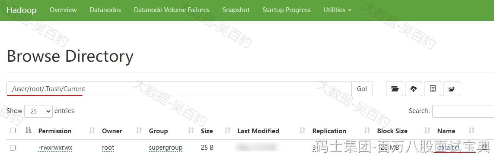

HDFS中误删文件可以尝试通过如下几种方式进行恢复找回数据。

## **通过Trash回收站机制**

HDFS中提供了类似window回收站的功能，当我们在HDFS中删除数据后，默认数据直接删除，如果开启了Trash回收站功能，数据删除时不会立即清除，而是会被移动到回收站目录中（/usr/${username}/.Trash/current），如果误删了数据，可以通过回收站进行还原数据，此外，我们还可以配置该文件在回收站多长时间后被清空。

按照如下步骤进行回收站配置即可。

1. **修改core-site.xml**

在HDFS各个节点上配置core-site.xml，加入如下配置：

|  |
| --- |
| ... ...  <!-- 回收站文件存活时长，单位分钟 -->  <property>  <name>fs.trash.interval</name>  <value>1</value>  </property>  <!-- 检查回收站间隔时间 -->  <property>  <name>fs.trash.checkpoint.interval</name>  <value>0</value>  </property>  ... ... |

以上参数“fs.trash.interval”默认值为0，表示禁用回收站功能，设置大于0的值表示开启回收站并指定了回收站中文件存活的时长（单位：分钟）。

“fs.trash.checkpoint.interval”参数表示检查回收站文件间隔时间，如果设置为0表示该值和“fs.trash.interval”参数值一样，要求该值配置要小于等于“fs.trash.interval”配置值。

将以上配置文件分发到其他HDFS节点上：

|  |
| --- |
| [root@node1 hadoop]# scp ./core-site.xml node2:`pwd`  [root@node1 hadoop]# scp ./core-site.xml node3:`pwd`  [root@node1 hadoop]# scp ./core-site.xml node4:`pwd`  [root@node1 hadoop]# scp ./core-site.xml node5:`pwd` |

2. **重启HDFS集群，测试回收站功能**

|  |
| --- |
| **#启动集群**  [root@node1 ~]# start-all.sh  **#上传文件到HDFS 根路径下**  [root@node5 ~]# hdfs dfs -put ./data.txt /  **#删除上传的data.txt文件**  [root@node5 ~]# hdfs dfs -rm -r /data.txt  INFO fs.TrashPolicyDefault: Moved: 'hdfs://mycluster/data.txt' to trash at: hdfs://mycluster/user/root/.Trash/Current/data.txt |

当执行删除命令后，可以看到数据被移动到“hdfs://mycluster/user/root/.Trash/Current/”目录下，通过HDFS WebUI也可看到对应的路径下文件。如果WebUI用户没有权限，可以通过给/user目录修改访问权限即可。

|  |
| --- |
| **#修改/user目录访问权限**  [root@node5 ~]# hdfs dfs -chmod -R 777 /user |

数据如下：

大约等待1分钟左右数据会自动从回收站中清空。如果想要还原数据需要手动执行命令将数据move移动到对应目录中。

|  |
| --- |
| [root@node5 ~]# hdfs dfs -mv /user/root/.Trash/Current/data.txt / |

**注意：只有通过HDFS shell操作命令将数据文件删除后，才会进入回收站，如果在HDFS WebUI中删除文件，这种删除操作不会进入到回收站。**

## **HDFS快照**

HDFS快照（Snapshot）是一个只读的时间点视图，用于记录特定目录在快照创建时的状态，快照可以帮助用户快速恢复被误删除或更改的数据，也可以用于重要数据备份、版本管理等场景。

下面以HDFS /mydata目录为例说明HDFS快照使用和数据恢复命令：

|  |
| --- |
| **#HDFS中创建/mydata目录**  [root@node1 ~]# hdfs dfs -mkdir /mydata  **#准备a.txt文件 ，vim a.txt**  zhangsan  lisi  wangwu  **#将a.txt文件上传至HDFS /mydata目录下**  [root@node1 ~]# hdfs dfs -put /root/a.txt /mydata/ |

- **启用快照功能**

要对一个目录使用快照，首先需要启用快照功能，这里对HDFS目录/mydata启用快照功能。

|  |
| --- |
| [root@node1 ~]# hdfs dfsadmin -allowSnapshot /mydata  Allowing snapshot on /mydata succeeded |

- **创建快照**

启用快照后，可以通过以下命令对该目录此刻数据状态创建快照。

|  |
| --- |
| **#注意：first\_snapshot为快照名称**  [root@node1 ~]# hdfs dfs -createSnapshot /mydata first\_snapshot  Created snapshot /mydata/.snapshot/first\_snapshot |

- **查看快照**

可以通过如下命令，列出某目录下创建的快照。

|  |
| --- |
| [root@node1 ~]# hdfs dfs -ls /mydata/.snapshot  Found 1 items  /mydata/.snapshot/first\_snapshot |

注意：.snapshot为一个隐藏文件，只能通过HDFS命令访问，不能通过HDFS WebUI查看到该目录。

- **恢复数据**

将HDFS中/mydata/目录下的a.txt数据文件删除，通过HDFS中创建的快照“first\_snapshot”进行回复。

|  |
| --- |
| **#删除HDFS中/mydata/a.txt文件**  [root@node1 ~]# hdfs dfs -rm /mydata/a.txt  **#查看/mydata/a.txt文件内容，文件已删除会报错**  [root@node1 ~]# hdfs dfs -cat /mydata/a.txt  cat: `/mydata/a.txt': No such file or directory  **#通过快照进行数据恢复，即：使用 -cp 命令将快照中的文件复制回原始位置或其他位置**  [root@node1 ~]# hdfs dfs -cp /mydata/.snapshot/first\_snapshot/a.txt /mydata/a.txt  **#查看恢复后的/mydata/a.txt文件内容**  [root@node1 ~]# hdfs dfs -cat /mydata/a.txt  zhangsan  lisi  wangwu |

- **删除快照**

如果快照不在需要，可以通过如下命令删除：

|  |
| --- |
| [root@node1 ~]# hdfs dfs -deleteSnapshot /mydata/ first\_snapshot  Deleted snapshot first\_snapshot under hdfs://mycluster/mydata |

- **停用目录快照功能**

当不再需要为某目录管理快照时，可以禁用快照功能。此外，如果快照功能没有关闭，对应的目录无法删除。

|  |
| --- |
| [root@node1 ~]# hdfs dfsadmin -disallowSnapshot /mydata  Disallowing snapshot on /mydata succeeded |

## **其他方式**

如果回收站和快照均无效，且没有备份，可以尝试使用DistCp命令，将丢失的数据从其他节点或集群复制到损坏的节点或集群中，或者尝试从数据源头重新生成丢失数据上传到HDFS中。
