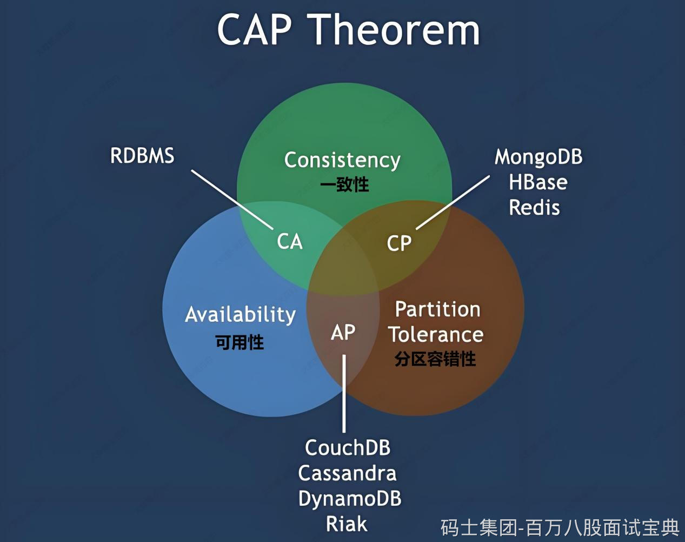
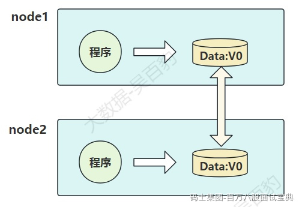
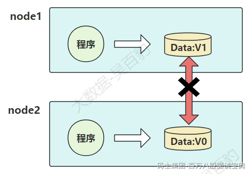

CAP理论最初由加州大学伯克利分校计算机学院一个名叫埃里克·布鲁尔的博士在一个学术论坛中提出来的一个假设，后经麻省理工学院的赛斯·吉尔伯特和南希·林奇在其论文中证明了这一假设，最终该理论成为分布式领域中的一个定理。

## **什么是CAP?**

CAP全称为Consistency(一致性)、Availability(可用性)和Partition Tolerance(分区容错性)，CAP理论指出在一个**分布式数据存储系统**中以上三项不能同时满足，最多满足以上三项中的两项。

- **Consistency(一致性)**

一致性是指“all nodes see the same data at the same time”，即：分布式系统中更新操作成功后，所有节点在同一时间的数据完全一致。

关于数据一致性又有强一致性（更新过的数据能被后续的访问都能看到）、弱一致性（容忍后续的部分或者全部都访问不到）、最终一致性（经过一段时间后要求能访问到更新后的数据）三种情况，CAP中的一致性是指强一致性。

- **Availability(可用性)**

可用性是指“Reads and writes always succeed”，即：分布式系统中相应服务一直可用且正常响应。

一般分布式系统中涉及到多个节点，任何一个节点的不稳定都会影响可用性，一个可用性好的分布式系统，不应该出现用户操作失败或者访问超时情况。

我们通常使用停机时间来衡量一个系统的可用性，如下：

|  |  |  |
| --- | --- | --- |
| **可用性分类** | **可用水平（%）** | **年可容忍停机时间** |
| 容错可用性 | 99.9999 | <1 min |
| 极高可用性 | 99.999 | <5 min |
| 具有故障自动恢复能力的可用性 | 99.99 | <53 min |
| 高可用性 | 99.9 | <8.8 h |

例如，淘宝的系统可用性可以达到5个9，意思是系统可用水平为99.999%，即全年停机不超过5min中。

- **Partition Tolerance(分区容错性)**

分区容错性是指“the system continues to operate despite arbitrary message loss or failure of part of the system”，即：分布式系统在网络中断、消息丢失情况下，可以正常工作。

分布式系统一般由多个节点组成，这些节点作为一个整体对外提供服务，当**分布式系统中一个或者几个节点宕机，其余机器还能正常满足系统对外提供服务**，或者**机器之间网络有问题导致分布式系统分割为独立的几个部分，各个部分还能维持分布式系统的运行**，这种情况说明分布式系统具有良好的分区容错性。这里所说的部分节点和独立的每个部分就是所说的分区。

## **CAP证明**

CAP理论中强调在一个系统中，C、A、P三项性质只能满足两项，即：每个系统依据其架构设计具备CP、AP或者CA倾向性，非分布式系统中，CA（系统满足数据一致性和可用性）不难理解。没有P就没有所谓的“分布式”概念，所以在分布式系统中P是必须的，下面我们以分布式系统为例（满足P）解释为什么不能同时满足C和A。

如上图，我们有两个节点（node1、node2）组成分布式系统，每个节点包含程序和数据，两个节点中的数据是同步相同的。这里可以定义node1和node2之间数据是否一样为一致性；外部对node1和node2的请求响应为可用性；node1和node2之间的网络环境为分区容错性。

假设某个时刻，node1和node2之间的网络断开了，在满足P的情况下，node1和node2作为独立部分都对外提供服务，那么此刻如果有用户向node1发送数据更新请求，node1中的数据v0被更新为v1，由于网络是断开的，node2节点中的数据依旧是v0，如果有用户向node2发送读取数据请求，那么此刻只有两种选择：

- 第一（AP）：牺牲数据一致性，保证数据可用性，响应给用户v0数据。
- 第二（CP）：牺牲可用性，保证数据一致性，等待网络连接恢复，数据同步一致后，响应给用户v1数据。

以上这个过程，证明了要满足分区容错性的分布式系统，只能在一致性和可用性两者中，选择其中一个。

## **CAP注意点**

通过CAP我们了解，一个系统无法同时满足一致性（C）、可用性(A)和分区容错性(P)。对于一个分布式系统来说，分区容错性(P)是一个基本要求，只能在CA两者之间做权衡，但并不意味着CA两者中一个一定不能存在。

如向HDFS中写入数据时，如果某些DataNode节点挂掉了但HDFS能正常对外提供数据写入服务（满足分区容错性P），这时要么选择AP（牺牲数据一致性，保证数据可用性），要么选择CP(牺牲可用性，保证数据一致性)，HDFS中选择了CP。但是在HDFS集群正常运行中（P没有发生），CA可以同时并存。

此外，CA（一致性和可用性）倾向的技术组件主要是RDBMS，如MySQL、Oracle。CP（一致性和分区容错性）倾向的技术组件有HDFS、HBase、Zookeeper。
