# 1 HDFS面试题

## 1.1 介绍HDFS架构原理？

HDFS 全称为Hadoop Distribute File System——分布式文件系统，主要是用于分布式存储数据，其设计思想是将大文件、大批量数据分布式存储在大量廉价的服务器上，以便于采取分而治之的方式对海量数据进行运算分析。

HDFS是一个主从（Master/Slaves）架构，由一个NameNode和一些DataNode组成，下图是HDFS架构：

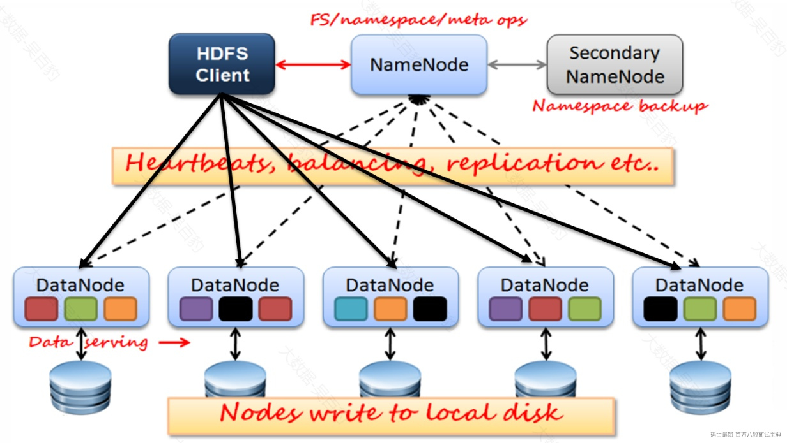

HDFS架构中包含NameNode、SecondaryNameNode、DataNode 、HDFS Client各角色，各个角色作用如下：

1. **NameNode**

NameNode就是主从架构中的Master，是HDFS中的管理者。HDFS中数据文件分布式存储在各个DataNode节点上，**NameNode维护和管理文件系统元数据**（空间目录树结构、文件、Block信息、访问权限），随着存储文件的增多，NameNode上存储的信息越来越多，NameNode主要通过两个组件实现元数据管理：fsimage（命名空间镜像文件）和editslog（编辑日志）。

- fsimage：HDFS文件系统元数据的镜像文件，包含了HDFS文件系统的所有目录和文件相关信息元数据，**例如：文件名称、路径、权限关系、副本数、修改、访问时间等**。**当HDFS启动后，首先会将磁盘中的fsimage加载到内存中，这样可以保证用户操作HDFS的高效和低延迟**。注意，fsimage中不记录每个block所在的DataNode信息，这些信息在每次HDFS启动时从DataNode重建，之后DataNode会周期性的通过心跳向NameNode报告block信息。
- edits：在NameNode运行期间，**客户端对HDFS的操作(文件或目录的创建、重命名、删除)日志**都会保存在edits文件中，edits文件保存在磁盘中。

当NameNode重启时，会将fsimage内容映射到内存中，然后再一条条执行edits文件中的操作就可以恢复到NameNode重启前的状态，HDFS中基于fsimage和edits两个组件做到不丢失数据。

总体来看：NameNode作用如下：

1. 完全基于内存存储文件元数据、目录结构、文件block的映射信息。
2. 提供文件元数据持久化/管理方案。
3. 提供副本放置策略。
4. 处理客户端读写请求。
5. **SecondaryNameNode**

随着操作HDFS的数据变多，久而久之就会造成edits文件变的很大，如果namenode重启后再一条条执行edits日志恢复状态就需要很长时间，导致重启速度慢，所以在NameNode运行的时候就需要将editslog和fsimage定期合并。这个合并操作就由SecondaryNameNode负责。

所以SecondaryNameNode作用就是辅助NameNode定期合并fsimage和editslog，并将合并后的fsimage推送给NameNode。

1. **DataNode**

DataNode是主从架构中的Slave,**DataNode存储文件block块**，Block在DataNode上以文件形式存储在磁盘上，包括2个文件，一个是数据文件本身，一个是元数据（包括block长度、block校验和、时间戳）。**当DataNode启动后会向NameNode进行注册，并汇报block列表信息**，后续会周期性（参数dfs.blockreport.intervalMsec决定，默认6小时）向NameNode上报所有的块信息。同时，DataNode会每隔3秒与NameNode保持心跳，如果超过10分钟NameNode没有收到某个DataNode的心跳，则认为该节点不可用。

总结，DataNode作用如下：

1. 基于本地磁盘存储block数据块。
2. 保存block的校验和数据保证block的可靠性。
3. 与NameNode保持心跳并汇报block列表信息。
4. **Client**

Client是操作HDFS的客户端，作用如下：

1. 与NameNode交互，获取文件block位置信息。
2. 与DataNode交互，读写文件block数据。
3. 文件上传时，负责文件切分成block并上传。
4. 可以通过client访问HDFS进行文件操作或管理HDFS。

## 1.2 fsimage和editslog合并流程？

HDFS 中NameNode管理通过fsimage和editslog来管理集群元数据，SecondaryNameNode会负责定期合并fsimage和editslog，以保证HDFS集群重启后快速恢复到之前状态。

下图是SecondaryNameNode进行fsimage和editslog合并整个流程图：

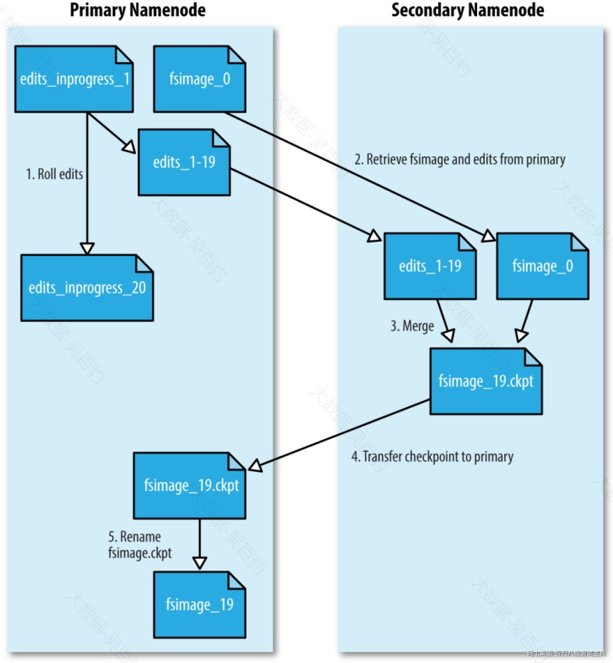

1. 当HDFS集群首次启动会在NameNode上创建空的fsimage，对HDFS的操作会记录到edits文件中。
2. 当开始进行editslog和fsimage合并时，SecondaryNameNode请求namenode生成新的editslog文件并向其中写日志。
3. SecondaryNameNode通过HTTP GET的方式从NameNode下载fsimage和edits文件到本地。
4. SecondaryNameNode将fsimage加载到自己的内存，并根据editslog更新内存中的fsimage信息，然后将更新完毕之后的fsimage写到磁盘上。
5. SecondaryNameNode通过HTTP PUT将新的fsimage文件发送到NameNode，NameNode将该文件保存为.ckpt的临时文件备用。
6. NameNode重命名该临时文件并准备使用，此时NameNode拥有一个新的fsimage文件和一个新的很小的editslog文件（可能不是空的，因为在SecondaryNameNode合并期间可能对元数据进行了读写操作）。
7. 后续SecondaryNameNode会按照以上步骤周期性进行editslog和fsimage的合并。

默认情况下，SecondaryNameNode每隔1小时执行edits和fsimage合并，通过参数“dfs.namenode.checkpoint.period”进行控制，默认该参数为3600s，即：1小时。

HDFS还会每分钟进行NameNode操作事务数量检查，如果editslog存储的事务(即操作数)到了1000000个也会进行editslog和fsimage的合并。每分钟检查操作事务参数通过dfs.namenode.checkpoint.check.period设置，默认60s，editslog操作数控制参数为dfs.namenode.checkpoint.txns，默认1000000。

## 1.3 HDFS 为什么Block块默认128M？

HDFS存储文件数据时会将文件切分成block，block大小由参数dfs.blocksize决定，在Hadoop1.x中block大小默认为64M ，在Hadoop2.x/3.x中每个block默认大小为128M。

HDFS中块大小不能设置太大，也不能设置太小。如果块设置太大会导致读取block时从磁盘传输数据的时间明显大于寻址时间，导致程序处理数据时变的非常慢；如果块设置过小，大量的块会占用NameNode大量内存来存储元数据，而NameNode内存有限，另一方面，文件块过小会导致寻址时间增大，导致程序一直在找block的开始位置。

在HDFS中平均查找block的寻址时间为10ms，经过测试，block文件寻址时间为block传输时间的1%时机器性能最佳，即block传输时间为1s（10ms/0.01=1000ms=1s）时机器性能最佳，目前磁盘的传输速率普遍为100MB/s，计算出最佳block大小为100M（100MB/s\*1s=100MB），由于在计算机领域，计算机使用的是二进制系统，而2的幂次方在二进制系统中具有简单而高效的表示方式，使用这些大小的数据更为方便，如：2的7次方是128，2的8次方是256，以此类推。所以block没有设置为100M，而是设置为了128M。**所以HDFS中块大小的设置主要取决于磁盘的传输速率，在实际生产中，如果磁盘传输速率为200MB/s时，一般设置block的大小为256M，如果磁盘传输速率为400MB/s时，一般设置block大小为512M。**

## 1.4 HDFS中Block副本存储策略？

HDFS中每个block块有3副本，由参数dfs.replication决定。三个副本会按照副本放置策略进行存储，如下图所示就是一个block有3副本存储情况。

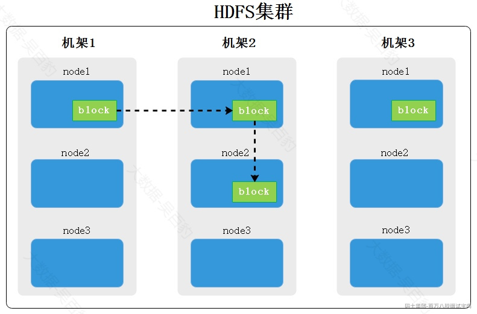

第一个副本：放置在上传文件的DataNode，也就是Client所在节点上；如果是集群外提交，则随机挑选一台磁盘不太满，CPU不太忙的节点。

第二个副本：放置在于第一个副本不同的机架的节点上。

第三个副本：与第二个副本相同机架的随机节点。

更多副本：随机节点存放。

这样存放的好处是避免一个机架出故障导致所有数据丢失，同一个机架上的节点通信网路会比不同机架节点通信更好，所有副本2与副本3在同一个机架中，这样节省带宽。如果block有更多的副本，则随机选择机架。

## 1.5 HDFS文件读写流程

1. **HDFS写文件流程**

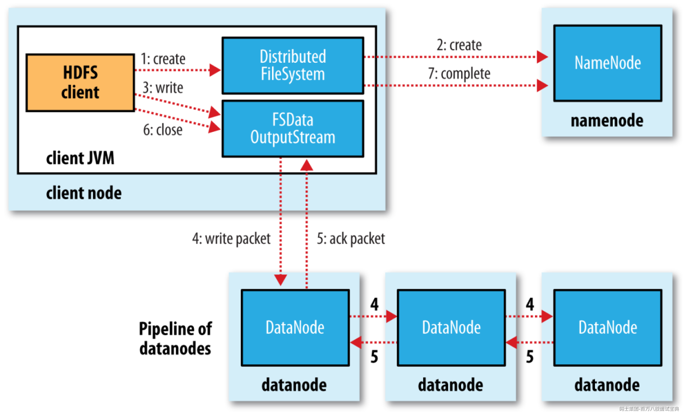

1. 客户端会创建DistributedFileSystem对象，DistributedFileSystem会发起对namenode的一个RPC连接，请求创建一个文件，不包含关于block块的请求。namenode会执行各种各样的检查，确保要创建的文件不存在，并且客户端有创建文件的权限。如果检查通过，namenode会创建一个文件（在edits中，同时更新内存状态），否则创建失败，客户端抛异常IOException。
2. NN在文件创建后，返回给HDFS Client可以开始上传文件块。
3. DistributedFileSystem返回一个FSDataOutputStream对象给客户端用于写数据。FSDataOutputStream封装了一个DFSOutputStream对象负责客户端跟datanode以及namenode的通信。
4. 客户端中的FSDataOutputStream对象将数据切分为小的packet数据包（64kb，core-default.xml：file.client-write-packet-size默认值65536），并写入到一个内部队列（“数据队列”）。DataStreamer会读取其中内容，并请求namenode返回一个datanode列表来存储当前block副本。列表中的datanode会形成管线，DataStreamer将数据包发送给管线中的第一个datanode，第一个datanode将接收到的数据发送给第二个datanode，第二个发送给第三个，依次类推。
5. FSDataOutputStream维护着一个数据包的队列，这的数据包是需要写入到datanode中的，该队列称为确认队列。当一个数据包在管线中所有datanode中写入完成，就从ack队列中移除该数据包。如果在数据写入期间datanode发生故障，则执行以下操作
6. 关闭管线，把确认队列中的所有包都添加回数据队列的最前端，以保证故障节点下游的datanode不会漏掉任何一个数据包。
7. 为存储在另一正常datanode的当前数据块指定一个新的标志，并将该标志传送给namenode，以便故障datanode在恢复后可以删除存储的部分数据块。
8. 从管线中删除故障数据节点并且把余下的数据块写入管线中另外两个正常的datanode。namenode在检测到副本数量不足时，会在另一个节点上创建新的副本。
9. 后续的数据块继续正常接受处理。
10. 在一个块被写入期间可能会有多个datanode同时发生故障，但非常少见。只要设置了dfs.replication.min的副本数（默认为1），写操作就会成功，并且这个块可以在集群中异步复制，直到达到其目标副本数（dfs.replication默认值为3）。
11. 当block传输完成，DN会向NN汇报block信息，同时Client继续传输下一个block，如果有多个block，则会反复从步骤4开始执行。
12. 当客户端完成了数据的传输，调用数据流的close方法。该方法将数据队列中的剩余数据包写到datanode的管线并等待管线的确认。
13. 客户端收到管线中所有正常datanode的确认消息后，通知namenode文件写入成功。
14. **HDFS读文件流程**

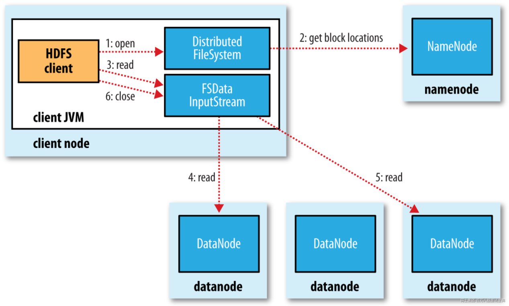

1. 客户端通过FileSystem对象的open方法打开希望读取的文件，DistributedFileSystem对象通过RPC调用namenode，以确保文件起始位置。对于每个block，namenode返回存有该副本的datanode地址。这些datanode根据它们与客户端的距离来排序。如果客户端本身就是一个datanode，并保存有相应block一个副本，会从本地读取这个block数据。
2. DistributedFileSystem返回一个FSDataInputStream对象给客户端读取数据。该对象管理着datanode和namenode的I/O，用于给客户端使用。客户端对这个输入调用read方法，存储着文件起始几个block的datanode地址的DFSInputStream连接距离最近的datanode。通过对数据流反复调用read方法，可以将数据从datnaode传输到客户端。到达block的末端时，DFSInputSream关闭与该datanode的连接，然后寻找下一个block的最佳datanode。客户端只需要读取连续的流，并且对于客户端都是透明的。
3. 客户端从流中读取数据时，block是按照打开DFSInputStream与datanode新建连接的顺序读取的。它也会根据需要询问namenode来检索下一批数据块的datanode的位置。一旦客户端完成读取，就close掉FSDataInputStream的输入流。
4. 在读取数据的时候如果DFSInputStream在与datanode通信时遇到错误，会尝试从这个块的一个最近邻datanode读取数据。同时也记住故障datanode，保证以后不会反复读取该节点上后续的block。DFSInputStream也会通过校验和确认从datanode发来的数据是否完整。如果发现有损坏的块，DFSInputStream会尝试从其他datanode读取其副本并通知namenode。
5. Client下载完block后会验证DN中的MD5，保证块数据的完整性。

## 1.6 HDFS中常用的命令有哪些？

hdfs 命令使用时可以使用“hadoop fs + cmd”或者“hdfs dfs + cmd” 这种方式，其中cmd常用命令如下：

- -ls : 查看HDFS中某个目录下的文件信息。
- -mkdir:在HDFS中创建目录，还可跟上-p来创建多级目录。
- -moveFromLocal:将文件从本地剪切到HDFS目录中。
- -cat:显示HDFS文件内容。
- -appendToFile：追加一个文件到已经存在的文件末尾。
- -chmod:给文件赋值权限，文件系统中的用法一样。
- -copyFromLocal：从本地文件系统中拷贝文件到HDFS路径去
- -copyToLocal:从HDFS拷贝文件或者目录到本地。
- -cp : 从HDFS的一个路径拷贝到HDFS的另一个路径。
- -mv:在HDFS目录中移动文件，将文件移动到某个HDFS目录中。
- -get：等同于copyToLocal，将文件从HDFS中下载文件到本地
- -getmerge：合并下载多个文件，比如HDFS的目录 /hello4下有多个文件:a.txt,b.txt,c.txt...,可以通过此命令，将数据合并下载到本地某个目录。
- -put：等同于copyFromLocal，将本地文件复制上传到HDFS中。
- -tail：显示一个文件最后1kb数据到控制台。
- -rm：删除文件或文件夹。可以加上 -r来递归删除目录下的所有数据。.
- -rmr：删除空目录，目录必须是空目录才可以。
- -du:统计文件夹的大小信息。
- -setrep：设置HDFS中文件的副本数量。

## 1.7 NameNode HA 实现原理？

NameNode中存储了HDFS中所有元数据信息（包括用户操作元数据和block元数据），在NameNode HA中，当Active NameNode(ANN)挂掉后，StandbyNameNode(SNN)要及时顶上，这就需要将所有的元数据同步到SNN节点。如向HDFS中写入一个文件时，如果元数据同步写入ANN和SNN，那么当SNN挂掉势必会影响ANN，所以元数据需要异步写入ANN和SNN中。如果某时刻ANN刚好挂掉，但却没有及时将元数据异步写入到SNN也会引起数据丢失，所以向SNN同步元数据需要引入第三方存储，在HA方案中叫做“共享存储”。每次向HDFS中写入文件时，需要将edits log同步写入共享存储，这个步骤成功才能认定写文件成功，然后SNN定期从共享存储中同步editslog，以便拥有完整元数据便于ANN挂掉后进行主备切换。

HDFS将Cloudera公司实现的QJM(Quorum Journal Manager)方案作为默认的共享存储实现。在QJM方案中注意如下几点：

- 基于QJM的共享存储系统主要用于保存Editslog,并不保存FSImage文件，FSImage文件还是在NameNode本地磁盘中。
- QJM共享存储采用多个称为JournalNode的节点组成的JournalNode集群来存储EditsLog。每个JournalNode保存同样的EditsLog副本。
- 每次NameNode写EditsLog时，除了向本地磁盘写入EditsLog外，也会并行的向JournalNode集群中每个JournalNode发送写请求，只要大多数的JournalNode节点返回成功就认为向JournalNode集群中写入EditsLog成功。
- 如果有2N+1台JournalNode，那么根据大多数的原则，最多可以容忍有N台JournalNode节点挂掉。

NameNode HA 实现原理图如下：

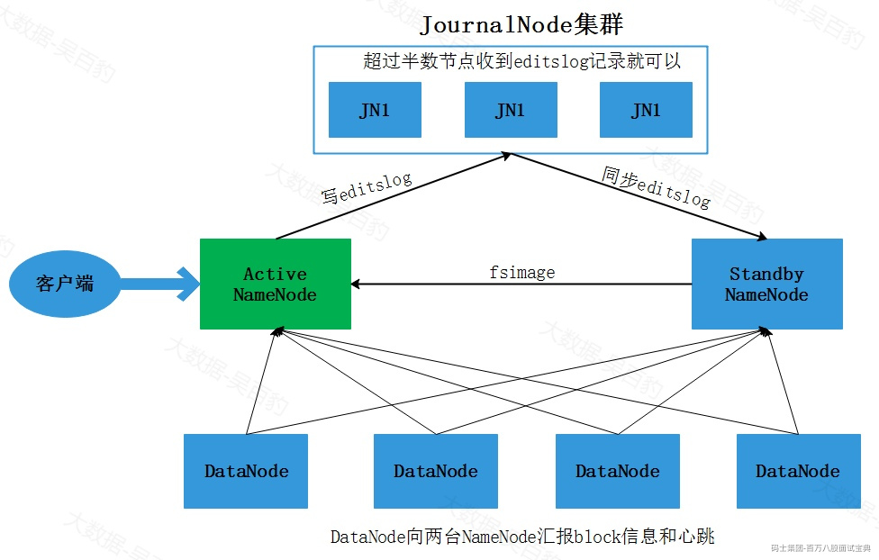

当客户端操作HDFS集群时，Active NameNode 首先把 EditLog 提交到 JournalNode 集群，然后 Standby NameNode 再从 JournalNode 集群定时同步 EditLog。当处 于 Standby 状态的 NameNode 转换为 Active 状态的时候，有可能上一个 Active NameNode 发生了异常退出，那么 JournalNode 集群中各个 JournalNode 上的 EditLog 就可能会处于不一致的状态，所以首先要做的事情就是让 JournalNode 集群中各个节点上的 EditLog 恢复为一致，然后Standby NameNode会从JournalNode集群中同步EditsLog，然后对外提供服务。

**注意：在NameNode HA中不再需要SecondaryNameNode角色，该角色被StandbyNameNode替代。**

通过Journal Node实现NameNode HA时，可以手动将Standby NameNode切换成Active NameNode，也可以通过自动方式实现NameNode切换。

上图需要手动进行切换StandbyNamenode为Active NameNode，对于高可用场景时效性较低，那么可以通过zookeeper进行协调自动实现NameNode HA，实现代码通过Zookeeper来检测Activate NameNode节点是否挂掉，如果挂掉立即将Standby NameNode切换成Active NameNode，这种方式也是生产环境中常用情况。其原理如下：

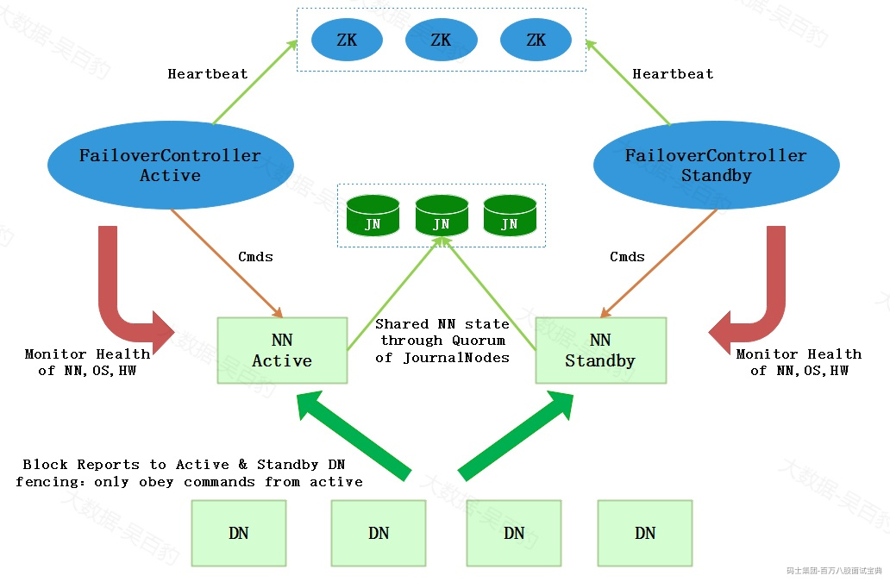

上图中引入了zookeeper作为分布式协调器来完成NameNode自动选主，以上各个角色解释如下：

- AcitveNameNode：主 NameNode，只有主NameNode才能对外提供读写服务。
- Secondby NameNode：备用NameNode，定时同步Journal集群中的editslog元数据。
- ZKFailoverController：ZKFailoverController 作为独立的进程运行，对 NameNode 的主备切换进行总体控制。ZKFailoverController 能及时检测到 NameNode 的健康状况，在主 NameNode 故障时借助 Zookeeper 实现自动的主备选举和切换。
- Zookeeper集群：分布式协调器，NameNode选主使用。
- Journal集群：Journal集群作为共享存储系统保存HDFS运行过程中的元数据，ANN和SNN通过Journal集群实现元数据同步。
- DataNode节点：除了通过共享存储系统共享 HDFS 的元数据信息之外，主 NameNode 和备 NameNode 还需要共享 HDFS 的数据块和 DataNode 之间的映射关系。DataNode 会同时向主 NameNode 和备 NameNode 上报数据块的位置信息。

## 1.8 NameNode HA 主备切换流程

NameNode 主备切换主要由 ZKFailoverController、HealthMonitor 和 ActiveStandbyElector 这 3 个组件来协同实现：

- ZKFailoverController 作为 NameNode 机器上一个独立的进程启动 (在 hdfs 集群中进程名为 zkfc)，启动的时候会创建 HealthMonitor 和 ActiveStandbyElector 这两个主要的内部组件，ZKFailoverController 在创建 HealthMonitor 和 ActiveStandbyElector 的同时，也会向 HealthMonitor 和 ActiveStandbyElector 注册相应的回调方法。
- HealthMonitor 主要负责检测 NameNode 的健康状态，如果检测到 NameNode 的状态发生变化，会回调 ZKFailoverController 的相应方法进行自动的主备选举。
- ActiveStandbyElector 主要负责完成自动的主备选举，内部封装了 Zookeeper 的处理逻辑，一旦 Zookeeper 主备选举完成，会回调 ZKFailoverController 的相应方法来进行 NameNode 的主备状态切换。

NameNode主备切换流程如下:

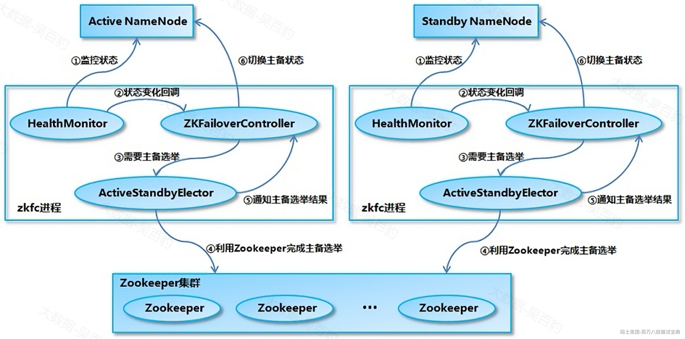

1. HealthMonitor 初始化完成之后会启动内部的线程来定时调用对应 NameNode 的 HAServiceProtocol RPC 接口的方法，对 NameNode 的健康状态进行检测。
2. HealthMonitor 如果检测到 NameNode 的健康状态发生变化，会回调 ZKFailoverController 注册的相应方法进行处理。
3. 如果 ZKFailoverController 判断需要进行主备切换，会首先使用 ActiveStandbyElector 来进行自动的主备选举。
4. ActiveStandbyElector 与 Zookeeper 进行交互完成自动的主备选举。
5. ActiveStandbyElector 在主备选举完成后，会回调 ZKFailoverController 的相应方法来通知当前的 NameNode 成为主 NameNode 或备 NameNode。
6. ZKFailoverController 调用对应 NameNode 的 HAServiceProtocol RPC 接口的方法将 NameNode 转换为 Active 状态或 Standby 状态。

## 1.9 HDFS HA中如何防止脑裂问题的？

当网络抖动时，ZKFC检测不到Active NameNode,此时认为NameNode挂掉了，因此将Standby NameNode切换成Active NameNode，而旧的Active NameNode由于网络抖动，接收不到zkfc的切换命令，此时两个NameNode都是Active状态，这就是脑裂问题。那么HDFS HA中如何防止脑裂问题的呢?

HDFS集群初始启动时，Namenode的主备选举是通过 ActiveStandbyElector 来完成的，ActiveStandbyElector 主要是利用了 Zookeeper 的写一致性和临时节点机制，具体的主备选举实现如下：

1. **创建锁节点**

如果 HealthMonitor 检测到对应的 NameNode 的状态正常，那么表示这个 NameNode 有资格参加 Zookeeper 的主备选举。如果目前还没有进行过主备选举的话，那么相应的 ActiveStandbyElector 就会发起一次主备选举，尝试在 Zookeeper 上创建一个路径为/hadoop-ha/${dfs.nameservices}/ActiveStandbyElectorLock 的临时节点 (${dfs.nameservices} 为 Hadoop 的配置参数 dfs.nameservices 的值，下同)，Zookeeper 的写一致性会保证最终只会有一个 ActiveStandbyElector 创建成功，那么创建成功的 ActiveStandbyElector 对应的 NameNode 就会成为主 NameNode，ActiveStandbyElector 会回调 ZKFailoverController 的方法进一步将对应的 NameNode 切换为 Active 状态。而创建失败的 ActiveStandbyElector 对应的NameNode成为备用NameNode，ActiveStandbyElector 会回调 ZKFailoverController 的方法进一步将对应的 NameNode 切换为 Standby 状态。

1. **注册 Watcher 监听**

不管创建/hadoop-ha/${dfs.nameservices}/ActiveStandbyElectorLock 节点是否成功，ActiveStandbyElector 随后都会向 Zookeeper 注册一个 Watcher 来监听这个节点的状态变化事件，ActiveStandbyElector 主要关注这个节点的 NodeDeleted 事件。

1. **自动触发主备选举**

如果 Active NameNode 对应的 HealthMonitor 检测到 NameNode 的状态异常时， ZKFailoverController 会主动删除当前在 Zookeeper 上建立的临时节点/hadoop-ha/${dfs.nameservices}/ActiveStandbyElectorLock，这样处于 Standby 状态的 NameNode 的 ActiveStandbyElector 注册的监听器就会收到这个节点的 NodeDeleted 事件。收到这个事件之后，会马上再次进入到创建/hadoop-ha/${dfs.nameservices}/ActiveStandbyElectorLock 节点的流程，如果创建成功，这个本来处于 Standby 状态的 NameNode 就选举为主 NameNode 并随后开始切换为 Active 状态。

当然，如果是 Active 状态的 NameNode 所在的机器整个宕掉的话，那么根据 Zookeeper 的临时节点特性，/hadoop-ha/${dfs.nameservices}/ActiveStandbyElectorLock 节点会自动被删除，从而也会自动进行一次主备切换。

以上过程中，Standby NameNode成功创建 Zookeeper 节点/hadoop-ha/${dfs.nameservices}/ActiveStandbyElectorLock 成为Active NameNode之后，还会创建另外一个路径为/hadoop-ha/${dfs.nameservices}/ActiveBreadCrumb 的持久节点，这个节点里面保存了这个 Active NameNode 的地址信息。Active NameNode 的ActiveStandbyElector 在正常的状态下关闭 Zookeeper Session 的时候 (注意由于/hadoop-ha/${dfs.nameservices}/ActiveStandbyElectorLock 是临时节点，也会随之删除)会一起删除节点/hadoop-ha/${dfs.nameservices}/ActiveBreadCrumb。但是如果 ActiveStandbyElector 在异常的状态下 Zookeeper Session 关闭 (比如 Zookeeper 假死)，那么由于/hadoop-ha/${dfs.nameservices}/ActiveBreadCrumb 是持久节点，会一直保留下来。后面当另一个 NameNode 选主成功之后，会注意到上一个 Active NameNode 遗留下来的这个节点，从而会回调 ZKFailoverController 的方法对旧的 Active NameNode 进行隔离（fencing）操作以避免出现脑裂问题，fencing操作会通过SSH将旧的Active NameNode进程尝试转换成Standby状态，如果不能转换成Standby状态就直接将对应进程杀死。

## 1.10 HDFS小文件处理

HDFS中存储小文件时，每个小文件都会对应一个block块，每个block的元数据都会占用NameNode内存，当系统中存储大量小文件时，这些文件的元数据会迅速耗尽NameNode节点的内存资源，从而影响HDFS正常使用，为了解决这个问题，Hadoop Archives(HAR)被引入。

HAR是一种有效的存档工具，能够将多个小文件归档成一个文件，并且在归档后仍然保持了对每个文件的透明访问。通过将文件存储为HDFS块的方式，HDFS存档文件能够降低NameNode内存的使用率，从而减轻了存储大量小文件所带来的压力。

注意：假设小文件数据为1M ，那么会对应到一个block上，但是实际占用磁盘空间是1M ，HAR可以将所有小文件合并归档为一个大的文件，形成少量block存储这些数据，从而减少元数据占用空间。

1. **HAR文件归档**

HAR使用语法如下：

- -archiveName ：指定要创建的归档文件夹目录的名字，archive的名字扩展名必须是\*.har，例如：test.har。
- -p：指定要存档文件的父路径，例如：/a/b/c、/a/b/d两个路径下的文件要被归档，那么-p可以指定为/a/b 即：/a/b/c、/a/b/d的父路径，然后<src>再分别指定为c或者d。
- src：指定待归档小文件路径，可以指定多个，空格隔开即可。
- dest：指定归档文件输出路径。

以上HAR命令会转换成MapReduce任务进行文件归档处理，所以需要Yarn环境。按照如下步骤进行文件归档测试。

1. **在HDFS中创建/a/b/c 和 /a/b/d 两个路径，并向两个路径中分别创建小文件**

1. **进行小文件归档**

以上“\_SUCCESS”是标记文件；“\_index”和“\_masterindex”是索引文件，通过索引文件可以找到对应的原文件；“part-0”是多个原小文件的集合文件。

通过HDFS WebUI查看test.har目录下的文件：

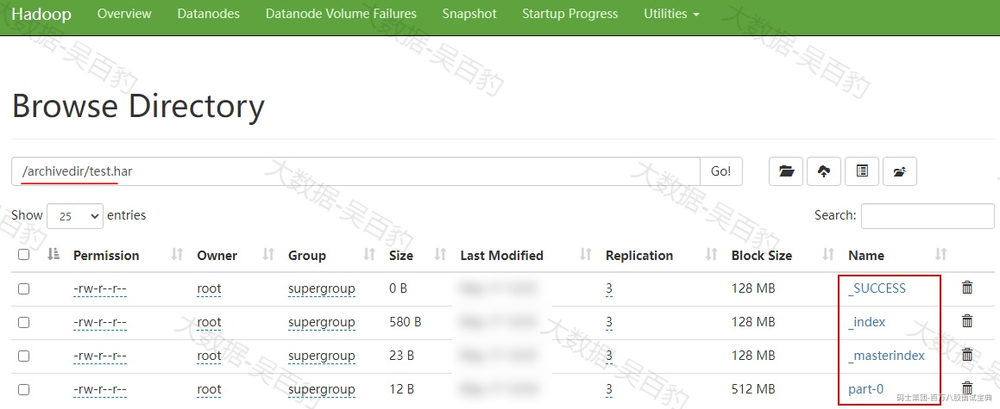

也可以通过hadoop archive命令归档一个目录下的文件：

1. **HAR查询归档文件**

可以正常使用HDFS 命令查询归档文件中的数据，如下命令：

也可以通过har uri访问协议，访问到数据原来的文件，har uri 访问写法如下：

如下是通过har uri协议访问har原有文件的命令操作：

注意：har中获取到的原文件信息是根据har中索引文件获取到的，与归档前的源文件目录没有关系

1. **HAR提取归档文件**

可以使用“hdfs dfs -cp <haruri har file> <distdir>” 来将归档文件提取到新的文件目录中。具体操作如下：

## 1.11 HDFS NameNode元数据丢失如何处理？

NameNode元数据丢失主要指当NameNode上元数据出现意外删除情况，如何进行集群恢复。

启动HDFS集群后，通过HDFS WebUI查看Active NameNode节点，并kill对应进程，删除该NameNode节点元数据目录。

当kill掉对应的DataNode进程后，由于集群是HA模式，会自动切换其他Standby NameNode为Active状态。

然后，重启刚kill节点上的NameNode，由于删除了对应的元数据目录导致元数据目录丢失，会报错：

解决以上这个错误，只需要将其他NameNode节点上对应的元数据目录复制过来即可，假设当前NameNode在被kill之前有部分元数据没来得及同步给其他的StandbyNameNode，有可能造成数据丢失。具体操作如下：

启动NameNode进程后，该节点为Standby状态，可以参与正常的Active NameNode切换。

## 1.12 HDFS DataNode 数据丢失如何处理？

DataNode数据丢失处理是指当DataNode节点上的数据目录被意外删除后导致HDFS集群启动异常。默认在HDFS中数据存储会有3个副本，3个副本分别存在不同的DataNode节点上，每个DataNode节点存储数据的目录由hdfs-site.xml文件中的参数hadoop.tmp.dir来配置，默认为file://${hadoop.tmp.dir}/dfs/data 路径。

当意外删除HDFS数据所在DataNode节点数据时，由于HDFS集群中有该数据副本，所以重启HDFS集群后，这些删除的数据会自动复制还原回来。但如果所有DataNode节点上的数据目录被意外删除，重启HDFS集群后HDFS集群会进入安全模式，如下：

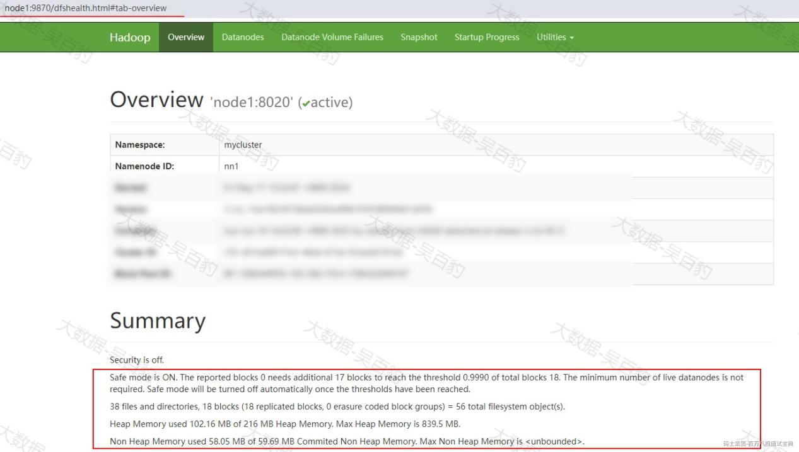

解决以上问题需要先退出安全模式，然后执行“hdfs fsck”工具（fsck用于检查HDFS文件系统的完整性和一致性）查看并删除缺失block的数据文件，这样会导致这些文件数据丢失。

具体测试如下：

1. **在node3~node5 DataNode节点上删除数据目录**

1. **重启HDFS集群**

重启HDFS集群后，可以看到集群进入到安全模式。

1. **退出安全模式**

执行如下命令查看和退出HDFS 安全模式。

当执行如下命令后，在HDFS WebUI中可以看到如下block 丢失信息：

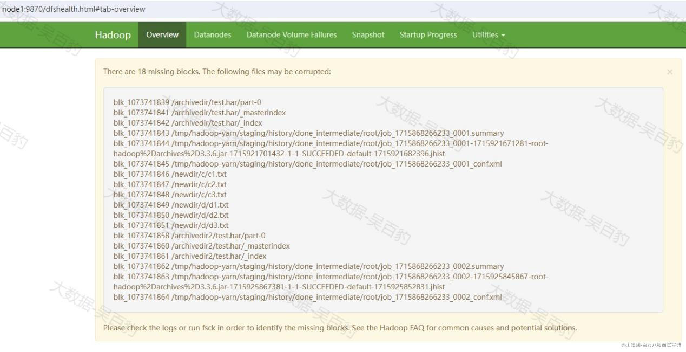

1. **检查并删除缺失block的数据文件**

使用fsck工具检查并删除缺失block数据文件。

注意：通过“hdfs fsck / -delete”命令会将缺失block的文件删除掉，导致这些文件丢失。

## 1.13 HDFS 纠删码原理、策略及优缺点

在HDFS中存储的数据默认有3副本，这些副本存储在不同的节点上保证数据的可靠性，这种可靠性保证的代价是有很高的存储开销，例如：3副本存储会带来额外2份冗余存储，为了节省存储空间又能保证数据可靠性，Hadoop3.x 引入了纠删码技术（Erasure Coding）,相比于传统的副本复制方式，纠删码技术可以节省50%的存储空间。

Erasurecoding纠删码技术简称EC ，是一种编码容错技术，最早用于通信行业中数据传输中的数据恢复，其原理是通过在原始数据中加入新的校验数据，使得各个部分的数据产生关联性，在一定范围数据出错的情况下，通过纠删码技术都可以进行恢复。

1. **纠删码原理**

纠删码有不同种类，其中里德所罗门码（Reed-SolomonCodes,RS）比较常见，该编码使用复杂的线性代数运算来生成多个奇偶检验块，可以容忍多个块故障，RS需要配置2个参数：k和m，如下图，RS(k,m)通过将k个数据块的向量（Data）与生成矩阵(GT)相乘来实现，从而得到一个码字（codeword）向量，该向量由k个数据块和m个校验块组成，如果一个数据块丢失，可以用GT和codeword逆运算恢复出丢失的数据块，RS(k,m)最多容忍m个块（包括数据块和校验块）丢失。

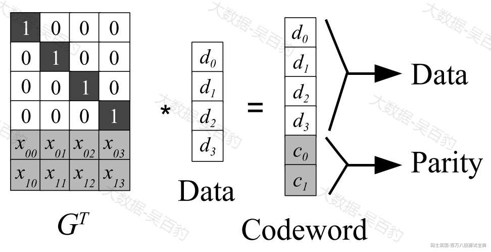

举个类似的例子，如下GT为2行4列矩阵，Data为4行1列矩阵，两者相乘得到2行1列的parity结果，当Data或者Parity中任意两个数据丢失，都可以通过逆运算方式重新获取丢失的数据块。

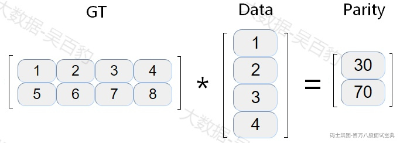

在HDFS中数据以block存储，每个block默认为128M，上图中的data实际上是将Block划分成细粒度的数据矩阵单元（cell），每个数据矩阵称为单元条带（stripes of cells），单元条带是在一组block块中轮询方式读取写出形成。

1. **HDFS 纠删码策略**

可以通过命令“hdfs ec -listPolicies”来查询HDFS中支持的纠删码策略，如下：

对以上纠删码策略解释如下：

- **RS-10-4-1024k**

使用RS编码，每10个数据单元（cell）生成4个校验单元，共14个单元，只要14个单元中任意10个单元存在，就可以保证数据容错，每个数据单元大小为1024\*1024。要求集群中有14个DataNode。

- **RS-3-2-1024k**

使用RS编码，每3个数据单元（cell）生成2个校验单元，共5个单元，只要5个单元中任意3个单元存在，就可以保证数据容错，每个数据单元大小为1024\*1024。要求集群中有5个DataNode。

- **RS-6-3-1024k**

使用RS编码，HDFS中使用纠删码后，默认的编码方式。每6个数据单元（cell）生成3个校验单元，共9个单元，只要9个单元中任意6个单元存在，就可以保证数据容错，每个数据单元大小为1024\*1024。要求集群中有9个DataNode。

- **RS-LEGACY-6-3-1024k**

与RS-6-3-1024类似，使用相对旧的算法实现。要求集群中有9个DataNode。

- **XOR-2-1-1024k**

使用XOR算法，每2个数据单元（cell）生成1个校验单元，共3个单元，只要3个单元中任意2个单元存在，就可以保证数据容错，每个数据单元大小为1024\*1024要求集群有3个机架。

1. **纠删码使用**

在HDFS中如果想要使用纠删码需要对相应的HDFS目录进行设置，当给某个目录设置了纠删码后，所有存储在当前目录下的文件都会执行对应的策略，默认只有“RS-6-3-1024k”策略开启，可以给目录直接设置该策略，如果想要使用其他策略需要开启。操作命令如下：

注意：这里使用对应策略需要设置DataNode节点符合各个策略要求的DataNode节点，然后可以通过删除对应个数的DataNode数据存储目录来测试纠删码策略，当删除DataNode上数据块个数大于对应策略要求的最少数据块时会导致数据丢失。这里由于只有3个DataNode节点不再测试。

1. **纠删码优缺点**

纠删码优势可以减少数据存储空间的消耗，但同时会带来网络带宽和CPU资源的消耗，当进行数据恢复时需要去其他节点获取数据块和校验块然后通过大量CPU计算还原数据，所以一般冷数据存储可以采用纠删码存储，可以大大节省存储空间，但对于线上集群建议使用副本容错机制。

## 1.14 HDFS异构存储类型及存储策略

在Hadoop中，异构存储指的是根据数据的使用模式和特性，将数据分配到不同类型或特性的存储介质上。在企业中，HDFS中的数据根据使用频繁程度分为不同类型，这些类型包括热、温、冷数据，我们可以通过异构存储将不同类型数据根据存储策略存储在不同的介质中，例如：将不活跃或冷数据存储在成本较低的设备上(机械硬盘)，而将活跃数据存储在性能更高的设备上(固态硬盘SSD)，这样的存储策略通过平衡性能、成本和数据访问模式，提高了数据存储的效率和经济性。

异构存储是Hadoop2.6.0版本引入的特性，使得在存储数据时可以更好地利用不同存储介质的优势，从而提高整个系统的性能和灵活性。

1. **HDFS中数据存储类型**

- DISK：DISK存储类型表示数据存储在普通机械硬盘上,默认的存储类型。
- ARCHIVE：ARCHIVE存储类型通常用于归档数据，这些归档数据通常以压缩文件方式长期存储，具备存储密度高、不经常访问的特点，例如：历史备份数据。这类数据存储介质一般可选普通磁盘。
- SSD：SSD存储类型表示数据存储在固态硬盘上，相比于传统的机械硬盘，SSD具有更快的读写速度和更低的访问延迟。
- RAM\_DISK：RAM\_DISK存储类型表示数据存储在内存中模拟的硬盘中,由于内存的读写速度非常快，因此RAM\_DISK存储类型通常用于对数据访问速度要求非常高的场景。

我们可以在hdfs-site.xml中配置dfs.datanode.data.dir配置项给DataNode配置数据存储目录，这些目录可以配置多个并可以指定以上不同的存储类型。**当向HDFS中写入数据时，哪些数据存储在对应的存储类型中就需要根据HDFS中目录的存储策略来决定，这些存储策略需要用户来执行对应命令来指定。**

1. **HDFS存储策略**

以上表格有如下几点解释：

- PROVIDED存储策略指的是在HDFS之外存储数据。LAZY\_PERSIST存储策略指Block副本首先写在RAM\_DISK中，然后惰性的保存在磁盘中。
- #3列表示该策略下Block的分布，例如：“[SSD, DISK]”表示第一个block块存储在SSD存储类型中，其他block块存储在 DISK 存储类型中。
- 关于#4列和#5列的解释如下：当#3列数据存储介质有足够的空间时，block存储按照#3指定的进行存储，如果空间不足，创建新文件和数据副本将按照#4和#5列中指定的介质存储。
- **HOT存储策略是默认的存储策略**。常用的存储策略有COLD、WARN、HOT、ONE\_SSD、ALL\_SSD几种。

## 1.15 HDFS DataNode动态扩缩容步骤

HDFS集群已有DataNode节点不能满足数据存储需求，支持在原有集群基础上动态添加新的DataNode节点，这就是HDFS动态扩容。

我们希望将一个DataNode节点在HDFS中“退役”下线，HDFS也同样支持动态将DataNode下线，这就是HDFS动态缩容。

1. **动态扩容DataNode**

按照如下步骤操作即可。

1. **将node1节点配置好的hadoop 安装包发送到node6节点**

1. **node6节点配置Hadoop环境变量**

1. **node6节点启动DataNode**

在node6节点执行如下命令启动DataNode：

1. **在各个节点白名单中加入node6**

在node1~node6各个节点 $HADOOP\_HOME/etc/whitelist白名单中加入node6。各个节点whitelist 内容如下：

1. **刷新NameNode**

在任意NameNode节点执行如下命令重新刷新HDFS 节点：

执行如上命令后，可以通过HDFS WebUI看到node6 DataNode节点加入了集群中：

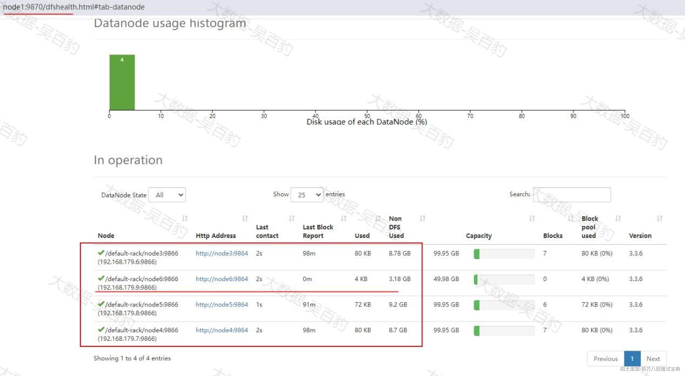

1. **测试数据上传**

在node6节点创建HDFS目录 /test2 并将data.txt上传到该目录下：

通过WebUI我们发现刚上传的data.txt 副本分布如下，优先将数据副本存储在HDFS客户端node6上，集群DataNode动态扩容完成。

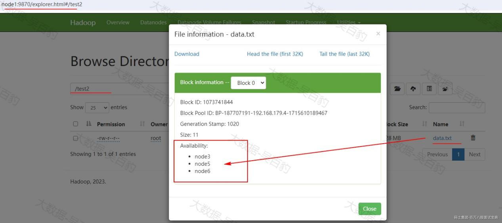

向HDFS集群中加入新的DataNode后，可能会导致新DataNode节点上数据分布少，其他DataNode节点数据分布多，这样导致集群整体负载不均衡，我们可以通过命令脚本对HDFS中数据进行负载均衡操作。

注意：建议在负载不高的一台节点上执行数据负载均衡操作。

1. **HDFS动态缩容**

我们希望将一个DataNode节点在HDFS中“退役”下线，HDFS也同样支持动态将DataNode下线，这就是HDFS动态缩容。

这里将node6 DataNode进行下线演示，可以按照如下步骤操作即可。

1. **配置各个节点的黑白名单**

在各个Hadoop节点上$HADOOP\_HOME/etc/hadoop路径下配置blacklist和whitelist，将node6节点从whitelist中删除，加入到blacklist中。

blacklist:

whitelist:

将以上blacklist和whitelist分发到其他Hadoop节点上。

1. **刷新NameNode**

在任意NameNode节点执行如下命令重新刷新HDFS 节点：

执行如上命令后，可以通过HDFS WebUI看到node6 DataNode节点在集群中下线：

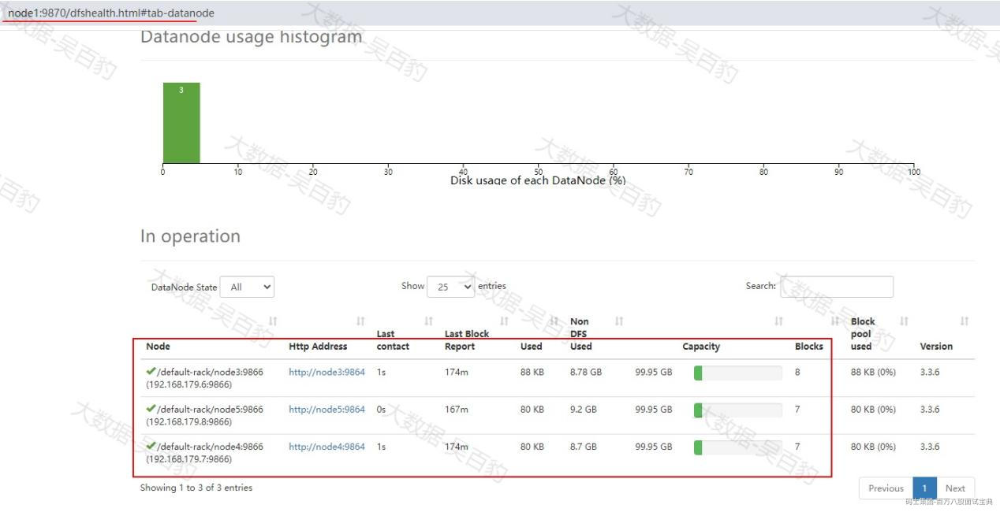

## 1.16 HDFS数据迁移场景及实现

HDFS数据迁移是指将Hadoop分布式文件系统（HDFS）中的数据从一个位置或一个集群移动到另一个位置或另一个集群的过程。数据迁移通常是一种大规模的操作，可能涉及跨机房、跨集群，并且需要考虑到数据迁移规模的不同，导致整个数据迁移的周期也会有所不同。

在HDFS中，数据迁移通常用于以下几种场景：

1. 冷热集群数据同步、分类存储：将冷热数据从一个集群移动到另一个集群，以便更有效地管理和存储不同类型的数据。例如，将不经常访问的冷数据移动到成本更低的存储层，而将热数据保留在性能更高的存储层上。
2. 集群数据整体搬迁：当公司的业务发展导致当前服务器资源紧张时，可能需要将整个HDFS集群的数据迁移到另一个机房或集群，以利用更多资源或降低成本。
3. 数据的准实时同步：确保数据的双备份可用性，即将数据实时同步到另一个集群，以便在主集群发生故障时能够无缝切换到备份集群。

进行HDFS 数据迁移时我们可以使用DistCp工具，DistCp（分布式拷贝）是Apache Hadoop生态系统中的一个工具，用于在Hadoop分布式文件系统（HDFS）之间或者同一HDFS集群内部进行数据复制和迁移。DistCp底层使用MapReduce进行数据文件复制迁移，所以执行DistCp命令后会在对应集群中生成MR Job。

1. **搭建HDFS伪分布式集群**

下面在node6节点上搭建HDFS 伪分布式集群，与现有的HDFS集群进行数据迁移同步来进行HDFS数据迁移测试。

1. **下载安装包并解压**

我们安装Hadoop3.3.6版本，搭建HDFS集群前，首先需要在官网下载安装包，地址如下：<https://hadoop.apache.org/releases.html>。下载完成安装包后，上传到node6节点的/software目录下并解压到opt目录下。

1. **在node6节点上配置Hadoop的环境变量**

1. **配置hadoop-env.sh**

启动伪分布式HDFS集群时会判断$HADOOP\_HOME/etc/hadoop/hadoop-env.sh文件中是否配置JAVA\_HOME，所以需要在hadoop-env.sh文件加入以下配置（大概在54行有默认注释配置的JAVA\_HOME）:

1. **配置core-site.xml**

进入 $HADOOP\_HOME/etc/hadoop路径下，修改core-site.xml文件，指定HDFS集群数据访问地址及集群数据存放路径。

**注意：如果node6节点配置启动过HDFS，需要将“hadoop.tmp.dir”配置的目录清空。**

1. **配置hdfs-site.xml**

进入 $HADOOP\_HOME/etc/hadoop路径下，修改hdfs-site.xml文件，指定NameNode和SecondaryNameNode节点和端口。

1. **配置workers指定DataNode节点**

进入 $HADOOP\_HOME/etc/hadoop路径下，修改workers配置文件，加入以下内容：

1. **配置start-dfs.sh&stop-dfs.sh**

进入 $HADOOP\_HOME/sbin路径下，在start-dfs.sh和stop-dfs.sh文件顶部添加操作HDFS的用户为root，防止启动错误。

1. **格式化并启动HDFS集群**

HDFS完全分布式集群搭建完成后，首次使用需要进行格式化，在NameNode节点（node6）上执行如下命令：

格式化集群完成后就可以在node6节点上执行如下命令启动集群：

至此，Hadoop完全分布式搭建完成，可以浏览器访问HDFS WebUI界面，NameNode WebUI访问地址为：https://node6:9870，需要在window中配置hosts。

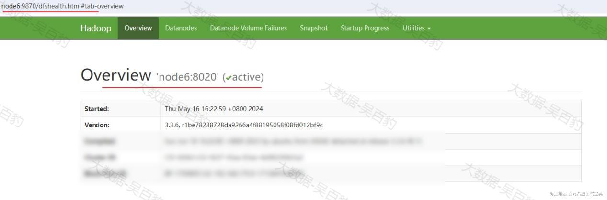

1. **DistCp集群间数据迁移**

DistCp命令的基本用法如下：

其中OPTIONS主要参数有如下：

- -update：拷贝数据时，只拷贝相对于源端，目标端不存在的文件数据或源端修改的数据。
- -delete：删除相对于源端，目标端多出来的文件。

下面对hdfs://node1:8020集群（A集群）中的数据迁移到hdfs://node6:8020集群（B集群）中进行测试。

1. **将A集群中 test目录下的数据迁移到B集群**

1. **测试distcp -update参数**

替换A集群中/test/data.txt文件，向data.txt文件写入新的数据如下：

A集群中替换HDFS中/test/data.txt文件，并通过distcp 命令将追加的数据同步到B集群

1. **测试distcp -delete参数**

向B集群HDFS集群/test目录下上传a.txt 文件，内容随意，如下：

使用distcp命令指定-delete参数删除B集群指定目录与源端A集群相应目录中相比多出的数据文件，delete参数需要结合update参数一起使用：

以上命令执行后，B集群中创建的/test/a.txt文件被删除。

1. **如果在同一个集群中使用distcp命令，相当于集群内数据复制备份**

## 1.17 NameNode源码启动流程

NameNode源码启动类为org.apache.hadoop.hdfs.server.namenode.NameNode，当启动NameNode后会执行该类的main方法，在该类main方法中会创建NameNode对象，代码如下:

在createNameNode方法中实际上最终返回“new NameNode(conf)”对象，在NameNode构造函数中会执行“initialize(...)”方法来进行NameNode启动流程。NameNode构建方法如下：

this调用到2个参数构造：

在initialize方法中NameNode启动主要经过如下4个过程：

1. 启动NameNode HttpServer ，方便用户通过http访问HDFS WebUI
2. 加载本地fsimage和editslog
3. 创建NameNode RpcServer并启动
4. 检测集群是否处于安全模式

initialize方法主要代码实现如下：

下面分别对以上过程进行介绍。

1. **启动NameNode HttpServer**

startHttpServer方法主要创建HttpServer ，这样用户就可以通过WebUI来访问NameNode。startHttpServer代码如下：

getHttpServerBindAddress(conf)中进行了NameNode节点IP和端口9870绑定并返回InetSocketAddress对象，getHttpServerBindAddress(conf)源码如下:

以上源码中getHttpServerAddress会绑定节点IP和端口。

在startHttpServer方法中的httpServer.start()方法进行了HttpServer2封装，Hadoop中使用了自己的Httpserver进行Kerberos认证，最后通过HttpServer2.Builder.build()方法创建了hdfs自己的httpserver并调用start方法进行启动。

httpServer.start()具体源码如下：

1. **加载fsimage和editslog**

loadNamesystem(conf)中会加载本地fsimage和editslog,具体源码如下：

loadFromDisk源码如下：

1. **创建NameNode RpcServer并启动**

创建NameNode RpcServer的代码如下：

createRpcServer源码如下：

在“new NameNodeRpcServer(conf, this)”创建nameNodeRpcServer对象中会创建NameNode作为Rpc 服务端和客户端的RpcServer，具体源码如下：

关于NameNode serviceRpcServer和clientRpcServer的启动在后续NameNode资源检测后启动。

1. **检测集群是否处于安全模式**

经过前面3个步骤后，会执行如下代码进行资源检查和安全模式检查：

startCommonServices方法实现如下：

以上namesystem.startCommonServices(conf, haContext);主要负责磁盘空间和安全模式检测；rpcServer.start();主要进行NameNode serviceRpcServer和clientRpcServer的启动。

startCommonServices(conf, haContext)方法具体源码如下：

以上代码中nnResourceChecker = new NameNodeResourceChecker(conf);中会设置磁盘空间最小阈值100M，然后执行checkAvailableResources();方法进行检查节点磁盘空间是充足，具体代码如下：  
new NameNodeResourceChecker(conf)源码:

checkAvailableResources()源码如下：

其中以上hasAvailableDiskSpace方法实现如下：

该方法如果返回true表示至少有一个配置的磁盘空间满足使用。方法中areResourcesAvailable实现源码如下：

其中resource.isResourceAvailable()中判断磁盘是否满足最低的100M，返回true表示满足，返回false表示不满足。isResourceAvailable()实现类是NameNodeResourceChecker.CheckedVolume中的isResourceAvailable方法，该方法中进行磁盘空间判断是否满足最低100M,具体判断源码如下：

检测完磁盘可用空间后，进入安全模式，并进行可用block的检测,进而判断是否退出NameNode安全模式，具体源码在FSNmaesystem.startCommonServices中，如下：

以上代码中“blockManager.activate(conf, completeBlocksTotal);”进行block块检测，查看正常可用block数是否满足总block的99.9% 可用，active(conf,completeBlocksTotal)具体源码如下：

datanodeManager.activate(conf)主要进行DataNode节点是否宕机，默认经过10分钟+30s一个DataNode没有向NameNode汇报心跳信息，则该DataNode宕机。datanodeManager.activate(conf)实现源码如下：

heartbeatManager.activate()中activate方法最终调用到Monitor线程的run方法进行DataNode状态监测。

bmSafeMode.activate(blockTotal)进行是否退出安全模式检车，实现源码如下：

其中“setBlockTotal(total);”设置正常可用block的阈值，“areThresholdsMet()”进行可用block是否满足阈值，areThresholdsMet()实现如下：

## 1.18 DataNode 源码启动流程

DataNode启动源码类为org.apache.hadoop.hdfs.server.datanode.DataNode,该类main方法如下：

createDataNode(args, null, resources)实现如下：

以上代码中instantiateDataNode创建返回了DataNode对象，并在创建DataNode的构造中初始化DataXceiver服务、HttpServer服务、DataNode PRC 服务及向NameNode注册并进行心跳汇报，然后再通过“dn.runDatanodeDaemon();”方法启动DataXceiver服务和DataXceiver服务用于接收客户端写数据和通信。

instantiateDataNode(args, conf, resources);实现代码如下:

makeInstance方法会携带DataNode 数据存储位置创建DataNode对象。makeInstance源码如下：

在DataNode 对象的构造中执行了startDataNode方法初始化各种服务及向NameNode注册信息。进入DataNode构造可以看到startDataNode方法：

在StartDataNode方法中主要做了如下4个流程：

1. 初始化DataXceiver服务，该服务是Datanode接手客户端请求的核心组件。
2. 创建HttpServer并启动，方便用户通过WebUI访问DataNode。
3. 初始化DataNode Rpc 服务端
4. 获取NameNode RpcProxy代理
5. DataNode向NameNode注册
6. DataNode与NameNode周期心跳和block块汇报

详细源码如下：

DataXceiver服务在数据上传部分讲解，下面结合源码介绍其他五个流程。

1. **创建HttpServer**

startInfoServer()主要创建httpServer并启动，该服务启动后用户可以通过WebUi访问DataNode。源码如下：

其中DatanodeHttpServer构造如下：

1. **初始化DataNode Rpc服务**

initIpcServer()方法中进行DataNode Rpc 服务端的初始化，代码如下：

关于 ipcServer 的启动是在DataNode对象创建完成后，执行“dn.runDatanodeDaemon()”方法中执行的。具体源码位于DataNode.createDataNode方法中：

1. **获取NameNode Rpc代理**

startDataNode中的“blockPoolManager.refreshNamenodes(getConf())”代码主要负责DataNode向每个NameNode注册并进行心跳汇报，refreshNamenodes实现源码如下：

以上代码中，newAddressMap是获取所有NameNode节点地址，newLifelineAddressMap是从dfs.namenode.lifeline.rpc-address 配置属性中获取地址，默认该属性没有配置。newLifelineAddressMap如果配置了，该获取的地址主要用于DataNode向NameNode发送心跳和block块汇报。

最后执行“doRefreshNamenodes”方法，向每个NameNode节点通信并进行注册。doRefreshNamenodes源码如下：

以上代码中，createBPOS方法返回 BPOfferService 对象，该对象中bpServices 中包含于所有 NameNode通信的BPServiceActor对象。createBPOS方法如下：

“new BPOfferService”中进行每个NameNode的遍历，并将负责与NameNode通信的BPServiceActor对象加入到BPOfferService.bpServices这个集合中。new BPOfferService实现如下：

注意：BPServiceActor是一个线程，后续会执行相关的run方法，并且在new BPServiceActor对象时，会初始化Scheduler对象，该对象会周期性向NameNode汇报DataNode心跳信息，new BPServiceActor实现源码如下：

以上代码中scheduler对象负责后续周期向NameNode汇报心跳，默认3秒。

回到doRefreshNamenodes方法的startAll()方法，在该方法中可以看到遍历offerServices中的BPOfferService对象并调用对应的start方法，在start方法中会循环遍历bpServices中的每个BPServiceActor进行启动。具体源码如下：  
startAll()方法如下：

以上bpos.start()方法源码如下：

当调用BPServiceActor 对象的start方法时，由于BPServiceActor 是一个线程所以会执行到对应的BPServiceActor.run方法，在该run方法中进行连接NameNode注册并与NameNode保持心跳。BPServiceActor.run方法源码如下：

connectToNNAndHandshake()方法的具体实现如下：

以上代码中：“bpNamenode = dn.connectToNN(nnAddr)”连接NameNode ,返回bpNamenode为DatanodeProtocolClientSideTranslatorPB对象，该对象中有NameNode Rpc代理,通过NameNode Rpc代理可以远程调用NameNode的方法。ConnectToNN源码实现如下：

DatanodeProtocolClientSideTranslatorPB的构造中创建了NameNode rpcProxy代理对象：

以上代码的“createNamenode”中获取NameNode 远程代理对象源码如下：

可以看到该代码中RPC.getProxy(...)传入的第一个参数是DatanodeProtocolPB.class，表示远程调用NameNode所有方法的接口就是此接口，进入DatanodeProtocolPB.class可以看到有@ProtocolInfo注解：

以上代码中，@ProtocolInfo注解指定协议的相关信息，protocolName参数指定了协议的名称，protocolVersion参数指定了协议的版本号。指定的 org.apache.hadoop.hdfs.server.protocol.DatanodeProtocol 是一个Java接口，定义了用于DataNode与NameNode之间通信的协议。通常，它定义了一系列方法，这些方法由DataNode实现，用于与NameNode进行通信和执行各种操作。DatanodeProtocolPB也是一个java接口，它实际上是 DatanodeProtocol 接口的一种实现方式。

综上所述，后面通过获取到的NameNode RpcProxy代理对象进行远程调用NameNode相应方法时实际上会找到DatanodeProtocol 接口的实现类，通过查询源码可以看到NameNodeRpcServer类实现了DatanodeProtocol 接口：

所以，当在DataNode端通过NameNode的RpcProxy 远程调用到NameNode相应方法时，会调用到 NameNodeRpcServer 类中相应的实现方法。

1. **Datanode向NameNode注册**

继续回到BPSercviceActor.connectToNNAndHandshake方法中,源码如下：

“register(nsInfo)”方法实现DataNode向NameNode进行注册。源码实现如下：

“bpNamenode.registerDatanode”的实现如下：

以上代码中 “rpcProxy”对象是NameNode远程代理，调用的registerDatanode 方法位于 NameNodeRpcServer.java 类中。

NameNodeRpcServer类中的registerDatanode方法实现源码如下：

以上代码中“namesystem.registerDatanode(nodeReg);”实现如下：

“blockManager.registerDatanode(nodeReg);”实现源码如下：

以上代码中“registerDatanode”方法中实现了DataNode向NameNode注册：

以上 addDatanode实现如下：

“datanodeMap.put(node.getDatanodeUuid(), node)”代码就是将DataNode信息加入到dataNodeMap对象中完成DataNode向NameNode注册。

host2DatanodeMap 存储了主机名（host）与数据节点之间的映射关系，而host2DatanodeMap.remove(datanodeMap.put(node.getDatanodeUuid(), node))，表示如果先前host2DatanodeMap中已有对应的DataNode信息，先从host2DatanodeMap中移除，后续再重新加入到host2DatanodeMap中。

1. **DataNode与NameNode周期心跳及block块汇报**

回到BpServiceActor中run方法中，除了连接NameNode向DataNode进行注册外，后续还会周期性向NameNode进行心跳和block块汇报。run方法实现如下：

offerService实现代码如下:

以上“final boolean sendHeartbeat = scheduler.isHeartbeatDue(startTime);”代码中会看到每隔3秒进行一次心跳信息汇报。

sendHeartBeat实现源码如下：

“scheduler.scheduleNextHeartbeat();”设置下次进行心跳的时间。

bpNamenode.sendHeartbeat(...)最终调用到NameNodeRpcServer中的sendHeartbeat方法进行block块上报。

## 1.19 HDFS数据上传源码流程

当我们向HDFS中写入数据时，自己编写代码如下：

客户端向HDFS中写入数据会首先与NameNode进行通信获取数据写入HDFS中对应哪些DataNode节点，然后在客户端将数据划分成packet传输到HDFS各个DataNode节点上。这个过程会经过初始化DFSClient、连接NameNode创建目录、建立与DataNode连接、向DataNode中上传数据等步骤，下面分别对以上各个阶段源码进行介绍。

1. **创建文件系统及初始化DFSClient**

操作HDFS前需要创建DFSClient对象，该对象中持有与NameNode通信的NameNode Rpc Proxy。DFSClient对象的创建是执行“FileSystem fs = FileSystem.get(URI.create("hdfs://node1:8020/"),conf,"root");”代码中FileSystem.get(...) 方法时创建的。

FileSystem.get(...)具体源码如下：

以上代码“get(uri,conf)”又调用到FileSystem.get(...)方法源码如下：

“CACHE.get(uri，conf)”又调用到如下源码：

在getInternal方法中最终执行”createFileSystem(url,conf)”创建分布式文件系统及初始化DFSClient。

getInternal(...)源码如下：

在createFileSystem方法中获取了初始化HDFS文件系统的类org.apache.hadoop.hdfs.DistributedFileSystem并初始化了DFSClient对象。createFileSystem具体源码如下：

以上代码中在执行“FileSystem fs = ReflectionUtils.newInstance(clazz, conf);”初始化文件系统时，clazz为“org.apache.hadoop.hdfs.DistributedFileSystem”具体可见getFileSystemClass(uri.getScheme(), conf)源码，如下：

以上代码中“loadFileSystems()”会将 FileSystem 抽象类的所有实现类中的 schema和对应实现类放入 SERVICE\_FILE\_SYSTEMS 对象中，loadFileSystems()实现源码如下:

getFileSystemClass方法中首先从配置文件中获取“fs.hdfs.impl”配置的HDFS类，默认在HDFS中没有配置该属性，该属性也没有默认值，所以得到clazz为null，进而执行“clazz = SERVICE\_FILE\_SYSTEMS.get(scheme);”得到clazz为“org.apache.hadoop.hdfs.DistributedFileSystem”,所以，最终在FileSystem.createFileSystem(...)中得到的fs为“org.apache.hadoop.hdfs.DistributedFileSystem”。

FileSystem.createFileSystem(...)中“fs.initialize(uri, conf);”代码执行时，这里的fs就是“org.apache.hadoop.hdfs.DistributedFileSystem”类，找到DistributedFileSystem.initialize实现与源码如下：

initDFSClient(...) 主要创建DFSClient对象并在创建DFSClient对象时创建了NameNode Rpc Proxy对象并赋值给其属性namenode，方便后续客户端和NameNode进行通信。具体“initDFSClient(uri, conf);”实现源码如下：

new DFSClient构造如下：

this调用到DFSClient实现,其中创建了NameNode Rpc Proxy 并赋值给了namenode属性。

后续客户端可以通过DFSClient.namenode获取到NameNode的RPC Proxy对象与NameNode进行通信。

1. **连接NN创建目录**

在自己编写的代码执行到“FSDataOutputStream out = fs.create(path)”时，会在HDFS中创建目录并准备dataQueue，dataQueue用于客户端数据传输队列，并最后反馈FSDataOutputStream对象，该对象用于向HDFS中写数据。

跟进fs.create(...) 源码一层层对象包装，会发现该create方法最终调到 DistributedFileSystem.create(...)方法，其源码如下：

以上create方法会继续调用到DistributedFileSystem.create(...)方法，只是参数不同，源码如下：

以上代码执行dfs.create方法，最终调用到 DFSClient.create方法：

create方法又经过一些列参数包装，最终调用到如下源码：

在以上代码中，“DFSOutputStream.newStreamForCreate”中获取到NameNoae Rpc Proxy 代理对象并连接创建目录，然后启动DataStreamer 线程用于接收客户端上传的packet，并最终返回DFSOutputStream对象。

newStreamForCreate具体源码如下：

以上代码“dfsClient.namenode.create(...)”方法会通过NameNode Rpc Proxy 对象调用到NameNodeRpcServer.create方法，然后在HDFS中经过一些目录和权限判断来创建对应目录。NameNodeRpcServer.create源码如下：

以上startFile源码如下：

startFileInt实现源码如下：

以上代码中startFile实现如下：

addFile中最终会执行“newiip = fsd.addINode(existing, newNode, permissions.getPermission());”向HDFS中添加目录信息。

1. **启动DataStreamer线程**

继续回到DFSOutputStream.newStreamForCreate(...)部分，newStreamForCreate具体源码如下：

当向NameNode连接创建目录后，会执行“new DFSOutputStream(dfsClient, src, stat, flag, progress, checksum, favoredNodes, true);”创建DFSOutputStream对象并最终返回，在创建该对象的构造中同时创建了DataStreamer对象并赋值给streamer属性，DataStreamer对象负责后续接收客户端上传数据并将数据发送pipeline方式发送到DataNode上，该对象为一个线程，创建DFSOutputStream对象完成后会执行“out.start()”方法进行启动。

“new DFSOutputStream”实现源码如下：

可见在DFSOutputStream创建同时获取了后续写入数据时packet大小（默认为64K）并给其streamer属性初始化了DataStreamer值（DataStreamer是一个线程）。当创建好 DFSOutputStream对象后赋值给out对象，当执行“out.start();”方法时，实际上执行的就是streamer.start,由于DataStreamer是一个线程，所以最终调用到其中的run方法。

DataStreamer.run方法源码如下：

以上代码中 dataQueue是一个Linkedlist<DFSPacket>对象，该对象会一直处于while循环中等待客户端上传文件的packet，当有数据放入该LinkedList后，会从该对象中获取一个个的packet写出到DN中。

1. **向dataQueue队列中写入packet**

向HDFS写入数据是通过执行自己编写代码“out.write("hello zs".getBytes());”实现的。out对象为DFSOutputStream对象，所以write方法优先找该对象中的write方法，但是发现DFSOutputStream对象中没有write方法，所以找到DFSOutputStream对象的父类FSOutputSummer.write方法，故“out.write("hello zs".getBytes());”最终执行到FSOutputSummer.write方法实现，其源码如下：

以上代码中flushBuffer()实现源码如下：

flushBuffer方法实现源码如下：

以上writeChecksumChunks(...)方法主要就是对写入buffer数据进行校验和生成并与数据一并写入packet。writeChecksumChunks实现如下：

以上代码中writeChunk(...)方法最终会调用到DFSOutputStream.writeChunk(...)实现，其源码如下：

以上代码中，随着数据写入到packet中数据量达到默认64K时，会将packet写入到对应的dataQueue中。

enqueueCurrentPacketFull()方法实现源码如下：

以上enqueueCurrentPacket()方法实现原理如下：

waitAndQueuePacket()方法实现如下：

queuePacket(...)实现代码如下：

以上代码中“dataQueue.addLast(packet);”就是将packet 加入到dataQueue LinkedList 中，当执行到“dataQueue.notifyAll();”时，会通知所有正在等待dataQueue对象锁的线程，告诉它们数据队列已经有数据包放入，可以继续执行。

1. **设置副本写入策略源码**

回到DataStreamer.run方法源码，该部分代码已经在向HDFS中创建目录时已经执行。如下：

以上代码大体逻辑为：当dataQueue中有packet后，会执行“one = dataQueue.getFirst()”获取packet包并通过“sendPacket(one);”将packet数据写出到DataNode节点。

客户端向HDFS DataNode写入数据时，默认有3个副本，并且各个DataNode节点之间写出数据都是以pipeline方式依次传递到各个DataNode节点，所以在执行“sendPacket(one);”写出数据前，会执行“setPipeline(nextBlockOutputStream());”方法构建写数据管道，通过管道连接到第一个DataNode，将packet数据写入该节点，然后由第二个DataNode依次再将packet传递到第三个DataNode节点，副本多的依次类推。其中“nextBlockOutputStream()”方法中会连接NameNode申请写入数据的DataNode节点及副本分布策略，并设置客户端与第一个Block块所在的节点的socket连接，方便后续将数据写入到对应的DataNode节点。

nextBlockOutputStream()方法源码如下：

以上代码中“locateFollowingBlock( excluded.length > 0 ? excluded : null, oldBlock);”代码中会向NameNode申请副本写入DN节点的信息并设置副本分布策略。

locateFollowingBlock(...)源码如下：

以上代码中addBlock方法中会向NameNode申请block分布策略及写入DN节点信息。DFSOutputStream.addBlock(...)实现源码如下：

以上代码中dfsClient.namenode获取到NameNode Rpc Proxy，所以addBlock方法最终会调用到NameNodeRpcServer.addBlock(...)方法。NameNodeRpcServer.addBlock(...)源码如下：

以上代码“namesystem.getAdditionalBlock(...)”源码如下：

以上代码中chooseTargetForNewBlock(...)会为block找到存储DN节点，源码如下：

chooseTarget4NewBlock(...)中会为block选择目标数据节点：

以上代码“blockplacement.chooseTarget(...)”方法经过一层层对象封装，最终调用到“BlockPlacementPolicyDefault.chooseTarget”方法，该方法实现源码如下：

进入以上代码中“chooseTarget”方法，源码如下：

以上代码中“chooseTargetInOrder”中实现副本分布并返回第一个副本要写入的DN节点。“chooseTargetInOrder”源码如下：

“chooseTargetInOrder”方法代码逻辑为block 副本找到存储节点的策略，然后返回block所在的第一个节点，首先第一个block存储在本机，第二个block存储在远程机架，第三个副本存储时先判断是否第一个副本和第二个副本是否在同一机架，如果在同一机架，那么第三个副本选择不同机架进行存储，否则选择与第二个副本相同机架的随机节点进行存储。最终该方法返回存储第一个副本的DataNode节点。

1. **客户端与DataNode建立socket通信**

在DataNode启动源码部分，DataNode.initDataXceiver()方法进行初始化DataXceiver服务,该服务是 DataNode 接收客户端请求的核心组件，其核心实现源码如下：

在DataNode.crateDataNode(...)方法中，当DataNode对象创建完成后，当执行“dn.runDatanodeDaemon();”时会运行DataXceiverServer对象的run方法，DataXceiverServer.run方法实现源码如下：

以上代码中我们可以看到“peerServer.accept()”一直接受来自客户端传输数据socket通信，并且“new Daemon(datanode.threadGroup,DataXceiver.create(peer, datanode, this)).start();”代码中创建了DataXceiver线程并启动，该线程主要从DataXceiverServer中读取socket传入数据并将数据写入到DataNode节点磁盘。

下面继续回到DataStreamer.nextBlockOutputStream()源码中，查看客户端与DataNode节点建立的连接。

DataStreamer.nextBlockOutputStream()方法源码如下：

前面执行完locateFollowingBlock(...)方法，获取到了数据应该写往的DataNode节点后，后续会执行“createBlockOutputStream(nodes, nextStorageTypes, nextStorageIDs,0L, false);”方法与第一个写出的DataNode节点建立连接，createBlockOutputStream(...)实现部分源码如下：

以上“createSocketForPipeline(nodes[0], nodes.length, dfsClient);”代码就是获取第一个写出数据的block所在的DataNode节点，并建立socket连接。createSocketForPipeline源码如下：

1. **向Datanode中写入数据**

回到 DataStreamr.createBlockOutputStream(...)方法中，核心源码如下：

当写出数据的输出流out中有数据时,会通过“new Sender(out).writeBlock(...)”方法将数据发送到DataNode节点，writeBlock(...)实现具体源码如下：

以上send方法会将数据发送到DataNode 中，DataNode启动的DataXceiverServer 服务会接收客户端socket通信。

再次回到DataXceiverServer.run()方法源码中：

“new Daemon(datanode.threadGroup,DataXceiver.create(peer, datanode, this)).start();”代码中会将接受到客户端的连接包装到DataXceiver线程对象中并启动，在DataXceiver.run方法中会对从客户端接收到的数据进行写出到DataNode磁盘处理。

DataXceiver.run方法源码如下：

以上代码会将从客户端中接收过来的数据包装成数据输入流，最终执行“processOp(op);”写出到DataNode节点磁盘上。

processOp(op)实现源码如下,op默认从客户端传入类型值为“WRITE\_BLOCK”：

opWriteBlock(in)实现代码如下：

以上 writeBlock最终调用到“DataXceiver.writeBlock(...)”方法，其源码实现如下：

以上代码中“new Sender(mirrorOut).writeBlock(...)”这部分代码是将写入到该DataNode节点的packet数据继续写往下个DataNode节点，如果block有多个副本，都是在下一个DataNode节点向后续DN节点发送写出数据。

最终执行“blockReceiver.receiveBlock(...)”代码将数据写出到磁盘中，receiverBlock(...)实现关键源码如下：

以上代码中receivePacket()会一直接受从客户端发送过来的packet并写入到DataNode节点磁盘，直到客户端数据传输完毕。

reveiverPacket()关键源码实现如下：

## 1.20 HDFS数据读取源码流程

数据 从HDFS中读取数据代码如下：

HDFS中数据读取源码相对简单，客户端从HDFS中获取文件数据时，首先会向NameNode获取文件相关的block信息，然后连接各个Datanode以流方式读取数据即可。

1. **连接NameNode获取block信息**

HDFS读取数据代码中，执行到“FileSystem fs = FileSystem.get(URI.create("hdfs://node1:8020/"),conf,"root");”代码时，也会创建DFSClient，参考上传数据代码。当代码执行到fs.open(...)时，其中fs为DistributedFileSystem对象，所以open方法最终调用到DistributedFileSystem.open方法，其源码如下：

以上代码中，“dfs.open(...)”方法最终返回读取数据对象DFSInputStream。

“dfs.open(...)”源码如下：

以上代码，其中“getLocatedBlocks(src, 0);”方法会连接NameNode节点上获取读取文件相关Block信息，openInternal(...)方法中将获取过来的LocatedBlocks对象（该对象中属性List<LocatedBlock> blocks表示读取文件的所有blockInfo信息）封装到DFSInputStream对象中并返回。

getLocatedBlocks源码如下：

以上代码“getLocatedBlocks(...)”源码如下：

以上代码中“callGetBlockLocations(...)” 传入NameNode Rpc Proxy 对象，后续通过该对象连接NameNode。其源码如下：

“namenode.getBlockLocations(src, start, length)”最终调用到NameNodeRpcServer.getBlockLocations(...)方法。

回到DFSClient.open()方法中，最终通过执行“return openInternal(locatedBlocks, src, verifyChecksum);”返回DFSInputStream对象。

1. **客户端通过socket连接DataNode**

当从HDFS中通过流读取数据时，会将fs.open(...)方法返回的DFSInputStream对象经过一层层包装形成BufferedReader，该对象读取数据时最终调用到DFSInputStream.read(...)方法，其源码如下：

以上Read方法实现源码如下：

以上代码中，在最后返回的“return readWithStrategy(byteArrayReader);”代码中传入了ByteArrayStrategy对象，该对象表示客户端以ByteArray方式从HDFS DataNode中读取数据。

readWithStrategy(...)方法实现源码如下：

以上代码中核心代码为 “blockSeekTo(...)”,该方法会根据LocateBlocks列表生成BlockReader对象，在BlockReader中实现连接DataNode节点并准备接受数据的流对象，返回的currentNode 为block所在期望的DataNode。

最终在“int result = readBuffer(strategy, realLen, corruptedBlocks);”代码中会使用到接收DataNode返回数据的流对象，将数据从DataNode节点接受过来。

下面先看“blockSeekTo(...)”源码实现，看看客户端如何连接上DataNode节点建立读取数据的连接对象。blockSeekTo(...)源码如下：

以上代码“getBlockReader(...)”的实现源码如下：

以上代码最后指定build()方法中会执行“getRemoteBlockReaderFromDomain()”方法与DataNode节点建立连接，并准备接受数据的流对象。build()方法源码如下：

getRemoteBlockReaderFromDomain()方法源码如下：

最终“getRemoteBlockReader(...)”方法执行到BlockReaderRemote.newBlockReader方法中，其源码如下：

以上源码中“new Sender(out).readBlock(...)”中readBlock(...)方法中会通过“send(out, Op.READ\_BLOCK, proto);”方法，将读取Block的信息发送到DataNode节点。readBlock(...)实现核心源码如下：

在启动DataNode后，DataNode节点上一直启动DataXceiver服务，该服务会一直接受客户端与DataNode的通信。

最终，通过“DataInputStream in = new DataInputStream(peer.getInputStream());”来接收DataNode节点返回Block的数据流，后续会通过该in对象从DataNode中读取block数据。

1. **DataNode返回block数据流**

找到DataNode节点的DataXceiver服务的run方法，其源码如下：

以上run方法为DataXceiver服务一直接受客户端发送过来的请求，当客户端执行“send(out, Op.READ\_BLOCK, proto);”该服务接受到请求后，会执行“processOp(op);”方法，该方法源码如下：

所以最终执行到“opReadBlock”方法，该方法源码如下：

以上代码中readBlock最终调用到DataXceiver.readBlock方法，源码如下：

以上代码中“sendBlock(...)”源码如下：

doSendBlock(...)源码如下：

以上代码中“sendPacket(...)”方法会找到packet 数据发送到客户端。“sendPacket(...)”主要源码如下：

以上代码中“fileIoProvider.transferToSocketFully(...)”就是从磁盘读取数据通过socket返回到客户端。

回到BlockReaderRemote.newBlockReader(...)方法中，在该方法中最终通过“DataInputStream in = new DataInputStream(peer.getInputStream());”代码接受DataNode返回数据的流对象。

继续回到DFSInputStream.readWithStrategy(...)方法中，其源码如下：

最终通过readBuffer(...)从DataNode中获取文件数据。

## 1.21 HDFS中误删除文件如何找回？

HDFS中误删文件可以尝试通过如下几种方式进行恢复找回数据。

1. **通过Trash回收站机制**

HDFS中提供了类似window回收站的功能，当我们在HDFS中删除数据后，默认数据直接删除，如果开启了Trash回收站功能，数据删除时不会立即清除，而是会被移动到回收站目录中（/usr/${username}/.Trash/current），如果误删了数据，可以通过回收站进行还原数据，此外，我们还可以配置该文件在回收站多长时间后被清空。

按照如下步骤进行回收站配置即可。

1. **修改core-site.xml**

在HDFS各个节点上配置core-site.xml，加入如下配置：

以上参数“fs.trash.interval”默认值为0，表示禁用回收站功能，设置大于0的值表示开启回收站并指定了回收站中文件存活的时长（单位：分钟）。

“fs.trash.checkpoint.interval”参数表示检查回收站文件间隔时间，如果设置为0表示该值和“fs.trash.interval”参数值一样，要求该值配置要小于等于“fs.trash.interval”配置值。

将以上配置文件分发到其他HDFS节点上：

1. **重启HDFS集群，测试回收站功能**

当执行删除命令后，可以看到数据被移动到“hdfs://mycluster/user/root/.Trash/Current/”目录下，通过HDFS WebUI也可看到对应的路径下文件。如果WebUI用户没有权限，可以通过给/user目录修改访问权限即可。

数据如下：

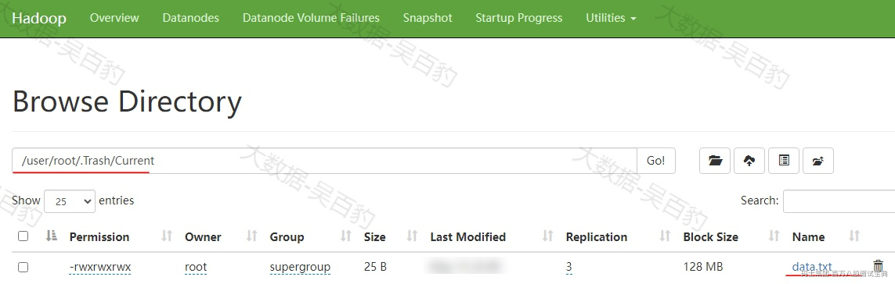

大约等待1分钟左右数据会自动从回收站中清空。如果想要还原数据需要手动执行命令将数据move移动到对应目录中。

**注意：只有通过HDFS shell操作命令将数据文件删除后，才会进入回收站，如果在HDFS WebUI中删除文件，这种删除操作不会进入到回收站。**

1. **HDFS快照**

HDFS快照（Snapshot）是一个只读的时间点视图，用于记录特定目录在快照创建时的状态，快照可以帮助用户快速恢复被误删除或更改的数据，也可以用于重要数据备份、版本管理等场景。

下面以HDFS /mydata目录为例说明HDFS快照使用和数据恢复命令：

- **启用快照功能**

要对一个目录使用快照，首先需要启用快照功能，这里对HDFS目录/mydata启用快照功能。

- **创建快照**

启用快照后，可以通过以下命令对该目录此刻数据状态创建快照。

- **查看快照**

可以通过如下命令，列出某目录下创建的快照。

注意：.snapshot为一个隐藏文件，只能通过HDFS命令访问，不能通过HDFS WebUI查看到该目录。

- **恢复数据**

将HDFS中/mydata/目录下的a.txt数据文件删除，通过HDFS中创建的快照“first\_snapshot”进行回复。

- **删除快照**

如果快照不在需要，可以通过如下命令删除：

- **停用目录快照功能**

当不再需要为某目录管理快照时，可以禁用快照功能。此外，如果快照功能没有关闭，对应的目录无法删除。

1. **其他方式**

如果回收站和快照均无效，且没有备份，可以尝试使用DistCp命令，将丢失的数据从其他节点或集群复制到损坏的节点或集群中，或者尝试从数据源头重新生成丢失数据上传到HDFS中。

## 1.22 HDFS如何保证数据的高可用？

HDFS通过多种机制和设计保障数据高可用性，确保HDFS稳定运行和数据完整性。这些方面如下：

1. **NameNode 高可用机制**

- **Active-Standby架构**

HDFS通过Active-Standby架构保证NameNode的HA高可用，Active负责处理客户端请求，Standby实时同步Active的元数据状态。

HDFS借助zookeeper实现故障检测和自动NameNode HA切换，当Active NameNode不可用时，Zookeeper通知Standby NameNode切换为Active，并接管服务。

- **JournalNode机制**

JouranlNode用于保存Active NameNode的事务日志（edit log），Active NameNode将事务日志写入多数（通常是3个或5个）JournalNode，Standby NameNode通过JournalNode获取最新的元数据更新。

1. **数据块多副本机制**

HDFS将文件切分为Block（默认128M），通过多副本机制（默认3副本）保证数据高可用。数据块副本分布在不同的DataNode上，尽量分散在不同机架，降低机架级故障影响。

1. **Heartbeat心跳机制**

DataNode定期向NameNode汇报block状态,如果DataNode失联，NameNode会标记其上的数据块为“丢失”，NameNode根据副本策略在其他DataNode上重新复制丢失的数据块。

1. **数据读取方面**

客户端通过NameNode获取目标数据块的多个副本位置信息，若访问某个副本失败，客户端会自动切换到另一个副本，确保读取过程不中断。

1. **数据写入方面**

数据写入过程中，HDFS采用 Pipeline写入，多个副本写成功后才返回客户端确认，数据块通过版本号（generationStamp）和校验（CRC）确保一致性。

1. **数据保护与容灾**

HDFS支持快照功能，用户可以随时创建文件系统状态的快照，便于在数据损坏或误删情况下进行恢复；回收站（Trash）功能则为文件删除提供缓冲区，允许用户在误删数据后从回收站中恢复；HDFS支持集群数据备份与迁移，可以通过DistCP命令进行数据迁移备份。

## 1.23 解释HDFS一致性语义？

HDFS中一致性是说数据的一致性，数据一致性语义包括两个方面：**元数据一致性和文件数据一致性。**

1. **元数据一致性**

HDFS通过fsimage和editslog来保证元数据一致性，这样可以保证HDFS在发生崩溃后可以通过fsimage和editslog恢复到系统关闭前的一致状态。

- fsimage是NameNode中保存的文件系统元数据的完整镜像，包括文件目录结构、块的分布等，启动时加载以恢复文件系统状态；editslog记录所有对HDFS的修改操作（如新增、删除、重命名等）。
- 为了防止editslog过大，HDFS定期将其合并到fsimage中，并通过第二个NameNode或HA模式下的StandBy NameNode来处理合并。

1. **文件数据一致性**

HDFS通过校验和（Checksum）和租约机制（Lease）来保证数据数据一致性。

- **校验和（Checksum）**

**校验和（Checksum） 是一种用于验证数据完整性的方法**。它通过对数据内容进行特定算法的计算，生成一个固定长度的值（即校验和），当数据被传输、存储或复制时，校验和可以用来检查数据是否在过程中被篡改、损坏或发生错误。

HDFS中文件被切分成Block，每个Block数据块都计算校验和，客户端在读写数据时验证其校验和；Datanode在存储和复制数据时，也会校验数据的完整性，如果数据损坏，HDFS可以通过副本机制恢复数据。

- **租约机制（Lease Mechanism）**

HDFS 租约机制是一种文件锁机制，用于管理文件的写入权限，防止多个客户端同时写入同一个文件，确保数据的一致性和完整性。

当客户端开始写入文件时，HDFS 的 NameNode 会为该客户端分配一个租约（Lease），授权其对该文件进行写入操作。在同一时间内，一个文件只能有一个租约，保证写入操作是单一的、串行的。数据写入完成后，客户端需要通知 NameNode 主动释放租约，文件状态由“正在写入”变为“已完成”，并对其他客户端可见。

如果客户端因故障或其他原因未能释放租约，NameNode 会等待租约超时。**超时后，NameNode 会触发租约恢复机制（Lease Recovery），协调 DataNode 完成未完成的写入操作或标记数据块为无效，以确保文件状态的一致性**。恢复完成后，该文件的写入操作终止，其他客户端可以访问文件或开始新的写入。

## 1.24 查看HDFS某个文件的前两行数据?

在 HDFS 中可以使用以下命令查看某个文件的前两行内容：

参数说明：

- hdfs dfs -cat <file\_path>：显示 HDFS 上指定文件的内容。
- | head -n 2：通过管道命令将输出传递给 head，并只显示前两行。

## 1.25 Hadoop常见端口有哪些？

Hadoop生态中常见的端口号如下：

## 1.26 解释CAP理论？

CAP理论最初由加州大学伯克利分校计算机学院一个名叫埃里克·布鲁尔的博士在一个学术论坛中提出来的一个假设，后经麻省理工学院的赛斯·吉尔伯特和南希·林奇在其论文中证明了这一假设，最终该理论成为分布式领域中的一个定理。

1. **什么是CAP?**

CAP全称为Consistency(一致性)、Availability(可用性)和Partition Tolerance(分区容错性)，CAP理论指出在一个**分布式数据存储系统**中以上三项不能同时满足，最多满足以上三项中的两项。

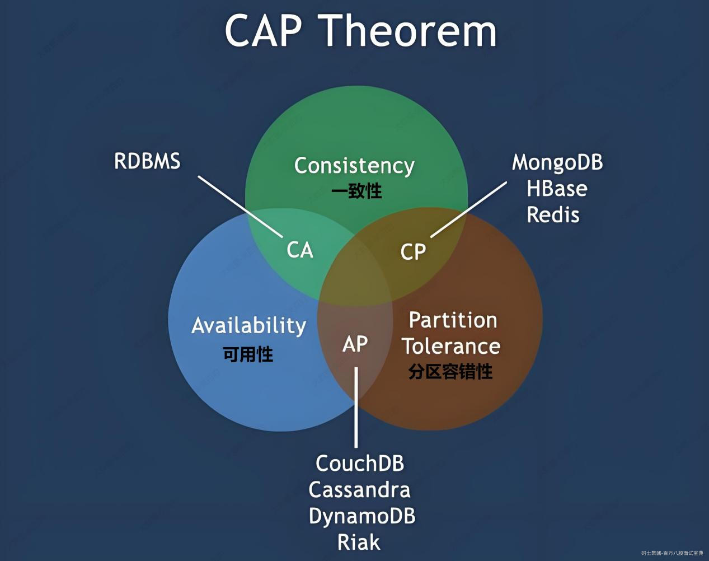

- **Consistency(一致性)**

一致性是指“all nodes see the same data at the same time”，即：分布式系统中更新操作成功后，所有节点在同一时间的数据完全一致。

关于数据一致性又有强一致性（更新过的数据能被后续的访问都能看到）、弱一致性（容忍后续的部分或者全部都访问不到）、最终一致性（经过一段时间后要求能访问到更新后的数据）三种情况，CAP中的一致性是指强一致性。

- **Availability(可用性)**

可用性是指“Reads and writes always succeed”，即：分布式系统中相应服务一直可用且正常响应。

一般分布式系统中涉及到多个节点，任何一个节点的不稳定都会影响可用性，一个可用性好的分布式系统，不应该出现用户操作失败或者访问超时情况。

我们通常使用停机时间来衡量一个系统的可用性，如下：

例如，淘宝的系统可用性可以达到5个9，意思是系统可用水平为99.999%，即全年停机不超过5min中。

- **Partition Tolerance(分区容错性)**

分区容错性是指“the system continues to operate despite arbitrary message loss or failure of part of the system”，即：分布式系统在网络中断、消息丢失情况下，可以正常工作。

分布式系统一般由多个节点组成，这些节点作为一个整体对外提供服务，当**分布式系统中一个或者几个节点宕机，其余机器还能正常满足系统对外提供服务**，或者**机器之间网络有问题导致分布式系统分割为独立的几个部分，各个部分还能维持分布式系统的运行**，这种情况说明分布式系统具有良好的分区容错性。这里所说的部分节点和独立的每个部分就是所说的分区。

1. **CAP证明**

CAP理论中强调在一个系统中，C、A、P三项性质只能满足两项，即：每个系统依据其架构设计具备CP、AP或者CA倾向性，非分布式系统中，CA（系统满足数据一致性和可用性）不难理解。没有P就没有所谓的“分布式”概念，所以在分布式系统中P是必须的，下面我们以分布式系统为例（满足P）解释为什么不能同时满足C和A。

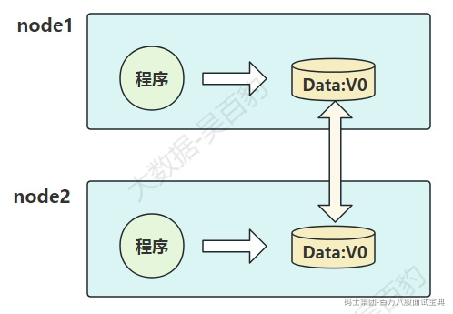

如上图，我们有两个节点（node1、node2）组成分布式系统，每个节点包含程序和数据，两个节点中的数据是同步相同的。这里可以定义node1和node2之间数据是否一样为一致性；外部对node1和node2的请求响应为可用性；node1和node2之间的网络环境为分区容错性。

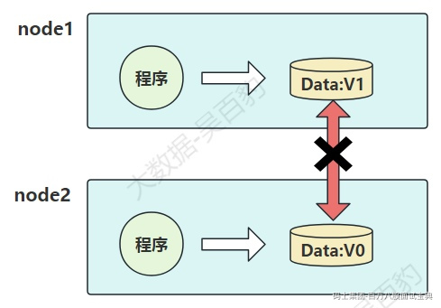

假设某个时刻，node1和node2之间的网络断开了，在满足P的情况下，node1和node2作为独立部分都对外提供服务，那么此刻如果有用户向node1发送数据更新请求，node1中的数据v0被更新为v1，由于网络是断开的，node2节点中的数据依旧是v0，如果有用户向node2发送读取数据请求，那么此刻只有两种选择：

- 第一（AP）：牺牲数据一致性，保证数据可用性，响应给用户v0数据。
- 第二（CP）：牺牲可用性，保证数据一致性，等待网络连接恢复，数据同步一致后，响应给用户v1数据。

以上这个过程，证明了要满足分区容错性的分布式系统，只能在一致性和可用性两者中，选择其中一个。

1. **CAP注意点**

通过CAP我们了解，一个系统无法同时满足一致性（C）、可用性(A)和分区容错性(P)。对于一个分布式系统来说，分区容错性(P)是一个基本要求，只能在CA两者之间做权衡，但并不意味着CA两者中一个一定不能存在。

如向HDFS中写入数据时，如果某些DataNode节点挂掉了但HDFS能正常对外提供数据写入服务（满足分区容错性P），这时要么选择AP（牺牲数据一致性，保证数据可用性），要么选择CP(牺牲可用性，保证数据一致性)，HDFS中选择了CP。但是在HDFS集群正常运行中（P没有发生），CA可以同时并存。

此外，CA（一致性和可用性）倾向的技术组件主要是RDBMS，如MySQL、Oracle。CP（一致性和分区容错性）倾向的技术组件有HDFS、HBase、Zookeeper。
