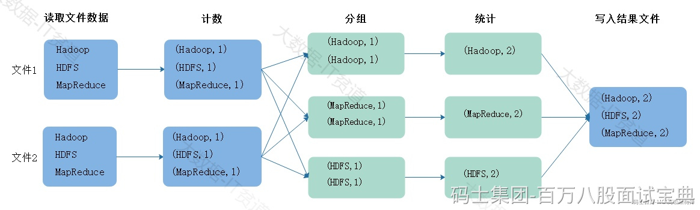
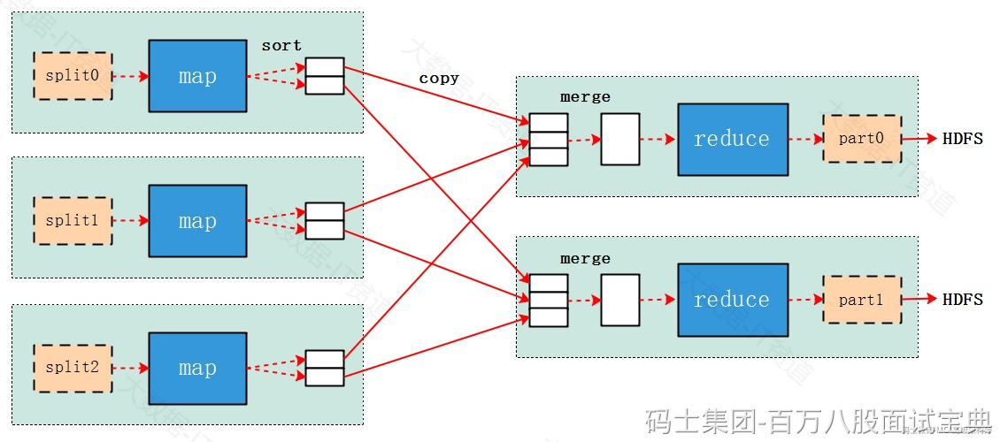

假设现在有两个文件，数据如下，假如我们要读取文件中的数据进行wordcount统计，那么需要进行如下步骤：

以上过程演示的就是MapReduce处理数据的大体流程，MapReduce模型由两个主要阶段组成：Map阶段和Reduce阶段：

- **Map阶段：**

在Map阶段中，输入数据被分割成若干个独立的块，并由多个Mapper任务并行处理，每个Mapper任务都会执行用户定义的map函数，将输入数据转换成一系列键-值对的形式（Key-Value Pairs），这些键-值对被中间存储，以供Reduce阶段使用。

Map阶段主要是对数据进行映射变换，读取一条数据可以返回一条或者多条K,V格式数据。

- **Reduce阶段：**

在Reduce阶段中，所有具有相同键的键-值对会被分配到同一个Reducer任务上，Reducer任务会执行用户定义的reduce函数，对相同键的值进行聚合、汇总或其他操作，生成最终的输出结果，Reduce阶段也可以由多个Reduce Task并行执行。

Reduce阶段主要对相同key的数据进行聚合，最终对相同key的数据生成一个结果，最终写出到磁盘文件中。

往往MapReduce读取的数据来自于HDFS集群中，处理完数据后写出到HDFS :

在HDFS中数据以Block进行存储，Map阶段读取数据文件时，实际上首先会对文件进行Split分片，每个分片大小默认与HDFS中block大小相同，也可以人为调整，每个Split切片被一个Map task进行处理，多个Split被多个Map task并行读取处理，所以默认MapTask的并行度由读取文件的block数决定。

每个MapTask会读取对应的Split数据组织成K,V格式数据，然后将数据按照Key分组，写入到磁盘文件，然后ReduceTask会将相同的Key组数据拉取到Reduce端进行处理，Reduce端也可以是多个Task并行读取MapTask端写出的数据文件，这里可以通过人为方式进行设置Reduce Task个数，默认为1。

注意：Map阶段和Reduce阶段所有并行运行的Task互不相干，Reduce最终写出的数据是写入到磁盘中，复杂业务场景中如果我们想要基于MapReduce处理的结果再次进行分析处理，就需要再编写新的MapReduce程序进行处理。
