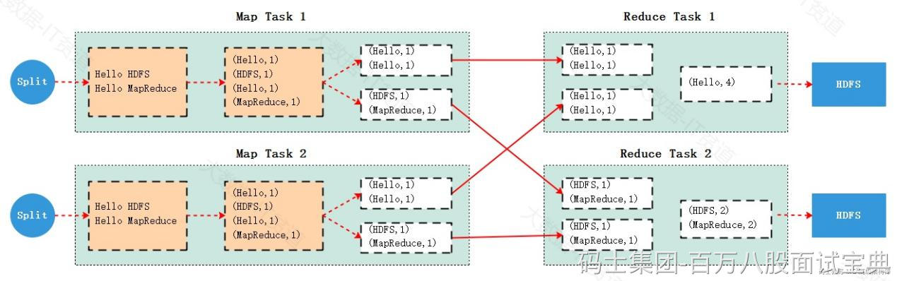

如下是MapReduce处理数据流程:

1. 首先MapReduce会将处理的数据集划分成多个split，split划分是逻辑上进行划分，而非物理上的切分，每个split默认与Block块大小相同，每个split由1个map task进行处理。
2. map task以行为单位读取split中的数据，将数据转换成K，V格式数据，根据Key计算出本条数据应该写出的分区号，最终在内部得到(K,V,P)格式数据写入到当前map task 所在的物理节点磁盘，便于后续reduce task的处理。
3. 为了避免每条数据都产生一次IO，MapReduce 引入了“环形缓冲区”内存数据结构，默认大小100M。先将处理好的每条数据写入到“环形缓冲区”，当环形缓冲区使用达到80%时，会将数据溢写到磁盘文件。根据split大小不同，可能会发生多次溢写磁盘过程。
4. 每次溢写磁盘时会对数据进行二次排序：按照数据（K,V,P）中的P（分区）进行排序并在每个P（分区）中按照K进行排序，这样能保证相同的分区数据放在一起并能保证每个分区内的数据按照key有序。
5. 最终多次溢写的磁盘文件数据会根据归并排序算法合并成一个完整的磁盘文件，此刻，该磁盘文件特点是分区有序且分区内部数据按照key有序。
6. Reduce端每个Reduce task会从每个map task所在的节点上拉取落地的磁盘文件对应的分区数据，对于每个Reduce task来说，从各个节点上拉取到多个分区数据后，每个分区内的数据按照key分组有序，但是总体来看这些分区文件中key数据不是全局有序状态（分区数据内部有序，外部无序）。
7. 每个Reduce task需要再通过一次归并排序进行数据merge，将每个分区内的数据变成分区内按照key有序状态，然后通过Reduce task处理将结果写出到HDFS磁盘。

下图是MapReduce 读取HDFS中数据进行wordcount统计中，MapTask和Reduce Task处理数据流程如下：

