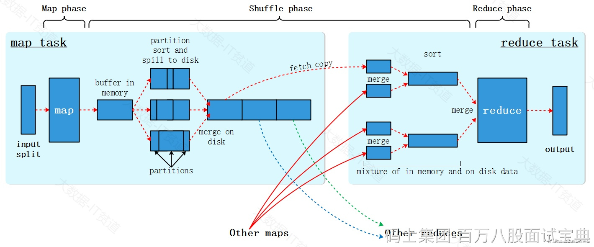
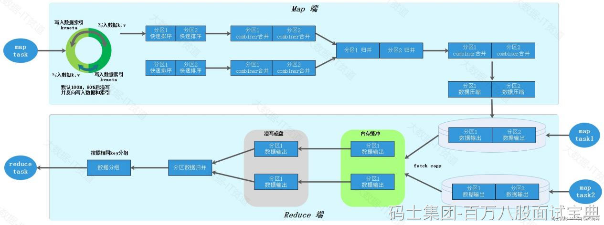

在MapReduce中有一个非常重要的概念：Shuffle。MapReduce中，在Map阶段处理完数据后，会将具有相同key的数据进行重新分区、排序，并最终将每个Map任务的输出合并成一个文件。然后，在Reduce阶段通过数据拷贝将数据传送到相应的Reduce任务进行处理。这个过程就是Shuffle过程的核心。简而言之，MapReduce中的Shuffle过程指的是在Map方法执行后、Reduce方法执行前对数据进行处理和准备的阶段。

上图Shuffle更加详细的流程如下图所示，Map Task处理完的数据首先写入到默认100M的环形缓冲区，底层使用数组是实现，一半存储数据，一般存储数据对应的索引信息，当环形缓冲区中的空间被使用到80%时数据会发生溢写，同时，会找到剩余空间的中间位置反向继续写入数据和索引，这样做的好处是更好的利用存储空间存储更多的数据。溢写的数据会经过分区、快速排序形成小文件数据，用户可以选择是否使用Combiner进行map预聚合，如果使用每个分区内的数据还会进行合并，多次溢写的小文件最终会通过归并排序合并成一个大磁盘文件，如果设置了压缩，会将数据压缩后最终写入磁盘文件。

Reduce Task会将多个Map Task处理的数据复制到Redcue端，首先会放入内存缓冲区中，当内存不足时会将数据写入到磁盘文件，后续经过归并排序将从不同的Map Task拉取过来的数据合并成一个文件，根据相同的key分成对应的一组组数据，最终被Reduce Task处理。

Shuffle阶段包括如下几个步骤：

- 分区（Partitioning）：根据键值对的键，将中间键值对划分到不同的分区。每个分区对应一个Reduce任务，这样可以确保相同键的键值对被发送到同一个Reduce任务上进行处理。
- 排序（Sorting）：对每个分区内的中间键值对按键进行排序（快排）。通过排序，相同键的键值对会相邻存放，以便后续的合并操作更高效。
- 合并（Merging）：对多次溢写的结果按照分区进行归并排序合并溢写文件，每个maptask最终形成一个磁盘一些文件，减少后续Reduce阶段的输入数据量。
- Combiner（局部合并器）：Combiner是一个可选的优化步骤，在Map任务输出结果后、Reduce输入前执行。其作用是对Map任务的输出进行局部合并，将具有相同键的键值对合并为一个，以减少需要传输到Reduce节点的数据量，降低网络开销，并提高整体性能。Combiner实际上是一种轻量级的Reduce操作，用于减少数据在网络传输过程中的负担。需要注意的是，Combiner的执行并不是强制的，而是由开发人员根据具体情况决定是否使用。
- 拷贝（Copying）：将各分区内的数据复制到各自对应的Reduce任务节点上，会先向内存缓冲区中存放数据，内存不够再溢写磁盘，当所有数据复制完毕后，Reduce Task统一对内存和磁盘数据进行归并排序并交由Redcue方法并行处理。

以上过程共同构成了Shuffle过程，在MapReduce中起着重要的作用，用于重新组织和准备数据，并在Reduce阶段进行最终的计算和处理。
