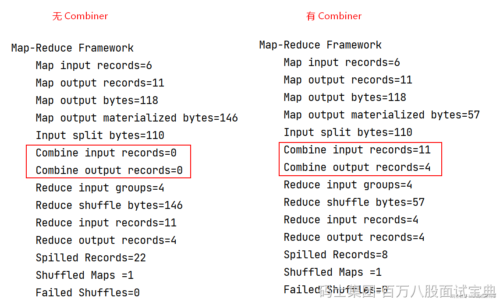

Combiner是一个可选的优化步骤，在Map任务输出结果后、Reduce输入前执行。其作用是对Map任务的输出进行局部合并，将具有相同键的键值对合并为一个，以减少需要传输到Reduce节点的数据量，降低网络开销，并提高整体性能。

Combiner实际上是一种轻量级的Reduce操作，用于减少数据在网络传输过程中的负担。需要注意的是，Combiner的执行并不是强制的，而是由开发人员根据具体情况决定是否使用，一些情况下不适合使用Combiner，例如：对数据进行均值计算场景。

在MapReduce中使用Combiner预聚合需要两个步骤：

1. 自定义类实现Reducer，实现reduce方法，完成聚合逻辑
2. 在Driver中设置“job.setCombinerClass(YourCombiner.class)”在Map端使用Combiner预聚合。

下面对WordCount案例进行改造，实现Map端进行相同单词的预聚合。

## **自定义类WordCountCombiner类实现Reducer类**

|  |
| --- |
| import org.apache.hadoop.io.IntWritable;import org.apache.hadoop.io.Text;import org.apache.hadoop.mapreduce.Reducer; import java.io.IOException; public class WordCountCombiner extends Reducer<Text, IntWritable,Text,IntWritable> {  *//创建写出的value* IntWritable total = new IntWritable();   *//每组key会调用一次* @Override  protected void reduce(Text key, Iterable<IntWritable> values, Reducer<Text, IntWritable, Text, IntWritable>.Context context) throws IOException, InterruptedException {  int sum = 0;   *//累加* for (IntWritable value : values) {  sum += value.get();  }   *//设置当前key对应value结果值* total.set(sum);   *//结果写出* context.write(key,total);  } } |

## **Driver代码中使用map端Combiner**

|  |
| --- |
| *//设置使用Map端Combiner*job.setCombinerClass(WordCountCombiner.class); |

以上代码运行结果上来看，设置Combiner后与不设置Combiner结果一样，但在底层运行上Map端已经进行了预聚合。

在自定义Combiner代码时，我们发现自定义的Combiner类与Reducer实现代码一样，实际上Combiner就是一种轻量级的Reduce操作，但Combiner和Reducer的区别在于Combiner是在Map端进行数据预聚合，会在每个MapTask所在节点执行，而Reduce 是针对所有Map Task的输出结果进行处理输出结果。
