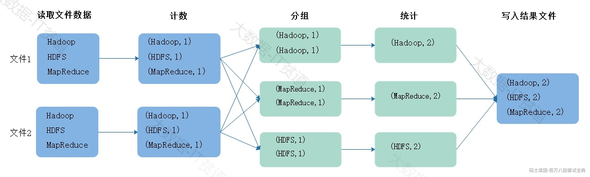
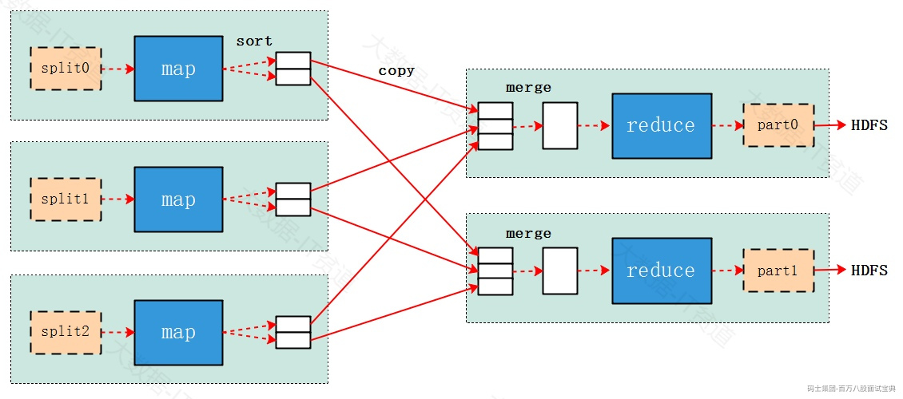
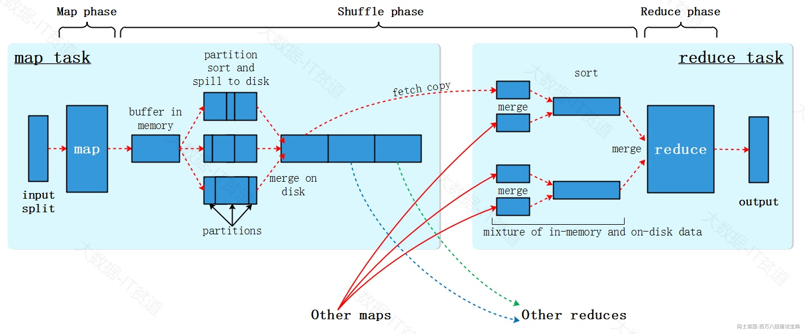
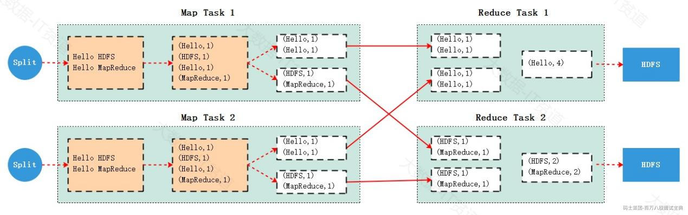
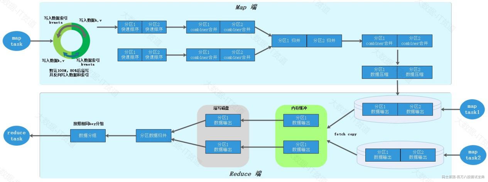
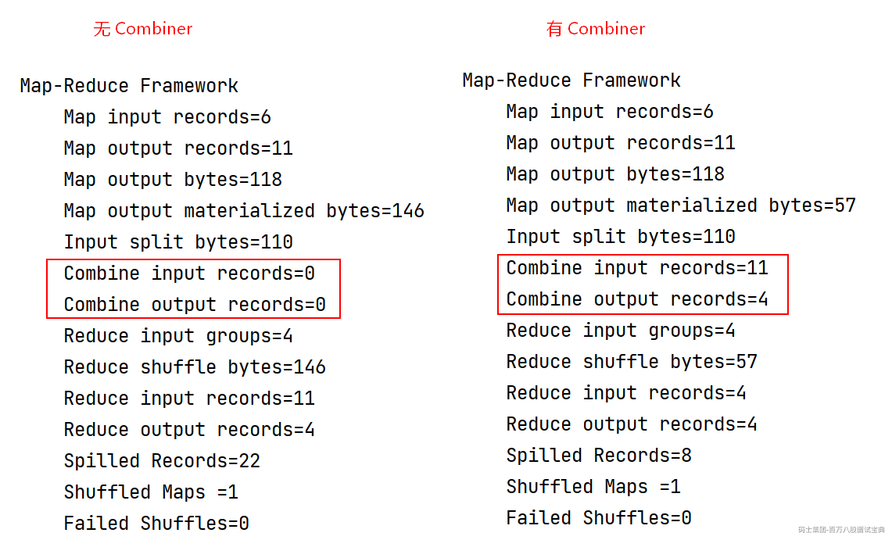

# 1 MapReduce面试题

## 1.1 介绍MapReduce及其优缺点

MapReduce是Hadoop生态中的计算框架，用于大规模数据集的并行计算，我们可以通过编写MapReduce程序对HDFS集群中海量数据进行相应业务逻辑处理，并将MapReduce程序运行在Hadoop Yarn集群中。

MapReduce作为第一代计算框架在当时各个互联网企业中使用非常普遍，但是随着Spark、Flink等第二代计算框架的出现，目前MapReduce在企业中使用相对较少，逐渐被Spark、Flink后续发展起来的计算框架替代，主要原因是MapReduce编程相比于其他计算框架有优点也有缺点。

1. **MapReduce优点**

- **编程灵活**：MapReduce模型是一种通用的并行计算框架，提供了相应编程接口，用户只需要实现对应接口,根据自己的需求编写不同的map和reduce函数，即可实现各种不同的数据处理逻辑。
- **可伸缩性**：MapReduce程序可以运行在资源调度框架集群中，这些资源调度框架集群可以轻松地扩展到数百或数千台服务器，以便MapReduce处理大规模的数据集。
- **容错性**：MapReduce框架内置了容错机制，能够处理节点故障和数据丢失,当一个节点出现故障时，框架会重新调度任务到其他可用的节点上执行，保证了任务的顺利完成。

2. **MapReduce缺点**

- **不能用于实时场景**：MapReduce计算框架只适合处理批数据任务，不能对实时数据进行处理。
- **复杂业务下代码编程复杂**：虽然MapReduce模型的编程接口相对简单，但是在处理一些复杂的数据处理任务时，可能需要编写大量的代码来实现，相比于后续的计算框架（如：Spark、Flink）给用户提供了更高级的API便于处理复杂业务场景来说，MapReduce的编程相对复杂。
- **不适合迭代计算**：如果多个应用之间有数据依赖，MapReduce编程中需要每次将应用程序数据写出到磁盘，供给下一个应用程序作为数据输入源使用，这在编程复杂性及磁盘IO上带来了复杂性，影响编程效率和程序性能。而新一代计算框架（如Spark、Flink）可以将复杂多个业务逻辑编写到一个应用程序中并可以基于内存进行数据传递。

虽然MapReduce目前在企业中使用较少，但是其处理数据的核心思想影响非常重要，甚至后续计算框架处理数据时都参考了MapReduce处理数据的思想，所以学习好MapReduce也至关重要。

## 1.2 MapReduce编程思想及原理？

假设现在有两个文件，数据如下，假如我们要读取文件中的数据进行wordcount统计，那么需要进行如下步骤：

以上过程演示的就是MapReduce处理数据的大体流程，MapReduce模型由两个主要阶段组成：Map阶段和Reduce阶段：

- **Map阶段：**

在Map阶段中，输入数据被分割成若干个独立的块，并由多个Mapper任务并行处理，每个Mapper任务都会执行用户定义的map函数，将输入数据转换成一系列键-值对的形式（Key-Value Pairs），这些键-值对被中间存储，以供Reduce阶段使用。

Map阶段主要是对数据进行映射变换，读取一条数据可以返回一条或者多条K,V格式数据。

- **Reduce阶段：**

在Reduce阶段中，所有具有相同键的键-值对会被分配到同一个Reducer任务上，Reducer任务会执行用户定义的reduce函数，对相同键的值进行聚合、汇总或其他操作，生成最终的输出结果，Reduce阶段也可以由多个Reduce Task并行执行。

Reduce阶段主要对相同key的数据进行聚合，最终对相同key的数据生成一个结果，最终写出到磁盘文件中。

往往MapReduce读取的数据来自于HDFS集群中，处理完数据后写出到HDFS :

在HDFS中数据以Block进行存储，Map阶段读取数据文件时，实际上首先会对文件进行Split分片，每个分片大小默认与HDFS中block大小相同，也可以人为调整，每个Split切片被一个Map task进行处理，多个Split被多个Map task并行读取处理，所以默认MapTask的并行度由读取文件的block数决定。

每个MapTask会读取对应的Split数据组织成K,V格式数据，然后将数据按照Key分组，写入到磁盘文件，然后ReduceTask会将相同的Key组数据拉取到Reduce端进行处理，Reduce端也可以是多个Task并行读取MapTask端写出的数据文件，这里可以通过人为方式进行设置Reduce Task个数，默认为1。

注意：Map阶段和Reduce阶段所有并行运行的Task互不相干，Reduce最终写出的数据是写入到磁盘中，复杂业务场景中如果我们想要基于MapReduce处理的结果再次进行分析处理，就需要再编写新的MapReduce程序进行处理。

## 1.3 MapReduce处理数据流程？

如下是MapReduce处理数据流程:

1. 首先MapReduce会将处理的数据集划分成多个split，split划分是逻辑上进行划分，而非物理上的切分，每个split默认与Block块大小相同，每个split由1个map task进行处理。
2. map task以行为单位读取split中的数据，将数据转换成K，V格式数据，根据Key计算出本条数据应该写出的分区号，最终在内部得到(K,V,P)格式数据写入到当前map task 所在的物理节点磁盘，便于后续reduce task的处理。
3. 为了避免每条数据都产生一次IO，MapReduce 引入了“环形缓冲区”内存数据结构，默认大小100M。先将处理好的每条数据写入到“环形缓冲区”，当环形缓冲区使用达到80%时，会将数据溢写到磁盘文件。根据split大小不同，可能会发生多次溢写磁盘过程。
4. 每次溢写磁盘时会对数据进行二次排序：按照数据（K,V,P）中的P（分区）进行排序并在每个P（分区）中按照K进行排序，这样能保证相同的分区数据放在一起并能保证每个分区内的数据按照key有序。
5. 最终多次溢写的磁盘文件数据会根据归并排序算法合并成一个完整的磁盘文件，此刻，该磁盘文件特点是分区有序且分区内部数据按照key有序。
6. Reduce端每个Reduce task会从每个map task所在的节点上拉取落地的磁盘文件对应的分区数据，对于每个Reduce task来说，从各个节点上拉取到多个分区数据后，每个分区内的数据按照key分组有序，但是总体来看这些分区文件中key数据不是全局有序状态（分区数据内部有序，外部无序）。
7. 每个Reduce task需要再通过一次归并排序进行数据merge，将每个分区内的数据变成分区内按照key有序状态，然后通过Reduce task处理将结果写出到HDFS磁盘。

下图是MapReduce 读取HDFS中数据进行wordcount统计中，MapTask和Reduce Task处理数据流程如下：

## 1.4 解释MapReduce Shuffle流程

在MapReduce中有一个非常重要的概念：Shuffle。MapReduce中，在Map阶段处理完数据后，会将具有相同key的数据进行重新分区、排序，并最终将每个Map任务的输出合并成一个文件。然后，在Reduce阶段通过数据拷贝将数据传送到相应的Reduce任务进行处理。这个过程就是Shuffle过程的核心。简而言之，MapReduce中的Shuffle过程指的是在Map方法执行后、Reduce方法执行前对数据进行处理和准备的阶段。

上图Shuffle更加详细的流程如下图所示，Map Task处理完的数据首先写入到默认100M的环形缓冲区，底层使用数组是实现，一半存储数据，一般存储数据对应的索引信息，当环形缓冲区中的空间被使用到80%时数据会发生溢写，同时，会找到剩余空间的中间位置反向继续写入数据和索引，这样做的好处是更好的利用存储空间存储更多的数据。溢写的数据会经过分区、快速排序形成小文件数据，用户可以选择是否使用Combiner进行map预聚合，如果使用每个分区内的数据还会进行合并，多次溢写的小文件最终会通过归并排序合并成一个大磁盘文件，如果设置了压缩，会将数据压缩后最终写入磁盘文件。

Reduce Task会将多个Map Task处理的数据复制到Redcue端，首先会放入内存缓冲区中，当内存不足时会将数据写入到磁盘文件，后续经过归并排序将从不同的Map Task拉取过来的数据合并成一个文件，根据相同的key分成对应的一组组数据，最终被Reduce Task处理。

Shuffle阶段包括如下几个步骤：

- 分区（Partitioning）：根据键值对的键，将中间键值对划分到不同的分区。每个分区对应一个Reduce任务，这样可以确保相同键的键值对被发送到同一个Reduce任务上进行处理。
- 排序（Sorting）：对每个分区内的中间键值对按键进行排序（快排）。通过排序，相同键的键值对会相邻存放，以便后续的合并操作更高效。
- 合并（Merging）：对多次溢写的结果按照分区进行归并排序合并溢写文件，每个maptask最终形成一个磁盘一些文件，减少后续Reduce阶段的输入数据量。
- Combiner（局部合并器）：Combiner是一个可选的优化步骤，在Map任务输出结果后、Reduce输入前执行。其作用是对Map任务的输出进行局部合并，将具有相同键的键值对合并为一个，以减少需要传输到Reduce节点的数据量，降低网络开销，并提高整体性能。Combiner实际上是一种轻量级的Reduce操作，用于减少数据在网络传输过程中的负担。需要注意的是，Combiner的执行并不是强制的，而是由开发人员根据具体情况决定是否使用。
- 拷贝（Copying）：将各分区内的数据复制到各自对应的Reduce任务节点上，会先向内存缓冲区中存放数据，内存不够再溢写磁盘，当所有数据复制完毕后，Reduce Task统一对内存和磁盘数据进行归并排序并交由Redcue方法并行处理。

以上过程共同构成了Shuffle过程，在MapReduce中起着重要的作用，用于重新组织和准备数据，并在Reduce阶段进行最终的计算和处理。

## 1.5 MR中三次排序是哪三次？

在MapReduce处理数据过程中，无论在业务逻辑上是否需要，Map Task和Reduce Task都会按照key对数据进行排序，Map和reduce两个阶段中涉及到三次排序，具体如下：

第一次排序发生在Map阶段的磁盘溢写时：当MapReduce的环形缓冲区达到溢写阈值时，在数据刷写到磁盘之前，会对数据按照key的字典序进行快速排序，以确保每个分区内的数据有序。

第二次排序发生在多个溢写磁盘小文件合并的过程中：经过多次溢写后，Map端会生成多个磁盘文件，这些文件会被合并成一个分区有序且内部数据有序的输出文件，从而确保输出文件整体有序。

第三次排序发生在Reduce端：Reduce任务在获取来自多个Map任务输出文件后，进行合并操作并通过归并排序生成每个Reduce Task处理的分区文件整体有序。

## 1.6 MR中Combiner是什么?

Combiner是一个可选的优化步骤，在Map任务输出结果后、Reduce输入前执行。其作用是对Map任务的输出进行局部合并，将具有相同键的键值对合并为一个，以减少需要传输到Reduce节点的数据量，降低网络开销，并提高整体性能。

Combiner实际上是一种轻量级的Reduce操作，用于减少数据在网络传输过程中的负担。需要注意的是，Combiner的执行并不是强制的，而是由开发人员根据具体情况决定是否使用，一些情况下不适合使用Combiner，例如：对数据进行均值计算场景。

在MapReduce中使用Combiner预聚合需要两个步骤：

1. 自定义类实现Reducer，实现reduce方法，完成聚合逻辑
2. 在Driver中设置“job.setCombinerClass(YourCombiner.class)”在Map端使用Combiner预聚合。

下面对WordCount案例进行改造，实现Map端进行相同单词的预聚合。

1. **自定义类WordCountCombiner类实现Reducer类**

1. **Driver代码中使用map端Combiner**

以上代码运行结果上来看，设置Combiner后与不设置Combiner结果一样，但在底层运行上Map端已经进行了预聚合。

在自定义Combiner代码时，我们发现自定义的Combiner类与Reducer实现代码一样，实际上Combiner就是一种轻量级的Reduce操作，但Combiner和Reducer的区别在于Combiner是在Map端进行数据预聚合，会在每个MapTask所在节点执行，而Reduce 是针对所有Map Task的输出结果进行处理输出结果。

## 1.7 MR处理数据支持哪些压缩格式？

MapReduce中支持的常见的压缩算法如下：

以上各种压缩格式中，压缩比和压缩性能比较如下：

- 压缩比率对比: bzip2 > gzip > snappy > lzo > lz4，bzip2压缩比可以达到8:1;gzip压缩比可以达到5比1;lzo可以达到3:1。
- 压缩性能对比：lz4 > lzo > snappy > gzip>bzip2 ，lzo压缩速度可达约50M/s,解压速度可达约70M/s;gzip速度约为20M/s,解压速度约为60M/s;bzip2压缩速度约为2.5M/s，解压速度约为9.5M/s。

在MapReduce中使用压缩格式有如下建议：

1. MapReduce中读取数据后在mapper中可以输出压缩格式中间结果数据，常用的压缩格式是snappy和lzo格式，这两种格式压缩/解压缩比例相对较快，Reduce端输出结果数据也可以输出压缩格式数据，如果输出数据量小，也可以选择snappy/lzo格式，如果输出数据结果较大，可以选择bzip2压缩格式。
2. 如果MapReduce输出的结果作为下一个MapReduce的输入，还需要考虑对应的压缩格式是否支持Split。
3. MapReduce中对于运算密集型Job建议少用压缩，对于IO密集型操作，建议可以使用压缩。

## 1.8 MR Split切分源码

MapReduce中切分分片的方法为“writeSplits(job, submitJobDir)”，该方法返回maptask个数，说明MapReduce中切片数决定maptask个数。

writeSplit(job,submitJobDir)方法中通过新的API进行切片，代码如下：

WriteNewMapper()方法内容大体如下：

以上代码中input得到的InputFormat输入格式化类对象默认为TextInputFormat.class，也可以通过“mapreduce.job.inputformat.class”参数在提交MapReduce任务时指定输入格式化类。

TextInputFormat类继承自FileInputFormat抽象类，FileInputFormat抽象类又继承自InputFormat抽象类，所以进行切片split的方法“input.getSplits(job)”最终调用到FileInputFormat.getSplits方法，该方法主要内容如下：

关于MapReduce读取数据切片的源码总结如下：

1. MapReduce中默认的输入格式化类是TextInputFormat
2. 每个split大小默认和blockSize大小一样，为128M
3. 如果要调整split的大小可以通过调节mapreduce.input.fileinputformat.split.minsize或者mapreduce.input.fileinputformat.split.maxsize参数，假设想要调节Split大小为100M，那么就设置mapreduce.input.fileinputformat.split.maxsize为100M即可，如果要调节Split为200M，那么就设置mapreduce.input.fileinputformat.split.minsize为200M即可。
4. 如果一个文件大小没有超过splitSize的1.1倍数，默认不切分split。
5. 每个split都会对应到block块信息，进而得到当前块所在的节点信息，方便Map Task分发到对应节点上执行。

## 1.9 MR Map Task运行源码流程

1. **Map Task运行**

JobSubmitter.submitJobInternal方法中最后提交Job如下：

submitClient对象有两种实现：LocalJobRunner和YarnRunner，以LocalJobRunner为例，执行submitJob方法会创建Job对象并调用Job run方法运行map Task和Reduce Task。

LocaljobRunner.submitJob方法如下:

Job.run方法大体内容如下：

运行map task的runTasks方法中最终遍历mapTaskRunnable对象并执行run方法创建和运行mapTask。

mapTaskRunnable.run方法内容如下：

最终mapTask运行会调用到MapTask.run方法，MapTask.run方法主要内容如下：

以上方法中使用新API来执行map task，MapTask.runNewMapper主要内容如下:

在以上runNewMapper方法中，input.initialize(split, mapperContext) 方法最终调用到LineRecordReader.initialize方法，该方法中主要设置每个split相对文件的偏移量起始位置，每个split都会让出开头的一行，这样上一个split中最后可以读取到完整的一行数据。

LineRecordReader.initialize方法内容如下：

在以上runNewMapper方法中，mapper.run方法内容如下：

其中while语句中的 context.nextKeyValue()方法调用的是LineRecoredReader.nextKeyValue()方法，可以看到在当前split中按照行进行每行读取数据，并除了最后一个split外都会往后多读取一行数据。map方法最终调用到用户自己编写的map数据处理逻辑。

LineRecoredReader.nextKeyValue()方法内容如下：

以上Map Task运行结论如下：

1. 默认数据输入是TextInputFormat，读取split数据时默认使用的LineRecorderReadr，即一行行读取数据。
2. 一行行读取数据时，除了最后一个split外，每个split都会在最后多读取一行数据。
3. 每个MapTask处理对应spilt数据时，会让出该split第一行数据，从下一行开始的位置作为该split的读取数据的start位置，MapRedcue中除了最后一个spilt外，所有的split都会多读取一行数据，这样下个Split让出的数据被上个spilt进行了读取，让出的这一行会被数据移动到上个split所在节点被处理。
4. **Map Task输出**

在自己实现的Mapper类中，我们可以看到Map端最终将K,V格式数据通过“context.write(Key,Value);”写出,这里的context对象实际上就是WrappedMapper对象，所以write方法调用到WrappedMapper.write(...)方法。

WrappedMapper.write(...)方法如下：

以上代码中mapContext对象是在MapTask.runNewMapper(...)方法中创建的mapContext对象，MapTask.runNewMapper(...)方法关键代码如下:

mapContext是MapContextImpl对象，其父类为TaskInputOutputContextImpl，所以mapContext.write(key, value);最终调用到TaskInputOutputContextImpl.write(...)实现。

TaskInputOutputContextImpl.write(...)代码如下：

以上代码中output对象是在MapTask.runNewMapper(...)方法中创建的NewOutputCollector对象，MapTask.runNewMapper(...)方法关键代码如下：

所以，最终mapper端的写出就是调用的NewOutputCollector.write（...）方法，NewOutputCollector.write(...)具体代码如下：

以上collector.collect(...)方法最终调用MapOutputBuffer.collect(...) 方法将数据结果写出到磁盘文件中去，完成map端数据写出磁盘文件。

在MapReduce中数据写入磁盘前会先写入环形缓冲区，默认100M大小，满80%会溢写磁盘，这些设置都是在执行“output = new NewOutputCollector(taskContext, job, umbilical, reporter);”中创建的，当创建 NewOutputCollector对象时创建了MapOutputCollector collect收集器对象并设置溢写时使用的分区器（默认为hashpartitioner）。创建NewOutputCollector对象时对应构造函数如下：

createSortingCollector中返回MapOutputBuffer对象，并设置数据溢写的分区、排序、combiner等操作。MapTask.createSortingCollector方法大体逻辑如下：

以上方法collector.init(context)中进行了环形缓冲区大小、溢写阈值、分区、排序、Combiner、守护线程溢写等设置。

MapOutputBuffer.init(Context)方法主要内容如下：

spillThread.start()会检测溢写阈值达到80%时将环形缓冲区中的数据写出到磁盘。

最终多次溢写磁盘的多个小文件会在执行到MapTast.runNewMapper中的output.close()代码时进行合并成一个文件。

MapTask数据输出过程总结：

1. 当Redcue Task为1时，map端写出数据只有1个分区，不会经过分区、排序操作。
2. MapTask数据溢写时，默认分区器是HashPartitioner，如果用户设置分区器则使用用户分区实现类。
3. map数据写出缓冲区默认100M，80%会溢写。
4. 在溢写磁盘过程中会进行数据排序，优先获取用户自定义排序比较器，如果用户没有设置默认使用Key本身自带的比较器。

## 1.10 MR Reduce Task运行源码流程

MapReduce中Reduce端拉取Map端数据后，会对key进行分组处理，这部分源码主要来看MapRedcue Reduce端如何针对一组key将对应的value进行获取。

MapReduce Job运行后，Job的run方法中执行完成map task后会执行reduce task，代码如下：

与Map Task运行一样，“runTasks(reduceRunnables, reduceService, "reduce");”最终会遍历RunnableWithThrowable对象进行执行对应run方法，RunnableWithThrowable的实现类是ReduceTaskRunnable，所以最终调用到ReduceTaskRunnable.run方法，在该方法中会创建Redcue Task并运行。

ReduceTaskRunnable.run方法大体逻辑如下：

以上reduce.run执行的是ReduceTask.run方法，该方法中会将Map端shuffle数据copy到reduce端组织成RawKeyValueIterator对象，对应的变量为rIter，然后Reduce端会使用新API遍历该迭代器中的数据按照用户传入的逻辑进行处理。

ReduceTask.run方法重点逻辑如下：

ReduceTasK.runNewReducer重点逻辑如下:

最终redcue.run方法调用到Redcuer.run方法，逻辑如下：

以上逻辑中通过while (context.nextKey())来判断Reduce Task是否有处理数据，并最终调用到reduce(context.getCurrentKey(), context.getValues(), context);方法执行到用户定义的redcue逻辑。

以上处理过程中有两个重点，一个是Redcue task处理的数据可能有很多组，每组如何区分？另外一个就是每组的value值如何获取到的？

在while (context.nextKey())判断是否存在下一条数据中，context.nextKey()实际调用的是ReduceContextImpl.nextKey()方法，大体逻辑如下：

以上逻辑重点方法为 nextKeyValue()，该方法最终返回true，同时在该方法中还进行了key ，value数据的反序列化操作、判断当前处理的key是否和下一条从迭代器中获取的数据key是否相同，如果相同表示下一条数据是当前组数据，否则表示当前组数据已经处理完，nextKeyValue()逻辑如下：

在reduce(context.getCurrentKey(), context.getValues(), context);代码中context.getValues()实际调用的是RedcueContextImpl.getValue()方法，该方法返回一个ValueIterable对象：

iterable即ValueIterable，ValueIterable对象实现了Iterable接口，如下：

可以看到当用户对相同的key的values调用iterator时，实际上调用到的就是ValueIterable.iterator方法，这里返回的是一个ValueIterator迭代器对象，当用户代码中执行iter.hasNext和iter.next()时，实际上调用的是ValueIterator.hasNext方法和ValueIterator.next()方法，在ValueIterator.next()方法中可以看到最终调用到nextKeyValue()方法，从map端拉取过来落地磁盘形成的迭代器中获取一个个value值，并非将当前key所有的value值一次性获取到Reduce端内存中。ValueIterator.next()具体代码如下：

在Redcue中将每个key及对应的values获取到后传给用户自定义的逻辑进行处理，最终写出到磁盘文件中。

ReduceTask源码总结：

1. Reduce 端从Map端获取数据后，会经过归并排序将数据形成一个迭代器RawKeyValueIterator，这样后续可以直接从迭代器中遍历每条数据使用。
2. Reduce 处理每组key对应的value值时，并非将当前key所有的value值存入reduce端的内存中，而是创建了一个ValueIterator迭代器最终从RawKeyValueIterator迭代器中获取每个value值，这样设计的好处是每个ReduceTask只需要遍历一遍磁盘数据就可以将每组key对应的所有value值都能获取到。

## 1.11 MR中如何设置MapTask和ReduceTask数量？

- **Map Task设置**

MapReduce中，Map Task的数量由输入数据的Split分片数量决定，每个Split对应一个Map Task，每个split大小默认和blockSize大小一样，为128M。

如果不想按照默认这种方式进行split分片，可以调节mapreduce.input.fileinputformat.split.minsize或者mapreduce.input.fileinputformat.split.maxsize参数，假设想要调节Split大小为100M，那么就设置mapreduce.input.fileinputformat.split.maxsize为100M即可，如果要调节Split为200M，那么就设置mapreduce.input.fileinputformat.split.minsize为200M即可。调节了Split分片大小实际上也就是调节了Map Task数量。以上参数设置方式如下：

此外，如果MapReduce中Map端读取的是大量小文件，每个小文件对应一个Map Task。

- **Reduce Task设置**

MapReduce中，如果代码中没有指定Reduce Task个数，那么默认Reduce Task个数为1，最终结果数据会写入到一个文件中。可以通过如下方式在Driver端设置Reduce Task个数，这样 MapReduce结果将根据多个Reduce Task写入多个文件。

设置多个Reduce Task后，每个Reduce Task处理的数据会按照默认的HashPartitioner 方式决定。

## 1.12 MR中如何处理数据倾斜问题？

- **什么是数据倾斜？**

在 MapReduce 任务执行过程中，数据倾斜（Data Skew） 是指某些 Key 数据量远超其他 Key，导致某些 Reducer 负载过重，处理时间远长于其他 Reducer，从而拖慢整体任务的执行效率。

- **如何查看MR任务是否存在数据倾斜？**

可以通过MR任务的WebUI(需要配置HistoryServer)查看任务执行详细信息，对比每个Reduce Task执行的所用时间，如果某个Reduce Task执行时间远超其他Reduce Task，那么该MR任务极有可能存在数据倾斜问题。

- **如何解决数据倾斜问题？**

可以从以下几个方面解决MR数据倾斜问题：

1. **对倾斜的Key随机加前缀**

处理数据前，可以对数据进行采样找出倾斜的key，然后Map端输出数据时对这些倾斜的key随机加前缀处理，使这些key均匀分散到不同的 Reducer 处理，同时针对Reduce端处理的结果再次去前缀，根据业务需求再次读取去前缀数据进行处理。

1. **自定义Partitioner**

MapReduce处理数据过程中，map端将数据转换成K,V格式数据并写入对应的分区，根据key进行hashcode取值然后与Reduce Task个数取模得到该条数据写出的分区号。

我们可以通过自定义分区器（需要创建类，该类继承Partitioner并重写getPartition方法，在该方法中控制数据分区的策略）在Driver代码中通过设置“job.setPartitionerClass(CustomPartitioner.class)”来使用自定义分区，将倾斜数据按照规则均衡分配到各个Reduce Task中处理。

另外还需要根据自己定义分区的个数在Driver代码中设置对应的ReduceTask个数，否则MapReduce会使用默认Reduce Task为1，导致自定义分区器不起作用或者报错。

1. **Combiner进行局部聚合**

Combiner是一个可选的优化步骤，在Map任务输出结果后、Reduce输入前执行。其作用是对Map任务的输出进行局部合并，将具有相同键的键值对合并为一个，以减少需要传输到Reduce节点的数据量，降低网络开销，并提高整体性能。

Combiner实际上是一种轻量级的Reduce操作，用于减少数据在网络传输过程中的负担。需要注意的是，Combiner的执行并不是强制的，而是由开发人员根据具体情况决定是否使用，一些情况下不适合使用Combiner，例如：对数据进行均值计算场景。

在Map端使用Combiner预聚合时可以在Driver中设置“job.setCombinerClass(YourCombiner.class)”。

1. **增加Reduce并行度**

如果MapReduce每个Reduce Task处理的数据量都比较大，可以适当增加Reduce并行度来均分数据，避免大量数据集中在少量Reduce Task中处理。

## 1.13 一行数据被切分到两个Block，MR读取时如何保证这行数据完整的？

HDFS中，数据被切分成Block，切分数据过程中HDFS并不会感知数据文件内容（如换行符），有可能导致一行数据被切分到两个Block中。

当 MapReduce 任务运行时，Hadoop采用LineRecordReader机制（一行行读取）来保证每个 Mapper读取的行是完整的，每个MapTask处理对应的InputSplit，具体策略要点如下：

- 每个Split在读取时（除最后一个Split之外），每个Split都会额外多读取下个Split的一行数据，确保跨Split的行能够完整交由上一个Split的MapTask处理。
- 每个Split在读取时（除第一个Split分片），跳过该Split的第一行，从下一行开始读取数据。

所以，在MapReduce中，通过LineRecordReader采用“让出当前 Split 的第一行 + 额外读取下一行”的策略，确保行数据不会被错误拆分到多个 MapTask，从而保证文本的完整性。

## 1.14 解释MapReduce中JVM重用机制

JVM重用（JVM Reuse）是Hadoop MapReduce中用于优化任务执行效率的一种技术，其核心思想是让同一个JVM 实例多次执行任务（如 Map 或 Reduce 任务），从而减少频繁启动和销毁 JVM 的开销，提升执行速度。

在未启用 JVM 重用的情况下，每个 Map 或 Reduce 任务会独立启动一个 JVM 进程，任务完成后立即销毁，这种方式在处理大量小任务时，频繁的 JVM 启停会导致显著的性能损耗（如内存分配、类加载等耗时操作）。

启用JVM重用后，一个JVM实例可以串行执行多个任务（例如多个 Map 任务），任务完成后JVM 不销毁，而是复用给下一个任务，这减少了重复初始化资源的开销，尤其适合短时任务或小文件处理场景。

可以通过设置"mapreduce.job.jvm.numtasks=N"参数指定单个JVM实例最多可以运行的任务数：

- N > 1：开启 JVM 复用，同一个 JVM 可执行最多 N 个任务。
- N = 1（默认值）：不复用，每个 Task 都启动新的 JVM 进程。
- N = -1：JVM 无限复用，直到任务执行完成才销毁 JVM。

注意：开启JVM重用后存在内存泄漏风险（长时间复用的 JVM 可能因任务代码中的内存泄漏导致堆内存累积，最终引发 OOM 错误），另外若单个task任务运行时间较长，JVM 重用的收益有限，甚至可能因资源占用影响集群吞吐量。

## 1.15 MR中job和tasks之间的区别是什么？

在Hadoop的MapReduce框架中，Job和Task是两个不同的概念，主要区别如下：

- Job（作业）：是用户提交的完整处理任务，包含整个数据处理流程，通常包括Map和Reduce两个阶段。Job由Hadoop集群的JobTracker（在Hadoop 1.x中）或ResourceManager（在Hadoop 2.x及以后版本中）负责接收、调度和监控。
- Task（任务）：是Job被拆分后的最小工作单元，具体执行数据处理操作。根据处理阶段的不同，Task分为Map Task和Reduce Task。Task由TaskTracker（在Hadoop 1.x中）或NodeManager（在Hadoop 2.x及以后版本中）负责在各个节点上执行和管理。

总结：Job是用户提交的整体作业，代表一个完整的数据处理流程；而Task是Job被拆分后的具体执行单元，负责实际的数据处理操作。
