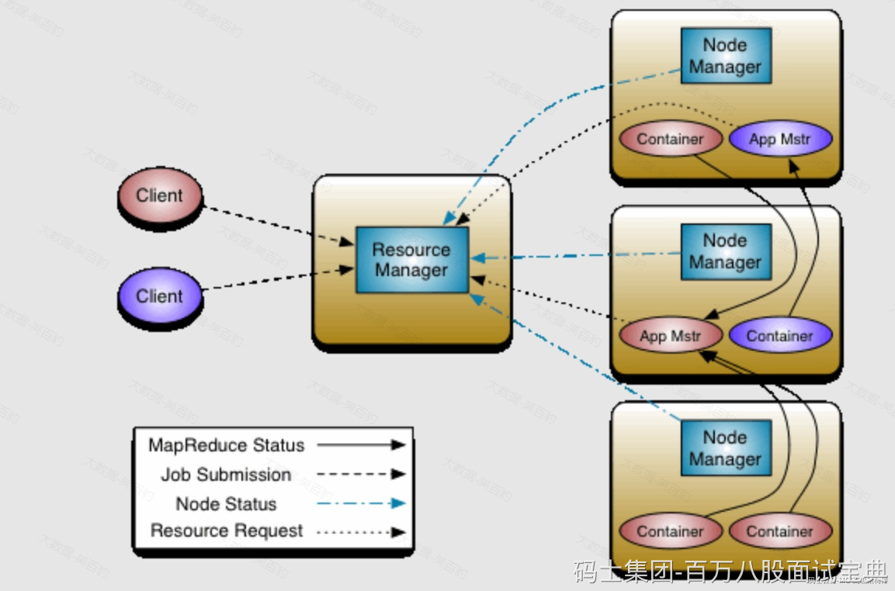

Apache Hadoop Yarn(Yet Another Reasource Negotiator，另一种资源协调者)是Hadoop2.x版本后使用的资源管理器，可以为上层应用提供统一的资源管理平台,Yarn主要由ResourceManager、NodeManager、ApplicationMaster、Container组成。架构如下下图所示：

- **ResourceManager**

ResourceManager是Yarn集群中的中央管理器，负责整个集群的资源分配与调度。ResourceManager负责监控NodeManager节点状态、汇集集群资源，处理Client提交任务的资源请求，为每个Application启动AppliationMaster并监控。

- **NodeManager**

NodeManager负责管理每个节点上的资源（如：内存、CPU等）并向ResourceManager报告。当ResourceManager向NodeManager分配一个容器（Container）时，NodeManager负责启动该容器并监控容器运行，此外，NodeManager还会接收AplicationMaster命令为每个Application启动容器（Container）。

- **ApplicationMaster**

每个运行在Yarn中的应用程序都会启动一个对应的ApplicationMaster，其负责与ResourceManager申请资源及管理应用程序任务。ApplicationMaster本质上也是一个容器，由ResourceManager进行资源调度并由NodeManager启动，ApplicationMaster启动后会向ResourceManager申请资源运行应用程序，ResourceManager分配容器资源后，ApplicationMaster会连接对应NodeManager通知启动Container并管理运行在Container上的任务。

- **Container**

Container 容器是Yarn中的基本执行单元，用于运行应用程序的任务，它是一个虚拟环境，包含应用程序代码、依赖项及运行所需资源（内存、CPU、磁盘、网络）。每个容器都由ResourceManager分配给ApplicationMaster，并由NodeManager在相应的节点上启动和管理。容器的资源使用情况由NodeManager监控，并在必要时向ResourceManager报告。

Yarn核心就是将MR1中JobTracker的资源管理和任务调度两个功能分开，分别由ResourceManager和ApplicationMaster进程实现，ResourceManager负责整个集群的资源管理和调度;ApplicationMaster负责应用程序任务调度、任务监控和容错等。
