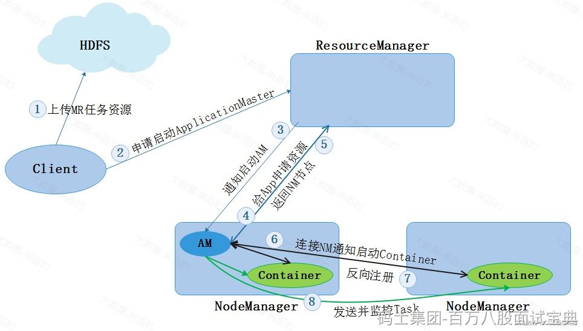

下面以MapReduce运行在Yarn中为例，说明基于Yarn运行任务整体流程。

1. 在客户端向Yarn中提交MR 任务，首先会将MR任务资源（Split、资源配置、Jar包信息）上传到HDFS中。
2. 客户端向ResourceManager申请启动ApplicationMaster。
3. ResourceManager会选择一台相对不忙的NodeManager节点，通知该节点启动ApplicationMaster(Container)。
4. ApplicationMaster启动之后，会从HDFS中下载MR任务资源信息到本地，然后向ResourceManager申请资源用于启动MR Task。
5. ResourceManager返回给ApplicationMaster资源清单。
6. ApplicationMaster进而通知对应的NodeManager启动Container
7. Container启动之后会反向注册到ApplicationMaster中。
8. ApplicationMaster 将Task任务发送到Container 运行，Task任务执行的就是我们写的代码业务逻辑。
