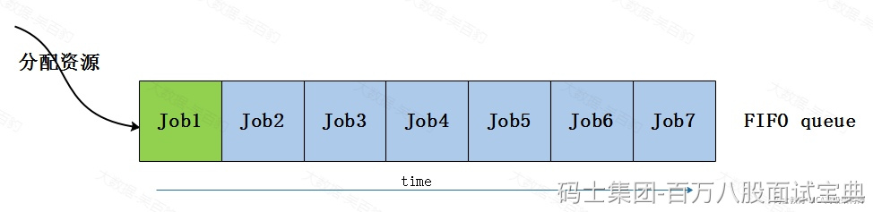
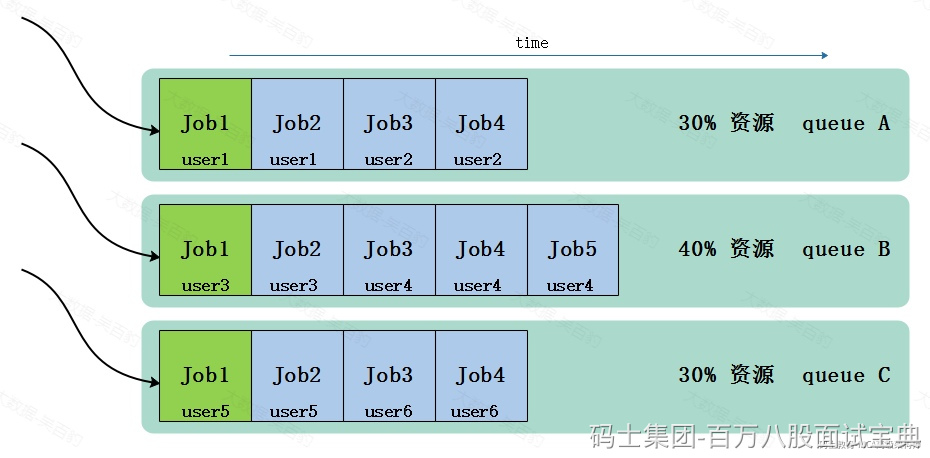
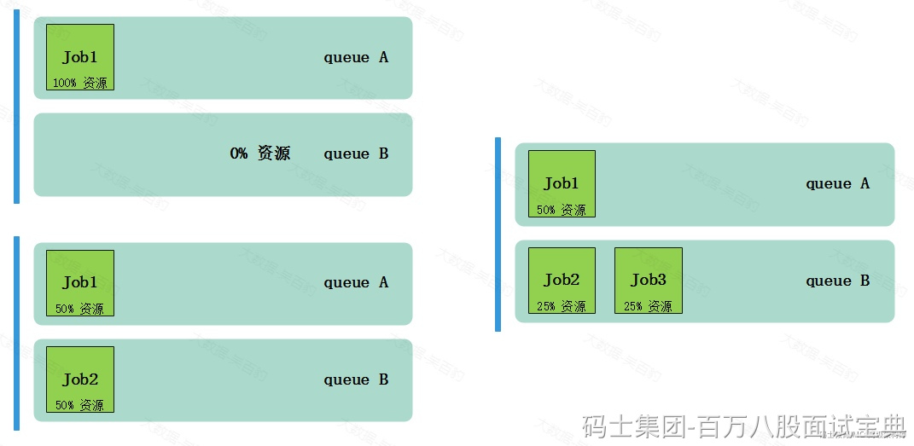

当向Yarn集群中提交Appliation后，Yarn调度器（Yarn Scheduler）负责为提交的Application进行资源调度和分配。Yarn中提供了如下几种不同的调度器：FIFO调度器（First-In-Fist-Out Scheduler）、Capacity调度器（Capacity Schduler）、Fair调度器（Fair Scheduler），每种调度器都有不同的调度算法和特点，下面分别对以上不同的调度算法进行解释。

## **FIFO调度器**

FIFO调度器（First-In-Fist-Out Scheduler），Yarn中最简单的调度器。FIFO Scheduler 会将提交的应用程序按提交顺序放入一个先进先出的队列中，进行资源分配时，先给队列中最头上的应用分配资源，待头上的应用资源需求满足后再给下一个应用分配资源，以此类推。这种调度器调度资源时，有可能某个资源需求大的应用占用所有集群资源，从而导致其他的应用被阻塞。

FIFO调度器只支持单队列，先进队列的任务先获取资源，排在后面的任务只能等待，不能同时保证其他任务获取运行资源，目前这种调度器已经很少使用。

## **Capacity调度器**

### **Capacity调度器介绍**

Capacity调度器（Capacity Schduler）是Yarn中默认配置的资源调度器，允许多租户安全地共享一个大型集群。Capacity调度器中，支持配置多个资源队列，可以为每个资源队列指定最低、最高可使用的资源比例，在进行资源分配时，优先将空闲资源分配给“实际资源/预算资源”比值最低的队列，每个资源队列内部采用FIFO调度策略。

Capacity调度器的核心思想是提前做预算，在预算指导下分享集群资源。其特点如下：

- 支持多租户共享集群，通过配置可以限制每个用户使用的资源比例。
- 集群资源由多个资源队列分享。
- 每个队列需要预先配置资源分配比例（最低、最高使用的资源比例），即事先规划好预算比例。
- 空闲资源优先分配给“实际资源/预算资源”比值最低的队列。
- 每个队列内部任务采用FIFO调度策略。
- 如果一个资源队列中资源有剩余，可以共享给其他需要资源的队列，但一旦该资源队列有任务提交运行，共享给其他资源队列的资源会及时回收供该资源队列使用。

### **Capacity资源分配策略**

Capacity Scheduler调度器中如果有多个资源队列，这些个资源队列进行资源分配时优先分配给“实际资源/预算资源”比值最低的队列。每个队列中有多个Job，给每个队列内的多个Job进行资源分配时，默认按照Job的FIFO顺序进行资源分配，用户也可以提交JOB时指定任务执行的优先级，优先级最高的先分配资源。

## **Fair调度器**

### **Fair调度器介绍**

Fair调度器（Fair Scheduler）是一个将Yarn资源公平的分配给各个Application的资源调度方式，这种调度方式可以使所有Application随着时间的流逝可以获取相等的资源份额，其设计目标就是根据定义的参数为所有的Application分配公平的资源。

Fair Scheduler 可以在多个资源队列之间进行资源平等共享。如下图，假设有两个资源队列A、B：

1. 当在资源队列A中启动一个Job而资源队列B中没有任务时，A资源队列会获取全部集群资源。
2. 当B资源队列中启动一个Job后，A资源队列中的Job继续运行，不过一会之后连个任务会各自获取一半的集群资源。
3. 如果此时B资源队列中再启动第二个Job，并且其他的Job还在运行，则它将会和B的第一个Job共享B资源队列中的资源，也就是B资源队列的两个Job各自使用集群资源的1/4，而A资源队列中的Job仍然使用集群一半的资源，资源在两个资源队列中平等共享。

FairScheduler资源调度核心思想就是通过资源平分的方式，动态分配资源，无需预先设定资源比例，实现资源分配公平，其特点如下：

- 支持多租户共享集群。（与Capacity调度器一样）
- 集群资源由多个资源队列分享。（与Capacity调度器一样）
- 如果一个资源队列中资源有剩余，可以共享给其他需要资源的队列，但一旦该资源队列有任务提交运行，共享给其他资源队列的资源会及时回收供该资源队列使用。（与Capacity调度器一样）
- 可以设置队列最小资源，允许将最小份额资源分配给资源队列，保证该资源队列可以启动任务。
- 默认情况允许所有Application程序运行，也可以限制每个资源队列中同时运行Application的数量。
- 根据Appliation的配置，抢占和分配资源可以是友好的或者强制的，默认不启用资源抢占。

### **Fair资源分配策略**

Fair Scheduler支持多资源队列，**每个资源队列进行资源调度时按照配置指定的权重平均分配资源**。在每个资源队列中job的资源调度策略有三种选择：FIFO、Fair（默认）、DRF，这三种Job调度策略解释如下。

- FIFO：Job按照先进先出进行资源调度，如果该队列中有多个Job，第一个Job分配完资源后，还有资源供第二个Job运行，那么可能存在多个Job并行运行的情况。这种情况下与Capacity调度器一样。
- Fair：FairScheduler中每个资源队列默认资源调度策略，只基于内存调度分配资源，按照不同Job的使用内存比例平均分配资源。
- DRF:基于vcores和内调度分配资源。

**备注：DFR(Dominant Resource Fairness,主导资源公平性)。**

在Yarn中如果进行资源调度时只考虑单一资源类型，如内存，那么这个事情就很简单，只需要将不同资源队列/Job按它们使用的内存量比例进行调度资源即可，FIFO/Fair就是只基于内存进行资源调度分配。然而当涉及多个资源类型时，情况就变得复杂，例如：一个用户的Application需要大量的CPU但使用很少内存，而另一个用户的Application需要很少的CPU但大量的内存，这里不能仅考虑内存比值来进行资源调度分配，否则可能出现资源分配不合理情况，这种情况除了内存之外还要考虑Application的Vcore使用情况，这就可以使用DRF资源分配策略。

DRF(Dominant Resource Fairness,资源分配策略中，会查看每个Application中主导资源（Dominant Resource）是什么，并将其作为集群调度资源的衡量标准。例如：yarn集群中共100个CPU和10TB内存，应用程序A请求容器（2个CPU，300GB内存），应用程序B请求容器（6个CPU，100GB内存）。A的请求是集群的（2%，3%），所以内存是主导资源，B的请求是集群的（6%，1%），所以CPU是主导资源，由于B程序的容器请求主要资源是A程序容器请求主要资源的2倍（6%/3%=2），所以在DRF资源分配策略下，B程序最大可使用在集群2/3资源。
