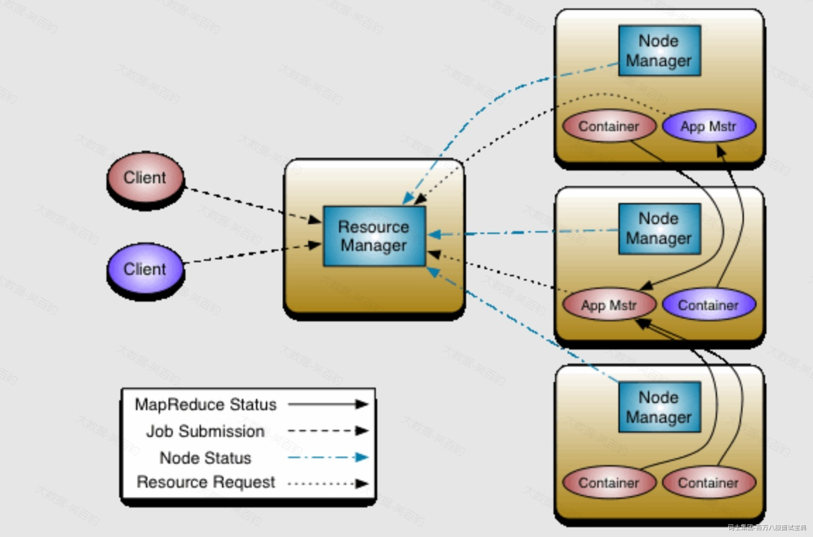
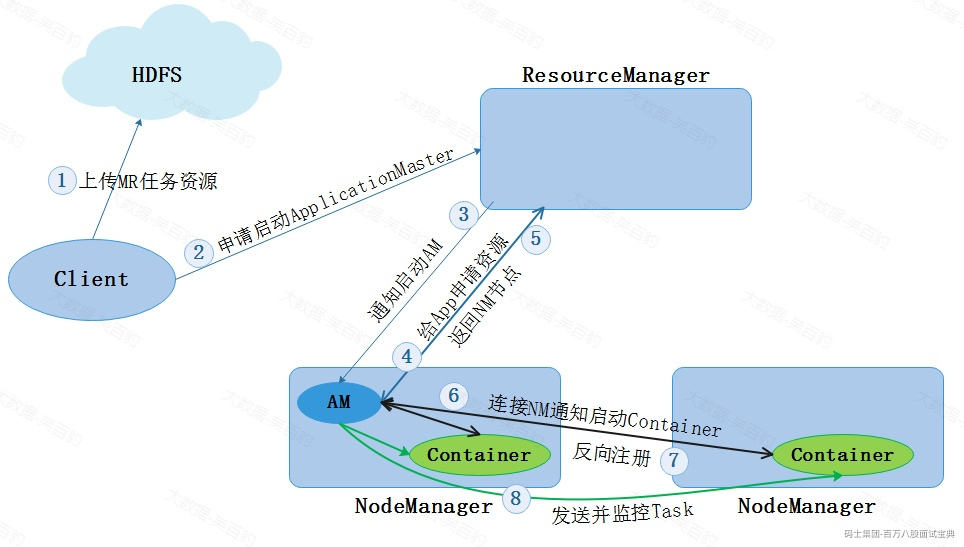
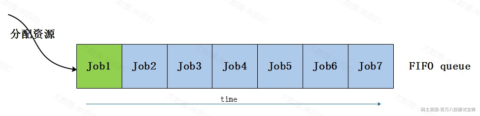
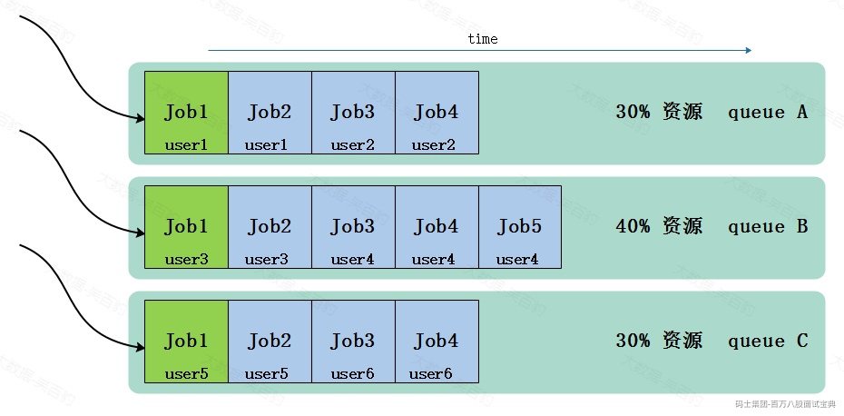
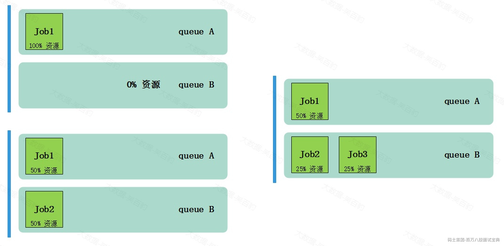

# 1 Yarn面试题

## 1.1 Yarn资源管理平台架构？

Apache Hadoop Yarn(Yet Another Reasource Negotiator，另一种资源协调者)是Hadoop2.x版本后使用的资源管理器，可以为上层应用提供统一的资源管理平台,Yarn主要由ResourceManager、NodeManager、ApplicationMaster、Container组成。架构如下下图所示：

- **ResourceManager**

ResourceManager是Yarn集群中的中央管理器，负责整个集群的资源分配与调度。ResourceManager负责监控NodeManager节点状态、汇集集群资源，处理Client提交任务的资源请求，为每个Application启动AppliationMaster并监控。

- **NodeManager**

NodeManager负责管理每个节点上的资源（如：内存、CPU等）并向ResourceManager报告。当ResourceManager向NodeManager分配一个容器（Container）时，NodeManager负责启动该容器并监控容器运行，此外，NodeManager还会接收AplicationMaster命令为每个Application启动容器（Container）。

- **ApplicationMaster**

每个运行在Yarn中的应用程序都会启动一个对应的ApplicationMaster，其负责与ResourceManager申请资源及管理应用程序任务。ApplicationMaster本质上也是一个容器，由ResourceManager进行资源调度并由NodeManager启动，ApplicationMaster启动后会向ResourceManager申请资源运行应用程序，ResourceManager分配容器资源后，ApplicationMaster会连接对应NodeManager通知启动Container并管理运行在Container上的任务。

- **Container**

Container 容器是Yarn中的基本执行单元，用于运行应用程序的任务，它是一个虚拟环境，包含应用程序代码、依赖项及运行所需资源（内存、CPU、磁盘、网络）。每个容器都由ResourceManager分配给ApplicationMaster，并由NodeManager在相应的节点上启动和管理。容器的资源使用情况由NodeManager监控，并在必要时向ResourceManager报告。

Yarn核心就是将MR1中JobTracker的资源管理和任务调度两个功能分开，分别由ResourceManager和ApplicationMaster进程实现，ResourceManager负责整个集群的资源管理和调度;ApplicationMaster负责应用程序任务调度、任务监控和容错等。

## 1.2 Yarn 任务运行流程

下面以MapReduce运行在Yarn中为例，说明基于Yarn运行任务整体流程。

1. 在客户端向Yarn中提交MR 任务，首先会将MR任务资源（Split、资源配置、Jar包信息）上传到HDFS中。
2. 客户端向ResourceManager申请启动ApplicationMaster。
3. ResourceManager会选择一台相对不忙的NodeManager节点，通知该节点启动ApplicationMaster(Container)。
4. ApplicationMaster启动之后，会从HDFS中下载MR任务资源信息到本地，然后向ResourceManager申请资源用于启动MR Task。
5. ResourceManager返回给ApplicationMaster资源清单。
6. ApplicationMaster进而通知对应的NodeManager启动Container
7. Container启动之后会反向注册到ApplicationMaster中。
8. ApplicationMaster 将Task任务发送到Container 运行，Task任务执行的就是我们写的代码业务逻辑。

## 1.3 Yarn常用命令有哪些？

1. **查看Yarn中资源情况**

命令：yarn top ，可以通过该命令实时查看application资源使用情况。

1. **查看Yarn Node**

命令：yarn node -list -all ，查看所有Yarn NodeManager节点信息

1. **列出所有Application**

命令：yarn application -list，列出所有Yarn中SUBMITTED, ACCEPTED, RUNNING的Applications。

1. **过滤Application状态**

命令：yarn application -list -appStates [ALL、NEW、NEW\_SAVING、SUBMITTED、ACCEPTED、RUNNING、FINISHED、FAILED、KILLED]，根据Application运行状态进行过滤。以上各种状态含义如下：

- ALL：所有状态应用程序。
- NEW：应用程序刚创建时的状态。应用程序会被分配一个唯一的Application ID，但还没有分配资源，也没有进入资源队列。
- NEW\_SAVING：应用程序等待资源保存。这个状态只存在于开启了Application历史保存的集群上，如果没有保存历史，则该状态的转换不会发生。
- SUBMITTED：应用程序已经提交给YARN，并在队列中等待调度资源。在该状态下，YARN只是对应用程序进行了初步的运行时配置，但还没有将任何容器分配到该应用程序。
- ACCEPTED：应用程序已经通过队列，并已经分配了它需要的初始和最小容器。
- RUNNING：应用程序正在运行中，并具有正在运行的容器。
- FINISHED：应用程序已经成功完成，并且其最终状态已经保存到YARN应用历史中。
- FAILED：应用程序运行失败，并且其最终状态已经保存到YARN应用历史中。
- KILLED：应用程序已被终止，并且其最终状态已经保存到YARN应用历史中。

1. **停止Application**

命令：yarn application -kill [applicationId] ，Kill掉指定applicationdi的application。

1. **查看Application日志**

命令：yarn logs -application <applicationId> ,查看指定application的日志。

1. **查看Application Attempt任务**

命令：yarn applicationattempt -list <applicationId>，列出指定application的attempt列表。

命令：yarn applicationattempt -status <applicationAttemptId> ,输出指定attemptId对应执行结果。

1. **列出Attempt任务container信息**

命令：yarn container -list <applicationAttemptId>，列出指定applicationAttemptId的Container。

命令：yarn container -status <containerId> ,列出指定ContainerId的状态。

注意：查看Container信息必须在Container运行情况下查询，因为Container运行结束后就会停止。

1. **查看container日志信息**

命令：yarn logs -applicationId <ApplicationId> -containerId <ContainerId>，查看某个application下containerId的运行日志。

1. **查看Yarn指定资源队列状态**

命令：yarn queue -status <QueueName>，查看队列状态，可以通过yarn top查看对应的资源队列有哪些。

1. **加载资源队列配置**

命令：yarn rmadmin -refreshQueues，该命令会加载资源队列配置。

## 1.4 Yarn核和内存相关参数有哪些？

Yarn中资源主要包含Cpu和内存，Yarn集群在节点数固定的情况下如果性能有瓶颈，可以尝试进行如下参数的调节。这些参数可以配置在$HADOOP\_HOME/etc/hadoop/yarn-site.xml配置文件中。

1. **yarn.nodemanager.resource.detect-hardware-capabilities**

该参数表示是否让Yarn自动探测服务器的CPU和内存资源，默认值false。

1. **yarn.nodemanager.resource.cpu-vcores**

该参数可以指定每个NodeManager上可以使用的虚拟CPU核心数，一个物理CPU可以被划分成多个虚拟CPU，该参数配置值可以大于物理CPU个数，可以提高并发，但配置过大有可能会带来服务器处理不过来、负载增大问题。 默认值为-1/8，当yarn.nodemanager.resource.detect-hardware-capabilities为true时，在 Windows 和 Linux 系统中会自动确定使用的cpu核心数；否则默认值为8，手动配置时，建议该值比真CPU个数小几个，留出一定的CPU用于其他服务使用。

1. **yarn.nodemanager.resource.memory-mb**

该参数表示每个节点可以分配给NodeManager的内存量，单位MB。默认值为-1/8GB，当yarn.nodemanager.resource.detect-hardware-capabilities为true时，在 Windows 和 Linux 系统中会自动计算；否则默认值为8192MB（8GB）。手动配置时，建议给Yarn分配80%内存，留出20%给服务器其他服务使用。

1. **yarn.nodemanager.resource.percentage-physical-cpu-limit**

该参数指定NodeManager可以使用节点的物理CPU核心百分比，默认值100，表示Yarn NodeManager可以使用节点所有的物理CPU核心。建议可以设置为80%，留出20%给服务器其他服务使用。

1. **yarn.nodemanager.resource.system-reserved-memory-mb**

该参数表示NodeManager节点上为非Yarn进程保留的物理内存量。该配置仅在yarn.nodemanager.resource.detect-hardware-capabilities设置为true并且yarn.nodemanager.resource.memory-mb设置为-1时生效。默认值为-1，即20%\*（系统内存-HADOOP使用内存）

1. **yarn.nodemanager.resource.pcores-vcores-multiplier**

该参数表示将物理核心数转换成虚拟核心个数的乘数。默认值为1.0，表示一个物理的cpu当做一个vcore使用。提交到NodeManager上的任务有些是非计算型密集任务，有些是计算密集型任务，那么通过设置这个参数可以更合理的利用资源。一般如果集群资源够用，不需调节此参数。

1. **yarn.nodemanager.vmem-pmem-ratio**

该值表示Yarn中任务的单位物理内存可使用的虚拟内存比例，默认值为2.1，表示任务每分配1MB的物理内存，虚拟内存最大可使用2.1MB。如果Yarn集群中内存较为紧张可以适当调大该参数。一般集群内存够用，不需调节此参数。

虚拟内存是计算机系统内存管理的一种技术，为每个进程提供了连续的、私有的地址空间，让程序可以拥有超过物理内存大小的可用内存空间。在Yarn中，虚拟内存的原理是将容器的内存分配扩展到硬盘空间，使得每个容器都能认为自己拥有连续可用的内存，从而更有效地管理内存，减少出错，并提高系统资源利用率和整体性能。

1. **yarn.nodemanager.pmem-check-enabled**

是否启动一个线程检查container使用的物理内存量，如果使用内存量超出NodeManager分配使用的内存域值，则直接kill掉对应的任务，默认为true，不建议关闭。

1. **yarn.nodemanager.vmem-check-enabled**

是否启动一个线程检查container使用的虚拟内存量，如果使用内存量超出NodeManager分配使用的虚拟内存阈值，则直接kill掉对应的任务，默认为true。

1. **yarn.scheduler.minimum-allocation-mb**

该参数表示为每个Container容器请求分配的最小内存，默认值1024MB。如果容器请求的内存参数小于该值，会以1024MB进行分配，如果NodeManager可被分配的内存小于该值，则NodeManager会被ResourceManager关闭。

1. **yarn.scheduler.maximum-allocation-mb**

该参数表示为每个Container容器请求分配的最大内存，默认值8192 MB。如果容器请求的资源超过该值，程序抛出异常。

1. **yarn.scheduler.minimum-allocation-vcores**

该参数表示为每个Container容器请求分配的最小cpu个数，默认值为1，低于此值的请求将被设置为此属性对应的值。cpu 核数小于此值的NodeManager会被ResourceManager关闭。

1. **yarn.scheduler.maximum-allocation-vcores**

该参数表示为每个Container容器请求分配的最大cpu个数，默认值为4。如果容器请求的资源超过该值，程序抛出异常。

## 1.5 介绍Yarn中资源调度器及各类调度器特点

当向Yarn集群中提交Appliation后，Yarn调度器（Yarn Scheduler）负责为提交的Application进行资源调度和分配。Yarn中提供了如下几种不同的调度器：FIFO调度器（First-In-Fist-Out Scheduler）、Capacity调度器（Capacity Schduler）、Fair调度器（Fair Scheduler），每种调度器都有不同的调度算法和特点，下面分别对以上不同的调度算法进行解释。

1. **FIFO调度器**

FIFO调度器（First-In-Fist-Out Scheduler），Yarn中最简单的调度器。FIFO Scheduler 会将提交的应用程序按提交顺序放入一个先进先出的队列中，进行资源分配时，先给队列中最头上的应用分配资源，待头上的应用资源需求满足后再给下一个应用分配资源，以此类推。这种调度器调度资源时，有可能某个资源需求大的应用占用所有集群资源，从而导致其他的应用被阻塞。

FIFO调度器只支持单队列，先进队列的任务先获取资源，排在后面的任务只能等待，不能同时保证其他任务获取运行资源，目前这种调度器已经很少使用。

1. **Capacity调度器**
2. **Capacity调度器介绍**

Capacity调度器（Capacity Schduler）是Yarn中默认配置的资源调度器，允许多租户安全地共享一个大型集群。Capacity调度器中，支持配置多个资源队列，可以为每个资源队列指定最低、最高可使用的资源比例，在进行资源分配时，优先将空闲资源分配给“实际资源/预算资源”比值最低的队列，每个资源队列内部采用FIFO调度策略。

Capacity调度器的核心思想是提前做预算，在预算指导下分享集群资源。其特点如下：

- 支持多租户共享集群，通过配置可以限制每个用户使用的资源比例。
- 集群资源由多个资源队列分享。
- 每个队列需要预先配置资源分配比例（最低、最高使用的资源比例），即事先规划好预算比例。
- 空闲资源优先分配给“实际资源/预算资源”比值最低的队列。
- 每个队列内部任务采用FIFO调度策略。
- 如果一个资源队列中资源有剩余，可以共享给其他需要资源的队列，但一旦该资源队列有任务提交运行，共享给其他资源队列的资源会及时回收供该资源队列使用。

1. **Capacity资源分配策略**

Capacity Scheduler调度器中如果有多个资源队列，这些个资源队列进行资源分配时优先分配给“实际资源/预算资源”比值最低的队列。每个队列中有多个Job，给每个队列内的多个Job进行资源分配时，默认按照Job的FIFO顺序进行资源分配，用户也可以提交JOB时指定任务执行的优先级，优先级最高的先分配资源。

1. **Fair调度器**
2. **Fair调度器介绍**

Fair调度器（Fair Scheduler）是一个将Yarn资源公平的分配给各个Application的资源调度方式，这种调度方式可以使所有Application随着时间的流逝可以获取相等的资源份额，其设计目标就是根据定义的参数为所有的Application分配公平的资源。

Fair Scheduler 可以在多个资源队列之间进行资源平等共享。如下图，假设有两个资源队列A、B：

1. 当在资源队列A中启动一个Job而资源队列B中没有任务时，A资源队列会获取全部集群资源。
2. 当B资源队列中启动一个Job后，A资源队列中的Job继续运行，不过一会之后连个任务会各自获取一半的集群资源。
3. 如果此时B资源队列中再启动第二个Job，并且其他的Job还在运行，则它将会和B的第一个Job共享B资源队列中的资源，也就是B资源队列的两个Job各自使用集群资源的1/4，而A资源队列中的Job仍然使用集群一半的资源，资源在两个资源队列中平等共享。

FairScheduler资源调度核心思想就是通过资源平分的方式，动态分配资源，无需预先设定资源比例，实现资源分配公平，其特点如下：

- 支持多租户共享集群。（与Capacity调度器一样）
- 集群资源由多个资源队列分享。（与Capacity调度器一样）
- 如果一个资源队列中资源有剩余，可以共享给其他需要资源的队列，但一旦该资源队列有任务提交运行，共享给其他资源队列的资源会及时回收供该资源队列使用。（与Capacity调度器一样）
- 可以设置队列最小资源，允许将最小份额资源分配给资源队列，保证该资源队列可以启动任务。
- 默认情况允许所有Application程序运行，也可以限制每个资源队列中同时运行Application的数量。
- 根据Appliation的配置，抢占和分配资源可以是友好的或者强制的，默认不启用资源抢占。

1. **Fair资源分配策略**

Fair Scheduler支持多资源队列，**每个资源队列进行资源调度时按照配置指定的权重平均分配资源**。在每个资源队列中job的资源调度策略有三种选择：FIFO、Fair（默认）、DRF，这三种Job调度策略解释如下。

- FIFO：Job按照先进先出进行资源调度，如果该队列中有多个Job，第一个Job分配完资源后，还有资源供第二个Job运行，那么可能存在多个Job并行运行的情况。这种情况下与Capacity调度器一样。
- Fair：FairScheduler中每个资源队列默认资源调度策略，只基于内存调度分配资源，按照不同Job的使用内存比例平均分配资源。
- DRF:基于vcores和内调度分配资源。

**备注：DFR(Dominant Resource Fairness,主导资源公平性)。**

在Yarn中如果进行资源调度时只考虑单一资源类型，如内存，那么这个事情就很简单，只需要将不同资源队列/Job按它们使用的内存量比例进行调度资源即可，FIFO/Fair就是只基于内存进行资源调度分配。然而当涉及多个资源类型时，情况就变得复杂，例如：一个用户的Application需要大量的CPU但使用很少内存，而另一个用户的Application需要很少的CPU但大量的内存，这里不能仅考虑内存比值来进行资源调度分配，否则可能出现资源分配不合理情况，这种情况除了内存之外还要考虑Application的Vcore使用情况，这就可以使用DRF资源分配策略。

DRF(Dominant Resource Fairness,资源分配策略中，会查看每个Application中主导资源（Dominant Resource）是什么，并将其作为集群调度资源的衡量标准。例如：yarn集群中共100个CPU和10TB内存，应用程序A请求容器（2个CPU，300GB内存），应用程序B请求容器（6个CPU，100GB内存）。A的请求是集群的（2%，3%），所以内存是主导资源，B的请求是集群的（6%，1%），所以CPU是主导资源，由于B程序的容器请求主要资源是A程序容器请求主要资源的2倍（6%/3%=2），所以在DRF资源分配策略下，B程序最大可使用在集群2/3资源。

## 1.6 介绍Yarn的容错机制

Yarn的容错涉及到ResourceManager、NodeManager、ApplicationMaster、Container、任务Task执行相关容错。

- **ResourceManager容错**：ResourceManager搭建可以采用Active/Standby主备模式，确保在Active ResourceManager发生故障时，Standby ResourceManager接管工作，避免RM的单点故障。
- **NodeManager容错**：NodeManager定期向ResourceManager发送心跳信息，RM如果在指定时间内未收到心跳（心跳间隔参数yarn.resourcemanager.nodemanagers.heartbeat-interval-ms，默认1s），则认为NM失效，RM会将失效NM上的所有Container标记为失败，并通知相应的ApplicationMaster,由AM决定如何处理这些失败的任务。
- **ApplicationMaster容错**:ResourceManager会监控ApplicationMaster运行状态，当检测到AM失败时，RM会为其重新分配资源并重启，ApplicationMaster启动重试次数由yarn.resourcemanager.am.max-attempts参数决定（默认2），当超过重试次数时，Application才真正失败。
- **Container容错**：Container是任务执行的基本单元，当一个Container在运行过程中发生故障时，NodeManager会将该Container的状态和退出码通过心跳信息上报给ResourceManager，RM接收到这些信息后，会将失败的Container信息传递给对应的ApplicationMaster，ApplicationMaster可以为该任务申请新的Container并重新执行。
- **任务Task执行容错**：当Job由于代码异常或资源不足等原因失败时，ApplicationMaster会尝试重新调度该任务。默认情况下，每个Task任务最多重试4次（可通过参数mapreduce.map.maxattempts和mapreduce.reduce.maxattempts进行配置）。如果任务的失败次数超过设定的阈值，AM将不再重新调度该任务，并视整个作业为失败。
