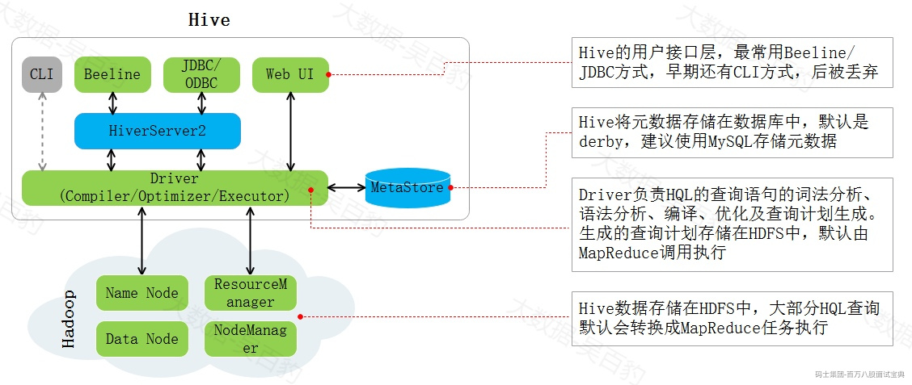
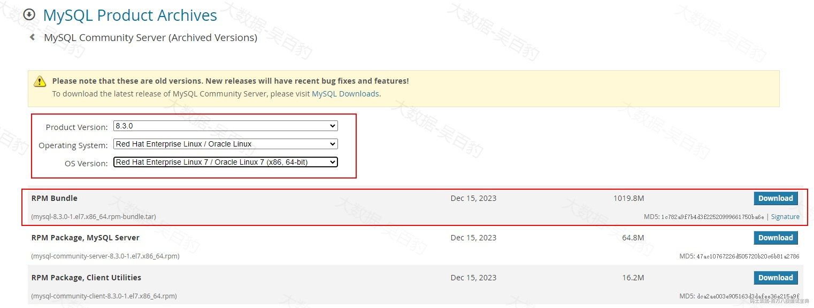
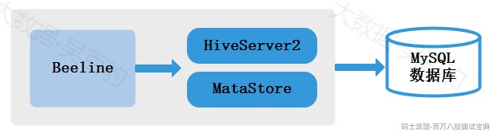
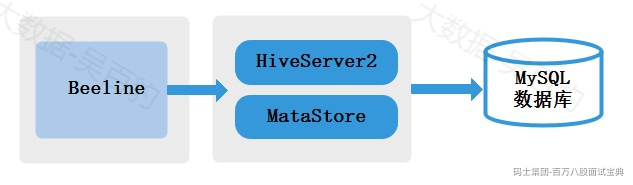
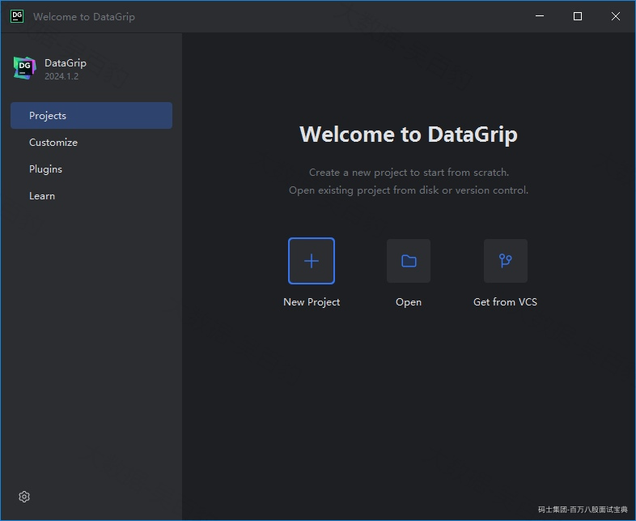
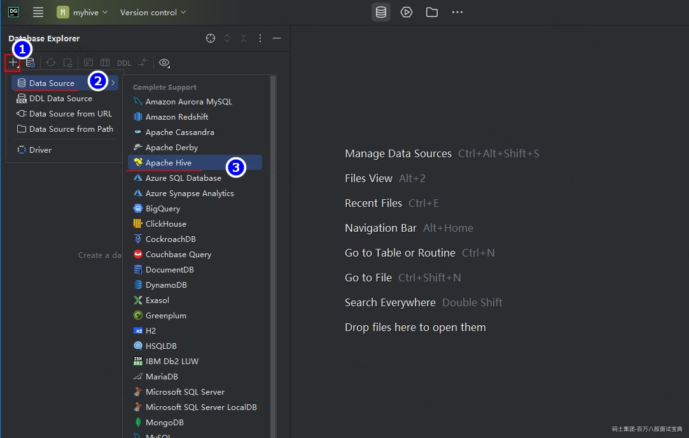
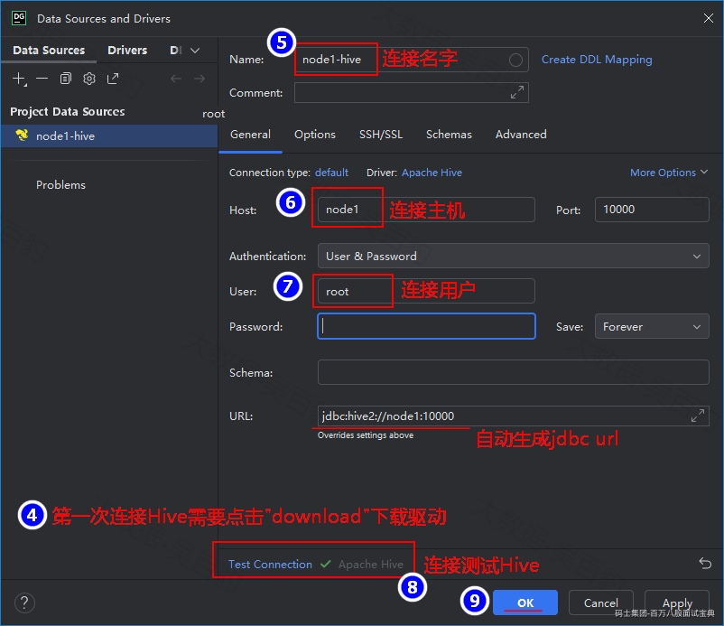
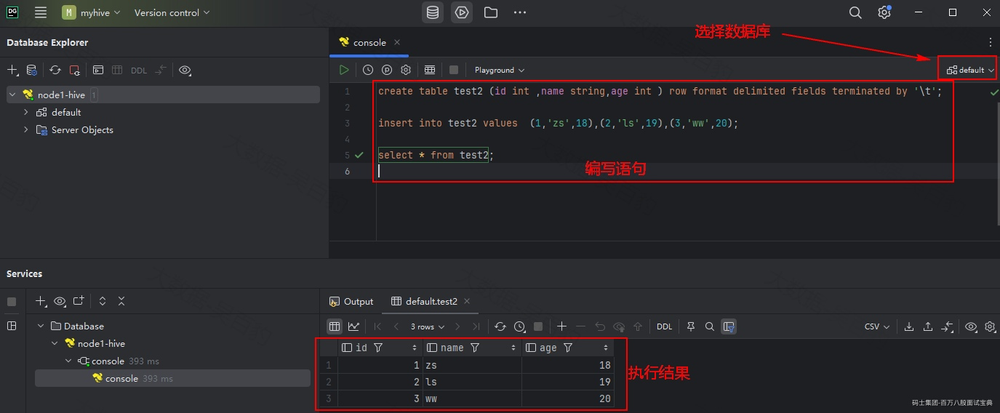

# **1 第一章 Hive架构及搭建**

## 1.1 **什么是Hive**

Apache Hive 是基于Hadoop的数据仓库工具，它可以使用SQL来读取、写入和管理存在分布式文件系统中的海量数据。在Hive中，HQL默认转换成MapReduce程序运行到Yarn集群中，大大降低了非Java开发者数据分析的门槛，并且Hive提供命令行工具和JDBC驱动程序，方便用户连接到Hive进行数据分析操作。

Hive有如下特点：

- Hive是基于Hadoop的数仓工具，底层数据存储在HDFS中。

- Hive提供标准SQL功能，支持SQL语法访问操作数据；

- Hive适合OLAP数据分析场景，不适合OLTP数据处理场景，所以适合数据仓库构建；

- HQL默认转换成MapReduce任务执行，也可以配置转换成Apache Spark、Apache Tez任务运行；

- Hive中支持定义UDF、UDAF、UDTF函数扩展功能；

Hive官网地址：<http://hive.apache.org。>

## 1.2 **数据仓库与数据库区别**

数据库：传统关系型数据库的主要应用是OLTP(On-Line Transaction Processing)，主要是基本的、日常的事务处理，例如银行交易。主要用于业务类系统，主要供基层人员使用，进行一线业务操作。

数据仓库：数仓系统的主要应用主要是OLAP（On-Line Analytical Processing），支持复杂的分析操作，侧重决策支持，并且提供直观易懂的查询结果。OLAP数据分析的目标是探索并挖掘数据价值，作为企业高层进行决策的参考。

|  |  |  |
| --- | --- | --- |
| **功能** | **数据库** | **数据仓库** |
| 数据范围 | 当前状态数据 | 存储历史、完整、反应历史变化数据 |
| 数据变化 | 支持频繁的增删改查操作 | 可增加、查询，无更新、删除操作 |
| 应用场景 | 面向业务交易流程 | 面向分析、支持侧重决策分析 |
| 处理数据量 | 频繁、小批次、高并发、低延迟 | 非频繁、大批量、高吞吐、有延迟 |
| 设计理论 | 遵循数据库三范式、避免冗余 | 违范式、适当冗余 |
| 建模方式 | ER实体关系建模（范式建模） | 范式建模+维度建模 |

## 1.3 **Hive架构**

Hive架构图如下：

*(⚠️ 图片缺失:源知识库原图已失效)* 

- **Hive用户接口**

访问Hive可以通过CLI、Beeline、JDBC/ODBC、WebUI几种方式。在Hive早期版本中可以使用Hive CLI来操作Hive，Hive CLI并发性能差、脚本执行能力有限并缺乏JDBC驱动支持，从Hive 4.x版本起废弃了Hive CLI推荐使用Beeline。\*\*Beeline是一个基于JDBC的Hive客户端，支持并发环境、复杂脚本执行、JDBC驱动等，在Hive集群内连接Hive可以使用Beeline方式。\*\*在Hive集群外，通过代码或者工具连接操作Hive时可以通过JDBC/ODBC方式。通过WebUI方式可以通过浏览器查看到Hive集群的一些信息。

- **HiveServer2服务**

HiveServer2服务提供JDBC/ODBC接口，主要用于代理远程客户端对Hive的访问，是一种基于Thrift协议的服务。例如通过JDBC或者Beeline连接访问Hive时就需要启动HiveServer2服务，就算Beeline访问本机上的Hive服务也需要启动HiveServer2服务。

HiveServer2代理远程客户端对Hive操作时会涉及到操作HDFS数据，就会有操作权限问题，那么操作HDFS中数据的用户是启动HiveServer2的用户还是远程客户端的用户需要通过“hive.server2.enable.doAs”参数决定，该参数默认为true，表示HiveServer2操作HDFS时的用户为远程客户端用户，如果设置为false表示操作HDFS数据的用户为启动HiveServer2的用户。

- **MetaStore服务**

MetaStore服务负责存储和管理Hive元数据，为HiverServer2提供元数据访问接口。Hive中的元数据包括表的名字，表的列和分区及其属性，表的属性（表拥有者、是否为外部表等），表的数据所在目录等。Hive MetaStore可以将元数据存储在mysql、derby数据库中。

- **Hive Driver**

Driver中包含解释器（SQL Parser）、编译器（Compiler）、优化器（Optimizer），负责完成HQL查询语句从词法分析、语法分析、编译、优化以及查询计划的生成。生成的查询计划存储在HDFS中，并在随后有执行器（Executor）调用MapReduce执行。**注意：Hive的数据存储在HDFS中，大部分的查询、计算由MapReduce完成（包含****\*****的查询，比如select** **\*** **from tbl不会生成MapRedcue任务）。**

## 1.4 **安装MySQL8**

### **1.4.1 节点划分**

在Linux集群中我们选择一台节点进行MySQL安装，这里选择在node2节点上安装MySQL8。

|  |  |  |
| --- | --- | --- |
| **节点IP** | **节点名称** | **MySQL8** |
| 192.168.179.5 | node2 | ★ |

### **1.4.2 安装MySQL**

从“<https://downloads.mysql.com/archives/community/”地址下载对应Linux版本的MySQL8。这里选择MySQL> 8.3.0版本进行下载安装。

*(⚠️ 图片缺失:源知识库原图已失效)* 

将下载好的安装包” mysql-8.3.0-1.el7.x86\_64.rpm-bundle.tar”上传到node2节点的/software/mysql目录下，进行解压，得到如下rpm安装包：

```plain
[root@node2 ~]# cd /software/
[root@node2 software]# mkdir mysql
[root@node2 software]# tar -xvf ./mysql-8.3.0-1.el7.x86_64.rpm-bundle.tar -C ./mysql

#查看mysql目录中的rpm文件
[root@node2 ~]# cd /software/mysql/
[root@node2 mysql]# ll
mysql-community-client-8.3.0-1.el7.x86_64.rpm
mysql-community-client-plugins-8.3.0-1.el7.x86_64.rpm
mysql-community-common-8.3.0-1.el7.x86_64.rpm
mysql-community-debuginfo-8.3.0-1.el7.x86_64.rpm
mysql-community-devel-8.3.0-1.el7.x86_64.rpm
mysql-community-embedded-compat-8.3.0-1.el7.x86_64.rpm
mysql-community-icu-data-files-8.3.0-1.el7.x86_64.rpm
mysql-community-libs-8.3.0-1.el7.x86_64.rpm
mysql-community-libs-compat-8.3.0-1.el7.x86_64.rpm
mysql-community-server-8.3.0-1.el7.x86_64.rpm
mysql-community-server-debug-8.3.0-1.el7.x86_64.rpm
mysql-community-test-8.3.0-1.el7.x86_64.rpm
```

安装mysql rpm包有依赖关系，安装的顺序如下(--force：强制安装 --nodeps:不检查环境依赖)：

```plain
rpm -ivh mysql-community-common-8.3.0-1.el7.x86_64.rpm --force --nodeps
rpm -ivh mysql-community-client-8.3.0-1.el7.x86_64.rpm --force --nodeps
rpm -ivh mysql-community-client-plugins-8.3.0-1.el7.x86_64.rpm --force --nodeps
rpm -ivh mysql-community-libs-8.3.0-1.el7.x86_64.rpm --force --nodeps
rpm -ivh mysql-community-server-8.3.0-1.el7.x86_64.rpm --force --nodeps
```

以上安装完成后，执行如下命令来启动MySQL：

```plain
[root@node2 mysql]# service mysqld start
```

### **1.4.3 配置MySQL**

mysql8开始初始登录mysql需要使用初始密码，启动后登录mysql需要指定安装时的临时密码，使用命令：grep 'temporary password' /var/log/mysqld.log 获取临时密码后，执行如下语句：

```plain
#使用临时密码登录mysql
[root@node2 ~]# mysql -u root -p/lwS-cCkt4y/
#初始登录mysql必须重置密码才能操作，密码需要含有数字、大小写字符、下划线等
mysql> alter user 'root'@'localhost' identified by 'Abc_123456';

#默认mysql密码需要含有数字、大小写字符、下划线等，这里设置密码验证级别为低即可
mysql> set global validate_password.policy=LOW;

#默认mysql密码设置长度是8位，这里修改成6位
mysql> set global validate_password.length=6;
```

重新设置下mysql root用户的密码为123456，不要删除user表中其他用户数据。只针对root用户进行设置，命令如下：

```plain
[root@node2 java]# mysql -u root -pAbc_123456
mysql> use mysql;
mysql> select user,authentication_string from user; 
mysql> delete from user where user = 'root';
mysql> CREATE USER 'root'@'%' IDENTIFIED BY '123456';
mysql> GRANT ALL PRIVILEGES ON *.* TO 'root'@'%' WITH GRANT OPTION;
mysql> FLUSH PRIVILEGES;
```

执行如下命令，将mysql设置成开机启动，如果不设置开机启动，后期每次重启节点后需要手动启动MySQL。

```plain
#设置mysql 开机自动启动
[root@node2 ~]# systemctl enable mysqld 
[root@node2 ~]# systemctl list-unit-files |grep mysqld
```

以上设置密码验证级别和密码长度验证当mysql重启后还需要重复设置，如果mysql中密码设置不想要太复杂或者密码长度不想设置长度验证，可以在“/etc/my.cnf”中配置如下内容：

```plain
[mysqld]
validate_password.check_user_name=OFF
validate_password.length=6
validate_password.mixed_case_count=0
validate_password.number_count=0
validate_password.policy=0
validate_password.special_char_count=0
```

另外，在安装mysql的节点上配置“/etc/my.cnf”，在对应的标签下加入如下配置，更改mysql数据库编码格式为utf-8。

```plain
[mysqld]
character-set-server=utf8
```

配置完成后执行“systemctl restart mysqld”，重启mysql即可。

### **1.4.4 Mysql密码忘记处理**

如果MySQL安装后，登录密码忘记，可以按照以下步骤来解决。

**1) 修改/etc/my.conf文件，在mysqld 标签下加入以下参数**

```plain
[mysqld]
skip-grant-tables
```

配置完成后重启MySQL服务：service mysqld restart

**2) 执行如下命令修改mysql root用户密码**

```plain
# 使用mysql库
mysql> use mysql;

# mysql8中不再支持passwd函数，所以不能直接设置密码，先将密码设置为空
mysql> update user set authentication_string = '' where user = 'root';
```

更新完密码之后，去掉/etc/my.cnf中的skip-grant-tables配置，重启mysql服务然后通过alter更新mysql密码。

```plain
#无密码登录mysql，然后设置密码
[root@node2 ~]# mysql -u root
mysql> use mysql;
mysql> alter user 'root'@'%' identified by '123456';
```

重新退出mysql后，再次登录mysql使用更新后的密码登录MySQL即可。

## 1.5 **Hive搭建**

Hive 将元数据默认存储在hive自带的derby数据库中，derby只支持单客户端连接访问，所以建议将元数据存储在MySQL中，这样可以支持多客户端连接访问。故根据Hive 元数据存储位置不同，Hive搭建可以分为两类：将元数据存储在默认的derby数据库中及将元数据存储在MySQL中。将元数据存储在MySQL中又分为直连数据库模式和远程服务器模式。所以这里将Hive搭建分为以下三个类别：

- 内嵌Derby模式

- 直连MySQL数据库模式

- 远程服务器模式

下面分别介绍三种Hive搭建方式。**此外需要注意，无论哪种模式的Hive，都需要先搭建好Hadoop集群，所有后续操作都是基于已经搭建好HDFS HA的集群环境基础上进行。**

### **1.5.1 内嵌Derby模式**

内嵌Derby模式即将元数据存储在Hive自带的Derby(Derby数据库是Apache开源，使用Java实现的内存数据库，具备体积小特点）数据库中。这种部署模式用于Unit Test（单元测试），并且只支持单客户端连接Hive，目前基本没有公司使用。

*(⚠️ 图片缺失:源知识库原图已失效)* 

具体内嵌Derby模式搭建Hive可以参考：<https://cwiki.apache.org/confluence/display/Hive/HiveDerbyServerMode>

### **1.5.2 直连MySQL数据库模式**

直连MySQL数据库模式就是将默认的Derby数据库换成MySQL，使用MySQL来存储Hive元数据。这种模式中Beeline、HiveServer2都是在同一台节点上，通过该节点配置文件可以直接找到MetaStore元数据存储的MySQL数据库，所以不需单独启动MetaStore服务，只需要启动HiveServer2服务即可。在当前节点上可以启动多个Beeline客户端实例来连接Hive进行操作。

*(⚠️ 图片缺失:源知识库原图已失效)* 

按照如下步骤进行直连MySQL数据库模式搭建即可。

**1) 上传解压Hive安装包**

将Hive安装包“apache-hive-4.0.0-bin.tar.gz”上传到node1节点/software目录下并解压。

```plain
[root@node1 software]# tar -zxvf ./apache-hive-4.0.0-bin.tar.gz
[root@node1 software]# mv apache-hive-4.0.0-bin hive-4.0.0
[root@node1 software]# ls
hive-4.0.0
```

**2) 配置Hive环境变量**

修改/etc/profile，在最后加入如下内容：

```plain
#vim /etc/profile
... ...
export HIVE_HOME=/software/hive-4.0.0/
export PATH=$PATH:$HIVE_HOME/bin
... ...

#source 生效
[root@node1 software]# source /etc/profile
```

**3) 配置HiveServer2服务代理用户**

默认Hive4.x后取消了Hive CLI方式访问Hive，建议使用Beeline方式连接Hive，Beeline方式连接Hive需要启动HiveServer2服务。默认HiveServer2代理远程用户操作HDFS，允许一个用户代理为另一个用户执行HDFS操作依赖于Hadoop 的代理用户（proxy user）机制，需要将如下代理用户设置为HiveServer2的启动用户。在各个HDFS 节点的core-site.xml中加入如下配置。

```plain
... ...
    <!-- 配置代理访问用户 -->
    <!-- 配置所有节点上，HiveServer2启动用户root作为代理用户 -->
    <property>
        <name>hadoop.proxyuser.root.hosts</name>

        <value>*</value>

    </property>

    <!-- 配置HiveServer2启动用户root代理的组为任意组 -->
    <property>
        <name>hadoop.proxyuser.root.groups</name>

        <value>*</value>

    </property>

    <!-- 配置HiveServer2启动用户root代理的用户为任意用户 -->
    <property>
        <name>hadoop.proxyuser.root.users</name>

        <value>*</value>

    </property>

... ...
```

将以上配置文件发送到其他Hadoop其他节点上。

**4) 配置hive-site.xml**

配置$HIVE\_HOME/conf/hive-site.xml(第一次没有hive-site.xml可以直接创建)，该配置文件中配置Hive存储数据路径、元数据存储MySQL信息、HiveServer2节点及端口信息。hive-site.xml中写入如下信息:

```plain
<configuration>
    <!-- Hive表数据存储在HDFS路径 -->
    <property>  
      <name>hive.metastore.warehouse.dir</name>  
      <value>/user/hive/warehouse</value>  
    </property> 
         
    <!-- MySQL信息 -->
    <property>  
      <name>javax.jdo.option.ConnectionURL</name>  
      <value>jdbc:mysql://node2:3306/hive?createDatabaseIfNotExist=true&useSSL=false&allowPublicKeyRetrieval=true</value>  
    </property>  
    <property>  
      <name>javax.jdo.option.ConnectionDriverName</name>  
      <value>com.mysql.jdbc.Driver</value>  
    </property>  
    <property>  
      <name>javax.jdo.option.ConnectionUserName</name>  
      <value>root</value>  
    </property>  
    <property>  
      <name>javax.jdo.option.ConnectionPassword</name>  
      <value>123456</value>  
    </property>

    <!-- 指定HiveServer2 所在host -->
    <property>
      <name>hive.server2.thrift.bind.host</name>

      <value>node1</value>

    </property>

    <!-- 指定HiveServer2 端口 -->
    <property>
      <name>hive.server2.thrift.port</name>

      <value>10000</value>

    </property> 
</configuration>

```

连接数据库路径后面加上&useSSL=false，代表的是连接mysql不使用SSL连接。allowPublicKeyRetrieval设置为true表示允许公钥检索，MySQL8默认使用了更加安全的密码认证机制（caching\_sha2\_password），而JDBC驱动在默认配置下不允许检索服务器的公钥来进行身份验证。

hive中 & 符号使用 & 来表示，所以配置为：jdbc:mysql://node2:3306/hive?createDatabaseIfNotExist=true&useSSL=false&allowPublicKeyRetrieval=true。

**5) 将MySQL驱动包放在Hive对应的lib目录下**

将“mysql-connector-j-8.3.0.jar”上传至node1 $HIVE\_HOME/lib目录中。

**6) 初始化Hive**

初始化Hive就是初始化Hive的元数据库，如下命令执行后，可以在MySQL中看到相应的库会创建。

```plain
[root@node1 software]# schematool -dbType mysql -initSchema
```

**7) 启动HDFS集群**

```plain
#启动zookeeper集群
[root@node3 ~]# zkServer.sh start
[root@node4 ~]# zkServer.sh start
[root@node5 ~]# zkServer.sh start

#启动hadoop集群
[root@node1 ~]# start-all.sh 
```

**8) 启动HiveServer2服务**

在node1节点执行如下命令启动HiveServer2服务：

```plain
[root@node1~]# hive --service hiveserver2 > /software/hive-4.0.0/hiveserver2.log 2>&1  &
```

以上将hiveserver2启动的日志输出到hiveserver2.log文件中，2>&1 是将标准错误（文件描述符 2）重定向到标准输出（文件描述符 1）已经被重定向到的地方，即hiveserver2.log文件，最后的&表示后台运行整个命令。

**9) 使用Hive**

```plain
#进入Hive，输入hive会直接进入beeline客户端
[root@node1 ~]# hive

#通过beeline连接hive
beeline> !connect jdbc:hive2://node1:10000
Connecting to jdbc:hive2://node1:10000
Enter username for jdbc:hive2://node1:10000: 用户名最好填写root
Enter password for jdbc:hive2://node1:10000: 密码可以不填

#查看数据库
0: jdbc:hive2://node1:10000> show databases;
+----------------+
| database_name  |
+----------------+
| default        |
+----------------+

#创建hive表
0: jdbc:hive2://node1:10000> create table test (id int ,name string,age int) row format delimited fields terminated by '\t';

#插入数据
0: jdbc:hive2://node1:10000> insert into test values (1,'zs',18),(2,'ls',19),(3,'ww',20);

#查询数据
0: jdbc:hive2://node1:10000> select * from test;
+----------+------------+-----------+
| test.id  | test.name  | test.age  |
+----------+------------+-----------+
| 1        | zs         | 18        |
| 2        | ls         | 19        |
| 3        | ww         | 20        |
+----------+------------+-----------+
```

注意以下几点：

- 以上通过beeline连接hive时，用户名最好使用root，因为在Hive中创建表使用的用户就是该用户，其他用户可能没有权限导致错误。

- Hive表创建好后，可以在HDFS中查看到“hive.metastore.warehouse.dir”配置项对应的路径下有创建相应表。

- 向表中插入数据会生成MapReduce任务。

- 使用Hive过程中如果有错误可以查看/tmp/${user}/hive.log中的报错信息来解决。

### **1.5.3 远程服务器模式**

所谓Hive的远程服务器模式就是启动Hive的beeline不在Hive MetaStore和HiveServer2节点上，而是在其他节点上。这就需要远程连接Hive MetaStore服务来获取元数据相关信息，我们把启动MetaStore和HiveServer2节Hive节点成为Hive服务端，启动Beeline的节点叫做Hive客户端。这种模式支持多客户端连接Hive服务端，所以这种方式在公司中使用比较多，避免了只能在Hive 服务端连接Hive。

*(⚠️ 图片缺失:源知识库原图已失效)* 

这里我们选择node1节点当做Hive的服务端，node3当做Hive的客户端，配置远程服务器模式，步骤如下：

**1) 上传解压Hive安装包**

将Hive安装包“apache-hive-4.0.0-bin.tar.gz”上传到node1节点/software目录下并解压。

```plain
[root@node1 software]# tar -zxvf ./apache-hive-4.0.0-bin.tar.gz
[root@node1 software]# mv apache-hive-4.0.0-bin hive-4.0.0
[root@node1 software]# ls
hive-4.0.0
```

**2) 配置Hive环境变量**

node1节点上修改/etc/profile，在最后加入如下内容：

```plain
#vim /etc/profile
... ...
export HIVE_HOME=/software/hive-4.0.0/
export PATH=$PATH:$HIVE_HOME/bin
... ...

#source 生效
[root@node1 software]# source /etc/profile
```

**3) 配置HiveServer2服务代理用户**

默认Hive4.x后取消了Hive CLI方式访问Hive，建议使用Beeline方式连接Hive，Beeline方式连接Hive需要启动HiveServer2服务。Beeline通过HiveServer2服务连接Hive服务时需要设置操作HDFS的代理用户，所以这里在各个HDFS 节点的core-site.xml中加入如下配置。

```plain
... ...
    <!-- 配置代理访问用户 -->
    <!-- 配置所有节点中root用户作为代理用户 -->
    <property>
        <name>hadoop.proxyuser.root.hosts</name>

        <value>*</value>

    </property>

    <!-- 配置root用户代理的组为任意组 -->
    <property>
        <name>hadoop.proxyuser.root.groups</name>

        <value>*</value>

    </property>

    <!-- 配置root用户代理的用户为任意用户 -->
    <property>
        <name>hadoop.proxyuser.root.users</name>

        <value>*</value>

    </property>

... ...
```

将以上配置文件发送到其他Hadoop其他节点上。

**4) Hive服务端配置hive-site.xml**

在node1节点配置$HIVE\_HOME/conf/hive-site.xml(第一次没有hive-site.xml可以直接创建)，该配置文件中配置Hive存储数据路径、元数据存储MySQL信息、HiveServer2节点及端口信息。hive-site.xml中写入如下信息:

```plain
<configuration>
    <!-- Hive表数据存储在HDFS路径 -->
    <property>  
      <name>hive.metastore.warehouse.dir</name>  
      <value>/user/hive/warehouse</value>  
    </property> 
         
    <!-- MySQL信息 -->
    <property>  
      <name>javax.jdo.option.ConnectionURL</name>  
      <value>jdbc:mysql://node2:3306/hive?createDatabaseIfNotExist=true&useSSL=false&allowPublicKeyRetrieval=true</value>  
    </property>  
    <property>  
      <name>javax.jdo.option.ConnectionDriverName</name>  
      <value>com.mysql.jdbc.Driver</value>  
    </property>  
    <property>  
      <name>javax.jdo.option.ConnectionUserName</name>  
      <value>root</value>  
    </property>  
    <property>  
      <name>javax.jdo.option.ConnectionPassword</name>  
      <value>123456</value>  
    </property>

    <!-- 指定HiveServer2 所在host -->
    <property>
      <name>hive.server2.thrift.bind.host</name>

      <value>node1</value>

    </property>

    <!-- 指定HiveServer2 端口 -->
    <property>
      <name>hive.server2.thrift.port</name>

      <value>10000</value>

    </property> 
</configuration>

```

连接数据库路径后面加上&useSSL=false，代表的是连接mysql不使用SSL连接。allowPublicKeyRetrieval设置为true表示允许公钥检索，MySQL8默认使用了更加安全的密码认证机制（caching\_sha2\_password），而JDBC驱动在默认配置下不允许检索服务器的公钥来进行身份验证。

hive中 & 符号使用&amp; 来表示，所以配置为：jdbc:mysql://node2:3306/hive?createDatabaseIfNotExist=true&amp;useSSL=false&allowPublicKeyRetrieval=true。

**5) Hive客户端配置hive-site.xml**

将Hive安装包发送到 node3节点并解压，与Hive服务端类似配置Hive环境变量：

```plain
#发送安装包到node3节点、解压并改名
[root@node1 software]# scp ./apache-hive-4.0.0-bin.tar.gz  node3:`pwd`
[root@node3 software]# tar -zxvf ./apache-hive-4.0.0-bin.tar.gz 
[root@node3 software]# mv apache-hive-4.0.0-bin hive-4.0.0

#node3节点配置Hive环境变量
#vim /etc/profile
... ...
export HIVE_HOME=/software/hive-4.0.0/
export PATH=$PATH:$HIVE_HOME/bin
... ...

#source 生效
[root@node3 software]# source /etc/profile
```

配置Hive 客户端 $HIVE\_HOME/conf/hive-site.xml，内容如下：

```plain
<configuration>
    <!-- Hive MetaStore服务 -->   
    <property>  
      <name>hive.metastore.uris</name>  
      <value>thrift://node1:9083</value>  
    </property>   
</configuration>  
```

**6) 将MySQL驱动包放在Hive服务端和客户端对应的lib目录下**

将“mysql-connector-j-8.3.0.jar”上传至node1 和node3$HIVE\_HOME/lib目录中。

**7) 初始化Hive**

在Hive服务端初始化Hive，即初始化Hive的元数据库，如下命令执行后，可以在MySQL中看到相应的库会创建。注意：如果之前初始化过Hive，需要在MySQL中先删除创建的hive数据库，以及HDFS中的表数据目录。

```plain
[root@node1 software]# schematool -dbType mysql -initSchema
```

**8) 启动HDFS集群**

```plain
#启动zookeeper集群
[root@node3 ~]# zkServer.sh start
[root@node4 ~]# zkServer.sh start
[root@node5 ~]# zkServer.sh start

#启动hadoop集群
[root@node1 ~]# start-all.sh 
```

**9) 启动HiveServer2和MetaStore服务**

在node1节点执行如下命令启动HiveServer2服务：

```plain
[root@node1~]# hive --service hiveserver2 > /software/hive-4.0.0/hiveserver2.log 2>&1  &
[root@node1~]# hive --service metastore > /software/hive-4.0.0/metastore.log 2>&1  &
```

以上2>&1 是将标准错误（文件描述符 2）重定向到标准输出（文件描述符 1）已经被重定向到的地方，即hiveserver2.log/metastore.log文件，最后的&表示后台运行整个命令。

**10) 使用Hive**

这里在Hive 客户端node3节点上操作Hive。

```plain
#进入Hive，输入hive会直接进入beeline客户端
[root@node3 ~]# hive

#通过beeline连接hive
beeline> !connect jdbc:hive2://node1:10000
Connecting to jdbc:hive2://node1:10000
Enter username for jdbc:hive2://node1:10000: 用户名最好填写root
Enter password for jdbc:hive2://node1:10000: 密码可以不填

#查看数据库
0: jdbc:hive2://node1:10000> show databases;
+----------------+
| database_name  |
+----------------+
| default        |
+----------------+

#创建hive表
0: jdbc:hive2://node1:10000> create table test (id int ,name string,age int) row format delimited fields terminated by '\t';

#插入数据
0: jdbc:hive2://node1:10000> insert into test values (1,'zs',18),(2,'ls',19),(3,'ww',20);

#查询数据
0: jdbc:hive2://node1:10000> select * from test;
+----------+------------+-----------+
| test.id  | test.name  | test.age  |
+----------+------------+-----------+
| 1        | zs         | 18        |
| 2        | ls         | 19        |
| 3        | ww         | 20        |
+----------+------------+-----------+
```

注意以下几点：

- 以上通过beeline连接hive时，用户名最好使用root，因为在Hive中创建表使用的用户就是该用户，其他用户可能没有权限导致错误。

- Hive表创建好后，可以在HDFS中查看到“hive.metastore.warehouse.dir”配置项对应的路径下有创建相应表。

- 向表中插入数据会生成MapReduce任务。

- 使用Hive过程中如果有错误可以查看/tmp/${user}/hive.log中的报错信息来解决。

## 1.6 **连接Hive**

我们可以通过Beeline方式连接并操作Hive，也可以通过DataGrip工具远程连接并操作Hive。下面分别介绍两种方式。

### **1.6.1 Beeline连接Hive**

Beeline连接Hive有两种方式，一种是在Hive客户端直接输入“hive”命令默认就直接进入Beeline，如下：

```plain
[root@node3 ~]# hive
beeline> !connect jdbc:hive2://node1:10000
输入用户名和密码

#退出beeline
0: jdbc:hive2://node1:10000> !quit
```

另一种可以直接执行beeline命令来连接并操作Hive，如下:

```plain
[root@node3 ~]# hive
beeline> !connect jdbc:hive2://node1:10000
输入用户名和密码

#退出beeline
0: jdbc:hive2://node1:10000> !quit
```

此外，通过Beeline操作Hive时，默认Hive的日志级别输出INFO级别的日志到控制台，这时可以在HIVE服务端中配置$HIVE\_HOME/conf/目录中hive-log4j2.properties(由hive-log4j2.properties.template复制而来)文件。

修改hive-log4j2.properties中“property.hive.log.level = INFO”改为“property.hive.log.level = ERROR”即可。

```plain
property.hive.log.level = ERROR
```

以上配置完成后，需要重新启动Hive服务端的HiveServer2服务。

```plain
hive --service hiveserver2 > /software/hive-4.0.0/hiveserver2.log 2>&1  &
```

### **1.6.2 DataGrip连接Hive**

DataGrip 是由 JetBrains 公司开发的数据库管理客户端工具，是一个用于操作数据库的集成开发环境（IDE），类似 Navicat、DBeaver等产品。我们可以通过DataGrip连接操作Hive。

下载好DataGrip进行安装，打开界面如下：

*(⚠️ 图片缺失:源知识库原图已失效)* 

点击“New Project”创建DataGrip工程，工程名称根据自己情况定义。

*(⚠️ 图片缺失:源知识库原图已失效)* 

创建好工程后，按照如下步骤配置连接Hive。

*(⚠️ 图片缺失:源知识库原图已失效)* 

*(⚠️ 图片缺失:源知识库原图已失效)* 

配置连成Hive成功后，可以在DataGrip中执行Hive语句，如下：

*(⚠️ 图片缺失:源知识库原图已失效)* 

执行语句如下：

```plain
create table test2 (id int ,name string,age int ) row format delimited fields terminated by '\t';

insert into test2 values  (1,'zs',18),(2,'ls',19),(3,'ww',20);

select * from test2;
```

\*\*注意：\*\*使用Beeline或者DataGrip连接操作Hive时，后续可以使用Hive本地模式，可以通过“**hive.exec.mode.local.auto**”参数来开启，这样Hive查询就可以直接在HiveServer2本机执行，而不在集群上运行，在一些测试SQL场景中非常实用。

Hive启动后，默认使用JVM内存为256M，后续如果使用Hive本地模式运行SQL时，该内存较小会导致本地模式报错，最好将使用内存调大，可以通过HiveServer2节点上的$HIVE\_HOME/conf/hive-env.sh文件中“HADOOP\_HEAPSIZE”属性配置Hive使用内存，如下：

```plain
[root@node1 ~]# cd /software/hive-4.0.0/conf/
[root@node1 conf]# mv hive-env.sh.template hive-env.sh

#配置hive-env.sh HADOOP_HEAPSIZE参数
export HADOOP_HEAPSIZE=2048
```

配置完成后，需要重启Hive MetaStore和HiveServer2服务。
