# **2 第二章Hive 核心基础**

## 2.1 **DDL操作**

DDL(Data Definition Language)数据定义语言，主要包含库表操作（创建、查询、修改、删除）。Hive DDL操作可参考官网：<https://cwiki.apache.org/confluence/display/Hive/LanguageManual+DDL>

### **2.1.1 数据库操作**

数据库操作一般涉及创建、查询、删除。

#### 2.1.1.1 **创建数据库**

Hive中创建数据库语法如下：

```plain
CREATE DATABASE [IF NOT EXISTS] database_name 
[COMMENT database_comment]
```

创建数据库db1、db2：

```plain
[root@node3 conf]# beeline -u jdbc:hive2://node1:10000 -n root
0: jdbc:hive2://node1:10000> create database db1;
No rows affected (0.232 seconds)
0: jdbc:hive2://node1:10000> create database db2;
No rows affected (0.123 seconds)
```

默认创建好的数据库存储在HDFS位置为“/user/hive/warehouse”目录下。

*(⚠️ 图片缺失:源知识库原图已失效)* 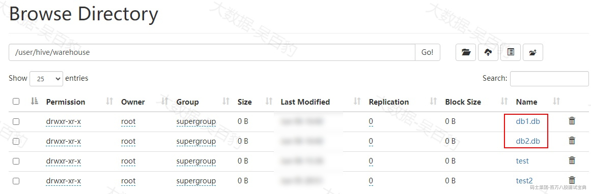

#### 2.1.1.2 **查询数据库**

查询Hive数据库命令如下：

```plain
SHOW DATABASES;
DESC DATABASE dbname;
SELECT current_database(); -- 查询当前数据库是什么数据库
```

例如：

```plain
[root@node3 conf]# beeline -u jdbc:hive2://node1:10000 -n root
#查看数据库
0: jdbc:hive2://node1:10000> show databases;
+----------------+
| database_name  |
+----------------+
| db1            |
| db2            |
| default        |
+----------------+

#查看数据库描述
0: jdbc:hive2://node1:10000> desc database db1;
+----------+----------+----------------------------------------------+------------------------------------
----------+-------------+-------------+-----------------+----------------+| db_name  | comment  |                   location                   |               managedlocation  
          | owner_name  | owner_type  | connector_name  | remote_dbname  |+----------+----------+----------------------------------------------+------------------------------------
----------+-------------+-------------+-----------------+----------------+| db1      |          | hdfs://mycluster/user/hive/warehouse/db1.db  | hdfs://mycluster/user/hive/warehous
e/db1.db  | root        | USER        |                 |                |+----------+----------+----------------------------------------------+------------------------------------
----------+-------------+-------------+-----------------+----------------+

#使用数据库
0: jdbc:hive2://node1:10000> use db1;

#查询当前数据库
select current_database();

#在数据库中建表
0: jdbc:hive2://node1:10000> create table a (id int,name string,age int) row format delimited fields terminated by '\t';

```

#### 2.1.1.3 **删除数据库**

删除数据库命令如下：

```plain
DROP DATABASE [IF EXISTS] database_name [RESTRICT|CASCADE];
```

RESTRICT:严格模式。数据库中如果有表，则删除数据库会失败。默认就是这种模式。

CASCADE:级联模式。数据库中如果有表，则删除数据库时将库与表一并删除。

例如：

```plain
#删除非空数据库
0: jdbc:hive2://node1:10000> drop database db1 CASCADE;

#删除空数据库
0: jdbc:hive2://node1:10000> drop database db2;
```

### **2.1.2 数据表操作**

#### 2.1.2.1 **创建数据表**

Hive中创建表有如下3种方式，下面分别进行介绍。

**1) 常规建表**

Hive中常规创建数据表的语法如下：

```plain
CREATE [TEMPORARY] [EXTERNAL] TABLE [IF NOT EXISTS] [db_name.]table_name 
  [(col_name data_type [column_constraint_specification] [COMMENT col_comment], ... [constraint_specification])]
  [COMMENT table_comment]
  [PARTITIONED BY (col_name data_type [COMMENT col_comment], ...)]
  [CLUSTERED BY (col_name, col_name, ...) [SORTED BY (col_name [ASC|DESC], ...)] INTO num_buckets BUCKETS]
  [ROW FORMAT DELIMITED] 
  [STORED AS file_format]
  [LOCATION hdfs_path]
  [TBLPROPERTIES (property_name=property_value, ...)]; 
```

对以上建表语句关键字的解释如下：

- TEMPORARY：表示创建一个临时表，临时表在会话结束时自动删除。临时表参考后续小节。

- EXTERNAL:表示创建一个外部表，外部表的数据不存储在默认的${hive。metastore.warehouse.dir}路径中，而是在HDFS其他路径中。建表不加EXTERNAL关键字创建的表为内部表，具体内部表和外部表操作参考后续小节。

- IF NOT EXISTS：表示创建表时，表不存在再创建，存在则不创建。

- db\_name.table\_name：db\_name是表默认所在的数据库名，可以加上，或不加；table\_name为创建的表名。

- col\_name：表中的列名，data\_type为列的类型，关于类型参考后续小节。

- column\_constraint\_specification：表示列的约束条件，例如：NOT NULL ,UNIQUE等。

- COMMENT col\_comment：列的注释。

- COMMENT table\_comment：表的注释。

- PARTITIONED BY：创建分区表时指定表的分区列。关于分区表参考后续小节。

- CLUSTERED BY...SORTED BY... INTO num\_buckets BUCKETS：表的分桶列。关于分桶表参考后续小节。SORTED BY指定分桶列的排序方式。num\_buckets BUCKETS指定分桶的数量。

- ROW FORMAT DELIMITED：表中数据列分割符和数据行分隔符，默认数据列分隔符是制表符（\t），默认数据行分隔符为换行符（\n）,具体参考后续小节。

- STORED AS：表的存储格式，例如：TEXT FILE（默认）、SEQUENCE FILE、PARQUET FILE等。具体可以参考后续小节。

- LOCATION :表数据存储路径，当表为外部表时才能使用LOCATION关键字指定存储路径。内部表默认HDFS存储路径为${hive。metastore.warehouse.dir}/db\_name/table\_name

- TBLPROPERTIES ：建表时指定一些KV参数。

**此外，需要注意，在Hive中建表Hive表明和列名不区分大小写。**

案例如下：

```plain
#创建person表，向表中插入3条数据
[root@node3 conf]# beeline -u jdbc:hive2://node1:10000 -n root
0: jdbc:hive2://node1:10000> create table person(id int,name string,age int) row format delimited fields terminated by '\t';
0: jdbc:hive2://node1:10000> insert into person values (1,'zs',18),(2,'ls',19),(3,'ww',20);

#查询表中数据
0: jdbc:hive2://node1:10000> select * from person;
+------------+--------------+-------------+
| person.id  | person.name  | person.age  |
+------------+--------------+-------------+
| 1          | zs           | 18          |
| 2          | ls           | 19          |
| 3          | ww           | 20          |
+------------+--------------+-------------+
```

**2) CREATE TABLE ... AS SELECT ... 建表**

```plain
CREATE [TEMPORARY] TABLE [IF NOT EXISTS] [db_name.]table_name
  [COMMENT table_comment]
  [ROW FORMAT DELIMITED] 
  [STORED AS file_format]
  [LOCATION hdfs_path]
  [TBLPROPERTIES (property_name=property_value, ...)]
  [AS select_statement]; 
```

create table ... as select ... 这种建表语句直接将select语句中查询的列组成对应的表，创建表不能时外表，并且表中会自动填充select语句查询到的数据。

案例：

```plain
#使用create table ... as select ... 语句查询person中数据并创建表person2
0: jdbc:hive2://node1:10000> create table person2 as select id,name from person where id <=2;

#查询person2中数据
0: jdbc:hive2://node1:10000> select * from person2;
+-------------+---------------+
| person2.id  | person2.name  |
+-------------+---------------+
| 1           | zs            |
| 2           | ls            |
+-------------+---------------+

#查看person2中表结构
0: jdbc:hive2://node1:10000> desc person2;
+-----------+------------+----------+
| col_name  | data_type  | comment  |
+-----------+------------+----------+
| id        | int        |          |
| name      | string     |          |
+-----------+------------+----------+
```

**3) CREATE TABLE LIKE ... 建表**

create table like语法如下：

```plain
CREATE [TEMPORARY] [EXTERNAL] TABLE [IF NOT EXISTS] [db_name.]table_name
  LIKE existing_table_or_view_name
  [LOCATION hdfs_path];
```

该语法后面可以跟上一张已经存在的表，创建出的新表表结构与like表的表结构一样，新表中不会有数据。

案例：

```plain
#通过create table like 语法创建person3表
0: jdbc:hive2://node1:10000> create table person3 like person;

#查询person3中的数据，没有数据
0: jdbc:hive2://node1:10000> select * from person3;
+-------------+---------------+--------------+
| person3.id  | person3.name  | person3.age  |
+-------------+---------------+--------------+
+-------------+---------------+--------------+

#查看表person3的结构
0: jdbc:hive2://node1:10000> desc person3;
+-----------+------------+----------+
| col_name  | data_type  | comment  |
+-----------+------------+----------+
| id        | int        |          |
| name      | string     |          |
| age       | int        |          |
+-----------+------------+----------+
```

#### 2.1.2.2 **查询数据表**

- **查询数据库下所有表语法如下：**

```plain
SHOW TABLES [IN database_name]
```

案例：

```plain
0: jdbc:hive2://node1:10000> show tables in default;
+-----------+
| tab_name  |
+-----------+
| person    |
| person2   |
| person3   |
| test      |
| test2     |
+-----------+
```

- **查询表创建信息**

语法:

```plain
SHOW CREATE TABLE ([db_name.]table_name);
```

案例：

```plain
0: jdbc:hive2://node1:10000> show create table person;
+----------------------------------------------------+
|                   createtab_stmt                   |
+----------------------------------------------------+
| CREATE EXTERNAL TABLE `person`(                    |
|   `id` int,                                        |
|   `name` string,                                   |
|   `age` int)                                       |
| ROW FORMAT SERDE                                   |
|   'org.apache.hadoop.hive.serde2.lazy.LazySimpleSerDe'  |
| WITH SERDEPROPERTIES (                             |
|   'field.delim'='\t',                              |
|   'serialization.format'='\t')                     |
| STORED AS INPUTFORMAT                              |
|   'org.apache.hadoop.mapred.TextInputFormat'       |
| OUTPUTFORMAT                                       |
|   'org.apache.hadoop.hive.ql.io.HiveIgnoreKeyTextOutputFormat' |
| LOCATION                                           |
|   'hdfs://mycluster/user/hive/warehouse/person'    |
| TBLPROPERTIES (                                    |
|   'TRANSLATED_TO_EXTERNAL'='TRUE',                 |
|   'bucketing_version'='2',                         |
|   'external.table.purge'='TRUE',                   |
|   'transient_lastDdlTime'='1717683015')            |
+----------------------------------------------------+
```

**注意：以上SERDE是Serializer/Deserializer的简写，Hive使用Serde进行对象的序列与反序列化，实现读写Hive表中字段数据类型。LazySimpleSerDe用于处理简单的文本数据格式**

- **查看表信息**

语法：

```plain
DESC [EXTENDED | FORMATTED] [db_name.]table_name;
```

EXTENDED:显示表详细信息；FORMATTED：以格式化方式显示表更多信息。

案例：

```plain
#查看表信息
0: jdbc:hive2://node1:10000> desc person;
+-----------+------------+----------+
| col_name  | data_type  | comment  |
+-----------+------------+----------+
| id        | int        |          |
| name      | string     |          |
| age       | int        |          |
+-----------+------------+----------+

#查看详细信息
0: jdbc:hive2://node1:10000> desc formatted person;
+-------------------------------+----------------------------------------------------+----------------------------------------------------+
|           col_name            |                     data_type                      |                      comment                       |
+-------------------------------+----------------------------------------------------+----------------------------------------------------+
| id                            | int                                                |                                                    |
| name                          | string                                             |                                                    |
| age                           | int                                                |                                                    |
|                               | NULL                                               | NULL                                               |
| # Detailed Table Information  | NULL                                               | NULL                                               |
| Database:                     | default                                            | NULL                                               |
| OwnerType:                    | USER                                               | NULL                                               |
| Owner:                        | root                                               | NULL                                               |
| CreateTime:                   | Thu Jun 06 22:08:55 CST 2024                       | NULL                                               |
| LastAccessTime:               | UNKNOWN                                            | NULL                                               |
| Retention:                    | 0                                                  | NULL                                               |
| Location:                     | hdfs://mycluster/user/hive/warehouse/person        | NULL                                               |
| Table Type:                   | EXTERNAL_TABLE                                     | NULL                                               |
| Table Parameters:             | NULL                                               | NULL                                               |
|                               | COLUMN_STATS_ACCURATE                              | {\"BASIC_STATS\":\"true\",\"COLUMN_STATS\":{\"age\":\"true
\",\"id\":\"true\",\"name\":\"true\"}} ||                               | EXTERNAL                                           | TRUE                                               |
|                               | TRANSLATED_TO_EXTERNAL                             | TRUE                                               |
|                               | bucketing_version                                  | 2                                                  |
|                               | external.table.purge                               | TRUE                                               |
|                               | numFiles                                           | 1                                                  |
|                               | numRows                                            | 3                                                  |
|                               | rawDataSize                                        | 21                                                 |
|                               | totalSize                                          | 24                                                 |
|                               | transient_lastDdlTime                              | 1717683015                                         |
|                               | NULL                                               | NULL                                               |
| # Storage Information         | NULL                                               | NULL                                               |
| SerDe Library:                | org.apache.hadoop.hive.serde2.lazy.LazySimpleSerDe | NULL                                               |
| InputFormat:                  | org.apache.hadoop.mapred.TextInputFormat           | NULL                                               |
| OutputFormat:                 | org.apache.hadoop.hive.ql.io.HiveIgnoreKeyTextOutputFormat | NULL        
 || Compressed:                   | No                                                 | NULL                                               |
| Num Buckets:                  | -1                                                 | NULL                                               |
| Bucket Columns:               | []                                                 | NULL                                               |
| Sort Columns:                 | []                                                 | NULL                                               |
| Storage Desc Params:          | NULL                                               | NULL                                               |
|                               | field.delim                                        | \t                                                 |
|                               | serialization.format                               | \t                                                 |
+-------------------------------+----------------------------------------------------+----------------------------------------------------+
```

#### 2.1.2.3 **修改数据表**

- **重命名表**

语法：

```plain
ALTER TABLE table_name RENAME TO new_table_name;
```

案例：

```plain
0: jdbc:hive2://node1:10000> alter table person rename to person1;
0: jdbc:hive2://node1:10000> show tables;
+-----------+
| tab_name  |
+-----------+
| person1   |
| person2   |
| person3   |
| test      |
| test2     |
+-----------+
```

- \*\* 修改列名和类型\*\*

语法：

```plain
ALTER TABLE table_name CHANGE [COLUMN] col_old_name col_new_name column_type [COMMENT col_comment];
```

案例：

```plain
#将person1表中 age列改为string类型
0: jdbc:hive2://node1:10000> alter table person1 change age age_str string;

#查看person1中的表信息
0: jdbc:hive2://node1:10000> desc person1;
+-----------+------------+----------+
| col_name  | data_type  | comment  |
+-----------+------------+----------+
| id        | int        |          |
| name      | string     |          |
| age_str   | string     |          |
+-----------+------------+----------+

#查看表中数据
0: jdbc:hive2://node1:10000> select * from person1;
+-------------+---------------+------------------+
| person1.id  | person1.name  | person1.age_str  |
+-------------+---------------+------------------+
| 1           | zs            | 18               |
| 2           | ls            | 19               |
| 3           | ww            | 20               |
+-------------+---------------+------------------+
```

- **增加/替换列**

语法：

```plain
ALTER TABLE table_name ADD|REPLACE COLUMNS (col_name data_type [COMMENT col_comment], ...);
```

add为添加列；replace 会使用新的列集合替换表中原有所有列，可以达到删除列的效果。

案例：

```plain
#给表person2 添加列age
0: jdbc:hive2://node1:10000> alter table person2 add columns (age int);

#查看person2表信息
0: jdbc:hive2://node1:10000> desc person2;
+-----------+------------+----------+
| col_name  | data_type  | comment  |
+-----------+------------+----------+
| id        | int        |          |
| name      | string     |          |
| age       | int        |          |
+-----------+------------+----------+

#查看person2表中数据
0: jdbc:hive2://node1:10000> select * from person2;
+-------------+---------------+--------------+
| person2.id  | person2.name  | person2.age  |
+-------------+---------------+--------------+
| 1           | zs            | NULL         |
| 2           | ls            | NULL         |
+-------------+---------------+--------------+

#给person1表通过replace重新指定列，并去掉age_str列
0: jdbc:hive2://node1:10000> alter table person1 replace columns (id int ,name string);

#查看person1表信息
0: jdbc:hive2://node1:10000> desc person1;
+-----------+------------+----------+
| col_name  | data_type  | comment  |
+-----------+------------+----------+
| id        | int        |          |
| name      | string     |          |
+-----------+------------+----------+

#查询person1表数据
0: jdbc:hive2://node1:10000> select * from person1;
+-------------+---------------+
| person1.id  | person1.name  |
+-------------+---------------+
| 1           | zs            |
| 2           | ls            |
| 3           | ww            |
+-------------+---------------+
```

#### 2.1.2.4 **清空/删除数据表**

可以通过如下语法清空表数据：

```plain
TRUNCATE [TABLE] table_name ;
```

可以通过如下语法删除表：

```plain
DROP TABLE [IF EXISTS] table_name;
```

案例：

```plain
#清空表person1中的数据
0: jdbc:hive2://node1:10000> truncate table person1;
0: jdbc:hive2://node1:10000> select * from person1;
+-------------+---------------+
| person1.id  | person1.name  |
+-------------+---------------+
+-------------+---------------+

#删除表person2
0: jdbc:hive2://node1:10000> drop table person2;
0: jdbc:hive2://node1:10000> show tables;
+-----------+
| tab_name  |
+-----------+
| person1   |
| person3   |
| test      |
| test2     |
+-----------+
```

## 2.2 **数据类型**

Hive建表指定列的类型包含基本数据类型和复杂数据类型两类。

### **2.2.1 基本数据类型**

|  |  |  |  |
| --- | --- | --- | --- |
| 基本类型 | **描述** | **定义** | **举例** |
| boolean | true/false | boolean | true/false |
| tinyint | 1字节的有符号整数，[-128~127] | tinyint | 5 |
| smallint | 2字节的有符号整数,[-32768~32767] | smallint | 300 |
| int | 4字节的有符号整数,[-231,232-1] | int | 1000 |
| bigint | 8字节的有符号整数,[-263,263-1] | bigint | 1000000 |
| float | 单精度浮点数 | float | 3.1415 |
| double | 双精度浮点数 | double | 3.14159265359 |
| decimal | 十进制精准数字类型 | decimal(8,2) | 123456.78 |
| string | 字符串类型（不限长度） | string | "Hello, World!" |
| varchar | 字符串类型（1-65535长度，超长截断） | varchar(128) | "This is a varchar" |
| timestamp | 时间戳 | timestamp | 2024-10-07 12:00:00 |
| date | 日期 | date | 2024-10-07 |

注意：decimal(8,2)中8表示整数位+小数位一共的位数，2表示小数位数。

案例：

```plain
#Hive中建表
CREATE TABLE type_tbl (
    bool_col boolean,
    tinyint_col tinyint,
    smallint_col smallint,
    int_col int,
    bigint_col bigint,
    float_col float,
    double_col double,
    decimal_col decimal(8,2),
    string_col string,
    varchar_col varchar(128),
    timestamp_col timestamp,
    date_col date
);

#向表中插入数据
INSERT INTO type_tbl VALUES
(true, 5, 300, 1000, 1000000, 3.1415, 3.14159265359, 123456.78, "Hello, World!", "This is a varchar", "2024-10-07 12:00:00", "2024-10-07"),
(false, 10, 600, 2000, 2000000, 2.7182, 2.71828182846, 987654.32, "Another string", "varchar", "2024-10-06 08:00:00", "2024-10-06");
```

### **2.2.2 复杂数据类型**

|  |  |  |
| --- | --- | --- |
| **复杂类型** | **描述** | **定义** |
| array | 一组相同类型的值组成Array类型，Array中每个元素类型必须相同，元素个数不限制。 | array<类型> |
| map | 一组相同K,V类型的值组成Map类型,Map中元素个数不限制。 | map<K类型，V类型> |
| struct | 由多个子列组成的复合类型，每个子列需要设置列名称及列类型。定义几个子列，复合类型中就有几个列。 | struct[子列名:类型，子列名:类型...](%E5%AD%90%E5%88%97%E5%90%8D:%E7%B1%BB%E5%9E%8B%EF%BC%8C%E5%AD%90%E5%88%97%E5%90%8D:%E7%B1%BB%E5%9E%8B...) |

关于复合类型操作注意如下事项：

1) array字段的元素访问方式可以使用下标获取元素，下标从0开始，例如：获取第一个元素：array[0]

2) map字段的元素访问方式可以通过键获取值，例如：获取a这个key对应的value，map['a']

3) struct字段的元素获取方式：例如定义一个字段c的类型为struct{a int,b string}，获取a和b的值，使用c.a 和c.b 获取其中的元素值，可以把struct这种类型看成是一个对象。

案例：在Hive中创建包含复杂类型的表，将数据加载到对应的表中。

```plain
#创建包含复杂类型的表
CREATE TABLE user_data (
    id INT COMMENT '用户ID',
    name STRING COMMENT '用户名',
    likes ARRAY<STRING> COMMENT '兴趣爱好',
    address MAP<STRING, STRING> COMMENT '用户位置信息',
    buying STRUCT<item:STRING, price:DOUBLE> COMMENT '购买历史记录'
)
ROW FORMAT DELIMITED 
FIELDS TERMINATED BY ','
COLLECTION ITEMS TERMINATED BY '-'
MAP KEYS TERMINATED BY ':'
LINES TERMINATED BY '\n';
```

以上建表语句中：

```plain
ROW FORMAT DELIMITED 
[FIELDS TERMINATED BY char] 
[COLLECTION ITEMS TERMINATED BY char]
[MAP KEYS TERMINATED BY char] 
[LINES TERMINATED BY char]
[NULL DEFINED AS char]
```

- FIELDS TERMINATED BY:指定列分隔符，默认“\t”。

- COLLECTION ITEMS TERMINATED BY ：指定复杂数据类型array/map/struct中每个元素之间的分隔符。

- MAP KEYS TERMINATED BY ：指定map数据结构中K,V的分隔符。

- LINES TERMINATED BY：指定数据行之间的分隔符，默认“\n”。

- NULL DEFINED AS :指定某列为空值时的占位符，默认某列为空时，显示“\N”。

准备如下数据，写入data.txt文件中：

```plain
1,zs,study-book-movie,beijing:haidian-shanghai:pudong,手机-100.0
2,ls,study-book-movie,beijing:haidian-shanghai:pudong,手机-200.1
3,ww,study-book-movie,beijing:haidian-shanghai:pudong,电脑-300.2
4,ml,study-book-movie,beijing:haidian-shanghai:pudong,电脑-400.3
5,tq,study-movie,beijing:haidian-shanghai:pudong,电脑-500.4
```

将data.txt文件上传至HDFS中，然后将数据加载到 user\_data表中：

```plain
#将data.txt数据上传至HDFS 跟路径下
[root@node3 ~]# hdfs dfs -put ./data.txt /data.txt

#将HDFS文件数据加载到user_data表中
0: jdbc:hive2://node1:10000> load data inpath '/data.txt' into table user_data;

#查询user_data表中数据
0: jdbc:hive2://node1:10000> select * from user_data;
+---------------+-----------------+---------------------------+--------------------------------------------+------------------------------+
| user_data.id  | user_data.name  |      user_data.likes      |             user_data.address              |       user_data.buying       |
+---------------+-----------------+---------------------------+--------------------------------------------+------------------------------+
| 1             | zs              | ["study","book","movie"]  | {"beijing":"haidian","shanghai":"pudong"}  | {"item":"手机","price":100.0}  |
| 2             | ls              | ["study","book","movie"]  | {"beijing":"haidian","shanghai":"pudong"}  | {"item":"手机","price":200.1}  |
| 3             | ww              | ["study","book","movie"]  | {"beijing":"haidian","shanghai":"pudong"}  | {"item":"电脑","price":300.2}  |
| 4             | ml              | ["study","book","movie"]  | {"beijing":"haidian","shanghai":"pudong"}  | {"item":"电脑","price":400.3}  |
| 5             | tq              | ["study","movie"]         | {"beijing":"haidian","shanghai":"pudong"}  | {"item":"电脑","price":500.4}  |
+---------------+-----------------+---------------------------+--------------------------------------------+------------------------------+

#查询user_data表中array的第一个数据；map中指定key的数据；struct中price数据
0: jdbc:hive2://node1:10000> select id,name,likes[0] AS interest,address['shanghai'] AS addr ,buying.price from user_data;
+-----+-------+-----------+---------+--------+
| id  | name  | interest  |  addr   | price  |
+-----+-------+-----------+---------+--------+
| 1   | zs    | study     | pudong  | 100.0  |
| 2   | ls    | study     | pudong  | 200.1  |
| 3   | ww    | study     | pudong  | 300.2  |
| 4   | ml    | study     | pudong  | 400.3  |
| 5   | tq    | study     | pudong  | 500.4  |
+-----+-------+-----------+---------+--------+

注意：like在hive中是关键字，不能作为as列别名
```

## 2.3 **DML操作**

Hive是数据仓库工具，其中数据操作语言（Data manipulation language,DML）主要包含load、insert操作不建议在数仓中进行更新（update）和删除（delete）操作。此外我们还可以通过export/import操作进行Hive数据表的迁移。

### **2.3.1 Load**

Load语句用于向Hive表中加载文件数据。语法如下：

```plain
LOAD DATA [LOCAL] INPATH 'filepath' [OVERWRITE] INTO TABLE tablename [PARTITION (partcol1=val1, partcol2=val2 ...)]
```

- LOCAL:如果指定Local表示加载Hive服务端本地文件到表中。

- OVERWRITE:是否覆盖表中的数据，否则为追加。

- PARTITION:加载数据到指定分区，只针对分区表加载数据。

案例：

```plain
#创建load_tbl表
[root@node3 ~]# beeline -u jdbc:hive2://node1:10000 -n root
create table load_tbl(id int ,name string) row format delimited fields terminated by ',';

#在node5节点上准备data.txt文件，写入如下内容
1,zs
2,ls
3,ww

#将数据文件上传至HDFS 根路径下
[root@node5 ~]# hdfs dfs -put ./data.txt /

#将HDFS中数据加载到表load_tbl中
load data inpath '/data.txt' into table load_tbl;

#查看表load_tbl中的数据
select * from load_tbl;
+--------------+----------------+
| load_tbl.id  | load_tbl.name  |
+--------------+----------------+
| 1            | zs             |
| 2            | ls             |
| 3            | ww             |
+--------------+----------------+
```

下面继续在Hive服务端node1节点上准备data.txt 并写入新的数据，如下：

```plain
11,zs
22,ls
33,ww
44,ml
```

然后将以上Hive服务端本地数据追加加载到表load\_tbl中：

```plain
#向表load_tbl中追加加载Hive服务端本地数据
0: jdbc:hive2://node1:10000> load data local inpath '/root/data.txt' into table load_tbl;

#再次查询表load_tbl中的数据
select * from load_tbl;
+--------------+----------------+
| load_tbl.id  | load_tbl.name  |
+--------------+----------------+
| 1            | zs             |
| 2            | ls             |
| 3            | ww             |
| 11           | zs             |
| 22           | ls             |
| 33           | ww             |
| 44           | ml             |
+--------------+----------------+
```

也可以覆盖向表load\_tbl中加载数据：

```plain
#覆盖向表load_tbl中加载Hive服务端本地数据
0: jdbc:hive2://node1:10000> load data local inpath '/root/data.txt' overwrite into table load_tbl;

#再次查询数据
select * from load_tbl;
+--------------+----------------+
| load_tbl.id  | load_tbl.name  |
+--------------+----------------+
| 11           | zs             |
| 22           | ls             |
| 33           | ww             |
| 44           | ml             |
+--------------+----------------+
```

注意：通过Load向Hive表中加载数据时，如果加载的是HDFS中的数据，数据文件会被移动到表指定的数据存储路径中；如果加载的是本地文件，本地文件会复制一份到表指定的数据存储路径中。

### **2.3.2 Insert**

insert 语句用法如下：

```plain
#第一种
INSERT INTO TABLE tablename [PARTITION (partcol1[=val1], partcol2[=val2] ...)] VALUES values_row [, values_row ...]

#第二种
INSERT  OVERWRITE  TABLE tablename1 [PARTITION (partcol1=val1, partcol2=val2 ...) [IF NOT EXISTS]] select_statement1 FROM from_statement;

INSERT INTO TABLE tablename1 [PARTITION (partcol1=val1, partcol2=val2 ...)] select_statement1 FROM from_statement;

#第三种
INSERT OVERWRITE [LOCAL] DIRECTORY directory1
  [ROW FORMAT row_format] [STORED AS file_format]
  SELECT ... FROM ...
```

- INSERT OVERWRITE:将数据覆盖写入表。

- INSERT INTO:将数据追加写入表。

- ROW FORMAT:指定数据保存时写出每行的格式。

- STORED AD :指定数据写出存储格式，默认textfile。

案例一：创建insert\_tbl表并插入数据

```plain
#创建insert_tbl表
create table insert_tbl like load_tbl;
insert into insert_tbl values (1,'zs'),(2,'ls'),(3,'ww');

#查询insert_tbl表中数据
select * from insert_tbl;
+----------------+------------------+
| insert_tbl.id  | insert_tbl.name  |
+----------------+------------------+
| 1              | zs               |
| 2              | ls               |
| 3              | ww               |
+----------------+------------------+

```

案例二：将 load\_tbl表中数据通过insert语句写入到表insert\_tbl中。

```plain
#将 load_tbl表中数据通过insert语句写入到表insert_tbl中
insert into insert_tbl select id,name from load_tbl;

#查询表insert_tbl中的数据
select * from insert_tbl;
+----------------+------------------+
| insert_tbl.id  | insert_tbl.name  |
+----------------+------------------+
| 1              | zs               |
| 2              | ls               |
| 3              | ww               |
| 11             | zs               |
| 22             | ls               |
| 33             | ww               |
| 44             | ml               |
+----------------+------------------+
```

案例三：将insert\_tbl数据表数据导出到HDFS路径形成文件。

```plain
#将insert_tbl中的数据写出到HDFS data目录下
insert overwrite directory '/data/' row format delimited fields terminated by '|' select id,name from insert_tbl;
```

注意：如果导出数据加上LOCAL 表示将数据导出到Hive服务端节点上的本地路径中。以上执行完成后，可以查看HDFS中数据目录如下：

*(⚠️ 图片缺失:源知识库原图已失效)* 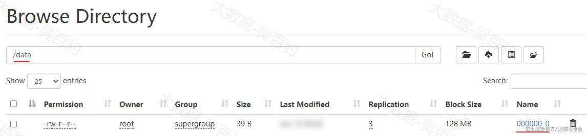

查看文件数据如下：

```plain
[root@node5 ~]# hdfs dfs -cat /data/*
1|zs
2|ls
3|ww
11|zs
22|ls
33|ww
44|ml
```

此外如果需要将一张表插入多多个表中时，可以使用如下语句，如下语句只需要查询一次表就可以实现分别向多张表中插入数据，减少磁盘IO。

```plain
FROM from_statement
INSERT OVERWRITE TABLE tablename1 [PARTITION (partcol1=val1, partcol2=val2 ...) [IF NOT EXISTS]] select_statement1
[INSERT OVERWRITE TABLE tablename2 [PARTITION ... [IF NOT EXISTS]] select_statement2] 
... ...;
```

案例：创建两张表t1和t2，将insert\_tbl表中的数据分别覆盖和追加方式插入到两张表中。

```plain
#创建t1和t2表
create table t1(id int ,name string) row format delimited fields terminated by ',';
create table t2(id int ,name string) row format delimited fields terminated by ',';

#通过from ... insert ... 语句覆盖和追加方式将数据写入到表中
from insert_tbl
insert overwrite table t1 select id ,name 
insert into table t2 select id,name;
```

### **2.3.3 export/import**

EXPORT命令：将Hive表或分区的数据和元数据导出到指定的输出位置。这个位置的数据可以被移动到另一个Hive实例，然后使用IMPORT命令从该位置导入数据。

IMPORT命令：从指定的源位置导入数据和元数据。如果目标表/分区不存在，IMPORT会创建它们，并且所有的表属性和参数将与EXPORT的表一致。如果目标表已经存在，则会检查其表结构是否一致且表中不能有数据，否则报错。

Hive的EXPORT和IMPORT命令用于在不同Hive实例之间转移表或分区的数据。

EXPORT 语法如下：

```plain
EXPORT TABLE tablename [PARTITION (part_column="value"[, ...])]
  TO 'export_target_path'
```

IMPORT 语法如下：

```plain
IMPORT [[EXTERNAL] TABLE new_or_original_tablename [PARTITION (part_column="value"[, ...])]]
  FROM 'source_path'
```

案例：将表insert\_tbl数据和元数据导出到HDFS路径/export目录中。

```plain
#导出表到HDFS路径中
export table insert_tbl to '/export/insert_tbl';
```

命令执行后，可以查看HDFS中路径如下：

*(⚠️ 图片缺失:源知识库原图已失效)* 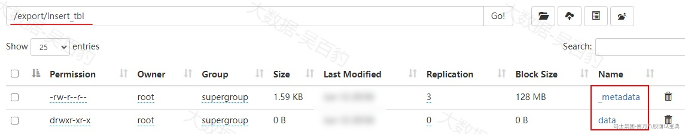

然后通过import命令将导出的数据再次导入到Hive中。

```plain
#将导出到HDFS中Hive数据和元数据导入到Hive表insert_tbl2中。
import table insert_tbl2 from '/export/insert_tbl';

#查看表中数据
select * from insert_tbl2;
+-----------------+-------------------+
| insert_tbl2.id  | insert_tbl2.name  |
+-----------------+-------------------+
| 1               | zs                |
| 2               | ls                |
| 3               | ww                |
| 11              | zs                |
| 22              | ls                |
| 33              | ww                |
| 44              | ml                |
+-----------------+-------------------+
```

## 2.4 **临时表**

Hive临时表只对当前会话可见，数据默认存储在HDFS “/tmp/hive/${username}”目录中，默认由参数“hive.exec.scratchdir”控制。临时表可以用于存储中间结果数据，当会话结束时临时表自动删除。此外，临时表不会在Hive Metastore中注册，所以在不同的会话之间临时表不可见。

案例：创建临时表，并向临时表中插入数据：

```plain
[root@node3 ~]# beeline -u jdbc:hive2://node1:10000 -n root
#创建表
create TEMPORARY table temp_tbl (id int ,name string,age int) row format delimited fields terminated by '\t';

#插入数据
insert into temp_tbl values (1,'zs',18),(2,'ls',19),(3,'ww',20);

#查询表中数据
select * from temp_tbl;
+--------------+----------------+---------------+
| temp_tbl.id  | temp_tbl.name  | temp_tbl.age  |
+--------------+----------------+---------------+
| 1            | zs             | 18            |
| 2            | ls             | 19            |
| 3            | ww             | 20            |
+--------------+----------------+---------------+
```

以上表创建好插入数据后，可以在HDFS “/tmp/hive/root/”路径下看到对应的数据目录。

当关闭当前hive会话窗口或者新启动hive 会话窗口后，查询当前库下的表，可以看到查询不到temp\_tbl表。

## 2.5 **内部表和外部表**

默认在Hive中创建的表“CREATE TABLE [IF NOT EXISTS] table\_name LOCATION hdfs\_path”都是内部表，建表时加上关键字“EXTERNAL”那么创建的表就是外部表:“CREATE EXTERNAL TABLE [IF NOT EXISTS] table\_name LOCATION hdfs\_path”。Hive内部表和外部表区别如下：

1) Hive中创建表默认是内部表，创建表可以通过LOCATION指定数据存储位置。

2) 当删除内部表时，表元数据和真实映射路径数据都会被删除。

3) 当删除外部表时，表元数据会被删除，真实映射的数据不会被删除。

案例：准备数据，并在Hive中创建内部表和外部表加载该数据，删除内部表/外部表观察映射数据是否被删除。

```plain
#准备data.txt数据文件，内容如下：
[root@node5 ~]# vim data.txt
[root@node5 ~]# hdfs dfs -put ./data.txt /

#在hive中创建内表，并将data.txt数据加载到表中。
create table inner_tbl (id int ,name string,age int) row format delimited fields terminated by ',';

#加载数据，HDFS中的数据会被移动到/user/hive/warehouse/inner_tbl目录下
load data inpath '/data.txt' into table inner_tbl;

#查询数据
select * from inner_tbl;
+---------------+-----------------+----------------+
| inner_tbl.id  | inner_tbl.name  | inner_tbl.age  |
+---------------+-----------------+----------------+
| 1             | zs              | 18             |
| 2             | ls              | 19             |
| 3             | ww              | 20             |
+---------------+-----------------+----------------+

#删除表
drop table inner_tbl;
```

删除内部表数据后，Hive默认会将表元数据和数据都会删除。而外部表则不同，操作如下：

```plain
#重新上传data.txt文件
[root@node5 ~]# hdfs dfs -put ./data.txt /

#创建外表
create external table external_tbl (id int ,name string,age int) row format delimited fields terminated by ',' ;

#加载数据，HDFS中的数据会被移动到/user/hive/warehouse/inner_tbl目录下
load data inpath '/data.txt' into table external_tbl;

#查询数据
select * from external_tbl;
+------------------+--------------------+-------------------+
| external_tbl.id  | external_tbl.name  | external_tbl.age  |
+------------------+--------------------+-------------------+
| 1                | zs                 | 18                |
| 2                | ls                 | 19                |
| 3                | ww                 | 20                |
+------------------+--------------------+-------------------+

#删除外部表，表删除后只会删除Hive中表的元数据，表的数据文件不会被删除。
drop table external_tbl;
```

Hive外部表删除后只会删除Hive中表的元数据，表的数据文件不会被删除。执行外部表删除后，还可以在HDFS中查看到数据文件，如下：

*(⚠️ 图片缺失:源知识库原图已失效)* 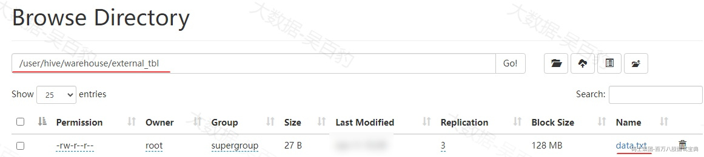

## 2.6 **分区表**

Hive表设置分区可以加快查询Hive表的速度，防止扫描全部数据。Hive表创建分区必须在表定义时指定对应的partition字段，表中数据会按照该分区字段存储到多个目录中，在进行数据查询时，分区列作为正常的列进行使用即可。

### **2.6.1 单分区**

单分区指的是Hive分区表只按照一列进行分区。建表语句如下：

```plain
CREATE TABLE xxx (col1 int, col2 string) PARTITIONED BY (col3 string)... ...
```

注意：分区字段不能出现在建表字段中，需要将分区字段放在“PARTITIONED BY ”语句中。

案例：创建分区表 partition\_tbl ，并向表中加载数据。

```plain
#创建分区表
[root@node3 ~]# beeline -u jdbc:hive2://node1:10000 -n root
create table partition_tbl
(
id int,
name string,
likes array<string>,
address map<string,string>
)
partitioned by(age int)
row format delimited 
fields terminated by ','
collection items terminated by '-'
map keys terminated by ':';
```

向分区表中加载数据可以使用load方式也可以使用insert into方式。

- **Load方式向分区表中加载数据**

Load方式向分区表中加载数据时，数据文件中可以不包含分区列，但在加载时需要通过“ partition(...)”指定对应的分区。或者数据文件中包含分区列，hive会自动按照分隔符切分字段，按照切出来的对应列自动进行分区（这种方式在HDFS中文件不会移动，而是会将相应分区数据复制到对应的表分区路径下）。

```plain
#准备data.txt 文件，内容如下
1,小明1,lol-book-movie,beijing:xisanqi-shanghai:pudong
2,小明2,lol-book-movie,beijing:xisanqi-shanghai:pudong
3,小明3,lol-book-movie,beijing:xisanqi-shanghai:pudong
4,小明4,lol-book-movie,beijing:xisanqi-shanghai:pudong
5,小明5,lol-movie,beijing:xisanqi-shanghai:pudong
6,小明6,lol-book-movie,beijing:xisanqi-shanghai:pudong
7,小明7,lol-book,beijing:xisanqi-shanghai:pudong
8,小明8,lol-book,beijing:xisanqi-shanghai:pudong
9,小明9,lol-book-movie,beijing:xisanqi-shanghai:pudong

#将以上数据文件上传到HDFS 并通过load语句加载到表中
[root@node5 ~]# hdfs dfs -put ./data.txt /
load data inpath '/data.txt' into table partition_tbl partition(age=18);

#数据文件中包含age列，修改data.txt文件数据如下
10,小明10,lol-book,beijing:xisanqi-shanghai:pudong,19
11,小明11,lol-book,beijing:xisanqi-shanghai:pudong,20

#重新通过Load向Hive分区表中加载数据，可以不指定partition
load data inpath '/data.txt' into table partition_tbl;

#查询表中数据
select * from partition_tbl;
... ...

#查看表中分区
show partitions from partition_tbl;
+------------+
| partition  |
+------------+
| age=18     |
| age=19     |
| age=20     |
+------------+
```

以上加载数据后，可以通过HDFS中查看到表的分区目录：

*(⚠️ 图片缺失:源知识库原图已失效)* 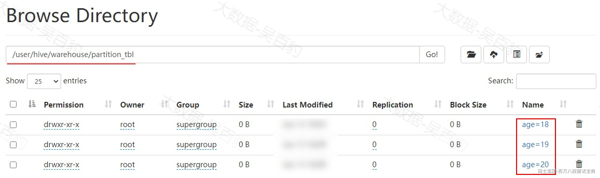

- **insert into 方式向分区表中写入数据**

insert into 方式向分区表中写入数据也有两种方式，一种方式是如果数据中不包含分区数据，在表后指定partition(...)指定数据所在分区。另一种方式是如果数据中包含分区数据，分区数据需放在正常列后面，然后直接通过insert into 将数据写入到分区表中即可，Hive会自动将最后对应列作为分区列处理。

```plain
#第一种方式向分区表中插入数据
INSERT INTO TABLE partition_tbl PARTITION (age=19)
VALUES
(12, '小明12', array('lol', 'book', 'movie'), map('beijing', 'xisanqi', 'shanghai', 'pudong')),
(13, '小明13', array('lol', 'movie'), map('beijing', 'xisanqi', 'shanghai', 'pudong')),
(14, '小明14', array('lol', 'book'), map('beijing', 'xisanqi', 'shanghai', 'pudong'));

#查看分区
show partitions partition_tbl;
+------------+
| partition  |
+------------+
| age=18     |
| age=19     |
| age=20    |
+------------+

#第二种方式向分区表中插入数据
INSERT INTO TABLE partition_tbl
VALUES
(15, '小明15', array('lol', 'book', 'movie'), map('beijing', 'xisanqi', 'shanghai', 'pudong'),19),
(16, '小明16', array('lol', 'movie'), map('beijing', 'xisanqi', 'shanghai', 'pudong'),21);

#查看表中 age为19的数据
select * from partition_tbl where age = 19;
+-------------------+---------------------+-------------------------+--------------------------------------------+--------------------+
| partition_tbl.id  | partition_tbl.name  |   partition_tbl.likes   |           partition_tbl.address            | partition_tbl.age  |
+-------------------+---------------------+-------------------------+--------------------------------------------+--------------------+
| 10                | 小明10                | ["lol","book"]          | {"beijing":"xisanqi","shanghai":"pudong"}  | 19                 |
| 12                | 小明12                | ["lol","book","movie"]  | {"beijing":"xisanqi","shanghai":"pudong"}  | 19                 |
| 13                | 小明13                | ["lol","movie"]         | {"beijing":"xisanqi","shanghai":"pudong"}  | 19                 |
| 14                | 小明14                | ["lol","book"]          | {"beijing":"xisanqi","shanghai":"pudong"}  | 19                 |
| 15                | 小明15                | ["lol","book","movie"]  | {"beijing":"xisanqi","shanghai":"pudong"}  | 19                 |
+-------------------+---------------------+-------------------------+--------------------------------------------+--------------------+
```

以上执行insert into 语句时，需要指定partition 分区。执行完成后可以查看HDFS中分区目录增加了对应分区目录：

*(⚠️ 图片缺失:源知识库原图已失效)* 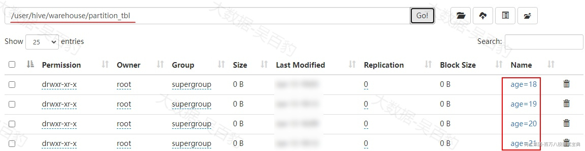

此外，insert into 方式还支持如下方式向分区表中插入数据，可以指定partition，也可以直接将分区列查询出来放在最后即可（即动态分区，详细见后续动态分区部分）。

```plain
insert into partition_tbl partition(age=30) select id ,name ,likes,address from partition_tbl where id = 10;
或者
insert into partition_tbl select id ,name ,likes,address,age from partition_tbl where id = 10;
```

### **2.6.2 双分区**

双分区指的是Hive分区表分区列有两列。建表语句如下：

```plain
CREATE TABLE xx (col1 int, col2 string) PARTITIONED  BY (col3 string, col4 string)... ...
```

以上双分区表中首先按照col3进行分区，然后再按照col4进行分区，对应到HDFS中数据存储，col3列为一层文件夹，col4列又为col3文件夹中的文件夹，理论上分区的个数可以任意多，但是常用的Hive分区表为单分区和双分区。

案例：创建分区表partition\_tbl2，并向表中插入数据。

```plain
#创建双分区表 partition_tbl2
create table partition_tbl2 (id int ,name string) partitioned by (age int ,loc string) row format delimited fields terminated by ',';
```

向双分区表中加载数据也可以使用load和insert into 方式，下面进行演示。

- **load 方式向双分区表中加载数据**

同样，load方式向Hive双分区表中加载数据，根据加载数据包不包含分区列也有两种方式，一种加载数据中不包含分区数据，需要在load时通过partition(...)指定分区列；另外一种加载数据中包含分区数据，直接load加载数据即可，会自动按照分隔符切分字段，按照切出来的对应列自动进行分区（这种方式在HDFS中文件不会移动，而是会将相应分区数据复制到对应的表分区路径下）。

```plain
#准备data.txt 数据文件，内容如下
1,zs
2,ls
3,ww

#第一种方式将数据上传至HDFS 根目录下，然后加载到partition_tbl2表中
[root@node5 ~]# hdfs dfs -put ./data.txt /

load data inpath '/data.txt' into table partition_tbl2 partition(age =18,loc='beijing' );

#准备如下data.txt数据，然后上传至HDFS根路径中
4,a1,19,shanghai
5,a2,20,guangzhou

#第二种方式将数据加载到partition_tbl2表中。
load data inpath '/data.txt' into table partition_tbl2;

#查看表中数据
select * from  partition_tbl2;

#查看表中的分区列
show partitions partition_tbl2;
+-----------------------+
|       partition       |
+-----------------------+
| age=18/loc=beijing    |
| age=19/loc=shanghai   |
| age=20/loc=guangzhou  |
+-----------------------+
```

**以上数据通过load方式向分区表中加载数据时，partition(...)分区先写谁都可以，但是属性名称不能写错**。插入到表中后可以在HDFS中看到双分区的目录结构如下：

*(⚠️ 图片缺失:源知识库原图已失效)* 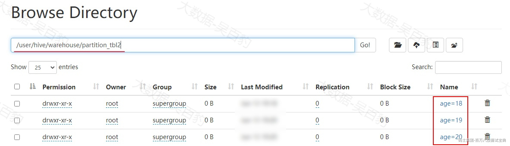

- **insert into 方式向双分区表中加载数据**

insert into 方式向分区表中写入数据也有两种方式，一种方式是如果数据中不包含分区数据，在表后指定partition(...)指定数据所在分区。另一种方式是如果数据中包含分区数据，分区数据需放在正常列后面，然后直接通过insert into 将数据写入到分区表中即可，Hive会自动将最后对应列作为分区列处理。

```plain
#第一种方式：insert into 中直接通过partition 指定分区
insert into partition_tbl2 PARTITION (age=19,loc='tianjin') values (6,'a1'),(7,'a2');

#第二种方式：insert into时不指定partition，直接插入的数据中会自动按照最后两列进行分区匹配
insert into partition_tbl2 values (4,'ml',19,'beijing'),(5,'tq',20,'shanghai');

#查看分区
show partitions partition_tbl2;
+-----------------------+
|       partition       |
+-----------------------+
| age=18/loc=beijing    |
| age=19/loc=beijing    |
| age=19/loc=shanghai   |
| age=19/loc=tianjin    |
| age=20/loc=guangzhou  |
| age=20/loc=shanghai   |
+-----------------------+
```

以上数据向partition\_tbl2中加载后，可以查看到HDFS中目录结构如下：

*(⚠️ 图片缺失:源知识库原图已失效)* 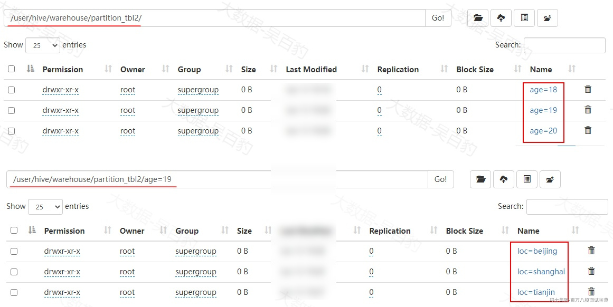

此外，insert into 方式还支持如下方式向分区表中插入数据，可以指定partition，也可以直接将分区列查询出来放在最后即可。

```plain
insert into partition_tbl2 partition(age=30,loc='nanjing') select id ,name from partition_tbl2 where id = 5;
或者
insert into partition_tbl2 select id ,name ,age,loc from partition_tbl2 where id = 5;
```

### **2.6.3 Hive分区表操作**

#### 2.6.3.1 **查询分区信息**

查询表分区语法如下，这里不再演示。

```plain
SHOW PARTITIONS your_partition_table;
```

#### 2.6.3.2 **表添加新分区**

给表添加新分区是指按照表已经定义好的分区字段添加新的分区。给表添加新分区语法如下：

```plain
ALTER TABLE table_name ADD [IF NOT EXISTS] PARTITION partition_spec [LOCATION 'location'][ PARTITION partition_spec [LOCATION 'location']  ...];
```

注意:给表一次性添加多个分区时，PARTITOIN之间使用空格隔开即可。

准备如下分区表partition\_tbl3并加载数据。

```plain
#创建分区表partition_tbl3
create table partition_tbl3(id Int,name String) partitioned by (age Int,loc String)row format delimited fields terminated by ',';

#准备如下data.txt数据并上传到HDFS 根目录
1,zs,18,beijing
2,ls,18,shanghai
3,ww,19,tianjin
4,ml,20,shenzhen
5,tq,19,shanghai

#向表partition_tbl3中加载数据
load data inpath '/data.txt' into table partition_tbl3;

#查看表中分区
show partitions partition_tbl3;
+----------------------+
|      partition       |
+----------------------+
| age=18/loc=beijing   |
| age=18/loc=shanghai  |
| age=19/loc=shanghai  |
| age=19/loc=tianjin   |
| age=20/loc=shenzhen  |
+----------------------+
```

注意：以上向表中加载数据时，建表时指定了分区列，但是加载数据时没有指定分区，会自动按照分隔符切分字段，按照切出来的对应列自动进行分区。

案例：向表partition\_tbl3中添加新的分区。

```plain
#表partition_tbl3在创建时定义的是双分区，添加分区时不能只指定一个，需要同时指定两个分区的值。
ALTER TABLE partition_tbl3 ADD PARTITION (age=30,loc='hangzhou');

#也可以一次给表添加多个分区 
ALTER TABLE partition_tbl3 ADD PARTITION (age=31,loc='hangzhou') PARTITION (age=32,loc='nanjing');

#查看表中分区
show partitions partition_tbl3;
+----------------------+
|      partition       |
+----------------------+
| age=18/loc=beijing   |
| age=18/loc=shanghai  |
| age=19/loc=shanghai  |
| age=19/loc=tianjin   |
| age=20/loc=shenzhen  |
| age=30/loc=hangzhou  |
| age=31/loc=hangzhou  |
| age=32/loc=nanjing   |
+----------------------+

#添加分区的字段顺序先后颠倒也没问题
ALTER TABLE partition_tbl3 ADD PARTITION (loc='shenzhen',age=40);

#查看分区
show partitions partition_tbl3;
+----------------------+
|      partition       |
+----------------------+
| age=18/loc=beijing   |
| age=18/loc=shanghai  |
| age=19/loc=shanghai  |
| age=19/loc=tianjin   |
| age=20/loc=shenzhen  |
| age=30/loc=hangzhou  |
| age=31/loc=hangzhou  |
| age=32/loc=nanjing   |
| age=40/loc=shenzhen  |
+----------------------+
```

注意:给表一次性添加多个分区时，PARTITOIN之间没有逗号；添加新的分区后，HDFS对应分区只有目录没有数据。如果添加的分区已经存在，则抛出AlreadyExistsException。

#### 2.6.3.3 **删除分区**

删除分区的语法如下：

```plain
ALTER TABLE table_name DROP [IF EXISTS] PARTITION partition_spec[, PARTITION partition_spec, ...]
  [IGNORE PROTECTION] [PURGE]; 
```

**注意：单分区表删除分区直接指定一个分区删除表即可；双分区删除分区时可以指定一个分区值也可以指定两个分区值进行删除，如果指定第一个分区值那么该分区下的所有分区都会被删除。删除分区时，对应分区中的数据也会被删除。此外，也可以一次删除多个分区，PARTITION 之间需要使用逗号隔开。**

案例：给表partition\_tbl3 删除分区。

```plain
#给表partition_tbl3删除 loc=hangzhou分区
alter table partition_tbl3 drop if exists partition (loc='hangzhou');
#删除后结果
+----------------------+
|      partition       |
+----------------------+
| age=18/loc=beijing   |
| age=18/loc=shanghai  |
| age=19/loc=shanghai  |
| age=19/loc=tianjin   |
| age=20/loc=shenzhen  |
| age=32/loc=nanjing   |
| age=40/loc=shenzhen  |
+----------------------+

#给表partition_tbl3删除 age=18分区
alter table partition_tbl3 drop if exists partition (age=18);
#删除后结果
+----------------------+
|      partition       |
+----------------------+
| age=19/loc=shanghai  |
| age=19/loc=tianjin   |
| age=20/loc=shenzhen  |
| age=32/loc=nanjing   |
| age=40/loc=shenzhen  |
+----------------------+

#给表partition_tbl3一次删除多个分区，partition之间要有逗号
alter table partition_tbl3 drop if exists partition (loc='shanghai'),partition (loc='shenzhen');
#删除后结果
+----------------------+
|      partition       |
+----------------------+
| age=19/loc=tianjin   |
| age=32/loc=nanjing   |
+----------------------+
```

#### 2.6.3.4 **修复分区**

默认在Hive中创建表为内表，删除表时表元数据和数据都会被删除。假设创建的Hive分区表为外表，当Hive分区表被删除后表元数据被删除，而HDFS数据不会被删除，那么此刻重新创建Hive外表，即使数据映射原有的分区目录数据，分区表中也不会有正常的分区，这时可以通过Hive msck命令给表重新添加分区数据并同步给元数据。

Hive msck(MetaStoreCheck)修复分区语法如下：

```plain
MSCK REPAIR TABLE table_name [ADD/DROP/SYNC PARTITIONS];
```

以上命令解释如下：

- ADD PARTITIONS:如果指定，会给表增加HDFS路径中存在但元数据中缺失的分区信息。

- DROP PARTITIONS:如果指定，会给表删除HDFS路径中已经删除但元数据中仍然存在的分区信息。

- SYNC PARTITIONS:相当于同时执行ADD PARTITIONS和DROP PARTITIONS命令，既同步HDFS中存在数据路径的分区信息又同步删除元数据中存在但HDFS路径已经删除的分区信息。

注意：如果只执行“MSCK REPAIR TABLE table\_name”命令，等价于执行“MSCK REPAIR TABLE table\_name ADD PARTITIONS”命令。

下面创建hive 分区外表partition\_tbl4，并加载数据，操作如下：

```plain
#创建分区外表
create external table partition_tbl4(id Int,name String) partitioned by (age Int,loc String)row format delimited fields terminated by ',' location '/hive_partition';

#向表中插入如下数据
insert into partition_tbl4 values (1,'zs',18,'beijing'),(2,'ls',19,'shanghai');
```

查看HDFS中数据目录如下：

*(⚠️ 图片缺失:源知识库原图已失效)* 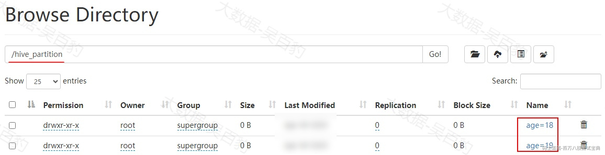

下面进行partition\_tbl4表的删除重建，并修复分区数据。

```plain
#删除表 partition_tbl4后，可以看到HDFS数据没有被删除
drop table partition_tbl4;
[root@node5 ~]# hdfs dfs -ls /hive_partition
/hive_partition/age=18
/hive_partition/age=19

#重新创建分区外表partition_tbl4 ，查询表中数据没有数据，因为表中元数据被删除
create external table partition_tbl4(id Int,name String) partitioned by (age Int,loc String)row format delimited fields terminated by ',' location '/hive_partition';

#修复表partition_tbl4分区数据
msck repair table partition_tbl4;

#再次查询表中数据
select * from partition_tbl4;
+--------------------+----------------------+---------------------+---------------------+
| partition_tbl4.id  | partition_tbl4.name  | partition_tbl4.age  | partition_tbl4.loc  |
+--------------------+----------------------+---------------------+---------------------+
| 1                  | zs                   | 18                  | beijing             |
| 2                  | ls                   | 19                  | shanghai            |
+--------------------+----------------------+---------------------+---------------------+
```

## 2.7 **动态分区**

在前面小节中，向分区中插入数据时我们学习过“insert into partition\_tbl partition(xx=xx,...) select col1,col2... from other\_tabe”方式向分区表中插入数据，如果我们查询到的数据所属的分区非常多，那么就需要写非常多的SQL来指定向不同的分区中插入数据。

Hive中提供了动态分区方式向表中插入数据：“insert into partition\_tbl select col1,col2... from other\_tabe”,这样**被写入的分区不需要由用户指定，而是由查询数据最后对应列的值来动态决定**，可以提升效率，只需要一个insert sql 语句就能写入多个分区。

### **2.7.1 动态分区案例**

下面先演示普通方式向分区表中加载数据。首先准备如下数据，内容如下:

```plain
1,zs,2024-10-01
2,ls,2024-10-01
3,ww,2024-10-02
4,ml,2024-10-02
```

Hive中创建分区表dynamic\_tbl，并以最后时间列作为分区列，将以上数据加载到分区表中。那么需要将相同的时间数据放入不同名称的文件，并上传至HDFS中，然后向表分区中加载数据：

```plain
#创建dynamic_tbl语句
create table dynamic_tbl(id int,name string) partitioned by (log_dt string) row format delimited fields terminated by ',';

#向Hive分区表中加载以上数据，相同分区数据放入到相同文件
[root@node5 ~]# cat data1.txt 
1,zs,2024-10-01
2,ls,2024-10-01
[root@node5 ~]# cat data2.txt 
3,ww,2024-10-02
4,ml,2024-10-02

#将以上数据文件上传至HDFS
[root@node5 ~]# hdfs dfs -put ./data1.txt /
[root@node5 ~]# hdfs dfs -put ./data2.txt /

#向Hive表中加载数据，每次执行指定对应的分区内容
load data  inpath '/data1.txt' into table dynamic_tbl partition (log_dt='2024-10-01');
load data  inpath '/data2.txt' into table dynamic_tbl partition (log_dt='2024-10-02');
```

以上方式有多少分区数据就会执行多少次不同的SQL语句，比较麻烦。如果使用动态分区方式加载数据，则一条SQL就可以将数据加载到表对应分区中。

```plain
#删除dynamic_tbl并重建
drop table dynamic_tbl;
create table dynamic_tbl(id int,name string) partitioned by (log_dt string) row format delimited fields terminated by ',';

#将以上数据写入到data.txt中，并上传至HDFS 根路径
1,zs,2024-10-01
2,ls,2024-10-01
3,ww,2024-10-02
4,ml,2024-10-02

#动态分区方式向表中加载数据
load data  inpath '/data.txt' into table dynamic_tbl;

#查看表中分区
show partitions dynamic_tbl;
+--------------------+
|     partition      |
+--------------------+
| log_dt=2024-10-01  |
| log_dt=2024-10-02  |
+--------------------+
```

### **2.7.2 动态分区参数**

关于Hive动态分区相关参数有如下：

- **hive.exec.dynamic.partition**

该参数表示是否开启动态分区，默认为true。

- **hive.exec.dynamic.partition.mode**

该参数表示动态分区的模式，分为strict（严格模式）和nonstrict(非严格模式)。严格模式中要求向分区表中写入数据时必须指定一个分区为静态分区；非严格模式中允许所有的分区都使用动态分区。改参数在Hive3.x版本中默认为strict，在Hive4.x版本后默认为nonstrict。可以通过如下命令查询：

```plain
[root@node3 ~]# beeline -u jdbc:hive2://node1:10000 -n root -e "set" |grep hive.exec.dynamic.partition.mode
```

- **hive.exec.max.dynamic.partitions**

该参数表示一条insert语句可同时创建的最大分区个数，默认为1000。

- **hive.exec.max.dynamic.partitions.pernode**

该参数表示每个maper或者reducer可以允许创建的最大动态分区个数，默认为100。

## 2.8 **分桶表**

Hive 分桶是比分区更细粒度的数据划分，可以在分桶表中指定某一列为分桶列，让该列数据按照哈希取模的方式随机、均匀地分发到各个桶文件中。例如：按照表name列分为3个桶，就是对name属性值的根据哈希函数获取hash值对3取摸，按照取模结果对数据分桶。如取模结果为0的数据记录存放到一个文件，取模为1的数据存放到一个文件，取模为2的数据存放到一个文件。分区是分目录存储数据，分桶是将表中的数据分文件存储。

分桶可提高查询效率，比如我们要对两张在同一列上进行了分桶操作的表进行JOIN操作的时候，只需要对保存相同列值的桶进行JOIN操作即可。

### **2.8.1 分桶操作**

创建分桶表bucket\_tbl,需要通过cluster by指定分桶依据的列名，并指定分桶桶数。如下：

```plain
#使用clustered by 指定分桶依据的列名，还要指定分多少桶，这里指定分为3个桶
create table bucket_tbl(id int,name string,age int) clustered by (id) into 3 buckets row format delimited fields terminated by '\t'; 
```

准备如下bucket.txt文件，数据如下：

```plain
1	a	19
2	b	21
3	c	30
4	d	25
5	e	26
6	f	23
7	g	29
8	h	28
9	i	20
10	j	18
```

将bucket.txt上传到HDFS中，并加载到分桶表bucket\_tbl中。

```plain
#上传bucket.txt 到HDFS根路径中
[root@node5 ~]# hdfs dfs -put ./bucket.txt  /

#向表bucket_tbl中加载数据
load data inpath '/bucket.txt' into table bucket_tbl;

#查询表bucket_tbl中的数据
select * from bucket_tbl;
+----------------+------------------+-----------------+
| bucket_tbl.id  | bucket_tbl.name  | bucket_tbl.age  |
+----------------+------------------+-----------------+
| 2              | b                | 19              |
| 6              | f                | 23              |
| 7              | g                | 24              |
| 10             | j                | 27              |
| 1              | a                | 18              |
| 4              | d                | 21              |
| 8              | h                | 25              |
| 9              | i                | 26              |
| 3              | c                | 20              |
| 5              | e                | 22              |
+----------------+------------------+-----------------+
```

向分桶表中插入数据后，可以观察HDFS中该表存储目录如下：

*(⚠️ 图片缺失:源知识库原图已失效)* 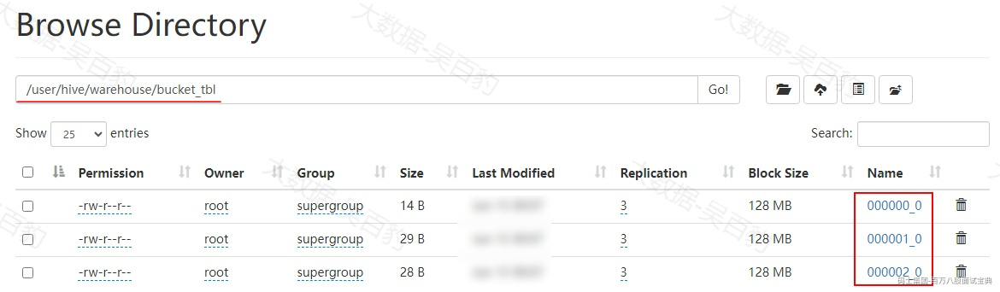

注意：也可以使用insert into table 命令向分桶表中插入数据，如：

```plain
insert into table bucket_tbl select columns from tbl;
insert overwrite table bucket_tbl select columns from tbl;
```

### **2.8.2 分桶排序**

分桶表中对数据进行分桶形成每文件后，还可以通过“sorted by”指定排序列，让每个桶文件内的数据按照指定列进行排序。

```plain
#创建分桶表bucket_sort_tbl
create table bucket_sort_tbl(id int,name string,age int) clustered by (id) sorted by(age) into 3 buckets row format delimited fields terminated by '\t'; 

#将HDFS中bucket.txt数据加载到bucket_sort_tbl表中
load data inpath '/bucket.txt' into table bucket_sort_tbl;

#查看每个桶文件内的数据可以发现按照指定排序列进行了排序
[root@node5 ~]# hdfs dfs -cat /user/hive/warehouse/bucket_sort_tbl/000000_0
9	i	20
7	g	29
[root@node5 ~]# hdfs dfs -cat /user/hive/warehouse/bucket_sort_tbl/000001_0
10	j	18
1	a	19
5	e	26
8	h	28
[root@node5 ~]# hdfs dfs -cat /user/hive/warehouse/bucket_sort_tbl/000002_0
2	b	21
6	f	23
4	d	25
3	c	30
```

### **2.8.3 分区+分桶**

在Hive创建表时，可以同时分区和分桶，创建表语句如下：

```plain
create table partition_bucket_tbl(id int ,name string,age int) partitioned by (loc string) clustered by (id) into 3 buckets row format delimited fields terminated by '\t'; 
```

准备如下数据并向表中加载：

```plain
#准备data.txt
1	a	19	beijing
2	b	21	beijing
3	c	30	shanghai
4	d	25	shanghai
5	e	26	beijing
6	f	23	beijing
7	g	29	beijing
8	h	28	shanghai
9	i	20	shanghai
10	j	18	beijing

#将文件上传至HDFS
[root@node5 ~]# hdfs dfs -put ./data.txt /

#向表中加载数据
load data inpath '/data.txt' into table partition_bucket_tbl;
```

查看HDFS 中Hive存储数据，我们发现当一张表既有分区又有分桶时，针对每个分区内的数据都会进行分桶操作，每个分区内都有对应的桶个数。

*(⚠️ 图片缺失:源知识库原图已失效)* 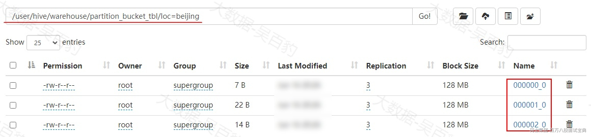

*(⚠️ 图片缺失:源知识库原图已失效)* 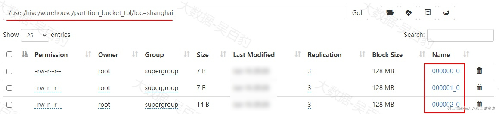

## 2.9 **Hive存储格式及压缩**

### **2.9.1 行列存储**

Hive表中数据存储支持行式存储(Row-Based)和列式存储(Column-Based)。

*(⚠️ 图片缺失:源知识库原图已失效)* 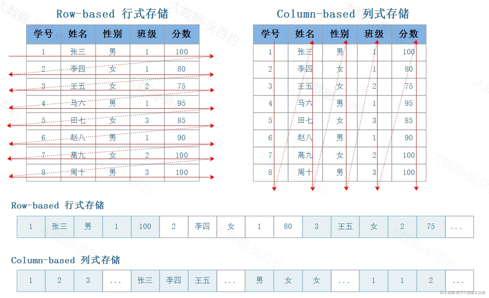

- **行式存储在数据写入和修改上具有优势。**

行存储的写入是一次完成的，如果这种写入建立在操作系统的文件系统上，可以保证写入过程的成功或者失败，可以保证数据的完整性。列式存储需要把一行记录拆分成单列保存，写入次数明显比行存储多(因为磁头调度次数多，而磁头调度是需要时间的，一般在1ms~10ms)，再加上磁头需要在盘片上移动和定位花费的时间，实际消耗更大。

数据修改实际上也是一次写入过程，不同的是，数据修改是对磁盘上的记录做删除标记。行存储是在指定位置写入一次，列存储是将磁盘定位到多个列上分别写入，这个过程仍是行存储的列数倍。

所以，行式存储在数据写入和修改上具有很大优势。

- **列式存储在数据读取和解析、分析数据上具有优势。**

数据读取时，行存储通常将一行数据完全读出，如果只需要其中几列数据的情况，就会存在冗余列，出于缩短处理时间的考量，消除冗余列的过程通常是在内存中进行的。列存储每次读取的数据是集合的一段或者全部，不存在冗余性问题。

列式存储中的每一列数据类型是相同的，不存在二义性问题，例如，某列类型为整型int,那么它的数据集合一定是整型数据，这种情况使数据解析变得十分容易。相比之下，行存储则要复杂得多，因为在一行记录中保存了多种类型的数据，数据解析需要在多种数据类型之间频繁转换，这个操作很消耗CPU，增加了解析的时间。

所以，列式存储在数据读取和解析数据做数据分析上更具优势。

### **2.9.2 Hive存储格式**

Hive表存储格式是指数据在HDFS中是如何组织排列的，目前Hive支持TextFile、JsonFile、SequenceFile、Avro、RCFile、ORC、Parquet 七种格式，在建表时使用STORD AS(TEXTFILE/JSONFILE/SEQUENCEFILE/RCFILE/AVRO/ORC/PARQUET)来指定存储格式。默认创建Hive表的存储格式为TextFile格式。

以下是7种存储格式对比：

|  |  |  |  |
| --- | --- | --- | --- |
| **文件格式** | **存储格式** | **特点** | **使用情况** |
| **TextFile** | 行式存储 | 默认存储格式 | 一般 |
| **JSONFILE** | 行式存储 | Hive4.x后支持，底层本质还是TextFile存储格式。 | 一般 |
| **SEQUENCEFILE** | 行式存储 | 二进制K,V格式存储 | 极少使用 |
| **AVRO** | 行式存储 | AVRO在Hive中使用不多 | 极少使用 |
| **RCFILE** | 列式存储 | 行列混合存储格式，结合了行存储和列存储的优点，ORC是其升级版 | 极少使用 |
| **ORC** | 列式存储 | 高效的压缩和查询性能，适用于大数据分析 | 经常使用 |
| **PARQUET** | 列式存储 | 高效的压缩和查询性能，适用于大数据分析 | 经常使用 |

下面对以上各个格式进行介绍。

#### 2.9.2.1 **TextFile**

基于行存储，每一行就是一条记录，创建表时不指定STORED AS 则Hive表默认以TextFile进行存储。默认存储数据没有压缩。

```plain
#建表
create table text_tbl2 (id int,name string,age int) partitioned by(loc string) row format delimited fields terminated by '\t' stored as textfile;

#查询表结构
show create table text_tbl;
+----------------------------------------------------+
|                   createtab_stmt                   |
+----------------------------------------------------+
| CREATE EXTERNAL TABLE `text_tbl`(                  |
|   `id` int,                                        |
|   `name` string,                                   |
|   `age` int)                                       |
| PARTITIONED BY (                                   |
|   `loc` string)                                    |
| ROW FORMAT SERDE                                   |
|   'org.apache.hadoop.hive.serde2.lazy.LazySimpleSerDe'  |
| WITH SERDEPROPERTIES (                             |
|   'field.delim'='\t',                              |
|   'serialization.format'='\t')                     |
| STORED AS INPUTFORMAT                              |
|   'org.apache.hadoop.mapred.TextInputFormat'       |
| OUTPUTFORMAT                                       |
|   'org.apache.hadoop.hive.ql.io.HiveIgnoreKeyTextOutputFormat' |
| LOCATION                                           |
|   'hdfs://mycluster/user/hive/warehouse/text_tbl'  |
| TBLPROPERTIES (                                    |
|   'TRANSLATED_TO_EXTERNAL'='TRUE',                 |
|   'bucketing_version'='2',                         |
|   'external.table.purge'='TRUE',                   |
|   'transient_lastDdlTime'='1718549885')            |
+----------------------------------------------------+
```

这里不再演示向TextFile格式表中加载数据。

#### 2.9.2.2 **JsonFile**

JsonFile是用于存储简单数据结构和对象的文件格式，Hive表中Stored as jsonfile，底层本质上也是TextFile方式存储数据，只是SERDE为“org.apache.hadoop.hive.serde2.JsonSerDe”。

准备如下json.txt文件，并将该文件上传至HDFS根路径中。

```plain
{"id": 1, "name": "张三", "age": 30, "country": "中国", "dt": "2024-06-16"}
{"id": 2, "name": "李四", "age": 25, "country": "日本", "dt": "2024-06-16"}
{"id": 3, "name": "王五", "age": 35, "country": "韩国", "dt": "2024-06-17"}
{"id": 4, "name": "赵六", "age": 28, "country": "澳大利亚", "dt": "2024-06-17"}
{"id": 5, "name": "高七", "age": 22, "country": "印度", "dt": "2024-06-18"}
```

创建Hive表，STORED AS 指定为jsonfile，并加载数据：

```plain
#创建Hive 表
CREATE TABLE json_tbl (
    id INT,
    name STRING,
    age INT,
    country STRING
)
PARTITIONED BY (dt STRING)
STORED AS jsonfile;

#查看表结构
show create table json_tbl;
+----------------------------------------------------+
|                   createtab_stmt                   |
+----------------------------------------------------+
| CREATE EXTERNAL TABLE `json_tbl`(                  |
|   `id` int COMMENT 'from deserializer',            |
|   `name` string COMMENT 'from deserializer',       |
|   `age` int COMMENT 'from deserializer',           |
|   `country` string COMMENT 'from deserializer')    |
| PARTITIONED BY (                                   |
|   `dt` string)                                     |
| ROW FORMAT SERDE                                   |
|   'org.apache.hadoop.hive.serde2.JsonSerDe'        |
| STORED AS INPUTFORMAT                              |
|   'org.apache.hadoop.mapred.TextInputFormat'       |
| OUTPUTFORMAT                                       |
|   'org.apache.hadoop.hive.ql.io.HiveIgnoreKeyTextOutputFormat' |
| LOCATION                                           |
|   'hdfs://mycluster/user/hive/warehouse/json_tbl'  |
| TBLPROPERTIES (                                    |
|   'TRANSLATED_TO_EXTERNAL'='TRUE',                 |
|   'bucketing_version'='2',                         |
|   'external.table.purge'='TRUE',                   |
|   'transient_lastDdlTime'='1718551980')            |
+----------------------------------------------------+

#向表中加载数据
load data inpath '/json.txt' into table json_tbl;

#查看表中数据
select * from json_tbl;
+--------------+----------------+---------------+-------------------+--------------+
| json_tbl.id  | json_tbl.name  | json_tbl.age  | json_tbl.country  | json_tbl.dt  |
+--------------+----------------+---------------+-------------------+--------------+
| 2            | 李四             | 25            | 日本                | 2024-06-16   |
| 1            | 张三             | 30            | 中国                | 2024-06-16   |
| 4            | 赵六             | 28            | 澳大利亚              | 2024-06-17   |
| 3            | 王五             | 35            | 韩国                | 2024-06-17   |
| 5            | 高七             | 22            | 印度                | 2024-06-18   |
+--------------+----------------+---------------+-------------------+--------------+
```

**注意：Hive表存储指定为Josnfile时，需要保证json文件中列的名字和表中列的名字保持一样并且数据类型可以转换。**

#### 2.9.2.3 **SequenceFile**

SequenceFile是Hadoop API提供的二进制格式文件，其将数据以K,V形式序列化到文件中，SequenceFile主要由一个Header+多条Record组成，Header中记录了K,V ClassName、是否压缩和元数据信息。SequenceFile以行存储，支持分割和压缩。SequenceFile文件存储格式在Hive中极少使用。

```plain
#创建sequenceFile存储格式表
CREATE TABLE sequence_tbl (
    id INT,
    name STRING,
    age INT,
    country STRING
)
PARTITIONED BY (dt STRING)
STORED AS sequencefile;

#查看表创建信息
show create table sequence_tbl;
+----------------------------------------------------+
|                   createtab_stmt                   |
+----------------------------------------------------+
| CREATE EXTERNAL TABLE `sequence_tbl`(              |
|   `id` int,                                        |
|   `name` string,                                   |
|   `age` int,                                       |
|   `country` string)                                |
| PARTITIONED BY (                                   |
|   `dt` string)                                     |
| ROW FORMAT SERDE                                   |
|   'org.apache.hadoop.hive.serde2.lazy.LazySimpleSerDe'  |
| STORED AS INPUTFORMAT                              |
|   'org.apache.hadoop.mapred.SequenceFileInputFormat'  |
| OUTPUTFORMAT                                       |
|   'org.apache.hadoop.hive.ql.io.HiveSequenceFileOutputFormat' |
| LOCATION                                           |
|   'hdfs://mycluster/user/hive/warehouse/sequence_tbl' |
| TBLPROPERTIES (                                    |
|   'TRANSLATED_TO_EXTERNAL'='TRUE',                 |
|   'bucketing_version'='2',                         |
|   'external.table.purge'='TRUE',                   |
|   'transient_lastDdlTime'='1718554850')            |
+----------------------------------------------------+
```

由于没有sequencefile格式文件，所以这里通过从其他表中查询数据的方式查询数据并将数据插入到sequence file存储格式表中。

```plain
#向表中插入数据
insert into sequence_tbl select id ,name ,age,country,dt from json_tbl;

#查询数据
select * from sequence_tbl;
+------------------+--------------------+-------------------+-----------------------+------------------+
| sequence_tbl.id  | sequence_tbl.name  | sequence_tbl.age  | sequence_tbl.country  | sequence_tbl.dt  |
+------------------+--------------------+-------------------+-----------------------+------------------+
| 1                | 张三                 | 30                | 中国                    | 2024-06-16       |
| 2                | 李四                 | 25                | 日本                    | 2024-06-16       |
| 3                | 王五                 | 35                | 韩国                    | 2024-06-17       |
| 4                | 赵六                 | 28                | 澳大利亚                  | 2024-06-17       |
| 5                | 高七                 | 22                | 印度                    | 2024-06-18       |
+------------------+--------------------+-------------------+-----------------------+------------------+
```

注意：如果操作的表存储格式不是textFile格式，不能将数据直接load到表中，可以先将数据load到textFile存储格式的表中，然后再查询该表数据通过insert into语句将数据存入到其他存储格式的表中。

#### 2.9.2.4 **Avro**

Avro是一种带有schema的二进制文件格式，它的文件格式更为紧凑，若要读取大量数据时，Avro能够提供更好的序列化和反序列化性能。Avro文件存储格式在Hive中极少使用。

**1) 准备avro schema文件**

avro.avsc（该文件不必须结尾为avsc格式） 为Avro Schema文件，内容如下

```plain
{
    "type" : "record",
    "name" : "test_avro",
    "namespace" : "xx.xx",
    "fields" : [{
            "name" : "id",
            "type" : "int"
        },{
            "name" : "name",
            "type" : "string"
        },{
            "name" : "age",
            "type" : "int"
        },{
            "name" : "country",
            "type" : "string"
        }
    ]
}
```

以上schema格式文件中，type、name、namespace对应的value值是什么不重要，重要的是fields字段中指定的列名称及类型后续会作为Hive表的字段。

**2) 将avro.avsc 文件上传到HDFS**

```plain
[root@node5 ~]# hdfs dfs -put ./avro.avsc/
```

**3) 创建Hive 分区表，存储格式为AVRO**

创建avro存储格式的Hive表需要在TBLPROPERTIES  中配置“avro.schema.url”属性,该属性指定上传至HDFS中avro Schema文件。

```plain
#Hive分区表中指定dt为分区列
create table avro_tbl partitioned by (dt string) stored as avro TBLPROPERTIES ('avro.schema.url' = '/avro.avsc');

#查看表创建信息
show create table avro_tbl;
+----------------------------------------------------+
|                   createtab_stmt                   |
+----------------------------------------------------+
| CREATE EXTERNAL TABLE `avro_tbl`(                  |
|   `id` int COMMENT '',                             |
|   `name` string COMMENT '',                        |
|   `age` int COMMENT '',                            |
|   `country` string COMMENT '')                     |
| PARTITIONED BY (                                   |
|   `dt` string)                                     |
| ROW FORMAT SERDE                                   |
|   'org.apache.hadoop.hive.serde2.avro.AvroSerDe'   |
| STORED AS INPUTFORMAT                              |
|   'org.apache.hadoop.hive.ql.io.avro.AvroContainerInputFormat'  |
| OUTPUTFORMAT                                       |
|   'org.apache.hadoop.hive.ql.io.avro.AvroContainerOutputFormat' |
| LOCATION                                           |
|   'hdfs://mycluster/user/hive/warehouse/avro_tbl'  |
| TBLPROPERTIES (                                    |
|   'TRANSLATED_TO_EXTERNAL'='TRUE',                 |
|   'avro.schema.url'='/avro.avsc',                  |
|   'bucketing_version'='2',                         |
|   'external.table.purge'='TRUE',                   |
|   'transient_lastDdlTime'='1718602741')            |
+----------------------------------------------------+
```

**4) 向avro表中插入数据并查询**

这里没有avro格式的数据文件，所以从其他表中进行查询数据再插入到avro表中。

```plain
#向avro_tbl中插入数据
insert into avro_tbl select id,name,age,country,dt from sequence_tbl;

#查询avro_tbl表中数据
select * from avro_tbl;
+--------------+----------------+---------------+-------------------+--------------+
| avro_tbl.id  | avro_tbl.name  | avro_tbl.age  | avro_tbl.country  | avro_tbl.dt  |
+--------------+----------------+---------------+-------------------+--------------+
| 2            | 李四             | 25            | 日本                | 2024-06-16   |
| 1            | 张三             | 30            | 中国                | 2024-06-16   |
| 4            | 赵六             | 28            | 澳大利亚              | 2024-06-17   |
| 3            | 王五             | 35            | 韩国                | 2024-06-17   |
| 5            | 高七             | 22            | 印度                | 2024-06-18   |
+--------------+----------------+---------------+-------------------+--------------+
```

#### 2.9.2.5 **RcFile**

RcFile（Record Columnar File）是行列存储相结合的存储方式，这种格式首先将数据块按照行分组，保证同一个record在同一个集群节点中，避免同一个记录需要读取多个节点；其次对于每个组中的数据采用列式存储，有利于数据的压缩和快速读取。RcFile存储方式如下：

*(⚠️ 图片缺失:源知识库原图已失效)* 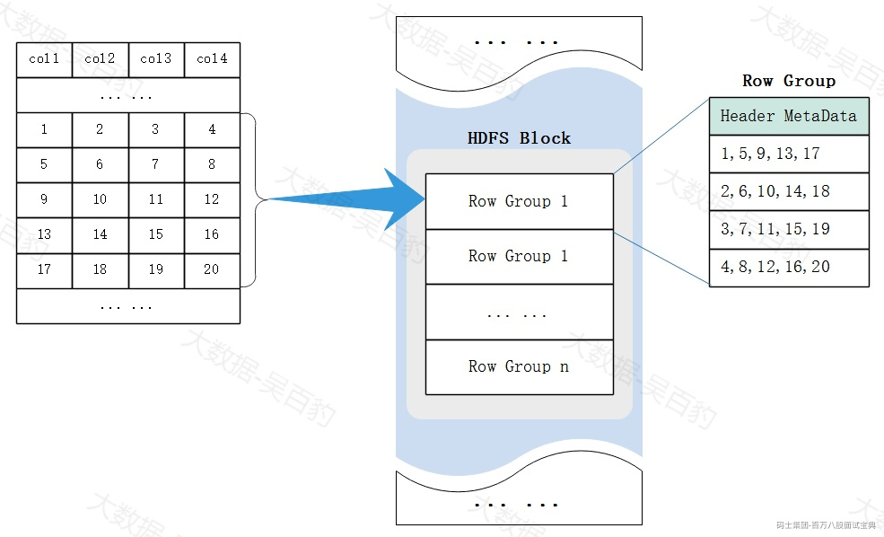

RcFile特点：

- 作为行存储，RCFile 保证同一行中的数据位于同一节点。

- 作为列存储，RCFile 可以利用列式数据压缩并跳过不必要的列读取。

ORC 是RC File的升级版，所以在Hive中使用ORC 存储格式较RC File要多。

```plain
#创建RcFile存储格式的Hive分区表
CREATE TABLE rc_tbl (
    id INT,
    name STRING,
    age INT,
    country STRING
)
PARTITIONED BY (dt STRING)
STORED AS rcfile;

#查看建表信息
show create table rc_tbl;
+----------------------------------------------------+
|                   createtab_stmt                   |
+----------------------------------------------------+
| CREATE EXTERNAL TABLE `rc_tbl`(                    |
|   `id` int,                                        |
|   `name` string,                                   |
|   `age` int,                                       |
|   `country` string)                                |
| PARTITIONED BY (                                   |
|   `dt` string)                                     |
| ROW FORMAT SERDE                                   |
|   'org.apache.hadoop.hive.serde2.columnar.LazyBinaryColumnarSerDe'  |
| STORED AS INPUTFORMAT                              |
|   'org.apache.hadoop.hive.ql.io.RCFileInputFormat'  |
| OUTPUTFORMAT                                       |
|   'org.apache.hadoop.hive.ql.io.RCFileOutputFormat' |
| LOCATION                                           |
|   'hdfs://mycluster/user/hive/warehouse/rc_tbl'    |
| TBLPROPERTIES (                                    |
|   'TRANSLATED_TO_EXTERNAL'='TRUE',                 |
|   'bucketing_version'='2',                         |
|   'external.table.purge'='TRUE',                   |
|   'transient_lastDdlTime'='1718604103')            |
+----------------------------------------------------+

#向表中插入数据
insert into rc_tbl select id,name,age,country,dt from avro_tbl;

#查询表中数据
select * from rc_tbl;
+------------+--------------+-------------+-----------------+-------------+
| rc_tbl.id  | rc_tbl.name  | rc_tbl.age  | rc_tbl.country  |  rc_tbl.dt  |
+------------+--------------+-------------+-----------------+-------------+
| 1          | 张三           | 30          | 中国              | 2024-06-16  |
| 2          | 李四           | 25          | 日本              | 2024-06-16  |
| 3          | 王五           | 35          | 韩国              | 2024-06-17  |
| 4          | 赵六           | 28          | 澳大利亚            | 2024-06-17  |
| 5          | 高七           | 22          | 印度              | 2024-06-18  |
+------------+--------------+-------------+-----------------+-------------+
```

#### 2.9.2.6 **ORC**

ORC(Optimized Row Columnar) File可以看成是RC File的升级版，在RC的基础上引申出来Stripe(条带)和Footer(脚注)概念，相比于RC File 支持更多Hive类型、进行了数据编码和索引优化，性能更好。在Hive中ORC 存储格式是列式存储，比较常用。

RC File存储文件结构示意图如下：

*(⚠️ 图片缺失:源知识库原图已失效)* 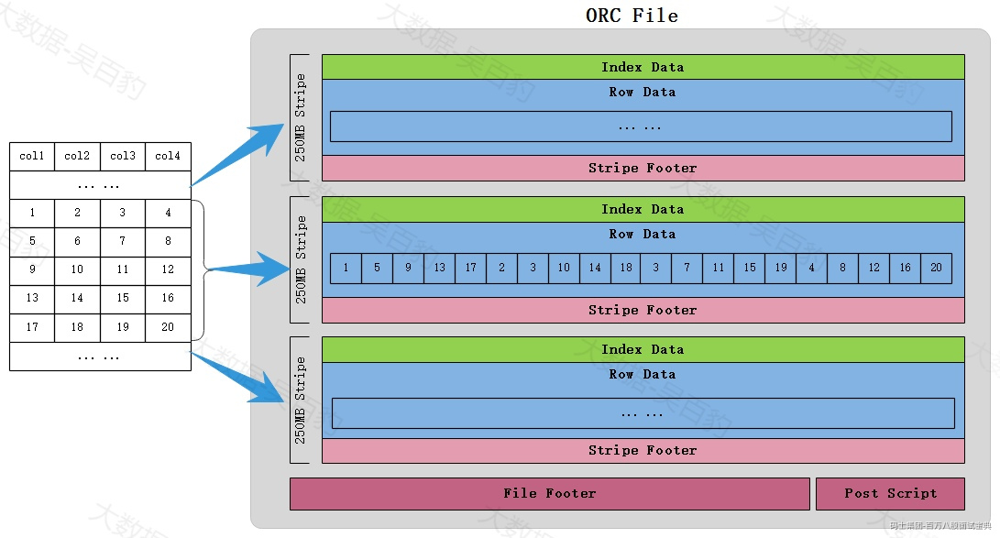

ORC File 由Stripes、File Footer、Post Script组成，介绍如下：

- Stripe：ORC格式会将数据文件横向切分形成多个Stripe（条带），每个条带默认大小为250MB，然后在每个Stripe中将数据进行列式存储。每个Stripe中由三部分组成：Index Data、Row Data、Stripe Footer。

- Index Data:轻量级的索引，记录某行各字段在Row Data中的offset，默认每隔1万条数据做一个索引。

- Row Data:存储的具体数据，按列存储。

- Stripe Footer:存储各个column列的类型及编码信息。

- File Footer：File Footer中记录了文件中stripe的列表，每个stripe的行数以及每个列的数据类型。还包含每个列的最大、最小值，行总数和聚合信息。

- Post Script：postscript记录Stripe的压缩类型和FileFooter的长度信息。

读取ORC文件时，首先从文件尾部读取Post Script信息，解析到File Footer的长度，进而再读取File Footer解析每个Stripe的信息，再根据Stripe中的Index和Footer读取真实数据。

```plain
#创建ORC 存储格式Hive分区表
CREATE TABLE orc_tbl (
    id INT,
    name STRING,
    age INT,
    country STRING
)
PARTITIONED BY (dt STRING)
STORED AS orc;

#查看表创建信息
show create table orc_tbl;
+----------------------------------------------------+
|                   createtab_stmt                   |
+----------------------------------------------------+
| CREATE EXTERNAL TABLE `orc_tbl`(                   |
|   `id` int,                                        |
|   `name` string,                                   |
|   `age` int,                                       |
|   `country` string)                                |
| PARTITIONED BY (                                   |
|   `dt` string)                                     |
| ROW FORMAT SERDE                                   |
|   'org.apache.hadoop.hive.ql.io.orc.OrcSerde'      |
| STORED AS INPUTFORMAT                              |
|   'org.apache.hadoop.hive.ql.io.orc.OrcInputFormat'  |
| OUTPUTFORMAT                                       |
|   'org.apache.hadoop.hive.ql.io.orc.OrcOutputFormat' |
| LOCATION                                           |
|   'hdfs://mycluster/user/hive/warehouse/orc_tbl'   |
| TBLPROPERTIES (                                    |
|   'TRANSLATED_TO_EXTERNAL'='TRUE',                 |
|   'bucketing_version'='2',                         |
|   'external.table.purge'='TRUE',                   |
|   'transient_lastDdlTime'='1718615683')            |
+----------------------------------------------------+

#向表中插入数据，这里没有orc文件数据，所以直接通过insert into 方式插入
insert into orc_tbl select id ,name,age,country,dt from rc_tbl;
```

注意：目前测试发现Hive4.0.0版本与Hadoop3.3.6版本中protobuf版本存在冲突导致向orc格式表中插入数据出现错误。

#### 2.9.2.7 **PARQUET**

Parquet存储格式由Twitter和Cloudera合作开发，数据在底层以二进制方式存储，不能直接读取。Parquet文件格式与ORC文件格式类似，也是列式存储，在Hive中使用较多。Parquet文件结构示意图如下：

*(⚠️ 图片缺失:源知识库原图已失效)* 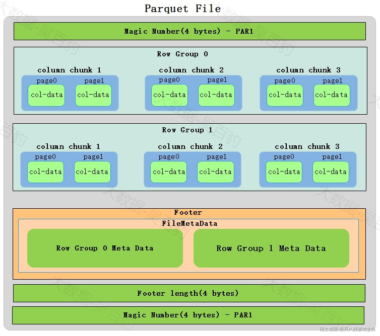

对以上Parquet格式文件解释如下：

- Magic Number:Parquet文件中首尾都有4 bytes“Magic Number”来校验该文件是否是一个parquet文件。

- Row Group（行组）:每一个行组包含一定的行数，类似ORC格式中的stripe概念。

- Column Chunk（列块）：在一个行组中每一列保存在一个列块中，列式存储，一个列块中的值都是相同类型，不同的列块可能使用不同的算法进行压缩。

- Page（页）：每一个列块划分为多个页，一个页是最小的编码单位，在同一个列块的不同页可能使用不同的编码方式。

- Footer：Footer中记录每个行组的元数据信息，这些元数据包含数据类型、编码方式、Data Page位置、统计信息（最大、最小值等信息）

- Footer length:记录了文件元数据大小，通过该值和文件长度可以计算出元数据的偏移量。

```plain
#在Hive中创建parquet存储格式表
CREATE TABLE parquet_tbl (
    id INT,
    name STRING,
    age INT,
    country STRING
)
PARTITIONED BY (dt STRING)
STORED AS parquet;

#查看建表信息
show create table parquet_tbl;
+----------------------------------------------------+
|                   createtab_stmt                   |
+----------------------------------------------------+
| CREATE EXTERNAL TABLE `parquet_tbl`(               |
|   `id` int,                                        |
|   `name` string,                                   |
|   `age` int,                                       |
|   `country` string)                                |
| PARTITIONED BY (                                   |
|   `dt` string)                                     |
| ROW FORMAT SERDE                                   |
|   'org.apache.hadoop.hive.ql.io.parquet.serde.ParquetHiveSerDe'  |
| STORED AS INPUTFORMAT                              |
|   'org.apache.hadoop.hive.ql.io.parquet.MapredParquetInputFormat'  |
| OUTPUTFORMAT                                       |
|   'org.apache.hadoop.hive.ql.io.parquet.MapredParquetOutputFormat' |
| LOCATION                                           |
|   'hdfs://mycluster/user/hive/warehouse/parquet_tbl' |
| TBLPROPERTIES (                                    |
|   'TRANSLATED_TO_EXTERNAL'='TRUE',                 |
|   'bucketing_version'='2',                         |
|   'external.table.purge'='TRUE',                   |
|   'transient_lastDdlTime'='1718628327')            |
+----------------------------------------------------+

#向表中插入数据
insert into parquet_tbl select id ,name,age,country,dt from rc_tbl;

#查看表中数据
select * from parquet_tbl;
+-----------------+-------------------+------------------+----------------------+-----------------+
| parquet_tbl.id  | parquet_tbl.name  | parquet_tbl.age  | parquet_tbl.country  | parquet_tbl.dt  |
+-----------------+-------------------+------------------+----------------------+-----------------+
| 2               | 李四                | 25               | 日本                   | 2024-06-16      |
| 1               | 张三                | 30               | 中国                   | 2024-06-16      |
| 4               | 赵六                | 28               | 澳大利亚                 | 2024-06-17      |
| 3               | 王五                | 35               | 韩国                   | 2024-06-17      |
| 5               | 高七                | 22               | 印度                   | 2024-06-18      |
+-----------------+-------------------+------------------+----------------------+-----------------+
```

### **2.9.3 Hive压缩**

#### 2.9.3.1 **Hive压缩算法**

为了使数据在传输上更小，处理起来更快，可以对Hive数据进行压缩。Hive中的压缩实际上就是Hadoop 中的压缩，所以Hadoop中支持的压缩算法在Hive中都可以直接使用。Hadoop中常见的压缩算法如下：

|  |  |  |  |  |  |  |  |
| --- | --- | --- | --- | --- | --- | --- | --- |
| **压缩格式** | **算法实现** | **扩展名** | **压缩比率** | **速度** | **可切分** | **Native** | **描述** |
| bzip2 | bzip2 | .bz2 | 最高 | 最慢 | Yes | Yes | 压缩率最高、压缩/解压缩效率最慢 |
| deflate | deflate | .deflate | 高 | 慢 | No | No | 标准压缩算法 |
| gzip | deflate | .gz | 高 | 慢 | No | Yes | 相比deflate增加文件头、尾，压缩比较高，压缩/解压效率慢 |
| snappy | snappy | .snappy | 低 | 快 | No | Yes | 压缩率较低，压缩/解压缩效率最快 |
| lzo | lzo | .lzo\_deflate | 低 | 快 | Yes | No | 压缩率较低，压缩/解压缩效率最快 |
| lz4 | lz4 | .lz4 | 最低 | 最快 | No | No | 压缩率较低，压缩/解压缩效率最快 |

以上各种压缩格式中，压缩比和压缩性能比较如下：

- 压缩比率对比: bzip2 > gzip > snappy > lzo > lz4，bzip2压缩比可以达到8:1;gzip压缩比可以达到5比1;lzo可以达到3:1。

- 压缩性能对比：lz4 > lzo > snappy > gzip>bzip2 ，lzo压缩速度可达约50M/s,解压速度可达约70M/s;gzip速度约为20M/s,解压速度约为60M/s;bzip2压缩速度约为2.5M/s，解压速度约为9.5M/s。

不同的压缩/解压缩算法在Hadoop中使用时需要有对应的编/解码器类，这样在Hadoop中就可以进行数据的压缩和解压缩操作，如下是每种压缩算法在Hadoop中对应的编码/解码类：

- bzip2编码/解码器类：org.apache.hadoop.io.compress.BZip2Codec

- DEFLATE编码/解码器类： org.apache.hadoop.io.compress.DefaultCodec

- gzip编码/解码器类： org.apache.hadoop.io.compress.GzipCodec

- Snappy编码/解码器类： org.apache.hadoop.io.compress.SnappyCodec

- LZO编码/解码器类： com.hadoop.compression.lzo.LzopCodec

- Lz4编码/解码器类：org.apache.hadoop.io.compress.Lz4Codec

在Hive中常用的压缩格式为snaapy和lzo格式。

#### 2.9.3.2 **Hive压缩配置**

Hive底层计算会转换成MapReduce程序，MapReduce程序可分为Map端和Reduce端，所以在Hive中可以配置Map输出阶段使用压缩或者Reduce输出使用压缩，Map端输出阶段使用压缩表示在Hive转换成MapReduce任务时中间数据使用压缩；Reduce端使用压缩表示Hive表最终生成的数据使用压缩。

在Hive中使用数据压缩也可以减少文件存储所占空间、加快文件传输效率，降低IO读写次数等好处。

- **开启Map输出阶段压缩**

```plain
#hive在多个map-reduce作业之间产生的中间文件是否被压缩，默认false
set hive.exec.compress.intermediate=true;

#开启mapreduce中map输出端的压缩功能
set mapreduce.map.output.compress=true;

#设置mapreduce中map输出端的数据的压缩方式，以snappy压缩算法为例
set mapreduce.map.output.compress.codec = org.apache.hadoop.io.compress.SnappyCodec;
```

- **开启Reduce输出阶段压缩**

```plain
#Hive 最终输出(到本地/hdfs文件或Hive表)是否被压缩，默认false
set hive.exec.compress.output=true;
 
#开启mapreduce最终输出数据压缩
set mapreduce.output.fileoutputformat.compress=true;
 
#设置mapreduce最终数据输出压缩方式，以snappy压缩算法为例
set mapreduce.output.fileoutputformat.compress.codec = org.apache.hadoop.io.compress.SnappyCodec;
```

#### 2.9.3.3 **数据压缩使用**

- **Hive表导出压缩格式文件**

```plain
#在hive中设置压缩项
set hive.exec.compress.output=true;
set mapreduce.output.fileoutputformat.compress=true;
set mapreduce.output.fileoutputformat.compress.codec = org.apache.hadoop.io.compress.SnappyCodec;

#在hive中执行如下语句将hive表数据导出为压缩文件
insert overwrite directory '/compress/snappy' row format delimited fields terminated by ',' select id,name,age,country,dt from parquet_tbl;
```

以上语句执行完成之后可以在HDFS中查看对应的目录，查看数据为snappy格式的压缩文件：

*(⚠️ 图片缺失:源知识库原图已失效)* 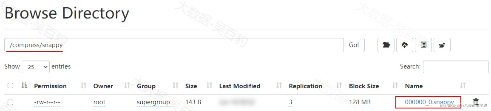

- **TextFile存储格式使用数据压缩**

Hive中建表默认就是TextFile存储格式，如果想要将数据以压缩格式存入到TextFile存储格式表中，建表时无需特别指定，只需要在Hive中配置如下参数即可：

```plain
set hive.exec.compress.output=true;
set mapreduce.output.fileoutputformat.compress=true;
set mapreduce.output.fileoutputformat.compress.codec = org.apache.hadoop.io.compress.SnappyCodec;
```

然后再正常创建TextFile存储格式表，当向表中插入数据时，数据自动以压缩格式写入到表对应的路径中：

```plain
#创建hive textFile存储格式表
create table text_compress_tbl(id int,name string,age int) row format delimited fields terminated by '\t';

#向text_compress_tbl表中插入数据
insert into text_compress_tbl select id ,name ,age from parquet_tbl;

#查询表text_compress_tbl表中的数据
select * from text_compress_tbl;
+-----------------------+-------------------------+------------------------+
| text_compress_tbl.id  | text_compress_tbl.name  | text_compress_tbl.age  |
+-----------------------+-------------------------+------------------------+
| 2                     | 李四                      | 25                     |
| 1                     | 张三                      | 30                     |
| 4                     | 赵六                      | 28                     |
| 3                     | 王五                      | 35                     |
| 5                     | 高七                      | 22                     |
+-----------------------+-------------------------+------------------------+
```

注意：向表中查询操作必须生成MR任务，在表目录中的数据才会是压缩格式，直接通过load方式不能生成MR任务，所以向表中通过load文件方式不能形成压缩格式的数据结果。

以上插入数据执行完成后，可以看到HDFS中该表对应下的数据为snappy压缩格式。

*(⚠️ 图片缺失:源知识库原图已失效)* 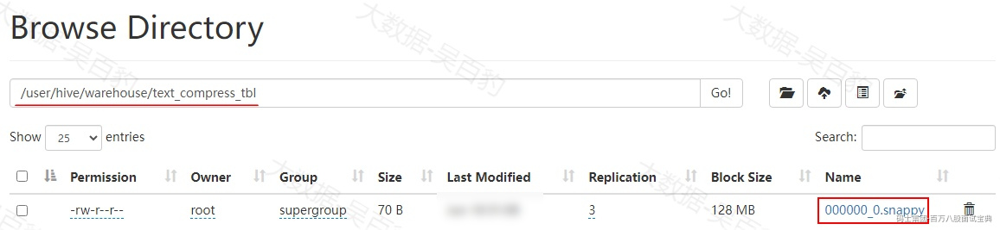

**特别注意：如果Hive一张表存储格式为TextFile，也可以直接将压缩文件数据直接load到表中，textFile存储格式表会自动解析压缩格式数据。这里不再演示。**

- **Parquet存储格式使用数据压缩**

Hive Parquet存储格式表如果使用数据压缩需要在建表中指定“parquet.compression”参数，不必再单独指定“Reduce输出阶段压缩”相关参数。这里以指定常用的snappy压缩算法为例进行演示。

创建普通表，将资料中“cell\_info.csv”文件（约1千万行数据，600MB）上传至HDFS ，并加载到Hive普通表中。

```plain
#创建普通表
create table temp(col1 string,col2 string,col3 string,col4 string,col5 string,col6 string,col7 string,col8 string,col9 string,col10 string) row format delimited fields terminated by ',';

#将数据加载到temp表中
load data inpath '/cell_info.csv' into table temp;
```

以上普通表加载完数据后，可以看到HDFS中该表目录中的数据如下：

*(⚠️ 图片缺失:源知识库原图已失效)* 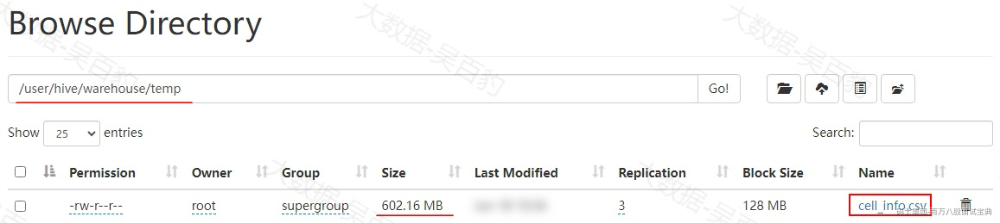

创建Hive Parquet存储格式表，执行压缩格式为snappy，并查询temp表中的数据插入到该压缩表中：

```plain
#创建Hive Parquet存储格式表
create table parquet_compress_tbl(col1 string,col2 string,col3 string,col4 string,col5 string,col6 string,col7 string,col8 string,col9 string,col10 string) stored as parquet tblproperties("parquet.compression"="snappy");

#向表中插入数据
insert into parquet_compress_tbl select col1,col2,col3,col4,col5,col6,col7,col8,col9,col10 from temp;
```

执行完成插入语句后，观察HDFS中 parquet\_compress\_tbl表存储路径大小为40MB左右，如下：

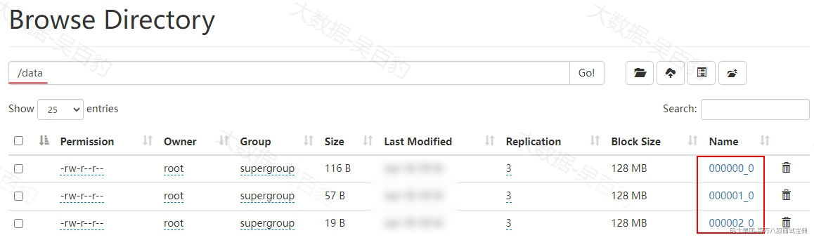

 

- **orc存储格式使用数据压缩**

Hive orc存储格式表如果使用数据压缩需要在建表中指定“orc.compress”参数，不必再单独指定“Reduce输出阶段压缩”相关参数。这里以指定常用的snappy压缩算法为例进行演示。

```plain
#创建Hive orc存储格式表
create table orc_compress_tbl(col1 string,col2 string,col3 string,col4 string,col5 string,col6 string,col7 string,col8 string,col9 string,col10 string) stored as orc tblproperties("orc.compress"="snappy");

#向表中插入数据
insert into orc_compress_tbl select col1,col2,col3,col4,col5,col6,col7,col8,col9,col10 from temp;
```

注意：Hive4.0.0版本与Hadoop3.6.x版本使用的protobuf版本不一致，导致orc存储格式表插入数据无法成功，这里不再演示。

### **2.9.4 存储格式及压缩总结**

关于Hive存储格式有如下几点总结：

- Hive中常用的存储格式为textFile、Orc、Parquet格式。

- 如果操作的表存储格式不是textFile格式，不能将数据直接load到表中，可以先将数据load到textFile存储格式的表中，然后再查询该表数据通过insert into语句将数据存入到其他存储格式的表中。

- 在实际开发中，Hive表的数据存储格式一般选择 orc或者parquet，压缩方式一般选择lzo/snappy。所以常见的存储格式及压缩组合为orc+lzo、orc+snappy、parquet+lzo、parquet+snappy。

- 如果使用orc存储格式表，建表时指定压缩格式时tabproperties参数为“orc.compress”;如果使用parquet存储格式表，建表时指定压缩格式时tabproperties参数为“parquet.compression”
