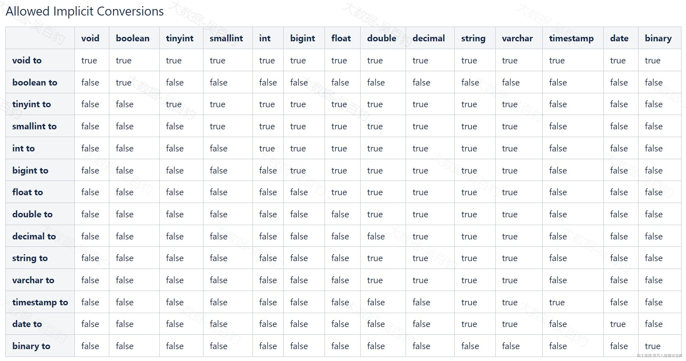

# **3 第三章Hive SQL查询与函数**

## **3.1 Hive查询语法**

Hive查询语法如下:

```plain
SELECT [ALL | DISTINCT] select_expr, select_expr, ...
  FROM table_reference
  [WHERE where_condition]
  [GROUP BY col_list]
  [HAVING col_list]
  [ORDER BY col_list]
  [CLUSTER BY col_list
    | [DISTRIBUTE BY col_list] [SORT BY col_list]
  ]
 [LIMIT [offset,] rows]
```

Hive中查询语法与MySQL中类似，关于以上建表语法解释如下：

- SELECT: SELECT 语句可以是union查询中的一部分，也可以是某个查询的子查询。

- ALL|DISTINCT:返回所有行或者去重后的行。支持 select distinct \* 查询。

- FROM table\_reference:表示查询的输入，可以是普通表、视图或者子查询。

- WHERE:查询条件，支持部分类型的子查询。

- GROUP BY :分组查询，指定分组列。

- HAVING:分组后对聚合结果过滤。

- ORDER BY|CLUSTER BY|DISTRIBUTE BY|SORT BY:排序相关操作。

- LIMIT:限制SELECT 语句返回的行数，接受一个或两个数字参数，它们都必须是非负整数常量。第一个参数指定要返回的第一行的偏移量，第二个参数指定要返回的最大行数。当给出单个参数时，它代表最大行数并且偏移量默认为 0。

注意：查询Hive表数据时，表和列名不区分大小写。

## **3.2 GroupBy**

Group By语句需要和聚合函数一起使用，表示按照组统计聚合，聚合操作包括COUNT/SUM/MIN/MAX/AVG/COUNT(DISTINCT...)，select语句只能包含group by子句包含的列。

### **3.2.1 普通使用**

案例:统计购买行为信息

```plain
#准备如下文件数据 data.txt
1,张三,男,25,手机,3000.00,2025-01-01
2,李四,女,30,电脑,7000.00,2025-01-01
3,王五,男,22,耳机,500.00,2025-01-02
4,赵六,女,28,手机,3200.00,2025-01-03
5,孙七,男,25,键盘,200.00,2025-01-03
6,周八,女,30,手机,3100.00,2025-01-04
7,吴九,男,25,鼠标,150.00,2025-01-04
8,郑十,女,30,鼠标,1200.00,2025-01-05

#创建 user_order表，并加载数据
CREATE TABLE user_order(
    userid INT,
    name STRING,
    gender STRING,
    age INT,
    product STRING,
    amount DOUBLE,
    purchase_date STRING
) ROW FORMAT DELIMITED FIELDS TERMINATED BY ',';

load data inpath '/data.txt' into table user_order;

#按照性别统计用户数
SELECT gender, COUNT(*) AS cnt
FROM user_order
GROUP BY gender;

+---------+------+
| gender  | cnt  |
+---------+------+
| 女       | 4    |
| 男       | 4    |
+---------+------+

#按性别统计购买不同的商品种类和花费总价格
SELECT 
    gender, 
    COUNT(DISTINCT product) AS dist_product, 
    SUM(amount) AS total_amount
FROM 
    user_order
GROUP BY 
gender;

+---------+---------------+---------------+
| gender  | dist_product  | total_amount  |
+---------+---------------+---------------+
| 女       | 3             | 14500.0       |
| 男       | 4             | 3850.0        |
+---------+---------------+---------------+
```

### **3.2.2 高级查询**

GROUP BY 后也可以跟上ROLLUOP /CUBE/GROUPING SETS进行高级查询。

- **ROLLUP：生成分组的层级汇总，包括总体汇总，适合需要分组和子分组汇总的场景。**

```plain
#按照gender、age进行rollup查询
SELECT gender, age, SUM(amount) AS total_amount
FROM user_order
GROUP BY gender, age WITH ROLLUP;

+---------+-------+---------------+
| gender  |  age  | total_amount  |
+---------+-------+---------------+
| 女       | 28    | 3200.0        |
| 女       | 30    | 11300.0       |
| 女       | NULL  | 14500.0       |
| 男       | 22    | 500.0         |
| 男       | 25    | 3350.0        |
| 男       | NULL  | 3850.0        |
| NULL    | NULL  | 18350.0       |
+---------+-------+---------------+
```

- **CUBE：生成所有可能的分组组合及其汇总，适合需要全方位查看数据的场景。**

```plain
# CUBE 相当于给分组列进行所有可能组合的分组得到结果
SELECT gender, age, SUM(amount) AS total_amount  
FROM user_order
GROUP BY gender, age WITH CUBE;

+---------+-------+--------------+
| gender  |  age  | total_amount  |
+---------+-------+--------------+
| 女       | 28    | 3200.0       |
| 女       | 30    | 11300.0      |
| 女       | NULL  | 14500.0      |
| 男       | 22    | 500.0        |
| 男       | 25    | 3350.0       |
| 男       | NULL  | 3850.0       |
| NULL    | 22    | 500.0        |
| NULL    | 25    | 3350.0       |
| NULL    | 28    | 3200.0       |
| NULL    | 30    | 11300.0      |
| NULL    | NULL  | 18350.0      |
+---------+-------+--------------+
```

- **GROUPING SETS：指定特定的分组组合，适合自定义分组组合场景。**

```plain
#只按照grouping sets中指定的组合进行聚合数据
SELECT gender, age, SUM(amount) AS total_amount  
FROM user_order
GROUP BY gender, age
GROUPING SETS ((gender, age), (gender), ());

+---------+-------+---------------+
| gender  |  age  | total_amount  |
+---------+-------+---------------+
| 女       | 28    | 3200.0        |
| 女       | 30    | 11300.0       |
| 女       | NULL  | 14500.0       |
| 男       | 22    | 500.0         |
| 男       | 25    | 3350.0        |
| 男       | NULL  | 3850.0        |
| NULL    | NULL  | 18350.0       |
+---------+-------+---------------
```

## **3.3 Having**

Having子句用于过滤“group by”聚合结果，Having与Where类似，但WHERE用于在分组之前过滤记录，而HAVING用于在分组之后过滤记录。使用HAVING可以基于聚合结果进行过滤。

案例：对user\_order数据统计每个年龄消费金额，并保留消费金额大于500的年龄信息。

**#统计每个年龄消费金额，保留消费金额大于500的年龄信息。**

```plain
#统计每个年龄消费金额，保留消费金额大于500的年龄信息。
SELECT age, SUM(amount) AS total_amount  
FROM user_order
GROUP BY age
HAVING SUM(amount) > 500;

+------+---------------+
| age  | total_amount  |
+------+---------------+
| 25   | 3350.0        |
| 28   | 3200.0        |
| 30   | 11300.0       |
+------+---------------+
```

## **3.4 排序**

Hive中与排序相关的操作有Order By、Sort By、Distribute By、Cluster By 几种操作，下面分别进行介绍。

### **3.4.1 Order BY**

Order By用于对整个查询结果进行全局排序，HQL转换成MapReduce任务只有一个Reduce，可能会导致性能瓶颈问题。严格模式下（hive.exec.dynamic.partition.mode=strict）Order By必须与limit一起使用，防止单个reduce处理过多数据。非严格模式下（hive.exec.dynamic.partition.mode=nonstrict，默认）虽然不强制跟上limit，也建议和limit一起使用。

```plain
#准备如下数据
1,zs,30,北京,100
2,ls,25,上海,200
3,ww,35,广州,300
4,zl,40,广州,400
5,cq,28,北京,500
6,gb,33,广州,600
7,wj,22,广州,700
8,zs,29,北京,800
9,ly,31,上海,900
10,se,27,上海,1000

#Hive中创建user表，并将以上数据加载到表中
CREATE TABLE users (
    user_id INT,
    user_name STRING,
    age INT,
    city STRING,
    salary INT
)
ROW FORMAT DELIMITED FIELDS TERMINATED BY ',';

load data inpath '/data.txt' into table users;

#使用order by 对工资进行全局倒序排序。
SELECT user_id,user_name,age,city,salary  
FROM users 
ORDER BY salary desc;

+----------+------------+------+-------+---------+
| user_id  | user_name  | age  | city  | salary  |
+----------+------------+------+-------+---------+
| 10       | se         | 27   | 上海    | 1000    |
| 9        | ly         | 31   | 上海    | 900     |
| 8        | zs         | 29   | 北京    | 800     |
| 7        | wj         | 22   | 广州    | 700     |
| 6        | gb         | 33   | 广州    | 600     |
| 5        | cq         | 28   | 北京    | 500     |
| 4        | zl         | 40   | 广州    | 400     |
| 3        | ww         | 35   | 广州    | 300     |
| 2        | ls         | 25   | 上海    | 200     |
| 1        | zs         | 30   | 北京    | 100     |
+----------+------------+------+-------+---------+
```

注意：order by col desc 是降序；asc是升序（默认）。

### **3.4.2 Sort By**

Sort By可以对每个reduce的输出进行局部排序，数据在单个reduce中是有序地，即：每个reduce出来的数据时有序的，但全局可能不是有序的。在执行HQL时可以通过“set mapreduce.job.reduces=num;”来设置生成的MapReduce任务有几个Reduce。

```plain
#设置3个reduce 
set mapreduce.job.reduces=3;

#查询表users中数据并写入到HDFS文件中，按照age进行sortBy排序
INSERT OVERWRITE directory '/data/' row FORMAT DELIMITED FIELDS TERMINATED BY ',' 
SELECT user_id,user_name,age,city,salary from users sort by age desc;
```

以上语句查询完成后，由于设置有3个Reduce，所以可以在HDFS相应目录中看到有3个文件生成：

*(⚠️ 图片缺失:源知识库原图已失效)* 

每个文件内部数据按照age降序排序。

```plain
#查看3个文件中数据，按照sort by 指定的age列降序排序
[root@node5 ~]# hdfs dfs -cat /data/000000_0
6,gb,33,广州,600
9,ly,31,上海,900
8,zs,29,北京,800
5,cq,28,北京,500
10,se,27,上海,1000
7,wj,22,广州,700

[root@node5 ~]# hdfs dfs -cat /data/000001_0
4,zl,40,广州,400
3,ww,35,广州,300
2,ls,25,上海,200

[root@node5 ~]# hdfs dfs -cat /data/000002_0
1,zs,30,北京,100
```

### **3.4.3 Distribute By**

Distribute By可以跟上某列，按照该列对数据进行分区，不保证分区内的数据有序。Distribute By类似MapReduce中的自定义分区Partition，将相同的key数据发送到同一个Reduce Task中处理。Distribute By的分区规则是按照分区字段的hash码与reduce的个数进行取模，余数相同的分到一个区。

```plain
#设置3个reduce 
set mapreduce.job.reduces=3;

#查询表users中数据并写入到HDFS文件中，按照city进行分区
INSERT OVERWRITE directory '/data/' row FORMAT DELIMITED FIELDS TERMINATED BY ',' SELECT user_id,user_name,age,city,salary from users distribute by city;
```

以上语句查询完成后，由于设置有3个Reduce，所以可以在HDFS相应目录中也会看到有3个文件生成，相同city的数据会被分往同一个文件内存储，说明cluster by 可以按照某列进行分区。

```plain
#查看3个文件中数据city信息
[root@node5 ~]# hdfs dfs -cat /data/000000_0
10,se,27,上海,1000
9,ly,31,上海,900
2,ls,25,上海,200

[root@node5 ~]# hdfs dfs -cat /data/000001_0

[root@node5 ~]# hdfs dfs -cat /data/000002_0
8,zs,29,北京,800
7,wj,22,广州,700
6,gb,33,广州,600
5,cq,28,北京,500
4,zl,40,广州,400
3,ww,35,广州,300
1,zs,30,北京,100
```

使用Distribute By时还可以跟上Sort By语句，指定每个分区中按照某列进行排序。以上数据我们发现相同城市数据去往了同一个文件，但是文件内的age是乱序的，所以可以在Distribute By后跟上Sort By指定按照age列进行排序。

```plain
#设置3个reduce 
set mapreduce.job.reduces=3;

#Distribute By  + Sort By 一起使用
INSERT OVERWRITE directory '/data/' row FORMAT DELIMITED FIELDS TERMINATED BY ',' 
SELECT user_id,user_name,age,city,salary from users distribute by city sort by age desc;

#以上执行完成后，查看每个文件中的数据，可以看到每个文件内的数据按照age降序排序
[root@node5 ~]# hdfs dfs -cat /data/000000_0
9,ly,31,上海,900
10,se,27,上海,1000
2,ls,25,上海,200

[root@node5 ~]# hdfs dfs -cat /data/000001_0

[root@node5 ~]# hdfs dfs -cat /data/000002_0
4,zl,40,广州,400
3,ww,35,广州,300
6,gb,33,广州,600
1,zs,30,北京,100
8,zs,29,北京,800
5,cq,28,北京,500
7,wj,22,广州,700
```

### **3.4.4 Cluster By**

当Distribute By和Sort By字段相同时，可以使用Cluster By 代替，但是排序只能是升序排序，不能指定排序为asc/desc。

```plain
#设置3个reduce 
set mapreduce.job.reduces=3;

#对users表中age字段进行Cluster By操作
INSERT OVERWRITE directory '/data/' row FORMAT DELIMITED FIELDS TERMINATED BY ',' 
SELECT user_id,user_name,age,city,salary from users cluster by age;
```

以上语句等价于如下语句：

```plain
INSERT OVERWRITE directory '/data/' row FORMAT DELIMITED FIELDS TERMINATED BY ',' SELECT user_id,user_name,age,city,salary from users distribute by age sort by age;
```

执行完成后，可以查询HDFS中三个文件内容如下：

```plain
[root@node5 ~]# hdfs dfs -cat /data/000000_0
10,se,27,上海,1000
8,zs,29,北京,800
1,zs,30,北京,100
9,ly,31,上海,900
4,zl,40,广州,400

[root@node5 ~]# hdfs dfs -cat /data/000001_0
6,gb,33,广州,600

[root@node5 ~]# hdfs dfs -cat /data/000002_0
7,wj,22,广州,700
2,ls,25,上海,200
5,cq,28,北京,500
3,ww,35,广州,300
```

### **3.4.5 排序总结**

- Order By：全局排序，所有数据一个顺序，性能开销最大，适用于需要全局排序的情况。

- Sort By：局部排序，每个reducer内排序，适用于大数据集的部分排序。

- Distribute By：仅分区，不排序。

- Cluster By：分区内排序，每个分区的数据由一个reducer排序，适用于需要数据按键分区的场景。

- Order By和Sort By区别在于前者保证全局有序，后者仅保证Reducer内数据有序。

- Distribute By的分区规则是根据分区字段的hash码与reduce的个数进行相除后，余数相同的分到一个区。

- 如果Distribute By 、Sort By 排序字段一样，可以使用Cluster By 替代，即：Cluster By = Distribute By + Sort By，但Cluster By 排序只能是升序。

## **3.5 Hive Join**

Hive中Join支持 [INNER] JOIN、LEFT [OUTER] JOIN、RIGHT [OUTER] JOIN、FULL [OUTER] JOIN、LEFT SEMI JOIN、CROSS JOIN ，下面通过一个案例来介绍。

准备如下两份数据，并在Hive中创建对应的表，向表中加载对应数据。

```plain
#准备 employees.txt文件内容如下：
1,张三,001
2,李四,002
3,王五,003
4,马六,004
5,田七,005

#准备departments.txt 文件内容如下：
001,销售部门
002,运营部门
003,技术部门
004,生产部门
006,物流部门

#在hive中创建 emp和dept
CREATE TABLE emp( 
  emp_id int,
  emp_name string,
  dept_id string
) ROW FORMAT DELIMITED FIELDS TERMINATED BY ',';

CREATE TABLE dept( 
  dept_id string,
  dept_name string
) ROW FORMAT DELIMITED FIELDS TERMINATED BY ',';

#向表中加载数据
load data inpath '/employees.txt' into table emp;
load data inpath '/departments.txt' into table dept;
```

注意：在Hive4.0.0版本中执行hive join需要执行“set hive.auto.convert.join=false;”避免自动转换成map join，目前不清楚是否是Hive4.0.0中的bug，错误显示Hadoop配置问题，大概率与Hadoop配置项有关。

```plain
#关闭自动map join
set hive.auto.convert.join=false;
```

- **[INNER] JOIN -内连接**

INNER JOIN 是最常见的Join类型，它会返回两个表中满足连接条件的行。INNER 可以省略不写。

```plain
#使用使用
SELECT e.emp_id, e.emp_name, d.dept_name
FROM emp e
JOIN dept d ON e.dept_id = d.dept_id;

#结果
+-----------+-------------+--------------+
| e.emp_id  | e.emp_name  | d.dept_name  |
+-----------+-------------+--------------+
| 1         | 张三          | 销售部门         |
| 2         | 李四          | 运营部门         |
| 3         | 王五          | 技术部门         |
| 4         | 马六          | 生产部门         |
+-----------+-------------+--------------+
```

注意：在Hive3.x版本后Hive Join中也支持不等值连接（!=、<、>、<=、>=），只是这种不等值连接使用较少。

```plain
#sql使用
SELECT e.emp_id,e.emp_name,e.dept_id,d.dept_id,d.dept_name 
FROM emp e
JOIN dept d ON e.dept_id != d.dept_id;

#结果
+-----------+-------------+------------+------------+--------------+
| e.emp_id  | e.emp_name  | e.dept_id  | d.dept_id  | d.dept_name  |
+-----------+-------------+------------+------------+--------------+
| 5         | 田七          | 005        | 006        | 物流部门         |
| 5         | 田七          | 005        | 004        | 生产部门         |
| 5         | 田七          | 005        | 003        | 技术部门         |
| 5         | 田七          | 005        | 002        | 运营部门         |
| 5         | 田七          | 005        | 001        | 销售部门         |
| 4         | 马六          | 004        | 006        | 物流部门         |
| 4         | 马六          | 004        | 003        | 技术部门         |
| 4         | 马六          | 004        | 002        | 运营部门         |
| 4         | 马六          | 004        | 001        | 销售部门         |
| 3         | 王五          | 003        | 006        | 物流部门         |
| 3         | 王五          | 003        | 004        | 生产部门         |
| 3         | 王五          | 003        | 002        | 运营部门         |
| 3         | 王五          | 003        | 001        | 销售部门         |
| 2         | 李四          | 002        | 006        | 物流部门         |
| 2         | 李四          | 002        | 004        | 生产部门         |
| 2         | 李四          | 002        | 003        | 技术部门         |
| 2         | 李四          | 002        | 001        | 销售部门         |
| 1         | 张三          | 001        | 006        | 物流部门         |
| 1         | 张三          | 001        | 004        | 生产部门         |
| 1         | 张三          | 001        | 003        | 技术部门         |
| 1         | 张三          | 001        | 002        | 运营部门         |
+-----------+-------------+------------+------------+--------------+
```

- **LEFT** **[****OUTER****]** **JOIN - 左连接**

LEFT [OUTER] JOIN 返回左表中所有行，以及右表中与左表中行匹配的行。如果右表中没有匹配的行，那么右侧返回 NULL 值。语法如下：

```plain
#sql使用
SELECT e.emp_id, e.emp_name, d.dept_name
FROM emp e
LEFT JOIN dept d ON e.dept_id = d.dept_id;

#结果
+-----------+-------------+--------------+
| e.emp_id  | e.emp_name  | d.dept_name  |
+-----------+-------------+--------------+
| 1         | 张三          | 销售部门         |
| 2         | 李四          | 运营部门         |
| 3         | 王五          | 技术部门         |
| 4         | 马六          | 生产部门         |
| 5         | 田七          | NULL         |
+-----------+-------------+--------------+
```

- **RIGHT** **[****OUTER****]** **JOIN - 右连接**

RIGHT OUTER JOIN 返回右表中的所有行，以及左表中与右表中行匹配的行。如果左表中没有匹配的行，那么左侧返回 NULL 值。

```plain
#sql使用
SELECT e.emp_id, e.emp_name, d.dept_name
FROM emp e
RIGHT JOIN dept d ON e.dept_id = d.dept_id;

#结果
+-----------+-------------+--------------+
| e.emp_id  | e.emp_name  | d.dept_name  |
+-----------+-------------+--------------+
| 1         | 张三          | 销售部门         |
| 2         | 李四          | 运营部门         |
| 3         | 王五          | 技术部门         |
| 4         | 马六          | 生产部门         |
| NULL      | NULL        | 物流部门         |
+-----------+-------------+--------------+
```

- **FULL** **[****OUTER****]** **JOIN - 全连接**

FULL OUTER JOIN 返回左表和右表中的所有行，如果某个表中没有与另一个表中的行匹配的行，则返回 NULL 值。

```plain
#sql使用
SELECT e.emp_id, e.emp_name, d.dept_name
FROM emp e
FULL JOIN dept d ON e.dept_id = d.dept_id;

#结果
+-----------+-------------+--------------+
| e.emp_id  | e.emp_name  | d.dept_name  |
+-----------+-------------+--------------+
| 1         | 张三          | 销售部门         |
| 2         | 李四          | 运营部门         |
| 3         | 王五          | 技术部门         |
| 4         | 马六          | 生产部门         |
| 5         | 田七          | NULL         |
| NULL      | NULL        | 物流部门         |
+-----------+-------------+--------------+
```

- **LEFT SEMI JOIN - 左半开连接**

LEFT SEMI JOIN 类似于 EXISTS 子查询，它返回左表中存在匹配行的行。右表只用于匹配，不包含在输出中。

```plain
#sql使用
SELECT *
FROM emp e
LEFT SEMI JOIN dept d ON e.dept_id = d.dept_id;

#结果
+-----------+-------------+------------+
| e.emp_id  | e.emp_name  | e.dept_id  |
+-----------+-------------+------------+
| 1         | 张三          | 001        |
| 2         | 李四          | 002        |
| 3         | 王五          | 003        |
| 4         | 马六          | 004        |
+-----------+-------------+--------------+
```

- **CROSS JOIN - 交叉连接、笛卡尔积乘积**

CROSS JOIN 是一种笛卡尔积操作，两表关联不需指定关联条件，它返回左表和右表的所有可能组合。使用很少，Hive表比较大使用交叉连接会导致数据膨胀。

```plain
#sql使用
SELECT *
FROM emp e
CROSS JOIN dept d;

#结果
+-----------+-------------+------------+------------+--------------+
| e.emp_id  | e.emp_name  | e.dept_id  | d.dept_id  | d.dept_name  |
+-----------+-------------+------------+------------+--------------+
| 5         | 田七          | 005        | 006        | 物流部门         |
| 5         | 田七          | 005        | 004        | 生产部门         |
| 5         | 田七          | 005        | 003        | 技术部门         |
| 5         | 田七          | 005        | 002        | 运营部门         |
| 5         | 田七          | 005        | 001        | 销售部门         |
| 4         | 马六          | 004        | 006        | 物流部门         |
| 4         | 马六          | 004        | 004        | 生产部门         |
| 4         | 马六          | 004        | 003        | 技术部门         |
| 4         | 马六          | 004        | 002        | 运营部门         |
| 4         | 马六          | 004        | 001        | 销售部门         |
| 3         | 王五          | 003        | 006        | 物流部门         |
| 3         | 王五          | 003        | 004        | 生产部门         |
| 3         | 王五          | 003        | 003        | 技术部门         |
| 3         | 王五          | 003        | 002        | 运营部门         |
| 3         | 王五          | 003        | 001        | 销售部门         |
| 2         | 李四          | 002        | 006        | 物流部门         |
| 2         | 李四          | 002        | 004        | 生产部门         |
| 2         | 李四          | 002        | 003        | 技术部门         |
| 2         | 李四          | 002        | 002        | 运营部门         |
| 2         | 李四          | 002        | 001        | 销售部门         |
| 1         | 张三          | 001        | 006        | 物流部门         |
| 1         | 张三          | 001        | 004        | 生产部门         |
| 1         | 张三          | 001        | 003        | 技术部门         |
| 1         | 张三          | 001        | 002        | 运营部门         |
| 1         | 张三          | 001        | 001        | 销售部门         |
+-----------+-------------+------------+------------+--------------+
```

## **3.6 UNION/UNION ALL**

Union用于将多个Select语句的结果合并为一个结果集，union默认会删除重复行，union all不会删除重复行。

```plain
#union使用，重复行数据自动去重
select emp_id,emp_name from emp where emp_id in (1,2,3,4)
union
select emp_id,emp_name from emp where emp_id in (1,2,3);

+---------+-----------+
| emp_id  | emp_name  |
+---------+-----------+
| 1       | 张三        |
| 2       | 李四        |
| 3       | 王五        |
| 4       | 马六        |
+---------+-----------+

#union all，相同数据不去重
select emp_id,emp_name from emp where emp_id in (1,2,3,4)
union all 
select emp_id,emp_name from emp where emp_id in (1,2,3);

+---------+-----------+
| emp_id  | emp_name  |
+---------+-----------+
| 1       | 张三        |
| 1       | 张三        |
| 2       | 李四        |
| 2       | 李四        |
| 3       | 王五        |
| 3       | 王五        |
| 4       | 马六        |
+---------+-----------+
```

## **3.7 Hive视图**

在Hive中如果经常使用到一个复杂SQL进行数据查询，我们可以对复杂SQL创建视图，这样就可以在后期使用中直接查询视图，比较方便。Hive中的视图与MySQL中的视图一样。

有两张表 student\_info,student\_score,对应数据及建表语句如下：

```plain
#student_info数据如下：
1	zs	18
2	ls	19
3	ww	20

#student_info建表
create table student_info (id int,name string,age int) row format delimited fields terminated by '\t';
load data inpath '/student_info' into table student_info;

#student_score数据如下：
1	zs	100
2	ls	200
3	ww	300

#student_score建表
create table student_score (id int,name string,score int) row format delimited fields terminated by '\t';
load data inpath '/student_score' into table student_score;
```

假设我们经常需要使用如下结果：

```plain
select a.id,a.name,a.age,b.score from student_info a join student_score b on a.id = b.id
```

那么在Hive中经常使用以上查询，每次使用时都需要写一遍以上SQL执行，这里我们就可以直接创建Hive视图，方便后期查询。

Hive中创建视图语法如下：

```plain
CREATE VIEW [IF NOT EXISTS] [db_name.]view_name 
  [(column_name [COMMENT column_comment], ...) ]
  [COMMENT view_comment]
  [TBLPROPERTIES (property_name = property_value, ...)]
  AS SELECT ... ;
```

我们可以针对以上场景创建视图“myview”:

```plain
#创建视图
create view myview as select a.id,a.name,a.age,b.score from student_info a join student_score b on a.id = b.id;

#在后续使用中，直接使用视图myview即可
select * from myview;
```

在Hive中创建视图后，视图不是真正的表，不能加载数据操作，只是在Hive中保存了一份元数据，查询视图时执行对应的sql，视图不存储数据。

删除视图语法如下：

```plain
DROP VIEW [IF EXISTS] [db_name.]view_name;
```

删除创建的视图：

```plain
#我们可以将前面创建的视图删除
drop view myview；
```

## **3.8 Hive内置运算符**

Hive内置运算符包括：关系运算符、算术运算符、逻辑运算符、复杂类型运算符等。下面分别介绍。注意：在Hive中所有运算符号名称都不区分大小写。

### **3.8.1 关系运算符**

关系运算符经常使用在where子句中。

|  |  |  |
| --- | --- | --- |
| **运算符** | **操作类型** | **说明** |
| A = B | 所有原始类型 | 如果A与B相等,返回TRUE,否则返回FALSE |
| A <> B | 所有原始类型 | 如果A不等于B返回TRUE,否则返回FALSE。如果A或B值为”NULL”，结果返回”NULL”。 |
| A!=B | 所有原始类型 | 与A<>B同义，A不等于B返回TRUE。 |
| A < B | 所有原始类型 | 如果A小于B返回TRUE,否则返回FALSE。如果A或B值为”NULL”，结果返回”NULL”。 |
| A <= B | 所有原始类型 | 如果A小于等于B返回TRUE,否则返回FALSE。如果A或B值为”NULL”，结果返回”NULL”。 |
| A > B | 所有原始类型 | 如果A大于B返回TRUE,否则返回FALSE。如果A或B值为”NULL”，结果返回”NULL”。 |
| A >= B | 所有原始类型 | 如果A大于等于B返回TRUE,否则返回FALSE。如果A或B值为”NULL”，结果返回”NULL”。 |
| A IS NULL | 所有类型 | 如果A值为”NULL”，返回TRUE,否则返回FALSE。 |
| A IS NOT NULL | 所有类型 | 如果A值不为”NULL”，返回TRUE,否则返回FALSE。 |
| A[NOT]LIKE B | 字符串 | 如果A或B值为”NULL”，结果返回”NULL”。字符串A与B通过sql进行匹配，如果相符返回TRUE，不符返回FALSE。B字符串中 的”*”代表任一字符，”%”则代表多个任意字符。例如： ('foobar' like'foo')返回FALSE，（ 'foobar' like'foo*\_\_'或者'foobar' like'foo%')则返回TURE。 |
| A RLIKE B | 字符串 | A RLIKE B，表示B是否在A里面，如果在就返回TRUE，否则返回false。B中的表达式可以使用JAVA中全部正则表达式，具体正则规则参考java，或者其他标准正则语法。例如：select 'foobar' rlike '^f.\*r$' |
| A REGEXP B | 字符串 | 与RLIKE相同。 |

### **3.8.2 算术运算符**

|  |  |  |
| --- | --- | --- |
| **运算符** | **操作类型** | **说明** |
| A + B | 所有数字类型 | A和B相加。结果的与操作数值有共同类型。例如每一个整数是一个浮点数，浮点数包含整数。所以，一个浮点数和一个整数相加结果也是一个浮点数。 |
| A – B | 所有数字类型 | A和B相减。结果的与操作数值有共同类型。 |
| A \* B | 所有数字类型 | A和B相乘，结果的与操作数值有共同类型。需要说明的是，如果乘法造成溢出，将选择更高的类型。 |
| A / B | 所有数字类型 | A和B相除，结果是一个double（双精度）类型的结果。 |
| A DIV B | Integer类型 | 给出A除以B的整数部分，例如17除以3得到5。 |
| A % B | 所有数字类型 | A除以B余数与操作数值有共同类型。 |
| A & B | 所有数字类型 | 运算符查看两个参数的二进制表示法的值，并执行按位”与”操作。两个表达式的一位均为1时，则结果的该位为 1。否则，结果的该位为 0。 |
| A | B | 所有数字类型 |
| A ^ B | 所有数字类型 | 运算符查看两个参数的二进制表示法的值，并执行按位”异或”操作。当且仅当只有一个表达式的某位上为 1 时，结果的该位才为 1。否则结果的该位为 0。 |
| ~A | 所有数字类型 | 对一个表达式执行按位”非”（取反）。 |

### **3.8.3 逻辑运算符**

以下逻辑运算符均返回TRUE、FALSE或者NULL值。

|  |  |  |
| --- | --- | --- |
| **运算符** | **操作类型** | **说明** |
| A AND B | 布尔值 | A和B同时正确时,返回TRUE,否则FALSE。如果A或B值为NULL，返回NULL。 |
| A OR B | 布尔值 | A或B正确,或两者同时正确返返回TRUE,否则FALSE。如果A和B值同时为NULL，返回NULL。 |
| NOT A | 布尔值 | 如果A为NULL或错误的时候返回TURE，否则返回FALSE。 |
| ! A | 布尔值 | 与NOT A 一样。 |
| A IN (val1, val2, ...) | 布尔值 | 如果A等于(val1, val2, ...)中任意一个值则返回TRUE。 |
| A NOT IN (val1, val2, ...) | 布尔值 | 如果A不等于(val1, val2, ...)中任意一个值则返回TRUE。 |

### **3.8.4 复杂类型运算符**

Hive中常用复杂类型函数有如下几个：

|  |  |  |
| --- | --- | --- |
| 函数 | **操作类型** | **说明** |
| map | (key1, value1, key2, value2, …) | 通过指定的键/值对，创建一个map。 |
| struct | (val1, val2, val3, …) | 通过指定的字段值，创建一个结构。结构字段名称默认为COL1,COL2,... |
| named\_struct | (name1,val1,name2,val2,...) | 通过指定的字段值，创建一个结构。结构字段名称为指定的name1,name2...，name和value需要成对出现。 |
| array | (val1, val2, …) | 通过指定的元素，创建一个数组。 |

复杂类型函数的操作符有如下几个：

|  |  |  |
| --- | --- | --- |
| **运算符** | **操作类型** | **说明** |
| A[n] | A是一个数组，n为int型 | 返回数组A的第n个元素，第一个元素的索引为0。如果A数组为['foo','bar']，则A[0]返回'foo'和A[1]返回'bar'。示例：select likes[0] from person; |
| M[key] | M是Map，key是其中的K。 | 返回关键值对应的值，例如map M为 {'f' -> 'foo', 'b' -> 'bar', 'all' -> 'foobar'}，则M['all'] 返回'foobar'。示例:select address['beijing'] from person; |
| S.x | S为struct | 返回结构x字符串在结构S中的存储位置。如 foobar {int foo, int bar} foobar.foo返回foo对应存储的整数。 |

案例：

```plain
#map及查询
select mp['k2'] from (select map('k1','v1','k2','v2','k3','v3') as mp )t;
+------+
| _c0  |
+------+
| v2   |
+------+

#struct及查询
select st.col2 from (select struct('v1','v2','v3') as st )t;
+-------+
| col2  |
+-------+
| v2    |
+-------+

#named_struct及查询
select st.k2 from (select named_struct('k1','v1','k2','v2') as st) t ;
+-----+
| k2  |
+-----+
| v2  |
+-----+

#array及查询
select arr[1] from (select array('zs','ls','ww') as arr)t;
+------+
| _c0  |
+------+
| ls   |
+------+
```

## **3.9 Hive内置函数**

Hive内置函数包括数学函数、集合函数、类型转换函数、日期函数、条件函数、字符串函数等。特别注意：Hive中所有的函数名称不区分大小写。

可以通过如下命令查询Hive中所有内置函数相关信息。

```plain
#查看Hive内置函数
show functions;

#查看内置函数详细用法
desc function extended round;
+----------------------------------------------------+
|                      tab_name                      |
+----------------------------------------------------+
| round(x[, d]) - round x to d decimal places        |
| Example:                                           |
|   > SELECT round(12.3456, 1) FROM src LIMIT 1;     |
|   12.3'                                            |
| Function class:org.apache.hadoop.hive.ql.udf.generic.GenericUDFRound |
| Function type:BUILTIN                              |
+----------------------------------------------------+
```

### **3.9.1 数学函数**

|  |  |  |
| --- | --- | --- |
| 返回类型 | **函数** | **说明** |
| BIGINT | round(double a) | 四舍五入 |
| DOUBLE | round(double a,int d) | 小数部分d位之后数字四舍五入，例如round(21.263,2),返回21.26 |
| BIGINT | floor(double a) | 对给定数据进行向下舍入最接近的整数。例如floor(21.8),返回21。 |
| BIGINT | ceil(double a), ceiling(double a) | 将参数向上舍入为最接近的整数。例如ceil(21.2),返回22. |
| double | rand(), rand(int seed) | 返回大于或等于0且小于1的平均分布随机数（依重新计算而变） |
| double | exp(double a) | 返回e的n次方 |
| double | ln(double a) | 返回给定数值的自然对数 |
| double | log10(double a) | 返回给定数值的以10为底自然对数 |
| double | log2(double a) | 返回给定数值的以2为底自然对数 |
| double | log(double base, double a) | 返回给定底数及指数返回自然对数 |
| double | pow(double a, double p) | 返回某数的乘幂 |
| double | sqrt(double a) | 返回数值的平方根 |
| string | bin(BIGINT a) | 返回二进制格式 |
| string | hex(BIGINT a) hex(string a) | 将整数或字符转换为十六进制格式 |
| string | unhex(string a) | 十六进制字符转换由数字表示的字符 |
| string | conv(BIGINT num, int from\_base,int to\_base) | 将指定数值，由原来的度量体系转换为指定的体系。例如CONV('a',16,2),返回。参考：&#39;1010' |
| double | abs(double a) | 取绝对值 |
| int double | pmod(int a, int b) | 返回a除b的余数的绝对值 |
| double | sin(double a) | 返回给定角度的正弦值 |
| double | asin(double a) | 返回x的反正弦，即是X。如果X是在-1到1的正弦值，返回NULL。 |
| double | cos(double a) | 返回余弦 |
| double | acos(double a) | 返回X的反余弦，即余弦是X，，如果-1<= A <= 1，否则返回null. |
| int double | positive(int a) positive(double a) | 返回A的值，例如positive(2)，返回2。 |
| int double | negative(int a) negative(double a) | 返回A的相反数，例如negative(2),返回-2。 |

### **3.9.2 类型转换函数**

在Hive中基本数据类型都可以隐式的转换为一个范围更广的类型，例如：int转换成bigint。类型之间隐式转换可以参考：<https://cwiki.apache.org/confluence/display/hive/languagemanual+types#LanguageManualTypes-AllowedImplicitConversions>

*(⚠️ 图片缺失:源知识库原图已失效)* 

一些类型之间不能隐式转换的可以通过Cast函数实现，如下：

|  |  |  |
| --- | --- | --- |
| **返回类型** | **函数** | **说明** |
| 指定的"type" | cast(expr as) | 类型转换。例如将字符”1″转换为整数:cast('1' as bigint)，如果转换失败返回NULL。如果转换(expr为布尔值)，Hive对非空字符串返回true。 |

### **3.9.3 集合函数**

|  |  |  |
| --- | --- | --- |
| **返回类型** | **函数** | **说明** |
| array | map\_keys(Map) | 返回map的所有key |
| array | map\_values(Map) | 返回map的所有value |
| int | size(Array(T)) | 返回数组类型的元素数量 |
| int | size(Map) | 返回的map类型的元素的数量 |
| boolean | array\_contains(Array, value) | 如果数组包含value则返回TRUE |
| array | sort\_array(Array) | 根据数组元素的自然顺序按升序对输入数组进行排序并返回 |

准备数据及Hive表：

```plain
#准备数据 data.txt
1	zs	一月:5100.0,二月:5300.0,三月:5400.0,四月:5300.0,五月:5900.0,六月:5500.0,七月:5700.0,八月:5800.0,九月:6100.0,十月:6000.0,十一月:5200.0,十二月:5600.0
2	ls	一月:5300.0,二月:5800.0,三月:5600.0,四月:5400.0,五月:5200.0,六月:5700.0,七月:6000.0,八月:5100.0,九月:5500.0,十月:5900.0,十一月:5700.0,十二月:5200.0
3	ww	一月:5900.0,二月:6000.0,三月:5300.0,四月:5700.0,五月:5800.0,六月:5600.0,七月:5200.0,八月:5400.0,九月:5500.0,十月:5100.0,十一月:5800.0,十二月:5700.0

#创建Hive表
CREATE TABLE collect_tbl (
    id INT,
    name STRING,
    salary MAP<STRING,FLOAT>
)
ROW FORMAT DELIMITED
FIELDS TERMINATED BY '\t'
COLLECTION ITEMS TERMINATED BY ','
MAP KEYS TERMINATED BY ':';

#向表中加载数据
load data inpath '/data.txt' into table collect_tbl;

#查询表中数据
select * from collect_tbl;
+-----------------+-------------------+----------------------------------------------------+
| collect_tbl.id  | collect_tbl.name  |                 collect_tbl.salary                 |
+-----------------+-------------------+----------------------------------------------------+
| 1               | zs                | {"一月":5100.0,"二月":5300.0,"三月":5400.0,"四月":5300.0,"五月":5900.0,"六月":5500.0,"七月":5700.0,"八月"
:5800.0,"九月":6100.0,"十月":6000.0,"十一月":5200.0,"十二月":5600.0} || 2               | ls                | {"一月":5300.0,"二月":5800.0,"三月":5600.0,"四月":5400.0,"五月":5200.0,"六月":5700.0,"七月":6000.0,"八月"
:5100.0,"九月":5500.0,"十月":5900.0,"十一月":5700.0,"十二月":5200.0} || 3               | ww                | {"一月":5900.0,"二月":6000.0,"三月":5300.0,"四月":5700.0,"五月":5800.0,"六月":5600.0,"七月":5200.0,"八月"
:5400.0,"九月":5500.0,"十月":5100.0,"十一月":5800.0,"十二月":5700.0} |+-----------------+-------------------+----------------------------------------------------+
```

进行如下查询：

```plain
#获取所有工资月份及返回数组长度
select map_keys(salary) as keys ,size(map_keys(salary)) as size from collect_tbl;
+----------------------------------------------------+-------+
|                        keys                        | size  |
+----------------------------------------------------+-------+
| ["一月","二月","三月","四月","五月","六月","七月","八月","九月","十月","十一月","十二月"] | 12    |
| ["一月","二月","三月","四月","五月","六月","七月","八月","九月","十月","十一月","十二月"] | 12    |
| ["一月","二月","三月","四月","五月","六月","七月","八月","九月","十月","十一月","十二月"] | 12    |
+----------------------------------------------------+-------+

#获取所有月份工资
select map_keys(salary) as keys from collect_tbl;
+----------------------------------------------------+
|                        keys                        |
+----------------------------------------------------+
| [5100.0,5300.0,5400.0,5300.0,5900.0,5500.0,5700.0,5800.0,6100.0,6000.0,5200.0,5600.0] |
| [5300.0,5800.0,5600.0,5400.0,5200.0,5700.0,6000.0,5100.0,5500.0,5900.0,5700.0,5200.0] |
| [5900.0,6000.0,5300.0,5700.0,5800.0,5600.0,5200.0,5400.0,5500.0,5100.0,5800.0,5700.0] |
+----------------------------------------------------+

#获取月份数
select size(salary) as size from collect_tbl;
+-------+
| size  |
+-------+
| 12    |
| 12    |
| 12    |
+-------+

#查看zs工资中是否包含5200
select array_contains(map_values(salary),cast(5200.0 as double)) as tf from collect_tbl where name = 'zs';
+-------+
|  tf   |
+-------+
| true  |
+-------+

#对每人所有月份工资排序
select sort_array(map_values(salary)) as sort_salary from collect_tbl;
+----------------------------------------------------+
|                    sort_salary                     |
+----------------------------------------------------+
| [5100.0,5200.0,5300.0,5300.0,5400.0,5500.0,5600.0,5700.0,5800.0,5900.0,6000.0,6100.0] |
| [5100.0,5200.0,5200.0,5300.0,5400.0,5500.0,5600.0,5700.0,5700.0,5800.0,5900.0,6000.0] |
| [5100.0,5200.0,5300.0,5400.0,5500.0,5600.0,5700.0,5700.0,5800.0,5800.0,5900.0,6000.0] |
+----------------------------------------------------+
```

### **3.9.4 日期函数**

|  |  |  |
| --- | --- | --- |
| **返回类型** | **函数** | **说明** |
| string | from\_unixtime(bigint unixtime[,stringpattern]) | UNIX\_TIMESTAMP参数为秒，表示返回一个值&#39;yyyy-MM– dd HH:mm:ss'格式。该值表示在当前的时区。 |
| bigint | unix\_timestamp() | 获取以秒为单位的当前Unix时间戳（从'1970- 01–01 00:00:00&#39;到现在的UTC秒数）为无符号整数。自2.0以来，已经被弃用了， 建议使用CURRENT\_TIMESTAMP。 |
| bigint | unix\_timestamp(string date) | 指定日期参数调用UNIX\_TIMESTAMP(date)，它返回参数值&#39;1970-01–01 00:00:00&#39;到指定日期的秒数。 |
| bigint | unix\_timestamp(string date, string pattern) | 指定时间输入格式，返回'1970-01–01 00:00:00'到指定日期的秒数，：unix\_timestamp('2024-07-24', 'yyyy-MM-dd') = .... |
| string | to\_date(string timestamp) | 返回时间中的年月日：to\_date("1970-01-01 00:00:00") = "1970-01-01" |
| int | year(string date) | 返回指定时间的年份，范围在1000到9999，例如：year("1970-01-01 00:00:00") = 1970, year("1970-01-01") = 1970 |
| int | quarter(date/timestamp/string) | 返回1到4范围内的日期、时间戳或字符串的季度。例如:quarter('1970-04-08') = 2。 |
| int | month(string date) | 返回指定时间的月份，范围为1至12月，例如：month("1970-11-01 00:00:00") = 11, month("1970-11-01") = 11。 |
| int | day(string date) dayofmonth(date) | 返回指定时间的日期，例如：day("1970-11-01 00:00:00") = 1, day("1970-11-01") = 1。 |
| int | hour(string date) | 返回指定时间的小时，范围为0到23。例如：hour('2009-07-30 12:58:59') = 12, hour('12:58:59') = 12。 |
| int | minute(string date) | 返回指定时间的分钟，范围为0到59。 |
| int | second(string date) | 返回指定时间的秒，范围为0到59。 |
| int | weekofyear(string date) | 返回指定日期所在一年中的星期号，范围为0到53。 |
| int | datediff(string enddate, string startdate) | 两个时间参数的日期之差。 |
| int | date\_add(string startdate, int days) | 给定时间，在此基础上加上指定的时间段。 |
| int | date\_sub(string startdate, int days) | 给定时间，在此基础上减去指定的时间段。 |
| date | current\_date | 返回当前日期。 |
| timestamp | current\_timestamp | 返回当前Unix时间戳。 |
| string | date\_format(date/timestamp/string ts, string pattern) | 使用指定的pattern将date/timestamp/string转换为字符串值。例如:date\_format('1970-04-08','y') = '1970'。 |

案例如下：

```plain
#转换UNIX时间戳为默认格式
SELECT from_unixtime(1); -- 输出: '1970-01-01 08:00:01'

#转换UNIX时间戳为指定格式
SELECT from_unixtime(1, 'yyyy-MM-dd HH:mm:ss'); -- 输出: '1970-01-01 08:00:01'
SELECT from_unixtime(1, 'yyyy/MM/dd'); -- 输出: '1970/01/01'

#获取当前的UNIX时间戳
SELECT unix_timestamp(); -- 输出: 当前的UNIX时间戳（例如：1718873525）

#转换指定日期为UNIX时间戳
SELECT unix_timestamp('1970-01-01 08:00:10', 'yyyy-MM-dd HH:mm:ss');-- 输出: 10

#提取日期部分
SELECT to_date('1970-01-01 15:30:00'); -- 输出: '1970-01-01'

#提取年份部分
SELECT year('1970-01-01 00:00:00'); -- 输出: 1970

#提取季度部分
SELECT quarter('1970-04-01'); -- 输出: 2

#提取月份部分
SELECT month('1970-11-01 00:00:00'); -- 输出: 11

#提取日期部分
SELECT day('1970-11-01 00:00:00'); -- 输出: 1

#提取小时部分
SELECT hour('1970-11-01 12:58:59'); -- 输出: 12

#提取分钟部分
SELECT minute('1970-11-01 12:58:59'); -- 输出: 58

#提取秒部分
SELECT second('1970-11-01 12:58:59'); -- 输出: 59

#提取周数
SELECT weekofyear('1970-01-01'); -- 输出: 1

#计算两个日期之间的天数差
SELECT datediff('1970-01-10', '1970-01-01'); -- 输出: 9

#给定日期增加指定天数
SELECT date_add('1970-01-01', 10); -- 输出: '1970-01-11'

#给定日期减少指定天数
SELECT date_sub('1970-01-01', 10); -- 输出: '1969-12-22'

#获取当前日期
SELECT current_date; -- 输出: 当前日期（例如：'1970-06-20'）

#获取当前时间戳
SELECT current_timestamp; -- 输出: 当前时间戳（例如：'1970-06-20 15:30:00.501'）

#按指定格式转换日期/时间戳为字符串
SELECT date_format('1970-01-01 15:30:00', 'yyyy-MM-dd HHmmss'); -- 输出: '1970-01-01 153000'
```

### **3.9.5 条件函数**

|  |  |  |
| --- | --- | --- |
| 返回类型 | **函数** | **说明** |
| T | if(boolean testCondition, T valueTrue, T valueFalseOrNull) | 当testCondition为真时返回valueTrue，否则返回valueFalseOrNull |
| boolean | isnull( a ) | 如果a为NULL返回true，否则返回false。 |
| boolean | isnotnull ( a ) | 如果a不为NULL则返回true，否则返回false |
| T | nvl(T value, T default\_value) | 如果value为null则返回默认值，否则返回值 |
| T | COALESCE(T v1, T v2, ...) | 返回第一个不为NULL的v，如果所有v都为NULL则返回NULL |
| T | CASE a WHEN b THEN c [WHEN d THEN e]\* [ELSE f] END | 当a = b，返回c;当a = d时，返回e;Else返回f |
| T | CASE WHEN a THEN b [WHEN c THEN d]\* [ELSE e] END | 当a为 true时，返回b;当c为true时，返回d;Else返回e |
| T | nullif( a, b ) | 如果a=b，返回NULL;否则返回a |

案例：

```plain
#创建Hive表
CREATE TABLE condition_tbl (
    id INT COMMENT '员工ID',
    name STRING COMMENT '员工姓名',
    age INT COMMENT '员工年龄',
    dept STRING COMMENT '部门',
    salary Double COMMENT '工资',
    bonus Double COMMENT '奖金'
) row format delimited fields terminated by ',';

#向表中插入数据
insert into condition_tbl values
(1,'张三',30,'技术部',3000,null),
(2,'李四',null,'财务部',4000,500),
(3,'王五',25,null,3500,null),
(4,'马六',28,'技术部',null,300),
(5,'田七',35,'技术部',4500,700);

#查询表中数据
select * from condition_tbl;
+-------------------+---------------------+--------------------+---------------------+-----------------------+----------------------+
| condition_tbl.id  | condition_tbl.name  | condition_tbl.age  | condition_tbl.dept  | condition_tbl.salary  | condition_tbl.bonus  |
+-------------------+---------------------+--------------------+---------------------+-----------------------+----------------------+
| 1                 | 张三                  | 30                 | 技术部                 | 3000.0                | NULL                 |
| 2                 | 李四                  | NULL               | 财务部                 | 4000.0                | 500.0                |
| 3                 | 王五                  | 25                 | NULL                | 3500.0                | NULL                 |
| 4                 | 马六                  | 28                 | 技术部                 | NULL                  | 300.0                |
| 5                 | 田七                  | 35                 | 技术部                 | 4500.0                | 700.0                |
+-------------------+---------------------+--------------------+---------------------+-----------------------+----------------------+
```

统计如下指标：

```plain
#sql
SELECT
    id,
    name,
    salary,
    bonus,
    if(salary >= 4000, '高', '低') as salary_level,
    isnull(age) as is_age_null,
    coalesce(bonus, 0) as coalesced_bonus,
    nvl(dept, '未知') as dept,
    CASE
        WHEN salary IS NULL THEN '无工资'
        WHEN salary >= 4000 THEN '高工资'
        WHEN salary >= 3000 THEN '中等工资'
        ELSE '低工资'
    END as salary_category
FROM
condition_tbl;

#结果
+-----+-------+---------+--------+---------------+--------------+------------------+-------+------------------+
| id  | name  | salary  | bonus  | salary_level  | is_age_null  | coalesced_bonus  | dept  | salary_category  |
+-----+-------+---------+--------+---------------+--------------+------------------+-------+------------------+
| 1   | 张三    | 3000.0  | NULL   | 低             | false        | 0.0              | 技术部   | 中等工资             |
| 2   | 李四    | 4000.0  | 500.0  | 高             | true         | 500.0            | 财务部   | 高工资              |
| 3   | 王五    | 3500.0  | NULL   | 低             | false        | 0.0              | 未知    | 中等工资             |
| 4   | 马六    | NULL    | 300.0  | 低             | false        | 300.0            | 技术部   | 无工资              |
| 5   | 田七    | 4500.0  | 700.0  | 高             | false        | 700.0            | 技术部   | 高工资              |
+-----+-------+---------+--------+---------------+--------------+------------------+-------+------------------+
```

### **3.9.6 字符串函数**

常用的字符串函数如下：

|  |  |  |
| --- | --- | --- |
| **返回类型** | **函数** | **说明** |
| string | concat(string A, string B…) | 连接多个字符串，合并为一个字符串，可以接受任意数量的输入字符串 |
| string | concat\_ws(string SEP, string A, string B…) | 链接多个字符串，字符串之间以指定的分隔符分开。 |
| string | concat\_ws(string SEP, array) | 使用指定的分隔符连接array中的元素。 |
| int | find\_in\_set(string str, string strList) | 返回字符串str第一次在strlist出现的位置。如果任一参数为NULL,返回NULL；如果第一个参数包含逗号，返回0。 |
| string | get\_json\_object(string json\_string, string path) | 根据指定的json路径从json字符串中提取json对象，并返回提取的json对象的json字符串。如果输入的json字符串无效，它将返回null。注意:json路径只能包含字符[0-9a-z\_]，即不能包含大写或特殊字符。例如：select a.timestamp, get\_json\_object(a.appevents, '.eventname') from log a; |
| int | length(string A) | 返回字符串的长度 |
| string | lower(string A) lcase(string A) | 将文本字符串转换成字母全部小写形式 |
| string | lpad(string str, int len, string pad) | 返回指定长度的字符串，给定字符串长度小于指定长度时，由指定字符从左侧填补。 |
| string | rpad(string str, int len, string pad) | 返回指定长度的字符串，给定字符串长度小于指定长度时，由指定字符从右侧填补。 |
| string | parse\_url(string urlString, string partToExtract [, string keyToExtract]) | 返回URL指定的部分。parse\_url('[http://facebook.com/path1/p.php?k1=v1&k2=v2#Ref1](#Ref1)', 'HOST')返回：'facebook.com' |
| string | regexp\_replace(string A, string B, string C) | 字符串A中的B字符被C字符替代 |
| string | regexp\_extract(string subject, string pattern, int index) | 通过下标返回正则表达式匹配的指定部分。regexp\_extract('foothebar', 'foo(.\*?)(bar)',2)，匹配第二个捕获组所以返回'bar' |
| string | repeat(string str, int n) | 重复N次字符串 |
| string | replace(string A, string OLD, string NEW) | 返回字符串A，并将所有不重叠的OLD替换为NEW。示例:select replace("ababab","abab", "Z");返回"Zab"。 |
| string | reverse(string A) | 返回倒序字符串 |
| string | space(int n) | 返回指定数量的空格 |
| array | split(string str, string pat) | 按照pat将字符串切分，转换为数组。 |
| map | str\_to\_map(text[, delimiter1, delimiter2]) | 使用两个分隔符将文本分割为键值对。Delimiter1将文本分隔为K-V对，Delimiter2将每个K-V对分隔。delimiter1默认的分隔符是',';对于，delimiter2默认的分隔符是':'。 |
| string | substr(string A, int start) substring(string A, int start) | 从文本字符串中指定的起始位置后的字符。 |
| string | substr(string A, int start, int len) substring(string A, int start, int len) | 从文本字符串中指定的位置指定长度的字符。 |
| string | trim(string A) | 删除字符串两端的空格，字符之间的空格保留 |
| string | ltrim(string A) | 删除字符串左边的空格，其他的空格保留 |
| string | rtrim(string A) | 删除字符串右边的空格，其他的空格保留 |
| string | upper(string A) ucase(string A) | 将文本字符串转换成字母全部大写形式 |

案例演示：

```plain
# concat_ws使用
SELECT  concat_ws('-', array('zs', '男', 20)) as result; --结果：zs-男-20

# get_json_object使用
SELECT 
    get_json_object('{"name": "zs", "age": 30, "dept": "HR"}', '$.name') as name,
    get_json_object('{"name": "zs", "age": 30, "dept": "HR"}', '$.age') as age,
    get_json_object('{"name": "zs", "age": 30, "dept": "HR"}', '$.dept') as dept;

# split使用
SELECT split('zs,男,20', ',') as result; --结果：["zs","男","20"] 

# str_to_map使用
SELECT str_to_map('name=zs,age=18,dept=HR', ',', '=') as result;
--结果：{"name":"zs","age":"18","dept":"HR"}
```

### **3.9.7 数据掩码函数**

数据掩码函数常用于数据脱敏。

|  |  |  |
| --- | --- | --- |
| 返回类型 | **函数** | **说明** |
| string | mask(string str[, string upper[, string lower[, string number]]]) | 返回掩码版本的字符串。默认情况下，大写字母会转换为"X"，小写字母会转换为 "x"，数字会转换为 "n"。例如，mask("abcd-EFGH-8765-4321") 的结果是 xxxx-XXXX-nnnn-nnnn。你可以通过提供额外的参数来覆盖掩码中使用的字符：第二个参数控制大写字母的掩码字符，第三个参数控制小写字母的掩码字符，第四个参数控制数字的掩码字符。例如，mask("abcd-EFGH-8765-4321", "U", "l", "#") 的结果是 llll-UUUU-####-####。 |
| string | mask\_first\_n(string str[, int n]) | 返回掩码版本的字符串，其中前n个字符被掩码。大写字母会转换为 "X"，小写字母会转换为 "x"，数字会转换为 "n"。例如，mask\_first\_n("1234-5678-8765-4321", 4) 的结果是 nnnn-5678-8765-4321。 |
| string | mask\_last\_n(string str[, int n]) | 返回掩码版本的字符串，其中后n个字符被掩码。大写字母会转换为 "X"，小写字母会转换为 "x"，数字会转换为 "n"。例如，mask\_last\_n("1234-5678-8765-4321", 4) 的结果是 1234-5678-8765-nnnn。 |
| string | mask\_show\_first\_n(string str[, int n]) | 返回掩码版本的字符串，其中前n个字符不被掩码（从 Hive 2.1.0 开始支持）。大写字母会转换为 "X"，小写字母会转换为 "x"，数字会转换为 "n"。例如，mask\_show\_first\_n("1234-5678-8765-4321", 4) 的结果是 1234-nnnn-nnnn-nnnn。 |
| string | mask\_show\_last\_n(string str[, int n]) | 返回掩码版本的字符串，其中后n个字符不被掩码。大写字母会转换为 "X"，小写字母会转换为 "x"，数字会转换为 "n"。例如，mask\_show\_last\_n(&#34;1234-5678-8765-4321&#34;, 4) 的结果是nnnn-nnnn-nnnn-4321。 |
| string | mask\_hash(string | char |

案例：

```plain
select mask("abcd-EFGH-8765-4321") ; --结果：xxxx-XXXX-nnnn-nnnn
select mask_first_n("1234-5678-8765-4321", 4); --结果：nnnn-5678-8765-4321
select mask_last_n("1234-5678-8765-4321", 4); --结果：1234-5678-8765-nnnn
select mask_show_first_n("1234-5678-8765-4321", 4); --结果：1234-nnnn-nnnn-nnnn 
select mask_show_last_n("1234-5678-8765-4321", 4); --结果：nnnn-nnnn-nnnn-4321
```

## **3.10 Hive内置聚合函数(UDAF)**

Hive中内置常用的聚合函数如下：

|  |  |  |
| --- | --- | --- |
| **返回类型** | **函数** | **说明** |
| bigint | count(\*) ,count(expr), count(DISTINCT expr[, expr., expr.]) | 返回记录条数。 |
| double | sum(col),sum(DISTINCT col) | 求和 |
| double | avg(col),avg(DISTINCT col) | 求平均值 |
| double | min(col) | 返回指定列中最小值 |
| double | max(col) | 返回指定列中最大值 |
| double | percentile(BIGINTcol, p) | 返回数值区域的百分比数值点。0<=P<=1,否则返回NULL,不支持浮点型数值。 |
| array | percentile(BIGINT col, array(p1,[,p2]…)) | 返回数值区域的一组百分比值分别对应的数值点。0<=P<=1,否则返回NULL,不支持浮点型数值。 |
| double | var\_pop(col) | 返回指定列的方差 |
| double | var\_samp(col) | 返回指定列的样本方差 |
| double | stddev\_pop(col) | 返回指定列的偏差 |
| double | stddev\_samp(col) | 返回指定列的样本偏差 |
| double | covar\_pop(col1, col2) | 两列数值协方差 |
| double | covar\_samp(col1, col2) | 两列数值样本协方差 |
| double | corr(col1, col2) | 返回两列数值的相关系数 |
| array | collect\_set(col) | 返回无重复记录 |
| array | collect\_list(col) | 返回所有记录，可以包含重复的记录 |

案例：演示percentile函数使用。

```plain
#在Hive中建表
CREATE TABLE scores (
    id INT,
    score BIGINT
) row format delimited fields terminated by ',';

#向表中插入数据
INSERT INTO scores VALUES
(1, 55),
(2, 70),
(3, 80),
(4, 90),
(5, 55);

#使用 percentile(BIGINT col, p) 查询50% 位置的数据
SELECT 
    percentile(score, 0.5) as median_score
FROM 
scores;
--结果：
+---------------+
| median_score  |
+---------------+
| 70.0          |
+---------------+

#使用percentile(BIGINT col, array(p1,[,p2]…))查询多个百分位的数据
SELECT 
    percentile(score, array(0.25, 0.5, 0.75)) as percentiles
FROM 
    scores;
--结果：
+-------------------+
|    percentiles    |
+-------------------+
| [55.0,70.0,80.0]  |
+-------------------+
```

案例：演示Collect\_list、Collect\_set。

```plain
#collect_list可以将列转换成array，数据可重复
select collect_list(score) from scores;
+-------------------+
|        _c0        |
+-------------------+
| [55,70,80,90,55]  |
+-------------------+

#collect_set可以将列转换成array，数据不重复
+----------------+
|      _c0       |
+----------------+
| [55,70,80,90]  |
+----------------+
```

## **3.11 Hive内置表生成函数(UDTF)**

普通的用户自定义函数（如 concat()）会接收一行输入并输出一行结果。而表生成函数（UDTF，User Defined TableGenerating Functions）则会将单行输入转换为多行输出。

|  |  |  |
| --- | --- | --- |
| **返回类型** | **函数** | **说明** |
| T | explode(ARRAY a) | 将数组展开为多行。返回一个包含单列（col）的行集，数组中的每个元素对应一行。 |
| Tkey,Tvalue | explode(MAP m) | 将映射展开为多行。返回一个包含两列（key和 value）的行集，输入映射中的每个键值对对应一行。 |
| int,T | posexplode(ARRAY a) | 将数组展开为多行，并附加一个整数类型的位置信息列（表示元素在原数组中的位置，从0开始）。返回一个包含两列（pos 和 val）的行集，数组中的每个元素对应一行。 |
| T1,...,Tn | inline(ARRAY[STRUCTf1:t1,...,fn:tn<> a)](STRUCT%26%23x3c%3Bf1:T1,...,fn:Tn) | 将结构体数组展开为多行。返回一个包含N列（N 是结构体中顶层元素的数量）的行集，数组中的每个结构体对应一行。 |
| T1,...,Tn/r | stack(int r,T1 V1,...,Tn/r Vn) | 将n个值 V1,...,Vn 分解为 r 行，第一个参数是行数，后面的参数是要拆分的值，每行将包含n/r列。r 必须是常量。 |
| string1,...,stringn | json\_tuple(string jsonStr,string k1,...,string kn) | 接收一个JSON字符串和一组 n 个键，返回一个包含 n 个值的元组。相比于 get\_json\_object UDF，这个函数更高效，因为它可以通过一次调用获取多个键的值。 |

案例如下：

```plain
#explode演示
SELECT explode(array(1, 2, 3)) as col;
+------+
| col  |
+------+
| 1    |
| 2    |
| 3    |
+------+

SELECT explode(map('a', 1, 'b', 2)) as (key, value);
+------+--------+
| key  | value  |
+------+--------+
| a    | 1      |
| b    | 2      |
+------+--------+

#posexplode演示
SELECT posexplode(array(1, 2, 3)) as (pos, val);
+------+------+
| pos  | val  |
+------+------+
| 0    | 1    |
| 1    | 2    |
| 2    | 3    |
+------+------+

#inline演示
SELECT inline(array(named_struct('a', 1, 'b', 2), named_struct('a', 3, 'b', 4))) as (a, b);
+----+----+
| a  | b  |
+----+----+
| 1  | 2  |
| 3  | 4  |
+----+----+

#stack演示
SELECT stack(2, 'a', 'b', 'c', 'd', 'e', 'f') as (col1, col2, col3);
+-------+-------+-------+
| col1  | col2  | col3  |
+-------+-------+-------+
| a     | b     | c     |
| d     | e     | f     |
+-------+-------+-------+

#json_tuple演示
SELECT json_tuple('{"a":1, "b":2, "c":3}', 'a', 'b','c') as (a, b, c);
+----+----+----+
| a  | b  | c  |
+----+----+----+
| 1  | 2  | 3  |
+----+----+----+
```

## **3.12 LATERAL VIEW**

准备如下案例：

```plain
#创建表
CREATE TABLE lateral_tbl (
    name STRING,
    scores ARRAY<INT>
)
ROW FORMAT DELIMITED
FIELDS TERMINATED BY '\t'
COLLECTION ITEMS TERMINATED BY ',';

#向表中插入数据
insert into lateral_tbl values ('zs',array(1,2,3)),('ls',array(4,5,6));

#查看表中数据
select * from lateral_tbl;
+-------------------+---------------------+
| lateral_tbl.name  | lateral_tbl.scores  |
+-------------------+---------------------+
| zs                | [1,2,3]             |
| ls                | [4,5,6]             |
+-------------------+---------------------+
```

针对以上表我们如果想要统计每个人对应的总得分，考虑可以先将scores列通过explode函数进行膨胀，然后按照name分组聚合。错误的SQL示例如下：

```plain
#如下SQL执行报错：UDTF's are not supported outside the SELECT clause, nor nested in expressions
select name,explode(scores)  from lateral_tbl;
```

以上SQL在Hive中不支持，主要原因是使用UDTF查询过程中Select后只能包含单个UDTF，不能包含其他字段以及多个UDTF的情况，即：select中不能有额外的列与UDTF函数一起使用。

Lateral View 就可以解决以上问题，Lateral View 可以和explode等UDTF函数一起使用，可以将一列数据拆成多行，将拆分的结果组成一个支持别名的虚拟表，在SQL查询中可以查询当前虚拟表。lateral view使用语法如下：

```plain
LATERAL VIEW udtf(expression) tableAlias AS columnAlias (',' columnAlias)*
```

- tableAlias:虚拟表名称

- columnAlias:udtf函数返回的列，如果是多个使用括号包裹起来多个列，括号内多列使用逗号分割。

以上需求正确的SQL如下:

```plain
#explode膨胀后数据
select name,score from lateral_tbl lateral view explode(scores) new_view as score;
--结果：
+-------+--------+
| name  | score  |
+-------+--------+
| zs    | 1      |
| zs    | 2      |
| zs    | 3      |
| ls    | 4      |
| ls    | 5      |
| ls    | 6      |
+-------+--------+

#最终聚合sql
select name,sum(score) from lateral_tbl lateral view explode(scores) new_view as score group by name;
--结果：
+-------+------+
| name  | _c1  |
+-------+------+
| ls    | 15   |
| zs    | 6    |
+-------+------+
```

## **3.13 Window窗口分析**

### **3.13.1 Window语法**

假设我们有如下数据，数据第一列为时间，第二列为类别，第三列为金额：

```plain
#data.txt
19700109	A	200
19700525	A	100
19700813	A	80
19700329	A	60
19700516	B	100
19700305	B	90
19700201	B	80
19700723	B	70

#在Hive中创建表，并将数据加载到表中
CREATE TABLE window_tbl(
    dt string,
    catagory string,
    amount int
) row format delimited fields terminated by '\t';

#加载数据
load data inpath '/data.txt' into table window_tbl;
```

现在我们需要对以上数据每种类中的价格进行升序排序并排名，想要得到如下分析结果:

```plain
19700329	A	60	1
19700813	A	80	2
19700525	A	100	3
19700109	A	200	4
19700723	B	70	1
19700201	B	80	2
19700305	B	90	3
19700516	B	100	4
```

这种场景下就可以通过Hive中提供的Window窗口分析函数实现。

Hive中Window窗口分析可以对数据按照某列进行分组或排序后，然后针对这组数据进行一些聚合/取值/排序/操作。Window窗口函数使用语法如下:

```plain
SELECT [column_list],
 window_analytics_function OVER (
    [PARTITION BY col1[,col2...] 
    ORDER BY col3 [asc|desc] 
    [range_definition]
 ) AS colAliasName
FROM tbl
```

对以上语法的解释如下：

- window\_analytics\_function:指定窗口分析函数，包括聚合函数、排名函数和其他函数。

- PARTITION BY :可选项，用于将结果集划分成不同的分组，类似group by。如果不指定partition by 而设置Over窗口函数，则所有数据分到一个分组中处理。

- ORDER BY :按照给定的排序列对分组的数据进行排序。

- range\_definition:用于定义窗口聚合的行范围，该范围通过BETWEEN语句定义窗口上下限：BETWEEN <下界> AND <上界>，边界的行也包含在聚合中，语法如下：

```plain
(ROWS | RANGE) BETWEEN (UNBOUNDED | [num]) PRECEDING AND ([num] PRECEDING | CURRENT ROW | (UNBOUNDED | [num]) FOLLOWING)
(ROWS | RANGE) BETWEEN CURRENT ROW AND (CURRENT ROW | (UNBOUNDED | [num]) FOLLOWING)
(ROWS | RANGE) BETWEEN [num] FOLLOWING AND (UNBOUNDED | [num]) FOLLOWING
```

关于range\_definition语法的解释如下：

- unbounded:无边界。

- preceding:往前。

- following:往后。

- unbounded preceding ：往前所有行，即初始行。

- n preceding:往前n行。

- unbounded following ：往后所有行，即末尾行。

- n following：往后n行。

- current row : 当前行。

- rows between ... and ... : rows是指以行号来决定窗口的范围，是物理意义上的行。如：sum(score) over (PARTITION by id order by score ROWS BETWEEN 1 PRECEDING AND 1 FOLLOWING) 表示按照id分组、score排序后，获取从当前行往前一行以及往后一行为窗口范围数据进行sum求和统计。

- range between ... and ... : range指在当前顺序下，以当前行的值为根基，拿当前的数值进行加减得到一个范围。例如：sum(score) over (PARTITION by id order by score RANGE BETWEEN 1 PRECEDING AND 1 FOLLOWING)，表示按照id分组、score排序后，获取score减1到score加1范围内的所有数据，可能不止前后两行数据，形成一个窗口范围进行sum求和统计，这里可以理解为逻辑的行，可多可少。以当前行哪列为根基？就是以order by 后跟的列，该列必须是整数数值类型。

注意：

- Window函数中的range\_definition不支持ROW\_NUMBER()/RANK/DENSE\_RANK 窗口函数。

- 在窗口函数中如果指定了ORDER BY 没有指定 range\_definition，那么窗口统计大小为初始行到当前行(RANGE BETWEEN unbounded preceding AND current row)。

- 在窗口函数中没有指定ORDER BY 也没有指定 range\_definition，那么窗口统计大小为初始行到末尾行(ROW BETWEEN unbounded preceding AND unbounded following)，即所有数据。

了解Window语法后，以上需求可以通过window窗口函数row\_number() 来实现，sql如下：

```plain
#sql语句
select dt,catagory,amount,row_number() over(partition by catagory order by amount desc) as rk from window_tbl;

#结果
+-----------+-----------+---------+-----+
|    dt     | catagory  | amount  | rk  |
+-----------+-----------+---------+-----+
| 19700109  | A         | 200     | 1   |
| 19700525  | A         | 100     | 2   |
| 19700813  | A         | 80      | 3   |
| 19700329  | A         | 60      | 4   |
| 19700516  | B         | 100     | 1   |
| 19700305  | B         | 90      | 2   |
| 19700201  | B         | 80      | 3   |
| 19700723  | B         | 70      | 4   |
+-----------+-----------+---------+-----+
```

### **3.13.2 Window窗口函数**

常用的Window窗口函数聚合函数(COUNT/SUM/MIN/MAX/AVG)、排序函数(ROW\_NUMBER()/RANK/DENSE\_RANK、其他函数(LEAD/LAG/FIRST\_VALUE/LAST\_VALUE)，下面分别进行介绍。

#### **3.13.2.1 聚合函数**

常用的Window窗口函数聚合函数包括：COUNT/SUM/MIN/MAX/AVG,这里以SUM为例举例讲解。有如下用户访问网站停留数据，三列分别表示用户ID、时间、网站停留时长：

```plain
#data.txt
111	1970-06-20	1
111	1970-06-21	2
111	1970-06-22	3
222	1970-06-20	4
222	1970-06-21	8
222	1970-06-22	13
333	1970-06-20	7
333	1970-06-21	9
333	1970-06-22	20
444	1970-06-23	10

#Hive中建表如下：
CREATE TABLE user_acc_tbl(
  uid string,
  dt string,
  duration int  
) row format delimited fields terminated by '\t';

#将数据加载到表中
load data inpath '/data.txt' into table user_acc_tbl;

#查询表中数据
select * from user_acc_tbl;
+-------------------+------------------+------------------------+
| user_acc_tbl.uid  | user_acc_tbl.dt  | user_acc_tbl.duration  |
+-------------------+------------------+------------------------+
| 111               | 1970-06-20       | 1                      |
| 111               | 1970-06-21       | 2                      |
| 111               | 1970-06-22       | 3                      |
| 222               | 1970-06-20       | 4                      |
| 222               | 1970-06-21       | 8                      |
| 222               | 1970-06-22       | 13                     |
| 333               | 1970-06-20       | 7                      |
| 333               | 1970-06-21       | 9                      |
| 333               | 1970-06-22       | 20                     |
| 444               | 1970-06-23       | 10                     |
+-------------------+------------------+------------------------+
```

**1) 使用window窗口分析函数统计每个用户网站停留总时长。**

```plain
#sql语句
select uid,dt,duration,sum(duration) over (partition by uid) from user_acc_tbl;

#结果
+------+-------------+-----------+---------------+
| uid  |     dt      | duration  | sum_window_0  |
+------+-------------+-----------+---------------+
| 111  | 1970-06-22  | 3         | 6             |
| 111  | 1970-06-21  | 2         | 6             |
| 111  | 1970-06-20  | 1         | 6             |
| 222  | 1970-06-22  | 13        | 25            |
| 222  | 1970-06-21  | 8         | 25            |
| 222  | 1970-06-20  | 4         | 25            |
| 333  | 1970-06-22  | 20        | 36            |
| 333  | 1970-06-21  | 9         | 36            |
| 333  | 1970-06-20  | 7         | 36            |
| 444  | 1970-06-23  | 10        | 10            |
+------+-------------+-----------+---------------+
```

**2) 统计每个用户停留累计时长，要求同一用户每天都累加之前天数的值，累计到当前天。**

```plain
#sql语句
select uid,dt,duration,sum(duration) over (partition by uid order by dt) from user_acc_tbl;

#结果
+------+-------------+-----------+---------------+
| uid  |     dt      | duration  | sum_window_0  |
+------+-------------+-----------+---------------+
| 111  | 1970-06-20  | 1         | 1             |
| 111  | 1970-06-21  | 2         | 3             |
| 111  | 1970-06-22  | 3         | 6             |
| 222  | 1970-06-20  | 4         | 4             |
| 222  | 1970-06-21  | 8         | 12            |
| 222  | 1970-06-22  | 13        | 25            |
| 333  | 1970-06-20  | 7         | 7             |
| 333  | 1970-06-21  | 9         | 16            |
| 333  | 1970-06-22  | 20        | 36            |
| 444  | 1970-06-23  | 10        | 10            |
+------+-------------+-----------+---------------+
```

**3) 统计每个用户停留时长，每天统计结果为当前天停留时长累加前1天停留时长。**

```plain
#sql语句
select uid,dt,duration,sum(duration) over (partition by uid order by dt rows between 1 preceding and current row) from user_acc_tbl;

#结果
+------+-------------+-----------+---------------+
| uid  |     dt      | duration  | sum_window_0  |
+------+-------------+-----------+---------------+
| 111  | 1970-06-20  | 1         | 1             |
| 111  | 1970-06-21  | 2         | 3             |
| 111  | 1970-06-22  | 3         | 5             |
| 222  | 1970-06-20  | 4         | 4             |
| 222  | 1970-06-21  | 8         | 12            |
| 222  | 1970-06-22  | 13        | 21            |
| 333  | 1970-06-20  | 7         | 7             |
| 333  | 1970-06-21  | 9         | 16            |
| 333  | 1970-06-22  | 20        | 29            |
| 444  | 1970-06-23  | 10        | 10            |
+------+-------------+-----------+---------------+
```

**4) 统计每个用户停留时长，每天统计结果为当前天停留时长累加前1天和后一天的停留时长。**

```plain
#sql语句
select uid,dt,duration,sum(duration) over (partition by uid order by dt rows between 1 preceding and 1 following ) from user_acc_tbl;

#结果
+------+-------------+-----------+---------------+
| uid  |     dt      | duration  | sum_window_0  |
+------+-------------+-----------+---------------+
| uid  |     dt      | duration  | sum_window_0  |
+------+-------------+-----------+---------------+
| 111  | 1970-06-20  | 1         | 3             |
| 111  | 1970-06-21  | 2         | 6             |
| 111  | 1970-06-22  | 3         | 5             |
| 222  | 1970-06-20  | 4         | 12            |
| 222  | 1970-06-21  | 8         | 25            |
| 222  | 1970-06-22  | 13        | 21            |
| 333  | 1970-06-20  | 7         | 16            |
| 333  | 1970-06-21  | 9         | 36            |
| 333  | 1970-06-22  | 20        | 29            |
| 444  | 1970-06-23  | 10        | 10            |
+------+-------------+-----------+---------------+
```

**5) 统计每个用户停留时长，每天统计结果为当前天停留时长及前后停留时长相差不超过5的对应天累计停留时长之和。**

```plain
#sql语句
select uid,dt,duration,sum(duration) over (partition by uid order by duration range between 3 preceding and 5 following ) from user_acc_tbl;

#结果
+------+-------------+-----------+---------------+
| uid  |     dt      | duration  | sum_window_0  |
+------+-------------+-----------+---------------+
| 111  | 1970-06-20  | 1         | 6             |
| 111  | 1970-06-21  | 2         | 6             |
| 111  | 1970-06-22  | 3         | 6             |
| 222  | 1970-06-20  | 4         | 12            |
| 222  | 1970-06-21  | 8         | 21            |
| 222  | 1970-06-22  | 13        | 13            |
| 333  | 1970-06-20  | 7         | 16            |
| 333  | 1970-06-21  | 9         | 16            |
| 333  | 1970-06-22  | 20        | 20            |
| 444  | 1970-06-23  | 10        | 10            |
+------+-------------+-----------+---------------+
```

#### **3.13.2.2 排序函数**

常用的排序函数有ROW\_NUMBER()/RANK/DENSE\_RANK。如下是三个排序函数区别：

- row\_number() over (partitin by XXX order by XXX) 同个分组内生成连续的序号，每个分组内从1开始且排序相同的数据会标不同的序号。

- rank() over (partitin by XXX order by XXX) 同个分组内生成不连续的序号，在每个分组内从1开始，同个分组内相同数据标的序号相同。

- dense\_rank() over (partitin by XXX order by XXX)同个分组内生成连续的序号，在每个分组内从1开始，同个分组内相同数据标的序号相同，之后的数据标号连续。

案例如下，有如下学生分数数据，创建Hive表并将数据加载到Hive表中。

```plain
#data.txt
1	name1	cls1	100
2	name2	cls1	100
3	name3	cls1	90
4	name4	cls1	80
5	name5	cls1	80
6	name6	cls2	90
7	name7	cls2	85
8	name8	cls2	85
9	name9	cls2	70
10	name10	cls2	60

#创建hive student_scores表
CREATE TABLE student_scores (
  id string,
  name string,
  cls string,
  score int
) row format delimited fields terminated by '\t';

#向表student_scores中加载数据
load data inpath '/data.txt' into table student_scores;

#查询表中数据
select * from student_scores;
+--------------------+----------------------+---------------------+-----------------------+
| student_scores.id  | student_scores.name  | student_scores.cls  | student_scores.score  |
+--------------------+----------------------+---------------------+-----------------------+
| 1                  | name1                | cls1                | 100                   |
| 2                  | name2                | cls1                | 100                   |
| 3                  | name3                | cls1                | 90                    |
| 4                  | name4                | cls1                | 80                    |
| 5                  | name5                | cls1                | 80                    |
| 6                  | name6                | cls2                | 90                    |
| 7                  | name7                | cls2                | 85                    |
| 8                  | name8                | cls2                | 85                    |
| 9                  | name9                | cls2                | 70                    |
| 10                 | name10               | cls2                | 60                    |
+--------------------+----------------------+---------------------+-----------------------+
```

**1) 使用row\_number() 函数对不同班级学生分数进行排名**

```plain
#sql语句
select id,name,cls,score ,row_number() over(partition by cls order by score desc) as rk from student_scores;

#结果
+-----+---------+-------+--------+-----+
| id  |  name   |  cls  | score  | rk  |
+-----+---------+-------+--------+-----+
| 2   | name2   | cls1  | 100    | 1   |
| 1   | name1   | cls1  | 100    | 2   |
| 3   | name3   | cls1  | 90     | 3   |
| 5   | name5   | cls1  | 80     | 4   |
| 4   | name4   | cls1  | 80     | 5   |
| 6   | name6   | cls2  | 90     | 1   |
| 8   | name8   | cls2  | 85     | 2   |
| 7   | name7   | cls2  | 85     | 3   |
| 9   | name9   | cls2  | 70     | 4   |
| 10  | name10  | cls2  | 60     | 5   |
+-----+---------+-------+--------+-----+
```

**2) 使用rank() 函数对不同班级学生分数进行排名**

```plain
#sql语句
select id,name,cls,score ,rank() over(partition by cls order by score desc) as rk from student_scores;

#结果
+-----+---------+-------+--------+-----+
| id  |  name   |  cls  | score  | rk  |
+-----+---------+-------+--------+-----+
| 2   | name2   | cls1  | 100    | 1   |
| 1   | name1   | cls1  | 100    | 1   |
| 3   | name3   | cls1  | 90     | 3   |
| 5   | name5   | cls1  | 80     | 4   |
| 4   | name4   | cls1  | 80     | 4   |
| 6   | name6   | cls2  | 90     | 1   |
| 8   | name8   | cls2  | 85     | 2   |
| 7   | name7   | cls2  | 85     | 2   |
| 9   | name9   | cls2  | 70     | 4   |
| 10  | name10  | cls2  | 60     | 5   |
+-----+---------+-------+--------+-----+
```

**3) 使用dense\_rank()函数对不同班级学生分数进行排名**

```plain
#sql语句
select id,name,cls,score ,dense_rank() over(partition by cls order by score desc) as rk from student_scores;

#结果
+-----+---------+-------+--------+-----+
| id  |  name   |  cls  | score  | rk  |
+-----+---------+-------+--------+-----+
| 2   | name2   | cls1  | 100    | 1   |
| 1   | name1   | cls1  | 100    | 1   |
| 3   | name3   | cls1  | 90     | 2   |
| 5   | name5   | cls1  | 80     | 3   |
| 4   | name4   | cls1  | 80     | 3   |
| 6   | name6   | cls2  | 90     | 1   |
| 8   | name8   | cls2  | 85     | 2   |
| 7   | name7   | cls2  | 85     | 2   |
| 9   | name9   | cls2  | 70     | 3   |
| 10  | name10  | cls2  | 60     | 4   |
+-----+---------+-------+--------+-----+
```

注意：也可以将以上多个排序行数写入到一个HQL中进行查询。

#### **3.13.2.3 其他函数**

常用的其他函数还有LEAD/LAG/FIRST\_VALUE/LAST\_VALUE。如下是对这几个函数的解释。

- lag:lag(col,n,DEFAULT)窗口函数返回分组中当前行之前行（可以指定第几行）的值, 如果没有行，则返回null。第一个参数为列名，第二个参数为当前行之前第n行（可选，默认为1），第三个参数为缺失时默认值（当前行之前第n行为NULL没有时，返回该默认值，如不指定，则为NULL）。

- lead：lead(col,n,DEFAULT)窗口函数返回分组中当前行后面行（可以指定第几行）的值， 如果没有行，则返回null。第一个参数为列名，第二个参数为当前行后面第n行（可选，默认为1），第三个参数为缺失时默认值（当前行后面第n行为没有时，返回该默认值，如不指定，则为NULL）。

- first\_value:first\_value(col)窗口函数返回相对于窗口中第一行的指定列的值。

- last\_value:last\_value(col)窗口函数返回相对于窗口中最后一行的指定列的值。

案例：针对前面user\_acc\_tbl表中数据进行如下业务指标统计。

**1) lag函数统计每个用户当期天停留时长与上一天停留时长差值。**

```plain
#sql
select uid,dt,duration,lag(duration,1) over(partition by uid order by dt),(duration - lag(duration,1,0) over(partition by uid order by dt) ) as diff  from user_acc_tbl;

#结果
+------+-------------+-----------+---------------+-------+
| uid  |     dt      | duration  | lag_window_0  | diff  |
+------+-------------+-----------+---------------+-------+
| 111  | 1970-06-20  | 1         | NULL          | 1     |
| 111  | 1970-06-21  | 2         | 1             | 1     |
| 111  | 1970-06-22  | 3         | 2             | 1     |
| 222  | 1970-06-20  | 4         | NULL          | 4     |
| 222  | 1970-06-21  | 8         | 4             | 4     |
| 222  | 1970-06-22  | 13        | 8             | 5     |
| 333  | 1970-06-20  | 7         | NULL          | 7     |
| 333  | 1970-06-21  | 9         | 7             | 2     |
| 333  | 1970-06-22  | 20        | 9             | 11    |
| 444  | 1970-06-23  | 10        | NULL          | 10    |
+------+-------------+-----------+---------------+-------+
```

**2) lead函数统计每个用户当期天停留时长与下一天停留时长差值。**

```plain
#sql
select uid,dt,duration,lead(duration,1) over(partition by uid order by dt),(duration - lead(duration,1,0) over(partition by uid order by dt) ) as diff  from user_acc_tbl;

#结果
+------+-------------+-----------+----------------+-------+
| uid  |     dt      | duration  | lead_window_0  | diff  |
+------+-------------+-----------+----------------+-------+
| 111  | 1970-06-20  | 1         | 2              | -1    |
| 111  | 1970-06-21  | 2         | 3              | -1    |
| 111  | 1970-06-22  | 3         | NULL           | 3     |
| 222  | 1970-06-20  | 4         | 8              | -4    |
| 222  | 1970-06-21  | 8         | 13             | -5    |
| 222  | 1970-06-22  | 13        | NULL           | 13    |
| 333  | 1970-06-20  | 7         | 9              | -2    |
| 333  | 1970-06-21  | 9         | 20             | -11   |
| 333  | 1970-06-22  | 20        | NULL           | 20    |
| 444  | 1970-06-23  | 10        | NULL           | 10    |
+------+-------------+-----------+----------------+-------+
```

**3) first\_value和last\_value获取窗口中第一条和最后一条数据。**

```plain
#sql
select uid,dt,duration,first_value(duration) over(partition by uid order by dt),last_value(duration) over(partition by uid order by dt) from user_acc_tbl;

#结果
+------+-------------+-----------+-----------------------+----------------------+
| uid  |     dt      | duration  | first_value_window_0  | last_value_window_1  |
+------+-------------+-----------+-----------------------+----------------------+
| 111  | 1970-06-20  | 1         | 1                     | 1                    |
| 111  | 1970-06-21  | 2         | 1                     | 2                    |
| 111  | 1970-06-22  | 3         | 1                     | 3                    |
| 222  | 1970-06-20  | 4         | 4                     | 4                    |
| 222  | 1970-06-21  | 8         | 4                     | 8                    |
| 222  | 1970-06-22  | 13        | 4                     | 13                   |
| 333  | 1970-06-20  | 7         | 7                     | 7                    |
| 333  | 1970-06-21  | 9         | 7                     | 9                    |
| 333  | 1970-06-22  | 20        | 7                     | 20                   |
| 444  | 1970-06-23  | 10        | 10                    | 10                   |
+------+-------------+-----------+-----------------------+----------------------+
```

以上last\_value默认获取的最后一条数据时截止到当前条数据，也可以指定“rows between current row and unbounded following) ”数据范围到最后一条来获取每个分组内的最后一条数据。

```plain
#sql
select uid,dt,duration,first_value(duration) over(partition by uid order by dt),last_value(duration) over(partition by uid order by dt rows between current row and unbounded following) from user_acc_tbl;

#结果
+------+-------------+-----------+-----------------------+----------------------+
| uid  |     dt      | duration  | first_value_window_0  | last_value_window_1  |
+------+-------------+-----------+-----------------------+----------------------+
| 111  | 1970-06-20  | 1         | 1                     | 3                    |
| 111  | 1970-06-21  | 2         | 1                     | 3                    |
| 111  | 1970-06-22  | 3         | 1                     | 3                    |
| 222  | 1970-06-20  | 4         | 4                     | 13                   |
| 222  | 1970-06-21  | 8         | 4                     | 13                   |
| 222  | 1970-06-22  | 13        | 4                     | 13                   |
| 333  | 1970-06-20  | 7         | 7                     | 20                   |
| 333  | 1970-06-21  | 9         | 7                     | 20                   |
| 333  | 1970-06-22  | 20        | 7                     | 20                   |
| 444  | 1970-06-23  | 10        | 10                    | 10                   |
+------+-------------+-----------+-----------------------+----------------------+
```

## **3.14 Hive With...As表达式**

Hive中支持With...As通用表达式（Common Table Expression，CTE）,通过该表达式可以将指定查询看成一个逻辑表，方便后续使用，cte可以大大简化sql，使sql更加简洁，提高sql可读性。

with...as表达式使用格式如下：

```plain
WITH 
     cte_name AS
    (
        cte_query
    )
    [,cte_name2  AS 
     (
     cte_query2
     )
,……]
SELECT |INSERT |CREATE TABLE AS SELECT ... ...  FROM cte_name ;
```

注意：hive中 with...as 语句只是将sql片段看成一个逻辑表，类似视图，简化了sql，并没有实体表创建。在Hive 4.x版本后，with...as 语句可以将SQL片段结果进行物化（数据落地磁盘），默认通过”hive.optimize.cte.materialize.threshold”参数进行设置，该参数默认为“-1”表示不开启物化数据，当设置大于0时，例如：设置为2，则with...as语句被引用2次及以上时，会把with...as语句生成的table进行物化，提高效率。

在Window其他函数中的例子lag函数统计每个用户当期天停留时长与上一天停留时长差值。如下：

```plain
select uid,dt,duration,lead(duration,1) over(partition by uid order by dt),(duration - lead(duration,1,0) over(partition by uid order by dt) ) as diff  from user_acc_tbl;
```

使用with...as语句如下：

```plain
#sql语句如下：
with temp as(
 select uid,dt,duration,lag(duration,1,0) over(partition by uid order by dt) as ld from user_acc_tbl
)
select uid,dt,duration,(duration-ld) as diff from temp;

#结果：
+------+-------------+-----------+-------+
| uid  |     dt      | duration  | diff  |
+------+-------------+-----------+-------+
| 111  | 1970-06-20  | 1         | 1     |
| 111  | 1970-06-21  | 2         | 1     |
| 111  | 1970-06-22  | 3         | 1     |
| 222  | 1970-06-20  | 4         | 4     |
| 222  | 1970-06-21  | 8         | 4     |
| 222  | 1970-06-22  | 13        | 5     |
| 333  | 1970-06-20  | 7         | 7     |
| 333  | 1970-06-21  | 9         | 2     |
| 333  | 1970-06-22  | 20        | 11    |
| 444  | 1970-06-23  | 10        | 10    |
+------+-------------+-----------+-------+
```

## **3.15 UDF自定义函数**

在Hive中提供的函数可以满足我们绝大多数数据分析场景，对于一些复杂的分析场景如果不能使用Hive自带函数来解决，也可以通过自定义函数来实现。最常用的自定义函数类型就是UDF。

### **3.15.1 UDF实现**

下面通过实现一个用户自定义函数实现对字符串的拼接功能。

**1) 创建Maven项目，在pom.xml中引入如下依赖**

```plain
... ...
<dependency>
  <groupId>org.apache.hive</groupId>

  <artifactId>hive-exec</artifactId>

  <version>4.0.0</version>

</dependency>

... ...
  <build>
    <plugins> <!-- 插件配置 -->
      <plugin>
        <artifactId>maven-assembly-plugin</artifactId> <!-- Maven Assembly 插件 -->
        <version>2.6</version> <!-- 使用的插件版本 -->
        <configuration> <!-- 插件配置 -->
          <!-- 设置 false 后会去掉生成的 Jar 文件名后缀中的 "-jar-with-dependencies" -->
          <!--<appendAssemblyId>false</appendAssemblyId>-->
          <descriptorRefs> <!-- 指定使用的 assembly 描述符 -->
            <descriptorRef>jar-with-dependencies</descriptorRef> <!-- 使用的是带依赖项的描述符 -->
          </descriptorRefs>

          <archive> <!-- 归档配置 -->
            <manifest> <!-- MANIFEST.MF 文件配置 -->
              <mainClass>xx.xx.xx.xx</mainClass> <!-- 指定主类 -->
            </manifest>

          </archive>

        </configuration>

        <executions> <!-- 插件执行配置 -->
          <execution>
            <id>make-assembly</id> <!-- 执行的 ID -->
            <phase>package</phase> <!-- 在 Maven 构建的 package 阶段执行 -->
            <goals> <!-- 执行的目标 -->
              <goal>assembly</goal> <!-- 执行 assembly 目标 -->
            </goals>

          </execution>

        </executions>

      </plugin>

    </plugins>

  </build>

... ...
```

**2) 编写Hive UDF代码**

```plain
import org.apache.hadoop.hive.ql.exec.UDFArgumentException;
import org.apache.hadoop.hive.ql.exec.UDFArgumentLengthException;
import org.apache.hadoop.hive.ql.exec.UDFArgumentTypeException;
import org.apache.hadoop.hive.ql.metadata.HiveException;
import org.apache.hadoop.hive.ql.udf.generic.GenericUDF;
import org.apache.hadoop.hive.serde2.objectinspector.ObjectInspector;
import org.apache.hadoop.hive.serde2.objectinspector.primitive.PrimitiveObjectInspectorFactory;
import org.apache.hadoop.io.Text;

/**
 * 用户自定义 UDF - 实现两个字符串的拼接
 */
public class MyUDF extends GenericUDF {

    /**
     * 该方法在UDF初始化时调用，用于校验输入参数的类型和数量，并返回结果的ObjectInspector
     * @param arguments ：调用UDF函数传入的参数
     * @return :UDF函数返回的类型。
     * @throws UDFArgumentException
     */
    @Override
    public ObjectInspector initialize(ObjectInspector[] arguments) throws UDFArgumentException {
        //如果参数不是2个，则抛出异常
        if (arguments.length != 2) {
            throw new UDFArgumentLengthException("user defined udf only takes 2 arguments: str1, str2");
        }

        //遍历参数，如果每个参数不是字符串类型则抛出异常
        for (int i = 0; i < arguments.length; i++) {
            //如果类型不属于基本类型或者不是基本类型中的string类型，抛出异常
            if (!arguments[i].getCategory().equals(ObjectInspector.Category.PRIMITIVE) ||
                    !arguments[i].getTypeName().equalsIgnoreCase("string")) {
                throw new UDFArgumentTypeException(i, "Only string type arguments are accepted");
            }
        }

        //返回 string 类型
        return PrimitiveObjectInspectorFactory.writableStringObjectInspector;
    }

    /**
     * 该方法在UDF实际计算时调用，接收输入参数，执行计算并返回结果。
     * @param arguments
     * @return
     * @throws HiveException
     */
    @Override
    public Object evaluate(DeferredObject[] arguments) throws HiveException {
        String str1 = arguments[0].get().toString();
        String str2 = arguments[1].get().toString();

        if (str1 == null || str2 == null) {
            return null;
        }

        //String类型需要返回Text类型
        return new Text(str1+str2);
    }

    /**
     * 该方法内部获取UDF的描述信息用于日志记录，可以不实现。
     * @param strings
     * @return
     */
    @Override
    public String getDisplayString(String[] strings) {
        return "";
    }
}
```

用户实现Hive UDF需要继承GenericUDF类，该类中有3个方法需要实现，如下：

- initialize:该方法在UDF初始化时调用，用于校验输入参数的类型和数量，并返回结果的ObjectInspector，指定UDF返回的类型。

- evaluate：该方法在UDF实际计算时调用，接收输入参数，执行计算并返回结果。

- getDisplayString:该方法内部获取UDF的描述信息用于日志记录，可以不实现。

编写完成UDF后，使用UDF是可以将UDF注册成临时函数或者永久函数，临时函数特点就是在本次会话中有效；永久函数是任意会话都可使用UDF。

### **3.15.2 临时函数**

**1) 打包UDF**

编写完代码后，将项目打成jar包，然后上传至HiveServer2节点某个路径中，这里上传至/root目录下。

```plain
[root@node1 ~]# ls |grep MyHive-1.0-SNAPSHOT-jar-with-dependencies.jar 
MyHive-1.0-SNAPSHOT-jar-with-dependencies.jar
```

**2) 在Hive beeline客户端中使用UDF**

```plain
#将jar包添加到hive classpath中
add jar /root/MyHive-1.0-SNAPSHOT-jar-with-dependencies.jar;

#创建临时函数并关联UDF
create temporary function myconcat as "com.myhive.MyUDF";

#使用UDF
select myconcat("Hello","World");
+-------------+
|     _c0     |
+-------------+
| HelloWorld  |
+-------------+

#传入非字符串类型数据，抛出异常
select myconcat(1,2);
Error: Error while compiling statement: FAILED: SemanticException [Error 10016]: L
ine 1:16 Argument type mismatch '1': Only string type arguments are accepted (state=42000,code=10016)
```

**3) 删除临时UDF函数**

```plain
#删除UDF
drop temporary function myconcat;
```

### **3.15.3 永久函数**

永久UDF函数就不能使用add jar方式，本身add jar 方式就是本次会话有效，所以创建永久函数时需要将jar包上传至HDFS某个路径中，在创建函数时指定该jar即可，这样会话退出后进入新的会话，也能找到UDF对应的jar包。

**1) 打包UDF**

编写完代码后，将项目打成jar包，然后上传至HDFS中路径下，这里上传至/hiveudf目录下。

```plain
#HDFS中创建路径
[root@node1 ~]# hdfs dfs -mkdir /hiveudf

#上传
[root@node1 ~]# hdfs dfs -put ./MyHive-1.0-SNAPSHOT-jar-with-dependencies.jar /hiveudf
```

**2) 在Hive beeline客户端中使用UDF**

```plain
#创建永久函数，在哪个库中创建UDF，该UDF默认就属于哪个库
create function myconcat as "com.myhive.MyUDF" using jar "hdfs://mycluster/hiveudf/MyHive-1.0-SNAPSHOT-jar-with-dependencies.jar";

#使用UDF
select myconcat("Hello","World");
+-------------+
|     _c0     |
+-------------+
| HelloWorld  |
+-------------+

#传入非字符串类型数据，抛出异常
select myconcat(1,2);
Error: Error while compiling statement: FAILED: SemanticException [Error 10016]: L
ine 1:16 Argument type mismatch '1': Only string type arguments are accepted (state=42000,code=10016)
```

**3) 删除永久UDF函数**

```plain
#删除UDF
drop function myconcat;
```
