# **5 第五章Hive 高级进阶**

## 5.1 **Beeline查询使用**

beeline可以通过“-f”指定SQL 脚本进行查询，用户也可以编写linux shell脚本使用beeline命令操作Hive中的数据。

**1) beeline 执行sql脚本**

mytest.sql脚本内容如下：

```plain
-- 创建sql_test表
DROP TABLE IF EXISTS sql_test;

CREATE TABLE IF NOT EXISTS sql_test (
    id INT,
    name STRING,
    age INT
)
ROW FORMAT DELIMITED
FIELDS TERMINATED BY ',';

-- 向表中插入数据
INSERT INTO sql_test values 
(1,'zs',18),
(2,'ls',19),
(3,'ww',20),
(4,'ml',21),
(5,'tq',22);

-- 查询表中的所有数据
SELECT * FROM sql_test;

-- 查询年龄总和
SELECT SUM(age) AS total_ages FROM sql_test;
```

使用beeline 执行如上sql脚本，如下：

```plain
[root@node3 ~]# beeline -u jdbc:hive2://node1:10000/default -n root -f /root/mytest.sql
```

执行结果直接写出到了控制台。

**2) shell中使用beeline查询**

将以上操作写入到linux shell脚本中，脚本中使用beeline命令进行查询，将最后查询的“SELECT \* FROM sql\_test;” 结果写入到一个文件中，将“SELECT SUM(age) AS total\_ages FROM sql\_test;”查询的结果写入到一个变量中，最后打印变量。

myshell.sh脚本内容如下：

```plain
#!/bin/bash

# Hive服务器连接信息
HIVE_URL="jdbc:hive2://node1:10000/default"
HIVE_USER="root"
HIVE_PASSWORD=""

# 文件路径
QUERY_RESULTS_FILE="/root/file1"
SUM_RESULT_FILE="/root/file2"

# 使用Beeline执行Hive SQL命令并将结果保存到指定的文件
run_hive_command() {
  local sql_command=$1
  local output_file=$2
  beeline -u "${HIVE_URL}" -n "${HIVE_USER}" -p "${HIVE_PASSWORD}" --silent=true --outputformat=csv2 -e "${sql_command}" > "${output_file}"
}

# SQL命令
drop_create_table_sql="DROP TABLE IF EXISTS sql_test;
CREATE TABLE IF NOT EXISTS sql_test (
    id INT,
    name STRING,
    age INT
)
ROW FORMAT DELIMITED
FIELDS TERMINATED BY ',';"

insert_data_sql="INSERT INTO sql_test values
(1,'zs',18),
(2,'ls',19),
(3,'ww',20),
(4,'ml',21),
(5,'tq',22);"

query_all_data_sql="SELECT * FROM sql_test;"

sum_age_sql="SELECT SUM(age) AS total_ages FROM sql_test;"

# 执行SQL命令
run_hive_command "${drop_create_table_sql}" "${QUERY_RESULTS_FILE}"
run_hive_command "${insert_data_sql}" "${QUERY_RESULTS_FILE}"

# 查询所有数据并将结果保存到文件
run_hive_command "${query_all_data_sql}" "${QUERY_RESULTS_FILE}"

# 查询总年龄并将结果保存到文件
run_hive_command "${sum_age_sql}" "${SUM_RESULT_FILE}"

# 从SUM_RESULT_FILE中提取total_ages值
total_ages=$(awk -F',' 'NR==2 {print $1}' "${SUM_RESULT_FILE}")

# 输出结果
echo "查询结果已写入: ${QUERY_RESULTS_FILE}"
cat "${QUERY_RESULTS_FILE}"

echo "总年龄: ${total_ages}"

# 可选: 清理文件
# rm "${QUERY_RESULTS_FILE}" "${SUM_RESULT_FILE}"
```

以上脚本中部分参数解释如下：

- “--silent=true”：使 beeline 以静默模式运行，不输出额外的信息，用于减少输出信息。

- “--outputformat=csv2”:设置输出格式为 CSV（版本2），即以逗号分隔的文本格式输出查询结果，这种格式便于进一步的数据处理。

- “> "${output\_file}"”：将 beeline 命令的输出重定向到一个指定的文件。${output\_file} 是一个变量，指定输出结果将保存到的文件路径。

- “awk -F”:指定字段分隔符为逗号，awk 将根据这个分隔符分隔每行的字段。

- “'NR2 {print $1}'”：awk 程序的脚本部分，NR2 是条件，表示只处理第二行（NR 是记录数，即行号），{print 1 是第一列）。

- “${SUM\_RESULT\_FILE}”：指定输入文件的路径，awk 将从这个文件中读取数据。

- “total\_ages=$(...)”：使用命令替换，将 awk 命令的输出结果赋值给 total\_ages 变量，也可写成“total\_ages=`.....`”。

sh myshell.sh 执行脚本后，输出结果如下：

```plain
查询结果已写入: /root/file1
sql_test.id,sql_test.name,sql_test.age
1,zs,18
2,ls,19
3,ww,20
4,ml,21
5,tq,22
总年龄: 100
```

## 5.2 **Java JDBC操作Hive**

我们可以通过Java API 连接操作Hive，编写的代码端相当于Hive的客户端。在IDEA中编写代码连接Hive前，首先需要在maven中导入如下依赖：

```plain
<!-- hive jdbc依赖包 -->
<dependency>
  <groupId>org.apache.hive</groupId>

  <artifactId>hive-jdbc</artifactId>

  <version>4.0.0</version>

</dependency>

<dependency>
  <groupId>org.apache.hive</groupId>

  <artifactId>hive-service</artifactId>

  <version>4.0.0</version>

</dependency>

```

如下Java代码通过JDBC方式连接Hive进行数据读取。

```plain
import java.sql.Connection;
import java.sql.DriverManager;
import java.sql.ResultSet;
import java.sql.Statement;
/**
 * JDBC方式连接Hive，读取数据
 */
public class JDBCHive {
    public static void main(String[] args) {
        Connection conn = null;
        Statement stmt = null;
        ResultSet rs = null;
        try {
            // 1. 加载JDBC驱动
            Class.forName("org.apache.hive.jdbc.HiveDriver");

            // 2. 建立连接
            String url = "jdbc:hive2://node1:10000/default";
            String user = "root";
            String password = "";
            conn = DriverManager.getConnection(url, user, password);

            // 3. 创建Statement
            stmt = conn.createStatement();
            stmt.execute("set hive.auto.convert.join=false");

            // 4. 执行SQL
            String sql = "SELECT " +
                    "   e.emp_id, e.emp_name, d.dept_name " +
                    "FROM emp e " +
                    "JOIN dept d ON e.dept_id = d.dept_id";
            rs = stmt.executeQuery(sql);

            // 5. 处理结果集
            while (rs.next()) {
                System.out.println(rs.getString(1) + "\t"
                        + rs.getString(2) + "\t"
                        + rs.getString(3));
            }
        } catch (Exception e) {
            e.printStackTrace();
        } finally {
            // 6. 关闭连接和Statement
            if (rs != null) {
                try {
                    rs.close();
                } catch (Exception e) {
                    e.printStackTrace();
                }
            }
            if (stmt != null) {
                try {
                    stmt.close();
                } catch (Exception e) {
                    e.printStackTrace();
                }
            }
            if (conn != null) {
                try {
                    conn.close();
                } catch (Exception e) {
                    e.printStackTrace();
                }
            }
        }
    }
}
```

## 5.3 **Hive 权限**

### **5.3.1 Hive授权模型**

用户在访问大数据集群数据时会有如下几个维度的安全防护方式来保证访问数据的安全：

*(⚠️ 图片缺失:源知识库原图已失效)*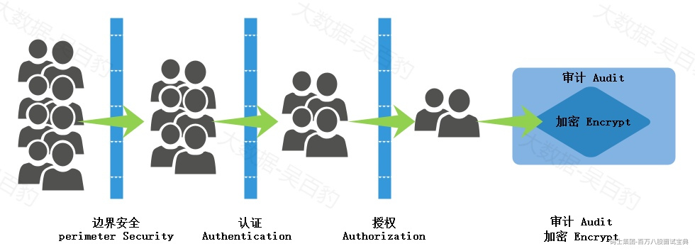

- 边界安全(Perimeter Security)：如设置防火墙、安全组控制端口。

- 认证(Authentication)：大数据集群中组件服务开启身份认证功能，只有用户提供了合法的身份信息才有可能访问服务，它是后续授权的基础，没有身份认证的授权是有漏洞容易被冒充的。例如:任意连接到HDFS系统的用户都可以查看HDFS 中的数据，设置是可以操作HDFS中的数据，存在安全问题，可以使用Kerberos安全认证工具对用户进行认证。

- 授权(Authorization)：通过身份认证的用户并不能访问服务所有的资源，需要通过授权机制对用户访问服务中实际的资源进行控制。例如通过ranger对访问Hive的用户进行授权限制用户访问Hive表中的哪些数据。

- 审计(Audit)：用户对服务资源的访问，需要利用审计日志进行监控/跟踪，便于问题/风险的排查。

- 加密(Encrypt)：涉及数据传输加密/数据存储加密，防止数据被窃取/窃取后被破解等。

以上边界安全主要是针对企业大数据集群节点的防火墙和安全组端口控制，避免非法访问和操作集群数据，边界安全假设“坏人”在外面，这通常是一个非常糟糕的假设，大多数真正具有破坏性的计算机犯罪事件都是内部人员所为，所以对于可以访问集群节点的人员还需进一步认证；认证主要是针对通过边界安全维度后进行用户身份的确认，认证有很多形式，如服务组件自身提供了简单的用户名/密码认证方式、通过Kerberos认证服务对用户身份进行认证；为了更好细粒度控制通过认证用户访问的资源可以通过对用户授权方式来决定用户操作资源的权限，这就是授权；最终操作集群资源时可以对数据进行加密传输，所有操作都会通过审计日志进行记录，便于风险排查。

Hive中权限控制是非常重要的一部分，关乎数据安全，Hive本身自带权限控制。Hive的权限控制可以验证用户是否有权限执行某一操作，这里说的权限控制不验证用户身份是否可以操作Hive，如果想要授权用户是否可以读取操作Hive可以通过Kerberos工具实现，这里所说的Hive权限控制是数据安全防护中的授权阶段。

Hive权限管理支持四种授权模型方式，分别如下：

- **Storage Based Authorization in the Metastore Server**

基于存储权限验证的授权，可以对 Metastore 中的元数据进行保护，只能验证用户是否有访问目录或者文件的权限，但是没有提供更加细粒度的访问控制（如：列级别、行级别）。

- **SQL Standards Based Authorization in HiveServer2**

基于 SQL 标准的 Hive 授权，表级别访问权限控制，完全兼容 SQL 的授权模型，推荐使用该模式。

- **Authorization using Apache Ranger & Sentry**

Apache Ranger和Apache Sentry是使用Hive提供的插件进行授权的apache项目，使用这些项目也可以对Hive表访问权限进行细粒度控制，推荐使用该模式。

- **Old Default Hive Authorization（Legacy Mode）**

Hive 默认授权，Hive默认情况下没有完整的访问控制，设计目的仅只是为了防止用户产生误操作，而不是防止恶意用户访问未经授权的数据。

Hive本身自带的权限控制针对JDBC方式连接Hive有效，下面重点针对第二种授权模型讲解。

### **5.3.2 SQL Standards Based Authorization in HiveServer2配置**

在Hive中配置开启SQL Standards Based Authorization in HiveServer2权限操作步骤如下：

**1) Hive服务端配置hive-site.xml**

```plain
... ...
    <!-- 开启权限 -->
    <property>
      <name>hive.security.authorization.enabled</name>

      <value>true</value>

    </property>

    <!-- 不使用远程客户端用户而使用HiveServer2用户作为访问Hive用户 -->
    <property>
      <name>hive.server2.enable.doAs</name>

      <value>false</value>

    </property>

    <!--  定义谁是超级管理员，多个使用逗号隔开，启动的时候会自动创建 -->
    <property>
      <name>hive.users.in.admin.role</name>

      <value>root</value>

    </property>

    <!-- 配置进行权限控制的类 -->
    <property>
      <name>hive.security.authorization.manager</name>

      <value>org.apache.hadoop.hive.ql.security.authorization.plugin.sqlstd.SQLStdHiveAuthorizerFactory</value>

    </property>

    <property>
      <name>hive.security.authenticator.manager</name>  
      <value>org.apache.hadoop.hive.ql.security.SessionStateUserAuthenticator</value>

</property>

... ...
```

**2) 重启Hive相关服务**

重启Hive时，首先将Hive 服务端的metastore 、hiveserver2服务关闭，然后再次重启Hive这些服务。

```plain
[root@node1 ~]# hive --service metastore > /software/hive-4.0.0/metastore.log 2>&1 &
[1] 50060
[root@node1 ~]# hive --service hiveserver2 > /software/hive-4.0.0/hiveserver2.log 2>&1 &
```

### **5.3.3 Hive用户/角色授权角色操作**

在Hive中有用户(user)、角色(role)概念，role可以理解为一组权限的集合。一个用户可以拥有一个或者多个角色，默认包含两种角色：public、Admin。public是所有用户都拥有的角色；Admin为超级用户角色。

#### 5.3.3.1 **Hive角色介绍**

Hive中关于角色的命令有如下：

```plain
show roles -- 查看Hive中所有存在的角色 ，只有Admin角色有权限执行
show current roles -- 查看当前具有的角色
create role role_name --创建角色
set role (role_name|ALL|NONE) --设置角色
drop role role_name -- 删除角色
```

在Hive客户端通过beeline连接Hive并执行如下命令，查看当前登录用户root的角色，我们发现角色为public ，并非Admin角色：

```plain
#root用户beeline连接Hive
[root@node3 ~]# beeline -u jdbc:hive2://node1:10000 -n root

#查看当前登录root用户的角色
show current roles;
+---------+
|  role   |
+---------+
| public  |
+---------+

#zhangsan用户beeline连接Hive
[root@node3 ~]# beeline -u jdbc:hive2://node1:10000 -n zhangsan

#查看当前登录zhangsan用户的角色
show current roles;
+---------+
|  role   |
+---------+
| public  |
+---------+
```

可以看到root和zhangsan用户的默认角色都是public，虽然在配置中已经指定root为Admin角色，但是在使用时还需set设置才能生效（set命令只是当前会话生效），执行如下命令设置root为Admin角色：

```plain
#设置当前用户为admin角色
set role admin;

#查看root用户的角色
show current roles;
+--------+
|  role  |
+--------+
| admin  |
+--------+

```

用户为admin角色后，可以查看/创建/删除Hive中拥有的所有角色。

```plain
#查看Hive中所有角色
show roles;
+---------+
|  role   |
+---------+
| admin   |
| public  |
+---------+

#在Hive中创建角色
create role myrole;

show roles;
+---------+
|  role   |
+---------+
| admin   |
| myrole  |
| public  |
+---------+

#删除创建的角色
drop role myrole;

show roles;
+---------+
|  role   |
+---------+
| admin   |
| public  |
+---------+
```

如果使用普通用户zhangsan来登录beeline连接hive，查看对应的角色，操作如下：

```plain
#启动新的客户端，使用zhangsan登录beeline
beeline -u jdbc:hive2://node1:10000 -n zhangsan

#查看zhangsan所属角色
show current roles;
+---------+
|  role   |
+---------+
| public  |
+---------+

#设置zhangsan 为admin角色，并不能成功，原因是配置中zhangsan不是Admin 角色
ERROR : FAILED: Execution Error, return code 40000 from org.apache.hadoop.hive.ql.ddl.DDLTask. zhangsan doesn't belong to role admin
```

此外，在hive-site.xml中没有配置admin的用户登录hive后只有查看库和表权限，没有查询表数据权限，如下：

```plain
#使用zhangsan用户查询表中数据
select * from t1;
Error: Error while compiling statement: FAILED: HiveAccessControlException Permission denied: Principal [name=zhangsan, type=USER] does not have 
following privileges for operation QUERY [[SELECT] on Object [type=TABLE_OR_VIEW, name=default.t1]] (state=42000,code=40000)
```

#### 5.3.3.2 **给用户/角色授权角色**

我们可以通过以下命令给某个存在的角色赋值其他角色，那么当前角色也拥有其他角色拥有的权限，命令如下：

```plain
#给用户/角色授权其他角色
GRANT ROLE role_name [, role_name] ... TO 【ROLE/USER】 principal_specification [,  principal_specification] ...[WITH ADMIN OPTION]

#查看用户/角色拥有的角色
SHOW ROLE GRANT principal_specification 

#给用户/角色取消授权其他角色
REVOKE [ADMIN OPTION FOR] ROLE role_name [, role_name] ...FROM principal_specification [, principal_specification] ...
```

注意：以上principal\_specification 可以是用户也可以是角色。下面演示给用户/角色授权其他角色操作。

- **给用户授权其他角色权限操作**

```plain
#使用root用户通过beeline登录hive
beeline -u jdbc:hive2://node1:10000 -n root

#设置root用户拥有admin角色
set role admin;

#给zhangsan用户授权admin角色
grant role admin to user zhangsan with admin option;

#查看zhangsan用户拥有的角色
show role grant user zhangsan;
+---------+---------------+----------------+----------+
|  role   | grant_option  |   grant_time   | grantor  |
+---------+---------------+----------------+----------+
| admin   | true          | 1720169769000  | root     |
| public  | false         | 0              |          |
+---------+---------------+----------------+----------+

#再次使用zhangsan用户登录beeline，可以设置admin角色，不再报错
beeline -u jdbc:hive2://node1:10000 -n zhangsan
set role admin;
show current roles;
+--------+
|  role  |
+--------+
| admin  |
+--------+
```

- **给角色授权其他角色权限操作**

```plain
#使用root用户通过beeline登录hive
beeline -u jdbc:hive2://node1:10000 -n root

#设置root用户拥有admin角色
set role admin;

#创建角色myrole
create role myrole;

#给角色myrole 授权admin角色
grant role admin to role myrole with admin option;

#查看myrole角色是否拥有admin角色
show role grant role myrole;
+--------+---------------+----------------+----------+
|  role  | grant_option  |   grant_time   | grantor  |
+--------+---------------+----------------+----------+
| admin  | true          | 1720177014000  | root     |
+--------+---------------+----------------+----------+
```

#### 5.3.3.3 **查看某个角色的用户/角色列表**

查看某个角色被哪些角色和用户所拥有，命令如下：

```plain
SHOW principals ROLE;
```

举例：查看Admin角色被哪些角色和用户拥有，命令如下：

```plain
show principals admin
+-----------------+-----------------+---------------+----------+---------------+----------------+
| principal_name  | principal_type  | grant_option  | grantor  | grantor_type  |   grant_time   |
+-----------------+-----------------+---------------+----------+---------------+----------------+
| myrole          | ROLE            | true          | root     | USER          | 1720177014000  |
| root            | USER            | true          | admin    | ROLE          | 1720167055000  |
| zhangsan        | USER            | true          | root     | USER          | 1720169769000  |
+-----------------+-----------------+---------------+----------+---------------+----------------+
```

#### 5.3.3.4 **撤销用户/角色已授权角色**

取消已经给用户或者角色授权的其他角色命令如下：

```plain
REVOKE [ADMIN OPTION FOR] ROLE role_name [, role_name] ...FROM principal_specification [, principal_specification] ...
```

注意：以上principal\_specification 可以使用户也可以是角色

```plain
#删除用户zhangsan拥有角色admin
REVOKE admin from user zhangsan;
#查看zhangsan用户是否拥有admin角色，只有一个public角色
show role grant user zhangsan;
+---------+---------------+-------------+----------+
|  role   | grant_option  | grant_time  | grantor  |
+---------+---------------+-------------+----------+
| public  | false         | 0           |          |
+---------+---------------+-------------+----------+

#删除myrole授权的admin角色
REVOKE admin from role myrole;
#查看myrole角色是否拥有admin角色
show role grant role myrole;
+-------+---------------+-------------+----------+
| role  | grant_option  | grant_time  | grantor  |
+-------+---------------+-------------+----------+
+-------+---------------+-------------+----------+
```

### **5.3.4 Hive用户/角色授权库表操作权限**

在Hive中库表操作权限包含如下种类：

|  |  |
| --- | --- |
| **权限名称** | **含义** |
| ALL | 所有权限 |
| ALTER | 允许修改表元数据（modify metadata data of object） |
| UPDATE | 允许修改表中实际数据（modify physical data of object） |
| CREATE | 允许进行CREATE操作 |
| DROP | 允许进行DROP操作 |
| LOCK | 当出现并发的使用允许用户进行LOCK和UNLOCK操作 |
| SELECT | 允许用户进行SELECT操作 |
| SHOW\_DATABASE | 允许用户查看可用的数据库 |

#### 5.3.4.1 **给用户/角色授权Hive库表操作权限**

在Hive中有了用户和角色后，我们就可以对用户或者角色进行Hive库表操作权限授权，这样用户及角色就可以在Hive中拥有对应的操作权限。

给用户/角色授权Hive操作权限命令如下：

```plain
GRANT priv_type [(column_list)][, priv_type [(column_list)]] ...  [ON object_specification] TO principal_specification [,principal_specification] ...[WITH GRANT OPTION]
```

注意：principal\_specification指的是用户或者角色。

Hive中操作举例如下：

```plain
#Hive中建表及插入数据
create table person(id int ,name string ,age int) row format delimited fields terminated by '\t';
insert into person values (1,'zs',18),(2,'ls',19),(3,'ww',20);

#给用户 zhangsan 授予查询表 person权限
grant select on person to user zhangsan with grant option;

#给角色 myrole授予查询表 person权限
grant select on person to role myrole with grant option;
```

#### 5.3.4.2 **查看用户/角色操作Hive库表权限**

查看用户/角色操作Hive库表权限命令如下：

```plain
SHOW GRANT principal_specification [ON object_specification [(column_list)]]
```

注意：principal\_specification 指的是用户或者角色;object\_specification 指的是表或者数据库，all代表所有表和库。

Hive中操作举例如下：

```plain
#查看用户zhangsan拥有Hive操作权限
show grant user zhangsan on person;
+-----------+---------+------------+---------+-----------------+-----------------+------------+---------------+----------------+----------+
| database  |  table  | partition  | column  | principal_name  | principal_type  | privilege  | grant_option  |   grant_time   | grantor  |
+-----------+---------+------------+---------+-----------------+-----------------+------------+---------------+----------------+----------+
| default   | person  |            |         | zhangsan        | USER            | SELECT     | true          | 1720181203000  | root     |
+-----------+---------+------------+---------+-----------------+-----------------+------------+---------------+----------------+----------+

#查看角色myrole拥有Hive操作权限
show grant role myrole on person;
+-----------+---------+------------+---------+-----------------+-----------------+------------+---------------+----------------+-----------+
| database  |  table  | partition  | column  | principal_name  | principal_type  | privilege  | grant_option  |   grant_time   |  grantor  |
+-----------+---------+------------+---------+-----------------+-----------------+------------+---------------+----------------+-----------+
| default   | person  |            |         | myrole          | ROLE            | SELECT     | true          | 1720181235000  | root|
+-----------+---------+------------+---------+-----------------+-----------------+------------+---------------+----------------+-----------+
```

#### 5.3.4.3 **取消用户/角色操作Hive库表权限**

给用户/角色取消操作Hive库表权限命令如下：

```plain
REVOKE [GRANT OPTION FOR] priv_type [(column_list)][, priv_type [(column_list)]] ... [ON object_specification] FROM principal_specification [, principal_specification] ...
```

注意：principal\_specification 指的是用户或者角色。

- **取消用户操作Hive库表权限**

```plain
# 取消用户 zhangsan hive操作表person权限
revoke select on person from user zhangsan;

# 查看用户 zhangsan 操作Hive 权限
show grant user zhangsan;
```

对zhangsan用户取消查询person表权限后，使用zhangsan用户登录beeline，查询person表数据报错：

```plain
beeline -u jdbc:hive2://node1:10000 -n zhangsan
select * from person;
Error: Error while compiling statement: FAILED: HiveAccessControlException Permission denied: Principal [name=zhangsan, type=USER] does not have 
following privileges for operation QUERY [[SELECT] on Object [type=TABLE_OR_VIEW, name=default.person]] (state=42000,code=40000)
```

- **取消角色操作hive库表权限**

```plain
#取消角色myrole 操作Hive表person权限
revoke select on person from role myrole;

#查看角色myrole操作hive权限
show grant role myrole;
+-----------+--------+------------+---------+-----------------+-----------------+------------+---------------+-------------+----------+
| database  | table  | partition  | column  | principal_name  | principal_type  | privilege  | grant_option  | grant_time  | grantor  |
+-----------+--------+------------+---------+-----------------+-----------------+------------+---------------+-------------+----------+
+-----------+--------+------------+---------+-----------------+-----------------+------------+---------------+-------------+----------+
```

## 5.4 **Explain 执行计划**

Hive SQL的执行计划描述了SQL整体执行的轮廓，通过执行计划可以了解SQL转换成相应执行引擎的执行逻辑和流程，进而帮助我们更好掌握SQL执行出现的瓶颈点实现相应优化。

### **5.4.1 explain语法及使用**

#### 5.4.1.1 **语法及术语**

Hive执行计划语法如下：

```plain
EXPLAIN [EXTENDED|DEPENDENCY|AUTHORIZATION] query
```

常见的可选参数解释如下：

- EXTENDED:输出执行计划额外信息，例如：中间计算的临时文件名，这些额外信息一般不需要特别关注。

- DEPENDENCY:可以输出执行计划读取的表和表的分区信息。

- AUTHORIZATION:查看SQL相关的权限信息。

下面通过一个简单案例来解释explain结果中的术语：

```plain
#执行如下sql：按照部门统计员工人数
explain select count(emp_id) from emp group by dept_id;

#结果如下：
+----------------------------------------------------+
|                      Explain                       |
+----------------------------------------------------+
| STAGE DEPENDENCIES:                                |
|   Stage-1 is a root stage                          |
|   Stage-0 depends on stages: Stage-1               |
|                                                    |
| STAGE PLANS:                                       |
|   Stage: Stage-1                                   |
|     Map Reduce                                     |
|       Map Operator Tree:                           |
|           TableScan                                |
|             alias: emp                             |
|             Statistics: Num rows: 1 Data size: 188 Basic stats: COMPLETE Column stats: NONE |
|             Select Operator                        |
|               expressions: emp_id (type: int), dept_id (type: string) |
|               outputColumnNames: emp_id, dept_id   |
|               Statistics: Num rows: 1 Data size: 188 Basic stats: COMPLETE Column stats: NONE |
|               Group By Operator                    |
|                 aggregations: count(emp_id)        |
|                 keys: dept_id (type: string)       |
|                 minReductionHashAggr: 0.99         |
|                 mode: hash                         |
|                 outputColumnNames: _col0, _col1    |
|                 Statistics: Num rows: 1 Data size: 188 Basic stats: COMPLETE Column stats: NONE |
|                 Reduce Output Operator             |
|                   key expressions: _col0 (type: string) |
|                   null sort order: z               |
|                   sort order: +                    |
|                   Map-reduce partition columns: _col0 (type: string) |
|                   Statistics: Num rows: 1 Data size: 188 Basic stats: COMPLETE Column stats: NONE |
|                   value expressions: _col1 (type: bigint) |
|       Execution mode: vectorized                   |
|       Reduce Operator Tree:                        |
|         Group By Operator                          |
|           aggregations: count(VALUE._col0)         |
|           keys: KEY._col0 (type: string)           |
|           mode: mergepartial                       |
|           outputColumnNames: _col0, _col1          |
|           Statistics: Num rows: 1 Data size: 188 Basic stats: COMPLETE Column stats: NONE |
|           Select Operator                          |
|             expressions: _col1 (type: bigint)      |
|             outputColumnNames: _col0               |
|             Statistics: Num rows: 1 Data size: 188 Basic stats: COMPLETE Column stats: NONE |
|             File Output Operator                   |
|               compressed: false                    |
|               Statistics: Num rows: 1 Data size: 188 Basic stats: COMPLETE Column stats: NONE |
|               table:                               |
|                   input format: org.apache.hadoop.mapred.SequenceFileInputFormat |
|                   output format: org.apache.hadoop.hive.ql.io.HiveSequenceFileOutputFormat |
|                   serde: org.apache.hadoop.hive.serde2.lazy.LazySimpleSerDe |
|                                                    |
|   Stage: Stage-0                                   |
|     Fetch Operator                                 |
|       limit: -1                                    |
|       Processor Tree:                              |
|         ListSink                                   |
|                                                    |
+----------------------------------------------------+
```

**explain执行之后，会输出一系列的stage序列，stage之间执行有先后顺序，每个stage根据执行的SQL 可以是一个MR Job Stage(如：筛选、聚合、join)、元数据查询存储Stage(创建表、删除表、修改表结构等)或者文件操作的Stage（如：insert、load）**。

如果Stage是MR Job Stage，Stage中又包含Map Operator Tree和Reduce Operator Tree两部分，每个部分中由一到多个Operator组成。以上explain生成的执行计划中，包含两个Stage：Stage-1和Stage-0，其中Stage-1为“root stage”表示根Stage，先执行Stage-1然后执行Stage-0，Stage-1和Stage-0中包含的Operator及解释如下：

- **TableScan**:表扫描操作，map端第一个操作一般都是TableScan扫描表操作，其中属性包括:alias(表名称)、Statistics(表统计信息：表数据条数、数据大小)。

- **Select Operator**：选取操作，其中属性包括：expressions（需要的字段名称及字段类型）、outputColumnNames（输出列名称）、Statistics（表统计信息：表数据条数、数据大小）。

- **Group By operator**：分组聚合操作，其中属性包括：aggregations（聚合函数信息）、keys（分组的字段）、minReductionHashAggr（map段聚合阈值）、mode（聚合模式）、outputColumnNames（聚合之后输出列名）、Statistics（表统计信息：表数据条数、数据大小）。

- **Reduce Output Operator**：输出到reduce操作，其中属性包括：key expressions（输出分组列）、null sort order（空值排序，z表示将空值放在最后）、sort order（排序相关，值为空则不排序；值为+正序排序；值为-倒序排序；值为+ -排序的列为两列，第一列为正序，第二列为倒序）、Map-reduce partition columns（MR任务中数据分发和处理的分区列，与表分区不分区无关）、Statistics（表统计信息：表数据条数、数据大小）、value expressions（输出分组列对应的value列）。

- **File Output Operator**：过滤操作，其中属性包括：compressed（是否压缩）、Statistics（表统计信息：表数据条数、数据大小）、table（表输入、输出及序列化类信息）。

- **Fetch Operator**：客户端获取数据操作，其中属性包括:limit（值为-1表示不限制条数，其他值为限制的条数）。

除以上之外，常见的Operator还有：

- **Filter Operator**：过滤操作，常见属性包括：predicate（过滤条件）、Statistics（表统计信息：表数据条数、数据大小）。

- **Map Join Operator**：join操作，常见属性包括：condition map（join 方式）、keys（Join条件字段）、outputColumnNames（join完成之后输出的字段）、Statistics（join之后统计信息：表数据条数、数据大小）。

#### 5.4.1.2 **配置tez jar依赖包**

在使用explain语法之前我们还需要给Hive配置tez相关的一些jar包，关于tez可以参考后续内容，在hive内部explain执行时会使用到tez相关的jar包，如果没有就会报错。

**1) 下载tez安装包**

从tez官网下载tez，地址：<https://tez.apache.org/releases/index.html> , 这里选择的tez版本为0.10.3版本，下载好的安装包名称为“apache-tez-0.10.3-bin.tar.gz”。

**2) 上传解压**

将tez安装包下载后，上传至node1节点/software目录下并解压：

```plain
#上传并解压至/software目录下
[root@node1 ~]# ls /software/ | grep apache-tez*
apache-tez-0.10.3-bin
apache-tez-0.10.3-bin.tar.gz
```

**3) 准备依赖jars**

在HIVE\_HOME/目录中创建jars目录，将tez安装包中的所有jar放入到该目录中。

```plain
#在node1 HIVE_HOME中创建jars目录
[root@node1 ~]# mkdir -p /software/hive-4.0.0/jars

#将所有tez相关jar放入到HIVE_HOME/jars目录下
[root@node1 ~]# cp /software/apache-tez-0.10.3-bin/*.jar /software/hive-4.0.0/jars
[root@node1 ~]# cp /software/apache-tez-0.10.3-bin/lib/*.jar /software/hive-4.0.0/jars
```

**4) 配置hive-env.sh**

配置HIVE\_HOME/conf/hive-env.sh文件，在最后配置“HIVE\_AUX\_JARS\_PATH”属性指定Tez jar路径为HIVE\_HOME/jars路径。

```plain
... ...
export HIVE_AUX_JARS_PATH=/software/hive-4.0.0/jars
... ...
```

**5) 重启Hive Metastore和HiveServer服务**

```plain
#重启Hive Metastore和HiveServer服务
[root@node1 ~]# hive --service metastore > /software/hive-4.0.0/metastore.log 2>&1 &
[root@node1 ~]# hive --service hiveserver2 > /software/hive-4.0.0/hiveserver2.log 2>&1 &
```

#### 5.4.1.3 **使用举例**

在实际生产中，我们可以通过explain 语法查看SQL的执行计划来确定SQL执行流程以及SQL执行流程中涉及的操作，方便我们进一步判断SQL瓶颈或者优化问题。如下是使用explain语法进行SQL执行流程查看的过程。

如下：建表并插入数据。

```plain
create table explain_tbl1 (
  id int,
  name string,
  age int
)row format delimited fields terminated by '\t';

create table explain_tbl2 (
  id int,
  name string,
  score int
)row format delimited fields terminated by '\t';

insert into explain_tbl1 values 
(1,'zs',18),
(2,'ls',19),
(3,'ww',20),
(4,'ml',21),
(null,'tq',22);

insert into explain_tbl2 values 
(1,'zs',100),
(2,'ls',110),
(3,'ww',120),
(4,'ml',130),
(5,'tq',140);
```

- **通过explain 查看 join sql中是否会对关联键做null值过滤?**

```plain
#sql如下
explain select 
 a.id,
 a.name,
 a.age,
 b.score 
from 
explain_tbl1 a join explain_tbl2 b 
on a.id = b.id;

#执行关键结果
+----------------------------------------------------+
|                      Explain                       |
+----------------------------------------------------+
| STAGE DEPENDENCIES:                                |
|   Stage-1 is a root stage                          |
|   Stage-0 depends on stages: Stage-1               |
|                                                    |
| STAGE PLANS:                                       |
|   Stage: Stage-1                                   |
|     Map Reduce                                     |
|       Map Operator Tree:                           |
|           TableScan                                |
|             alias: a                               |
|             filterExpr: id is not null (type: boolean) |
... ...
|           TableScan                                |
|             alias: b                               |
|             filterExpr: id is not null (type: boolean) |
+----------------------------------------------------+
```

执行如上explain后可以看到每个表都进行了“filterExpr： id is not null”的操作，说明进行了id空值的过滤。

- **通过explain 查看相同结果的sql执行效率**

```plain
#如下两个sql，执行结果一样，哪个执行效率更高？
SELECT
 a.id,
 a.name,
 a.age,
 b.score
FROM explain_tbl1 a 
JOIN explain_tbl2 b ON a.id = b.id 
WHERE a.id > 2;

SELECT
 a.id,
 a.name,
 a.age,
 b.score
FROM
 (SELECT * FROM explain_tbl1 WHERE id > 2) a 
JOIN explain_tbl2 b ON a.id = b.id;
 
#两个SQL执行结果如下：
+-------+---------+--------+----------+
| a.id  | a.name  | a.age  | b.score  |
+-------+---------+--------+----------+
| 3     | ww      | 20     | 120      |
| 4     | ml      | 21     | 130      |
+-------+---------+--------+----------+
```

以上sql中有人说第一条SQL执行效率高，因为第二条sql中有子查询影响效率；有人说第二条SQL执行效率高，因为第二条SQL先对数据进行了过滤，然后再Join减少了数据量，执行效率高。实际上我们通过explain查看两个sql后，发现两个SQL执行计划一样，都是先进行过滤，然后再进行join。

```plain
#执行explain
explain SELECT
 a.id,
 a.name,
 a.age,
 b.score
FROM explain_tbl1 a 
JOIN explain_tbl2 b ON a.id = b.id 
WHERE a.id > 2;
 
explain SELECT
 a.id,
 a.name,
 a.age,
 b.score
FROM
 (SELECT * FROM explain_tbl1 WHERE id > 2) a 
JOIN explain_tbl2 b ON a.id = b.id;
 
#执行计划结果
+----------------------------------------------------+
|                      Explain                       |
+----------------------------------------------------+
| STAGE DEPENDENCIES:                                |
|   Stage-1 is a root stage                          |
|   Stage-0 depends on stages: Stage-1               |
|                                                    |
| STAGE PLANS:                                       |
|   Stage: Stage-1                                   |
|     Map Reduce                                     |
|       Map Operator Tree:                           |
|           TableScan                                |
|             alias: explain_tbl1                    |
|             filterExpr: (id > 2) (type: boolean)   |
|             Statistics: Num rows: 5 Data size: 470 Basic stats: COMPLETE Column stats: COMPLETE |
|             Filter Operator                        |
|               predicate: (id > 2) (type: boolean)  |
|               Statistics: Num rows: 3 Data size: 282 Basic stats: COMPLETE Column stats: COMPLETE |
|               Select Operator                      |
|                 expressions: id (type: int), name (type: string), age (type: int) |
|                 outputColumnNames: _col0, _col1, _col2 |
|                 Statistics: Num rows: 3 Data size: 282 Basic stats: COMPLETE Column stats: COMPLETE |
|                 Reduce Output Operator             |
|                   key expressions: _col0 (type: int) |
|                   null sort order: z               |
|                   sort order: +                    |
|                   Map-reduce partition columns: _col0 (type: int) |
|                   Statistics: Num rows: 3 Data size: 282 Basic stats: COMPLETE Column stats: COMPLETE |
|                   value expressions: _col1 (type: string), _col2 (type: int) |
|           TableScan                                |
|             alias: b                               |
|             filterExpr: (id > 2) (type: boolean)   |
|             Statistics: Num rows: 5 Data size: 40 Basic stats: COMPLETE Column stats: COMPLETE |
|             Filter Operator                        |
|               predicate: (id > 2) (type: boolean)  |
|               Statistics: Num rows: 4 Data size: 32 Basic stats: COMPLETE Column stats: COMPLETE |
|               Select Operator                      |
|                 expressions: id (type: int), score (type: int) |
|                 outputColumnNames: _col0, _col1    |
|                 Statistics: Num rows: 4 Data size: 32 Basic stats: COMPLETE Column stats: COMPLETE |
|                 Reduce Output Operator             |
|                   key expressions: _col0 (type: int) |
|                   null sort order: z               |
|                   sort order: +                    |
|                   Map-reduce partition columns: _col0 (type: int) |
|                   Statistics: Num rows: 4 Data size: 32 Basic stats: COMPLETE Column stats: COMPLETE |
|                   value expressions: _col1 (type: int) |
|       Reduce Operator Tree:                        |
|         Join Operator                              |
|           condition map:                           |
|                Inner Join 0 to 1                   |
|           keys:                                    |
|             0 _col0 (type: int)                    |
|             1 _col0 (type: int)                    |
|           outputColumnNames: _col0, _col1, _col2, _col4 |
|           Statistics: Num rows: 3 Data size: 294 Basic stats: COMPLETE Column stats: COMPLETE |
|           Select Operator                          |
|             expressions: _col0 (type: int), _col1 (type: string), _col2 (type: int), _col4 (type: int) |
|             outputColumnNames: _col0, _col1, _col2, _col3 |
|             Statistics: Num rows: 3 Data size: 294 Basic stats: COMPLETE Column stats: COMPLETE |
|             File Output Operator                   |
|               compressed: false                    |
|               Statistics: Num rows: 3 Data size: 294 Basic stats: COMPLETE Column stats: COMPLETE |
|               table:                               |
|                   input format: org.apache.hadoop.mapred.SequenceFileInputFormat |
|                   output format: org.apache.hadoop.hive.ql.io.HiveSequenceFileOutputFormat |
|                   serde: org.apache.hadoop.hive.serde2.lazy.LazySimpleSerDe |
|                                                    |
|   Stage: Stage-0                                   |
|     Fetch Operator                                 |
|       limit: -1                                    |
|       Processor Tree:                              |
|         ListSink                                   |
|                                                    |
+----------------------------------------------------+
```

### **5.4.2 explain dependency使用**

explain dependency 可以显示SQL查询的数据来源，其输出一个join格式数据，json中有如下两个属性：

- input\_tables: SQL查询的表名及类型。

- input\_partitions:SQL查询的数据来源分区信息，如果为非分区表则为空。

案例：创建两个分区表并插入数据:

```plain
create table explain_partition_tbl1 (
  order_id int comment '订单ID',
  product_name string comment '产品名称',
  order_amount double comment '订单金额' 
) partitioned by (dt string)
row format delimited fields terminated by '\t';

create table explain_partition_tbl2 (
  order_id int comment '订单ID',
  status string comment '订单状态' 
) partitioned by (dt string)
row format delimited fields terminated by '\t';

insert into explain_partition_tbl1 values 
(101,'手机',100,'20250101'),
(102,'电脑',200,'20250101'),
(103,'数据线',300,'20250102'),
(104,'音响',400,'20250102');

insert into explain_partition_tbl2 values 
(101,'签收','20250101'),
(102,'签收','20250101'),
(103,'签收','20250102'),
(104,'签收','20250102');
```

- **通过explain dependency 查看SQL语句查询的表分区信息**

```plain
#sql
explain dependency select dt,sum(order_amount) as total from explain_partition_tbl1 group by dt;

#结果
{
    "input_tables": [{
        "tablename": "default@explain_partition_tbl1",
        "tabletype": "EXTERNAL_TABLE"
    }],
    "input_partitions": [{
        "partitionName": "default@explain_partition_tbl1@dt=20250101"
    }, {
        "partitionName": "default@explain_partition_tbl1@dt=20250102"
    }]
}
```

- **通过explain dependency 查看相同结果SQL语句查询分区是否一样**

```plain
#如下两个SQL执行结果都一样，区别是join多个条件中一个使用and一个使用where
explain dependency select *
from explain_partition_tbl1 t1 join explain_partition_tbl2 t2 
on t1.dt = t2.dt and t1.dt <='20250101';

explain dependency select *
from explain_partition_tbl1 t1 join explain_partition_tbl2 t2 
on t1.dt = t2.dt where t1.dt <='20250101';

#sql结果
+--------------+------------------+------------------+-----------+--------------+------------+-----------+
| t1.order_id  | t1.product_name  | t1.order_amount  |   t1.dt   | t2.order_id  | t2.status  |   t2.dt   |
+--------------+------------------+------------------+-----------+--------------+------------+-----------+
| 101          | 手机               | 100.0            | 20250101  | 101          | 签收         | 20250101  |
| 101          | 手机               | 100.0            | 20250101  | 102          | 签收         | 20250101  |
| 102          | 电脑               | 200.0            | 20250101  | 101          | 签收         | 20250101  |
| 102          | 电脑               | 200.0            | 20250101  | 102          | 签收         | 20250101  |
+--------------+------------------+------------------+-----------+--------------+------------+-----------+

#通过explain dependency 查询两个sql扫描的分区是否一样
explain dependency select *
from explain_partition_tbl1 t1 join explain_partition_tbl2 t2 
on t1.dt = t2.dt and t1.dt <='20250101';

explain dependency select *
from explain_partition_tbl1 t1 join explain_partition_tbl2 t2 
on t1.dt = t2.dt where t1.dt <='20250101';

#两个explain执行结果相同，如下：
{
    "input_tables": [{
        "tablename": "default@explain_partition_tbl1",
        "tabletype": "EXTERNAL_TABLE"
    }, {
        "tablename": "default@explain_partition_tbl2",
        "tabletype": "EXTERNAL_TABLE"
    }],
    "input_partitions": [{
        "partitionName": "default@explain_partition_tbl1@dt=20250101"
    }, {
        "partitionName": "default@explain_partition_tbl2@dt=20250101"
    }]
}
```

以上两个SQL 虽然不同，但是通过explain dependency 查看两个sql扫描分区数一样。

### **5.4.3 explain authorization 使用**

explain authorization可以查看当前SQL访问的数据来源和数据输出，以及当前Hive访问用户及操作信息。

```plain
#sql
explain authorization select dt,sum(order_amount) as total from explain_partition_tbl1 group by dt;

#结果
+----------------------------------------------------+
|                      Explain                       |
+----------------------------------------------------+
| INPUTS:                                            |
|   default@explain_partition_tbl1                   |
|   default@explain_partition_tbl1@dt=20250101       |
|   default@explain_partition_tbl1@dt=20250102       |
| OUTPUTS:                                           |
|   hdfs://mycluster/tmp/hive/root/7e69d6d.../-mr-10001 |
| CURRENT_USER:                                      |
|   root                                             |
| OPERATION:                                         |
|   QUERY                                            |
+----------------------------------------------------+
```

## 5.5 **Hive优化**

本小节主要讲解Hive优化，涉及到非常多的参数设置，这些配置参数都可以基于如下三种方式进行设置：

- 配置文件中设置。可以设置在$HIVE\_HOME/conf/hive-site.xml中，参数全局有效。

- 命令行参数设置。可以通过beeline -u jdbc:hive2://host:10000 -hiveconf key=value设置，参数仅对本次连接有效。

- 会话参数设置。可以在本次连接客户端中通过set命令来设置，参数仅对本次连接有效。

以上三种参数设置方式优先级如下：会话参数设置>命令行参数设置>配置文件设置。

### **5.5.1 本地模式运行**

“hive.exec.mode.local.auto”参数设置Hive是否自动开启本地模式，默认为false。默认Hive执行SQL语句时，无论SQL查询数据量多少，都会转换成分布式MapReduce执行，但对于一些测试场景或者Hive处理的数据量非常小情况下，如果还是采用分布式执行，反而会导致任务执行总时间很长。

这时可以设置“hive.exec.mode.local.auto”参数为true，让Hive根据查询数据量来自动决定执行SQL是否使用本地模式，如果数据量不大，Hive查询就可以直接在HiveServer2本机执行Local MapReduce，而不在集群上分布式运行MapReduce。

开启Hive本地模式后，Hive自动判断是否本地模式执行SQL的相关参数如下：

- **hive.exec.mode.local.auto.inputbytes.max**

该参数设置Hive执行本地模式MR最大输入的数据量，默认值为123217728，即128M。输入数据量小于该值时，会默认本地模式执行MR。

- **hive.exec.mode.local .auto.input.files.max**

该参数设置hive执行本地模式MR最大输入文件个数，也就是map端的并行度，该值默认为4，即：如果map task小于4并且输入数据量小于hive.exec.mode.local.auto.inputbytes.max时执行本地模式。

### **5.5.2 Fetch抓取**

“hive.fetch.task.conversion”参数设置一些SELECT查询是否转换为单个FETCH任务，而最小化延迟。Hive SQL 启用 MapReduce Job 是会消耗系统开销,Hive 中对某些情况的查询可以不必使用 MapReduce 计算，如：对于简单的不需要聚合的类似 select col from table limit n语句，不需要起 MapReduce job，直接通过 Fetch task 获取表目录下的数据然后输出到控制台。

hive.fetch.task.conversion参数可以设置为：none、minimal、more三个值，默认为more，建议采用默认值即可。三者解释如下：

- **hive.fetch.task.conversion设置为none**

禁用fetch任务转换。所有查询将按照常规方式执行，而不尝试优化为单个FETCH任务。

- **hive.fetch.task.conversion设置为minimal**

仅在满足特定条件的情况下，转换为FETCH任务。这些条件包括：select \*查询、过滤分区列、使用limit语句。

- **hive.fetch.task.conversion设置为more**

在更多情况下转换为FETCH任务，这些条件包括select查询、过滤查询、limit、虚拟列查询等。相较于minimal，more允许更广泛的查询类型转换为FETCH任务。

如下，本身select \* 查询不会之心MR 任务，如果将hive.fetch.task.conversion设置为none后会执行MR任务。

```plain
#将fetch task设置为none
set hive.fetch.task.conversion=none;

#执行如下查询会执行MapReduce任务
select * from t1 limit 10;
```

### **5.5.3 开启谓词下推**

“hive.optimize.ppd”参数表示是否开启Hive谓词下推（predicate pushdown），默认为true，表示开启，建议采用默认值即可。谓词下推表示尽量将SQL中的where条件前移，减少后续计算步骤数据量。

### **5.5.4 开启向量化执行**

“hive.vectorized.execution.enabled”参数表示是否开启Hive向量化执行，默认为true，表示开启，建议采用默认值即可。相当于从原来的map逐行处理数据变成批量处理数据，从处理一行到一次性处理多行，减少cpu指令和cpu上下文切换提高效率。

当对一些SQL语句执行explain时可以看到执行计划中“Execution mode: vectorized”，表示开启了向量化执行。

### **5.5.5 开启CBO优化**

在Hive中执行多表Join时，Hive默认开启了CBO（Cost Based Optimization）优化，系统会自动根据表的统计信息，例如数据量、文件数等，选出合适执行计划提高多表Join的效率，Hive需要先收集表的统计信息后才能使CBO正确的优化。CBO优化器会基于统计信息和查询条件，尽可能地使join顺序达到更优，但是也可能存在特殊情况导致join顺序调整不准确。例如数据存在倾斜，以及查询条件值在表中不存在等场景，可能调整出非优化的join顺序。

CBO优化参数为“hive.cbo.enable”，默认为true，建议保持默认值即可。

### **5.5.6 开启Job并行执行**

“hive.exec.parallel”参数表示是否并行执行Jobs，默认为false，表示不开启，建议设置为true。Hive SQL 在底层会转换成一个或者多个Stage，这些Stage可能对应一个MapRedcue任务，在复杂SQL中，转换成的多个Stage之间可能没有依赖关系，对应的MapReduce Job并不按照顺序依次执行，这是就可以将这些Stage并行执行提高效率。该参数设置的并行执行指的就是并行运行Stage。

还可通过设置“hive.exec.parallel.thread.number”参数来指定并行执行Stage的并行度，默认为8。在资源充足的时候hive.exec.parallel会让那些存在并发job的sql运行得更快,但同时消耗更多的资源。

举例，执行如下SQL 我们可以看到SQL转换成的Stage之间并非都有依赖关系，可以设置Stage并行执行。

```plain
#sql语句
explain  
select user_name,count(*) from users group by user_name
union
select user_name,sum(salary) from users group by user_name;

#explain 执行计划如下
+----------------------------------------------------+
|                      Explain                       |
+----------------------------------------------------+
| STAGE DEPENDENCIES:                                |
|   Stage-1 is a root stage                          |
|   Stage-2 depends on stages: Stage-1, Stage-3      |
|   Stage-3 is a root stage                          |
|   Stage-0 depends on stages: Stage-2               |
+----------------------------------------------------+
```

### **5.5.7 开启Hive严格模式**

Hive严格模式主要涉及三个参数：“hive.strict.checks.no.partition.filter”、“hive.strict.checks.orderby.no.limit ”、“hive.strict.checks.cartesian.product ”。

**1) hive.strict.checks.no.partition.filter**

Hive分区表的设计目的是通过分区剪裁来减少扫描的数据量，从而提高查询性能，如果在查询中没有指定分区过滤条件，Hive将扫描整个表的所有分区，可能会导致查询性能下降，该参数就是设置当查询没有指定分区过滤条件是否允许SQL执行。

该参数设置为true时，如果对分区表的查询中没有包含分区过滤条件，Hive将会禁止该查询的执行;设置为 false 时，Hive不会对缺少分区过滤条件的查询做出限制,默认为false，建议设置为true。

举例:查询分区表数据。

```plain
#正常查询分区表数据，hive.strict.checks.no.partition.filter为false，过滤条件中没有指定分区列也允许查询。
select * from partition_tbl;

#设置hive.strict.checks.no.partition.filter为true
set hive.strict.checks.no.partition.filter=true;

#再次查询
select * from partition_tbl;
Error: Error while compiling statement: FAILED: SemanticException [Error 10056]: Queries against partitioned tables without a partition filter are disabled for safety reasons. If you know what you are doing, please set hive.strict.checks.no.partition.filter to false and make sure that hive.mapred.mode is not set to 'strict' to proceed. Note that you may get errors or incorrect results if you make a mistake while using some of the unsafe features. No partition predicate for Alias "partition_tbl" Table "partition_tbl" (state=42000,code=10056)

#需要在where中加入分区列的条件，才可以正常执行
select * from partition_tbl where age = 18;
```

**2) hive.strict.checks.orderby.no.limit**

在Hive中ORDER BY子句用于对查询结果进行排序，如果数据集非常大，没有 LIMIT 子句的 ORDER BY 查询可能会导致非常高的内存和计算开销，因为Hive需要对整个数据集进行排序。该参数用于设置是否允许order by 后没有limit语句的SQL执行。

当该参数设置为true时，如果在ORDER BY查询中没有包含LIMIT子句，Hive将会禁止该查询的执行;当该参数设置为false时，Hive允许执行没有LIMIT子句的ORDER BY查询。该值默认为false，建议设置为true。

举例，如下查询表语句：

```plain
#正常查询表数据，hive.strict.checks.orderby.no.limit为false，order by后没有limit子句可以执行
select * from users order by age;

#设置hive.strict.checks.orderby.no.limit为true
set hive.strict.checks.orderby.no.limit=true;

#再次查询
select * from users order by age;
Error: Error while compiling statement: FAILED: SemanticException 1:29 Order by-s without limit are disabled for safety reasons. If you know what you are doing, please set hive.strict.checks.orderby.no.limit to false and make sure that hive.mapred.mode is not set to 'strict' to proceed. Note that you may get errors or incorrect results if you make a mistake while using some of the unsafe features.. Error encountered near token 'age' (state=42000,code=40000)

#需要加上limit子句才可以正常执行
select * from users order by age limit 10;
```

**3) hive.strict.checks.cartesian.product**

Hive中笛卡尔积操作会导致非常高的计算和存储开销，尤其是当参与连接的表数据量很大时，会导致性能问题和资源过载。该参数就是设置在Hive中是否允许笛卡尔积操作。

当该参数设置为true时，Hive将禁止执行笛卡尔积（交叉连接，cross join）查询；当该参数设置为false时，Hive允许执行笛卡尔积查询。默认为false，建议设置为true。

举例如下：

```plain
#设置关闭 mapjoin
set hive.auto.convert.join=false;

#进行笛卡尔积查询
SELECT *
FROM emp e
CROSS JOIN dept d;

#设置hive.strict.checks.cartesian.product为true
set hive.strict.checks.cartesian.product=true;

#再次查询
SELECT *
FROM emp e
CROSS JOIN dept d;
Error: Error while compiling statement: FAILED: SemanticException Cartesian products are disabled for safety reasons. If you know what you are doing, please set hive.strict.checks.cartesian.product to false and make sure that hive.mapred.mode is not set to 'strict' to proceed. Note that you may get errors or incorrect results if you make a mistake while using some of the unsafe features. (state=42000,code=40000)
```

### **5.5.8 设置合理并行度**

Hive SQL底层转换成MapReduce任务，这里说的设置并行度主要是针对SQL转换成的MapReduce任务Map端和Reduce端并行度进行设置。

#### 5.5.8.1 **Map Tasks并行度设置**

Map Task并行度就是Map Task个数，默认由输入文件的切片数决定，相关参数如下：

```plain
#MapReduce 任务中,输入文件的最小切分大小，默认值为1byte。
set mapred.min.split.size;

#MapReduce 任务中，输入文件的最大切分大小，默认值为256000000byte，约256M。
set mapred.max.split.size;
```

在使用Hql处理数据时，读取的数据数据量如果很大，默认转换成的MR任务会按照“mapred.max.split.size”进行文件切分，切分的个数就是MapTask的个数。如果处理中涉及到计算复杂的操作，可以考虑将“mapred.max.split.size”参数调小，以增大MapTask的并行度，可以加快数据处理速度。

注意：绝大多数情况下不需要我们手动调整Map Task个数，按照输入文件的切片数据决定即可（切片不会跨文件，也就是说如果有2个小文件会对应到2个split切片上）。

如下案例中，表temp中的数据量为602M，进行count查询时，可以通过YarnWebUI查看对应的MapTask个数。

```plain
#查询切片默认参数
set mapred.min.split.size;
+--------------------------+
|           set            |
+--------------------------+
| mapred.min.split.size=1  |
+--------------------------+

set mapred.max.split.size;
+----------------------------------+
|               set                |
+----------------------------------+
| mapred.max.split.size=256000000  |
+----------------------------------+

#默认不设置任何参数执行如下SQL
select count(*) from temp ;
```

以上转换成的MapReduce 任务map task个数为(602M/256M≈2.3)：

*(⚠️ 图片缺失:源知识库原图已失效)*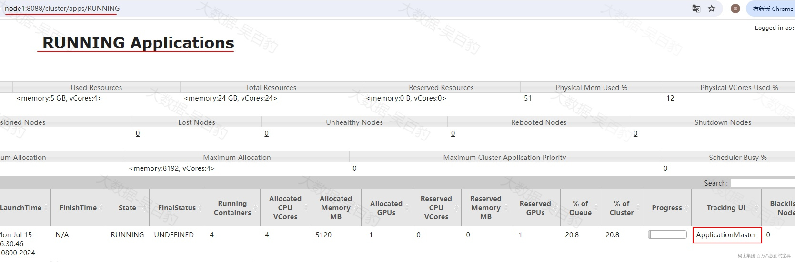

可以看到Map Task个数为3。

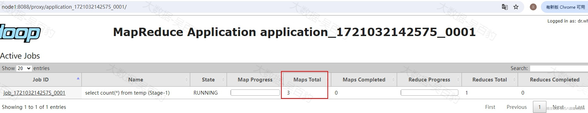

*(⚠️ 图片缺失:源知识库原图已失效)*

将“mapred.max.split.size”设置为128M，重新执行SQL ，观察转换成的MapReduce任务Map Task个数（602M/128M≈4.7）。

```plain
#设置mapred.max.split.size为128M
set mapred.max.split.size=128000000;

#执行SQL
select count(*) from temp ;
```

可以看到Map Task个数为5。

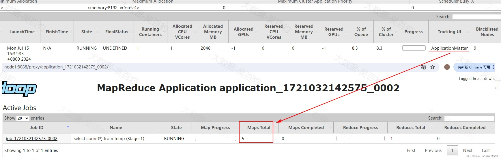

*(⚠️ 图片缺失:源知识库原图已失效)*

#### 5.5.8.2 **Reduce Task并行度设置**

进行并行度调节时绝大多数调节的主要是Reduce Task个数，可以通过设置“mapred.reduce.tasks”参数进行Reduce Task个数设置，该值默认为-1 ，表示Hive 能够根据具体作业的特征和集群资源的情况，动态地决定适当的 reduce 任务数，从而优化性能和资源利用。在Hive中计算Reduce Task个数的公式如下：

```plain
reduce_task_num = min(hive.exec.reducers.max，总输入数据量/hive.exec.reducers.bytes.per.reducer)
```

- hive.exec.reducers.max：reduce短可设置的最大并行度，默认1009。

- hive.exec.reducers.bytes.per.reducer:单个reduce task处理的数据量，默认值为256000000，约等于256M。

用户也可以设置该参数为正值来设置Reduce Task个数。注意：在本地模式中，改参数默认值为1。

```plain
#查看 mapred.reduce.tasks默认值
set mapred.reduce.tasks;
+-------------------------+
|           set           |
+-------------------------+
| mapred.reduce.tasks=-1  |
+-------------------------+

#设置 mapred.reduce.tasks为4
set mapred.reduce.tasks=4;

#执行如下sql
select col1,count(*) from temp group by col1;
```

执行完成可以通过Yarn WebUI看到Job Reduce Task个数为设置值5。

*(⚠️ 图片缺失:源知识库原图已失效)*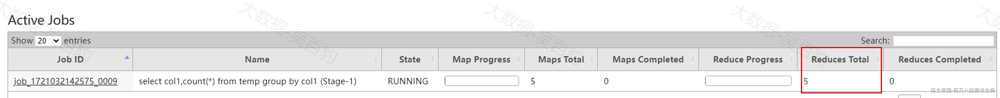

注意：执行的SQL不能是只有一个聚合结果的SQL，否则看不到Reduce多并行度处理数据的效果。此外，reduce个数并不是越多越好，过多的启动和初始化reduce也会消耗时间和资源；另外过多的reduce会生成很多个结果文件，同样产生了小文件的问题。

### **5.5.9 Map-Side 预聚合**

在Hive中Map-Side预聚合是一种优化技术，可以减少Shuffle阶段的数据量和网络传输成本。HQL转换成MapReduce任务执行，Map阶段的输出会被shuffle并根据key进行排序，然后发送给Reduce阶段进行进一步处理，对于聚合操作场景，Map-side预聚合允许在Map任务结束之前对数据进行局部聚合，可以显著减少Reduce阶段需要处理的数据量。

Map-Side预聚合相关参数如下：

- **hive.map.aggr**

该参数表示在group by语句中是否开启map端预聚合，默认为true，建议设为true。

- **hive.map.aggr.hash.min.reduction**

该参数控制聚合查询时表是否适合执行Map-side预聚合，默认值为0.99。判断方式：首先对若干条数据（hive.groupby.mapaggr.checkinterval设置）进行map-side聚合，聚合后的结果条数与聚合前的条数比例如果小于该值，则认为表聚合查询适合进行map-side聚合，否则不适合。建议设置为默认值。

- **hive.groupby.mapaggr.checkinterval**

该参数是用于判断源表是否适合map端预聚合的条数，默认值100000。建议设置为默认值。

- **hive.map.aggr.hash.force.flush.memory.threshold**

该参数表示Map-Side聚合使用到的hash表占用map task 堆内存最大比例，默认值0.9，超过该值，则会将hash 表强制刷写磁盘。

### **5.5.10 建表指定分区和压缩格式**

Hive在做Select查询时，一般会扫描整个表内容，会消耗较多时间去扫描不关注的数据。此时可根据业务需求及其查询维度，建立合理的表分区，从而提高查询效率。

同时为了使数据在传输上更小，处理起来更快，可以对Hive数据进行压缩。

- 在实际开发中，Hive表的数据存储格式一般选择 orc或者parquet，压缩方式一般选择lzo/snappy。所以常见的存储格式及压缩组合为orc+lzo、orc+snappy、parquet+lzo、parquet+snappy。

- 如果使用orc存储格式表，建表时指定压缩格式时tabproperties参数为“orc.compress”;如果使用parquet存储格式表，建表时指定压缩格式时tabproperties参数为“parquet.compression”

### **5.5.11 Count(distinct)去重优化**

由于COUNT DISTINCT操作需要用一个Reduce Task来完成，这一个Reduce需要处理的数据量太大，就会导致整个Job很难完成。如果数据量小无所谓，数据量大时一般COUNT DISTINCT使用先GROUP BY再COUNT的方式替换。

如下查询：

```plain
select count(distinct col1) from temp;
可以转换为如下sql:
select count(col1) from (select col1 from temp group by col1) t;
```

以上两个SQL计算效果都是一样，第一个SQL只有1个Reduce Task进行全量数据处理，而第二个SQL 转换完之后多出一个job进行计数，第一个Job进行子查询，Reduce Task可以有多个，第二个job进行计数。如果当数据量过大时，转换成下面的SQL速度提升很明显。

### **5.5.12 Hive小文件优化**

小文件通常指的是比HDFS Block块要小很多的文件，在Hive中存在小文件的主要原因如下：

- 数据源本身存在大量小文件，这些小文件可能是多次向Hive表插入/导入数据产生。

- HQL执行过程和写出结果产生大量小文件，由于Reduce Task数量多导致结果小文件多。

Hive中存在大量小文件除了会导致HDFS中元数据大占用内存多之外，还会导致在处理数据过程中每个小文件对应一个Map Task ，导致非常多的Map Task运行且处理的数据量小，影响性能和浪费资源。

解决Hive小文件问题可以考虑以下几个方面入手。

#### 5.5.12.1 **设置Map和Reduce端文件合并**

Map和Reduce端文件合并涉及到的参数如下：

- **hive.input.format**

该参数可以将多个小文件合并成一个文件被一个Map Task处理。默认值为org.apache.hadoop.hive.ql.io.CombineHiveInputFormat，即Map端合并小文件。该参数无需额外设置。

- **hive.merge.mapfiles**

该参数针对map only任务输出的小文件进行合并，默认值为true，如果存在小文件情况下，建议设置为true。

- **hive.merge.mapredfiles**

该参数设置为true时会在MapReduce任务执行完成后，对输出的小文件进行合并。默认值为false，如果存在小文件情况下，建议设置为true。

- **hive.merge.size.per.task**

该参数表示合并后文件大小上限，默认值为256000000byte，约256M。建议设置为默认值即可。

- **hive.merge.smallfiles.avgsize**

该参数表示触发小文件合并的文件阈值，如果MR任务输出的所有文件平均值小于该值，Hive将启动一个额外的map-reduce作业，将输出文件合并为更大的文件。默认值为16000000byte，约16M。建议设置为默认值即可。

#### 5.5.12.2 **insert overwrite 合并文件**

如果一张表中小文件特别多，可以通过insert overwrite方式读取该表数据并重新插入覆盖到该表，这样会将多个小文件合并成一个大文件。

如下案例：

```plain
#创建表并多次插入数据，每次插入数据都会在表下生成一个小文件
create table small_file_tbl(
 id int,
 name string,
 age int
) row format delimited fields terminated by '\t';

#设置本地模式
set hive.exec.mode.local.auto=true;

#多次执行insert插入数据
insert into small_file_tbl values (1,'zs',18);
insert into small_file_tbl values (2,'ls',19);
insert into small_file_tbl values (3,'ww',20);
insert into small_file_tbl values (4,'ml',21);
insert into small_file_tbl values (5,'t1',22);

#查看生成的小文件
[root@node5 ~]# hdfs dfs -ls /user/hive/warehouse/small_file_tbl
/user/hive/warehouse/small_file_tbl/000000_0
/user/hive/warehouse/small_file_tbl/000000_0_copy_1
/user/hive/warehouse/small_file_tbl/000000_0_copy_2
/user/hive/warehouse/small_file_tbl/000000_0_copy_3
/user/hive/warehouse/small_file_tbl/000000_0_copy_4
```

执行insert overwrite 语句合并小文件：

```plain
#执行insert overwrite table ...语句合并小文件
insert overwrite table small_file_tbl select * from small_file_tbl;

#查询表路径下文件，将多个文件合并成1个文件
[root@node5 ~]# hdfs dfs -ls /user/hive/warehouse/small_file_tbl
/user/hive/warehouse/small_file_tbl/000000_0
```

#### 5.5.12.3 **使用HDFS CONCAT命令合并小文件**

hdfs 中concat命令可以合并多个小文件，使用命令如下：

```plain
hadoop fs -concat target_file source_file1 source_file2 ... ...
```

以上命令参数解释如下：

- target\_file:将多个文件合并到的文件名称。

- source\_filex:多个小文件名称，合并后文件自动删除。

在Hive中可以通过hdfs dfs -concat 命令来合并多个小文件为一个文件，示例如下：

```plain
#删除重建表small_file_tbl
drop table small_file_tbl;
create table small_file_tbl(
 id int,
 name string,
 age int
) row format delimited fields terminated by '\t';

#设置本地模式
set hive.exec.mode.local.auto=true;

#多次执行insert插入数据
insert into small_file_tbl values (1,'zs',18);
insert into small_file_tbl values (2,'ls',19);
insert into small_file_tbl values (3,'ww',20);
insert into small_file_tbl values (4,'ml',21);
insert into small_file_tbl values (5,'t1',22);

#查看生成的小文件
[root@node5 ~]# hdfs dfs -ls /user/hive/warehouse/small_file_tbl
/user/hive/warehouse/small_file_tbl/000000_0
/user/hive/warehouse/small_file_tbl/000000_0_copy_1
/user/hive/warehouse/small_file_tbl/000000_0_copy_2
/user/hive/warehouse/small_file_tbl/000000_0_copy_3
/user/hive/warehouse/small_file_tbl/000000_0_copy_4
```

通过hdfs dfs -concat 命令合并多个小文件：

```plain
#将其他小文件合并到 /user/hive/warehouse/small_file_tbl/000000_0中
[root@node5 ~]# hdfs dfs -concat /user/hive/warehouse/small_file_tbl/000000_0 /user/hive/warehouse/small_file_tbl/000000_0_copy_1 /user/hive/warehouse/small_file_tbl/000000_0_copy_2 /user/hive/warehouse/small_file_tbl/000000_0_copy_3 /user/hive/warehouse/small_file_tbl/000000_0_copy_4

#查看路径下数据
[root@node5 ~]# hdfs dfs -ls /user/hive/warehouse/small_file_tbl
/user/hive/warehouse/small_file_tbl/000000_0

#查看表中数据
select * from small_file_tbl;
+--------------------+----------------------+---------------------+
| small_file_tbl.id  | small_file_tbl.name  | small_file_tbl.age  |
+--------------------+----------------------+---------------------+
| 1                  | zs                   | 18                  |
| 2                  | ls                   | 19                  |
| 3                  | ww                   | 20                  |
| 4                  | ml                   | 21                  |
| 5                  | t1                   | 22                  |
+--------------------+----------------------+---------------------+
```

#### 5.5.12.4 **使用HDFS HAR 归档小文件**

HDFS中存储小文件时，每个小文件都会对应一个block块，每个block的元数据都会占用NameNode内存，当系统中存储大量小文件时，这些文件的元数据会迅速耗尽NameNode节点的内存资源，从而影响HDFS正常使用，为了解决这个问题，Hadoop Archives(HAR)被引入。

HAR是一种有效的存档工具，能够将多个小文件归档成一个文件，并且在归档后仍然保持了对每个文件的透明访问。通过将文件存储为HDFS块的方式，HDFS存档文件能够降低NameNode内存的使用率，从而减轻了存储大量小文件所带来的压力。

注意：假设小文件数据为1M ，那么会对应到一个block上，但是实际占用磁盘空间是1M ，HAR可以将所有小文件合并归档为一个大的文件，形成少量block存储这些数据，从而减少元数据占用空间。

HAR使用语法如下：

```plain
$hadoop archive -archiveName name -p <parent> <src>* <dest>
```

- -archiveName ：指定要创建的归档文件夹目录的名字，archive的名字扩展名**必须是**\*.har，例如：test.har。

- -p：指定要存档文件的父路径，例如：/a/b/c、/a/b/d两个路径下的文件要被归档，那么-p可以指定为/a/b 即：/a/b/c、/a/b/d的父路径，然后再分别指定为c或者d。

- src：指定待归档小文件路径，可以指定多个，空格隔开即可。

- dest：指定归档文件输出路径。

以上HAR命令会转换成MapReduce任务进行文件归档处理。按照如下步骤进行Hive小文件归档测试。

```plain
#删除重建表small_file_tbl
drop table small_file_tbl;
create table small_file_tbl(
 id int,
 name string,
 age int
) row format delimited fields terminated by '\t';

#设置本地模式
set hive.exec.mode.local.auto=true;

#多次执行insert插入数据
insert into small_file_tbl values (1,'zs',18);
insert into small_file_tbl values (2,'ls',19);
insert into small_file_tbl values (3,'ww',20);
insert into small_file_tbl values (4,'ml',21);
insert into small_file_tbl values (5,'t1',22);
```

目前在“/user/hive/warehouse/small\_file\_tbl”目录下存在多个小文件，通过HAR归档命令将该目录下的小文件进行合并。

```plain
#归档 /user/hive/warehouse/small_file_tbl 目录中的小文件到指定目录中
[root@node5 ~]# hadoop archive -archiveName test.har -p /user/hive/warehouse/small_file_tbl /mergefile

#查看归档文件
[root@node5 ~]# hdfs dfs -ls /mergefile/test.har
/mergefile/test.har/_SUCCESS
/mergefile/test.har/_index
/mergefile/test.har/_masterindex
/mergefile/test.har/part-0
```

以上“\_SUCCESS”是标记文件；“\_index”和“\_masterindex”是索引文件，通过索引文件可以找到对应的原文件；“part-0”是多个原小文件的集合文件。

创建Hive外表映射归档路径中的数据，这样就将小文件数据合并完成。

```plain
#创建外表映射归档数据
create table small_file_tbl2(
 id int,
 name string,
 age int
) row format delimited fields terminated by '\t' 
location 'hdfs://mycluster/mergefile/test.har';

#查询表中数据
select * from small_file_tbl2;
+---------------------+-----------------------+----------------------+
| small_file_tbl2.id  | small_file_tbl2.name  | small_file_tbl2.age  |
+---------------------+-----------------------+----------------------+
| 1                   | zs                    | 18                   |
| 2                   | ls                    | 19                   |
| 3                   | ww                    | 20                   |
| 4                   | ml                    | 21                   |
| 5                   | t1                    | 22                   |
+---------------------+-----------------------+----------------------+
```

### **5.5.13 Hive join优化**

使用Hive Join语句时，如果数据量大，可能造成SQL执行速度和查询速度慢，可以进行join优化，Join优化可分为Map Join、Bucket Map Join、Sort Merge Bucket MapJoin、Join 顺序优化，下面分别进行介绍。

#### 5.5.13.1 **Map Join**

Hive Map Join适合大表 Join 小表场景，可以将小表数据加载到内存中与大表进行关联，SQL转换的MR任务只有Map阶段没有Reduce阶段,Map Join原理是在Map任务前起了一个MapReduce Local Task，这个Task通过TableScan读取小表内容到本机，在本机以HashTable的形式保存并写入硬盘上传到HDFS，并在distributed cache中保存，在Map Task中从本地磁盘或者distributed cache中读取小表内容直接与大表join得到结果并输出。

*(⚠️ 图片缺失:源知识库原图已失效)*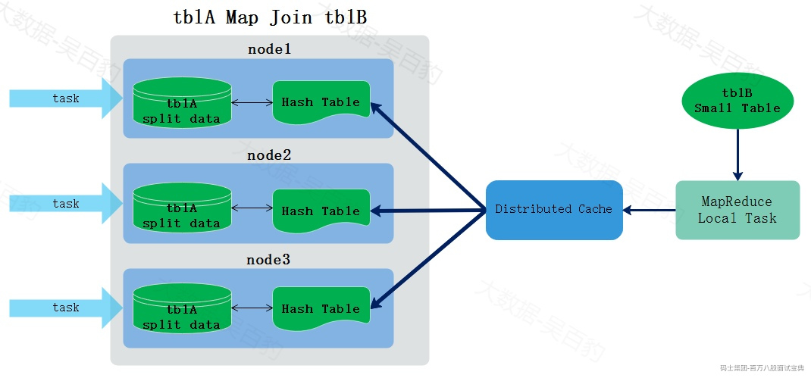

关于Map Join的相关参数如下：

- hive.auto.convert.join:该参数决定是否自动优化普通join为map join，默认为true，建议设置为true。如果不能转换成map join，自动执行common join，即转换成MR任务执行。

- hive.mapjoin.smalltable.filesize:该参数 设定小表文件大小阈值，默认25000000byte，约25M，即所有文件输入总大小小于该值的表都会看做小表加载到内存，根据实际情况设置该值，该值描述的是表文件大小，加载到内存中占用内存空间更大。

注意：使用Map Join时需要注意小表不能过大，如果小表将内存基本用尽，会使整个系统性能下降甚至出现内存溢出的异常。

案例：创建 orders、customers、products三张表并向表中插入数据，进行表数据关联，演示多表关联map join情况。

```plain
#本地模式运行
set hive.exec.mode.local.auto=true;

#创建表及插入数据
drop table orders;
create table orders (
  order_id int,
  customer_id int,
  product_id int ,
  order_dt string
) row format delimited fields terminated by '\t';
INSERT INTO orders VALUES 
(1, 1, 1, '2024-08-01'),
(2, 1, 2, '2024-08-02'),
(3, 2, 3, '2024-08-03'),
(4, 2, 4, '2024-08-04'),
(5, 3, 5, '2024-08-05'),
(6, 3, 1, '2024-08-06'),
(7, 4, 2, '2024-08-07'),
(8, 4, 3, '2024-08-08'),
(9, 5, 4, '2024-08-09'),
(10, 5, 5, '2024-08-10'),
(11, 6, 1, '2024-08-11'),
(12, 6, 2, '2024-08-12'),
(13, 7, 3, '2024-08-13'),
(14, 7, 4, '2024-08-14'),
(15, 8, 5, '2024-08-15'),
(16, 8, 1, '2024-08-16'),
(17, 9, 2, '2024-08-17'),
(18, 9, 3, '2024-08-18'),
(19, 10, 4, '2024-08-19'),
(20, 10, 5, '2024-08-20'),
(21, 1, 1, '2024-08-21'),
(22, 2, 2, '2024-08-22'),
(23, 3, 3, '2024-08-23'),
(24, 4, 4, '2024-08-24'),
(25, 5, 5, '2024-08-25'),
(26, 6, 1, '2024-08-26'),
(27, 7, 2, '2024-08-27'),
(28, 8, 3, '2024-08-28'),
(29, 9, 4, '2024-08-29'),
(30, 10, 5, '2024-08-30');

drop table customers;
create table customers (
    customer_id int ,
    customer_name string 
) row format delimited fields terminated by '\t';

INSERT INTO customers VALUES 
(1, 'Customer A'),
(2, 'Customer B'),
(3, 'Customer C'),
(4, 'Customer D'),
(5, 'Customer E'),
(6, 'Customer F'),
(7, 'Customer G'),
(8, 'Customer H'),
(9, 'Customer I'),
(10, 'Customer J');

drop table products;
create table products (
    product_id int ,
    product_name string 
) row format delimited fields terminated by '\t';

INSERT INTO products VALUES 
(1, 'Product 1'),
(2, 'Product 2'),
(3, 'Product 3'),
(4, 'Product 4'),
(5, 'Product 5');

#集群模式运行
set hive.exec.mode.local.auto=false;

#可以通过如下命令查看表占用空间大小
desc formatted orders ;
+-------------------------------+----------------------------------------------------+----------------------------------------------------+
|           col_name            |                     data_type                      |                      comment                       |
+-------------------------------+----------------------------------------------------+----------------------------------------------------+
|                               | rawDataSize                                        | 504                                                |
|                               | totalSize                                          | 534                                                |
+-------------------------------+----------------------------------------------------+----------------------------------------------------+
注意：rawDataSize表示原始数据大小（不包括文件格式、压缩等开销），totalSize表示表中数据的总大小，包括文件格式和压缩等开销。
```

由于在Hive4.x中mapjoin执行报错，这里不再演示三表关联结果，而是查看SQL执行计划来观察map join过程。

- **默认开启map join ,查看join sql 执行计划**

```plain
#explain sql 
explain select 
  a.order_id,b.customer_name,c.product_name 
from orders a 
join customers b on a.customer_id = b.customer_id 
join products c on a.product_id = c.product_id;

#执行计划结果
+----------------------------------------------------+
|                      Explain                       |
+----------------------------------------------------+
| STAGE DEPENDENCIES:                                |
|   Stage-7 is a root stage                          |
|   Stage-5 depends on stages: Stage-7               |
|   Stage-0 depends on stages: Stage-5               |
|                                                    |
| STAGE PLANS:                                       |
|   Stage: Stage-7                                   |
|     Map Reduce Local Work                          |
|       Alias -> Map Local Tables:                   |
|         $hdt$_1:b                                  |
|           Fetch Operator                           |
|             limit: -1                              |
|         $hdt$_2:c                                  |
|           Fetch Operator                           |
|             limit: -1                              |
|       Alias -> Map Local Operator Tree:            |
|         $hdt$_1:b                                  |
|           TableScan                                |
|             alias: b                               |
... ...
|         $hdt$_2:c                                  |
|           TableScan                                |
|             alias: c                               |
... ...
|                                                    |
|   Stage: Stage-5                                   |
|     Map Reduce                                     |
|       Map Operator Tree:                           |
|           TableScan                                |
|             alias: a                               |
... ...
|                 Map Join Operator                  |
|                   condition map:                   |
|                        Inner Join 0 to 1           |
|                   keys:                            |
|                     0 _col1 (type: int)            |
|                     1 _col0 (type: int)            |
|                   outputColumnNames: _col0, _col2, _col4 |
... ...
|                   Map Join Operator                |
|                     condition map:                 |
|                          Inner Join 0 to 1         |
|                     keys:                          |
|                       0 _col2 (type: int)          |
|                       1 _col0 (type: int)          |
|                     outputColumnNames: _col0, _col4, _col6 |
... .... 
|                                                    |
|   Stage: Stage-0                                   |
|     Fetch Operator                                 |
|       limit: -1                                    |
|       Processor Tree:                              |
|         ListSink                                   |
|                                                    |
+----------------------------------------------------+
```

通过以上执行计划可以看到默认在Hive中开启了map join ，会自动将小表进行缓存到内存中，只有map端操作，没有reduce操作。join中至少要有1个基表，orders相对较大作为了join的基表，其他表作为小表进行了缓存。

- **关闭map join ，查看join sql执行计划**

```plain
#关闭mapjoin
set hive.auto.convert.join=false;

#explain sql 
explain select 
  a.order_id,b.customer_name,c.product_name 
from orders a 
join customers b on a.customer_id = b.customer_id 
join products c on a.product_id = c.product_id;

#执行计划结果
+----------------------------------------------------+
|                      Explain                       |
+----------------------------------------------------+
| STAGE DEPENDENCIES:                                |
|   Stage-1 is a root stage                          |
|   Stage-2 depends on stages: Stage-1               |
|   Stage-0 depends on stages: Stage-2               |
|                                                    |
| STAGE PLANS:                                       |
|   Stage: Stage-1                                   |
|     Map Reduce                                     |
|       Map Operator Tree:                           |
|           TableScan                                |
|             alias: a                               |
... ...
|           TableScan                                |
|             alias: b                               |
... ...
|       Reduce Operator Tree:                        |
|         Join Operator                              |
|           condition map:                           |
|                Inner Join 0 to 1                   |
|           keys:                                    |
|             0 _col1 (type: int)                    |
|             1 _col0 (type: int)                    |
|           outputColumnNames: _col0, _col2, _col4   |
... ...
|   Stage: Stage-2                                   |
|     Map Reduce                                     |
|       Map Operator Tree:                           |
|           TableScan                                |
|             Reduce Output Operator                 |
... ...
|           TableScan                                |
|             alias: c                               |
... ...
|       Reduce Operator Tree:                        |
|         Join Operator                              |
|           condition map:                           |
|                Inner Join 0 to 1                   |
|           keys:                                    |
|             0 _col2 (type: int)                    |
|             1 _col0 (type: int)                    |
|           outputColumnNames: _col0, _col4, _col6   |
... ...
|   Stage: Stage-0                                   |
|     Fetch Operator                                 |
|       limit: -1                                    |
|       Processor Tree:                              |
|         ListSink                                   |
|                                                    |
+----------------------------------------------------+
```

我们可以看到如果没有使用map join,表 a和表b先进行join，结果再与表c进行join，执行了两次MapReduce任务完成三表关联操作。

#### 5.5.13.2 **Bucket Map Join**

Bucket Map Join可以看成是对Map Join的改进，Map Join适合大表Join小表场景，如果两张表都比较大，就无法将一张表数据缓存到内存中进行Join，这时可以使用Bucket Map Join。

Bucket Map Join适合大表Join大表场景，使用Bucket Map Join时要求**两张Join表都是分桶表，并且按照分桶字段进行关联，此外还要求一张表分桶数是另外一张表的整数倍**。其原理是在对应的节点上只需要将另外一张表对应的bucket桶数据进行缓存即可，不需要缓存表所有数据，这样就可以实现高效率的Join操作，要求一张表分桶数是另外一张表的整数倍的原因是保证两张表分桶之间有确定的对应关系。

下图是Bucket Map Join示意图，有tblA 和 tblB两个分桶表，两表都是按照关联字段id进行分桶，tblA 分了6个桶（假设每个桶中id分别为0,1,2,3,4,5），tblB分了2个桶(假设桶0中id为0,2,4；桶1中id为1,3,5)，那么每个task进行Join关联时就可以缓存部分tblB中的数据，而不需要将tblB整个表都进行缓存处理。

*(⚠️ 图片缺失:源知识库原图已失效)*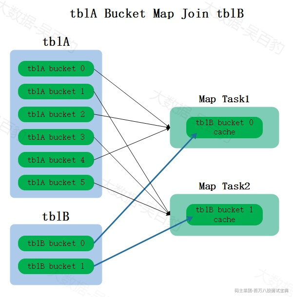

开启Bucket Map Join参数为\*\*hive.optimize.bucketmapjoin，\*\*该参数表示是否开启bucket map join 功能，默认为false，关闭。按照需要进行开启。

Hive中开启bucket map join后，编写sql需要通过hint提示语法来指定将哪个表的分桶信息进行缓存，Hive中hint语法已经过时，不建议使用，如果在使用bucket map join时需要使用，那么需要将如下两个参数关闭：

```plain
#该参数表示是否忽略SQL中的hint语法，默认为true，使用hint需要设置为false
set hive.ignore.mapjoin.hint=false

#该参数表示关闭cbo优化，默认为true。开启cbo优化也会忽略sql中的hint语法，所以需要关闭。
set hive.cbo.enable=false
```

案例：准备两张分桶表bucket\_users、bucket\_orders，两张表都是按照user\_id进行分桶，并且按照user\_id进行Join关联。假设两张表都比较大不能全部放在内存中进行Map Join优化，尝试使用bucket map join进行优化。

准备两张分桶表及数据：

```plain
#建表及插入数据
create table bucket_users (
  user_id int,
  name string,
  age int
)
clustered by (user_id) into 2 buckets
row format delimited fields terminated by '\t';

INSERT INTO bucket_users VALUES
(1,'zs',18),
(2,'ls',19),
(3,'ww',20),
(4,'ml',21),
(5,'tq',22);

create table bucket_orders (
  order_id int,
  user_id int,
  amount double
)
clustered by (user_id) into 4 buckets
row format delimited fields terminated by '\t';

INSERT INTO bucket_orders VALUES
(101, 1, 250.50),
(102, 2, 75.20),
(103, 3, 33.33),
(104, 4, 150.00),
(105, 5, 200.00),
(106, 1, 99.99),
(107, 2, 45.75),
(108, 3, 300.10),
(109, 4, 60.00),
(110, 5, 500.00);
```

- **不使用map join 和bucket map join**

```plain
#模拟两张大表，不能使用map join，所以设置参数关闭map join
set hive.auto.convert.join=false;

#通过explain查看join sql的执行计划
explain select 
 b.order_id,a.name,b.amount 
from bucket_users a join bucket_orders b on a.user_id=b.user_id;
+----------------------------------------------------+
|                      Explain                       |
+----------------------------------------------------+
| STAGE DEPENDENCIES:                                |
|   Stage-1 is a root stage                          |
|   Stage-0 depends on stages: Stage-1               |
|                                                    |
| STAGE PLANS:                                       |
|   Stage: Stage-1                                   |
|     Map Reduce                                     |
|       Map Operator Tree:                           |
|           TableScan                                |
|             alias: a                               |
... ...
|           TableScan                                |
|             alias: b                               |
... ...
|       Reduce Operator Tree:                        |
|         Join Operator                              |
|           condition map:                           |
|                Inner Join 0 to 1                   |
|           keys:                                    |
|             0 _col0 (type: int)                    |
|             1 _col1 (type: int)                    |
|           outputColumnNames: _col1, _col2, _col4   |
... ...
|   Stage: Stage-0                                   |
|     Fetch Operator                                 |
|       limit: -1                                    |
|       Processor Tree:                              |
|         ListSink                                   |
|                                                    |
+----------------------------------------------------+
```

可以看到join sql 执行计划中通过MapReduce作业进行了Join操作，没有使用Map Join，也没有使用Bucket Map Join。

- **使用 bucket map join**

```plain
#设置参数使用bucket map join
#开启bucket map join
set hive.optimize.bucketmapjoin=true;
#关闭hint检查
set hive.ignore.mapjoin.hint=false;
#不使用cbo优化
set hive.cbo.enable=false;

#通过explain查看join sql的执行计划
explain select /*+ mapjoin(a) */
 b.order_id,a.name,b.amount 
from bucket_users a join bucket_orders b on a.user_id=b.user_id;
+----------------------------------------------------+
|                      Explain                       |
+----------------------------------------------------+
| STAGE DEPENDENCIES:                                |
|   Stage-3 is a root stage                          |
|   Stage-1 depends on stages: Stage-3               |
|   Stage-0 depends on stages: Stage-1               |
|                                                    |
| STAGE PLANS:                                       |
|   Stage: Stage-3                                   |
|     Map Reduce Local Work                          |
|       Alias -> Map Local Tables:                   |
|         a                                          |
|           Fetch Operator                           |
|             limit: -1                              |
|       Alias -> Map Local Operator Tree:            |
|         a                                          |
|           TableScan                                |
|             alias: a                               |
... ...
|                                                    |
|   Stage: Stage-1                                   |
|     Map Reduce                                     |
|       Map Operator Tree:                           |
|           TableScan                                |
|             alias: b                               |
... ...
|               Map Join Operator                    |
|                 condition map:                     |
|                      Inner Join 0 to 1             |
|                 keys:                              |
|                   0 user_id (type: int)            |
|                   1 user_id (type: int)            |
|                 outputColumnNames: _col1, _col7, _col9 |
... ...
|       Execution mode: vectorized                   |
|       Local Work:                                  |
|         Map Reduce Local Work                      |
|                                                    |
|   Stage: Stage-0                                   |
|     Fetch Operator                                 |
|       limit: -1                                    |
|       Processor Tree:                              |
|         ListSink                                   |
|                                                    |
+----------------------------------------------------+
```

以上join sql中使用了 hint语句“/\*+ mapjoin(a) \*/”来指定表 “bucket\_users a ”作为缓存bucket表与另外表进行关联，如果 SQL语句中给表指定了别名，这里hint语句中必须指定表的别名。

通过explain join sql可以看到sql执行使用的map join，但是无法看出是否是bucket map join，可以通过“explain extended sql” 来查看map join类型。

```plain
#explain extended sql
explain extended select /*+ mapjoin(a) */
 b.order_id,a.name,b.amount 
from bucket_users a join bucket_orders b on a.user_id=b.user_id;
```

在以上explain执行结果中可以看到“BucketMapJoin: true”信息，说明当前bucket map join已经生效。

#### 5.5.13.3 **Sort Merge Bucket MapJoin**

Sort Merge Bucket Map Join 简称 SMB Map Join，其与Bucket Map Join非常类似（也可以看成Bucket Map Join一种情况），也是适合两张大表进行Join关联场景，也要求**两张Join表都是分桶表、一张表分桶数是另外一张表的整数倍、并且Join按照分桶字段进行关联，与Bucket Map Join不同的是 SMB Map Join还要求桶内的表数据按照分桶字段有序。**

除了桶内的表数据按照分桶字段有序这点区别之外， SMB Map Join与Bucket Map Join两者在Join方式上也有区别：Bucket Map Join是将一张分桶表的桶数据进行缓存与另外一张表进行Join关联来避免shuffle操作，而SMB Map Join由于两表中关联字段就是分桶列，且分桶类内的数据有序，那么Mapper就可以依次获取两张表中相同桶内的相同数据进行Join关联，而不进行当前桶数据缓存，同样达到避免shuffle过程。

SMB Map Join相关参数如下：

- **hive.auto.convert.sortmerge.join**

该参数表示是否启动自动转换SMB Join，默认为true，建议设置为true。

- **hive.optimize.bucketmapjoin.sortedmerge**

该参数表示是否启用SMB Map Join，默认值为false，使用SMB Map Join 建议设置为true开启。

案例：准备两张分桶表bucket\_sort\_users、bucket\_sort\_orders，两张表都是按照user\_id进行分桶、按照user\_id进行排序，并且按照user\_id进行Join关联。假设两张表都比较大不能全部放在内存中进行Map Join优化，也不能将某个bucket桶数据进行缓存，尝试使用Sort Merge Bucket map join进行优化。

准备两张分桶表及数据，两张分桶表一定要按照分桶列进行排序：

```plain
#创建两张分桶表，并按照user_id分桶和排序
create table bucket_sort_users (
  user_id int,
  name string,
  age int
)
clustered by (user_id) sorted by (user_id) into 2 buckets
row format delimited fields terminated by '\t';

INSERT INTO bucket_sort_users VALUES
(1,'zs',18),
(2,'ls',19),
(3,'ww',20),
(4,'ml',21),
(5,'tq',22);

create table bucket_sort_orders (
  order_id int,
  user_id int,
  amount double
)
clustered by (user_id) sorted by (user_id) into 4 buckets
row format delimited fields terminated by '\t';

INSERT INTO bucket_sort_orders VALUES
(101, 1, 250.50),
(102, 2, 75.20),
(103, 3, 33.33),
(104, 4, 150.00),
(105, 5, 200.00),
(106, 1, 99.99),
(107, 2, 45.75),
(108, 3, 300.10),
(109, 4, 60.00),
(110, 5, 500.00);
```

这里不再演示正常执行MapReduce 过程的Join操作，而是直接使用Sort Merge Bucket Map Join优化：

```plain
#开启自动转换SMB Join
set hive.auto.convert.sortmerge.join=true;
#启动Sort Merge Bucket Map Join优化
set hive.optimize.bucketmapjoin.sortedmerge=true;

#查看explain join sql
explain select 
 b.order_id,a.name,b.amount 
from bucket_sort_users a join bucket_sort_orders b on a.user_id=b.user_id;
+----------------------------------------------------+
|                      Explain                       |
+----------------------------------------------------+
| STAGE DEPENDENCIES:                                |
|   Stage-1 is a root stage                          |
|   Stage-0 depends on stages: Stage-1               |
|                                                    |
| STAGE PLANS:                                       |
|   Stage: Stage-1                                   |
|     Map Reduce                                     |
|       Map Operator Tree:                           |
|           TableScan                                |
|             alias: b                               |
... ...
|                 Sorted Merge Bucket Map Join Operator |
|                   condition map:                   |
|                        Inner Join 0 to 1           |
|                   keys:                            |
|                     0 _col0 (type: int)            |
|                     1 _col1 (type: int)            |
|                   outputColumnNames: _col1, _col2, _col4 |
... ...
|                                                    |
|   Stage: Stage-0                                   |
|     Fetch Operator                                 |
|       limit: -1                                    |
|       Processor Tree:                              |
|         ListSink                                   |
|                                                    |
+----------------------------------------------------+
```

使用Sort Merge Bucket Map Join不需再使用hint语句，直接正常编写Join SQL 即可，通过以上explain join 可以看到两表关联使用了Sort Merge Bucket Map Join优化。

#### 5.5.13.4 **Join 顺序优化**

当有3张及以上大表进行Join时，选择不同的Join顺序，执行时间可能存在较大差异，使用恰当的Join顺序可以有效缩短任务执行时间。虽然有CBO优化默认会进行join顺序调整，但是如果表存在数据倾斜或者查询条件值在表中不存在的情况，可能调整出非最优的join顺序，可以根据表中数据量大小和业务关联关系，人为调整表关联顺序，多表Join 顺序原则：优先关联Join出来结果较小的表，将这些表前置，可以加快数据处理结果。

例如，customer表的数据量最多，orders表和lineitem表优先Join可获得较少的中间结果。

```plain
#优化前SQL
select
  l_orderkey,
  sum(l_extendedprice * (1 - l_discount)) as revenue,
  o_orderdate,
  o_shippriority
from
  customer,
  orders,
  lineitem
where
  c_mktsegment = 'BUILDING'
  and c_custkey = o_custkey
  and l_orderkey = o_orderkey
  and o_orderdate < '1995-03-22'
  and l_shipdate > '1995-03-22'
limit 10;

#优化后SQL
select
  l_orderkey,
  sum(l_extendedprice * (1 - l_discount)) as revenue,
  o_orderdate,
  o_shippriority
from
  orders,
  lineitem,
  customer
where
  c_mktsegment = 'BUILDING'
  and c_custkey = o_custkey
  and l_orderkey = o_orderkey
  and o_orderdate < '1995-03-22'
  and l_shipdate > '1995-03-22'
limit 10;
```

### **5.5.14 数据倾斜处理**

在Hive中，数据倾斜（Data Skew）是指在执行SQL查询时，某些任务（task）处理的数据量显著多于其他任务，导致负载不均衡，从而影响查询的整体性能。这种现象通常发生在数据分布不均的表分组聚合或者表Join连接操作时。

根据不同操作，Hive数据倾斜解决方式不同，下面对Hive中数据倾斜解决方式进行介绍。

首先准备数据表：company\_tbl（物流公司表）和ship\_tbl（货运订单表），如下是建表及向表中加载数据操作：

```plain
#将资料中“company_data.txt”和“ship_orders.txt”上传到HDFS 根目录下
[root@node5 ~]# hdfs dfs -put ./company_data.txt /
[root@node5 ~]# hdfs dfs -put ./ship_orders.txt /

#在Hive中创建两表及加载数据
drop table company_tbl;
create table company_tbl (
    company_id string,
    company_name string,
    phone_number string,
    founded_year string
)
row format delimited fields terminated by ',';
load data inpath '/company_data.txt' into table company_tbl;

drop table ship_tbl;
create table ship_tbl (
    shiporder_id string,
    company_id string,
    origin string,
    destination string,
    weight_kg double,
    cost decimal(8,2),
    dt string
)
row format delimited fields terminated by ',';
load data inpath '/ship_orders.txt' into table ship_tbl;

#查询表中数据
select * from company_tbl limit 5;
+-------------------------+---------------------------+---------------------------+---------------------------+
| company_tbl.company_id  | company_tbl.company_name  | company_tbl.phone_number  | company_tbl.founded_year  |
+-------------------------+---------------------------+---------------------------+---------------------------+
| COMP0001                | Company1                  | 374-627-1427              | 2007                      |
| COMP0002                | Company2                  | 327-112-2248              | 2003                      |
| COMP0003                | Company3                  | 547-462-7627              | 2014                      |
| COMP0004                | Company4                  | 996-317-4763              | 2002                      |
| COMP0005                | Company5                  | 488-390-9510              | 2012                      |
+-------------------------+---------------------------+---------------------------+---------------------------+

select * from ship_tbl limit 5;
+------------------------+----------------------+------------------+-----------------------+---------------------+----------------+--------------
+| ship_tbl.shiporder_id  | ship_tbl.company_id  | ship_tbl.origin  | ship_tbl.destination  | ship_tbl.weight_kg  | ship_tbl.cost  | ship_tbl.dt  
|+------------------------+----------------------+------------------+-----------------------+---------------------+----------------+--------------
+| SHIP0000001            | COMP1162             | 贵阳               | 拉萨                    | 73.55               | 567.49         | 2003-07-1
4   || SHIP0000002            | COMP0001             | 南昌               | 汕头                    | 24.71               | 4700.98        | 2015-05-1
1   || SHIP0000003            | COMP0001             | 大连               | 石家庄                   | 85.95               | 2626.96        | 2002-02-
06   || SHIP0000004            | COMP0001             | 兰州               | 哈尔滨                   | 67.75               | 4590.3         | 2024-12-
16   || SHIP0000005            | COMP0001             | 郑州               | 洛阳                    | 32.16               | 3660.73        | 2022-01-2
6   |+------------------------+----------------------+------------------+-----------------------+---------------------+----------------+--------------
+
```

以上两表中，ship\_tbl表中数据90% 都是“COMP0001”公司，存在严重数据倾斜。

#### 5.5.14.1 **开启MR JobHistoryServer**

在Yarn中运行MapReduce程序时，task会被发送到不同的NodeManager节点上执行，在MR 任务执行的过程中我们可以通过Yarn WebUI中“ApplicationMaster”看到对应MapTask/ReduceTask执行细节。

*(⚠️ 图片缺失:源知识库原图已失效)*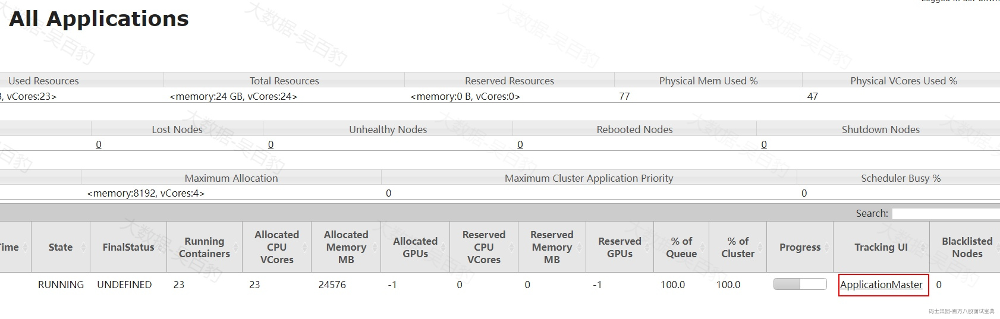

但是当任务执行完成后，就不能通过Yarn WebUI查看对应MapTask/ReduceTask执行情况，这时就需要通过开启MapReduce的JobHistoryServer历史日志服务器来将各个Container中运行的日志聚合保存下来。可以按照如下步骤配置Yarn历史日志服务器。

为了在Hive中可以清楚的看到数据倾斜处理效果，这里我们开启MR JobHistoryServer。

**1) 配置$HADOOP****\_****HOME/etc/hadoop/mapred-site.xml**

这里选择node3节点作为Yarn HistoryServer,在node3~node5节点配置$HADOOP\_HOME/etc/hadoop/mapred-site.xml，追加如下内容：

```plain
... ...  
    <!-- mr历史日志服务器通信端口-->
    <property>
        <name>mapreduce.jobhistory.address</name>

        <value>node3:10020</value>

    </property>

    <!--mr历史日志服务器webui端口-->
    <property>
        <name>mapreduce.jobhistory.webapp.address</name>

        <value>node3:19888</value>

    </property>

... ...
```

**2) 配置$HADOOP****\_****HOME/etc/hadoop/yarn-site.xml**

在所有的NodeManager节点上配置$HADOOP\_HOME/etc/hadoop/yarn-site.xml，开启日志聚合，开启日志聚合后，会将程序运行日志从各个Container收集保存起来。

这里在node3~node5节点上配置yarn-site.xml文件，追加如下内容：

```plain
.. ...  
    <!-- 是否需要开启日志聚合 -->
    <property>
        <name>yarn.log-aggregation-enable</name>

        <value>true</value>

    </property>

    <!-- 设置日志聚合服务器 -->
    <property>
        <name>yarn.log.server.url</name>

        <value>http://node3:19888/jobhistory/logs</value>

    </property>

    <!-- 历史日志在HDFS保存的时间，单位是秒，默认的是-1，表示永久保存，这里设置7天-->
    <property>
        <name>yarn.log-aggregation.retain-seconds</name>

        <value>604800</value>

    </property>

... ...
```

**3) 启动Yarn历史日志服务**

重启Hadoop集群，在node3节点上启动Yarn 历史日志服务器。

```plain
#重启HDFS集群
[root@node1 ~]# stop-all.sh 
[root@node1 ~]# start-all.sh 

#在node3节点上启动Yarn historyserver
[root@node3 ~]# mapred --daemon start historyserver
```

node3节点上启动Yarn HistoryServer之后，通过jps可以查看到 JobHistoryServer 进程，表示开启成功。

#### 5.5.14.2 **开启Map-Side预聚合**

在Hive中Map-Side预聚合是一种优化技术，可以减少Shuffle阶段的数据量和网络传输成本。HQL转换成MapReduce任务执行，Map阶段的输出会被shuffle并根据key进行排序，然后发送给Reduce阶段进行进一步处理，对于聚合操作场景，Map-side预聚合允许在Map任务结束之前对数据进行局部聚合，可以显著减少Reduce阶段需要处理的数据量，Map-Side预聚合可以解决数据倾斜的原因也在于此。

Map-Side预聚合相关参数如下：

- **hive.map.aggr**

该参数表示在group by语句中是否开启map端预聚合，默认为true，建议设为true。

- **hive.map.aggr.hash.min.reduction**

该参数控制聚合查询时表是否适合执行Map-side预聚合，默认值为0.99。判断方式：首先对若干条数据（hive.groupby.mapaggr.checkinterval设置）进行map-side聚合，聚合后的结果条数与聚合前的条数比例如果小于该值，则认为表聚合查询适合进行map-side聚合，否则不适合。建议设置为默认值。

- **hive.groupby.mapaggr.checkinterval**

该参数是用于判断源表是否适合map端预聚合的条数，默认值100000。建议设置为默认值。

- **hive.map.aggr.hash.force.flush.memory.threshold**

该参数表示Map-Side聚合使用到的hash表占用map task 堆内存最大比例，默认值0.9，超过该值，则会将hash 表强制刷写磁盘。

案例：对表ship\_tbl统计每个公司快递总费用。下面演示默认开启Map-Side预聚合和不开启Map-Side预聚合的效果，SQL如下

```plain
#统计每个公司快递总费用
select 
  company_id ,sum(cost) as total_cost 
from ship_tbl 
group by company_id;
```

默认开启Map-Side预聚合(hive.map.aggr=true)，SQL转换成MR任务MapTask及Reduce Task执行时间如下：

*(⚠️ 图片缺失:源知识库原图已失效)*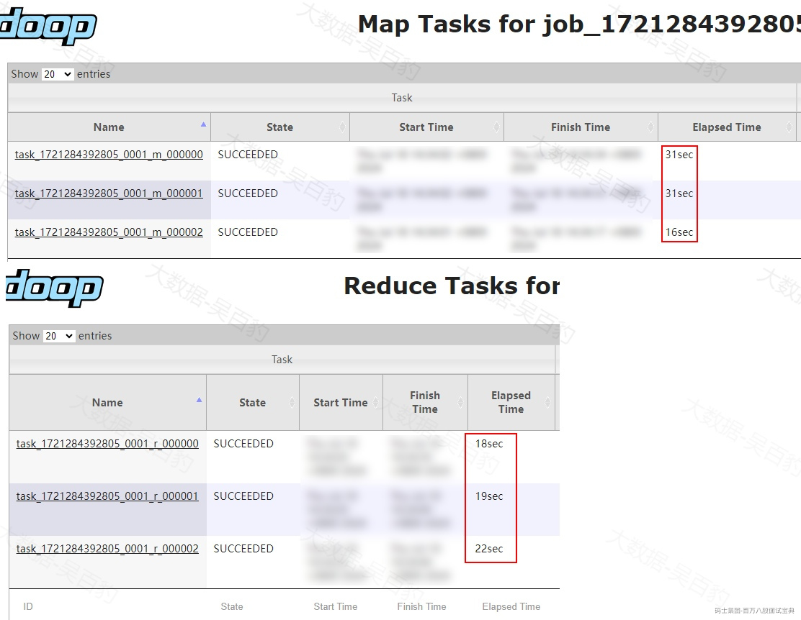

关闭Map-Side预聚合(hive.map.aggr=false)，SQL转换成MR任务MapTask及Reduce Task执行时间如下：

*(⚠️ 图片缺失:源知识库原图已失效)*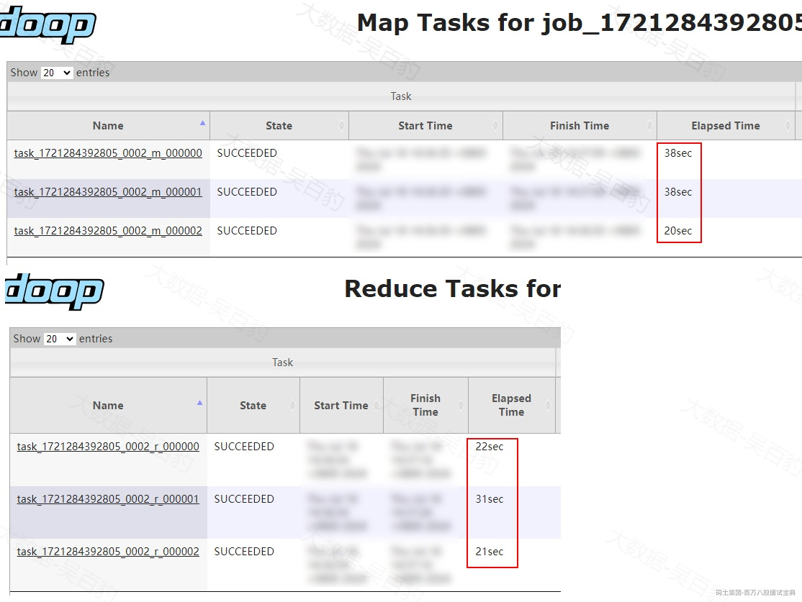

可以看到开启Map-Side预聚合后，Map端预聚合会导致处理的数据量减少，无论是Map端还是Reduce端处理的时间有有减少，关闭Map-Side预聚合可以看到Reduce端其中一个Task处理时间有明显增长。

#### 5.5.14.3 **开启GroupBy自动均衡**

如果对一张存在数据倾斜的表进行Group By操作时，可以将“hive.groupby.skewindata”参数设置为true，默认为false，表示不开启group by 数据倾斜均衡，如果设置为true，Hive在执行 GROUP BY 操作时会通过两个MR任务对倾斜数据进行负载均衡处理。

- 第一个MR任务：将数据随机分散到各个Reduce Task处理，每个Reduce Task对数据进行group by key 初步聚合。

- 第二个MR任务：对第一个MR任务的结果继续按照group by key分组字段进行聚合，完成最终聚合操作。

“hive.groupby.skewindata”自动均衡原理可以看做将聚合操作分成两个步骤完成，先分散局部聚合，使每个任务处理数据量相对均衡，然后再对聚合结果再次聚合，从而减少一次聚合将大量相同倾斜key交由一个task处理出现的倾斜问题。

开启hive.groupby.skewindata参数需要注意如下问题：

- 开启该参数会执行两个MR Job，可能会增加额外的计算量和存储量，需要权衡利弊。

- 该参数仅针对group by的SQL操作有效。

案例：对表ship\_tbl统计每个公司快递总费用。下面演示开启group by 自动均衡参数，为了更好的观察效果，需要把Map-Side预聚合关闭。参数设置如下：

```plain
#关闭map端预聚合
set hive.map.aggr=false;

#开启group by 自动均衡
set hive.groupby.skewindata=true;
```

由于开启group by自动均衡会生成两个MR 任务，这里不再观察SQL执行的时间长短，通过查看执行计划查看是否执行两个MR任务。

```plain
#统计每个公司快递总费用
explain select 
  company_id ,sum(cost) as total_cost 
from ship_tbl 
group by company_id;

#执行计划结果
+----------------------------------------------------+
|                      Explain                       |
+----------------------------------------------------+
| STAGE DEPENDENCIES:                                |
|   Stage-1 is a root stage                          |
|   Stage-2 depends on stages: Stage-1               |
|   Stage-0 depends on stages: Stage-2               |
|                                                    |
| STAGE PLANS:                                       |
|   Stage: Stage-1                                   |
|     Map Reduce                                     |
|       Map Operator Tree:                           |
|           TableScan                                |
|             alias: ship_tbl                        |
... ...
|       Execution mode: vectorized                   |
|       Reduce Operator Tree:                        |
|         Group By Operator                          |
|           aggregations: sum(VALUE._col0)           |
|           keys: KEY._col0 (type: string)           |
|           mode: partial1                           |
... ...
|                                                    |
|   Stage: Stage-2                                   |
|     Map Reduce                                     |
|       Map Operator Tree:                           |
|           TableScan                                |
|             Reduce Output Operator                 |
|               key expressions: _col0 (type: string) |
|               null sort order: z                   |
|               sort order: +                        |
... ...
|       Execution mode: vectorized                   |
|       Reduce Operator Tree:                        |
|         Group By Operator                          |
|           aggregations: sum(VALUE._col0)           |
|           keys: KEY._col0 (type: string)           |
|           mode: final                              |
|           outputColumnNames: _col0, _col1          |
... ...
|                                                    |
|   Stage: Stage-0                                   |
|     Fetch Operator                                 |
|       limit: -1                                    |
|       Processor Tree:                              |
|         ListSink                                   |
|                                                    |
+----------------------------------------------------+
```

可以看到 explain执行计划中执行了两个MR 任务，也可以开启参数后，通过执行SQL 观察到执行两个MR 任务。

#### 5.5.14.4 **双重聚合**

在对倾斜的数据表进行group by处理时，也可以通过双重聚合来解决倾斜问题。所谓双重聚合是用户自己对group by的key随机加前缀，聚合一次，然后再去掉前缀，再次按照相同的key 分组聚合。随机加前缀后第一次聚合实际上已经将倾斜的key得到初步的聚合结果，再去掉前缀再次聚合能保证倾斜的key聚合结果的聚合。

这种方式类似卡其GroupBy自动均衡参数，实际上就是用户将数据倾斜问题通过多个步骤打散解决。

如下SQL，统计每个公司快递总费用：

```plain
select 
  company_id ,sum(cost) as total_cost 
from ship_tbl 
group by company_id;
```

我们可以将对group by的company\_id 随机加前缀聚合，然后再去掉前缀再次聚合解决数据倾斜问题。

```plain
-- 第一步：为 company_id 添加随机前缀，并进行第一次聚合
with prefixed as (
  select 
    concat(cast(floor(rand() * 10) as string), '_', company_id) as prefixed_company_id,
    cost 
  from ship_tbl
),
prefixed_agg as (
  select 
    prefixed_company_id,
    sum(cost) as partial_cost
  from prefixed
  group by prefixed_company_id
)

-- 第二步：去掉前缀，进行第二次聚合
select 
  split(prefixed_company_id, '_')[1] as company_id,
  sum(partial_cost) as total_cost
from prefixed_agg
group by split(prefixed_company_id, '_')[1];
```

注意：floor是向下取整，“floor(rand() \* 10)”是随机得到0-9的数字。如果数据量大双重聚合也可以结合增加处理的并行度来加快处理速度。

#### 5.5.14.5 **开启 map join**

在数据倾斜的表进行Join时，可以通过开启Map Join解决数据倾斜。Hive Map Join适合大表 Join 小表场景，可以将小表数据加载到内存中与大表进行关联，将小表加载到内存与倾斜的表进行join操作，自然也就不会存在shuffle，也没有reduce task处理倾斜问题。关于map join参数参考map join小节。

#### 5.5.14.6 **开启Skew Join**

大表和大表进行Join时，并且其中一张表存在数据倾斜时，可以开启Skew Join来解决数据倾斜问题，Skew join解决数据倾斜原理如下:在执行SQL时会将倾斜的key存入到HDFS目录中，其余非倾斜的key正常join，对倾斜的key使用map join操作来避免shuffle倾斜，最后将两部分结果通过union进行合并得到最终结果。

Skew Join相关参数如下：

- **hive.optimize.skewjoin**

该参数表示是否开启skew join，默认为false，数据倾斜存在时，建议设置为true。

- **hive.skewjoin.key**

该参数表示触发执行skewjoin倾斜key的阈值，默认值为100000，如果某个键的行数超过10万行，则认为该键存在数据倾斜，会执行skewjoin。

**注意：经过测试在Hive4.x版本中开启该参数后执行SQL报错，与map join 错误类似，所以这里不再执行相关sql，只查看对应的explain执行计划。**

如下SQL，关联company\_tbl和ship\_tbl两表统计每个公司快递总费用。

```plain
explain select 
  b.company_name,sum(cost) as total_cost 
from ship_tbl a join company_tbl b 
on a.company_id = b.company_id 
group by b.company_name;
```

由于company\_tbl表数据少，为了避免执行map join我们设置“hive.auto.convert.join=false”关闭map join，然后设置“hive.optimize.skewjoin=true”开启skew join。查看两表关联的执行计划如下：

```plain
#关闭map join
set hive.auto.convert.join=false;

#开启skewjoin
set hive.optimize.skewjoin=true;

#查看执行计划：
explain select 
  b.company_name,sum(cost) as total_cost 
from ship_tbl a join company_tbl b 
on a.company_id = b.company_id 
group by b.company_name;
+----------------------------------------------------+
|                      Explain                       |
+----------------------------------------------------+
| STAGE DEPENDENCIES:                                |
|   Stage-1 is a root stage                          |
|   Stage-5 depends on stages: Stage-1 , consists of Stage-6, Stage-2 |
|   Stage-6                                          |
|   Stage-4 depends on stages: Stage-6               |
|   Stage-2 depends on stages: Stage-4               |
|   Stage-0 depends on stages: Stage-2               |
|                                                    |
| STAGE PLANS:                                       |
|   Stage: Stage-1                                   |
|     Map Reduce                                     |
|       Map Operator Tree:                           |
|           TableScan                                |
|             alias: a                               |
... ...
|           TableScan                                |
|             alias: b                               |
... ...
|       Reduce Operator Tree:                        |
|         Join Operator                              |
|           condition map:                           |
|                Inner Join 0 to 1                   |
|           handleSkewJoin: true                     |
|           keys:                                    |
|             0 _col0 (type: string)                 |
|             1 _col0 (type: string)                 |
|           outputColumnNames: _col1, _col3          |
... ...
|                                                    |
|   Stage: Stage-5                                   |
|     Conditional Operator                           |
|                                                    |
|   Stage: Stage-6                                   |
|     Map Reduce Local Work                          |
|       Alias -> Map Local Tables:                   |
|         1                                          |
|           Fetch Operator                           |
|             limit: -1                              |
|       Alias -> Map Local Operator Tree:            |
|         1                                          |
|           TableScan                                |
|             HashTable Sink Operator                |
|               keys:                                |
|                 0 reducesinkkey0 (type: string)    |
|                 1 reducesinkkey0 (type: string)    |
|                                                    |
|   Stage: Stage-4                                   |
|     Map Reduce                                     |
|       Map Operator Tree:                           |
|           TableScan                                |
|             Map Join Operator                      |
|               condition map:                       |
|                    Inner Join 0 to 1               |
|               keys:                                |
|                 0 reducesinkkey0 (type: string)    |
|                 1 reducesinkkey0 (type: string)    |
|               outputColumnNames: _col1, _col3      |
... ...
|                                                    |
|   Stage: Stage-2                                   |
|     Map Reduce                                     |
|       Map Operator Tree:                           |
|           TableScan                                |
|             Reduce Output Operator                 |
|               key expressions: _col0 (type: string) |
|               null sort order: z                   |
|               sort order: +                        |
|               Map-reduce partition columns: _col0 (type: string) |
... ...
|                                                    |
|   Stage: Stage-0                                   |
|     Fetch Operator                                 |
|       limit: -1                                    |
|       Processor Tree:                              |
|         ListSink                                   |
|                                                    |
+----------------------------------------------------+
```

通过explain 执行计划可以看到Stage关系及作用如下：

1. Stage-1 是根阶段，指向MR任务，主要进行了两表数据扫描，判断倾斜的key。

2. Stage-5 依赖于 Stage-1，并包括 Stage-6 和 Stage-2，用于执行条件操作。

3. Stage-6 是 Stage-5 的一部分，执行的是Map Reduce Local Work 将倾斜key数据进行hash表存储，只有Map操作。

4. Stage-4 将倾斜的key进行map join操作。

5. Stage-2 执行MR任务进行正常key的join操作。

6. 最后Stage-0进行数据Fetch获取。

#### 5.5.14.7 **随机加前缀并扩容数据Join**

如果两张大表进行Join，其中一张大表有数据倾斜，可以使用这种方式，这种方式本质就是用户自己对倾斜的key加随机前缀进行打散，然后对另外一张表相同key的数据进行扩容，这样就能保证随机加前缀的所有key都能与另外一张表数据join对应上，然后将随机加前缀的数据进行join操作，这样就不存在数据倾斜，最后再去掉前缀得到结果。其原理如下图所示：

*(⚠️ 图片缺失:源知识库原图已失效)*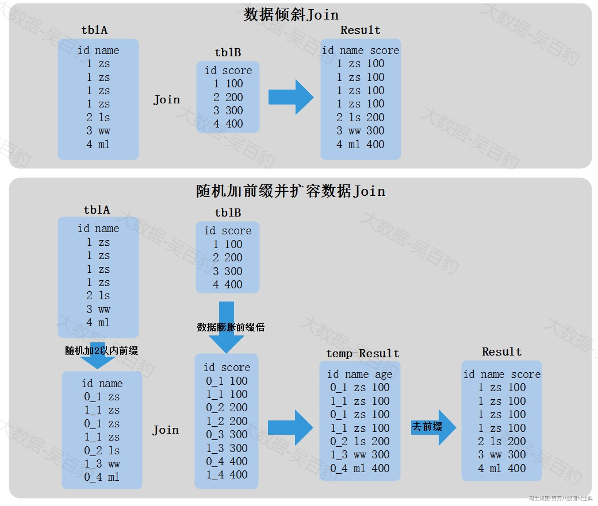

这种方式可以配合增加处理数据并行度来加快处理速度，但也存在弊端：如果对倾斜的key膨胀N倍，另外一张表数据每个key都要膨胀N倍，会导致计算过程占用大量磁盘空间。

案例：如下关联company\_tbl和ship\_tbl两表统计每个公司快递总费用。

```plain
select 
  a.company_id,b.company_name,sum(cost) as total_cost 
from ship_tbl a join company_tbl b 
on a.company_id = b.company_id 
group by a.company_id,b.company_name;
```

以上表ship\_tbl中company\_id有数据倾斜，两表join过程也会出现数据倾斜，将以上SQL转换成 随机加前缀并扩容数据Join，并解决数据倾斜。

```plain
#关闭map join和skew join
set hive.auto.convert.join=false;
set hive.optimize.skewjoin=false;(默认false)

#随机加前缀并扩容数据join
WITH
-- 第一步: 对 ship_tbl 表中的 company_id 添加随机前缀0~9
ship_tbl_random AS (
  SELECT
    concat(FLOOR(RAND() * 10), '_', company_id) AS random_company_id,
    company_id,
    cost
  FROM
    ship_tbl
),
-- 第二步: 对 company_tbl 表进行扩容
company_tbl_expanded AS (
  SELECT
   concat(idx, '_', company_id) AS random_company_id,
   company_name,
   company_id
  FROM
    company_tbl
  LATERAL VIEW posexplode(split(space(9), " "))  pe AS idx, blank
),
-- 第三步: 进行 Join 操作并聚合
joined_data AS (
  SELECT
    a.random_company_id,
    b.company_name,
    sum(a.cost) as cost1
  FROM
    ship_tbl_random a
  JOIN
    company_tbl_expanded b
  ON
    a.random_company_id = b.random_company_id
 group by a.random_company_id,b.company_name
),
-- 第四步: 去掉随机前缀
joined_data_2 AS (
 SELECT
  split(random_company_id,"_")[1] as company_id,
  company_name,
  cost1 AS total_cost1
FROM
  joined_data)
--第五步:对聚合结果再聚合
SELECT
  company_id,
  company_name,
  SUM(total_cost1) AS total_cost
FROM joined_data_2
GROUP BY company_id,company_name;
```

## 5.6 **Hive On Tez运行**

在Hive2.x版本起，Hive官方不再建议使用MapReduce作为底层默认执行引擎，推荐使用Tez或者Spark作为执行引擎（目前Hive4.0.0版本不支持Spark引擎），这些引擎相比于默认的MapReduce执行引擎执行任务时可以提升查询性能、降低延迟并优化资源利用，Hive4.x版本后可能会彻底弃用MapReduce引擎。

Apache Tez是一个开源分布式执行框架，专为处理复杂数据流任务而设计。它允许将多个依赖任务转化为单一的有向无环图（DAG）作业，从而大幅提升性能。Tez构建在Hadoop YARN之上,主要用于提升Hive应用的查询处理性能，替代传统的MapReduce执行引擎，实现更高效的数据处理。

Tez能够将过去需要多个MapReduce作业的数据处理任务，现在简化为一个Tez作业。这种改进不仅简化了作业管理，还显著提升了执行性能。

*(⚠️ 图片缺失:源知识库原图已失效)*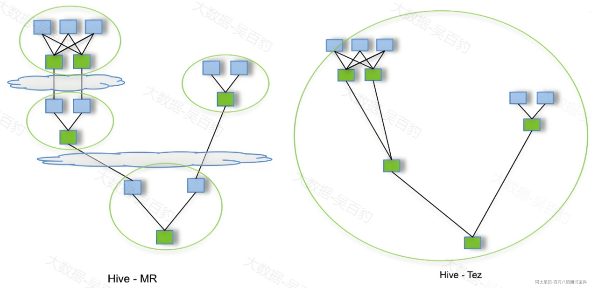

Hive 替换Tez引擎操作步骤如下。

**1) 下载并上传Tez**

从tez官网下载tez，地址：<https://tez.apache.org/releases/index.html,这里选择的tez版本为0.10.3版本，下载好的安装包名称为“apache-tez-0.10.3-bin.tar.gz”。>

将tez安装包下载后，上传至node1节点/software目录下并解压：

```plain
#上传并解压至/software目录下
[root@node1 ~]# ls /software/ | grep apache-tez*
apache-tez-0.10.3-bin
apache-tez-0.10.3-bin.tar.gz
```

**2) 将tez安装包上传至HDFS路径中**

后续在Hive中使用tez时需要获取tez 相关库文件，需要指定tez安装包，这里在HDFS中创建tez目录，然后将tez安装包上传至HDFS该路径中。

```plain
#HDFS中创建tez目录
[root@node1 software]# hdfs dfs -mkdir /tez

#上传tez安装包到HDFS/tez目录中
[root@node1 software]# hdfs dfs -put ./apache-tez-0.10.3-bin.tar.gz /tez/tez.tar.gz
```

**3) 配置tez-site.xml**

在HIVE\_HOME/conf目录下创建tez-site.xml文件，配置如下内容：

```plain
<configuration>
  <!--指定Tez库文件的位置 -->
  <property>
    <name>tez.lib.uris</name>

    <value>hdfs://mycluster/tez/tez.tar.gz</value>

  </property>

  <!--是否使用集群上的Hadoop库 -->
  <property>
    <name>tez.use.cluster.hadoop-libs</name>

    <value>true</value>

  </property>

</configuration>

```

也可在该配置文件中加入如下配置项指定tez使用的资源情况：

```plain
... ...  
  <!-- 设置Tez Application Master的内存大小（以MB为单位）-->
  <property>
    <name>tez.am.resource.memory.mb</name>

    <value>1024</value>

  </property>

  <!-- 设置Tez Application Master的CPU核心数量 -->  
  <property>
    <name>tez.am.resource.cpu.vcores</name>

    <value>1</value>

  </property>

  <!-- 设置Tez容器最大Java堆内存占总内存的比例 -->
  <property>
    <name>tez.container.max.java.heap.fraction</name>

    <value>0.4</value>

  </property>

  <!-- 设置Tez任务的内存大小（以MB为单位） -->
  <property>
    <name>tez.task.resource.memory.mb</name>

    <value>1024</value>

  </property>

  <!-- 设置Tez任务的CPU核心数量 -->
  <property>
    <name>tez.task.resource.cpu.vcores</name>

    <value>1</value>

  </property>

... ...
```

**4) 准备tez jars**

在HIVE\_HOME/目录中创建jars目录，将tez安装包中的所有jar放入到该目录中，后续Hive On Tez需要使用到这些jar包。

```plain
#在node1 HIVE_HOME中创建jars目录
[root@node1 ~]# mkdir -p /software/hive-4.0.0/jars

#将所有tez相关jar放入到HIVE_HOME/jars目录下
[root@node1 ~]# cp /software/apache-tez-0.10.3-bin/*.jar /software/hive-4.0.0/jars
[root@node1 ~]# cp /software/apache-tez-0.10.3-bin/lib/*.jar /software/hive-4.0.0/jars
```

**5) 配置hive-env.sh**

配置HIVE\_HOME/conf/hive-env.sh文件，在最后配置“HIVE\_AUX\_JARS\_PATH”属性指定Tez jar路径为HIVE\_HOME/jars路径。

```plain
... ...
export HIVE_AUX_JARS_PATH=/software/hive-4.0.0/jars
... ...
```

**6) 配置hive-site.xml使用tez引擎**

在hive-site.xml中最后加入如下配置项使用tez引擎。

```plain
... ...
  <property>
    <name>hive.execution.engine</name>

    <value>tez</value>

  </property>

... ...
```

**7) 重启Hive Metastore和HiveServer服务进行测试**

重启Hive Metastore和HiveServer服务。

```plain
[root@node1 ~]# hive --service metastore > /software/hive-4.0.0/metastore.log 2>&1 &
[root@node1 ~]# hive --service hiveserver2 > /software/hive-4.0.0/hiveserver2.log 2>&1 &
```

在Hive客户端beeline登录hive进行测试：

```plain
[root@node3 ~]# beeline -u jdbc:hive2://node1:10000 -n root
#查看默认使用执行引擎
0: jdbc:hive2://node1:10000> set hive.execution.engine;
+----------------------------+
|            set             |
+----------------------------+
| hive.execution.engine=tez  |
+----------------------------+

#建表
create table tez_tbl (id int,name string,age int) row format delimited fields terminated by '\t';

#插入数据
insert into tez_tbl values (1,'zs',18),(2,'ls',19),(3,'ww',20);

#关联查询
select * from tez_tbl a join tez_tbl b on a.id = b.id ;
+-------+---------+--------+-------+---------+--------+
| a.id  | a.name  | a.age  | b.id  | b.name  | b.age  |
+-------+---------+--------+-------+---------+--------+
| 1     | zs      | 18     | 1     | zs      | 18     |
| 2     | ls      | 19     | 2     | ls      | 19     |
| 3     | ww      | 20     | 3     | ww      | 20     |
+-------+---------+--------+-------+---------+--------+
```

注意：每次重新启动Hive metastore和hiveserver2服务后，使用tez时会加载tez jar和环境，相对慢一些。

## 5.7 **Hive HA**

在使用Hive过程中，如果Hive服务端hiveserver2 服务挂掉之后，我们就不能使用beeline方式连接Hive。这时我们需要对hiveserver2进行高可用部署，这就是Hive HA 高可用。Hive从0.14开始，使用Zookeeper实现了HiveServer2的HA功能（ZooKeeper Service Discovery），Client端可以通过指定一个nameSpace来连接HiveServer2，而不是指定某一个host和port。

Hive高可用部署我们这里选择node1、node2两台节点为hiveserver2服务节点，也就是hive服务端，node3节点是Hive客户端，具体搭建Hive HA步骤如下：

**1) 在node1节点上配置hive-site.xml**

```plain
<configuration>
  <property>  
    <name>hive.metastore.warehouse.dir</name>  
    <value>/user/hive_ha/warehouse</value>  
  </property>  
  <property>  
    <name>javax.jdo.option.ConnectionURL</name>  
    <value>jdbc:mysql://node2:3306/hive_ha?createDatabaseIfNotExist=true&useSSL=false&allowPublicKeyRetrieval=true</value>  
  </property>  
  <property>  
    <name>javax.jdo.option.ConnectionDriverName</name>  
    <value>com.mysql.jdbc.Driver</value>  
  </property>   
  <property>  
    <name>javax.jdo.option.ConnectionUserName</name>  
    <value>root</value>  
  </property>  
  <property>  
    <name>javax.jdo.option.ConnectionPassword</name>  
    <value>123456</value>  
  </property>

  
  <!-- 指定HiveServer2 端口 -->
  <property>
    <name>hive.server2.thrift.bind.host</name>

    <value>node1</value>

  </property>

  <!-- 指定HiveServer2 端口 -->
  <property>
    <name>hive.server2.thrift.port</name>

    <value>10000</value> 
  </property>

  
  <!-- Hive Server2 HA 配置 -->
  <property>
    <name>hive.server2.support.dynamic.service.discovery</name>

    <value>true</value>

  </property>

  <property>
    <name>hive.server2.zookeeper.namespace</name>

    <value>hiveserver2_zk</value>

  </property>

  <property>
    <name>hive.zookeeper.quorum</name>

    <value>node3:2181,node4:2181,node5:2181</value>

  </property>

  <property>
    <name>hive.zookeeper.client.port</name>

    <value>2181</value>

  </property>

</configuration>

```

**2) 将node1节点上的hive安装包发送到node2节点**

```plain
[root@node1 ~]# cd /software/
[root@node1 software]# scp -r ./hive-4.0.0/ node2:`pwd`
```

在node2配置Hive环境变量：

```plain
#vim /etc/profile
export HIVE_HOME=/software/hive-4.0.0
export PATH=$PATH:$HIVE_HOME/bin

#使环境变量生效
source /etc/profile
```

**3) 在node2节点上修改hive-site.xml配置文件**

将hiveserver2 host绑定的节点修改为node2节点。

```plain
... ...
<!-- 指定HiveServer2 端口 -->
  <property>
    <name>hive.server2.thrift.bind.host</name>

    <value>node2</value>

  </property>

... ...
```

**4) 初始化Hive**

在node1节点或者 node2任意一台节点初始化Hive

```plain
[root@node1 ~]# schematool -dbType mysql -initSchema
```

**5) 启动Hive Metastore和HiveServer2服务**

在node1节点启动Metastore和HiveServer2服务：

```plain
[root@node1 ~]# hive --service metastore > /software/hive-4.0.0/metastore.log 2>&1 &
[root@node1 ~]# hive --service hiveserver2 > /software/hive-4.0.0/hiveserver2.log 2>&1 &
在node2节点启动HiveServer2服务：
[root@node2 ~]# hive --service hiveserver2 > /software/hive-4.0.0/hiveserver2.log 2>&1 &
```

**此外，我们也可以在node2节点上启动metastore服务，这样在node1和node2节点上都启动了metastore服务，然后再客户端中将“hive.metastore.uris”配置为“thrift://node1:9083,thrift://node2:9083”就能实现metastore服务的高可用。**

**6) 在Hive客户端node3节点上通过beeline连接hive**

配置Hive Server2 HA 后通过beeline连接Hive格式如下：jdbc:hive2:///;serviceDiscoveryMode=zooKeeper;zooKeeperNamespace=，zookeeper的端口可以省略，默认就是2181。

```plain
[root@node3 ~]# beeline -u "jdbc:hive2://node3,node4,node5/;serviceDiscoveryMode=zooKeeper;zooKeeperNamespace=hiveserver2_zk" -n root
```

**7) 测试Hive Server2 HA**

在Hive中建表并插入数据：

```plain
#Hive中建表及插入数据
create table person(id int ,name string ,age int) row format delimited fields terminated by '\t';
insert into person values (1,'zs',18),(2,'ls',19),(3,'ww',20);

#查询表中数据
select * from person;
+------------+--------------+-------------+
| person.id  | person.name  | person.age  |
+------------+--------------+-------------+
| 1          | zs           | 18          |
| 2          | ls           | 19          |
| 3          | ww           | 20          |
+------------+--------------+-------------+
```

可以将连接的node1和node2节点上hiveserver2 服务kill掉其中一个，然后继续通过beeline进行查询，可以正常查询。注意：测试hiveserver2HA ,当一个hiveserver2 挂掉之后，我们需要重新登录beeline 通过jdbc方式连接Hive。

```plain
#kill 掉node1节点的hiveserver2进程
[root@node1 software]# kill -9 70736（根据自己的runjar进程kill）

#在node3再次登录beeline 查询hive表中数据
[root@node3 ~]# beeline -u "jdbc:hive2://node3,node4,node5/;serviceDiscoveryMode=zooKeeper;zooKeeperNamespace=hiveserver2_zk" -n root
select * from person;
+------------+--------------+-------------+
| person.id  | person.name  | person.age  |
+------------+--------------+-------------+
| 1          | zs           | 18          |
| 2          | ls           | 19          |
| 3          | ww           | 20          |
+------------+--------------+-------------+
```
