# **6 第六章Hive 源码**

## 6.1 **源码总览**

Hive中运行SQL语句可以通过beeline执行sql脚本或者进入beeline执行sql语句:

*(⚠️ 图片缺失:源知识库原图已失效)* 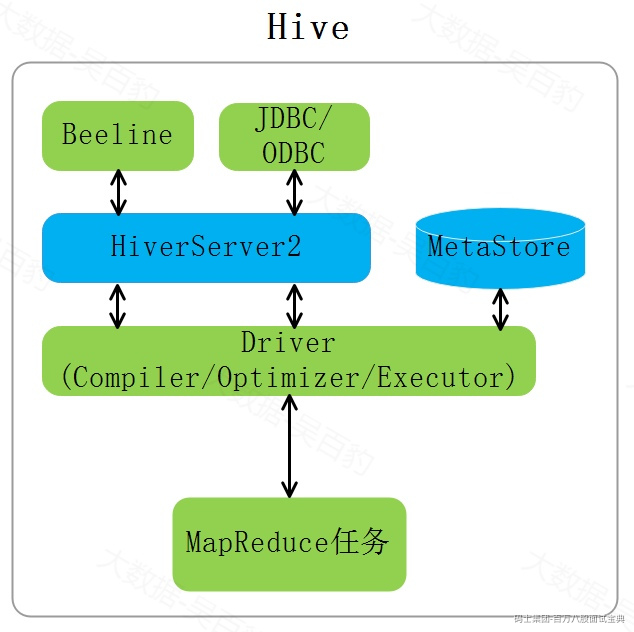

Hive中SQL语句通过Antlr框架的解析编译，将一条SQL按照如下流程转换成最终执行的MapReduce任务:SQL -> AST(抽象语法树) -> QueryBlock(查询块) -> Operator(逻辑执行计划) -> TaskTree(物理执行计划) -> QueryPlan(查询计划)，主要步骤如下：

1) 通过Antlr解析SQL语法规则和语法解析，将SQL语法转换成AST(Abstruct Syntax Tree,抽象语法树)。

2) 遍历AST将AST抽象语法树转化成Query Block（查询块），Query Block可以看成查询基本执行单元。

3) 将Query Block转换成OperatorTree(逻辑执行计划)，并进行优化。

4) OperatorTree转换成TaskTree(物理执行计划，每个Task对应一个MR Job任务)。

5) TaskTree最终包装成Query Plan 查询计划。

## 6.2 **下载源码**

进入github，搜索Hive项目，找到对应的版本进行下载，这里下载4.0.0版本。

*(⚠️ 图片缺失:源知识库原图已失效)* 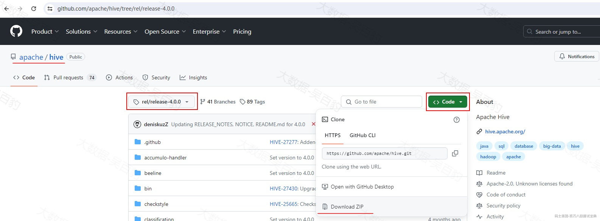

将下载的源码压缩包解压，然后导入IDEA。

*(⚠️ 图片缺失:源知识库原图已失效)* 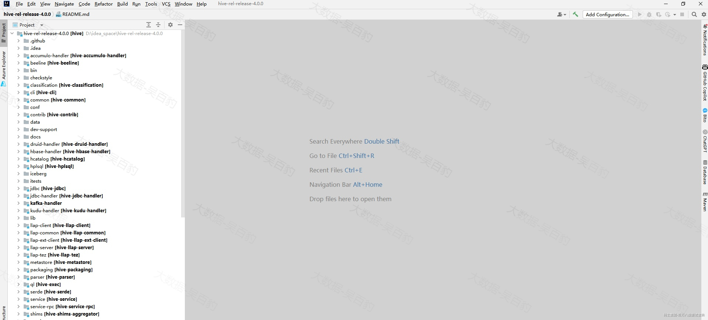

## 6.3 **确定Beeline入口类**

确定Beeilne入口类整体流程如下：

*(⚠️ 图片缺失:源知识库原图已失效)* 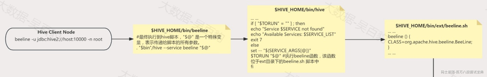

当我们执行“beeline -u jdbc:hive2://node1:10000 -n root”命令时，会执行$HIVE\_HOME/bin/beeline脚本，改脚本主要内容如下：

```plain
#dirname "$0" 获取当前脚本文件所在的目录路径，$0 是指当前脚本的路径。
bin=`dirname "$0"`
bin=`cd "$bin"; pwd

#最终执行到hive脚本，"$@" 是一个特殊变量，表示传递给脚本的所有参数。
. "$bin"/hive --service beeline "$@"
```

$HIVE\_HOME/bin/hive脚本主要内容如下：

```plain
... ...
SERVICE=""
HELP=""
EXECUTE_WITH_JAVA=false
... ...
while [ $# -gt 0 ]; do
  case "$1" in
    --version)
      shift
      SERVICE=version
      ;;
    --service)
      shift
      SERVICE=$1 #这里给SERVICE 赋值为beeline
      shift
      ;;
    --rcfilecat)
      SERVICE=rcfilecat
      shift
      ;;
    --orcfiledump)
      SERVICE=orcfiledump
      shift
      ;;
    --llapdump)
      SERVICE=llapdump
      shift
      ;;
    --replMigration)
      SERVICE=replMigration
      shift
      ;;
    --skiphadoopversion)
      SKIP_HADOOPVERSION=true
      shift
      ;;
    --skiphbasecp)
      SKIP_HBASECP=true
      shift
      ;;
    --help)
      HELP=_help #没有指定 --help ，那么HELP为空
      shift
      ;;
    --debug*)
      DEBUG=$1
      shift
      ;;
    *)
      SERVICE_ARGS=("${SERVICE_ARGS[@]}" "$1")
      shift
      ;;
  esac
done
... ...
#SERVICE_LIST在后续执行加载目录中脚本时会追加服务值。
SERVICE_LIST=""

# 执行ext目录下的所有脚本文件，加载了ext目录下的beeline.sh 脚本。
for i in "$bin"/ext/*.sh ; do
  . $i
done
... ...
TORUN=""
for j in $SERVICE_LIST ; do
  if [ "$j" = "$SERVICE" ] ; then
    TORUN=${j}$HELP  #给TORUN 赋值为beeline
  fi
done
... ...
if [ "$TORUN" = "" ] ; then
  echo "Service $SERVICE not found"
  echo "Available Services: $SERVICE_LIST"
  exit 7
else
  set -- "${SERVICE_ARGS[@]}"
  $TORUN "$@" #执行beeline函数，该函数位于ext目录下的beeline.sh 脚本中
fi
```

ext目录下的beeline.sh 脚本主要内容如下：

```plain
... ...
THISSERVICE=beeline
#将beeline追加到SERVICE_LIST中
export SERVICE_LIST="${SERVICE_LIST}${THISSERVICE} "

beeline () {
  CLASS=org.apache.hive.beeline.BeeLine;
... ...
  if [ "$EXECUTE_WITH_JAVA" != "true" ] ; then
    # if CLIUSER is not empty, then pass it as user id / password during beeline redirect
    if [ -z $CLIUSER ] ; then
      exec $HADOOP jar ${beelineJarPath} $CLASS $HIVE_OPTS "$@"
    else
      exec $HADOOP jar ${beelineJarPath} $CLASS $HIVE_OPTS "$@" -n "${CLIUSER}" -p "${CLIUSER}"
    fi
  else
    # if CLIUSER is not empty, then pass it as user id / password during beeline redirect
    if [ -z $CLIUSER ] ; then
      $JAVAEXE -cp ${HADOOP_CLASSPATH} $CLASS $HIVE_OPTS "$@"
    else
      $JAVAEXE -cp ${HADOOP_CLASSPATH} $CLASS $HIVE_OPTS "$@" -n "${CLIUSER}" -p "${CLIUSER}"
    fi
  fi
}
... ...
```

可以看到通过beeline连接Hive执行SQL ，最终执行“org.apache.hive.beeline.BeeLine”类，该类即beeline 执行入口类。

## 6.4 **Beeline入口类**

从Beeline客户端中提交SQL后，BeeLine客户端主要做的事情如下：

1) 加载配置文件配置项

2) 初始化beeline的参数

3) 处理hive -e执行SQL 、 hive -f执行SQL脚本、交互式SQL内容

其中第三步骤中又涉及到创建Hive Statement对象、连接HiveServer2异步提交并执行SQL操作。总体流程图如下：

*(⚠️ 图片缺失:源知识库原图已失效)* 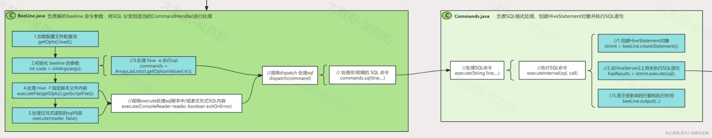

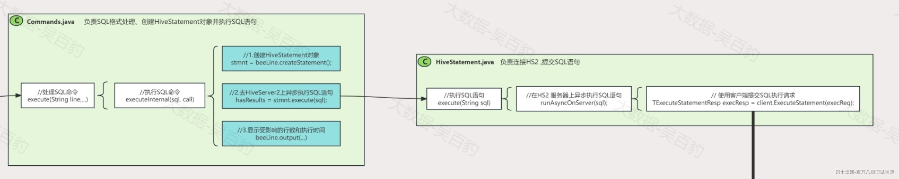

*(⚠️ 图片缺失:源知识库原图已失效)* 源码流程如下，Beeline.java类中main方法：

```plain
public static void main(String[] args) throws IOException {
  mainWithInputRedirection(args, null);
}
```

其中mainWithInputRedirection方法源码主要内容如下：

```plain
public static void mainWithInputRedirection(String[] args, InputStream inputStream)
    throws IOException {
... ...
//注释->：调用 beeLine 对象的 begin 方法，传递参数和输入流，并获取返回状态
int status = beeLine.begin(args, inputStream);
... ...
}
```

以上beeLine.begin方法主要源码如下：

```plain
public int begin(String[] args, InputStream inputStream, boolean keepHistory) throws IOException {
... ...
//注释->： 1.加载配置文件配置项
getOpts().load();
... ...
//注释：获取beeline中输入的参数对象
ConsoleReader reader = initializeConsoleReader(inputStream);
... ...
//注释->：2.初始化 beeline 的参数，解析命令行选项，并根据提供的命令执行相应的操作。
//注释->：其中检测 beeline 命令中指定的参数 -e -f 等。
//注释->: 并调用方法执行了 -e 参数指定的SQL
int code = initArgs(args);
... ...
//注释->: 3.处理 hive -f 脚本
if (getOpts().getScriptFile() != null) {
  return executeFile(getOpts().getScriptFile());
}
... ...
//注释->: 4.处理交互式读取的sql内容
return execute(reader, false);
}
```

### **6.4.1 执行-e参数指定的SQL**

以上代码中“initArgs(args);”中进行了beeline 命令参数解析，然后对-e 执行的sql语句放入一个command中，最终调用到BeeLine.dispatch方法处理Command。

initArgs主要源码如下：

```plain
int initArgs(String[] args) {
//注释：初始化一个空的命令列表
List<String> commands = Collections.emptyList();
... ...
//注释：创建一个 BeelineParser 实例，解析命令行参数
beelineParser = new BeelineParser();
cl = beelineParser.parse(options, args);
... ...
//注释：检测是否正常连接HS2
//注释：除了连接HS2参数外，还检测了指定的参数 -f 并将脚本设置到属性中
boolean connSuccessful = connectUsingArgs(beelineParser, cl);
... ...
//注释：如果命令行参数中包含 -e 选项
if (cl.getOptionValues('e') != null) {
  //注释：将 -e 选项指定的命令存入 commands 列表
  commands = Arrays.asList(cl.getOptionValues('e'));
  //注释：当使用 -e 选项时，命令必须是单行的
  opts.setAllowMultiLineCommand(false); //When using -e, command is always a single line

}
... ...
//注释：beeline指定了 -e 参数，将commands值获取发送给dispatch方法处理
if (!commands.isEmpty()) {
  for (Iterator<String> i = commands.iterator(); i.hasNext();) {
    String command = i.next().toString();
    debug(loc("executing-command", command));
    //注释->:调用dispatch 处理sql，将SQL 命令分发到适当的CommandHandler进行处理
    if (!dispatch(command)) {
      code++;
    }
  }
... ...
}
```

以上代码中“dispatch(command)”方法将SQL 命令分发到适当的CommandHandler进行处理，该方法同时也是hive -f 执行SQL脚本文件或者hive交互式窗口中执行SQL中进行SQL命令分发到适当的CommandHandler的方法。

“dispatch(command)”方法源码如下：

```plain
boolean dispatch(String line) {
... ...
//注释：去除SQL行中的注释
line = HiveStringUtils.removeComments(line);
... ...
if (line.startsWith(COMMAND_PREFIX)) {
  // handle SQLLine command in beeline which starts with ! and does not end with ;
  // 注释：在 beeline 中处理以命令前缀（例如 !）开头且不以分号结尾的 SQLLine 命令
  return execCommandWithPrefix(line);
} else {
  //注释->:处理非!前缀的 SQL 命令
  return commands.sql(line, getOpts().getEntireLineAsCommand());
}
... ...
}
```

以上处理非!前缀的SQL命令调用到commands.sql方法，最终“dispatch(command)”方法中调用到Commands.executeInternal方法进行SQL处理。

### **6.4.2 执行-f参数指定的SQL**

回到beeline.begin()方法中，判断执行完-e参数指定sql后，处理hive -f脚本的源码如下：

```plain
public int begin(String[] args, InputStream inputStream, boolean keepHistory) throws IOException {
... ...
//注释->: 3.处理 hive -f 脚本
if (getOpts().getScriptFile() != null) {
  return executeFile(getOpts().getScriptFile());
}
... ...
}
```

以上executeFile方法调用execute处理sql脚本中内容，execute方法主要内容如下：

```plain
private int execute(ConsoleReader reader, boolean exitOnError) {
... ...
//注释：只要程序运行就一直运行读取
while (!exit) {
... ...
//注释->：调用dispatch 处理sql，将SQL 命令分发到适当的CommandHandler进行处理
if (!dispatch(line)) {
  lastExecutionResult = ERRNO_OTHER;
  if (exitOnError) {
    break;
  }
} else if (line != null) {
  lastExecutionResult = ERRNO_OK;
}
... ...
}
```

以上解析脚本中的SQL最终调用到dispatch(line)方法，与“执行 -e 参数指定的SQL”一样，dispatch方法中又会调用commands.sql方法处理SQL命令，最终调用到Commands.executeInternal方法。

### **6.4.3 执行交互式命令行SQL**

回到beeline.begin()方法中，判断执行完-e参数指定sql和-f参数指定的脚本后，该方法最终调用Beeline.execute方法处理交互式读取的sql内容，该execute方法与“执行-f参数指定的SQL”部分调用的execute方法一样，最终组织SQL命令调用到Commands.executeInternal方法。

### **6.4.4 Commands.executeInternal方法**

Command类主要负责SQL格式处理，创建HiveStatement对象并执行SQL语句，在Commands.executeInternal方法中主要有如下3个步骤：

1) 创建HiveStatement对象，该对象用于向HS2异步执行HQL语句

2) 在HS2上异步执行HQL语句

3) 返回结果，显示行数和执行时间

Command.executeInternal方法源码主要内容如下:

```plain
private boolean executeInternal(String sql, boolean call) {
... ...
//注释：Commands-1:执行SQL语句创建SQL语句处理对象，这里返回的 stmnt 对象为 HiveStatement对象
stmnt = beeLine.createStatement();
... ...
//注释->：Commands-2:去HiveServer2上异步执行SQL语句
hasResults = stmnt.execute(sql);
... ...
//注释：Commands-3:显示受影响的行数和执行时间
beeLine.output(beeLine.loc("rows-selected", count) + " " + beeLine.locElapsedTime(end - start),
    true, beeLine.getErrorStream());
... ...
}
```

其中“stmnt.execute(sql);”语句是向HiveServer2上异步执行SQL语句，execute方法的源码主要内容如下：

```plain
public boolean execute(String sql) throws SQLException {
  //注释->：在HS2 服务器上异步执行SQL语句
  runAsyncOnServer(sql);
... ...
//注释：创建并配置结果集对象
resultSet = new HiveQueryResultSet.Builder(this).setClient(client)
    .setStmtHandle(stmtHandle.get()).setMaxRows(maxRows).setFetchSize(fetchSize)
    .setScrollable(isScrollableResultset)
    .build();
//注释：返回true表示执行成功且有结果集
return true;
}
```

其中“runAsyncOnServer(sql);”负责向HS2中提交执行SQL。runAsyncOnServer方法的主要源码如下:

```plain
private void runAsyncOnServer(String sql) throws SQLException {
... ...
//注释：将sql 包装到了 execReq 属性中
TExecuteStatementReq execReq = new TExecuteStatementReq(sessHandle, sql);
... ...
//注释：传入了true，表示异步执行。这里是给TExecuteStatementReq.runAsync 属性赋值为true
execReq.setRunAsync(true);
... ...
//注释->: 使用客户端提交SQL执行请求
TExecuteStatementResp execResp = client.ExecuteStatement(execReq);
... ...
}
```

最终执行到“client.ExecuteStatement(execReq);”向HS2进行SQL提交。

## 6.5 **向HiveServer2提交SQL**

HiveServer2部分总体代码执行示意图如下：

*(⚠️ 图片缺失:源知识库原图已失效)* 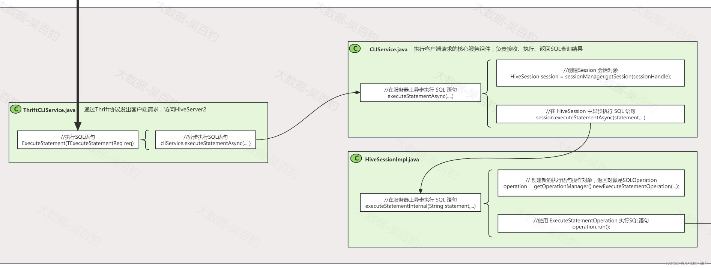

*(⚠️ 图片缺失:源知识库原图已失效)* 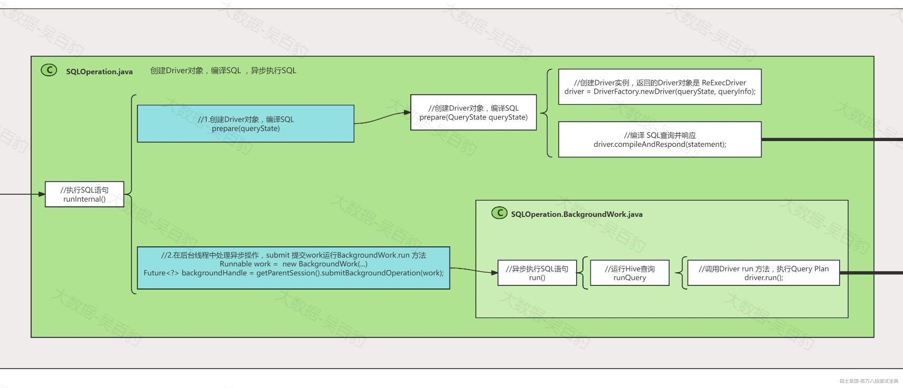

### **6.5.1 向HS2提交SQL流程**

“client.ExecuteStatement(execReq);”中client为ThriftCLIService对象，该对象通过Thrift协议发出客户端请求，访问HiveServer2。

ExecuteStatement方法主要源码如下：

```plain
public TExecuteStatementResp ExecuteStatement(TExecuteStatementReq req) throws TException {
... ...
//注释：获取SQL语句
String statement = req.getStatement();
... ...
//注释：异步执行，该值为true
Boolean runAsync = req.isRunAsync();
... ...
//注释->: 根据是否需要异步执行，选择调用异步或同步执行方法
OperationHandle operationHandle =
    runAsync ? cliService.executeStatementAsync(sessionHandle, statement, confOverlay,
        queryTimeout) : cliService.executeStatement(sessionHandle, statement, confOverlay,
        queryTimeout);
... ...
}
```

最终执行到“cliService.executeStatementAsync(...)”方法异步执行SQL。executeStatementAsync方法实现主要源码如下：

```plain
public OperationHandle executeStatementAsync(SessionHandle sessionHandle, String statement,
    Map<String, String> confOverlay, long queryTimeout) throws HiveSQLException {
... ...
//注释：从 SessionManager 中获取与会话句柄对应的 HiveSession 对象
//注释：hive每次启动Beeline 都会创建一个Session会话
HiveSession session = sessionManager.getSession(sessionHandle);
... ...
//注释->:在 HiveSession 中异步执行 SQL 语句
OperationHandle opHandle = session.executeStatementAsync(statement, confOverlay, queryTimeout);
... ...
}
```

executeStatementAsync方法最终调用到HiveSessionImpl.executeStatementInternal方法，该方法源码如下：

```plain
private OperationHandle executeStatementInternal(String statement,
    Map<String, String> confOverlay, boolean runAsync, long queryTimeout) throws HiveSQLException {
... ...
//注释->:创建新的执行语句操作对象，返回对象是SQLOperation
//注释->:newExecuteStatementOperation 方法用于创建不同类型的 ExecuteStatementOperation 实例，具体取决于 SQL 语句的类型和配置
//注释->:Operation包括：SQLOperation(处理标准SQL)、HplSqlOperation(处理HPL SQL 模式，类似存储过程)、HiveCommandOperation(用于处理 Hive 特定的命令，例如set、alter...)
operation = getOperationManager().newExecuteStatementOperation(getSession(), statement,
    confOverlay, runAsync, queryTimeout);
... ...
//注释->:使用 ExecuteStatementOperation 执行SQL语句
operation.run();
... ...
}
```

该方法中newExecuteStatementOperation 方法用于创建不同类型的 ExecuteStatementOperation 实例，具体取决于 SQL 语句的类型和配置，Operation包括：SQLOperation(处理标准SQL)、HplSqlOperation(处理HPL SQL 模式，类似存储过程)、HiveCommandOperation(用于处理 Hive 特定的命令，例如set、alter...)，这里创建的operation对象为SQLOperation。最终operation.run();方法调用到SQLOperation.runInternal方法。

### **6.5.2 SQLOperation.runInternal方法**

SQLOperator.java类主要负责创建Driver对象、编译SQL、异步执行SQL。在SQLOperation.runInternal方法中，主要进行如下两个步骤：

1) Driver对象创建并编译SQL，将SQL编译成Query Plan执行计划。

2) 对QueryPaln 进行处理，转换成MR 任务执行。

runInternal方法源码主要内容如下:

```plain
public void runInternal() throws HiveSQLException {
//注释：设置操作状态为 PENDING（待处理）
setState(OperationState.PENDING);
... ...
if (!asyncPrepare) {
  //注释->：SQLOperation-1: 创建Driver对象，编译SQL
  //注释:Driver经过：SQL -> AST(抽象语法树) -> QueryBlock(查询块) -> Operator(e逻辑执行计划) -> TaskTree(物理执行计划) -> QueryPlan(查询计划)
  prepare(queryState);
}
... ...
//注释->：SQLOperation-2:在后台线程中处理异步操作，运行Hive查询，submit 提交work运行BackgroundWork.run 方法
Runnable work =
    new BackgroundWork(getCurrentUGI(), parentSession.getSessionHive(), SessionState.get(),
        asyncPrepare);
... ...
//注释：提交运行work线程
Future<?> backgroundHandle = getParentSession().submitBackgroundOperation(work);
... ...
}
```

- **Driver对象创建并编译SQL，将SQL编译成Query Plan执行计划**

其中prepare方法创建Driver对象，并编译SQL，Driver将SQL最终转换成Query Plan，这个过程流程经过：SQL -> AST(抽象语法树) -> QueryBlock(查询块) -> Operator(e逻辑执行计划) -> TaskTree(物理执行计划) -> QueryPlan(查询计划)。

Prepare方法源码主要内容如下:

```plain
private void prepare(QueryState queryState) throws HiveSQLException {
... ...
//注释->：创建Driver实例，返回的Driver对象是 ReExecDriver
driver = DriverFactory.newDriver(queryState, queryInfo);
... ...
//注释->:编译 SQL查询并响应
//注释->:ReExecDriver.compileAndRespond(...) -> Driver.compileAndRespond(...)
driver.compileAndRespond(statement);
... ...
}
```

在“DriverFactory.newDriver”方法中返回 ReExecDriver对象，该对象表示执行过程失败可重试的Driver对象，然后调用compileAndRespond方法进行编译SQL查询，这里最终调用到Driver.compileAndRespond方法进行编译SQL。

- **对QueryPaln 进行处理，转换成MR 任务执行**

BackgroundWork是一个线程，负责异步处理QueryPlan，通过submitBackgroundOperation(work);提交运行，执行到SQLOperator.BackgroundOperation.run方法，最终调用到Driver.run 方法。

## 6.6 **Driver端SQL编译执行**

Driver类主要负责编译执行SQL,将SQL转换成MR任务，Driver中主要包含编译、优化及执行步骤，Driver类执行流程如下：

*(⚠️ 图片缺失:源知识库原图已失效)* 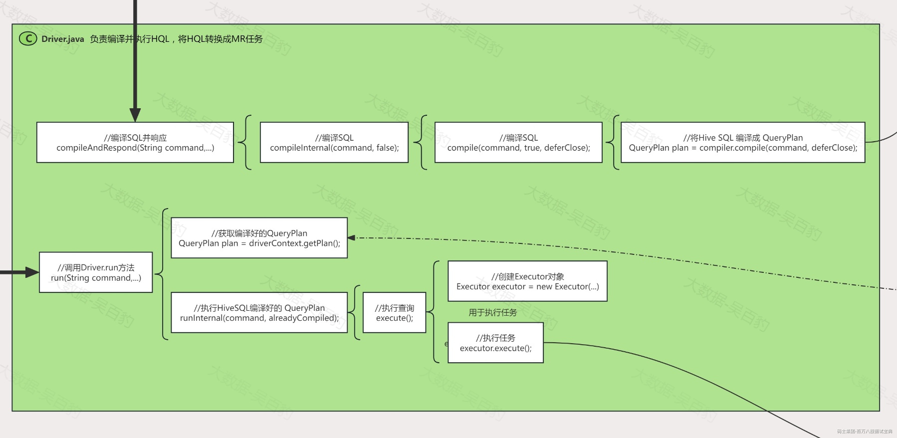

*(⚠️ 图片缺失:源知识库原图已失效)* 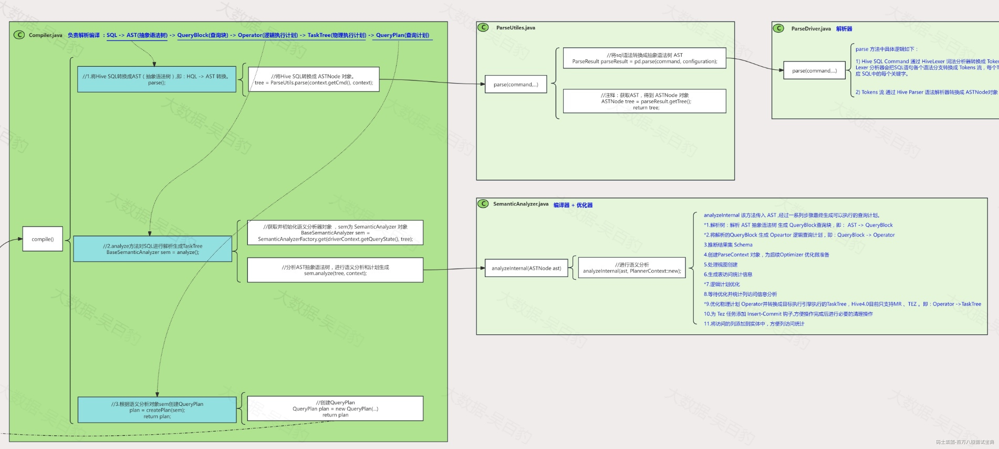

*(⚠️ 图片缺失:源知识库原图已失效)* 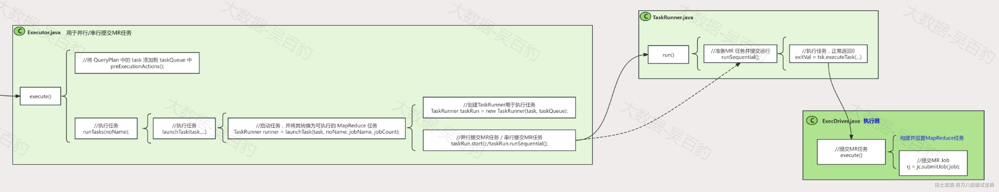

### **6.6.1 Driver.compileAndRespond方法**

Driver.compileAndRespond方法中调用到Driver.compileInternal方法，在该方法中执行Driver.compile方法进行编译SQL。

Driver.compile方法源码如下：

```plain
public void compile(String command, boolean resetTaskIds, boolean deferClose) throws CommandProcessorException {
  prepareForCompile(resetTaskIds);

  Compiler compiler = new Compiler(context, driverContext, driverState);

  //注释->：将Hive SQL 编译成 QueryPlan
  //注释->：SQL -> AST(抽象语法树) -> QueryBlock(查询块) -> Operator(逻辑执行计划) -> TaskTree(物理执行计划) -> QueryPlan(查询计划)
  QueryPlan plan = compiler.compile(command, deferClose);
  driverContext.setPlan(plan);

  compileFinished(deferClose);
}

```

最终执行到Compile.compile方法将HQL编译成QueryPlan。

### **6.6.2 Compile.compile方法**

Compile方法主要进行Hive SQL编译，将SQL按照如下流程进行编译转换：SQL -> AST(抽象语法树) -> QueryBlock(查询块) -> Operator(逻辑执行计划) -> TaskTree(物理执行计划) -> QueryPlan(查询计划)。在该方法中主要有如下3个步骤:

1) 将Hive SQL转换成AST（抽象语法树）,即：HQL -> AST 转换。

2) analyze方法对SQL进行解析生成TaskTree。

3) 根据语义分析对象sem创建QueryPlan。

Compile.compile方法主要源码如下：

```plain
public QueryPlan compile(String rawCommand, boolean deferClose) throws CommandProcessorException {
... ...
//注释->:Compile-1:将Hive SQL转换成AST（抽象语法树）,即：HQL -> AST 转换。
//注释->:给Compiler.tree属性进行赋值，该属性tree对ASTNode 对象
parse();
... ...
//注释->:Compile-2:analyze方法对SQL进行解析生成TaskTree
//注释->: SQL -> AST(抽象语法树) -> QueryBlock(查询块) -> Operator(逻辑执行计划) -> TaskTree(物理执行计划)
BaseSemanticAnalyzer sem = analyze();
... ...
//注释->:Compile-3:根据语义分析对象sem创建QueryPlan
plan = createPlan(sem);
... ...
return plan;
}
```

#### 6.6.2.1 **Compiler.parse方法**

以上Parse方法将Hive SQL转换成AST（抽象语法树）,即：HQL -> AST 转换。源码如下：

```plain
private void parse() throws ParseException {
... ...
//注释->:将Hive SQL转换成 ASTNode 对象。传入 context.getCmd() 为当前SQL，返回ASTNode 对象。
//注释->:AST(Abstruct Syntax Tree ，AST)抽象语法树
tree = ParseUtils.parse(context.getCmd(), context);
... ...
}
```

ParseUtils.parse方法源码如下：

```plain
public static ASTNode parse(
... ...
//注释->：将sql语法转换成抽象语法树 AST
ParseResult parseResult = pd.parse(command, configuration);
... ...
//注释：获取AST，得到 ASTNode 对象
ASTNode tree = parseResult.getTree();
... ...
//注释：返回 ASTNode 对象
return tree;
}
```

pd.parse方法将sql语法转换成抽象语法树 AST,Hive中通过使用 ANTLR（Another Tool for Language Recognition(识别)）进行词法分析和语法解析。

ANTLR主要作用：

- 词法分析：将输入的HiveQL查询字符串分解成一系列的Token，这些Token是语法分析的基础。ANTLR生成的词法分析器（Lexer）负责将输入的HiveQL查询字符串分解成一个个Token，这些Token表示查询中的关键字、标识符、运算符等基本元素。

- 语法解析：根据词法分析器生成的Token序列，解析HiveQL查询语句，生成抽象语法树（AST）。ANTLR生成的语法解析器（Parser）负责读取Token序列，并根据语法规则解析这些Token，生成对应的抽象语法树（AST）。Token 对应 SQL中的每个关键字。

pd.parse方法主要就是通过Antlr进行词法分析和语法解析，这里涉及到两个类 HiveLexer（词法解析类）和HiveParser（语法解析类），两个类分别是根据 hive-parser 项目中 HiveLexer.g+HiveLexerParent.g和HiveParser.g 语法文件编译生成。

语法文件定义了如何将SQL语句转换为Token，例如HiveLexerParent.g 文件中看到各种SQL关键字对应到的操作符（KW\_FROM : 'FROM';、PLUS : '+';），HiveParser.g语法文件定了将操作符token转换成对应的AST结构，例如：selectClause、fromClause等。

pd.parse 方法源码如下，主要逻辑有两个步骤：

1) Hive SQL Command 通过 HiveLexer 词法分析器转换成 Tokens流。Lexer 分析器会把SQL语句各个语法分支转换成 Tokens 流，每个Token 对应 SQL中的每个关键字。

2) Tokens 流 通过 Hive Parser 语法解析器转换成 ASTNode对象

```plain
public ParseResult parse(String command, Configuration configuration)
    throws ParseException {
... ...
//注释：创建词法分析器对象 HiveLexer,使用HiveLexer执行词法分析，将SQL转换为Token序列
GenericHiveLexer lexer = GenericHiveLexer.of(command, configuration);
//注释：创建Token流对象
TokenRewriteStream tokens = new TokenRewriteStream(lexer);
//注释：创建解析器对象 HiveParser
HiveParser parser = new HiveParser(tokens);
... ...
//注释：当前代码生成语法树，从Tokens转换到AST
r = parser.statement();
... ...
//注释:获取 ASTNode 对象并返回
ASTNode tree = (ASTNode) r.getTree();
... ...
  return new ParseResult(tree, tokens, parser.gFromClauseParser.tables);
}
```

为了方便理解ASTNode对象，做如下举例，在Hive中，有SQL查询，如：SELECT name, age FROM users WHERE age > 25; 转换为 AST（抽象语法树）的过程如下：

**1) 词法分析（Lexical Analysis）并生成TokenStream**

在这个阶段，Hive 使用 Lexer（词法分析器）将 SQL 查询字符串转换为一系列的记号（tokens）,这些记号是查询的基本单元，如关键字、标识符、运算符等。Lexer 的工作基于在 HiveLexer.g 和 HiveLexerParent.g 文件中定义的规则。

“SELECT name, age FROM users WHERE age > 25”会被Lexer转换成如下令牌序列：

```plain
KW_SELECT, Identifier(name), COMMA, Identifier(age), KW_FROM, Identifier(users), KW_WHERE, Identifier(age), GREATERTHAN, NumberLiteral(25), SEMICOLON
```

生成的令牌序列会传递给 Parser（语法分析器），在这个阶段，TokenRewriteStream 管理这些令牌并处理词法和语法错误。

**2) 语法分析（Parsing）并生成AST**

在语法分析阶段，Parser 使用令牌流来构建抽象语法树（AST），HiveParser 类在这个阶段发挥作用，它根据在 HiveParser.g 文件中定义的 SQL 语法规则（例如：selectStatement, selectClause, fromClause, whereClause 等如何对应的TOK\_XX）来解析这些令牌，根据这些规则将令牌流转换成相应的 AST 结构。对于 SQL 查询 SELECT name, age FROM users WHERE age > 25; AST 的结构如下：

```plain
TOK_QUERY
 ├── TOK_SELECT
 │    ├── TOK_SELEXPR
 │    │    ├── TOK_TABLE_OR_COL (name)
 │    │    └── TOK_TABLE_OR_COL (age)
 │    └── TOK_FROM
 │         └── TOK_TABREF (users)
 └── TOK_WHERE
      └── TOK_OP_GT
           ├── TOK_TABLE_OR_COL (age)
           └── TOK_INT (25)
```

以上AST树状结构显示了各个节点之间的层级关系和父子关系，每一个节点表示 SQL 查询的一个组成部分，树的每个分支和叶子节点都代表了查询的一部分。

#### 6.6.2.2 **Compile.analyze方法**

Compile.analy方法主要对ASTNode进行解析生成TaskTree，在analy方法中ASTNode转换流程如下：AST(抽象语法树) -> QueryBlock(查询块) -> Operator(逻辑执行计划) -> TaskTree(物理执行计划)。

Compile.analy方法源码如下：

```plain
private BaseSemanticAnalyzer analyze() throws Exception {
... ...
// 注释：获取并初始化语义分析器对象 ，sem为 SemanticAnalyzer 对象
BaseSemanticAnalyzer sem = SemanticAnalyzerFactory.get(driverContext.getQueryState(), tree);
... ...
//注释->：分析AST抽象语法树，进行语义分析和计划生成
sem.analyze(tree, context);
... ...
//注释：返回语义分析器对象
  return sem;
}
```

以上代码中“SemanticAnalyzerFactory.get(...)”方法返回sem变量为 SemanticAnalyzer 对象，该对象是语义分析器对象 ，然后执行“sem.analyze(tree, context);”分析AST抽象语法树，进行语义分析和计划生成，sem.analyze(tree, context)源码如下:

```plain
public void analyze(ASTNode ast, Context ctx) throws SemanticException {
... ...
//注释->:init 中创建了QB 对象
/**
 * 注释: QB类是 Hive SQL 查询解析过程中用于表示查询块（Query Block）的一个类。
 * 注释:> 在 Hive 中，Query Block查询块可以是一个独立的查询或子查询，QB 类存储了与查询块相关的各种信息，包括表别名、子查询别名、表的元数据等
 * 注释:> QB类主要用于在语义分析阶段收集和管理查询的各种信息,在 Hive 查询处理的多个阶段中都扮演了关键角色，从语义分析、优化到物理计划生成都会使用到QB。
 * 注释:> {@link org.apache.hadoop.hive.ql.parse.QB} 可以查看各种定义的属性。
 * 注释:> Hive 会将 AST 转换成一个或多个查询块 (Query Block, QB)，每个查询块代表一个独立的子查询或主查询，语义分析中会将 AST 各个Token会封装到Query Block对象中。
 * 注释:> SQL -> AST(抽象语法树) -> QueryBlock(查询块) -> Operator(逻辑执行计划) -> TaskTree(物理执行计划) -> QueryPlan(查询计划)
 */
init(true);
//注释->：进行语义分析，该方法调用的是SemanticAnalyzer.java 类的 analyzeInternal 方法
analyzeInternal(ast);
}
```

在以上代码中init方法创建了QB 对象， QB类是 Hive SQL 查询解析过程中用于表示查询块（Query Block）的一个类。

在 Hive 中，Query Block查询块可以是一个独立的查询或子查询，QB 类存储了与查询块相关的各种信息，包括表别名、子查询别名、表的元数据等，QB类主要用于在语义分析阶段收集和管理查询的各种信息,在 Hive 查询处理的多个阶段中都扮演了关键角色，从语义分析、优化到物理计划生成都会使用到QB。QB中的部分属性如下：

```plain
public class QB {
... ...
private HashMap<String, String> aliasToTabs; //注释：保存表别名到表名的映射。
... ...
private HashMap<String, Table> viewAliasToViewSchema;//注释：保存视图别名到视图模式 (Table) 的映射。
... ...
private QBParseInfo qbp; //注释：保存查询块的解析信息 (QBParseInfo)。
... ...
private boolean isQuery; //注释：指示查询块是否是一个查询。
... ...
private HashMap<ASTNode, PTFInvocationSpec> ptfNodeToSpec;//注释：保存 PTF（Partition Table Function）节点到调用规范的映射。
... ...
private QBSubQuery subQueryPredicateDef;//注释：保存子查询谓词定义
... ...
private QBSubQuery whereClauseSubQueryPredicate; //注释：保存 WHERE 子句的子查询谓词
private QBSubQuery havingClauseSubQueryPredicate; //注释：保存 HAVING 子句的子查询谓词。
... ...
}
```

后续Hive 会将 AST 转换成一个或多个查询块 (Query Block, QB)，每个查询块代表一个独立的子查询或主查询，语义分析中会将 AST 各个Token会封装到Query Block对象中。

在analyze方法中analyzeInternal方法进行语义分析，该方法调用的是SemanticAnalyzer.java 类的 analyzeInternal 方法，该方法对传入 AST ,经过一系列步骤最终生成可以执行的查询计划，主要经过如下步骤：

1) 解析树：解析 AST 抽象语法树 生成 QueryBlock查询块，即： AST -> QueryBlock

2) 将解析的QueryBlock 生成 Opeartor 逻辑查询计划，即：QueryBlock -> Operator

3) 推断结果集 Schema

4) 创建ParseContext 对象，为后续Optimizer 优化做准备

5) 处理视图创建

6) 生成表访问统计信息

7) 逻辑计划优化

8) 等待优化并统计列访问信息分析

9) 优化物理计划 Operator并转换成目标执行引擎执行的TaskTree，Hive4.0目前只支持MR 、TEZ 。即：Operator ->TaskTree

10) 为 Tez 任务添加 Insert-Commit 钩子,方便操作完成后进行必要的清理操作

11) 将访问的列添加到实体中，方便列访问统计。

下面重点对第1、2、7、9步骤进行介绍，SemanticAnalyzer.analyzeInternal 方法主要源码如下：

```plain
void analyzeInternal(ASTNode ast, Supplier<PlannerContext> pcf) throws SemanticException {

// 1. Generate Resolved Parse tree from syntax tree
//注释：1->.>>>>>> 解析树：解析 AST 抽象语法树 生成 QueryBlock ，AST -> QueryBlock <<<<<<
boolean needsTransform = needsTransform();
... ...
//注释->:调用 genResolvedParseTree 方法设置QueryBlock
if (!genResolvedParseTree(ast, plannerCtx)) {
  return;
}
... ...
//注释：2->.>>>>>> 将解析的QueryBlock 生成 Opeartor 逻辑查询计划 <<<<<<
/**
 * 注释->：genOPTree方法将生成的QueryBlock转换成 Operator对象，这里sinkOp 为 Operator 对象 ,可以看成逻辑查询计划，为接下来的查询执行计划做准备。
 * 注释->: > QueryBlock中每种操作（例如：SELECT /FILTER）都可以转换成一个Operator 操作符对象，如:SelectOperator、FilterOperator
 * 注释->: > {@link org.apache.hadoop.hive.ql.exec.Operator } 类中包含childOperators和parentOperators表示子Operator操作符和父Operator操作符
 * 注释->: > 最终QueryBlock 被转换成含有父子Operator层级关系的Operator对象，该对象可以看成是一个逻辑执行计划，定义了查询执行的操作顺序和方式。
 * 注释->: > 在genOPTree方法中将解析的QueryBlock中的各个部分（子查询、源表、连接、分区表函数等）转化为Operator的各个部分
 */
sinkOp = genOPTree(ast, plannerCtx);
... ...
// 7. Perform Logical optimization
//注释->：7. >>>>>> 逻辑计划优化 <<<<<<
... ...
//注释->:初始化 Optimizer 类，定义了一系列的转换规则（transformations）用于对查询计划进行优化。
optm.initialize(conf);
//注释->:逐一调用所有的转换规则，优化查询计划
pCtx = optm.optimize();
... ...
// 9. Optimize Physical op tree & Translate to target execution engine (MR, TEZ..)
// 注释->： 9. >>>>>> 优化物理计划 Operator并转换成目标执行引擎执行的TaskTree，目前只支持MR 、TEZ <<<<<<
//注释->：将逻辑执行计划（Operator）转换成物理执行计划（TaskTree）
compilePlan(pCtx);
... ...
}
```

- **解析 AST 抽象语法树 生成 QueryBlock ，AST -> QueryBlock**

genResolvedParseTree(...)方法负责将AST 抽象语法树 生成 QueryBlock，其源码如下：

```plain
boolean genResolvedParseTree(ASTNode ast, PlannerContext plannerCtx) throws SemanticException {
// 1. analyze and process the position alias
// step processPositionAlias out of genResolvedParseTree
//注释：1.分析和处理位置别名，将 processPositionAlias 方法移出 genResolvedParseTree，放在上层实现了

// 2. analyze create table command
//注释：2.分析创建表命令
if (ast.getToken().getType() == HiveParser.TOK_CREATETABLE) {
  // if it is not CTAS, we don't need to go further and just return
  //注释：analyzeCreateTable 获取AST中的内容转换成代码
  if ((child = analyzeCreateTable(ast, qb, plannerCtx)) == null) {
    return false;
  }
} else {
  queryState.setCommandType(HiveOperation.QUERY);
}

// 3. analyze create view command
//注释：3.分析创建视图命令
if (ast.getToken().getType() == HiveParser.TOK_CREATE_MATERIALIZED_VIEW) {
  child = analyzeCreateView(ast, qb, plannerCtx);
... ...
// 4. continue analyzing from the child ASTNode.
//注释：4.分析 ASTNode 各个子节点
Phase1Ctx ctx_1 = initPhase1Ctx();
//注释->: 解析 SQL 抽象语法树 (AST)，并将相关信息存储在 QB (Query Block) 对象中
if (!doPhase1(child, qb, ctx_1, plannerCtx)) {
  // if phase1Result false return
  return false;
}
... ...
//注释：5.处理物化视图相关的信息，用于获取查询块的元数据
getMetaData(qb, createVwDesc == null && !forViewCreation);
return true;
}

```

以上代码中“doPhase1”方法解析 SQL 抽象语法树 (AST)，并将相关信息存储在 QB (Query Block) 对象中，其部分举例源码如下：

```plain
boolean doPhase1(ASTNode ast, QB qb, Phase1Ctx ctx_1, PlannerContext plannerCtx, Map<String, CTEClause> aliasToCTEs)
    throws SemanticException {
... ...
//注释：获取查询块的解析信息
QBParseInfo qbp = qb.getParseInfo();
... ...
//注释：SELECT Token 语句 向QB 中的 qbp Map中设置值，即向对应的对象中存入ASTNode对象
case HiveParser.TOK_SELECT:
  qb.countSel(); //注释： 统计Select 语句
  //注释： 设置select 表达式 ，向 QBparseInfo.destToSelExpr 存入数据
  qbp.setSelExprForClause(ctx_1.dest, ast);
... ...
}
```

实际上这里就是判断Hive 解析出来的ASTNode中的Token流，然后给QB对象设置值，方便后续的优化。

- **将解析的QueryBlock 生成 Opeartor 逻辑查询计划**

genOPTree方法将生成的QueryBlock转换成 Operator对象，这里sinkOp 为 Operator 对象 ,可以看成逻辑查询计划，为接下来的查询执行计划做准备。

Operator 对象可以看成是一个逻辑执行计划，定义了查询执行的操作顺序和方式，QueryBlock中每种操作（例如：SELECT /FILTER）都可以转换成一个Operator 操作符对象，如:SelectOperator、FilterOperator，该类中包含childOperators和parentOperators表示子Operator操作符和父Operator操作符。

在genOPTree方法中将解析的QueryBlock中的各个部分（子查询、源表、连接、分区表函数等）转化为Operator的各个部分。

genOPTree方法调用到genPlan方法，该方法源码如下：

```plain
private Operator genPlan(QB qb, boolean skipAmbiguityCheck)
    throws SemanticException {
... ...
/**
 * 注释->：genBodyPlan 方法的主要作用是根据查询块 QB 中的信息生成查询主体的Operator执行计划
 */
Operator bodyOpInfo = genBodyPlan(qb, srcOpInfo, aliasToOpInfo);
... ...
  return bodyOpInfo;
}

```

以上genBodyPlan 方法的主要作用是根据查询块 QB 中的信息生成查询主体的Operator执行计划，该源码部分内容如下：

```plain
private Operator genBodyPlan(QB qb, Operator input, Map<String, Operator> aliasToOpInfo)
    throws SemanticException {
... ...
//注释：获取Query Block中解析信息
QBParseInfo qbp = qb.getParseInfo();
... ...
//注释：创建Operator ，用于最后返回
Operator curr = input;
... ...
//注释->：如果存在 where 子句，生成过滤计划,genFilterPlan 方法传入了 curr Operator 对象，该对象会
//注释->:> 与前面生成的Opeartor 进行父子Operator层级关系设置，并返回FilterOperator对象。
curr = genFilterPlan((ASTNode) whereExpr.getChild(0), qb, curr, aliasToOpInfo, false, false);
... ...
//注释->：Select子句，生成查询计划,genSelectPlan 方法传入了 curr Operator 对象，该对象会
//注释->:> 与前面生成的Opeartor 进行父子Operator层级关系设置，并返回SelectOperator对象。
curr = genSelectPlan(dest, qb, curr, curr);
... ...
}
```

在genBodyPlan方法中主要是将QB对象转换成Operator对象，以上以genFilterPlan为例，我们可以看到对应方法中将qb（QB对象）与curr(Operator对象）传入进行父子Operator关系设置,genFilterPlan源码如下：

```plain
private Operator genFilterPlan(ASTNode searchCond, QB qb, Operator input,
                               Map<String, Operator> aliasToOpInfo,
                               boolean forHavingClause, boolean forGroupByClause)
    throws SemanticException {
... ...
//注释->：创建FilterOperator，传入了input对象为之前Operator
  return genFilterPlan(qb, searchCond, input, forHavingClause || forGroupByClause);
}
```

getFilterPlan的方法主要源码如下：

```plain
private Operator genFilterPlan(QB qb, ASTNode condn, Operator input, boolean useCaching)
    throws SemanticException {
... ...
//注释->：getAndMakeChild 方法中将根据FilterDesc创建FilterOperator并设置父子关系Operator ，然后返回创建的Operator
Operator output = putOpInsertMap(OperatorFactory.getAndMakeChild(
    new FilterDesc(filterCond, false), new RowSchema(
        inputRR.getColumnInfos()), input), inputRR);
... ...
  return output;
}
```

在getAndMakeChild 方法中将根据FilterDesc创建FilterOperator并设置父子关系Operator ，然后返回创建的Operator，源码如下：

```plain
public static <T extends OperatorDesc> Operator<T> getAndMakeChild(
    T conf, RowSchema rwsch, Operator oplist0, Operator... oplist) {
  //注释->:传入的conf为 SelectDesc /FilterDesc 或者其他xx Desc
  Operator<T> ret = getAndMakeChild(conf, oplist0, oplist);
  ret.setSchema(rwsch);
  return ret;
}
```

以上 getAndMakeChild传入的conf为 SelectDesc /FilterDesc 或者其他xx Desc,该方法源码如下：

```plain
public static <T extends OperatorDesc> Operator<T> getAndMakeChild(
    T conf, Operator oplist0, Operator... oplist) {
//注释：这里 conf.getClass() 是 SelectDesc/FilterDesc等，get 方法需要根据 对应的 Desc 创建对应的 Operator 实例，如SelectOperator
Operator<T> ret = get(oplist0.getCompilationOpContext(), (Class<T>) conf.getClass());
ret.setConf(conf);
... ...
//注释：将创建的Operator作为子Operator
children.add(ret);
... ...
//注释：将传入的 oplist0 作为父Operator
parent.add(oplist0);
... ...
//注释：为新创建的Operator添加父Operator
ret.setParentOperators(parent);
  return (ret);
}
```

最终getFilterPlan生成一个含有全部操作的Operator继续作为Operator传入其他操作，例如：genSelectPlan方法，继续生成Operator，最终生成一个Operator，该Operator中包含Query Block中的各种操作。

- **逻辑计划优化**

optm.initialize(conf)方法进行初始化 Optimizer 类，定义了一系列的转换规则（transformations）用于对查询计划进行优化。然后经过“pCtx = optm.optimize();”逐一调用所有的转换规则，优化查询计划。

optm.optimize()源码如下：

```plain
public ParseContext optimize() throws SemanticException {
  //注释：遍历每个转换规则应用，t为每个优化规则，可进入对应的Optimizer实现类查看具体实现
  for (Transform t : transformations) {
    t.beginPerfLogging();
    pctx = t.transform(pctx);
    t.endPerfLogging(t.toString());
  }
  return pctx;
}
```

- **将逻辑执行计划（Operator）转换成物理执行计划（TaskTree）**

compilePlan(pCtx)方法将逻辑执行计划（Operator）转换成物理执行计划（TaskTree），其源码如下：

```plain
protected void compilePlan(ParseContext pCtx) throws SemanticException{
  if (!ctx.getExplainLogical()) {
    //注释->：获取编译器实例并进行初始化,Hive4.0支持 MR 和 Tez
    TaskCompiler compiler = TaskCompilerFactory.getCompiler(conf, pCtx);
    compiler.init(queryState, console, db);
    //注释->:根据优化后的逻辑操作树生成物理任务树
    compiler.compile(pCtx, rootTasks, inputs, outputs);
    fetchTask = pCtx.getFetchTask();
  }
}
```

compiler.compile源码中根据优化后的逻辑操作树生成物理任务树,源码如下：

```plain
public void compile(final ParseContext pCtx,
    final List<Task<?>> rootTasks,
    final Set<ReadEntity> inputs, final Set<WriteEntity> outputs) throws SemanticException {
... ...
//注释: 生成TaskTree,根据优化后的逻辑操作树生成物理任务树,每个任务对应于一个物理执行单元，如 MapReduce 任务
generateTaskTree(rootTasks, pCtx, mvTask, inputs, outputs);
... ...
//注释：优化TaskPlan
optimizeTaskPlan(rootTasks, pCtx, ctx);
... ...
//注释：根据task判断是否本地还是集群方式运行任务
decideExecMode(rootTasks, ctx, globalLimitCtx);
}
```

#### 6.6.2.3 **Compile.createPlan方法**

Compile.createPlan方法根据语义分析对象sem创建QueryPlan，Query Plan可以看成对转换成的TaskTree进一步包装，即：查询计划，后续会获取QueryPlan并遍历其中的每个Task通过ExecutorDriver执行器转换成MapReduce任务执行。

Compile.createPlan部分源码如下：

```plain
private QueryPlan createPlan(BaseSemanticAnalyzer sem) {
  // get the output schema
  setSchema(sem);
  QueryPlan plan = new QueryPlan(driverContext.getQueryString(), sem,
      driverContext.getQueryDisplay().getQueryStartTime(), driverContext.getQueryId(),
      driverContext.getQueryState().getHiveOperation(), driverContext.getSchema());
... ...
}
```

### **6.6.3 Driver.run方法**

回到Driver.run方法中，源码如下：

```plain
private CommandProcessorResponse run(String command, boolean alreadyCompiled) throws CommandProcessorException {
  try {
    //注释->：执行HiveSQL编译好的 QueryPlan
    runInternal(command, alreadyCompiled);
    return new CommandProcessorResponse(getSchema(), null);
  } catch (CommandProcessorException cpe) {
    processRunException(cpe);
    throw cpe;
  }
}

```

以上runInternal方法获取HiveSQL编译好的 QueryPlan进行MR任务提交，runInternal源码如下：

```plain
private void runInternal(String command, boolean alreadyCompiled) throws CommandProcessorException {
... ...
//注释：获取编译好的QueryPlan
QueryPlan plan = driverContext.getPlan();
... ...
//注释->：执行查询
execute();
}
```

execute()方法源码如下：

```plain
private void execute() throws CommandProcessorException {
  try {
    taskQueue = new TaskQueue(context); // for canceling the query (should be bound to session?)
    //注释：创建Executor对象
    Executor executor = new Executor(context, driverContext, driverState, taskQueue);
    //注释->：执行任务
    executor.execute();
  } catch (CommandProcessorException cpe) {
    driverTxnHandler.rollback(cpe);
    throw cpe;
  }
}
```

可见调用到Executor.execute方法,Executor.execute方法主要源码如下：

```plain
public void execute() throws CommandProcessorException {
... ...
//注释->：将 QueryPlan 中的 task 添加到 taskQueue 中
preExecutionActions();
... ...
//注释->:执行任务
runTasks(noName);
...
}
```

在preExecutionActions方法中将 QueryPlan 中的 task 添加到 taskQueue 中。

runTasks方法中进行获取每个task进行MR任务转换提交，源码如下：

```plain
private void runTasks(boolean noName) throws Exception {
  SessionState.getPerfLogger().perfLogBegin(CLASS_NAME, PerfLogger.RUN_TASKS);

  //注释->：获取执行 MR 任务job数量
  int jobCount = getJobCount();
  //注释：获取 MR 任务名称
  String jobName = getJobName();

  // Loop while you either have tasks running, or tasks queued up
  //注释：循环执行MR 每个Job ,直到所有 job 任务都完成
  while (taskQueue.isRunning()) {
    //注释->:launchTask 提交要执行的MapReduce程序
    launchTasks(noName, jobCount, jobName);
    handleFinished();
  }

  SessionState.getPerfLogger().perfLogEnd(CLASS_NAME, PerfLogger.RUN_TASKS);
}
```

其中launchTasks提交要执行的MapReduce程序,其源码如下：

```plain
private void launchTasks(boolean noName, int jobCount, String jobName) throws HiveException {
  // Launch upto maxthreads tasks
  Task<?> task;
  //注释：计算最多可同时启动的Job任务数量，默认8
  int maxthreads = HiveConf.getIntVar(driverContext.getConf(), HiveConf.ConfVars.EXEC_PARALLEL_THREAD_NUMBER);
  while ((task = taskQueue.getRunnable(maxthreads)) != null) {
    //注释->：启动任务，并将其转换为可执行的 MapReduce 任务
    TaskRunner runner = launchTask(task, noName, jobName, jobCount);
    if (!runner.isRunning()) {
      break;
    }
  }
}

```

以上launchTask方法源码如下：

```plain
private TaskRunner launchTask(Task<?> task, boolean noName, String jobName, int jobCount) throws HiveException {
... ...
//注释：创建TaskRunner用于执行任务
TaskRunner taskRun = new TaskRunner(task, taskQueue);
... ...
//注释:是否并行执行MRTask
  if (HiveConf.getBoolVar(task.getConf(), HiveConf.ConfVars.EXEC_PARALLEL) && task.canExecuteInParallel()) {
    LOG.info("Starting task [" + task + "] in parallel");
    //注释->：并行执行，相当于启动新的线程运行MR任务，每个新启动线程都会调用 runSequential 方法。
    taskRun.start();
  } else {
    LOG.info("Starting task [" + task + "] in serial mode");
    //注释->:串行执行，相当于本地执行，直接在当前线程中调用 runSequential 方法。
    taskRun.runSequential();
  }
  return taskRun;
}
```

在以上代码中可以看到创建了TaskRunner对象，该对象用于串行/并行提交MR任务，最终调用到TaskRunner.runSequential方法。

TaskRunner.runSequential方法源码如下：

```plain
public void runSequential() {
  //注释：初始化为 -101 表示任务尚未开始或执行失败的默认值
  int exitVal = -101;
  try {
    //注释->：执行任务，正常返回0
    exitVal = tsk.executeTask(ss == null ? null : ss.getHiveHistory());
  } catch (Throwable t) {
... ...
}
}
```

以上executeTask方法源码如下：

```plain
public int executeTask(HiveHistory hiveHistory) {
... ...
//注释->:这里执行task,调用到 ExecDriver.java 中的 execute 方法
int retval = execute();
... ...
}
```

最终调用到 ExecDriver.java 中的 execute 方法进行MR任务准备和提交运行。

ExecDriver.execute方法源码如下：

```plain
public int execute() {
... ...
//注释：获取 Map 和 Reduce 工作对象
MapWork mWork = work.getMapWork();
ReduceWork rWork = work.getReduceWork();
... ...
//注释：设置MR临时目录
emptyScratchDir = ctx.getMRTmpPath();
... ...
//注释：设置MR task输出
HiveFileFormatUtils.prepareJobOutput(job);
//See the javadoc on HiveOutputFormatImpl and HadoopShims.prepareJobOutput()
//注释：设置MR的outputFormat
job.setOutputFormat(HiveOutputFormatImpl.class);

//注释：设置MR Mapper
job.setMapRunnerClass(ExecMapRunner.class);
job.setMapperClass(ExecMapper.class);

//注释：设置MR Mapper输出k,v
job.setMapOutputKeyClass(HiveKey.class);
job.setMapOutputValueClass(BytesWritable.class);
... ...
//注释：设置Partitioner
job.setPartitionerClass(JavaUtils.loadClass(partitioner));
... ...
//注释：设置MR Reducer
job.setNumReduceTasks(rWork != null ? rWork.getNumReduceTasks() : 0);
job.setReducerClass(ExecReducer.class);
... ...
//注释：设置输入格式
job.setInputFormat(JavaUtils.loadClass(inpFormat));
... ...
//注释：设置MR Reducer 输出K,V
job.setOutputKeyClass(Text.class);
job.setOutputValueClass(Text.class);
... ...
//注释：封装MR Job
jc = new JobClient(job);
... ...
//注释：提交MR Job
rj = jc.submitJob(job);
}
```
