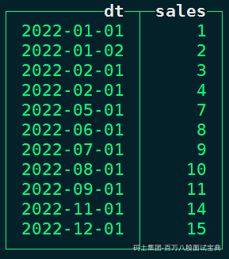
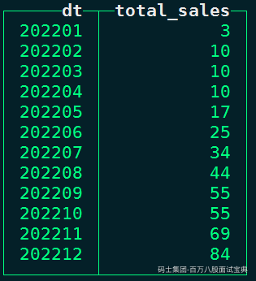
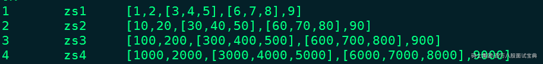
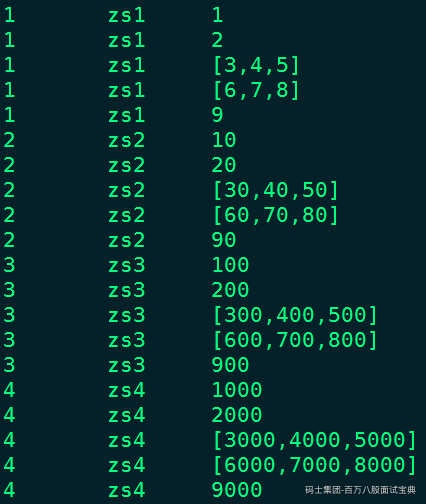

# 1 SQL面试题

## 1.1 查询不相交数据集

使用SQL查询a，b表中不相交的数据集。

a表：

b表：

数据a.txt数据：

数据b.txt数据：

SQL建表语句:

SQL:

## 1.2 表关联查询

使用SQL根据表A，表B 计算出表C。

表A：

表B：

表C：

数据a.txt：

数据b.txt:

Hive SQL建表语句：

SQL结果：

## 1.3 SQL统计利息

有一个拉链表：存款利率表 bal\_rat\_table，数据如下：

id：用户id 、bal:用户存款、rate:利率、startDate:开始时间、endDate:结束日期，9999代表不知道何时结束。

需求:拉链表中存在多种状态的数据（存款），开始日期和结束日期不一致，求出2019年第一个季度：2019-01-01至2019-03-31的每个人的利息。

数据bal\_rat\_table.txt数据：

建表SQL语句：

SQL:

## 1.4 SQL统计最大消费金额

已知：有如下table（名syc\_mianshi），含有三个字段，姓名Name(string)，消费时间DT（string），消费金额Money(Double)，记录条数有若干行。

计算每个人在哪一天的消费金额最大，即应输出：

数据SYC\_mianshi.txt数据：

建表语句SQL:

SQL结果：

## 1.5 SQL开窗求和统计

数据转换：

查询转换成如下结构:

数据data.txt数据：

SQL建表语句：

SQL结果:

## 1.6 SQL多方式统计累计时长

有用户每日游戏时长数据如下：

要求使用SparkSQL统计以下信息:

1. 统计每个用户每天游戏累计时长。(要求同一用户每天游戏时长累加之前所有天的游戏时长）
2. 统计每个用户每天游戏时长累加前一天游戏时长的累计时长。
3. 统计每个用户每天游戏时长累加后一天游戏时长的累计时长。

数据UserPlayData.txt数据如下：

代码实现：

## 1.7 获取状态变化的数据

公司某设备监控数据如下:(device\_id:设备ID,state:设备状态，dt：监控时间)

统计目标：统计出每个设备状态出现变化时前一条数据，统计结果如上图标颜色数据。

数据文件MonitorData.txt数据如下：

代码实现：

## 1.8 SQL统计多日用户留存

有如下数据，用户注册信息表和用户登录信息表：

用户注册信息表 regist\_infos：

用户登录信息表 login\_infos：

SparkSQL统计注册日后1日、2日、3日、4日、5日、6日、7日用户留存数。期望得到的结果(此结果与上面结果无关)：

regist\_infos.csv数据：

login\_infos.csv数据：

SparkSQL代码实现：

## 1.9 行列变换操作

行列变换操作，数据如下：

要求获取以下结果，同时再将数据转换回以上表格样式：

数据row-col.txt数据：

代码如下：

## 1.10 多行转一行SQL转换

行列变换操作，数据如下：

要求获取以下结果,同时将结果再次转换成以上表格（Price除外）：

数据row-col.txt数据：

代码：

## 1.11 SparkSQL-用户在线指标统计

读取 vpnlog 日志文件，其中userName为用户名，ts为记录时间，当type为login时，为登入时间，type为logout为登出时间，问题：

1. 统计这一天，每个小时在线用户数
2. 计算这一天，各个用户的在线总时长，在线次数，最大在线时长（如果用户一天开始是登出记录，则认为他零点登入，如果一天结束时登入日志，则认为他24点登出）。

要求使用SparkSQL实现，并给出计算逻辑说明

数据文件附件如下：

代码如下：

## 1.12 SQL多维查询

需求:求app,channel,province任意组合下的用户数，用一个sql实现，上面一条记录会产生多条记录。

数据testdata.txt数据：

创建表SQL语句：

SQL结果：

## 1.13 统计连续登录用户数

统计连续5天登录的用户，login登录表：

文件logindata.txt数据：

SQL建表语句：

SQL结果：

## 1.14 统计每天次日留存用户数

login登录表：

次日留存为：2020-09-01登录的用户在2020-09-02也登录。

需求：求2020年9月1号之后每日的次日留存数。

文件login.txt数据:

SQL建表语句：

SQL:

## 1.15 行列变换分类统计数据

Hive中有个一个info表，如下：

如果要生成下列结果，该如何写sql?

文件info.txt数据：

SQL建表语句：

SQL查询语句:

## 1.16 SQL数据转换操作

表temp两个字段：

需要转换如下结构：

data.txt数据:

SQL建表语句：

SQL：

## 1.17 用户多信息SQL统计

有如下用户登录明细表tb\_cuid\_1d，一个用户可能对应多条记录:

数据示例：

文件data.txt数据：

SQL建表语句：

1. 写出用户表 tb\_cuid\_1d的 20200401 的次日、次7日留存的具体HQL ：一条sql统计出以下指标 （4.1号uv，4.1号在4.2号的留存uv，4.1号在4.8号的留存uv）

1. 解析tb\_cuid\_1d表中ext中所有的"type"对应的值

1. 统计tb\_cuid\_1d表中，20200401号不同平台 、 版本下的uv、 pv

1. 基于以上统计结果，如果查看当天总的uv，pv是否能直接加和，为什么？

1. 一条sql统计当天不同平台、版本下的uv、pv ， 以及整体的uv， pv

## 1.18 统计用户次日留存率

现在有以下一个数据表

请用一个sql计算2020年1月-2020年2月期间每天注册用户次日留存率？

举个例子：0101注册用户20人，0101注册用户在0102注销用户10人，次日留存率=10/20;0102注册用户30人，0102注册用户在0103注销用户15人，次日留存率=15/30

数据举例：

sql结果：

## 1.19 统计满足指标要求的城市

使用SQL选出下表中6个指标中至少4个指标大于50的城市。

SQL:

## 1.20 统计各行业月销售额

目前爬虫拿到的数据形成两张表，一张是行业表，另一张是商品表，需要清洗出每个行业对应的月销售额（子行业的销售额需要加总到对应的父行业）。

行业表 category：（json格式数据）

商品表item：（json格式数据）

请使用Spark进行数据处理，java,scala都可以。最终得到各行业的月销售表(注意行业有层级关系，子行业的数据需要汇总到父行业)

数据category.txt内容：

数据item.txt内容：

代码：

## 1.21 多行转一行

有如下表及数据，按照需求转换数据。

将以上数据转换成如下格式：

实现以上需求SQL语句如下：

## 1.22 行转列

有如下表及数据：

将以上数据转换成如下格式，进行行转列：

有如下两种方式实现：

## 1.23 列转行

有如下表及数据：

将以上数据转换成如下格式：

实现以上列转行操作有两种方式，如下：

## 1.24 Json数据处理

- **简单json处理**

有如下json数据，建表并加载数据，解析json中各个属性。

- **嵌套json处理**

有如下嵌套json数据，建表加载数据，并获取json中属性值，包括嵌套json中属性的值。

## 1.25 jsonArray处理

有如下jsonArray字符串数据，建表加载数据并获取属性数据。

**注意：以上substr(string A, int start, int len)函数传入的第二个参数为截取字符串的长度。**

## 1.26 SQL时间转换

有如下表和数据，按要求转换数据。

需求：统计每个订单创建日期(yyyy/MM/dd）及运输总时间（小时）。

## 1.27 时间转换用户留存数统计

有如下用户注册和用户活跃数据，建表将数据加载到表中，按照需求进行指标统计。

统计每个注册日往后的1日~7日的用户留存率。

## 1.28 Hive实现循环

有如下用户访问网站数据，在hive中创建表并插入数据，实现相应需求。

现在需要获取用户在每天内的访问记录，即得到如下结果：

以上需求实现Hive中一条数据按照一定规则生成多条数据，sql实现如下：

## 1.29 SQL统计工资排名

有如下员工工资数据，建表并将数据加载到表中分析相应需求。

需求:统计每个部门中工资最高的前3名员工，以及每位员工工资占部门总工资的比例，结果保留4位小数。

## 1.30 HQL实现找出变化的行

有如下数据，三列分别为服务器ID、记录时间、服务器状态，建表并将数据加载到表中，按照要求统计指标。

根据以上表数据，统计每个服务器状态相比于上一条数据变化的数据条目。

## 1.31 HQL实现VPN用户在线指标分析

有如下vpn日志数据，数据中只有一天的用户数据，描述的是用户登录/登出网站信息，根据此数据创建表并进行数据分析。

需求如下：

- 统计该天24小时中，每小时在线的用户数。
- 统计该天每个用户在线的总时长（分钟）、在线次数、最大在线时长（分钟）。（如果用户一天开始时logout记录，则认为该用户零点登录login，如果一天结束时为login记录，则认为他24点登出）

对于第一个需求，观察数据可以发现数据中用户有登录/登出操作，并且该天中用户最开始一条数据可能是登出或者最后一条数据为登录，需要按照相同用户进行错位匹配组织出来缺失的登录/登出数据，然后针对跨小时的每条登录登出数据进行膨胀处理，最后按照小时统计每小时中相同用户数有哪些。

对于第二个需求中，直接基于第一个需求统计的temp3结果先统计每次登录/登出对应的在线时长，然后进一步统计每个用户在线的总时长、在线次数、最大在线时长即可。

## 1.32 连续3日登录用户统计

对user\_activity表中用户活跃数据统计连续3日活跃的用户有哪些。

sql和结果如下：

## 1.33 用户最大活跃天数统计

对user\_activity表中用户活跃数据统计每个用户最大连续活跃的天数是多少？例如：uid1、uid2、uid3最大连续登录天数都为5天。

sql和结果如下：

## 1.34 间隔天连续登录统计

假设用户连续两次登录天间隔一天，也看成用户连续登录，对user\_activity表中用户活跃数据统计每个用户最大连续活跃的天数是多少？例如：uid6在20240604登录，然后在20240606又登录，也看成用户连续登录，uid6最大连续登录天数为5天。

sql思路：根据需求，用户如果连续两次登录间隔一天也算连续登录，那么首先通过lag函数将每行数据与其上一行数据进行关联，进行每行数据日期与下行数据日期差值，如果差值小于2，那么连续差值小于2的登录数据就可以看成是连续登录。当然一个用户中可能会出现连续登录几天后，隔了很长时间又出现连续登录，也就是说一个用户中可能有多个连续登录的情况，我们需要找出用户多个登录情况中最大的连续登录天数。

如下uid6 统计上下两行登录天差值可以看到2024-06-03这天连续登录到2024-06-06，连续登录4天，接着从2024-06-10又连续登录到2024-06-14，连续登录了5天，uid6最大连续登录天数为5。

为了实现统计每个用户多次连续登录天数统计这个需求，我们需要基于以上结果对用户使用diff列处理，如果小于等于2那么赋值为0，否则赋值为1（只要不是连续登录就会出现1），然后按照uid分组，累计每组中从activity\_dt开始到当前行出现1的个数作为flag分组列，得到如下数据：

按照user\_id、flag再次分组找出每组内开始连续登录的第一天和最后一天，如下：

然后再次统计每个user\_id中last\_value和first\_value差值最大的天数作为当前user\_id连续登录最大的天数，这个结果就是将用户间隔一天连续登录也算连续登录的最大天数。

sql如下：

## 1.35 if综合使用查询

有如下销售数据，将数据加载到表sale\_data中。

编写sql统计如下指标。

1. 统计所有数据中所有商品销售额都没有超过1000元的省份有哪些？
2. 统计所有数据中只要有一个商品销售额超过1000元的省份有哪些？
3. 统计所有数据中所有商品销售额都超过1000元的省份有哪些？

此外，第三个需求中统计所有数据中所有商品销售额都超过1000元的省份还可以使用开窗函数中的last\_value来实现，sq如下：

## 1.36 多条件统计

有如下餐饮订单数据，建表并加载数据。统计购买过“麻辣鸡肉”和“香辣牛肉”但没有购买过“甜品”的顾客。

需求：统计购买过“麻辣鸡肉”和“香辣牛肉”但没有购买过“甜品”的顾客。

## 1.37 找出推荐好友

数据表friendship数据如下:

在friendship表中SQL实现好友推荐：如果用户A和用户B互关，并且用户A和用户C互关，那么将B好友推荐给C或者C好友推荐给B，只需要找出这种好友推荐关系即可。

**SQL实现：**

## 1.38 在Clickhouse中实现如下业务

Clickhouse中有如下销售额表sale\_info，对应的列为dt-日期，sales-销售额:

根据以上表统计全年各个月的累计销售额，没有的月份补齐月份，结果如下：

准备sale\_info和数据，sale\_info建表及插入数据如下：

为了补齐各个月份，这里需要创建一个月份基础表month\_info，方便进行关联。month\_info表及数据如下：

实现以上需求步骤如下:

1. 将 sale\_info 与 基础表month\_info 进行关联，补全月份信息
2. 使用sum() over() 窗口函数进行统计累加

最终SQL及结果如下：

## 1.39 解析嵌套的数组类型

需求：Hive中有一张表t1,数据如下:

要求将infos列中的数据，按照逗号划分得到如下数据结果：

数据data.txt(数据按照'\t'分开):

创建Hive表并加载数据：

分析：以上数据在Hive中不大可能使用一条HQL能将结果处理成最终结果，这里需要使用自定义函数进行解析处理，思路如下：

1. 利用正则将字符串中 “[数字,数字,数字]” 字符串匹配出来
2. 匹配后，将“[数字,数字,数字]” 改成 “[数字-数字-数字]”,再更新到对应的字符串
3. 针对修改后的字符串，按照“，”进行分割
4. 将分割后的字符串 使用explode 函数，一变多处理
5. 对新列中“[数字-数字-数字]”数据使用 regexp\_replace 函数处理成原来 “[数字,数字,数字]”

SparkSQL代码如下：
