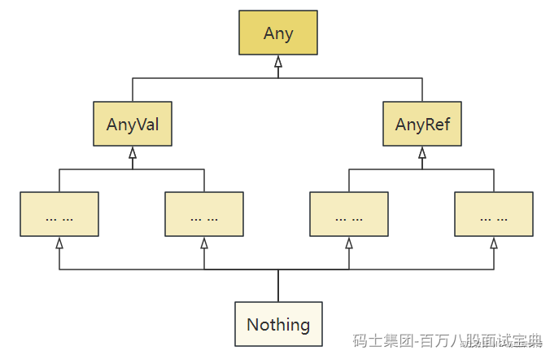

Scala语言中的类型系统非常丰富和强大，涵盖了基本值类型、引用类型，以及与其他函数式语言相匹配的特殊类型。

以下是Scala中数据类型层次结构：

- Any：Scala中一切数据皆对象，Any是所有类型的超类，分为两个子类AnyVal和AnyRef。
- AnyVal:所有值类型的超类。值类型包含Byte、Shot、Int、Long、Float、Double、Char、Boolean、Unit等。
- AnyRef:所有引用类型的超类。引用类型包含String、Null、Option、Nil，以及所有用户定义的类。
- Nothing：Nothing是所有类型（包括AnyVal和AnyRef）的子类型。它没有实例，常用于表示“不可能的情况”或方法的异常终止。例如，throw new Exception的返回值类型是Nothing。
