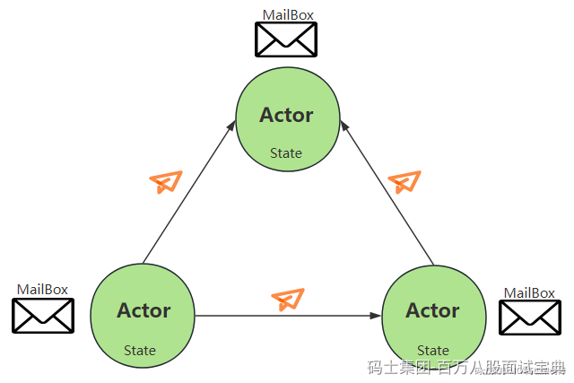

并发编程（Concurrent Programming） 是一种让多个任务同时执行的编程范式，主要用于提升程序的执行效率和响应能力。

- **Java中的并发编程**

Java中的并发编程是基于共享数据和加锁的一种机制，即会有一个共享的数据，然后有若干个线程去访问这个共享的数据(主要是对这个共享的数据进行修改)，同时Java利用加锁的机制(即synchronized)来确保同一时间只有一个线程对我们的共享数据进行访问,进而保证共享数据的一致性。Java中的并发编程存在资源争夺和死锁等多种问题，因此程序越大问题越麻烦。

- **Scala中的并发编程**

Scala中的并发编程思想与Java中的并发编程思想完全不一样，Scala 的并发编程基于Actor 模型，避免了共享数据和锁机制的复杂性。Actor 模型通过消息传递实现线程间通信，不直接共享数据，从而避免了资源争夺和死锁问题。

## **Actor 模型的核心组成：**

1. 状态（State）：每个 Actor 独立管理自己的状态，禁止直接访问其他 Actor 的内部状态。
2. 行为（Behavior）：响应接收到的消息的逻辑。
3. 邮箱（MailBox）：用于存储接收到但未处理的消息，按 FIFO 顺序排队处理。

Actor之间只能通过消息进行通信，消息传递是异步的，每个Actor都有邮箱（MailBox）接收并缓存其他Actor发送过来的消息，对应Actor会不断的循环自己的邮箱，并通过receive偏函数进行消息的模式匹配并进行相应的处理，这里每个Actor中的邮箱就是一个消息队列，进来的消息按先来后到排列，依次被处理，保证同一时间只有一个消息被处理，避免了多线程的竞争问题。

举例：如果Actor A和 Actor B要相互沟通的话，首先A要给B传递一个消息，B会有一个邮箱，然后B会不断的循环自己的邮箱， 若看见A发过来的消息，B就会解析A的消息并执行，处理完之后就有可能将处理的结果通过消息传递的方式发送给A。

## **Actor的特征：**

- ActorModel是消息传递模型,基本特征就是消息传递。
- 消息发送是异步的，非阻塞的。
- 消息一旦发送成功，不能修改。
- Actor之间传递时，自己决定决定去检查消息，而不是一直等待，是异步非阻塞的。

早期 Scala 标准库通过 scala.actors 提供 Actor 支持，但从 Scala 2.10 开始，该功能被弃用。官方推荐使用功能更强大的 Akka 框架，Akka是目前 Scala 中 Actor 使用的首选工具。

Akka 是一个现代化的、功能强大的 Actor 模型实现框架，简化了 Actor 模型的开发，主要用 Scala 和 Java 实现，具有极强的伸缩性和容错能力，适用于构建高并发、分布式、事件驱动的系统。例如，早期的 Spark 使用 Akka 进行节点间通信。

**注意：**在 Spark 的早期版本（1.6版本之前），Master 和 Worker 的通信使用的是 Akka，通过 Akka 的 Actor 模型实现了分布式环境中组件之间的消息传递。Spark 后来将 Akka 替换为自定义的网络模块 Netty，以提升性能和定制化能力，但仍保留了 Actor 模型的核心思想（即基于消息传递的通信机制）。
