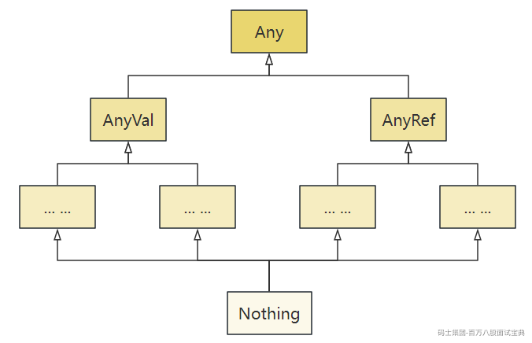
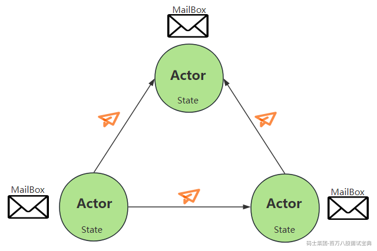

# 1 Scala面试题

## 1.1 Scala中k.eq(curKey)和key.equals(curKey)什么区别？

k.eq(curKey) 和 k.equals(curKey) 都用于比较两个对象是否相等，但它们之间有一些区别。

- k.eq(curKey): Scala 中用于检查两个对象是否是同一个引用的方法，如果 k 和 curKey 是同一个对象（即它们在内存中的地址相同），则返回 true；否则返回 false，这个方法在底层会直接调用 Java 中的 == 操作符，因此相当于 Java 中的对象引用比较。
- k.equals(curKey)： Scala 中用于检查两个对象是否在逻辑上相等的方法，默认情况下，这个方法与 Java 中的 equals 方法具有相同的行为，即如果两个对象的内容相同，则返回 true，否则返回 false。可以通过重写类的 equals 方法来定义自定义的相等性比较逻辑。

代码测试如下：

## 1.2 Scala类型层次结构

Scala语言中的类型系统非常丰富和强大，涵盖了基本值类型、引用类型，以及与其他函数式语言相匹配的特殊类型。

以下是Scala中数据类型层次结构：

- Any：Scala中一切数据皆对象，Any是所有类型的超类，分为两个子类AnyVal和AnyRef。
- AnyVal:所有值类型的超类。值类型包含Byte、Shot、Int、Long、Float、Double、Char、Boolean、Unit等。
- AnyRef:所有引用类型的超类。引用类型包含String、Null、Option、Nil，以及所有用户定义的类。
- Nothing：Nothing是所有类型（包括AnyVal和AnyRef）的子类型。它没有实例，常用于表示“不可能的情况”或方法的异常终止。例如，throw new Exception的返回值类型是Nothing。

## 1.3 Scala Object与Class区别？

Scala中Class和Object区别如下：

## 1.4 Scala中equals、==、eq区别？

在Scala中，对象比较可以使用equals、==、eq三种方式，它们的行为有所不同：

- equals:在 Scala 中，equals 是从 Java 继承的，可以直接使用，用于比较两个对象的内容是否相等,但使用时需要注意可能出现 NullPointerException。
- ==：在Java中，==对于引用类型来说比较的是地址，对于基本类型来说，进行数值比较。而在Scala中，== 是值相等性的比较，在字符串比较中用于判断两个字符串的内容是否相等，但Scala中== 操作符经过优化会先做 null 检查，从而避免 NullPointerException。
- eq方法:这是 Scala 中对象引用相等性的比较，用于比较两个引用是否指向同一个对象，等同于Java中==使用。

**三者区别表格如下：**

**字符串比较代码示例如下：**

## 1.5 Scala中什么是尾递归？

Scala尾递归（Tail Recursion）是递归的一种特殊形式，它的特点是递归调用是函数执行中的最后一个操作，递归函数在调用自身后，不需要额外记住每次的调用状态，可以把递归变成简单的循环，直接将结果返回。

尾递归的主要优势在于它可以被编译器优化成迭代，从而避免因递归调用过深占用太多栈空间，避免栈溢出问题。

下面以计算5的阶乘为例，说明非尾递归和尾递归的对比。

- **非尾递归示例**

以上普通递归中：

1. 调用fun(5)返回5\*fun(4),需要等待fun(4)的结果;
2. 调用fun(4)返回4\*fun(3),需要等待fun(3)的结果;
3. 调用fun(3)返回3\*fun(2),需要等待fun(2)的结果;
4. 调用fun(2)返回2\*fun(1),需要等待fun(1)的结果;

最终，fun(1)为1;fun(2)=2;fun(3)=3\*2=6;fun(4)=4\*6=24;fun(5)=5\*24=120。在这个过程中，每次调用的状态都要保存下来（比如 n 和乘法操作），所以栈空间使用会随着递归深度增长。

- **尾递归示例**

以上尾递归中：

1. 调用fun(5,1)返回fun(4,5)，结果传递到了下一步;
2. 调用fun(4,5)返回fun(3,20)，结果传递到了下一步;
3. 调用fun(3,20)返回fun(2,60)，结果传递到了下一步;
4. 调用fun(2,60)返回fun(1,120)，结果传递到了下一步;
5. 调用fun(1,120)返回120,直接得到结果。

在尾递归这个过程中，每次调用的结果直接传递给下一步，不需要保存状态，节省栈空间，避免栈空间溢出问题。

## 1.6 Scala中Trait与抽象类区别？

Scala中抽象类和Trait区别如下：

## 1.7 Scala中继承抽象类和Trait问题

假设Scala中A类继承了B类，并且继承C特质、D特质，C特质和D特质同时继承了E类，请问A类在初始化时，构造器的执行顺序。

构造器执行顺序依赖以下原则：

1. 先执行继承链上所有父类的构造器，最顶层的父类最先执行。
2. 再按声明顺序从左到右执行特质的构造器。
3. 最后执行当前类的构造器。

所以案例中构造执行顺序如下：

1. E Constructor:E 作为所有类和特质的共同父类，其构造器在整个继承链中最先执行,虽然 C 和 D 都继承了 E，但 E 的构造器只会执行一次。
2. B Constructor:B 是 A 的直接父类，其构造器在所有特质构造器之前执行。
3. C Constructor 和 D Constructor:特质按从左到右的顺序执行构造器。这里 C 在 D 之前执行。
4. A Constructor:执行 A 类自己的构造器。

**代码示例：**

运行结果如下：

## 1.8 介绍Scala闭包

闭包（Closure） 是 Scala 中的重要概念，指一个函数能够捕获并使用未在其内部声明的外部变量。闭包的核心是将函数和其引用的外部变量“打包”在一起，使得函数在任意地方执行时都能访问这些变量。用通俗的话说，闭包就是一个“带着外部变量的函数”。

**闭包的作用：**

- 动态逻辑生成：可以动态生成带有上下文状态的函数。
- 提升代码灵活性和复用性：广泛用于高阶函数和柯里化函数。

**闭包简单示例：**

以上代码中，函数 addToNumber 是一个闭包，因为它捕获了外部变量 number，即使变量 number 在函数之外定义，闭包仍然能“记住”它，当我们修改 number 的值时，闭包会使用新的值。

## 1.9 按要求实现Scala高阶函数

请参照Scala中常见的map函数实现一个名为mymap的高阶函数。mymap接收两个参数值，第一个为函数(x:Int)=>3\*x ，第二个为Int型数据。在mymap函数体内将第一个参数作用与第二个参数。

## 1.10 Scala中asInstanceOf和cast区别？

在 Scala 中，asInstanceOf 和 cast 是用于类型转换的两种方式，但它们在用法和适用场景上有所不同，区别如下：

总结：asInstanceOf适用于 Scala 环境中简单的强制转换;cast 更适合与 Java 集成时使用，尤其是在反射和动态类型检查中。

**代码示例：**

## 1.11 介绍下Scala中隐式转换

在Scala中，隐式转换是一个强大的特性，能够在编译期间自动地将一种类型转换为另一种类型，通常是在没有显式调用转换的情况下。这一机制能有效减少代码冗余并提高灵活性。下面介绍隐式转换相关内容，包括隐式值、隐式参数、隐式转换函数和隐式类的使用。

1. **隐式值&隐式参数**

**隐式值是使用 implicit 关键字修饰的值，隐式参数是方法中的参数通过 implicit 关键字修饰**，允许调用时省略这些参数,Scala 编译器会在作用域中自动查找对应类型的隐式值传递给方法，从而实现参数的隐式注入。

**使用隐式值和隐式参数注意点如下：**

- 同一作用域内，同类型的隐式值只能定义一次，如果定义多个，会导致编译器无法确定使用哪个值，报错。**这里说的作用域是指当前代码作用域（显式导入或定义的内容）、类型相关的隐式作用域（包括目标类型的伴生对象、父类伴生对象以及包对象）。**
- 定义隐式值时，implicit 关键字必须放在修饰值的最前面;定义隐式参数时，implicit 必须出现在参数列表开头且只能出现一次。
- 如果方法只有一个参数且是隐式参数，可以直接用 implicit 修饰参数；如果所有参数都是隐式参数，直接写一个implicit关键字即可。
- 如果方法有多个参数，其中部分是隐式参数时，必须使用柯里化这种方式定义方法，隐式关键字implicit出现在后面括号且只能出现一次。

隐式值和隐式参数使用案例如下：

以上案例注意：

- 同一作用域内不能有多个类型相同但名称不同的隐式值，这里说的作用域是指当前代码作用域（显式导入或定义的内容）、类型相关的隐式作用域（包括目标类型的伴生对象、父类伴生对象以及包对象）。
- 如果一个方法中有部分参数是隐式的，可以使用柯里化方式定义该方法，隐式参数放在后面括号中。

1. **隐式转换函数**

隐式转换函数是通过 implicit 修饰的普通方法，用于在两种类型之间进行转换。当某类型调用的方法或属性在其定义中不存在时，编译器会尝试在作用域内查找适当的隐式转换函数，将该类型转换为支持调用所需方法或属性的类型。隐式转换函数的作用在于无需修改原类即可扩展其功能。

举例：运行Scala代码时，假设如果A类型变量调用了method()这个方法，发现A类型的变量没有method()方法，而B类型有此method()方法，Scala会在作用域中寻找有没有隐式转换函数将A类型转换成B类型，如果有隐式转换函数，那么A类型就可以调用method()这个方法。

使用隐式转换函数注意如下几点：

- 隐式转换函数只与参数类型和返回类型有关，与函数名无关。只能接受一种类型的参数并返回一种类型，转换后参数类型会继承返回类型的属性和方法。
- 作用域内不能存在多组参数类型和返回类型相同但函数名不同的隐式转换函数，否则会导致编译冲突。这里说的作用域是指当前代码作用域（显式导入或定义的内容）、类型相关的隐式作用域（包括目标类型的伴生对象、父类伴生对象以及包对象）。
- 隐式转换函数不能接受额外参数，仅允许单参数的类型转换。

**案例：通过隐式转换函数为类扩展功能。**

注意：隐式转换函数只能传入一种类型，返回一种类型，不能传入其他额外参数。

1. **隐式类**

隐式类是用 implicit 修饰的类，用于为现有类型添加方法或属性，而无需修改原类型。它是一种优雅的方式，扩展已有类型的功能。当某类型的实例缺少所需的方法或属性时，可以通过定义隐式类，为该类型添加所需的功能，隐式类的构造参数用于接收要增强功能的类型实例。

举例：假设对象A没有某些方法或者某些变量时，而使用对象A时想要让A可以调用某些方法或者某些变量时，可以定义一个隐式类，隐式类中定义要使用的方法或者变量，隐式类参数中传入对象A即可。

使用隐式类需要注意如下几点：

- 隐式类必须定义在类、对象或包对象中，不能单独定义在其他作用域内。
- 隐式类的构造只能有一个参数。
- 同一作用域内不能存在构造器参数类型相同的多个隐式类。这里说的作用域是指当前代码作用域（显式导入或定义的内容）、类型相关的隐式作用域（包括目标类型的伴生对象、父类伴生对象以及包对象）。
- 隐式类与隐式转换函数都可以给类增加功能，隐式类作用在类级别上。

隐式类代码示例：

以上代码中，隐式类通过参数接收 Rabbit 实例，为其扩展了 canFly 方法和 tp 属性，使 Rabbit 实例可以直接调用这些新功能。

## 1.12 按要求实现函数功能

给Scala List[Int]对象增加myForeach方法，可以直接使用List[Int]调用，该方法给List中每个元素增加100。

该需求可以通过隐式转换函数实现，代码如下：

以上代码中通过隐式转换函数 myfun，List[Int] 类型的对象在作用域内可以调用 xx类中定义的 myForeach 方法，而无需修改 List 类本身。

## 1.13 Scala如何实现并发编程

并发编程（Concurrent Programming） 是一种让多个任务同时执行的编程范式，主要用于提升程序的执行效率和响应能力。

- **Java中的并发编程**

Java中的并发编程是基于共享数据和加锁的一种机制，即会有一个共享的数据，然后有若干个线程去访问这个共享的数据(主要是对这个共享的数据进行修改)，同时Java利用加锁的机制(即synchronized)来确保同一时间只有一个线程对我们的共享数据进行访问,进而保证共享数据的一致性。Java中的并发编程存在资源争夺和死锁等多种问题，因此程序越大问题越麻烦。

- **Scala中的并发编程**

Scala中的并发编程思想与Java中的并发编程思想完全不一样，Scala 的并发编程基于Actor 模型，避免了共享数据和锁机制的复杂性。Actor 模型通过消息传递实现线程间通信，不直接共享数据，从而避免了资源争夺和死锁问题。

**Actor 模型的核心组成：**

1. 状态（State）：每个 Actor 独立管理自己的状态，禁止直接访问其他 Actor 的内部状态。
2. 行为（Behavior）：响应接收到的消息的逻辑。
3. 邮箱（MailBox）：用于存储接收到但未处理的消息，按 FIFO 顺序排队处理。

Actor之间只能通过消息进行通信，消息传递是异步的，每个Actor都有邮箱（MailBox）接收并缓存其他Actor发送过来的消息，对应Actor会不断的循环自己的邮箱，并通过receive偏函数进行消息的模式匹配并进行相应的处理，这里每个Actor中的邮箱就是一个消息队列，进来的消息按先来后到排列，依次被处理，保证同一时间只有一个消息被处理，避免了多线程的竞争问题。

举例：如果Actor A和 Actor B要相互沟通的话，首先A要给B传递一个消息，B会有一个邮箱，然后B会不断的循环自己的邮箱， 若看见A发过来的消息，B就会解析A的消息并执行，处理完之后就有可能将处理的结果通过消息传递的方式发送给A。

**Actor的特征：**

- ActorModel是消息传递模型,基本特征就是消息传递。
- 消息发送是异步的，非阻塞的。
- 消息一旦发送成功，不能修改。
- Actor之间传递时，自己决定决定去检查消息，而不是一直等待，是异步非阻塞的。

早期 Scala 标准库通过 scala.actors 提供 Actor 支持，但从 Scala 2.10 开始，该功能被弃用。官方推荐使用功能更强大的 Akka 框架，Akka是目前 Scala 中 Actor 使用的首选工具。

Akka 是一个现代化的、功能强大的 Actor 模型实现框架，简化了 Actor 模型的开发，主要用 Scala 和 Java 实现，具有极强的伸缩性和容错能力，适用于构建高并发、分布式、事件驱动的系统。例如，早期的 Spark 使用 Akka 进行节点间通信。

**注意：**在 Spark 的早期版本（1.6版本之前），Master 和 Worker 的通信使用的是 Akka，通过 Akka 的 Actor 模型实现了分布式环境中组件之间的消息传递。Spark 后来将 Akka 替换为自定义的网络模块 Netty，以提升性能和定制化能力，但仍保留了 Actor 模型的核心思想（即基于消息传递的通信机制）。
