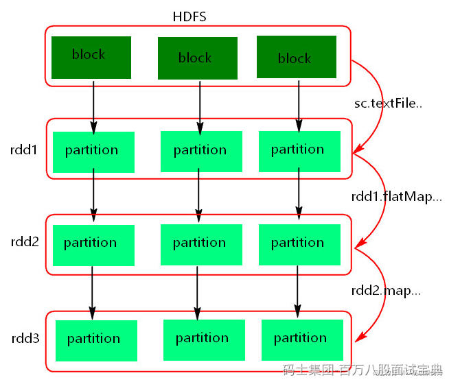

RDD理解图如下:

RDD（Resilient Distributed Datasets，弹性分布式数据集）是一个不可变的、可分区、可并行操作的数据结构。它可以在集群中的多个节点上分布式存储和计算，以实现高效的数据处理。在Spark中RDD是基本的数据抽象，所有的其他数据抽象都是基于RDD来实现。

## **RDD具有五大特性：**

1. RDD创建后不可变、不可修改，由一系列的partition组成的。
2. 函数是作用在每一个partition（split）上的，分区是并行计算的基本单位。
3. RDD之间有一系列的依赖关系，分为宽依赖和窄依赖。
4. 分区器是作用在K,V格式的RDD上，分区器决定数据去往哪些分区被处理。
5. RDD提供一系列最佳的计算位置，利于数据处理的本地化。

## **RDD的缺点如下:**

1. RDD不支持更新操作：RDD是不可变的数据结构，如果需要更新数据，必须重新生成一个新的RDD，并删除旧的RDD，这可能会导致性能下降。
2. 非固定数据类型：RDD是一种泛型的数据结构，没有固定的数据类型，在处理数据时需要进行大量的类型转换，涉及数据对象的序列化和反序列化过程，降低计算性能。数据类型不支持嵌套类型，例如：Map,Array，List,Row等。
3. 不支持实时查询：RDD是基于批处理的模型，无法进行实时查询，可以使用SparkStreaming、StructuredStreaming来处理。

虽然RDD存在以上缺陷，但仍是Spark的核心数据抽象，因为它提供了一种简单、可靠、可扩展的数据处理方式。
