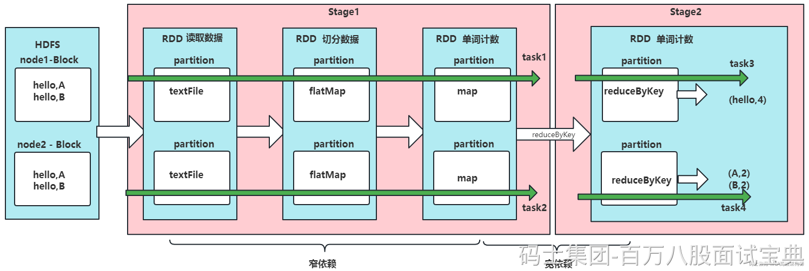

在Spark中Application由Job组成，而每个Job又由多个Stage组成，每个Stage由多个Task组成，它们之间的关系如下：

- Application是一个完整的Spark应用程序，包含多个Job。
- Job是Spark应用程序中的一个作业，通常由多个Stage组成，每个Job负责完成一个特定的计算任务。
- Stage是一个Job中的一个阶段，通常由多个Task组成，每个Stage负责完成一定的计算操作。在Spark中，一个Stage可以是Map Stage或Reduce Stage。
- Task是一个Stage中的一个任务单元，负责对一个数据分区进行计算操作。在Spark中，一个Task对应于一个数据分区和一个计算操作，可以并行执行。

Spark Application是最高层次的概念，最终会经过一系列对象转换分解为多个Task，并将这些task分配到集群中的多个节点上并行执行，从而实现高效的分布式计算。
