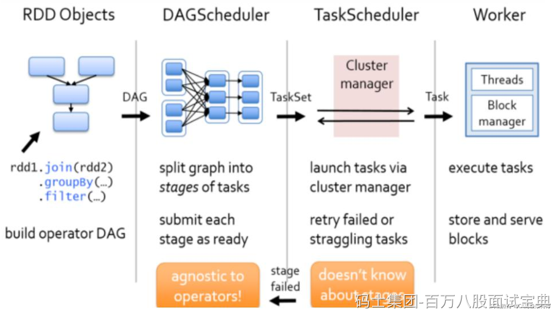
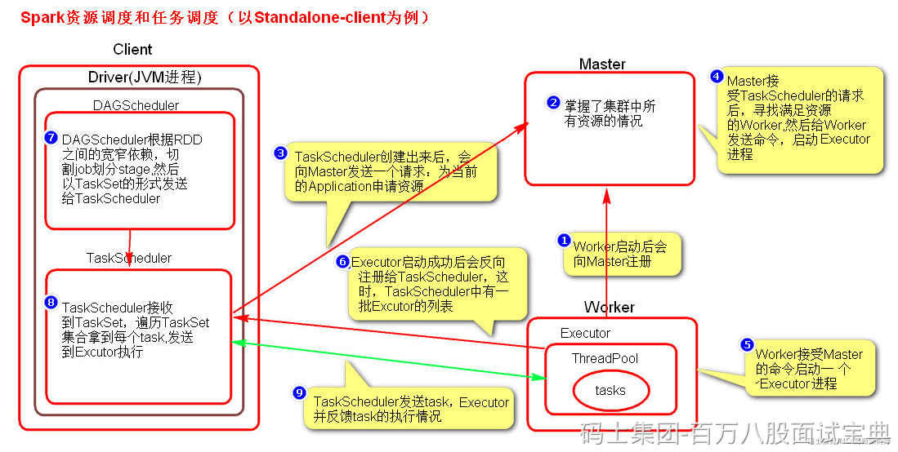

启动集群后，Worker节点会向Master节点汇报资源情况，Master掌握了集群资源情况。当Spark提交一个Application后，根据RDD之间的依赖关系将Application形成一个DAG有向无环图。任务提交后，Spark会在Driver端创建两个对象：DAGScheduler和TaskScheduler，DAGScheduler是任务调度的高层调度器，是一个对象。DAGScheduler的主要作用就是将DAG根据RDD之间的宽窄依赖关系划分为一个个的Stage，然后将这些Stage以TaskSet的形式提交给TaskScheduler（TaskScheduler是任务调度的低层调度器，这里TaskSet其实就是一个集合，里面封装的就是一个个的task任务,也就是stage中的并行度task任务），TaskSchedule会遍历TaskSet集合，拿到每个task后会将task发送到计算节点Executor中去执行（其实就是发送到Executor中的线程池ThreadPool去执行）。task在Executor线程池中的运行情况会向TaskScheduler反馈，当task执行失败时，则由TaskScheduler负责重试，将task重新发送给Executor去执行，默认重试4次，如果重试task4次后task依然没有执行成功，那么这个task所在的stage就失败了。stage失败了则由DAGScheduler来负责重试Stage，重新发送TaskSet到TaskSchdeuler，Stage默认重试4次。如果重试4次以后依然失败，那么这个job就失败了。job失败了，Application就失败了。

## ​
