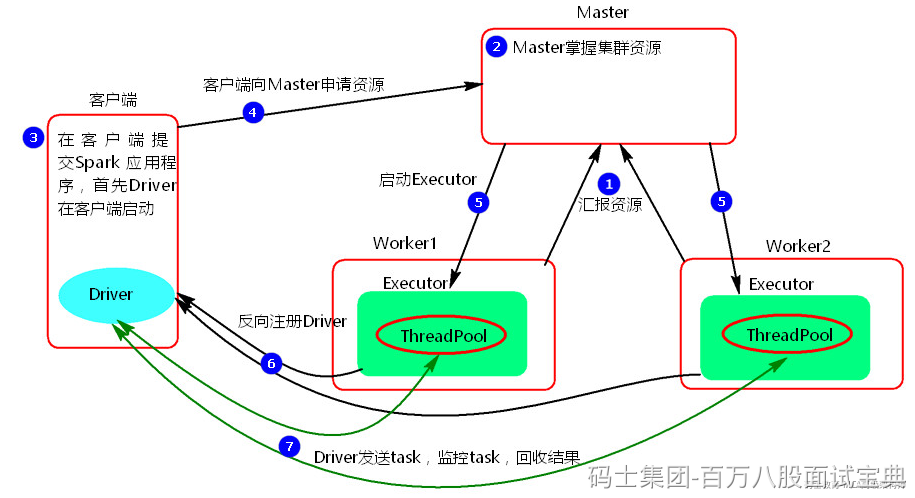
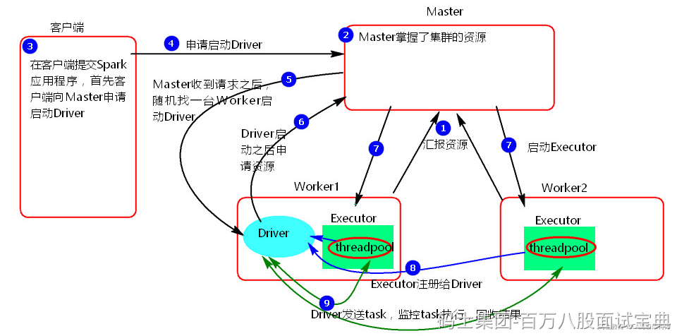
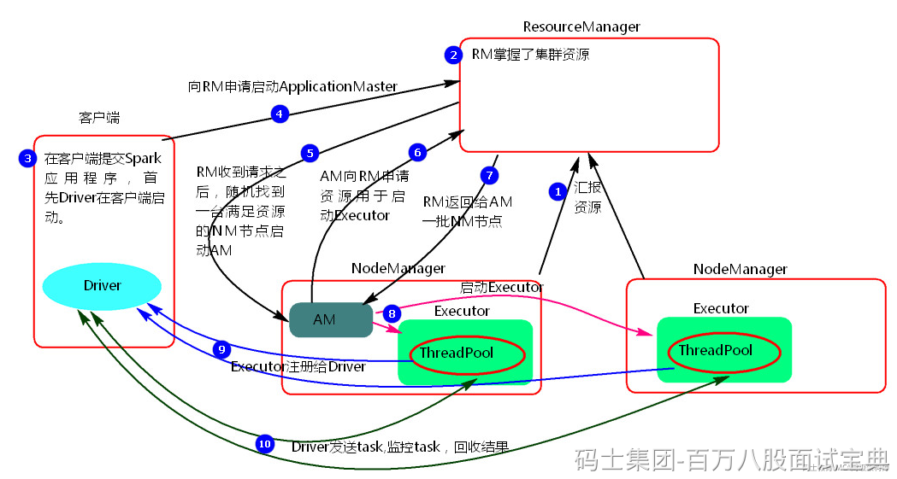
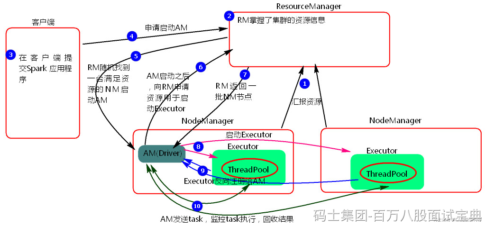

Spark任务部署模式有以下几种：

- Local Mode（本地模式）：Spark应用程序在单机上运行，主要用于开发和测试。
- Standalone Mode（独立模式）：Spark应用程序在集群上运行，但不依赖于任何资源管理器，需要手动配置集群环境。
- Hadoop YARN Mode（YARN模式）：Spark应用程序在基于Hadoop的YARN资源管理器上运行。
- Apache Mesos Mode（Mesos模式）：Spark应用程序在Apache Mesos资源管理器上运行，可以与其他Mesos框架共享同一集群资源。
- Kubernetes Mode（Kubernetes模式）：Spark应用程序在Kubernetes集群上运行，可以直接使用Kubernetes提供的资源管理和调度功能。

以上常见的Spark部署模式是Standalone和Yarn 。Spark 任务提交运行有两种模式：client和cluster，下面基于Standalone和Yarn部署提交任务来介绍Spark任务运行模式。

## **Standalone-client:**

**提交命令:**

|  |
| --- |
| ./spark-submit --master spark://mynode1:7077 \  --deploy-mode client \  --class org.apache.spark.examples.SparkPi ../examples/jars/spark-examples\_2.12-3.3.1.jar 100 |

**执行原理图:**

**执行流程：**

1. client模式提交任务后，会在客户端启动Driver进程。
2. Driver会向Master申请启动Application启动的资源。
3. Master收到请求之后会在对应的Worker节点上启动Executor
4. Executor启动之后，会注册给Driver端，Driver掌握一批计算资源。
5. Driver端将task发送到worker端执行。worker将task执行结果返回到Driver端。

**总结：**

client模式适用于测试调试程序。Driver进程是在客户端启动的，这里的客户端就是指提交应用程序的当前节点。在Driver端可以看到task执行的情况。生产环境下不能使用client模式，是因为：假设要提交100个application到集群运行，Driver每次都会在client端启动，那么就会导致客户端100次网卡流量暴增的问题。client模式适用于程序测试，不适用于生产环境，在客户端可以看到task的执行和结果。

## **Standalone-cluster:**

**提交命令:**

|  |
| --- |
| ./spark-submit --master spark://mynode1:7077  --deploy-mode cluster  --class org.apache.spark.examples.SparkPi ../examples/jars/spark-examples\_2.12-3.3.1.jar 100 |

**执行原理图：**

**执行流程:**

1. cluster模式提交应用程序后，会向Master请求启动Driver.
2. Master接受请求，随机在集群一台节点启动Driver进程。
3. Driver启动后为当前的应用程序申请资源。
4. Driver端发送task到worker节点上执行。
5. worker将执行情况和执行结果返回给Driver端。

**总结：**

Driver进程是在集群某一台Worker上启动的，在客户端是无法查看task的执行情况的。假设要提交100个application到集群运行,每次Driver会随机在集群中某一台Worker上启动，那么这100次网卡流量暴增的问题就散布在集群上。

## **Yarn-client：**

**提交命令：**

|  |
| --- |
| ./spark-submit  --master yarn  --deploy-mode client  --class org.apache.spark.examples.SparkPi ../examples/jars/spark-examples\_2.12-3.3.1.jar 100 |

**执行原理图解：**

**执行流程：**

1. 客户端提交一个Application，在客户端启动一个Driver进程。
2. 应用程序启动后会向RS(ResourceManager)发送请求，启动AM(ApplicationMaster)的资源。
3. RS收到请求，随机选择一台NM(NodeManager)启动AM。这里的NM相当于Standalone中的Worker节点。
4. AM启动后，会向RS请求一批container资源，用于启动Executor.
5. RS会找到一批NM返回给AM,用于启动Executor。
6. AM会向NM发送命令启动Executor。
7. Executor启动后，会反向注册给Driver，Driver发送task到Executor,执行情况和结果返回给Driver端。

**总结:**

Yarn-client模式同样是适用于测试，因为Driver运行在本地，Driver会与yarn集群中的Executor进行大量的通信，会造成客户机网卡流量的大量增加。

## **Yarn-cluster：**

**提交命令:**

|  |
| --- |
| ./spark-submit  --master yarn-cluster  --class org.apache.spark.examples.SparkPi ../examples/jars/spark-examples\_2.12-3.3.1.jar 100 |

**执行原理图：**

**执行流程:**

1. 客户机提交Application应用程序，发送请求到RS(ResourceManager),请求启动AM(ApplicationMaster)。
2. RS收到请求后随机在一台NM(NodeManager)上启动AM（相当于Driver端）。
3. AM启动，AM发送请求到RS，请求一批container用于启动Executor。
4. RS返回一批NM节点给AM。
5. AM连接到NM,发送请求到NM启动Executor。
6. Executor反向注册到AM所在的节点的Driver。Driver发送task到Executor。

**总结:**

Yarn-Cluster主要用于生产环境中，因为Driver运行在Yarn集群中某一台nodeManager中，每次提交任务的Driver所在的机器都是随机的，不会产生某一台机器网卡流量激增的现象，缺点是任务提交后不能看到日志。只能通过yarn查看日志。
