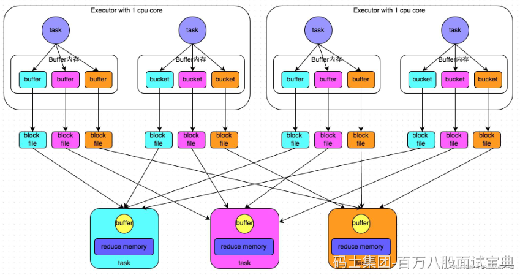
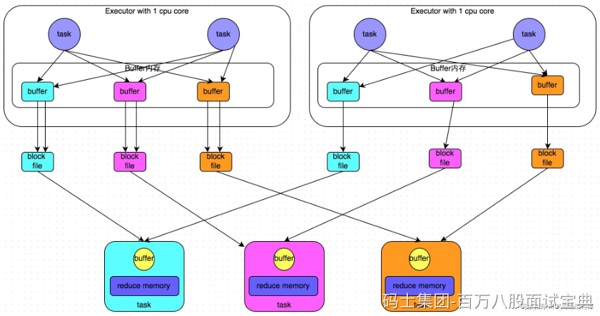
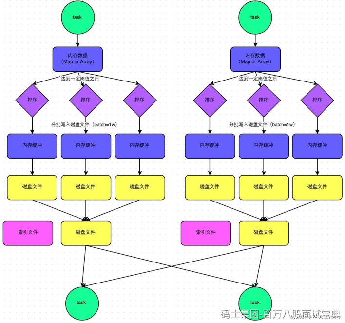
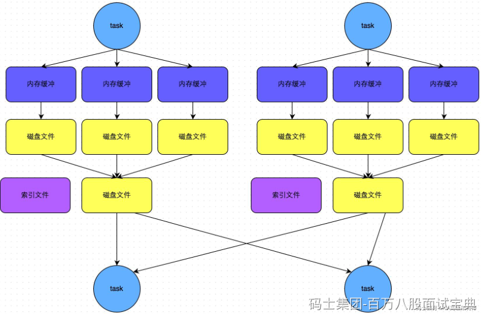

SparkShuffle分为两种，一种是基于Hash的Shffle，一种是基于Sort的Shuffle，对应的ShuffleManager管理对象为HashShuffleManager和SortShuffleManager。早先Spark版本仅支持HashShuffleManager，在Spark1.1版本开始支持SortShuffleManager,Spark1.2版本默认使用SotShuffleManager。Spark2.0版本后彻底丢弃HashShuffleManager。下面分别介绍两种shuffle，可以重点关注SortShuffleManager。

## **HashShuffleManager**

HashShffleManager中有两种机制：普通机制和优化机制。

### **普通机制：**

**执行流程:**

1. 每一个map task将不同结果写到不同的buffer中，每个buffer的大小为32K。buffer起到数据缓存的作用。
2. 每个buffer文件最后对应一个磁盘小文件。
3. reduce task来拉取对应的磁盘小文件。

**特点：**HashShuffle非优化模式产生的磁盘小文件个数为M（map task的个数）\*R（reduce task的个数），产生的小文件数量比较多，Shuffle写出数据慢，Shuffle读取数据也慢，另外，在数据传输过程中会有频繁的网络通信，频繁的网络通信出现通信故障的可能性大大增加，一旦网络通信出现了故障会导致shuffle file cannot find 由于这个错误导致的task失败，TaskScheduler不负责重试，由DAGScheduler负责重试Stage，严重制约Spark性能。

### **优化机制：**

针对HashShuffleManager写出数据文件多的问题，可以设置参数spark.shuffle.consolidateFiles为true来让map端1个core中执行的多个maptask产生的shuffle数据到一份小文件中，如上图所示，这样就大大减少了Map端Shuffle数据小文件的数量，这种情况下产生的小文件的数据个数为：C(core的个数)\*R（reduce的个数）。

## **SortShuffleManager**

以上HashShffleManager的两种机制，中间结果小文件的个数都会依赖于ReduceTask个数，也就意味着在海量数据处理情况中，小文件的数量还是不可控，所以Spark在Spark1.1版本引入了SortShuffleManager。

SortShuffleManager分为普通机制、bypass运行机制和Tungsten SortShuffle运行机制。

### **普通机制:**

**执行流程**

1. map task 的计算结果会写入到一个内存数据结构里面（例如：聚合类的 shuffle 算子，那么会选用 Map 数据结构；join Shuffle会选择Array数据结构），内存数据结构默认是5M。
2. 在shuffle写入数据时候会估算这个内存结构的大小，当内存结构中的数据超过5M时，比如现在内存结构中的数据为5.01M，那么他会申请5.01\*2-5=5.02M内存给内存数据结构。
3. 如果申请成功不会进行溢写，如果申请不成功，这时候会发生溢写磁盘。在溢写之前内存结构中的数据会进行排序
4. 然后开始溢写磁盘，写磁盘是以batch的形式去写，一个batch是1万条数据，写入磁盘文件是通过 Java 的 BufferedOutputStream 实现的。BufferedOutputStream 是 Java 的缓冲输出流，首先会将数据缓冲在内存中，当内存缓冲满溢之后再一次写入磁盘文件中，这样可以减少磁盘 IO 次数，提升性能。
5. map task执行完成后，会将这些磁盘小文件Merge合并成一个大的磁盘文件，同时生成一个索引文件,索引文件会标识下游各个 reduce task 的数据在文件中的 start offset 与 end offset。
6. reduce task去map端拉取数据的时候，首先解析索引文件，根据索引文件再去拉取对应的数据。

**特点：**

SortShuffleManager由于最终会对磁盘多次溢写的小文件进行合并，所以这种机制中产生的磁盘小文件数量： 2\*M（map task的个数），大大减少了Shffle小文件数据量。

### **bypass机制:**

Map端对于一些非聚合不需排序的Shuffle操作(例如：groupByKey，手动实现map端没有聚合CombainByKey)，这时可以选择使用SortShuffleManager中的Bypass机制，这种机制在Shuffle数据落地时不会进行数据排序，落地的多个小文件最终线性排在一起形成最终map task对应的一个磁盘文件，也就是说启用该机制的最大好处在于，shuffle write 过程中，不需要进行数据的排序操作，也就节省掉了这部分的性能开销，相对于普通机制提高性能。这种机制产生的磁盘小文件数量与普通机制一样，为2\*M（map task的个数）。

bypass运行机制触发条件如下:

1. Shuffle Map task个数小于spark.shuffle.sort.bypassMergeThreshold参数的值（默认200）
2. Map端没有预聚合操作

- **Tungsten Sort Shuffle（UnsafeShuffleWriter）机制**

Tungsten sort shuffle是Spark 1.6版本中引入的新Shuffle实现方式。使用了内存管理器和二进制格式的序列化器，可以将数据存储在堆外内存中，不需数据反序列化而进行高效的排序和传输。相比于普通机制，UnsafeShuffle减少内存占用和垃圾回收的负担，从而提高了Spark的性能和可靠性。

使用UnsafeShffleWriter条件比较苛刻，满足如下条件才能使用Tungsten SortShffle：

1. Shuffle dependency 不能带有aggregation 或者输出需要排序。
2. Shuffle 的序列化器需要是 KryoSerializer 或者 Spark SQL's 自定义的一些序列化方式。
3. Shuffle 文件的数量不能大于 16777216（2的24次方）
4. 序列化时，单条记录不能大于 128 MB。
