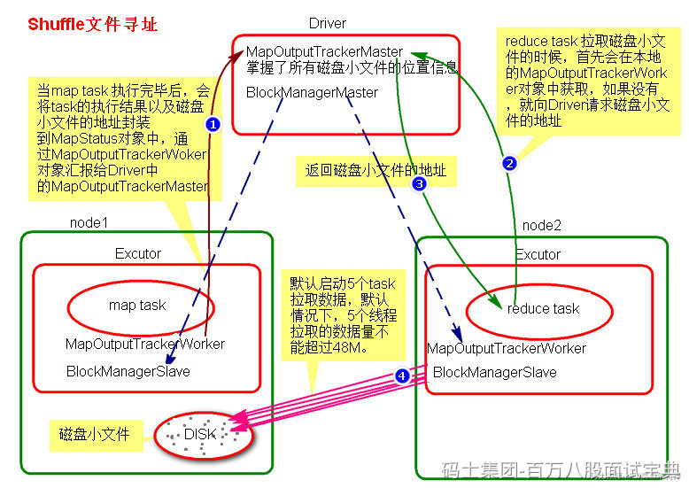

SparkShuffle文件寻址过程涉及到2个对象:MapOutputTracker和BlockManager。

MapOutputTracker是Spark架构中的一个模块，是一个主从对象，管理磁盘小文件的地址。MapOutputTrackerMaster是主对象，存在于Driver中。MapOutputTrackerWorker是从对象，存在于Excutor中。

BlockManager负责块管理，是Spark架构中的一个模块，也是一个主从对象。BlockManagerMaster,主对象，存在于Driver中，BlockManagerMaster会在集群中有用到广播变量和缓存数据或者删除缓存数据的时候，通知BlockManagerSlave传输或者删除数据。BlockManagerSlave，从对象，存在于Excutor中。BlockManagerSlave会与BlockManagerSlave之间通信。

无论在Driver端的BlockManager还是在Excutor端的BlockManager都含有三个对象：

- DiskStore:负责磁盘的管理。
- MemoryStore：负责内存的管理。
- BlockTransferService:负责数据的传输。

**Shuffle文件寻址流程如下：**

1. 当map task执行完成后，会将task的执行情况和磁盘小文件的地址封装到MpStatus对象中，通过MapOutputTrackerWorker对象向Driver中的MapOutputTrackerMaster汇报。
2. 在所有的map task执行完毕后，Driver中就掌握了所有的磁盘小文件的地址。
3. 在reduce task执行之前，会通过Excutor中MapOutPutTrackerWorker向Driver端的MapOutputTrackerMaster获取磁盘小文件的地址。
4. 获取到磁盘小文件的地址后，会通过BlockManager连接数据所在节点，然后通过BlockTransferService进行数据的传输。
5. BlockTransferService默认启动5个task去节点拉取数据。默认情况下，5个task拉取数据量不能超过48M。
