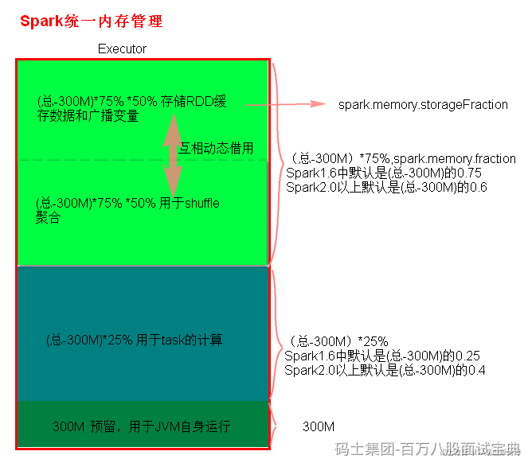

Spark执行应用程序时，Spark集群会启动Driver和Executor两种JVM进程，Driver负责创建SparkContext上下文，提交任务，task的分发等。Executor负责task的计算任务，并将结果返回给Driver。同时需要为需要持久化的RDD提供储存。Driver端的内存管理比较简单，这里所说的Spark内存管理针对Executor端的内存管理。

Spark内存管理在Spark1.6之后使用的是同一内存管理，统一内存管理分布图如下:

## ​
