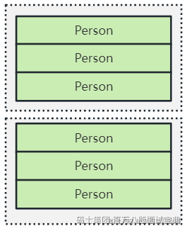
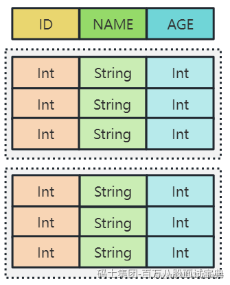
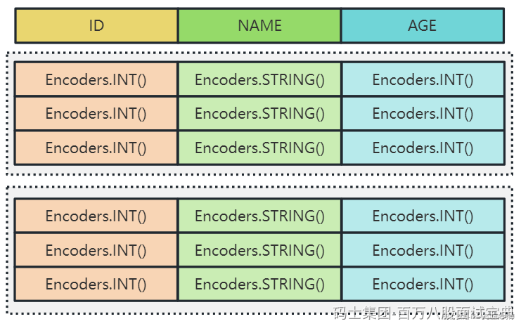
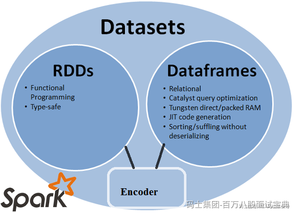

## **RDD**

RDD是SparkCore中的核心对象，创建不可变，有分区概念。RDD读取数据展示形式如下：

**RDD在编译过程中会对类型进行检查，有错误不会运行，数据在底层处理过程中会有序列化和反序列化的性能开销，对象较多时，底层会频繁的创建和销毁对象，对应GC开销也很大。**

## **DataFrame**

DataFrame是SparkSQL底层操作对象，前身为SchemaRDD，Spark1.3改名为DataFrame。与RDD类似，有分区概念，除此外DataFrame引入了Schema和off-heap的概念。

DataFrame中底层数据以ROW对象组织，提供了Scheam详细信息，所以DataFrame更新传统数据库中的二维表格，Spark通过Schema可以知道一行数据中的列信息，同时也支持嵌套类型，例如：struct、array、map

**Off-heap是JVM堆以外的内存，这些内存由操作系统管理，DataFrame可以使用堆外内存对数据进行hash、filter、sort而不需要反序列化数据成对象，性能比RDD高。**

DataFrame较RDD编程相比，主要还是通过将DataFrame注册成表，通过SQL方式来分析数据。**DataFrame使用了堆外内存解决了RDD GC的问题，但缺点在于在编译期缺少类型安全检查，导致运行时出错。**

DataFrame读取数据展示形式如下:

## **DataSet**

DataSet结合了RDD和DataFrame的优点，既可以数据编译时提供数据类型进行类型安全检查又可以使用堆外内存来提高数据处理效率。

在DataSet中引入了Encoder概念，当序列化数据时, Encoder产生字节码与off-heap进行交互, 能够达到按需访问数据的效果, 而不用反序列化整个对象。所以DataSet包含了DataFrame的功能，在Spark2.0+两者做到统一，即：DataSet[ROW] = DataFrame。

DataSet读取数据展示形式如下:

## **三者转换代码**

RDD——>DataFrame

|  |
| --- |
| *//创建RDD*val rdd1: RDD[Person] = sparkSession.sparkContext.parallelize(  *Array*(  Person(1, "zs", 20),  Person(2, "ls", 30),  Person(3, "ww", 40))) *//RDD转换成DataFrame*val df = rdd1.toDF("id", "name", "age")df.show() |

DataFrame ——> RDD

|  |
| --- |
| *//DataFrame 转换成RDD*val rdd2: RDD[Row] = df.*rdd*rdd2.foreach(*println*) |

RDD ——> DataSet

|  |
| --- |
| *//创建RDD*val rdd1: RDD[Person] = sparkSession.sparkContext.parallelize(  *Array*(  Person(1, "zs", 20),  Person(2, "ls", 30),  Person(3, "ww", 40))) *//RDD转换成Dataset*val ds: Dataset[Person] = rdd1.toDS()ds.printSchema()ds.show() |

DataSet ——>RDD

|  |
| --- |
| *//Dataset 转换成RDD*val rdd2: RDD[Person] = ds.*rdd*rdd2.foreach(*println*) |

DataFrame ——> Dataset

|  |
| --- |
| *//通过Json List数据创建DataFrame*val jsonList = *List*(  "{\"id\":1,\"name\":\"zs\",\"age\":20}",  "{\"id\":2,\"name\":\"ls\",\"age\":30}",  "{\"id\":3,\"name\":\"ww\",\"age\":40}")val df: DataFrame = sparkSession.read.json(jsonList.toDS()) *//转换df的数据类型*import org.apache.spark.sql.functions.\_val df2 = df.withColumn("id", $"id".cast("int"))  .withColumn("age", $"age".cast("int")) *//DataFrame转换成Dataset*val ds: Dataset[Person] = df2.as[Person]ds.printSchema()ds.show() |

DataSet ——> DataFrame

|  |
| --- |
| *//Dataset 转换成DataFrame*val df3: DataFrame = ds.toDF()df3.printSchema()df3.show() |

## **总结**

1. RDD、DataFrame、DataSet都有partition概念，都是懒执行的，需要Action算子触发执行。
2. 在使用DataFrame或者DataSet时需要在代码中引入隐式转换：import spark.implicits.\_
3. DataSet中数据类型可以是任意对象，DataFrame中只能是ROW类型的对象，DataFrame常用于注册表进行SQL操作。
4. DataSet[Row] = DataFrame
