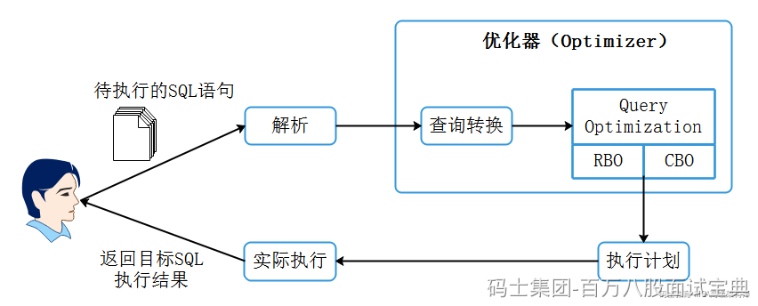

数据库SQL语句执行流程如下：

在SQL优化器中最重要的一个组件是查询优化器（Query Optimization），在海量数据分析中一条SQL生成的执行计划搜索空间非常庞大，**查询优化器的目的就是对执行计划空间进行裁剪减少搜索空间的代价**，查询优化器对于SQL的执行来说非常重要，不管是关系型数据库系统Oracle、MySQL还是大数据领域中的Hive、SparkSQL、Flink SQL都会有一个查询优化器进行SQL执行计划优化。

有的数据库系统会采用自研的查询优化器，而有的则会采用开源的查询优化器插件，比如Apache Calcite就是一个优秀的开源查询优化器插件。而像Oracle数据库的查询优化器，则是Oracle公司自研的一个核心组件，负责解析SQL，其目的是按照一定的原则来获取目标SQL在当前情形下执行的最高效执行路径。

**查询优化器主要解决的是多个连接操作的复杂查询优化，负责生成、制定SQL的执行计划。在Spark2.0之前SparkSQL支持RBO查询优化器，在Spark2.2版本后支持CBO查询优化器，SparkSQL默认采用了RBO查询优化器来进行SQL优化解析。**

**基于规则的优化器（RBO）与基于代价的优化器（CBO）两者特点如下:**

- **RBO(Rule-Based Optimization):**

RBO即基于规则的优化器，**该优化器按照硬编码在数据库中的一系列规则来决定SQL的执行计划，只要求我们按照这套规则来写SQL语句，无论表中的数据分布和数据量如何都不会影响这套规则下的执行计划。**以Oracle数据库为例，RBO根据Oracle指定的优先顺序规则，对指定的表进行执行计划的选择。比如在规则中：索引的优先级大于全表扫描。

通过以上可以了解到在RBO对数据不“敏感”，但在实际的场景中，数据的量级以及数据的分布会严重影响同样的SQL执行性能，这也是RBO的缺点所在，所以RBO生成的执行计划往往不是最优的。

- **CBO(Cost-Based Optimization)：**

CBO即基于代价的优化器，该优化器通过根据优化规则**对关系表达式进行转换，按照表、索引、列等信息生成多个执行计划**，然后CBO会通过根据统计信息(Statistics)和代价模型(Cost Model)计算各种可能“执行计划”的“代价”，即COST，从中选用COST最低的执行方案，作为实际运行方案。

CBO依赖数据库对象的统计信息，这些信息包括：**SQL执行路径的I/O，网络开销、CPU使用情况**等，目前各大数据库和大数据的计算引擎都倾向于使用CBO，或者**两者结合（可以基于两者选择最优的执行计划，提高效率）**。像在Oracle10g开始彻底放弃了RBO，MySQL使用的也是CBO优化器；在大数据领域中 Hive也在0.14版本引入CBO，Spark计算框架使用的是Catalyst查询引擎（基于Scala开发），这种查询引擎支持RBO和CBO优化器，Flink计算框架使用的是Calcite查询引擎（开源），这种查询引擎也是同时支持RBO和CBO优化器。

**总结:**

1. **RBO是基于规则的优化器**，按照硬编码一系列规则来决定SQL的执行计划，表中的数据分布和数据量不会影响生成的执行计划，在数据量级较大及数据分布不均情况下生成的查询计划性能不佳；
2. **CBO是基于代价的优化器**，通过根据SQL执行路径的I/O，网络开销、CPU使用情况对SQL进行转换，按照表、索引、列等信息生成多个执行计划，然后计算各“执行计划”的“代价”，从中选用COST最低的执行计划作为实际运行的方案。

## ​
