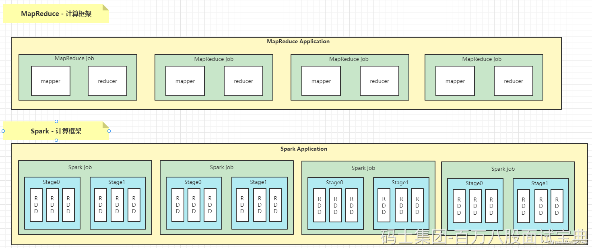

MapReduce编程模型只包含Map和Reduce两个过程，map的主要输入是一对<Key, Value>值，经过map计算后输出一对<Key, Value>值；然后将相同Key合并，形成<Key, Value集合>，再将这个<Key, Value集合>输入reduce，经过计算输出零个或多个<Key, Value>对。

MapReduce运行的时候，会通过Mapper运行的任务读取数据文件，然后调用自己的方法，处理数据，最后输出。Reducer任务会接收Mapper任务输出的数据，作为自己的输入数据，调用自己的方法，最后输出到相应的文件中。

MR具体处理数据流程是：Input Data -> MR -> Output Data ->MR ->Output Data。在MapReduce流程里，第一个MR的输出要先落地，然后第二个MR才能把第一个MR的输出当做输入，进行第二次MR。如果有多个MR流式作业，消耗的时间也就会随之增加。这是MapReduce执行较其他框架慢的重要原因之一。

Apache Spark的高性能一定程度上取决于它采用的异步并发模型（这里指server/driver 端采用的模型），这与Hadoop 2.0（包括YARN和MapReduce）是一致的。Hadoop MapReduce采用了多进程模型，而Spark采用了多线程模型。

Spark采用了经典的scheduler/workers模式，每个Spark应用程序运行的第一步是构建一个可重用的资源池，然后在这个资源池里运行所有的ShuffleMapTask和ReduceTask。而MapReduce应用程序则不同，它不会构建一个可重用的资源池，而是让每个Task动态申请资源，且运行完后马上释放资源。

1. MR基于磁盘迭代处理数据，Spark可以基于内存处理数据，可以对数据进行持久化，对迭代或者多次重复处理同一数据源非常高效。
2. Spark 中持久化默认的数据只有一份，MR中数据处理基于HDFS，默认副本有3个
3. Spark中支持批数据处理，支持流式数据处理，支持SQL处理数据，MR只支持批数据处理
4. Spark中封装了各种高级的算子，代码编写方便，MR中需要自己实现复杂逻辑
5. Spark是粗粒度资源申请，MR是细粒度资源申请

## **Flink和Spark有很多相似点，也有很多不同点，相似点如下：**

1. 都基于内存计算，Spark数据可以持久化，Flink状态可以基于内存计算
2. 都可以处理批和流数据，都支持SQL处理数据。
3. 都有很多转换操作。
4. 都有完善的错误恢复机制。
5. 都支持Exactly once语义一致性。

## **不同点主要是针对流式数据处理上不同，具体如下：**

### **设计理念**

1. Spark的技术理念是使用微批来模拟流的计算，基于Micro-batch，数据流以时间为单位被切分成一个个批次，通过分布式数据集RDD进行批量处理，是一种伪实时。
2. Flink是基于事件驱动的，是面向流的处理框架，Flink基于每个事件一行一行地进行流式处理，是真正的流式计算，也可以基于流来进行批计算，实现批处理。

Spark流处理划分成微批处理，Flink批是流的特例，Spark流式数据处理延迟只能做到秒级，Flink基于每个事件处理，每当有新数据进来都会立刻处理，是真正的实时计算，延迟毫秒级别。

### **吞吐量与延迟**

1. SparkStreaming是基于微批的，吞吐量大，延迟高，一般是秒级
2. Flink基于事件，消息逐条处理，兼顾吞吐量的同时有很低的延迟，延迟可以达到毫秒级。

### **架构方面：**

1. Spark在运行时主要角色包括：Master、Worker、Driver、Executor
2. Flink在运行时主要包含：JobManager、TaskManger和Slot

### **任务调度**

1. SparkStreaming，连续不断的生成微批构建有向无环图DAG，根据DAG中的action操作形成job，每个job有根据宽窄依赖生成多个stage。
2. Flink根据用户提交的代码生成StreamGraph，经过优化生成JobGraph,然后提交给JobManager进行处理，JobManager会根据JobGraph生成ExecutionGraph，ExecutionGraph是Flink调度最核心的数据结构，JobManager根据ExecutionGraph对job进行调度。

### **时间机制**

1. SparkStreaming支持的时间机制有限、只支持处理时间，StructuredStreaming支持事件时间，支持watermark。
2. Flink支持三种时间机制：事件时间、注入时间、处理时间，同时支持watermark机制处理迟到数据。

### **窗口方面**

Spark只支持基于时间的窗口操作（处理时间或者事件时间），而Flink支持的窗口非常灵活（time，count,session），支持时间窗口，还支持基于数据本身的窗口，也可以自定义窗口。

### **状态**

Flink比Spark支持更多的状态操作。Flink中状态更丰富，基于每个key都可以灵活维护状态，也可以针对业务自定义状态等，编码时可以自己操作状态。处理流式数据时，在Flink中可以设置checkpoint，当Flink任务失败后，重启的Flink任务可以基于checkpoint来恢复任务。

Spark利用checkpoint来实现Spark处理内部的状态管理。处理流式数据时，SparkStreaming不支持任务重启后从checkpoint中回复状态，StructuredStreaming可以支持。

### **容错机制**

Flink基于轻量级分布式快照（Snapshot）实现容错，Spark容错机制基于RDD的容错机制，Spark内部可以使用持久化算子和checkpoint来实现数据容错和保存状态。

实时消费Kafka数据时，想要做到精准消费一次数据（exactly-once），Flink基于两阶段提交实现，SparkStreaming需要手动维护offset来保证，StructuredStreaming只支持at-least-once语义。
