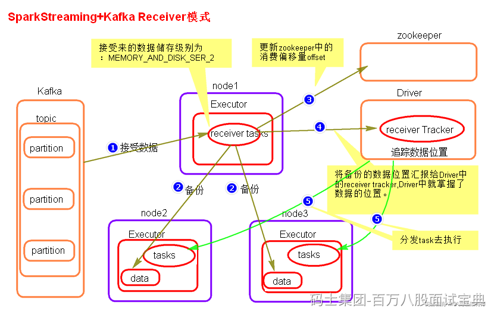
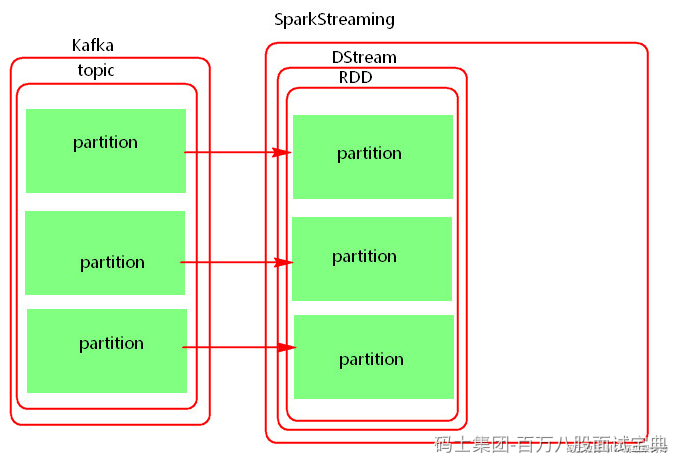

## **Receiver模式（了解）**

在早期Spark消费Kafka中数据只支持Receiver模式。Receiver模式读取Kafka中数据原理图如下：

Receiver模式中，SparkStreaming使用Receiver接收器模式来接收kafka中的数据，即会将每批次数据都存储在Spark端，默认的存储级别为MEMORY\_AND\_DISK\_SER\_2，从Kafka接收过来数据之后，还会将数据备份到其他Executor节点上，当完成备份之后，再将消费者offset数据写往zookeeper中，然后再向Driver汇报数据位置，Driver发送task到数据所在节点处理数据。

这种模式使用zookeeper来保存消费者offset，等到SparkStreaming重启后，从zookeeper中获取offset继续消费。

当Driver挂掉时，同时消费数据的offset已经更新到zookeeper中时，SparkStreaming重启后，接着zookeeper存储的offset继续处理数据，这样就存在丢失数据的问题。

为了解决以上丢失数据的问题，可以开启WAL(write ahead log)预写日志机制，将从kafka中接收来的数据备份完成之后，向指定的checkpoint中也保存一份，这样当SparkStreaming挂掉，重新启动再处理数据时，会处理Checkpoint中最近批次的数据，将消费者offset继续更新保存到zookeeper中。

开启WAL机制，需要设置checpoint,由于一般checkpoint路径都会设置到HDFS中，HDFS本身会有副本，所以这里如果开启WAL机制之后，可以将接收数据的存储级别降级，去掉“\_2”级别。

### **开启WAL机制之后带来了新的问题：**

- **数据重复处理问题**

由于开启WAL机制，会处理checkpoint中最近一段时间批次数据，这样会造成重复处理数据问题。所以对于数据需要精准消费的场景，不能使用receiver模式。如果不开启WAL机制Receiver模式有丢失数据的问题，开启WAL机制之后有重复处理数据的问题，对于精准消费数据的场景，只能人为保存offset来保证数据消费的准确性。

- **数据处理延迟加大问题**

数据在节点之间备份完成后再向checkpoint中备份，之后再向Zookeeper汇报数据offset，向Driver汇报数据位置，然后Driver发送task处理数据。这样加大了数据处理过程中的延迟。

对于精准消费数据的问题，需要我们从每批次中获取offset然后保存到外部的数据库来实现来实现仅一次消费数据。但是Receiver模式底层读取Kafka数据的实现使用的是High Level Consumer Api，这种Api不支持获取每批次消费数据的offset。所以对于精准消费数据的场景不能使用这种模式。

### **Receiver模式总结**

1. Receiver模式采用了Receiver接收器的模式接收数据。会将每批次的数据存储在Executor内存或者磁盘中。
2. Receiver模式有丢失数据问题，开启WAL机制解决，但是带来新的问题。
3. receiver模式依赖zookeeper管理消费者offset。
4. SparkStreaming读取Kafka数据，相当于Kafka的消费者，底层读取Kafka采用了“[High Level Consumer API](http://kafka.apache.org/082/documentation.html" \l "highlevelconsumerapi)”实现，这种api没有提供操作每批次数据offset的接口，所以对于精准消费数据的场景想要人为控制offset是不可能的。

## **Direct模式**

在Spark1.6版本引入了Dircet模式。

Driect模式就是将kafka看成存数据的一方，这种模式没有采用Receiver接收器模式，而是采用直连的方式，不是被动接收数据，而是主动去取数据，当任务失败后代码中如果设置了checkpoint目录，那么最近消费Kafka批次信息也会保存在checkpoint中。当SparkStreaming停止后，我们可以使用val ssc = StreamFactory.getOrCreate(checkpointDir,Fun)来恢复停止之前SparkStreaming处理数据的进度，当然，这种方式存在重复消费数据和逻辑改变之后不可执行的问题。

Direct模式底层读取Kafka数据实现是Simple Consumer api实现，这种api提供了从每批次数据中获取offset的接口，所以对于精准消费数据的场景，可以使用Direct 模式手动维护offset方式来实现数据精准消费。

此外，Direct模式的并行度与当前读取的topic的partition个数一致，所以Direct模式并行度由读取的kafka中topic的partition数决定的。

### **如何保证消费Kafka数据offset精准性？**

1. **checkpoint管理**

如果设置了checkpoint ,那么最近消费批次数据会存储在checkpoint中。这种有缺点: 第一，当从checkpoint中恢复数据时，有可能造成重复的消费。第二，当代码逻辑改变时，无法从checkpoint中来恢复offset。

2. **依赖Kafka存储**

依靠kafka 来存储消费者offset,kafka 中有一个特殊的topic 来存储消费者offset。新的消费者api中，会定期自动提交offset。这种情况有可能也不是我们想要的，因为有可能消费者自动提交了offset,但是后期SparkStreaming 没有将接收来的数据及时处理保存。这里也就是为什么会在配置中将enable.auto.commit 设置成false的原因。这种消费模式也称最多消费一次（at-most-once），默认sparkStreaming 拉取到数据之后就可以更新offset,无论是否消费成功，自动提交offset的频率由参数auto.commit.interval.ms 决定，默认5s。

如果我们能保证完全处理完业务之后，可以后期异步的手动提交消费者offset。但是这种将offset存储在kafka中由参数offsets.retention.minutes=1440控制是否过期删除，默认是保存一天，如果停机没有消费达到时长，存储在kafka中的消费者组会被清空，offset也就被清除了。

3. **手动维护**

自己存储offset,这样在处理逻辑时，保证数据处理的事务，如果处理数据失败，就不保存offset，处理数据成功则保存offset.这样可以做到精准的处理一次处理数据。
