# 1 Spark面试题

## 1.1 手写Scala Spark WordCount

## 1.2 谈谈Spark核心RDD理解，RDD有哪些缺陷？

RDD理解图如下:

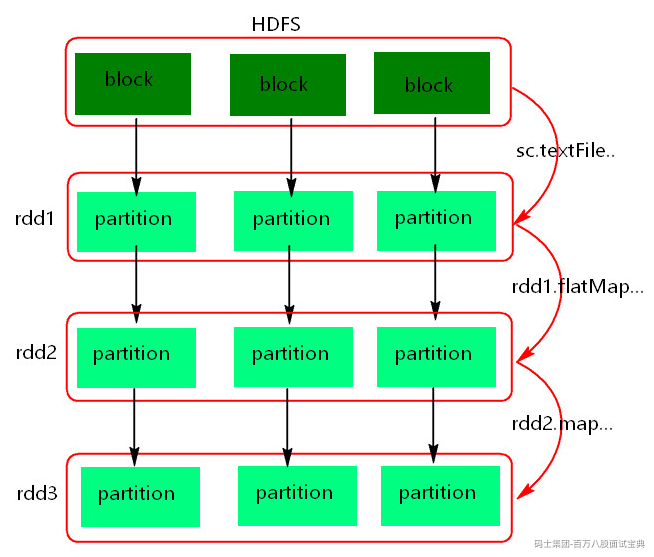

RDD（Resilient Distributed Datasets，弹性分布式数据集）是一个不可变的、可分区、可并行操作的数据结构。它可以在集群中的多个节点上分布式存储和计算，以实现高效的数据处理。在Spark中RDD是基本的数据抽象，所有的其他数据抽象都是基于RDD来实现。

**RDD具有五大特性：**

1. RDD创建后不可变、不可修改，由一系列的partition组成的。
2. 函数是作用在每一个partition（split）上的，分区是并行计算的基本单位。
3. RDD之间有一系列的依赖关系，分为宽依赖和窄依赖。
4. 分区器是作用在K,V格式的RDD上，分区器决定数据去往哪些分区被处理。
5. RDD提供一系列最佳的计算位置，利于数据处理的本地化。

**RDD的缺点如下:**

1. RDD不支持更新操作：RDD是不可变的数据结构，如果需要更新数据，必须重新生成一个新的RDD，并删除旧的RDD，这可能会导致性能下降。
2. 非固定数据类型：RDD是一种泛型的数据结构，没有固定的数据类型，在处理数据时需要进行大量的类型转换，涉及数据对象的序列化和反序列化过程，降低计算性能。数据类型不支持嵌套类型，例如：Map,Array，List,Row等。
3. 不支持实时查询：RDD是基于批处理的模型，无法进行实时查询，可以使用SparkStreaming、StructuredStreaming来处理。

虽然RDD存在以上缺陷，但仍是Spark的核心数据抽象，因为它提供了一种简单、可靠、可扩展的数据处理方式。

## 1.3 Spark算子举例

**Transformation算子：**

filter,map,flatMap,sample,reduceByKey,sortByKey,sortBy,join,leftOuterJoin,rightOuterJoin,fllOuterJoin,union,interserction,subtract,distinct,cogroup,mapPartitionWithIndex,repartition,coalesce(boolean),groupByKey,zip,zipWithIndex,mapValues,aggreagteByKey,combainerByKey

**Action算子：**

count,take(num),first,foreach,collect,foreachPartition,takeSample(boolean,num,seed),saveAsTextFile,collectAsMap,top(num),takeOrderd(num),reduce,countByKey,countByValue

**控制算子：**

控制算子有三种，cache,persist,checkpoint，以上算子都可以将RDD持久化，持久化的单位是partition。cache和persist都是懒执行的。必须有一个action类算子触发执行。checkpoint算子不仅能将RDD持久化到磁盘，还能切断RDD之间的依赖关系。

**cache：**默认将RDD的数据持久化到内存中。cache是懒执行。

**persist：**可以指定持久化的级别。最常用的是MEMORY\_ONLY和MEMORY\_AND\_DISK。

**checkpoint：**可以将RDD持久化到磁盘，还可以切断RDD之间的依赖关系。checkpoint目录数据当application执行完之后不会被清除，可以用于状态管理。对RDD执行checkpoint之前，最好对这个RDD先执行cache，这样新启动的job只需要将内存中的数据拷贝到HDFS上就可以，省去了重新计算这一步。

以上三种持久化算子注意点如下:

1. cache和persist都是懒执行，必须有一个action类算子触发执行。
2. cache和persist算子的返回值可以赋值给一个变量，在其他job中直接使用这个变量就是使用持久化的数据了。持久化的单位是partition。
3. cache和persist算子后不能立即紧跟action算子，否则返回一个数值，也没有使用持久化。
4. cache和persist算子持久化的数据当applilcation执行完成之后会被清除。
5. checkpoint需要指定额外的目录存储数据，checkpoint数据是由外部的存储系统管理，不是Spark框架管理，当application完成之后，不会被清空。cache() 和persist() 持久化的数据是由Spark框架管理，当application完成之后，会被清空。

## 1.4 groupByKey与reduceByKey的区别？

groupByKey和reduceByKey都可以用于对RDD中的键值对进行分组，groupByKey没有map端预聚合，reduceByKey会进行map端聚合操作，两者特点如下:

groupByKey操作将RDD中所有具有相同键的键值对分组到一起，返回的是(key, Iterable<value>)类型的RDD,这种方式会导致在处理大量数据时，由于将具有相同键的键值对都放在同一个分区中，导致该分区的数据会很大，从而影响性能。

reduceByKey操作先将RDD中具有相同键的键值对聚合到一起，然后对每个键的所有值进行归约操作，返回的是(key, reduced\_value)类型的RDD。这种方式可以在每个分区中聚合相同键的键值对，减少了网络传输的数据量，更适合处理大量数据。

当需要对数据按照key进行分组操作时，如果数据量不大，使用groupByKey；如果对相同key数据分组后再聚合的场景建议使用reduceByKey以提高性能。

## 1.5 RDD如何实现容错？基本原理是什么？

Spark RDD实现容错主要有三个层次实现:任务调度层、RDD Lineage血统层、Checkpoint数据持久化层。

- **任务调度层：**

Spark任务调度过程中如果task执行失败，TaskScheduler会进行重试执行，默认重试4次（spark.task.maxFailures）后依然失败，DAGScheduler会进行重试Stage，默认重试4次（spark.stage.maxConsecutiveAttempts）后如果失败，整个Spark Job执行失败。

以上任务调度层的重试会针对当前task处理的数据进行重算，保证RDD容错。

- **RDD Lineage血统层：**

Spark RDD之间是有依赖关系的，子RDD通过Transformation类算子基于父RDD生成，形成Lineage血统链，在计算过程中如果节点宕机或者使用到RDD数据而该数据又没有缓存时可以通过Lineage重新计算生成。RDD之间的依赖关系分为窄依赖和宽依赖，这些依赖形成的Lineage可以保证RDD的容错性。

在窄依赖中，父RDD分区与子RDD分区是一对一的关系或者多对一的关系，重算子RDD数据时由于父RDD相应分区的数据都是子RDD分区的数据，只需要计算父RDD对应分区的数据即可，不存在冗余计算。在宽依赖中，丢失一个RDD分区数据需要重算每个父RDD的每个分区的所有数据，这些重算的结果可能只有一部分属于子RDD，这样就产生了冗余计算开销。

可见，在通过RDD依赖关系保证RDD容错过程中，**RDD宽依赖的开销比RDD在依赖的开销要大的多。**

- **Checkpoint数据持久化层：**

针对宽依赖开销大的问题我们可以针对RDD设置checkpoint检查点，这样就能将RDD的数据持久化到磁盘上，在子RDD重新计算过程中就不必从源头开始计算，而是基于checkpoint的数据开始计算即可，尤其是对宽依赖的RDD设置checkpoint 可以大大提升RDD恢复效率。

对于checkpoint的使用，建议在以下两种情况可以考虑：

- **DAG Lineage 过长，如果重算则开销很大**
- **在Shuffle RDD上设置checkpoint可以避免冗余计算，收益更大**

对RDD执行checkpoint之前，最好对这个RDD先执行cache，这样新启动的job只需要将内存中的数据持久化到磁盘即可省去了重新计算这一步。

## 1.6 Spark Application、Job、Stage、Task有什么关系?

在Spark中Application由Job组成，而每个Job又由多个Stage组成，每个Stage由多个Task组成，它们之间的关系如下：

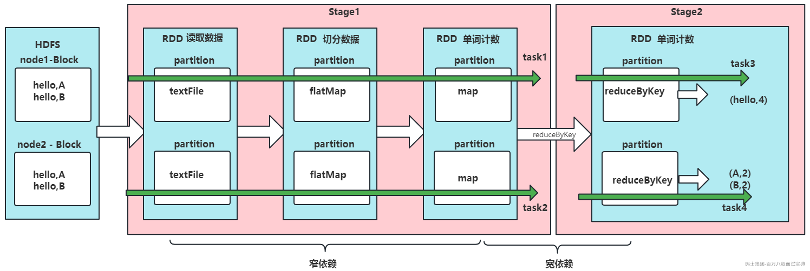

- Application是一个完整的Spark应用程序，包含多个Job。
- Job是Spark应用程序中的一个作业，通常由多个Stage组成，每个Job负责完成一个特定的计算任务。
- Stage是一个Job中的一个阶段，通常由多个Task组成，每个Stage负责完成一定的计算操作。在Spark中，一个Stage可以是Map Stage或Reduce Stage。
- Task是一个Stage中的一个任务单元，负责对一个数据分区进行计算操作。在Spark中，一个Task对应于一个数据分区和一个计算操作，可以并行执行。

Spark Application是最高层次的概念，最终会经过一系列对象转换分解为多个Task，并将这些task分配到集群中的多个节点上并行执行，从而实现高效的分布式计算。

## 1.7 有哪些因素影响Stage中的Task个数？

Spark划分Stage过程中如果Stage源头读取的是HDFS中的数据，开始设置的分区数会影响Stage中task个数，如果该Stage之前还有Stage，影响该Stage task个数是shuffle操作算子的并行度，无论怎样，一个Stage的最终task个数由该Stage 末端RDD分区个数决定。

## 1.8 Spark资源调度和任务调度流程？

**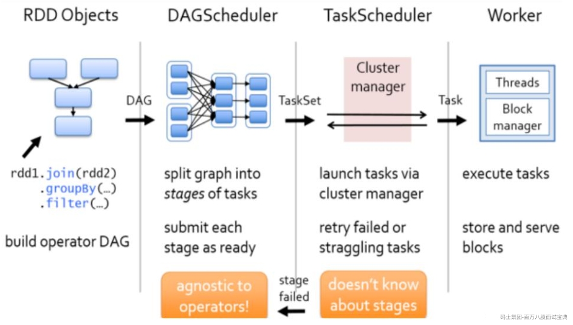**

启动集群后，Worker节点会向Master节点汇报资源情况，Master掌握了集群资源情况。当Spark提交一个Application后，根据RDD之间的依赖关系将Application形成一个DAG有向无环图。任务提交后，Spark会在Driver端创建两个对象：DAGScheduler和TaskScheduler，DAGScheduler是任务调度的高层调度器，是一个对象。DAGScheduler的主要作用就是将DAG根据RDD之间的宽窄依赖关系划分为一个个的Stage，然后将这些Stage以TaskSet的形式提交给TaskScheduler（TaskScheduler是任务调度的低层调度器，这里TaskSet其实就是一个集合，里面封装的就是一个个的task任务,也就是stage中的并行度task任务），TaskSchedule会遍历TaskSet集合，拿到每个task后会将task发送到计算节点Executor中去执行（其实就是发送到Executor中的线程池ThreadPool去执行）。task在Executor线程池中的运行情况会向TaskScheduler反馈，当task执行失败时，则由TaskScheduler负责重试，将task重新发送给Executor去执行，默认重试4次，如果重试task4次后task依然没有执行成功，那么这个task所在的stage就失败了。stage失败了则由DAGScheduler来负责重试Stage，重新发送TaskSet到TaskSchdeuler，Stage默认重试4次。如果重试4次以后依然失败，那么这个job就失败了。job失败了，Application就失败了。

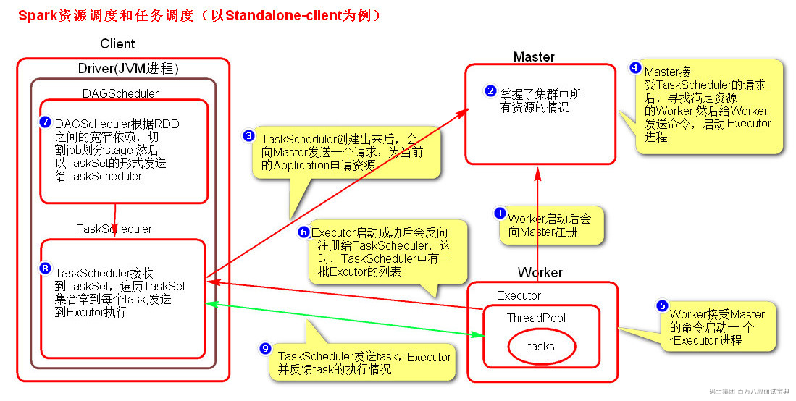

## 1.9 介绍Spark部署模式及任务运行模式、流程

Spark任务部署模式有以下几种：

- Local Mode（本地模式）：Spark应用程序在单机上运行，主要用于开发和测试。
- Standalone Mode（独立模式）：Spark应用程序在集群上运行，但不依赖于任何资源管理器，需要手动配置集群环境。
- Hadoop YARN Mode（YARN模式）：Spark应用程序在基于Hadoop的YARN资源管理器上运行。
- Apache Mesos Mode（Mesos模式）：Spark应用程序在Apache Mesos资源管理器上运行，可以与其他Mesos框架共享同一集群资源。
- Kubernetes Mode（Kubernetes模式）：Spark应用程序在Kubernetes集群上运行，可以直接使用Kubernetes提供的资源管理和调度功能。

以上常见的Spark部署模式是Standalone和Yarn 。Spark 任务提交运行有两种模式：client和cluster，下面基于Standalone和Yarn部署提交任务来介绍Spark任务运行模式。

- **Standalone-client:**

**提交命令:**

**执行原理图:**

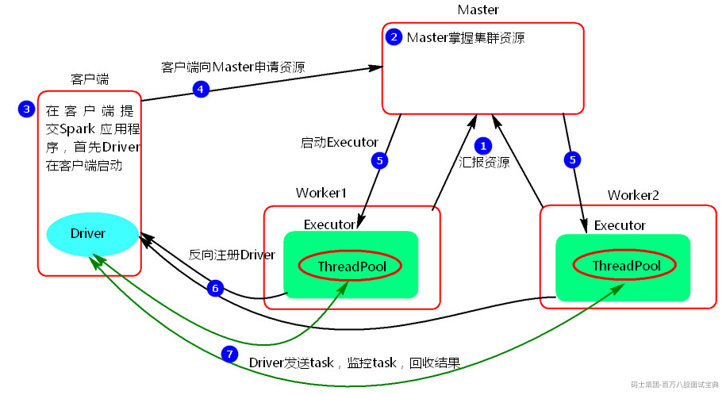

**执行流程：**

1. client模式提交任务后，会在客户端启动Driver进程。
2. Driver会向Master申请启动Application启动的资源。
3. Master收到请求之后会在对应的Worker节点上启动Executor
4. Executor启动之后，会注册给Driver端，Driver掌握一批计算资源。
5. Driver端将task发送到worker端执行。worker将task执行结果返回到Driver端。

**总结：**

client模式适用于测试调试程序。Driver进程是在客户端启动的，这里的客户端就是指提交应用程序的当前节点。在Driver端可以看到task执行的情况。生产环境下不能使用client模式，是因为：假设要提交100个application到集群运行，Driver每次都会在client端启动，那么就会导致客户端100次网卡流量暴增的问题。client模式适用于程序测试，不适用于生产环境，在客户端可以看到task的执行和结果。

- **Standalone-cluster:**

**提交命令:**

**执行原理图：**

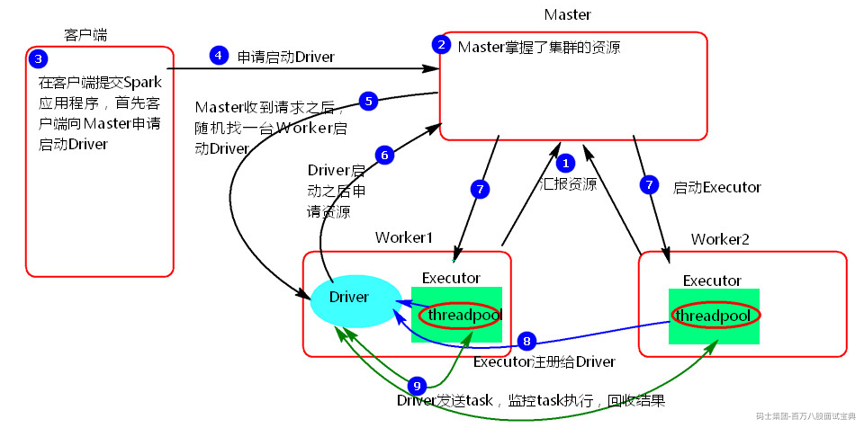

**执行流程:**

1. cluster模式提交应用程序后，会向Master请求启动Driver.
2. Master接受请求，随机在集群一台节点启动Driver进程。
3. Driver启动后为当前的应用程序申请资源。
4. Driver端发送task到worker节点上执行。
5. worker将执行情况和执行结果返回给Driver端。

**总结：**

Driver进程是在集群某一台Worker上启动的，在客户端是无法查看task的执行情况的。假设要提交100个application到集群运行,每次Driver会随机在集群中某一台Worker上启动，那么这100次网卡流量暴增的问题就散布在集群上。

- **Yarn-client：**

**提交命令：**

**执行原理图解：**

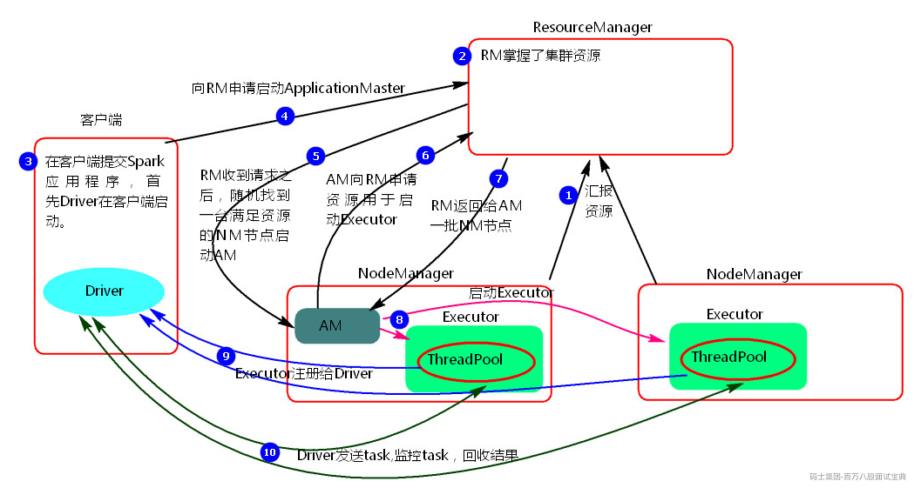

**执行流程：**

1. 客户端提交一个Application，在客户端启动一个Driver进程。
2. 应用程序启动后会向RS(ResourceManager)发送请求，启动AM(ApplicationMaster)的资源。
3. RS收到请求，随机选择一台NM(NodeManager)启动AM。这里的NM相当于Standalone中的Worker节点。
4. AM启动后，会向RS请求一批container资源，用于启动Executor.
5. RS会找到一批NM返回给AM,用于启动Executor。
6. AM会向NM发送命令启动Executor。
7. Executor启动后，会反向注册给Driver，Driver发送task到Executor,执行情况和结果返回给Driver端。

**总结:**

Yarn-client模式同样是适用于测试，因为Driver运行在本地，Driver会与yarn集群中的Executor进行大量的通信，会造成客户机网卡流量的大量增加。

- **Yarn-cluster：**

**提交命令:**

**执行原理图：**

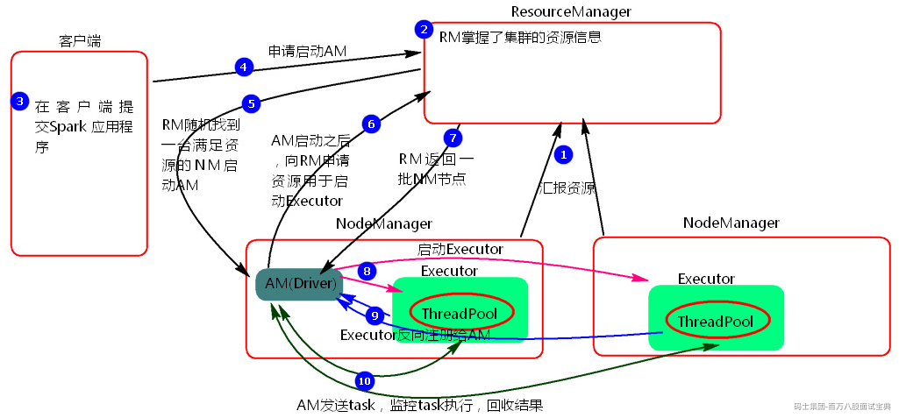

**执行流程:**

1. 客户机提交Application应用程序，发送请求到RS(ResourceManager),请求启动AM(ApplicationMaster)。
2. RS收到请求后随机在一台NM(NodeManager)上启动AM（相当于Driver端）。
3. AM启动，AM发送请求到RS，请求一批container用于启动Executor。
4. RS返回一批NM节点给AM。
5. AM连接到NM,发送请求到NM启动Executor。
6. Executor反向注册到AM所在的节点的Driver。Driver发送task到Executor。

**总结:**

Yarn-Cluster主要用于生产环境中，因为Driver运行在Yarn集群中某一台nodeManager中，每次提交任务的Driver所在的机器都是随机的，不会产生某一台机器网卡流量激增的现象，缺点是任务提交后不能看到日志。只能通过yarn查看日志。

## 1.10 SparkShuffleManager分类及各自区别？

SparkShuffle分为两种，一种是基于Hash的Shffle，一种是基于Sort的Shuffle，对应的ShuffleManager管理对象为HashShuffleManager和SortShuffleManager。早先Spark版本仅支持HashShuffleManager，在Spark1.1版本开始支持SortShuffleManager,Spark1.2版本默认使用SotShuffleManager。Spark2.0版本后彻底丢弃HashShuffleManager。下面分别介绍两种shuffle，可以重点关注SortShuffleManager。

1. **HashShuffleManager**

HashShffleManager中有两种机制：普通机制和优化机制。

- **普通机制：**

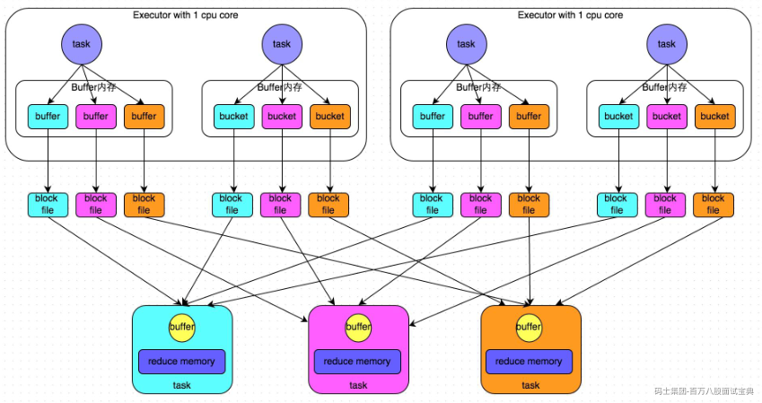

**执行流程:**

1. 每一个map task将不同结果写到不同的buffer中，每个buffer的大小为32K。buffer起到数据缓存的作用。
2. 每个buffer文件最后对应一个磁盘小文件。
3. reduce task来拉取对应的磁盘小文件。

**特点：**HashShuffle非优化模式产生的磁盘小文件个数为M（map task的个数）\*R（reduce task的个数），产生的小文件数量比较多，Shuffle写出数据慢，Shuffle读取数据也慢，另外，在数据传输过程中会有频繁的网络通信，频繁的网络通信出现通信故障的可能性大大增加，一旦网络通信出现了故障会导致shuffle file cannot find 由于这个错误导致的task失败，TaskScheduler不负责重试，由DAGScheduler负责重试Stage，严重制约Spark性能。

- **优化机制：**

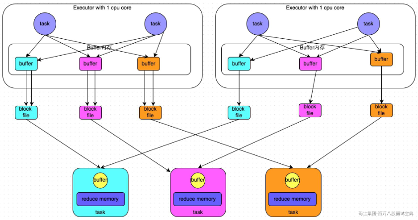

针对HashShuffleManager写出数据文件多的问题，可以设置参数spark.shuffle.consolidateFiles为true来让map端1个core中执行的多个maptask产生的shuffle数据到一份小文件中，如上图所示，这样就大大减少了Map端Shuffle数据小文件的数量，这种情况下产生的小文件的数据个数为：C(core的个数)\*R（reduce的个数）。

1. **SortShuffleManager**

以上HashShffleManager的两种机制，中间结果小文件的个数都会依赖于ReduceTask个数，也就意味着在海量数据处理情况中，小文件的数量还是不可控，所以Spark在Spark1.1版本引入了SortShuffleManager。

SortShuffleManager分为普通机制、bypass运行机制和Tungsten SortShuffle运行机制。

- **普通机制:**

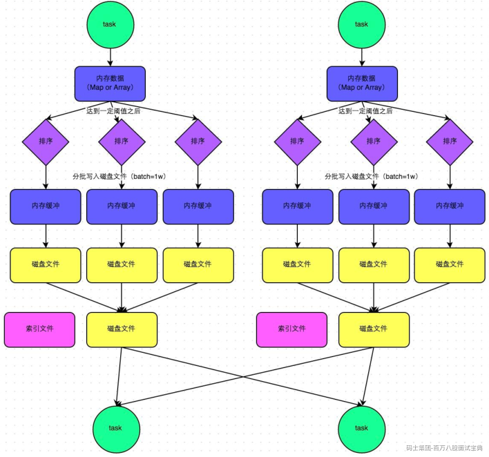

**执行流程**

1. map task 的计算结果会写入到一个内存数据结构里面（例如：聚合类的 shuffle 算子，那么会选用 Map 数据结构；join Shuffle会选择Array数据结构），内存数据结构默认是5M。
2. 在shuffle写入数据时候会估算这个内存结构的大小，当内存结构中的数据超过5M时，比如现在内存结构中的数据为5.01M，那么他会申请5.01\*2-5=5.02M内存给内存数据结构。
3. 如果申请成功不会进行溢写，如果申请不成功，这时候会发生溢写磁盘。在溢写之前内存结构中的数据会进行排序
4. 然后开始溢写磁盘，写磁盘是以batch的形式去写，一个batch是1万条数据，写入磁盘文件是通过 Java 的 BufferedOutputStream 实现的。BufferedOutputStream 是 Java 的缓冲输出流，首先会将数据缓冲在内存中，当内存缓冲满溢之后再一次写入磁盘文件中，这样可以减少磁盘 IO 次数，提升性能。
5. map task执行完成后，会将这些磁盘小文件Merge合并成一个大的磁盘文件，同时生成一个索引文件,索引文件会标识下游各个 reduce task 的数据在文件中的 start offset 与 end offset。
6. reduce task去map端拉取数据的时候，首先解析索引文件，根据索引文件再去拉取对应的数据。

**特点：**

SortShuffleManager由于最终会对磁盘多次溢写的小文件进行合并，所以这种机制中产生的磁盘小文件数量： 2\*M（map task的个数），大大减少了Shffle小文件数据量。

- **bypass机制:**

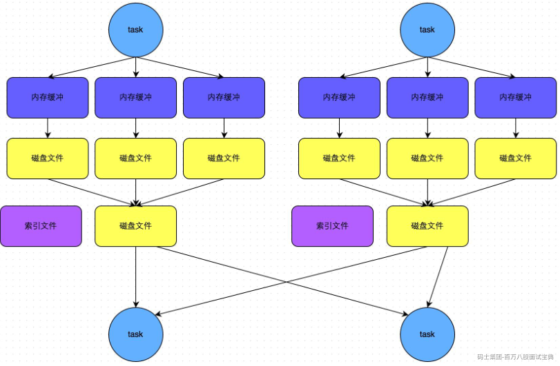

Map端对于一些非聚合不需排序的Shuffle操作(例如：groupByKey，手动实现map端没有聚合CombainByKey)，这时可以选择使用SortShuffleManager中的Bypass机制，这种机制在Shuffle数据落地时不会进行数据排序，落地的多个小文件最终线性排在一起形成最终map task对应的一个磁盘文件，也就是说启用该机制的最大好处在于，shuffle write 过程中，不需要进行数据的排序操作，也就节省掉了这部分的性能开销，相对于普通机制提高性能。这种机制产生的磁盘小文件数量与普通机制一样，为2\*M（map task的个数）。

bypass运行机制触发条件如下:

1. Shuffle Map task个数小于spark.shuffle.sort.bypassMergeThreshold参数的值（默认200）
2. Map端没有预聚合操作

- **Tungsten Sort Shuffle（UnsafeShuffleWriter）机制**

Tungsten sort shuffle是Spark 1.6版本中引入的新Shuffle实现方式。使用了内存管理器和二进制格式的序列化器，可以将数据存储在堆外内存中，不需数据反序列化而进行高效的排序和传输。相比于普通机制，UnsafeShuffle减少内存占用和垃圾回收的负担，从而提高了Spark的性能和可靠性。

使用UnsafeShffleWriter条件比较苛刻，满足如下条件才能使用Tungsten SortShffle：

1. Shuffle dependency 不能带有aggregation 或者输出需要排序。
2. Shuffle 的序列化器需要是 KryoSerializer 或者 Spark SQL's 自定义的一些序列化方式。
3. Shuffle 文件的数量不能大于 16777216（2的24次方）
4. 序列化时，单条记录不能大于 128 MB。

## 1.11 SparkShuffle文件寻址流程

SparkShuffle文件寻址过程涉及到2个对象:MapOutputTracker和BlockManager。

MapOutputTracker是Spark架构中的一个模块，是一个主从对象，管理磁盘小文件的地址。MapOutputTrackerMaster是主对象，存在于Driver中。MapOutputTrackerWorker是从对象，存在于Excutor中。

BlockManager负责块管理，是Spark架构中的一个模块，也是一个主从对象。BlockManagerMaster,主对象，存在于Driver中，BlockManagerMaster会在集群中有用到广播变量和缓存数据或者删除缓存数据的时候，通知BlockManagerSlave传输或者删除数据。BlockManagerSlave，从对象，存在于Excutor中。BlockManagerSlave会与BlockManagerSlave之间通信。

无论在Driver端的BlockManager还是在Excutor端的BlockManager都含有三个对象：

- DiskStore:负责磁盘的管理。
- MemoryStore：负责内存的管理。
- BlockTransferService:负责数据的传输。

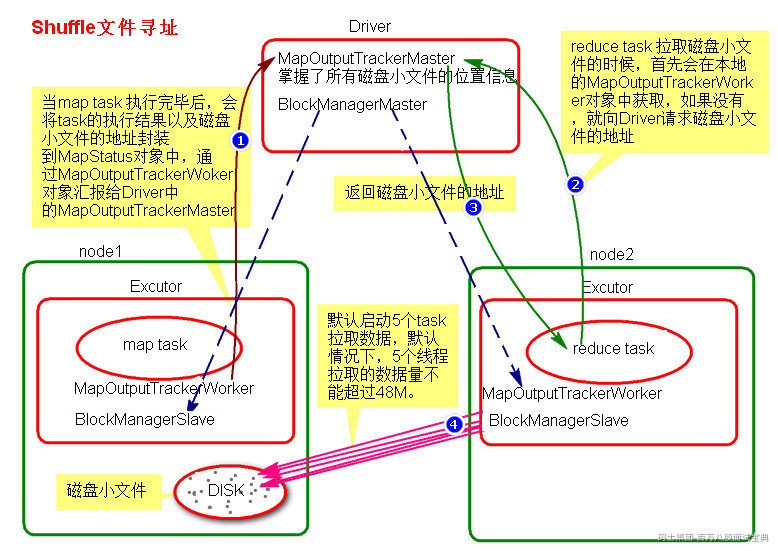

**Shuffle文件寻址流程如下：**

1. 当map task执行完成后，会将task的执行情况和磁盘小文件的地址封装到MpStatus对象中，通过MapOutputTrackerWorker对象向Driver中的MapOutputTrackerMaster汇报。
2. 在所有的map task执行完毕后，Driver中就掌握了所有的磁盘小文件的地址。
3. 在reduce task执行之前，会通过Excutor中MapOutPutTrackerWorker向Driver端的MapOutputTrackerMaster获取磁盘小文件的地址。
4. 获取到磁盘小文件的地址后，会通过BlockManager连接数据所在节点，然后通过BlockTransferService进行数据的传输。
5. BlockTransferService默认启动5个task去节点拉取数据。默认情况下，5个task拉取数据量不能超过48M。

## 1.12 SparkShuffle调优参数有哪些

SparkShuffle参数设置可以通过三种方式:

1. 在代码中设置，硬编码不建议

1. 提交Spark任务时设置，推荐使用
2. 在$SPARK\_HOME/conf/spark-default.conf配置，不建议，因为所有任务都会使用该参数。

关于Spark shuffle优化的参数如下：

- **spark.reducer.maxSizeInFlight**

**参数说明**：该参数用于设置shuffle read task的buffer缓冲大小，而这个buffer缓冲决定了每次能够拉取多少数据，默认48M。

**调优建议：**如果作业可用的内存资源较为充足的话，可以适当增加这个参数的大小（比如96m），从而减少拉取数据的次数，也就可以减少网络传输的次数，进而提升性能。在实践中发现，合理调节该参数，性能会有1%~5%的提升。

- **spark.shuffle.compress和 spark.shuffle.spill.compress**

**参数说明：**spark.shuffle.compress和spark.shuffle.spill.compress都是用来设置Shuffle过程中是否对Shuffle数据进行压缩，**两者默认值都为true**。其中前者针对最终写入本地文件系统的输出文件，后者针对在处理过程需要spill到外部存储的中间数据，后者针对最终的shuffle输出文件。

**调优建议：**对于参数spark.shuffle.compress，如果下游的Task通过网络获取上游Shuffle Map Task的结果的网络IO成为瓶颈，那么就需要考虑将它设置为true,通过压缩数据来减少网络IO。由于上游Shuffle Map Task和下游的Task现阶段是不会并行处理的，即上游Shuffle Map Task处理完成，然后下游的Task才会开始执行,因此如果需要压缩的时间消耗就是Shuffle MapTask压缩数据的时间 + 网络传输的时间 + 下游Task解压的时间,而不需要压缩的时间消耗仅仅是网络传输的时间,因此需要评估压缩解压时间带来的时间消耗和因为数据压缩带来的时间节省。**如果网络成为瓶颈，比如集群普遍使用的是千兆网络，那么可能将这个选项设置为true是合理的**；**如果计算是CPU密集型的，那么可能将这个选项设置为false才更好。**

- **spark.shuffle.spill.diskWriteBufferSize**

**参数说明**：该参数设置Map端数据**记录排序后**写入磁盘文件时使用的缓冲区大小，默认值为1024\*1024字节，也就是1M。

**调优建议：**在Spark任务需要大量Shuffle情况下，如果内存充足可以适当提高该参数值，减少写入磁盘的次数，提高Shuffle性能。

- **spark.shuffle.file.buffer：**

**参数说明**：该参数用于设置shuffle write task的BufferedOutputStream的buffer缓冲大小（默认是32K）。将数据写到磁盘文件之前，会先写入buffer缓冲中，待缓冲写满之后，才会溢写到磁盘。

**调优建议**：如果作业可用的内存资源较为充足的话，可以适当增加这个参数的大小（比如64k），从而减少shuffle write过程中溢写磁盘文件的次数，也就可以减少磁盘IO次数，进而提升性能。在实践中发现，合理调节该参数，性能会有1%~5%的提升。

- **spark.shuffle.io.maxRetries**

**参数说明**：Shuffle Read Task从Shuffle Write Task 所在节点拉取属于自己的数据时，因网络异常导致拉取失败，是会自动进行重试，改参数是自动重试次数，默认3次。如果在指定的次数内拉取还是没有成功，就可能导致作业执行失败。

**调优建议**：对于那些包含了特别耗时的Shuffle操作时，建议增加最大的重试次数，以避免由于JVM的Full GC或者网络不稳定等因素导致的数据拉取失败。对于超大的数据量时可以提升集群的稳定性。

- **spark.shuffle.io.retryWait**

**参数说明**：具体解释同上，该参数代表了每次重试拉取数据的等待间隔，默认是5s。由于网络之间不稳定导致数据拉取最大的延迟为 spark.shuffle.io.maxRetries\*spark.shuffle.io.retryWait =3\*5 = 15s。

**调优建议**：建议加大间隔时长（比如60s），以增加shuffle操作的稳定性。

- **spark.shuffle.io.numConnectionsPerPeer**

**参数说明**：Spark集群节点之间会创建获取数据的并发连接数，该参数配置可以重新使用主机之间的连接，默认为1，对于具有多个硬盘和少量主机的集群，这可能导致并发性不足，可以将该值设置大一些，以使所有磁盘饱和。

**调优建议**：机器之间的可以重用的网络连接，主要用于在大型集群中减小网络连接的建立开销，如果一个集群的机器并不多，可以考虑增加这个值。

- **spark.network.timeout/spark.shuffle.io.connectionTimeout**

**参数说明**:spark.network.timeout:Spark所有网络之间交互的超时时间，默认120s。spark.shuffle.io.connectionTimeout :节点之间有连接，但是通道没有数据，连接的超时时间，此值默认与spark.network.timeout一样，默认为120s。

**调优建议**：如果节点负载较高，建议将该值调大，以减少由于节点负载高导致通信或传输中断的情况发生。

- **spark.shuffle.sort.bypassMergeThreshold**

**参数说明**：当ShuffleManager为SortShuffleManager时，如果shuffle task的数量小于这个阈值（默认是200），则shuffle write过程中不会进行排序操作，而是直接将数据写入到磁盘临时文件，但是最后会将每个task产生的所有临时磁盘文件都合并成一个文件，并会创建单独的索引文件。

**调优建议：**当你使用SortShuffleManager时，如果的确不需要排序操作，那么建议将这个参数调大一些，大于shuffle task的数量。那么此时就会自动启用bypass机制，map-side就不会进行排序了，减少了排序的性能开销。

- **spark.shuffle.mapOutput.minSizeForBroadcast**

**参数说明**：Spark作业中是否应该对较小的map输出进行广播。如果一个任务的map输出小于这个阈值，则该输出将被广播到所有reduce任务中，而不是通过网络进行shuffle传输。默认512K。

**调优建议**：如果你处理的数据中存在一些常用的小数据需要shuffle，比如字典表或者一些常量等，那么将该值调大可能会带来更好的性能，因为此时这些小数据可以被广播到所有的 reduce 任务，避免重复的计算和传输，可以尝试调大该值。

- **spark.shuffle.service.enabled**

**参数说明**：是否启用External shuffle Service服务，默认false。Spark系统在运行含shuffle过程的应用时，Executor进程除了运行task，还要负责写shuffle数据，给其他Executor提供shuffle数据。当Executor进程任务过重，导致GC而不能为其他Executor提供shuffle数据时，会影响任务运行。External shuffle Service是长期存在于NodeManager进程中的一个辅助服务。通过该服务来抓取shuffle数据，减少了Executor的压力，在Executor GC的时候也不会影响其他Executor的任务运行

**优化建议**：启用外部shuffle服务，这个服务会安全地保存shuffle过程executor写的磁盘文件，因此executor即使挂掉也不要紧，必须配合spark.dynamicAllocation.enabled属性设置为true，才能生效，而且外部shuffle服务必须进行安装和启动，才能启用这个属性。

## 1.13 Spark内存管理及参数

Spark执行应用程序时，Spark集群会启动Driver和Executor两种JVM进程，Driver负责创建SparkContext上下文，提交任务，task的分发等。Executor负责task的计算任务，并将结果返回给Driver。同时需要为需要持久化的RDD提供储存。Driver端的内存管理比较简单，这里所说的Spark内存管理针对Executor端的内存管理。

Spark内存管理在Spark1.6之后使用的是同一内存管理，统一内存管理分布图如下:

**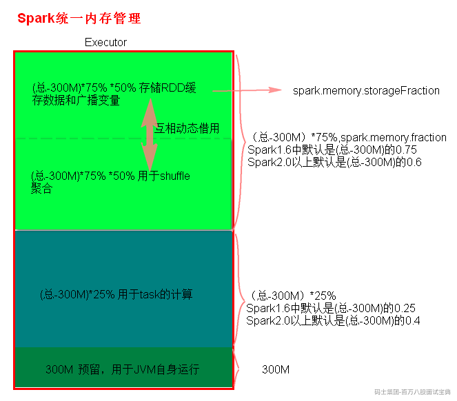**

## 1.14 Spark任务提交给Executor指定多少内存不会导致Shuffle OOM?

实际情况中，Spark任务shuffle使用内存多少与处理数据量、并行度、执行业务逻辑、运行任务节点数各方面都有关系，假设现在限定场景，如果一个Spark任务输入数据为100G ，设置并行度为100，使用10个Executor执行，平均每个Executor分配10个Core（实际每个core运行2-3个task为宜），针对一个Executor使用内存计算如下：

1. **Shuffle Map 端缓冲区大小**

Shuffle Write缓冲区的大小可以通过以下公式来计算：

其中，executor中task为10，spark.shuffle.spill.diskWriteBufferSize 设置Map端数据记录排序后写入磁盘文件时使用的缓冲区大小，默认值为1M。因此，Shuffle Write缓冲区大小可以计算为：Shuffle Write缓冲区大小 = 10 \* 1MB = 10M。

1. **计算Reduce端的Shuffle Read缓冲区大小**

Shuffle Read 缓冲区的大小可以通过以下公式来计算：

其中，每个Executor并行度为10，spark.reducer.maxSizeInFlight为Shuffle 为拉取数据缓冲区大小，默认值为48MB。因此，Shuffle Write缓冲区大小可以计算为：Shuffle Read缓冲区大小 = 10 \* 48MB = 480M。

1. **计算每个Executor总内存大小**

按照以上并行度，每个Executor中平均分配10个task，也就是每个Executor中shuffle 使用内存缓冲约为480M+10M = 490M ，每个Executor总内存大小可以通过以下公式来计算(按照统一内存管理计算):

其中spark.memory.fraction 为 0.6 ，经计算Executor总内存大小约为2G 。Executor默认分配内存大小为spark.executor.memoryOverhead，默认值为1GB，可以根据具体计算值来决定要不要提高Executor内存大小。

此外，Executor中task 处理业务逻辑如果复杂、对象多，有可能给定的Executor内存分配给task计算内存不足（（总-300）\*0.25），或者有可能业务涉及RDD缓冲和广播变量（spark.memory.storageFraction），也有可能给定的Executor内存按照这个比例不够导致Executor内存不足，这里需要具体情况具体分析。建议观察任务历史数据，例如：在Spark任务运行时，可以通过Spark UI或者YARN等资源管理器的Web UI查看任务的历史数据，包括Shuffle阶段的内存使用情况、磁盘写入情况等等。根据历史数据来估算合适的内存大小。

## 1.15 RDD、DataFrame、Dataset区别？

- **RDD**

RDD是SparkCore中的核心对象，创建不可变，有分区概念。RDD读取数据展示形式如下：

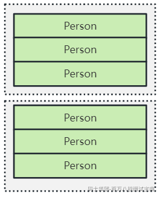

**RDD在编译过程中会对类型进行检查，有错误不会运行，数据在底层处理过程中会有序列化和反序列化的性能开销，对象较多时，底层会频繁的创建和销毁对象，对应GC开销也很大。**

- **DataFrame**

DataFrame是SparkSQL底层操作对象，前身为SchemaRDD，Spark1.3改名为DataFrame。与RDD类似，有分区概念，除此外DataFrame引入了Schema和off-heap的概念。

DataFrame中底层数据以ROW对象组织，提供了Scheam详细信息，所以DataFrame更新传统数据库中的二维表格，Spark通过Schema可以知道一行数据中的列信息，同时也支持嵌套类型，例如：struct、array、map

**Off-heap是JVM堆以外的内存，这些内存由操作系统管理，DataFrame可以使用堆外内存对数据进行hash、filter、sort而不需要反序列化数据成对象，性能比RDD高。**

DataFrame较RDD编程相比，主要还是通过将DataFrame注册成表，通过SQL方式来分析数据。**DataFrame使用了堆外内存解决了RDD GC的问题，但缺点在于在编译期缺少类型安全检查，导致运行时出错。**

DataFrame读取数据展示形式如下:

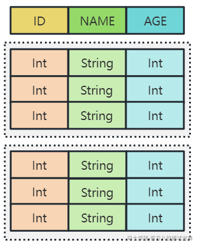

- **DataSet**

DataSet结合了RDD和DataFrame的优点，既可以数据编译时提供数据类型进行类型安全检查又可以使用堆外内存来提高数据处理效率。

在DataSet中引入了Encoder概念，当序列化数据时, Encoder产生字节码与off-heap进行交互, 能够达到按需访问数据的效果, 而不用反序列化整个对象。所以DataSet包含了DataFrame的功能，在Spark2.0+两者做到统一，即：DataSet[ROW] = DataFrame。

DataSet读取数据展示形式如下:

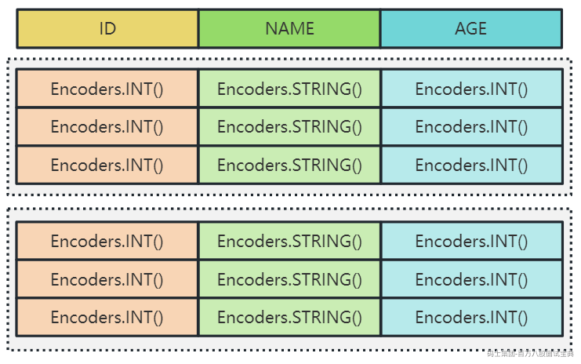

- **三者转换代码**

RDD——>DataFrame

DataFrame ——> RDD

RDD ——> DataSet

DataSet ——>RDD

DataFrame ——> Dataset

DataSet ——> DataFrame

- **总结**

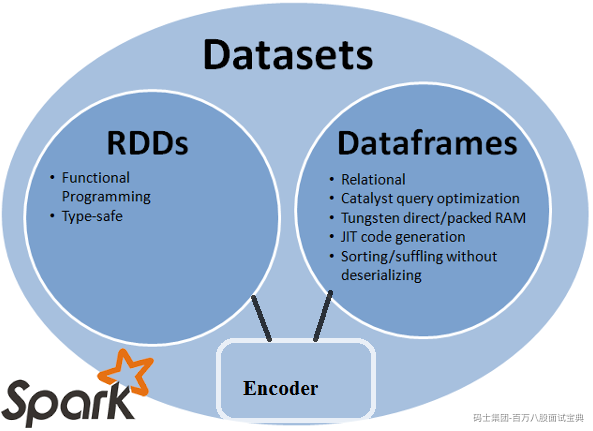

1. RDD、DataFrame、DataSet都有partition概念，都是懒执行的，需要Action算子触发执行。
2. 在使用DataFrame或者DataSet时需要在代码中引入隐式转换：import spark.implicits.\_
3. DataSet中数据类型可以是任意对象，DataFrame中只能是ROW类型的对象，DataFrame常用于注册表进行SQL操作。
4. DataSet[Row] = DataFrame

## 1.16 Spark on Hive和Hive on Spark有什么区别？

- **Hive on Spark:**

Hive on Spark是在Hive上新增一种计算引擎Spark，其目的是借助Spark内存计算引擎的优势提升查询Hive数据的性能。默认执行HQL转换成MR，性能慢，底层使用Spark引擎效率高。Hive on Spark与Hive on Tez 、Hive on MR(默认)一样，只是底层执行的引擎不一样而已。

- **Spark on Hive:**

没有官方的Spark on Hive说法，属于大家习惯性的称呼，指的是SparkSQL 读写Hive 表特点场景。SparkSQL可以不读取Hive中的数据，也可以读取Hive中的数据，Spark on Hive目的是让SparkSQL可以访问Hive表，Spark on Hive 就是SparkSQL可以访问Hive表，可以基于SparkSQL构建Hive数仓。

- **Hive on Spark与Spark on Hive异同点：**

**相同点：**SQL执行层都是使用Spark执行引擎。

**不同点有以下3点：**

1. 两者SQL解析层不同，Hive on Spark使用Hive compiler，Spark on Hive 使用的是Spark compiler。
2. Spark on Hive 中 SparkSQL作为Spark生态圈中的一员继续发展，不受限与Hive，只是兼容Hive。
3. Hive on Spark 是Hive中的发展计划，该计划将Spark作为Hive底层引擎之一，Hive 支持引擎除了Spark外还有默认的MR、Tez。

## 1.17 解释SQL查询优化器RBO和CBO特点

数据库SQL语句执行流程如下：

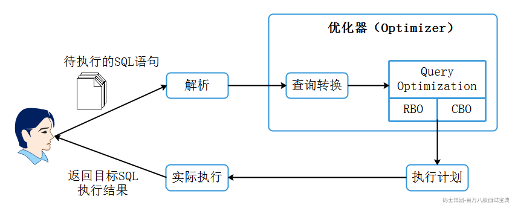

在SQL优化器中最重要的一个组件是查询优化器（Query Optimization），在海量数据分析中一条SQL生成的执行计划搜索空间非常庞大，**查询优化器的目的就是对执行计划空间进行裁剪减少搜索空间的代价**，查询优化器对于SQL的执行来说非常重要，不管是关系型数据库系统Oracle、MySQL还是大数据领域中的Hive、SparkSQL、Flink SQL都会有一个查询优化器进行SQL执行计划优化。

有的数据库系统会采用自研的查询优化器，而有的则会采用开源的查询优化器插件，比如Apache Calcite就是一个优秀的开源查询优化器插件。而像Oracle数据库的查询优化器，则是Oracle公司自研的一个核心组件，负责解析SQL，其目的是按照一定的原则来获取目标SQL在当前情形下执行的最高效执行路径。

**查询优化器主要解决的是多个连接操作的复杂查询优化，负责生成、制定SQL的执行计划。在Spark2.0之前SparkSQL支持RBO查询优化器，在Spark2.2版本后支持CBO查询优化器，SparkSQL默认采用了RBO查询优化器来进行SQL优化解析。**

**基于规则的优化器（RBO）与基于代价的优化器（CBO）两者特点如下:**

- **RBO(Rule-Based Optimization):**

RBO即基于规则的优化器，**该优化器按照硬编码在数据库中的一系列规则来决定SQL的执行计划，只要求我们按照这套规则来写SQL语句，无论表中的数据分布和数据量如何都不会影响这套规则下的执行计划。**以Oracle数据库为例，RBO根据Oracle指定的优先顺序规则，对指定的表进行执行计划的选择。比如在规则中：索引的优先级大于全表扫描。

通过以上可以了解到在RBO对数据不“敏感”，但在实际的场景中，数据的量级以及数据的分布会严重影响同样的SQL执行性能，这也是RBO的缺点所在，所以RBO生成的执行计划往往不是最优的。

- **CBO(Cost-Based Optimization)：**

CBO即基于代价的优化器，该优化器通过根据优化规则**对关系表达式进行转换，按照表、索引、列等信息生成多个执行计划**，然后CBO会通过根据统计信息(Statistics)和代价模型(Cost Model)计算各种可能“执行计划”的“代价”，即COST，从中选用COST最低的执行方案，作为实际运行方案。

CBO依赖数据库对象的统计信息，这些信息包括：**SQL执行路径的I/O，网络开销、CPU使用情况**等，目前各大数据库和大数据的计算引擎都倾向于使用CBO，或者**两者结合（可以基于两者选择最优的执行计划，提高效率）**。像在Oracle10g开始彻底放弃了RBO，MySQL使用的也是CBO优化器；在大数据领域中 Hive也在0.14版本引入CBO，Spark计算框架使用的是Catalyst查询引擎（基于Scala开发），这种查询引擎支持RBO和CBO优化器，Flink计算框架使用的是Calcite查询引擎（开源），这种查询引擎也是同时支持RBO和CBO优化器。

**总结:**

1. **RBO是基于规则的优化器**，按照硬编码一系列规则来决定SQL的执行计划，表中的数据分布和数据量不会影响生成的执行计划，在数据量级较大及数据分布不均情况下生成的查询计划性能不佳；
2. **CBO是基于代价的优化器**，通过根据SQL执行路径的I/O，网络开销、CPU使用情况对SQL进行转换，按照表、索引、列等信息生成多个执行计划，然后计算各“执行计划”的“代价”，从中选用COST最低的执行计划作为实际运行的方案。

## 1.18 谈谈对SparkSQL AQE理解？

SparkSQL执行过程中虽有一系列的优化，但是存在以下几个问题：

1. **SparkSQL 不能选出最优的查询计划**

SparkSQL支持RBO和CBO查询优化器对SQL进行优化得到最优查询计划，RBO生成的查询计划不一定最优，虽然SparkSQL支持CBO获取最优查询计划，但CBO仅支持注册到Hive Metastore的数据表，对于读取分布式文件这种场景不支持CBO，此外，CBO一旦获取最优的查询计划交付运行后，在Spark任务运行过程中，提交的查询计划不能进行修改，在这个层次上来说，CBO也相当于是一种静态的优化策略，往往SparkSQL任务运行过程中会涉及多个Stage阶段，每个阶段会涉及数据shuffle数据落盘，这些数据在后续阶段处理过程中再使用CBO优化选择出执行计划可能并不是最优。

1. **SparkSQL默认支持固定的Shuffle分区数**

在SparkSQL中可以通过spark.sql.shuffle.partitions来设置SQL任务执行过程中的分区数，默认为200,该参数决定了“reduce task”个数。当我们配置了该参数后会默认给当前SparkSQL任务所有的join或者聚合操作设置了统一的分区数，相同的shuffle分区数不能适合单个查询的所有stage，因为每个stage都有不同的输出数据大小和分配。

例如：通过SQL对数据进行了过滤，这时我们需要调小该参数以防止增加调度开销和小reduce任务、小文件的产生；但是如果该值设置太小又不能满足前面一些阶段数据处理要求，可能出现一个task处理的数据量非常多，导致频繁的GC，甚至出现OOM问题。

所以，shuffle 分区数既不能太小也不能太大。为了获得最佳性能，我们经常需要在非生产环境中为多次调整 shuffle 分区数。

1. **数据倾斜影响SparkSQL稳定性**

SparkSQL处理过程中也会出现数据倾斜问题，一些数据对应的key数据量非常大，与其他数据进行关联时，经过hash分区相同key被同一个task处理，导致该task执行时间长，影响整体性能，甚至一些task在倾斜过程中拉取倾斜数据时，导致executor内存OOM。当然我们也可以对倾斜的key进行“加盐”处理，但在SparkSQL真正任务执行之前增加了任务复杂性。

- **AQE自适应查询**

针对以上SparkSQL执行过程中的缺点问题，Spark 3.0 推出了 AQE (Adaptive Query Execution，自适应查询执行)，AQE 是 Spark SQL 的一种动态优化机制，在运行时，**每当 Shuffle Map 阶段执行完毕，AQE 都会结合这个阶段的统计信息，基于既定的规则动态地调整、修正尚未执行的逻辑计划和物理计划，来完成对原始查询语句的运行时优化。**

**Spark Shuffle 的每个 Map Task 会输出中间文件,AQE 依赖Shuffle Map 阶段输出的中间文件的统计信息，如每个 shuffle data 文件的大小、空文件数量与占比、每个 Reduce Task 对应的分区大小等。AQE 优化机制触发的时机是 Shuffle Map 阶段执行完毕，如果没有 Shuffle AQE 就不会触发。**

- **AQE 特点**

1. **优化Shuffle过程，自动分区合并**

AQE 会自动合并过小的数据分区。Shuffle 后，在 Reduce 阶段，当 Reduce Task 把数据分片从map端拉回，AQE 按照分区编号的顺序，依次把小于目标尺寸的分区合并在一起。

AQE 实现了动态调整 shuffle partition 个数机制，在运行不同stage的时候，会根据 map 端 shuffle write 的实际数据量，来决定启动多少个 reducer 来处理，这样无论数据量怎么变换，都可以通过不同的 reducer 个数来均衡数据，从而保证单个 reducer 拉取的数据量不至于太大。但AQE 并清楚 map 端需要对数据分出来多少份，所以实际使用的时候，可以把 spark.sql.shuffle.partitions 参数往大了设置。

1. **调整Join策略,自动广播**

SparkSQL两表进行Join关联时，为了能提高join性能我们可以将一张表进行广播后与另外一张表进行Join。AQE 中，会在运行时根据真实的数据来进行判断，当其中一个join表的实际大小小于spark.sql.autoBroadcastJoinThreshold阈值时（默认10M），就会把执行计划中的 shuffle join 动态修改为 broadcast join。

1. **自动倾斜处理**

在AQE中，通过收集运行时统计信息，我们就可以动态探测出倾斜的分区，从而对倾斜的分区，分裂出来子分区，每个子分区对应一个 reducer， 从而缓解数据倾斜对性能的影响。AQE 自动拆分 Reduce 过大的数据分区，降低单个 Reduce Task 的工作负载。

## 1.19 Spark 自适应AQE参数

AQE 自适应查询配置参数如下:

- **spark.sql.adaptive.enabled**

默认true，当为true时，启用AQE自适应查询，它将基于准确的运行时统计信息，在查询执行过程中重新优化查询计划。

- **spark.sql.adaptive.advisoryPartitionSizeInBytes**

在SparkSQL AQE中自动分区合并后分区大小，默认为64M。该参数也可以有效避免SparkSQL中小文件产生。建议可以设置成为dfs.block.size的大小，这样可以做到和块对齐。

- **spark.sql.adaptive.autoBroadcastJoinThreshold**

SparkSQL AQE中自动将小于该配置参数的表进行广播，默认值与spark.sql.autoBroadcastJoinThreshold相同为10M，如果配置成-1,表示禁用广播。

- **spark.sql.adaptive.coalescePartitions.enabled**

默认为true，Spark将根据目标大小(由' spark .sql.adaptive. advisorypartitionsizeinbytes '指定)合并连续的shuffle分区，以避免太多的小任务。

- **spark.sql.adaptive.coalescePartitions.initialPartitionNum**

SparkSQL AQE自动合并分区中，启动自动分区合并的shuffle分区的初始数目，默认与spark.sql.shuffle.partitions相同，此配置仅在“spark.sql.adaptive”为true且“spark.sql.adaptive.coalescePartitions”为true下生效。

- **spark.sql.adaptive.coalescePartitions.minPartitionSize**

SparkSQL AQE自动分区合并中，合并后shuffle分区的最小大小，默认1M。分区自动合并后最小分区大小不小于该值。

- **spark.sql.adaptive.optimizeSkewsInRebalancePartitions.enabled**

SparkSQL AQE中是否将倾斜分区数据拆分成更小的分区进行倾斜处理，默认true。

- **spark.sql.adaptive.skewJoin.skewedPartitionFactor**

SparkSQL AQE中如何认定分区是有数据倾斜的膨胀系数，默认为5。如果一个分区数据量大小大于所有task处理数据量中位数的5倍并且大于spark.sql.adaptive.skewJoin.skewedPartitionThresholdInBytes参数时，认为该分区存在数据倾斜。

- **spark.sql.adaptive.skewJoin.skewedPartitionThresholdInBytes**

SparkSQL AQE中认定一个分区是有数据倾斜的大小值，默认256M。如果一个分区大小超过该值并且满足spark.sql.adaptive.skewJoin.skewedPartitionFactor指定的因子数，则认为该分区存在数据倾斜。

- **spark.sql.adaptive.skewJoin.enabled**

SparkSQL AQE 中，Spark通过拆分或者复制倾斜分区数据来动态处理倾斜连接，默认为true。

## 1.20 SparkSQL优化

Spark 优化本质就是尽可能的减少无效数据计算、缓存数据、均匀分布数据，最大化资源利用，可以从以下几个角度进行SparkSQL优化。

1. **开启AQE并设置合理的分区**

Spark3.2版本后自动开启了AQE查询，如果是其他版本Spark可以在使用SparkSQL时开启AQE自适应查询并将spark.sql.shuffle.partitoins设置适当的值来加快查询速度。

1. **编写SQL尽量减少计算数据量**

编写SQL时尽可能在计算时减少数据输入量，可以在数据表关联时指定固定想要的字段或者在关联之前使用where对数据进行过滤，减少计算的数据量。

1. **对小表自动broadcast**

可以设置参数spark.sql.autoBroadcastJoinThreshold指定SparkSQL小表自动广播的阈值，默认是10M 。例如：大表和小表进行关联，内存如果充足情况下可以将该值调大，将小表广播出去避免shuffle操作。

1. **对复杂查询进行拆解**

原始SQL查询嵌套较多或者非常复杂时，可以考虑将复杂查询语句进行拆解成多个查询子句，这样可以加快SQL查询速度并可以做到数据表的复用。

例如：多个大表进行Join，其中各个表涉及到数据的过滤、聚合等，可以针对每个表进行拆分将每个表单独处理获取中间临时表，然后对中间临时表进行关联操作。

1. **对重复使用的数据表进行持久化**

如果对SparkSQL计算过程中的中间表经常复用，可以考虑将该表使用persist()持久化，将数据表持久化到磁盘或者内存中，避免再次使用时重新计算。

1. **数据倾斜处理**

在SparkSQL处理过程中如果数据有倾斜，例如：10%的 key, 占了 90%的数据量, 而拿 key 去关联的话，那10%的key就会出现明显的数据倾斜，可以对倾斜的key进行加盐处理，加盐处理的原理就是通过随机值将 10%的key 打平，从而均分数据量，平均每个节点的压力，从而减少数据倾斜的情况。可以开启AQE自动处理，但需要设置对应的倾斜分区阈值参数。

1. **合理使用各个分析函数**

- row\_number() over (partition by ... order by ...)：同个分组内生成连续的序号，每个分组内从1开始且排序相同的数据会标不同的号。
- rank() over (partitin by ... order by ... ) 同个分组内生成不连续的序号，在每个分组内从1开始，同个分组内相同数据标号相同。
- dense\_rank() over (partitin by ... order by ... )同个分组内生成连续的序号，在每个分组内从1开始，同个分组内相同数据标号相同，之后的数据标号连续。
- sum(...) over(partition by ... order by ...):按照order by列累计结果，累计到当前行。
- sum(...) over(partition by ... order by ... rows between 1 preceding and current row)：按照order by列累计结果，前一条数据累计到当前行。
- sum(...) over(partition by ... order by ... rows between 1 preceding and 1 following):按照order by列累计结果，累计前1行、当前行、后一行数据结果。
- explode（list）：爆炸函数，将集合数据展开为每一条数据。
- get\_json\_object($"infos","$.name") ：从json中获取json属性值。
- concat(col1,col2):将多列拼接成一列
- concat\_ws("分隔符",col1,col12) ：可以指定分隔符隔开字段,形成新列。
- collect\_list(col1): 使用时需要使用group by 对某个字段分组，然后对其他的某个字段下的数据放在一个集合中，不去重
- collect\_set(col1): 与collect\_list一样，去重
- split(col1,“分隔符”)：按照分隔符切割列
- str\_to\_map(字符串,Delimiter1，Delimiter2)：使用两个分隔符将文本拆分为键值对。 Delimiter1 将文本分成K-V对，默认分隔符为“,”。Delimiter2分割每个K-V对，默认分隔符为“=”，例如：str\_to\_map("A=100,B=200,C=300",",","=")
- unix\_timestamp : 将字符串时间转换成是时间戳,例如：unix\_timestamp(‘20250401’,‘yyyyMMdd’)
- from\_unixtime：时间戳转换成是时间，from\_unixtime(时间戳，‘yyyy-MM-dd’)
- datediff(date1,date2): 获取时间差值，例如：datediff(‘2025-05-01’，‘2025-05-02’)
- date\_add(date，days):时间增加天数,例如：date\_add('2025-01-01', 10)
- 其他时间函数：year()、month()、day()、hour()、minutes()

## 1.21 Spark、MapReduce、Flink区别?

MapReduce编程模型只包含Map和Reduce两个过程，map的主要输入是一对<Key, Value>值，经过map计算后输出一对<Key, Value>值；然后将相同Key合并，形成<Key, Value集合>，再将这个<Key, Value集合>输入reduce，经过计算输出零个或多个<Key, Value>对。

MapReduce运行的时候，会通过Mapper运行的任务读取数据文件，然后调用自己的方法，处理数据，最后输出。Reducer任务会接收Mapper任务输出的数据，作为自己的输入数据，调用自己的方法，最后输出到相应的文件中。

MR具体处理数据流程是：Input Data -> MR -> Output Data ->MR ->Output Data。在MapReduce流程里，第一个MR的输出要先落地，然后第二个MR才能把第一个MR的输出当做输入，进行第二次MR。如果有多个MR流式作业，消耗的时间也就会随之增加。这是MapReduce执行较其他框架慢的重要原因之一。

Apache Spark的高性能一定程度上取决于它采用的异步并发模型（这里指server/driver 端采用的模型），这与Hadoop 2.0（包括YARN和MapReduce）是一致的。Hadoop MapReduce采用了多进程模型，而Spark采用了多线程模型。

Spark采用了经典的scheduler/workers模式，每个Spark应用程序运行的第一步是构建一个可重用的资源池，然后在这个资源池里运行所有的ShuffleMapTask和ReduceTask。而MapReduce应用程序则不同，它不会构建一个可重用的资源池，而是让每个Task动态申请资源，且运行完后马上释放资源。

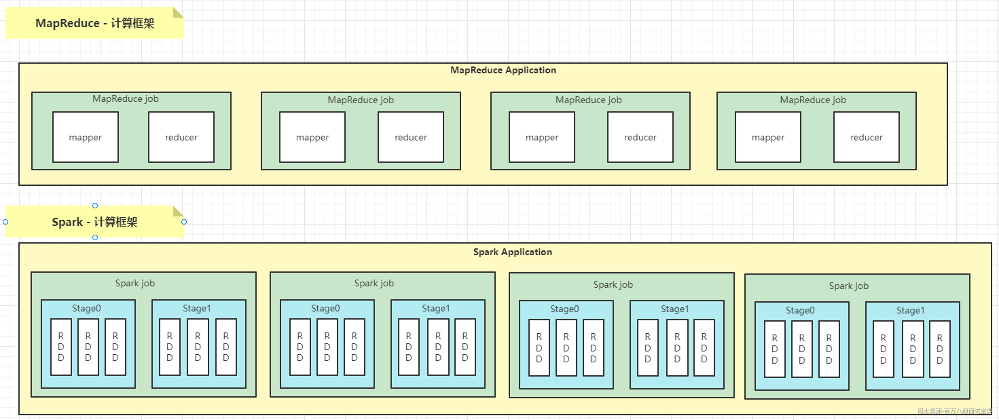

1. MR基于磁盘迭代处理数据，Spark可以基于内存处理数据，可以对数据进行持久化，对迭代或者多次重复处理同一数据源非常高效。
2. Spark 中持久化默认的数据只有一份，MR中数据处理基于HDFS，默认副本有3个
3. Spark中支持批数据处理，支持流式数据处理，支持SQL处理数据，MR只支持批数据处理
4. Spark中封装了各种高级的算子，代码编写方便，MR中需要自己实现复杂逻辑
5. Spark是粗粒度资源申请，MR是细粒度资源申请

**Flink和Spark有很多相似点，也有很多不同点，相似点如下：**

1. 都基于内存计算，Spark数据可以持久化，Flink状态可以基于内存计算
2. 都可以处理批和流数据，都支持SQL处理数据。
3. 都有很多转换操作。
4. 都有完善的错误恢复机制。
5. 都支持Exactly once语义一致性。

**不同点主要是针对流式数据处理上不同，具体如下：**

1. **设计理念**
2. Spark的技术理念是使用微批来模拟流的计算，基于Micro-batch，数据流以时间为单位被切分成一个个批次，通过分布式数据集RDD进行批量处理，是一种伪实时。
3. Flink是基于事件驱动的，是面向流的处理框架，Flink基于每个事件一行一行地进行流式处理，是真正的流式计算，也可以基于流来进行批计算，实现批处理。

Spark流处理划分成微批处理，Flink批是流的特例，Spark流式数据处理延迟只能做到秒级，Flink基于每个事件处理，每当有新数据进来都会立刻处理，是真正的实时计算，延迟毫秒级别。

1. **吞吐量与延迟**
2. SparkStreaming是基于微批的，吞吐量大，延迟高，一般是秒级
3. Flink基于事件，消息逐条处理，兼顾吞吐量的同时有很低的延迟，延迟可以达到毫秒级。
4. **架构方面：**
5. Spark在运行时主要角色包括：Master、Worker、Driver、Executor
6. Flink在运行时主要包含：JobManager、TaskManger和Slot
7. **任务调度**
8. SparkStreaming，连续不断的生成微批构建有向无环图DAG，根据DAG中的action操作形成job，每个job有根据宽窄依赖生成多个stage。
9. Flink根据用户提交的代码生成StreamGraph，经过优化生成JobGraph,然后提交给JobManager进行处理，JobManager会根据JobGraph生成ExecutionGraph，ExecutionGraph是Flink调度最核心的数据结构，JobManager根据ExecutionGraph对job进行调度。
10. **时间机制**
11. SparkStreaming支持的时间机制有限、只支持处理时间，StructuredStreaming支持事件时间，支持watermark。
12. Flink支持三种时间机制：事件时间、注入时间、处理时间，同时支持watermark机制处理迟到数据。
13. **窗口方面**

Spark只支持基于时间的窗口操作（处理时间或者事件时间），而Flink支持的窗口非常灵活（time，count,session），支持时间窗口，还支持基于数据本身的窗口，也可以自定义窗口。

1. **状态**

Flink比Spark支持更多的状态操作。Flink中状态更丰富，基于每个key都可以灵活维护状态，也可以针对业务自定义状态等，编码时可以自己操作状态。处理流式数据时，在Flink中可以设置checkpoint，当Flink任务失败后，重启的Flink任务可以基于checkpoint来恢复任务。

Spark利用checkpoint来实现Spark处理内部的状态管理。处理流式数据时，SparkStreaming不支持任务重启后从checkpoint中回复状态，StructuredStreaming可以支持。

1. **容错机制**

Flink基于轻量级分布式快照（Snapshot）实现容错，Spark容错机制基于RDD的容错机制，Spark内部可以使用持久化算子和checkpoint来实现数据容错和保存状态。

实时消费Kafka数据时，想要做到精准消费一次数据（exactly-once），Flink基于两阶段提交实现，SparkStreaming需要手动维护offset来保证，StructuredStreaming只支持at-least-once语义。

## 1.22 Spark读取Kafka中数据如何保证数据消费一致性？

1. **Receiver模式（了解）**

在早期Spark消费Kafka中数据只支持Receiver模式。Receiver模式读取Kafka中数据原理图如下：

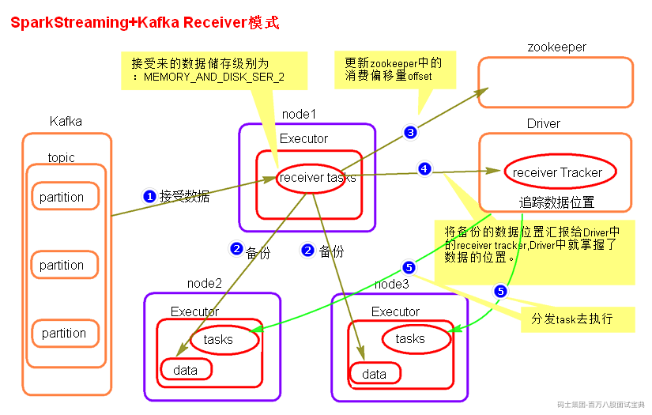

Receiver模式中，SparkStreaming使用Receiver接收器模式来接收kafka中的数据，即会将每批次数据都存储在Spark端，默认的存储级别为MEMORY\_AND\_DISK\_SER\_2，从Kafka接收过来数据之后，还会将数据备份到其他Executor节点上，当完成备份之后，再将消费者offset数据写往zookeeper中，然后再向Driver汇报数据位置，Driver发送task到数据所在节点处理数据。

这种模式使用zookeeper来保存消费者offset，等到SparkStreaming重启后，从zookeeper中获取offset继续消费。

当Driver挂掉时，同时消费数据的offset已经更新到zookeeper中时，SparkStreaming重启后，接着zookeeper存储的offset继续处理数据，这样就存在丢失数据的问题。

为了解决以上丢失数据的问题，可以开启WAL(write ahead log)预写日志机制，将从kafka中接收来的数据备份完成之后，向指定的checkpoint中也保存一份，这样当SparkStreaming挂掉，重新启动再处理数据时，会处理Checkpoint中最近批次的数据，将消费者offset继续更新保存到zookeeper中。

开启WAL机制，需要设置checpoint,由于一般checkpoint路径都会设置到HDFS中，HDFS本身会有副本，所以这里如果开启WAL机制之后，可以将接收数据的存储级别降级，去掉“\_2”级别。

**开启WAL机制之后带来了新的问题：**

- **数据重复处理问题**

由于开启WAL机制，会处理checkpoint中最近一段时间批次数据，这样会造成重复处理数据问题。所以对于数据需要精准消费的场景，不能使用receiver模式。如果不开启WAL机制Receiver模式有丢失数据的问题，开启WAL机制之后有重复处理数据的问题，对于精准消费数据的场景，只能人为保存offset来保证数据消费的准确性。

- **数据处理延迟加大问题**

数据在节点之间备份完成后再向checkpoint中备份，之后再向Zookeeper汇报数据offset，向Driver汇报数据位置，然后Driver发送task处理数据。这样加大了数据处理过程中的延迟。

对于精准消费数据的问题，需要我们从每批次中获取offset然后保存到外部的数据库来实现来实现仅一次消费数据。但是Receiver模式底层读取Kafka数据的实现使用的是High Level Consumer Api，这种Api不支持获取每批次消费数据的offset。所以对于精准消费数据的场景不能使用这种模式。

**Receiver模式总结**

1. Receiver模式采用了Receiver接收器的模式接收数据。会将每批次的数据存储在Executor内存或者磁盘中。
2. Receiver模式有丢失数据问题，开启WAL机制解决，但是带来新的问题。
3. receiver模式依赖zookeeper管理消费者offset。
4. SparkStreaming读取Kafka数据，相当于Kafka的消费者，底层读取Kafka采用了“[High Level Consumer API](http://kafka.apache.org/082/documentation.html" \l "highlevelconsumerapi)”实现，这种api没有提供操作每批次数据offset的接口，所以对于精准消费数据的场景想要人为控制offset是不可能的。
5. **Direct模式**

在Spark1.6版本引入了Dircet模式。

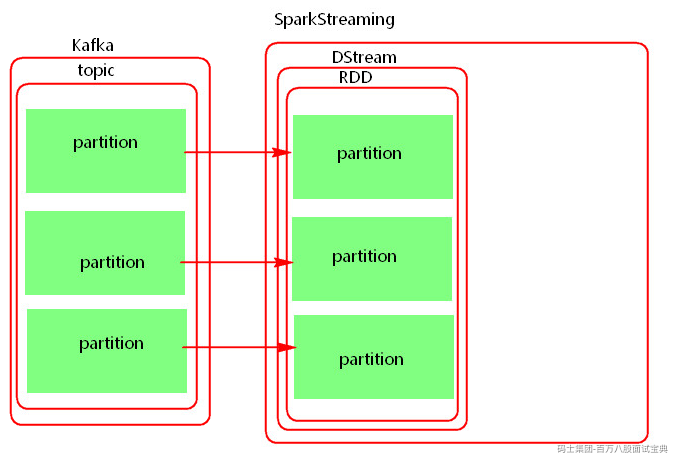

Driect模式就是将kafka看成存数据的一方，这种模式没有采用Receiver接收器模式，而是采用直连的方式，不是被动接收数据，而是主动去取数据，当任务失败后代码中如果设置了checkpoint目录，那么最近消费Kafka批次信息也会保存在checkpoint中。当SparkStreaming停止后，我们可以使用val ssc = StreamFactory.getOrCreate(checkpointDir,Fun)来恢复停止之前SparkStreaming处理数据的进度，当然，这种方式存在重复消费数据和逻辑改变之后不可执行的问题。

Direct模式底层读取Kafka数据实现是Simple Consumer api实现，这种api提供了从每批次数据中获取offset的接口，所以对于精准消费数据的场景，可以使用Direct 模式手动维护offset方式来实现数据精准消费。

此外，Direct模式的并行度与当前读取的topic的partition个数一致，所以Direct模式并行度由读取的kafka中topic的partition数决定的。

**如何保证消费Kafka数据offset精准性？**

1. **checkpoint管理**

如果设置了checkpoint ,那么最近消费批次数据会存储在checkpoint中。这种有缺点: 第一，当从checkpoint中恢复数据时，有可能造成重复的消费。第二，当代码逻辑改变时，无法从checkpoint中来恢复offset。

1. **依赖Kafka存储**

依靠kafka 来存储消费者offset,kafka 中有一个特殊的topic 来存储消费者offset。新的消费者api中，会定期自动提交offset。这种情况有可能也不是我们想要的，因为有可能消费者自动提交了offset,但是后期SparkStreaming 没有将接收来的数据及时处理保存。这里也就是为什么会在配置中将enable.auto.commit 设置成false的原因。这种消费模式也称最多消费一次（at-most-once），默认sparkStreaming 拉取到数据之后就可以更新offset,无论是否消费成功，自动提交offset的频率由参数auto.commit.interval.ms 决定，默认5s。

如果我们能保证完全处理完业务之后，可以后期异步的手动提交消费者offset。但是这种将offset存储在kafka中由参数offsets.retention.minutes=1440控制是否过期删除，默认是保存一天，如果停机没有消费达到时长，存储在kafka中的消费者组会被清空，offset也就被清除了。

1. **手动维护**

自己存储offset,这样在处理逻辑时，保证数据处理的事务，如果处理数据失败，就不保存offset，处理数据成功则保存offset.这样可以做到精准的处理一次处理数据。

## 1.23 Spark优化

1. **资源优化**
2. **在搭建Spark集群时给定Spark集群充足的资源（core+内存），可以通过配置Spark 安装包的conf下spark-env.sh 实现。**

1. **在提交Application的时候给Application分配更多的资源。**

1. **开启动态资源配置**

Spark中可以通过指定“spark.executor.instances”（--num-executors）来指定一个Spark应用使用的executor数量，但是该值无论Spark数据量是多是少都会使用这些executor直到Spark Application结束，如果对于数据增长过快的Spark任务，可以使用动态资源，限定Application使用的Executor个数。

此外，一个 Spark Application中如果一些 Stage 有数据倾斜，可能会有一些 Executor 是空闲状态，造成集群资源的极大浪费，通过动态资源分配策略，已经空闲的 Executor 如果超过了一定时间，就会被集群回收，并在之后的 Stage 需要时可再次请求 Executor，真正做到按需使用资源。

动态资源分配参数如下：

- **spark.dynamicAllocation.enabled**

是否开启动态资源配置，根据工作负载来衡量是否应该增加或减少executor，默认false。开启此参数需要设置spark.shuffle.service.enabled或者spark.dynamicAllocation.shuffleTracking.enabled为true。

- **spark.shuffle.service.enabled**

是否开启External Shuffle Service服务,默认false。executor在运行过程中除了负责运行task，还需要写shuffle数据，这样有可能导致executor 进程任务过重，影响task运行，导致无法向外提供数据，这时可以开启External Shuffle Service服务，该服务是运行于NodeManager进程中的一个服务，通过该服务可以抓取shuffle数据向外提供shuffle数据，提升shuffle计算性能。

- **spark.dynamicAllocation.shuffleTracking.enabled**

spark3新增，启用shuffle文件跟踪，此配置不会回收保存了shuffle数据的executor。默认为true。

- **spark.dynamicAllocation.executorIdleTimeout**

启动动态资源分配后，当某个executor空闲超过这个设定值，就会被kill，默认60s。

- **spark.dynamicAllocation.minExecutors**

动态分配最小executor个数，在启动时就申请好的，默认0。

- **spark.dynamicAllocation.maxExecutors**

动态分配最大executor个数，默认infinity无穷大。

- **spark.dynamicAllocation.initialExecutors**

动态分配初始executor个数默认值=spark.dynamicAllocation.minExecutors，如果设置了--num-executors 或 spark.executor.instances 并且大于这个值，该值被用作启动Executor的初始数量。

- **spark.dynamicAllocation.schedulerBacklogTimeout**

如果启用了动态分配，并且有待解决的任务积压的时间超过了此期限，则将请求新的executor，默认1s。(第一次申请)

- **spark.dynamicAllocation.sustainedSchedulerBacklogTimeout**

与spark.dynamicAllocation.schedulerBacklogTimeout相同，但仅用于后续Executor请求的间隔时间。(第二次及以后)

1. **并行度优化**

原则：一个core一般分配2~3个task,每一个task一般处理1G数据（task的复杂度类似wc）

提高并行度的方式：

- sc.textFile(xx,minnumpartition)
- sc.parallelize(xx,num)
- sc.makeRDD(xx,num)
- sc.parallelizePairs(xx,num)
- reduceByKey,join,distinct
- repartition/coalesce
- spark.default.parallelism
- spark.sql.shuffle.partitions
- 自定义分区器

1. **代码优化**
2. **避免创建重复的RDD，复用同一个RDD**
3. **对多次使用的RDD进行持久化**

如何选择一种最合适的持久化策略？

默认情况下，性能最高的当然是MEMORY\_ONLY，但前提是你的内存必须足够足够大，可以绰绰有余地存放下整个RDD的所有数据。因为不进行序列化与反序列化操作，就避免了这部分的性能开销；对这个RDD的后续算子操作，都是基于纯内存中的数据的操作，不需要从磁盘文件中读取数据，性能也很高；而且不需要复制一份数据副本，并远程传送到其他节点上。但是这里必须要注意的是，在实际的生产环境中，恐怕能够直接用这种策略的场景还是有限的，如果RDD中数据比较多时（比如几十亿），直接用这种持久化级别，会导致JVM的OOM内存溢出异常。

如果使用MEMORY\_ONLY级别时发生了内存溢出，那么建议尝试使用MEMORY\_ONLY\_SER级别。该级别会将RDD数据序列化后再保存在内存中，此时每个partition仅仅是一个字节数组而已，大大减少了对象数量，并降低了内存占用。这种级别比MEMORY\_ONLY多出来的性能开销，主要就是序列化与反序列化的开销。但是后续算子可以基于纯内存进行操作，因此性能总体还是比较高的。此外，可能发生的问题同上，如果RDD中的数据量过多的话，还是可能会导致OOM内存溢出的异常。

如果纯内存的级别都无法使用，那么建议使用MEMORY\_AND\_DISK\_SER策略，而不是MEMORY\_AND\_DISK策略。因为既然到了这一步，就说明RDD的数据量很大，内存无法完全放下。序列化后的数据比较少，可以节省内存和磁盘的空间开销。同时该策略会优先尽量尝试将数据缓存在内存中，内存缓存不下才会写入磁盘。

通常不建议使用DISK\_ONLY和后缀为\_2的级别：因为完全基于磁盘文件进行数据的读写，会导致性能急剧降低，有时还不如重新计算一次所有RDD。后缀为\_2的级别，必须将所有数据都复制一份副本，并发送到其他节点上，数据复制以及网络传输会导致较大的性能开销，除非是要求作业的高可用性，否则不建议使用。

持久化算子：

- cache:MEMORY\_ONLY
- persist：MEMORY\_ONLY、MEMORY\_ONLY\_SER、MEMORY\_AND\_DISK\_SER。一般不要选择带有\_2的持久化级别。
- checkpoint:如果一个RDD的计算时间比较长或者计算起来比较复杂，一般将这个RDD的计算结果保存到HDFS上，这样数据会更加安全。如果一个RDD的依赖关系非常长，也会使用checkpoint,会切断依赖关系，提高容错的效率。

1. **尽量避免使用shuffle类的算子**

使用广播变量来模拟使用join,使用情况：一个RDD比较大，一个RDD比较小。

join算子=广播变量+filter、广播变量+map、广播变量+flatMap

1. **使用map-side预聚合的shuffle操作**

即尽量使用有combiner的shuffle类算子。combiner概念：在map端，每一个map task计算完毕后进行的局部聚合。

combiner好处：

- 降低shuffle write写磁盘的数据量。
- 降低shuffle read拉取数据量的大小。
- 降低reduce端聚合的次数。

有combiner的shuffle类算子：

- reduceByKey:这个算子在map端是有combiner的，在一些场景中可以使用reduceByKey代替groupByKey。
- aggregateByKey
- combineByKey

1. **尽量使用高性能的算子**

- 使用reduceByKey替代groupByKey
- 使用mapPartition替代map
- 使用foreachPartition替代foreach
- filter后使用coalesce减少分区数
- 使用使用repartitionAndSortWithinPartitions替代repartition与sort类操作
- 使用repartition和coalesce算子操作分区。

2. **使用广播变量**

开发过程中，会遇到需要在算子函数中使用外部变量的场景（尤其是大变量，比如100M以上的大集合），那么此时就应该使用Spark的广播(Broadcast）功能来提升性能，函数中使用到外部变量时，默认情况下，Spark会将该变量复制多个副本，通过网络传输到task中，此时每个task都有一个变量副本。如果变量本身比较大的话（比如100M，甚至1G），那么大量的变量副本在网络中传输的性能开销，以及在各个节点的Executor中占用过多内存导致的频繁GC，都会极大地影响性能。如果使用的外部变量比较大，建议使用Spark的广播功能，对该变量进行广播。广播后的变量，会保证每个Executor的内存中，只驻留一份变量副本，而Executor中的task执行时共享该Executor中的那份变量副本。这样的话，可以大大减少变量副本的数量，从而减少网络传输的性能开销，并减少对Executor内存的占用开销，降低GC的频率。

广播大变量发送方式：Executor一开始并没有广播变量，而是task运行需要用到广播变量，会找executor的blockManager要，bloackManager找Driver里面的blockManagerMaster要。

使用广播变量可以大大降低集群中变量的副本数。不使用广播变量，变量的副本数和task数一致。使用广播变量变量的副本和Executor数一致。

1. **使用Kryo优化序列化性能**

在Spark中，主要有三个地方涉及到了序列化：

- 在算子函数中使用到外部变量时，该变量会被序列化后进行网络传输。
- 将自定义的类型作为RDD的泛型类型时（比如JavaRDD<ABC>，ABC是自定义类型），所有自定义类型对象，都会进行序列化。因此这种情况下，也要求自定义的类必须实现Serializable接口。
- 使用可序列化的持久化策略时（比如MEMORY\_ONLY\_SER），Spark会将RDD中的每个partition都序列化成一个大的字节数组。

Kryo序列化器介绍：Spark支持使用Kryo序列化机制。Kryo序列化机制，比默认的Java序列化机制，速度要快，序列化后的数据要更小，大概是Java序列化机制的1/10。所以Kryo序列化优化以后，可以让网络传输的数据变少；在集群中耗费的内存资源大大减少。

对于这三种出现序列化的地方，我们都可以通过使用Kryo序列化类库，来优化序列化和反序列化的性能。Spark默认使用的是Java的序列化机制，也就是ObjectOutputStream/ObjectInputStream API来进行序列化和反序列化。但是Spark同时支持使用Kryo序列化库，Kryo序列化类库的性能比Java序列化类库的性能要高很多。官方介绍，Kryo序列化机制比Java序列化机制，性能高10倍左右。Spark之所以默认没有使用Kryo作为序列化类库，是因为Kryo要求最好要注册所有需要进行序列化的自定义类型，因此对于开发者来说，这种方式比较麻烦。

Spark中使用Kryo：

1. **优化数据结构**

java中有三种类型比较消耗内存：

1. 对象，每个Java对象都有对象头、引用等额外的信息，因此比较占用内存空间。
2. 字符串，每个字符串内部都有一个字符数组以及长度等额外信息。
3. 集合类型，比如HashMap、LinkedList等，因为集合类型内部通常会使用一些内部类来封装集合元素，比如Map.Entry。

因此Spark官方建议，在Spark编码实现中，特别是对于算子函数中的代码，尽量不要使用上述三种数据结构，尽量使用字符串替代对象，使用原始类型（比如Int、Long）替代字符串，使用数组替代集合类型，这样尽可能地减少内存占用，从而降低GC频率，提升性能。

1. **shuffle优化**

参考shufffle优化参数部分。

1. **SparkSQL优化**

参考SparkSQL优化部分。

## 1.24 Spark数据倾斜处理

1. **使用Hive ETL预处理数据**

**方案适用场景：**

如果导致数据倾斜的是Hive表。如果该Hive表中的数据本身很不均匀（比如某个key对应了100万数据，其他key才对应了10条数据），而且业务场景需要频繁使用Spark对Hive表执行某个分析操作，那么比较适合使用这种技术方案。

**方案实现思路：**

此时可以评估一下，是否可以通过Hive来进行数据预处理（即通过Hive ETL预先对数据按照key进行聚合，或者是预先和其他表进行join），然后在Spark作业中针对的数据源就不是原来的Hive表了，而是预处理后的Hive表。此时由于数据已经预先进行过聚合或join操作了，那么在Spark作业中也就不需要使用原先的shuffle类算子执行这类操作了。

**方案实现原理：**

这种方案从根源上解决了数据倾斜，因为彻底避免了在Spark中执行shuffle类算子，那么肯定就不会有数据倾斜的问题了。但是这里也要提醒一下大家，这种方式属于治标不治本。因为毕竟数据本身就存在分布不均匀的问题，所以Hive ETL中进行group by或者join等shuffle操作时，还是会出现数据倾斜，导致Hive ETL的速度很慢。我们只是把数据倾斜的发生提前到了Hive ETL中，避免Spark程序发生数据倾斜而已。

1. **过滤少数导致倾斜的key**

**方案适用场景：**

如果发现导致倾斜的key就少数几个，而且对计算本身的影响并不大的话，那么很适合使用这种方案。比如99%的key就对应10条数据，但是只有一个key对应了100万数据，从而导致了数据倾斜。

**方案实现思路：**

如果我们判断那少数几个数据量特别多的key，对作业的执行和计算结果不是特别重要的话，那么干脆就直接过滤掉那少数几个key。比如，在Spark SQL中可以使用where子句过滤掉这些key或者在Spark Core中对RDD执行filter算子过滤掉这些key。如果需要每次作业执行时，动态判定哪些key的数据量最多然后再进行过滤，那么可以使用sample算子对RDD进行采样，然后计算出每个key的数量，取数据量最多的key过滤掉即可。

**方案实现原理：**

将导致数据倾斜的key给过滤掉之后，这些key就不会参与计算了，自然不可能产生数据倾斜。

1. **提高shuffle操作的并行度**

**方案实现思路：**

在对RDD执行shuffle算子时，给shuffle算子传入一个参数，比如reduceByKey(1000)，该参数就设置了这个shuffle算子执行时shuffle read task的数量。对于Spark SQL中的shuffle类语句，比如group by、join等，需要设置一个参数，即spark.sql.shuffle.partitions，该参数代表了shuffle read task的并行度，该值默认是200，对于很多场景来说都有点过小。

**方案实现原理：**

增加shuffle read task的数量，可以让原本分配给一个task的多个key分配给多个task，从而让每个task处理比原来更少的数据。举例来说，如果原本有5个不同的key，每个key对应10条数据，这5个key都是分配给一个task的，那么这个task就要处理50条数据。而增加了shuffle read task以后，每个task就分配到一个key，即每个task就处理10条数据，那么自然每个task的执行时间都会变短了。

1. **双重聚合**

**方案适用场景：**

对RDD执行reduceByKey等聚合类shuffle算子或者在Spark SQL中使用group by语句进行分组聚合时，比较适用这种方案。

**方案实现思路：**

这个方案的核心实现思路就是进行两阶段聚合。第一次是局部聚合，先给每个key都打上一个随机数，比如10以内的随机数，此时原先一样的key就变成不一样的了，比如(hello, 1) (hello, 1) (hello, 1) (hello, 1)，就会变成(1\_hello, 1) (1\_hello, 1) (2\_hello, 1) (2\_hello, 1)。接着对打上随机数后的数据，执行reduceByKey等聚合操作，进行局部聚合，那么局部聚合结果，就会变成了(1\_hello, 2) (2\_hello, 2)。然后将各个key的前缀给去掉，就会变成(hello,2)(hello,2)，再次进行全局聚合操作，就可以得到最终结果了，比如(hello, 4)。

**方案实现原理：**

将原本相同的key通过附加随机前缀的方式，变成多个不同的key，就可以让原本被一个task处理的数据分散到多个task上去做局部聚合，进而解决单个task处理数据量过多的问题。接着去除掉随机前缀，再次进行全局聚合，就可以得到最终的结果。

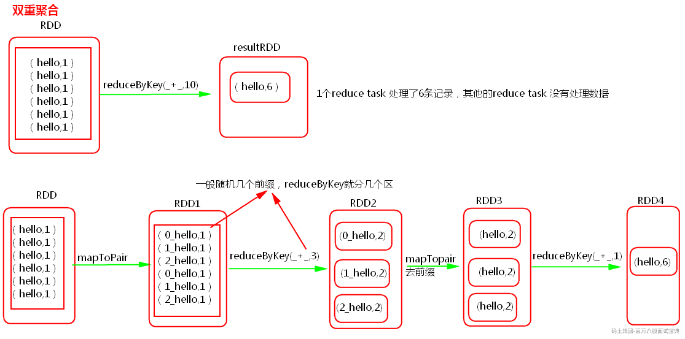

如果一个RDD中有一个key导致数据倾斜，同时还有其他的key，那么一般先对数据集进行抽样，然后找出倾斜的key,再使用filter对原始的RDD进行分离为两个RDD，一个是由倾斜的key组成的RDD1，一个是由其他的key组成的RDD2，那么对于RDD1可以使用加随机前缀进行多分区多task计算，对于另一个RDD2正常聚合计算，最后将结果再合并起来。

1. **将reduce join转为map join**

BroadCast+filter(或者map)

**方案适用场景：**

在对RDD使用join类操作，或者是在Spark SQL中使用join语句时，而且join操作中的一个RDD或表的数据量比较小（比如几百M或者一两G），比较适用此方案。

**方案实现思路：**

不使用join算子进行连接操作，而使用Broadcast变量与map类算子实现join操作，进而完全规避掉shuffle类的操作，彻底避免数据倾斜的发生和出现。将较小RDD中的数据直接通过collect算子拉取到Driver端的内存中来，然后对其创建一个Broadcast变量；接着对另外一个RDD执行map类算子，在算子函数内，从Broadcast变量中获取较小RDD的全量数据，与当前RDD的每一条数据按照连接key进行比对，如果连接key相同的话，那么就将两个RDD的数据用你需要的方式连接起来。

**方案实现原理：**

普通的join是会走shuffle过程的，而一旦shuffle，就相当于会将相同key的数据拉取到一个shuffle read task中再进行join，此时就是reduce join。但是如果一个RDD是比较小的，则可以采用广播小RDD全量数据+map算子来实现与join同样的效果，也就是map join，此时就不会发生shuffle操作，也就不会发生数据倾斜。

1. **采样倾斜key并分拆join操作**

**方案适用场景：**

两个RDD/Hive表进行join的时候，如果数据量都比较大，无法采用“解决方案五”，那么此时可以看一下两个RDD/Hive表中的key分布情况。如果出现数据倾斜，是因为其中某一个RDD/Hive表中的少数几个key的数据量过大，而另一个RDD/Hive表中的所有key都分布比较均匀，那么采用这个解决方案是比较合适的。

**方案实现思路：**

对包含少数几个数据量过大的key的那个RDD，通过sample算子采样出一份样本来，然后统计一下每个key的数量，计算出来数据量最大的是哪几个key。然后将这几个key对应的数据从原来的RDD中拆分出来，形成一个单独的RDD，并给每个key都打上n以内的随机数作为前缀，而不会导致倾斜的大部分key形成另外一个RDD。接着将需要join的另一个RDD，也过滤出来那几个倾斜key对应的数据并形成一个单独的RDD，将每条数据膨胀成n条数据，这n条数据都按顺序附加一个0~n的前缀，不会导致倾斜的大部分key也形成另外一个RDD。再将附加了随机前缀的独立RDD与另一个膨胀n倍的独立RDD进行join，此时就可以将原先相同的key打散成n份，分散到多个task中去进行join了。而另外两个普通的RDD就照常join即可。最后将两次join的结果使用union算子合并起来即可，就是最终的join结果。

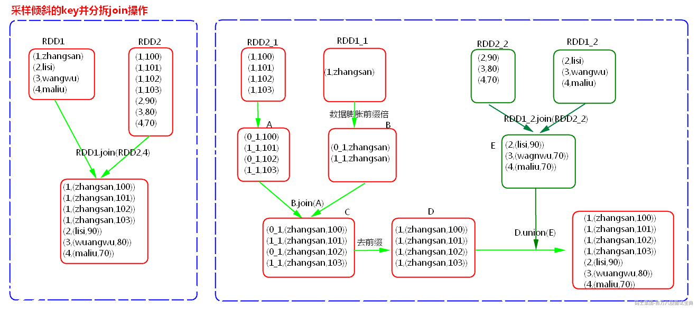

1. **使用随机前缀和扩容RDD进行join**

**方案适用场景：**

如果在进行join操作时，RDD中有大量的key导致数据倾斜，那么进行分拆key也没什么意义，此时就只能使用最后一种方案来解决问题了。

**方案实现思路：**

该方案的实现思路基本和“解决方案六”类似，首先查看RDD/Hive表中的数据分布情况，找到那个造成数据倾斜的RDD/Hive表，比如有多个key都对应了超过1万条数据。然后将该RDD的每条数据都打上一个n以内的随机前缀。同时对另外一个正常的RDD进行扩容，将每条数据都扩容成n条数据，扩容出来的每条数据都依次打上一个0~n的前缀。最后将两个处理后的RDD进行join即可。

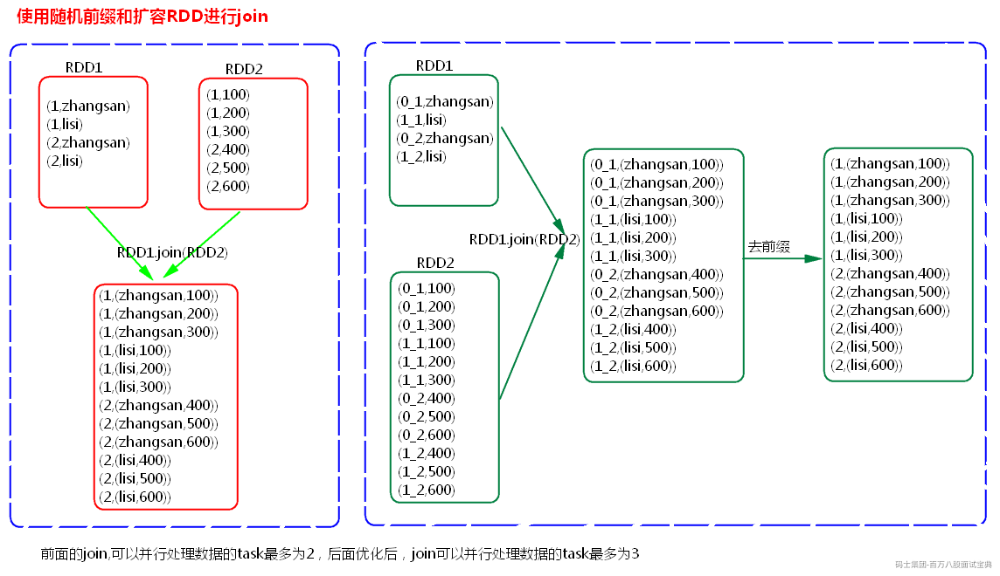

## 1.25 Spark On Yarn运行出现资源不足，可能的原因有哪些?

1. **集群资源配置不足**

当提交Spark任务时执行的资源超过集群资源配置（CPU、内存）时，会出现资源不足，可能集群资源够用，但是资源被其他Spark任务占用导致该任务执行资源不够。需要等待其他任务执行完毕后再运行该任务，或者降低该任务使用的资源。

1. **Yarn资源队列资源有限**

当提交Spak任务使用的资源队列资源不够时，可能会出现该任务出现资源不足，导致任务执行不成功。需要降低该任务使用资源或者增加Yarn资源队列资源来解决。

1. **数据倾斜**

当Spark任务处理数据分布不均匀时，倾斜数据处理导致Executor负载过重、内存使用过大问题，可能会出现资源不足，这种情况需要解决数据倾斜问题。

1. **资源泄露**

Spark应用程序中可能存在代码对象创建过多，存在内存泄漏问题，导致资源无法释放，进而出现资源不足问题，这种情况需要优化代码。
