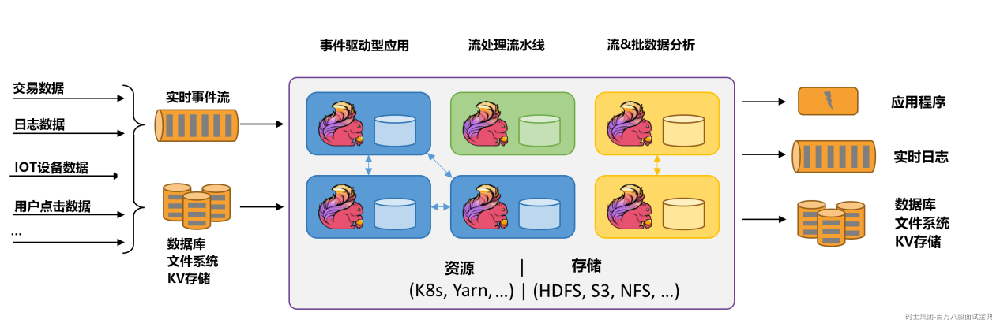
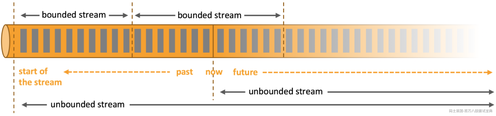
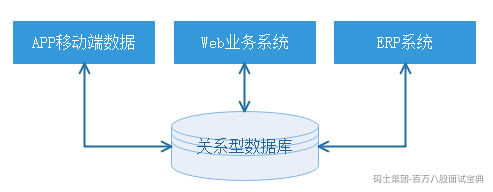
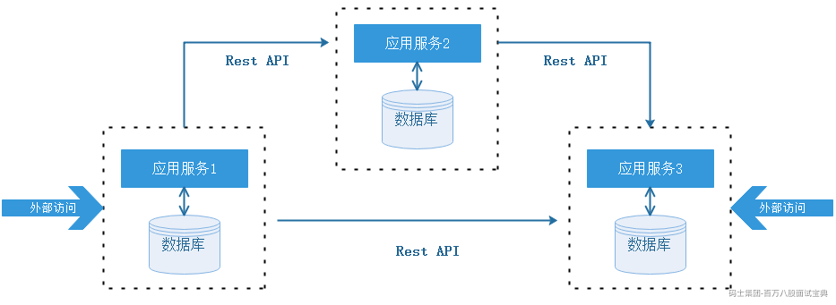
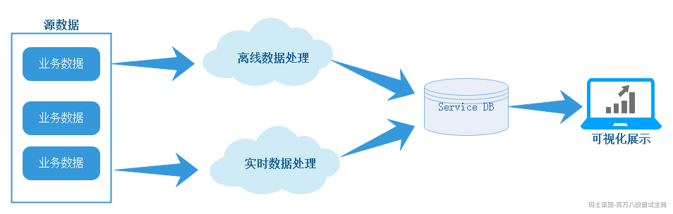
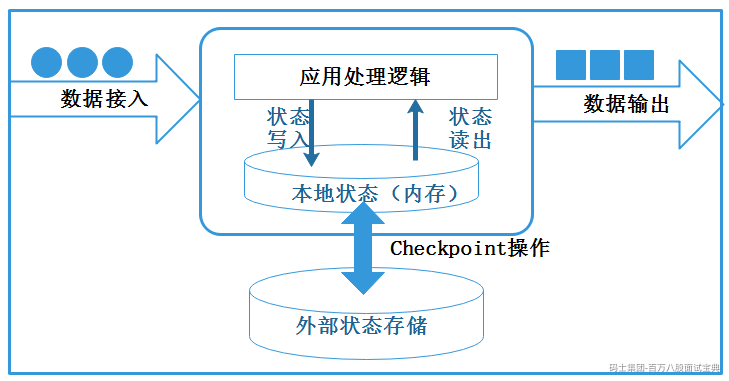
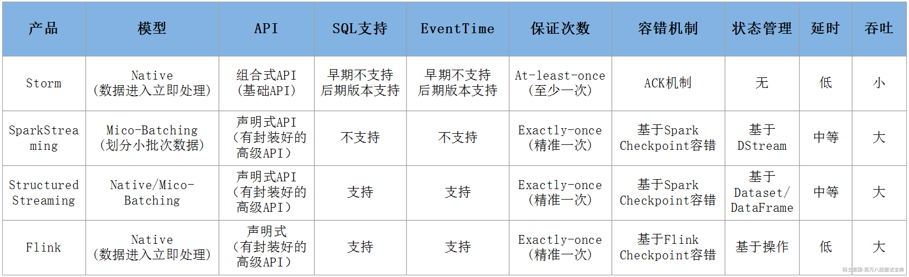

# 1第一章 Apache Flink概述

## 1.1 Apache Flink是什么？

在当前数据量激增的时代，各种业务场景都有大量的业务数据产生，对于这些不断产生的数据应该如何进行有效的处理，成为当下大多数公司所面临的问题。目前比较流行的大数据处理引擎Apache Spark，基本上已经取代了MapReduce成为当前大数据处理的标准。随着数据的不断增长，人们逐渐意识到对实时数据处理的重要性。相对传统数据处理模式，流式数据处理有着更高的处理效率和成本控制要求。Apache Spark 不仅支持批数据计算还支持流式数据计算，但是SparkStreaming在底层架构、数据抽象等方面采用了批量计算的概念，其流计算的本质还是批(微批)计算。

近年来Apache Flink计算框架发展迅速，Flink以流处理为基础，对批数据也有很好的支持，尤其是在流计算领域相比其他大数据分布式计算引擎有着明显优势，能够针对流式数据同时 **支持高吞吐、低延迟、高性能分布式处理** ，Flink在未来发展上有着令人期待的前景。

### 1.1.1Flink的定义

Apache Flink 是一个框架和分布式处理引擎，用于在 **无边界** 和 **有边界** 数据流上进行有状态的计算。Flink 能在所有常见集群环境中运行，并能以内存速度和任意规模进行计算。

```plain
apache Flink is a framework and distributed processing engine for stateful computations over unbounded and bounded data streams. Flink has been designed to run in all common cluster environments, perform computations at in-memory speed and at any scale.
```



Flink可以处理批数据也可以处理流数据，本质上，流处理是Flink中的基本操作，流数据即无边界数据流，在Flink中处理所有事件都可看成流事件，批数据可以看成是一种特殊的流数据，即有边界数据流，这与Spark计算框架截然相反，在Spark中批处理是最基本操作，流事件可以划分为一小批一小批数据进行微批处理，来达到实时效果，这也是两者区别之一。

*(⚠️ 图片缺失:源知识库原图已失效)*

- **无界流**

有定义流的开始，但没有定义流的结束。它们会无休止地产生数据。无界流的数据必须持续处理，即数据被摄取后需要立刻处理。我们不能等到所有数据都到达再处理，因为输入是无限的，在任何时候输入都不会完成。处理无界数据通常要求以特定顺序摄取事件，例如事件发生的顺序，以便能够推断结果的完整性。

- **有界流**

有定义流的开始，也有定义流的结束。有界流可以在摄取所有数据后再进行计算。有界流所有数据可以被排序，所以并不需要有序摄取。有界流处理通常被称为批处理。

Apache Flink 擅长处理无界和有界数据集，精确的时间控制和状态化使得 Flink 的运行时(runtime)能够运行任何处理无界流的应用。有界流则由一些专为固定大小数据集特殊设计的算法和数据结构进行内部处理，产生了出色的性能。

Flink官网：<https://flink.apache.org>

### 1.1.2Flink前身Stratosphere

Flink最早是德国一些大学中的研究项目，并且早期项目名称也不是Flink，在2010~2014年间，由德国柏林工业大学、德国柏林洪堡大学和德国哈索·普拉特纳研究所联合发起名为"Stratosphere:Information Management on the Cloud"研究项目，该项目就是Flink的前身：Stratosphere项目。该项目创建初衷就是构建一个一数据库概念为基础、以大规模并行处理架构为支撑、以MapReduce计算模型为逻辑框架的分布式数据计算引擎，在此构想之上还引入了流处理，为后来的Flink发展打下良好基础。

2014年4月，Stratosphere代码被贡献给Apache软件基金会，成为Apache基金会孵化器项目，项目孵化期间，项目Stratosphere改名为Flink。Flink在德语中意为"敏捷、快速"，用来体现流式 **数据处理器速度快** 和 **灵活性强** 等特点，同时使用棕红色松鼠图案作为Flink项目的Logo，也是为了突出松鼠灵活快速的特点，由此，Flink正式进入社区开发者的视线。

*(⚠️ 图片缺失:源知识库原图已失效)*

Flink自从加入Apache后发展十分迅猛，自2014年8月发布0.6版本后，Flink仅用了3个月左右的时间，在2014年11月发布了0.7版本，该版本包含Flink目前为止最重要的 Flink Streaming 特性，2014年底，Flink顺利从孵化器"毕业"成为Apache顶级项目。随着Flink技术成为Apache顶级项目，Flink受到社区越来越多的关注，Flink逐步增加了很多核心的功能，例如：一致性语义、事件时间和Table API等，其功能和稳定性也不断得到完善。

早期Stratosphere项目的核心成员曾共同创办一家名叫"Data Artisans"的公司，其主要的任务就是致力于Flink技术的发展和商业化，2019年阿里巴巴收购了Data Artisans公司，并将其开发的分支Blink开源，越来越多的公司开始将Flink应用到他们真实的生产环境中，并在技术和商业上共同推动Flink的发展。

Flink逐步被广泛使用不仅仅是因为 **Flink支持高吞吐、低延迟和** **exactly-once** **语义的实时计算，同时Flink还提供** **基于流式计算引擎处理批量数据的计算能力** **，在计算框架角度真正实现了批流统一处理**。目前，国内很多公司都已经大规模使用Flink作为分布式计算场景的解决方案，如：阿里巴巴、华为、小米等，其中，阿里巴巴已经基于Flink实时计算平台实现了对淘宝、天猫、支付宝等数据业务支持。

### 1.1.3Flink发展时间线及重大变更

Flink发展非常迅速，目前官网Flink最新版本是1.16版本，下面列举Flink发展过程中重要时间和重要版本发布时间点以及Flink各个版本推出的新特性以帮助大家更好了解Flink。

- 2010~2014:德国柏林工业大学研究性项目Stratosphere，目标是建立下一代大数据分析引擎；

- 2014-04-16:Stratosphere成为Apache 孵化项目，从Stratosphere0.6开始，正式更名为Flink，由Java语言编写；

- 2014-08-26:Flink 0.6发布；

- 2014-11-04:Flink 0.7.0发布，推出最重要的特性：Streaming API；

- 2016-03-08:Flink 1.0.0，流处理基础功能完善，支持Scala；

- 2016-08-08:Flink 1.1.0 版本发布，流处理基础功能完善；

- 2017-02-06:Flink 1.2.0 版本发布，流处理基础功能完善；

- 2017-06-01:Flink 1.3.0 版本发布，流处理基础功能完善；

- 2017-11-29:Flink 1.4.0 版本发布，流处理基础功能完善；

- 2018-05-25:Flink 1.5.0 版本发布，流处理基础功能完善；

- 2018-08-08:Flink 1.6.0 版本发布，流处理基础功能完善，状态TTL支持；增强SQL和Table API；

- 2018-11-30:Flink 1.7.0 版本发布，Scala2.12支持；支持S3文件处理；支持Kafka 2.0 connector；

- 2019-01:阿里巴巴以9000万欧元价格收购Data Artisans公司，并开发内部版本Blink；

- 2019-04-09:Flink 1.8.0 版本发布，支持TTL清除旧状态；不再支持hadoop二进制文件；

- 2019年8月阿里巴巴开源Blink。

- 2019-08-22:Flink 1.9.0 版本发布，主要特性如下：

- 合并阿里内部Blink；

- 重构Flink WebUI；

- Hive集成；

- Python Table API支持；

- 2020-02-11:Flink 1.10.0 版本发布【重要版本】，主要特性如下：

- 整合Blink全部完成；

- 集成K8S；

- PyFlink优化；

- 内存管理配置优化；

- 2020-07-06:Flink 1.11.0 版本发布【重要版本】，主要特性如下：

- 从Flink1.11开始,Blink planner是Table API/SQL中的默认设置，仍支持旧的Flink planner；

- Flink CDC支持；

- 支持Hadoop3.x版本，不提供任何更新的flink-shaded-hadoop-x jars，用户需要通过HADOOP\_CLASSPATH环境变量（推荐）或 lib/ folder 提供 Hadoop 依赖项。

- 2020-12-08:Flink 1.12.0 版本发布【重要版本】，主要特性如下：

- DataStream API 上添加了高效的批执行模式的支持，批处理和流处理实现真正统一的运行时的一个重要里程碑；

- 实现了基于Kubernetes的高可用性（HA）方案，作为生产环境中，ZooKeeper方案之外的另外一种选择；

- 扩展了 Kafka SQL connector，使其可以在 upsert 模式下工作，并且支持在 SQL DDL 中处理 connector 的 metadata；

- PyFlink 中添加了对于 DataStream API 的支持；

- 支持FlinkSink，不建议再使用StreamingFileSink；

- 2021-04-30:Flink 1.13.0 版本发布，主要特性如下：

- SQL和表接口改进；

- 改进DataStream API和Table API/SQL之间的互操转换；

- Hive查询语法兼容性；

- PyFlink的改进；

- 2021-09-29:Flink1.14.0 版本发布

- 改进批和流的状态管理机制;

- 优化checkpoint机制;

- 不再支持Flink on Mesos资源调度；

- 开始支持资源细粒度管理；

- 2022-05-05:Flink1.15.0 版本发布，主要特性如下：

- Per-job任务提交被弃用，未来版本会丢弃，改用Application Mode。

- Flink依赖包不使用Scala的话可以排除Scala依赖项，依赖包不再包含后缀；

- 持续改进Checkpoint和两阶段提交优化；

- 对于Table / SQL用户，新的模块flink-table-planner-loader取代了flink-Table-planner\_xx，并且避免了Scala后缀的需要；

- 添加对opting-out Scala的支持,DataSet/DataStream api独立于Scala,不再传递地依赖于它。

- flink-table-runtime不再有Scala后缀了；

- 支持JDK11,后续对JDK8的支持将会移除；

- 不再支持Scala2.11，支持Scala2.12；

- Table API & SQL优化，移除FlinkSQL upsert into支持；

- 支持最低的Hadoop版本为2.8.5；

- 不再支持zookeeper3.4 HA ,zookeeper HA 版本需要升级到3.5/3.6；

- Kafka Connector默认使用Kafka客户端2.8.1；

- 2022-10-28:Flink1.16.0 版本发布，主要特性如下：

- 弃用jobmanager.sh脚本中的host/web-ui-port参数，支持动态配置；

- 删除字符串表达式DSL;

- 不再支持Hive1.x、2.1.x、2.2.x版本；

- 弃用StreamingFileSink，建议使用FileSink。

- 优化checkpoint机制；

- PyFlink1.16将python3.6版本标记为弃用，PyFlink1.16版本将成为使用python3.6版本最后一个版本；

- Hadoop支持3.3.2版本；

- Kafka支持3.1.1版本；

- Hive支持2.3.9版本；

## 1.2数据架构的演变

近年来随着越来越多的大数据技术被开源，例如：HDFS、Spark等，伴随这些技术的发展与普及，促使企业数据架构的演进——从传统的关系型数据存储架构逐步演化为分布式处理和存储的架构。我们通过数据架构的演变角度来了解下为什么今天Flink实时计算引擎会爆火起来。

### 1.2.1业务处理-单体架构

传统单体架构最大的特点是集中式数据存储，一个企业中可能有很多业务系统，例如：订单系统、CRM系统、ERP系统等，这些系统的数据一般存储在关系型数据库中，这些存储的数据一般反应当前的业务状态，也就是存储的是支撑业务正常运转的事务数据，例如：系统订单交易量、网站活跃用户数、每个用户在线的状态等，针对这些数据库的操作也主要是增删改查操作，单体架构如下：

*(⚠️ 图片缺失:源知识库原图已失效)*

单体架构初期的效率很高，但是随着时间的推移，业务越来越多，业务系统逐渐变得庞大，越来越难维护与升级，并且不同的业务系统之间可能有一些共同的业务模块，并且一单业务系统依赖的数据库有问题会导致整个业务系统变的不可用，为了解决以上问题，企业开始逐渐采用微服务架构作为企业业务系统的架构体系。

### 1.2.2业务处理-微服务架构

微服务架构的核心思想是一个应用由多个小的、相互独立的微服务组成，这些服务运行在自己的进程中，开发和发布都没有依赖，不同的服务能依据不同的业务需求，构建不同的技术架构之上，组成不同的业务系统应用。

微服务架构将系统拆解成不同独立的服务模块，每个模块分别使用各自独立的数据库，这种模式解决了业务系统的扩展问题，也带来了新的问题——业务交易数据过于分散在不同的系统中，很难将数据进行集中化管理。微服务架构如下：

*(⚠️ 图片缺失:源知识库原图已失效)*

无论是单体架构还是微服务架构主要针对的还是企业的业务系统，也就是业务平台，对应的数据库存储的数据也是增删改查的事务型数据，这些业务系统上主要进行的也是OLTP业务操作，对于企业内部进行数据分析(OLAP分析)或者数据挖掘之类的应用，则需要通过从不同的数据库中进行数据抽取，将数据从不同的数据库中进行周期性同步到数据仓库中，然后在数据仓库中进行统一规范的清洗分析处理，最终结果提供给不同的数据集市和应用。

### 1.2.3数据分析-大数据Lambda架构

最初很多公司构建分析系统对应的数据仓库都是基于关系型数据库之上，例如：MySQL、Oracle数据库，但是随着企业数据量的增长，关系型数据库已经无法支撑海量数据集的存储与分析，这时随着大数据相关技术的兴起，很多企业基于大数据相关技术构建数据分析对应的数据仓库，例如：Hadoop中的HDFS 、Hive。

基于大数据平台构建数据仓库的过程，数据往往都是周期性的从业务系统中同步到大数据平台，完成一系列ETL转换操作后，最终形成报表数据提供给数据集市展示使用，这就是通常我们说的离线数据分析。但是对于一些实时性要求比较高的应用，例如：实时报表系统，则必须有非常低的延时展示统计结果，这就是我们说的实时数据分析。企业中这个时期采用Lambda架构来处理离线数据和实时数据的分析，大数据Lambda架构如下：

*(⚠️ 图片缺失:源知识库原图已失效)*

Lambda架构在一定程度上解决了不同计算场景问题，但是带来的问题是框架太多导致平台复杂度过高、运维成本高，例如，在这个时期要完成离线计算需要使用Hive、MapReduce离线计算框架，完成实时计算需要使用Storm实时计算框架，对相应的开发和维度带来很高的成本。

后来随着Apache Spark分布式计算框架的出现，Spark可以处理离线数据，同时可以将实时数据作为微批处理来应对实时处理场景，总之，Spark可以让Lambda架构使用一套计算框架完成批处理和实时处理计算，但是Spark本身是基于批数据处理模式处理流式数据，并不能完美高效的处理实时要求非常高的场景。

关于大数据分析架构演变过程中在大数据中除了有Lambda架构之外，还有Kappa架构、混合架构及湖仓一体架构，以上各个架构都是在大数据不同时期针对公司业务数据分析场景提出的，都是解决企业数据分析过程中业务痛点问题的架构，关于其他架构更详细内容可以参照实时数仓相关课程。

### 1.2.4有状态流计算架构

Lambda架构中针对实时数据处理我们可以使用Spark计算框架进行分析，Spark针对实时数据进行分析本质是将实时流数据看成微批进行处理，数据产生的本质是一条条真实的事件，这种处理实际上针对实时流事件分析有一定的延迟，很难在实时计算过程中进行实时计算并直接产生统计结果，因为这需要计算框架满足高性能、高吞吐、低延时等目标。随着有状态流计算架构的提出，从一定程度上满足了企业对实时流数据处理的高性能、高吞吐、低延时目标，企业可以基于实时的流式数据，维护所有计算过程的状态，所谓状态就是计算过程中产生的中间计算结果，每次计算新的数据进入到流式系统中都是基于中间状态结果的基础上进行运算，最终产生正确的统计结果。

基于有状态计算的方式最大的优势是不需要将原始数据重新从外部存储中拿出来，从而进行全量计算，因为这种计算方式的代价可能是非常高的。从另一个角度讲，用户无须通过调度和协调各种批量计算工具，从数据仓库中获取数据统计结果，然后再落地存储，这些操作全部都可以基于流式计算完成，可以极大地减轻系统对其他框架的依赖，减少数据计算过程中的时间损耗以及硬件存储。有状态计算架构如下：

*(⚠️ 图片缺失:源知识库原图已失效)*

可以看出有状态流计算架构将会逐步成为企业作为构建数据平台的架构模式，Apache Flink **就是有状态的流计算架构** ，通过实现Google Dataflow流式计算模型实现了高吞吐、低延迟、高性能兼具的实时流式计算框架，同时**Flink支持高度容错的状态管理**，防止状态在计算过程中因为系统异常而出现数据丢失，Flink周期性地通过分布式快照技术Checkpoints实现状态的持久化维护，即使在系统停机或者异常情况下都能正确的计算出来结果。

## 1.3Flink核心特性

Flink具有先进的架构理念，拥有诸多的优秀特性以及完善的编程接口，Flink的优势有以下几点：

1. **批流一体化**

Flink可以在底层用同样的数据抽象和计算模型来进行批处理和流处理。事实上，Flink在设计理念上没有刻意强调批处理和流处理，而更多的强调数据的有界和无界，这就意味着Flink能够满足企业业务需求，无需用两种甚至多种框架分别实现批处理和流处理，这大大降低了架构设计、开发、运维的复杂度，可以节省大量的人力成本。

2. **同时支持高吞吐、低延迟、高性能**

Flink是目前开源社区中唯一一套集高吞吐、低延迟、高性能三者于一身的分布式流式数据处理框架。像Apache Spark也只能兼顾高吞吐和高性能特性，主要因为在SparkStreaming流式计算中无法做到低延迟保障；而流式计算框架Apache Storm只能支持低延迟和高性能特性，但是无法满足高吞吐的要求。而满足高吞吐、低延迟、高性能这三个目标对分布式流式计算框架来说是非常重要的。

3. **支持事件时间（****Event Time****）概念**

在流式计算领域中，窗口计算的地位举足轻重，但目前大多数框架窗口计算采用的都是系统时间（Process Time），也是事件传输到计算框架处理时，系统主机的当前时间。Flink能够支持基于事件时间（Event Time）语义进行窗口计算，也就是使用事件产生的时间，这种基于事件驱动的机制使得事件即使乱序到达，流系统也能够计算出精确的结果，保持了事件原本产生时的时序性，尽可能避免网络传输或硬件系统的影响。

4. **支持有状态计算**

Flink在1.4版本中实现了状态管理，所谓状态就是在流式计算过程中将算子的中间结果数据保存在内存或者文件系统中，等下一个事件进入算子后可以从之前的状态中获取中间结果中计算当前的结果，从而无须每次都基于全部的原始数据来统计结果，这种方式极大地提升了系统的性能，并降低了数据计算过程的资源消耗。对于数据量大且运算逻辑非常复杂的流式计算场景，有状态计算发挥了非常重要的作用。

5. **支持高度灵活的窗口（****Window****）操作**

在流处理应用中，数据是连续不断的，需要通过窗口的方式对流数据进行一定范围的聚合计算，例如统计在过去的1分钟内有多少用户点击某一网页，在这种情况下，我们必须定义一个窗口，用来收集最近一分钟内的数据，并对这个窗口内的数据进行再计算。Flink将窗口划分为基于Time、Count、Session，以及Data-driven等类型的窗口操作，窗口可以用灵活的触发条件定制化来达到对复杂的流传输模式的支持，用户可以定义不同的窗口触发机制来满足不同的需求。

6. **基于轻量级分布式快照**（**Snapshot）实现的容错**

Flink能够分布式运行在上千个节点上，将一个大型计算任务的流程拆解成小的计算过程，然后将task分布到并行节点上进行处理。在任务执行过程中，能够自动发现事件处理过程中的错误而导致数据不一致的问题，比如：节点宕机、网路传输问题，或是由于用户因为升级或修复问题而导致计算服务重启等。在这些情况下，通过基于分布式快照技术的Checkpoints，将执行过程中的状态信息进行持久化存储，一旦任务出现异常停止，Flink就能够从Checkpoints中进行任务的自动恢复，以确保数据在处理过程中的一致性（Exactly-Once）。

7. **基于**JVM**实现独立的内存管理**

内存管理是所有计算框架需要重点考虑的部分，尤其对于计算量比较大的计算场景，数据在内存中该如何进行管理显得至关重要。针对内存管理，Flink实现了自身管理内存的机制，尽可能减少JVM GC对系统的影响。另外，Flink通过序列化/反序列化方法将所有的数据对象转换成二进制在内存中存储，降低数据存储的大小的同时，能够更加有效地对内存空间进行利用，降低GC带来的性能下降或任务异常的风险，因此Flink较其他分布式处理的框架会显得更加稳定，不会因为JVM GC等问题而影响整个应用的运行。

8. **Save Points** **（保存点）**

对于7\*24小时运行的流式应用，数据源源不断地接入，在一段时间内应用的终止有可能导致数据的丢失或者计算结果的不准确，例如**进行集群版本的升级、停机运维操作**等操作。值得一提的是，Flink通过Save Points技术将任务执行的快照保存在存储介质上，当任务重启的时候可以直接从事先保存的Save Points恢复原有的计算状态，使得任务继续按照停机之前的状态运行，Save Points技术可以让用户更好地管理和运维实时流式应用。

9. **多层级**API

Flink为用户提供了多个层级API，用户可以根据自身对于表达力和易用性的需求来选择，不同的API层级可以混用以实现复杂的业务逻辑。

## 1.4Flink应用场景

在实际生产的过程中，大量数据在不断地产生，例如金融交易数据、互联网订单数据、GPS定位数据、传感器信号、移动终端产生的数据、通信信号数据等，以及我们熟悉的网络流量监控、服务器产生的日志数据，这些数据最大的共同点就是实时从不同的数据源中产生，然后再传输到下游的分析系统。针对这些数据类型主要包括实时智能推荐、复杂事件处理、实时欺诈检测、实时数仓与ETL类型、流数据分析类型、实时报表类型等实时业务场景，而Flink对于这些类型的场景都有着非常好的支持。

1. **实时智能推荐**

智能推荐会根据用户历史的购买行为，通过推荐算法训练模型，预测用户未来可能会购买的物品。对个人来说，推荐系统起着信息过滤的作用，对Web/App服务端来说，推荐系统起着满足用户个性化需求，提升用户满意度的作用。推荐系统本身也在飞速发展，除了算法越来越完善，对时延的要求也越来越苛刻和实时化。利用Flink流计算帮助用户构建更加实时的智能推荐系统，对用户行为指标进行实时计算，对模型进行实时更新，对用户指标进行实时预测，并将预测的信息推送给Wep/App端，帮助用户获取想要的商品信息，另一方面也帮助企业提升销售额，创造更大的商业价值。

2. **复杂事件处理**

对于复杂事件处理，比较常见的案例主要集中于工业领域，例如对车载传感器、机械设备等实时故障检测，这些业务类型通常数据量都非常大，且对数据处理的时效性要求非常高。通过利用Flink提供的CEP（复杂事件处理）进行事件模式的抽取，同时应用Flink的Sql进行事件数据的转换，在流式系统中构建实时规则引擎，一旦事件触发报警规则，便立即将告警结果传输至下游通知系统，从而实现对设备故障快速预警监测，车辆状态监控等目的。

3. **实时欺诈检测**

在金融领域的业务中，常常出现各种类型的欺诈行为，例如信用卡欺诈、信贷申请欺诈等，而如何保证用户和公司的资金安全，是来近年来许多金融公司及银行共同面对的挑战。随着不法分子欺诈手段的不断升级，传统的反欺诈手段已经不足以解决目前所面临的问题。以往可能需要几个小时才能通过交易数据计算出用户的行为指标，然后通过规则判别出具有欺诈行为嫌疑的用户，再进行案件调查处理，在这种情况下资金可能早已被不法分子转移，从而给企业和用户造成大量的经济损失。而运用Flink流式计算技术能够在毫秒内就完成对欺诈判断行为指标的计算，然后实时对交易流水进行规则判断或者模型预测，这样一旦检测出交易中存在欺诈嫌疑，则直接对交易进行实时拦截，避免因为处理不及时而导致的经济损失。

4. **实时数仓与**ETL

结合离线数仓，通过利用流计算诸多优势和SQL灵活的加工能力，对流式数据进行实时清洗、归并、结构化处理，为离线数仓进行补充和优化。另一方面结合实时数据ETL处理能力，利用有状态流式计算技术，可以尽可能降低企业由于在离线数据计算过程中调度逻辑的复杂度，高效快速地处理企业需要的统计结果，帮助企业更好地应用实时数据所分析出来的结果。

5. **流数据分析**

实时计算各类数据指标，并利用实时结果及时调整在线系统相关策略，在各类内容投放、无线智能推送领域有大量的应用。流式计算技术将数据分析场景实时化，帮助企业做到实时化分析Web应用或者App应用的各项指标，包括App版本分布情况、Crash检测和分布等，同时提供多维度用户行为分析，支持日志自主分析，助力开发者实现基于大数据技术的精细化运营、提升产品质量和体验、增强用户黏性。

6. **实时报表分析**

实时报表分析是近年来很多公司采用的报表统计方案之一，其中最主要的应用便是实时大屏展示。利用流式计算实时得出的结果直接被推送到前端应用，实时显示出重要指标的变换情况。最典型的案例便是淘宝的双十一活动，每年双十一购物节，除疯狂购物外，最引人注目的就是天猫双十一大屏不停跳跃的成交总额。在整个计算链路中包括从天猫交易下单购买到数据采集、数据计算、数据校验，最终落到双十一大屏上展现的全链路时间压缩在5秒以内，顶峰计算性能高达数三十万笔订单/秒，通过多条链路流计算备份确保万无一失。而在其他行业，企业也在构建自己的实时报表系统，让企业能够依托于自身的业务数据，快速提取出更多的数据价值，从而更好地服务于企业运行过程中。

自2019年1月起，阿里巴巴逐步将内部维护的Blink回馈给Flink开源社区，目前贡献代码数量已超过100万行，在最新的Flink1.15版本中Blink和Flink也进行了合并。国内包括腾讯、小米、华为、字节跳动等公司，国外包括 Uber、ebay、Netflix 等公司都是 Flink 的使用者。

*(⚠️ 图片缺失:源知识库原图已失效)*

## 1.5Flink & 其他实时计算框架对比

根据前文描述我们知道Flink主要处理的是流数据，针对的是实时计算领域，在Flink之前，大数据实时领域中还有Storm、SparkStreaming。Storm是比较早的流式计算框架，后来又出现了SparkStreaming，为了支持SQL Spark后期又推出StructuredStreamig，现在又出现了Flink这种优秀的实时计算框架，那么这几种计算框架到底有什么区别呢？下面我们从不同角度来对比下三个实时计算框架：

*(⚠️ 图片缺失:源知识库原图已失效)*

- **模型** ：Storm和Flink是真正的一条一条处理数据,而SparkStreaming是微批批处理，一次处理一批数据（小批量），后期Spark推出的StructuredStreaming支持微批处理也支持连续处理(Continuous)，目前还处于实验性，实时性不如Flink。

- **API** ：Storm使用基础API进行开发，比如实现一个简单的sum求和操作需要自己编写很多业务逻辑；而SparkStreaming、StructuredStreaming和Flink中都提供封装后的高阶函数，可以直接来使用，非常方便。

- **SQL** 支持：早期Storm处理流数据不支持SQL，最新版本支持SQL处理流数据，SparkStreaming不支持SQL处理，后期Spark推出的StructuredStreaming支持SQL处理流式数据，Flink也是支持SQL处理实时数据。

- **EventTime**\*\* 支持：\*\*Storm早期和SparkStreaming实时数据处理不支持事件时间，Storm后期实时数据处理支持事件时间，同样Spark后期推出的StructuredStreaming处理流数据也是支持事件时间，Flink诞生开始处理实时数据就支持事件时间。

- **保证次数：** 在数据处理方面，Storm可以实现至少处理一次，但不能保证仅处理一次，这样就会导致数据重复处理问题，所以针对计数类的需求，可能会产生一些误差,SparkStreaming、StructuredStreaming和Flink支持Exactly-once数据处理语义。

- **容错机制：** Storm可以通过ACK机制实现数据的容错机制，而SparkStreaming、StructuredStreaming和Flink可以通过CheckPoint机制实现容错机制。

- **状态管理** ：Storm中没有实现状态管理，SparkStreaming实现了基于DStream的状态管理,StructuredStreaming支持基于Dataset/DataFrame的状态管理，而Flink实现了基于操作的状态管理。

- **延时：** 表示数据处理的延时情况，Storm和Flink接收到一条数据就处理一条数据，其数据处理的延时性是很低的；SparkStreaming和StructuredStreaming都支持微批处理，数据处理的延时性相对会偏高，虽然StructuredStreaming支持Continuous连续处理，但是目前处于实验阶段，数据处理延迟性相对Flink偏高，Flink实时数据处理延迟最低。

- **吞吐量：** Storm的吞吐量其实也不低，只是相对于其他几个框架而言较低；SparkStreaming、StructuredStreaming和Flink的吞吐量是比较高的。
