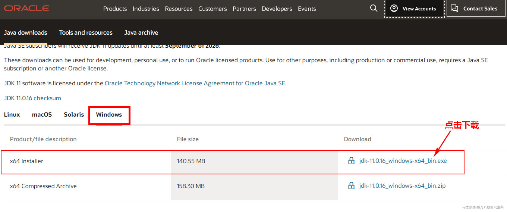
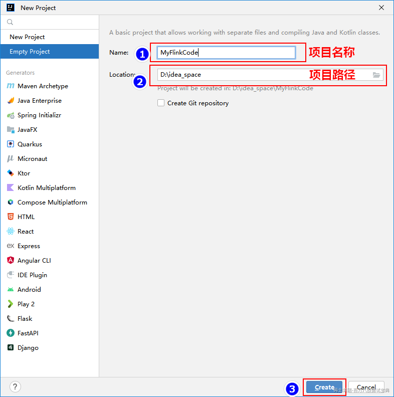
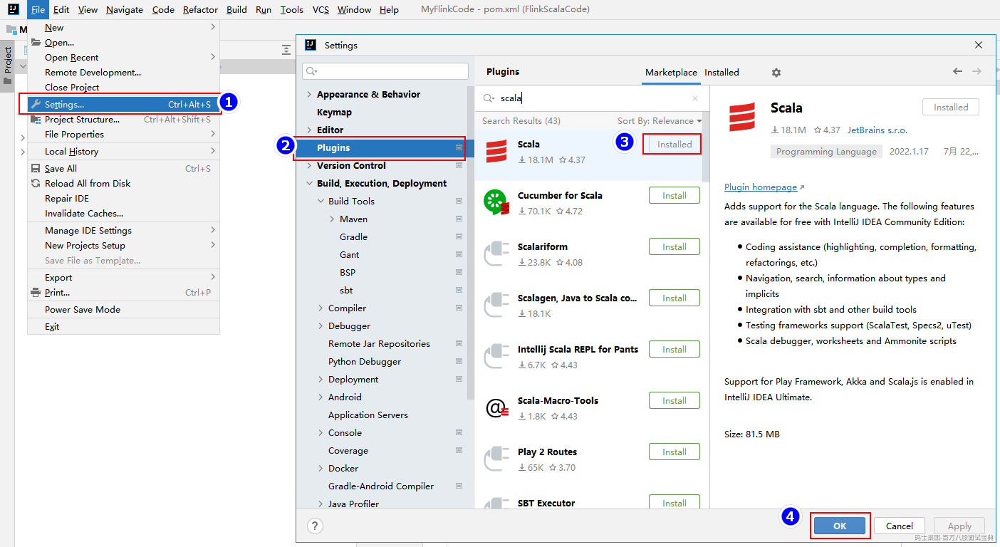
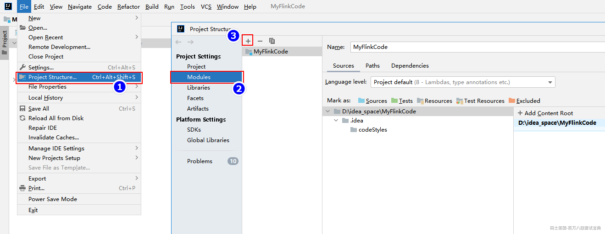
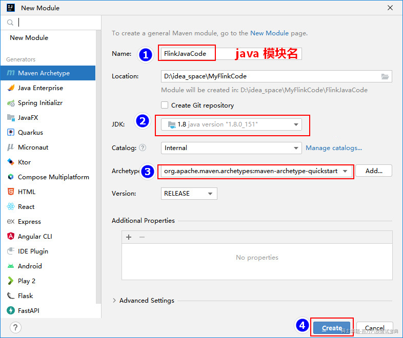
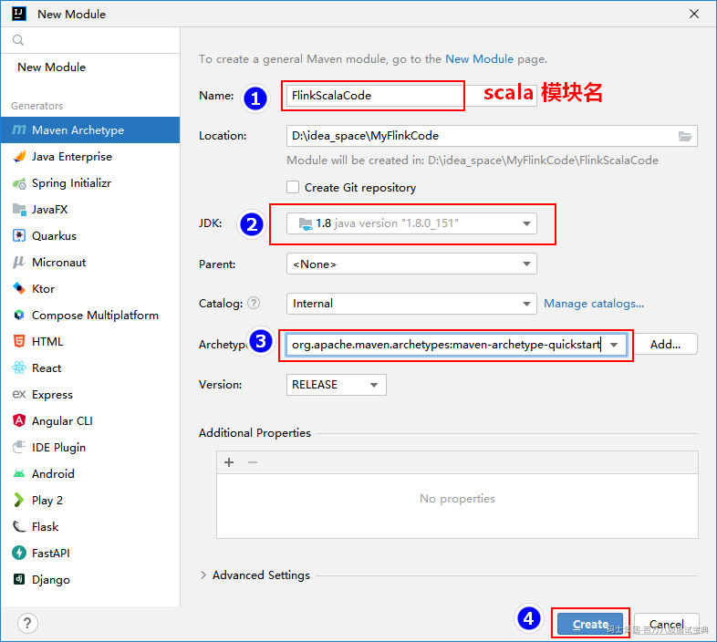
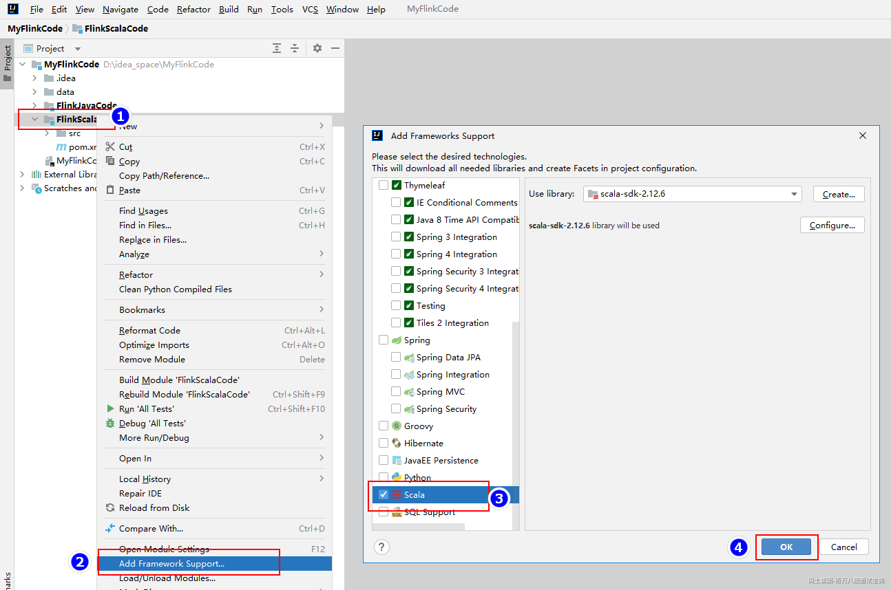
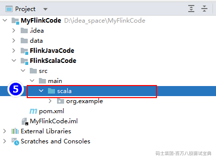

# 2第二章 Apache Flink 快速入门

## 2.1Flink开发环境准备

学习一门新的编程语言时，往往会从"hello world"程序开始，而接触一套新的大数据计算框架时，则一般会从WordCount案例入手，下面以大数据中最经典入门案例WordCount为例，来编写Flink代码，Flink底层源码是基于Java代码进行开发，在Flink编程中我们除了可以使用Java语言来进行编写Flink程序外，还可以使用Scala、Python语言来进行编写Flink程序，在后续章节中我们将会主要使用Java和Scala来编写Flink程序。下面来准备下Flink开发环境。

- **Flink版本**

本套课程中我们采用Flink最新版本1.16.0，Flink1.16.0版本官方文档地址：<https://nightlies.apache.org/flink/flink-docs-release-1.16/>

- **JDK环境**

Flink核心模块均采用Java开发，所以运行环境需要依赖JDK,Flink可以基于类UNIX 环境中运行，例如：Linux、Max OS、Windows等，在这些系统上运行Flink时都需要配置JDK环境，Flink 1.16.0版本需要JDK版本为JDK11,目前版本也支持使用JDK8，后续版本对JDK8的支持将会移除。

考虑到Flink后期与一些大数据框架进行整合，这些大数据框架对JDK11的支持并不完善，例如：Hive3.1.3版本还不支持JDK11，所以本课程采用JDK8来开发Flink。对JDK8安装及配置不再详述。

附：JDK11 下载地址如下：

[https://www.oracle.com/java/technologies/javase-jdk11-downloads.html。](https://www.oracle.com/java/technologies/javase-jdk11-downloads.html%E3%80%82)

*(⚠️ 图片缺失:源知识库原图已失效)*

- **开发工具**

我们可以选择IntelliJ IDEA或者Eclipse作为Flink应用的开发IDE，Flink开发官方建议使用IntelliJ IDEA，因为它默认集成了Scala和Maven环境，使用更加方便，我们这门课使用IntelliJ IDEA开发工具，具体安装步骤不再详述。

- **Maven环境**

通过IntelliJ IDEA进行开发Flink Application时，可以使用Maven来作为项目jar包管理工具，需要在本地安装Maven及配置Maven的环境变量，需要注意的是，Maven版本需要使用3.0.4及以上，否则编译或开发过程中会有问题。这里使用Maven 3.2.5版本。

- **Scala环境**

Flink开发语言可以选择Java、Scala、Python，如果用户选择使用Scala作为Flink应用开发语言，则需要安装Scala执行环境。

在Flink1.15之前版本，如果只是使用Flink的Java api ，对于一些没有Scala模块的包和表相关模块的包需要在Maven引入对应的包中加入scala后缀，例如：flink-table-planner\_2.11，后缀2.11代表的就是Scala版本。在Flink1.15.0版本后，Flink添加对opting-out（排除） Scala的支持，如果你只使用Flink的Java api，导入包也不必包含scala后缀，你可以使用任何Scala版本。如果使用Flink的Scala api，需要选择匹配的Scala版本。

从Flink1.7版本往后支持Scala 2.11和2.12版本，从Flink1.15.0版本后只支持Scala 2.12，不再支持Scala 2.11。Scala环境可以通过本地安装Scala执行环境，也可以通过Maven依赖Scala-lib引入，如果本地安装了Scala某个版本，建议在Maven中添加Scala-lib依赖。Scala2.12.8之后的版本与之前的2.12.x版本不兼容,建议使用Scala2.12.8之后版本。

- **Hadoop环境**

Flink可以操作HDFS中的数据及基于Yarn进行资源调度，所以需要对应的Hadoop环境，Flink1.16.0版本支持的Hadoop最低版本为2.8.5，本课程中我们使用Hadoop3.3.4版本。关于Hadoop3.3.4版本搭建，参照第三章节。

## 2.2Flink入门案例

**需求：读取本地数据文件，统计文件中每个单词出现的次数。**

### 2.2.1IDEA Project创建及配置

本课程编写Flink代码选择语言为Java和Scala，所以这里我们通过IntelliJ IDEA创建一个目录，其中包括Java项目模块和Scala项目模块，将Flink Java api和Flink Scala api分别在不同项目模块中实现。步骤如下：

1. **打开\*\*****IDEA**，创建空项目\*\*

*(⚠️ 图片缺失:源知识库原图已失效)*

2. **在IntelliJ IDEA 中安装Scala插件**

使用IntelliJ IDEA开发Flink，如果使用Scala api 那么还需在IntelliJ IDEA中安装Scala的插件，如果已经安装可以忽略此步骤，下图为以安装Scala插件。

*(⚠️ 图片缺失:源知识库原图已失效)*

3. **打开Structure**,**创建项目新模块**

*(⚠️ 图片缺失:源知识库原图已失效)*

创建Java模块：

*(⚠️ 图片缺失:源知识库原图已失效)*

继续点击"+"，创建Scala模块：

*(⚠️ 图片缺失:源知识库原图已失效)*

创建好"FlinkScalaCode"模块后，右键该模块添加Scala框架支持，并修改该模块中的"java"src源为"scala":

*(⚠️ 图片缺失:源知识库原图已失效)*

*(⚠️ 图片缺失:源知识库原图已失效)*

在"FlinkScalaCode"模块Maven pom.xml中引入Scala依赖包，这里使用的Scala版本为2.12.10。

```plain
<!-- Scala包 -->
<dependency>
  <groupId>org.scala-lang</groupId>

  <artifactId>scala-library</artifactId>

  <version>2.12.10</version>

</dependency>

<dependency>
  <groupId>org.scala-lang</groupId>

  <artifactId>scala-compiler</artifactId>

  <version>2.12.10</version>

</dependency>

<dependency>
  <groupId>org.scala-lang</groupId>

  <artifactId>scala-reflect</artifactId>

  <version>2.12.10</version>

</dependency>

```

4. **Log4j日志配置**

为了方便查看项目运行过程中的日志，需要在两个项目模块中配置log4j.properties配置文件，并放在各自项目src/main/resources资源目录下，没有resources资源目录需要手动创建并设置成资源目录。log4j.properties配置文件内容如下：

```plain
log4j.rootLogger=ERROR, console
log4j.appender.console=org.apache.log4j.ConsoleAppender
log4j.appender.console.target=System.out
log4j.appender.console.layout=org.apache.log4j.PatternLayout
log4j.appender.console.layout.ConversionPattern=%d{HH:mm:ss} %p %c{2}: %m%n
```

并在两个项目中的Maven pom.xml中添加对应的log4j需要的依赖包，使代码运行时能正常打印结果：

```plain
<dependency>
  <groupId>org.slf4j</groupId>

  <artifactId>slf4j-log4j12</artifactId>

  <version>1.7.36</version>

</dependency>

<dependency>
  <groupId>org.apache.logging.log4j</groupId>

  <artifactId>log4j-to-slf4j</artifactId>

  <version>2.17.2</version>

</dependency>

```

5. **分别在两个项目模块中导入****Flink Maven****依赖**

"FlinkJavaCode"模块导入Flink Maven依赖如下：

```plain
<properties>
  <project.build.sourceEncoding>UTF-8</project.build.sourceEncoding>

  <maven.compiler.source>1.8</maven.compiler.source>

  <maven.compiler.target>1.8</maven.compiler.target>

  <flink.version>1.16.0</flink.version>

  <slf4j.version>1.7.36</slf4j.version>

  <log4j.version>2.17.2</log4j.version>

</properties>

<dependencies>
  <!-- Flink批和流开发依赖包 -->
  <dependency>
    <groupId>org.apache.flink</groupId>

    <artifactId>flink-clients</artifactId>

    <version>${flink.version}</version>

  </dependency>

  <!-- slf4j&log4j 日志相关包 -->
  <dependency>
    <groupId>org.slf4j</groupId>

    <artifactId>slf4j-log4j12</artifactId>

    <version>${slf4j.version}</version>

  </dependency>

  <dependency>
    <groupId>org.apache.logging.log4j</groupId>

    <artifactId>log4j-to-slf4j</artifactId>

    <version>${log4j.version}</version>

  </dependency>

</dependencies>

```

"FlinkScalaCode"模块导入Flink Maven依赖如下：

```plain
<properties>
  <project.build.sourceEncoding>UTF-8</project.build.sourceEncoding>

  <maven.compiler.source>1.8</maven.compiler.source>

  <maven.compiler.target>1.8</maven.compiler.target>

  <flink.version>1.16.0</flink.version>

  <slf4j.version>1.7.31</slf4j.version>

  <log4j.version>2.17.1</log4j.version>

  <scala.version>2.12.10</scala.version>

  <scala.binary.version>2.12</scala.binary.version>

</properties>

<dependencies>
  <!-- Flink批和流开发依赖包 -->
  <dependency>
    <groupId>org.apache.flink</groupId>

    <artifactId>flink-scala_${scala.binary.version}</artifactId>

    <version>${flink.version}</version>

  </dependency>

  <dependency>
    <groupId>org.apache.flink</groupId>

    <artifactId>flink-streaming-scala_${scala.binary.version}</artifactId>

    <version>${flink.version}</version>

  </dependency>

  <dependency>
    <groupId>org.apache.flink</groupId>

    <artifactId>flink-clients</artifactId>

    <version>${flink.version}</version>

  </dependency>

  <!-- Scala包 -->
  <dependency>
    <groupId>org.scala-lang</groupId>

    <artifactId>scala-library</artifactId>

    <version>${scala.version}</version>

  </dependency>

  <dependency>
    <groupId>org.scala-lang</groupId>

    <artifactId>scala-compiler</artifactId>

    <version>${scala.version}</version>

  </dependency>

  <dependency>
    <groupId>org.scala-lang</groupId>

    <artifactId>scala-reflect</artifactId>

    <version>${scala.version}</version>

  </dependency>

  <!-- slf4j&log4j 日志相关包 -->
  <dependency>
    <groupId>org.slf4j</groupId>

    <artifactId>slf4j-log4j12</artifactId>

    <version>${slf4j.version}</version>

  </dependency>

  <dependency>
    <groupId>org.apache.logging.log4j</groupId>

    <artifactId>log4j-to-slf4j</artifactId>

    <version>${log4j.version}</version>

  </dependency>

</dependencies>

```

**注意：** 在后续实现WordCount需求时，Flink Java Api只需要在Maven中导入"flink-clients"依赖包即可，而Flink Scala Api 需要导入以下三个依赖包：

```plain
flink-scala_${scala.binary.version}
flink-streaming-scala_${scala.binary.version}
flink-clients
```

主要是因为在Flink1.15版本后，Flink添加对opting-out（排除）Scala的支持，如果你只使用Flink的Java api，导入包不必包含scala后缀，如果使用Flink的Scala api，需要选择匹配的Scala版本。

### 2.2.2案例数据准备

在项目"MyFlinkCode"中创建"data"目录，在目录中创建"words.txt"文件，向文件中写入以下内容，方便后续使用Flink编写WordCount实现代码。

```plain
hello Flink
hello MapReduce
hello Spark
hello Flink
hello Flink
hello Flink
hello Flink
hello Java
hello Scala
hello Flink
hello Java
hello Flink
hello Scala
hello Flink
hello Flink
```

## 2.3Flink案例实现

数据源分为有界和无界之分，有界数据源可以编写批处理程序，无界数据源可以编写流式程序。DataSet API用于批处理，DataStream API用于流式处理。

批处理使用ExecutionEnvironment和DataSet，流式处理使用StreamingExecutionEnvironment和DataStream。DataSet和DataStream是Flink中表示数据的特殊类，DataSet处理的数据是有界的，DataStream处理的数据是无界的，这两个类都是不可变的，一旦创建出来就无法添加或者删除数据元。

### 2.3.1Flink 批数据处理案例

- **Java** **版本WordCount**

使用Flink Java Dataset api实现WordCount具体代码如下：

```plain
ExecutionEnvironment env = ExecutionEnvironment.getExecutionEnvironment();

//1.读取文件
DataSource<String> linesDS = env.readTextFile("./data/words.txt");

//2.切分单词
FlatMapOperator<String, String> wordsDS =
        linesDS.flatMap((String lines, Collector<String> collector) -> {
    String[] arr = lines.split(" ");
    for (String word : arr) {
        collector.collect(word);
    }
}).returns(Types.STRING);

//3.将单词转换成Tuple2 KV 类型
MapOperator<String, Tuple2<String, Long>> kvWordsDS =
        wordsDS.map(word -> new Tuple2<>(word, 1L)).returns(Types.TUPLE(Types.STRING, Types.LONG));

//4.按照key 进行分组处理得到最后结果并打印
kvWordsDS.groupBy(0).sum(1).print();
```

- **Scala** **版本WordCount**

使用Flink Scala Dataset api实现WordCount具体代码如下：

```plain
//1.准备环境，注意是Scala中对应的Flink环境
val env: ExecutionEnvironment = ExecutionEnvironment.getExecutionEnvironment

//2.导入隐式转换，使用Scala API 时需要隐式转换来推断函数操作后的类型
import org.apache.flink.api.scala._

//3.读取数据文件
val linesDS: DataSet[String] = env.readTextFile("./data/words.txt")

//4.进行 WordCount 统计并打印
linesDS.flatMap(line => {
  line.split(" ")
})
  .map((_, 1))
  .groupBy(0)
  .sum(1)
  .print()
```

以上无论是Java api 或者是Scala api 输出结果如下，显示的最终结果是统计好的单词个数。

```plain
(hello,15)
(Spark,1)
(Scala,2)
(Java,2)
(MapReduce,1)
(Flink,9)
```

### 2.3.2Flink流式数据处理案例

- **Java** **版本WordCount**

使用Flink Java DataStream api实现WordCount具体代码如下：

```plain
//1.创建流式处理环境
StreamExecutionEnvironment env = StreamExecutionEnvironment.getExecutionEnvironment();

//2.读取文件数据
DataStreamSource<String> lines = env.readTextFile("./data/words.txt");

//3.切分单词，设置KV格式数据
SingleOutputStreamOperator<Tuple2<String, Long>> kvWordsDS =
        lines.flatMap((String line, Collector<Tuple2<String, Long>> collector) -> {
    String[] words = line.split(" ");
    for (String word : words) {
        collector.collect(Tuple2.of(word, 1L));
    }
}).returns(Types.TUPLE(Types.STRING, Types.LONG));

//4.分组统计获取 WordCount 结果
kvWordsDS.keyBy(tp->tp.f0).sum(1).print();

//5.流式计算中需要最后执行execute方法
env.execute();
```

- **Scala** **版本WordCount**

使用Flink Scala DataStream api实现WordCount具体代码如下：

```plain
//1.创建环境
val env: StreamExecutionEnvironment = StreamExecutionEnvironment.getExecutionEnvironment

//2.导入隐式转换，使用Scala API 时需要隐式转换来推断函数操作后的类型
import org.apache.flink.streaming.api.scala._

//3.读取文件
val ds: DataStream[String] = env.readTextFile("./data/words.txt")

//4.进行wordCount统计
ds.flatMap(line=>{line.split(" ")})
  .map((_,1))
  .keyBy(_._1)
  .sum(1)
  .print()

//5.最后使用execute 方法触发执行
env.execute()
```

以上输出结果开头展示的是处理当前数据的线程，一个Flink应用程序执行时默认的线程数与当前节点cpu的总线程数有关。

## 2.4Flink批和流案例总结

关于以上Flink 批数据处理和流式数据处理案例有以下几个点需要注意：

1. **Flink程序编写流程总结**

编写Flink代码要符合一定的流程，Flink代码编写流程如下：

> a. 获取flink的执行环境，批和流不同，Execution Environment。
>
> b. 加载数据数据-- soure。
>
> c. 对加载的数据进行转换-- transformation。
>
> d. 对结果进行保存或者打印-- sink。
>
> e. 触发flink程序的执行 --env.execute()

在Flink批处理过程中不需要执行execute触发执行，在流式处理过程中需要执行env.execute触发程序执行。

2. **关于Flink的批处理和流处理上下文环境**

创建Flink批和流上下文环境有以下三种方式，批处理上下文创建环境如下：

```plain
//设置Flink运行环境，如果在本地启动则创建本地环境，如果是在集群中启动，则创建集群环境
ExecutionEnvironment env = ExecutionEnvironment.getExecutionEnvironment();

//指定并行度创建本地环境
LocalEnvironment localEnv = ExecutionEnvironment.createLocalEnvironment(10);

//指定远程JobManagerIp 和RPC 端口以及运行程序所在Jar包及其依赖包
ExecutionEnvironment remoteEnv = ExecutionEnvironment.createRemoteEnvironment("JobManagerHost", 6021, 5, "application.jar");
```

流处理上下文创建环境如下：

```plain
//设置Flink运行环境，如果在本地启动则创建本地环境，如果是在集群中启动，则创建集群环境
StreamExecutionEnvironment env = StreamExecutionEnvironment.getExecutionEnvironment();

//指定并行度创建本地环境
LocalStreamEnvironment localEnv = StreamExecutionEnvironment.createLocalEnvironment(5);

//指定远程JobManagerIp 和RPC 端口以及运行程序所在Jar包及其依赖包
StreamExecutionEnvironment remoteEnv = StreamExecutionEnvironment.createRemoteEnvironment("JobManagerHost", 6021, 5, "application.jar");
```

同样在Scala api 中批和流创建Flink 上下文环境也有以上三种方式，在实际开发中建议批处理使用"ExecutionEnvironment.getExecutionEnvironment()"方式创建。流处理使用"StreamExecutionEnvironment.getExecution-Environment()"方式创建。

3. **Flink批和流** **Java****和** **Scala导入包不同**

在编写Flink Java api代码和Flink Scala api代码处理批或者流数据时，引入的ExecutionEnvironment或StreamExecutionEnvironment包不同，在编写代码时导入错误的包会导致编程有问题。

批处理不同API引入ExecutionEnvironment如下：

```plain
//Flink Java api 引入的包
import org.apache.flink.api.java.ExecutionEnvironment;
//Flink Scala api 引入的包
import org.apache.flink.api.scala.ExecutionEnvironment
```

流处理不同API引入StreamExecutionEnvironment如下：

```plain
//Flink Java api 引入的包
import org.apache.flink.streaming.api.environment.StreamExecutionEnvironment;
//Flink Scala api 引入的包
import org.apache.flink.streaming.api.scala.StreamExecutionEnvironment
```

4. **Flink Java Api中创建** **Tuple** **方式**

在Flink Java api中创建Tuple2时，可以通过new Tuple2方式也可以通过Tuple2.of方式，两者本质一样。

5. **Flink Scala api需要导入隐式转换**

在Flink Scala api中批处理和流处理代码编写过程中需要导入对应的隐式转换来推断函数操作后的类型，在批和流中导入隐式转换不同，具体如下：

```plain
//Scala 批处理导入隐式转换，使用Scala API 时需要隐式转换来推断函数操作后的类型
import org.apache.flink.api.scala._
//Scala 流处理导入隐式转换，使用Scala API 时需要隐式转换来推断函数操作后的类型
import org.apache.flink.streaming.api.scala._
```

6. **关于Flink Java api** **中的** **returns 方法**

Flink Java api中可以使用Lambda表达式，当涉及到使用泛型Java会擦除泛型类型信息，需要最后调用returns方法指定类型，明确声明类型，告诉系统函数生成的数据集或者数据流的类型。

7. **批和流对数据进行分组方法不同**

批和流处理中都是通过readTextFile来读取数据文件，对数据进行转换处理后，Flink批处理过程中通过groupBy指定按照什么规则进行数据分组,groupBy中可以根据字段位置指定key（例如：groupBy(0)），如果数据是POJO自定义类型也可以根据字段名称指定key(例如：groupBy("name"))，对于复杂的数据类型也可以通过定义key的选择器KeySelector来实现分组的key。

Flink流处理过程中通过keyBy指定按照什么规则进行数据分组，keyBy中也有以上三种方式指定分组key，建议使用通过KeySelector来选择key，其他方式已经过时。

8. **关于DataSet Api** (Legacy)**软弃用**

Flink架构可以处理批和流，Flink 批处理数据需要使用到Flink中的DataSet API，此API 主要是支持Flink针对批数据进行操作，本质上Flink处理批数据也是看成一种特殊的流处理（有界流），所以没有必要分成批和流两套API，从Flink1.12版本往后，Dataset API 已经标记为Legacy(已过时)，已被官方软弃用，官方建议使用Table API 或者SQL 来处理批数据，我们也可以使用带有Batch执行模式的DataStream API来处理批数据，在未来Flink版本中DataSet API 将会被删除。关于这些API 具体使用后续章节会进行讲解。

## 2.5DataStream BATCH模式

下面使用Java代码使用DataStream API 的Batch 模式来处理批WordCount代码，方式如下：

```plain
StreamExecutionEnvironment env = StreamExecutionEnvironment.getExecutionEnvironment();
//设置批运行模式
env.setRuntimeMode(RuntimeExecutionMode.BATCH);

DataStreamSource<String> linesDS = env.readTextFile("./data/words.txt");
SingleOutputStreamOperator<Tuple2<String, Long>> wordsDS = linesDS.flatMap(new FlatMapFunction<String, Tuple2<String, Long>>() {
    @Override
    public void flatMap(String lines, Collector<Tuple2<String, Long>> out) throws Exception {
        String[] words = lines.split(" ");
        for (String word : words) {
            out.collect(new Tuple2<>(word, 1L));
        }
    }
});

wordsDS.keyBy(tp -> tp.f0).sum(1).print();

env.execute();
```

以上代码运行完成之后结果如下，可以看到结果与批处理结果类似，只是多了对应的处理线程号。

```plain
3> (hello,15)
8> (Flink,9)
8> (Spark,1)
7> (Java,2)
7> (Scala,2)
7> (MapReduce,1)
```

此外，Stream API 中除了可以设置Batch批处理模式之外，还可以设置 AUTOMATIC、STREAMING模式，STREAMING 模式是流模式，AUTOMATIC模式会根据数据是有界流/无界流自动决定采用BATCH/STREAMING模式来读取数据，设置方式如下：

```plain
//BATCH 设置批处理模式
env.setRuntimeMode(RuntimeExecutionMode.BATCH);
//AUTOMATIC 会根据有界流/无界流自动决定采用BATCH/STREAMING模式
env.setRuntimeMode(RuntimeExecutionMode.AUTOMATIC);
//STREAMING 设置流处理模式
env.setRuntimeMode(RuntimeExecutionMode.STREAMING);
```

除了在代码中设置处理模式外，还可以在Flink配置文件(flink-conf.yaml)中设置execution.runtime-mode参数来指定对应的模式，也可以在集群中提交Flink任务时指定execution.runtime-mode来指定，Flink官方建议在提交Flink任务时指定执行模式，这样减少了代码配置给Flink Application提供了更大的灵活性，提交任务指定参数如下：

```plain
$FLINK_HOME/bin/flink run -Dexecution.runtime-mode=BATCH -c xxx xxx.jar
```

关于Flink集群提交任务及Flink flink-conf.yaml配置文件在下个章节集群搭建会进行介绍。
