# 3第三章 Flink架构与集群部署

## 3.1Apache Flink架构

### 3.1.1Flink组件栈

在Flink的整个软件架构体系中，同样遵循这分层的架构设计理念，在降低系统耦合度的同时，也为上层用户构建Flink应用提供了丰富且友好的接口。

*(⚠️ 图片缺失:源知识库原图已失效)*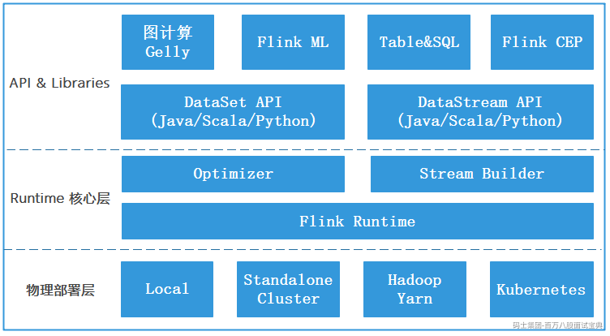

上图是Flink基本组件栈，从上图可以看出整个Flink的架构体系可以分为三层，从下往上依次是物理部署层、Runtime 核心层、API&Libraries层。

- **物理部署层：**

该层主要涉及Flink的部署模式，目前Flink支持多种部署模式：本地Local、集群（Standalone/Yarn）、Kubernetes，Flink能够通过该层支撑不同平台的部署，用户可以根据需要来选择对应的部署模式，目前在企业中使用最多的是基于Yarn进行部署，也就是Flink On Yarn。

- **Runtime** **核心层：**

该层主要负责对上层不同接口提供基础服务，也是Flink分布式计算框架的核心实现层，支持分布式Stream作业的执行、JobGraph到ExecutionGraph的映射转换、任务调度等，将DataStream和DataSet转成统一可执行的Task Oparator，达到在流式引擎下同时处理批量计算和流式计算的目的。

- **API & Libraries层：**

作为分布式计算框架，Flink同时提供了支撑流计算和批计算接口，未来批计算接口会被弃用，在Flink1.15 版本中批计算接口已经标记为Legacy（已过时），后续版本建议使用Flink流计算接口，基于此接口之上抽象出不同应用类型的组件库，例如：FlinkML 机器学习库、FlinkCEP 复杂事件处理库、Flink Gelly 图处理库、SQL&Table 库。DataSet API 和DataStream API 两者都提供给用户丰富的数据处理高级API，例如：Map、FlatMap操作等，同时也提供了比较底层的ProcessFunction API ,用户可以直接操作状态和时间等底层数据。这些API将在下个章节介绍。

### 3.1.2Flink运行时架构

Flink整个系统主要由两个组件组成，分别为JobManager和TaskManager，Flink架构也遵循Master-Slave架构设计原则，JobManager为Master节点，TaskManager为Worker（Slave）节点。所有组件之间的通信都是借助于Akka Framework，包括任务的状态以及Checkpoint触发等信息。

Flink运行时架构如下，下面分别介绍下架构中涉及到的角色作用。

*(⚠️ 图片缺失:源知识库原图已失效)*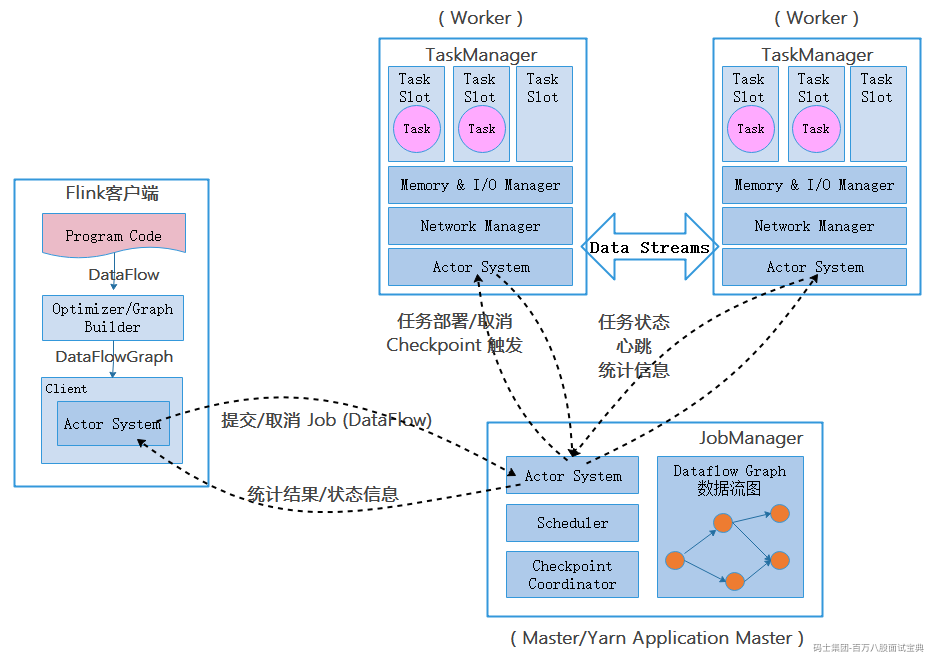

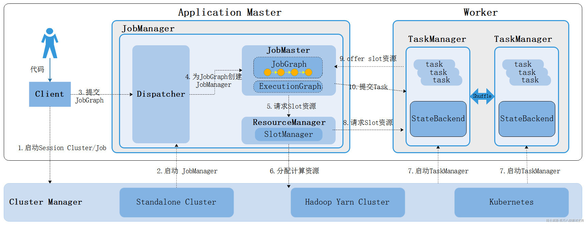

- **Flink Clients客户端**

Flink客户端负责将任务提交到集群，与JobManager构建Akka连接，然后将任务提交到JobManager，通过和JobManager之间进行交互获取任务执行状态。Flink客户端Clients不是Flink程序运行时的一部分，作用是向JobManager准备和发送dataflow，之后，客户端可以断开（detached mode）连接或者保持连接(attached mode)。客户端提交任务可以采用CLI方式或者通过使用Flink WebUI提交，也可以在应用程序中指定JobManager的RPC网络端口构建ExecutionEnvironment提交Flink应用。

- **JobManager**

JobManager负责整个Flink集群任务的调度以及资源的管理，从客户端中获取提交的应用，然后根据集群中TaskManager上TaskSlot的使用情况，为提交的应用分配相应的TaskSlots资源并命令TaskManger启动从客户端中获取的应用。

JobManager相当于整个集群的Master节点，Flink HA 集群中可以有多个JobManager，但整个集群中有且仅有一个活跃的JobManager，其他的都是StandBy。JobManager和TaskManager之间通过Actor System进行通信，获取任务执行的情况并通过Actor System将应用的任务执行情况发送给客户端。同时在任务执行过程中，Flink JobManager会触发Checkpoints操作，每个TaskManager节点收到Checkpoint触发指令后，完成Checkpoint操作，所有的Checkpoint协调过程都是在Flink JobManager中完成。当任务完成后，Flink会将任务执行的信息反馈给客户端，并且释放掉TaskManager中的资源以供下一次提交任务使用。

JobManager由三个不同的组件组成：

- **ResourceManager:**

这里说的ResourceManager不是Yarn资源管理中的ResourceManager，而是Flink中的ResourceManager，其主要负责Flink集群资源分配、管理和回收。在Flink中这里说的资源主要是TaskManager节点上的Task Slot计算资源，Flink中每个提交的任务最终会转换成task，每个task需要发送到TaskManager 上的slot中执行（slot是资源调度最小的单位），Flink为不同的环境和资源提供者（例如：Yarn/Kubernetes和Standalone）实现了对应的ResourceManager，这些ResourceManager负责申请启动TaskManager获取Slot资源。

在Standalone集群中，集群启动会同时启动TaskManager，不支持提交任务时启动TaskManager（没有Per-Job任务提交模式），ResourceManager只能分配可用TaskManager的slots，而不支持自行启动新的TaskManager，而基于其他资源调度框架执行任务时，当ResourceManager管理对应的TaskManager没有足够的slot，会申请启动新的TaskManager进程。

- **Dispatcher**

Dispatcher提供了一个REST接口，用来提交Flink应用程序执行，例如CLI客户端或Flink Web UI提交的任务最终都会发送至Dispatcher组件，由Dispatcher组件对JobGraph进行分发和执行，并为每个提交的作业启动一个新的 JobMaster，它还运行 Flink WebUI 用来提供作业执行信息。

- **JobMaster**

JobMaster负责管理整个任务的生命周期，负责将Dispatcher提交上来的JobGraph转换成ExecutionGraph（执行图）结构，通过内部调度程序对ExecutionGraph执行图进行调度和执行，最终向TaskManager中提交和运行Task实例，同时监控各个Task的运行状况，直到整个作业中所有的Task都执行完毕。

JobManager和ResourceManager组件一样，JobManager组件本身也是RPC服务，具备通信能力，可以与ResourceManager进行RPC通信申请任务的计算资源，资源申请到位后，就会将对应Task任务发送到TaskManager上执行，当Flink Task任务执行完毕后，JobMaster服务会关闭，同时释放任务占用的计算资源。所以JobMaster与对应的Flink job是一一对应的。

- **TaskManager**

TaskManager负责向整个集群提供Slot计算资源，同时管理了JobMaster提交的Task任务。TaskManager会提供JobManager从ResourceManager中申请和分配的Slot计算资源，JobMaster最终会根据分配到的Slot计算资源将Task提交到TaskManager上运行。另外，TaskManager还可缓存数据，TaskManager之间可以进行DataStream数据的交换。

一个Flink集群中至少有一个TaskManager，在TaskManager中资源调度的最小单位是 task slot ,一个TaskManger中的task Slot个数决定了当前TaskManger最高支持的并发task个数，一个task Slot中可以执行多个算子。

可以看出，Flink的任务运行其实是采用多线程的方式，这和MapReduce多JVM进程的方式有很大的区别Fink能够极大提高CPU使用效率，在多个任务和Task之间通过TaskSlot方式共享系统资源，每个TaskManager中通过管理多个TaskSlot资源池进行对资源进行有效管理。

## 3.2集群基础环境搭建

Flink可以运行在所有类unix环境中，例如：Linux，Mac OS 和Windows，一般企业中使用Flink基于的都是Linux环境，后期我们进行Flink搭建和其他框架整合也是基于linux环境，使用的是Centos7.6版本，JDK使用JDK8版本(Hive版本不支持JDK11,所以这里选择JDK8)，本小节主要针对Flink集群使用到的基础环境进行配置，不再从零搭建Centos系统，另外对后续整合使用到的技术框架也一并进行搭建，如果你目前已经有对应的基础环境，可以忽略本小节，Linux及各个搭建组件使用版本如下表所示。

|  |  |
| --- | --- |
| **系统或组件名称** | **版本** |
| Centos | CentOS-7-x86\_64-DVD-1810 |
| JDK | jdk-8u181-linux-x64 |
| MySQL | 5.7.32 |
| Zookeeper | 3.6.3 |
| HDFS | 3.3.4 |
| Hive | 3.1.3 |
| Hbase | 2.5.1 |
| Redis | 6.2.7 |
| Kafka | 3.3.1 |

### 3.2.1Centos7节点配置

这里准备5台Linux节点，节点名称和ip信息如下，我们可以从头搭建各个Linux节点也可以基于已有快照创建各个Linux节点。

|  |  |
| --- | --- |
| **节点**IP | **节点名称** |
| 192.168.179.4 | node1 |
| 192.168.179.5 | node2 |
| 192.168.179.6 | node3 |
| 192.168.179.7 | node4 |
| 192.168.179.8 | node5 |

这里默认已经创建好以上各个节点，并且每个节点分配资源为4核2G，下面进行节点的其他配置。

#### 3.2.1.1配置各个节点的Ip

启动每台节点，在对应的节点路径"/etc/sysconfig/network-scripts"下配置ifg-ens33文件配置IP（注意，不同机器可能此文件名称不同，一般以ifcfg-xxx命名），以配置ip 192.168.179.4为例，ifcfg-ens33配置内容如下：

```plain
TYPE=Ethernet
BOOTPROTO=static     #使用static配置
DEFROUTE=yes
PEERDNS=yes
PEERROUTES=yes
IPV4_FAILURE_FATAL=no
IPV6INIT=yes
IPV6_AUTOCONF=yes
IPV6_DEFROUTE=yes
IPV6_PEERDNS=yes
IPV6_PEERROUTES=yes
IPV6_FAILURE_FATAL=no
ONBOOT=yes      #开机启用本配置
IPADDR=192.168.179.4   #静态IP
GATEWAY=192.168.179.2   #默认网关
NETMASK=255.255.255.0   #子网掩码
DNS1=192.168.179.2       #DNS配置 可以与默认网关相同
```

以上其他节点配置只需要修改对应的ip即可，配置完成后，在每个节点上执行如下命令重启网络服务：

```plain
systemctl restart network.service
```

检查每个节点ip执行如下命令：

```plain
ip addr
```

#### 3.2.1.2配置主机名

在每台节点上修改/etc/hostname,配置对应的主机名称，参照节点IP与节点名称对照表分别为：node1、node2、node3、node4、node5。配置完成后 **需要重启** 各个节点，才能正常显示各个主机名。

#### 3.2.1.3关闭防火墙

执行如下命令确定各个节点上的防火墙开启情况，需要将各个节点上的防火墙关闭：

```plain
#检查防火墙状态
firewall-cmd --state

#临时关闭防火墙（重新开机后又会自动启动）
systemctl stop firewalld 或者systemctl stop firewalld.service

#设置开机不启动防火墙
systemctl disable firewalld
```

#### 3.2.1.4关闭SELinux

SELinux就是Security-Enhanced Linux的简称，安全加强的linux。传统的linux权限是对文件和目录的owner, group和other的rwx进行控制，而SELinux采用的是委任式访问控制，也就是控制一个进程对具体文件系统上面的文件和目录的访问，SELinux规定了很多的规则，来决定哪个进程可以访问哪些文件和目录。虽然SELinux很好用，但是在多数情况我们还是将其关闭，因为在不了解其机制的情况下使用SELinux会导致软件安装或者应用部署失败。

在每台节点/etc/selinux/config中将SELINUX=enforcing改成SELINUX=disabled即可。

#### 3.2.1.5配置阿里云yum源

后续为了方便在Linux节点上安装各个软件，我们将yum源改成国内阿里云yum源，这样下载软件速度快一些，每个节点具体操作按照以下步骤进行。

```plain
#安装wget，wget是linux最常用的下载命令(有些系统默认安装，可忽略)
yum -y install wget

#备份当前的yum源
mv /etc/yum.repos.d/CentOS-Base.repo /etc/yum.repos.d/CentOS-Base.repo.backup

#下载阿里云的yum源配置
wget -O /etc/yum.repos.d/CentOS-Base.repo https://mirrors.aliyun.com/repo/Centos-7.repo

#清除原来文件缓存，构建新加入的repo结尾文件的缓存
yum clean all
yum makecache
```

配置完成后，可以在每台节点上安装"vim"命令，方便后续操作：

```plain
#在各个节点上安装 vim命令
yum -y install vim
```

#### 3.2.1.6设置Linux 系统显示中文/英文

Linux系统默认显示不支持中文，可以通过配置支持显示中文。每台节点具体操作参照如下步骤。

```plain
#查看当前系统语言
echo $LANG
#显示结果如下，说明默认支持显示英文
en_US.UTF-8

#临时修改系统语言为中文，重启节点后恢复英文
LANG="zh_CN.UTF-8"

#如果想要永久修改系统默认语言为中文，需要创建/修改/etc/locale.conf文件,写入以下内容，设置完成后需要重启各节点。
LANG="zh_CN.UTF-8"
```

#### 3.2.1.7设置自动更新时间

后续基于Linux各个节点搭建HDFS时，需要各节点的时间同步，可以通过设置各个节点自动更新时间来保证各个节点时间一致，具体按照以下操作来执行。

1. **修改本地时区及ntp服务**

```plain
yum -y install ntp
rm -rf /etc/localtime
ln -s /usr/share/zoneinfo/Asia/Shanghai /etc/localtime
/usr/sbin/ntpdate -u pool.ntp.org
```

2. **自动同步时间**

设置定时任务，每10分钟同步一次，配置/etc/crontab文件，实现自动执行任务。建议直接crontab -e 来写入定时任务。使用crontab -l 查看当前用户定时任务。

```plain
#各个节点执行 crontab -e 写入以下内容
*/10 * * * *  /usr/sbin/ntpdate -u pool.ntp.org >/dev/null 2>&1

#重启定时任务   
service crond restart

#查看日期
date
```

#### 3.2.1.8设置各个节点之间的ip映射

每个节点都有自己的IP和主机名，各个节点默认进行文件传递或通信时需要使用对应的ip进行通信，后续为了方便各个节点之间的通信和文件传递，可以配置各个节点名称与ip之间的映射，节点之间通信时可以直接写对应的主机名称，不必写复杂的ip。每台节点具体操作按照以下操作进行。

进入每台节点的/etc/hosts下，修改hosts文件，vim /etc/hosts:

```plain
#在文件后面追加以下内容
192.168.179.4 node1
192.168.179.5 node2
192.168.179.6 node3
192.168.179.7 node4
192.168.179.8 node5
```

各个节点配置完成后，可以使用ping命令互相测试使用节点名称是否可以正常通信。

```plain
[root@node5 ~]# ping node1
PING node1 (192.168.179.4) 56(84) bytes of data.
64 bytes from node1 (192.168.179.4): icmp_seq=1 ttl=64 time=0.892 ms
64 bytes from node1 (192.168.179.4): icmp_seq=2 ttl=64 time=0.415 ms
... ...
```

#### 3.2.1.9配置节点之间免密访问

后续搭建HDFS集群时需要Linux各个节点之间免密，节点两两免秘钥的根本原理如下：假设A节点需要免秘钥登录B节点，只要B节点上有A节点的公钥，那么A节点就可以免密登录当前B节点。具体操作步骤如下。

1. **安装ssh客户端**

需要在每台节点上安装ssh客户端，否则，不能使用ssh命令（最小化安装Liunx，默认没有安装ssh客户端），这里在Centos7系统中默认已经安装，此步骤可以省略：

```plain
yum -y install openssh-clients
```

2. **创建**.ssh**目录**

在每台节点执行如下命令，在每台节点的"~"目录下，创建.ssh目录，注意，不要手动创建这个目录，因为有权限问题。

```plain
cd ~
ssh localhost
#这里会需要输入节点密码#
exit
```

3. **配置各节点向一台节点通信免密**

在每台节点上执行如下命令，给当前节点创建公钥和私钥：

```plain
ssh-keygen -t rsa -P '' -f ~/.ssh/id_rsa
```

将node1、node2、node3、node4、node5的公钥copy到node1上，这样这五台节点都可以免密登录到node1。命令如下：

```plain
#在node1上执行如下命令，需要输入密码
ssh-copy-id node1 #会在当前~/.ssh目录下生成authorized_keys文件，文件中存放当前node1的公钥#

#在node2上执行如下命令，需要输入密码
ssh-copy-id node1 #会将node2的公钥追加到node1节点的authorized_keys文件中

#在node3上执行如下命令，需要输入密码
ssh-copy-id node1 #会将node3的公钥追加到node1节点的authorized_keys文件中

#在node4上执行如下命令，需要输入密码
ssh-copy-id node1 #会将node4的公钥追加到node1节点的authorized_keys文件中

#在node5上执行如下命令，需要输入密码
ssh-copy-id node1 #会将node5的公钥追加到node1节点的authorized_keys文件中
```

4. **各节点免密**

将node1节点上/.ssh/authorized\_keys拷贝到node2、node3、node4、node5各节点的/.ssh/目录下，执行如下命令：

```plain
scp ~/.ssh/authorized_keys node2:`pwd`
scp ~/.ssh/authorized_keys node3:`pwd`
scp ~/.ssh/authorized_keys node4:`pwd`
scp ~/.ssh/authorized_keys node5:`pwd`
```

以上node1向各个几点发送文件时需要输入密码，经过以上步骤，节点两两免密完成。

### 3.2.2安装JDK

按照以下步骤在各个节点上安装JDK8。

1. **各个节点创建**/software **目录，上传并安装** jdk8 rpm**包**

```plain
rpm -ivh /software/jdk-8u181-linux-x64.rpm
```

以上命令执行完成后，会在每台节点的/user/java下安装jdk8。

2. **配置**jdk**环境变量**

在每台节点上配置jdk的环境变量：

```plain
export JAVA_HOME=/usr/java/jdk1.8.0_181-amd64
export PATH=$JAVA_HOME/bin:$PATH
export CLASSPATH=.:$JAVA_HOME/lib/dt.jar:$JAVA_HOME/lib/tools.jar
```

每台节点配置完成后，最后执行"source /etc/profile"使配置生效。

### 3.2.3安装MySQL

#### 3.2.3.1节点划分

在Linux集群中我们选择一台节点进行MySQL安装，这里选择在node2节点上安装MySQL。

|  |  |  |
| --- | --- | --- |
| **节点**IP | 节点名称 | mysql |
| 192.168.179.5 | node2 | ★ |

#### 3.2.3.2安装MySQL

在Centos6中安装mysql可以直接执行命令：

```plain
yum install –y mysql-server
```

但是在Centos7中yum源中没有自带mysql的安装包，需要执行命令下载mysql 的rpm配置文件，然后进行repo的安装，安装repo后在/etc/yum.repos.d路径下会有对应的mysql repo配置，然后再安装mysql,这里安装的mysql是5.7版本。命令如下：

```plain
#下载mysql repo,下载完成后会在当前执行命令目录下生成 rpm -ivh mysql57-community-release-el7-9.noarch.rpm文件。
[root@node2 ~]# wget https://dev.mysql.com/get/mysql57-community-release-el7-9.noarch.rpm

#安装repo，安装完成后再/etc/yum.repos.d 目录下会生成mysql的 repo文件
[root@node2 ~]# rpm -ivh mysql57-community-release-el7-9.noarch.rpm

#安装mysql
[root@node2 ~]# yum install mysql-server -y --nogpgcheck
```

执行完成之后，启动mysql:systemctl start mysqld，也可以使用service mysqld start启动msyql。

以上安装mysql的方式是直接从外网下载mysql 5.7版本安装，由于网络慢等原因导致mysql下载安装速度慢。我们也可以选择在mysql官网中找到linux版本对应的mysql版本先下载好,然后直接使用rpm安装。安装mysql rpm包有依赖关系，安装的顺序如下(--force：强制安装 --nodeps:不检查环境依赖)：

```plain
rpm -ivh mysql-community-common-5.7.32-1.el7.x86_64.rpm --force --nodeps
rpm -ivh mysql-community-libs-5.7.32-1.el7.x86_64.rpm --force --nodeps
rpm -ivh mysql-community-client-5.7.32-1.el7.x86_64.rpm --force --nodeps
rpm -ivh mysql-community-server-5.7.32-1.el7.x86_64.rpm --force --nodeps
```

以上安装完成后，执行如下命令来启动MySQL：

```plain
service mysqld start 
```

#### 3.2.3.3配置MySQL

mysql5.7开始初始登录mysql需要使用初始密码，启动后登录mysql需要指定安装时的临时密码，使用命令：grep 'temporary password' /var/log/mysqld.log 获取临时密码后，执行如下语句：

```plain
#使用临时密码登录mysql
[root@node2 log]# mysql -u root -pK-BJt9jV0jb0

#默认mysql密码需要含有数字、大小写字符、下划线等，这里设置密码验证级别为低即可
mysql> set global validate_password_policy=LOW;

#默认mysql密码设置长度是8位，这里修改成6位
mysql> set global validate_password_length=6;

#初始登录mysql必须重置密码才能操作，这里先修改密码为 123456
mysql> alter user 'root'@'localhost' identified by '123456';
```

也可以删除usr表中的数据，重新设置下mysql root密码也可以，命令如下：

```plain
[root@node2 java]# mysql -u root -p123456
mysql> use mysql;
mysql> select user,authentication_string from user; 
mysql> delete from user;
mysql> GRANT ALL PRIVILEGES ON *.* TO 'root'@'%' IDENTIFIED BY '123456' WITH GRANT OPTION;
mysql> flush privileges;
```

执行如下命令，将mysql设置成开机启动，如果不设置开机启动，后期每次重启节点后需要手动启动MySQL。

```plain
#设置mysql 开机自动启动
[root@cm1 ~]# systemctl enable mysqld 
[root@cm1 ~]# systemctl list-unit-files |grep mysqld
```

以上设置密码验证级别和密码长度验证当mysql重启后还需要重复设置，如果mysql中密码设置不想要太复杂或者密码长度不想设置长度验证，可以在"/etc/my.cnf"中配置如下内容：

```plain
[mysqld]
plugin-load=validate_password.so
validate-password=off
```

配置完成后执行"systemctl restart mysqld"，重启mysql即可。

#### 3.2.3.4Mysql密码忘记处理

如果MySQL安装后，登录密码忘记，可以按照以下步骤来解决。

1. **修改**/etc/my.conf **文件，在** **mysqld 标签下加入以下参数**

```plain
[mysqld]
skip-grant-tables
```

配置完成后重启MySQL服务：service mysqld restart

2. **执行如下命令修改**mysql root**用户密码**

```plain
# 使用mysql库
mysql> use mysql;

# 更新修改root用户密码
mysql> update user set authentication_string = password ( '123456' ) where user = 'root';
```

更新完密码之后，去掉/etc/my.cnf中的skip-grant-tables配置，重启mysql服务使用更新后的密码登录MySQL即可。

### 3.2.4安装Zookeeper

#### 3.2.4.1节点划分

这里搭建zookeeper版本为3.6.3，搭建zookeeper对应的角色分布如下：

|  |  |  |
| --- | --- | --- |
| **节点**IP | 节点名称 | Zookeeper |
| 192.168.179.4 | node1 |  |
| 192.168.179.5 | node2 |  |
| 192.168.179.6 | node3 | ★ |
| 192.168.179.7 | node4 | ★ |
| 192.168.179.8 | node5 | ★ |

#### 3.2.4.2安装Zookeeper

1. **上传**zookeeper **并解压** , **配置环境变量**

将zookeeper安装包上传到node3节点/software目录下并解压：

```plain
[root@node3 software]# tar -zxvf ./apache-zookeeper-3.6.3-bin.tar.gz
```

在node3节点配置环境变量：

```plain
#进入vim /etc/profile，在最后加入：
export ZOOKEEPER_HOME=/software/apache-zookeeper-3.6.3-bin/
export PATH=$PATH:$ZOOKEEPER_HOME/bin

#使配置生效
source /etc/profile
```

2. **在node3** **节点配置** **zookeeper**

进入"$ZOOKEEPER\_HOME/conf"修改zoo\_sample.cfg为zoo.cfg：

```plain
[root@node3 conf]# mv zoo_sample.cfg  zoo.cfg
```

配置zoo.cfg中内容如下：

```plain
tickTime=2000
initLimit=10
syncLimit=5
dataDir=/opt/data/zookeeper
clientPort=2181
server.1=node3:2888:3888
server.2=node4:2888:3888
server.3=node5:2888:3888
```

3. **将配置好的zookeeper** **发送到** **node4,node5节点**

```plain
[root@node3 software]# scp -r apache-zookeeper-3.6.3-bin node4:/software/
[root@node3 software]# scp -r apache-zookeeper-3.6.3-bin node5:/software/
```

4. **各个节点上创建数据目录，并配置zookeeper环境变量**

在node3,node4,node5各个节点上创建zoo.cfg中指定的数据目录"/opt/data/zookeeper"。

```plain
mkdir -p /opt/data/zookeeper
```

在node4,node5节点配置zookeeper环境变量

```plain
#进入vim /etc/profile，在最后加入：
export ZOOKEEPER_HOME=/software/apache-zookeeper-3.6.3-bin/
export PATH=$PATH:$ZOOKEEPER_HOME/bin

#使配置生效
source /etc/profile
```

5. **各个节点创建节点** ID

在node3,node4,node5各个节点路径"/opt/data/zookeeper"中添加myid文件分别写入1,2,3:

```plain
#在node3的/opt/data/zookeeper中创建myid文件写入1
#在node4的/opt/data/zookeeper中创建myid文件写入2
#在node5的/opt/data/zookeeper中创建myid文件写入3
```

6. **各个节点启动**zookeeper, **并检查进程状态**

```plain
#各个节点启动zookeeper命令
zkServer.sh start

#检查各个节点zookeeper进程状态
zkServer.sh status
```

### 3.2.5安装HDFS

#### 3.2.5.1节点划分

这里安装HDFS版本为3.3.4，搭建HDFS对应的角色在各个节点分布如下：

|  |  |  |  |  |  |  |  |
| --- | --- | --- | --- | --- | --- | --- | --- |
| **节点IP** | **节点名称** | **NN** | **DN** | **ZKFC** | **JN** | **RM** | **NM** |
| 192.168.179.4 | node1 | ★ |  | ★ |  | ★ |  |
| 192.168.179.5 | node2 | ★ |  | ★ |  | ★ |  |
| 192.168.179.6 | node3 |  | ★ |  | ★ |  | ★ |
| 192.168.179.7 | node4 |  | ★ |  | ★ |  | ★ |
| 192.168.179.8 | node5 |  | ★ |  | ★ |  | ★ |

#### 3.2.5.2安装配置HDFS

1. **各个节点安装HDFS HA自动切换必须的依赖**

```plain
yum -y install psmisc
```

2. **上传下载好的Hadoop** **安装包到** **node1节点上，并解压**

```plain
[root@node1 software]# tar -zxvf ./hadoop-3.3.4.tar.gz 
```

3. **在*****node1*** ***节点上配置*** ***Hadoop*****的环境变量**

```plain
[root@node1 software]# vim /etc/profile
export HADOOP_HOME=/software/hadoop-3.3.4/
export PATH=$PATH:$HADOOP_HOME/bin:$HADOOP_HOME/sbin:

#使配置生效
source /etc/profile
```

4. **配置**$HADOOP\_HOME/etc/hadoop **下的** hadoop-env.sh文件

```plain
#导入JAVA_HOME
export JAVA_HOME=/usr/java/jdk1.8.0_181-amd64/
```

5. **配置**$HADOOP\_HOME/etc/hadoop **下的** hdfs-site.xml**文件**

```plain
<configuration>
    <property>
        <!--这里配置逻辑名称，可以随意写 -->
        <name>dfs.nameservices</name>

        <value>mycluster</value>

    </property>

    <property>
        <!-- 禁用权限 -->
        <name>dfs.permissions.enabled</name>

        <value>false</value>

    </property>

    <property>
        <!-- 配置namenode 的名称，多个用逗号分割  -->
        <name>dfs.ha.namenodes.mycluster</name>

        <value>nn1,nn2</value>

    </property>

    <property>
        <!-- dfs.namenode.rpc-address.[nameservice ID].[name node ID] namenode 所在服务器名称和RPC监听端口号  -->
        <name>dfs.namenode.rpc-address.mycluster.nn1</name>

        <value>node1:8020</value>

    </property>

    <property>
        <!-- dfs.namenode.rpc-address.[nameservice ID].[name node ID] namenode 所在服务器名称和RPC监听端口号  -->
        <name>dfs.namenode.rpc-address.mycluster.nn2</name>

        <value>node2:8020</value>

    </property>

    <property>
        <!-- dfs.namenode.http-address.[nameservice ID].[name node ID] namenode 监听的HTTP协议端口 -->
        <name>dfs.namenode.http-address.mycluster.nn1</name>

        <value>node1:50070</value>

    </property>

    <property>
        <!-- dfs.namenode.http-address.[nameservice ID].[name node ID] namenode 监听的HTTP协议端口 -->
        <name>dfs.namenode.http-address.mycluster.nn2</name>

        <value>node2:50070</value>

    </property>

    <property>
        <!-- namenode 共享的编辑目录， journalnode 所在服务器名称和监听的端口 -->
        <name>dfs.namenode.shared.edits.dir</name>

        <value>qjournal://node3:8485;node4:8485;node5:8485/mycluster</value>

    </property>

    <property>
        <!-- namenode高可用代理类 -->
        <name>dfs.client.failover.proxy.provider.mycluster</name>

        <value>org.apache.hadoop.hdfs.server.namenode.ha.ConfiguredFailoverProxyProvider</value>

    </property>

    <property>
        <!-- 使用ssh 免密码自动登录 -->
        <name>dfs.ha.fencing.methods</name>

        <value>sshfence</value>

    </property>

    <property>
        <name>dfs.ha.fencing.ssh.private-key-files</name>

        <value>/root/.ssh/id_rsa</value>

    </property>

    <property>
        <!-- journalnode 存储数据的地方 -->
        <name>dfs.journalnode.edits.dir</name>

        <value>/opt/data/journal/node/local/data</value>

    </property>

    <property>
        <!-- 配置namenode自动切换 -->
        <name>dfs.ha.automatic-failover.enabled</name>

        <value>true</value>

    </property>

</configuration>

```

6. **配置**$HADOOP\_HOME/ect/hadoop/core-site.xml

```plain
<configuration>
    <property>
        <!-- 为Hadoop 客户端配置默认的高可用路径  -->
        <name>fs.defaultFS</name>

        <value>hdfs://mycluster</value>

    </property>

    <property>
        <!-- Hadoop 数据存放的路径，namenode,datanode 数据存放路径都依赖本路径，不要使用 file:/ 开头，使用绝对路径即可
            namenode 默认存放路径 ：file://${hadoop.tmp.dir}/dfs/name
            datanode 默认存放路径 ：file://${hadoop.tmp.dir}/dfs/data
        -->
        <name>hadoop.tmp.dir</name>

        <value>/opt/data/hadoop/</value>

    </property>

    <property>
        <!-- 指定zookeeper所在的节点 -->
        <name>ha.zookeeper.quorum</name>

        <value>node3:2181,node4:2181,node5:2181</value>

    </property>

</configuration>

```

7. **配置**$HADOOP\_HOME/etc/hadoop/yarn-site.xml

```plain
<configuration>
    <property>
        <name>yarn.nodemanager.aux-services</name>

        <value>mapreduce_shuffle</value>

    </property>

    <property>
        <name>yarn.nodemanager.env-whitelist</name>

        <value>JAVA_HOME,HADOOP_COMMON_HOME,HADOOP_HDFS_HOME,HADOOP_CONF_DIR,CLASSPATH_PREPEND_DISTCACHE,HADOOP_YARN_HOME,HADOOP_MAPRED_HOME</value>

    </property>

    <property>
        <!-- 配置yarn为高可用 -->
        <name>yarn.resourcemanager.ha.enabled</name>

        <value>true</value>

    </property>

    <property>
        <!-- 集群的唯一标识 -->
        <name>yarn.resourcemanager.cluster-id</name>

        <value>mycluster</value>

    </property>

    <property>
        <!--  ResourceManager ID -->
        <name>yarn.resourcemanager.ha.rm-ids</name>

        <value>rm1,rm2</value>

    </property>

    <property>
        <!-- 指定ResourceManager 所在的节点 -->
        <name>yarn.resourcemanager.hostname.rm1</name>

        <value>node1</value>

    </property>

    <property>
        <!-- 指定ResourceManager 所在的节点 -->
        <name>yarn.resourcemanager.hostname.rm2</name>

        <value>node2</value>

    </property>

    <property>
        <!-- 指定ResourceManager Http监听的节点 -->
        <name>yarn.resourcemanager.webapp.address.rm1</name>

        <value>node1:8088</value>

    </property>

    <property>
        <!-- 指定ResourceManager Http监听的节点 -->
        <name>yarn.resourcemanager.webapp.address.rm2</name>

        <value>node2:8088</value>

    </property>

    <property>
        <!-- 指定zookeeper所在的节点 -->
        <name>yarn.resourcemanager.zk-address</name>

        <value>node3:2181,node4:2181,node5:2181</value>

</property>

<property>
       <!-- 关闭虚拟内存检查 -->
    <name>yarn.nodemanager.vmem-check-enabled</name>

    <value>false</value>

</property>

    <!-- 启用节点的内容和CPU自动检测，最小内存为1G -->
    <!--<property>
        <name>yarn.nodemanager.resource.detect-hardware-capabilities</name>

        <value>true</value>

    </property>-->
</configuration>

```

**8. 配置**$**HADOOP****\_****HOME/etc/hadoop/mapred-site.xml**

```plain
<configuration>
    <property>
        <name>mapreduce.framework.name</name>

        <value>yarn</value>

    </property>

</configuration>

```

9. **配置**$HADOOP\_HOME/etc/hadoop/workers**文件**

```plain
[root@node1 ~]# vim /software/hadoop-3.3.4/etc/hadoop/workers
node3
node4
node5
```

10. **配置**$HADOOP\_HOME/sbin/start-dfs.sh 和 **stop-dfs.sh** 两个文件中顶部添加以下参数，防止启动错误

```plain
HDFS_DATANODE_USER=root
HDFS_DATANODE_SECURE_USER=hdfs
HDFS_NAMENODE_USER=root
HDFS_JOURNALNODE_USER=root
HDFS_ZKFC_USER=root
```

**11. 配置** $HADOOP\_HOME/sbin/start-yarn.sh **和** stop-yarn.sh **两个文件顶部添加以下参数，防止启动错误**

```plain
YARN_RESOURCEMANAGER_USER=root
YARN_NODEMANAGER_USER=root
```

12. **将配置好的 Hadoop** **安装包发送到其他** **4\*\*\*\*个节点**

```plain
[root@node1 ~]# scp -r /software/hadoop-3.3.4 node2:/software/
[root@node1 ~]# scp -r /software/hadoop-3.3.4 node3:/software/
[root@node1 ~]# scp -r /software/hadoop-3.3.4 node4:/software/
[root@node1 ~]# scp -r /software/hadoop-3.3.4 node5:/software/
```

也可以在对应其他节点上解压对应的安装包后，只发送对应的配置文件，这样速度较快。

13. **在**node2 **、** node3 **、** node4 **、** node5 **节点上配置** HADOOP\_HOME

```plain
#分别在node2、node3、node4、node5节点上配置HADOOP_HOME
vim /etc/profile
export HADOOP_HOME=/software/hadoop-3.3.4/
export PATH=$PATH:$HADOOP_HOME/bin:$HADOOP_HOME/sbin:

#最后记得Source
source /etc/profile
```

#### 3.2.5.3初始化HDFS

```plain
#在node3,node4,node5节点上启动zookeeper
zkServer.sh start

#在node1上格式化zookeeper
[root@node1 ~]# hdfs zkfc -formatZK

#在每台journalnode中启动所有的journalnode,这里就是node3,node4,node5节点上启动
hdfs --daemon start journalnode

#在node1中格式化namenode
[root@node1 ~]# hdfs namenode -format

#在node1中启动namenode,以便同步其他namenode
[root@node1 ~]# hdfs --daemon start namenode

#高可用模式配置namenode,使用下列命令来同步namenode(在需要同步的namenode中执行，这里就是在node2上执行):
[root@node2 software]# hdfs namenode -bootstrapStandby
```

#### 3.2.5.4启动及停止

```plain
#node1上启动HDFS,启动Yarn
[root@node1 sbin]# start-dfs.sh
[root@node1 sbin]# start-yarn.sh
注意以上也可以使用start-all.sh命令启动Hadoop集群。

#停止集群 
[root@node1 ~]# stop-dfs.sh 
[root@node1 ~]# stop-yarn.sh
注意：以上也可以使用 stop-all.sh 停止集群。
```

#### 3.2.5.5访问WebUI

```plain
#访问HDFS : http://node1:50070
```

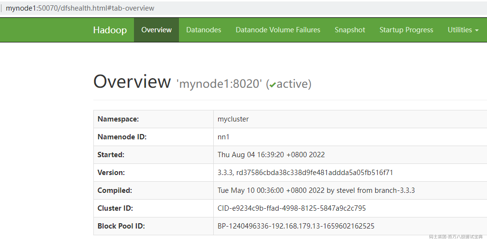

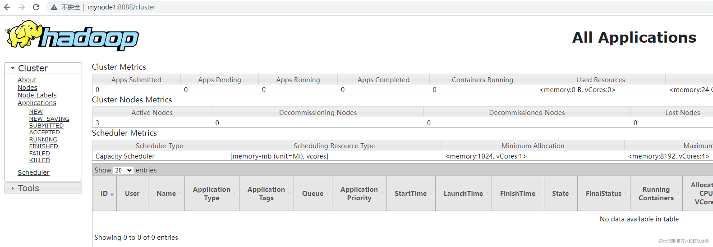

### 3.2.6安装Hive

#### 3.2.6.1节点划分

这里搭建Hive的版本为3.1.3，搭建Hive的节点划分如下：

|  |  |  |  |  |
| --- | --- | --- | --- | --- |
| **节点IP** | **节点名称** | **Hive服务器** | **Hive客户端** | **MySQL** |
| 192.168.179.4 | node1 | ★ |  |  |
| 192.168.179.5 | node2 |  |  | ★（已搭建） |
| 192.168.179.6 | node3 |  | ★ |  |

#### 3.2.6.2安装配置Hive

1. **将下载好的**Hive **安装包上传到** node1 **节点上** ,**并修改名称**

```plain
[root@node1 ~]# cd /software/
[root@node1 software]# tar -zxvf ./apache-hive-3.1.3-bin.tar.gz
[root@node1 software]# mv apache-hive-3.1.3-bin hive-3.1.3
```

2. **将解压好的**Hive **安装包发送到** node3**节点上**

```plain
[root@node1 software]# scp -r /software/hive-3.1.3/ node3:/software/
```

3. **配置** node1 **、** node3 **两台节点的** Hive **环境变量**

```plain
vim /etc/profile
export HIVE_HOME=/software/hive-3.1.3/
export PATH=$PATH:$HIVE_HOME/bin

#source  生效
source /etc/profile
```

4. **在** node1 **节点** $HIVE\_HOME/conf **下创建** hive-site.xml **并配置**

```plain
<configuration>
 <property>
  <name>hive.metastore.warehouse.dir</name>

  <value>/user/hive/warehouse</value>

 </property>

 <property>
  <name>javax.jdo.option.ConnectionURL</name>

  <value>jdbc:mysql://node2:3306/hive?createDatabaseIfNotExist=true&useSSL=false</value>

 </property>

 <property>
  <name>javax.jdo.option.ConnectionDriverName</name>

  <value>com.mysql.jdbc.Driver</value>

 </property>

 <property>
  <name>javax.jdo.option.ConnectionUserName</name>

  <value>root</value>

 </property>

 <property>
  <name>javax.jdo.option.ConnectionPassword</name>

  <value>123456</value>

 </property>

</configuration>

```

5. **在**node3 **节点** $HIVE\_HOME/conf/ **中创建** hive-site.xml**并配置**

```plain
<configuration>
 <property>
  <name>hive.metastore.warehouse.dir</name>

  <value>/user/hive/warehouse</value>

 </property>

 <property>
  <name>hive.metastore.local</name>

  <value>false</value>

 </property>

 <property>
  <name>hive.metastore.uris</name>

  <value>thrift://node1:9083</value>

 </property>

</configuration>

```

6. **node1** 、 **node3** 节点删除 **$HIVE****\_****HOME/lib** 下" **guava"** 包，使用 **Hadoop** 下的包替换

```plain
#删除Hive lib目录下“guava-19.0.jar ”包
[root@node1 ~]# rm -rf /software/hive-3.1.3/lib/guava-19.0.jar 
[root@node3 ~]# rm -rf /software/hive-3.1.3/lib/guava-19.0.jar 

#将Hadoop lib下的“guava”包拷贝到Hive lib目录下
[root@node1 ~]# cp /software/hadoop-3.3.4/share/hadoop/common/lib/guava-27.0-jre.jar /software/hive-3.1.3/lib/

[root@node3 ~]# cp /software/hadoop-3.3.4/share/hadoop/common/lib/guava-27.0-jre.jar /software/hive-3.1.3/lib/
```

7. **将"****mysql-connector-java-5.1.47.jar"** **驱动包上传到** **$HIVE****\_****HOME/lib****目录下**

这里node1,node3节点都需要传入,将mysql驱动包上传$HIVE\_HOME/lib/目录下。

8. **在**node1 **节点中初始化** Hive

```plain
#初始化hive,hive2.x版本后都需要初始化
[root@node1 ~]# schematool -dbType mysql -initSchema
```

#### 3.2.6.3Hive 操作

在服务端和客户端操作Hive，操作Hive之前首先启动HDFS集群，命令为：start-all.sh，启动HDFS集群后再进行Hive以下操作：

```plain
#在node1中登录Hive ，创建表test
[root@node1 conf]# hive
hive> create table test (id int,name string,age int ) row format delimited fields terminated by '\t';

#向表test中插入数据
hive> insert into test values(1,"zs",18);

#在node1启动Hive metastore
[root@node1 hadoop]# hive --service metastore &

#在node3上登录Hive客户端查看表数据
[root@node3 lib]# hive
hive> select * from test;
OK
1	zs	18
```

### 3.2.7安装HBase

#### 3.2.7.1节点划分

这里选择HBase版本为2.5.1，搭建HBase各个角色分布如下：

|  |  |  |
| --- | --- | --- |
| **节点IP** | **节点名称** | **HBase服务** |
| 192.168.179.6 | node3 | RegionServer |
| 192.168.179.7 | node4 | HMaster,RegionServer |
| 192.168.179.8 | node5 | RegionServer |

#### 3.2.7.2安装配置HBase

1. **将下载好的安装包发送到**node4 **节点上** , **并解压** , **配置环境变量**

```plain
#将下载好的HBase安装包上传至node4节点/software下，并解压
[root@node4 software]# tar -zxvf ./hbase-2.5.1-bin.tar.gz
```

当前节点配置HBase环境变量

```plain
#配置HBase环境变量
[root@node4 software]# vim /etc/profile
export HBASE_HOME=/software/hbase-2.5.1/
export PATH=$PATH:$HBASE_HOME/bin

#使环境变量生效
[root@node4 software]# source /etc/profile
```

2. **配置**$HBASE\_HOME/conf/hbase-env.sh

```plain
#配置HBase JDK
export JAVA_HOME=/usr/java/jdk1.8.0_181-amd64/

#配置 HBase不使用自带的zookeeper
export HBASE_MANAGES_ZK=false

#Hbase中的jar包和HDFS中的jar包有冲突，以下配置设置为true，启动hbase不加载HDFS jar包
export HBASE_DISABLE_HADOOP_CLASSPATH_LOOKUP="true"
```

3. **配置**$HBASE\_HOME/conf/hbase-site.xml

```plain
<configuration>
  <property>
        <name>hbase.rootdir</name>

        <value>hdfs://mycluster/hbase</value>

  </property>

  <property>
        <name>hbase.cluster.distributed</name>

        <value>true</value>

  </property>

  <property>
        <name>hbase.zookeeper.quorum</name>

        <value>node3,node4,node5</value>

  </property>

  <property>
        <name>hbase.unsafe.stream.capability.enforce</name>

        <value>false</value>

  </property>

</configuration>

```

4. **配置**$HBASE\_HOME/conf/regionservers **，配置** RegionServer **节点**

```plain
node3
node4
node5
```

5. **配置**backup-masters**文件**

手动创建$HBASE\_HOME/conf/backup-masters文件，指定备用的HMaster,需要手动创建文件，这里写入node5,在HBase任意节点都可以启动HMaster，都可以成为备用Master ,可以使用命令：hbase-daemon.sh start master启动。

```plain
#创建 $HBASE_HOME/conf/backup-masters 文件，写入node5
[root@node4 conf]# vim backup-masters
node5
```

6. **复制**hdfs-site.xml **到** $HBASE\_HOME/conf/ **下**

```plain
[root@node4 ~]# cp /software/hadoop-3.3.4/etc/hadoop/hdfs-site.xml /software/hbase-2.5.1/conf/
```

7. **将**HBase **安装包发送到** node3 **，** node5 **节点上，并在** node3 **，** node5 **节点上配置** HBase **环境变量**

```plain
[root@node4 ~]# scp -r /software/hbase-2.5.1 node3:/software/
[root@node4 ~]# scp -r /software/hbase-2.5.1 node5:/software/

注意：在node3、node5上配置HBase环境变量。
vim /etc/profile
export HBASE_HOME=/software/hbase-2.5.1/
export PATH=$PATH:$HBASE_HOME/bin

#使环境变量生效
source /etc/profile
```

8. **重启**Zookeeper **、重启** HDFS **及启动** HBase**集群**

```plain
#注意:一定要重启Zookeeper,重启HDFS,在node4节点上启动HBase集群
[root@node4 software]# start-hbase.sh 

#访问WebUI，http://node4:16010。
停止集群：在任意一台节点上stop-hbase.sh
```

*(⚠️ 图片缺失:源知识库原图已失效)*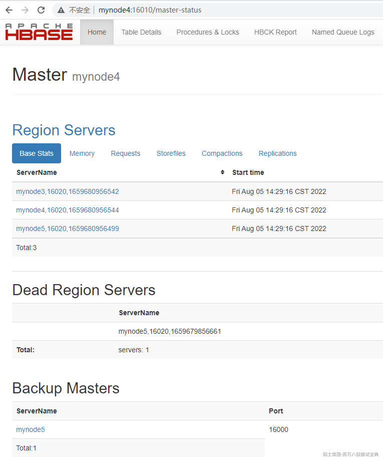

#### 3.2.7.3HBase操作

在Hbase中创建表test，指定'cf1','cf2'两个列族，并向表test中插入几条数据：

```plain
#进入hbase
[root@node4 ~]# hbase shell

#创建表test
create 'test','cf1','cf2'

#查看创建的表
list

#向表test中插入数据
put 'test','row1','cf1:id','1'
put 'test','row1','cf1:name','zhangsan'
put 'test','row1','cf1:age',18

#查询表test中rowkey为row1的数据
get 'test','row1'
```

### 3.2.8安装Redis

#### 3.2.8.1节点划分

这里选择Redis版本为6.2.7版本，Redis安装在node4节点上，节点分布如下：

|  |  |  |
| --- | --- | --- |
| **节点**IP | 节点名称 | Redis**服务** |
| 192.168.179.7 | node4 | client |

#### 3.2.8.2安装Redis

1. **将**redis **安装包上传到** node4**节点，并解压**

```plain
[root@node4 ~]# cd /software/
[root@node4 software]# tar -zxvf ./redis-6.2.7.tar.gz
```

2. **node4**安装需要的 **C** 插件

```plain
[root@node4 ~]# yum -y install gcc tcl
```

3. **编译**Redis

进入/software/cd /software/redis-6.2.7目录中，编译redis。

```plain
[root@node4 ~]# cd /software/redis-6.2.7
[root@node4 redis-6.2.7]# make
```

4. **创建安装目录安装**Redis

```plain
#创建安装目录
[root@node4 ~]# mkdir -p /software/redis

#进入redis编译目录，安装redis
[root@node4 ~]# cd /software/redis-6.2.7
[root@node4 redis-6.2.7]# make PREFIX=/software/redis install
```

注意：现在就可以使用redis了，进入/software/redis/bin下，就可以执行redis命令。

5. **将**Redis**加入环境变量，加入系统服务，设置开机启动**

```plain
#将redis-server链接到/usr/local/bin/目录下，后期加入系统服务时避免报错
[root@node4 ~]# ln -sf /software/redis-6.2.7/src/redis-server /usr/local/bin/

#进入下方目录，配置install_server.sh，将文件中以下内容前面加上#注释掉，原因为一个物理机中可以有多个redis实例（进程），通过port区分，可执行程序就一份在目录，但是内存中未来的多个实例需要各自的配置文件，持久化目录等资源。
[root@node4 ~]# cd /software/redis-6.2.7/utils/
#_pid_1_exe="$(readlink -f /proc/1/exe)"
#if [ "${_pid_1_exe##*/}" = systemd ]
#then
#        echo "This systems seems to use systemd."
#        echo "Please take a look at the provided example service unit files in this #directory, and adapt and install them. Sorry!"
#        exit 1
#fi

#执行如下命令，配置redis Server，一直回车即可
[root@node4 utils]# ./install_server.sh

#执行完以上安装，在/etc/init.d下会修改redis_6379名称并加入系统服务
[root@node4 utils]# cd /etc/init.d/
[root@node4 init.d]# mv redis_6379 redisd
[root@node4 init.d]# chkconfig --add redisd

#检查加入系统状态,3,4,5为开，就是开机自动启动
[root@node4 init.d]# chkconfig --list
```


6. **配**Redis**环境变量**

```plain
# 在node4节点上编辑profile文件，vim /etc/profile
export REDIS_HOME=/software/redis
export PATH=$PATH:$REDIS_HOME/bin

#使环境变量生效
source /etc/profile
```

7. **启动** | **停止****Redis** **服务**

后期每次开机启动都会自动启动Redis，也可以使用以下命令手动启动|停止redis

```plain
#启动redis
[root@node4 init.d]# service redisd start

#停止redis
[root@node4 init.d]# redis-cli shutdown
```

#### 3.2.8.3Redis 操作

```plain
#进入redis客户端
[root@node4 ~]# redis-cli

#切换1号库，并插入key
127.0.0.1:6379> select 1
127.0.0.1:6379[1]> hset rediskey zhangsan 100

#查看所有key并获取key值
127.0.0.1:6379[1]> keys *
127.0.0.1:6379[1]> hgetall rediskey

#删除指定key
127.0.0.1:6379[1]> del 'rediskey'
```

### 3.2.9安装Kafka

#### 3.2.9.1节点划分

这里选择Kafka版本为3.3.1,对应的搭建节点如下：

|  |  |  |
| --- | --- | --- |
| **节点IP** | **节点名称** | **Kafka服务** |
| 192.168.179.4 | node1 | kafka broker |
| 192.168.179.5 | node2 | kafka broker |
| 192.168.179.6 | node3 | kafka broker |

#### 3.2.9.2安装配置Kafka

1. **上传解压**

```plain
[root@node1 software]# tar -zxvf ./kafka_2.12-3.3.1.tgz
```

2. **配置**Kafka**环境变量**

```plain
# 在node1节点上编辑profile文件，vim /etc/profile
export KAFKA_HOME=/software/kafka_2.12-3.3.1/
export PATH=$PATH:$KAFKA_HOME/bin

#使环境变量生效
source /etc/profile
```

3. **配置**Kafka

在node1节点上配置Kafka，进入$KAFKA\_HOME/config中修改server.properties，修改内容如下：

```plain
broker.id=0     #注意：这里要唯一的Integer类型
log.dirs=/kafka-logs    #真实数据存储的位置
zookeeper.connect=node3:2181,node4:2181,node5:2181  #zookeeper集群
```

4. **将以上配置发送到**node2 **，** node3**节点上**

```plain
[root@node1 software]# scp -r /software/kafka_2.12-3.3.1 node2:/software/

[root@node1 software]# scp -r /software/kafka_2.12-3.3.1 node3:/software/
```

发送完成后，在node2、node3节点上配置Kafka的环境变量。

5. **修改**node2,node3 **节点上的** server.properties **文件**

node2、node3节点修改$KAFKA\_HOME/config/server.properties文件中的broker.id，node2中修改为1，node3节点修改为2。

6. **创建**Kafka**启动脚本**

在node1,node2,node3节点$KAFKA\_HOME/bin路径中编写Kafka启动脚本"startKafka.sh"，内容如下：

```plain
nohup /software/kafka_2.12-3.3.1/bin/kafka-server-start.sh /software/kafka_2.12-3.3.1/config/server.properties > /software/kafka_2.12-3.3.1/kafkalog.txt 2>&1 &
```

node1,node2,node3节点配置完成后修改"startKafka.sh"脚本执行权限：

```plain
chmod +x ./startKafka.sh
```

7. **启动**Kafka**集群**

在node1,node2,node3三台节点上分别执行startKafka.sh脚本，启动Kafka。

```plain
[root@node1 ~]# startKafka.sh
[root@node2 ~]# startKafka.sh
[root@node3 ~]# startKafka.sh
```

#### 3.2.9.3Kafka命令操作

在Kafka 任意节点上操作如下命令测试Kafka。

```plain
#创建topic 
kafka-topics.sh --create --bootstrap-server node1:9092,node2:9092,node3:9092 --topic testtopic  --partitions 3 --replication-factor 3

#查看集群中的topic
kafka-topics.sh  --list --bootstrap-server node1:9092,node2:9092,node3:9092

#console控制台向topic 中生产数据
kafka-console-producer.sh --bootstrap-server node1:9092,node2:9092,node3:9092 --topic testtopic

#console控制台消费topic中的数据
kafka-console-consumer.sh --bootstrap-server node1:9092,node2:9092,node3:9092 --topic testtopic

注意：以上创建好之后，可以向Kafka topic中写入数据测试Kafka是否正常。

#删除topic
kafka-topics.sh --bootstrap-server node1:9092,node2:9092,node3:9092 --delete --topic testtopic
```

## 3.3Flink集群部署

Flink的安装和部署主要分为本地（单机）模式和集群模式，其中本地模式只需直接解压就可以使用，不用修改任何参数，一般在做一些简单测试的时候使用。本地模式在这里不再赘述。集群部署模式主要包含Standalone、Hadoop Yarn 、Kubernetes等，Flink可以借助以上资源管理器来实现分布式计算，目前企业使用最多的是Flink 基于Hadoop Yarn资源管理器模式，下面我们重点讲解Flink 基于Standalone集群、Yarn资源管理器以及Kubernetes集群部署方式。关于Flink基于Kubernetes集群部署详见第5章节。

### 3.3.1Standalone集群部署

#### 3.3.1.1节点划分

通过Flink运行时架构小结，我们知道Flink集群是由一个JobManager(Master)节点和多个TaskManager(Worker)节点构成，并且有对应提交任务的客户端。这里部署Standalone集群基于Linux Centos7.6版本，选择4台节点进行部署Flink，其中3台节点Standalone集群节点、一台节点是提交Flink任务的客户端，各个节点需要满足以下特点：

- 各节点安装java8版本及以上jdk（这里选择jdk8）。

- 各个节点之间需要两两免密。

4台节点角色划分如下：

|  |  |  |
| --- | --- | --- |
| **节点IP** | **节点名称** | **Flink服务** |
| 192.168.179.4 | node1 | JobManager,TaskManager |
| 192.168.179.5 | node2 | TaskManager |
| 192.168.179.6 | node3 | TaskManager |
| 192.168.179.7 | node4 | client |

#### 3.3.1.2standalone集群部署

我们可以从Flink的官网下载Flink最新的安装包，这里选择Flink1.16.0版本，Flink安装包下载地址：<https://flink.apache.org/downloads.html#apache-flink-1160。Standalone集群部署步骤如下：>

1. **上传压缩包解压**

将Flink的安装包上传到node1节点/software下并解压：

```plain
[root@node1 software]# tar -zxvf ./flink-1.16.0-bin-scala_2.12.tgz 
```

2. **配置**Master**节点**

配置Master节点就是配置JobManager节点，在$FLINK\_HOME/conf/masters文件中配置jobManager节点如下：

```plain
#vim $FLINK_HOME/conf/masters
node1:8081
```

3. **配置**Worker**节点**

配置Worker节点就是配置TaskManager节点，在$FLINK\_HOME/conf/workers文件中配置taskManager节点如下：

```plain
#vim $FLINK_HOME/conf/workers
node1
node2
node3
```

4. **配置** flink-conf.yaml **文件**

在node1节点上进入到FLINK\_HOME/conf/flink-conf.yaml配置如下内容），内容如下：

```plain
# JobManager地址
jobmanager.rpc.address: node1

# JobManager地址绑定设置
jobmanager.bind-host: 0.0.0.0

# TaskManager地址绑定设置
taskmanager.bind-host: 0.0.0.0

# TaskManager地址(不同TaskManager节点host配置对应的host)
taskmanager.host: node1

# 设置每个TaskManager 的slot个数
taskmanager.numberOfTaskSlots: 3

# WEB UI 节点（只需JobManager节点设置，TaskManager节点设置了也无所谓）
rest.address: node1

# WEB UI节点绑定设置(只需JobManster节点设置)
rest.bind-address: 0.0.0.0
```

注意：以上设置的0.0.0.0代表监听当前节点每一个可用的网络接口，0.0.0.0不再是一个真正意义上的ip地址，而表示一个集合，监听0.0.0.0的端口相当于是可以监听本机中的所有ip端口。以上配置的0.0.0.0 表示想要让外部访问需要设置具体ip，或者直接设置为"0.0.0.0"。

5. **分发安装包并配置** node2 **、** node3 **节点** flink-conf.yaml **文件**

```plain
#分发到node2、node3节点上
[root@node1 ~]# scp -r /software/flink-1.16.0 node2:/software/
[root@node1 ~]# scp -r /software/flink-1.16.0 node3:/software/

#修改node2、node3 节点flink-conf.yaml文件中的TaskManager
【node2节点】 taskmanager.host: node2
【node3节点】 taskmanager.host: node3

#注意，这里发送到node4,node4只是客户端
[root@node1 ~]# scp -r /software/flink-1.16.0 node4:/software/
```

6. **启动**Flink **集群**

```plain
#在node1节点中，启动Flink集群
[root@node1 ~]# cd /software/flink-1.16.0/bin/
[root@node1 bin]# ./start-cluster.sh
```

3. **访问**Flink WebUI

[https://node1:8081](https://node1:8081/),进入页面如下：

*(⚠️ 图片缺失:源知识库原图已失效)*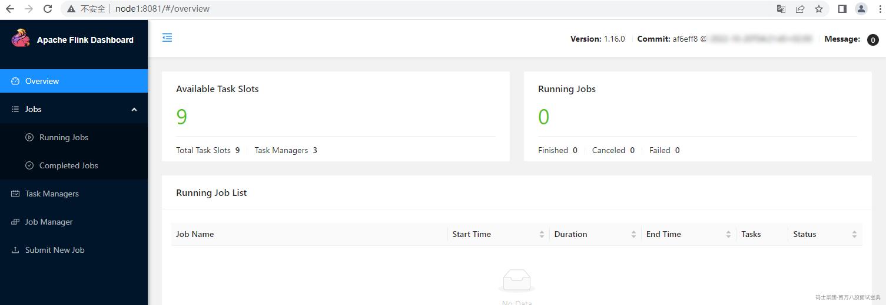

#### 3.3.1.3任务提交测试

Standalone集群搭建完成后，可以将Flink任务提交到Flink Standalone集群中运行。有两种方式提交Flink任务，一种是在WebUI界面上提交Flink任务，一种方式是通过命令行方式。

这里编写读取Socket数据进行实时WordCount统计Flink任务提交到Flink集群中运行，这里以Flink Java代码为例来实现，代码如下：

```plain
/**
 * 读取Socket数据进行实时WordCount统计
 */
public class SocketWordCount {
    public static void main(String[] args) throws Exception {
        //1.准备环境
        StreamExecutionEnvironment env = StreamExecutionEnvironment.getExecutionEnvironment();
        //2.读取Socket数据
        DataStreamSource<String> ds = env.socketTextStream("node5", 9999);
        //3.准备K,V格式数据
        SingleOutputStreamOperator<Tuple2<String, Integer>> tupleDS = ds.flatMap((String line, Collector<Tuple2<String, Integer>> out) -> {
            String[] words = line.split(",");
            for (String word : words) {
                out.collect(Tuple2.of(word, 1));
            }
        }).returns(Types.TUPLE(Types.STRING, Types.INT));

        //4.聚合打印结果
        tupleDS.keyBy(tp -> tp.f0).sum(1).print();

        //5.execute触发执行
        env.execute();
    }
}
```

以上代码编写完成后，在对应的项目Maven pom 文件中加入以下plugin:

```plain
<build>
  <plugins>
    <plugin>
      <artifactId>maven-assembly-plugin</artifactId>

      <version>2.6</version>

      <configuration>
        <!-- 设置false后是去掉 xxx-1.0-SNAPSHOT-jar-with-dependencies.jar 后的 “-jar-with-dependencies” -->
        <!--<appendAssemblyId>false</appendAssemblyId>-->
        <descriptorRefs>
          <descriptorRef>jar-with-dependencies</descriptorRef>

        </descriptorRefs>

        <archive>
          <manifest>
            <mainClass>xx.xx.xx</mainClass>

          </manifest>

        </archive>

      </configuration>

      <executions>
        <execution>
          <id>make-assembly</id>

          <phase>package</phase>

          <goals>
            <goal>assembly</goal>

          </goals>

        </execution>

      </executions>

    </plugin>

  </plugins>

</build>

```

然后使用Maven assembly 插件对项目进行打包，得到"FlinkJavaCode-1.0-SNAPSHOT-jar-with-dependencies.jar"完整jar包。

此外，代码中读取的是node5节点scoket 9999端口数据，需要在node5节点上安装nc组件：

```plain
[root@node5 ~]# yum -y install nc
```

- **命令行提交**Flink**任务**

1. **在**node1 **上启动** Flink Standalone **集群**

```plain
[root@node1 bin]# cd /software/flink-1.16.0/bin/
[root@node1 bin]# ./start-cluster.sh 
```

2. **在**node5 **节点上启动****nc socket** 服务

```plain
[root@node5 ~]# nc -lk 9999
```

3. **将打好的包提交到**Flink **客户端** node4 **节点** /root **目录下并提交任务**

```plain
[root@node4 ~]# cd /software/flink-1.16.0/bin/
#向Flink集群中提交任务
[root@node4 bin]# ./flink run -m node1:8081 -c com.mashibing.flinkjava.code.lesson03.SocketWordCount /root/FlinkJavaCode-1.0-SNAPSHOT-jar-with-dependencies.jar 
```

4. **进入Flink WebUI 界面查看任务和结果**

```plain
#向node5 socket 9999 端口写入以下数据
hello,a 
hello,b
hello,c
hello,a
```

5. **WebUI**查看对应任务和结果

登录Flink WebUI <http://node1:8081查看对应任务执行情况。>

*(⚠️ 图片缺失:源知识库原图已失效)*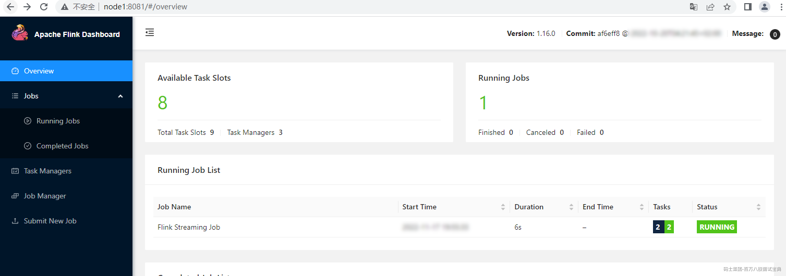

WebUI查看执行结果：

*(⚠️ 图片缺失:源知识库原图已失效)*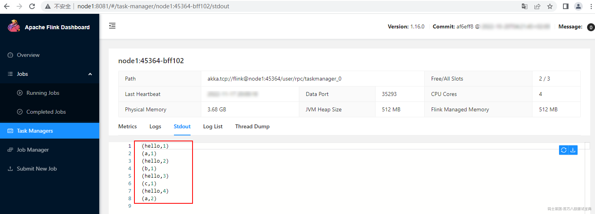

在WebUI中点击对应的任务Job，进入如下页面点击"Cancel Job"取消任务执行：

*(⚠️ 图片缺失:源知识库原图已失效)*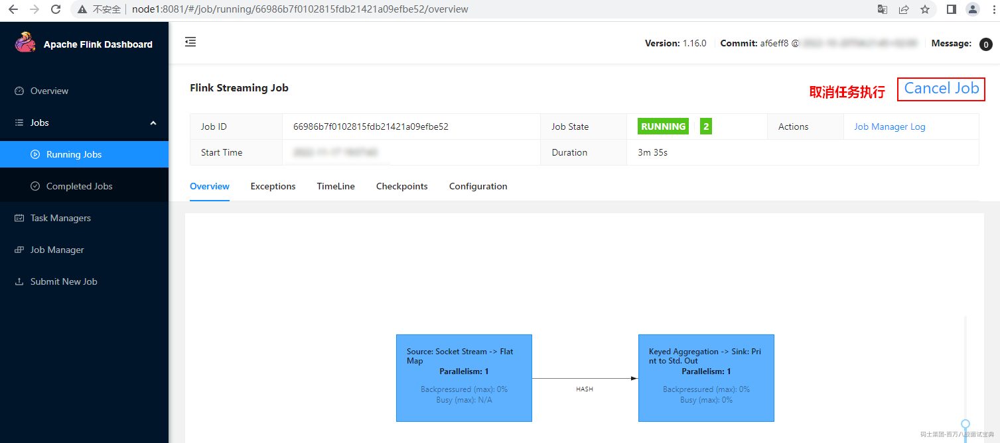

- **Web**界面提交 **Flink** 任务

向Flink集群提交任务还可以通过WebUI方式提交。点击上传jar包，进行参数配置,并提交任务。

*(⚠️ 图片缺失:源知识库原图已失效)*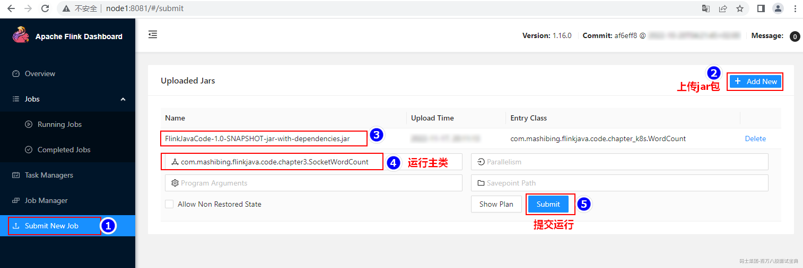

提交任务之后，可以通过WebUI页面查看提交任务，输入数据之后可以在对应的TaskManager节点上看到相应结果。

*(⚠️ 图片缺失:源知识库原图已失效)*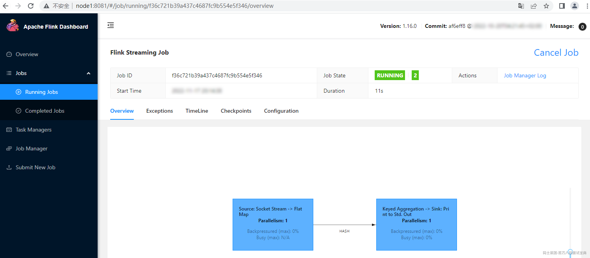

### 3.3.2Flink On Yarn

Flink可以基于Yarn来运行任务，Yarn作为资源提供方，可以根据Flink任务资源需求动态的启动TaskManager来提供资源。Flink基于Yarn提交任务通常叫做Flink On Yarn，Yarn资源调度框架运行需要有Hadoop集群，Hadoop版本最低是2.8.5。

#### 3.3.2.1Flink不同版本与Hadoop整合

Flink基于Yarn提交任务时，需要Flink与Hadoop进行整合。Flink1.8版本之前，Flink与Hadoop整合是通过Flink官方提供的基于对应hadoop版本编译的安装包来实现，例如：[flink-1.7.2-bin-hadoop24-scala\_2.11.tgz](https://archive.apache.org/dist/flink/flink-1.7.2/flink-1.7.2-bin-hadoop24-scala_2.11.tgz)，在Flink1.8版本后不再支持基于不同Hadoop版本的编译安装包，Flink与Hadoop进行整合时，需要在官网中下载对应的Hadoop版本的"flink-shaded-hadoop-2-uber-x.x.x-x.x.jar"jar包，然后后上传到提交Flink任务的客户端对应的$FLINK\_HOME/lib中完成Flink与Hadoop的整合。

在Flink1.11版本之后不再提供任何更新的flink-shaded-hadoop-x jars，Flink与Hadoop整合统一使用基于Hadoop2.8.5编译的Flink安装包，支持与Hadoop2.8.5及以上Hadoop版本（包括Hadoop3.x）整合。在Flink1.11版本后与Hadoop整合时还需要配置HADOOP\_CLASSPATH环境变量来完成对Hadoop的支持。

#### 3.3.2.2Flink on Yarn 配置及环境准备

Flink 基于Yarn提交任务，向Yarn集群中提交Flink任务的客户端需要满足以下两点

- 客户端安装了Hadoop2.8.5+版本的hadoop。

- 客户端配置了HADOOP\_CLASSPATH环境变量。

这里选择node5节点作为提交Flink的客户端，该节点已经安装了Hadoop3.3.4版本，然后在该节点中配置profile文件，加入以下环境变量：

```plain
# vim /etc/profile,加入以下配置
export HADOOP_CLASSPATH=`hadoop classpath`

#source /etc/profile 使环境变量生效
[root@node5 ~]# source /etc/profile
```

然后将Flink的安装包上传到node5节点/software下并解压：

```plain
[root@node5 software]# tar -zxvf ./flink-1.16.0-bin-scala_2.12.tgz 
```

#### 3.3.2.3任务提交测试

基于Yarn运行Flink任务只能通过命令行方式进行任务提交，Flink任务基于Yarn运行时有几种任务提交部署模式（后续章节会进行介绍），下面以Application模式来提交任务。步骤如下：

1. **启动**HDFS**集群**

```plain
#在 node3、node4、node5节点启动zookeeper
[root@node3 ~]#  zkServer.sh start
[root@node4 ~]#  zkServer.sh start
[root@node5 ~]#  zkServer.sh start

#在node1启动HDFS集群
[root@node1 ~]# start-all.sh 
```

2. **将 Flink** **任务对应的** jar **包上传到** node5 **节点**

这里的Flink任务还是以读取Socket数据做实时WordCount任务为例，将打好的"FlinkJavaCode-1.0-SNAPSHOT-jar-with-dependencies.jar"jar包上传到node5节点的/root/目录下。

3. **在**node5 **节点执行如下命令运行** Flink **作业**

```plain
[root@node5 ~]# cd /software/flink-1.16.0/bin/

# 提交Flink任务
[root@node5 bin]#./flink run-application -t yarn-application -c com.mashibing.flinkjava.code.chapter3.SocketWordCount /root/FlinkJavaCode-1.0-SNAPSHOT-jar-with-dependencies.jar
```

4. **查看**WebUI**及运行结果**

Flink任务Application模式提交后，浏览器输入<https://node1:8088登录Yarn> WebUI,找到提交的任务，点击对应的Tracking UI"ApplicationMaster"进入到Flink WEBUI任务页面。

*(⚠️ 图片缺失:源知识库原图已失效)*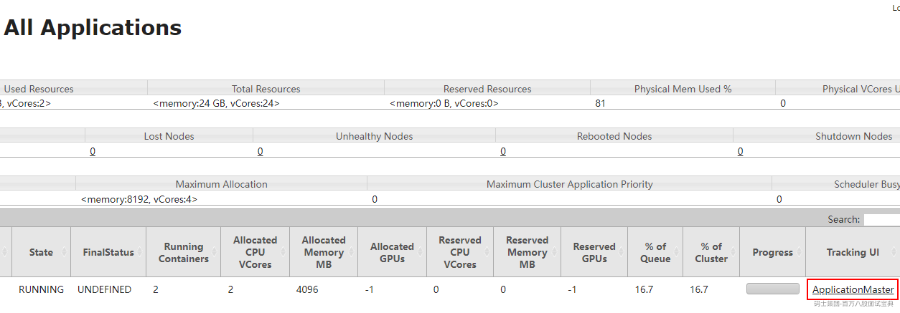

*(⚠️ 图片缺失:源知识库原图已失效)*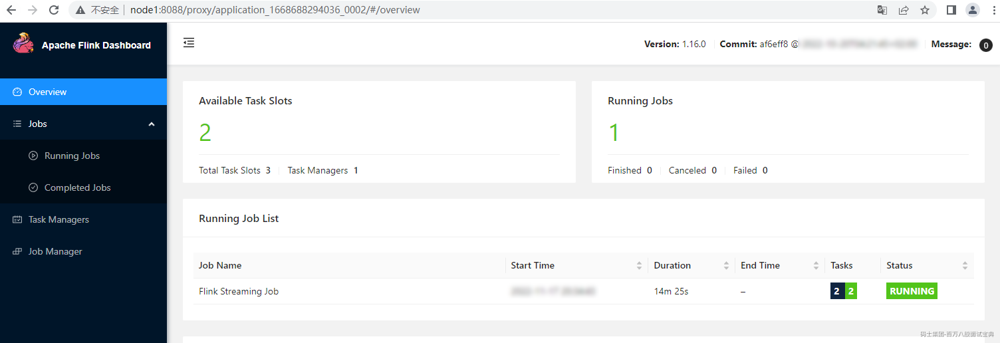

向node5 scoket 9999端口输入以下数据并在对应的WebUI中查看结果：

```plain
#向node5 socket 9999 端口写入以下数据
hello,a 
hello,b
hello,c
hello,a
```

在WebUI中找到对应的Flink TaskManager节点 Stdout输出，结果如下：

*(⚠️ 图片缺失:源知识库原图已失效)*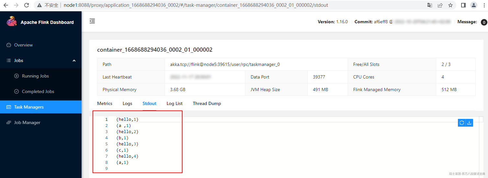

## 3.4Flink History Server

基于Standalone或者Yarn模式提交Flink任务后，当任务执行失败、取消或者完成后，可以在WebUI中查看对应任务的统计信息，这些统计信息在生产环境中对我们来说非常重要，可以知道一个任务异常挂掉前发生了什么，便于定位问题。

当基于Standalone session模式提交相应任务时，集群重启后我们没有办法查看集群之前运行任务的情况，如果是基于pre-job方式提交任务，任务执行完成之后，那么相对应的统计信息也不会保存，基于Yarn运行的Flink任务也是一样道理。这样对于我们查看先前Flink作业统计信息或参数带来了不便。Flink中提供了History Server 来解决这个问题，可以在任务执行完成后保留相应的任务统计信息，便于分析和定位问题。

History Server 允许查询由JobManager归档的已完成作业的状态和统计日志信息。已完成的作业归档由JobManager上传持久化到某个路径下，这个路径可以是本地文件系统、HDFS、H3等，History Server 可以周期扫描该路径将归档的Flink任务日志恢复出来，从而可以查看相应Flink任务日志情况。

### 3.4.1Standalone History Server配置与验证

#### 3.4.1.1配置

在Standalone中配置History Server 服务需要选择一台节点当做History Server ,这台节点可以是JobManager/TaskManager节点，也可以是Standalone集群外的一台节点，这里选择node4节点作为Flink History Server 节点。Standalone配置HistoryServer 服务步骤如下：

1. **在**JM **和** TM **节点上配置** flink-conf.yaml

在Flink Standalone JobManager和TaskManager节点上配置flink-conf.yaml文件，指定Flink完成任务持久化的路径，这里选择HDFS目录作为任务日志持久化保存目录。在node1、node2、node3节点上配置$FLINK\_HOME/conf/flink-conf.yaml文件，加入以下配置。

```plain
#Flink job运行完成后日志存储目录
jobmanager.archive.fs.dir: hdfs://mycluster/flink/completed-jobs/
```

Flink会根据以上配置连接HDFS 目录存储任务数据，所以需要在node1、node2、node3节点上/etc/profile中配置HADOOP\_CLASSPATH环境变量。

```plain
#vim /etc/profile,加入以下配置
export HADOOP_CLASSPATH=`hadoop classpath`

#source /etc/profile 使环境变量生效
source /etc/profile
```

2. **在**History Server **节点上配置** **flink-conf.yaml**

在node4节点上配置$FLINK\_HOME/conf/flink-conf.yaml文件，加入如下配置，配置HistoryServer。

```plain
#Flink History Server 节点
historyserver.web.address: node4

#Flink History Server 端口
historyserver.web.port: 8082

#Flink History Server 恢复任务的目录
historyserver.archive.fs.dir: hdfs://mycluster/flink/completed-jobs/

#Flink History Server 监控任务日志目录刷新时间间隔（毫秒）
historyserver.archive.fs.refresh-interval: 10000
```

Flink会根据以上配置连接HDFS目录恢复任务数据，这里要求"historyserver.archive.fs.dir"参数配置需要与Flink各个节点上配置的"jobmanager.archive.fs.dir"参数路径保持一致。此外，需要在node4节点上/etc/profile中配置HADOOP\_CLASSPATH环境变量。

```plain
# vim /etc/profile,加入以下配置
export HADOOP_CLASSPATH=`hadoop classpath`

#source /etc/profile 使环境变量生效
[root@node4 ~]# source /etc/profile
```

3. **启动** Flink **历史日志服务器**

在node4节点上启动Flink History Server

```plain
#启动Flink 历史日志服务器
[root@node4 ~]# cd /software/flink-1.16.0/bin/
[root@node4 bin]# ./historyserver.sh start
```

#### 3.4.1.2验证

History Server 启动后，可以通过<https://node4:8082> 来访问历史日志服务页面。

*(⚠️ 图片缺失:源知识库原图已失效)*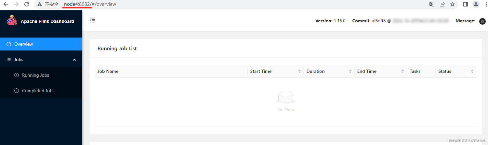

我们可以通过向Standalone集群中提交任务来验证History Server是否能正常展示运行Flink任务的统计信息，步骤如下：

1. **启动 Standalone** **集群**

```plain
[root@node1 ~]# cd /software/flink-1.16.0/bin/
[root@node1 bin]# ./start-cluster.sh 
```

2. **提交任务**

向Flink集群中提交任务，任务还是选择读取Socket端口数据实时统计WordCount。首先在node5节点上启动socket服务：

```plain
[root@node5 ~]# nc -lk 9999
```

在node4 客户端提交Flink任务（可以在任意节点提交Flink任务），命令如下：

```plain
[root@node4 ~]# cd /software/flink-1.16.0/bin/
[root@node4 bin]# ./flink run -m node1:8081 -c com.mashibing.flinkjava.code.chapter3.SocketWordCount /root/FlinkJavaCode-1.0-SNAPSHOT-jar-with-dependencies.jar 
```

提交任务后在HDFS中暂时不会生成hdfs://mycluster/flink/completed-jobs"目录，当Flink集群停止、任务取消、任务失败后才可以在该目录下看到job信息。

3. **取消任务并查看历史日志**

在node5节点向Socket 9999端口输入一些数据：

```plain
hello,a
hello,b
hello,c
hello,d
```

然后在Flink WebUI中取消当前任务：

*(⚠️ 图片缺失:源知识库原图已失效)*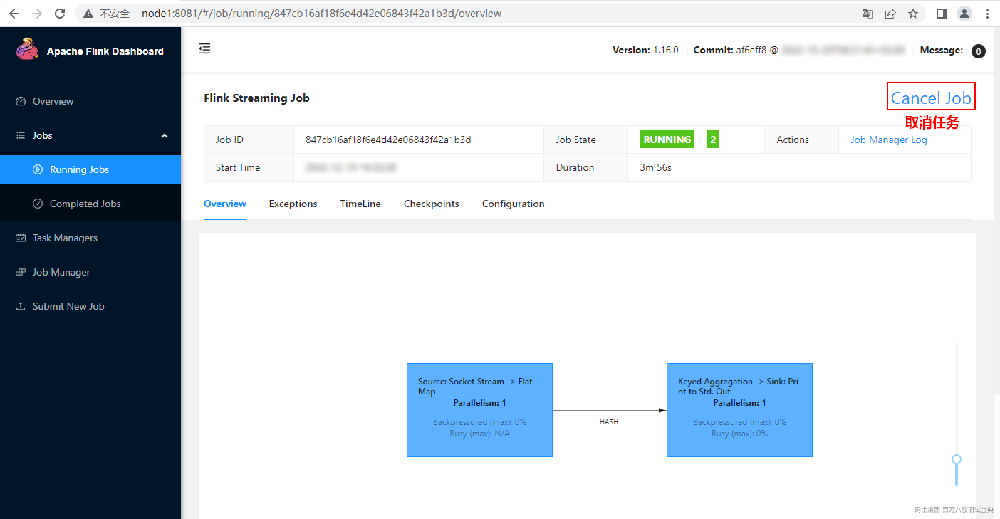

取消任务后可以在"hdfs://mycluster/flink/completed-jobs"目录中看到取消任务的信息：

*(⚠️ 图片缺失:源知识库原图已失效)*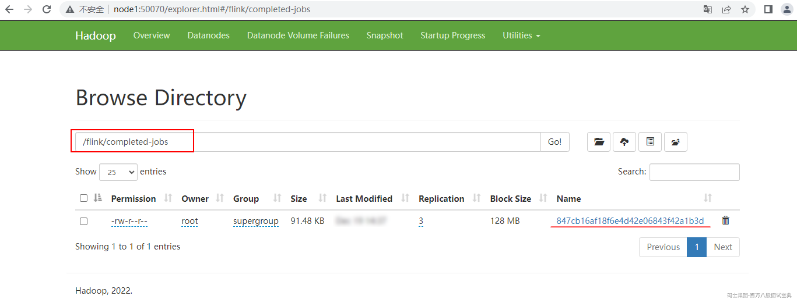

当任务取消后，也可以停止Flink集群，Flink集群重启后先前的任务统计信息不会展示，可以登录Flink历史日志服务器查看先前任务统计信息：

*(⚠️ 图片缺失:源知识库原图已失效)*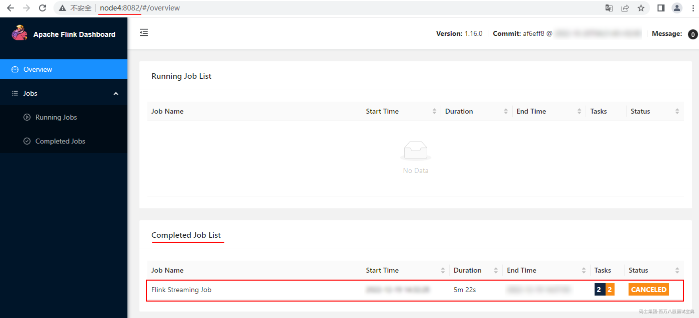

注意：在取消任务或者停止Flink集群后，需要等待一小段时间才能在Flink历史日志服务器中查看到对应的取消任务。

### 3.4.2Yarn History Server配置与验证

#### 3.4.2.1配置

Flink基于Yarn运行时，当Flink任务形成的集群停止后，无法看到对应任务的统计信息，也可以通过配置History Server来实现基于Yarn的Flink集群停止后查看任务的统计信息。

这里选择node5节点为History Server，基于Yarn运行Flink任务配置HistoryServer服务步骤如下：

1. **在**node5 **节点上配置** flink-conf.yaml

在node5节点上配置$FLINK\_HOME/conf/flink-conf.yaml文件，最后配置以下配置项。

```plain
#Flink job运行完成后日志存储目录
jobmanager.archive.fs.dir: hdfs://mycluster/flink-yarn/completed-jobs/

#Flink History 服务器地址
historyserver.web.address: node5

#HistroyServer WebUI 访问端口
historyserver.web.port: 8082

#HistoryServer历史日志服务恢复任务信息目录
historyserver.archive.fs.dir: hdfs://mycluster/flink-yarn/completed-jobs/

#Flink History Server 监控任务日志目录刷新时间间隔（毫秒）
historyserver.archive.fs.refresh-interval: 10000
```

Flink会根据以上配置连接HDFS 目录存储任务数据，所以需要在node5节点上/etc/profile中配置HADOOP\_CLASSPATH环境变量。

```plain
#vim /etc/profile,加入以下配置
export HADOOP_CLASSPATH=`hadoop classpath`

#source /etc/profile 使环境变量生效
source /etc/profile
```

2. **启动 Flink 历史日志服务器并访问**

在node5节点上启动Flink History Server

```plain
#启动Flink 历史日志服务器
[root@node5 ~]# cd /software/flink-1.16.0/bin/
[root@node5 bin]# ./historyserver.sh start
```

访问历史日志服务地址：<https://node5:8082>

*(⚠️ 图片缺失:源知识库原图已失效)*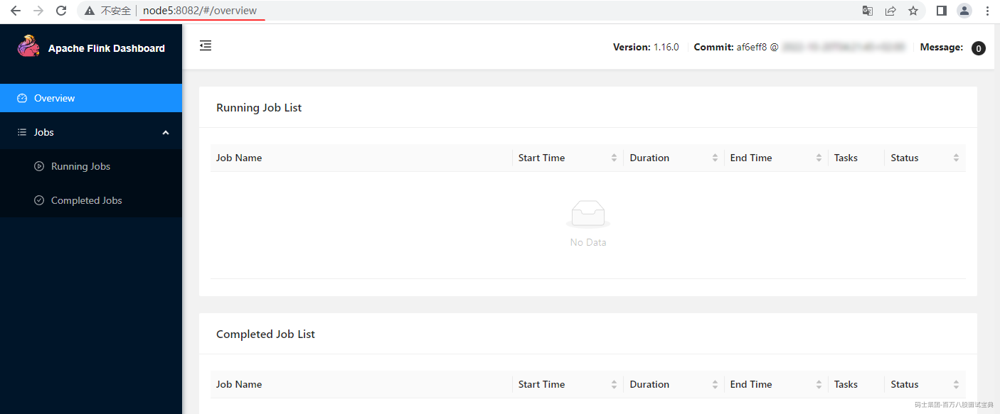

#### 3.4.2.2验证

在node5节点基于Yarn提交Flink任务来验证History Server是否能正常展示执行完成的Flink任务统计信息。步骤如下：

1. **向**Yarn **集群中提交** Flink**任务**

向Yarn集群中提交Flink任务，任务还是选择读取Socket端口数据实时统计WordCount。在node5节点启动socket服务器：

```plain
[root@node5 ~]# nc -lk 9999
```

在node5节点向Flink集群中提交Flink任务，命令如下：

```plain
[root@node5 ~]# cd /software/flink-1.16.0/bin/

# 提交Flink任务
[root@node5 bin]#./flink run-application -t yarn-application -c com.mashibing.flinkjava.code.chapter3.SocketWordCount /root/FlinkJavaCode-1.0-SNAPSHOT-jar-with-dependencies.jar
```

提交任务后在HDFS中暂时不会生成hdfs://mycluster/flink/completed-jobs"目录，当Flink集群停止、任务取消、任务失败后才可以在该目录下看到job信息。

2. **取消任务并查看历史日志**

在node5节点向Socket 9999端口输入一些数据：

```plain
hello,a
hello,b
hello,c
hello,d
```

然后登录Yarn(<https://node1:8081>) WebUI，找到提交的任务取消对应Flink任务：

*(⚠️ 图片缺失:源知识库原图已失效)*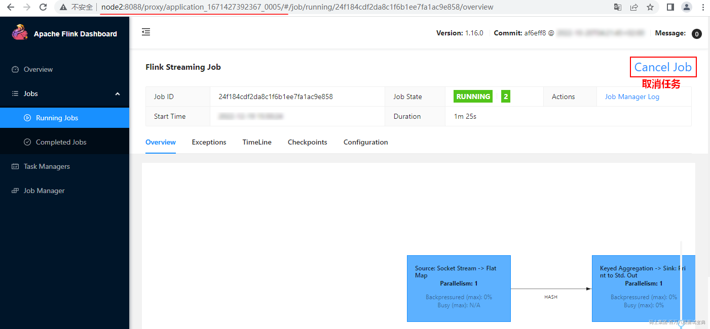

取消任务后可以在"hdfs://mycluster/flink-yarn/completed-jobs"目录中看到取消任务的信息：

*(⚠️ 图片缺失:源知识库原图已失效)*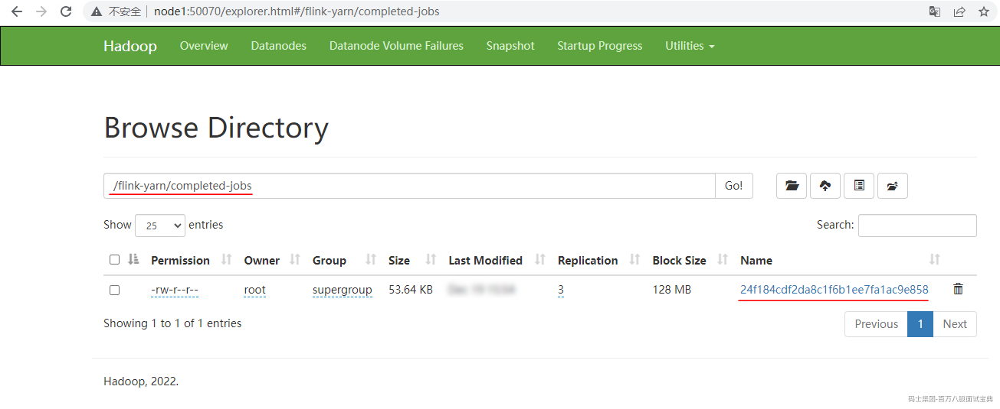

登录Flink历史日志服务器查看取消任务统计信息：

*(⚠️ 图片缺失:源知识库原图已失效)*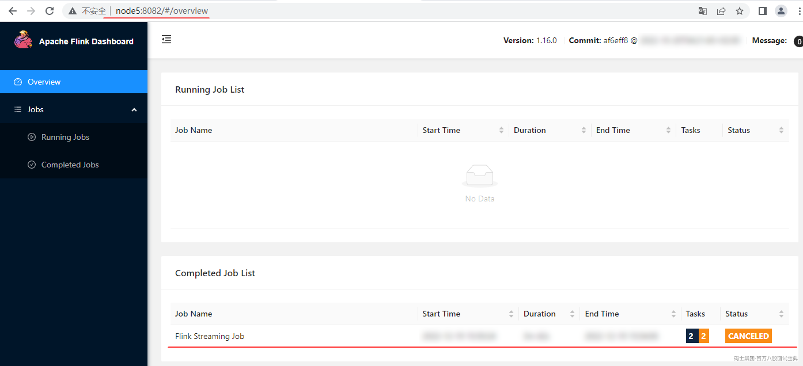

注意：在取消任务或者停止Flink集群后，需要等待一小段时间才能在Flink历史日志服务器中查看到对应的取消任务。

## 3.5Flink本地模式开启WebUI

在工作中我们一般使用IntelliJ IDEA开发工具进行代码开发，为了能方便快速的调试Flink和了解Flink程序的运行情况，我们希望本地开发工具中运行Flink时能查看到WebUI，这就可以在编写Flink程序时开启本地WebUI。

想要查看Flink本地WebUI需要经过以下步骤实现：

1. **在**Flink **项目中添加本地模式** WebUI**的依赖**

在Flink1.15版本之前根据使用Scala版本在Java Flink项目或Scala Flink项目中添加对应Scala版本的依赖。

```plain
<dependency>
  <groupId>org.apache.flink</groupId>

  <artifactId>flink-runtime-web_${scala.binary.version}</artifactId>

  <version>${flink.version}</version>

</dependency>

```

在Flink1.15版本之后，无论是Java Flink项目还是Scala Flink项目，添加如下依赖，不需额外依赖Scala版本。

```plain
<dependency>
  <groupId>org.apache.flink</groupId>

  <artifactId>flink-runtime-web</artifactId>

  <version>${flink.version}</version>

</dependency>

```

2. **在代码中启用本地**WebUI

Flink Java 代码启动本地WebUI：

```plain
Configuration conf = new Configuration();
//设置WebUI绑定的本地端口
conf.setString(RestOptions.BIND_PORT,"8081");
//使用配置
StreamExecutionEnvironment env = StreamExecutionEnvironment.createLocalEnvironmentWithWebUI(conf);
```

Flink Scala 代码启动本地WebUI：

```plain
val configuration = new Configuration()
//设置WebUI绑定的本地端口
configuration.set(RestOptions.BIND_PORT,"8081")
//使用配置
val env: StreamExecutionEnvironment = StreamExecutionEnvironment.createLocalEnvironmentWithWebUI(configuration)
```

3. **编写完整代码启动并访问**WebUI

Java 代码示例：

```plain
//1.使用本地模式
Configuration conf = new Configuration();
//设置WebUI绑定的本地端口
conf.setString(RestOptions.BIND_PORT,"8081");
//使用配置
StreamExecutionEnvironment env = StreamExecutionEnvironment.createLocalEnvironmentWithWebUI(conf);

//2.读取Socket数据
DataStreamSource<String> ds = env.socketTextStream("node5", 9999);

//3.准备K,V格式数据
SingleOutputStreamOperator<Tuple2<String, Integer>> tupleDS = ds.flatMap((String line, Collector<Tuple2<String, Integer>> out) -> {
    String[] words = line.split(",");
    for (String word : words) {
        out.collect(Tuple2.of(word, 1));
    }
}).returns(Types.TUPLE(Types.STRING, Types.INT));

//4.聚合打印结果
tupleDS.keyBy(tp -> tp.f0).sum(1).print();

//5.execute触发执行
env.execute();
```

Scala代码示例：

```plain
//1.创建本地WebUI环境
val configuration = new Configuration()
//设置绑定的本地端口
configuration.set(RestOptions.BIND_PORT,"8081")
//第一种设置方式
val env: StreamExecutionEnvironment = StreamExecutionEnvironment.createLocalEnvironmentWithWebUI(configuration)

//2.Scala 流处理导入隐式转换，使用Scala API 时需要隐式转换来推断函数操作后的类型
import org.apache.flink.streaming.api.scala._

//3.读取Socket数据
val linesDS: DataStream[String] = env.socketTextStream("node5", 9999)

//4.进行WordCount统计
linesDS.flatMap(line=>{line.split(",")})
  .map((_,1))
  .keyBy(_._1)
  .sum(1)
  .print()

//5.最后使用execute 方法触发执行
env.execute()
```

以上代码启动任意一个都可以通过访问：[http://localhost:8081](http://localhost:8081/)来查看WebUI。

*(⚠️ 图片缺失:源知识库原图已失效)*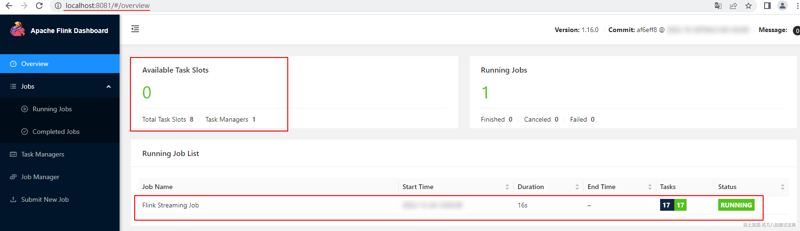

注意：启动代码之前在node5首选启动Socket服务，然后再启动代码。在导入flink-runtime-web依赖之后最好重启开发工具，重新加载对应的依赖包，否则可能执行代码之后访问本地WebUI时出现"{"errors":["Not found: /"]}"错误，访问不到WebUI情况。
