# 4第四章Flink任务提交与架构模型

## 4.1Flink 任务提交模式

Flink分布式计算框架可以基于多种模式部署，每种部署模式下提交任务都有相应的资源管理方式，例如：Flink可以基于Standalone部署模式、基于Yarn部署模式、基于Kubernetes部署模式运行任务，以上不同的集群部署模式下提交Flink任务会涉及申请资源、各角色交互过程，不同模式申请资源涉及到的角色对象大体相同，下面我们以Flink运行时架构流程为例来总体了解下Flink任务提交后涉及到对象交互流程，以便后续学习不同任务提交模式下任务提交流程。

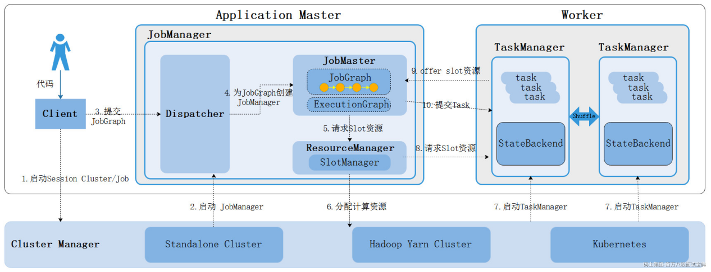  
*(⚠️ 图片缺失:源知识库原图已失效)*

上图是Flink运行时架构流程，涉及集群启动、任务提交、资源申请分配整个流程，大体步骤如下：

1. 启动Flink集群首先会启动JobManager，Standalone集群模式下同时启动TaskManager，该模式资源也就固定；其他集群部署模式会根据提交任务来动态启动TaskManager；

2. 当在客户端提交任务后，客户端会将任务转换成JobGraph提交给JobManager；

3. JobManager首先启动Dispatcher用于分发作业，运行Flink WebUI提供作业执行信息；

4. Dispatcher启动后会启动JobMaster并将JobGraph提交给JobMaster，JobMaster会将JobGraph转换成可执行的ExecutionGraph。

5. JobMaster向对应的资源管理器ResourceManager为当前任务申请Slot资源；

6. 在Standalone资源管理器中会直接找到启动的TaskManager来申请Slot资源，如果资源不足，那么任务执行失败；

7. 其他资源管理器会启动新的TaskManager，新启动的TaskManager会向ResourceManager进行注册资源，然后ResourceManager再向TaskManager申请Slot资源，如果资源不足会启动新的TaskManager来满足资源；

8. TaskManager为对应的JobMaster offer Slot资源；

9. JobMaster将要执行的task发送到对应的TaskManager上执行，TaskManager之间可以进行数据交换。

以上就是Flink任务提交的整体流程信息，在Flink中任务提交还有多种模式，不同的Flink集群部署模式支持的任务提交模式不同，对应的任务执行流程略有不同，向Flink集群中提交任务有三种任务部署模式，分别如下：

- **会话模式** **- Session Mode**

- **单作业模式** **- Per-Job Mode(****过时****)**

- **应用模式** - **Application Mode**

以上三种任务提交模式的主要区别在于Flink集群的生命周期不同、资源的分配方式不同以及Flink 应用程序的main方法执行位置（Client客户端/JobManager）不同。下面分别进行介绍。

### 4.1.1会话模式（Session Mode）

Session模式下我们首先会启动一个集群，保持一个会话，这个会话中通过客户端提交作业，集群启动时所有的资源都已经确定，所以所有的提交的作业会竞争集群中的资源。这种模式适合单个作业规模小、执行时间短的大量作业。

*(⚠️ 图片缺失:源知识库原图已失效)*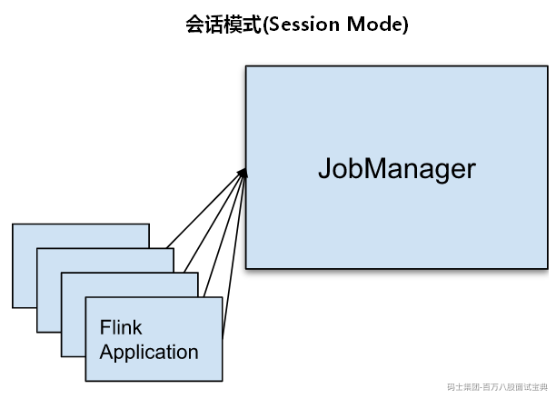

优势：只需要一个集群，所有作业提交之后都运行在这一个集群中，所有任务共享集群资源，每个任务执行完成后就释放资源。

缺点：因为集群资源是共享的，所以资源不够了，提交新的作业就会失败，如果一个作业发生故障导致TaskManager宕机，那么所有的作业都会受到影响。

### 4.1.2单作业模式（Per-Job Mode）

为了更好的隔离资源，Per-job模式是每提交一个作业会启动一个集群，集群只为这个作业而生，这种模式下客户端运行应用程序，然后启动集群，作业被提交给JobManager，进而分发给TaskManager执行，作业执行完成之后集群就会关闭，所有资源也会释放。

*(⚠️ 图片缺失:源知识库原图已失效)*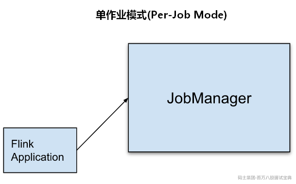

优势：这种模式下每个作业都有自己的JobManager管理，独享当下这个集群的资源，就算作业发生故障，对应的TaskManager宕机也不影响其他作业。如果一个Application有多个job组成，那么每个job都有自己独立的集群。

缺点：每个作业都在客户端向集群JobManager提交，如果一个时间点大量提交Flink作业会造成客户端占用大量的网络带宽，会加重客户端所在节点的资源消耗。

注意：Per-Job 模式目前只有yarn支持，Per-job模式在Flink1.15中已经被弃用，后续版本可能会完全剔除，替代的是Application模式，主要原因就是Application模式把main方法的初始化放到了集群组件的JobManager中，这样对于客户端来说从性能上有很大优化。

### 4.1.3应用模式（Application Mode）

Session 模式和Pre-Job模式都是在客户端将作业提交给JobManager，这种方式需要占用大量的网络带宽下载依赖关系并将二进制包发送给JobManager,此外，我们往往提交多个Flink 作业都是在同一个客户端节点，这样更加剧了客户端所在节点的资源消耗，为了降低客户端这种资源消耗，我们可以使用Application Mode。

Application模式与Per-job类似，只是不需要客户端，每个Application提交之后就会启动一个JobManager，也就是创建一个集群，这个JobManager只为执行这一个Flink Application而存在，Application中的多个job都会共用该集群，Application执行结束之后JobManager也就关闭了。这种模式下一个Application会动态创建自己的专属集群（JobManager）,所有任务共享该集群,不同Application之间是完全隔离的，在生产环境中建议使用Application模式提交任务。

*(⚠️ 图片缺失:源知识库原图已失效)*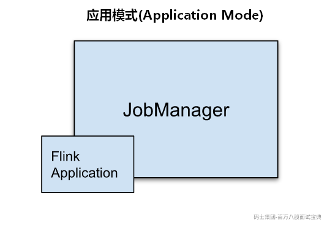

以上三种Flink任务部署方式生产环境中优先选择Application模式，三者区别总结如下：

1. Session 模式是先有Flink集群后再提交任务，任务在客户端提交运行，提交的多个作业共享Flink集群；

2. Per-Job模式和Application模式都是提交Flink任务后创建集群；

3. Per-Job模式通过客户端提交Flink任务，每个Flink任务对应一个Flink集群，每个任务有很好的资源隔离性；

4. Application模式是在JobManager上执行main方法，为每个Flink的Application创建一个Flink集群，如果该Application有多个任务，这些Flink任务共享一个集群。

Flink不同的集群部署模式支持不同的任务提交方式，后续小结重点介绍Standalone资源管理和Yarn资源管理任务提交模式的支持。

## 4.2Flink On Standalone任务提交

Flink On Standalone 即Flink任务运行在Standalone集群中，Standlone集群部署时采用Session模式来构建集群，即：首先构建一个Flink集群，Flink集群资源就固定了，所有提交到该集群的Flink作业都运行在这一个集群中，如果集群中提交的任务多资源不够时，需要手动增加节点，所以Flink 基于Standalone运行任务一般用在开发测试或者企业实时业务较少的场景下。

Flink On Standalone 任务提交支持Session会话模式和Application应用模式，不支持Per-Job单作业模式。下面介绍基于Standalone 的Session会话模式和Application应用模式任务提交命令和原理，演示两类任务提交模式的代码还是以上一章节中读取Socket 数据进行实时WordCount统计代码为例，代码如下：

```plain
/**
 * 读取Socket数据进行实时WordCount统计
 */
public class SocketWordCount {
    public static void main(String[] args) throws Exception {
        //1.准备环境
        StreamExecutionEnvironment env = StreamExecutionEnvironment.getExecutionEnvironment();
        //2.读取Socket数据
        DataStreamSource<String> ds = env.socketTextStream("node5", 9999);
        //3.准备K,V格式数据
        SingleOutputStreamOperator<Tuple2<String, Integer>> tupleDS = ds.flatMap((String line, Collector<Tuple2<String, Integer>> out) -> {
            String[] words = line.split(",");
            for (String word : words) {
                out.collect(Tuple2.of(word, 1));
            }
        }).returns(Types.TUPLE(Types.STRING, Types.INT));

        //4.聚合打印结果
        tupleDS.keyBy(tp -> tp.f0).sum(1).print();

        //5.execute触发执行
        env.execute();
    }
}
```

将以上代码进行打包，名称为"FlinkJavaCode-1.0-SNAPSHOT-jar-with-dependencies.jar"，并在node5节点上启动socket服务(nc -lk 9999)。

### 4.2.1Standalone Session模式

#### 4.2.1.1任务提交命令

在第三章3.1.3.3小节中Standalone集群搭建完成后，基于Standalone集群提交Flink任务方式就是使用的Session模式，提交任务之前首先启动Standalone集群($FLINK\_HOME/bin/start-cluster.sh)，然后再提交任务，Standalone Session模式提交任务命令如下：

```plain
[root@node4 ~]# cd /software/flink-1.16.0/bin/
[root@node4 bin]# ./flink run -m node1:8081 -d -c com.mashibing.flinkjava.code.chapter3.SocketWordCount /root/FlinkJavaCode-1.0-SNAPSHOT-jar-with-dependencies.jar
```

以上提交任务的参数解释如下：

|  |  |
| --- | --- |
| **参数** | **解释** |
| -m | --jobmanager,指定提交任务连接的JobManager地址。 |
| -c | --class,指定运行的class主类。 |
| -d | --detached，任务提交后在后台独立运行，退出客户端，也可不指定。 |
| -p | --parallelism,执行程序的并行度。 |

以上任务提交完成后，我们可以登录Flink WebUI（<https://node1:8081）查看启动一个任务>:

*(⚠️ 图片缺失:源知识库原图已失效)*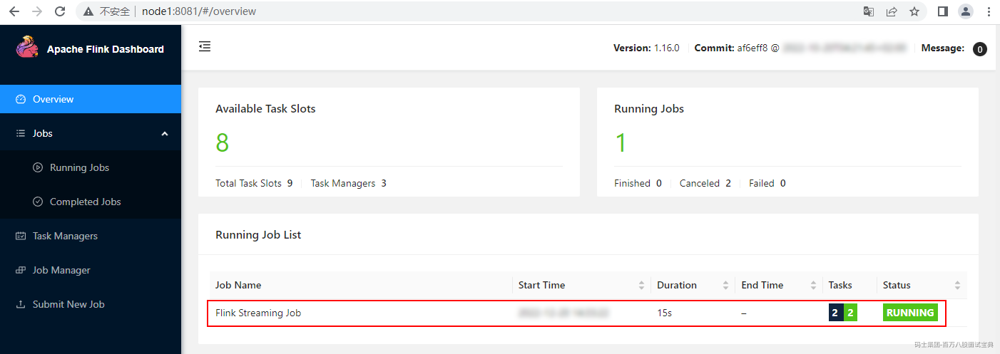

再次按照以上命令提交Flink任务可以看到集群中会有2个任务，说明Standalone Session模式下提交的所有Flink任务共享集群资源，如下：

*(⚠️ 图片缺失:源知识库原图已失效)*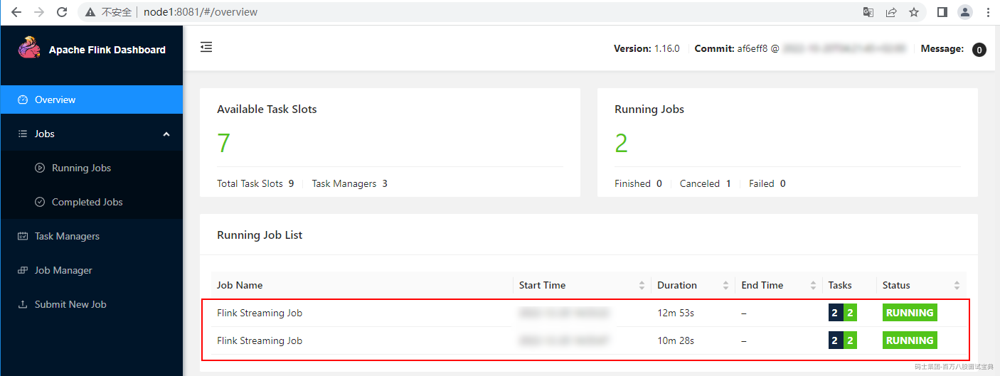

以上提交Flink流任务的名称默认为"Flink Streaming Job"，也可以通过参数"pipeline.name"来自定义指定Job 名称，提交命令如下：

```plain
[root@node4 bin]# ./flink run -m node1:8081 -d -Dpipeline.name=socket-wc -c com.mashibing.flinkjava.code.chapter3.SocketWordCount /root/FlinkJavaCode-1.0-SNAPSHOT-jar-with-dependencies.jar
```

提交之后，可以看到页面中有三个任务，最后一个任务提交的名称改成了自定义任务名称。

*(⚠️ 图片缺失:源知识库原图已失效)*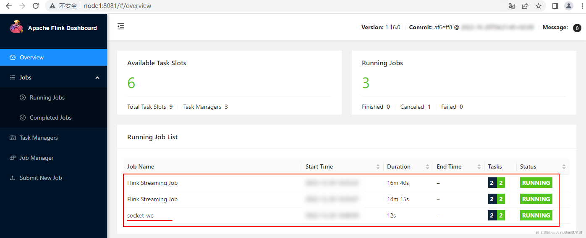

#### 4.2.1.2任务提交流程

Standalone Session模式提交任务中首先需要创建Flink集群，集群创建启动的同时Dispatcher、JobMaster、ResourceManager对象一并创建、TaskManager也一并启动，TaskManager会向集群ResourceManager汇报Slot信息，Flink集群资源也就确定了。Standalone Session模式提交任务流程如下：

*(⚠️ 图片缺失:源知识库原图已失效)*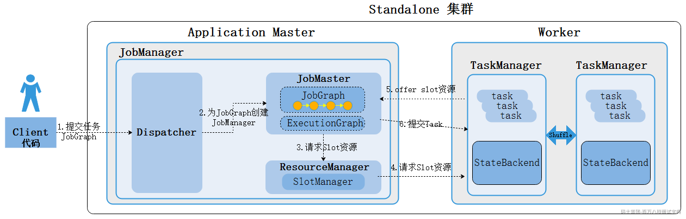

1. 在客户端提交Flink任务，客户端会将任务转换成JobGraph提交给JobManager。

2. Dispatcher将提交任务提交给JobMaster。

3. JobMaster向ResourceManager申请Slot资源。

4. ResourceManager会在对应的TaskManager上划分Slot资源。

5. TaskManager向JobMaster offer Slot资源。

6. JobMaster将任务对应的task发送到TaskManager上执行。

### 4.2.2Standalone Application模式

#### 4.2.2.1任务提交命令

Standalone Application模式中不会预先创建Flink集群，在提交Flink 任务的同时会创建JobManager，启动Flink集群,然后需要手动启动TaskManager连接该Flink集群，启动的TaskManager会根据$FLINK\_HOME/conf/flink-conf.yaml配置文件中的"jobmanager.rpc.address"配置找JobManager，所以这里选择在node1节点上提交任务并启动JobManager，方便后续其他节点启动TaskManager后连接该节点。Standalone Appliction模式提交任务步骤和命令如下：

1. **准备**Flink jar**包**

在node1节点上将Flink 打好的"FlinkJavaCode-1.0-SNAPSHOT-jar-with-dependencies.jar"jar包放在 $FLINK\_HOME/lib目录下。

2. **提交任务，在**node1 **节点上启动** JobManager

```plain
[root@node1 ~]# cd /software/flink-1.16.0/bin/

#执行如下命令，启动JobManager
[root@node1 bin]# ./standalone-job.sh start --job-classname com.mashibing.flinkjava.code.chapter3.SocketWordCount
```

执行以上命令后会自动从$FLINK\_HOME/lib中扫描所有jar包，执行指定的入口类。命令执行后可以访问对应的Flink WebUI:<https://node1:8081，可以看到提交的任务，但是由于还没有执行TaskManager任务无法执行。>

*(⚠️ 图片缺失:源知识库原图已失效)*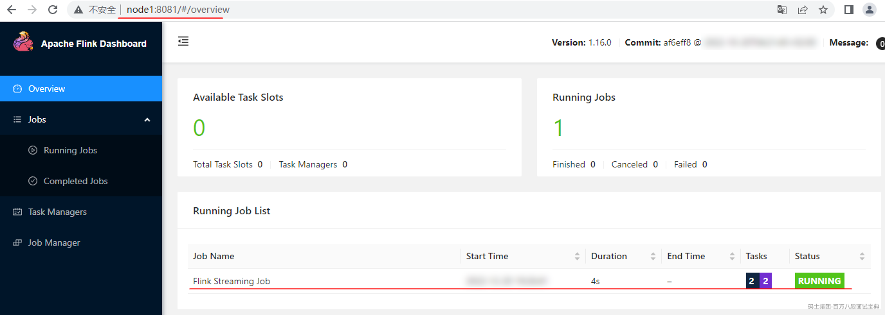

3. **启动**TaskManager

在node1、node2、node3任意一台节点上启动taskManager，根据$FLINK\_HOME/conf/flink-conf.yaml配置文件中"jobmanager.rpc.address"配置项会找到对应node1 JobManager。

```plain
#在node1节点上启动TaskManager
[root@node1 ~]# cd /software/flink-1.16.0/bin/
[root@node1 bin]# ./taskmanager.sh start

#在node2节点上启动TaskManager
[root@node2 ~]# cd /software/flink-1.16.0/bin/
[root@node2 bin]# ./taskmanager.sh start
```

启动两个TaskManager后可以看到Flink WebUI中对应的有2个TaskManager，可以根据自己任务使用资源的情况，手动启动多个TaskManager。

*(⚠️ 图片缺失:源知识库原图已失效)*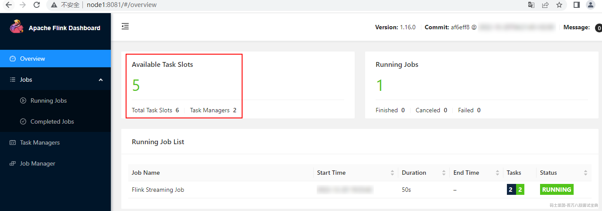

4. **停止集群**

```plain
#停止启动的JobManager
[root@node1 bin]# ./standalone-job.sh stop

#停止启动的TaskManager
[root@node1 bin]# ./taskmanager.sh stop
[root@node2 bin]# ./taskmanager.sh stop
```

我们可以以同样的方式在其他节点上以Standalone Application模式提交先的Flink任务，但是每次提交都是当前提交任务独享集群资源。

#### 4.2.2.2任务提交流程

Standalone Application模式提交任务中提交任务的同时会启动JobManager创建Flink集群，但是需要手动启动TaskManager，这样提交的任务才能正常运行，如果提交的任务使用资源多，还可以启动多个TaskManager。Standalone Application模式提交任务流程如下：

*(⚠️ 图片缺失:源知识库原图已失效)*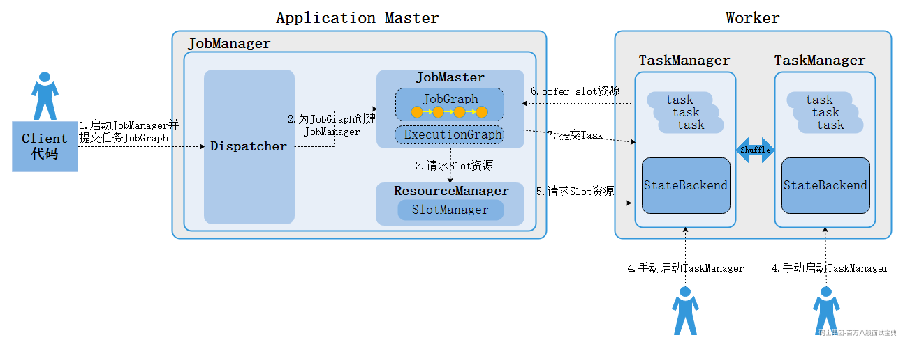

1. 在客户端提交Flink任务的同时启动JobManager，客户端会将任务转换成JobGraph提交给JobManager。

2. Dispatcher会启动JobMaster，Dispatcher将提交任务提交给JobMaster。

3. JobMaster向ResourceManager申请Slot资源。

4. 手动启动TaskManager，TaskManager会向ResourceManager注册Slot资源

5. ResourceManager会在对应的TaskManager上划分Slot资源。

6. TaskManager向JobMaster offer Slot资源。

7. JobMaster将任务对应的task发送到TaskManager上执行。

Standalone Application模式任务提交流程和Standalone Session模式类似，两者区别主要是Standalone Session模式中启动Flink集群时JobManager、TaskManager、JobMaster会预先启动；Standalone Application模式中提交任务时同时启动集群JobManager、JobMaster，需要手动启动TaskManager。

## 4.3Flink On Yarn任务提交

### 4.3.1Flink On Yarn运行原理

Flink On Yarn即Flink任务运行在Yarn集群中，Flink On Yarn的内部实现原理如下图：

*(⚠️ 图片缺失:源知识库原图已失效)*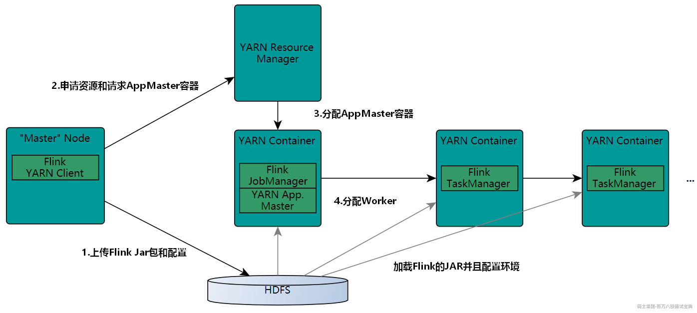

1. 当启动一个新的Flink YARN Client会话时，客户端首先会检查所请求的资源（容器和内存）是否可用，之后，它会上传Flink配置和JAR文件到HDFS。

2. 客户端的下一步是向ResourceManager请求一个YARN容器启动ApplicationMaster。JobManager和ApplicationMaster(AM)运行在同一个容器中，一旦它们成功地启动了，AM就能够知道JobManager的地址，它会为TaskManager生成一个新的Flink配置文件（这样它才能连上JobManager），该文件也同样会被上传到HDFS。另外，AM容器还提供了Flink的Web界面服务。Flink用来提供服务的端口是由用户和应用程序ID作为偏移配置的，这使得用户能够并行执行多个YARN会话。

3. 之后，AM开始为Flink的TaskManager分配容器（Container），从HDFS下载JAR文件和修改过的配置文件，一旦这些步骤完成了，Flink就可以基于Yarn运行任务了。

Flink On Yarn任务提交支持Session会话模式、Per-Job单作业模式、Application应用模式。下面分别介绍这三种模式的任务提交命令和原理。

### 4.3.2代码及Yarn环境准备

#### 4.3.2.1准备代码

为了能演示出不同模式的效果，这里我们编写准备Flink代码形成一个Flink Application，该代码中包含有2个job。Flink允许在一个main方法中提交多个job任务，多Job执行的顺序不受部署模式影响，但受启动Job的调用影响，每次调用execute()或者executeAsyc()方法都会触发job执行，我们可以在一个Flink Application中执行多次execute()或者executeAsyc()方法来触发多个job执行，两者区别如下：

- **execute()**：该方法为阻塞方法，当一个Flink Application中执行多次execute()方法触发多个job时，下一个job的执行会被推迟到该job执行完成后再执行。

- **executeAsyc()**：该方法为非阻塞方法，一旦调用该方法触发job后，后续还有job也会立即提交执行。

当一个Flink Application中有多个job时，这些job之间没有直接通信的机制，所以建议编写Flink代码时一个Application中包含一个job即可，目前只有非HA的Application模式可以支持多job运行。后续打包运行包含多个job的Flink代码如下：

```plain
//1.准备环境
StreamExecutionEnvironment env = StreamExecutionEnvironment.getExecutionEnvironment();
//2.读取Socket数据 ,获取ds1和ds2
DataStreamSource<String> ds1 = env.socketTextStream("node5", 8888);
DataStreamSource<String> ds2 = env.socketTextStream("node5", 9999);

//3.1 对ds1 直接输出原始数据
SingleOutputStreamOperator<Tuple2<String, Integer>> transDs1 = ds1.flatMap((String line, Collector<Tuple2<String, Integer>> out) -> {
    String[] words = line.split(",");
    for (String word : words) {
        out.collect(Tuple2.of(word, 1));
    }
}).returns(Types.TUPLE(Types.STRING, Types.INT));
transDs1.print();
env.executeAsync("first job");

//3.2 对ds2准备K,V格式数据 ,统计实时WordCount
SingleOutputStreamOperator<Tuple2<String, Integer>> tupleDS = ds2.flatMap((String line, Collector<Tuple2<String, Integer>> out) -> {
    String[] words = line.split(",");
    for (String word : words) {
        out.collect(Tuple2.of(word, 1));
    }
}).returns(Types.TUPLE(Types.STRING, Types.INT));
tupleDS.keyBy(tp -> tp.f0).sum(1).print();

//5.execute触发执行
env.execute("second job");
```

将以上代码进行打包，名称为"FlinkJavaCode-1.0-SNAPSHOT-jar-with-dependencies.jar"，并在node5节点上启动多个socket服务

```plain
[root@node5 ~]# nc -lk 8888
[root@node5 ~]# nc -lk 9999
```

#### 4.3.2.2yarn 环境准备

在Per-Job模式中，Flink每个job任务都会启动一个对应的Flink集群，基于Yarn提交后会在Yarn中同时运行多个实时Flink任务，在HDFS中$HADOOP\_HOME/etc/hadoop/capacity-scheduler.xml中有"yarn.scheduler.capacity.maximum-am-resource-percent"配置项，该项默认值为0.1，表示Yarn集群中运行的所有ApplicationMaster的资源比例上限，默认0.1表示10%，这个参数变相控制了处于活动状态的Application个数，所以这里我们修改该值为0.5，否则后续在Yarn中运行多个Flink Application时只有一个Application处于活动运行状态，其他处于Accepted状态。

所有HDFS节点配置$HADOOP\_HOME/etc/hadoop/capacity-scheduler.xml文件，修改如下配置项为0.5:

```plain
<property>
    <name>yarn.scheduler.capacity.maximum-am-resource-percent</name>

    <value>0.5</value>

    <description>
      Maximum percent of resources in the cluster which can be used to run application masters i.e. controls number of concurrent running applications.
    </description>

  </property>

```

至此，Flink On Yarn运行环境准备完毕。

### 4.3.3Yarn Session模式

#### 4.3.3.1任务提交命令

Yarn Session模式首先需要在Yarn中初始化一个Flink集群（称为Flink Yarn Session 集群），开辟指定的资源，以后的Flink任务都提交到这里。这个Flink集群会常驻在YARN集群中，除非手工停止（yarn application -kill id），当手动停止yarn application对应的id时，运行在当前application上的所有flink任务都会被kill。这种方式创建的Flink集群会独占资源，不管有没有Flink任务在执行，YARN上面的其他任务都无法使用这些资源。

1. **启动**Yarn Session **集群**

启动Yarn Session 集群前首先保证HDFS和Yarn正常启动，这里在node5节点上来使用名称创建Yarn Session集群，命令如下：

```plain
[root@node5 ~]# cd /software/flink-1.16.0/bin/

#启动Yarn Session集群，名称为msbjy，每个TM有3个slot
[root@node5 bin]# ./yarn-session.sh -s 3 -nm msbjy -d
```

以上启动Yarn Session集群命令的参数解释如下：

|  |  |
| --- | --- |
| **参数** | **解释** |
| -d | --detached，Yarn Session集群启动后在后台独立运行，退出客户端，也可不指定，则客户端不退出。 |
| -nm | --name，自定义在YARN上运行Application应用的名字。 |
| -jm | --jobManagerMemory，指定JobManager所需内存，单位MB。 |
| -tm | --taskManagerMemory,指定每个TaskManager所需的内存，单位MB。 |
| -s | --slots,指定每个TaskManager上Slot的个数。 |
| -id | --applicationId，指定YARN集群上的任务ID，附着到一个后台独立运行的yarn session中。 |
| -qu | --queue,指定Yarn的资源队列。 |

以上命令执行完成后，可以在Yarn WebUI(<https://node1:8088)中看到启动的Flink> Yarn Session集群：

*(⚠️ 图片缺失:源知识库原图已失效)*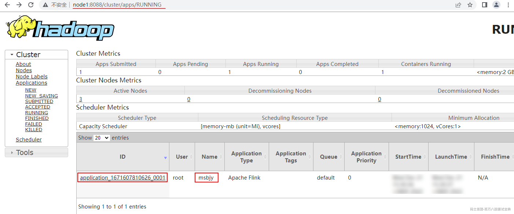

点击Tracking UI"ApplicationMaster"可以跳转到Flink Yarn Session集群 WebUI页面中：

*(⚠️ 图片缺失:源知识库原图已失效)*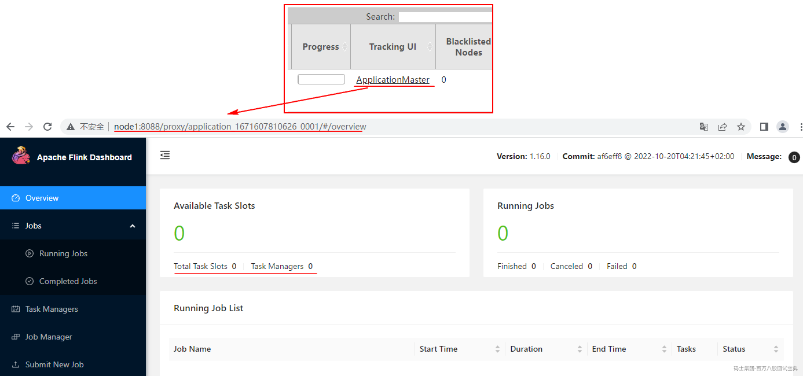

目前在Yarn Session集群WebUI中看不到启动的TaskManager ，这是因为Yarn会按照提交任务的需求动态分配TaskManager数量，所以Flink 基于Yarn Session运行任务资源是动态分配的。

此外，创建出Yarn Session集群后会在node5节点/tmp/下创建一个隐藏的".yarn-properties-<用户名>" Yarn属性文件,有了该文件后，在当前节点提交Flink任务时会自动发现Yarn Session集群并进行任务提交。

2. **向**Yarn Session**集群中提交作业**

我们可以基于WebUI进行Flink任务提交，也可以使用命令方式提交Flink任务，基于WebUI方式提交任务这种方式比较简单，下面演示命令方式提交Flink任务。

在node5客户端中执行提交任务的命令：

```plain
[root@node5 ~]# cd /software/flink-1.16.0/bin/

#执行如下命令，会根据.yarn-properties-<用户名>文件，自动发现yarn session 集群
[root@node5 bin]# ./flink run -c com.mashibing.flinkjava.code.chapter3.FlinkAppWithMultiJob /root/FlinkJavaCode-1.0-SNAPSHOT-jar-with-dependencies.jar 

#也可以使用如下命令指定Yarn Session集群提交任务，-t 指定运行的模式
[root@node5 bin]# ./flink run -t yarn-session -Dyarn.application.id=application_1671607810626_0001 -c com.mashibing.flinkjava.code.chapter3.FlinkAppWithMultiJob /root/FlinkJavaCode-1.0-SNAPSHOT-jar-with-dependencies.jar
```

以上命令执行之后，可以查看对应的Yarn Session 对应的Flink集群，可以看到启动了2个Flink Job任务、启动1个TaskManager，分配了3个Slot。

*(⚠️ 图片缺失:源知识库原图已失效)*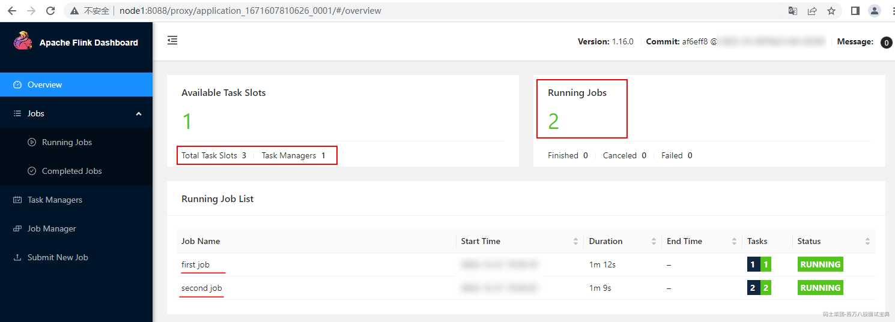

3. **任务资源测试**

按照以上方式继续提交一次Flink Application，可以看到会申请新的TaskManager：

*(⚠️ 图片缺失:源知识库原图已失效)*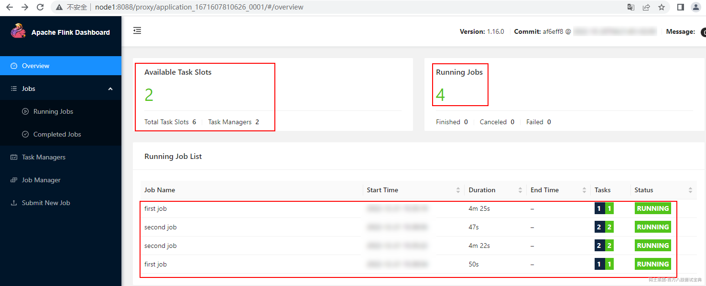

查看集群中任务列表并取消各个任务，命令如下：

```plain
#查看Yarn Session集群中任务列表 后面跟上Yarn Application ID
[root@node5 bin]# ./flink list
------------------ Running/Restarting Jobs -------------------
87f6f9a45fd9a9533e93a94dff455b66 : first job (RUNNING)
0d5cd72d8f59ed0eb51d2d64124d4859 : second job (RUNNING)
cff599a2d43a33195702ca7e7512feb4 : first job (RUNNING)
6498d664a8e141ed7503046c5fb9fa9a : second job (RUNNING)
--------------------------------------------------------------

#取消任务命令，也可以在WebUI中“cancel”取消任务
[root@node5 bin]# ./flink cancel 87f6f9a45fd9a9533e93a94dff455b66 
[root@node5 bin]# ./flink cancel 0d5cd72d8f59ed0eb51d2d64124d4859 
[root@node5 bin]# ./flink cancel cff599a2d43a33195702ca7e7512feb4 
[root@node5 bin]# ./flink cancel 6498d664a8e141ed7503046c5fb9fa9a
```

当任务取消后，等待30s后(resourcemanager.taskmanager-timeout=30000ms)可以看到TaskManager数量为0，说明Flink基于Yarn Session模式提交任务会动态进行资源分配。

*(⚠️ 图片缺失:源知识库原图已失效)*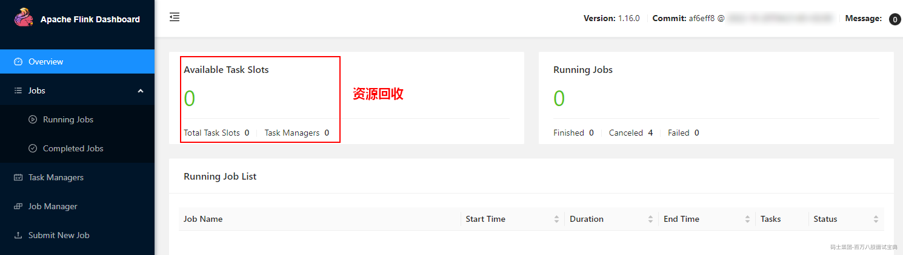

4. **集群停止**

停止Yarn Session集群可以在Yarn WebUI中找到对应的ApplicationId，执行如下命令关闭任务即可。

```plain
[root@node5 bin]# yarn application -kill application_1671607810626_0001
```

#### 4.3.3.2任务提交流程

Yarn Session 模式下提交任务首先创建Yarn Session 集群，创建该集群实际上就是启动了JobManager，启动JobManager同时会启动Dispatcher和ResourceManager，当客户端提交任务时，才会启动JobMaster以及根据提交的任务需求资源情况来动态分配启动TaskManager。

Yarn Session模式下提交任务流程如下：

*(⚠️ 图片缺失:源知识库原图已失效)*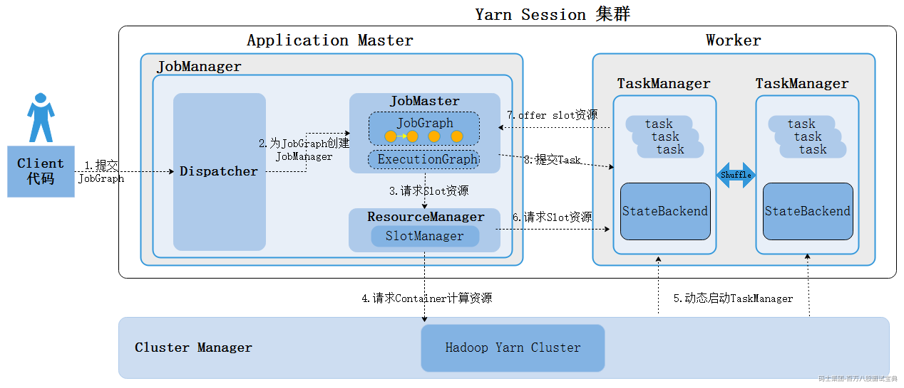

1. 客户端向Yarn Session集群提交任务，客户端会将任务转换成JobGraph提交给JobManager。

2. Dispatcher启动JobMaster并将JobGraph提交给JobMaster。

3. JobMaster向ResourceManager请求Slot资源。

4. ResourceManager向Yarn的资源管理器请求Container计算资源。

5. Yarn动态启动TaskManager，启动的TaskManager会注册给Resourcemanager

6. ResourceManager会在对应的TaskManager上划分Slot资源。

7. TaskManager向JobMaster offer Slot资源。

8. JobMaster将任务对应的task发送到TaskManager上执行。

### 4.3.4Yarn Per-Job模式

Per-Job 模式目前只有yarn支持，Per-job模式在Flink1.15中已经被弃用，后续版本可能会完全剔除。Per-Job模式就是直接由客户端向Yarn中提交Flink作业，每个作业形成一个单独的Flink集群。

#### 4.3.4.1任务提交命令

Flink On Yarn Per-Job模式提交命令如下：

```plain
[root@node5 bin]# ./flink run -t yarn-per-job -d -c com.mashibing.flinkjava.code.chapter3.FlinkAppWithMultiJob /root/FlinkJavaCode-1.0-SNAPSHOT-jar-with-dependencies.jar
```

以上提交任务命令的参数解释如下：

|  |  |
| --- | --- |
| **参数** | **解释** |
| -t | --target，指定运行模式，可以跟在flink run 命令后，可以指定"remote", "local", "kubernetes-session", "yarn-per-job"(deprecated), "yarn-session";也可以跟在 flink run-application 命令后，可以指定"kubernetes-application", "yarn-application"。 |
| -c | --class,指定运行的class主类。 |
| -d | --detached，任务提交后在后台独立运行，退出客户端，也可不指定。 |
| -p | --parallelism，执行应用程序的并行度。 |

以上命令提交后，我们可以通过Yarn WebUI看到有2个Application 启动，对应2个Flink的集群，进入对应的Flink集群WebUI可以看到运行提交的Flink Application中的不同Job任务：

*(⚠️ 图片缺失:源知识库原图已失效)*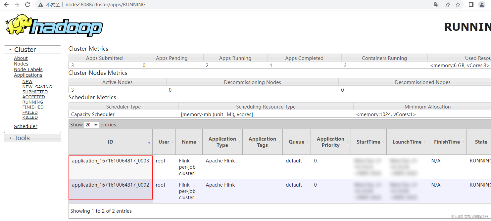

*(⚠️ 图片缺失:源知识库原图已失效)*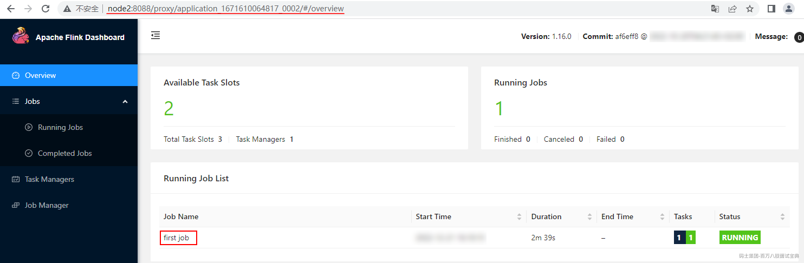

*(⚠️ 图片缺失:源知识库原图已失效)*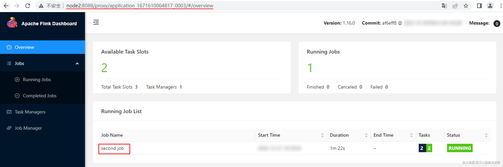

这说明Per-Job模式针对每个Flink Job会启动一个Flink集群。

注意：在基于Yarn Per-Job模式提交任务后，会打印以下错误：

*(⚠️ 图片缺失:源知识库原图已失效)*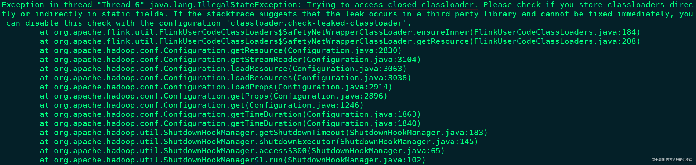

该异常是Hadoop3与Flink整合的bug（<https://issues.apache.org/jira/browse/FLINK-19916），不会影响Flink任务基于Yarn提交。错误的原因是Hadoop3启动异步线程来执行一些shutdown钩子，当任务提交后对应的类加载器被释放，这些钩子在作业执行之后执行仍然持有释放的类加载器，因此抛出异常。>

取消任务可以使用yarn application -kill ApplicationId也可以执行如下命令：

```plain
#取消任务命令执行后对应的 Flink集群也会停止 ：flink cancel -t yarn-per-job -Dyarn.application.id=application_XXXX_YY <jobId>
[root@node5 bin]# ./flink cancel -t yarn-per-job -Dyarn.application.id=application_1671610064817_0002 805542d84c9944480196ef73911d1b59
[root@node5 bin]# ./flink cancel -t yarn-per-job -Dyarn.application.id=application_1671610064817_0003 56365ae67b8e93b1184d22fa567d7ddf
```

#### 4.3.4.2任务提交流程

Flink基于Yarn Per-Job 提交任务时，在提交Flink Job作业的同时启动JobManager并启动Flink的集群，根据提交任务所需资源的情况会动态申请启动TaskManager给当前提交的job任务提供资源。

Yarn Per-Job模式下提交任务流程如下：

*(⚠️ 图片缺失:源知识库原图已失效)*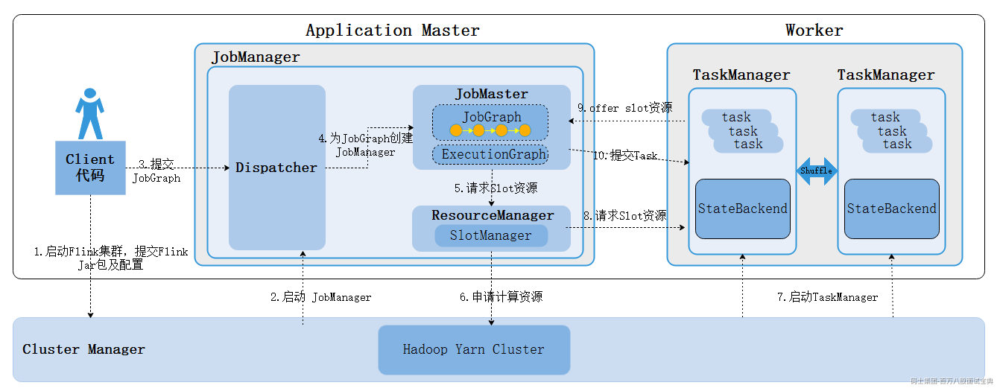

1. 客户端提交Flink任务，Flink会将jar包和配置上传HDFS并向Yarn请求Container启动JobManager

2. Yarn资源管理器分配Container资源，启动JobManager，并启动Dispatcher、ResourceManager对象。

3. 客户端会将任务转换成JobGraph提交给JobManager。

4. Dispatcher启动JobMaster并将JobGraph提交给JobMaster。

5. JobMaster向ResourceManager申请Slot资源。

6. ResourceManager会向Yarn请求Container计算资源

7. Yarn分配Container启动TaskManager，TaskManager启动后会向ResourceManager注册Slot

8. ResourceManager会在对应的TaskManager上划分Slot资源。

9. TaskManager向JobMaster offer Slot资源。

10. JobMaster将任务对应的task发送到TaskManager上执行。

Yarn Per-job模式在客户端提交任务，如果在客户端提交大量的Flink任务会对客户端节点性能又非常大的压力，所以在Flink1.15中已经被弃用，后续版本可能会完全剔除，使用Yarn Application模式来替代。

### 4.3.5Yarn Application模式

Yarn Application 与Per-Job 模式类似，只是提交任务不需要客户端进行提交，直接由JobManager来进行任务提交，每个Flink Application对应一个Flink集群，如果该Flink Application有多个job任务，所有job任务共享该集群资源，TaskManager也是根据提交的Application所需资源情况动态进行申请。

#### 4.3.5.1任务提交命令

Yarn Application模式提交任务命令如下：

```plain
#Yarn Application模式提交任务命令
[root@node5 bin]# ./flink run-application -t yarn-application -c com.mashibing.flinkjava.code.chapter3.FlinkAppWithMultiJob /root/FlinkJavaCode-1.0-SNAPSHOT-jar-with-dependencies.jar
```

以上参数解释同Per-Job模式，命令提交后，查看对应Yarn Application，进入到Flink Application的WebUI，可以看到2个Flink 任务共享该集群资源。

*(⚠️ 图片缺失:源知识库原图已失效)*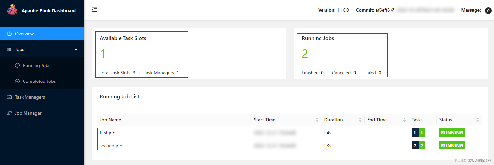

查看集群任务、取消集群任务及停止集群命令如下：

```plain
#查看Flink 集群中的Job作业：flink list -t yarn-application -Dyarn.application.id=application_XXXX_YY
[root@node5 bin]# flink list -t yarn-application -Dyarn.application.id=application_1671610064817_0004
------------------ Running/Restarting Jobs -------------------
108a7b91cf6b797d4b61a81156cd4863 : first job (RUNNING)
5adacb416f99852408224234d9027cc7 : second job (RUNNING)
--------------------------------------------------------------

#取消Flink集群中的Job作业：flink cancel -t yarn-application -Dyarn.application.id=application_XXXX_YY <jobId>
[root@node5 bin]# flink cancel -t yarn-application -Dyarn.application.id=application_1671610064817_0004 108a7b91cf6b797d4b61a81156cd4863

#停止集群，当取消Flink集群中所有任务后，Flink集群停止，也可以使用yarn application -kill ApplicationID 停止集群
[root@node5 bin]# yarn application -kill application_1671610064817_0004
```

#### 4.3.5.2任务提交流程

Flink Yarn Application模式提交任务与Per-Job模式任务提交非常类似，只是客户端不再提交一个个的Flink Job ,而是运行任务后，一次性将Application信息提交给JobManager，JobManager根据每个Flink Job作业由Dispatcher启动对应的JobMaster进行资源申请和任务提交。

## 4.4Flink HA

默认情况下，每个Flink集群只有一个JobManager，这将导致单点故障（SPOF，single point of failure），如果这个JobManager挂了，则不能提交新的任务，并且运行中的程序也会失败，这是我们可以对JobManager做高可用（High Availability，简称HA），JobManager HA集群当Active JobManager节点挂掉后可以切换其他Standby JobManager成为主节点，从而避免单点故障。用户可以在Standalone、Flink on Yarn、Flink on K8s集群模式下配置Flink集群HA,Flink on K8s集群模式下的HA将单独在K8s章节介绍。

### 4.4.1Flink基于Standalone HA

Standalone模式下，JobManager的高可用性的基本思想是，任何时候都有一个Alive JobManager和多个Standby JobManager。Standby JobManager可以在Alive JobManager挂掉的情况下接管集群成为Alive JobManager，这样避免了单点故障，一旦某一个Standby JobManager接管集群，程序就可以继续运行。Standby JobManagers和Alive JobManager实例之间没有明确区别，每个JobManager都可以成为Alive或Standby。

*(⚠️ 图片缺失:源知识库原图已失效)*

#### 4.4.1.1Standalone HA配置

Standalone集群部署下实现JobManager HA 需要依赖ZooKeeper和HDFS，Zookeeper负责协调JobManger失败后的自动切换，HDFS中存储每个Flink任务的执行流程数据，因此要有一个ZooKeeper集群和Hadoop集群。这里我们选择3台节点作为Flink的JobManger，如下：

|  |  |  |  |
| --- | --- | --- | --- |
| **节点IP** | **节点名称** | **JobManager** | **TaskManager** |
| 192.168.179.4 | node1 | ★ | ★ |
| 192.168.179.5 | node2 | ★ | ★ |
| 192.168.179.6 | node3 | ★ | ★ |

以上node1、node2、node3都是JobManager,同时只能有1个JobManager为Active主节点，其他为StandBy备用节点，配置JobManager HA 步骤如下：

1. **所有**Flink **节点配置** hadoop classpath

由于Flink JobManager HA 中需要连接HDFS存储job数据，所以Flink所有节点必须配置hadoop classpath 环境变量，在node1-3所有节点上配置/etc/profile配置环境变量：

```plain
#配置/etc/profile
export HADOOP_CLASSPATH=`hadoop classpath`

#执行生效
source /etc/profile
```

2. **配置**masters**文件**

需要在所有Flink集群节点上配置$FLINK\_HOME/conf/master文件，配置上所有的JobManager节点信息：

```plain
#node1,node2,node3节点上配置$FLINK_HOME/conf/master文件
node1:8081
node2:8081
node3:8081
```

3. **配置**flink-conf.yaml

需要在所有Flink集群节点上配置$FLINK\_HOME/conf/flink-conf.yaml文件，这里在node1-3节点上配置，配置内容如下：

```plain
#要启用高可用，选主协调者为zookeeper，zk存储一些ck记录及选举信息
high-availability: zookeeper

#storageDir存储恢复JobManager失败所需的所有元数据，如：job dataflow信息
high-availability.storageDir: hdfs://mycluster/flink-standalone-ha/

#分布式协调器zookeeper集群
high-availability.zookeeper.quorum: node3:2181,node4:2181,node5:2181

#根ZooKeeper节点，所有集群节点都位于根节点之下。
high-availability.zookeeper.path.root: /flink-standalone-ha

#给当前集群指定cluster-id,集群所有需要的协调数据都放在该节点下。
high-availability.cluster-id: /standalone-cluster
```

#### 4.4.1.2启动测试

Standalone HA 配置完成后，按照如下步骤进行测试：

1. **启动**Zookeeper **，启动** HDFS

```plain
#在 node3、node4、node5节点启动zookeeper
[root@node3 ~]#  zkServer.sh start
[root@node4 ~]#  zkServer.sh start
[root@node5 ~]#  zkServer.sh start

#在node1启动HDFS集群
[root@node1 ~]# start-all.sh
```

2. **启动**Flink Standalone HA **集群**

```plain
#在node1 节点启动Flink Standalone HA集群
[root@node1 ~]# cd /software/flink-1.16.0/bin/
[root@node1 bin]# ./start-cluster.sh
Starting HA cluster with 3 masters.
Starting standalonesession daemon on host node1.
Starting standalonesession daemon on host node2.
Starting standalonesession daemon on host node3.
Starting taskexecutor daemon on host node1.
Starting taskexecutor daemon on host node2.
Starting taskexecutor daemon on host node3.
```

启动Standaloe集群时同时会在node2、node3节点上启动JobManager。

3. **访问**Flink WebUI

登录Flink WebUI (<https://node1:8081/https://node2:8081/https://node3:8081)，无论登录node1，node2，node3节点任意一台节点的WebUI> 页面都相同：

*(⚠️ 图片缺失:源知识库原图已失效)*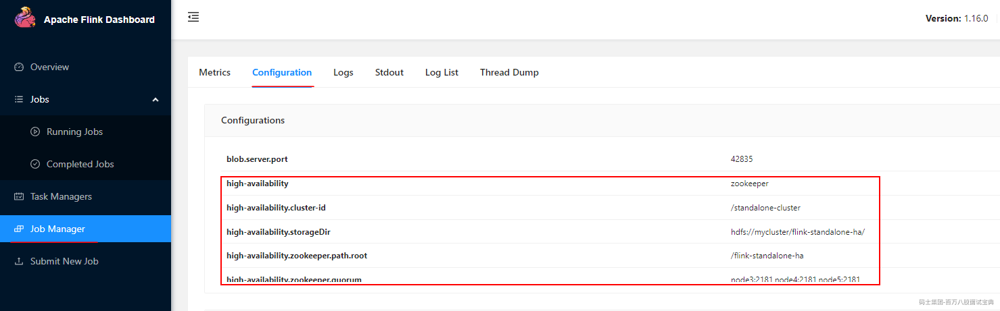

在WebUI中无法看到哪个节点是Active JobManager，我们也可以通过zookeeper查看当前Active JobManager节点，命令如下：

```plain
#登录zookeeper 客户端
[root@node5 ~]# zkCli.sh

#查看对应节点路径信息
[zk: localhost:2181(CONNECTED) 1] get /flink-standalone-ha/standalone-cluster/leader/dispatcher/connection_info 
...w42akka.tcp://flink@node1:33274/user/rpc/dispatcher_1srjava.util.UUID...
```

4. **测试**JobManager**切换**

我们可以在Flink Standalone集群中提交一个Flink 任务，提交之后无论在通过哪个节点的8081WebUI都可以看到此任务。提交任务命令如下：

```plain
#在node5节点启动 socket服务
[root@node5 ~]# nc -lk 9999

#在node4客户端向Standalone集群提交任务
[root@node4 ~]# cd /software/flink-1.16.0/bin
[root@node4 bin]# ./flink run -m node1:8081 -d -c com.mashibing.flinkjava.code.chapter3.SocketWordCount /root/FlinkJavaCode-1.0-SNAPSHOT-jar-with-dependencies.jar
```

通过<https://node1:8081、https://node2:8081、https://node3:8081> WebUI都可以看到提交的任务信息：

*(⚠️ 图片缺失:源知识库原图已失效)*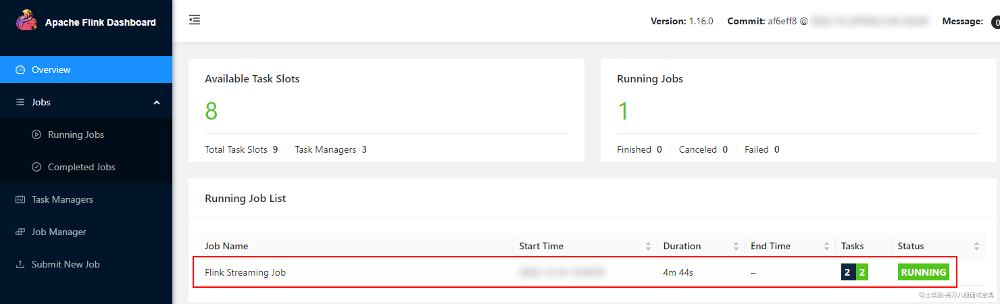

在HDFS中也可以看到提交的任务信息：

*(⚠️ 图片缺失:源知识库原图已失效)*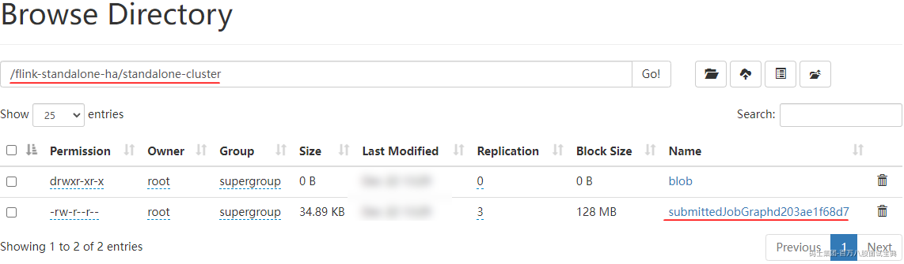

将node1节点上的JobManager进程kill掉，查看Active JobManager是否变化：

```plain
#kill node1 JobManager进程
[root@node1 bin]# jps
...
16309 StandaloneSessionClusterEntrypoint
...
[root@node1 bin]# kill -9 16309
```

将Active JobManager kill之后访问各个节点的WebUI可以看到短暂的不可用，稍等一会就可以看到正常可以访问除node1之外的其他节点WebUI，通过查询Zookeeper中节点信息，可以看到Active JobManager 节点切换成了其他节点：

```plain
#zookeeper查询命令
[zk: localhost:2181(CONNECTED) 1] get /flink-standalone-ha/standalone-cluster/leader/dispatcher/connection_info
...w42akka.tcp://flink@node2:35581/user/rpc/dispatcher_1srjava.util.UUID...
```

通过以上测试Flink Standalone HA 生效，如果想要把在node1上kill掉的JobManager启动起来,需要手动执行如下命令：

```plain
#在node1启动JobManager
[root@node1 bin]# ./jobmanager.sh start
```

被kill的JobManager重新启动后作为备用的JobManager也可以访问WebUI查看集群中执行的任务。

### 4.4.2Flink 基于Yarn HA

正常基于Yarn提交Flink程序，无论使用哪种模式提交任务都会启动JobManager角色，JobManager角色是哪个进程可以通过Yarn WebUI查看对应的ApplicationID启动所在节点的对应进程， Yarn Session提交任务模式中该角色进程为"YarnSessionClusterEntrypoint"、Yarn Per-Job提交任务模式中该角色进程为"YarnJobClusterEntrypoint"、Yarn Application提交任务模式中该角色进程为"YarnApplicationClusterEntryPoint"。

当JobManager进程挂掉后，也就是Yarn Application任务失败后默认不会进行任务重试，所以Flink 基于Yarn JobManager HA的本质是当Yarn Application程序失败后重试启动JobManager，实际上就是通过配置Yarn重试次数来实现高可用。JobManager重试过程需要借助zookeeper 协调JobManger失败后的切换，进而进行恢复对应的任务，同时需要HDFS存储每个Flink任务的执行流程数据。

#### 4.4.2.1Yarn HA配置

Yarn HA配置步骤如下：

1. **修**Hadoop **中所有节点的** yarn-site.xml

在所有Hadoop节点上配置$HADOOP\_HOME/etc/hadoop/yarn-site.xml文件，配置应用程序失败后最大尝试次数，以下该参数默认值为2，不配置也可以：

```plain
#设置提交应用程序的最大尝试次数，建议不低于4，这里重试的是ApplicationMaster
<property>
  <name>yarn.resourcemanager.am.max-attempts</name>

  <value>4</value>

</property>

```

2. **配置**flink-conf.yaml**文件**

只需要在向Yarn提交任务的客户端节点上配置Flink的flink-conf.yaml文件。未来我们在node5节点上来基于Yarn 各种模式提交任务，所以这里我们在node5节点上配置$FLINK\_HOME/conf/flink-conf.yaml文件,配置内容如下：

```plain
#要启用高可用，选主协调者为zookeeper，zk存储一些ck记录及选举信息
high-availability: zookeeper

#storageDir存储恢复JobManager失败所需的所有元数据，如：job dataflow信息
high-availability.storageDir: hdfs://mycluster/flink-yarn-ha/

#分布式协调器zookeeper集群
high-availability.zookeeper.quorum: node3:2181,node4:2181,node5:2181

#根ZooKeeper节点，所有集群节点都位于根节点之下。
high-availability.zookeeper.path.root: /flink-yarn-ha

#给当前集群指定cluster-id,集群所有需要的协调数据都放在该节点下。
high-availability.cluster-id: /yarn-cluster

#该参数同yarn-site.xml中yarn.resourcemanager.am.max-attempts参数，指向yarn提交一个application重试的次数，也可以不设置，非高可用默认为1，高可用默认为2，建议不大于yarn.resourcemanager.am.max-attempts参数，否则会被yarn.resourcemanager.am.max-attempts替换掉。
yarn.application-attempts: 4
```

#### 4.4.2.2启动测试

1. **启动** Zookeeper **和** HDFS

```plain
#在 node3、node4、node5节点启动zookeeper
[root@node3 ~]#  zkServer.sh start
[root@node4 ~]#  zkServer.sh start
[root@node5 ~]#  zkServer.sh start

#在node1启动HDFS集群
[root@node1 ~]# start-all.sh
```

2. **在** node5 **节点向** Yarn **提交任务**

这里以在node5节点上以Yarn Application模式提交任务为例，命令如下：

```plain
#在node5节点启动 socket服务
[root@node5 ~]# nc -lk 9999

#以Application模式提交任务，命令如下
[root@node5 ~]# cd /software/flink-1.16.0/bin/
[root@node5 bin]# ./flink run-application -t yarn-application -c com.mashibing.flinkjava.code.chapter3.SocketWordCount /root/FlinkJavaCode-1.0-SNAPSHOT-jar-with-dependencies.jar
```

以上任务提交后可以在Yarn WebUI中看到对应的Application信息：

*(⚠️ 图片缺失:源知识库原图已失效)*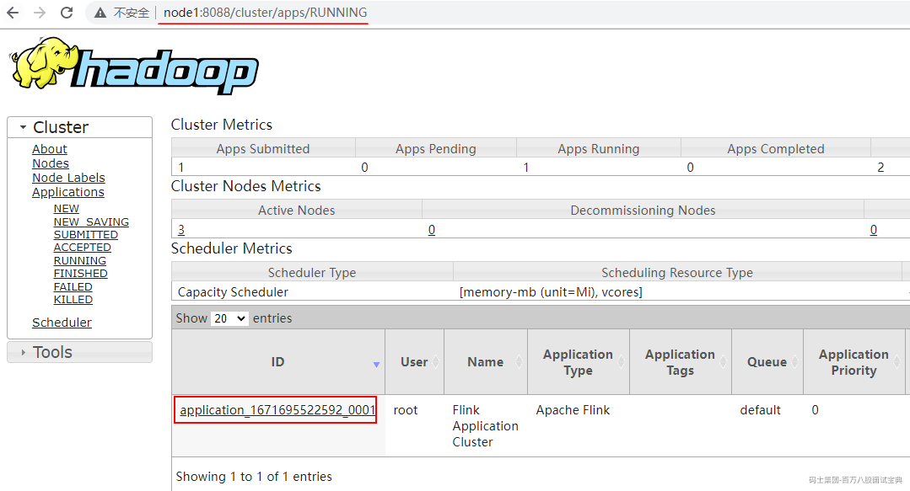

*(⚠️ 图片缺失:源知识库原图已失效)*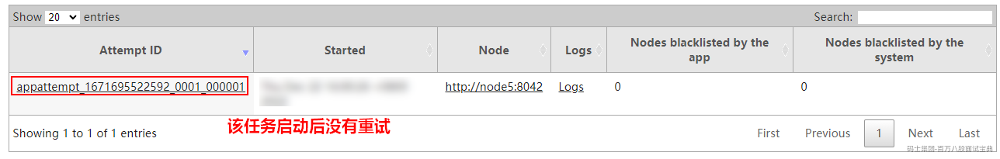

3. **测试**Flink Yarn HA

在Yarn WebUI中进入到FlinkWebUi页面，查看该JobManager启动所在的节点：

*(⚠️ 图片缺失:源知识库原图已失效)*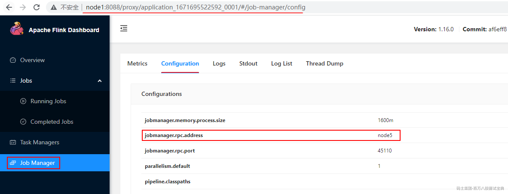

进入JobManager所在节点，并kill对应的JobManager进程，模拟JobManager进程意外中断，在Yarn WebUI中可以看到对应的Yarn ApplicationID重试执行，点击该ApplicatID 可以看到该任务重试信息：

*(⚠️ 图片缺失:源知识库原图已失效)*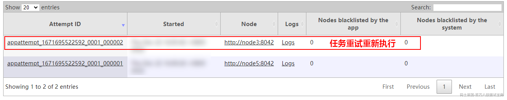

通过以上测试，Flink Yarn HA 生效。

## 4.5Apache Flink术语

Flink计算框架可以处理批数据也可以处理流式数据，Flink将批处理看成是流处理的一个特例，认为数据原本产生就是实时的数据流，这种数据叫做无界流（unbounded stream），无界流是持续不断的产生没有边界，批数据只是无界流中的一部分叫做有界流（bounded stream），针对无界流数据处理叫做实时处理,这种程序一般是7\*24不间断运行的；针对有界流数据处理叫做批处理，这种程序处理完当前批数据就停止。下面我们结合一些代码介绍Flink中的一些重要的名词术语。

*(⚠️ 图片缺失:源知识库原图已失效)*

### 4.5.1Application与Job

无论处理批数据还是处理流数据我们都可以使用Flink提供好的Operator（算子）来转换处理数据，一个完整的Flink程序代码叫做一个Flink Application，像前面章节我们编写的Flink读取Socket数据实时统计WordCount代码就是一个完整的Flink Application：

```plain
/**
 * 读取Socket数据进行实时WordCount统计
 */
public class SocketWordCount {
    public static void main(String[] args) throws Exception {
        //1.准备环境
        StreamExecutionEnvironment env = StreamExecutionEnvironment.getExecutionEnvironment();
        //2.读取Socket数据
        DataStreamSource<String> ds = env.socketTextStream("node5", 9999);
        //3.准备K,V格式数据
        SingleOutputStreamOperator<Tuple2<String, Integer>> tupleDS = ds.flatMap((String line, Collector<Tuple2<String, Integer>> out) -> {
            String[] words = line.split(",");
            for (String word : words) {
                out.collect(Tuple2.of(word, 1));
            }
        }).returns(Types.TUPLE(Types.STRING, Types.INT));

        //4.聚合打印结果
        tupleDS.keyBy(tp -> tp.f0).sum(1).print();

        //5.execute触发执行
        env.execute();
    }
}
```

一个完整的Flink Application一般由Source(数据来源)、Transformation（转换）、Sink（数据输出）三部分组成，Flink中一个或者多个Operator(算子)组合对数据进行转换形成Transformation，一个Flink Application 开始于一个或者多个Source，结束于一个或者多个Sink。

*(⚠️ 图片缺失:源知识库原图已失效)*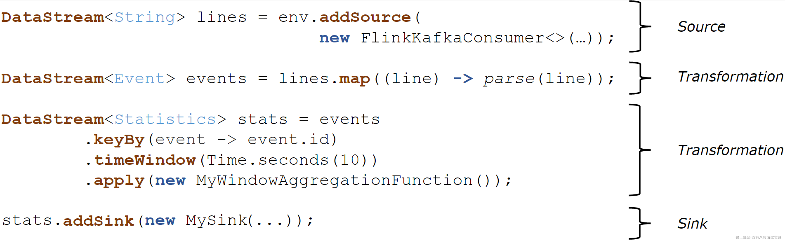

编写Flink代码要符合一定的流程，首先我们需要创建Flink的执行环境（Execution Environment）,然后再加载数据源Source，对加载的数据进行Transformation转换，进而对结果Sink输出，最后还要执行env.execute()来触发整个Flink程序的执行，编写代码时将以上完整流程放在main方法中形成一个完整的Application。

一个Flink Application中可以有多个Flink Job，每次调用execute()或者executeAsyc()方法可以触发一个Flink Job ,一个Flink Application中可以执行多次以上两个方法来触发多个job执行。但往往我们在编写一个Flink Application时只需要一个Job即可。

### 4.5.2DataFlow数据流图

一个Flink Job 执行时会按照Source、Transformatioin、Sink顺序来执行，这就形成了Stream DataFlow(数据流图)，数据流图是整体展示Flink作业执行流程的高级视图，通过WebUI我们可以看到提交应用程序的DataFlow。

*(⚠️ 图片缺失:源知识库原图已失效)*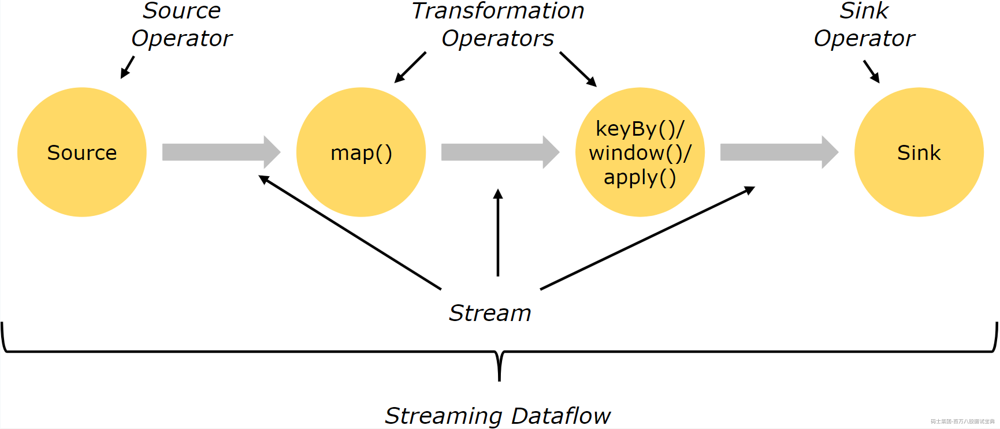

像之前提交的Flink 读取Socket数据实时统计WordCount在WebUI中形成的DataFlow如下，可以看到对应的Source、各个转换算子、Sink部分。

*(⚠️ 图片缺失:源知识库原图已失效)*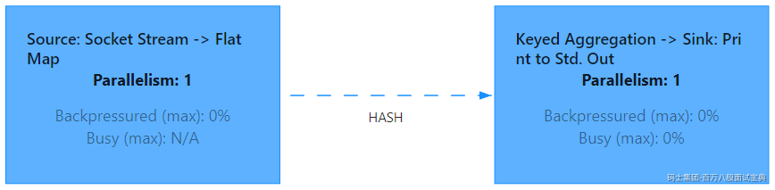

通常Operator算子和Transformation转换之间是一对一的关系，有时一个Transformation转换中包含多个Operator，形成一个算子链，这主要取决于数据之间流转关系和并行度是否相同，关于算子链内容在4.5.4部分再做介绍。

### 4.5.3Subtask子任务与并行度

在集群中运行Flink代码本质上是以并行和分布式方式来执行，这样可以提高处理数据的吞吐量和速度，处理一个Flink流过程中涉及多个Operator，每个Operator有一个或者多个Subtask（子任务），不同的Operator的Subtask个数可以不同，一个Operator有几个Subtask就代表当前算子的并行度（Parallelism）是多少，Subtask在不同的线程、不同的物理机或不同的容器中完全独立执行。

*(⚠️ 图片缺失:源知识库原图已失效)*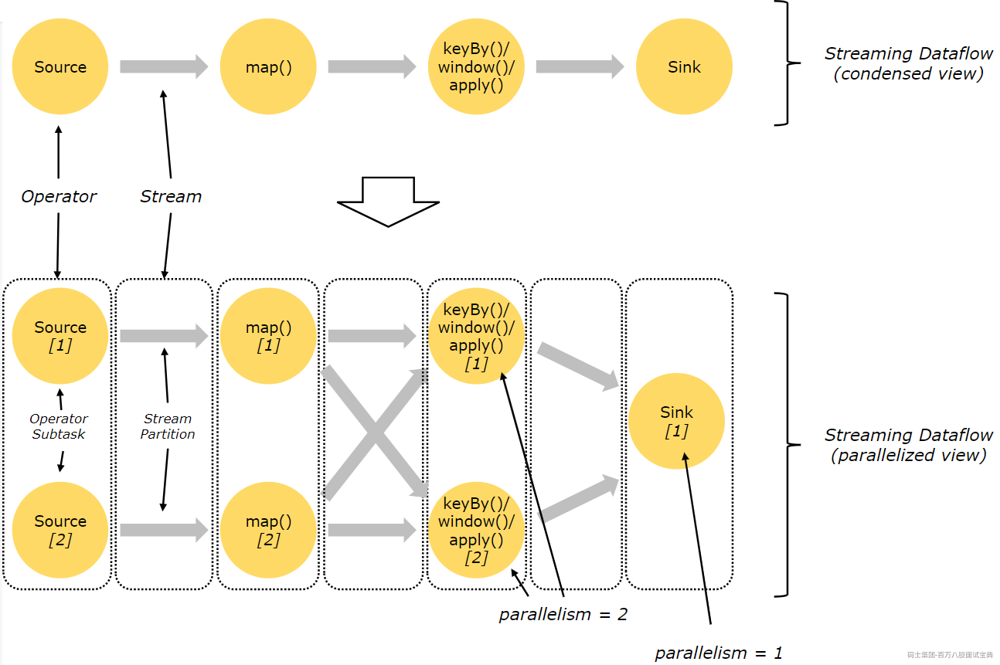

上图下半部分是多并行度DataFlow视图，Source、Map、KeyBy等操作有2个并行度，对应2个subtask分布式执行，Sink操作并行度为1，只有一个subtask，一共有7个Subtask，每个Subtask处理的数据也经常说成处理一个分区（Stream Partition）的数据。 **一个** Flink Application **的并行度通常认为是所有Operator中最大的并行度** 。上图中的Application并行度就为2。

Flink中并行度可以从以下四个层面指定：

1. Operator Level (**算子层面）**

算子层面设置并行度是给每个算子设置并行度，直接在算子后面调用.setparallelism()方法，写入并行度即可，只是针对当前算子有效，注意一些算子不能设置并行度，例如：keyBy 返回的对象是KeyedStream，这种分组操作无法设置并行度，socketTextStream是非并行source，只支持1个并行度，也不能设置并行度。

```plain
#算子层面设置并行度
ds.flatMap(line=>{line.split(" ")}).setParallelism(2)
```

2. **Execution Environment Level(****执行环境层面****)**

执行环境层面设置并行度直接调用env.setParallelism()写入并行度即可，全局代码有效。

```plain
#执行环境层面设置并行度
val env = StreamExecutionEnvironment.getExecutionEnvironment
env.setParallelism(3)
```

3. **Client Level(客户端层面）**

以上无论是算子层面还是执行环境层面设置并行度都会导致硬编码问题，修改并行度时不灵活，我们也可以在客户端提交Flink任务时通过指定命令参数-p来动态设置并行度，并行度作用于全局代码。

如果是基于WebUI提交任务，我们也可以基于WebUI指定并行度：

*(⚠️ 图片缺失:源知识库原图已失效)*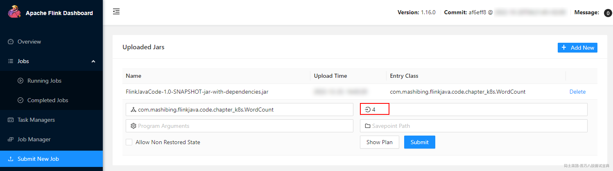

4. **System Level(系统层面)**

我们也可以直接在提交Flink任务的节点配置$FLINK\_HOME/conf/flink-conf.yaml文件配置并行度，这个设置对于在客户端提交的所有任务有效，默认值为1。

```plain
#配置flink-conf.yaml文件
parallelism.default: 5
```

以上四种不同方式指定Flink **并行度的优先级为:** *Operator Level**>**Execution Environment Level**>**Client Level**>**System Level*，本地编写代码时如果没有指定并行度，默认的并行度是当前机器的cpu core数。

### 4.5.4Operator Chains 算子链

在Flink作业中，用户可以指定Operator Chains(算子链)将相关性非常强的算子操作绑定在一起，这样能够让转换过程上下游的Task数据处理逻辑由一个Task执行，进而避免因为数据在网络或者线程间传输导致的开销，减少数据处理延迟提高数据吞吐量。默认情况下，Flink开启了算子链。例如：下图流处理程序Source/map就形成了一个算子链，keyBy/window/apply形成了以算子链，分布式执行中原本需要多个task执行的情况由于有了算子链减少到由5个Subtask分布式执行即可。

*(⚠️ 图片缺失:源知识库原图已失效)*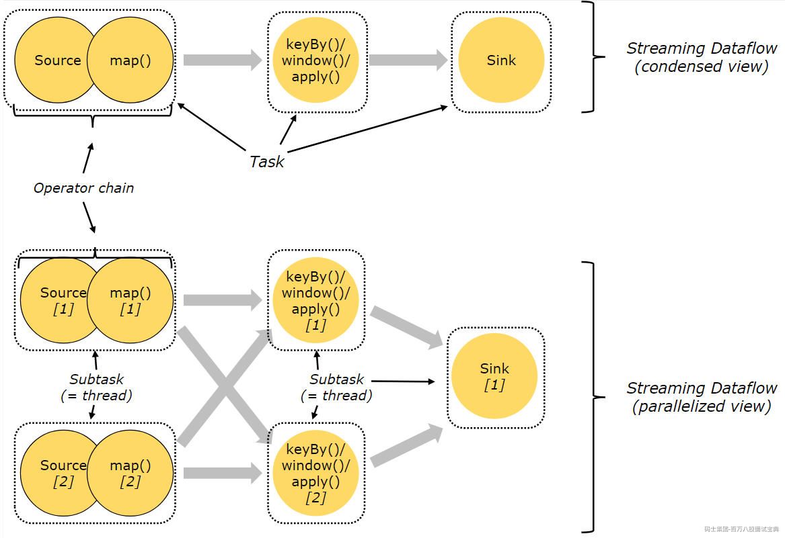

我们在集群中提交Flink任务后，可以通过Flink WebUI中查看到形成的算子链：

*(⚠️ 图片缺失:源知识库原图已失效)*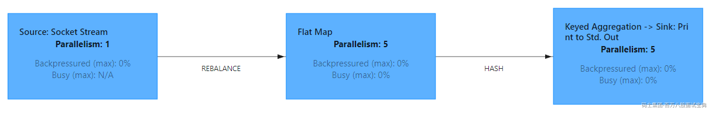

那么在Flink中哪些算子操作可以合并在一起形成算子链进行优化？这主要取决于算子之间的并行度与算子之间数据传递的模式。一个数据流在算子之间传递数据可以是一对一（One-to-one）的模式传递，也可以是重分区（Redistributing）的模式传递，两者区别如下：

- **One-to-one**：

一对一传递模式(例如上图中的Source和map()算子之间)保留了元素的分区和顺序，类似Spark中的窄依赖。这意味着map()算子的subtask[1]处理的数据全部来自Source的subtask[1]产生的数据，并且顺序保持一致。例如：map、filter、flatMap这些算子都是One-to-one数据传递模式。

- **Redistributing**：

重分区模式(如上面的map()和keyBy/window之间，以及keyBy/window和Sink之间)改变了流的分区，这种情况下数据流向的分区会改变，类似于Spark中的宽依赖。每个算子的subtask将数据发送到不同的目标subtask，这取决于使用了什么样的算子操作，例如keyBy()是分组操作，会根据key的哈希值对数据进行重分区，再如，window/apply算子操作的并行度为2，流向了并行度为1的sink操作，这个过程需要通过rebalance操作将数据均匀发送到下游Subtask中。这些传输方式都是重分区模式（Redistributing）。

**在Flink中** One-to-one **的算子操作且并行度一致,默认自动合并在一起形成一个算子链** ，由一个task执行对应逻辑。我们也可以通过代码禁用算子链或者进行细粒度的控制哪些算子可以合并形成算子链。

1. **通过以下方式来禁用算子链**

```plain
#禁用算子链
StreamExecutionEnvironment.disableOperatorChaining()
```

编写代码，首先对数据进行过滤，然后进行转换操作,实时统计WordCount，代码中我们可以禁用算子链：

```plain
//1.准备环境
StreamExecutionEnvironment env = StreamExecutionEnvironment.getExecutionEnvironment();
env.disableOperatorChaining();

//2.读取Socket数据
DataStreamSource<String> ds = env.socketTextStream("node5", 9999);

//3.对数据进行过滤
SingleOutputStreamOperator<String> filterDS = ds.filter(s -> s.startsWith("a"));

//4.对数据进行单词切分
SingleOutputStreamOperator<String> wordDS = filterDS.flatMap((String line, Collector<String> collector) -> {
    String[] words = line.split(",");
    for (String word : words) {
        collector.collect(word);
    }
}).returns(Types.STRING);

//5.对单词进行设置PairWord
SingleOutputStreamOperator<Tuple2<String, Integer>> pairWordDS =
        wordDS.map(s -> new Tuple2<>(s, 1)).returns(Types.TUPLE(Types.STRING, Types.INT));

//6.统计单词
SingleOutputStreamOperator<Tuple2<String, Integer>> result = pairWordDS.keyBy(tp -> tp.f0).sum(1);

//7.打印结果
result.print();

//8.execute触发执行
env.execute();
```

禁用算子链之后，打包执行，提交任务：

```plain
#提交任务命令
./flink run -m node1:8081 -p 2 -c com.mashibing.flinkjava.code.chapter4.TestOperatorChain /root/FlinkJavaCode-1.0-SNAPSHOT-jar-with-dependencies.jar
```

我们禁用算子链之后再执行任务可以通过WebUI看到算子不再合并在一起执行，而是每个算子都由一个task执行。

默认开启算子链：

*(⚠️ 图片缺失:源知识库原图已失效)*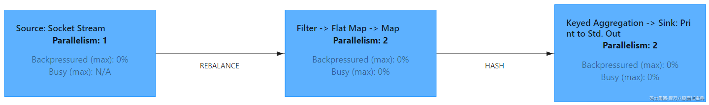

关闭算子链：

*(⚠️ 图片缺失:源知识库原图已失效)*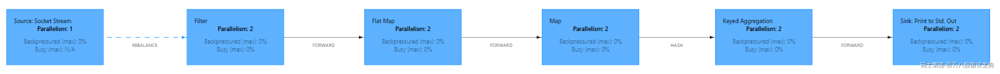

2. **设置新的算子链**

```plain
#从当前算子开始一个新的算子链
someStream.filter(...).map(...).startNewChain().map(...);
```

以上是想从哪个算子开始新的算子链就在该算子后调用startNewChain()方法即可。修改代码：

```plain
//1.准备环境
StreamExecutionEnvironment env = StreamExecutionEnvironment.getExecutionEnvironment();

//2.读取Socket数据
DataStreamSource<String> ds = env.socketTextStream("node5", 9999);

//3.对数据进行过滤
SingleOutputStreamOperator<String> filterDS = ds.filter(s -> s.startsWith("a"));

//4.对数据进行单词切分
SingleOutputStreamOperator<String> wordDS = filterDS.flatMap((String line, Collector<String> collector) -> {
    String[] words = line.split(",");
    for (String word : words) {
        collector.collect(word);
    }
}).returns(Types.STRING);

//5.对单词进行设置PairWord
SingleOutputStreamOperator<Tuple2<String, Integer>> pairWordDS =
        wordDS.map(s -> new Tuple2<>(s, 1)).returns(Types.TUPLE(Types.STRING, Types.INT)).startNewChain();

//6.统计单词
SingleOutputStreamOperator<Tuple2<String, Integer>> result = pairWordDS.keyBy(tp -> tp.f0).sum(1);

//7.打印结果
result.print();

//8.execute触发执行
env.execute();
```

在Filter算子后开启新的算子链，将以上代码打包执行，提交任务：

```plain
#提交任务命令
./flink run -m node1:8081 -p 2 -c com.mashibing.flinkjava.code.chapter4.TestOperatorChain /root/FlinkJavaCode-1.0-SNAPSHOT-jar-with-dependencies.jar
```

查看WebUI，展示的算子链结果如下：

*(⚠️ 图片缺失:源知识库原图已失效)*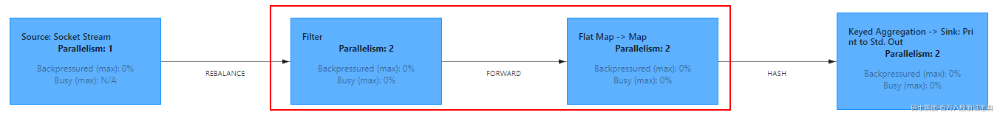

3. **在算子上禁用算子链**

如果我们不想关闭整体作业的算子链，只想关闭某些算子的算子链，我们可以在某个算子后调用disableChaining()方法来打断Flink自动合并算子链。

```plain
#打断算子链
someStream.map(...).disableChaining();
```

向从哪个算子开始不再自动合并算子链就在该算子上调用disableChaining()方法。根据以上代码执行的结果，我们看到FaltMap和Map自动合并形成了算子链，我们可以在map算子后调用disableChaining来切断两者形成算子链：

```plain
//1.准备环境
StreamExecutionEnvironment env = StreamExecutionEnvironment.getExecutionEnvironment();

//2.读取Socket数据
DataStreamSource<String> ds = env.socketTextStream("node5", 9999);

//3.对数据进行过滤
SingleOutputStreamOperator<String> filterDS = ds.filter(s -> s.startsWith("a"));

//4.对数据进行单词切分
SingleOutputStreamOperator<String> wordDS = filterDS.flatMap((String line, Collector<String> collector) -> {
    String[] words = line.split(",");
    for (String word : words) {
        collector.collect(word);
    }
}).returns(Types.STRING).startNewChain();

//5.对单词进行设置PairWord
SingleOutputStreamOperator<Tuple2<String, Integer>> pairWordDS =
        wordDS.map(s -> new Tuple2<>(s, 1)).returns(Types.TUPLE(Types.STRING, Types.INT)).disableChaining();

//6.统计单词
SingleOutputStreamOperator<Tuple2<String, Integer>> result = pairWordDS.keyBy(tp -> tp.f0).sum(1);

//7.打印结果
result.print();

//8.execute触发执行
env.execute();
```

在map算子上打断算子链，将以上代码打包执行，提交任务：

```plain
#提交任务命令
./flink run -m node1:8081 -p 2 -c com.mashibing.flinkjava.code.chapter4.TestOperatorChain /root/FlinkJavaCode-1.0-SNAPSHOT-jar-with-dependencies.jar
```

查看WebUI，展示的算子链结果如下：

*(⚠️ 图片缺失:源知识库原图已失效)*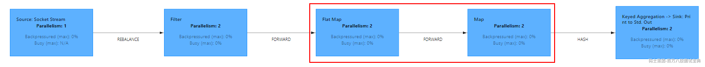

在Flink编程中默认开启算子链即可，如果遇到一些算子操作非常复杂，我们想让处理该业务逻辑的task独占cpu资源这时可以细粒度管理算子链，大多数情况选择让Flink默认划分算子链即可。

## 4.6Flink执行图

Flink代码提交到集群执行时最终会被转换成task分布式的在各个节点上运行，在前面我们学习到DataFlow数据流图，DataFlow是一个Flink应用程序执行的高级视图，展示了Flink应用程序执行的总体流程，在Flink底层由DataFlow最终转换成执行的task的过程还涉及一些对象转换。下图以一个普通的Flink处理数据流程展示了一个Flink任务提交到集群后内部对象转换关系和流程，其中每个虚线框代表一个task，p代表并行度，这里假设为2。

*(⚠️ 图片缺失:源知识库原图已失效)*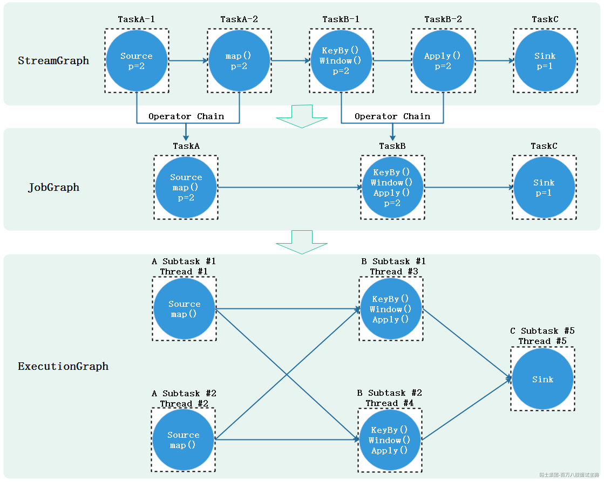

首先编写好的代码提交后在客户端会按照Transformation转换成StreamGraph（任务流图），StreamGraph是没有经过任何优化的流图，展示的是程序整体执行的流程。StreamGraph进而会按照默认的Operator Chains算子链合规则转换成JobGraph（作业图），在JobGraph中会将并行度相同且数据流转关系为One-to-one关系的算子合并在一起由一个Task进行处理原本2个Task处理的逻辑，这一步转换一般也是在客户端进行。JobGraph会被提交给JobManager，最终由JobManager中JobMaster转换成ExecutionGraph（执行图），ExecutionGraph中会按照每个算子并行度来划分对应的Subtask，每个Subtask最终再次被转换成其他可以部署的对象发送到TaskManager上执行。

以上整体流程就是Flink 任务在底层执行转换的流程，基于以上流程我们可以得到以下结论：

- 在Flink中一个Task一般对应的就是一个算子或者多个算子逻辑。多个算子逻辑经过Operator Chains优化后也是由一个Task执行的。

- Flink分布式运行中，Task会按照并行度划分成多个Subtask，每个Subtask由一个Thread线程执行，多个Subtask分布在不同的线程不同节点形成Flink分布式的执行。

- Subtask是Flink任务调度的基本单元。

## 4.7TaskSlot任务槽

提交到集群中的Flink程序最终会转换成一个个的Subtask，Subtask是Flink任务调度的基本单元，这些task最终被发送到不同的TaskManager节点上分布式执行，假设现在我们有一个TaskManager，一个Flink 任务有多个Subtask，这些Subtask能否正常在该TaskManager上启动？到底一个TaskManager上能同时执行多少个SubtasK?要了解这些内容就必须知道Flink中TaskSlot以及SlotSharingGroup(Slot共享组)相关内容。

### 4.7.1TaskSlot任务槽

Flink集群中每个TaskManager是一个JVM进程，可以在TaskManagr中执行一个或者多个subtask，为了能控制一个TaskManager中接收多少个Task，TaskManager节点上可以提供taskslot（任务槽），一个TaskManager上可以划分多个taskslot，**taskslot是Flink系统中资源调度的最小单元**，可以对TaskManager上的资源进行明确划分，每个taskslot可以运行一个或者多个subtask，每个JobManager上至少有一个taskSlot。

*(⚠️ 图片缺失:源知识库原图已失效)*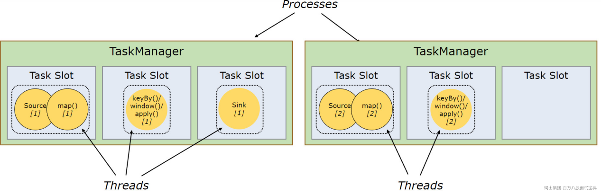

每个taskSlot都有固定的资源，假设一个TaskManager有三个TaskSlots,那么每个TaskSlot会将TaskMananger中的内存均分，即每个任务槽的内存是总内存的1/3，分配资源意味着subtask不会与其他作业的subtask竞争内存，taskslot的作用就是分离任务的托管内存，不会发生cpu隔离。

通过调整taskSlot的数据量，用户可以指定每个TaskManager有多少task slot，TaskManager可以配置成单Slot模式，这样这个JobManager上运行的任务就独占了整个JVM进程，更多的taskSlot意味着更多的subtask可以共享同一个JVM,同一个JVM中的task共享TCP连接和心跳信息，共享数据集和数据结构，从而减少TaskManager中的task开销。

在Flink Standalone集群中我们可以通过配置FLINK\_HOME/conf/flink-conf.yaml文件中的"taskmanager.numberOfTaskSlots"参数来指定每个JobManager启动后拥有几个taskslot，如果是基于其他模式提交任务，可以配置客户端中的$FLINK\_HOME/conf/flink-conf.yaml配置文件。

```plain
#flink-conf.yamml文件中配置每个taskmanager拥有的taskslot个数
taskmanager.numberOfTaskSlots: 3
```

我们可以通过配置每个TaskManager上taskslot的数量来决定每个TaskManager上可以执行多少subtask，由于taskslot只会对内存进行隔离不会对CPU进行隔离，一台TaskManager taskslot越多意味着越多的taskslot争夺CPU资源，所以 **taskslot的值设置建议和该** **TaskManager** **节点** **CPU core** **的数量保持一致**。

### 4.7.2TaskSlot共享&SlotSharingGroup共享组

默认情况下，Flink 允许 subtask 共享 taskSlot，即便它们是不同的 subtask，只要是来自于同一Flink作业即可（Flink不允许属于不同作业的task共享同一个slot）,结果就是一个 slot 可以持有整个作业管道。

*(⚠️ 图片缺失:源知识库原图已失效)*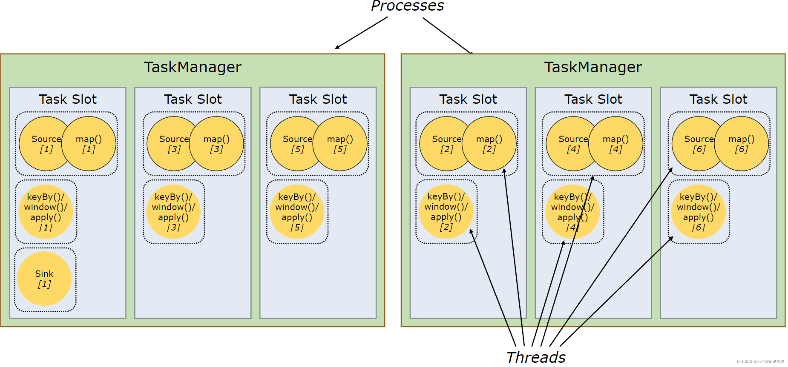

Flink中一个taskslot中可以运行多个subtask有什么好处呢？假设一个taskslot中只能运行一个subtask，上图中一共有13个subtask，对应的就需要13个slot资源，我们在提交Flink应用程序时需要关注我们程序中到底有多少subtask，然后再衡量Flink集群中slot个数是否足够，**在一定程序上需要的slot资源较多**。另外一个方面是在Flink中运行的task对CPU资源的占用不同，有CUP密集型task操作和CPU非密集型task操作情况，例如在Flink集群中source和map的操作只是读取数据进行转换，对应task运行占用的cpu资源极短，但是Window这种窗口聚合操作涉及大量数据计算，往往占用CPU资源时间长，这就会导致在运行任务时source/map、sink操作时间非常快，Window操作时间非常长，source/map对应的subtask会等待window对应的subtask执行，同样sink的对应的subtask也会等待window对应的subtask执行，站在集群slot角度上来看就出现了一些taskslot非常"繁忙"，一些taskslot非常"轻松"，**集群的资源综合利用不高**。

**taskslot共享就可以很好地解决以上问题，Flink任务所有的subtask均衡的分散到不同的taskslot上执行，一个taskslot贯穿执行整个流程的subtask**，这样每个taskslot、每个TaskManager上的资源使用情况非常均衡。所以允许 slot 共享有两个主要优点：

- **Flink 集群所需的 taskSlot 和作业中使用的最大并行度恰好一样，不需要关注Flink程序总共包含多少个 subtask**。

- **容易获得更好的资源利用。如果没有 slot 共享，非密集 subtask（source/map()）将阻塞和密集型 subtask（window()）一样多的资源。通过 slot 共享，确保繁重的 subtask 在 TaskManager 之间公平分配**。

在Flink中实现taskslot共享是通过SlotSharingGroup(Slot共享组，简称SSG)实现的,默认在Flink中有名称为"default"的默认SSG,所有算子操作都在当前这个SSG中，所以我们在执行Flink代码时会自动进行slot组共享。我们也可以在代码中手动指定某些算子操作的SSG组做到某些操作独占一个slot，指定方式如下：

```plain
#手动指定slotSharingGroup
someStream.filter(...).slotSharingGroup("name");
```

不显式指定SSG时所有算子操作使用的是default slot group 。显式指定后对应的算子操作使用的指定的slot group,只有指定同一个共享组的算子操作才会开启slot共享，不同slot group 的算子操作是分配到不同的slot上执行的，**如果一个Flink 任务有多个共享组，那么该Flink任务所需的总slot个数就是每个共享组最大并行度的总和**。

### 4.7.3TaskSlot与并行度关系

了解taskslot之后，我们很容易和之前的学习的并行度（Parallelism）混淆，两者关系如下： **taskslot是静态概念，指的是** **Flink TaskManager** **能够并发执行的** **task** **数。并行度是动态概念，指的是每个应用程序实际的并发能力**。

如果Flink集群中所有slot个数大于等于Flink 任务的并行度（Flink中所有算子最大并行度），那么Flink程序可以正常运行，否则Flink程序不能正常启动。我们结合下图来理解TaskSlot和并行度的关系：

首先我们的Flink集群有3个TaskManager,每个TaskManager根据配置划分3个slot，所以Flink整个集群Slot总数为9，代表了当前集群能够支持并发task的最高能力。

*(⚠️ 图片缺失:源知识库原图已失效)*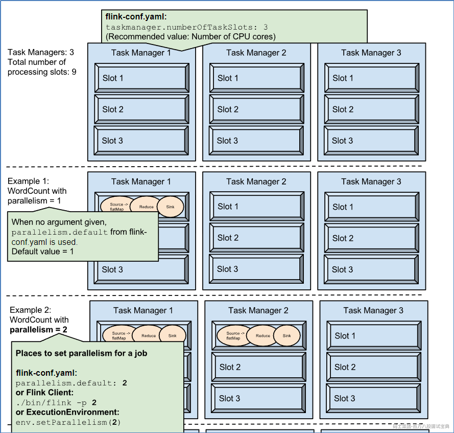

如图：example1中当我们向集群中提交Flink任务（WordCount）只有1个并行度时，这个任务只会占用集群中的1个taskslot。当我们向集群中提交的Flink任务有2个并行度时，这个任务占用集群2个taskslot，如图example2。

*(⚠️ 图片缺失:源知识库原图已失效)*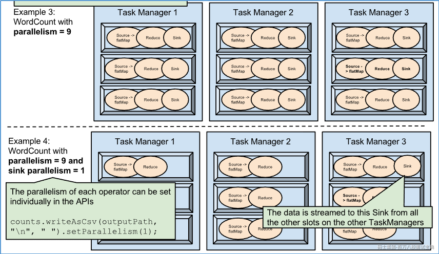

如上图example3中当我们提交的Flink任务有9个并行度时，任务在Flink集群中占用了所有的slot资源，当前集群不能再提交新的任务，因为当前集群中没有更多资源支撑新的Flink任务运行。

如果提交的Flink 任务所有算子并行度为9，就算其中有一些操作并行度为1（如example4中sink操作）同样占用Flink集群9个taskslot。

### 4.7.4SSG测试

下面编写Flink Java代码来测试Flink 中SlotSharingGroup(SSG)分组情况，在代码中我们设置整体并行度为3，代码如下：

```plain
//1.准备环境
StreamExecutionEnvironment env = StreamExecutionEnvironment.getExecutionEnvironment();

//2.设置代码总体并行度为3
env.setParallelism(3);

//3.读取Socket数据
DataStreamSource<String> ds = env.socketTextStream("node5", 9999);

//3.对数据进行过滤
SingleOutputStreamOperator<String> filterDS = ds.filter(s -> s.startsWith("a"));

//4.对数据进行单词切分
SingleOutputStreamOperator<String> wordDS = filterDS.flatMap((String line, Collector<String> collector) -> {
    String[] words = line.split(",");
    for (String word : words) {
        collector.collect(word);
    }
}).returns(Types.STRING);

//5.对单词进行设置PairWord
SingleOutputStreamOperator<Tuple2<String, Integer>> pairWordDS =
        wordDS.map(s -> new Tuple2<>(s, 1)).returns(Types.TUPLE(Types.STRING, Types.INT));

//6.统计单词
SingleOutputStreamOperator<Tuple2<String, Integer>> result = pairWordDS.keyBy(tp -> tp.f0).sum(1);

//7.打印结果
result.print();

//8.execute触发执行
env.execute();
```

将以上代码打包后提交到Standalone集群中进行测试，步骤如下：

1. **启动**Standalone **集群**

```plain
[root@node1 ~]# cd /software/flink-1.16.0/bin/
[root@node1 bin]# ./start-cluster.sh
```

2. **在**node5 **节点启动** socket **服务**

```plain
#node5节点启动socket服务
[root@node5 ~]# nc -lk 9999
```

3. **将** jar **包上传到** node4 **节点上提交执行**

```plain
[root@node4 ~]# cd /software/flink-1.16.0/bin/
[root@node4 bin]# ./flink run -m node1:8081 -c com.mashibing.flinkjava.code.chapter4.TestSSG /root/FlinkJavaCode-1.0-SNAPSHOT-jar-with-dependencies.jar
```

以上代码执行后，我们通过webUI可以看到由于代码中设置的并行度为3，根据默认default SSG 的分配，会占用3个taskslot：

*(⚠️ 图片缺失:源知识库原图已失效)* 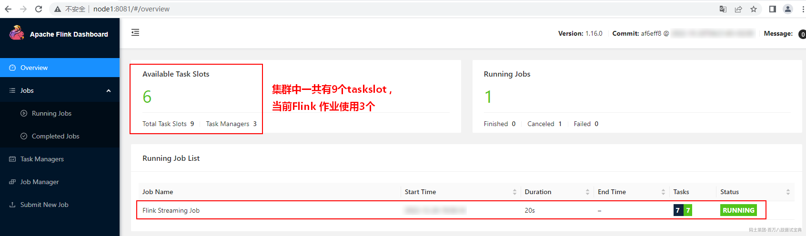

*(⚠️ 图片缺失:源知识库原图已失效)*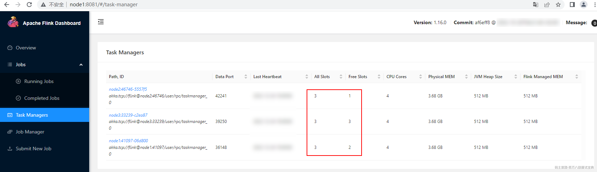

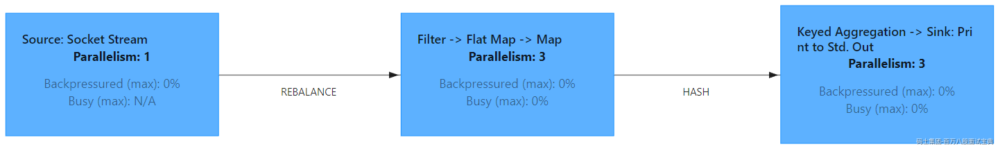

现在修改代码，针对Map后的操作设置新的SlotSharingGroup，修改的关键代码如下：

```plain
//6.统计单词
SingleOutputStreamOperator<Tuple2<String, Integer>> result = pairWordDS.keyBy(tp -> tp.f0).sum(1).slotSharingGroup("my-ssg-group");
```

重新提交任务后，可以在WebUI中查看使用的Slot个数为6，这是因为分了2个SlotSharingGroup 组之后，每个SlotSharingGroup组都会申请对应并行度个数的slot，每个组并行度为3，所以会申请6个slot：

*(⚠️ 图片缺失:源知识库原图已失效)*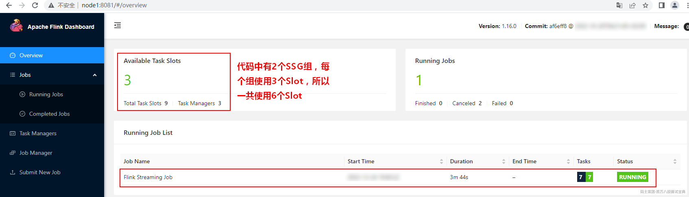

*(⚠️ 图片缺失:源知识库原图已失效)*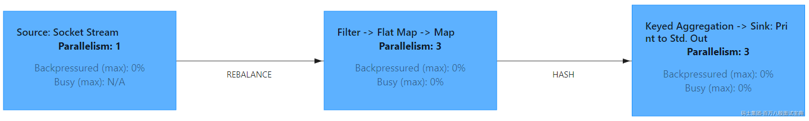

*(⚠️ 图片缺失:源知识库原图已失效)*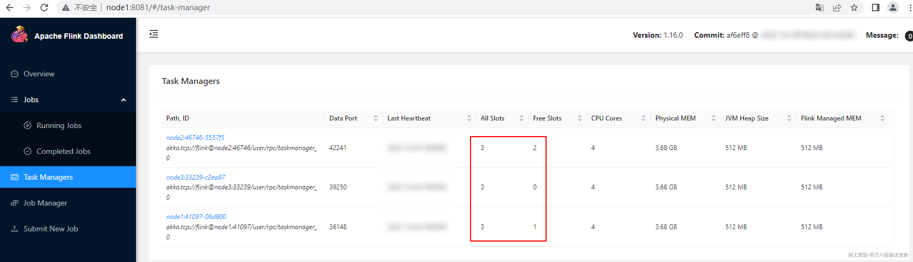

### 4.7.5均匀分配TaskSlot

测试SlotSharingGroup的代码基于Standalone集群提交时我们发现当使用集群6个slot时，Standalone集群中在各个TaskManager节点划分taskslot时存在分配Task不均匀的问题，在Standalone集群中如果在客户端提交多个Flink 作业时这种分配taskslot不均匀问题极有可能造成某台TaskManager 分配的taskslot非常多负载高，一些TaskManager分配的taskslot非常少负载低的问题。

Flink在1.11版本后引入了" **cluster.evenly-spread-out-slots**"参数解决Standalone中taskslot分配不均匀问题。该参数默认值为false代表task在集群中不匀衡的分配到各个TaskManager上，该参数只针对standalone集群有效。

我们可以在Flink Standalone集群各个节点的$FLINK\_HOME/conf/flink-conf.yaml文件中配置该参数为true均衡的在各个TaskManager节点上调度各个task：

```plain
#所有Flink Standalone 集群节点都配置 flink-conf.yaml
cluster.evenly-spread-out-slots: true
```

在所有Flink Standalone集群中配置完成以上参数后，重新启动Flink集群，在客户端提交上一小节中的代码，重新观察WebUI中slot的分配情况：

*(⚠️ 图片缺失:源知识库原图已失效)*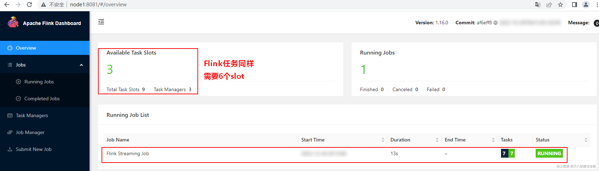

*(⚠️ 图片缺失:源知识库原图已失效)*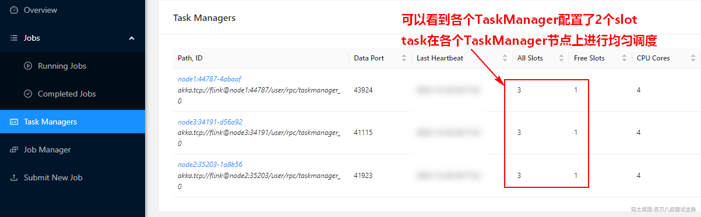

通过以上验证我们发现在Standalone中配置" **cluster.evenly-spread-out-slots**"参数为true后，task会均匀的在各个TaskManager上进行调度。

当基于Yarn提交Flink应用程序时Yarn会动态的在各个NodeManager节点上启动TaskManager进行划分Slot分配Task，测试如下：将以上代码并行度提高到6同时设置两个SSG（defalut和my-ssg-group），修改如下：

```plain
//1.准备环境
StreamExecutionEnvironment env = StreamExecutionEnvironment.getExecutionEnvironment();

//2.设置代码总体并行度为6
env.setParallelism(6);

//3.读取Socket数据
DataStreamSource<String> ds = env.socketTextStream("node5", 9999);

//3.对数据进行过滤
SingleOutputStreamOperator<String> filterDS = ds.filter(s -> s.startsWith("a"));

//4.对数据进行单词切分
SingleOutputStreamOperator<String> wordDS = filterDS.flatMap((String line, Collector<String> collector) -> {
    String[] words = line.split(",");
    for (String word : words) {
        collector.collect(word);
    }
}).returns(Types.STRING);

//5.对单词进行设置PairWord
SingleOutputStreamOperator<Tuple2<String, Integer>> pairWordDS =
        wordDS.map(s -> new Tuple2<>(s, 1)).returns(Types.TUPLE(Types.STRING, Types.INT));

//6.统计单词
SingleOutputStreamOperator<Tuple2<String, Integer>> result = pairWordDS.keyBy(tp -> tp.f0).sum(1).slotSharingGroup("my-ssg-group");

//7.打印结果
result.print();

//8.execute触发执行
env.execute();
```

以上代码设置全局并行度为6，后续设置了"my-ssg-group"SSG，所以整个程序提交到集群中使用的Slot为12个，将以上代码打包使用Yarn-Application模式提交到Yarn集群中，客户端设置每个TaskManager有3个taskslot，所以会启动4个TaskManager，提交任务后观察对应的WebUI，提交命令如下：

```plain
[root@node5 ~]# cd /software/flink-1.16.0/bin/
[root@node5 bin]# ./flink run-application -t yarn-application -c com.mashibing.flinkjava.code.chapter4.TestSSG /root/FlinkJavaCode-1.0-SNAPSHOT-jar-with-dependencies.jar
```

任务提交之后，Yarn WebUI任务信息如下：

*(⚠️ 图片缺失:源知识库原图已失效)*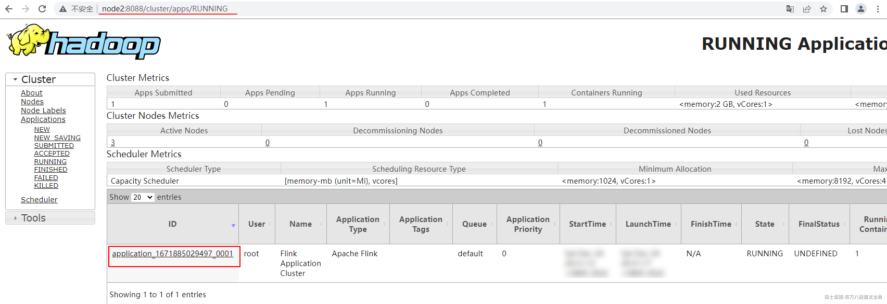

进入到FlinkWebUI查看任务使用Slot情况：

*(⚠️ 图片缺失:源知识库原图已失效)*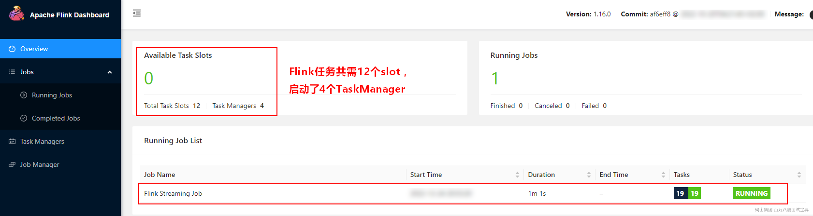

查看TaskManager在Yarn集群中各个节点启动情况：  
*(⚠️ 图片缺失:源知识库原图已失效)*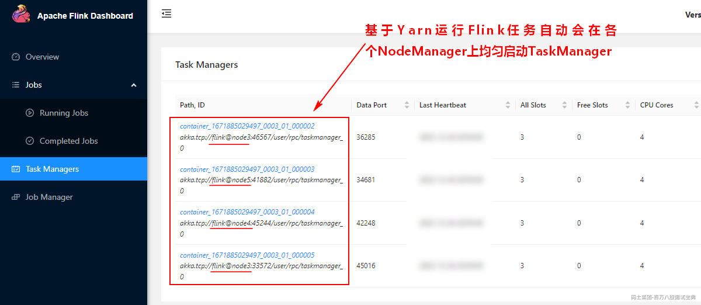

## 4.8Flink细粒度资源管理

### 4.8.1Flink细粒度资源管理介绍

Apache Flink 在1.14版本之前使用的是粗粒度资源管理方式，每个算子Slot Request 所需要的资源都是未知的，在Flink源码内部使用UNKNOWN的特殊值来表示，这个值可以和任意资源规格的物理Slot进行匹配，站在TaskManager的角度来说，它拥有的Slot个数与Slot资源是根据Flink的配置来决定。

对于多数简单的作业，现有的粗粒度资源管理已经可以基本满足对资源效率的要求，我们将任务被部署到预定义的、通常相同的Slot中，而无需了解每个Slot包含多少资源，使用粗粒度资源管理只是简单的将所有的task任务运行在一个SlotSharingGroup(SSG)中就可以很好地利用资源。如下图作业，由Kafka读取数据后经过一些简单处理，最终将结果写入到Redis中。对于这种作业，我们很容易将上下游并发保持一致，并将作业的整个pipeline放到一个SSG中。这种情况下Slot的资源需求是基本相同的，用户直接调整默认的Slot配置即可达到很高的资源利用效率,同时**由于不同的Task热点峰值不一定相同，当一个任务的消耗减少时，额外的资源可以被另一个消耗增加的任务使用，这被称为削峰填谷效应，通过这种效应将不同的task放到同一个大的Slot里，可以进一步降低整体的资源开销**。

*(⚠️ 图片缺失:源知识库原图已失效)*

多数简单作业使用粗粒度资源调度的特点如下：

- 对于所有任务具有相同并行度的流作业处理，每个Slot将包含一个完整的管道。理想情况下，所有管道应该使用大致相同的资源，这可以通过调整相同Slot的资源轻松满足。

- 任务的资源消耗随时间而变化，当一个任务的消耗减少时，额外的资源可以被另一个消耗增加的任务使用，这被称为削峰填谷效应，减少了所需的整体资源。

**但是在如下情况中，粗粒度资源调度管理效果不佳：**

- 任务可能有不同的并行度。有时，这种不同的并行是不可避免的。例如，Source/Sink/转换操作的tasks并行性可能会受到外部上游/下游系统的分区和IO负载的限制。在这种情况下，并行度小的task需要的Slot资源比整个任务管道需要的Slot的资源要少。

- 有时整个管道所需的资源可能太多，单个Slot/TaskManager无法提供。在这种情况下，需要将管道拆分为多个SSG（SlotSharingGroup），这些SSG可能并不总是具有相同的资源需求。

- 对于批处理作业，并非所有任务都可以同时执行，因此，管道的瞬时资源需求随时间而变化。

综上所述，尝试使用相同的Slot执行所有任务可能会导致资源利用率不佳。相同Slot的资源必须能够满足最高的资源需求，这对于其他需求来说是浪费的。当涉及到像GPU这样昂贵的外部资源时，这种浪费会变得更加难以承受。

为了方便以上理解，举例：如下图所示的Flink处理流转关系图中有两个128并发的Kafka Source 和一个32并发Redis维表，上下两路数据处理路径。一条是两个Kafka Source经过Join以后再经过一些AGG聚合操作，最终将数据Sink到16并发的Kafka中；另一路是Kafka Source和Redis维表进行join，结果流入一个基于TensorFlow的处理模块，最终存储到8个并发的Redis中。

*(⚠️ 图片缺失:源知识库原图已失效)*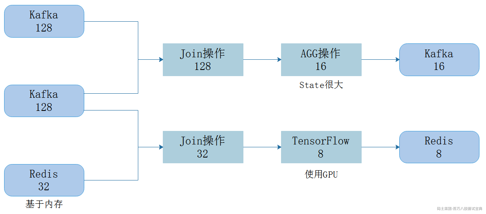

在以上这个作业中粗粒度资源管理就可能导致资源利用效率降低。首先作业上下游并发不一致，如果想把整个作业放到一个Slot中，只能和最高的128并发对齐，对齐的过程对于轻量级的算子没有太大问题，但是对于比较重的资源消耗的算子，会**导致很大的资源浪费**（主要是内存浪费）。比如图上的 Redis 维表，它将所有数据都缓存到内存中来提高性能，而聚合算子则需要比较大的 managed memory 来存储 state。对于这两个算子，本来只需要分别申请 32 和 16 份资源，对齐并发以后则分别需要申请 128 份。

同时，整个作业的 pipeline 可能由于资源过大而无法放到一个 slot 或是 TM 中，比如上述算子的内存，再比如 Tensorflow 模块需要 GPU 来保证计算效率。由于 GPU 是一种非常昂贵的资源，集群上不一定有足够的数量，从而导致作业因为对齐并发而无法申请到足够的资源，最终无法执行。

我们可以将整个作业拆分成多个 SSG。如下图所示：

*(⚠️ 图片缺失:源知识库原图已失效)*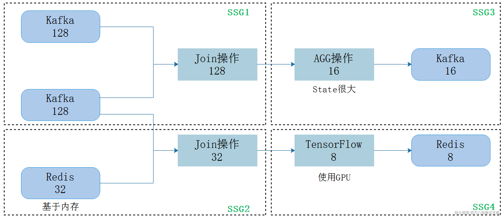

我们将算子按照并发划分成 4 个 SSG，保证每个 SSG 内部的并发是对齐的。但是由于每个 slot 只有一种默认规格，依然需要将该 slot 的所有资源维度都对齐到各个 SSG 的最大值，比如内存需要和 Redis 维表的需求对齐，managed memory 需要和聚合算子对齐，甚至扩展资源中都需要加入一块 GPU，这依然不能解决资源浪费的问题。

*注意：我们希望把计算逻辑复杂的算子单独使用* *slot* *，提高计算速度，可以将不同的操作划分到不同的* ***SSG*** *中* ***,*** *例如上图* ***:AGG*** *操作及* ***Kafka Sink*** *非常占用* ***CPU*** *资源，我们可以单独将* ***Kafka Sink\_ \_单独设置到一个*** *SSG* ***中，没有其他额外*** *task\_\_处理逻辑，加快计算速度。*

为了解决这个问题，我们提出了细粒度资源管理，其基本思想是，每个 slot 的资源规格都可以单独定制，用户按需申请，最大化资源的利用效率。细粒度资源管理就是通过使作业各个模块按需申请和使用资源来提高资源的整体利用效率。

注意：细粒度资源管理特性目前是一个MVP("最小可行产品")特性，只对DataStream API可用。

### 4.8.2细粒度资源适用场景

细粒度资源管理的使用的典型场景如下:

- 作业中上下游 task 并发有显著差异。

- 整个任务pipeline所需的资源太多，无法放入单个Slot/TaskManager中。

- 批作业，不同Stage消耗资源有显著差异。

几种情况都需要将作业拆分成多个 SSG，而不同的 SSG 资源需求存在差异，这时通过细粒度资源管理就能减少资源浪费。

### 4.8.3细粒度资源原理

在Flink架构中，TaskManager中会划分多个Slot资源，Slot是Flink运行时进行资源调度和资源分配的基本单元。

*(⚠️ 图片缺失:源知识库原图已失效)*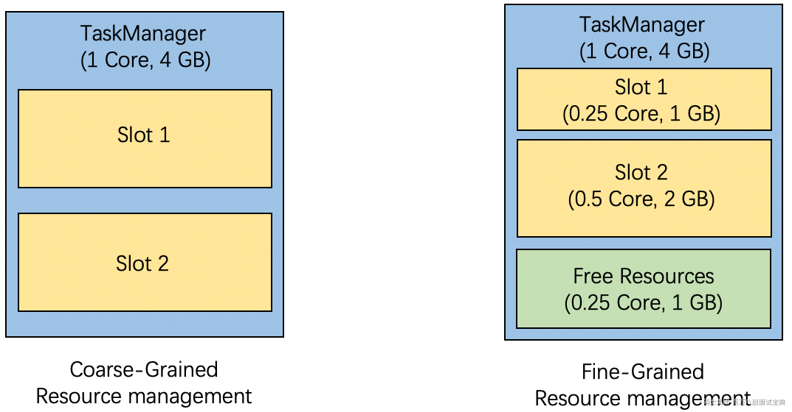

之前的Flink版本中，资源请求只包含所需的Slot，TaskManager有固定数量且资源相同Slot来满足用户资源请求，相当于是粗粒度的资源管理，现在Flink支持细粒度的资源管理，通过细粒度的资源管理，用户可以指定资源配置来对Slot进行请求，Flink根据用户的资源配置从TaskManager中动态剪切一个完全匹配的Slot，如上图所示，需要一个具有0.25 Core和1GB内存的Slot，Flink为其分配Slot 1。

注意：对于用户没有指定资源配置的资源请求，Flink会自动决定资源配置，目前默认的资源配置是根据TaskManager总资源和TaskManager.numberOfTaskSlots计算的,相当于是粗粒度资源管理。如上图所示，TaskManager的总资源为1Core和4G内存，当前TaskManager的Slot数量设置为2，那么每个Slot将会有0.5个core和2G内存。

在上图右侧图中是细粒度资源配置，TaskManager分配Slot 1和Slot 2后，TaskManager中剩余的可用内存为0.25 Core和1G内存，这些空闲资源可以进一步划分，以满足其他资源需求。

在Flink1.14版本中提出的细粒度资源调度是基于SlotSharingGroup的资源配置接口来实现，可以为任务中的每个SSG指定不同的资源可以最大化资源资源利用效率。

### 4.8.4资源分配策略-动态资源切割机制

Flink针对每个SSG进行资源分配采用的是动态资源切割机制，下面描述Flink运行时细粒度资源管理中Slot划分机制和资源分配策略，包括Flink运行时如何选择一个TaskManager划分Slot并在Native Kubernetes和Yarn中如何分配TaskManager，注意，Flink资源分配策略在Flink运行时可配，用户可以针对不同场景选择不同策略。

*(⚠️ 图片缺失:源知识库原图已失效)*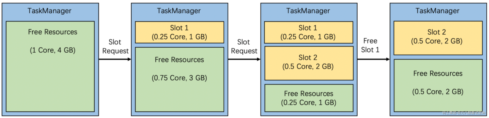

在细粒度资源管理中，Flink将从TaskManager中切割出一个完全匹配的Slot，用于指定资源的Slot请求。内部流程如上所示，TaskManager将使用全部资源启动，但没有预定义的Slot，当一个具有0.25 Core和1GB内存的Slot请求到达时，Flink将选择一个具有足够空闲资源的TaskManager，并使用请求的资源创建一个新的Slot。如果一个Slot被释放，它将其资源返回给TaskManager的可用资源。

在细粒度资源分配策略中，Flink将遍历所有已注册的Taskmanager，并选择第一个有足够空闲资源的Taskmanager来完成Slot请求。当没有足够可用资源的TaskManager时，Flink会Native Kubernetes或YARN上时尝试分配一个新的TaskManager。

在当前的策略中，Flink会根据用户的配置分配相同的Taskmanager。由于TaskManagers的资源规范是预定义的,需要注意以下问题：

- **集群中可能存在资源碎片**。例如：如果有两个Slot请求，每个Slot具有3G堆内存，而TaskManager的总堆内存是4G, 则Flink将启动两个TaskManager，每个TaskManager中会有1G的堆内存被浪费。在将来，可能会有一种资源分配策略，可以根据作业的Slot请求分配异构的taskmanager，从而减轻资源碎片。

- **请确保为Slot共享组配置的资源数量不超过TaskManager的资源总量**。否则，Flink job 将异常失败。

回到以上案例上来，我们可以根据细粒度资源管理针对不同的SSG分配不同的资源来最大化利用资源：

*(⚠️ 图片缺失:源知识库原图已失效)*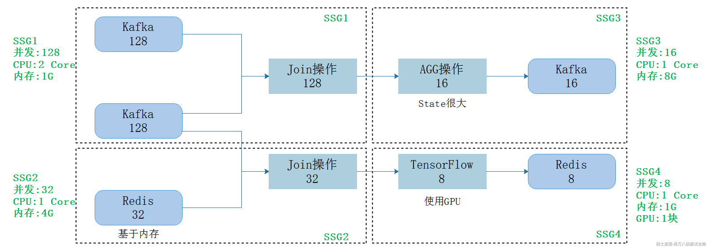

在集群中进行资源分配如下，我们只需要起8个同样规格的TM就能调度作业，每个TM上带一块GPU来满足SSG4，之后将CPU密集型的SSG1和内存密集型的SSG2和SSG3进行混布，对齐TM上整体的CPU内存比即可。

*(⚠️ 图片缺失:源知识库原图已失效)*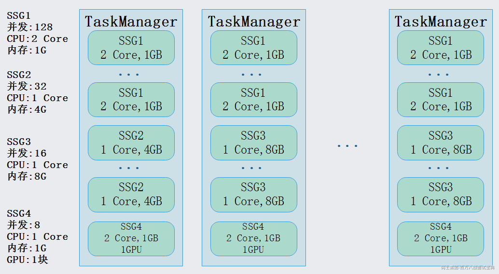

### 4.8.5细粒度资源用法

要使用细粒度资源管理，需要做以下操作:

1. **配置启用细粒度资源管理**

在flink-conf.yaml配置文件中配置 [cluster.fine-grained-resource-management.enabled](https://nightlies.apache.org/flink/flink-docs-release-1.15/docs/deployment/config/#cluster-fine-grained-resource-management-enabled)为true，早期Flink版本中没有此配置，如果配置上会有异常报错。

2. **代码中指定资源需求**

在代码中通过创建Slot Sharing Groups（Slot共享组）定义了细粒度的资源需求。在Flink内部SlotSharingGroup会告诉JobManager 哪些operator/tasks可以放在同一个Slot中。关于在代码中定义SlotSharingGroup和那些算子使用对应的SSG，有以下两种方式：

- **构建**SlotSharingGroup **对象实例并指定资源，通过** slotSharingGroup(String name) **方式附加到算子上。**

这种方式在创建SlotSharingGroup时指定共享组所需的资源，然后给算子通过[slotSharingGroup(String name)](https://nightlies.apache.org/flink/flink-docs-release-1.15/docs/dev/datastream/operators/overview/#set-slot-sharing-group)方式来设置Slot共享组的名称，但是最后需要通过StreamExecutionEnvironment.registerSlotSharingGroup（SlotSharingGroup ssg） 注册这些SSG对象。

```plain
//创建SSG共享组对象指定资源配置
SlotSharingGroup ssgA = SlotSharingGroup.newBuilder("a")
  .setCpuCores(1.0)
  .setTaskHeapMemoryMB(10)
  .build();

//指定构建SSG共享组对象的字符串名称“a” ，使用当前SSG共享组资源，后续需要注册
someStream.filter(...).slotSharingGroup("a") 

//通过env注册名称为“a”的SSG共享组对象
env.registerSlotSharingGroup(ssgA);
```

- **构建**SlotSharingGroup **对象实例并指定资源，通过** slotshareinggroup (SlotSharingGroup ssg) **附加到算子上。**

同样，这种方式也是在创建SlotSharingGroup对象时指定SSG共享组的资源情况，给算子指定SSG共享组时直接通过slotshareinggroup (SlotSharingGroup ssg)即可。

```plain
//创建SSG共享组对象指定资源配置
SlotSharingGroup ssgB = SlotSharingGroup.newBuilder("b")
  .setCpuCores(0.5)
  .setTaskHeapMemoryMB(10)
  .build();
//直接指定SSG共享组对象名称来使用SSG共享组资源
DataStream<...> ds1 = someStream.filter(...).slotSharingGroup(ssgB)
```

注意:无论以上使用那种方式指定SSG共享组资源，每个SSG共享组只能附加到一个指定的资源，任何冲突都将导致作业编译失败。此外在构造SlotSharingGroup (Slot共享组)实例时，可以为Slot共享组设置以下资源信息：

|  |  |
| --- | --- |
| **资源** | **解释** |
| CPU cores | 必须项，定义需要多少个 CPU 内核,需要显式配置正值。 |
| Task Heap Memory | 必须项，定义需要多少task堆内存,需要显式配置正值。 |
| Task Off-Heap Memory | 定义需要多少task堆外内存，可以是 0。 |
| Managed Memmory | 定义需要多少任务托管内存，可以是 0。 |
| External Resources | 定义所需的外部资源，可以是空的。 |

代码如下：

```plain
// 创建SlotSharingGroup时指定资源
SlotSharingGroup ssgWithResource =
    SlotSharingGroup.newBuilder("ssg")
        .setCpuCores(1.0) // 必须指定  
        .setTaskHeapMemoryMB(10) // 必须指定  
        .setTaskOffHeapMemoryMB(50)
        .setManagedMemory(MemorySize.ofMebiBytes(200))
        .setExternalResource("gpu", 1.0)
        .build();
```

### 4.8.6细粒度资源测试

**Flink细粒度资源管理只支持动态分配TaskManager的资源调度框架**，例如：Yarn和Kubernetes。我们以Flink On Yarn 为例来演示Flink细粒度资源调度，Flink基于Yarn运行有Session模式、Pre-Job模式、Application模式，后续主要针对Flink基于Yarn的Session模式和Application模式提交任务下的细粒度资源申请情况进行演示。

#### 4.8.6.1编写代码

我们以Flink Java代码为例，读取Socket数据进行实时WordCount统计，代码如下：

```plain
//1.准备环境
StreamExecutionEnvironment env = StreamExecutionEnvironment.getExecutionEnvironment();

//2.创建SSG 对象，指定使用资源
SlotSharingGroup ssg = SlotSharingGroup.newBuilder("ssg")
        .setCpuCores(0.1)
        .setTaskHeapMemoryMB(20)
        .build();

//3.读取Socket数据
SingleOutputStreamOperator<String> sourceDS = env.socketTextStream("node5", 9999).slotSharingGroup("ssg");

//4.对数据进行单词切分
SingleOutputStreamOperator<String> wordDS = sourceDS.flatMap((String line, Collector<String> collector) -> {
    String[] words = line.split(",");
    for (String word : words) {
        collector.collect(word);
    }
}).returns(Types.STRING).slotSharingGroup("ssg");

//5.对单词进行设置PairWord
SingleOutputStreamOperator<Tuple2<String, Integer>> pairWordDS =
        wordDS.map(s -> new Tuple2<>(s, 1)).returns(Types.TUPLE(Types.STRING, Types.INT)).slotSharingGroup("ssg");

//6.统计单词
SingleOutputStreamOperator<Tuple2<String, Integer>> result = pairWordDS.keyBy(tp -> tp.f0)
        .sum(1).slotSharingGroup("ssg");

//7.打印结果
result.print().slotSharingGroup("ssg");

//8.注册SSG 对象
env.registerSlotSharingGroup(ssg);

//9.execute触发执行
env.execute();
```

以上代码中创建了SSG对象，设置了Slot需要资源情况，在代码中所有操作都是基于该SlotSharingGroup来执行的。以上代码编写完成后，进行打包上传到node5节点（后续基于node5节点提交任务），同时在node5节点上启动Socket服务：

```plain
#启动Socket服务
[root@node5 ~]# nc -lk 9999
```

#### 4.8.6.2代码测试

Yarn Session模式测试步骤如下：

1. **首先准备**Flink **基于** Yarn **运行任务的环境** :

```plain
#启动zookeeper和HDFS
[root@node3 ~]# zkServer.sh
[root@node4 ~]# zkServer.sh
[root@node5 ~]# zkServer.sh
[root@node1 ~]# start-all.sh
```

2. **启动**Yarn Session **集群**

这里在node5节点启动Yarn session集群，并指定yarn session集群名称，同时指定参数"cluster.fine-grained-resource-management.enabled"为true ，指明在创建JobManager时使用细粒度资源管理；经过测试Flink基于Yarn细粒度资源调度中必须要覆盖客户端$FLINK\_HOME/conf/flink-conf.yaml文件中JobManager的内存大小，否则提交任务后再WebUI中看不到细粒度资源调度效果，所以这里也指定启动每个JobManager使用的内存为1024M；为了能在任务提交后看到Flink申请Slot情况，我们设置每个TaskManager启动3个slot：

```plain
[root@node5 ~]# cd /software/flink-1.16.0/bin/
[root@node5 bin]# ./yarn-session.sh -Dcluster.fine-grained-resource-management.enabled=true -nm msbjy -tm 1024m -s 3 -d
```

在启动的Yarn session集群JobManager WebUI中可以看到Flink细粒度资源调度开启成功：

*(⚠️ 图片缺失:源知识库原图已失效)*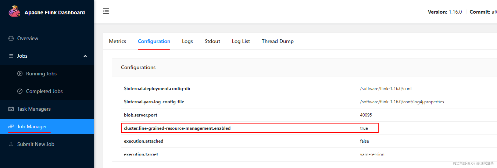

3. **向** Yarn Session **集群中提交任务**

在提交Flink任务时，为了演示出动态资源申请情况，我们手动指定Flink任务并行度为8。

```plain
#Yarn ApplicationId 可以通过Yarn WebUI界面获取
[root@node5 bin]# ./flink run  -p 8 -t yarn-session -Dyarn.application.id=application_1672116915790_0001 -c com.mashibing.flinkjava.code.chapter4.TestFineGrainedResourceManagement /root/FlinkJavaCode-1.0-SNAPSHOT-jar-with-dependencies.jar
```

以上代码提交后在Flink WebUI中查看对应的任务信息如下：

*(⚠️ 图片缺失:源知识库原图已失效)*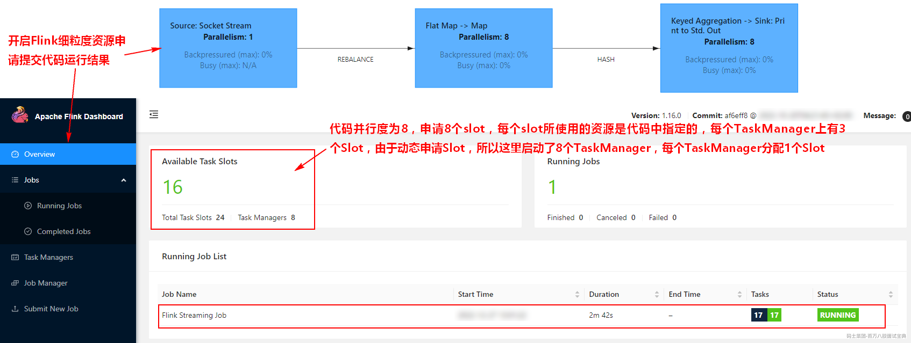

通过WebUI可以看到虽然每个TaskManager指定了3个TaskSlot ，但是在分配slot过程中并不是启动一个TaskManager后将该TM的所有Slot划分完再申请新的Slot，而是启动8个TaskManager，每个TaskManager上分配1个TaskSlot的动态资源分配，这也侧面显示Slot是动态划分的。

*(⚠️ 图片缺失:源知识库原图已失效)*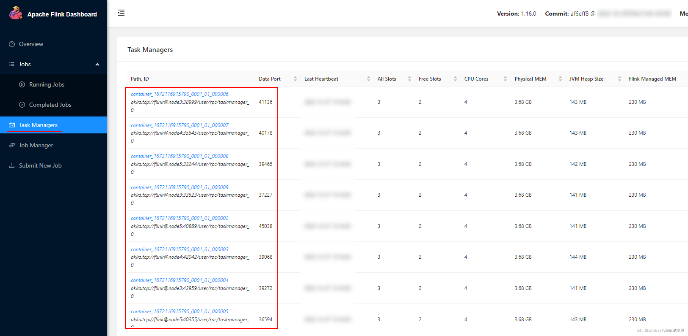

如果是非动态资源调度过程，由于代码并行度为8，Flink任务需要Slot个数为8，根据客户端配置每个TaskManager有3个taskslot，所以需要启动3个TaskManager,并且集群中还剩余1个taskslot。如下图所示：

*(⚠️ 图片缺失:源知识库原图已失效)*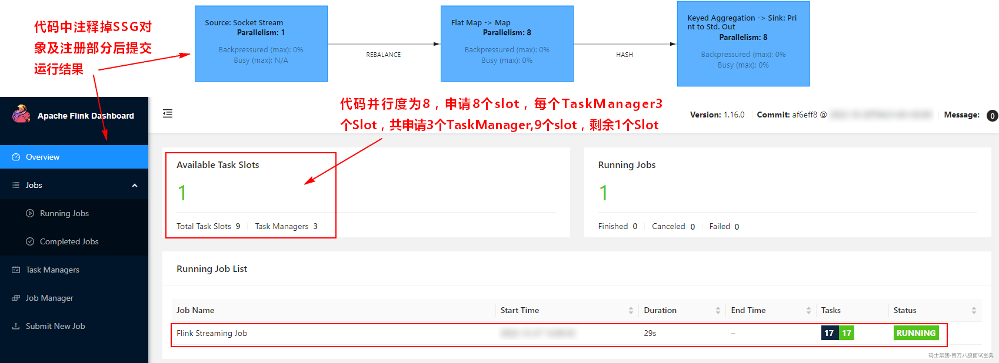

Yarn Applicatioin模式与Yarn Session模式类似，需要在提交任务的同时指定细粒度资源、TaskManager内存、并行度、每个TaskManager Slot个数参数，提交命令如下：

```plain
#注意：在提交Yarn Application任务时首先删除客户端/tmp/.yarn-properties-root文件
[root@node5 bin]# ./flink run-application \
-Dcluster.fine-grained-resource-management.enabled=true \
-Dtaskmanager.memory.process.size=1024m \
-Dparallelism.default=8 \
-t yarn-application \
-c com.mashibing.flinkjava.code.chapter4.TestFineGrainedResourceManagement \
/root/FlinkJavaCode-1.0-SNAPSHOT-jar-with-dependencies.jar
```

任务提交之后，通过Yarn观察WebUI页面，与Yarn Session 模式结果一样：

*(⚠️ 图片缺失:源知识库原图已失效)*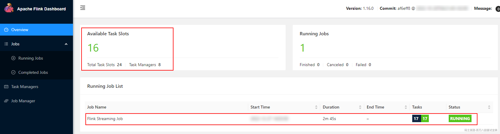

### 4.8.7局限性

由于细粒度资源管理是一项新的实验性功能，因此并非默认调度器支持的所有功能都可以使用。Flink社区正在努力解决这些限制。目前局限性如下：

- **不支持平均分配Slot策略**。这个策略试图在所有可用的taskmanager上平均分配Slot。细粒度资源管理和集群第一版不支持该策略。平均分配Slot目前不会在其中生效。

- **与Flink的Web UI的集成有限**。细粒度资源管理中的slot可以具有不同的资源规格。web UI目前不显示slot详细信息。

- **与批处理作业的有限集成**。目前，细粒度资源管理要求在所有边缘类型都被阻塞BLOCKING的情况下执行批处理工作负载。为此，您需要配置 fine-grained.shuffle-mode.all-blocking（在批处理作业中应用细粒度资源管理时，是否将所有的PIPELINE边缘转换为BLOCKING）为true。注意，这可能会影响性能。详见FLINK-20865。

- **不建议配置混合资源**。不建议仅为作业的某些部分指定资源需求，而未指定其余部分的资源需求。目前，任何资源的slot都可以满足未指定的需求。它获取的实际资源可能在不同的作业执行或故障切换中不一致。

- **Slot分配结果可能不是最优的**。由于Slot需求包含多个维度的资源，默认的资源分配策略可能无法实现最优的Slot分配，在某些场景下可能会导致资源分片或资源分配失败。

## 4.9Flink 内存模型

在大数据中所有开源计算框架都会使用到JVM ，例如：MapReduce、Storm、Spark等，这些计算框架在处理数据过程中涉及到将大量数据存储在内存中，此时如果内存管理过渡依赖JVM，**就会出现java对象存储密度低导致内存使用率低以及垃圾回收导致系统不稳定问题，这极大影响了系统的性能和稳定性**。Flink也是计算框架，计算过程中同样也是基于JVM，但是Flink实现了内存管理，即脱离JVM对内存进行管理，统一且有效地管理堆内存和堆外内存，确保大规模数据处理不会因为GC等问题造成系统不稳定。

Flink1.10版本后为了满足更细粒度以及灵活的内存管理,升级了内存模型，对内存组成进行了比较大的调整，由于在Flink中计算主要存在于TaskManager节点，这里说的Flink内存模型也就是TaskManager的内存模型，JobManager的内存模型与TaskManager的内存模型类似。

*(⚠️ 图片缺失:源知识库原图已失效)*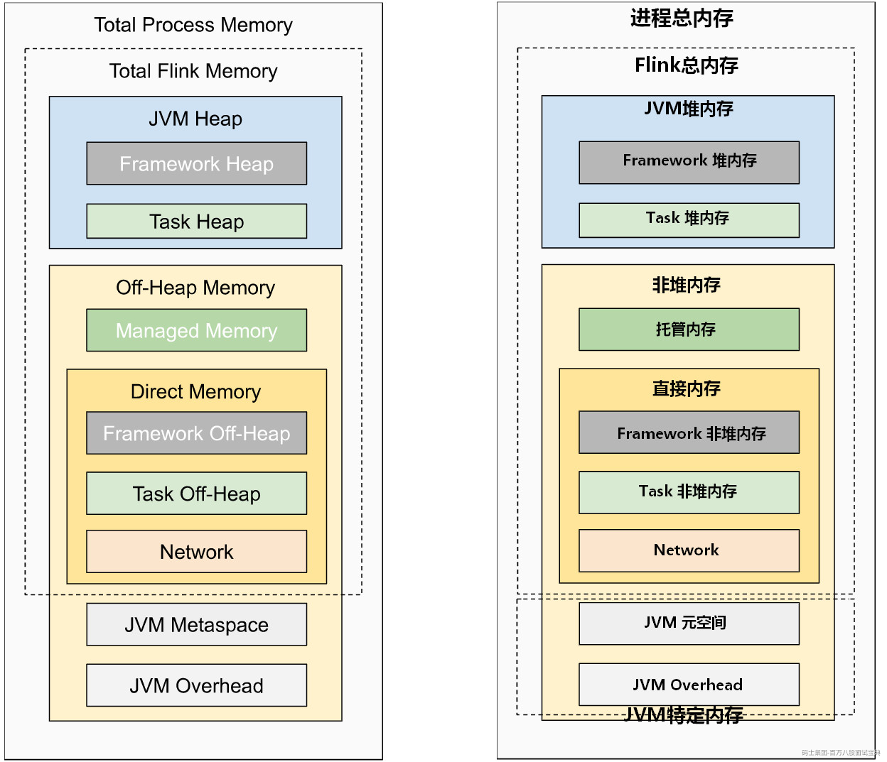

上图是Flink内存模型，从图中可以看出Flink 进程总内存(Total Process Memory)包含了Flink总内存（Total Flink Memory）和JVM特定内存。Flink总内存又包括JVM堆内存（JVM Heap）、托管内存（Managed Memory） 、直接内存（Direct Memory）。下面分别介绍各个部分内存功能以及参数配置。

### 4.9.1Flink 总内存（Total Flink Memory）

TaskManager进程占用的所有与Flink相关的内存，不包括JVM特定内存部分，包含6个部分内存（Framework堆内存、Task堆内存、托管内存、Framework非堆内存、Task非堆内存、Network），关于Flink Framework和Flink Task使用的内存既有堆内内存也有堆外内存，托管内存和Network使用的仅是堆外内存。

Flink总内存配置参数根据不同的部署场景不同：taskmanager.memory.flink.size 或者 taskmanager.memory.process.size（容器部署指定参数），无默认值，需要用户指定。

### 4.9.2Flink堆内存（JVM Heap）

Flink堆内存就是JVM堆内存（JVM Heap），分为Framework堆内存（Framework Heap）和Task堆内存（Task Heap），其中**Framework 主要用于Flink框架本身需要的内存空间，Task堆内存则用于Flink算子及用户代码的执行，也被称为TaskExecutor使用的内存**，两者的主要区别在于是否将内存计入Slot计算资源中，Framework堆内存不会将内存分配给Slot，Task堆内存会分配给Slot。

#### 4.9.2.1Framework堆内存（Framework Heap）

Framework堆内存配置参数为：taskmanager.memory.framework.heap.size，该值默认为128M。

#### 4.9.2.2Task 堆内存（Task Heap）

Task堆内存配置参数为：taskmanager.memory.task.heap.size，该值没有默认值，如果没有指定会自动用Flink总内存减去Framework堆内存（Framework Heap）、托管内存（Managed Memory）、Framework非堆内存（Framework Off-Heap）、Task非堆内存（Task Off-Heap）、NetWork的剩余内存。

### 4.9.3Flink非堆内存（Off-Heap Memory）

非堆内存也可以叫做堆外内存，更准确来说是大部分的堆外内存，包含了托管内存（Managed Memory）、直接内存（Direct Memory）两部分。

#### 4.9.3.1托管内存（Managed Memory）

托管内存（Managed Memory）是由Flink负责分配和管理的本地堆外内存，**在流处理作业中用于RocksDBstateBackend状态存储后端，在批处理作业中用于排序、哈希表及缓存中间结果**。

托管内存（Managed Memory）配置参数有两个，分别如下：

- taskmanager.memory.managed.fraction,默认值0.4，如果未显式指定托管内存大小，则使用总Flink内存的百分比作为托管内存。

- taskmanager.memory.managed.size，无默认值，一般也不指定，而是按照比例来推定，更加灵活。

#### 4.9.3.2直接内存（Direct Memory）

直接内存（Direct Memory）分为Framework非堆内存（Framework Off-Heap）、Task 非堆内存（Task Off-Heap）和Network三个部分。**直接内存主要作用是减少GC压力、提升性能效率**。

- **Framework非堆内存（Framework Off-Heap）**

Framework 非堆内存即taskexecutor的Framework 堆外内存大小，不会分配给slot，配置参数为：taskmanager.memory.framework.off-heap.size，默认值128M。

- **Task非堆内存(Task Off-Heap)**

Task非堆内存，配置参数taskmanager.memory.task.off-heap.size，默认值为0，即不使用。

- **Network**

Network内存存储空间主要用于基于Netty进行**网络数据交换数据传输的本地缓存**，例如：TaskManager之间Shuffle、广播、与外部组件的数据传输。Network的配置相关参数有3个，分别如下：

- taskmanager.memory.network.min：网络缓存的最小值，默认64MB；

- taskmanager.memory.network.max：网络缓存的最大值，默认1GB；

- taskmanager.memory.network.fraction：网络缓存占Flink总内存taskmanager.memory.flink.size的比例，默认值0.1。若根据此比例算出的内存量比最小值小或比最大值大，就会限制到最小值或者最大值。

### 4.9.4JVM 特定内存

JVM特定内存是JVM堆外内存的另一小部分内存，其不在Flink总内存范围之内，包括JVM元空间（JVM Metaspace）和JVM Overhead 两部分，其中**JVM元空间存储JVM加载类的元数据，加载的类越多，需要的内存空间越大，JVM Overhead 则主要用于其他JVM开销，例如代码缓存、线程栈等**。

Flink中将内存分成不同的区域，实现了更加精准地内存控制，在使用Flink过程中一般指定Flink总内存（Total Flink Memory，taskmanager.memory.flink.size）即可，其他额外指定JVM内存参数不需额外指定，如果需要根据Flink程序做一些调整建议有限调整fraction比例参数，例如：网络缓存占比taskmanager.memory.network.fraction（根据网络流量大小调节）与托管内存占比taskmanager.memory.managed.fraction（根据RocksDB状态大小调节），这样做可以间接影响任务内存的配额，需要特别注意的是如果手动指定较多的固定参数很有可能出现内存配额冲突导致Flink程序部署失败。
