# **6 第六章 Flink编程模型与API**

本章节中我们针对Flink的编程模型与API进行讲解，主要基于DataStream API 进行编程，学习Flink编程方式，处理数据流程以及转换处理，本章节中涉及到的代码实现使用Java和Scala两种语言来实现。

## 6.1 **Flink API**

Flink为用户提供了多个层级API，用户可以根据自己使用的需求来选择，不同的API层级可以混用以实现复杂的业务逻辑，Flink API层级如下：

*(⚠️ 图片缺失:源知识库原图已失效)* 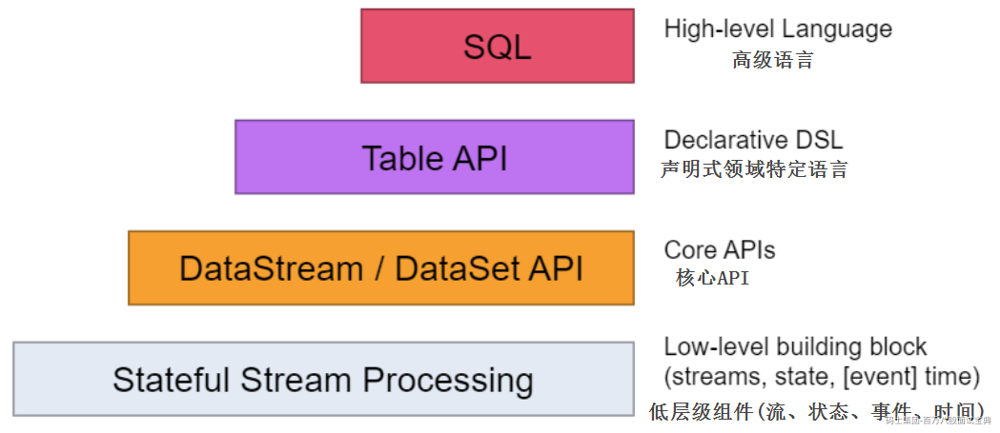

- **Stateful Stream Processing**

底层的状态流处理API的抽象程度最低，而且只能用于流处理，提供了非常灵活的接口，可以用于自定义底层与状态、时间相关的操作。

- **DataSteam/DataSet API**

这一层级的API是Flink中的核心API，这一层级中要处理的数据会被抽象成数据流（DataStream）或数据集（DataSet）,然后在其上通过定义转换操作实现业务逻辑，例如：map/flatMap/window/keyby/sum/join等，这一层级API的使用风格与Java 8中的Stream使用风格十分类似。

- **Table API**

在DataStream/DataSet API 之上是Table API ，Table API和DataStream/DataSet API不同，不是用复杂的函数定义业务流程的，而是用陈述性的语言加以描述，这样就大大降低编程难度，增强描述性。这种语言来着SQL语法，只不过以API的形式呈现出来，既然有了Table API ,那么自然可以直接使用SQL来进行描述，这就是最上层的SQL。

- **SQL**

Flink提供的最高层级的抽象是SQL，这一层抽象在语法与表达能力上与Table API 类似，SQL抽象与Table API交互密切，同时SQL查询可以直接在Table API定义的表上执行。

总而言之，越上层的API，其描述性和可阅读性越强，越下层API，其灵活度高、表达力越强，多数时候上层API能做到的事情，下层API也能做到，反过来未必，不过这些API的底层模型是一致的，可以混合使用。

Flink架构可以处理批和流，Flink 批处理数据需要使用到Flink中的DataSet API，此API主要是支持Flink针对批数据进行操作，本质上Flink处理批数据也是看成一种特殊的流处理（有界流），所以没有必要分成批和流两套API，从Flink1.12版本往后，Dataset API 已经标记为Legacy(已过时)，已被官方软弃用，官方建议使用Table API 或者SQL 来处理批数据，我们也可以使用带有Batch执行模式的DataStream API来处理批数据（DataSet和DataStream API做到了合并），在未来Flink版本中DataSet API 将会被删除。

DataStream API的学习对于理解Flink数据处理流程非常方便，上手相对来说比较容易，下面我们先从核心API层开始学习，对于底层API、Table API、SQL部分在后续章节在做介绍。

## 6.2 **Flink编程模型**

### **6.2.1 代码编写流程**

在第二章节学习中我们知道DataStream的编程模型包括以下几个部分：Environment、DataSource、Transformation、DataSink、触发执行。

*(⚠️ 图片缺失:源知识库原图已失效)* 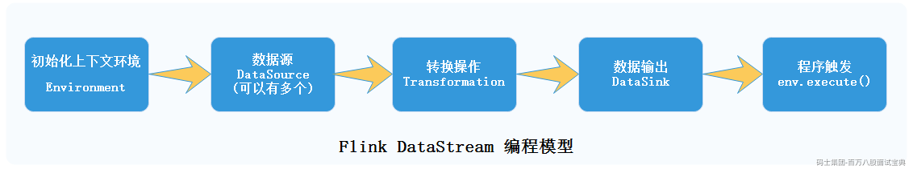

Environment是编写Flink程序的基础，不同层级API编程中创建的Environment环境不同，如：Dataset 编程中需要创建ExecutionEnvironment，DataStream编程中需要创建StreamExecutionEnvironment，在Table和SQL API中需要创建TableExecutionEnvironment，使用不同语言编程导入的包也不同，在获取到对应的Environment后我们还可以进行外参数的配置，例如：并行度、容错机制设置等。

DataSource部分主要定义了数据接入功能，主要是将外部数据接入到Flink系统中并转换成DataStream对象供后续的转换使用。Transformation部分有各种各样的算子操作可以对DataStream流进行转换操作，最终将转换结果数据通过DataSink写出到外部存储介质中，例如：文件、数据库、Kafka消息系统等。

在DataStream编程中编写完成DataSink代码后并不意味着程序结束，由于Flink是基于事件驱动处理的，有一条数据时就会进行处理，所以最后一定要使用Environment.execute()来触发程序执行。

### **6.2.2 Flink数据类型**

在Flink内部处理数据时，涉及到数据的网络传输、数据的序列化及反序列化，Flink需要知道操作的数据类型，为了能够在分布式计算过程中对数据的类型进行管理和判断，Flink中定义了TypeInformation来对数据类型进行描述，通过TypeInfomation能够在数据处理之前将数据类型推断出来，而不是真正在触发计算后才识别出，这样可以有效避免用户在编写Flink应用的过程出现数据类型问题。

常用的TypeInformation有BasicTypeInfo、TupleTypeInfo、CaseClassTypeInfo、PojoTypeInfo类等，针对这些常用TypeInfomation介绍如下：

- Flink通过实现BasicTypeInfo数据类型，能够支持任意Java原生基本（或装箱）类型和String类型，例如：Integer,String,Double等，除了BasicTypeInfo外，类似的还有BasicArrayTypeInfo，支持Java中数组和集合类型；

- 通过定义TupleTypeInfo来支持Tuple类型的数据；

- 通过CaseClassTypeInfo支持Scala Case Class ；

- PojoTypeInfo可以识别任意的POJOs类,包括Java和Scala类，POJOs可以完成复杂数据架构的定义，但是在Flink中使用POJOs数据类型需要满足以下要求:

- POJOs类必须是Public修饰且独立定义，不能是内部类；

- POJOs 类中必须含有默认空构造器；

- POJOs类中所有的Fields必须是Public或者具有Public修饰的getter和Setter方法；

在使用Java API开发Flink应用时，通常情况下Flink都能正常进行数据类型推断进而选择合适的serializers以及comparators，但是在定义函数时如果使用到了泛型，JVM就会出现类型擦除的问题，Flink就获取不到对应的类型信息，这就需要借助类型提示（Type Hints）来告诉系统函数中传入的参数类型信息和输出类型，进而对数据类型进行推断处理。如：

```plain
SingleOutputStreamOperator<Tuple2<String, Long>> kvWordsDS =
        lines.flatMap((String line, Collector<Tuple2<String, Long>> collector) -> {
    String[] words = line.split(" ");
    for (String word : words) {
        collector.collect(Tuple2.of(word, 1L));
    }
}).returns(Types.TUPLE(Types.STRING, Types.LONG));
```

在使用Scala API 开发Flink应用时，Scala API通过使用Manifest和类标签在编译器运行时获取类型信息，即使在函数定义中使用了泛型，也不会像Java API出现类型擦除问题，但是在使用到Flink已经通过TypeInformation定义的数据类型时，TypeInformation类不会自动创建，需要使用隐式参数的方式引入：import org.apache.flink.api.scala.\_，否则在运行代码过程中会出现“could not find implicit value for evidence parameter of type TypeInformation”的错误。

### **6.2.3 Flink序列化机制**

在两个进程进行远程通信时，它们需要将各种类型的数据以二进制序列的形式在网络上传输，数据发送方需要将对象转换为字节序列，进行序列化，而接收方则将字节序列恢复为各种对象，进行反序列化。对象的序列化有两个主要用途：一是将对象的字节序列永久保存到硬盘上，通常存放在文件中；二是在网络上传输对象的字节序列。序列化的好处包括减少数据在内存和硬盘中的占用空间，减少网络传输开销，精确推算内存使用情况，降低垃圾回收的频率。

Flink序列化机制负责在节点之间传输数据时对数据对象进行序列化和反序列化，确保数据的正确性和一致性。Flink提供了多种序列化器，包括Kryo、Avro和Java序列化器等，大多数情况下，用户不用担心flink的序列化框架，Flink会通过TypeInfomation在数据处理之前推断数据类型，进而使用对应的序列化器，例如：针对标准类型（int,double,long,string）直接由Flink自带的序列化器处理，其他类型默认会交给Kryo处理。但是对于Kryo仍然无法处理的类型，可以采取以下两种解决方案：

**1) 强制使用Avro替代Kryo序列化**

```plain
//设置flink序列化方式为avro
env.getConfig().enableForceAvro();
```

**2) 自定义注册Kryo序列化**

```plain
//注册kryo 自定义序列化器
env.getConfig().registerTypeWithKryoSerializer(Class<?> type, Class<? extends Serializer> serializerClass)
```

下面给出Java和Scala自定义注册Kryo序列化器的方式，代码如下：

- **Java代码自定义类及自定义序列化：**

```plain
public class Student {
    public Integer id;
    public String name;
    public Integer age;

    public Student() {
    }

    public Student(Integer id, String name, Integer age) {
        this.id = id;
        this.name = name;
        this.age = age;
    }
    @Override
    public String toString() {
        return "Student{" +
                "id=" + id +
                ", name='" + name + '\'' +
                ", age=" + age +
                '}';
    }
}
public class StudentSerializer extends Serializer {
    @Override
    public void write(Kryo kryo, Output output, Object o) {
        Student student = (Student) o;
        output.writeInt(student.id);
        output.writeString(student.name);
        output.writeInt(student.age);
    }

    @Override
    public Object read(Kryo kryo, Input input, Class aClass) {
        Student student = new Student();
        student.id = input.readInt();
        student.name = input.readString();
        student.age = input.readInt();
        return student;

    }
}
```

- **Java代码**

```plain
/**
 * 用户自定义Kryo序列化测试
 */
public class KryoSerTest {
    public static void main(String[] args) throws Exception {
        StreamExecutionEnvironment env = StreamExecutionEnvironment.getExecutionEnvironment();
        //注册自定义的Kryo序列化类
        env.getConfig().registerTypeWithKryoSerializer(Student.class, StudentSerializer.class);

        //用户基本信息
        env.fromCollection(Arrays.asList(
                        "1,zs,18",
                        "2,ls,20",
                        "3,ww,19"
                )).map(one -> {
                    String[] split = one.split(",");
                    return new Student(Integer.valueOf(split[0]), split[1], Integer.valueOf(split[2]));
                }).returns(Types.GENERIC(Student.class))
                .filter(new FilterFunction<Student>() {
                    @Override
                    public boolean filter(Student student) throws Exception {
                        return student.id > 1;
                    }
                })
                .print();

        env.execute();

    }

}
```

- **Scala代码**

```plain
/**
 * 用户自定义Kryo序列化测试
 *  这里需要使用 Java 创建Student类及对应的序列化类
 */
object KryoSerTest {
  def main(args: Array[String]): Unit = {
    val env = StreamExecutionEnvironment.getExecutionEnvironment
    //导入隐式转换
    import org.apache.flink.api.scala._

    // 注册自定义的Kryo序列化类
    env.getConfig.registerTypeWithKryoSerializer(classOf[Student], classOf[StudentSerializer])

    // 用户基本信息
    env.fromCollection(Seq(
      "1,zs,18",
      "2,ls,20",
      "3,ww,19"
    )).map(one => {
      val split = one.split(",")
      new Student(split(0).toInt, split(1), split(2).toInt)
    }).filter(_.id > 1)
      .print()

    env.execute()
  }

}
```

## 6.3 **Flink Source**

DataSources模块定义了DataStream API 中数据输入操作，Flink中内置了很多数据源Source，例如：文件数据源、Socket数据源、集合数据源,同时也支持第三方数据源，例如：Kafka数据源、自定义数据源，下面分别使用DataStream API进行一一演示。

### **6.3.1 File Source**

在Flink早先版本读取文本数据我们可以使用env.readTextFile(filePath）方法来实现，在后续版本中该方法被标记过时，建议使用DataStream Connectors来完成。 这里以读取HDFS中的文件进行演示。

在linux中创建data.txt文件，写入如下内容:

```plain
hello,a
hello,b
hello,c
```

将以上文件上传至HDFS /flinkdata目录中:

```plain
#创建HDFS 目录
hdfs dfs -mkdir /flinkdata
#上传数据
hdfs dfs -put ./data.txt  /flinkdata/
```

编写Flink读取文件Source代码前，无论是Java API 还是Scala API都需要在项目中导入如下依赖：

```plain
<!-- DataStream files connector -->
<dependency>
  <groupId>org.apache.flink</groupId>

  <artifactId>flink-connector-files</artifactId>

  <version>${flink.version}</version>

</dependency>

<!-- 读取HDFS 数据需要的依赖 -->
<dependency>
  <groupId>org.apache.hadoop</groupId>

  <artifactId>hadoop-client</artifactId>

  <version>${hadoop.version}</version>

</dependency>

```

- Java代码如下：

```plain
StreamExecutionEnvironment env = StreamExecutionEnvironment.getExecutionEnvironment();
        /**
         * Flink1.14版本之前读取文件写法
         */
//        DataStreamSource<String> dataStream = env.readTextFile("hdfs://mycluster/flinkdata/data.txt");
//        dataStream.print();

        /**
         * Flink 读取文件最新写法
         */
        FileSource<String> fileSource = FileSource.forRecordStreamFormat(
                new TextLineInputFormat(),
                new Path("hdfs://mycluster/flinkdata/data.txt")).build();

        DataStreamSource<String> dataStream = env.fromSource(fileSource, WatermarkStrategy.noWatermarks(), "file-source");

        dataStream.print();

        env.execute();
```

- Scala代码如下

```plain
val env: StreamExecutionEnvironment = StreamExecutionEnvironment.getExecutionEnvironment

import org.apache.flink.api.scala._

val fileSource: FileSource[String] = FileSource.forRecordStreamFormat(
  new TextLineInputFormat(),
  new Path("hdfs://mycluster/flinkdata/data.txt")
).build()

val dataStream: DataStream[String] = env.fromSource(fileSource, WatermarkStrategy.noWatermarks(), "file-source")

dataStream.print()

env.execute()
```

以上文件Source除了读取Text数据之外，还可以读取avro、csv、json、parquet格式对应文件，具体API可以参照官网：<https://nightlies.apache.org/flink/flink-docs-release-1.16/docs/connectors/datastream/formats/overview/。>

### **6.3.2 Socket Source**

Flink读取Socket数据在前几个小节中已经演示过，这里不再读取Socket中的数据。Socket Source常用于程序测试。

### **6.3.3 集合 Source**

Flink可以读取集合中的数据得到DataStream，这里我们自定义POJO创建StationLog对象来形成集合数据。

- StationLog对象Java代码如下：

```plain
/**
 * StationLog基站日志类
 *  sid:基站ID
 *  callOut: 主叫号码
 *  callIn: 被叫号码
 *  callType: 通话类型，失败（fail）/占线（busy）/拒接（barring）/接通（success）
 *  callTime: 呼叫时间戳，毫秒
 *  duration: 通话时长，秒
 */
public class StationLog {
    public String sid;
    public String callOut;
    public String callIn;
    public String callType;
    public Long callTime;
    public Long duration;

    public StationLog() {
    }

    public StationLog(String sid, String callOut, String callIn, String callType, Long callTime, Long duration) {
        this.sid = sid;
        this.callOut = callOut;
        this.callIn = callIn;
        this.callType = callType;
        this.callTime = callTime;
        this.duration = duration;
    }

    @Override
    public String toString() {
        return "StationLog{" +
                "sid='" + sid + '\'' +
                ", callOut='" + callOut + '\'' +
                ", callIn='" + callIn + '\'' +
                ", callType='" + callType + '\'' +
                ", callTime=" + callTime +
                ", duration=" + duration +
                '}';
    }
}
```

- 读取集合Source Java代码如下

```plain
StreamExecutionEnvironment env = StreamExecutionEnvironment.getExecutionEnvironment();
ArrayList<StationLog> stationLogArrayList = new ArrayList<StationLog>();
stationLogArrayList.add(new StationLog("001", "186", "187", "busy", 1000L, 0L));
stationLogArrayList.add(new StationLog("002", "187", "186", "fail", 2000L, 0L));
stationLogArrayList.add(new StationLog("003", "186", "188", "busy", 3000L, 0L));
stationLogArrayList.add(new StationLog("004", "188", "186", "busy", 4000L, 0L));
stationLogArrayList.add(new StationLog("005", "188", "187", "busy", 5000L, 0L));
DataStreamSource<StationLog> dataStreamSource = env.fromCollection(stationLogArrayList);
dataStreamSource.print();
env.execute();
```

- StationLog对象Scala代码如下：

```plain
/**
 * StationLog基站日志类
 * sid:基站ID
 * callOut: 主叫号码
 * callIn: 被叫号码
 * callType: 通话类型，失败（fail）/占线（busy）/拒接（barring）/接通（success）
 * callTime: 呼叫时间戳，毫秒
 * duration: 通话时长，秒
 */
case class StationLog(sid:String,callOut:String,callIn:String,callType:String,callTime:Long,duration:Long)
```

- 读取集合Source Scala代码如下:

```plain
val env: StreamExecutionEnvironment = StreamExecutionEnvironment.getExecutionEnvironment

import org.apache.flink.api.scala._

val arrays: Array[StationLog] = Array(StationLog("001", "186", "187", "busy", 1000L, 0L),
  StationLog("002", "187", "186", "fail", 2000L, 0L),
  StationLog("003", "186", "188", "busy", 3000L, 0L),
  StationLog("004", "188", "186", "busy", 4000L, 0L),
  StationLog("005", "188", "187", "busy", 5000L, 0L))

val dataStream: DataStream[StationLog] = env.fromCollection(arrays)
dataStream.print()

env.execute()
```

除了以上可以从集合中获取DataStream之外，类似的还有从多个元素对象获取对应的DataStream方法如下：

```plain
env.fromElements(elem1,elem2,elem3...)
```

集合Source也常用于程序测试。

### **6.3.4 Kafka Source**

在实时处理场景中Flink读取kafka中的数据是最常见的场景，Flink在操作Kafka时天生支持容错、数据精准消费一次，所以Flink与Kafk是一对“黄金搭档”，关于两者整合容错机制原理在后续章节再介绍，这里主要从API层面实现Flink操作Kafka数据，Flink读取Kafka中的数据需要配置Kakfa Connector依赖，依赖如下：

```plain
<!-- 读取Kafka 依赖-->
<dependency>
  <groupId>org.apache.flink</groupId>

  <artifactId>flink-connector-kafka</artifactId>

  <version>${flink.version}</version>

</dependency>

```

读取Kafka中的数据时可以选择读取每条数据的key和value，也可以选择只读取Value，两者API写法不同。

#### 6.3.4.1 **读取Kafka中Value数据**

- Java代码如下

```plain
StreamExecutionEnvironment env = StreamExecutionEnvironment.getExecutionEnvironment();
KafkaSource<String> kafkaSource = KafkaSource.<String>builder()
        .setBootstrapServers("node1:9092,node2:9092,node3:9092") //设置Kafka 集群节点
        .setTopics("testtopic") //设置读取的topic
        .setGroupId("my-test-group") //设置消费者组
        .setStartingOffsets(OffsetsInitializer.latest()) //设置读取数据位置
        .setValueOnlyDeserializer(new SimpleStringSchema()) //设置value的反序列化格式
        .build();

DataStreamSource<String> kafkaDS = env.fromSource(kafkaSource, WatermarkStrategy.noWatermarks(), "kafka-source");

kafkaDS.print();

env.execute();
```

- Scala代码如下：

```plain
val env: StreamExecutionEnvironment = StreamExecutionEnvironment.getExecutionEnvironment

import org.apache.flink.api.scala._

val kafkaSource: KafkaSource[String] = KafkaSource.builder[String]()
  .setBootstrapServers("node1:9092,node2:9092,node3:9092") //设置Kafka集群Brokers
  .setTopics("testtopic") //设置topic
  .setGroupId("my-test-group") //设置消费者组
  .setStartingOffsets(OffsetsInitializer.latest()) // 读取位置
  .setValueOnlyDeserializer(new SimpleStringSchema()) //设置Value的反序列化格式
  .build()

val kafkaDS: DataStream[String] = env.fromSource(kafkaSource, WatermarkStrategy.noWatermarks(), "kafka-source")

kafkaDS.print()

env.execute()
```

代码编写完成后执行，向kafka testtopic中输入如下数据，可以在控制台看到对应数据结果。

```plain
[root@node1 bin]# kafka-console-producer.sh --bootstrap-server node1:9092,node2:9092,node3:9092--topic testtopic
>value1
>value2
>value3
>value4
>value5
```

#### 6.3.4.2 **读取Kafka中Key、Value数据**

- java代码

```plain
StreamExecutionEnvironment env = StreamExecutionEnvironment.getExecutionEnvironment();

KafkaSource<Tuple2<String, String>> kafkaSource = KafkaSource.<Tuple2<String, String>>builder()
        .setBootstrapServers("node1:9092,node2:9092,node3:9092") //设置Kafka 集群节点
        .setTopics("testtopic") //设置读取的topic
        .setGroupId("my-test-group") //设置消费者组
        .setStartingOffsets(OffsetsInitializer.latest()) //设置读取数据位置
        .setDeserializer(new KafkaRecordDeserializationSchema<Tuple2<String, String>>() {
            //设置key ,value 数据获取后如何处理
            @Override
            public void deserialize(ConsumerRecord<byte[], byte[]> consumerRecord, Collector<Tuple2<String, String>> collector) throws IOException {
                String key = null;
                String value = null;
                if(consumerRecord.key() != null){
                    key = new String(consumerRecord.key(), "UTF-8");
                }
                if(consumerRecord.value() != null){
                    value = new String(consumerRecord.value(), "UTF-8");
                }
                collector.collect(Tuple2.of(key, value));
            }

            //设置置返回的二元组类型
            @Override
            public TypeInformation<Tuple2<String, String>> getProducedType() {
                return TypeInformation.of(new TypeHint<Tuple2<String, String>>() {
                });
            }
        })
        .build();

DataStreamSource<Tuple2<String, String>> kafkaDS = env.fromSource(kafkaSource, WatermarkStrategy.noWatermarks(), "kafka-source");

kafkaDS.print();

env.execute();
```

- Scala代码如下

```plain
val env: StreamExecutionEnvironment = StreamExecutionEnvironment.getExecutionEnvironment
import org.apache.flink.api.scala._

val kafkaSource: KafkaSource[(String, String)] = KafkaSource.builder[(String, String)]()
  .setBootstrapServers("node1:9092,node2:9092,node3:9092") //设置Kafka集群Brokers
  .setTopics("testtopic") //设置topic
  .setGroupId("my-test-group") //设置消费者组
  .setStartingOffsets(OffsetsInitializer.latest()) // 读取位置
  .setDeserializer(new KafkaRecordDeserializationSchema[(String, String)] {
    //组织 consumerRecord 数据
    override def deserialize(consumerRecord: ConsumerRecord[Array[Byte], Array[Byte]], collector: Collector[(String, String)]): Unit = {
      var key: String = null
      var value: String = null
      if (consumerRecord.key() != null) {
        key = new String(consumerRecord.key(), "UTF-8")
      }
      if (consumerRecord.value() != null) {
        value = new String(consumerRecord.value(), "UTF-8")
      }

      collector.collect((key, value))
    }

    //设置返回的二元组类型 ,createTuple2TypeInformation 需要导入隐式转换
    override def getProducedType: TypeInformation[(String, String)] = {
      createTuple2TypeInformation(createTypeInformation[String], createTypeInformation[String])
    }
  })
  .build()

val ds: DataStream[(String, String)] = env.fromSource(kafkaSource, WatermarkStrategy.noWatermarks(), "kafka-source")
ds.print()
env.execute()
```

代码编写完成后执行，向kafka testtopic中输入如下key，value数据，需要在kafka命令中加入“parse.key”、“key.separator”配置项分别指定向kafka topic中生产数据带有key和kv数据的分隔符（默认是\t），可以在控制台看到key、value对应数据结果。

```plain
[root@node1 bin]# kafka-console-producer.sh --bootstrap-server node1:9092,node2:9092,node3:9092 --topic testtopic --property  parse.key=true -property key.separator='|'
>key1|value1
>key2|value2
>key3|value3
>key4|value4
>key5|value5
```

### **6.3.5 自定义 Source**

对于一些其他的数据源，我们也可以实现自定义Source进行实时数据获取。自定义数据源有两种实现方式：

- 通过实现SourceFunction接口来自定义无并行度（也就是并行度只能为1）的Source。

- 通过实现ParallelSourceFunction 接口或者继承RichParallelSourceFunction 来自定义有并行度的数据源。

无论是那种接口实现方式都需要重写以下两个方法：

1. run()：大部分情况下都需要在run方法中实现一个循环产生数据，通过Flink上下文对象传递到下游。

2. cancel():当取消对应的Flink任务时被调用。

#### 6.3.5.1 **SourceFunction接口实现**

实现SourceFunction 接口实现无并行度的自定义Source，java代码和Scala代码分别如下：

- Java代码

```plain
/**
 * 自定义非并行Source
 */
class MyDefinedNoParalleSource implements SourceFunction<StationLog>{
    Boolean flag = true;

    /**
     * 主要方法:启动一个Source，大部分情况下都需要在run方法中实现一个循环产生数据
     * 这里计划每秒产生1条基站数据
     */
    @Override
    public void run(SourceContext<StationLog> ctx) throws Exception {
        Random random = new Random();
        String[] callTypes = {"fail","success","busy","barring"};
        while(flag){
            String sid = "sid_"+random.nextInt(10);
            String callOut = "1811234"+(random.nextInt(9000)+1000);
            String callIn = "1915678"+(random.nextInt(9000)+1000);
            String callType = callTypes[random.nextInt(4)];
            Long callTime = System.currentTimeMillis();
            Long durations = Long.valueOf(random.nextInt(50)+"");
            ctx.collect(new StationLog(sid,callOut,callIn,callType,callTime,durations));
            Thread.sleep(1000);//1s 产生一个事件
        }

    }

    //当取消对应的Flink任务时被调用
    @Override
    public void cancel() {
        flag = false;
    }
}

/**
 * Flink读取自定义Source，并行度为1
 */
public class NoParalleSource {
    public static void main(String[] args) throws Exception {
        StreamExecutionEnvironment env = StreamExecutionEnvironment.getExecutionEnvironment();
        DataStreamSource<StationLog> dataStream = env.addSource(new MyDefinedNoParalleSource());
        dataStream.print();
        env.execute();
    }
}
```

- Scala 代码

```plain
/**
 * Flink读取自定义Source，并行度为1
 */
class MyDefinedNoParalleSource extends SourceFunction[StationLog]{
  var flag = true

  /**
   * 主要方法:启动一个Source，大部分情况下都需要在run方法中实现一个循环产生数据
   * 这里计划每次产生10条基站数据
   */
  override def run(ctx: SourceFunction.SourceContext[StationLog]): Unit = {
    val random = new Random()
    val callTypes = Array[String]("fail", "success", "busy", "barring")

    while (flag) {
      val sid = "sid_" + random.nextInt(10)
      val callOut = "1811234" + (random.nextInt(9000) + 1000)
      val callIn = "1915678" + (random.nextInt(9000) + 1000)
      val callType = callTypes(random.nextInt(4))
      val callTime = System.currentTimeMillis()
      val durations = random.nextInt(50).toLong
      ctx.collect(StationLog(sid, callOut, callIn, callType, callTime, durations))

      Thread.sleep(1000) //每条数据暂停1s
    }
  }

  //当取消对应的Flink任务时被调用
  override def cancel(): Unit = {
    flag = false
  }
}

object NoParalleSource {
  def main(args: Array[String]): Unit = {
    val env: StreamExecutionEnvironment = StreamExecutionEnvironment.getExecutionEnvironment
    import org.apache.flink.api.scala._
    val ds: DataStream[StationLog] = env.addSource(new MyDefinedNoParalleSource)
    ds.print()
    env.execute()

  }
}
```

#### 6.3.5.2 **ParallelSourceFunction接口实现**

实现ParallelSourceFunction 接口实现有并行度的自定义Source，Java代码和Scala代码分别如下：

- Java代码

```plain
/**
 * Flink读取自定义有并行度的Source，自定义Source实现 ParallelSourceFunction
 */
class MyDefinedParalleSource implements ParallelSourceFunction<StationLog>{
    Boolean flag = true;

    /**
     * 主要方法:启动一个Source，大部分情况下都需要在run方法中实现一个循环产生数据
     * 这里计划1s 产生1条基站数据，由于是并行，当前节点有几个core就会有几条数据
     */
    @Override
    public void run(SourceContext<StationLog> ctx) throws Exception {
        Random random = new Random();
        String[] callTypes = {"fail","success","busy","barring"};
        while(flag){
            String sid = "sid_"+random.nextInt(10);
            String callOut = "1811234"+(random.nextInt(9000)+1000);
            String callIn = "1915678"+(random.nextInt(9000)+1000);
            String callType = callTypes[random.nextInt(4)];
            Long callTime = System.currentTimeMillis();
            Long durations = Long.valueOf(random.nextInt(50)+"");
            ctx.collect(new StationLog(sid,callOut,callIn,callType,callTime,durations));
            Thread.sleep(1000);//1s 产生一个事件
        }

    }

    //当取消对应的Flink任务时被调用
    @Override
    public void cancel() {
        flag = false;
    }
}

public class ParalleSource {
    public static void main(String[] args) throws Exception {
        StreamExecutionEnvironment env = StreamExecutionEnvironment.getExecutionEnvironment();
        DataStreamSource<StationLog> dataStream = env.addSource(new MyDefinedParalleSource());
        dataStream.print();
        env.execute();
    }
}
```

- Scala代码

```plain
/**
 * Flink读取自定义有并行度的Source，自定义Source实现 ParallelSourceFunction
 */
class MyDefinedParalleSource extends ParallelSourceFunction[StationLog]{
  var flag = true

  /**
   * 主要方法:启动一个Source，大部分情况下都需要在run方法中实现一个循环产生数据
   * 这里计划每次产生10条基站数据
   */
  override def run(ctx: SourceContext[StationLog]): Unit = {
    val random = new Random()
    val callTypes = Array[String]("fail", "success", "busy", "barring")

    while (flag) {
      val sid = "sid_" + random.nextInt(10)
      val callOut = "1811234" + (random.nextInt(9000) + 1000)
      val callIn = "1915678" + (random.nextInt(9000) + 1000)
      val callType = callTypes(random.nextInt(4))
      val callTime = System.currentTimeMillis()
      val durations = random.nextInt(50).toLong
      ctx.collect(StationLog(sid, callOut, callIn, callType, callTime, durations))

      Thread.sleep(1000) //每条数据暂停1s
    }
  }

  //当取消对应的Flink任务时被调用
  override def cancel(): Unit = {
    flag = false
  }
}

object ParalleSource {
  def main(args: Array[String]): Unit = {
    val env: StreamExecutionEnvironment = StreamExecutionEnvironment.getExecutionEnvironment
    import org.apache.flink.api.scala._
    val ds: DataStream[StationLog] = env.addSource(new MyDefinedParalleSource)
    ds.print()
    env.execute()
  }
}
```

## 6.4 **Flink Transformation**

Transformation 类算子是 Apache Flink 中用于定义数据流处理的基本构建块。它们允许对DataStream数据流进行转换和操作，包括数据转换、数据操作和数据重组,通过Transformation类算子，可以对输入数据流进行映射、过滤、聚合等操作，生成新的DataStream数据流作为输出，以满足特定的处理需求。下面分别介绍Flink中常见的Transformation类算子。

### **6.4.1 map**

map用于对输入的DataStream数据流中的每个元素进行映射操作,它接受一个函数作为参数，该函数将每个输入元素转换为一个新的元素，并生成一个新的数据流作为输出。**DataStream类型数据通过map函数进行数据转换后还会得到DataStream类型，其中数据格式可能会发生变化。** 下图演示将输入数据集中的每个数值全部加1处理，经过map算子转换后输出到下游数据集。

*(⚠️ 图片缺失:源知识库原图已失效)* 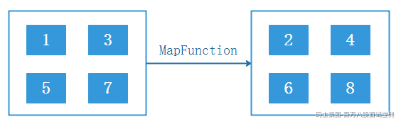

- Java代码实现

```plain
StreamExecutionEnvironment env = StreamExecutionEnvironment.getExecutionEnvironment();
DataStreamSource<Integer> ds = env.fromCollection(Arrays.asList(1, 3, 5, 7));
SingleOutputStreamOperator<Integer> mapTransformation = ds.map(new MapFunction<Integer, Integer>() {
    @Override
    public Integer map(Integer value) throws Exception {
        return value + 1;
    }
});
mapTransformation.print();
env.execute();
```

**注意**：以上DataStream经过Flink转换得到了“SingleOutputStreamOperator”类型，该类型继承了DataStream类。

- Scala代码实现

```plain
val env: StreamExecutionEnvironment = StreamExecutionEnvironment.getExecutionEnvironment
//导入隐式转换
import org.apache.flink.streaming.api.scala._
val ds: DataStream[Int] = env.fromCollection(List(1, 3, 5, 7))
val result: DataStream[Int] = ds.map(_ + 1)
result.print()
env.execute()
```

### **6.4.2 flatMap**

flatMap算子用于对输入的DataStream中的每个元素进行扁平化映射操作的算子，它接受一个函数作为参数，该函数将每个输入元素转换为零个或多个新的元素，并生成一个新的DataStream数据流作为输出。**DataStream类型数据通过map函数进行数据转换后还会得到DataStream类型，其中数据格式可能会发生变化。**

与map算子不同，flatMap算子可以生成比输入更多的元素，因此可以用于扁平化操作。下图表示通过flatMap算子对输入数据集中每行数据按照逗号分割得到新的数据流输出到下游。

*(⚠️ 图片缺失:源知识库原图已失效)* 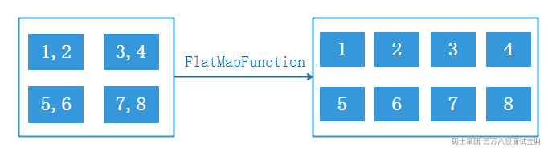

- Java代码实现

```plain
StreamExecutionEnvironment env = StreamExecutionEnvironment.getExecutionEnvironment();
DataStreamSource<String> ds = env.fromCollection(Arrays.asList("1,2", "3,4", "5,6", "7,8"));
SingleOutputStreamOperator<String> result = ds.flatMap(new FlatMapFunction<String, String>() {
    @Override
    public void flatMap(String value, Collector<String> out) throws Exception {
        String[] split = value.split(",");
        for (String s : split) {
            out.collect(s);
        }
    }
});
result.print();
env.execute();
```

- Scala代码实现

```plain
val env: StreamExecutionEnvironment = StreamExecutionEnvironment.getExecutionEnvironment
//导入隐式转换
import org.apache.flink.api.scala._
val ds: DataStream[String] = env.fromCollection(List("1,2", "3,4", "5,6", "7,8"))
ds.flatMap(_.split(",")).print()
env.execute()
```

### **6.4.3 Filter**

filter算子用于对输入的DataStream中的元素进行条件过滤操作，它接受一个函数作为参数，该函数针对每个输入元素返回一个布尔值，如果函数返回true，则输入元素将被保留在输出DataStream中，否则将被过滤掉。Filter算子不会改变DataStream数据类型，输入和输出都是DStream。

下图表示通过filter算子对输入数据集中的元素进行筛选，只保留满足偶数特定条件的元素，并将其输出到下游数据流。

*(⚠️ 图片缺失:源知识库原图已失效)* 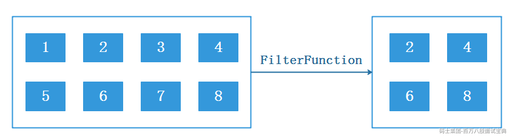

- **Java代码实现**

```plain
StreamExecutionEnvironment env = StreamExecutionEnvironment.getExecutionEnvironment();
DataStreamSource<Integer> ds = env.fromCollection(Arrays.asList(1, 2, 3, 4, 5, 6, 7, 8));
SingleOutputStreamOperator<Integer> filter = ds.filter(new FilterFunction<Integer>() {
    @Override
    public boolean filter(Integer value) throws Exception {
        return value % 2 == 0;
    }
});

filter.print();
env.execute();
```

- **Scala代码实现**

```plain
val env = StreamExecutionEnvironment.getExecutionEnvironment
//导入隐式转换
import org.apache.flink.streaming.api.scala._
val stream = env.fromElements(1, 2, 3, 4, 5, 6, 7, 8, 9)
stream.filter(_ % 2 == 0).print()
env.execute()
```

### **6.4.4 keyBy**

KeyBy算子用于将输入的DataStream按照指定的键或键选择器函数进行分组操作，它接受一个键选择器函数作为参数，该函数根据输入元素返回一个键，用于将数据流中的元素分组到不同的分区中，相同键的元素分配到同一个分区中，以便后续的操作可以基于键对数据进行聚合、合并或其他操作。

KeyBy算子使用时可以通过KeySelector函数来指定key键，DataStream通过KeyBy算子处理后得到的是KeyedStream对象，该对象也是DataStream。默认KeyBy算子会对数据流中指定的key键的hash值与Flink分区数（并行度）进行取模运算，从而决定该条数据后续被哪个并行度处理，**如果Flink DataStream类型是POJOs类型，需要在该类型中重写hashCode方法，否则后续不能正确的将相同数据进行分组处理**。

下图表示通过KeyBy算子将DataStream中的数据按照指定的key进行分组统计value总和。

*(⚠️ 图片缺失:源知识库原图已失效)* 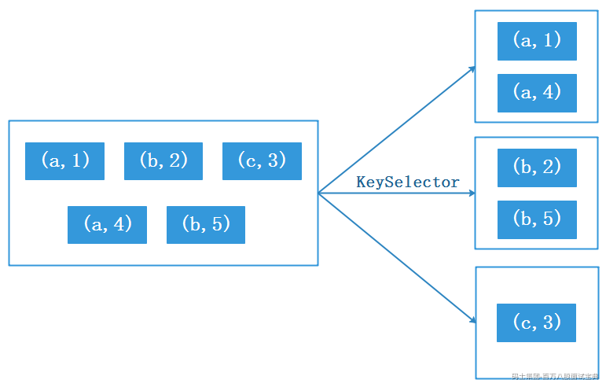

- **Java代码实现**

```plain
StreamExecutionEnvironment env = StreamExecutionEnvironment.getExecutionEnvironment();
DataStreamSource<Tuple2<String, Integer>> ds = env.fromCollection(Arrays.asList(
        Tuple2.of("a", 1),
        Tuple2.of("b", 2),
        Tuple2.of("c", 3),
        Tuple2.of("a", 4),
        Tuple2.of("b", 5)));

KeyedStream<Tuple2<String, Integer>, String> keyedStream = ds.keyBy(new KeySelector<Tuple2<String, Integer>, String>() {
    @Override
    public String getKey(Tuple2<String, Integer> tp) throws Exception {
        return tp.f0;
    }
});

keyedStream.sum(1).print();

env.execute();
```

- **Scala代码实现**

```plain
val env: StreamExecutionEnvironment = StreamExecutionEnvironment.getExecutionEnvironment
//导入隐式转换
import org.apache.flink.api.scala._

val ds: DataStream[(String, Int)] = env.fromCollection(List(("a", 1),
  ("b", 2),
  ("c", 3),
  ("a", 4),
  ("b", 5)))

ds.keyBy(tp=>{tp._1}).sum(1).print()
env.execute()
```

### **6.4.5 Aggregations**

Aggregations（聚合函数）是Flink中用于对输入数据进行聚合操作的函数集合，它们可以应用于KeyedStream上，将一组输入元素聚合为一个输出元素。

Flink提供了多种聚合函数，包括sum、min、minBy、max、maxBy,这些函数都是常见的聚合操作，作用如下：

- sum：针对输入keyedStream对指定列进行sum求和操作。

- min：针对输入keyedStream对指定列进行min最小值操作，结果流中其他列保持最开始第一条数据的值。

- minBy：同min类似，对指定的字段进行min最小值操作minBy返回的是最小值对应的整个对象。

- max：针对输入keyedStream对指定列进行max最大值操作，结果流中其他列保持最开始第一条数据的值。

- maxBy:同max类似，对指定的字段进行max最大值操作，maxBy返回的是最大值对应的整个对象。

- **Java代码实现**

```plain
StreamExecutionEnvironment env = StreamExecutionEnvironment.getExecutionEnvironment();
//准备集合数据
List<StationLog> list = Arrays.asList(
        new StationLog("sid1", "18600000000", "18600000001", "success", System.currentTimeMillis(), 120L),
        new StationLog("sid1", "18600000001", "18600000002", "fail", System.currentTimeMillis(), 30L),
        new StationLog("sid1", "18600000002", "18600000003", "busy", System.currentTimeMillis(), 50L),
        new StationLog("sid1", "18600000003", "18600000004", "barring", System.currentTimeMillis(), 90L),
        new StationLog("sid1", "18600000004", "18600000005", "success", System.currentTimeMillis(), 300L)
);

KeyedStream<StationLog, String> keyedStream = env.fromCollection(list)
        .keyBy(stationLog -> stationLog.sid);
//统计duration 的总和
keyedStream.sum("duration").print();
//统计duration的最小值，min返回该列最小值，其他列与第一条数据保持一致
keyedStream.min("duration").print();
//统计duration的最小值，minBy返回的是最小值对应的整个对象
keyedStream.minBy("duration").print();
//统计duration的最大值，max返回该列最大值，其他列与第一条数据保持一致
keyedStream.max("duration").print();
//统计duration的最大值，maxBy返回的是最大值对应的整个对象
keyedStream.maxBy("duration").print();

env.execute();
```

- **Scala代码实现**

```plain
val env: StreamExecutionEnvironment = StreamExecutionEnvironment.getExecutionEnvironment
// 导入隐式转换
import org.apache.flink.api.scala._

val list: List[StationLog] = List(StationLog("sid1", "18600000000", "18600000001", "success", System.currentTimeMillis, 120L),
  StationLog("sid1", "18600000001", "18600000002", "fail", System.currentTimeMillis, 30L),
  StationLog("sid1", "18600000002", "18600000003", "busy", System.currentTimeMillis, 50L),
  StationLog("sid1", "18600000003", "18600000004", "barring", System.currentTimeMillis, 90L),
  StationLog("sid1", "18600000004", "18600000005", "success", System.currentTimeMillis, 300L))

val ds: DataStream[StationLog] = env.fromCollection(list)
val keyedStream: KeyedStream[StationLog, String] = ds.keyBy(stationLog => stationLog.sid)

//统计duration 的总和
keyedStream.sum("duration").print
//统计duration的最小值，min返回该列最小值，其他列与第一条数据保持一致
keyedStream.min("duration").print
//统计duration的最小值，minBy返回的是最小值对应的整个对象
keyedStream.minBy("duration").print
//统计duration的最大值，max返回该列最大值，其他列与第一条数据保持一致
keyedStream.max("duration").print
//统计duration的最大值，maxBy返回的是最大值对应的整个对象
keyedStream.maxBy("duration").print

env.execute()
```

Java代码和Scala代码执行后结果如下:

```plain
# sum执行结果
StationLog{sid='sid1', callOut='18600000000', callIn='18600000001', callType='success', callTime=1685343077146, duration=120}
StationLog{sid='sid1', callOut='18600000000', callIn='18600000001', callType='success', callTime=1685343077146, duration=150}
StationLog{sid='sid1', callOut='18600000000', callIn='18600000001', callType='success', callTime=1685343077146, duration=200}
StationLog{sid='sid1', callOut='18600000000', callIn='18600000001', callType='success', callTime=1685343077146, duration=290}
StationLog{sid='sid1', callOut='18600000000', callIn='18600000001', callType='success', callTime=1685343077146, duration=590}

# min 执行结果
StationLog{sid='sid1', callOut='18600000000', callIn='18600000001', callType='success', callTime=1685343412282, duration=120}
StationLog{sid='sid1', callOut='18600000000', callIn='18600000001', callType='success', callTime=1685343412282, duration=30}
StationLog{sid='sid1', callOut='18600000000', callIn='18600000001', callType='success', callTime=1685343412282, duration=30}
StationLog{sid='sid1', callOut='18600000000', callIn='18600000001', callType='success', callTime=1685343412282, duration=30}
StationLog{sid='sid1', callOut='18600000000', callIn='18600000001', callType='success', callTime=1685343412282, duration=30}

# minBy 执行结果
StationLog{sid='sid1', callOut='18600000000', callIn='18600000001', callType='success', callTime=1685343474909, duration=120}
StationLog{sid='sid1', callOut='18600000001', callIn='18600000002', callType='fail', callTime=1685343474909, duration=30}
StationLog{sid='sid1', callOut='18600000001', callIn='18600000002', callType='fail', callTime=1685343474909, duration=30}
StationLog{sid='sid1', callOut='18600000001', callIn='18600000002', callType='fail', callTime=1685343474909, duration=30}
StationLog{sid='sid1', callOut='18600000001', callIn='18600000002', callType='fail', callTime=1685343474909, duration=30}

# max 执行结果
StationLog{sid='sid1', callOut='18600000000', callIn='18600000001', callType='success', callTime=1685343523009, duration=120}
StationLog{sid='sid1', callOut='18600000000', callIn='18600000001', callType='success', callTime=1685343523009, duration=120}
StationLog{sid='sid1', callOut='18600000000', callIn='18600000001', callType='success', callTime=1685343523009, duration=120}
StationLog{sid='sid1', callOut='18600000000', callIn='18600000001', callType='success', callTime=1685343523009, duration=120}
StationLog{sid='sid1', callOut='18600000000', callIn='18600000001', callType='success', callTime=1685343523009, duration=300}

# maxBy 执行结果
StationLog{sid='sid1', callOut='18600000000', callIn='18600000001', callType='success', callTime=1685343559342, duration=120}
StationLog{sid='sid1', callOut='18600000000', callIn='18600000001', callType='success', callTime=1685343559342, duration=120}
StationLog{sid='sid1', callOut='18600000000', callIn='18600000001', callType='success', callTime=1685343559342, duration=120}
StationLog{sid='sid1', callOut='18600000000', callIn='18600000001', callType='success', callTime=1685343559342, duration=120}
StationLog{sid='sid1', callOut='18600000004', callIn='18600000005', callType='success', callTime=1685343559342, duration=300}
```

### **6.4.6 reduce**

reduce算子是一种聚合算子，它接受一个函数作为参数，并将输入的KeyedStream中的元素进行两两聚合操作，该函数将两个相邻的元素作为输入参数，并生成一个新的DataStream数据流作为输出。与其他聚合函数如sum、min、max等不同，reduce算子的聚合函数可以自定义实现，因此可以适用于更广泛的聚合操作。

Reduce作用于KeyedStream，输出DataStream对象。下图表示通过reduce算子对输入数据集中的元素进行求和操作，并将结果输出到下游。

*(⚠️ 图片缺失:源知识库原图已失效)* 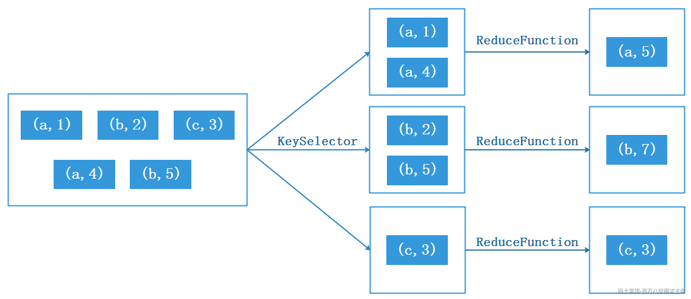

- **Java代码实现**

```plain
StreamExecutionEnvironment env = StreamExecutionEnvironment.getExecutionEnvironment();

        DataStreamSource<Tuple2<String, Integer>> ds = env.fromCollection(Arrays.asList(
                Tuple2.of("a", 1),
                Tuple2.of("b", 2),
                Tuple2.of("c", 3),
                Tuple2.of("a", 4),
                Tuple2.of("b", 5)));

        KeyedStream<Tuple2<String, Integer>, String> keyedStream = ds.keyBy(new KeySelector<Tuple2<String, Integer>, String>() {
            @Override
            public String getKey(Tuple2<String, Integer> tp) throws Exception {
                return tp.f0;
            }
        });

//        keyedStream.reduce((v1, v2) -> Tuple2.of(v1.f0, v1.f1 + v2.f1)).print();
        keyedStream.reduce(new ReduceFunction<Tuple2<String, Integer>>() {
            @Override
            public Tuple2<String, Integer> reduce(Tuple2<String, Integer> v1, Tuple2<String, Integer> v2) throws Exception {
                return Tuple2.of(v1.f0,v1.f1+v2.f1);
            }
        }).print();

        env.execute();
```

- **Scala代码实现**

```plain
val env: StreamExecutionEnvironment = StreamExecutionEnvironment.getExecutionEnvironment
//导入隐式转换
import org.apache.flink.api.scala._

val ds: DataStream[(String, Int)] = env.fromCollection(List(("a", 1),
  ("b", 2),
  ("c", 3),
  ("a", 4),
  ("b", 5)))

ds.keyBy(tp=>{tp._1})
  .reduce((v1,v2)=>{(v1._1,v1._2+v2._2)}).print()

env.execute()
```

### **6.4.7 union**

union算子是Flink流处理框架中数据流合并算子，可以将多个输入的DataStream多个数据流进行合并，并输出一个新的DataStream数据流作为结果，适用于需要将多个数据流合并为一个流的场景。

**需要注意的是union合并的数据流类型必须相同**，合并之后的数据流包含两个或多个流中所有元素，并且数据类型不变。下图表示将两个流进行合并得到合并后的结果流，并将结果输出到下游。

*(⚠️ 图片缺失:源知识库原图已失效)* 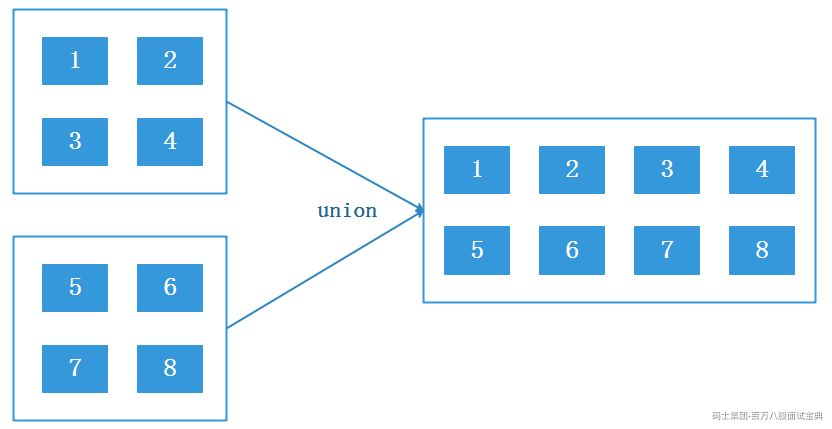

- **Java代码实现**

```plain
StreamExecutionEnvironment env = StreamExecutionEnvironment.getExecutionEnvironment();
DataStreamSource<Integer> ds1 = env.fromCollection(Arrays.asList(1, 2, 3, 4));
DataStreamSource<Integer> ds2 = env.fromCollection(Arrays.asList(5, 6, 7, 8));
ds1.union(ds2).print();
env.execute();
```

- **Scala代码实现**

```plain
val env: StreamExecutionEnvironment = StreamExecutionEnvironment.getExecutionEnvironment
//导入隐式转换
import org.apache.flink.api.scala._
val ds1: DataStream[Int] = env.fromCollection(List(1, 2, 3, 4))
val ds2: DataStream[Int] = env.fromCollection(List(5, 6, 7, 8))
ds1.union(ds2).print()
env.execute()
```

### **6.4.8 connect**

connect算子将两个输入的DataStream数据流作为参数，将两个不同数据类型的DataStream数据流连接在一起，生成一个ConnectedStreams对象作为结果，**与union算子不同，union只是简单的将两个类型一样的流合并在一起，而connect算子可以将不同类型的DataStream连接在一起，并且connect只能连接两个流**。

connect生成的结果保留了两个输入流的类型信息，例如：dataStream1数据集为(String, Int)元祖类型，dataStream2数据集为Int类型，通过connect连接算子将两个不同数据类型的流结合在一起，其内部数据为[(String, Int), Int]的混合数据类型，保留了两个原始数据集的数据类型。

对于连接后的数据流可以使用map、flatMap、process等算子进行操作，但内部方法使用的是CoMapFunction、CoFlatMapFunction、CoProcessFunction等函数来进行处理，这些函数称作“**协处理函数**”，分别接收两个输入流中的元素，并生成一个新的数据流作为输出，输出结果DataStream类型保持一致。

- **Java代码实现**

```plain
StreamExecutionEnvironment env = StreamExecutionEnvironment.getExecutionEnvironment();
DataStreamSource<Tuple2<String, Integer>> ds1 = env.fromCollection(Arrays.asList(Tuple2.of("a", 1), Tuple2.of("b", 2), Tuple2.of("c", 3)));
DataStreamSource<String> ds2 = env.fromCollection(Arrays.asList("aa","bb","cc"));

// Connect 两个流，类型可以不一样，只能连接两个流
ConnectedStreams<Tuple2<String, Integer>, String> connect = ds1.connect(ds2);

//可以对连接后的流使用map、flatMap、process等算子进行操作，但内部方法使用的是CoMap、CoFlatMap、CoProcess等函数进行处理
SingleOutputStreamOperator<Tuple2<String, Integer>> result = connect.process(new CoProcessFunction<Tuple2<String, Integer>, String, Tuple2<String, Integer>>() {
    @Override
    public void processElement1(Tuple2<String, Integer> tuple2, CoProcessFunction<Tuple2<String, Integer>, String, Tuple2<String, Integer>>.Context ctx, Collector<Tuple2<String, Integer>> out) throws Exception {
        out.collect(tuple2);
    }

    @Override
    public void processElement2(String value, CoProcessFunction<Tuple2<String, Integer>, String, Tuple2<String, Integer>>.Context ctx, Collector<Tuple2<String, Integer>> out) throws Exception {
        out.collect(Tuple2.of(value, 1));
    }
});
result.print();
env.execute();
```

- **Scala代码实现**

```plain
val env: StreamExecutionEnvironment = StreamExecutionEnvironment.getExecutionEnvironment
//导入隐式转换
import org.apache.flink.api.scala._
val ds1: DataStream[(String, Int)] = env.fromCollection(List(("a", 1), ("b", 2), ("c", 3)))
val ds2: DataStream[String] = env.fromCollection(List("aa","bb","cc"))
//connect连接两个流，两个流的数据类型可以不一样
val result: DataStream[(String, Int)] =
  ds1.connect(ds2).map(tp => tp, value => {(value, 1)})

result.print()
env.execute()
```

注意：以上代码协处理函数中涉及到ctx Flink上下文对象，可以通过该对象获取timestamp、watermark对象及注册定时器等，关于这部分后续章节讲解。

### **6.4.9 iterate**

iterate算子用于实现迭代计算的算子，它允许对输入的DataStream进行多次迭代操作，直到迭代条件不满足时迭代停止，该算子适合迭代计算场景，例如：机器学习中往往会对损失函数进行判断是否到达某个精度来判断训练是否需要结束就可以使用该算子来完成。

*(⚠️ 图片缺失:源知识库原图已失效)* 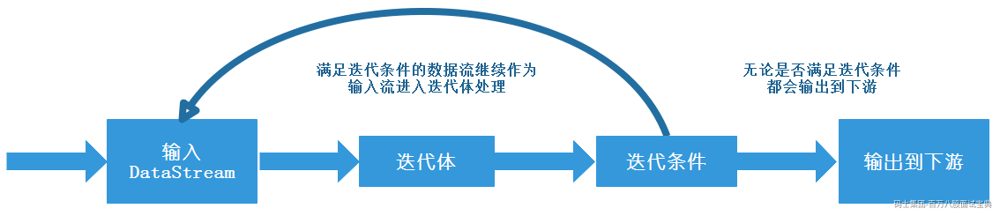

该算子接受一个初始输入流作为起点，**整个迭代过程由两部分组成：迭代体和迭代条件**，迭代体负责对输入的数据流进行处理，迭代条件用来判断本次流是否应该继续作为输入流反馈给迭代体继续迭代，满足条件的数据会继续作为输入流进入迭代体进行迭代计算直到不满足迭代条件为止。**注意:无论数据流是否满足迭代条件都会输出到下游**。

这里以Flink读取Socket数字为例，迭代体对输入数据进行减少操作，迭代条件判断数据是否小于0，数据不小于0时继续执行迭代体进行迭代计算，否则迭代计算终止。

- **Java代码实现**

```plain
StreamExecutionEnvironment env = StreamExecutionEnvironment.getExecutionEnvironment();
DataStreamSource<String> ds1 = env.socketTextStream("node5", 9999);
//对数据流进行转换
SingleOutputStreamOperator<Integer> ds2 = ds1.map(new MapFunction<String, Integer>() {
    @Override
    public Integer map(String s) throws Exception {
        return Integer.valueOf(s);
    }
});

//使用 iterate() 方法创建一个迭代流 iterate，用于支持迭代计算
IterativeStream<Integer> iterate = ds2.iterate();

//定义迭代体：在迭代流 iterate 上进行映射转换，将每个整数元素减去 1，并返回一个新的数据流
SingleOutputStreamOperator<Integer> minusOne = iterate.map(new MapFunction<Integer, Integer>() {
    @Override
    public Integer map(Integer value) throws Exception {
        System.out.println("迭代体中输入的数据为：" + value);
        return value - 1;
    }
});

//定义迭代条件，满足迭代条件的继续进入迭代体进行迭代，否则不迭代
SingleOutputStreamOperator<Integer> stillGreaterThanZero = minusOne.filter(new FilterFunction<Integer>() {
    @Override
    public boolean filter(Integer value) throws Exception {
        return value > 0;
    }
});

//对迭代流应用迭代条件
iterate.closeWith(stillGreaterThanZero);

//迭代流数据输出，无论是否满足迭代条件都会输出
iterate.print();
env.execute();
```

- **Scala代码实现**

```plain
val env: StreamExecutionEnvironment = StreamExecutionEnvironment.getExecutionEnvironment
//导入隐式转换
import org.apache.flink.api.scala._

val ds1: DataStream[String] = env.socketTextStream("node5", 9999)

//转换数据流
val ds2: DataStream[Int] = ds1.map(v => v.toInt)
//定义迭代流，并指定迭代体和迭代条件
val result: DataStream[Int] = ds2.iterate(
  iteration => {
    //定义迭代体
    val minusOne: DataStream[Int] = iteration.map(v => {println("迭代体中value值为："+v);v - 1})

    //定义迭代条件，满足的继续迭代
    val stillGreaterThanZero: DataStream[Int] = minusOne.filter(_ > 0)

    //定义哪些数据最后进行输出
    val lessThanZero: DataStream[Int] = minusOne.filter(_ <= 0)

    //返回tuple，第一个参数是哪些数据流继续迭代，第二个参数是哪些数据流进行输出
    (stillGreaterThanZero, lessThanZero)
  })

//打印最后结果
result.print()

env.execute()
```

## 6.5 **函数接口与富函数类**

### **6.5.1 函数接口**

上一小节中学习过的Flink算子方法都有对应的接口来完成业务逻辑处理，我们可以自定义类来实现这些接口完成业务逻辑编写，然后将这些类作为参数传递给Flink算子。这些实现接口在Flink中我们通常称为函数接口，常见的Flink函数接口有：MapFunction、FlatMapFunction、ReduceFunction、FilterFunction等。

无论是Java代码还是Scala代码编写都可以单独实现对应函数接口后当做参数传递给Flink算子，下面举例说明。

**案例：向Socket中输入通话数据，按照指定格式输出每个通话的拨号时间和结束时间。**

向Socket中输入数据格式如下：

```plain
001,186,187,busy,1000,10
002,187,186,fail,2000,20
003,186,188,busy,3000,30
004,188,186,busy,4000,40
005,188,187,busy,5000,50
```

- **Java代码**

```plain
public class CommonFunctionTest {
    public static void main(String[] args) throws Exception {
        StreamExecutionEnvironment env = StreamExecutionEnvironment.getExecutionEnvironment();
        /**
         * Socket中的数据格式如下:
         *  001,186,187,busy,1000,10
         *  002,187,186,fail,2000,20
         *  003,186,188,busy,3000,30
         *  004,188,186,busy,4000,40
         *  005,188,187,busy,5000,50
         */
        DataStreamSource<String> ds = env.socketTextStream("node5", 9999);
        ds.map(new MyMapFunction()).print();

        env.execute();

    }

    private static class MyMapFunction implements MapFunction<String, String> {
        @Override
        public String map(String value) throws Exception {
            //value格式：001,186,187,busy,1000,10
            String[] split = value.split(",");
            //获取通话时间，并转换成yyyy-MM-dd HH:mm:ss格式
            SimpleDateFormat sdf = new SimpleDateFormat("yyyy-MM-dd HH:mm:ss");
            String startTime = sdf.format(Long.parseLong(split[4]));

            //获取通话时长，通话时间加上通话时长，得到通话结束时间，转换成yyyy-MM-dd HH:mm:ss格式
            String duration = split[5];
            String endTime = sdf.format(Long.parseLong(split[4]) + Long.parseLong(duration));

            return "基站ID:" + split[0] + ",主叫号码:" + split[1] + "," +
                    "被叫号码:" + split[2] + ",通话类型:" + split[3] + "," +
                    "通话开始时间:" + startTime + ",通话结束时间:" + endTime ;
        }
    }

}
```

- **Scala代码**

```plain
object CommonFunctionTest {
  def main(args: Array[String]): Unit = {
    val env = StreamExecutionEnvironment.getExecutionEnvironment

    //导入隐式转换
    import org.apache.flink.api.scala._

    /**
     * Socket中的数据格式如下:
     * 001,186,187,busy,1000,10
     * 002,187,186,fail,2000,20
     * 003,186,188,busy,3000,30
     * 004,188,186,busy,4000,40
     * 005,188,187,busy,5000,50
     */
    val ds: DataStream[String] = env.socketTextStream("node5", 9999)
    ds.map(new MyMapFunction()).print()

    env.execute()
  }

  private class MyMapFunction extends MapFunction[String, String] {
    override def map(value: String): String = {
      //value格式：001,186,187,busy,1000,10
      val split: Array[String] = value.split(",")
      //获取通话时间，并转换成yyyy-MM-dd HH:mm:ss格式
      val sdf = new SimpleDateFormat("yyyy-MM-dd HH:mm:ss")
      val startTime = sdf.format(split(4).toLong)

      //获取通话时长，通话时间加上通话时长，得到通话结束时间，转换成yyyy-MM-dd HH:mm:ss格式
      val duration = split(5)
      val endTime = sdf.format(split(4).toLong + duration.toLong)

      "基站ID:" + split(0) + ",主叫号码:" + split(1) + "," +
        "被叫号码:" + split(2) + ",通话类型:" + split(3) + "," +
        "通话开始时间:" + startTime + ",通话结束时间:" + endTime
    }
  }
}
```

### **6.5.2 富函数类**

Flink中除了有函数接口之外还有功能更强大的富函数接口，富函数接口与其他常规函数接口的不同在于：可以获取运行环境的上下文，在上下文环境中可以管理状态（状态内容后续章节介绍），并拥有一些生命周期方法，所以可以实现更复杂的功能。常见的富函数接口有：RichMapFunction、RichFlatMapFunction、RichFilterFunction等。

所有RichFunction中有一个生命周期的概念，典型的生命周期方法有：

- open()方法是rich function的初始化方法，当一个算子例如map或者filter被调用之前open()会被调用，一般用于初始化资源。

- close()方法是生命周期中的最后一个调用的方法，做一些清理工作。

- getRuntimeContext()方法提供了函数的RuntimeContext的一些信息，例如函数执行的并行度，任务的名字，以及state状态

下面通过案例来演示富函数接口的使用。

**案例：读取Socket中数据，结合MySQL中电话对应的姓名来输出信息。**

**1) 准备mysql数据**

```plain
create database mydb;
use mydb;
create table person_info (
phone_num varchar(255),
name varchar(255),
city varchar(255)
)ENGINE=InnoDB DEFAULT CHARSET=utf8;

insert into person_info values (186,"张三","北京"),(187,"李四","上海"),(188,"王五","深圳");
```

**2) 编写代码**

- **Java代码**

```plain
public class RichFunctionTest {
    public static void main(String[] args) throws Exception {
        StreamExecutionEnvironment env = StreamExecutionEnvironment.getExecutionEnvironment();
        /**
         * Socket中的数据格式如下:
         *  001,186,187,busy,1000,10
         *  002,187,186,fail,2000,20
         *  003,186,188,busy,3000,30
         *  004,188,186,busy,4000,40
         *  005,188,187,busy,5000,50
         */
        DataStreamSource<String> ds = env.socketTextStream("node5", 9999);
        ds.map(new MyRichMapFunction()).print();

        env.execute();

    }

    private static class MyRichMapFunction extends RichMapFunction<String,String> {

        Connection conn = null;
        PreparedStatement pst = null;
        ResultSet rst = null;

        // open()方法在map方法之前执行，用于初始化
        @Override
        public void open(Configuration parameters) throws Exception {
            conn = DriverManager.getConnection("jdbc:mysql://node2:3306/mydb?useSSL=false","root","123456");
            pst = conn.prepareStatement("select * from person_info where phone_num = ?");
        }

        // map方法，输入一个元素，返回一个元素
        @Override
        public String map(String value) throws Exception {
            //value 格式：001,186,187,busy,1000,10
            String[] split = value.split(",");
            String sid = split[0];
            String callOut = split[1];//主叫
            String callIn = split[2];//被叫
            String callType = split[3];//通话类型
            String callTime = split[4];//通话时间
            String duration = split[5];//通话时长
            //mysql中获取主叫和被叫的姓名
            String callOutName = "";
            String callInName = "";

            pst.setString(1,callOut);
            rst = pst.executeQuery();
            while (rst.next()){
                callOutName = rst.getString("name");
            }
            pst.setString(1,callIn);
            rst = pst.executeQuery();
            while (rst.next()){
                callInName = rst.getString("name");
            }

            return "基站ID:" + sid + ",主叫号码:" + callOut + ",主叫姓名:" + callOutName + "," +
                    "被叫号码:" + callIn + ",被叫姓名:" + callInName + ",通话类型:" + callType + "," +
                    "通话时间:" + callTime + ",通话时长:" + duration+"s";
        }

        // close()方法在map方法之后执行，用于清理
        @Override
        public void close() throws Exception {
            rst.close();
            pst.close();
            conn.close();

        }

    }
}
```

- **Scala代码**

```plain
object RichFunctionTest {
  def main(args: Array[String]): Unit = {
    val env = StreamExecutionEnvironment.getExecutionEnvironment
    //导入隐式转换
    import org.apache.flink.api.scala._

    /**
     * Socket中的数据格式如下:
     *  001,186,187,busy,1000,10
     *  002,187,186,fail,2000,20
     *  003,186,188,busy,3000,30
     *  004,188,186,busy,4000,40
     *  005,188,187,busy,5000,50
     */
    val ds: DataStream[String] = env.socketTextStream("node5", 9999)
    ds.map(new MyRichMapFunction).print()

    env.execute()
  }

  private class MyRichMapFunction extends RichMapFunction[String, String] {
    private var conn: Connection = _
    private var pst: PreparedStatement = _
    private var rst: ResultSet = _

    // open()方法在map方法之前执行，用于初始化
    override def open(parameters: Configuration): Unit = {
      conn = DriverManager.getConnection("jdbc:mysql://node2:3306/mydb?useSSL=false", "root", "123456")
      pst = conn.prepareStatement("select * from person_info where phone_num = ?")
    }

    // map方法，输入一个元素，返回一个元素
    override def map(value: String): String = {
      //value 格式：001,186,187,busy,1000,10
      val split: Array[String] = value.split(",")
      val sid: String = split(0)
      val callOut: String = split(1) //主叫
      val callIn: String = split(2) //被叫
      val callType: String = split(3) //通话类型
      val callTime: String = split(4) //通话时间
      val duration: String = split(5) //通话时长
      //mysql中获取主叫和被叫的姓名
      var callOutName = ""
      var callInName = ""

      pst.setString(1, callOut)
      rst = pst.executeQuery()
      while (rst.next()) {
        callOutName = rst.getString("name")
      }

      pst.setString(1, callIn)
      rst = pst.executeQuery()
      while (rst.next()) {
        callInName = rst.getString("name")
      }

      s"基站ID:$sid,主叫号码:$callOut,主叫姓名:$callOutName," +
        s"被叫号码:$callIn,被叫姓名:$callInName,通话类型:$callType," +
        s"通话时间:$callTime,通话时长:$duration"
    }

    // close()方法在map方法之后执行，用于清理
    override def close(): Unit = {
      if (rst != null) rst.close()
      if (pst != null) pst.close()
      if (conn != null) conn.close()
    }
  }
}
```

**3) 启动代码，向Socket中输入如下数据**

```plain
001,186,187,busy,1000,10
002,187,186,fail,2000,20
003,186,188,busy,3000,30
004,188,186,busy,4000,40
005,188,187,busy,5000,50
```

## 6.6 **Flink Sink**

Flink Sink负责将通过Transformation转换的数据流进行输出，Flink官方提供了内置的Sink连接器，例如：FileSink Connector、JDBCSink Connector 、KafkaSink Connector等，同时也支持自定义Sink输出，简而言之，Flink的Sink模块让用户能够轻松地将计算结果输出到各种目标位置，满足不同的业务需求。

Flink提供了容错机制，可以在各种故障情况下恢复程序执行，并通过快照机制和检查点机制实现了一致性状态更新和记录传递的保证，Flink 官方提供的Sink Connector连接器至少支持at-least-once写出语义保证，具体的保证语义取决于所使用的Sink Connector连接器，例如FileSink、KafkaSink都支持exactly-once写出语义。

关于Flink状态和容错内容参考后续状态和容错章节。

### **6.6.1 FileSink**

Flink1.12版本之前将数据流实时写入到文件中可以通过StreamFileSink对象来完成，Flink1.12版本之后官方建议使用FileSink对象批或者流数据写出到文件，该对象实现了两阶段提交，可以保证数据以exactly-once语义写出到外部文件。

将Flink 处理后的数据写入文件目录中,需注意：

- Flink数据写入HDFS中会以 "yyyy-MM-dd--HH" 的时间格式给每个目录命名，每个目录也叫一个桶。默认每小时产生一个桶，目录下包含了一些文件， 每个 sink 的并发实例都会创建一个属于自己的部分文件，当这些文件太大的时候，sink 会根据设置产生新的部分文件。当一个桶不再活跃时，打开的部分文件会刷盘并且关闭（即：将sink数据写入磁盘，并关闭文件）,当再次写入数据会创建新的文件。

- 生成新的桶目录及桶内文件检查周期是 withBucketCheckInterval(1000) 默认是一分钟。

- 在桶内生成新的文件规则，以下条件满足一个就会生成新的文件

- withInactivityInterval :桶不活跃的间隔时长，如果一个桶最近一段时间都没有写入，那么这个桶被认为是不活跃的，sink 默认会每分钟检查不活跃的桶、关闭那些超过一分钟没有数据写入的桶。【即：桶内的当下文件如果一分钟没有写入数据就会自动关闭，再次写入数据时，生成新的文件】

- withMaxPartSize ： 设置文件多大后生成新的文件，默认128M。

- withRolloverInterval ：每隔多长时间生成一个新的文件，默认1分钟。

- 在Flink流数据写出到文件时需要开启checkpoint，否则不能保证数据exactly-once写出语义。Flink checkpoint主要用于状态存储和容错，关于checkpoint更多细节参考状态章节。

**案例：读取socket数据写入到本地文件。**

- **在项目中导入如下依赖:**

```plain
<!-- DataStream files connector -->
<dependency>
  <groupId>org.apache.flink</groupId>

  <artifactId>flink-connector-files</artifactId>

  <version>${flink.version}</version>

</dependency>

```

- **Java代码实现**

```plain
StreamExecutionEnvironment env = StreamExecutionEnvironment.getExecutionEnvironment();
//开启Checkpoint
env.enableCheckpointing(1000);
//方便看到结果设置并行度为2
env.setParallelism(2);

/**
 * socket 中输入数据如下：
 *  001,186,187,busy,1000,10
 *  002,187,186,fail,2000,20
 *  003,186,188,busy,3000,30
 *  004,188,186,busy,4000,40
 *  005,188,187,busy,5000,50
 */
DataStreamSource<String> ds = env.socketTextStream("node5", 9999);

//准备FileSink对象
FileSink<String> fileSink = FileSink.forRowFormat(new Path("./output/java-file-result"),
                new SimpleStringEncoder<String>("UTF-8"))
        //生成新桶目录的检查周期，默认1分钟
        .withBucketCheckInterval(1000)
        //设置文件滚动策略
        .withRollingPolicy(
                DefaultRollingPolicy.builder()
                        //桶不活跃的间隔时长，默认1分钟
                        .withInactivityInterval(Duration.ofSeconds(30))
                        //设置文件多大后生成新的文件，默认128M
                        .withMaxPartSize(MemorySize.ofMebiBytes(1024))
                        //设置每隔多长时间生成一个新的文件，默认1分钟
                        .withRolloverInterval(Duration.ofSeconds(10))
                        .build())
        .build();

//写出数据到文件
ds.sinkTo(fileSink);

env.execute();
```

- **Scala代码实现**

```plain
val env: StreamExecutionEnvironment = StreamExecutionEnvironment.getExecutionEnvironment
//设置并行度为2，方便测试
env.setParallelism(2)

/**
 * Socket中输入数据如下：
 *  001,186,187,busy,1000,10
 *  002,187,186,fail,2000,20
 *  003,186,188,busy,3000,30
 *  004,188,186,busy,4000,40
 *  005,188,187,busy,5000,50
 */
val ds: DataStream[String] = env.socketTextStream("node5", 9999)

//设置FlinkSink
val fileSink: FileSink[String] = FileSink.forRowFormat(new Path("./out/scala-file-out"), new SimpleStringEncoder[String]("UTF-8"))
  //设置桶目录检查间隔，默认1分钟
  .withBucketCheckInterval(1000 * 60)
  //设置滚动策略
  .withRollingPolicy(
    DefaultRollingPolicy.builder()
      //桶不活跃的间隔时长，默认1分钟
      .withInactivityInterval(Duration.ofSeconds(30))
      //设置文件多大后生成新的文件，默认128M
      .withMaxPartSize(MemorySize.ofMebiBytes(1024))
      //设置每隔多长时间生成新的文件，默认1分钟
      .withRolloverInterval(Duration.ofSeconds(10))
      .build()
  )
  .build()

//写出到文件
ds.sinkTo(fileSink)

env.execute()
```

### **6.6.2 JdbcSink**

Flink的JdbcSink是用于将数据写入关系型数据库的输出组件，它支持灵活的配置和可靠的事务处理，包括批量写入和并行写入功能。用户可以自定义数据转换逻辑，并通过提供数据库连接信息和SQL语句来指定目标表和插入操作。

JdbcSink提供了高性能和可靠的方式，将流处理作业的结果或数据持久化到数据库中，它支持at-least-once和exactly-once语义，确保数据被准确写入数据库一次，避免重复写入或数据丢失的问题。

#### 6.6.2.1 **at-least-once语义**

Flink数据写出到JdbcSink提供了at-least-once写出语义，如果业务允许可以通过编写upsert 更新SQL 可以实现精准一次的写出语义。

在使用Flink JdbcSink时使用格式如下:

```plain
JdbcSink.sink(  
sqlDmlStatement,      // 必须指定，SQL语句   
jdbcStatementBuilder, // 必须指定，给SQL语句设置参数	  
jdbcExecutionOptions, // 可选，指定写出参数，如：提交周期、提交批次大小、重试时间，建议指定。
jdbcConnectionOptions // 必须指定，数据库连接参数
);
```

**在编写Scala代码时，jdbcStatementBuilder参数必须通过new JdbcStatementBuilder方式创建，不能使用Scala匿名函数Lambda方式编写，否则代码报序列化错误不能正常运行，该错误与Scala编译器版本有关。**

在编写Java和Scala代码之前需要导入项目依赖：

```plain
<!-- Flink JdbcSink依赖jar包-->
<dependency>
  <groupId>org.apache.flink</groupId>

  <artifactId>flink-connector-jdbc</artifactId>

  <version>${flink-connector-jdbc.version}</version>

</dependency>

<!-- MySQL驱动依赖jar包 -->
<dependency>
  <groupId>mysql</groupId>

  <artifactId>mysql-connector-java</artifactId>

  <version>${mysql.version}</version>

</dependency>

```

**案例:Flink读取Socket中通话数据通过转换写入到MySQL中。**

**1) 在MySQL中需要数据库表**

```plain
#登录mysql创建数据库及表
[root@node2 ~]# mysql -u root -p123456
mysql> create database mydb;
mysql> use mydb;

#建表语句如下
CREATE TABLE `station_log` (
  `sid` varchar(255) DEFAULT NULL,
  `call_out` varchar(255) DEFAULT NULL,
  `call_in` varchar(255) DEFAULT NULL,
  `call_type` varchar(255) DEFAULT NULL,
  `call_time` bigint(20) DEFAULT NULL,
  `duration` bigint(20) DEFAULT NULL
) ;
```

**2) 编写代码**

- **Java代码实现**

```plain
StreamExecutionEnvironment env = StreamExecutionEnvironment.getExecutionEnvironment();

        /**
         * socket 中输入数据如下：
         * 001,186,187,busy,1000,10
         * 002,187,186,fail,2000,20
         * 003,186,188,busy,3000,30
         * 004,188,186,busy,4000,40
         * 005,188,187,busy,5000,50
         */
        SingleOutputStreamOperator<StationLog> ds = env.socketTextStream("node5", 9999)
                .map(one -> {
                    String[] arr = one.split(",");
                    return new StationLog(arr[0], arr[1], arr[2], arr[3], Long.valueOf(arr[4]), Long.valueOf(arr[5]));
                });

        /**
         * mysql中创建的station_log 表结构如下；
         *
         * CREATE TABLE `station_log` (
         *   `sid` varchar(255) DEFAULT NULL,
         *   `call_out` varchar(255) DEFAULT NULL,
         *   `call_in` varchar(255) DEFAULT NULL,
         *   `call_type` varchar(255) DEFAULT NULL,
         *   `call_time` bigint(20) DEFAULT NULL,
         *   `duration` bigint(20) DEFAULT NULL
         * ) ;
         */

        //准备JDBC Sink对象
//        SinkFunction<StationLog> jdbcSink = JdbcSink.sink(
//                "insert into station_log(sid,call_out,call_in,call_type,call_time,duration) values(?,?,?,?,?,?)",
//                new JdbcStatementBuilder<StationLog>() {
//                    @Override
//                    public void accept(PreparedStatement pst, StationLog stationLog) throws SQLException {
//                        pst.setString(1, stationLog.getSid());
//                        pst.setString(2, stationLog.getCallOut());
//                        pst.setString(3, stationLog.getCallIn());
//                        pst.setString(4, stationLog.getCallType());
//                        pst.setLong(5, stationLog.getCallTime());
//                        pst.setLong(6, stationLog.getDuration());
//                    }
//                },
//                JdbcExecutionOptions.builder()
//                        //批次提交大小，默认500
//                        .withBatchSize(1000)
//                        //批次提交间隔间隔时间，默认0，即批次大小满足后提交
//                        .withBatchIntervalMs(1000)
//                        //最大重试次数，默认3
//                        .withMaxRetries(5)
//                        .build()
//                ,
//                new JdbcConnectionOptions.JdbcConnectionOptionsBuilder()
//                        //mysql8.0版本使用com.mysql.cj.jdbc.Driver
//                        .withUrl("jdbc:mysql://node2:3306/mydb?useSSL=false")
//                        .withDriverName("com.mysql.jdbc.Driver")
//                        .withUsername("root")
//                        .withPassword("123456")
//                        .build()
//        );

        SinkFunction<StationLog> jdbcSink = JdbcSink.sink(
                "insert into station_log(sid,call_out,call_in,call_type,call_time,duration) values(?,?,?,?,?,?)",
                (PreparedStatement pst, StationLog stationLog) -> {
                    pst.setString(1, stationLog.getSid());
                    pst.setString(2, stationLog.getCallOut());
                    pst.setString(3, stationLog.getCallIn());
                    pst.setString(4, stationLog.getCallType());
                    pst.setLong(5, stationLog.getCallTime());
                    pst.setLong(6, stationLog.getDuration());
                },
   
                JdbcExecutionOptions.builder()
                        //批次提交大小，默认500
                        .withBatchSize(1000)
                        //批次提交间隔间隔时间，默认0，即批次大小满足后提交
                        .withBatchIntervalMs(0)
                        //最大重试次数，默认3
                        .withMaxRetries(5)
                        .build(),
                new JdbcConnectionOptions.JdbcConnectionOptionsBuilder()
                        //mysql8.0版本使用com.mysql.cj.jdbc.Driver
                        .withUrl("jdbc:mysql://node2:3306/mydb?useSSL=false")
                        .withDriverName("com.mysql.jdbc.Driver")
                        .withUsername("root")
                        .withPassword("123456")
                        .build()
        );

        //将数据写入到mysql中
        ds.addSink(jdbcSink);

        env.execute();
```

注意：以上Java代码StationLog对象需要对各属性实现getter、setter方法。

- **Scala代码实现**

```plain
val env: StreamExecutionEnvironment = StreamExecutionEnvironment.getExecutionEnvironment
//导入隐式转换
import org.apache.flink.streaming.api.scala._

/**
 * Socket中输入数据如下：
 * 001,186,187,busy,1000,10
 * 002,187,186,fail,2000,20
 * 003,186,188,busy,3000,30
 * 004,188,186,busy,4000,40
 * 005,188,187,busy,5000,50
 */
val ds: DataStream[StationLog] = env.socketTextStream("node5", 9999)
  .map(line => {
    val arr: Array[String] = line.split(",")
    StationLog(arr(0).trim, arr(1).trim, arr(2).trim, arr(3).trim, arr(4).trim.toLong, arr(5).trim.toLong)
  })

//准备Flink JdbcSink
val jdbcSink: SinkFunction[StationLog] = JdbcSink.sink(
  "insert into station_log(sid,call_out,call_in,call_type,call_time,duration) values(?,?,?,?,?,?)",
  //这里不能使用箭头函数，否则会报：The implementation of the RichOutputFormat is not serializable. The object probably contains or references non serializable fields.
  new JdbcStatementBuilder[StationLog] {
    override def accept(pst: PreparedStatement, stationLog: StationLog): Unit = {
      pst.setString(1, stationLog.sid)
      pst.setString(2, stationLog.callOut)
      pst.setString(3, stationLog.callIn)
      pst.setString(4, stationLog.callType)
      pst.setLong(5, stationLog.callTime)
      pst.setLong(6, stationLog.duration)
    }
  },
  JdbcExecutionOptions.builder()
    //设置批次大小，默认5000
    .withBatchSize(1000)
    //批次提交间隔间隔时间，默认0，即批次大小满足后提交
    .withBatchIntervalMs(200)
    //设置最大重试次数，默认3
    .withMaxRetries(5)
    .build(),
  new JdbcConnectionOptions.JdbcConnectionOptionsBuilder()
    .withUrl("jdbc:mysql://node2:3306/mydb?useSSL=false")
    .withDriverName("com.mysql.jdbc.Driver")
    .withUsername("root")
    .withPassword("123456")
    .build()
)

//数据写出到MySQL
ds.addSink(jdbcSink)

env.execute()
```

**注意**:在编写Scala JdbcSink代码时，JdbcSink.sink第二个参数不能使用Scala匿名函数写法，否则会报错：”The implementation of the RichOutputFormat is not serializable. The object probably contains or references non serializable fields.”

**3) 向Socket中输入以下数据查询mysql结果**

```plain
001,186,187,busy,1000,10
002,187,186,fail,2000,20
003,186,188,busy,3000,30
004,188,186,busy,4000,40
005,188,187,busy,5000,50
```

#### 6.6.2.2 **exactly-once语义**

从Flink1.13版本开始，Flink JDBC Sink支持exactly-once写出语义，该实现依赖于数据库支持支持XA标准规范，目前大多数数据库都支持XA，即如果数据库支持XA标准规范，就支持Flink JDBCSink的Exectly-once的写出语义。

备注：XA标准是由 X/Open 组织提出的分布式事务规范。目前，Oracle、Informix、DB2和MySQL等各大数据库厂家都提供对XA标准的支持。XA标准规范采用两阶段提交方式来管理分布式事务。

使用Flink JdbcSink Exactly-once语义将数据写出到外部存储库时需要注意：

- Flink写出数据必须开启checkpoint否则不能正常将数据写出,checkpoint周期决定了写出数据的延迟大小。

- JDBC XA接收器要求maxRetries等于0，否则可能导致重复，代码中JdbcExecutionOptions需要设置maxRetries为0。

在编写Java和Scala代码之前需要导入项目依赖：

```plain
<!-- Flink JdbcSink依赖jar包-->
<dependency>
  <groupId>org.apache.flink</groupId>

  <artifactId>flink-connector-jdbc</artifactId>

  <version>${flink-connector-jdbc.version}</version>

</dependency>

<!-- MySQL驱动依赖jar包 -->
<dependency>
  <groupId>mysql</groupId>

  <artifactId>mysql-connector-java</artifactId>

  <version>${mysql.version}</version>

</dependency>

```

**案例:Flink读取Socket中通话数据通过转换写入到MySQL中。**

**1) 在MySQL中需要数据库表**

```plain
#登录mysql创建数据库及表
[root@node2 ~]# mysql -u root -p123456
mysql> create database mydb;
mysql> use mydb;

#建表语句如下
CREATE TABLE `station_log` (
  `sid` varchar(255) DEFAULT NULL,
  `call_out` varchar(255) DEFAULT NULL,
  `call_in` varchar(255) DEFAULT NULL,
  `call_type` varchar(255) DEFAULT NULL,
  `call_time` bigint(20) DEFAULT NULL,
  `duration` bigint(20) DEFAULT NULL
) ;
```

**2) 编写代码**

- **Java代码实现**

```plain
StreamExecutionEnvironment env = StreamExecutionEnvironment.getExecutionEnvironment();
        //必须设置checkpoint，否则数据不能正常写出到mysql
        env.enableCheckpointing(5000);
        /**
         * socket 中输入数据如下：
         * 001,186,187,busy,1000,10
         * 002,187,186,fail,2000,20
         * 003,186,188,busy,3000,30
         * 004,188,186,busy,4000,40
         * 005,188,187,busy,5000,50
         */
        SingleOutputStreamOperator<StationLog> ds = env.socketTextStream("node5", 9999)
                .map(one -> {
                    String[] arr = one.split(",");
                    return new StationLog(arr[0], arr[1], arr[2], arr[3], Long.valueOf(arr[4]), Long.valueOf(arr[5]));
                });

        //设置JdbcSink ExactlyOnce 对象
        SinkFunction<StationLog> jdbcExactlyOnceSink = JdbcSink.exactlyOnceSink(
                "insert into station_log(sid,call_out,call_in,call_type,call_time,duration) values(?,?,?,?,?,?)",
                (PreparedStatement pst, StationLog stationLog) -> {
                    pst.setString(1, stationLog.getSid());
                    pst.setString(2, stationLog.getCallOut());
                    pst.setString(3, stationLog.getCallIn());
                    pst.setString(4, stationLog.getCallType());
                    pst.setLong(5, stationLog.getCallTime());
                    pst.setLong(6, stationLog.getDuration());
                },
                JdbcExecutionOptions.builder()
                        //批次提交大小，默认500
                        .withBatchSize(1000)
                        //批次提交间隔间隔时间，默认0，即批次大小满足后提交
                        .withBatchIntervalMs(1000)
                        //最大重试次数，默认3,JDBC XA接收器要求maxRetries等于0，否则可能导致重复。
                        .withMaxRetries(0)
                        .build(),
                JdbcExactlyOnceOptions.builder()
                        //只允许每个连接有一个 XA 事务
                        .withTransactionPerConnection(true)
                        .build(),
//                //创建XA DataSource对象
//                new SerializableSupplier<XADataSource>() {
//                    @Override
//                    public XADataSource get() {
//                        MysqlXADataSource xaDataSource = new com.mysql.jdbc.jdbc2.optional.MysqlXADataSource();
//                        xaDataSource.setUrl("jdbc:mysql://node2:3306/mydb?useSSL=false");
//                        xaDataSource.setUser("root");
//                        xaDataSource.setPassword("123456");
//                        return xaDataSource;
//                    }
//                }
                //创建XA DataSource对象也可以使用lambda表达式
                () -> {
                    MysqlXADataSource xaDataSource = new MysqlXADataSource();
                    xaDataSource.setUrl("jdbc:mysql://node2:3306/mydb?useSSL=false");
                    xaDataSource.setUser("root");
                    xaDataSource.setPassword("123456");
                    return xaDataSource;
                }

        );

        //数据写出到mysql
        ds.addSink(jdbcExactlyOnceSink);

        env.execute();
```

- **Scala代码实现**

```plain
val env: StreamExecutionEnvironment = StreamExecutionEnvironment.getExecutionEnvironment
//导入隐式转换
import org.apache.flink.streaming.api.scala._
//必须设置checkpoint，否则数据不能写入mysql
env.enableCheckpointing(5000)

/**
 * Socket中输入数据如下：
 * 001,186,187,busy,1000,10
 * 002,187,186,fail,2000,20
 * 003,186,188,busy,3000,30
 * 004,188,186,busy,4000,40
 * 005,188,187,busy,5000,50
 */
val ds: DataStream[StationLog] = env.socketTextStream("node5", 9999)
  .map(line => {
    val arr: Array[String] = line.split(",")
    StationLog(arr(0).trim, arr(1).trim, arr(2).trim, arr(3).trim, arr(4).trim.toLong, arr(5).trim.toLong)
  })

//准备Flink JdbcSink ExactlyOnce方式
// 注意：这里的JdbcSink不能使用JdbcSink.sink，而是使用JdbcSink.exactlyOnceSink
val JdbcExactlyOnceSink: SinkFunction[StationLog] = JdbcSink.exactlyOnceSink(
  "insert into station_log(sid,call_out,call_in,call_type,call_time,duration) values(?,?,?,?,?,?)",
  //这里不能使用箭头函数，否则会报：The implementation of the RichOutputFormat is not serializable. The object probably contains or references non serializable fields.
  new JdbcStatementBuilder[StationLog] {
    override def accept(pst: PreparedStatement, stationLog: StationLog): Unit = {
      pst.setString(1, stationLog.sid)
      pst.setString(2, stationLog.callOut)
      pst.setString(3, stationLog.callIn)
      pst.setString(4, stationLog.callType)
      pst.setLong(5, stationLog.callTime)
      pst.setLong(6, stationLog.duration)
    }
  },
  JdbcExecutionOptions.builder
    //批次提交大小，默认500
    .withBatchSize(1000)
    //批次提交间隔间隔时间，默认0，即批次大小满足后提交
    .withBatchIntervalMs(1000)
    //最大重试次数，默认3,JDBC XA接收器要求maxRetries等于0，否则可能导致重复。
    .withMaxRetries(0)
    .build(),
  JdbcExactlyOnceOptions.builder
    //只允许每个连接有一个 XA 事务
    .withTransactionPerConnection(true)
    .build(),
  //该方法必须new 方式，否则会报错The implementation of the XaFacade is not serializable. The object probably contains or references non serializable fields.
  new SerializableSupplier[XADataSource] {
    override def get(): XADataSource = {
      val xaDataSource = new MysqlXADataSource
      xaDataSource.setUrl("jdbc:mysql://node2:3306/mydb?useSSL=false")
      xaDataSource.setUser("root")
      xaDataSource.setPassword("123456")
      xaDataSource
    }
  }
)

//将数据写入到JdbcSink
ds.addSink(JdbcExactlyOnceSink)
env.execute()
```

**3) 向Socket中输入以下数据查询mysql结果**

```plain
001,186,187,busy,1000,10
002,187,186,fail,2000,20
003,186,188,busy,3000,30
004,188,186,busy,4000,40
005,188,187,busy,5000,50
```

### **6.6.3 KafkaSink**

Flink的KafkaSink是将数据写入Kafka消息队列的可靠且高性能的输出组件，在大数据实时处理场景中，经过Flink处理分析后的数据写入到Kafka也是常见的场景，KafkaSink保证写出到Kafka数据的至少一次(at-least-once)和精确一次(exactly-once)语义，确保数据被准确地写入Kafka，避免重复写入或数据丢失。

当然，在实际工作中我们希望Flink程序重启恢复后以exactly-once的方式继续将数据写出到Kafka中，下面我们以exactly-once方式写出到Kafka为例来演示KafkaSink的使用方式，关于Flink写入Kafka at-least-once和exactly-once的原理，可以参考后续状态章节介绍。

在使用exactly-once语义向Kafka中写入数据时,需要调整transaction.timeout.ms参数值，该参数值表示生产者向Kafka写入数据时的事务超时时间，该值在Flink写入Kafka时默认为3600000ms=1小时。但在Kafka broker中producer生产者事务超时最大时间（transaction.max.timeout.ms）不允许超过15分钟，所以需要在代码中设置transaction.timeout.ms值在15分钟以下，需要否则会报错：Unexpected error in InitProducerIdResponse; The transaction timeout is larger than the maximum value allowed by the broker (as configured by transaction.max.timeout.ms)

在编写Java或者Scala代码时，需要在项目中引入如下依赖：

```plain
<!-- Kafka 依赖包 -->
<dependency>
  <groupId>org.apache.kafka</groupId>

  <artifactId>kafka_2.12</artifactId>

  <version>${kafka.version}</version>

</dependency>

<!-- Flink Kafka Connector 依赖包 -->
<dependency>
  <groupId>org.apache.flink</groupId>

  <artifactId>flink-connector-kafka</artifactId>

  <version>${flink.version}</version>

</dependency>

```

**案例：读取Socket中数据实时统计WordCount，将结果写出到kafka中。**

**1) 启动Kafka，并创建topic**

```plain
#创建kafka topic
[root@node1 ~]# kafka-topics.sh --bootstrap-server node1:9092,node2:9092,node3:9092 --create --topic flink-topic  --partitions 3 --replication-factor 3

#查看kafka topic 数据
[root@node1 ~]# kafka-console-consumer.sh --bootstrap-server node1:9092,node2:9092,node3:9092 --topic flink-topic --from-beginning
```

**2) 编写代码**

- **Java代码实现 - 只写出value**

```plain
StreamExecutionEnvironment env = StreamExecutionEnvironment.getExecutionEnvironment();
/**
 * Socket中输入数据如下：
 * hello,flink
 * hello,spark
 * hello,hadoop
 * hello,java
 */
DataStreamSource<String> ds1 = env.socketTextStream("node5", 9999);

//统计wordcount
SingleOutputStreamOperator<String> result = ds1.flatMap((FlatMapFunction<String, String>) (s, collector) -> {
            String[] arr = s.split(",");
            for (String word : arr) {
                collector.collect(word);
            }
        }).returns(Types.STRING)
        .map(one -> Tuple2.of(one, 1)).returns(Types.TUPLE(Types.STRING, Types.INT))
        .keyBy(tp -> tp.f0)
        .sum(1)
        .map(one -> one.f0 + "-" + one.f1).returns(Types.STRING);

//准备Flink KafkaSink对象
KafkaSink<String> kafkaSink = KafkaSink.<String>builder()
        .setBootstrapServers("node1:9092,node2:9092,node3:9092")
        //设置事务超时时间，最大不超过kafka broker的事务最大超时时间限制：max.transaction.timeout.ms
        .setProperty("transaction.timeout.ms", 15 * 60 * 1000L + "")
        .setRecordSerializer(KafkaRecordSerializationSchema.builder()
                .setTopic("flink-topic")
                .setValueSerializationSchema(new SimpleStringSchema())
                .build()
        )
        .setDeliveryGuarantee(DeliveryGuarantee.EXACTLY_ONCE)
        .build();

//将结果写出到Kafka
result.sinkTo(kafkaSink);

env.execute();
```

- **Java代码实现-写出Key、Value数据**

```plain
StreamExecutionEnvironment env = StreamExecutionEnvironment.getExecutionEnvironment();
/**
 * Socket中输入数据如下：
 * hello,flink
 * hello,spark
 * hello,hadoop
 * hello,java
 */
DataStreamSource<String> ds1 = env.socketTextStream("node5", 9999);

//统计wordcount
SingleOutputStreamOperator<String> result = ds1.flatMap((FlatMapFunction<String, String>) (s, collector) -> {
            String[] arr = s.split(",");
            for (String word : arr) {
                collector.collect(word);
            }
        }).returns(Types.STRING)
        .map(one -> Tuple2.of(one, 1)).returns(Types.TUPLE(Types.STRING, Types.INT))
        .keyBy(tp -> tp.f0)
        .sum(1)
        .map(one -> one.f0 + "-" + one.f1).returns(Types.STRING);

//准备Flink KafkaSink对象
KafkaSink<String> kafkaSink = KafkaSink.<String>builder()
        .setBootstrapServers("node1:9092,node2:9092,node3:9092")
        //设置事务超时时间，最大不超过kafka broker的事务最大超时时间限制：max.transaction.timeout.ms
        .setProperty("transaction.timeout.ms", 15 * 60 * 1000L + "")
        .setRecordSerializer(KafkaRecordSerializationSchema.builder()
                .setTopic("flink-topic")
                .setValueSerializationSchema(new SimpleStringSchema())
                .build()
        )
        .setDeliveryGuarantee(DeliveryGuarantee.EXACTLY_ONCE)
        .build();

//将结果写出到Kafka
result.sinkTo(kafkaSink);

env.execute();
```

- **Scala代码实现-只有key**

```plain
val env: StreamExecutionEnvironment = StreamExecutionEnvironment.getExecutionEnvironment
//设置隐式转换
import org.apache.flink.api.scala._

/**
 * Socket 中输入数据格式：
 * hello,world
 * hello,flink
 * hello,scala
 * hello,spark
 * hello,hadoop
 */
val ds: DataStream[String] = env.socketTextStream("node5", 9999)
//统计wordCount
val result: DataStream[String] = ds.flatMap(_.split(","))
  .map((_, 1))
  .keyBy(_._1)
  .sum(1)
  .map(t => {
    t._1 + "-" + t._2
  })

//准备KafkaSink对象
val kafkaSink: KafkaSink[String] = KafkaSink.builder()
  .setBootstrapServers("node1:9092,node2:9092,node3:9092")
  //设置事务超时时间，最大不超过kafka broker的事务最大超时时间限制：max.transaction.timeout.ms
  .setProperty("transaction.timeout.ms", 15 * 60 * 1000L + "")
  .setRecordSerializer(KafkaRecordSerializationSchema.builder()
    .setTopic("flink-topic")
    .setValueSerializationSchema(new SimpleStringSchema())
    .build()
  )
  .setDeliveryGuarantee(DeliveryGuarantee.EXACTLY_ONCE)
  .build()

//将结果写入Kafka
result.sinkTo(kafkaSink)
env.execute()
```

- **Scala代码实现-写出有key和value**

```plain
object KafkaSinkWithKeyValueTest {
  def main(args: Array[String]): Unit = {
    val env: StreamExecutionEnvironment = StreamExecutionEnvironment.getExecutionEnvironment
    import org.apache.flink.streaming.api.scala._
    val result: DataStream[(String, Int)] = env.socketTextStream("node5", 9999)
      .flatMap(_.split(","))
      .map((_, 1))
      .keyBy(_._1)
      .sum(1)

    //准备Kafka Sink 对象
    val kafkaSink: KafkaSink[(String, Int)] = KafkaSink.builder[(String, Int)]()
      .setBootstrapServers("node1:9092,node2:9092,node3:9092")
      .setProperty("transaction.timeout.ms", 15 * 60 * 1000L + "")
      .setRecordSerializer(
        KafkaRecordSerializationSchema.builder()
          .setTopic("flink-topic-2")
          .setKeySerializationSchema(new MyKeySerializationSchema())
          .setValueSerializationSchema(new MyValueSerializationSchema())
          .build()
      ).setDeliveryGuarantee(DeliveryGuarantee.EXACTLY_ONCE)
      .build()

    result.sinkTo(kafkaSink)

    env.execute()
  }

}

class MyKeySerializationSchema() extends SerializationSchema[(String,Int)]{
  override def serialize(t: (String, Int)): Array[Byte] = t._1.getBytes()
}
class MyValueSerializationSchema() extends SerializationSchema[(String,Int)]{
  override def serialize(t: (String, Int)): Array[Byte] = t._2.toString.getBytes()
}
```

**3) 向Socket中输入以下数据，查看Kafka中结果**

```plain
hello,flink
hello,spark
hello,hadoop
hello,java
```

### **6.6.4 RedisSink**

Flink官方没有直接提供RedisSink连接器而是通过Apache Bahir项目提供的一个附加的流式连接器:Redis Connector，该连接器用于Apache Flink和Redis之间的数据交互。

*注：Apache Bahir是一个扩展项目，旨在为Apache Flink提供额外的流式连接器。这些连接器可以扩展Flink的功能，使其能够与不同的数据源和数据接收器进行无缝集成，其中之一就是Flink RedisConnector。*

目前Flink RedisConnector仅支持at-least-once语义,我们可以借助Redis数据存储特性可以实现exactly-once语义，例如：利用Redis的Hash结构key不能重复的特性来实现exactly-once语义，将Flink处理的数据流写入到Redis中，在编写代码之前需要在项目中导入如下依赖：

```plain
<dependency>
    <groupId>org.apache.bahir</groupId>

    <artifactId>flink-connector-redis_2.12</artifactId>

    <version>1.1.0</version>

</dependency>

```

**案例：读取Socket数据统计WordCount实时写入Redis。**

- **Java代码实现**

```plain
StreamExecutionEnvironment env = StreamExecutionEnvironment.getExecutionEnvironment();
/**
 * Socket中输入数据如下：
 * hello,flink
 * hello,spark
 * hello,hadoop
 * hello,java
 */
DataStreamSource<String> ds1 = env.socketTextStream("node5", 9999);

//统计wordcount
SingleOutputStreamOperator<Tuple2<String, Integer>> result = ds1.flatMap((FlatMapFunction<String, String>) (s, collector) -> {
            String[] arr = s.split(",");
            for (String word : arr) {
                collector.collect(word);
            }
        }).returns(Types.STRING)
        .map(one -> Tuple2.of(one, 1)).returns(Types.TUPLE(Types.STRING, Types.INT))
        .keyBy(tp -> tp.f0)
        .sum(1);

//准备RedisSink对象
FlinkJedisPoolConfig conf = new FlinkJedisPoolConfig.Builder()
        .setHost("node4")
        .setPort(6379)
        .setDatabase(1)
        .build();

RedisSink<Tuple2<String, Integer>> redisSink = new RedisSink<>(conf, new RedisMapper<Tuple2<String, Integer>>() {
    @Override
    public RedisCommandDescription getCommandDescription() {
        //指定Redis命令描述，不需预先创建Redis表
        return new RedisCommandDescription(RedisCommand.HSET, "flink-java-redis");
    }

    @Override
    public String getKeyFromData(Tuple2<String, Integer> tp) {
        //指定Redis Key
        return tp.f0;
    }

    @Override
    public String getValueFromData(Tuple2<String, Integer> tp) {
        //指定Redis Value
        return tp.f1 + "";
    }
});

//将结果写入Redis
result.addSink(redisSink);
env.execute();
```

- **Scala代码实现**

```plain
val env: StreamExecutionEnvironment = StreamExecutionEnvironment.getExecutionEnvironment
//设置隐式转换
import org.apache.flink.api.scala._

/**
 * Socket 中输入数据格式：
 * hello,world
 * hello,flink
 * hello,scala
 * hello,spark
 * hello,hadoop
 */
val ds: DataStream[String] = env.socketTextStream("node5", 9999)

//统计wordCount
val result: DataStream[(String, Int)] = ds.flatMap(_.split(","))
  .map((_, 1))
  .keyBy(_._1)
  .sum(1)

//准备RedisSink对象
val config: FlinkJedisPoolConfig = new FlinkJedisPoolConfig.Builder().setHost("node4").setPort(6379).build()
val redisSink = new RedisSink[(String, Int)](config, new RedisMapper[(String, Int)] {
  //指定写入Redis的命令
  override def getCommandDescription: RedisCommandDescription = {
    new RedisCommandDescription(RedisCommand.HSET, "fink-scala-redis")
  }

  //指定写入Redis的Key
  override def getKeyFromData(t: (String, Int)): String = t._1

  //指定写入Redis的Value
  override def getValueFromData(t: (String, Int)): String = t._2.toString
})

//将结果写入Redis
result.addSink(redisSink)
env.execute("RedisSinkTest")
```

注意：以上代码执行过程中连接Reids报错：Could not get a resource from the pool，可能是没有配置Redis允许外部节点远程连接，配置参考Redis搭建部分。

以上代码执行后可以向Socket中输入如下数据进行测试：

```plain
hello,flink
hello,spark
hello,hadoop
hello,java
```

查询Redis中的数据存储结果：

```plain
[root@node4 ~]# redis-cli
127.0.0.1:6379> select 1
OK
127.0.0.1:6379[1]> keys *
1) "flink-scala-redis"
127.0.0.1:6379[1]> hgetall flink-scala-redis
 1) "hello"
 2) "4"
 3) "flink"
 4) "1"
 5) "hadoop"
 6) "1"
 7) "spark"
 8) "1"
 9) "java"
10) "1"
```

### **6.6.5 自定义Sink输出**

如果我们想将Flink处理后的数据输出到外部系统或者其他数据库，但是Flink官方没有提供对应的Sink输出，这时我们可以使用自定义Sink输出，可以实现SinkFunction接口或者继承RichSinkFunction类并在其中编写处理数据的逻辑即可完成自定义Sink输出，**两者区别是后者增加了生命周期的管理功能**。通过自定义Sink函数可以将数据发送到任意选择的目标，非常灵活。

目前在Flink DataStream API中没有提供HBaseSink,下面以读取Socket数据写入HBase为例来介绍自定义Sink输出，实现数据输出到HBase中。在编写代码之前需要在项目中引入如下Maven依赖。

```plain
<!-- HBase Client 依赖包 -->
<dependency>
  <groupId>org.apache.hbase</groupId>

  <artifactId>hbase-client</artifactId>

  <version>${hbase.version}</version>

</dependency>

<!-- HBase操作HDFS需要依赖包 -->
<dependency>
  <groupId>org.apache.hadoop</groupId>

  <artifactId>hadoop-auth</artifactId>

  <version>${hadoop.version}</version>

</dependency>

```

**1) 在HBase中创建对应的表**

```plain
#启动Zookeeper并启动HDFS
#启动HBase
[root@node4 ~]# start-hbase.sh

#进入hbase中创建表 flink-sink-hbase
hbase:006:0> create 'flink-sink-hbase','cf';
Created table flink-sink-hbase   
hbase:007:0> list
...  
flink-sink-hbase  
...   
```

**2) 编写代码**

- **Java代码实现**

```plain
StreamExecutionEnvironment env = StreamExecutionEnvironment.getExecutionEnvironment();
/**
 * socket 中输入数据如下：
 * 001,186,187,busy,1000,10
 * 002,187,186,fail,2000,20
 * 003,186,188,busy,3000,30
 * 004,188,186,busy,4000,40
 * 005,188,187,busy,5000,50
 */
DataStreamSource<String> ds = env.socketTextStream("node5", 9999);

ds.addSink(new RichSinkFunction<String>() {

    org.apache.hadoop.hbase.client.Connection conn = null;

    //在Sink 初始化时调用一次,这里创建 HBase连接
    @Override
    public void open(Configuration parameters) throws Exception {
        org.apache.hadoop.conf.Configuration conf = HBaseConfiguration.create();
        conf.set("hbase.zookeeper.quorum","node3,node4,node5");
        conf.set("hbase.zookeeper.property.clientPort","2181");
        //创建连接
        conn = ConnectionFactory.createConnection(conf);
    }

    //Sink数据时，每条数据插入时调用一次
    @Override
    public void invoke(String currentOne, Context context) throws Exception {
        //解析 currentOne 数据 ，001,186,187,busy,1000,10
        String[] split = currentOne.split(",");

        //准备rowkey
        String rowKey = split[0];

        //获取列
        String callOut = split[1];
        String callIn = split[2];
        String callType = split[3];
        String callTime = split[4];
        String duration = split[5];

        //获取表对象
        Table table = conn.getTable(TableName.valueOf("flink-sink-hbase"));

        //创建Put对象
        Put p = new Put(Bytes.toBytes(rowKey));
        //添加列
        p.addColumn(Bytes.toBytes("cf"),Bytes.toBytes("callOut"),Bytes.toBytes(callOut));
        p.addColumn(Bytes.toBytes("cf"),Bytes.toBytes("callIn"),Bytes.toBytes(callIn));
        p.addColumn(Bytes.toBytes("cf"),Bytes.toBytes("callType"),Bytes.toBytes(callType));
        p.addColumn(Bytes.toBytes("cf"),Bytes.toBytes("callTime"),Bytes.toBytes(callTime));
        p.addColumn(Bytes.toBytes("cf"),Bytes.toBytes("duration"),Bytes.toBytes(duration));

        //插入数据
        table.put(p);

        //关闭表对象
        table.close();
    }

    //在Sink 关闭时调用一次，这里关闭HBase连接
    @Override
    public void close() throws Exception {
        //关闭连接
        conn.close();
    }

});

env.execute();
```

- **Scala代码实现**

```plain
val env: StreamExecutionEnvironment = StreamExecutionEnvironment.getExecutionEnvironment

/**
 * socket 中输入数据如下：
 * 001,186,187,busy,1000,10
 * 002,187,186,fail,2000,20
 * 003,186,188,busy,3000,30
 * 004,188,186,busy,4000,40
 * 005,188,187,busy,5000,50
 */
val ds: DataStream[String] = env.socketTextStream("node5", 9999)

ds.addSink(new RichSinkFunction[String] {
  var conn: Connection = _

  // open方法在sink的生命周期内只会执行一次
  override def open(parameters: Configuration): Unit = {
    val conf: org.apache.hadoop.conf.Configuration = HBaseConfiguration.create()
    conf.set("hbase.zookeeper.quorum", "node3,node4,node5")
    conf.set("hbase.zookeeper.property.clientPort", "2181")
    //创建连接
    conn = ConnectionFactory.createConnection(conf)
  }

  // invoke方法在sink的生命周期内会执行多次，每条数据都会执行一次
  override def invoke(currentOne: String, context: SinkFunction.Context): Unit = {
    //解析数据：001,186,187,busy,1000,10
    val split: Array[String] = currentOne.split(",")
    //准备rowkey
    val rowkey = split(0)
    //获取列
    val callOut  = split(1)
    val callIn  = split(2)
    val callType  = split(3)
    val callTime  = split(4)
    val duration  = split(5)

    //获取表对象
    val table = conn.getTable(org.apache.hadoop.hbase.TableName.valueOf("flink-sink-hbase"))
    //准备put对象
    val put = new Put(rowkey.getBytes())
    //添加列
    put.addColumn("cf".getBytes(), "callOut".getBytes(), callOut.getBytes())
    put.addColumn("cf".getBytes(), "callIn".getBytes(), callIn.getBytes())
    put.addColumn("cf".getBytes(), "callType".getBytes(), callType.getBytes())
    put.addColumn("cf".getBytes(), "callTime".getBytes(), callTime.getBytes())
    put.addColumn("cf".getBytes(), "duration".getBytes(), duration.getBytes())
    //插入数据
    table.put(put)
    //关闭表
    table.close()
  }

  // close方法在sink的生命周期内只会执行一次
  override def close(): Unit = super.close()
})

env.execute()
```

**3) 向Socket中输出数据**

```plain
001,186,187,busy,1000,10
002,187,186,fail,2000,20
003,186,188,busy,3000,30
004,188,186,busy,4000,40
005,188,187,busy,5000,50
```

**4) 查看HBase中表数据**

```plain
hbase:034:0> scan 'flink-sink-hbase'
ROW   
 001	column=cf:callIn, timestamp=xxx, value=187   
 001	column=cf:callOut, timestamp=xxx, value=186  
 001	column=cf:callTime, timestamp=xxx, value=1000  
 001	column=cf:callType, timestamp=xxx, value=busy  
 001	column=cf:duration, timestamp=xxx, value=10  
 002	column=cf:callIn, timestamp=xxx2, value=186  
 002	column=cf:callOut, timestamp=xxx2, value=187   
 002	column=cf:callTime, timestamp=xxx2, value=2000 
 002	column=cf:callType, timestamp=xxx2, value=fail 
 002	column=cf:duration, timestamp=xxx2, value=20   
 003	column=cf:callIn, timestamp=xxx3, value=188  
 003	column=cf:callOut, timestamp=xxx3, value=186   
 003	column=cf:callTime, timestamp=xxx3, value=3000 
 003	column=cf:callType, timestamp=xxx3, value=busy 
 003	column=cf:duration, timestamp=xxx3, value=30   
 004	column=cf:callIn, timestamp=xxx4, value=186  
 004	column=cf:callOut, timestamp=xxx4, value=188   
 004	column=cf:callTime, timestamp=xxx4, value=4000 
 004	column=cf:callType, timestamp=xxx4, value=busy 
 004	column=cf:duration, timestamp=xxx4, value=40   
 005	column=cf:callIn, timestamp=xxx5, value=187  
 005	column=cf:callOut, timestamp=xxx5, value=188   
 005	column=cf:callTime, timestamp=xxx5, value=5000 
 005	column=cf:callType, timestamp=xxx5, value=busy 
 005	column=cf:duration, timestamp=xxx5, value=50
```

## 6.7 **DataStream分区操作**

Flink中的分区操作是将数据流根据指定的分区策略重新分配到不同节点上，由不同任务执行。默认情况下，Flink使用轮询方式（rebalance partitioner）将数据从上游分发到下游算子。然而，在某些情况下，用户可能希望自己控制分区，例如在数据倾斜的场景中，为了实现这种控制，可以使用预定义的分区策略或自定义分区策略来决定数据的流转和处理方式。

Flink内部提供了常见的分区策略有如下8种：哈希分区（Hash partitioner）、随机分区（shuffle partitioner）、轮询分区（reblance partitioner）、重缩放分区（rescale partitioner）、广播分区（broadcast partitioner）、全局分区（global partitioner）、并行分区（forward partitioner）、自定义分区。使用以上各类分区策略时需要使用不同的DataStream 方法进行操作，下面分别进行演示。

### **6.7.1 keyBy哈希分区**

在Flink中可以对DataStream调用KeyBy方法来使用hash partitioner，该方法需要指定一个key，对该key进行hash计算然后与下游task个数取模来决定数据应该被下游哪些分区task处理。

keyBy具体代码参考6.4小节KeyBy算子操作。

### **6.7.2 shuffle随机分区**

在Flink中可以对DataStream调用shuffle方法来使用shuffle partitioner分区策略对数据进行随机分区，将数据随机分配到下游算子每个分区中，shuffle方法不会改变DataStream类型。可以在增大分区，或者出现数据倾斜的场景中使用该方式对数据进行随机分区。

*(⚠️ 图片缺失:源知识库原图已失效)* 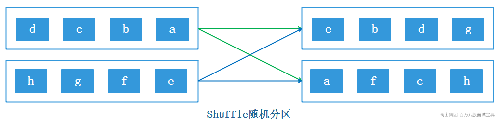

**注意：**

1) 由于是随机分区，每次执行shuffle操作后，下游每个分区中的数据也会不同。

2) shuffle partitioner分区策略会将上游一个并行度数据全局打散随机分发到下游分区中，网络开销大。

- **Java代码实现**

```plain
StreamExecutionEnvironment env = StreamExecutionEnvironment.getExecutionEnvironment();
env.setParallelism(1);
DataStreamSource<String> source = env.socketTextStream("node5", 9999);
source.shuffle().print("shuffle").setParallelism(3);
env.execute();
```

- **Scala代码实现**

```plain
val env: StreamExecutionEnvironment = StreamExecutionEnvironment.getExecutionEnvironment
//设置并行度为1
env.setParallelism(1)

val ds: DataStream[String] = env.socketTextStream("node5", 9999)
ds.shuffle.print().setParallelism(3)
env.execute()
```

**注意**:以上无论是java代码还是scala代码多次执行时，在socket中输入相同数据集，每次执行的结果可以看出相同数据随机由不同的线程进行处理。

### **6.7.3 rebalance轮询分区**

在Flink中可以对DataStream调用rebalance方法来使用reblance partitioner分区策略对数据进行轮询重分区，这种分区方式采用RoundRobin负载均衡算法保证每个分区的数据平衡，当数据出现倾斜时可以使用这种分区策略对数据进行重分区。

*(⚠️ 图片缺失:源知识库原图已失效)* 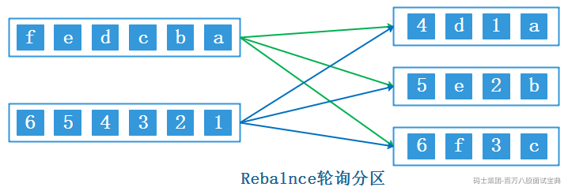

**注意：**

1) Flink中改变并行度默认采用的就是rebalance partitioner分区策略。

2) rebalance partitioner分区策略会对数据全局性的通过网络传输实现数据轮询重分区，网络开销大。

- **Java代码实现**

```plain
StreamExecutionEnvironment env = StreamExecutionEnvironment.getExecutionEnvironment();
env.setParallelism(1);
DataStreamSource<String> source = env.socketTextStream("node5", 9999);
source.rebalance().print("shuffle").setParallelism(3);
env.execute();
```

- **Scala代码实现**

```plain
val env: StreamExecutionEnvironment = StreamExecutionEnvironment.getExecutionEnvironment
env.setParallelism(1)
val ds: DataStream[String] = env.socketTextStream("node5", 9999)
ds.rebalance.print().setParallelism(3)
env.execute()
```

### **6.7.4 rescale重缩放分区**

在Flink中可以使用rescale方法使用rescale partitioner分区策略对数据进行重分区。与rebalance partitioner分区策略类似，rescaling 分区策略也采用RoundRobin负载均衡算法进行重分区，但该分区策略不采用全局性的网络传输来实现数据的重分区，它使用一种本地的分区策略，通过调整任务的数量来改变数据的分配方式。

当Flink处理的数据量较多时，rescale 分区策略会在当前TaskManager中进行本地节点的重分区，这样只需要在当前TaskManager中多个Slot之间进行数据重新分配而避免跨节点全局重分区操作带来的网络开销大的问题。

*(⚠️ 图片缺失:源知识库原图已失效)* 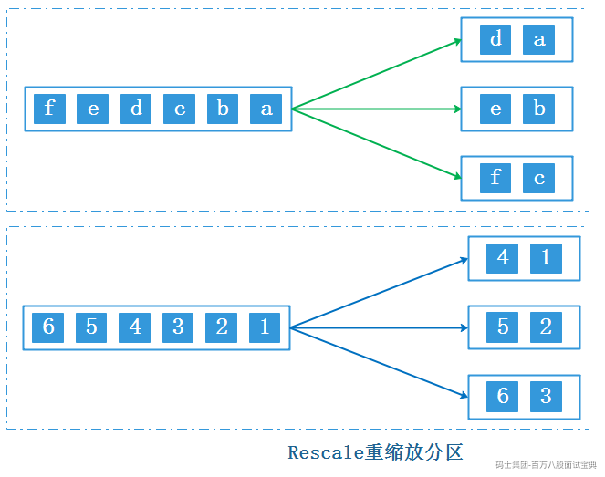

使用rescale 时，建议下游算子并行度是上游算子并行度的整数倍，这样效率比较高。例如：如果上游操作的并行度为2，下游操作的并行度为6，那么一个上游操作将将元素分发给三个下游操作，而另一个上游操作将分发给其他三个下游操作。如果上下游算子并行度不是整数倍就会存在上游算子并行度向下游分发数据分发的并行度不同，如下图所示：

*(⚠️ 图片缺失:源知识库原图已失效)* 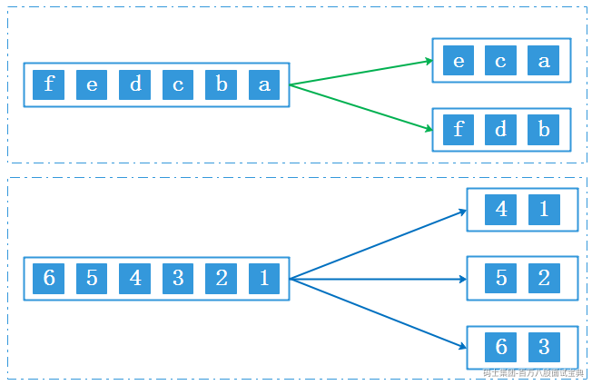

- **Java代码实现**

```plain
StreamExecutionEnvironment env = StreamExecutionEnvironment.getExecutionEnvironment();
        env.setParallelism(2);
        DataStreamSource<Object> ds = env.addSource(new RichParallelSourceFunction<Object>() {
            @Override
            public void run(SourceContext<Object> ctx) throws Exception {
                List<String> list1 = Arrays.asList("a", "b", "c", "d", "e", "f");
                List<Integer> list2 = Arrays.asList(1, 2, 3, 4, 5, 6);
                for (String elem : list1) {
                    //这里的getRuntimeContext().getIndexOfThisSubtask()是获取当前subtask的index，从0开始
                    if (0 == getRuntimeContext().getIndexOfThisSubtask()) {
                        ctx.collect(elem);
                    }
                }
                for (Integer elem : list2) {
                    int indexOfThisSubtask = getRuntimeContext().getIndexOfThisSubtask();
                    if (1 == getRuntimeContext().getIndexOfThisSubtask()) {
                        ctx.collect(elem);
                    }
                }
            }

            @Override
            public void cancel() {

            }
        });

        //比较rescale和rebalance的区别
        ds.rescale().print("rescale").setParallelism(3);
//        ds.rebalance().print("reblance").setParallelism(4);
        env.execute();
```

- **Scala代码实现**

```plain
val env = StreamExecutionEnvironment.getExecutionEnvironment
env.setParallelism(2)

//导入隐式转换
import org.apache.flink.api.scala._

val ds: DataStream[Object] = env.addSource[Object](new RichParallelSourceFunction[Object] {

  var isRunning = true

  override def run(ctx: SourceFunction.SourceContext[Object]): Unit = {
    val list1 = List[String]("a", "b", "c", "d", "e", "f")
    val list2 = List[Integer](1, 2, 3, 4, 5, 6)
    list1.foreach(one => {
      if (0 == getRuntimeContext.getIndexOfThisSubtask) {
        ctx.collect(one)
      }
    })
    list2.foreach(one => {
      if (1 == getRuntimeContext.getIndexOfThisSubtask) {
        ctx.collect(one)
      }
    })
  }

  override def cancel(): Unit = {
    isRunning = false
  }

})

ds.rescale.print("rescale").setParallelism(4)
env.execute()
```

注意：以上java或者scala代码可以测试rebalance和rescale方法的异同，两者都是轮询往下游发送数据，区别是rebalance是全局方式发送，rescale是局部方式发送。

### **6.7.5 broadcast广播分区**

在Flink中可以对DataStream调用broadcast方法使用broadcast partitioner分区策略将数据流数据复制广播到下游算子各个并行task中，下游算子task可以直接从本地内存中获取广播数据集使用，不再依赖网络传输数据流数据。broadcast partitioner 分区策略适合于小数据集广播，例如，当大数据集关联小数据集时，可以通过广播小数据集方式将数据分发到算子的每个分区中。

*(⚠️ 图片缺失:源知识库原图已失效)* 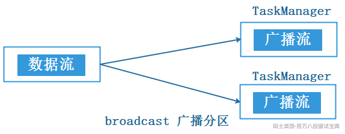

**注意**：DataStream 通过broadcast广播后，数据被广播到每个TaskManager的内存中，每个TaskManager节点上的task都可以从节点内存中获取该广播数据。

**案例**:读取Socket中学生分数信息作为主流，将学生信息流作为广播流进行广播，然后两者进行关联获取学员全部信息。

- **Java代码实现**

```plain
StreamExecutionEnvironment env = StreamExecutionEnvironment.getExecutionEnvironment();
//用户分数信息
SingleOutputStreamOperator<Tuple2<String, Integer>> mainDS = env.socketTextStream("node5", 9999).map(line -> {
    String[] arr = line.split(",");
    return Tuple2.of(arr[0], Integer.parseInt(arr[1]));
}).returns(Types.TUPLE(Types.STRING, Types.INT));

//用户基本信息
DataStreamSource<Tuple2<String, String>> sideDS = env.fromCollection(Arrays.asList(
        Tuple2.of("zs", "北京"),
        Tuple2.of("ls", "上海"),
        Tuple2.of("ww", "广州"),
        Tuple2.of("ml", "深圳"),
        Tuple2.of("tq", "杭州")));

MapStateDescriptor<String, String> msd = new MapStateDescriptor<>("map-descriptor", String.class, String.class);

//将用户基本信息广播出去
BroadcastStream<Tuple2<String, String>> broadcast = sideDS.broadcast(msd);

//连接两个流,并处理
mainDS.connect(broadcast).process(new BroadcastProcessFunction<Tuple2<String, Integer>, Tuple2<String, String>, String>() {
    //处理主流数据
    @Override
    public void processElement(Tuple2<String, Integer> scoreInfo, BroadcastProcessFunction<Tuple2<String, Integer>, Tuple2<String, String>, String>.ReadOnlyContext ctx, Collector<String> out) throws Exception {
        //获取广播状态
        ReadOnlyBroadcastState<String, String> broadcastState = ctx.getBroadcastState(msd);
        //获取用户基本信息
        String cityAddr = broadcastState.get(scoreInfo.f0);
        out.collect("姓名:"+scoreInfo.f0+",地址:"+ cityAddr + ",分数"+scoreInfo.f1);
    }

    //处理广播流数据
    @Override
    public void processBroadcastElement(Tuple2<String, String> baseInfo, BroadcastProcessFunction<Tuple2<String, Integer>, Tuple2<String, String>, String>.Context ctx, Collector<String> out) throws Exception {
        //获取广播状态
        BroadcastState<String, String> broadcastState = ctx.getBroadcastState(msd);
        broadcastState.put(baseInfo.f0, baseInfo.f1);
    }
}).print();

env.execute();
```

- **Scala代码实现**

```plain
val env: StreamExecutionEnvironment = StreamExecutionEnvironment.getExecutionEnvironment
//导入隐式转换
import org.apache.flink.api.scala._

val ds: DataStream[String] = env.socketTextStream("node5", 9999)
val mainDS: DataStream[(String, String)] = ds.map(one => {
  val arr: Array[String] = one.split(",")
  (arr(0), arr(1))
})

//获取用户基本信息
val baseInfo: DataStream[(String, String)] = env.fromCollection(List(("zs", "北京"), ("ls", "上海"), ("ww", "广州")))

//设置mapDescriptor
val msd = new MapStateDescriptor[String, String]("map-descriptor", classOf[String], classOf[String])

//广播用户基本信息
val bcDS: BroadcastStream[(String, String)] = baseInfo.broadcast(msd)

//连接主流和广播流
mainDS.connect(bcDS).process(new BroadcastProcessFunction[(String,String),(String,String),String] {
  //处理主流数据
  override def processElement(value: (String, String), ctx: BroadcastProcessFunction[(String, String), (String, String), String]#ReadOnlyContext, out: Collector[String]): Unit = {
    //获取广播对象
    val map = ctx.getBroadcastState(msd)
    //获取学生地址信息
    val stuInfo = map.get(value._1)
    //输出学生信息
    out.collect(value._1 + "," + value._2 + "," + stuInfo)
  }

  //处理广播流数据
  override def processBroadcastElement(value: (String, String), ctx: BroadcastProcessFunction[(String, String), (String, String), String]#Context, out: Collector[String]): Unit = {
    //获取广播对象
    val map = ctx.getBroadcastState(msd)
    //将广播流数据放入广播对象中
    map.put(value._1,value._2)
  }
}).print()
env.execute()
```

**执行代码注意以下两点：**

1) 以上Java或者Scala代码执行后在Socket中输入如下数据即可:

```plain
zs,100
ls,200
ww,300
ml,400
tq,500
```

2) 以上代码使用broadcast中涉及到Flink中的广播状态，关于这点后续章节再做介绍。

### **6.7.6 global全局分区**

在Flink中可以对DataStream调用global方法使用global partitioner全局分区策略将一个多分区的流转换到一个分区中，也就是说该方法会强制将多个上游task处理的数据发送到下游1个task中处理。如果DataStream数据流数据量非常少，可以通过该方法将数据汇集到一个task中处理提高效率，但如果DataStream数据流数据量大，该方法应该慎用。

*(⚠️ 图片缺失:源知识库原图已失效)* 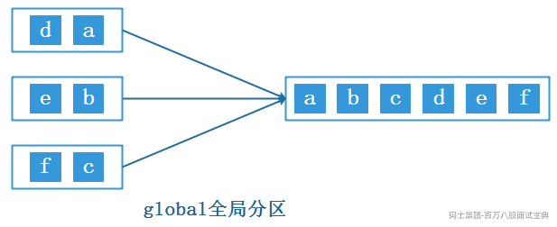

- **Java代码实现**

```plain
StreamExecutionEnvironment env = StreamExecutionEnvironment.getExecutionEnvironment();
DataStreamSource<Integer> ds = env.fromCollection(Arrays.asList(1, 2, 3, 4, 5, 6, 7, 8, 9, 10));
ds.global().print("global");
env.execute();
```

- **Scala代码实现**

```plain
val env: StreamExecutionEnvironment = StreamExecutionEnvironment.getExecutionEnvironment
// 导入隐式转换
import org.apache.flink.api.scala._
val ds: DataStream[Int] = env.fromCollection(List(1, 2, 3, 4, 5, 6, 7, 8, 9, 10))
ds.print("普通打印")
// 设置全局分区
ds.global.print("global")
env.execute()
```

**注意**：执行以上Java或者Scala代码，可以看到global算子最后输出的数据都被一个线程处理。

### **6.7.7 forward并行分区**

在Flink中可以对DataStream调用forward方法使用forward partitioner并行分区策略原封不动的将上游分区数据转发到下游分区中，即上游分区数据分发到下游对应分区一对一的数据分发。map、flatMap、filter 等算子上下游并行度一样时默认就是这种分区策略。

*(⚠️ 图片缺失:源知识库原图已失效)* 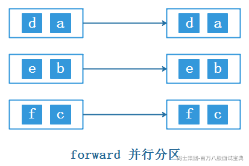

**注意**：显示在代码中显示指定了forward后，并行度不能改变，否则报错。如果map、filter、flatMap这类算子上下游并行度不一样默认使用的rebalance partitioner分区策略。

- **Java代码实现**

```plain
StreamExecutionEnvironment env = StreamExecutionEnvironment.getExecutionEnvironment();

DataStreamSource<Integer> ds1 = env.addSource(new RichParallelSourceFunction<Integer>() {
    Boolean flag = true;

    @Override
    public void run(SourceContext<Integer> ctx) throws Exception {
        List<Integer> integers = Arrays.asList(1, 2, 3, 4, 5, 6, 7, 8, 9, 10);
        for (Integer integer : integers) {
            int indexOfThisSubtask = getRuntimeContext().getIndexOfThisSubtask();
            if (integer % 2 != 0 && indexOfThisSubtask == 0) {
                ctx.collect(integer);
            } else if (integer % 2 == 0 && indexOfThisSubtask == 1) {
                ctx.collect(integer);
            }
        }
    }

    @Override
    public void cancel() {
        flag = false;
    }
});
ds1.print("ds1");

SingleOutputStreamOperator<String> ds2 = ds1.forward().map(one -> one + "xx");
ds2.print("ds2");

env.execute();
```

- **Scala代码实现**

```plain
val env: StreamExecutionEnvironment = StreamExecutionEnvironment.getExecutionEnvironment
//导入隐式转换
import org.apache.flink.streaming.api.scala._

val ds1: DataStream[Integer] = env.addSource(new RichParallelSourceFunction[Integer] {
  var flag = true

  override def run(ctx: SourceFunction.SourceContext[Integer]): Unit = {
    val list = List(1, 2, 3, 4, 5, 6, 7, 8, 9, 10)
    for (elem <- list) {
      val subtask: Int = getRuntimeContext.getIndexOfThisSubtask
      if (elem % 2 != 0 && 0 == subtask) {
        ctx.collect(elem)

      } else if (elem % 2 == 0 && 1 == subtask) {
        ctx.collect(elem)
      }
    }

  }

  override def cancel(): Unit = {
    flag = false
  }

})

ds1.print("ds1")
val ds2: DataStream[String] = ds1.forward.map(one => {
  one + "xx"
})
ds2.print("ds2")
env.execute()
```

### **6.7.8 partitionCustom 自定义分区**

partitionCustom算子是Flink中用于自定义数据分区的算子，通过实现自定义的分区函数，可以根据特定需求对数据进行灵活的分区操作，实现满足用户定制化的分区策略。在使用partitionCustom算子时需要传入2个参数，第一个参数用户实现的分区器Partitioner对象，该分区器决定流数据去往下游哪些分区，第二个参数指定应用分区器的字段。

- **Java代码实现**

```plain
StreamExecutionEnvironment env = StreamExecutionEnvironment.getExecutionEnvironment();

/**
 * Socket中输入数据如下格式数据
 * a,1
 * b,2
 * a,3
 * b,4
 * c,5
 */
DataStreamSource<String> ds1 = env.socketTextStream("node5", 9999);
SingleOutputStreamOperator<Tuple2<String, Integer>> ds2 = ds1.map(one -> {
    String[] arr = one.split(",");
    return Tuple2.of(arr[0], Integer.valueOf(arr[1]));
}).returns(Types.TUPLE(Types.STRING, Types.INT));

DataStream<Tuple2<String, Integer>> result = ds2.partitionCustom(new Partitioner<String>() {
    @Override
    public int partition(String key, int numPartitions) {
        return key.hashCode() % numPartitions;
    }
}, new KeySelector<Tuple2<String, Integer>, String>() {
    @Override
    public String getKey(Tuple2<String, Integer> tp) throws Exception {
        return tp.f0;
    }
});

result.print();
env.execute();
```

- **Scala代码实现**

```plain
val env: StreamExecutionEnvironment = StreamExecutionEnvironment.getExecutionEnvironment
//导入隐式转换
import org.apache.flink.streaming.api.scala._
val ds1: DataStream[String] = env.socketTextStream("node5", 9999)
val ds2: DataStream[(String, Int)] = ds1.map(one => {
  val arr: Array[String] = one.split(",")
  (arr(0), arr(1).toInt)
})

val result: DataStream[(String, Int)] = ds2.partitionCustom(new Partitioner[String] {
  override def partition(key: String, numPartitions: Int): Int = {
    key.hashCode % numPartitions
  }
}, _._1)

result.print()
env.execute()
```

以上Java或者Scala代码执行时可以在Socket中输入如下数据：

```plain
a,1
b,2
a,3
b,4
c,5
```

## 6.8 **Side Output侧输出**

在Flink处理数据流时，常常会面临这样的情况：需要对一个数据源进行处理，该数据源包含不同类型的数据，我们需要将其分割处理。使用filter算子对数据源进行筛选分割会导致数据流的多次复制，从而造成不必要的性能浪费。为了解决这个问题，Flink引入了侧输出（Side Output）机制，该机制可以将数据流进行分割，而无需对流进行复制。使用侧输出时，用户可以通过定义输出标签（Output Tag）来标识不同的侧输出流。在处理数据流时，通过适当的操作符和条件，可以将特定类型的数据发送到相应的侧输出流。

**侧输出适合Flink中流分割处理、异常数据处理、延迟数据处理场景**，例如常见的延迟数据处理场景中可以通过侧输出避免丢弃延迟到达的数据。关于Flink中延迟到达的数据在后续章节介绍。

**案例：Flink读取Socket中通话数据，将成功和不成功的数据信息分别输出。**

- **Java代码实现**

```plain
StreamExecutionEnvironment env = StreamExecutionEnvironment.getExecutionEnvironment();
/**
 * Socket中的数据格式如下:
 *  001,186,187,success,1000,10
 *  002,187,186,fail,2000,20
 *  003,186,188,success,3000,30
 *  004,188,186,success,4000,40
 *  005,188,187,busy,5000,50
 */
DataStreamSource<String> ds = env.socketTextStream("node5", 9999);

//定义侧输出流的标签
OutputTag<String> outputTag = new OutputTag<String>("side-output"){};

SingleOutputStreamOperator<String> mainStream = ds.process(new ProcessFunction<String, String>() {
    @Override
    public void processElement(String value, ProcessFunction<String, String>.Context ctx, Collector<String> out) throws Exception {
        //value 格式：001,186,187,success,1000,10
        String[] split = value.split(",");
        String callType = split[3];//通话类型
        //判断通话类型
        if ("success".equals(callType)) {
            //成功类型，输出到主流
            out.collect(value);
        } else {
            //其他类型，输出到侧输出流
            ctx.output(outputTag, value);
        }

    }
});

//获取主流
mainStream.print("主流");

//获取侧输出流
mainStream.getSideOutput(outputTag).print("侧输出流");

env.execute();
```

- **Scala代码实现**

```plain
val env = StreamExecutionEnvironment.getExecutionEnvironment

//导入隐式转换
import org.apache.flink.api.scala._

/**
 * Socket中的数据格式如下:
 *  001,186,187,success,1000,10
 *  002,187,186,fail,2000,20
 *  003,186,188,success,3000,30
 *  004,188,186,success,4000,40
 *  005,188,187,busy,5000,50
 */
val ds: DataStream[String] = env.socketTextStream("node5", 9999)

//定义侧输出流的标签
val outputTag: OutputTag[String] = OutputTag[String]("side-output")

val mainStream: DataStream[String] = ds.process((value: String, ctx: ProcessFunction[String, String]#Context, out: Collector[String]) => {
  //value 格式：001,186,187,success,1000,10
  val split: Array[String] = value.split(",")
  val callType: String = split(3) //通话类型
  //判断通话类型
  if ("success".equals(callType)) {
    //成功类型，输出到主流
    out.collect(value)
  } else {
    //其他类型，输出到侧输出流
    ctx.output(outputTag, value)
  }
})

//获取主流
mainStream.print("主流")

//获取侧输出流
mainStream.getSideOutput(outputTag).print("侧输出流")

env.execute()
```

以上代码执行后，向Socket中输入如下数据进行测试。

```plain
001,186,187,success,1000,10
002,187,186,fail,2000,20
003,186,188,success,3000,30
004,188,186,success,4000,40
005,188,187,busy,5000,50
```

## 6.9 **ProcessFunction**

Flink 的 ProcessFunction 是 DataStream API 中的一个重要组成部分，它允许用户为流数据定义自定义的处理逻辑。ProcessFunction 提供了一种强大的机制，用于低级别的流转换，并完全控制数据事件、状态和时间。

ProcessFunction 是一个抽象类，继承自 AbstractRichFunction富函数抽象类，并有两个泛型类型参数：I（输入）和 O（输出），表示输入和输出的数据类型，富函数类中拥有的方法ProcessFunction 中都可以使用。

ProcessFunction 中有两个核心方法，如下:

- **processElement() 方法**

这个方法用于处理每个元素，对于流中的每个元素，都会调用一次。它的参数包括输入数据值 value、上下文 ctx 和收集器 out。方法没有返回值，处理后的输出数据是通过收集器 out 定义的。

```plain
public void processElement(对象类型 value, ProcessFunction<对象类型, 返回对象类型,>.Context ctx, Collector<返回对象类型> out) throws Exception {
... ...
}
```

- value：表示当前流中正在处理的输入元素，类型与流中数据类型一致。

- ctx：表示当前运行的上下文，可以获取当前的时间戳，并提供了定时服务（TimerService），用于查询时间和注册定时器，还可以将数据发送到侧输出流（side output）。

- out：表示输出数据的收集器，使用 out.collect() 方法可以向下游发出一个数据。

- **onTimer() 方法**

这个方法用于定义定时触发的操作，只有在注册的定时器触发时才会调用。定时器是通过 TimerService 注册的，相当于设定了一个闹钟，到达设定的时间就会触发。

注册定时器方法如下：

```plain
ctx.timerService().registerProcessingTimeTimer(定时器触发时间);
```

定时器触发后调用onTimer方法如下：

```plain
public void onTimer(long timestamp, ProcessFunction<对象类型, 返回对象类型,>.OnTimerContext ctx, Collector<返回对象类型,> out) throws Exception {
    ... ... 
}
```

onTimer() 方法有三个参数：时间戳（timestamp）、上下文（ctx）和收集器（out）。timestamp 是设定好的触发时间，通常与水位线（watermark）相关。方法中可以使用上下文和收集器执行相应的操作，包括使用定时服务（TimerService）和输出处理后的数据。

总而言之，Flink 的 ProcessFunction 提供了强大的灵活性，可以实现各种自定义的业务逻辑，可以实现各种基本转换操作，如 flatMap、map 和 filter，通过获取上下文的方法还可以自定义状态进行聚合操作。同时，ProcessFunction 也支持定时触发操作，可以根据时间来分组数据，并在指定的时间触发计算和输出结果，实现窗口（window）的功能。

**案例：Flink读取Socket中通话数据，如果被叫手机连续5s呼叫失败生成告警信息。(注意：该案例涉及到状态编程，这里我们只需要了解状态意思即可，后续章节会详细讲解状态)**

- **Java代码实现**

```plain
StreamExecutionEnvironment env = StreamExecutionEnvironment.getExecutionEnvironment();
//必须设置checkpoint，否则数据不能正常写出到mysql
env.enableCheckpointing(5000);
/**
 * socket 中输入数据如下：
 * 001,186,187,fail,1000,10
 * 002,186,187,success,2000,20
 * 003,187,188,fail,3000,30
 * 004,187,188,fail,4000,40
 * 005,188,187,busy,5000,50
 */
SingleOutputStreamOperator<StationLog> ds = env.socketTextStream("node5", 9999)
        .map(one -> {
            String[] arr = one.split(",");
            return new StationLog(arr[0], arr[1], arr[2], arr[3], Long.valueOf(arr[4]), Long.valueOf(arr[5]));
        });

//按照被叫号码分组
KeyedStream<StationLog, String> keyedStream = ds.keyBy(stationLog -> stationLog.getCallIn());

//使用ProcessFunction实现通话时长超过5秒的告警
keyedStream.process(new KeyedProcessFunction<String, StationLog, String>() {
    //使用状态记录上一次通话时间
    ValueState<Long> timeState = null;

    //在open方法中初始化记录时间的状态
    @Override
    public void open(Configuration parameters) throws Exception {
        ValueStateDescriptor<Long> time = new ValueStateDescriptor<>("time", Long.class);
        timeState = getRuntimeContext().getState(time);
    }

    //每来一条数据，调用一次
    @Override
    public void processElement(StationLog value, KeyedProcessFunction<String, StationLog, String>.Context ctx, Collector<String> out) throws Exception {
        //从状态中获取上次状态存储时间
        Long time = timeState.value();
        //如果时间为null，说明是第一条数据，注册定时器
        if("fail".equals(value.callType) && time == null){
            //获取当前时间
            long nowTime = ctx.timerService().currentProcessingTime();
            //注册定时器，5秒后触发
            long onTime = nowTime + 5000;
            ctx.timerService().registerProcessingTimeTimer(onTime);
            //更新状态
            timeState.update(onTime);
        }

        // 表示有呼叫成功了，可以取消触发器
        if (!value.callType.equals("fail") && time != null) {
            ctx.timerService().deleteProcessingTimeTimer(time);
            timeState.clear();
        }

    }

    //定时器触发时调用,执行触发器，发出告警
    @Override
    public void onTimer(long timestamp, KeyedProcessFunction<String, StationLog, String>.OnTimerContext ctx, Collector<String> out) throws Exception {
        out.collect("触发时间:" + timestamp + " 被叫手机号：" + ctx.getCurrentKey() +" 连续5秒呼叫失败！");
        //清空时间状态
        timeState.clear();
    }
}).print();

env.execute();
```

- **Scala代码实现**

```plain
val env: StreamExecutionEnvironment = StreamExecutionEnvironment.getExecutionEnvironment
//导入隐式转换
import org.apache.flink.streaming.api.scala._
//必须设置checkpoint，否则数据不能写入mysql
env.enableCheckpointing(5000)

/**
 * Socket中输入数据如下：
 * 001,186,187,fail,1000,10
 * 002,186,187,success,2000,20
 * 003,187,188,fail,3000,30
 * 004,187,188,fail,4000,40
 */
val ds: DataStream[StationLog] = env.socketTextStream("node5", 9999)
  .map(line => {
    val arr: Array[String] = line.split(",")
    StationLog(arr(0).trim, arr(1).trim, arr(2).trim, arr(3).trim, arr(4).trim.toLong, arr(5).trim.toLong)
  })

//设置 被叫号码为key
ds.keyBy(_.callIn).process(new KeyedProcessFunction[String,StationLog,String] {
  //定义一个状态，记录上次通话时间
  lazy val timeState = getRuntimeContext.getState(new ValueStateDescriptor[Long]("time", classOf[Long]))

  //每条数据都会调用一次
  override def processElement(value: StationLog, ctx: KeyedProcessFunction[String, StationLog, String]#Context, out: Collector[String]): Unit = {
    //获取当前key对应的状态
    val time: Long = timeState.value()

    //如果该被叫手机号呼叫状态是fail且time为0，说明是第一条数据，注册定时器
    if("fail".equals(value.callType) && time == 0){
      //获取当前时间
      val nowTime: Long = ctx.timerService().currentProcessingTime()
      //触发定时器时间为当前时间+5s
      val onTime = nowTime + 5000

      //注册定时器
      ctx.timerService().registerProcessingTimeTimer(onTime)

      //更新定时器
      timeState.update(onTime)
    }

    //如果该被叫手机号呼叫状态不是fail且time不为0，表示有呼叫成功了，可以取消触发器
    if(!value.callType.equals("fail") &&  time!=0){
      //删除定时器
      ctx.timerService().deleteProcessingTimeTimer(time)
      //清空时间状态
      timeState.clear()
    }
  }

  override def onTimer(timestamp: Long, ctx: KeyedProcessFunction[String, StationLog, String]#OnTimerContext, out: Collector[String]): Unit = {
    //定时器触发时，说明该被叫手机号连续5s呼叫失败，输出告警信息
    out.collect("触发时间:" + timestamp + " 被叫手机号：" + ctx.getCurrentKey + " 连续5秒呼叫失败！")
    //清空时间状态
    timeState.clear()

  }
}).print()
env.execute()
```

## 6.10 **Flink 异步IO机制**

### **6.10.1 异步IO机制原理**

Flink的异步I/O是一个非常受欢迎的特性，由阿里巴巴贡献给社区，并在1.2版本中引入,它的主要目的是解决与外部系统交互时网络延迟成为系统瓶颈的问题，外部系统往往是外部数据库。

在Flink流计算系统中，与外部数据库进行交互是常见的需求,通常情况下，我们会发送一个查询请求到数据库并等待结果返回，这期间无法发送其他请求，这种同步访问方式会导致阻塞，阻碍了吞吐量和延迟，为了解决这个问题，引入了异步模式，能够并发地处理多个到外部数据库的请求，下图为官方提供的异步IO原理图。

*(⚠️ 图片缺失:源知识库原图已失效)* 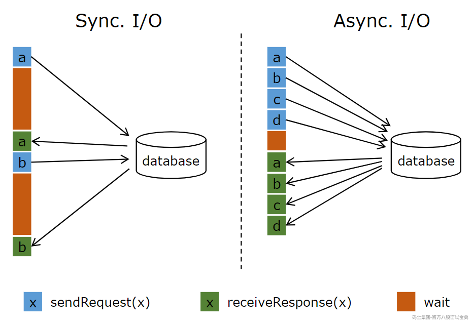

在Flink中使用异步I/O，我们可以连续发送多个查询请求到数据库，并在回复返回时处理每个回复，而不需要阻塞等待，这种并发处理的方式极大地减少了延迟。

**异步I/O专门用于解决Flink计算过程中与外部系统的交互问题**，特别需要注意的是为了提高Flink与外部系统交互能力，也可以提高Flink的并行度进而提高Flink处理数据的吞吐量，这种方式会付出更高的资源成本，如：更多的task、更多的内存缓存、更高的网络连接,而**异步IO方式相对这种方式是基于某一个task之上的扩展，重复利用一个task资源做更多的事情，提高了Flink性能和资源利用率**。

### **6.10.2 异步IO使用前提**

在Flink中查询外界数据库数据时要使用异步IO需要满足如下条件之一：

- 数据库（或K/V存储系统）提供支持异步请求的客户端，例如Java的Vertx。

- 对于不支持异步请求客户端的外部系统可以使用线程池**模拟**异步客户端。

*注意:Java Vertx是一个基于JVM的应用平台，适用于移动端后台、互联网和企业应用架构,采用了基于Netty的全异步通信,支持多种语言，目前Vertx的异步驱动已经支持了Postgres、MySQL、MongoDB、Redis等常用组件，可以作为异步连接这些数据库的工具。*

### **6.10.3 异步IO代码**

Flink中使用异步IO时，代码逻辑如下：

```plain
#创建原始数据流
DataStream<String> stream = ...;

#使用Flink异步IO - 顺序输出(每个task中)
DataStream<Tuple2<String, String>> resultStream =    AsyncDataStream.orderedWait(stream, new AsyncDatabaseRequest(), 1000, TimeUnit.MILLISECONDS, 100);

#使用Flink异步IO - 乱序输出
DataStream<Tuple2<String, String>> resultStream =    AsyncDataStream.unorderedWait(stream, new AsyncDatabaseRequest(), 1000, TimeUnit.MILLISECONDS, 100);
```

Flink Async I/O 输出提供乱序和顺序两种模式，异步IO实现方法分别为:orderedWait和unorderedWait，两种方法都有5个参数，解释如下：

- 第一个参数是输入数据流；

- 第二个参数是异步IO的实现类，该类需要继承RichAsyncFunction抽象类。

- 第三个参数是用于完成异步操作超时时间；

- 第四个参数是超时时间单位；

- 第五个参数可以触发的最大异步i/o操作数；

下面我们以Flink通过异步IO方式读取MySQL中的数据为例，分别来演示“异步请求客户端”和“线程池模拟异步请求客户端”两种实现异步请求的使用方式。

#### 6.10.3.1 **数据准备**

在MySQL中创建表并插入数据：

```plain
#mysql使用库并建表
use mydb;
create table async_tbl(
id int,
name varchar(255),
age int
);

#插入数据
insert into async_tbl values 
(1,"a1",18),
(2,"a2",19),
(3,"a3",20),
(4,"a4",21),
(5,"a5",22),
(6,"a6",23),
(7,"a7",24),
(8,"a8",25),
(9,"a9",26),
(10,"a10",27);
```

#### 6.10.3.2 **异步请求客户端**

这里使用Java Vertx来异步连接MySQL,需要在项目依赖包中导入如下依赖：

```plain
<!-- Flink 异步IO 需要的 Vertx 依赖包 -->
<dependency>
  <groupId>io.vertx</groupId>

  <artifactId>vertx-jdbc-client</artifactId>

  <version>${vertx.version}</version>

</dependency>

<dependency>
  <groupId>io.vertx</groupId>

  <artifactId>vertx-core</artifactId>

  <version>${vertx.version}</version>

</dependency>

```

- **Java代码实现:**

```plain
yi/**
 *  实现Flink异步IO方式一:使用 Vert.x 实现异步 IO
 *  案例：读取MySQL中的数据
 */
public class AsyncIOTest1 {
    public static void main(String[] args) throws Exception {
        StreamExecutionEnvironment env = StreamExecutionEnvironment.getExecutionEnvironment();
        //为了测试效果，这里设置并行度为1
        env.setParallelism(1);
        //准备数据流
        DataStreamSource<Integer> idDS = env.fromCollection(Arrays.asList(1, 2, 3, 4, 5, 6, 7, 8, 9, 10));

        /**
         * 使用异步IO，参数解释如下：
         *  第一个参数是输入数据流，
         *  第二个参数是异步IO的实现类，
         *  第三个参数是用于完成异步操作超时时间，
         *  第四个参数是超时时间单位，
         *  第五个参数可以触发的最大异步i/o操作数
         */
        AsyncDataStream.unorderedWait(idDS, new AsyncDatabaseRequest1(), 5000, TimeUnit.MILLISECONDS, 10)
                .print();

        env.execute();

    }

}

class AsyncDatabaseRequest1 extends RichAsyncFunction<Integer, String> {
    //定义JDBCClient共享对象
    JDBCClient mysqlClient = null;

    //初始化资源，连接Mysql
    @Override
    public void open(Configuration parameters) throws Exception {
        //创建连接mysql配置对象
        JsonObject config = new JsonObject()
                .put("url", "jdbc:mysql://node2:3306/mydb?useSSL=false")
                .put("driver_class", "com.mysql.jdbc.Driver")
                .put("user", "root")
                .put("password", "123456");

        //创建VertxOptions对象
        VertxOptions vo = new VertxOptions();
        //设置Vertx要使用的事件循环线程数
        vo.setEventLoopPoolSize(10);
        //设置Vertx要使用的最大工作线程数
        vo.setWorkerPoolSize(20);

        //创建Vertx对象
        Vertx vertx = Vertx.vertx(vo);

        //创建JDBCClient共享对象，多个Vertx 客户端可以共享一个JDBCClient对象
        mysqlClient = JDBCClient.createShared(vertx, config);
    }

    //实现异步IO的方法，第一个参数是输入，第二个参数是异步IO返回的结果
    @Override
    public void asyncInvoke(Integer input, ResultFuture<String> resultFuture) {
        mysqlClient.getConnection(new Handler<AsyncResult<SQLConnection>>() {
            @Override
            public void handle(AsyncResult<SQLConnection> sqlConnectionAsyncResult) {
                if (sqlConnectionAsyncResult.failed()) {
                    System.out.println("获取连接失败：" + sqlConnectionAsyncResult.cause().getMessage());
                    return;
                }

                //获取连接
                SQLConnection connection = sqlConnectionAsyncResult.result();

                //执行查询
                connection.query("select id,name,age from async_tbl where id = " + input, new Handler<AsyncResult<io.vertx.ext.sql.ResultSet>>() {
                    @Override
                    public void handle(AsyncResult<io.vertx.ext.sql.ResultSet> resultSetAsyncResult) {
                        if (resultSetAsyncResult.failed()) {
                            System.out.println("查询失败：" + resultSetAsyncResult.cause().getMessage());
                            return;
                        }

                        //获取查询结果
                        io.vertx.ext.sql.ResultSet resultSet = resultSetAsyncResult.result();

                        //打印查询的结果
                        //将查询结果返回给Flink
                        resultSet.getRows().forEach(row -> {
                            resultFuture.complete(Collections.singletonList(row.encode()));
                        });
                    }
                });
            }
        });
    }

    /**
     * 异步IO超时处理逻辑，主要避免程序出错。参数如下:
     * 第一个参数是输入数据
     * 第二个参数是异步IO返回的结果
     */
    @Override
    public void timeout(Integer input, ResultFuture<String> resultFuture) throws Exception {
        resultFuture.complete(Collections.singletonList("异步IO超时！！！"));
    }

    //关闭资源
    @Override
    public void close() throws Exception {
        mysqlClient.close();
    }
}
```

- **Scala代码实现:**

```plain
/**
 * 实现Flink异步IO方式一:使用 Vert.x 实现异步 IO
 * 案例：读取MySQL中的数据
 */
object AsyncIOTest1 {
  def main(args: Array[String]): Unit = {
    val env: StreamExecutionEnvironment = StreamExecutionEnvironment.getExecutionEnvironment
    //为了测试效果，这里设置并行度为1
    env.setParallelism(1)

    //导入隐式转换
    import org.apache.flink.streaming.api.scala._

    //准备数据流
    val idDS: DataStream[Int] = env.fromCollection(List(1, 2, 3, 4, 5, 6, 7, 8, 9, 10))

    AsyncDataStream.unorderedWait(idDS, new AsyncDatabaseRequest1(), 5000, java.util.concurrent.TimeUnit.MILLISECONDS, 10)
        .print()

    env.execute()
  }

}

class AsyncDatabaseRequest1 extends RichAsyncFunction[Int,String]() {

  //定义JDBCClient对象
  var mysqlClient: JDBCClient = null

  //初始化资源,连接MySQL
  override def open(parameters: Configuration): Unit = {
    //创建连接MySQL的配置信息
    val config: JsonObject = new JsonObject()
      .put("url", "jdbc:mysql://node2:3306/mydb?useSSL=false")
      .put("driver_class", "com.mysql.jdbc.Driver")
      .put("user", "root")
      .put("password", "123456")

    //创建VertxOptions对象
    val vo = new VertxOptions()
    //设置Vertx要使用的事件循环线程数
    vo.setEventLoopPoolSize(10)
    //设置Vertx要使用的最大工作线程数
    vo.setWorkerPoolSize(20)

    //创建Vertx对象
    val vertx = io.vertx.core.Vertx.vertx(vo)
    //创建 JDBCClient 共享对象，多个Vertx客户端可以共享一个JDBCClient实例
    mysqlClient = JDBCClient.createShared(vertx, config)
  }

  //实现异步IO的方法,第一个参数是输入，第二个参数是异步IO返回的结果
  override def asyncInvoke(input: Int, resultFuture: ResultFuture[String]): Unit = {
    //获取MySQL连接
    mysqlClient.getConnection(new Handler[AsyncResult[SQLConnection]] {
      override def handle(sqlConnectionAsyncResult: AsyncResult[SQLConnection]): Unit = {
        if(!sqlConnectionAsyncResult.failed()){
          //获取连接
          val connection : SQLConnection = sqlConnectionAsyncResult.result()

          //执行查询
          connection.query("select id,name,age from async_tbl where id = " + input,new Handler[AsyncResult[ResultSet]] {
            override def handle(resultSetAsyncResult: AsyncResult[ResultSet]): Unit = {
              if(!resultSetAsyncResult.failed()){
                //获取查询结果
                val resultSet: ResultSet = resultSetAsyncResult.result()
                resultSet.getRows().asScala.foreach(row=>{
                  //返回结果
                  resultFuture.complete(List(row.encode()))
                })
              }
            }
          })
        }
      }
    })

  }

  /**
   * 异步IO超时处理逻辑，主要避免程序出错。参数如下:
   * @param input 输入数据
   * @param resultFuture 异步IO返回的结果
   */
  override def timeout(input: Int, resultFuture: ResultFuture[String]): Unit = {
    resultFuture.complete(List("异步IO超时！！！"))
  }

  //关闭资源
  override def close(): Unit = {
    mysqlClient.close() //关闭连接
  }
}
```

#### 6.10.3.3 **线程池模拟异步请求客户端**

- **Java代码**

```plain
/**
 * 实现Flink异步IO方式二:线程池模拟异步客户端
 * 案例：读取MySQL中的数据
 */
public class AsyncIOTest2 {
    public static void main(String[] args) throws Exception {
        StreamExecutionEnvironment env = StreamExecutionEnvironment.getExecutionEnvironment();
        //为了测试效果，这里设置并行度为1
        env.setParallelism(1);
        //准备数据流
        DataStreamSource<Integer> idDS = env.fromCollection(Arrays.asList(1, 2, 3, 4, 5, 6, 7, 8, 9, 10));

        /**
         * 使用异步IO，参数解释如下：
         *  第一个参数是输入数据流，
         *  第二个参数是异步IO的实现类，
         *  第三个参数是用于完成异步操作超时时间，
         *  第四个参数是超时时间单位，
         *  第五个参数可以触发的最大异步i/o操作数
         */
        AsyncDataStream.unorderedWait(idDS, new AsyncDatabaseRequest2(), 5000, TimeUnit.MILLISECONDS, 10)
                .print();

        env.execute();

    }
}

class AsyncDatabaseRequest2 extends RichAsyncFunction<Integer, String> {

    //准备线程池对象
    ExecutorService executorService = null;

    //初始化资源，这里主要是初始化线程池
    @Override
    public void open(Configuration parameters) throws Exception {
        //初始化线程池,第一个参数是线程池中线程的数量，第二个参数是线程池中线程的最大数量，第三个参数是线程池中线程空闲的时间，第四个参数是线程池中线程空闲时间的单位，第五个参数是线程池中的任务队列
        executorService = new ThreadPoolExecutor(10, 10, 0L, TimeUnit.MILLISECONDS,
                new LinkedBlockingQueue<Runnable>());
    }

    @Override
    public void asyncInvoke(Integer input, ResultFuture<String> resultFuture) throws Exception {
        //提交异步任务到线程池中
        executorService.submit(new Runnable() {
            @Override
            public void run() {
                try {
                    /**
                     * 以下两个方法不能设置在open方法中，因为多线程共用数据库连接和pst对象，这样会导致线程不安全
                     */
                    Connection conn = DriverManager.getConnection("jdbc:mysql://node2:3306/mydb?useSSL=false", "root", "123456");
                    PreparedStatement pst = conn.prepareStatement("select id,name,age from async_tbl where id = ?");
                    //设置参数
                    pst.setInt(1, input);
                    //执行查询并获取结果
                    ResultSet resultSet = pst.executeQuery();
                    //遍历结果集
                    while (resultSet != null && resultSet.next()) {
                        //获取数据
                        int id = resultSet.getInt("id");
                        String name = resultSet.getString("name");
                        int age = resultSet.getInt("age");
                        //返回结果
                        resultFuture.complete(Arrays.asList("id="+id+",name="+name+",age="+age));
                    }

                    //关闭资源
                    pst.close();
                    conn.close();

                } catch (Exception e) {
                    e.printStackTrace();
                }
            }
        });

    }

    /**
     * 异步IO超时处理逻辑，主要避免程序出错。参数如下:
     * 第一个参数是输入数据
     * 第二个参数是异步IO返回的结果
     */
    @Override
    public void timeout(Integer input, ResultFuture<String> resultFuture) throws Exception {
        resultFuture.complete(Collections.singletonList("异步IO超时！！！"));
    }

    //关闭资源
    @Override
    public void close() throws Exception {
        //关闭线程池
        executorService.shutdown();
    }
}
```

- **Scala代码**

```plain
/**
 * 实现Flink异步IO方式二:线程池模拟异步客户端
 * 案例：读取MySQL中的数据
 */
object AsyncIOTest2 {
  def main(args: Array[String]): Unit = {
    val env: StreamExecutionEnvironment = StreamExecutionEnvironment.getExecutionEnvironment
    //为了测试效果，这里设置并行度为1
    env.setParallelism(1)

    //导入隐式转换
    import org.apache.flink.streaming.api.scala._

    //准备数据流
    val idDS: DataStream[Int] = env.fromCollection(List(1, 2, 3, 4, 5, 6, 7, 8, 9, 10))

    /**
     * 使用异步IO，参数解释如下：
     *  第一个参数是输入数据流，
     *  第二个参数是异步IO的实现类，
     *  第三个参数是用于完成异步操作超时时间，
     *  第四个参数是超时时间单位，
     *  第五个参数可以触发的最大异步i/o操作数
     */
    AsyncDataStream.unorderedWait(idDS, new AsyncDatabaseRequest2(), 5000, java.util.concurrent.TimeUnit.MILLISECONDS, 10)
      .print()

    env.execute()
  }

}

class AsyncDatabaseRequest2 extends RichAsyncFunction[Int,String]() {
  //准备线程池对象
  var executorService: ExecutorService = null

  //初始化资源,准备线程池
  override def open(parameters: Configuration): Unit = {
    //初始化线程池,第一个参数是线程池中线程的数量，第二个参数是线程池中线程的最大数量，第三个参数是线程池中线程空闲的时间，第四个参数是线程池中线程空闲时间的单位，第五个参数是线程池中的任务队列
    executorService = new ThreadPoolExecutor(10,10,0L,java.util.concurrent.TimeUnit.MILLISECONDS,
      new java.util.concurrent.LinkedBlockingQueue[Runnable]())
  }

  //多线程方式处理数据
  override def asyncInvoke(input: Int, resultFuture: ResultFuture[String]): Unit = {
    //使用线程池执行异步任务
    executorService.submit(new Runnable {
      override def run(): Unit = {
        /**
         * 以下两个方法不能设置在open方法中，因为多线程共用数据库连接和pst对象，这样会导致线程不安全
         */
        val conn: Connection = DriverManager.getConnection("jdbc:mysql://node2:3306/mydb?useSSL=false", "root", "123456")
        val pst: PreparedStatement = conn.prepareStatement("select id,name,age from async_tbl where id = ?")

        //设置参数
        pst.setInt(1, input)
        //执行查询并获取结果
        val rs = pst.executeQuery()
        while(rs!=null && rs.next()){
          val id: Int = rs.getInt("id")
          val name: String = rs.getString("name")
          val age: Int = rs.getInt("age")
          //将结果返回给Flink
          resultFuture.complete(List("id = "+id+",name = "+name+",age = "+age))
        }

        //关闭资源
        pst.close();
        conn.close();

      }
    })
  }

  /**
   * 异步IO超时处理逻辑，主要避免程序出错。参数如下:
   * 第一个参数是输入数据
   * 第二个参数是异步IO返回的结果
   */
  override def timeout(input: Int, resultFuture: ResultFuture[String]): Unit = {
    resultFuture.complete(List("异步IO超时了！！！"))
  }

  //关闭资源
  override def close(): Unit = {
    //关闭线程池
    executorService.shutdown()
  }
}
```
