# **7 第七章 Flink状态管理与容错**

Flink是一个有状态的流式计算框架，其中的算子任务分为无状态和有状态两种。无状态算子直接基于当前输入数据进行转换输出，例如map、filter、flatMap等操作。而有状态算子则需要额外的数据来计算结果，例如sum、avg、window等算子。

在Flink中，状态保存在内存中，然而，当Flink程序遇到故障时，内存中的状态会丢失，为了确保在程序重启后能正确恢复状态，Flink提供了容错机制，我们可以将状态持久化存储，使其在故障发生时能够被恢复，这就需要通过State Backend （状态后端）实现。容错是保证Flink程序的健壮性和可靠性的关键部分，通过将状态进行持久化存储，Flink能够在发生故障后重新加载状态并继续处理数据，从而确保数据处理的准确性和完整性。

Flink提供完整的状态管理和容错机制，包括状态存储、访问、持久化、故障恢复等核心功能。这些功能使用户能够方便地使用状态并实现容错，从而专注于业务逻辑开发。本章将重点介绍Flink中的状态管理和容错机制。

## 7.1 **Flink 状态分类**

在Flink中根据处理的数据是否根据Key进行分区，将Flink管理的状态分为KeyedState（键控状态）和Operator State（算子状态）两种类型，此外还有一种Broadcast State广播状态。

### **7.1.1 KeyedState(键控状态)**

KeyedState顾名思义就是基于KeyedStream上的状态，这个状态是跟特定的Key绑定的。对实时数据流进行keyBy之后形成KeyedStream，相同key的数据会分配到同一个任务被执行，KeyedState说的是KeyedStream流上的每一个Key都对应一个State。

Flink针对Keyed State提供了ValueState值状态、ListState列表状态、ReducingState归约状态、AggregatingState聚合状态、MapState映射状态来保存State状态。

#### 7.1.1.1 **键控状态使用方式**

在Flink中为了能正确的使用和管理状态，在使用以上各种状态之前都需要进行状态注册， 状态的注册可以通过StateDescriptor（状态描述器）实现，需要指定状态的名称(name)和类型(type),以ValueState注册为例，代码如下：

```plain
ValueStateDescriptor<Long> descriptor = new ValueStateDescriptor<>("time", Long.class);
```

以上我们注册了一个名称为“time”的Long类型的ValueStateDescriptor状态描述器，在ReducingState、AggregatingState状态描述器中需要用户自定义处理数据的逻辑以达到存储我们想要的状态目的。

**此外需要注意的是一个Flink程序中可以有多个状态，但是注册的状态名称不能相同。Flink运行时可以通过注册状态的名称找到该状态。**

注册状态后，Flink需要通过getRuntimeContext()运行时上下文传入对应的状态Descriptor获取状态，进而可以对状态进行获取值、更新等操作，由于getRuntimeContext()上下文只能在富函数类或者底层processfun中才能获取，所以状态也只能在富函数类或者ProcessFunction底层函数中使用。通过getRuntimeContext()上下文方法可以调用如下方法获取各种状态:

```plain
ValueState<T> getState(ValueStateDescriptor<T>)
MapState<UK, UV> getMapState(MapStateDescriptor<UK, UV>)
ListState<T> getListState(ListStateDescriptor<T>)
ReducingState<T> getReducingState(ReducingStateDescriptor<T>)
AggregatingState<IN, OUT> getAggregatingState(AggregatingStateDescriptor<IN, ACC, OUT>)
```

获取状态后，可以对状态进行获取值、更新设置值、清空状态操作，不同状态操作不同，详细可以参考每种状态的使用方式。整体来看状态使用流程如下(以ValueState为例):

```plain
// 在流式处理中使用状态
DataStream<String> stream = ...;
KeyedStream<String, Key> keyedStream = stream.keyBy(key -> getKey(key));
DataStream<String> result = keyedStream.flatMap(new MyFlatMapFunction());

public class MyFlatMapFunction extends RichFlatMapFunction<String, String> {
    // 为了方便全局使用状态，所以单独定义出来
    private ValueState<String> state;

    @Override
    public void open(Configuration parameters) throws Exception {
        // 1.状态注册描述符
        ValueStateDescriptor<String> stateDescriptor = new ValueStateDescriptor<>("myState", String.class);
        // 2.通过Flink上下文对象获取状态
        state = getRuntimeContext().getState(stateDescriptor);
    }

    @Override
    public void flatMap(String input, Collector<String> out) throws Exception {
        // 3.获取状态值
        String currentState = state.value();
        String newState = currentState + input;
        // 4.更新状态的值
        state.update(newState);
        out.collect(newState);
    }

    @Override
    public void close() throws Exception {
        // 5.状态清空
        state.clear();
    }
}
```

以上代码展示了使用KeyedStream处理针对Key的数据流状态的典型方式，首先通过keyBy()方法将输入的数据流转换为KeyedStream，然后定义了一个继承自RichFlatMapFunction的自定义函数MyFlatMapFunction，其中注册了状态描述符并获取状态，在flatMap()方法中，结合访问和更新状态的方式对数据进行处理，并通过Collector发射结果数据，最后在close()方法中清空状态。

#### 7.1.1.2 **键控状态类型及代码案例**

下面分别介绍Flink中KeyedStream中ValueState、ListState、ReducingState、AggregatingState、MapState各种状态类型及各种类型代码编程方式。

**1) ValueState** **值状态**

ValueState可以保存一个可以更新和检索的值，KeyedStream中每个key都对应一个State值。这个值可以通过update(T)进行更新，通过 value()方法进行获取值。

**案例：读取基站日志数据，统计每个主叫手机通话间隔时间，单位为毫秒**

- **Java代码实现**

```plain
public class ValueStateTest {
    public static void main(String[] args) throws Exception {
        StreamExecutionEnvironment env = StreamExecutionEnvironment.getExecutionEnvironment();
        /**
         * Socket中数据如下:
         *  001,186,187,busy,1000,10
         *  002,187,186,fail,2000,20
         *  003,186,188,busy,3000,30
         *  004,187,186,busy,4000,40
         *  005,189,187,busy,5000,50
         */
        DataStreamSource<String> ds = env.socketTextStream("node5", 9999);

        //对ds进行转换处理，得到StationLog对象
        SingleOutputStreamOperator<StationLog> stationLogDS = ds.map(new MapFunction<String, StationLog>() {
            @Override
            public StationLog map(String line) throws Exception {
                String[] arr = line.split(",");
                return new StationLog(
                        arr[0].trim(),
                        arr[1].trim(),
                        arr[2].trim(),
                        arr[3].trim(),
                        Long.valueOf(arr[4]),
                        Long.valueOf(arr[5])
                );
            }
        });

        SingleOutputStreamOperator<String> result = stationLogDS.keyBy(stationLog -> stationLog.callOut).process(new KeyedProcessFunction<String, StationLog, String>() {
            //定义 ValueState
            private ValueState<Long> callTimeValueState;

            @Override
            public void open(Configuration parameters) throws Exception {
                //定义状态描述器
                ValueStateDescriptor<Long> descriptor = new ValueStateDescriptor<>("callTimeValueState", Long.class);
                //获取状态
                callTimeValueState = getRuntimeContext().getState(descriptor);
            }

            @Override
            public void processElement(StationLog stationLog, KeyedProcessFunction<String, StationLog, String>.Context ctx, Collector<String> out) throws Exception {
                //获取状态
                Long callTime = callTimeValueState.value();
                if (callTime == null) {
                    //如果状态为空，说明是第一次通话，直接将当前通话时间存入状态
                    callTimeValueState.update(stationLog.callTime);
                } else {
                    //如果状态不为空，说明不是第一次通话，计算两次通话间隔时间
                    long intervalTime = stationLog.callTime - callTime;
                    out.collect("主叫手机号为：" + stationLog.callOut + "，通话间隔时间为：" + intervalTime);
                    //更新状态
                    callTimeValueState.update(stationLog.callTime);
                }
            }
        });

        result.print();
        env.execute();
    }
}
```

- **Scala代码实现**

```plain
val env = StreamExecutionEnvironment.getExecutionEnvironment
//导入隐式转换
import org.apache.flink.api.scala._

/**
 * Socket中数据如下:
 *  001,186,187,busy,1000,10
 *  002,187,186,fail,2000,20
 *  003,186,188,busy,3000,30
 *  004,187,186,busy,4000,40
 *  005,189,187,busy,5000,50
 */
val ds: DataStream[String] = env.socketTextStream("node5", 9999)

//对ds进行转换处理，得到StationLog对象
val stationLogDS: DataStream[StationLog] = ds.map(line => {
  val arr = line.split(",")
  StationLog(
    arr(0).trim,
    arr(1).trim,
    arr(2).trim,
    arr(3).trim,
    arr(4).toLong,
    arr(5).toLong
  )
})

val result: DataStream[String] = stationLogDS
  .keyBy(_.callOut)
  .process(new KeyedProcessFunction[String, StationLog, String] {
    //定义 ValueState，在Scala代码中默认值为0
    private var callTimeValueState: ValueState[Long] = _

    override def open(parameters: Configuration): Unit = {
      //定义状态描述器
      val descriptor = new ValueStateDescriptor[Long]("callTimeValueState", classOf[Long])
      //获取状态
      callTimeValueState = getRuntimeContext.getState(descriptor)
    }

    override def processElement(stationLog: StationLog, ctx: KeyedProcessFunction[String, StationLog, String]#Context, out: Collector[String]): Unit = {
      //获取状态
      val callTime = callTimeValueState.value()
      println(s"状态中获取的状态值 = $callTime")
      if (callTime == 0) {
        //如果状态为空，说明是第一次通话，直接将当前通话时间存入状态
        callTimeValueState.update(stationLog.callTime)
      } else {
        //如果状态不为空，说明不是第一次通话，计算两次通话间隔时间
        val intervalTime = stationLog.callTime - callTime
        out.collect(s"主叫手机号为：${stationLog.callOut}，通话间隔时间为：$intervalTime")
        //更新状态
        callTimeValueState.update(stationLog.callTime)
      }
    }
  })

result.print()
env.execute()
```

注意:Scala代码中，ValueState[Long]的默认值为0。

**2) ListState** **列表状态**

ListState保存一个元素的列表，可以往这个列表中追加数据，并在当前的列表上进行检索。可以通过add(T)或者addAll(List)进行添加元素，通过Iterable get()获得整个列表，还可以通过update(List)覆盖当前的列表。

**案例：读取基站通话数据，每隔20s统计每个主叫号码通话总时长。**

- **Java代码**

```plain
StreamExecutionEnvironment env = StreamExecutionEnvironment.getExecutionEnvironment();
/**
 * Socket中数据如下:
 *  001,186,187,busy,1000,10
 *  002,187,186,fail,2000,20
 *  003,186,188,busy,3000,30
 *  004,187,186,busy,4000,40
 *  005,189,187,busy,5000,50
 */
DataStreamSource<String> ds = env.socketTextStream("node5", 9999);

//对ds进行转换处理，得到StationLog对象
SingleOutputStreamOperator<StationLog> stationLogDS = ds.map(new MapFunction<String, StationLog>() {
    @Override
    public StationLog map(String line) throws Exception {
        String[] arr = line.split(",");
        return new StationLog(
                arr[0].trim(),
                arr[1].trim(),
                arr[2].trim(),
                arr[3].trim(),
                Long.valueOf(arr[4]),
                Long.valueOf(arr[5])
        );
    }
});

//这里要用到 定时器，所以采用process API
SingleOutputStreamOperator<String> result = stationLogDS.keyBy(stationLog -> stationLog.callOut).process(new KeyedProcessFunction<String, StationLog, String>() {
    //定义一个ListState 用来存放同一个主叫号码的所有通话时长
    private ListState<Long> listState;

    @Override
    public void open(Configuration parameters) throws Exception {
        //定义状态描述器
        ListStateDescriptor<Long> listStateDescriptor = new ListStateDescriptor<Long>("listState", Long.class);
        //获取ListState
        listState = getRuntimeContext().getListState(listStateDescriptor);
    }

    @Override
    public void processElement(StationLog value, KeyedProcessFunction<String, StationLog, String>.Context ctx, Collector<String> out) throws Exception {
        //获取ListState中的数据
        Iterable<Long> iterable = listState.get();
        //如果iterable中没有数据，说明是第一条数据，需要注册一个定时器
        if (!iterable.iterator().hasNext()) {
            //获取当前处理数据时间
            long time = ctx.timerService().currentProcessingTime();
            //注册一个20s后的定时器
            ctx.timerService().registerProcessingTimeTimer(time + 20 * 1000L);
        }

        //将通话时长存入ListState
        listState.add(value.duration);
    }

    /**
     * 定时器触发时，对同一个主叫号码的所有通话时长进行求和
     */
    @Override
    public void onTimer(long timestamp, KeyedProcessFunction<String, StationLog, String>.OnTimerContext ctx, Collector<String> out) throws Exception {
        //获取ListState中的所有通话时长
        Iterable<Long> iterable = listState.get();

        //定义一个变量，用来存放通话时长总和
        long totalCallTime = 0L;

        //遍历迭代器，对通话时长进行求和
        for (Long duration : iterable) {
            totalCallTime += duration;
        }

        //输出结果
        out.collect("主叫号码：" + ctx.getCurrentKey() + "，近20s通话时长：" + totalCallTime);

        //清空ListState
        listState.clear();
    }
});

result.print();
env.execute();
```

- **Scala 代码实现**

```plain
val env = StreamExecutionEnvironment.getExecutionEnvironment
//导入隐式转换
import org.apache.flink.streaming.api.scala._

/**
 * Socket中数据如下:
 *  001,186,187,busy,1000,10
 *  002,187,186,fail,2000,20
 *  003,186,188,busy,3000,30
 *  004,187,186,busy,4000,40
 *  005,189,187,busy,5000,50
 */
val ds: DataStream[String] = env.socketTextStream("node5", 9999)

//对ds进行转换处理，得到StationLog对象
val stationLogDS: DataStream[StationLog] = ds.map(new MapFunction[String, StationLog] {
  override def map(line: String): StationLog = {
    val arr: Array[String] = line.split(",")
    StationLog(
      arr(0).trim,
      arr(1).trim,
      arr(2).trim,
      arr(3).trim,
      arr(4).toLong,
      arr(5).toLong
    )
  }
})

//这里要用到 定时器，所以采用process API
val result: DataStream[String] = stationLogDS
  .keyBy(_.callOut)
  .process(new KeyedProcessFunction[String, StationLog, String]() {
    //定义一个ListState用来存放同一个主叫号码的所有通话时长
    private var listState: ListState[Long] = _

    override def open(parameters: Configuration): Unit = {
      //定义状态描述器
      val listStateDescriptor: ListStateDescriptor[Long] = new ListStateDescriptor[Long]("listState", classOf[Long])
      //获取ListState
      listState = getRuntimeContext.getListState(listStateDescriptor)
    }

    override def processElement(value: StationLog, ctx: KeyedProcessFunction[String, StationLog, String]#Context, out: Collector[String]): Unit = {
      //获取ListState中的数据
      val iterable: java.lang.Iterable[Long] = listState.get()
      //如果iterable中没有数据，说明是第一条数据，需要注册一个定时器
      if (!iterable.iterator().hasNext) {
        //获取当前处理数据时间
        val time: Long = ctx.timerService().currentProcessingTime()
        //注册一个20s后的定时器
        ctx.timerService().registerProcessingTimeTimer(time + 20 * 1000L)
      }

      //将通话时长存入ListState
      listState.add(value.duration)
    }

    /**
     * 定时器触发时，对同一个主叫号码的所有通话时长进行求和
     */
    override def onTimer(timestamp: Long, ctx: KeyedProcessFunction[String, StationLog, String]#OnTimerContext, out: Collector[String]): Unit = {
      //获取ListState中的所有通话时长
      val iterable: java.lang.Iterable[Long] = listState.get()

      //定义一个变量，用来存放通话时长总和
      var totalCallTime: Long = 0L

      //遍历迭代器，对通话时长进行求和
      val iterator: util.Iterator[Long] = iterable.iterator()
      while (iterator.hasNext) {
        totalCallTime += iterator.next()
      }
      //输出结果
      out.collect("主叫号码：" + ctx.getCurrentKey + "，近20s通话时长：" + totalCallTime)

      //清空ListState
      listState.clear()
    }
  })

result.print()
env.execute()
```

**3) ReducingState** **归约状态**

保存一个单值，表示添加到状态的所有值的聚合，接口与ListState类似，但使用 add(T)增加元素，会使用提供的ReduceFunction进行聚合。

**案例：读取基站通话数据，每隔20s统计每个主叫号码通话总时长。（同上个需求，使用ReduciongState实现）**

- **Java代码实现**

```plain
StreamExecutionEnvironment env = StreamExecutionEnvironment.getExecutionEnvironment();
/**
 * Socket中数据如下:
 *  001,186,187,busy,1000,10
 *  002,187,186,fail,2000,20
 *  003,186,188,busy,3000,30
 *  004,187,186,busy,4000,40
 *  005,189,187,busy,5000,50
 */
DataStreamSource<String> ds = env.socketTextStream("node5", 9999);

//对ds进行转换处理，得到StationLog对象
SingleOutputStreamOperator<StationLog> stationLogDS = ds.map(new MapFunction<String, StationLog>() {
    @Override
    public StationLog map(String line) throws Exception {
        String[] arr = line.split(",");
        return new StationLog(
                arr[0].trim(),
                arr[1].trim(),
                arr[2].trim(),
                arr[3].trim(),
                Long.valueOf(arr[4]),
                Long.valueOf(arr[5])
        );
    }
});

SingleOutputStreamOperator<String> result = stationLogDS.keyBy(stationLog -> stationLog.callOut)
        .process(new KeyedProcessFunction<String, StationLog, String>() {
            //定义 ReducingState 状态，存储通话总时长
            private ReducingState<Long> callDurationState;

            @Override
            public void open(Configuration parameters) throws Exception {
                //定义状态描述器
                ReducingStateDescriptor<Long> rsd = new ReducingStateDescriptor<Long>("callDuration-state",
                        new ReduceFunction<Long>() {
                            @Override
                            public Long reduce(Long value1, Long value2) throws Exception {
                                return value1 + value2;
                            }
                        }, Long.class);

                //根据状态描述器获取状态
                callDurationState = getRuntimeContext().getReducingState(rsd);
            }

            @Override
            public void processElement(StationLog stationLog, KeyedProcessFunction<String, StationLog, String>.Context ctx, Collector<String> out) throws Exception {

                //获取当前主叫号码状态中的通话时长
                Long totalCallTime = callDurationState.get();

                if (totalCallTime == null) {
                    //获取当前处理数据时间
                    long time = ctx.timerService().currentProcessingTime();
                    //注册一个20s后的定时器
                    ctx.timerService().registerProcessingTimeTimer(time + 20 * 1000L);
                }

                //将通话时长存入ListState
                callDurationState.add(stationLog.duration);

            }

            /**
             * 定时器触发时，调用该方法
             */
            @Override
            public void onTimer(long timestamp, KeyedProcessFunction<String, StationLog, String>.OnTimerContext ctx, Collector<String> out) throws Exception {
                //输出结果
                out.collect("主叫号码：" + ctx.getCurrentKey() + "，近20s通话时长：" + callDurationState.get());

                //清空状态
                callDurationState.clear();
            }
        });
result.print();
env.execute();
```

- **Scala代码实现**

```plain
val env = StreamExecutionEnvironment.getExecutionEnvironment
//导入隐式转换
import org.apache.flink.streaming.api.scala._

/**
 * Socket中数据如下:
 * 001,186,187,busy,1000,10
 * 002,187,186,fail,2000,20
 * 003,186,188,busy,3000,30
 * 004,187,186,busy,4000,40
 * 005,189,187,busy,5000,50
 */
val ds: DataStream[String] = env.socketTextStream("node5", 9999)

// 对ds进行转换处理，得到StationLog对象
val stationLogDS: DataStream[StationLog] = ds.map((line: String) => {
  val arr: Array[String] = line.split(",")
  StationLog(
    arr(0).trim,
    arr(1).trim,
    arr(2).trim,
    arr(3).trim,
    arr(4).toLong,
    arr(5).toLong
  )
})

val result: DataStream[String] = stationLogDS
  .keyBy(_.callOut)
  .process(new KeyedProcessFunction[String, StationLog, String] {
    // 定义 ReducingState 状态，存储通话总时长
    private var callDurationState: ReducingState[Long] = _

    override def open(parameters: Configuration): Unit = {
      // 定义状态描述器
      val rsd = new ReducingStateDescriptor[Long]("callDuration-state", new ReduceFunction[Long] {
        override def reduce(value1: Long, value2: Long): Long = value1 + value2
      }, classOf[Long])

      // 根据状态描述器获取状态
      callDurationState = getRuntimeContext.getReducingState(rsd)
    }

    override def processElement(stationLog: StationLog, ctx: KeyedProcessFunction[String, StationLog, String]#Context, out: Collector[String]): Unit = {
      // 获取当前主叫号码状态中的通话时长
      val totalCallTime = callDurationState.get

      if (totalCallTime == 0) {
        // 获取当前处理数据时间
        val time = ctx.timerService.currentProcessingTime
        // 注册一个20s后的定时器
        ctx.timerService.registerProcessingTimeTimer(time + 20 * 1000L)
      }

      // 将通话时长存入ReducingState
      callDurationState.add(stationLog.duration)
    }

    /**
     * 定时器触发时，调用该方法
     */
    override def onTimer(timestamp: Long, ctx: KeyedProcessFunction[String, StationLog, String]#OnTimerContext, out: Collector[String]): Unit = {
      // 输出结果
      out.collect(s"主叫号码：${ctx.getCurrentKey}，近20s通话时长：${callDurationState.get}")

      // 清空状态
      callDurationState.clear()
    }
  })

result.print()
env.execute()
```

注意：Scala API中ReducingState[Long]调用get方法获取初始状态默认值为0，在Java API中初始值为null。

**4) AggregatingState<IN, OUT> 聚合状态**

保留一个单值，表示添加到状态的所有值的聚合。和ReducingState不同的是，聚合类型可能与添加到状态的元素的类型不同，也就是IN和OUT类型可以不同。接口与ListState类似，使用add(IN) 添加元素，然后会根据指定的AggregateFunction进行聚合。

**案例:读取基站日志数据，统计每个主叫号码通话平均时长。**

- **Java代码**

```plain
StreamExecutionEnvironment env = StreamExecutionEnvironment.getExecutionEnvironment();
/**
 * Socket中数据如下:
 *  001,186,187,busy,1000,10
 *  002,187,186,fail,2000,20
 *  003,186,188,busy,3000,30
 *  004,187,186,busy,4000,40
 *  005,189,187,busy,5000,50
 */
DataStreamSource<String> ds = env.socketTextStream("node5", 9999);

//对ds进行转换处理，得到StationLog对象
SingleOutputStreamOperator<StationLog> stationLogDS = ds.map(new MapFunction<String, StationLog>() {
    @Override
    public StationLog map(String line) throws Exception {
        String[] arr = line.split(",");
        return new StationLog(
                arr[0].trim(),
                arr[1].trim(),
                arr[2].trim(),
                arr[3].trim(),
                Long.valueOf(arr[4]),
                Long.valueOf(arr[5])
        );
    }
});
stationLogDS.keyBy(stationLog -> stationLog.callOut)
        .map(new RichMapFunction<StationLog, String>() {
            //定义一个AggregatingState 用来存放同一个主叫号码的所有通话次数和通话时长
            private AggregatingState<StationLog,Double> aggregatingState;

            @Override
            public void open(Configuration parameters) throws Exception {
                //定义状态描述器
                AggregatingStateDescriptor<StationLog, Tuple2<Long, Long>, Double> aggregatingStateDescriptor = new AggregatingStateDescriptor<>("name",
                        new AggregateFunction<StationLog, Tuple2<Long, Long>, Double>() {
                            //创建累加器，第一个位置存放通话次数，第二个位置存放总通话时长
                            @Override
                            public Tuple2<Long, Long> createAccumulator() {
                                return new Tuple2<>(0L, 0L);
                            }

                            //每来一条数据，调用一次add方法
                            @Override
                            public Tuple2<Long, Long> add(StationLog stationLog, Tuple2<Long, Long> acc) {
                                return new Tuple2<>(acc.f0 + 1, acc.f1 + stationLog.duration);
                            }

                            @Override
                            public Double getResult(Tuple2<Long, Long> acc) {
                                //将通话次数和通话时长相除，得到平均通话时长
                                return Double.valueOf(acc.f1) / Double.valueOf(acc.f0);
                            }

                            //合并两个累加器
                            @Override
                            public Tuple2<Long, Long> merge(Tuple2<Long, Long> acc1, Tuple2<Long, Long> acc2) {
                                return new Tuple2<>(acc1.f0 + acc2.f0, acc1.f1 + acc2.f1);
                            }
                        },
                        Types.TUPLE(Types.LONG, Types.LONG));

                //根据状态描述器获取状态
                aggregatingState = getRuntimeContext().getAggregatingState(aggregatingStateDescriptor);
            }

            @Override
            public String map(StationLog stationLog) throws Exception {
                aggregatingState.add(stationLog);
                return "主叫手机号码：" + stationLog.callOut + "，平均通话时长：" + aggregatingState.get()+"秒";
            }
        }).print();

env.execute();
```

- **Scala代码**

```plain
val env = StreamExecutionEnvironment.getExecutionEnvironment
//导入隐式转换
import org.apache.flink.streaming.api.scala._

/**
 * Socket中数据如下:
 *  001,186,187,busy,1000,10
 *  002,187,186,fail,2000,20
 *  003,186,188,busy,3000,30
 *  004,187,186,busy,4000,40
 *  005,189,187,busy,5000,50
 */
val ds: DataStream[String] = env.socketTextStream("node5", 9999)

//对ds进行转换处理，得到StationLog对象
val stationLogDS: DataStream[StationLog] = ds.map(new MapFunction[String, StationLog] {
  override def map(line: String): StationLog = {
    val arr: Array[String] = line.split(",")
    StationLog(
      arr(0).trim,
      arr(1).trim,
      arr(2).trim,
      arr(3).trim,
      arr(4).toLong,
      arr(5).toLong
    )
  }
})

stationLogDS.keyBy(stationLog => stationLog.callOut)
  .map(new RichMapFunction[StationLog,String] {
    //定义一个AggregatingState 用来存放同一个主叫号码的所有通话次数和通话时长
    private var aggregatingState: AggregatingState[StationLog, Double] = _

    override def open(parameters: Configuration): Unit = {
      //定义状态描述器
      val aggregatingStateDescriptor = new AggregatingStateDescriptor[StationLog, Tuple2[Long, Long], Double]("aggregatingStateDescriptor",
        new AggregateFunction[StationLog, Tuple2[Long, Long], Double] {
          //创建累加器，第一个位置存放通话次数，第二个位置存放总通话时长
          override def createAccumulator(): (Long, Long) = (0L, 0L)

          //每来一条数据，调用一次add方法
          override def add(value: StationLog, accumulator: (Long, Long)): (Long, Long) = (accumulator._1 + 1, accumulator._2 + value.duration)

          //返回结果
          override def getResult(accumulator: (Long, Long)): Double = (accumulator._2 / accumulator._1).toDouble

          //合并累加器
          override def merge(a: (Long, Long), b: (Long, Long)): (Long, Long) = (a._1 + b._1, a._2 + b._2)
        }, classOf[Tuple2[Long, Long]])

      //获取状态
      aggregatingState = getRuntimeContext.getAggregatingState(aggregatingStateDescriptor)
    }

    override def map(stationLog: StationLog): String = {
      aggregatingState.add(stationLog)
      stationLog.callOut + "的平均通话时长是：" + aggregatingState.get()
    }
  }).print()

env.execute()
```

**5) MapState<UK, UV> 映射状态**

MapState<UK, UV>是一种用于存储键值对数据的状态类型，类似Java Map结构，它可以在流处理作业中维护和更新映射关系，并提供了丰富的方法来操作和查询这些键值对数据，如：put()、get()、contains()、entries()、keys()、values()等。

MapState<UK, UV>的泛型参数UK表示键（Key）的类型，而UV表示值（Value）的类型，通过使用MapState，可以在流处理过程中动态地添加、删除和更新映射中的键值对。

**案例：读取基站日志数据，统计主叫号码呼出的全部被叫号码及对应被叫号码通话总时长。**

- **Java代码实现**

```plain
StreamExecutionEnvironment env = StreamExecutionEnvironment.getExecutionEnvironment();
/**
 * Socket中数据如下:
 *  001,186,187,busy,1000,10
 *  002,187,186,fail,2000,20
 *  003,186,188,busy,3000,30
 *  004,187,186,busy,4000,40
 *  005,189,187,busy,5000,50
 */
DataStreamSource<String> ds = env.socketTextStream("node5", 9999);

//对ds进行转换处理，得到StationLog对象
SingleOutputStreamOperator<StationLog> stationLogDS = ds.map(new MapFunction<String, StationLog>() {
    @Override
    public StationLog map(String line) throws Exception {
        String[] arr = line.split(",");
        return new StationLog(
                arr[0].trim(),
                arr[1].trim(),
                arr[2].trim(),
                arr[3].trim(),
                Long.valueOf(arr[4]),
                Long.valueOf(arr[5])
        );
    }
});

SingleOutputStreamOperator<String> result = stationLogDS.keyBy(stationLog -> stationLog.callOut)
        .map(new RichMapFunction<StationLog, String>() {
            //定义一个MapState 用来存放同一个主叫号码的所有被叫号码和对应的通话时长
            private MapState<String, Long> mapState;

            @Override
            public void open(Configuration parameters) throws Exception {
                //定义状态描述器
                MapStateDescriptor<String, Long> descriptor = new MapStateDescriptor<>("map-state", String.class, Long.class);
                //获取状态
                mapState = getRuntimeContext().getMapState(descriptor);
            }

            @Override
            public String map(StationLog stationLog) throws Exception {
                String callIn = stationLog.callIn;
                Long duration = stationLog.duration;

                //从状态中获取当前主叫号码的被叫号码的通话时长，再设置回状态
                if (mapState.get(callIn) != null) {
                    duration += mapState.get(callIn);
                    mapState.put(callIn, duration);
                } else {
                    mapState.put(callIn, duration);
                }

                //遍历状态中的数据，将数据拼接成字符串返回
                String info = "";
                for (String key : mapState.keys()) {
                    info += "被叫：" + key + "，通话总时长：" + mapState.get(key) + "->";
                }
                return info;
            }
        });

result.print();
env.execute();
```

- **Scala代码实现**

```plain
val env: StreamExecutionEnvironment = StreamExecutionEnvironment.getExecutionEnvironment
//导入隐式转换
import org.apache.flink.streaming.api.scala._

/**
 * Socket中数据如下:
 *  001,186,187,busy,1000,10
 *  002,187,186,fail,2000,20
 *  003,186,188,busy,3000,30
 *  004,187,186,busy,4000,40
 *  005,189,187,busy,5000,50
 */
val ds: DataStream[String] = env.socketTextStream("node5", 9999)

//对ds进行转换处理，得到StationLog对象
val stationLogDS: DataStream[StationLog] = ds.map(new MapFunction[String, StationLog] {
  override def map(line: String): StationLog = {
    val arr: Array[String] = line.split(",")
    new StationLog(
      arr(0).trim,
      arr(1).trim,
      arr(2).trim,
      arr(3).trim,
      arr(4).toLong,
      arr(5).toLong
    )
  }
})

val result: DataStream[String] = stationLogDS.keyBy(_.callOut)
  .map(new RichMapFunction[StationLog, String] {
    //定义一个MapState 用来存放同一个主叫号码的所有被叫号码和对应的通话时长
    private var mapState: MapState[String, Long] = _

    override def open(parameters: Configuration): Unit = {
      //定义状态描述器
      val descriptor: MapStateDescriptor[String, Long] =
        new MapStateDescriptor[String, Long]("map-state", classOf[String], classOf[Long])
      //获取状态
      mapState = getRuntimeContext.getMapState(descriptor)
    }

    override def map(stationLog: StationLog): String = {
      val callIn: String = stationLog.callIn
      var duration: Long = stationLog.duration

      //从状态中获取当前主叫号码的被叫号码的通话时长，再设置回状态
      if (mapState.contains(callIn)) {
        duration += mapState.get(callIn)
        mapState.put(callIn, duration)
      } else {
        mapState.put(callIn, duration)
      }

      //遍历状态中的数据，将数据拼接成字符串返回
      var info: String = ""
      import scala.collection.JavaConverters._
      for (key <- mapState.keys().asScala) {
        info += "被叫：" + key + "，通话总时长：" + mapState.get(key) + "->"
      }
      info
    }
  })

result.print()
env.execute()
```

#### 7.1.1.3 **键控状态生存时间TTL**

以上键控状态随着时间的推移，状态大小也会持续增长，默认状态存储在内存中，时间久了就会给内存带来很大压力，我们可以调用.clear()方法直接清除状态，如果业务逻辑不允许使用clear()方法直接清除状态，我们可以通过配置状态的"生存时间"（Time-to-Live，TTL）来限制状态在内存中存在的时间，当状态存在的时间超过设置的TTL时，**系统将自动尽快清除该状态**，避免状态一直占用内存空间。

在代码中给键控状态设置TTL和应用TTL方式如下：

```plain
import org.apache.flink.api.common.state.StateTtlConfig;
import org.apache.flink.api.common.state.ValueStateDescriptor;
import org.apache.flink.api.common.time.Time;

StateTtlConfig ttlConfig = StateTtlConfig  
.newBuilder(Time.seconds(1))  
.setUpdateType(StateTtlConfig.UpdateType.OnCreateAndWrite)  
.setStateVisibility(StateTtlConfig.StateVisibility.NeverReturnExpired)  
.build();   

ValueStateDescriptor<String> stateDescriptor = new ValueStateDescriptor<>("text state", String.class);
stateDescriptor.enableTimeToLive(ttlConfig);
```

以上设置TTL的方法解释如下：

- **newBuilder(...)方法**

该方法必须指定，需要传入一个时间，通过该方法来指定TTL状态生存时间。**生存时间TTL计时是以Flink系统处理时间为基础，不支持事件事件**。

- **setUpdateType(...)方法**

该方法可选，通过该方法来设置何时更新状态失效时间。默认值为StateTtlConfig.UpdateType.OnCreateAndWrite，表示仅在创建和写入状态时更新TTL。还可以设置为StateTtlConfig.UpdateType.OnReadAndWrite，表示所有读与写状态时更新TTL，这种方式只要对状态在TTL时间内进行读取，那么该状态生存时间就会一直更新延后。

- **setStateVisibility(...)方法**

该方法可选，该方法设置状态的可见性。默认值为StateTtlConfig.StateVisibility.NeverReturnExpired，表示状态数据过期就不会返回。还可以设置为StateTtlConfig.StateVisibility.ReturnExpiredIfNotCleanedUp,表示状态数据即使过期，只要Flink还没有清除该状态就返回。

下面以ValueState为例来测试状态生存时间TTL。

**需求：读取Socket中基站通话数据，统计每个主叫通话总时长。**

- **Java代码实现**

```plain
StreamExecutionEnvironment env = StreamExecutionEnvironment.getExecutionEnvironment();
/**
 * Socket中数据如下:
 *  001,186,187,busy,1000,10
 *  002,187,186,fail,2000,20
 */
DataStreamSource<String> ds = env.socketTextStream("node5", 9999);

//对ds进行转换处理，得到StationLog对象
SingleOutputStreamOperator<StationLog> stationLogDS = ds.map(new MapFunction<String, StationLog>() {
    @Override
    public StationLog map(String line) throws Exception {
        String[] arr = line.split(",");
        return new StationLog(
                arr[0].trim(),
                arr[1].trim(),
                arr[2].trim(),
                arr[3].trim(),
                Long.valueOf(arr[4]),
                Long.valueOf(arr[5])
        );
    }
});

stationLogDS.keyBy(stationLog -> stationLog.callOut)
        .map(new RichMapFunction<StationLog, String>() {
            //定义ValueState 用来存放同一个主叫号码的通话总时长
            private ValueState<Long> valueState;

            @Override
            public void open(Configuration parameters) throws Exception {
                //定义状态TTL
                StateTtlConfig ttlConfig = StateTtlConfig
                        //设置状态有效期为10秒
                        .newBuilder(org.apache.flink.api.common.time.Time.seconds(10))
                        //设置状态更新类型为OnCreateAndWrite，即状态TTL创建和写入时更新
                        .setUpdateType(StateTtlConfig.UpdateType.OnCreateAndWrite)
                        //设置状态可见性为NeverReturnExpired，即状态过期后不返回
                        .setStateVisibility(StateTtlConfig.StateVisibility.NeverReturnExpired)
                        .build();

                //定义状态描述器
                ValueStateDescriptor<Long> descriptor = new ValueStateDescriptor<>("value-state", Long.class);

                //设置状态TTL
                descriptor.enableTimeToLive(ttlConfig);

                //获取状态
                valueState = getRuntimeContext().getState(descriptor);

            }

            @Override
            public String map(StationLog stationLog) throws Exception {
                Long stateValue = valueState.value();
                if(stateValue==null){
                    //如果状态值为null，说明是第一次使用，直接更新状态值
                    valueState.update(stationLog.duration);
                }else{
                    //如果状态值不为null，说明不是第一次使用，需要累加通话时长
                    valueState.update(stateValue+stationLog.duration);
                }

                return stationLog.callOut+"通话总时长："+valueState.value()+"秒";
            }
        }).print();

env.execute();
```

- **Scala代码**

```plain
val env = StreamExecutionEnvironment.getExecutionEnvironment
//导入隐式转换
import org.apache.flink.streaming.api.scala._

/**
 * Socket中数据如下:
 *  001,186,187,busy,1000,10
 *  002,187,186,fail,2000,20
 */
val ds: DataStream[String] = env.socketTextStream("node5", 9999)

// 对ds进行转换处理，得到StationLog对象
val stationLogDS: DataStream[StationLog] = ds.map(line => {
  val arr = line.split(",")
  StationLog(
    arr(0).trim,
    arr(1).trim,
    arr(2).trim,
    arr(3).trim,
    arr(4).toLong,
    arr(5).toLong
  )
})

stationLogDS.keyBy(_.callOut)
  .map(new RichMapFunction[StationLog, String]() {
    // 定义ValueState 用来存放同一个主叫号码的通话总时长
    private var valueState: ValueState[Long] = _

    override def open(parameters: Configuration): Unit = {
      // 定义状态TTL
      val ttlConfig = StateTtlConfig
        // 设置状态有效期为10秒
        .newBuilder(org.apache.flink.api.common.time.Time.seconds(10))
        // 设置状态更新类型为OnCreateAndWrite，即状态TTL创建和写入时更新
        .setUpdateType(StateTtlConfig.UpdateType.OnCreateAndWrite)
        // 设置状态可见性为NeverReturnExpired，即状态过期后不返回
        .setStateVisibility(StateTtlConfig.StateVisibility.NeverReturnExpired)
        .build()

      // 定义状态描述器
      val descriptor = new ValueStateDescriptor[Long]("value-state", classOf[Long])

      // 设置状态TTL
      descriptor.enableTimeToLive(ttlConfig)

      // 获取状态
      valueState = getRuntimeContext.getState(descriptor)
    }

    override def map(stationLog: StationLog): String = {
      val stateValue = valueState.value
      if (stateValue == null) {
        // 如果状态值为null，说明是第一次使用，直接更新状态值
        valueState.update(stationLog.duration)
      } else {
        // 如果状态值不为null，说明不是第一次使用，需要累加通话时长
        valueState.update(stateValue + stationLog.duration)
      }

      stationLog.callOut + "通话总时长：" + valueState.value + "秒"
    }
  }).print()

env.execute()
```

### **7.1.2 OperatorState(算子状态)**

Flink中的Operator State（算子状态）用于在算子的并行任务中维护和管理状态信息，与KeyedState键控状态不同，Operator State与Key无关，与并行的操作算子实例相关联，也就是说Flink中每个算子的每个并行度上都会维护一个状态，适用于连接外部系统的算子或没有键定义的场景，但Operator State不如KeyedState状态丰富，所以使用场景较少。

OperatorState状态在确保Flink应用程序的"精确一次"（exactly-once）状态一致性方面非常有用，例如，在Kafka连接器中，为每个并行实例维护一个偏移量作为算子状态，以确保准确消费Kafka主题的数据。

#### 7.1.2.1 **算子状态使用方式**

Flink中使用算子状态时，在每个算子中算子状态都是以List形式存储，算子之间的状态数据相互独立，每个算子的每个并行实例都会存储状态，Flink可以通过checkpoint机制将算子状态持久化起来，当Flink程序故障重启后可以恢复算子状态数据。

Flink中可以通过实现CheckpointedFunction接口重写snapshotState和initializeState方法来保存、恢复算子状态，两个重写方法如下：

```plain
public interface CheckpointedFunction {
    //每当checkpoint触发时，调用此方法
    void snapshotState(FunctionSnapshotContext context) throws Exception;

    //自定义函数初始化时，调用此方法
    void initializeState(FunctionInitializationContext context) throws Exception;
}
```

- **snapshotState**

该方法会在checkpoint触发时调用，checkpoint触发时Flink会将状态数据进行存储形成一个snapshot快照，所以该方法中的逻辑是将我们需要保存到状态中的数据存入状态对象中，以便checkpoint触发后将状态数据保存到snapshot中。在Operator State中常用的状态对象有ListState。代码示例：

```plain
public void snapshotState(FunctionSnapshotContext context) throws Exception {
    System.out.println("checkpoint 方法调用了，将要把list中的数据保存到状态中");
    //清空状态中的数据
    stationLogListState.clear();

    //将本地集合中的数据保存到状态中
    stationLogListState.addAll(stationLogList);
}
```

- **initializeState**

该方法会在自定义函数初始化时调用，该方法中的逻辑主要是初始化状态和对状态进行恢复。初始化状态是通过状态描述器进行状态初始化；状态恢复需要调用isrestored()方法来判断是否存储过状态数据，如果有待恢复的状态即可恢复状态。代码示例：

```plain
public void initializeState(FunctionInitializationContext context) throws Exception {
    System.out.println("initializeState 方法调用了，初始化状态和恢复状态");

    //创建ListStateDescriptor 状态描述器
    ListStateDescriptor<StationLog> listStateDescriptor = new ListStateDescriptor<>("listState", StationLog.class);
    //通过状态描述器获取状态
    stationLogListState = context.getOperatorStateStore().getListState(listStateDescriptor);

    //isRestored()方法用于判断程序是否是恢复状态，如果是恢复状态，返回true，否则返回false
    if (context.isRestored()){
        //如果是恢复状态，从状态中恢复数据
        for (StationLog stationLog : stationLogListState.get()) {
            stationLogList.add(stationLog);
        }

    }
}
```

#### 7.1.2.2 **算子状态重分布策略**

当算子状态从checkpoint中恢复时，支持在并行任务实例之间进行重新分配，具体方案取决于使用状态的类型,状态数据恢复到每个并行度时支持两种重分布策略，分别是Even-split Redistribution 和Union Redistribution。

- **Even-split Redistribution均衡重分布**

每个算子并行实例中含有部分状态元素的List列表，整个状态数据是所有List列表的合集。当调用restore方法进行状态恢复时，通过将全部状态数据以轮询方式平均分配到多个并行实例上来恢复状态。

使用Even-split Redistribution方式时需要使用ListState状态对象，代码如下：

```plain
//ListState 状态对象会均衡重分布状态数据
listState= context.getOperatorStateStore().getListState(listStateDescriptor);
```

- **Union Redistribution联合重分布**

每个算子并行实例中含有所有状态元素的List列表。当调用restore方法进行状态恢复时，每个算子并行task都能获取完整的状态数据。

使用Union Redistribution方式时需要使用UnionListState状态对象，代码如下：

```plain
//UnionListState 状态对象会联合重分布状态数据
unionListState = context.getOperatorStateStore().getUnionListState(unionListStateDescriptor);
```

#### 7.1.2.3 **算子状态代码案例**

**案例：将读取到的基站通话日志写出到本地文件中，通过CheckpointedFunction接口保证数据的一致性。**

实现以上案例这里我们呢读取Socket中基站日志数据，当数据达到3条后写入到本地文件系统中，并清空本地集合。实现CheckpointedFunction接口的snapshotState方法中，将本地集合中的数据保存到状态中；实现initializeState方法中，初始化和恢复状态，如果是恢复状态，则从状态中恢复数据。

- **Java代码实现**

```plain
/**
 * Flink Operator State 状态编程 -  ListState测试
 * 需要实现CheckpointedFunction接口，重写snapshotState和initializeState方法
 * 案例：将读取到的基站通话日志写出到本地文件中，通过CheckpointedFunction接口保证数据的一致性。
 */
public class OperatorStateTest {
    public static void main(String[] args) throws Exception {
        StreamExecutionEnvironment env = StreamExecutionEnvironment.getExecutionEnvironment();
        //开启Checkpoint，每隔5秒钟做一次Checkpoint
        env.enableCheckpointing(5000);

        //为了能看到效果，这里设置并行度为2
        env.setParallelism(2);

        /**
         * Socket中数据如下:
         *  001,186,187,busy,1000,10
         *  002,187,186,fail,2000,20
         *  003,186,188,busy,3000,30
         *  004,187,186,busy,4000,40
         *  005,189,187,busy,5000,50
         */
        DataStreamSource<String> ds = env.socketTextStream("node5", 9999);

        //对ds进行转换处理，得到StationLog对象
        SingleOutputStreamOperator<StationLog> stationLogDS = ds.map(new MapFunction<String, StationLog>() {
            @Override
            public StationLog map(String line) throws Exception {
                String[] arr = line.split(",");
                return new StationLog(
                        arr[0].trim(),
                        arr[1].trim(),
                        arr[2].trim(),
                        arr[3].trim(),
                        Long.valueOf(arr[4]),
                        Long.valueOf(arr[5])
                );
            }
        });

        stationLogDS.map(new MyMapAndCheckpointedFunction()).print();

        env.execute();
    }
}
class MyMapAndCheckpointedFunction extends RichMapFunction<StationLog, String> implements CheckpointedFunction{
    //定义ListState 用于存储每个并行度中的StationLog对象
    private ListState<StationLog> stationLogListState;

    //定义一个本地集合，用于存储当前并行度中的所有StationLog对象
    private List<StationLog> stationLogList = new ArrayList<>();

    @Override
    public String map(StationLog stationLog) throws Exception {
        //每当有一条数据进来，就将数据保存到本地集合中
        stationLogList.add(stationLog);

        //当本地集合中的数据条数达到3条时，将数据写出到本地文件系统中
        if (stationLogList.size() == 3){
            //获取当前线程的ID
            int indexOfThisSubtask = getRuntimeContext().getIndexOfThisSubtask();

            //生成文件名
            String uuid = UUID.randomUUID().toString();
            String fileName = indexOfThisSubtask+"-"+uuid+".txt";

            //将数据写出到本地文件系统中
            writeDataToLocalFile(stationLogList,fileName);
            //清空本地集合中的数据
            stationLogList.clear();

            //返回写出的结果
            return "成功将数据写出到本地文件系统中,文件名为："+fileName;
        }else{
            return "当前subtask中的数据条数为："+stationLogList.size()+",不满足写出条件";
        }
    }

    //将数据写出到本地文件系统中，每次写出文件名通过UUID生成
    private void writeDataToLocalFile(List<StationLog> stationLogList,String fileName) throws IOException {
        BufferedWriter writer = new BufferedWriter(new FileWriter(fileName));
        //将数据写出到本地文件系统中
        for (StationLog stationLog : stationLogList) {
            //写出数据
            writer.write(stationLog.toString()+"\n");
            //flush
            writer.flush();
        }
    }

    // 该方法会在checkpoint触发时调用，checkpoint触发时，将List中的数据保存到状态中
    @Override
    public void snapshotState(FunctionSnapshotContext context) throws Exception {
        System.out.println("checkpoint 方法调用了，将要把list中的数据保存到状态中");
        //清空状态中的数据
        stationLogListState.clear();

        //将本地集合中的数据保存到状态中
        stationLogListState.addAll(stationLogList);
    }

    // 该方法会在自定义函数初始化时调用，调用此方法初始化状态和恢复状态
    @Override
    public void initializeState(FunctionInitializationContext context) throws Exception {
        System.out.println("initializeState 方法调用了，初始化状态和恢复状态");

        //创建ListStateDescriptor 状态描述器
        ListStateDescriptor<StationLog> listStateDescriptor = new ListStateDescriptor<>("listState", StationLog.class);
        //通过状态描述器获取状态
        stationLogListState = context.getOperatorStateStore().getListState(listStateDescriptor);

        //isRestored()方法用于判断程序是否是恢复状态，如果是恢复状态，返回true，否则返回false
        if (context.isRestored()){
            //如果是恢复状态，从状态中恢复数据
            for (StationLog stationLog : stationLogListState.get()) {
                stationLogList.add(stationLog);
            }

        }
    }
}
```

- **Scala代码实现**

```plain
/**
 * Flink Operator State 状态编程 - ListState测试
 * 需要实现CheckpointedFunction接口，重写snapshotState和initializeState方法
 * 案例：将所有通话信息写出到本地文件系统中，通过CheckpointedFunction接口保证数据的一致性。
 */
object OperatorStateTest {
  def main(args: Array[String]): Unit = {
    val env = StreamExecutionEnvironment.getExecutionEnvironment
    // 导入隐式转换
    import org.apache.flink.streaming.api.scala._

    // 开启Checkpoint，每隔5秒钟做一次Checkpoint
    env.enableCheckpointing(5000)

    // 为了能看到效果，这里设置并行度为2
    env.setParallelism(2)

    /**
     * Socket中数据如下:
     *  001,186,187,busy,1000,10
     *  002,187,186,fail,2000,20
     *  003,186,188,busy,3000,30
     *  004,187,186,busy,4000,40
     *  005,189,187,busy,5000,50
     */
    val ds = env.socketTextStream("node5", 9999)

    // 对ds进行转换处理，得到StationLog对象
    val stationLogDS: DataStream[StationLog] = ds.map(new MapFunction[String, StationLog] {
      override def map(line: String): StationLog = {
        val arr = line.split(",")
        StationLog(
          arr(0).trim,
          arr(1).trim,
          arr(2).trim,
          arr(3).trim,
          arr(4).toLong,
          arr(5).toLong
        )
      }
    })

    stationLogDS.map(new MyMapAndCheckpointedFunction).print()

    env.execute()
  }
}

class MyMapAndCheckpointedFunction extends RichMapFunction[StationLog, String] with CheckpointedFunction {
  // 定义ListState 用于存储每个并行度中的StationLog对象
  private var stationLogListState: ListState[StationLog] = _

  // 定义一个本地集合，用于存储当前并行度中的所有StationLog对象
  private val stationLogList: ListBuffer[StationLog] = new ListBuffer[StationLog]()

  override def map(stationLog: StationLog): String = {
    // 每当有一条数据进来，就将数据保存到本地集合中
    stationLogList.append(stationLog)

    // 当本地集合中的数据条数达到3条时，将数据写出到本地文件系统中
    if (stationLogList.size == 3) {
      // 获取当前线程的ID
      val indexOfThisSubtask = getRuntimeContext.getIndexOfThisSubtask

      // 生成文件名
      val uuid = UUID.randomUUID().toString
      val fileName = s"$indexOfThisSubtask-$uuid.txt"

      // 将数据写出到本地文件系统中
      writeDataToLocalFile(stationLogList, fileName)
      // 清空本地集合中的数据
      stationLogList.clear()

      // 返回写出的结果
      s"成功将数据写出到本地文件系统中，文件名为：$fileName"
    } else {
      s"当前subtask中的数据条数为：${stationLogList.size}, 不满足写出条件"
    }
  }

  // 将数据写出到本地文件系统中，每次写出文件名通过UUID生成
  private def writeDataToLocalFile(stationLogList: ListBuffer[StationLog], fileName: String): Unit = {
    val writer = new BufferedWriter(new FileWriter(fileName))
    // 将数据写出到本地文件系统中
    for (stationLog <- stationLogList) {
      // 写出数据
      writer.write(stationLog.toString + "\n")
      // flush
      writer.flush()
    }
    writer.close()
  }

  // 该方法会在checkpoint触发时调用，checkpoint触发时，将List中的数据保存到状态中
  override def snapshotState(context: FunctionSnapshotContext): Unit = {
    println("checkpoint 方法调用了，将要把list中的数据保存到状态中")
    // 清空状态中的数据
    stationLogListState.clear()

    // 将本地集合中的数据保存到状态中
    import scala.collection.JavaConverters._
    stationLogListState.addAll(stationLogList.asJava)
  }

  // 该方法会在自定义函数初始化时调用，调用此方法初始化状态和恢复状态
  override def initializeState(context: FunctionInitializationContext): Unit = {
    println("initializeState 方法调用了，初始化状态和恢复状态")

    // 创建ListStateDescriptor 状态描述器
    val listStateDescriptor = new ListStateDescriptor[StationLog]("listState", classOf[StationLog])
    // 通过状态描述器获取状态
    stationLogListState = context.getOperatorStateStore.getListState(listStateDescriptor)

    // isRestored()方法用于判断程序是否是恢复状态，如果是恢复状态，返回true，否则返回false
    if (context.isRestored) {
      // 如果是恢复状态，从状态中恢复数据
      import scala.collection.JavaConverters._
      for (stationLog <- stationLogListState.get.asScala) {
        stationLogList.append(stationLog)
      }
    }
  }

}
```

以上代码中执行后可以向Socket中输入如下数据：

```plain
001,186,187,busy,1000,10
002,187,186,fail,2000,20
003,186,188,busy,3000,30
004,187,186,busy,4000,40
005,189,187,busy,5000,50
```

由于我们设置的并行度为2，所以可以清楚的看到Oparator State中每个并行度都有独立的状态存储。代码中开启了checkpint进行周期性snapshot快照生成保存状态，这里默认将状态存储在内存中，关于checkpoint更多使用，后续小节再做介绍。

### **7.1.3 Broadcast State广播状态**

在Flink流数据处理中，使用Broadcast State广播状态可以实现动态配置或规则的实时更新。通常情况下，配置文件或规则是静态加载并一直有效的，但在处理连续不断的数据流时，如果配置需要根据时间推移进行动态变化，就需要使用广播状态来实时更新配置并进行计算。

Broadcast State广播状态常见的应用场景是动态配置或动态规则。传统的做法是定期扫描配置文件，一旦发现变化就重新加载配置，但这种方式可能会导致配置更新不及时或资源浪费。使用广播状态可以将配置数据视为一条流，与要处理的数据流进行连接，从而实现实时的配置更新和计算。

#### 7.1.3.1 **广播状态使用方式**

广播状态是一种全局有效的状态，需要将其广播给所有并行的子任务。每个子任务需要将广播状态作为算子状态进行保存，以保证在故障恢复后处理结果的一致性。广播状态以Key-Value键值对的形式描述，底层采用映射状态（MapState）来实现。

在上一章节我们了解过广播状态流的使用，在Flink中使用广播状态流代码逻辑如下：

```plain
// 创建主数据流
DataStream<Data> mainStream = env.addSource(...);
// 创建广播流
DataStream<Config> broadcastStream = env.addSource(...);
// 定义广播状态描述器
MapStateDescriptor<String, Config> broadcastStateDescriptor =
    new MapStateDescriptor<>("mapState", BasicTypeInfo.STRING_TYPE_INFO, Types.POJO(Config.class));
// 广播流广播状态
BroadcastStream<Config> broadcastStateStream = broadcastStream.broadcast(broadcastStateDescriptor);
// 连接主数据流和广播流
BroadcastConnectedStream<Data, Config> connectedStream = mainStream
    .connect(broadcastStateStream);
// 处理连接后的流
DataStream<Result> resultStream = connectedStream
    .process(new MyBroadcastProcessFunction());

// 打印结果
resultStream.print();

//MyBroadcastProcessFunction 实现类伪代码如下
public class MyBroadcastProcessFunction extends BroadcastProcessFunction<Data, Config, Result> {

    @Override
    public void processElement(Data data, ReadOnlyContext ctx, Collector<Result> out) throws Exception {
        // 从广播状态中获取配置
        Config config = ctx.getBroadcastState(broadcastStateDescriptor).get("rule");
  
        // 使用配置进行数据处理和计算
        // ...
  
        // 发送处理结果
        out.collect(result);
    }

    @Override
    public void processBroadcastElement(Config config, Context ctx, Collector<Result> out) throws Exception {
        // 更新广播状态
        ctx.getBroadcastState(broadcastStateDescriptor).put("rule", config);
    }
}
```

对于广播连接流，可以使用.process()方法，并传入一个广播处理函数（BroadcastProcessFunction或KeyedBroadcastProcessFunction）来进行处理和计算。广播处理函数包含两个方法：processElement()和processBroadcastElement()。

processElement()方法用于处理正常的数据流，其中第一个参数value表示当前到达的数据流。而processBroadcastElement()方法用于处理广播流，其中第一个参数value表示广播流中的规则或配置数据。

两个方法都有一个上下文参数ctx，可以通过调用ctx.getBroadcastState()方法来获取当前的广播状态。不同之处在于，processElement()方法中的上下文是只读的（ReadOnly），因此获取的广播状态只能进行读取，不能进行更改。而processBroadcastElement()方法中的上下文则没有这个限制，可以根据广播流中的数据更新状态。

#### 7.1.3.2 **广播状态代码案例**

**案例：读取Socket1中基站日志数据形成数据主流，读取Socket2中用户信息形成广播流，两者进行关联获取基站通话详细信息。**

- **Java代码：**

```plain
StreamExecutionEnvironment env = StreamExecutionEnvironment.getExecutionEnvironment();
/**
 * 获取主流数据：通话日志
 * Socket 数据格式如下:
 * 001,181,182,busy,1000,10
 * 002,182,183,fail,2000,20
 * 003,183,184,busy,3000,30
 * 004,184,185,busy,4000,40
 * 005,181,183,busy,5000,50
 */
SingleOutputStreamOperator<StationLog> mainDS = env.socketTextStream("node5", 9999).map(new MapFunction<String, StationLog>() {
    @Override
    public StationLog map(String s) throws Exception {
        String[] arr = s.split(",");
        return new StationLog(arr[0].trim(),
                arr[1].trim(),
                arr[2].trim(),
                arr[3].trim(),
                Long.valueOf(arr[4]),
                Long.valueOf(arr[5]));
    }
});

/**
 * 获取用户信息流：用户信息
 * Socket 数据格式如下:
 *  181,张三,北京
 *  182,李四,上海
 *  183,王五,广州
 *  184,赵六,深圳
 *  185,田七,杭州
 */
SingleOutputStreamOperator<PersonInfo> personInfoDS = env.socketTextStream("node5", 8888).map(new MapFunction<String, PersonInfo>() {
    @Override
    public PersonInfo map(String s) throws Exception {
        String[] arr = s.split(",");
        return new PersonInfo(arr[0].trim(), arr[1].trim(), arr[2].trim());
    }
});

//定义广播状态描述器
MapStateDescriptor<String, PersonInfo> mapStateDescriptor = new MapStateDescriptor<>("mapState", String.class, PersonInfo.class);

//将用户信息流广播出去
BroadcastStream<PersonInfo> personInfoBroadcastStream = personInfoDS.broadcast(mapStateDescriptor);

//将主流和广播流进行连接
SingleOutputStreamOperator<String> result = mainDS.connect(personInfoBroadcastStream)
        .process(new BroadcastProcessFunction<StationLog, PersonInfo, String>() {
            //处理主流数据
            @Override
            public void processElement(StationLog stationLog, BroadcastProcessFunction<StationLog, PersonInfo, String>.ReadOnlyContext ctx, Collector<String> out) throws Exception {
                //获取广播状态中的数据
                PersonInfo callOutPersonInfo = ctx.getBroadcastState(mapStateDescriptor).get(stationLog.callOut);
                PersonInfo callInPersonInfo = ctx.getBroadcastState(mapStateDescriptor).get(stationLog.callIn);

                String callOutName = callOutPersonInfo != null ? callOutPersonInfo.name : "";
                String callOutCity = callOutPersonInfo != null ? callOutPersonInfo.city : "";
                String callInName = callInPersonInfo != null ? callInPersonInfo.name : "";
                String callInCity = callInPersonInfo != null ? callInPersonInfo.city : "";

                //输出数据
                out.collect("主叫姓名：" + callOutName + "，" +
                        "主叫城市：" + callOutCity + "，" +
                        "被叫姓名：" + callInName + "，" +
                        "被叫城市：" + callInCity + "，" +
                        "通话状态：" + stationLog.callType + "，" +
                        "通话时长：" + stationLog.duration);
            }

            //处理广播流数据
            @Override
            public void processBroadcastElement(PersonInfo personInfo, BroadcastProcessFunction<StationLog, PersonInfo, String>.Context ctx, Collector<String> out) throws Exception {
                ctx.getBroadcastState(mapStateDescriptor).put(personInfo.phoneNum, personInfo);
            }
        });

result.print();
env.execute();
```

- **Scala代码：**

```plain
val env = StreamExecutionEnvironment.getExecutionEnvironment
//导入隐式转换
import org.apache.flink.streaming.api.scala._

/**
 * 获取主流数据：通话日志
 * Socket 数据格式如下:
 * 001,181,182,busy,1000,10
 * 002,182,183,fail,2000,20
 * 003,183,184,busy,3000,30
 * 004,184,185,busy,4000,40
 * 005,181,183,busy,5000,50
 */
val mainDS: DataStream[StationLog] = env.socketTextStream("node5", 9999)
  .map(new MapFunction[String, StationLog] {
    override def map(s: String): StationLog = {
      val arr = s.split(",")
      StationLog(arr(0).trim, arr(1).trim, arr(2).trim, arr(3).trim, arr(4).toLong, arr(5).toLong)
    }
  })

/**
 * 获取用户信息流：用户信息
 * Socket 数据格式如下:
 *  181,张三,北京
 *  182,李四,上海
 *  183,王五,广州
 *  184,赵六,深圳
 *  185,田七,杭州
 */
val personInfoDS: DataStream[PersonInfo] = env.socketTextStream("node5", 8888)
  .map(new MapFunction[String, PersonInfo] {
    override def map(s: String): PersonInfo = {
      val arr = s.split(",")
      PersonInfo(arr(0).trim, arr(1).trim, arr(2).trim)
    }
  })

// 定义广播状态描述器
val mapStateDescriptor: MapStateDescriptor[String, PersonInfo] =
  new MapStateDescriptor[String, PersonInfo]("mapState", classOf[String], classOf[PersonInfo])

// 将用户信息流广播出去
val personInfoBroadcastStream: BroadcastStream[PersonInfo] = personInfoDS.broadcast(mapStateDescriptor)

// 将主流和广播流进行连接
val result: DataStream[String] = mainDS.connect(personInfoBroadcastStream)
  .process(new BroadcastProcessFunction[StationLog, PersonInfo, String] {
    // 处理主流数据
    override def processElement(stationLog: StationLog,
                                ctx: BroadcastProcessFunction[StationLog, PersonInfo, String]#ReadOnlyContext,
                                out: Collector[String]): Unit = {
      // 获取广播状态中的数据
      val callOutPersonInfo = ctx.getBroadcastState(mapStateDescriptor).get(stationLog.callOut)
      val callInPersonInfo = ctx.getBroadcastState(mapStateDescriptor).get(stationLog.callIn)
      val callOutName = Option(callOutPersonInfo).map(_.name).getOrElse("")
      val callOutCity = Option(callOutPersonInfo).map(_.city).getOrElse("")
      val callInName = Option(callInPersonInfo).map(_.name).getOrElse("")
      val callInCity = Option(callInPersonInfo).map(_.city).getOrElse("")

      // 输出数据
      out.collect("主叫姓名：" + callOutName + "，" +
        "主叫城市：" + callOutCity + "，" +
        "被叫姓名：" + callInName + "，" +
        "被叫城市：" + callInCity + "，" +
        "通话状态：" + stationLog.callType + "，" +
        "通话时长：" + stationLog.duration)
    }

    // 处理广播流数据
    override def processBroadcastElement(personInfo: PersonInfo, ctx: BroadcastProcessFunction[StationLog, PersonInfo, String]#Context, out: Collector[String]): Unit = {
      ctx.getBroadcastState(mapStateDescriptor).put(personInfo.phoneNum, personInfo)
    }
  })

result.print()
env.execute()
```

注意：以上代码需要在Java和Scala中创建PersonInfo类，执行代码之前需要启动socket 服务。

## 7.2 **检查点(checkpoint)**

Flink的checkpoint是一种实现容错和状态恢复的机制。当Flink程序发生故障并重新启动时，为了确保数据处理的一致性，我们需要对Flink处理数据的状态进行恢复，Flink中状态数据默认存储在JobManager堆内存中，当Flink程序重启后，内存中状态数据会丢失，所以为了实现状态的恢复，必须对状态数据进行持久化存储，Flink提供了checkpoint机制来实现状态的持久化存储。

checkpoint会定期将Flink程序的状态保存到持久化存储系统中，通常是分布式文件系统，当Flink程序发生故障时，可以重新启动应用程序并从之前的状态中恢复，使得Flink程序能够回到故障发生前的一致状态。因此，checkpoint也被称为"一致性检查点"。

### **7.2.1 checkpoint容错原理**

checkpoint容错原理大致是对Flink程序状态进行持久化保存，当Flink程序故障恢复时从保存的状态中进行状态恢复，确保恢复后的Flink程序状态的正确性。在Flink状态进行checkpoint和状态恢复中涉及一些重要内容，下面分别进行介绍。

#### 7.2.1.1 **checkpoint barrier**

checkpoint的核心思想是对Flink程序进行周期性的生成分布式一致性快照（snapshot），生成分布式快照的时间周期用户可以设置，分布式快照可以将同一时间点Task/Operator的状态数据全局统一快照处理，包括前面提到的Keyed State和Operator State。那么Flink是如何周期性生成snapshot的呢？Flink会在输入的数据集上间隔性地生成checkpoint barrier（检查点分界线），通过barrier将间隔时间段内的数据划分到相应的checkpoint中，如下图：

*(⚠️ 图片缺失:源知识库原图已失效)* 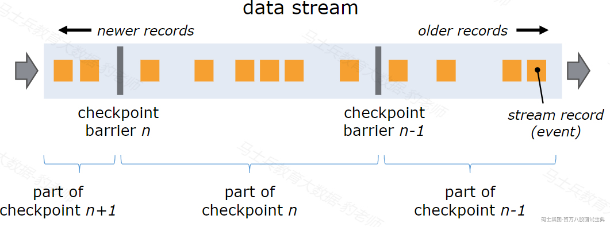

checkpoint barrier是一种特殊的数据，每个barrier都有自己的独立的编号，会随着整个数据流向Flink下游算子传递，当Flink每个算子处理到当前barrier时都会进行snapshot快照保存，该快照会存储在指定的状态后端中（后续章节介绍），当所有的Flink算子都对该barrir进行了快照保存，说明当前barrir之前的数据完全被Flink处理完成，这时Flink JobManager中的checkpoint coordinator(检查点协调器)会通知各个TaskManager节点对每个算子生成的snapshot进行统一保存，形成完整的checkpoint检查点。如下图所示：

*(⚠️ 图片缺失:源知识库原图已失效)* 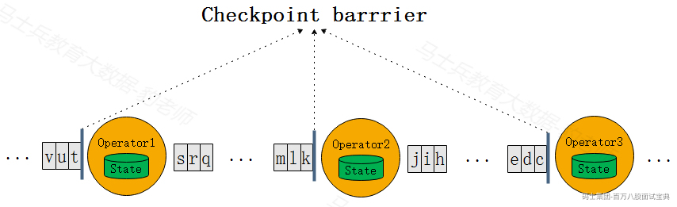

#### 7.2.1.2 **barrier对齐和不对齐机制**

以上Flink checkpoint 中快照的生成是在单一并行度中进行的，往往Flink应用程序处理数据过程都是多并行度进行，这就形成了分布式快照。**当Flink应用程序有多个并行度或者Flink上下游算子并行度不一致时，barrier上下游传递时涉及到barrier广播和barrier对齐机制**。当上游数据向下游多个并行度中发送barrier时，需要对barrier进行广播，保证下游各个并行度barrier一致；当上游多个并行度向下游少量并行度传递barrier时，需要对brrier进行对齐，对齐是指下游每个并行度都要等到相同的barrier到达时才能进行 snapshot 快照状态的保存。

下图是Flink中barrier对齐机制的示意图：

*(⚠️ 图片缺失:源知识库原图已失效)* 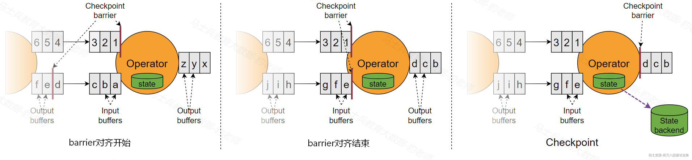

在barrier对齐机制中，下游barrier先到达分区会等待barrier未到达的分区以达到barrier对齐目的，这个对齐过程中就会涉及barrier先到达分区中数据的缓存，如果多个并行度中处理数据的速度不一致会导致下游任务堆积大量缓存数据，可能会造成Flink内存和磁盘负载压力，同时也使Flink 整体Checkpoint的时间延后变长，此外，在Flink中当数据流处理不过来时还会有反压机制（反压机制是指控制数据源的产生速度，避免数据积压），反压机制会限制数据流的流动，导致barrier在一些并行度中流速变慢，这样更近一步导致Checkpoint的时间延后的更长，导致恶性循环。

为了解决以上barrier对齐机制可能带来的问题，在Flink1.11后引入了barrier不对齐机制。下图是barrier不对齐机制的示意图：

*(⚠️ 图片缺失:源知识库原图已失效)* 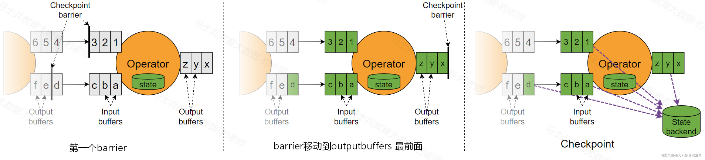

当流速快的barrier到达下游算子的input buffer后，Flink会将该barrier插入到该下游算子的output buffer的最前面，并将该barrier发送给后续的算子。同时当前算子会对自身进行checkpoint快照，包括当前的状态以及所有input buffers、output buffers以及流速慢的barrier之前的数据都会保存到状态后端中（**注意：在进行checkpoint快照时，流速慢的barrier会被移除，并不会继续流动下去**)，这样当Flink应用程序异常中断恢复到此次checkpoint时，未计算之前的状态、barrier不对齐对应的input buffers、output buffers 数据会重新恢复到各个流中并保证数据的一致性和准确。**值得注意的是barrier不对齐机制中需要向状态中保持更多的数据。**

通过上文对Flink barrier对齐和不对齐机制的了解，我们发现两者各有优缺点：

- **barrier对齐机制**

**优点**:状态后端需要保存的数据少。

**缺点**:缓存堆积数据、Flink内存和磁盘负载有压力、checkpoint时间延长。

- **barrier不对齐机制**

**优点**：多并行度中只要有一个并行度中barrier到达，就会触发checkpoint，加快checkpoint进行，不容易出现数据反压问题。

**缺点**：状态后端保存数据多，状态恢复时比较慢。

**在Flink中对于简单数据处理作业建议使用轻量级的barrier对齐机制，对于一些计算复杂导致任务出现数据高反压、checkpoint超时难以完成的的作业场景建议使用barrier不对齐机制，这样可以加快checkpoint进行、有效缓解数据高反压带来的一系列连锁问题**。

#### 7.2.1.3 **精准一次和至少一次消费**

分布式系统中常用这么几种语义（semantics）来描述系统在经历了故障恢复后，内部各个组件之间状态的一致性，严格程度从高到低为：exactly Once（精准一次）, at least Once（至少一次）, at most once（最多一次）。Flink程序故障重启后从checkpoint进行恢复时支持exactly once 和 at least once 两种语义。

编写Flink代码时我们可以设置选择使用哪种语义。在exactly once 语义下，支持barrier 对齐和不对齐机制，也就是说在barrier对齐和不对齐机制中都能保证流数据精准一次消费语义。但如果在Flink代码中使用了at least once 语义，那么底层实现自动选择的就是checkpoint barrier不对齐机制，并且at least once语义下的barrier不对齐机制与exactly once 语义下barrier不对齐机制触发checkpoint时机不同。

那么在at least once语义下的barrier不对齐机制何时进行checkpoint？当流速快的barrier流到下游算子当中时，此时不必理会此barrier，正常进行后续数据的计算，当流速慢的barrier到达下游算子时（也就是全部并行度中的barrier到达），此时进行checkpoint 快照，**此快照包含了流速快并行度中在barrier到达之后一部分数据结果值的状态**，**当后续基于此快照保存的偏移量进行状态恢复时，这部分数据还会被重复处理**，但在状态中已经包含这部分数据的结果值，这样就造成了重复消费问题，这也是at least once 语义的根本原因。

在at least once 语义中默认使用的就是barrier不对齐机制，这种语义下不会阻塞数据加大checkpoint的处理时间，但会造成数据重复消费问题。

#### 7.2.1.4 **Checkpoint状态恢复**

在Flink中会周期性的生成checkpoint检查点保存数据状态，**当Flink程序发生故障重启后，根据最近保存成功的checkpoint检查点进行故障恢复**。下面以读取数据源数据进行奇偶数求和计算为例，来说明Flink程序遇到故障后如何从状态中进行状态数据恢复。

正常处理数据流的Flink程序遇到故障失败，此时保存在checkpoint检查点中状态如下图所示，从最后保存的Checkpoint状态来看，数据处理偏移量为5，偶数和为6(2+4)，奇数和为9（1+3+5）,虽然Flink程序遇到故障时Source读取到的偏移量为7并向下游传递了数字7，由于后续操作并没有累加数字7，所以该偏移量并没有保存到状态中。

*(⚠️ 图片缺失:源知识库原图已失效)* 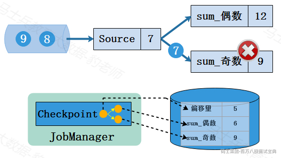

下面对Flink程序重启从checkpoint中恢复状态的过程进行描述。首先Flink重启后所有状态都为空，如下图所示：

*(⚠️ 图片缺失:源知识库原图已失效)* 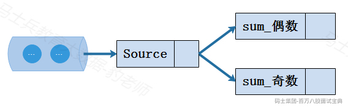

程序重启后，从checkpoint检查点进行状态恢复。Flink程序会从最后一次保存完整的checkpoint检查点进行恢复，填充到对应的Flink状态中。如下图所示，该程序从状态中恢复数据并从偏移量为5的位置继续读取数据，如下：

*(⚠️ 图片缺失:源知识库原图已失效)* 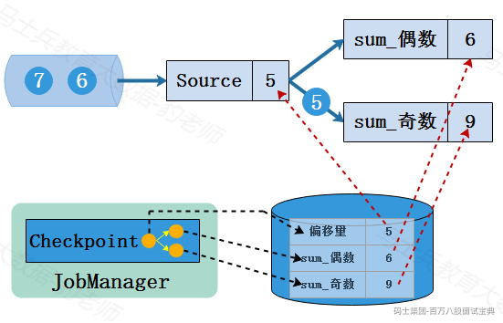

经过以上步骤就完成了Flink从故障恢复状态的过程，后续会继续按照读取的偏移量进行数据的处理，并继续周期性进行checkpoint检查点对状态进行保存，如下：

*(⚠️ 图片缺失:源知识库原图已失效)* 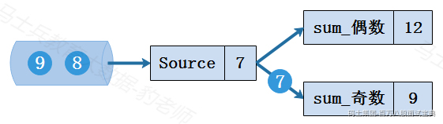

经过以上步骤可以看到，Flink故障重启后可以从checkpoint中进行状态恢复实现容错，无缝达到Flink故障之前处理情况，整个过程既没有丢掉数据，也没有重复处理数据，保证了最终结果的一致性。

### **7.2.2 Checkpoint参数及设置**

默认情况下，Flink中没有开启Checkpoint检查点，用户需要通过在Flink程序中调用如下方法开启Checkpoint检查点。

```plain
StreamExecutionEnvironment env = StreamExecutionEnvironment.getExecutionEnvironment();
//开启Checkpoint检查点，每1秒钟做一次Checkpoint
env.enableCheckpointing(1000);
```

以上代码示例中设置周期性保存检查点的时间间隔为1秒，该间隔时间由用户指定，Flink中也有env.enableCheckpointing()方法，该方法默认的Checkpoint时间间隔为500ms，该方法已经过时，建议用户自行设置Checkpoint间隔时间。

调整Flink checkpoint（检查点）的间隔时间需要权衡Flink处理性能和故障恢复速度，更小的间隔时间可以让Flink从故障恢复中更快的达到故障前处理数据位置，但可能对Flink处理性能产生负面影响。此外，Flink Checkpoint检查点还有一系列调整参数可以设置。

- **checkpoint存储（checkpoint storage）**

我们可以设置Checkpoint检查点快照（SnapShot）存储的位置，可以选择JobManagerCheckpointStorage或者FileSystemCheckpointStorage，两者分别代表JobManager堆内存和文件系统。默认情况下，snapshot 存储在JobManager的堆内存中，建议改为持久化文件系统。

Flink设置Checkpoint storage检查点存储位置代码如下:

```plain
//设置checkpoint storage存储为JobManagerStorage，默认堆内存存储状态大小为5M
env.getCheckpointConfig().setCheckpointStorage(new JobManagerCheckpointStorage(5*1024*1024));

//设置checkpoint storage存储为hdfs路径
env.getCheckpointConfig().setCheckpointStorage("hdfs://mycluster/flink/checkpoints");
```

对于JobManagerCheckpointStorage来说，默认每个单独的状态大小限制为5M ，可以手动指定该值，如果Flink是本地开发调试或者Flink状态非常少的场景可以使用JobManagerCheckpointStorage，实际生产中推荐使用FileSystemCheckpointStorage。

- **checkpoint模式设置(checkpoint mode)**

选择exactly-once语义保证整个应用内端到端的数据一致性，这种情况比较适合于数据要求比较高，不允许出现丢数据或者数据重复，与此同时，Flink的性能也相对较弱，而at-least-once语义更适合于时延和吞吐量要求非常高但对数据的一致性要求不高的场景。

Flink中通过setCheckpointingMode()方法来设置检查点模式，默认情况下使用的是exactly-once模式。

```plain

//设置检查点模式为exactly-once
env.getCheckpointConfig().setCheckpointingMode(CheckpointingMode.EXACTLY_ONCE);

//设置检查点模式为at-least-once
env.getCheckpointConfig().setCheckpointingMode(CheckpointingMode.AT_LEAST_ONCE);
```

- **checkpoint超时时间（checkpoint timeout）**

超时时间指定了每次Checkpoint执行过程中的上限时间范围，一旦Checkpoint执行时间超过该阈值，Flink将会中断Checkpoint过程，并按照超时处理。该指标可以通过setCheckpointTimeout方法设定，默认为10分钟。

```plain
//设置Checkpoint 超时时间
env.getCheckpointConfig().setCheckpointTimeout(10*60*1000);
```

- **checkpoint之间最小时间间隔（min pause between checkpoints）**

该参数主要目的是设定两个Checkpoint之间的最小时间间隔，防止Flink应用密集地触发Checkpoint操作，占用了大量计算资源而影响到整个应用的性能，默认值为0，表示一个checkpoint执行后，立即执行后续的checkpoint。当指定了该参数大于0时，Flink最大并行执行checkpoint 的数量为1。

```plain
//设置 checkpoint 最小间隔时间为500ms,默认值为0
env.getCheckpointConfig().setMinPauseBetweenCheckpoints(500);
```

- **最大并行执行checkpoint数量（max concurrent checkpoints）**

通过setMaxConcurrentCheckpoints()方法设定能够最大同时执行的 Checkpoint数量。在默认情况下只有一个检查点可以运行，根据用户指定的数量可以同时触发多个Checkpoint，进而提升Checkpoint整体的效率。

```plain
//设置checkpoint最大并行度
env.getCheckpointConfig().setMaxConcurrentCheckpoints(1);
```

- **可容忍checkpoint失败次数（total checkpoint failure number）**

checkpoint在执行过程中如果出现失败设置可以容忍的检查的失败数，超过这个数量则系统自动关闭和停止任务，没有默认值。

```plain
//设置可容忍checkpoint失败次数,没有默认值值，设置为0，表示不容忍任何checkpoint失败
env.getCheckpointConfig().setTolerableCheckpointFailureNumber(0);
```

- **checkpoint清理策略（retained checkpoints）**

当开启了checkpoint外部持久化存储时，可以通过如下两种方式决定在取消Flink作业时是否清空外部存储系统中的状态数据，如果不设置改参数，Flink取消任务时默认不清空checkpoint状态数据。

- RETAIN\_ON\_CANCELLATION：在Flink作业取消时保留检查点。在这种情况下，必须手动清除检查点状态。

- DELETE\_ON\_CANCELLATION：在Flink作业取消时删除检查点。只有作业失败时才会保存检查点状态。

```plain
/**
 * 设置checkpoint的清理策略，当作业取消时，checkpoint数据的保留策略，默认值为RETAIN_ON_CANCELLATION
 * RETAIN_ON_CANCELLATION：当作业取消时，保留checkpoint数据
 * DELETE_ON_CANCELLATION：当作业取消时，删除checkpoint数据
 */
env.getCheckpointConfig().setExternalizedCheckpointCleanup(CheckpointConfig.ExternalizedCheckpointCleanup.RETAIN_ON_CANCELLATION);
env.getCheckpointConfig().setExternalizedCheckpointCleanup(CheckpointConfig.ExternalizedCheckpointCleanup.DELETE_ON_CANCELLATION);
```

- **不对齐检查点（enable unaligned checkpoints）**

可以启动Flink检查点不对齐机制从而加快checkpoint，这个设置要求checkpoint mode必须为exactly-once并且并发checkpoint的数量为1。

```plain
//设置 checkpoint barrier 不对齐机制，设置此值时，checkpointmode必须为EXACTLY_ONCE且MaxConcurrentCheckpoints为1
env.getCheckpointConfig().enableUnalignedCheckpoints();
```

- **task完成后进行checkpoint（checkpoint after finish task ）**

当Flink读取有界数据时，一旦任务完成后就不再做checkpoint，这有可能会导致最后一部分输出数据没有保存到checkpoint状态中。从Flink1.14版本后，Flink支持在部分任务结束后创建checkpoint，确保在作业结束后完整保存所有状态数据，从1.15版本起，该属性默认启用。

```plain
//开启Flink任务完成后进行checkpoint检查点，默认值为true
Configuration config = new Configuration();
config.set(ExecutionCheckpointingOptions.ENABLE_CHECKPOINTS_AFTER_TASKS_FINISH, true);
env.configure(config);
```

以上参数总体在Flink代码中设置如下:

```plain
StreamExecutionEnvironment env = StreamExecutionEnvironment.getExecutionEnvironment();
//开启checkpoint，每隔1000ms进行一次checkpoint
env.enableCheckpointing(1000);

//设置checkpoint storage存储为JobManagerStorage，默认堆内存存储状态大小为5M
env.getCheckpointConfig().setCheckpointStorage(new JobManagerCheckpointStorage(5*1024*1024));

//设置checkpoint storage存储为hdfs路径
env.getCheckpointConfig().setCheckpointStorage("hdfs://mycluster/flink/checkpoints");

//设置检查点模式为exactly-once，默认值为exactly-once
env.getCheckpointConfig().setCheckpointingMode(CheckpointingMode.EXACTLY_ONCE);

//设置检查点模式为at-least-once
env.getCheckpointConfig().setCheckpointingMode(CheckpointingMode.AT_LEAST_ONCE);

//设置Checkpoint 超时时间，默认值为10分钟
env.getCheckpointConfig().setCheckpointTimeout(10*60*1000);

//设置 checkpoint 最小间隔时间为500ms，默认值为0
env.getCheckpointConfig().setMinPauseBetweenCheckpoints(500);

//设置checkpoint最大并行度
env.getCheckpointConfig().setMaxConcurrentCheckpoints(1);

//设置可容忍checkpoint失败次数,没有默认值值，表示不容忍任何checkpoint失败
env.getCheckpointConfig().setTolerableCheckpointFailureNumber(0);

/**
 * 设置checkpoint的清理策略，当作业取消时，checkpoint数据的保留策略，默认值为RETAIN_ON_CANCELLATION
 * RETAIN_ON_CANCELLATION：当作业取消时，保留checkpoint数据
 * DELETE_ON_CANCELLATION：当作业取消时，删除checkpoint数据
 */
env.getCheckpointConfig().setExternalizedCheckpointCleanup(CheckpointConfig.ExternalizedCheckpointCleanup.RETAIN_ON_CANCELLATION);
env.getCheckpointConfig().setExternalizedCheckpointCleanup(CheckpointConfig.ExternalizedCheckpointCleanup.DELETE_ON_CANCELLATION);

//设置 checkpoint barrier 不对齐机制，设置此值时，checkpointmode必须为EXACTLY_ONCE且MaxConcurrentCheckpoints为1
env.getCheckpointConfig().enableUnalignedCheckpoints();

//开启Flink任务完成后进行checkpoint检查点，默认值为true
Configuration config = new Configuration();
config.set(ExecutionCheckpointingOptions.ENABLE_CHECKPOINTS_AFTER_TASKS_FINISH, true);
env.configure(config);
```

### **7.2.3 Checkpoint状态恢复案例**

下面我们通过一个案例来演示Checkpoint状态存储及恢复过程，这里读取Socket数据进行wordcount统计，开启checkpoint并将状态存储到HDFS路径中。

- **Java代码**

```plain
StreamExecutionEnvironment env = StreamExecutionEnvironment.getExecutionEnvironment();
//开启checkpoint，每隔1000ms进行一次checkpoint
env.enableCheckpointing(1000);

//设置checkpoint Storage存储为hdfs
env.getCheckpointConfig().setCheckpointStorage("hdfs://mycluster/flink-checkpoints");

//设置checkpoint清理策略为RETAIN_ON_CANCELLATION
env.getCheckpointConfig().setExternalizedCheckpointCleanup(ExternalizedCheckpointCleanup.RETAIN_ON_CANCELLATION);

/**
 * Socket输入数据如下：
 * hello,flink
 * hello,checkpoint
 * hello,flink
 */
DataStreamSource<String> ds = env.socketTextStream("node5", 9999);
ds.flatMap(new FlatMapFunction<String, Tuple2<String,Integer>>() {
    @Override
    public void flatMap(String s, Collector<Tuple2<String, Integer>> collector) throws Exception {
        String[] words = s.split(",");
        for (String word : words) {
            collector.collect(new Tuple2<>(word,1));
        }
    }
}).keyBy(one->one.f0).sum(1).print();

env.execute();
```

- **Scala代码**

```plain
val env = StreamExecutionEnvironment.getExecutionEnvironment
//导入隐式转换
import org.apache.flink.streaming.api.scala._

// 开启checkpoint，每隔1000ms进行一次checkpoint
env.enableCheckpointing(1000)

// 设置checkpoint Storage存储为hdfs
env.getCheckpointConfig.setCheckpointStorage("hdfs://mycluster/flink-checkpoints")

// 设置checkpoint清理策略为RETAIN_ON_CANCELLATION
env.getCheckpointConfig.setExternalizedCheckpointCleanup(ExternalizedCheckpointCleanup.RETAIN_ON_CANCELLATION)

/**
 * Socket输入数据如下：
 * hello,flink
 * hello,checkpoint
 * hello,flink
 */
val ds: DataStream[String] = env.socketTextStream("node5", 9999)
ds.flatMap(line=>{line.split(",")})
  .map(word=>{(word,1)})
  .keyBy(_._1)
  .sum(1)
  .print()
env.execute()
```

以上代码编写完成后，为了能够看到从checkpoint恢复状态的效果，我们需要将任务打包提交到Flink集群中执行，可以按照如下步骤进行Flink状态恢复测试。

**1) 打包代码，将jar包上传到Flink客户端节点**

对Java或者Scala代码打包都可以。

```plain
[root@node5 ~]# cd flink-jar-test/
[root@node5 flink-jar-test]# ls
FlinkJavaCode-1.0-SNAPSHOT-jar-with-dependencies.jar
```

**2) 启动HDFS集群**

```plain
#启动HDFS集群
[root@node3 ~]# zkServer.sh start
[root@node4 ~]# zkServer.sh start
[root@node5 ~]# zkServer.sh start

[root@node1 ~]# start-all.sh 
```

**3) 提交Flink任务到Yarn中运行**

这里提交任务前需要在node5节点启动socket服务，这里以Application模式提交任务，其他模式也可以。

```plain
#node5节点启动socket服务
[root@node5 ~]# nc -lk 9999

#node5节点提交Flink任务
[root@node5 ~]# cd /software/flink-1.17.1/bin/
[root@node5 bin]# ./flink run-application -t yarn-application -c com.mashibing.flinkjava.code.chapter7.checkpoints.CheckpointRecoverTest /root/flink-jar-test/FlinkJavaCode-1.0-SNAPSHOT-jar-with-dependencies.jar 
```

Flink任务提交后，可以在HDFS中看到程序自动创建了代码中指定的checkpoint路径“flink-checkpoints”。

*(⚠️ 图片缺失:源知识库原图已失效)*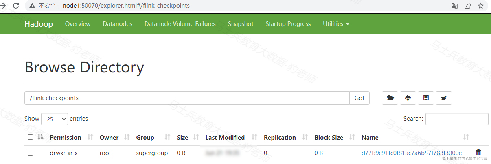

**4) 向socket中输入数据，查看Flink程序中的结果值**

```plain
#socket中输入如下数据
hello,flink
hello,checkpoint
hello,flink
```

查看Flink任务结果:

*(⚠️ 图片缺失:源知识库原图已失效)*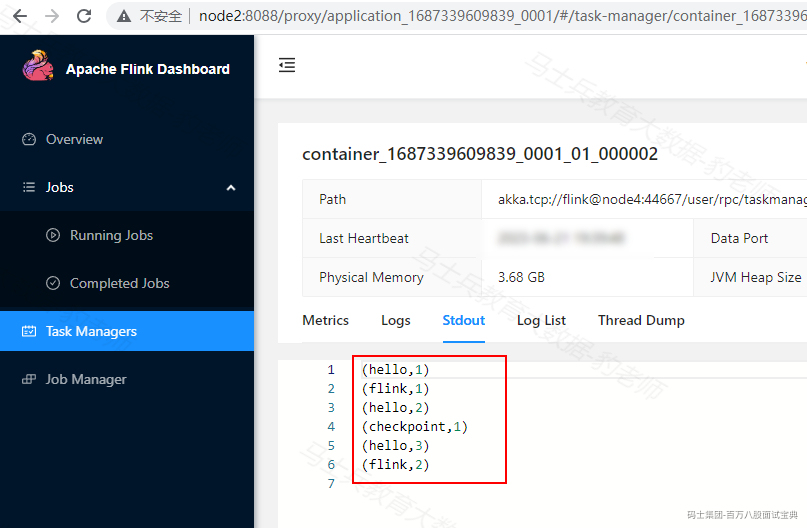

**5) 取消Flink程序，重新提交恢复状态**

在WebUI中取消Flink 应用程序：

*(⚠️ 图片缺失:源知识库原图已失效)*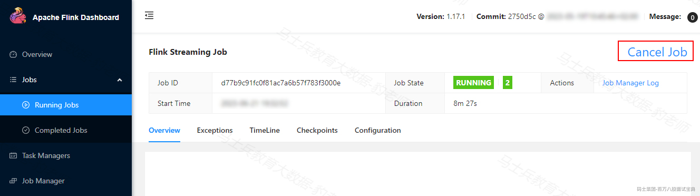

然后查看对应Flink 任务在HDFS中存储最后一次的checkpoint信息：

*(⚠️ 图片缺失:源知识库原图已失效)*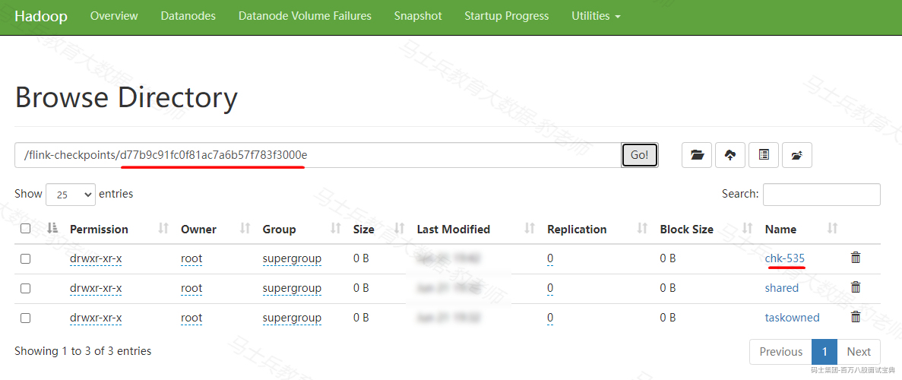

再次提交Flink任务，根据最后一次保存的chekcpoint检查点进行状态恢复，在Flink中可以通过-s指定checkpoint目录进行状态恢复，命令如下:

```plain
#通过-s 指定checkpoint检查点目录进行状态恢复
[root@node5 bin]# ./flink run-application -t yarn-application -s hdfs://mycluster/flink-checkpoints/d77b9c91fc0f81ac7a6b57f783f3000e/chk-535 -c com.mashibing.flinkjava.code.chapter7.checkpoints.CheckpointRecoverTest /root/flink-jar-test/FlinkJavaCode-1.0-SNAPSHOT-jar-with-dependencies.jar
```

注意：如果状态存储在HFDS中，-s指定的路径形式为hdfs://mycluster/ <checkpoint\_dir>/<job\_id>/chk-。

**6) 测试Flink恢复程序**

当重新提交的Flink任务正常运行后，继续向Socket中输入如下数据：

```plain
#继续向Socket中输入如下数据
hello,flink
hello,checkpoint
```

可以通过观察Flink WebUI看到，Flink后续的计算是基于之前的状态进行，说明Flink程序挂掉之间的状态被正确的恢复过来。

*(⚠️ 图片缺失:源知识库原图已失效)*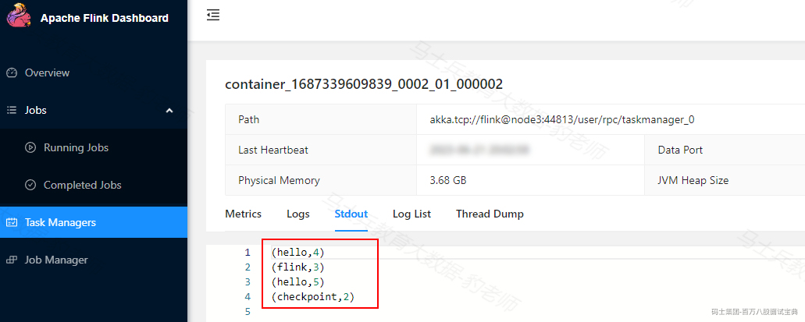

## 7.3 **状态后端(StateBackend)**

当Flink程序进行checkpoint检查点保存时，检查点的保存需要JobManager和TaskManager以及外部存储系统的协调。首先，JobManager会向所有的TaskManager发送触发检查点的命令，接收到命令的TaskManager会对当前任务的所有状态进行快照保存，并将其持久化到远程的存储介质中，完成保存后，TaskManager会向JobManager返回确认信息。整个过程是分布式的，只有当JobManager收到所有TaskManager的确认信息后，才会确认当前检查点成功保存。

checkpoint 检查点整个流程如下:

*(⚠️ 图片缺失:源知识库原图已失效)* 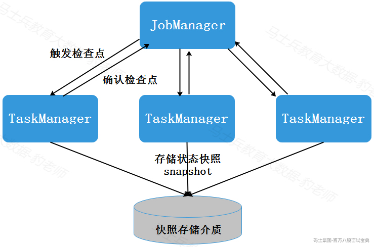

以上检查点保存的整个流程都由状态后端（StateBackend）协调和管理，Flink状态后端（StateBackend）是Flink中负责状态管理、存储和访问的可插拔组件，在检查点（checkpoint）的保存过程中起着重要的作用，状态后端主要有2个职责：

- **TaskManager本地状态管理**：状态后端负责管理应用程序在每个TaskManager本地的状态，它提供了状态的存储和访问接口，以便应用程序可以读取和更新状态。

- **检查点写入远程持久化存储**：在检查点保存过程中，状态后端将任务的状态数据传输到指定的远程存储介质中，以确保状态的持久性和容错性。

### **7.3.1 状态后端分类**

Flink提供了两类的状态后端，一类是HashMapStateBackend，另一类是EmbeddedRocksDBSatateBackend。

- **HashMapStateBackend**

HashMapStateBackend将状态数据以HashMap数据结构进行存储，默认将状态存储在JobManager内存中。通过用户指定checkpint持久化目录也可以将状态数据存储在外部持久化系统中。**这种状态后端每次进行checkpoint检查点时都是全量方式进行，适用于较小的状态数据集，并且对于低延迟和高吞吐量的应用程序非常有效**。

- **EmbeddedRocksDBStateBackend**

EmbeddedRocksDBStateBackend 是 Flink 的一种基于 RocksDB 的状态后端。RocksDB 是一个高性能、持久化的键值存储引擎，它将状态数据存储在本地磁盘上，默认在TaskManager本地数据目录中。与 HashMapStateBackend 状态存储数据结构不同，EmbeddedRocksDBStateBackend 数据以序列化的字节数组形式存储，读写操作需要序列化与发序列化，状态访问性能可能差一些，**但RockDBStateBackend是目前唯一支持增量检查点的状态后端，可以保存非常大的状态，生产环境中建议使用这种方式存储状态**。

针对以上两类状态后端，Flink提供了3中不同StateBackend状态后端实现，包括基于内存的MemoryStateBackend、基于文件系统的FsStateBackend，以及基于RockDB作为存储介质的RocksDBStateBackend，可以适应各种不同的应用场景和需求，下面分别介绍。

#### 7.3.1.1 **MemoryStateBackend**

基于内存的状态管理具有非常快速和高效的特点，但也具有非常多的限制，最主要的就是内存的容量限制，一旦存储的状态数据过多就会导致系统内存溢出等问题，从而影响整个应用的正常运行。同时如果机器出现问题，整个主机内存中的状态数据都会丢失，进而无法恢复任务中的状态数据。因此从数据安全的角度建议用户尽可能地避免在生产环境中使用MemoryStateBackend。

代码使用方式如下：

```plain
//设置状态后端为HashMapStateBackend，状态数据存储在JobManager内存中
env.setStateBackend(new HashMapStateBackend());
env.getCheckpointConfig().setCheckpointStorage(new JobManagerCheckpointStorage());
```

#### 7.3.1.2 **FsStateBackend**

和MemoryStateBackend有所不同，FsStateBackend是基于文件系统的一种状态管理器，这里的文件系统可以是本地文件系统，也可以是HDFS分布式文件系统。FsStateBackend更适合任务状态非常大的情况，例如应用中含有时间范围非常长的窗口计算，或Key/value State状态数据量非常大的场景。

代码使用方式如下：

```plain
//设置状态后端为HashMapStateBackend，状态数据存储在本地文件系统中
env.setStateBackend(new HashMapStateBackend());
env.getCheckpointConfig().setCheckpointStorage("file:///checkpoint-dir");
```

#### 7.3.1.3 **RocksDBStateBackend**

RocksDBStateBackend是Flink中内置的第三方状态管理器，和前面的状态管理器不同，RocksDBStateBackend需要单独引入相关的依赖包到工程中，Java代码和Scala代码中都需要导入。

```plain
<!-- Flink Rocksdb 状态后端 依赖包 -->
<dependency>
  <groupId>org.apache.flink</groupId>

  <artifactId>flink-statebackend-rocksdb</artifactId>

  <version>${flink.version}</version>

</dependency>

```

RocksDBStateBackend采用增量方式进行状态数据的Snapshot，与FsStateBackend相比，虽说都是将状态存储在磁盘中，RocksDBStateBackend在性能上要比FsStateBackend高一些，和MemoryStateBackend相比性能就会较弱一些。RocksDB克服了State受内存限制的缺点，同时又能够将状态增量持久化到远端文件系统中，推荐在生产中使用。

代码使用方式如下：

```plain
//设置状态后端为RocksDBStateBackend，状态数据存储在本地文件系统中
env.setStateBackend(new EmbeddedRocksDBStateBackend());
env.getCheckpointConfig().setCheckpointStorage("file:///checkpoint-dir");
```

### **7.3.2 状态后端全局配置**

以上两类状态后端的三种实现方式除了可以在代码中进行配置外，还可以在Flink集群JobManager FLINK\_HOME/conf/flink-conf.yaml配置文件中配置,从而做到状态后端全局配置。配置分别如下：

- **MemoryStateBackend**

```plain
state.backend: hashmap
state.checkpoint-storage: jobmanager
```

- **FsStateBackend**

```plain
state.backend: hashmap
state.checkpoints.dir: file:///checkpoint-dir/
state.checkpoint-storage: filesystem
```

- **RocksDBStateBackend**

```plain
state.backend: rocksdb
state.checkpoints.dir: file:///checkpoint-dir/
state.checkpoint-storage: filesystem
```

默认情况下，JobManager节点的flink-conf.yaml配置文件如果设置了checkpoint选项，则Flink只保留最近成功生成的1个checkpoint，而当Flink程序失败时，可以通过最近的checkpoint来进行恢复。但是，如果希望保留多个checkpoint，并能够根据实际需要选择其中一个进行恢复，就会更加灵活。添加如下配置，指定最多可以保存的checkpoint的个数。

```plain
state.checkpoints.num-retained: 2
```

### **7.3.3 状态后端代码案例**

下面以将Flink状态数据存储在HDFS中，使用状态后端管理为rocksdb编写Flink代码，来演示Flink状态后端全局配置及使用，这里以Flink 向Yarn中Application模式提交任务为例进行演示。

**1) 配置flink-conf.yaml**

在node5节点的FLINK\_HOME/conf/flink-conf.yaml配置文件“ Fault tolerance and checkpointing”模块下配置如下内容。

```plain
state.backend.type: rocksdb
state.checkpoints.dir: hdfs://mycluster/flink-checkpoints
state.checkpoint-storage: filesystem
state.checkpoints.num-retained: 2
```

**2) 编写Flink 读取socket代码并打包**

- **Java代码：**

```plain
StreamExecutionEnvironment env = StreamExecutionEnvironment.getExecutionEnvironment();
//开启checkpoint，每隔1000ms进行一次checkpoint
env.enableCheckpointing(1000);

//设置checkpoint清理策略为RETAIN_ON_CANCELLATION
env.getCheckpointConfig().setExternalizedCheckpointCleanup(CheckpointConfig.ExternalizedCheckpointCleanup.RETAIN_ON_CANCELLATION);

/**
 * Socket输入数据如下：
 * hello,flink
 * hello,flink
 * hello,rocksdb
 */
DataStreamSource<String> ds = env.socketTextStream("node5", 9999);
ds.flatMap(new FlatMapFunction<String, Tuple2<String,Integer>>() {
    @Override
    public void flatMap(String s, Collector<Tuple2<String, Integer>> collector) throws Exception {
        String[] words = s.split(",");
        for (String word : words) {
            collector.collect(new Tuple2<>(word,1));
        }
    }
}).keyBy(one->one.f0).sum(1).print();

env.execute();
```

- **scala代码：**

```plain
val env = StreamExecutionEnvironment.getExecutionEnvironment
//导入隐式转换
import org.apache.flink.streaming.api.scala._

// 开启checkpoint，每隔1000ms进行一次checkpoint
env.enableCheckpointing(1000)

// 设置checkpoint清理策略为RETAIN_ON_CANCELLATION
env.getCheckpointConfig.setExternalizedCheckpointCleanup(CheckpointConfig.ExternalizedCheckpointCleanup.RETAIN_ON_CANCELLATION)

/**
 * Socket输入数据如下：
 * hello,flink
 * hello,flink
 * hello,rocksdb
 */
val ds: DataStream[String] = env.socketTextStream("node5", 9999)

ds.flatMap(_.split(","))
  .map((_, 1))
  .keyBy(_._1)
  .sum(1)
  .print()

env.execute()
```

以上无论是Java代码还是Scala代码编写完成后，进行打包，上传到node5节点的/root/flink-jar-test目录中。

**3) 启动HDFS**

```plain
#启动Zookeeper集群
[root@node3 ~]# zkServer.sh start
[root@node4 ~]# zkServer.sh start
[root@node5 ~]# zkServer.sh start

#启动HDFS集群和Yarn集群
[root@node1 ~]# start-all.sh
```

注意：启动HDFS集群后，如果有hdfs://mycluster/flink-checkpoints目录，为了后续方便看出任务状态目录，最好删除该目录。

**4) 提交任务并输入数据**

在node5节点上向Yarn中提交Flink任务，这里以提交Scala任务为例。

```plain
#提交任务之前在node5节点启动Socket服务
[root@node5 ~]# nc -lk 9999

#提交Flink任务
[root@node5 ~]# cd /software/flink-1.17.1/bin/
[root@node5 bin]# ./flink run-application -t yarn-application -c com.mashibing.flinkscala.code.chapter7.checkpoints.RocksDBStateBackendTest /root/flink-jar-test/FlinkScalaCode-1.0-SNAPSHOT-jar-with-dependencies.jar 
```

以上任务提交执行后，向Socket中输入如下数据:

```plain
hello,flink
hello,flink
hello,rocksdb
```

观察Flink任务状态统计的结果:

*(⚠️ 图片缺失:源知识库原图已失效)* 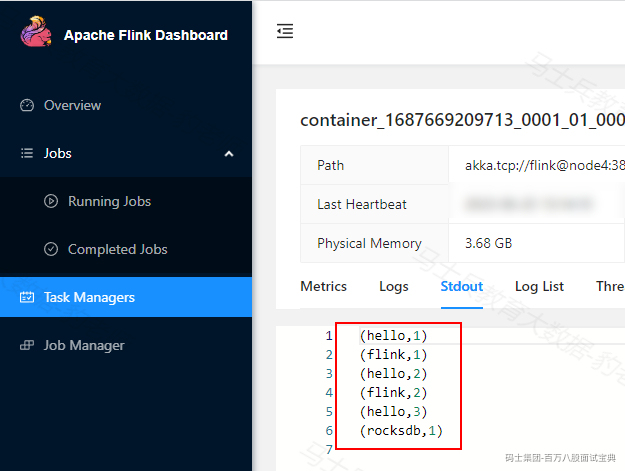

**5) 取消任务并状态恢复**

在Flink WebUI中取消Flink任务，然后查看HDFS中存储checkpoint对应的状态目录：

*(⚠️ 图片缺失:源知识库原图已失效)* 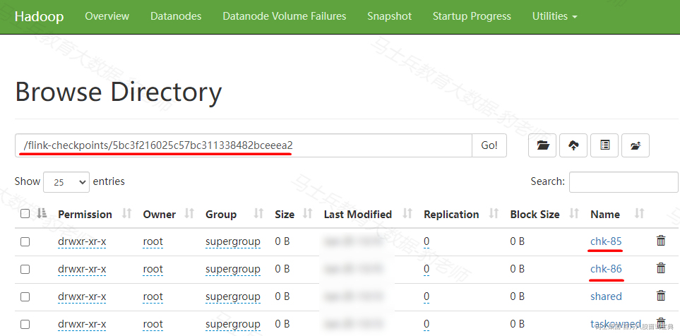

重新在node5节点提交Flink任务，通过参数-s 指定任务对应的状态目录恢复状态：

```plain
[root@node5 bin]# ./flink run-application -t yarn-application -s hdfs://mycluster/flink-checkpoints/5bc3f216025c57bc311338482bceeea2/chk-86 -c com.mashibing.flinkscala.code.chapter7.checkpoints.RocksDBStateBackendTest /root/flink-jar-test/FlinkScalaCode-1.0-SNAPSHOT-jar-with-dependencies.jar
```

提交任务后，继续向socket服务器中输入如下数据：

```plain
hello,flink
hello,rocksdb
```

观察Flink 新启动任务的WebUI中TaskManager中统计的状态如下，可以看到状态成功被恢复回来。

*(⚠️ 图片缺失:源知识库原图已失效)* 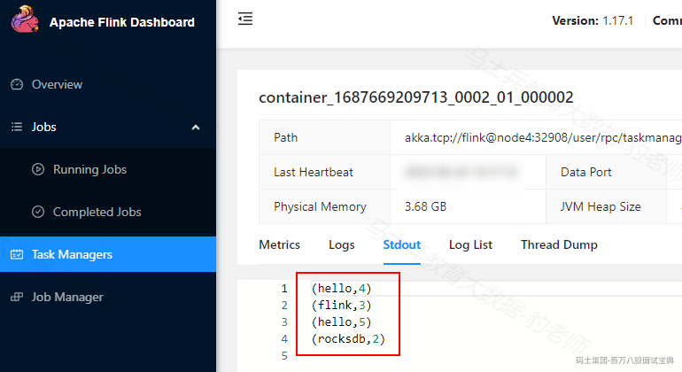

## 7.4 **保存点(savepoint)**

savepoints 是检查点的一种特殊实现，底层实现其实也是使用checkpoints的机制。savepoints是用户以手工命令的方式触发checkpoint,并将结果持久化到指定的存储路径中，其主要目的是帮助用户在升级和维护集群过程中保存系统中的状态数据，避免因为停机运维或者升级应用等正常终止应用的操作而导致系统无法恢复到原有的计算状态的情况，从而无法实现从端到端的 exactly-once语义保证。

### **7.4.1 savepoint配置**

- **配置savepoint 的存储路径**

我们可以在flink-conf.yaml中配置savepoint存储的位置，设置后，如果要创建指定Job的savepoint，可以不用在手动执行命令时指定savepoint的位置。

```plain
state.savepoints.dir: hdfs://mycluster/savepoints
```

- **在代码中设置算子ID**

为了能够在作业的不同版本之间以及Flink的不同版本之间顺利升级，强烈推荐程序员通过手动给算子赋予ID，这些ID将用于确定每一个算子的状态范围。如果不手动给各算子指定ID，则会由Flink自动给每个算子生成一个ID。而这些自动生成的ID依赖于程序的结构，并且对代码的更改是很敏感的。因此，强烈建议用户手动设置ID。

```plain
env.socketTextStream("node5",9999).uid("socket-source")
        .flatMap((String line,Collector<Tuple2<String,Integer>> out) -> {
            String[] words = line.split(",");
            for (String word : words) {
                out.collect(new Tuple2<>(word, 1));
            }
        }).returns(Types.TUPLE(Types.STRING,Types.INT)).uid("flatmap")
        .keyBy(tp -> tp.f0)
        .sum(1).uid("sum")
        .print().uid("print");
```

### **7.4.2 savepoint 使用案例**

这里以读取Socket中的数据进行WordCount为例来演示savepoint的配置及使用，可以按照如下步骤进行测试。

**1) 编写代码并打包**

- **java代码**

```plain
StreamExecutionEnvironment env = StreamExecutionEnvironment.getExecutionEnvironment();

//读取socket数据做wordcount
SingleOutputStreamOperator<String> lines = env.socketTextStream("node5", 9999).uid("socket-source");

SingleOutputStreamOperator<Tuple2<String, Integer>> tuple2 = lines.flatMap(new FlatMapFunction<String, Tuple2<String, Integer>>() {
    @Override
    public void flatMap(String s, Collector<Tuple2<String, Integer>> collector) throws Exception {
        String[] words = s.split(",");
        for (String word : words) {
            collector.collect(new Tuple2<>(word, 1));
        }
    }
}).uid("flatmap");

SingleOutputStreamOperator<Tuple2<String, Integer>> result = tuple2.keyBy(new KeySelector<Tuple2<String, Integer>, String>() {
    @Override
    public String getKey(Tuple2<String, Integer> stringIntegerTuple2) throws Exception {
        return stringIntegerTuple2.f0;
    }
}).sum(1).uid("sum");

result.print().uid("print");

env.execute();
```

- **scala代码**

```plain
val env = StreamExecutionEnvironment.getExecutionEnvironment

//导入隐式转换
import org.apache.flink.streaming.api.scala._

// 读取socket数据做wordcount
env.socketTextStream("node5", 9999).uid("socket-source")
  .flatMap(_.split(" ")).uid("flatMap")
  .map((_, 1)).uid("map")
  .keyBy(_._1)
  .sum(1).uid("sum")
  .print().uid("print")

env.execute()
```

以上代码编写完成后，打包并上传到node5节点的/root/flink-jar-test目录中。

**2) 在flink-conf.yaml中配置savepoint路径**

在node5节点配置flink-conf.yaml文件“Fault tolerance and checkpointing”部分配置savepoint保存的路径，如下。

```plain
state.savepoints.dir: hdfs://mycluster/flink-savepoints
```

**3) 启动HDFS集群**

```plain
#启动Zookeeper集群
[root@node3 ~]# zkServer.sh start
[root@node4 ~]# zkServer.sh start
[root@node5 ~]# zkServer.sh start

#启动HDFS集群和Yarn集群
[root@node1 ~]# start-all.sh
```

注意：启动HDFS集群后，如果有hdfs://mycluster/flink-savepoints目录，为了后续方便看出任务状态目录，最好删除该目录。

**4) 提交任务并统计状态结果**

node5节点启动socket服务并在node5节点上提交Flink任务，提交Flink任务后，向Socket中输入数据，观察Flink任务webui中统计的结果。

```plain
#node5节点启动socket服务
[root@node5 ~]# nc -lk 9999

#node5节点提交Flink任务
[root@node5 conf]# cd /software/flink-1.17.1/bin/
[root@node5 bin]# ./flink run-application -t yarn-application -c com.mashibing.flinkjava.code.chapter7.savepoints.SavePointTest /root/flink-jar-test/FlinkJavaCode-1.0-SNAPSHOT-jar-with-dependencies.jar 
```

提交任务后，向socket中输入以下数据：

```plain
hello,flink
hello,flink
hello,savepoint
```

输入数据后，观察Flink WebUI统计的结果如下:

*(⚠️ 图片缺失:源知识库原图已失效)* 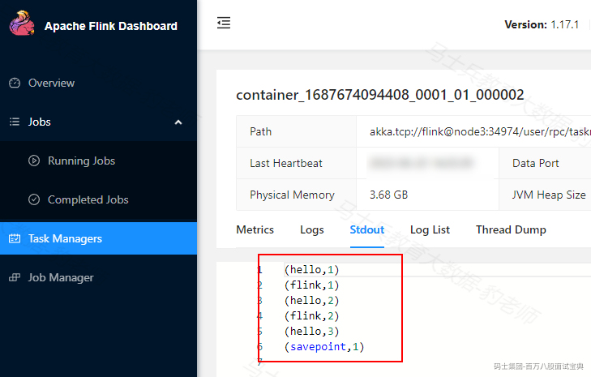

**5) 触发savepoint**

执行如下命令执行savepoint 操作，将当前Flink程序的状态保存到对应路径中。

```plain
[root@node5 bin]# ./flink savepoint d2d863913b663ad70f60ee50d05aaa32 -yid application_1687674094408_0001
```

以上命令注意以下几点：

- savepoint操作命令格式为：./flink savepoint  []

- 如果savepoint path(target directory)在当前提交任务节点的flink-conf.yaml中配置了，就不需要再写上。

- 如果是基于Yarn中运行的Flink任务，Flink JobID 通过Flink WebUI查看，并且执行savepoint命令最后需要通过-yid参数指定yarn application ID 链接到Yarn Application中。

以上savepoint 命令执行后，可以看到HDFS中生成对应的savepoint路径：

*(⚠️ 图片缺失:源知识库原图已失效)*

此时，我们可以手动取消Flink任务或者通过命令停止Flink任务，操作如下:

```plain
#命令方式取消Flink任务
[root@node5 bin]# ./flink cancel d2d863913b663ad70f60ee50d05aaa32 -yid application_1687674094408_0001
```

**6) 从savepoint启动Job**

可以通过如下命令来从savepoint路径中恢复Flink Job状态，命令如下：

```plain
[root@node5 bin]# ./flink run-application -t yarn-application -s hdfs://mycluster/flink-savepoints/savepoint-d2d863-0dd2aae39a79 -c com.mashibing.flinkjava.code.chapter7.savepoints.SavePointTest /root/flink-jar-test/FlinkJavaCode-1.0-SNAPSHOT-jar-with-dependencies.jar
```

Flink任务启动后，可以继续向Socket中输入如下数据：

```plain
hello,flink
hello,savepoint
```

可以观察Flink WebUI对应统计的状态结果，可以看到Flink 任务已经成功从savepoint中恢复过来。

*(⚠️ 图片缺失:源知识库原图已失效)* 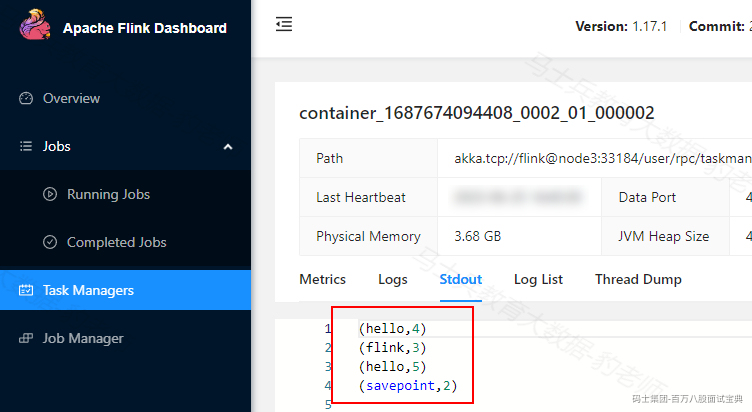

### **7.4.3 Checkpoint & Savepoint区别**

Checkpoint和Savepoint是Apache Flink中用于状态管理和故障恢复的两个概念。

Checkpoint是周期性自动创建的，用于将应用程序的状态信息保存到持久化存储中。它记录了输入数据、中间计算结果和应用程序配置等状态，以便在故障发生时能够从最近的Checkpoint恢复应用程序的状态。

Savepoint是由用户手动触发的操作，用于显式地保存应用程序的状态。用户可以在任意时间点创建Savepoint，并将应用程序的状态保存到持久化存储中。Savepoint可以用于应用程序升级、在不同环境中迁移应用程序的状态。

综上所述，Flink中的Checkpoint是周期性自动创建的，用于实现故障恢复。它将应用程序的状态信息写入持久化存储，以便在故障发生时可以恢复到先前的状态。而Savepoint是由用户手动触发的操作，用于保存应用程序状态以供以后使用,Savepoint可以用于状态迁移、版本回滚/升级等场景。

## 7.5 **Flink端到端一致性保证**

本小节主要介绍数据处理的一致性语义，以及Flink中实现端到端数据一致性保证的方式和原理。

### **7.5.1 数据处理一致性语义**

分布式系统中常用这么几种语义（semantics）来描述系统在经历了故障恢复后，内部各个组件之间状态的一致性。严格程度从高到低为：**exactly once（准确一次）、at least once（至少一次）、at most once（最多一次）**。下面以一个例子分别解释以上三种一致性语义的界定。

数据源S发送给算子A数据1,2,3,4,5...，由A进行累加，也就是sum。A中的状态就是累加的和，S的状态就是当前已发送的流（因为A的当前结果和S之前发送的所有数据都有关）。一开始，S发出了1,2,3。A的状态依次更新为1,3,6。当S发出4的时候，A出现了故障。现在S和A的状态分别是S：1,2,3,4，A:6。

*(⚠️ 图片缺失:源知识库原图已失效)* 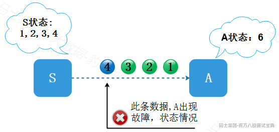

接下来，当整个程序从故障中恢复过程中可能有这么几种情况:

- **at most once (最多消费一次)**

*(⚠️ 图片缺失:源知识库原图已失效)* 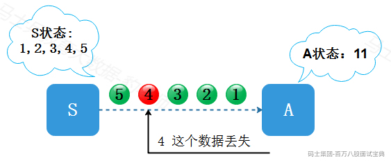

**S不知道A发生了故障**，随后系统从故障中恢复，A收到了S发送的下一条数据“5”，数据“4”实际上被丢失了。这时S的发送历史是1,2,3,4,5，A的状态是11。而“1,2,3,4,5”所对应的累加和应该是15，所以S和A就出现了状态不一致，S认为A的状态包含了“4”，而A实际上没有。这样就导致“4”这条数据永久丢失，这种程序从故障恢复的语义就是at most once 语义。

- **exactly once (精准消费一次)**

*(⚠️ 图片缺失:源知识库原图已失效)* 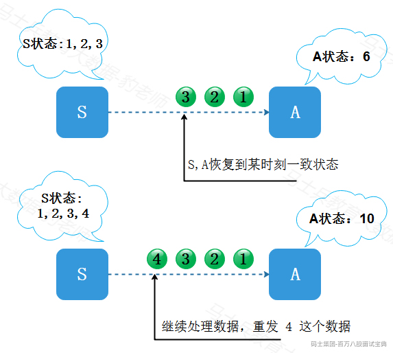

回到状态S：1,2,3,4，A：6的时间点，**假设这时S知道A有故障**，并且A没有处理“4”，系统从故障中恢复之后，S和A都退回到上一个一致的状态，然后重新开始运算。比如上一个一致的状态是：S:1,2,3, A:6，那么S回退之后会重发“4”。如果A成功处理“4”，现在的状态就变成：S：1,2,3,4， A：10。S和A的状态就是一致的。如果上一个一致的状态是：S:1,2, A:3，那么S回退之后会从“3”开始重发。这种程序从故障恢复的语义就是exactly once 语义。

以上这个过程我们假定的是A没有处理“4”这条数据，那么还有可能是A已经处理了“4”，然后A在通知S“4已处理”之前挂了，这时S不知道A已经处理了“4”，所以为了确保一致性，在恢复程序时，S必须假设A没有处理"4"，**因此S和A仍然要一起退回上一个一致的状态**，并且从一致的状态重新开始运算。比如说：S:1,2,3, A:6。S重发“4”并且被A处理之后，虽然A实际上处理了“4”两次，但A第一次处理“4”之后的状态在故障之后弃用了。所以在A当前的状态中，“4”只被处理了一次，这也是exactly once处理语义。

- **at least once(至少消费一次)**

*(⚠️ 图片缺失:源知识库原图已失效)* 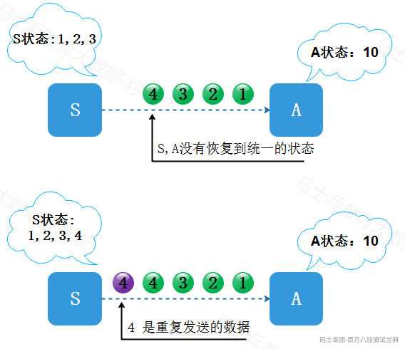

同样回到状态S：1,2,3,4，A：6的时间点，**但是S和A没有一起退回上一个一致的状态**，比如说在程序恢复之后，两者的状态为：S:1,2,3, A: 10。这时，S重发“4”，状态变为S:1,2,3,4 A: 14，当前状态下，**“4”被处理了两次，且状态不一致**。这种程序从故障恢复的语义就是at least once 语义。

通过以上的了解，我们发现exactly-once语义中无论一条数据被重复处理多少次，只要影响最后结果是一次，那么这种我们也称为是exactly-once语义保证，这个就是所谓的幂等(idempotent)操作（执行多次与执行一次的效果相同）。

### **7.5.2 Flink端到端数据处理一致性**

在Flink内部，Flink通过checkpoint检查点机制来保证Flink内部处理数据的一致性，一般的流处理系统提供了程序内部的数据处理一致性，但不包括输入和输出的一致性。在Flink中，数据处理一致性指的是端到端的一致性，包括输入、系统内部和输出的整体一致性。因此，为了实现端到端的一致性保证，除了保证Flink内部数据处理一致性外，还需要保证Flink读取数据的输入端和数据输出端的一致性。

**输入端的一致性取决于外部数据源能否按照不变的顺序重放数据**。针对Flink输入端想要保证Flink程序故障恢复不丢失数据，数据输入端必须具备数据重放的能力。例如，Flink读取Socket数据时，socket数据流不具备数据重放功能，Flink程序从故障恢复时就不能保证exactly-once 处理数据的语义，读取Socket中的数据的保证语义只能是at most once。再如，Flink读取Kafka中数据或者文件数据时，Flink可以将读取source的偏移量作为状态存储在checkpoint中，就可以保证Flink程序故障恢复时exactly-once语义保证，所以只要数据源可以保证数据重放，读取数据源的offset又能被Flink以状态进行保存，保证输入端的数据一致性就相对简单。

输出端数据一致性的保证相对复杂。在Flink内部，通过状态回滚可以保证Flink程序故障重启后的exactly-once数据处理，即使在进行checkpoint之前某些数据已被处理，但只要它们还没有进行checkpoint，故障重启后的Flink程序会将这部分数据视为未被处理（因为状态已回滚），从而不会对结果产生影响。然而，如果涉及将数据写出到外部系统，那么在Flink程序挂掉之前，这部分数据可能已经被写出到外部系统，当Flink程序故障重启后，这部分数据将被重新处理一次，导致数据重复处理，即出现at-least-once处理语义。

因此，为了保证Flink程序故障恢复后输出端的exactly-once处理语义，输出端必须具备幂等性（idempotency）或支持事务（transaction）。

幂等性指的是重复数据写入外部系统，但只对结果产生一次影响。例如，根据主键向MySQL或根据Rowkey向HBase写入数据时，重复数据写入只会对结果产生一次影响。然而，幂等性方式需要外部写入目标支持幂等写入，因此受限场景较多。另一种方式是使用事务来保证输出端数据的一致性。

使用事务方式保证输出端数据一致性的主要思路是，在Flink程序向外部系统Sink数据时，构建一个代码事务：当遇到Flink barrier时，创建一个新的事务，并将后续所有写出的数据绑定到该事务。当Sink收到Flink JobManager 发来的Checkpoint检查点完成通知时，提交该事务，该事务对应的数据才真正写入到外部系统中。如果只是创建了新的事务而Flink出现故障，当Flink程序故障恢复后，该事务由于没有提交，所以对应的数据不会写入到外部系统。通过这种事务的方式，数据写出操作实现了随着checkpoint进行提交和回滚。实际上，这种事务方式可以理解为Flink将外部系统写出部分视为其内部状态管理的一部分。

为了实现这种事务方式，Flink提供了TwoPhaseCommitSinkFunction抽象类，方便自定义实现两阶段提交方式来写出数据，以保证输出端数据的一致性。关于两阶段提交的具体细节，可以参考Flink写出Kafka的exactly-once保证相关小节。

## 7.6 **Flink写出Kafka exactly once 保证**

本小节对Flink写出Kafka exactly once 语义保证实现原理进行介绍，同时会代码实现Flink TwoPhaseCommitSinkFunction 两阶段提交，学习如何手动干预端到端语义一致性保证。

### **7.6.1 Flink消费Kafka 数据offset提交配置**

Flink提供了消费kafka数据的offset如何提交给Kafka或者zookeeper(kafka0.8之前)的配置。注意，Flink并不依赖提交给Kafka或者zookeeper中的offset来保证容错。提交的offset只是为了外部来查询监视kafka数据消费的情况。

配置offset的提交方式取决于是否为job设置开启checkpoint。可以使用env.enableCheckpointing(5000)来设置开启checkpoint。

- **关闭checkpoint：**

如果禁用了checkpoint，那么offset位置的提交取决于Flink读取kafka客户端的配置，enable.auto.commit ( auto.commit.enable【Kafka 0.8】，默认false)配置是否开启自动提交offset, auto.commit.interval.ms(默认5s)决定自动提交offset的周期。

- **开启checkpoint：**

如果开启了checkpoint，那么当checkpoint保存状态完成后，将checkpoint中保存的offset位置提交到kafka。这样保证了Kafka中保存的offset和checkpoint中保存的offset一致，Flink1.14版本后，enable.auto.commit改参数默认为false，所以开启了checkpoint后，checkpoint中保存的offset数据不会自动向Kafka提交，如果需要提交可以设置改参数为true。

### **7.6.2 checkpoint+两阶段提交保证exactly once语义**

当谈及“exactly-once semantics”仅一次处理数据时，指的是每条数据只会影响最终结果一次。Flink可以保证当机器出现故障或者程序出现错误时，也没有重复的数据或者未被处理的数据出现，实现仅一次处理的语义。Flink开发出了checkpointing机制，这种机制是在Flink应用内部实现仅一次处理数据的基础。

checkpoint中包含：

- **当前应用的状态**

- **当前消费流数据的位置**

在Flink1.4版本之前，Flink仅一次处理数据只限于Flink应用内部（可以使用checkpoint机制实现仅一次数据数据语义），当Flink处理完的数据需要写入外部系统时，不保证仅一次处理数据。为了提供端到端的仅一次处理数据，在将数据写入外部系统时也要保证仅一次处理数据，这些外部系统必须提供一种手段来允许程序提交或者回滚写入操作，同时还要保证与Flink的checkpoint机制协调使用。

在分布式系统中协调提交和回滚的常见方法就是两阶段提交协议。下面给出从kafka中读取数据，经过处理数据之后将结果再写回kafka的实例了解Flink如何使用两阶段提交协议来实现数据仅一次处理语义。

kafka0.11版本之后支持事务，这也是Flink与kafka交互时仅一次处理的必要条件。**【注意：当Flink处理完的数据写入kafka时，即当sink为kafka时，自动封装了两阶段提交协议】**。Flink支持仅一次处理数据不仅仅限于和Kafka的结合，只要sink提供了必要的两阶段协调实现，可以对任何sink都能实现仅一次处理数据语义。

其原理如下：

*(⚠️ 图片缺失:源知识库原图已失效)* 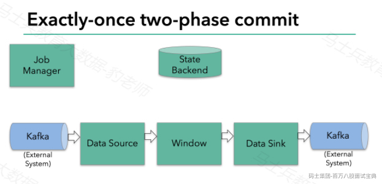

上图Flink程序包含以下组件：

1) 一个从kafka中读取数据的source

2) 一个窗口聚合操作

3) 一个将结果写往kafka的sink。

要使sink支持仅一次处理数据语义，必须以事务的方式将数据写往kafka,将两次checkpoint之间的操作当做一个事务提交，确保出现故障时操作能够被回滚。假设出现故障，在分布式多并发执行sink的应用程序中，仅仅执行单次提交或回滚事务是不够的，因为分布式中的各个sink程序都必须对这些提交或者回滚达成共识，这样才能保证两次checkpoint之间的数据得到一个一致性的结果。Flink使用两阶段提交协议(pre-commit+commit)来实现这个问题。

Filnk checkpointing开始时就进入到pre-commit阶段，具体来说，一旦checkpoint开始，Flink的JobManager向输入流中写入一个checkpoint barrier将流中所有消息分隔成属于本次checkpoint的消息以及属于下次checkpoint的消息，barrier也会在操作算子间流转，对于每个operator来说，该barrier会触发operator的State Backend来为当前的operator来打快照。如下图示：

*(⚠️ 图片缺失:源知识库原图已失效)* 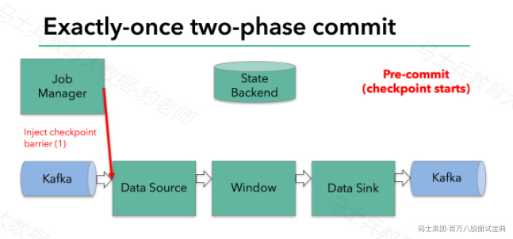

*(⚠️ 图片缺失:源知识库原图已失效)* 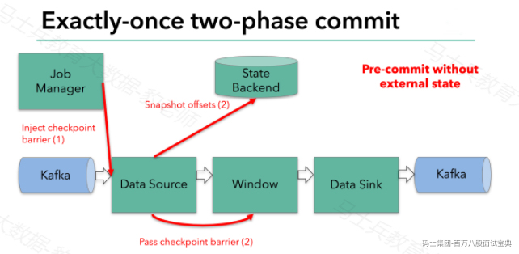

Flink DataSource中存储着Kafka消费的offset，当完成快照保存后，将chechkpoint barrier传递给下一个operator。这种方式只有在Flink内部状态的场景是可行的，内部状态指的是由Flink的State Backend管理状态，例如上面的window的状态就是内部状态管理。只有当内部状态时，pre-commit阶段无需执行额外的操作，仅仅是写入一些定义好的状态变量即可，checkpoint成功时Flink负责提交这些状态写入，否则就不写入当前状态。

但是，一旦operator操作包含外部状态，事情就不一样了。我们不能像处理内部状态一样处理外部状态，因为外部状态涉及到与外部系统的交互。这种情况下，外部系统必须要支持可以与两阶段提交协议绑定的事务才能保证仅一次处理数据。

本例中的data sink是将数据写往kafka，因为写往kafka是有外部状态的，这种情况下，pre-commit阶段下data sink 在保存状态到State Backend的同时，还必须pre-commit外部的事务。如下图：

*(⚠️ 图片缺失:源知识库原图已失效)* 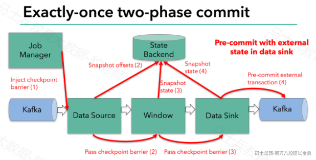

当checkpoint barrier在所有的operator都传递一遍切对应的快照都成功完成之后，pre-commit阶段才算完成。这个过程中所有创建的快照都被视为checkpoint的一部分，checkpoint中保存着整个应用的全局状态，当然也包含pre-commit阶段提交的外部状态。当程序出现崩溃时，我们可以回滚状态到最新已经完成快照的时间点。

下一步就是通知所有的operator，告诉它们checkpoint已经完成，这便是两阶段提交的第二个阶段：commit阶段。这个阶段中JobManager会为应用中的每个operator发起checkpoint已经完成的回调逻辑。本例中，DataSource和Winow操作都没有外部状态，因此在该阶段，这两个operator无需执行任何逻辑，但是Data Sink是有外部状态的，因此此时我们需要提交外部事务。如下图示：

*(⚠️ 图片缺失:源知识库原图已失效)* 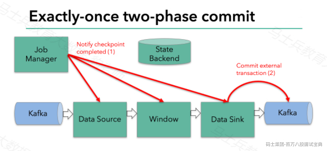

汇总以上信息，总结得出：

- 一旦所有的operator完成各自的pre-commit,他们会发起一个commit操作。

- 如果一个operator的pre-commit失败，所有其他的operator 的pre-commit必须被终止，并且Flink会回滚到最近成功完成的checkpoint位置。

- 一旦pre-commit完成，必须要确保commit也要成功，内部的operator和外部的系统都要对此进行保证。假设commit失败【网络故障原因】，Flink程序就会崩溃，然后根据用户重启策略执行重启逻辑，重启之后会再次commit。

因此，所有的operator必须对checkpoint最终结果达成共识，即所有的operator都必须认定数据提交要么成功执行，要么被终止然后回滚。

### **7.6.3 两阶段提交代码案例**

在Flink中TwoPhaseCommitSinkFunction是个抽象类，用户自定义类继承该类时需要实现如下5个方法:

- beginTransaction:开启一个事务，后续来的数据都属于该事务内的数据。

- invoke:当Sink中接收到一条数据时都会调用invoke方法，该方法中主要决定如何处理该数据。

- preCommit: pre-commit预提交阶段，当barrir到达后，会调用该方法进行数据预提交，同时调用beginTransaction开启一个新的事务执行属于下一个checkpoint的数据操作。

- commit：Flink checkpoint完成，真正执行commit提交操作，Flink在notifyCheckpointComplete()方法中调用该方法，即JobManager完成checkpoint后调用该方法。

- abort:一旦代码出现异常调用abort方法，该方法内进行终止事务，数据回滚操作。

下面以读取Kafka中数据写入到MySQL为例来演示用户自定义实现TwoPhaseCommitSinkFunction完成端到端数据处理一致性。

**案例：读取Kafka中数据写入到MySQL中。**

**1) MySQL中创建表**

```plain
use mydb;
create table mydb.user(
id int,
name varchar(255),
age int
);
```

**2) Kafka中创建对应的topic**

```plain
#启动Kafka后创建对应的topic
[root@node1 ~]# kafka-topics.sh --bootstrap-server node1:9092,node2:9092,node3:9092 --create --topic 2pc-topic  --partitions 3 --replication-factor 3

[root@node1 ~]# kafka-topics.sh --bootstrap-server node1:9092,node2:9092,node3:9092  --list
```

**3) 编写代码**

- **Java代码-JdbcCommonUtils**

```plain
/**
 * 连接MySQL - JDBC工具类
 */
public class JdbcCommonUtils{
    private static String driver = "com.mysql.jdbc.Driver";
    private static String url = "jdbc:mysql://node2:3306/mydb?useSSL=false";
    private static String username = "root";
    private static String password = "123456";

    private static Connection conn ;

    /**
     * 获取数据库连接对象
     */
    public  Connection getConnect() {
        try {
            if(conn ==null){
                Class.forName(driver);
                conn = DriverManager.getConnection(url, username, password);
                //设置手动提交事务
                conn.setAutoCommit(false);
            }
        } catch (SQLException e) {
            throw new RuntimeException(e);
        } catch (ClassNotFoundException e) {
            throw new RuntimeException(e);
        }
        return conn;
    }

    /**
     * 提交事务
     */
    public  void commit() {
        if (conn != null) {
            try {
                conn.commit();
            } catch (SQLException e) {
                throw new RuntimeException(e);
            }

        }
    }

    /**
     * 回滚事务
     */
    public  void rollback() {
        if (conn != null) {
            try {
                conn.rollback();
            } catch (SQLException e) {
                throw new RuntimeException(e);
            }

        }
    }

    /**
     * 关闭连接
     */
    public void close() {
        if (conn != null) {
            try {
                conn.close();
            } catch (SQLException e) {
                throw new RuntimeException(e);
            }

        }
    }
}
  
```

- **Java代码 - TwoPhaseCommitTest**

```plain
/**
 * 两阶段提交测试 - TwoPhaseCommitSinkFunction 类实现
 * 案例：通过两阶段提交实现类完成读取Kafka数据写入到MySQL
 */
public class TwoPhaseCommitTest {
    public static void main(String[] args) throws Exception {
        StreamExecutionEnvironment env = StreamExecutionEnvironment.getExecutionEnvironment();
        env.setParallelism(1);

        //开启checkpoint
        env.enableCheckpointing(5000);

        /**
         * Kafka中输入数据如下:
         * 1,zs,18
         * 2,ls,20
         * 3,ww,19
         * 4,zl,21
         * 5,tq,22
         */
        KafkaSource<String> kafkaSource = KafkaSource.<String>builder()
                .setBootstrapServers("node1:9092,node2:9092,node3:9092") //设置Kafka 集群节点
                .setTopics("2pc-topic") //设置读取的topic
                .setGroupId("my-test-group") //设置消费者组
                .setStartingOffsets(OffsetsInitializer.latest()) //设置读取数据位置
                .setValueOnlyDeserializer(new SimpleStringSchema()) //设置value的序列化格式
                .build();

        DataStreamSource<String> kafkaDS = env.fromSource(kafkaSource, WatermarkStrategy.noWatermarks(),
                "kafka-source");

        //自定义Sink 到MySQL,通过实现TwoPhaseCommitSinkFunction接口
        kafkaDS.addSink(new CustomTwoPhaseCommitSinkFunction());

        env.execute();

    }

}

/**
 * 自定义 Sink 到 MySQL,通过继承TwoPhaseCommitSinkFunction抽象类
 * TwoPhaseCommitSinkFunction<IN, TXN, CONTEXT>
 *     IN: 输入数据类型
 *     TXN: 当前事务流程中的对象，贯穿TwoPhaseCommitSinkFunction类中各个方法中
 *     CONTEXT: 上下文类型
 */
class CustomTwoPhaseCommitSinkFunction extends TwoPhaseCommitSinkFunction<String, JdbcCommonUtils, Void> {

    //创建默认的构造方法
    public CustomTwoPhaseCommitSinkFunction() {
        super(new KryoSerializer<>(JdbcCommonUtils.class,new ExecutionConfig()), VoidSerializer.INSTANCE);
    }

    /**
     * 开始事务。这里Flink会调用beginTransaction()方法创建连接池
     */
    @Override
    protected JdbcCommonUtils beginTransaction() throws Exception {
        System.out.println("beginTransaction()...");
        return new JdbcCommonUtils();
    }

    /**
     * 每接收一条数据后，会调用invoke()方法，将数据写入到MySQL中
     */
    @Override
    protected void invoke(JdbcCommonUtils jdbcUtils, String value, Context context) throws Exception {
        //将数据写入到MySQL中
        String[] split = value.split(",");
        PreparedStatement pst = jdbcUtils.getConnect().prepareStatement("insert into user(id,name,age) values(?,?,?)");
        pst.setInt(1,Integer.valueOf(split[0]));
        pst.setString(2,split[1]);
        pst.setInt(3,Integer.valueOf(split[2]));

        //执行插入操作
        pst.execute();

        //关闭pst对象
        pst.close();
    }

    /**
     * 当barrier 到达后，Flink会调用preCommit()方法，进行数据预提交
     * 预提交，如果一个preCommit执行失败，其他preCommit也会失败，Flink会调用abort()方法
     */
    @Override
    protected void preCommit(JdbcCommonUtils jdbcCommonUtils) throws Exception {
        System.out.println("barrier 到达，preCommit() 方法执行，开始预提交...");
        //这里的逻辑放在invoke()方法中进行插入数据
    }

    /**
     * Flink checkpoint完成，真正执行提交，Flink在notifyCheckpointComplete()方法中调用该方法，即JobManager完成checkpoint后调用该方法
     */
    @Override
    protected void commit(JdbcCommonUtils jdbcCommonUtils) {
        System.out.println("commit() 方法执行...");
        //提交事务
        jdbcCommonUtils.commit();
    }

    /**
     * 代码出现异常，事务中止，Flink会调用abort()方法
     * 这里主要是回滚事务
     */
    @Override
    protected void abort(JdbcCommonUtils jdbcCommonUtils) {
        System.out.println("abort() 方法执行...");
        //回滚事务
        jdbcCommonUtils.rollback();
        //关闭连接
        jdbcCommonUtils.close();
    }
}
```

- **Scala代码 - JdbcCommonUtils**

```plain
/**
 * 连接Mysql - JDBC工具类
 * Scala中，类被替换为了对象，并且不再需要使用static关键字
 */
case class JdbcCommonUtils() {
  val driver = "com.mysql.jdbc.Driver"
  val url = "jdbc:mysql://node2:3306/mydb?useSSL=false"
  val username = "root"
  val password = "123456"

  private var conn: Connection = _
  /**
   * 获取数据库连接对象
   */
  def getConnect: Connection = {
    if (conn == null) {
      try {
        Class.forName(driver)
        conn = DriverManager.getConnection(url, username, password)
        //设置手动提交事务
        conn.setAutoCommit(false)
      } catch {
        case e: SQLException =>
          throw new RuntimeException(e)
        case e: ClassNotFoundException =>
          throw new RuntimeException(e)
      }
    }
    conn
  }

  /**
   * 提交事务
   */
  def commit(): Unit = {
    if (conn != null) {
      try {
        conn.commit()
      } catch {
        case e: SQLException =>
          throw new RuntimeException(e)
      }
    }
  }

  /**
   * 回滚事务
   */
  def rollback(): Unit = {
    if (conn != null) {
      try {
        conn.rollback()
      } catch {
        case e: SQLException =>
          throw new RuntimeException(e)
      }
    }
  }

  /**
   * 关闭连接
   */
  def close(): Unit = {
    if (conn != null) {
      try {
        conn.close()
      } catch {
        case e: SQLException =>
          throw new RuntimeException(e)
      }
    }
  }
}
```

- **Scala代码-TwoPhaseCommitTest**

```plain
/**
 * 两阶段提交测试 - TwoPhaseCommitSinkFunction 类实现
 * 案例：通过两阶段提交实现类完成读取Kafka数据写入到MySQL
 */
object TwoPhaseCommitTest {
  def main(args: Array[String]): Unit = {
    val env = StreamExecutionEnvironment.getExecutionEnvironment
    //开启隐式转换
    import org.apache.flink.streaming.api.scala._

    //设置并行度
    env.setParallelism(3)

    //开启checkpoint
    env.enableCheckpointing(5000)

    /**
     * Kafka中输入数据如下:
     * 1,zs,18
     * 2,ls,20
     * 3,ww,19
     * 4,zl,21
     * 5,tq,22
     */
    val kafkaSource: KafkaSource[String] = KafkaSource.builder()
      .setBootstrapServers("node1:9092,node2:9092,node3:9092") //设置Kafka 集群节点
      .setTopics("2pc-topic") //设置读取的topic
      .setGroupId("my-test-group") //设置消费者组
      .setStartingOffsets(OffsetsInitializer.latest()) //设置读取数据位置
      .setValueOnlyDeserializer(new SimpleStringSchema()) //设置value的序列化格式
      .build()

    val kafkaDS: DataStream[String] = env.fromSource(kafkaSource, WatermarkStrategy.noWatermarks(),
      "kafka-source")

    //自定义Sink 到MySQL,通过实现TwoPhaseCommitSinkFunction接口
    kafkaDS.addSink(new CustomTwoPhaseCommitSinkFunction)

    env.execute()
  }

}

/**
 * 自定义 Sink 到 MySQL,通过继承TwoPhaseCommitSinkFunction抽象类
 * TwoPhaseCommitSinkFunction[IN, TXN, CONTEXT]
 *     IN: 输入数据类型
 *     TXN: 当前事务流程中的对象，贯穿TwoPhaseCommitSinkFunction类中各个方法中
 *     CONTEXT: 上下文类型
 */
class CustomTwoPhaseCommitSinkFunction extends TwoPhaseCommitSinkFunction[String, JdbcCommonUtils, Void](
  new KryoSerializer[JdbcCommonUtils](classOf[JdbcCommonUtils], new ExecutionConfig),
  VoidSerializer.INSTANCE
) {
  /**
   * 开始事务。这里Flink会调用beginTransaction()方法创建连接池
   */
  override def beginTransaction(): JdbcCommonUtils = {
    println("beginTransaction()...")
    new JdbcCommonUtils
  }

  /**
   * 每接收一条数据后，会调用invoke()方法，将数据写入到MySQL中
   */
  override def invoke(transaction: JdbcCommonUtils, value: String, context: SinkFunction.Context): Unit = {
    //将数据写入到MySQL中
    val split = value.split(",")
    val pst = transaction.getConnect.prepareStatement("insert into user(id,name,age) values(?,?,?)")
    pst.setInt(1, Integer.valueOf(split(0)))
    pst.setString(2, split(1))
    pst.setInt(3, Integer.valueOf(split(2)))

    //执行插入操作
    pst.execute()

    //关闭pst对象
    pst.close()
  }

  /**
   * 当barrier 到达后，Flink会调用preCommit()方法，进行数据预提交
   * 预提交，如果一个preCommit执行失败，其他preCommit也会失败，Flink会调用abort()方法
   */
  override def preCommit(transaction: JdbcCommonUtils): Unit = {
    println("barrier 到达，preCommit() 方法执行，开始预提交...")
    //这里的逻辑放在invoke()方法中进行插入数据
  }

  /**
   * Flink checkpoint完成，真正执行提交，Flink在notifyCheckpointComplete()方法中调用该方法，即JobManager完成checkpoint后调用该方法
   */
  override def commit(transaction: JdbcCommonUtils): Unit = {
    println("commit() 方法执行...")
    //提交事务
    transaction.commit()
  }

  /**
   * 代码出现异常，事务中止，Flink会调用abort()方法
   * 这里主要是回滚事务
   */
  override def abort(transaction: JdbcCommonUtils): Unit = {
    println("abort() 方法执行...")
    //回滚事务
    transaction.rollback()
    //关闭连接
    transaction.close()
  }
}
```

**4) 代码测试**

在Java或者Scala代码中可以设置并行度为1来观察TwoPhaseCommitSinkFunction抽象类中各个方法执行顺序。启动Java或者Scala代码后，可以观察到commit执行周期与checkpoint周期一致。

向Kafka中输入如下数据：

```plain
[root@node1 ~]# kafka-console-producer.sh  --bootstrap-server node1:9092,node2:9092,node3:9092 --topic 2pc-topic
1,zs,18
2,ls,19
3,ww,20
4,ml,21
5,tq,22
```

等待代码中执行commit方法后，查询mysql中数据如下：

```plain
mysql> select * from user;
+------+------+------+
| id   | name | age  |
+------+------+------+
|    1 | zs   |   18 |
|    2 | ls   |   19 |
|    3 | ww   |   20 |
|    4 | ml   |   21 |
|    5 | tq   |   22 |
+------+------+------+
```

## 7.7 **Flink任务重启与恢复策略**

当Flink程序运行失败时，Flink会自动处理任务的重启和恢复，以使任务能够重新回到正常状态。重启策略(Restart Strategies)和故障恢复策略(Failover Strategies)在这个过程中起着关键作用,重启策略决定何时以及是否重新启动失败或受影响的task任务，而故障恢复策略则决定哪些task任务应该被重新启动，以便整个Flink程序能够恢复正常运行状态。

### **7.7.1 重启策略（Restart Strategies）**

默认情况下，Flink使用配置文件"flink-conf.yaml"来设置重启策略，在该文件中，可以通过配置"restart-strategy.type"来选择所需的重启策略。

如果Flink没有启用检查点（checkpoint），默认的重启策略是"no restart"，这意味着任务在失败后不会被重新启动。如果Flink启用了检查点并且没有配置特定的重启策略，那么默认的重启策略是"fixed-delay"策略，即固定延迟启动,重试次数为Integer.MAX\_VALUE。

重启策略“restart-strategy.type”参数可以配置以下可用的重启策略：

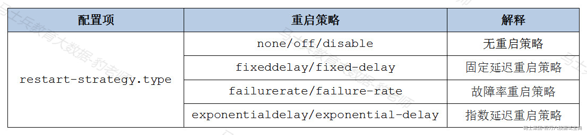

下面分别介绍以上各种重启策略。

- **无重启策略**

Flink 任务失败，不尝试重新启动，如果Flink没有开启checkpoint，默认就是这种重启策略。可以在Flink集群flink-conf.yaml配置文件配置该重启策略：

```plain
restart-strategy.type: none
```

也可以在编写Flink代码时配置：

```plain
StreamExecutionEnvironment env = StreamExecutionEnvironment.getExecutionEnvironment();
env.setRestartStrategy(RestartStrategies.noRestart());
```

- **固定延迟重启策略（fixed delay）**

固定延迟重启策略尝试给定次数来重启Flink作业,如果超过最大尝试次数，则Flink作业最终失败，在两次连续的重启尝试之间可以配置等待的间隔时间。如果Flink开启了checkpoint并没有特别指定重启策略，那么默认就是使用“fixed delay”这种重启策略。

可以在Flink集群flink-conf.yaml配置文件中配置该重启策略：

```plain
restart-strategy.type: fixed-delay

#重启次数,默认1次
restart-strategy.fixed-delay.attempts: 3

#重启等待间隔，默认1s
restart-strategy.fixed-delay.delay: 10 s
```

也可以在编写Flink代码时配置：

```plain
StreamExecutionEnvironment env = StreamExecutionEnvironment.getExecutionEnvironment();
env.setRestartStrategy(RestartStrategies.fixedDelayRestart(  
3, // number of restart attempts  
Time.of(10, TimeUnit.SECONDS) // delay
));
```

- **故障率重启策略（failure rate）**

故障率重启策略当Flink作业失败后重新启动Flink作业，但当超过故障率(每个测量故障次数时间间隔的失败次数)时，作业最终会失败。在两次连续的重启尝试之间可以配置等待的间隔时间。

可以在Flink集群flink-conf.yaml配置文件中配置该重启策略：

```plain
restart-strategy.type: failure-rate
#在测量故障率的时间间隔内，Flink作业允许失败最大次数，默认1
restart-strategy.failure-rate.max-failures-per-interval: 3

#测量故障率的时间间隔，默认1min，可以设置1 min/20 s格式
restart-strategy.failure-rate.failure-rate-interval: 5 min

#任务重试的时间间隔，默认1s，可以设置1 min /20 s格式
restart-strategy.failure-rate.delay: 10 s
```

也可以在编写Flink代码时配置：

```plain
StreamExecutionEnvironment env = StreamExecutionEnvironment.getExecutionEnvironment();
env.setRestartStrategy(RestartStrategies.failureRateRestart(  
3, // max failures per interval  
Time.of(5, TimeUnit.MINUTES), //time interval for measuring failure rate  
Time.of(10, TimeUnit.SECONDS) // delay
));
```

- **指数延迟重启策略（exponential delay）**

指数延迟重启策略尝试无限次重启Flink作业，不断增加延迟时间直至最大延迟时间。在两次连续的重启尝试之间，重启策略会呈指数增长，直到达到最大延迟时间并将延迟时间保持在最大值。当作业正确执行时，指数延迟时间值在一段时间阈值后重置,该时间阈值是可配置的。

可以在Flink集群flink-conf.yaml配置文件中配置该重启策略：

```plain
restart-strategy.type: exponential-delay

#初始延迟，默认1s,可以设置1 min/20 s格式
restart-strategy.exponential-delay.initial-backoff: 10 s

#最大延迟，默认5分钟，可以设置1 min/20 s格式
restart-strategy.exponential-delay.max-backoff: 2 min

#每次失败后，延迟时间乘以此值作为新的延迟时间，直到达到最大延迟，默认值2.0
restart-strategy.exponential-delay.backoff-multiplier: 2.0

#作业运行多长时间后，延迟时间恢复为初始延迟，默认之为1小时
restart-strategy.exponential-delay.reset-backoff-threshold: 10 min

#随机偏移值，在延迟基础上随机加上或者减去该值乘以延迟值，防止多个job同时重启，默认值为0.1
restart-strategy.exponential-delay.jitter-factor: 0.1
```

也可以在编写Flink代码时配置：

```plain
StreamExecutionEnvironment env = StreamExecutionEnvironment.getExecutionEnvironment();
env.setRestartStrategy(RestartStrategies.exponentialDelayRestart(  
Time.milliseconds(1),  // inital backoff  
Time.milliseconds(1000),  // max backoff  
1.1, // backoff multiplier  
Time.milliseconds(2000), // threshold duration to reset delay to its initial value  
0.1 // jitter factor
));
```

注意：以上各种重启策略代码中设置可以覆盖集群flink-conf.yaml文件配置。

### **7.7.2 故障恢复（Failover Strategies）**

Flink支持不同的故障恢复策略，这些策略可以通过flink-conf.yaml文件中参数jobmanager.execution.failover-strategy进行配置。

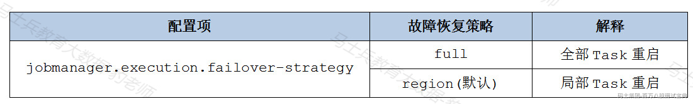

在“全部重启”故障恢复策略中，Task发生故障时，会重启Flink作业中所有的Task,“局部重启”故障恢复策略中，会将任务分组为不相交的区域，当检测到Task故障时，该策略计算出必须重新启动的最小区域集合从故障中恢复，与“全部重启”策略相比，这种策略重新启动的任务数量较少。
