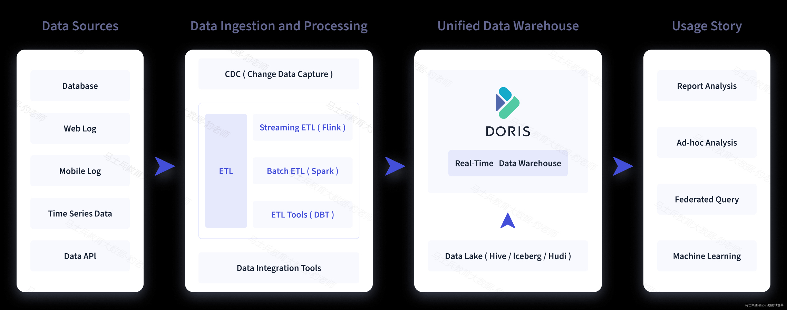
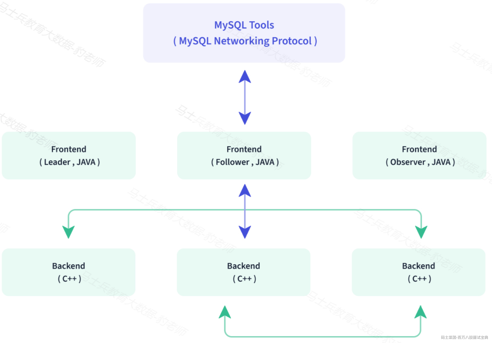
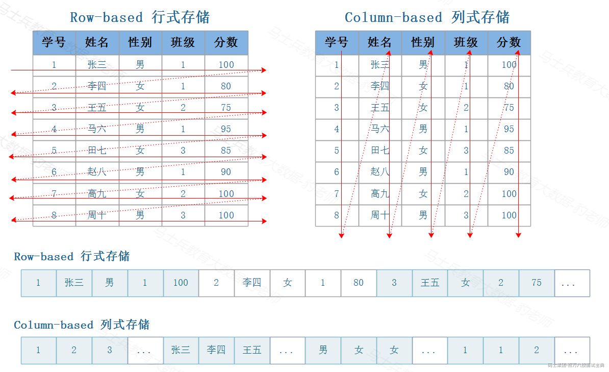
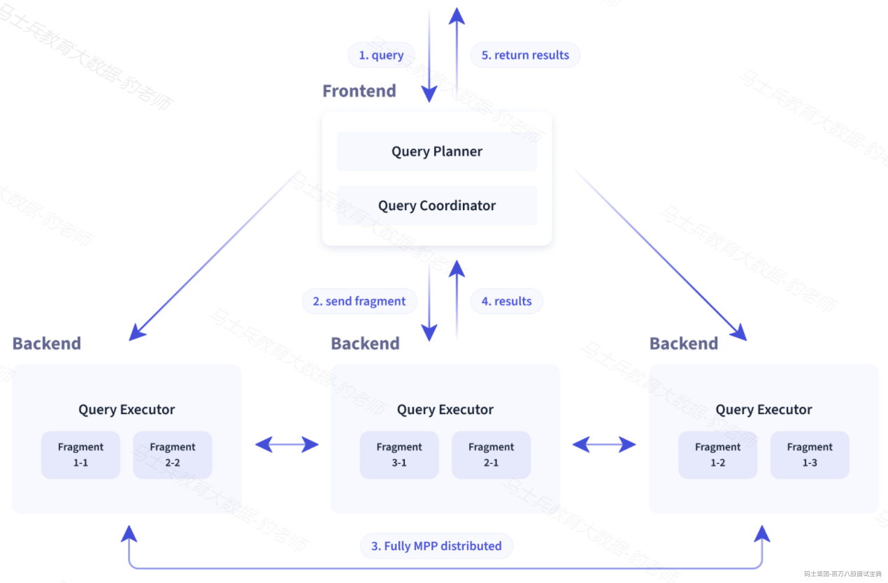
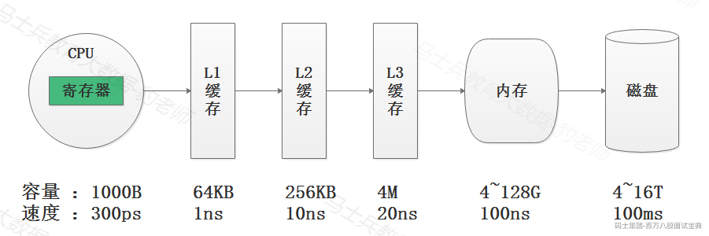
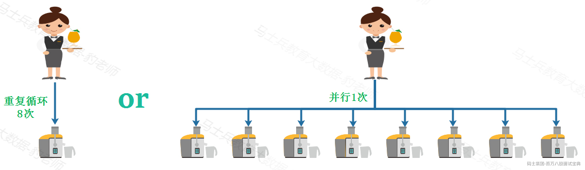
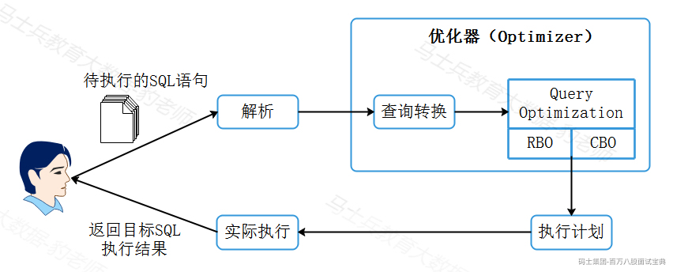

# 1 **第一章初识Apache Doris**

## 1.1 **Apache Doris介绍**

Apache Doris 是一个基于 MPP 架构的高性能、实时的分析型数据库，以极速易用的特点被人们所熟知，仅需**亚秒级响应**时间即可返回海量数据下的查询结果，不仅可以 **支持高并发的点查询场景，也能支持高吞吐的复杂分析场景** 。基于此，Apache Doris 能够较好的满足报表分析、即席查询、统一数仓构建、数据湖联邦查询加速等使用场景，用户可以在此之上构建用户行为分析、AB 实验平台、日志检索分析、用户画像分析、订单分析等应用。

Apache Doris 最早是诞生于百度广告报表业务的 Palo 项目，2017 年正式对外开源，2018 年 7 月由百度捐赠给 Apache 基金会进行孵化，之后在 Apache 导师的指导下由孵化器项目管理委员会成员进行孵化和运营。目前 Apache Doris 社区已经聚集了来自不同行业近百家企业的 400 余位贡献者，并且每月活跃贡献者人数也接近 100 位。 2022 年 6 月，Apache Doris 成功从 Apache 孵化器毕业，正式成为 Apache 顶级项目（Top-Level Project，TLP）。

Apache Doris 如今在中国乃至全球范围内都拥有着广泛的用户群体，截止目前， Apache Doris 已经在全球超过 1000 家企业的生产环境中得到应用，在中国市值或估值排行前 50 的互联网公司中，有超过 80% 长期使用 Apache Doris，包括百度、美团、小米、京东、字节跳动、腾讯、网易、快手、微博、贝壳等。同时在一些传统行业如金融、能源、制造、电信等领域也有着丰富的应用。

Apache Doris官网为[https://doris.apache.org。](https://doris.apache.org/zh-CN/learning/)

***注意****：MPP:Massively Parallel Processing ，大规模并行处理。一般说的MPP架构指的是分布式数据库，数据处理时有多个节点，每个节点有独立的磁盘和内存，并发task分散到各个节点各自处理各自的数据，计算完成后最终把结果汇集在一起形成最后结果。*

*MPP可以看成分为MPP DB 和MPP架构，例如Hadoop架构就是MPP架构，都是大规模分布式处理，也就是分布式处理架构，只是MPP 这个词是数据库厂商早期提出的，一般特指分布式数据库。所以理解MPP这个概念可以理解成MPP是一个高纬度概念，MPP可以分成 MPP DB 和MPP架构两个概念，Hadoop  或者MR 就是MPP 架构，MPPDB 就是说的分布式数据库* *，跟严格来说Doris是一个MPP DB ，只是业界普遍称为MPP架构的分布式数据库。*

*Apache Doris并非是DorisDB ，由于各种复杂原因，DorisDB后期改名为StarRocks，也就是说DorisDB 是StarRocks的前身。Doris 最早是解决百度凤巢统计报表的专用系统，随着百度业务的飞速发展对系统进行了多次迭代，逐渐承担起百度内部业务的统计报表和多维分析需求。2013 年，百度把 Doris 进行了 MPP 框架的升级，并将新系统命名为 Palo ，2017 年更改为百度 Palo 的名字在 GitHub 上进行了开源，2018 年贡献给 Apache 基金会时，由于与国外数据库厂商重名，因此选择用回最初 Doris 名字，这就是 Apache Doris 的由来。*

*2020 年 2 月，百度 Doris 团队的个别同学离职创业，基于 Apache Doris 之前的版本做了自己的商业化闭源产品 DorisDB ，这就是 StarRocks 的前身。具体可以参考：*<https://www.sohu.com/a/488816742_827544。>

## 1.2 **Apache Doris使用场景**

如下图所示，数据源经过各种数据集成和加工处理后，通常会入库到实时数仓Doris 和离线湖仓（Hive, Iceberg, Hudi 中），Apache Doris 被广泛应用在以下场景中。

*(⚠️ 图片缺失:源知识库原图已失效)*

### 1.2.1 **报表分析**

- 实时看板（Dashboards）。

- 面向企业内部分析师和管理者的报表。

- 面向用户或者客户的高并发报表分析（Customer Facing Analytics）。比如面向网站主的站点分析、面向广告主的广告报表，并发通常要求成千上万的 QPS ，查询延时要求毫秒级响应。著名的电商公司京东在广告报表中使用 Apache Doris ，每天写入 100 亿行数据，查询并发 QPS 上万，99 分位的查询延时 150ms。

### 1.2.2 **即席查询（Ad-hoc Query）**

面向分析师的自助分析，查询模式不固定，要求较高的吞吐。小米公司基于Doris 构建了增长分析平台（Growing Analytics，GA），利用用户行为数据对业务进行增长分析，平均查询延时 10s，95 分位的查询延时 30s 以内，每天的 SQL 查询量为数万条。

### 1.2.3 **统一数仓构建**

一个平台满足统一的数据仓库建设需求，简化繁琐的大数据软件栈。海底捞基于Doris 构建的统一数仓，替换了原来由 Spark、Hive、Kudu、Hbase、Phoenix 组成的旧架构，架构大大简化。

### 1.2.4 **数据湖联邦查询**

通过外表的方式联邦分析位于Hive、Iceberg、Hudi 中的数据，在避免数据拷贝的前提下，查询性能大幅提升。

## 1.3 **Apache Doris架构原理**

Doris整体架构如下图所示：

*(⚠️ 图片缺失:源知识库原图已失效)*

Doris 架构非常简单，只有两类进程FE和BE，这两类进程都是可以横向扩展的，单集群可以支持到数百台机器，数十 PB 的存储容量。并且这两类进程通过一致性协议来保证服务的高可用和数据的高可靠。这种高度集成的架构设计极大的降低了一款分布式系统的运维成本。

- **Frontend（FE）** **:** 主要负责用户请求的接入、查询解析规划、元数据的存储、节点管理相关工作。

FE又分为 **Leader、Follwer和Observer三种角色** ，默认一个Doris集群中只能有一个Leader，可以有多个Follwer和Observer。其中Leader和Follwer组成一个Paxos选择组，如果Leader宕机，则剩下的Follower会自动选出新的Leader，保证单节点宕机情况下元数据的高可用及数据写入高可用。

Observer用来扩展查询节点、同步Leader元数据进行备份，如果Doris集群压力非常大，可以扩展Observer节点来提高集群查询能力，Observer不参与选举、数据写入，只参与数据读取。

- **Backend（BE）** :一个用户请求通过FE解析、规划后，具体的执行计划会发送给BE具体执行，BE主要负责数据存储、查询计划的执行。

BE分布式的存储Doris table表数据，table表数据会经过分区分桶形成tablet，**tablet采用列式存储，默认有3个副本**。BE会接收FE命令来创建、查询、删除table表，接收来自FE的执行计划并分布式执行。BE会通过索引和谓词下推快速过滤数据，可以在后台执行Compact任务，减少查询时的读放大。

- **Broker(可选)：**

Apache Doris架构中除了有BE和FE进程之外，还可以部署Broker可选进程，主要用于支持Doris读写远端存储上的文件和目录。例如：Apache HDFS 、阿里云OSS、亚马逊S3等。

Broker 通过提供一个 RPC 服务端口来提供服务，是一个无状态的 Java 进程，负责为远端存储的读写操作封装一些类 POSIX 的文件操作，如 open，pread，pwrite 等等。除此之外，Broker 不记录任何其他信息，所以包括远端存储的连接信息、文件信息、权限信息等等，都需要通过参数在 RPC 调用中传递给 Broker 进程，才能使得 Broker 能够正确读写文件。Broker 仅作为一个数据通路，并不参与任何计算，因此仅需占用较少的内存。通常一个 Doris 系统中会部署一个或多个 Broker 进程。

## 1.4 **Apache Doris 特点**

### 1.4.1 **支持标准SQL接口**

在使用接口方面，Doris 采用 MySQL 协议，高度兼容 MySQL 语法，支持标准 SQL，用户可以通过各类客户端工具来访问 Doris，并支持与 BI 工具的无缝对接。

### 1.4.2 **列式存储引擎**

目前大数据存储有两种方案可以选择，行式存储(Row-Based)和列式存储(Column-Based)。

  
*(⚠️ 图片缺失:源知识库原图已失效)*

- **行式存储在数据写入和修改上具有优势。**

行存储的写入是一次完成的，如果这种写入建立在操作系统的文件系统上，可以保证写入过程的成功或者失败，可以保证数据的完整性。列式存储需要把一行记录拆分成单列保存，写入次数明显比行存储多(因为磁头调度次数多，而磁头调度是需要时间的，一般在1ms~10ms)，再加上磁头需要在盘片上移动和定位花费的时间，实际消耗更大。

数据修改实际上也是一次写入过程，不同的是，数据修改是对磁盘上的记录做删除标记。行存储是在指定位置写入一次，列存储是将磁盘定位到多个列上分别写入，这个过程仍是行存储的列数倍。

所以，行式存储在数据写入和修改上具有很大优势。

- **列式存储在数据读取和解析、分析数据上具有优势。**

数据读取时，行存储通常将一行数据完全读出，如果只需要其中几列数据的情况，就会存在冗余列，出于缩短处理时间的考量，消除冗余列的过程通常是在内存中进行的。列存储每次读取的数据是集合的一段或者全部，不存在冗余性问题。

列式存储中的每一列数据类型是相同的，不存在二义性问题，例如，某列类型为整型int,那么它的数据集合一定是整型数据，这种情况使数据解析变得十分容易。相比之下，行存储则要复杂得多，因为在一行记录中保存了多种类型的数据，数据解析需要在多种数据类型之间频繁转换，这个操作很消耗CPU，增加了解析的时间。

所以，列式存储在数据读取和解析数据做数据分析上更具优势。

综上所述，行存储的写入是一次性完成，消耗的时间比列存储少，并且能够保证数据的完整性，缺点是数据读取过程中会产生冗余数据，如果只有少量数据，此影响可以忽略，数量大可能会影响到数据的处理效率。列存储在写入效率、保证数据完整性上都不如行存储，它的优势是在读取过程，不会产生冗余数据，这对数据完整性要求不高的大数据处理领域比较重要。一般来说一个OLAP类型的查询可能需要访问几百万或者几十亿行的数据，但是OLAP分析时只是获取少数的列，对于这种场景列式数据库只需要读取对应的列即可，行式数据库需要读取所有的数据列，因此这种场景更适合列式数据库，可以大大提高OLAP数据分析的效率。

在存储引擎方面，Doris 采用列式存储，按列进行数据的编码压缩和读取，能够实现极高的压缩比，同时减少大量非相关数据的扫描，从而更加有效利用 IO 和 CPU 资源。

### 1.4.3 **支持丰富的索引结构**

Doris 也支持比较丰富的索引结构，来减少数据的扫描：

- Sorted Compound Key Index，可以最多指定三个列组成复合排序键，通过该索引，能够有效进行数据裁剪，从而能够更好支持高并发的报表场景。

- Z-order Index ：使用 Z-order 索引，可以高效对数据模型中的任意字段组合进行范围查询。

- Min/Max ：有效过滤数值类型的等值和范围查询。

- Bloom Filter ：对高基数列的等值过滤裁剪非常有效。

- Invert Index ：能够对任意字段实现快速检索。

### 1.4.4 **支持多种存储模型**

在存储模型方面，Doris 支持多种存储模型，针对不同的场景做了针对性的优化：

- Aggregate Key 模型：相同 Key 的 Value 列合并，通过提前聚合大幅提升性能。

- Unique Key 模型：Key 唯一，相同 Key 的数据覆盖，实现行级别数据更新。

- Duplicate Key 模型：明细数据模型，满足事实表的明细存储。

### 1.4.5 **支持物化视图**

Doris 也支持强一致的物化视图，物化视图的更新和选择都在系统内自动进行，不需要用户手动选择，从而大幅减少了物化视图维护的代价。

### 1.4.6 **MPP架构设计**

在查询引擎方面，Doris 采用 MPP 的模型，节点间和节点内都并行执行，也支持多个大表的分布式 Shuffle Join，从而能够更好应对复杂查询。

### 1.4.7 **支持向量化查询引擎**

*(⚠️ 图片缺失:源知识库原图已失效)*

在计算机系统的体系结构中，存储系统是一种层次结构，典型服务器计算机的存储层次结构如上图，上图表述了CPU、CPU三级缓存、内存、磁盘数据容量与数据读取速度对比，我们可以看出存储媒介距离CPU越近，则访问数据的速度越快。

*注意：缓存就是数据交换的缓冲区，缓存往往都是RAM(断电即掉的非永久储存),它们的作用就是帮助硬件更快地响应。CPU缓存的定义为CPU与内存之间的临时数据交换器，它的出现是为了解决CPU运行处理速度与内存读写速度不匹配的矛盾，CPU缓存一般直接跟CPU芯片集成或位于主板总线互连的独立芯片上，现阶段的CPU缓存一般直接集成在CPU上。CPU往往需要重复处理相同的数据、重复执行相同的指令，如果这部分数据、指令，CPU能在CPU缓存中找到，CPU就不需要从内存或硬盘中再读取数据、指令，从而减少了整机的响应时间。*

由上图可知，从内存读取数据速度比磁盘读取数据速度要快1000倍，从CPU缓存中读取数据的速度比从内存中读取数据的速度最快要快100倍，从CPU寄存器中读取数据的速度为300ps(1000ps 皮秒 = 1ns)，比CPU缓存要快3倍还多。从寄存器中访问数据的速度，是从内存访问数据速度的300倍，是从磁盘中访问数据速度的30万倍。

如果能从CPU寄存器中访问数据对程序的性能提升意义非凡，向量化执行就是在寄存器层面操作数据，为上层应用程序的性能带来了指数级的提升。

**何为向量化执行？向量化执行，可以简单地看作一项消除程序中循环的优化。** 这里用一个形象的例子比喻。小胡经营了一家果汁店，虽然店里的鲜榨苹果汁深受大家喜爱，但客户总是抱怨制作果汁的速度太慢。小胡的店里只有一台榨汁机，每次他都会从篮子里拿出一个苹果，放到榨汁机内等待出汁。如果有8个客户，每个客户都点了一杯苹果汁，那么小胡需要重复循环8次上述的榨汁流程，才能榨出8杯苹果汁。如果制作一杯果汁需要5分钟，那么全部制作完毕则需要40分钟。为了提升果汁的制作速度，小胡想出了一个办法。他将榨汁机的数量从1台增加到了8台，这么一来，他就可以从篮子里一次性拿出8个苹果，分别放入8台榨汁机同时榨汁。此时，小胡只需要5分钟就能够制作出8杯苹果汁。**为了制作n杯果汁，非向量化执行的方式是用1台榨汁机重复循环制作n次，而向量化执行的方式是用n台榨汁机只执行1次。**

*(⚠️ 图片缺失:源知识库原图已失效)*

为了实现向量化执行，需要利用CPU的SIMD指令，SIMD的全称是Single Instruction Multiple Data，即用单条指令操作多条数据。现代计算机系统概念中，它是通过数据并行以提高性能的一种实现方式(其他的还有指令级并行和线程级并行)，它的原理是在CPU寄存器层面实现数据的并行操作。

Doris 查询引擎是向量化的查询引擎，所有的内存结构能够按照列式布局，能够达到大幅减少虚函数调用、提升 Cache 命中率，高效利用 SIMD 指令的效果。在宽表聚合场景下性能是非向量化引擎的 5-10 倍。

### 1.4.8 **动态调整执行计划**

Doris 采用了 Adaptive Query Execution 技术， 可以根据 Runtime Statistics 来动态调整执行计划，比如通过 Runtime Filter 技术能够在运行时生成 Filter 推到 Probe 侧，并且能够将 Filter 自动穿透到 Probe 侧最底层的 Scan 节点，从而大幅减少 Probe 的数据量，加速 Join 性能。Doris 的 Runtime Filter 支持 In/Min/Max/Bloom Filter。

### 1.4.9 **采用CBO和RBO 查询优化器**

数据库SQL语句执行流程如下：

*(⚠️ 图片缺失:源知识库原图已失效)*

在SQL优化器中最重要的一个组件是查询优化器（Query Optimization），在海量数据分析中一条SQL生成的执行计划搜索空间非常庞大，查询优化器的目的就是对执行计划空间进行裁剪减少搜索空间的代价，查询优化器对于SQL的执行来说非常重要，不管是关系型数据库系统Oracle、MySQL还是大数据领域中的Hive、SparkSQL、Flink SQL都会有一个查询优化器进行SQL执行计划优化。

有的数据库系统会采用自研的查询优化器，而有的则会采用开源的查询优化器插件，比如Apache Calcite就是一个优秀的开源查询优化器插件。而像Oracle数据库的查询优化器，则是Oracle公司自研的一个核心组件，负责解析SQL，其目的是按照一定的原则来获取目标SQL在当前情形下执行的最高效执行路径。

查询优化器主要解决的是多个连接操作的复杂查询优化，负责生成、制定SQL的执行计划，目前主要有2种查询优化器：基于规则的优化器（RBO）与基于代价的优化器（CBO），下面分别大致了解RBO和CBO优化器原理:

- **RBO(Rule-Based Optimization):**

RBO即基于规则的优化器，该优化器按照硬编码在数据库中的一系列规则来决定SQL的执行计划，只要求我们按照这套规则来写SQL语句，无论表中的数据分布和数据量如何都不会影响这套规则下的执行计划。以Oracle数据库为例，RBO根据Oracle指定的优先顺序规则，对指定的表进行执行计划的选择。比如在规则中：索引的优先级大于全表扫描。

通过以上可以了解到在RBO对数据不“敏感”，但在实际的场景中，数据的量级以及数据的分布会严重影响同样的SQL执行性能，这也是RBO的缺点所在，所以RBO生成的执行计划往往不是最优的。

- **CBO(Cost-Based Optimization)：**

CBO即基于代价的优化器，该优化器通过根据优化规则对关系表达式进行转换，按照表、索引、列等信息生成多个执行计划，然后CBO会通过根据统计信息(Statistics)和代价模型(Cost Model)计算各种可能“执行计划”的“代价”，即COST，从中选用COST最低的执行方案，作为实际运行方案。

CBO依赖数据库对象的统计信息，这些信息包括：SQL执行路径的I/O，网络开销、CPU使用情况等，目前各大数据库和大数据的计算引擎都倾向于使用CBO，或者 **两者结合（可以基于两者选择最优的执行计划，提高效率）** 。像在Oracle10g开始彻底放弃了RBO，MySQL使用的也是CBO优化器；在大数据领域中 Hive也在0.14版本引入CBO，Spark计算框架使用的是Catalyst查询引擎（基于Scala开发），这种查询引擎支持RBO和CBO优化器，Flink计算框架使用的是Calcite查询引擎（开源），这种查询引擎也是同时支持RBO和CBO优化器。

同样，Doris中在优化器方面也是使用 CBO 和 RBO 结合的优化策略，RBO 支持常量折叠、子查询改写、谓词下推等，CBO 支持 Join Reorder。目前 CBO 还在持续优化中，主要集中在更加精准的统计信息收集和推导，更加精准的代价模型预估等方面。
