# 2第二章 Apache Doris安装部署

## 2.1Apache Doris 部署介绍

### 2.1.1软硬件要求

Doris 运行在 Linux 环境中，推荐 CentOS 7.x 或者 Ubuntu 16.04 以上版本，同时你需要安装 Java 运行环境，JDK最低版本要求是8。我们这里使用的是Linux Centos7.9版本，jdk为1.8。

### 2.1.2生产/测试环境节点配置建议

Apache Doris官方建议开发测试环境和生产环境节点的配置如下：

- **开发测试环境：**

|  |  |  |  |  |  |
| --- | --- | --- | --- | --- | --- |
| **模块** | **CPU** | **内存** | **磁盘** | **网络** | **实例数量** |
| Frontend | 8核+ | 8GB+ | SSD或SATA,10GB+\* | 千兆网卡 | 1 |
| Backend | 8核+ | 16GB+ | SSD或SATA,50GB+\* | 千兆网卡 | 1-3\* |

- **生产环境：**

|  |  |  |  |  |  |
| --- | --- | --- | --- | --- | --- |
| **模块** | **CPU** | **内存** | **磁盘** | **网络** | **实例数量（最低要求）** |
| Frontend | 16核+ | 64GB+ | SSD或RAID卡,10GB+\* | 万兆网卡 | 1-3\* |
| Backend | 16核+ | 64GB+ | SSD或SATA,100GB+\* | 万兆网卡 | 3\* |

- **部署** FE **需要注意以下几点：**

1. FE 的磁盘空间主要用于存储元数据，包括日志和 image。通常从几百 MB 到几个 GB 不等。

2. 多个FE所在服务器的时钟必须保持一致（允许最多5秒的时钟偏差）。

3. FE角色分为Leader、Follower和Observer，Leader为Follower组中选举出来的一种角色，后续统称为Follower。

4. FE节点数量至少为1个Follower，该Follower就是Leader。 **Follower** 的数量必须为奇数（因为投票选主），**Observer 数量随意**。

5. 当FE中部署 1 个 Follower 和 1 个 Observer 时，可以实现读高可用。当部署 3 个 Follower 时，可以实现读写高可用（HA）。

6. 根据经验，当集群可用性要求很高时（比如提供在线业务），可以部署3个Follower和1-3个Observer。如果是离线业务，建议部署1个Follower和1-3个Observer。

- **部署**BE**需要注意以下几点：**

1. BE 的磁盘空间主要用于存放用户数据，总磁盘空间按用户总数据量 \* 3（3副本）计算，然后再预留额外 40% 的空间用作后台 compaction 以及一些中间数据的存放。

2. **一台机器上可以部署多个** **BE** **实例，但是只能部署一个** **FE**。如果需要 3 副本数据，那么至少需要 3 台机器各部署一个 BE 实例（而不是1台机器部署3个BE实例）。

3. 测试环境也可以仅使用一个 BE 进行测试。实际生产环境，BE 实例数量直接决定了整体查询延迟。

Apache Doris的性能与节点数量及配置正相关，官方建议生产环境中部署Doris使用10~100台左右的机器来充分发挥Doris性能，其中3台部署FE(HA)，剩余的部署BE。如果FE和BE混部，需要注意资源竞争问题，并保证元数据目录和数据目录分属不同磁盘。

### 2.1.3Broker部署介绍

Broker 是用于访问外部数据源（如 hdfs）的进程，通常在每台机器上部署一个 broker 实例即可。

### 2.1.4操作系统安装要求

- **linux**文件系统

官方建议在安装操作系统的时候使用ext4文件系统。其他格式也可以。Centos7中查看文件系统命令 cat /etc/fstab：

*(⚠️ 图片缺失:源知识库原图已失效)*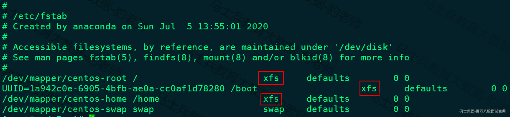

或者使用命令 df -Th :

*(⚠️ 图片缺失:源知识库原图已失效)*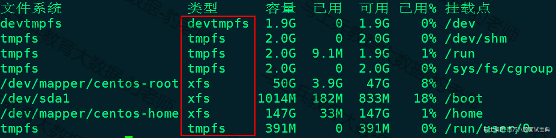

- **设置文件句柄数**

Linux操作系统中文件句柄数代表一个进程能同时维持多少个"文件"开着而不关闭，一个开着的"文件"就对应一个文件句柄。这里说的"文件"并非我们通常理解的文件，在Linux中一切IO都是"文件"，也就是说打开硬盘上的文件是一个"文件"，一个未关闭的TCP Socket 也是一个"文件"，甚至控制台输入/输出也是"文件"。

Linux系统中文件句柄数默认为1024，在生产环境系统中这些远远不够，所以我们需要将linux操作系统的打开文件句柄数调大一些。

- **时钟同步**

Doris 的元数据要求时间精度要小于5000ms，所以所有集群所有机器要进行时钟同步，避免因为时钟问题引发的元数据不一致导致服务出现异常。

- **关闭交换分区（swap** **）**

Linux交换分区会给Doris带来很严重的性能问题，需要在安装之前禁用交换分区。关闭Swap分区需要注释掉/etc/fstab文件中文件类型为swap的一行，然后重启该节点。

*(⚠️ 图片缺失:源知识库原图已失效)*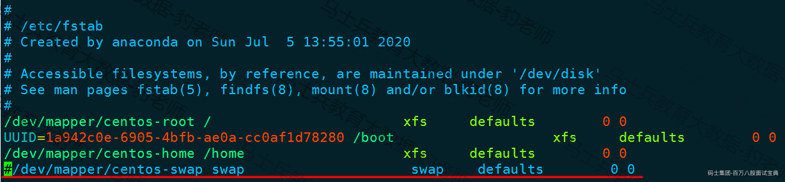

- **调大**vm.max\_map\_count**值**

在部署Apache Doris时，从1.2.0版本往后，需要在部署BE的节点上调大单个JVM进程的虚拟机内存区域数量值以支撑更多的线程，BE 启动脚本会通过/proc/sys/vm/max\_map\_count 检查数值是否大于200W，否则启动失败。默认这个值为65530，可以通过"sysctl -w vm.max\_map\_count=2000000"命令调大该参数，以上参数只是临时设置该值，当重启机器后会失效，永久设置可以在/etc/sysctl.conf文件中加入"vm.max\_map\_count=2000000"参数即可。

### 2.1.5网络需求

Doris 各个实例直接通过网络进行通讯。以下表格展示了所有需要的端口：

|  |  |  |  |  |
| --- | --- | --- | --- | --- |
| **实例名称** | **端口名称** | **默认端口** | **通讯方向** | **说明** |
| BE | be\_port | 9060 | FE-->BE | BE上thrift server的端口，用于接收来自FE的请求 |
| BE | webserver\_port | 8040 | BE<-->BE | BE上的http server的端口 |
| BE | heartbeat\_service\_port | 9050 | FE-->BE | BE上心跳服务端口（thrift），用于接收来自FE的心跳 |
| BE | brpc\_port | 8060 | FE<-->BE,BE<-->BE | BE上的brpc端口，用于BE之间的通讯 |
| FE | http\_port | 8030 | FE<-->FE,用户<-->FE | FE上的http server 端口 |
| FE | rpc\_port | 9020 | BE-->FE,FE<-->FE | FE上的thrift server 端口，每个fe的配置需要保持一致 |
| FE | query\_port | 9030 | 用户<-->FE | FE上的mysql server 端口 |
| FE | edit\_log\_port | 9010 | FE<-->FE | FE上的bdbje之间通信用的端口 |
| Broker | broker\_ipc\_port | 8000 | FE-->Broker,BE-->Borker | Broker上的thrift server,用于接收请求 |

当部署多个FE实例时，要保证FE的http\_port配置相同。

## 2.2Apache Doris 分布式部署

部署Apache Doris时需要分别部署FE、BE、Broker。然后再建立FE，BE两者关系。

Apache Doris 中部署多FE的思路为先在一台节点上配置部署一个FE并启动，相当于是启动Doris服务，然后配置更多的FE节点，添加到Doris服务中给该Doris的FE进行扩容，最终形成多节点FE。FE又分为 **Leader** 、 **Follwer** 和 **Observer** 三种角色，多节点FE中首先启动的FE节点自动为Leader，部署完成一个FE节点后，按照集群划分将其他Follower和Observer节点加入到FE中即可。

部署BE时我们也需要部署FE完成后，然后配置BE各个节点并启动，通过对应命令将多个BE节点添加到Apache Doris集群中即可，即创建了FE、BE两者关系。

Broker的部署是可选的，如果需要从第三方存储系统导入数据，需要部署相应的 Broker，默认提供了读取 HDFS 、对象存储的 fs\_broker。Borker以插件的形成独立于Doris集群，部署时也需部署完成FE和BE后，将各个Broker节点添加到 Doris集群中。

### 2.2.1Apache Doris下载

先前Apache Doris需要自己手动编译源码进行部署安装，现在Apache Doris官方提供了对应编译好的安装包，可以直接下载进行部署。Apache Doris 下载地址为:<https://doris.apache.org/zh-CN/download/。这里我们下载最新1.2.1版本。>

*(⚠️ 图片缺失:源知识库原图已失效)*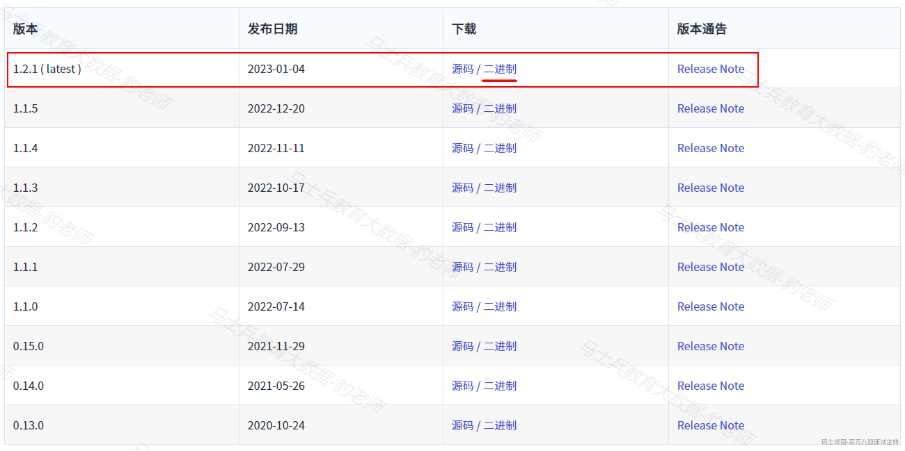

*(⚠️ 图片缺失:源知识库原图已失效)*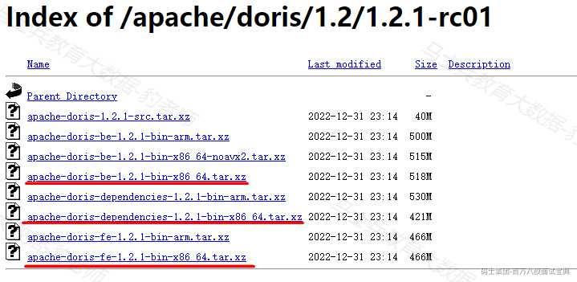

由于 Apache 服务器文件大小限制，1.2 版本的二进制程序被分为三个包：

```plain
apache-doris-fe-1.2.1-bin-x86_64.tar.xz
apache-doris-be-1.2.1-bin-x86_64.tar.xz
apache-doris-dependencies-1.2.1-bin-x86_64.tar.xz
```

其中新增的 apache-doris-dependencies 包含用于支持 JDBC 外表和 JAVA UDF 的jar包，以及 Broker 和 AuditLoader。下载后，需要将其中的 java-udf-jar-with-dependencies.jar 放到 be/lib 目录下。

### 2.2.2节点划分

根据Doris官方建议，部署Doris时FE和BE分开部署，这里我们部署Doris集群时部署3个Follower（Leader和Follow统称为Follower）、2个Observer、3个BE、5个Broker，共使用5台节点完成，每个节点的使用4core和4G内存，角色和节点分布如下：

|  |  |  |  |  |  |
| --- | --- | --- | --- | --- | --- |
| 节点IP | **节点名称** | **FE(Follower)** | **FE(Observer)** | **BE** | **Broker（可选）** |
| 192.168.179.4 | node1 | ★ |  |  | ★ |
| 192.168.179.5 | node2 | ★ |  |  | ★ |
| 192.168.179.6 | node3 | ★ |  | ★ | ★ |
| 192.168.179.7 | node4 |  | ★ | ★ | ★ |
| 192.168.179.8 | node5 |  | ★ | ★ | ★ |

### 2.2.3节点配置

首先在部署Doris各个节点上按照如下步骤进行设置。

1. **设置文件句柄数**

在node1~node5各个节点上配置/etc/security/limits.conf文件如下内容，设置系统最大打开文件句柄数：

```plain
# 打开limits.conf文件，vim /etc/security/limits.conf 
* soft nofile 65536
* hard nofile 65536
```

注意各个节点配置完成后，如果是ssh连接到各个节点需要重新打开新的ssh窗口生效或者重新启动机器生效。查看生效命令如下：

```plain
#查看可以打开最大文件描述符的数量，默认是1024
ulimit -n
```

2. **时间同步**

在node1~node5各节点上进行时间同步。首选在各个节点上修改本地时区及安装ntp服务：

```plain
yum -y install ntp
rm -rf /etc/localtime
ln -s /usr/share/zoneinfo/Asia/Shanghai /etc/localtime
/usr/sbin/ntpdate -u pool.ntp.org
```

然后设置定时任务自动同步时间，设置定时任务，每10分钟同步一次，配置/etc/crontab文件，实现自动执行任务。建议直接crontab -e 来写入定时任务。使用crontab -l 查看当前用户定时任务。

```plain
#各个节点执行 crontab -e 写入以下内容
*/10 * * * *  /usr/sbin/ntpdate -u pool.ntp.org >/dev/null 2>&1

#重启定时任务   
service crond restart

#查看日期
date
```

3. **关闭** Swap **分区**

在node1~node5各个节点上关闭Swap分区。各个节点上修改/etc/fstab文件，注释掉带有swap的行。如下：

```plain
#注释掉swap 行 ，vim /etc/fstab
...
#/dev/mapper/centos-swap swap swap    defaults        0 0
...
```

以上配置完成后，需要重启机器生效，如果不想重启机器可以在各个节点上执行"swapoff -a"临时关闭swap分区。执行后，可以通过"free -m"命令查看swap是否已经关闭。

*(⚠️ 图片缺失:源知识库原图已失效)*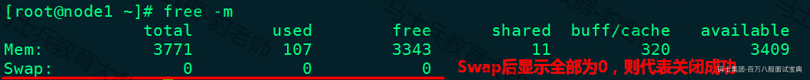

4. **调大单个进程的虚拟内存区域数量**

BE 启动脚本会通过 /proc/sys/vm/max\_map\_count 检查数值是否大于200W，否则启动失败。只需要在部署BE的节点上设置"sysctl -w vm.max\_map\_count=2000000"调大即可，这里在node1~node5节点上都做设置。

```plain
#限制单个进程的虚拟内存区域数量(临时设置)
sysctl -w vm.max_map_count=2000000
```

以上是临时设置，当节点重启后会失效，可以在/etc/sysctl.conf中加入vm.max\_map\_count=2000000做永久设置。在node1~node5节点上配置/etc/sysctl.conf进行永久设置：

```plain
#vim /etc/sysctl.conf （追加参数，永久设置）
...
vm.max_map_count=2000000
...
```

设置成功后，重启机器，可以通过cat /proc/sys/vm/max\_map\_count 命令检查此值为200W。

### 2.2.4FE部署及启动

下面我们首先在node1节点上部署Doris FE，然后再对Doris进行FE扩容，最终形成3台节点的FE。

1. **创建**doris **部署目录**

在node1~node5节点上创建"/software/doris-1.2.1"方便后续操作。

```plain
#各个节点创建目录/software/doris-1.2.1
mkdir -p /software/doris-1.2.1
```

2. **上传安装包并解压**

在node1节点上传"apache-doris-fe-1.2.1-bin-x86\_64.tar.xz"安装包到doris-1.2.1目录并解压。

```plain
#在node1节点上进行解压
[root@node1 ~]# tar -xvf /software/doris-1.2.1/apache-doris-fe-1.2.1-bin-x86_64.tar.xz 

#node1节点上对解压的文件进行改名
[root@node1 ~]# cd /software/doris-1.2.1/&&mv apache-doris-fe-1.2.1-bin-x86_64 apache-doris-fe
```

3. **修改** fe.conf **配置文件**

在node1节点上修改/software/doris-1.2.1/apache-doris-fe/conf/fe.conf配置文件，这里我们主要修改两个参数：priority\_networks 及 meta\_dir。

- **priority****\_****networks:** 指定FE唯一的IP地址，必须配置，尤其当节点有多个网卡时要配置正确。

- **meta****\_****dir:** 元数据目录，可以不配置，默认是Doris FE安装目录下的doris-meta目录，如果指定其他目录需要提前创建好目录。在生成环境中建议目录放在单独的磁盘上。

```plain
# vim /software/doris-1.2.1/apache-doris-fe/conf/fe.conf
...
meta_dir = /software/doris-1.2.1/apache-doris-fe/doris-meta
priority_networks = 192.168.179.4/24 #注意不同节点IP配置不同
...
```

4. **启动**FE

在node1节点FE安装目录下执行如下命令，完成FE的启动。

```plain
#启动FE 
[root@node1 ~]# cd /software/doris-1.2.1/apache-doris-fe/bin
[root@node1 ~]# ./start_fe.sh --daemon
```

FE进程启动进入后台执行，日志默认存放在 FE解压目录log/ 下。如启动失败，可以通过查看 log/fe.log 或者 log/fe.out 查看错误信息。

5. **访问** **FE**

启动Doris FE后，我们可以通过Doris FE 提供的Web UI 来检查是否启动成功，在浏览器中输入：<http://node1:8030，看到如下页面代表FE启动成功。用户名为root，密码为空。登录FE后可以查看frontends来查看FOLLOWER信息：>

*(⚠️ 图片缺失:源知识库原图已失效)*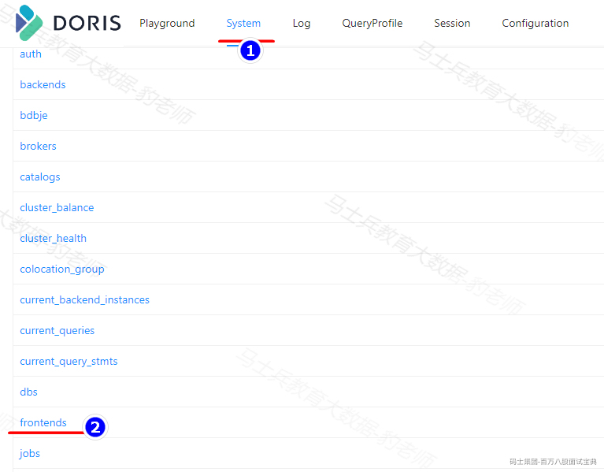

*(⚠️ 图片缺失:源知识库原图已失效)*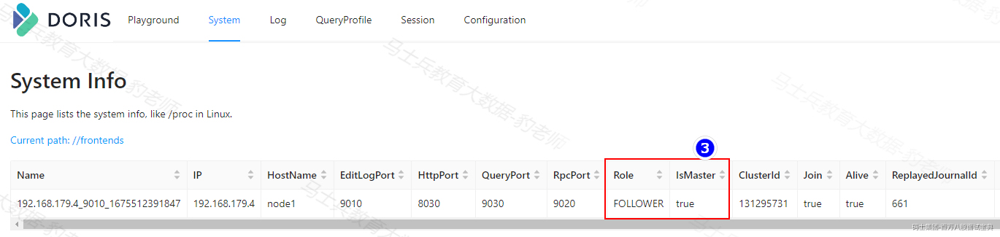

通过以上可以看到在node1上启动的Follower成为Leader。

6. **停止** FE

如果想要停止FE，可以指定如下命令，这里不再进行演示。

```plain
#进入/software/doris-1.2.1/apache-doris-fe/bin目录，执行如下命令：
./stop_fe.sh
```

### 2.2.5FE 扩缩容

FE扩缩容包括FE中Follower的扩缩容和FE中Observer的扩缩容，根据节点划分，这里配置3台Follower(node1~node3)和2台Observer（node4、node5）。

#### 2.2.5.1通过MySQL客户端连接Doris

Doris 采用 MySQL 协议进行通信，用户可通过 MySQL client 或者 MySQL JDBC连接到 Doris 集群。选择 MySQL client 版本时建议采用5.1 之后的版本，因为 5.1 之前不能支持长度超过 16 个字符的用户名。

给FE进行扩容同样需要通过MySQL客户端来连接Doris FE ，可以在node1节点上下载免安装的MySQL，命令如下：

```plain
[root@node1 ~]# cd /software/
[root@node1 ~]# wget https://cdn.mysql.com//archives/mysql-5.7/mysql-5.7.22-linux-glibc2.12-x86_64.tar.gz
```

也可以在资料中获取"mysql-5.7.22-linux-glibc2.12-x86\_64.tar.gz"文件。

下载完成免安装mysql后,进行解压，在bin/目录下可以找打mysql命令行工具，然后执行命令连接Doris即可，具体操作如下：

```plain
#解压 mysql-5.7.22-linux-glibc2.12-x86_64.tar.gz
[root@node1 software]# tar -zxvf ./mysql-5.7.22-linux-glibc2.12-x86_64.tar.gz 

#修改名称
[root@node1 software]# mv mysql-5.7.22-linux-glibc2.12-x86_64 mysql-5.7.22-client

#连接Doris
[root@node1 bin]# ./mysql -u root -P9030 -h127.0.0.1
```

注意：

1. 连接Doris使用的 root 用户是 doris 内置的默认用户，也是超级管理员用户。关于用户权限设置可以参照官网：<https://doris.apache.org/zh-CN/docs/dev/admin-manual/privilege-ldap/user-privilege/>

2. -P 是连接 Doris 的查询端口，默认端口是 9030，对应的是fe.conf里的 query\_port。

3. -h 是我们连接的 FE IP地址，如果你的客户端和 FE 安装在同一个节点可以使用127.0.0.1，这种也是 Doris 提供的如果你忘记 root 密码，可以通过这种方式不需要密码直接连接登录，进行对 root 密码进行重置。

- **给** root **用户设置密码，操作如下：**

```plain
#给当前登录的root用户设置密码为123456
mysql> set password = password('123456');
```

通过以上设置密码后，再次访问<http://node1:8030时，密码需要指定成设置的密码，否则登录不上。>

- **查看**Doris FE**运行状态：**

```plain
mysql> show frontends\G
*************************** 1. row ***************************
             Name: 192.168.179.4_9010_1675512391847
               IP: 192.168.179.4
      EditLogPort: 9010
         HttpPort: 8030
        QueryPort: 9030
          RpcPort: 9020
             Role: FOLLOWER
         IsMaster: true
        ClusterId: 131295731
             Join: true
            Alive: true
ReplayedJournalId: 1228
    LastHeartbeat: 2023-02-04 21:21:23
         IsHelper: true
           ErrMsg: 
          Version: doris-1.2.1-rc01-Unknown
 CurrentConnected: Yes
1 row in set (0.02 sec)
```

注意：如果 IsMaster、Join 和 Alive 三列均为true，则表示节点正常。

#### 2.2.5.2FE Follower扩缩容

可以通过将Apache Doris FE扩容至3个以上节点来实现FE的高可用，FE节点的扩容和缩容过程中不影响当前系统的运行。根据前面集群的规划要在node1~node3节点上搭建Apache Doris FE,目前在node1搭建好了FE并启动，该启动的FE自动成为Leader，下面在node2和node3节点配置FE后加入到Apache Doris 集群中，给Doris集群扩容，详细步骤如下：

1. **准备** FE 安装包

将node1节点上配置好的FE安装包发送到node2,node3节点上

```plain
[root@node1 ~]# cd /software/doris-1.2.1/
[root@node1 doris-1.2.1]# scp -r ./apache-doris-fe/ node2:/software/doris-1.2.1/
[root@node1 doris-1.2.1]# scp -r ./apache-doris-fe/ node3:/software/doris-1.2.1/
```

发送完成后，在node2、node3节点将"apache-doris-fe/doris-meta/"元数据清空或者重新创建该目录，否则后续启动Follower FE有问题，操作如下：

```plain
#node2节点
[root@node2 ~]# rm -rf /software/doris-1.2.1/apache-doris-fe/doris-meta/*

#node3节点
[root@node3 ~]# rm -rf /software/doris-1.2.1/apache-doris-fe/doris-meta/*
```

2. **在** node2 **、** node3 **上修改** fe.conf **配置文件**

这里node2，node3 节点FE配置同node1配置，两台节点中只需要配置/software/doris-1.2.1/apache-doris-fe/conf/fe.conf配置文件中priority\_networks 参数为当前节点的ip即可。

```plain
# vim /software/doris-1.2.1/apache-doris-fe/conf/fe.conf
...
priority_networks = 192.168.179.5/24 #node2节点
...
...
priority_networks = 192.168.179.6/24 #node3节点
...
```

3. **在** node2 **、** node3 **上启动** FE

node2、node3节点配置FE完成后，由于是Follower角色，已经存在node1为Leader，所以第一次启动时需要执行如下命令，指定Leader所在节点IP和端口，端口为在fe.conf中edit\_log\_port配置项，默认为9010。

```plain
#node2节点启动FE
[root@node2 ~]# cd /software/doris-1.2.1/apache-doris-fe/bin/
[root@node2 bin]# ./start_fe.sh --helper node1:9010 --daemon

#node3节点启动FE
[root@node3 ~]# cd /software/doris-1.2.1/apache-doris-fe/bin/
[root@node3 bin]# ./start_fe.sh --helper node1:9010 --daemon
```

**注意:** --helper **参数仅在** **follower****和** **observer** **第一次启动时** **才需要。**

4. **添加** FE Follower 到 **Doris** 集群

在node1中进入mysql客户端，连接到Doris集群，执行如下命令，将node2，node3启动的FE加入到集群中。

```plain
#在node1中通过mysql连接doris集群
[root@node1 bin]# ./mysql -u root -P9030 -h127.0.0.1

#执行命令，将FE Follower加入到Doris集群中
mysql> ALTER SYSTEM ADD FOLLOWER "node2:9010";
Query OK, 0 rows affected (0.05 sec)

mysql> ALTER SYSTEM ADD FOLLOWER "node3:9010";
Query OK, 0 rows affected (0.02 sec)
```

添加完成之后可以访问node1~node3任何一台节点的8030端口登录WebUI,查看对应的FE信息，这里登录<http://node1:8030查看FE信息：>

*(⚠️ 图片缺失:源知识库原图已失效)*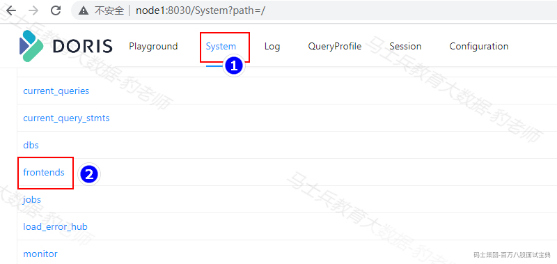

*(⚠️ 图片缺失:源知识库原图已失效)*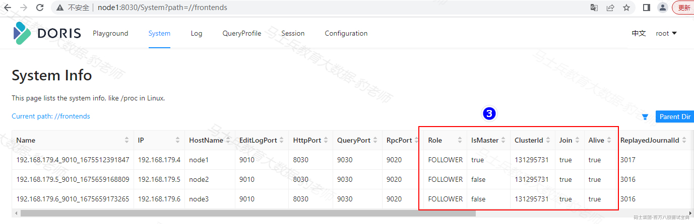

也可以通过SQL "show frontends\G"命令来查询集群信息，当加入了更多的FE后，我们可以在node1 mysql 客户端连接到node1~node3的任何一台节点来编写SQL。

```plain
#连接node3 FE 编写SQL
[root@node1 bin]# ./mysql -uroot -P9030 -h192.168.179.6 -p123456
mysql> show frontends\G;
*************************** 1. row ***************************
             Name: 192.168.179.4_9010_1675512391847
               IP: 192.168.179.4
      EditLogPort: 9010
         HttpPort: 8030
        QueryPort: 9030
          RpcPort: 9020
             Role: FOLLOWER
         IsMaster: true
        ClusterId: 131295731
             Join: true
            Alive: true
ReplayedJournalId: 3038
    LastHeartbeat: 2023-02-06 12:57:40
         IsHelper: true
           ErrMsg: 
          Version: doris-1.2.1-rc01-Unknown
 CurrentConnected: Yes
*************************** 2. row ***************************
             Name: 192.168.179.5_9010_1675659168809
               IP: 192.168.179.5
      EditLogPort: 9010
         HttpPort: 8030
        QueryPort: 9030
          RpcPort: 9020
             Role: FOLLOWER
         IsMaster: false
        ClusterId: 131295731
             Join: true
            Alive: true
ReplayedJournalId: 3037
    LastHeartbeat: 2023-02-06 12:57:40
         IsHelper: true
           ErrMsg: 
          Version: doris-1.2.1-rc01-Unknown
 CurrentConnected: No
*************************** 3. row ***************************
             Name: 192.168.179.6_9010_1675659173265
               IP: 192.168.179.6
      EditLogPort: 9010
         HttpPort: 8030
        QueryPort: 9030
          RpcPort: 9020
             Role: FOLLOWER
         IsMaster: false
        ClusterId: 131295731
             Join: true
            Alive: true
ReplayedJournalId: 3037
    LastHeartbeat: 2023-02-06 12:57:40
         IsHelper: true
           ErrMsg: 
          Version: doris-1.2.1-rc01-Unknown
 CurrentConnected: No
3 rows in set (0.05 sec)

ERROR: 
No query specified
```

至此，Apache Doris集群中已经完成3台FE Follower的部署（node1~node3）。

对FE Follower扩容完成后，也可以通过以下命令来进行FE Follower缩容，删除FE Follower节点，需要保证最终剩余的Follower（包括Leader）节点为奇数，这里不再演示FE缩容。如果重新将下线的Follower添加到集群中，要记得清空元数据目录下的文件。

```plain
#对FE进行缩容命令
ALTER SYSTEM DROP FOLLOWER "fe_host:edit_log_port";
```

#### 2.2.5.3FE Observer 扩缩容

Observer的扩缩容也是基于已有一台FE Leader的前提下进行，这里node1为FE Leader，我们将要在node4，node5节点上配置Observer，Observer配置流程与FE Follower的扩缩容大体一致，步骤如下：

1. **准备** FE 安装包

将node1节点上配置好的FE安装包发送到node4,node5节点上

```plain
[root@node1 ~]# cd /software/doris-1.2.1/
[root@node1 doris-1.2.1]# scp -r ./apache-doris-fe/ node4:/software/doris-1.2.1/
[root@node1 doris-1.2.1]# scp -r ./apache-doris-fe/ node5:/software/doris-1.2.1/
```

发送完成后，在node4、node5节点将"apache-doris-fe/doris-meta/"元数据清空或者重新创建该目录，否则后续启动Follower FE有问题，操作如下：

```plain
#node4节点清空doris-meta目录
[root@node4 ~]# rm -rf /software/doris-1.2.1/apache-doris-fe/doris-meta/*

#node5节点清空doris-meta目录
[root@node5 ~]# rm -rf /software/doris-1.2.1/apache-doris-fe/doris-meta/*
```

2. **在** node4 **、** node5 **上修改** fe.conf **配置文件**

这里node4，node5 节点FE配置同node1配置，两台节点中只需要配置/software/doris-1.2.1/apache-doris-fe/conf/fe.conf配置文件中priority\_networks 参数为当前节点的ip即可。

```plain
# vim /software/doris-1.2.1/apache-doris-fe/conf/fe.conf
...
priority_networks = 192.168.179.7/24 #node4节点
...
...
priority_networks = 192.168.179.8/24 #node5节点
...
```

3. **在** node4 **、** node5 **上启动** FE

node4、node5节点配置FE完成后，由于是Observer角色，已经存在node1为FE Leader，与添加Follower一样，第一次启动时需要执行如下命令，指定Leader所在节点IP和端口，端口为在fe.conf中edit\_log\_port配置项，默认为9010。

```plain
#node4节点启动FE
[root@node4 ~]# cd /software/doris-1.2.1/apache-doris-fe/bin/
[root@node4 bin]# ./start_fe.sh --helper node1:9010 --daemon

#node5节点启动FE
[root@node5 ~]# cd /software/doris-1.2.1/apache-doris-fe/bin/
[root@node5 bin]# ./start_fe.sh --helper node1:9010 --daemon
```

**注意：** --helper 参数仅在 **follower****和** observer **第一次启动时才需要。**

4. **添加** FE Observer **到** Doris **集群**

在node1中进入mysql客户端，连接到Doris集群，执行如下命令，将node4，node5启动的FE加入到集群中。

```plain
#在node1中通过mysql连接doris集群
[root@node1 bin]# ./mysql -u root -P9030 -h127.0.0.1

#执行命令，将FE Observer加入到Doris集群中
mysql> ALTER SYSTEM ADD OBSERVER "node4:9010";
Query OK, 0 rows affected (0.05 sec)

mysql> ALTER SYSTEM ADD OBSERVER "node5:9010";
Query OK, 0 rows affected (0.02 sec)
```

注意：以上添加OBSERVER 操作与添加FOLLOWER操作命令类似，只是添加的角色不同：ALTER SYSTEM ADD **FOLLOWER[OBSERVER]**"fe\_host:edit\_log\_port"。

添加完成之后可以访问 **node1~node5** 任何一台节点的8030端口登录WebUI,查看对应的FE信息，这里登录<http://node1:8030查看FE信息：>

*(⚠️ 图片缺失:源知识库原图已失效)*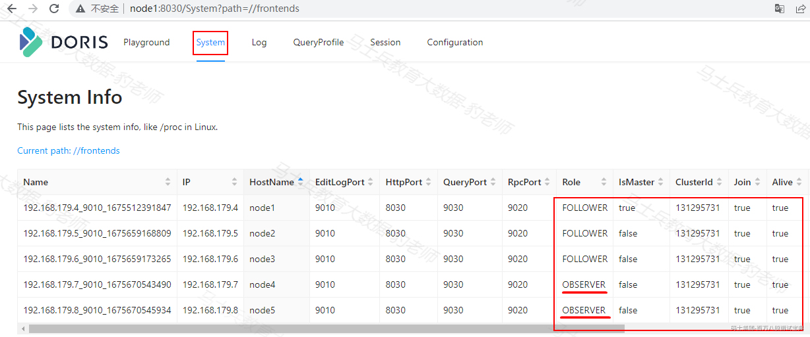

也可以通过SQL "show frontends\G"命令来查询集群信息，当加入了更多的FE后，我们可以在node1 mysql 客户端连接到node1~node5的任何一台节点来编写SQL。

```plain
#连接node5 FE 编写SQL
[root@node1 bin]# ./mysql -uroot -P9030 -h192.168.179.8 -p123456
mysql> show frontends\G;
*************************** 1. row ***************************
             Name: 192.168.179.8_9010_1675670545934
               IP: 192.168.179.8
      EditLogPort: 9010
         HttpPort: 8030
        QueryPort: 9030
          RpcPort: 9020
             Role: OBSERVER
         IsMaster: false
        ClusterId: 131295731
             Join: true
            Alive: true
ReplayedJournalId: 6430
    LastHeartbeat: 2023-02-06 16:06:13
         IsHelper: false
           ErrMsg: 
          Version: doris-1.2.1-rc01-Unknown
 CurrentConnected: Yes
*************************** 2. row ***************************
             Name: 192.168.179.4_9010_1675512391847
               IP: 192.168.179.4
      EditLogPort: 9010
         HttpPort: 8030
        QueryPort: 9030
          RpcPort: 9020
             Role: FOLLOWER
         IsMaster: true
        ClusterId: 131295731
             Join: true
            Alive: true
ReplayedJournalId: 6431
    LastHeartbeat: 2023-02-06 16:06:13
         IsHelper: true
           ErrMsg: 
          Version: doris-1.2.1-rc01-Unknown
 CurrentConnected: No
*************************** 3. row ***************************
             Name: 192.168.179.5_9010_1675659168809
               IP: 192.168.179.5
      EditLogPort: 9010
         HttpPort: 8030
        QueryPort: 9030
          RpcPort: 9020
             Role: FOLLOWER
         IsMaster: false
        ClusterId: 131295731
             Join: true
            Alive: true
ReplayedJournalId: 6430
    LastHeartbeat: 2023-02-06 16:06:13
         IsHelper: true
           ErrMsg: 
          Version: doris-1.2.1-rc01-Unknown
 CurrentConnected: No
*************************** 4. row ***************************
             Name: 192.168.179.6_9010_1675659173265
               IP: 192.168.179.6
      EditLogPort: 9010
         HttpPort: 8030
        QueryPort: 9030
          RpcPort: 9020
             Role: FOLLOWER
         IsMaster: false
        ClusterId: 131295731
             Join: true
            Alive: true
ReplayedJournalId: 6430
    LastHeartbeat: 2023-02-06 16:06:13
         IsHelper: true
           ErrMsg: 
          Version: doris-1.2.1-rc01-Unknown
 CurrentConnected: No
*************************** 5. row ***************************
             Name: 192.168.179.7_9010_1675670543490
               IP: 192.168.179.7
      EditLogPort: 9010
         HttpPort: 8030
        QueryPort: 9030
          RpcPort: 9020
             Role: OBSERVER
         IsMaster: false
        ClusterId: 131295731
             Join: true
            Alive: true
ReplayedJournalId: 6430
    LastHeartbeat: 2023-02-06 16:06:13
         IsHelper: false
           ErrMsg: 
          Version: doris-1.2.1-rc01-Unknown
 CurrentConnected: No
5 rows in set (0.10 sec)
```

至此，Apache Doris集群中已经完成3台FE Follower的部署（node1~node3）、2台Observer的部署（node4、node5）。

对FE Observer扩容完成后，也可以通过以下命令来进行FE Observer缩容，删除FE Observer节点。操作如下：

```plain
#将node4、node5 FE Observer进行缩容命令
mysql> ALTER SYSTEM DROP OBSERVER "node4:9010";
mysql> ALTER SYSTEM DROP OBSERVER "node5:9010";
```

对Observer进行缩容后，再次将对应节点node4、node5加入到Doris FE中就可以按照扩容操作实现。这里只需要将node4、node5节点上"/software/doris-1.2.1/apache-doris-fe/doris-meta"元数据目录清空，启动node4、node5对应的FE进程，然后执行添加命令即可：

```plain
#node4节点启动FE
[root@node4 ~]# cd /software/doris-1.2.1/apache-doris-fe/bin/
[root@node4 bin]# ./start_fe.sh --helper node1:9010 --daemon

#node5节点启动FE
[root@node5 ~]# cd /software/doris-1.2.1/apache-doris-fe/bin/
[root@node5 bin]# ./start_fe.sh --helper node1:9010 --daemon

#将node4、node5 FE OBserver 再次加入到Doris集群命令
mysql> ALTER SYSTEM ADD OBSERVER "node4:9010";
mysql> ALTER SYSTEM ADD OBSERVER "node5:9010";
```

#### 2.2.5.4FE扩缩容注意点

FE 进行扩缩容时需要注意以下几点：

- Follower FE（包括 Leader）的数量必须为奇数，建议最多部署 3 个组成高可用（HA）模式即可。

- 当 FE 处于高可用部署时（1个 Leader，2个 Follower），我们建议通过增加 Observer FE 来扩展 FE 的读服务能力。当然也可以继续增加 Follower FE，但几乎是不必要的。

- 通常一个 FE 节点可以应对 10-20 台 BE 节点。建议总的 FE 节点数量在 10 个以下。而通常3个即可满足绝大部分需求。

- 添加FE 时需要将对应安装包中doris-meta目录清空。

- helper 不能指向 FE 自身，必须指向一个或多个已存在并且正常运行中的 Master/Follower FE。

- 删除 Follower FE 时，确保最终剩余的 Follower（包括 Leader）节点为奇数。

### 2.2.6BE部署及启动

本集群中我们在node3、node4、node5上配置并启动BE，下面我们首先在node3节点上部署Doris BE，然后将配置好的BE安装包分发到其他节点进行配置启动，最终形成3台节点的BE。

1. **上传安装包并解压**

在node3节点上传"apache-doris-be-1.2.1-bin-x86\_64.tar.xz"安装包到doris-1.2.1目录并解压，解压过程时间稍长一些。

```plain
#在node3节点上进行解压，解压过程时间稍长
[root@node3 ~]# tar -xvf /software/doris-1.2.1/apache-doris-be-1.2.1-bin-x86_64.tar.xz

#node3节点上对解压的文件进行改名
[root@node3 ~]# cd /software/doris-1.2.1/&&mv apache-doris-be-1.2.1-bin-x86_64 apache-doris-be
```

2. **修改**be.conf **配置文件**

在node3节点上修改/software/doris-1.2.1/apache-doris-be/conf/be.conf配置文件，这里我们主要修改两个参数：priority\_networks 及 storage\_root\_path。

- **priority****\_****networks:** 指定BE唯一的IP地址，必须配置，尤其当节点有多个网卡时要配置正确。

- **storage****\_****root****\_****path:** 配置BE数据存储目录。默认目录在BE安装目录的storage目录下，如果指定其他目录需要提前创建好目录，可以用逗号分开指定多个路径，也可以在路径后加入.HDD/.SSD指定数据存储磁盘类型。

```plain
# vim /software/doris-1.2.1/apache-doris-be/conf/be.conf
...
priority_networks = 192.168.179.6/24 #注意不同节点IP配置不同
storage_root_path = /software/doris-1.2.1/apache-doris-be/storage
...
```

3. **上传**apache-doris-java-udf 对应 **jar**

将资料中的"apache-doris-dependencies-1.2.1-bin-x86\_64.tar.xz"进行解压，将其中"java-udf-jar-with-dependencies.jar"，将此jar包放入"/software/doris-1.2.1/apache-doris-be/lib"下，该jar包用于支持 1.2.0 版本中的 JDBC 外表和 JAVA UDF 。

4. **启动**BE

在node3节点BE安装目录下执行如下命令，完成BE的启动。

```plain
#启动BE 
[root@node3 ~]# cd /software/doris-1.2.1/apache-doris-be/bin
[root@node3 ~]# ./start_be.sh --daemon
```

BE进程启动进入后台执行，日志默认存放在 BE解压目录log/ 下。如启动失败，可以通过查看 log/be.log 或者 log/be.out 查看错误信息。

5. **将** node3 BE **安装包发送其他** BE **节点**

将node3 BE安装目录"/software/doris-1.2.1/apache-doris-be"发送到node4、node5节点，操作如下：

```plain
#将BE安装包发送到node4
[root@node3 doris-1.2.1]# scp -r /software/doris-1.2.1/apache-doris-be/ node4:/software/doris-1.2.1/

#将BE安装包发送到node5
[root@node3 doris-1.2.1]# scp -r /software/doris-1.2.1/apache-doris-be/ node5:/software/doris-1.2.1/
```

6. **配置其他** BE **节点**

这里在node4、node5节点只需要配置"/software/doris-1.2.1/apache-doris-be/conf/be.conf"中的priority\_networks为对应的节点IP即可。

```plain
# node4节点配置be.conf如下
...
priority_networks = 192.168.179.7/24 #注意不同节点IP配置不同
...

# node5节点配置be.conf如下
...
priority_networks = 192.168.179.8/24 #注意不同节点IP配置不同
...
```

7. **启动其他** BE **节点**

在node4、node5节点上启动BE：

```plain
#node4启动BE 
[root@node4 ~]# cd /software/doris-1.2.1/apache-doris-be/bin
[root@node4 ~]# ./start_be.sh --daemon

#node5启动BE 
[root@node5 ~]# cd /software/doris-1.2.1/apache-doris-be/bin
[root@node5 ~]# ./start_be.sh --daemon
```

注意启动BE后，jps看不到对应的进程（C++编写），可以通过"ps aux|grep be"命令来查看对应的BE进程。

如果想要停止FE，可以指定如下命令，这里不再进行演示。

```plain
#进入/software/doris-1.2.1/apache-doris-be/bin目录，执行如下命令：
./stop_be.sh
```

### 2.2.7BE扩缩容

BE启动之后，与之前部署的FE没有任何关系，现在将在node3~node5上启动的BE连接到FE中组成完成的Apache Doris集群，将BE连接到FE集群中就是BE的扩容，将BE节点从Doris FE集群中去除就是BE的缩容。

BE 节点的扩容和缩容过程，不影响当前系统运行以及正在执行的任务，并且不会影响当前系统的性能。数据均衡会自动进行。根据集群现有数据量的大小，集群会在几个小时到1天不等的时间内，恢复到负载均衡的状态。

#### 2.2.7.1BE扩容（创建BE与FE关系）

将启动的BE节点加入到已有的FE 集群中，命令如下：

```plain
#在node1节点通过mysql连接Doris集群
[root@node1 ~]# cd /software/mysql-5.7.22-client/bin/
[root@node1 bin]# ./mysql -uroot -P9030 -h192.168.179.4 -p123456

#将BE节点加入到Doris集群中
mysql> ALTER SYSTEM ADD BACKEND "node3:9050";
Query OK, 0 rows affected (0.05 sec)

mysql> ALTER SYSTEM ADD BACKEND "node4:9050";
Query OK, 0 rows affected (0.02 sec)

mysql> ALTER SYSTEM ADD BACKEND "node5:9050";
Query OK, 0 rows affected (0.01 sec)
```

加入完成之后，可以执行"SHOW BACKENDS\G"命令来查看BE节点：

```plain
mysql> show backends\G;
*************************** 1. row ***************************
              BackendId: 11001
                Cluster: default_cluster
                     IP: 192.168.179.6
          HeartbeatPort: 9050
                 BePort: 9060
               HttpPort: 8040
               BrpcPort: 8060
          LastStartTime: 2023-02-06 20:03:34
          LastHeartbeat: 2023-02-06 20:23:44
                  Alive: true
   SystemDecommissioned: false
  ClusterDecommissioned: false
              TabletNum: 0
       DataUsedCapacity: 0.000 
          AvailCapacity: 40.766 GB
          TotalCapacity: 49.976 GB
                UsedPct: 18.43 %
         MaxDiskUsedPct: 18.43 %
     RemoteUsedCapacity: 0.000 
                    Tag: {"location" : "default"}
                 ErrMsg: 
                Version: doris-1.2.1-rc01-Unknown
                 Status: {"lastSuccessReportTabletsTime":"2023-02-06 20:22:52","lastStreamLoadTime":-1,"isQueryDisabled":false,"isLoadDisabled":f
alse}HeartbeatFailureCounter: 0
               NodeRole: mix
*************************** 2. row ***************************
              BackendId: 11002
                Cluster: default_cluster
                     IP: 192.168.179.7
          HeartbeatPort: 9050
                 BePort: 9060
               HttpPort: 8040
               BrpcPort: 8060
          LastStartTime: 2023-02-06 20:14:35
          LastHeartbeat: 2023-02-06 20:23:44
                  Alive: true
   SystemDecommissioned: false
  ClusterDecommissioned: false
              TabletNum: 0
       DataUsedCapacity: 0.000 
          AvailCapacity: 39.699 GB
          TotalCapacity: 49.976 GB
                UsedPct: 20.56 %
         MaxDiskUsedPct: 20.56 %
     RemoteUsedCapacity: 0.000 
                    Tag: {"location" : "default"}
                 ErrMsg: 
                Version: doris-1.2.1-rc01-Unknown
                 Status: {"lastSuccessReportTabletsTime":"2023-02-06 20:23:03","lastStreamLoadTime":-1,"isQueryDisabled":false,"isLoadDisabled":f
alse}HeartbeatFailureCounter: 0
               NodeRole: mix
*************************** 3. row ***************************
              BackendId: 11003
                Cluster: default_cluster
                     IP: 192.168.179.8
          HeartbeatPort: 9050
                 BePort: 9060
               HttpPort: 8040
               BrpcPort: 8060
          LastStartTime: 2023-02-06 20:14:36
          LastHeartbeat: 2023-02-06 20:23:44
                  Alive: true
   SystemDecommissioned: false
  ClusterDecommissioned: false
              TabletNum: 0
       DataUsedCapacity: 0.000 
          AvailCapacity: 39.938 GB
          TotalCapacity: 49.976 GB
                UsedPct: 20.08 %
         MaxDiskUsedPct: 20.08 %
     RemoteUsedCapacity: 0.000 
                    Tag: {"location" : "default"}
                 ErrMsg: 
                Version: doris-1.2.1-rc01-Unknown
                 Status: {"lastSuccessReportTabletsTime":"2023-02-06 20:23:08","lastStreamLoadTime":-1,"isQueryDisabled":false,"isLoadDisabled":f
alse}HeartbeatFailureCounter: 0
               NodeRole: mix
3 rows in set (0.01 sec)
```

注意：以上Active:true表示BE节点运行正常。至此，Apache Doris集群中已经完成3台FE Follower的部署（node1~node3）、2台Observer的部署（node4、node5）、3台BE 部署。

除了SQL命令外也可以通过node1~node5任意节点的<http://ip:8030来查看对应的BE信息：>

*(⚠️ 图片缺失:源知识库原图已失效)*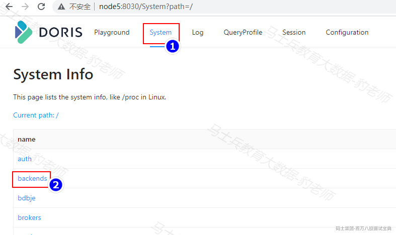

*(⚠️ 图片缺失:源知识库原图已失效)*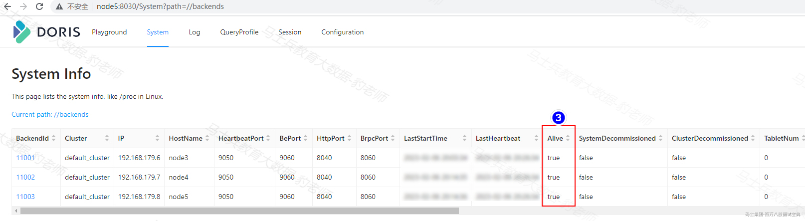

#### 2.2.7.2BE缩容

BE缩容就是在Doris集群中将BE节点删除，删除BE节点有两种方式：DROP和DECOMMISSION。

- **DROP:**

DROP 语句如下：

```plain
ALTER SYSTEM DROP BACKEND "be_host:be_heartbeat_service_port";
```

注意：DROP BACKEND 会直接删除该 BE，并且其上的数据将不能再恢复！！！所以我们强烈不推荐使用 DROP BACKEND 这种方式删除 BE 节点。当你使用这个语句时，会有对应的防误操作提示。

- **DECONMMISSION:**

DECOMMISSION 语句如下：

```plain
ALTER SYSTEM DECOMMISSION BACKEND "be_host:be_heartbeat_service_port";
```

关于DECONMMISSION命令说明如下：

- 该命令用于安全删除 BE 节点。命令下发后，Doris 会尝试将该 BE 上的数据向其他 BE 节点迁移，当所有数据都迁移完成后，Doris 会自动删除该节点。

- 该命令是一个异步操作。执行后，可以通过 SHOW PROC '/backends'; 看到该 BE 节点的 SystemDecommissioned 状态为 true。表示该节点正在进行下线。

- 该命令不一定执行成功。比如剩余 BE 存储空间不足以容纳下线 BE 上的数据，或者剩余机器数量不满足最小副本数时，该命令都无法完成，并且 BE 会一直处于 SystemDecommissioned 为 true 的状态。

- DECOMMISSION 的进度，可以通过 SHOW PROC '/backends'; 中的 TabletNum 查看，如果正在进行，TabletNum 将不断减少。

- 该操作可以通过:CANCEL DECOMMISSION BACKEND "be\_host:be\_heartbeat\_service\_port";命令取消。取消后，该 BE 上的数据将维持当前剩余的数据量。后续 Doris 重新进行负载均衡。

下面我们使用DECOMMISSION命令对node5 BE 角色进行下线，具体操作命令如下：

```plain
mysql> ALTER SYSTEM DECOMMISSION BACKEND "node5:9050";
Query OK, 0 rows affected (0.01 sec)
```

node5 BE 下线之后，还可以通过BE扩容命令重新将该节点添加回来，命令如下：

```plain
mysql> ALTER SYSTEM ADD BACKEND "node5:9050";
Query OK, 0 rows affected (0.01 sec)
```

#### 2.2.7.3BE扩缩容注意问题

1. BE 扩容后，Doris 会自动根据负载情况，进行数据均衡，期间不影响使用。

2. 对BE进行缩容时建议使用DECOMMISSION 命令操作

3. BE缩容不一定执行成功，例如：剩余 BE 存储空间不足以容纳下线 BE 上的数据，或者剩余机器数量不满足最小副本数时，该命令都无法完成

4. 可以通过CANCEL DECOMMISSION BACKEND "be\_host:be\_heartbeat\_service\_port" 命令取消缩容。

### 2.2.8Broker部署(可选)

Broker 是 Doris 集群中一种可选进程，主要用于支持 Doris 读写远端存储上的文件和目录。建议每一个 FE 和 BE 节点都部署一个 Broker。

Broker 通过提供一个 RPC 服务端口来提供服务，是一个无状态的 Java 进程，负责为远端存储的读写操作封装一些操作，如 open，pread，pwrite 等等。除此之外，Broker 不记录任何其他信息，所以包括远端存储的连接信息、文件信息、权限信息等等，都需要通过参数在 RPC 调用中传递给 Broker 进程，才能使得 Broker 能够正确读写文件。

Broker 仅作为一个数据通路，并不参与任何计算，因此仅需占用较少的内存。 **通常一个** **Doris** **系统中会部署一个或多个** **Broker** **进程。并且相同类型的** **Broker** **会组成一个组，并设定一个 名称（** Broker name **）。**

Broker 在 Doris 系统架构中的位置如下：

*(⚠️ 图片缺失:源知识库原图已失效)*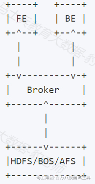

#### 2.2.8.1BROKER 部署

在节点划分中我们将要在node1~node5节点上部署Broker。具体操作步骤如下：

1. **准备**Broker **安装包**

在资料中将"apache-doris-dependencies-1.2.1-bin-x86\_64.tar.xz"文件进行解压，其中有"apache\_hdfs\_broker"文件夹，将该文件夹复制到node1~node5各个节点的 /software/doris-1.2.1目录中。

```plain
[root@node1 ~]# scp -r /software/doris-1.2.1/apache_hdfs_broker/ node2:/software/doris-1.2.1/
[root@node1 ~]# scp -r /software/doris-1.2.1/apache_hdfs_broker/ node3:/software/doris-1.2.1/
[root@node1 ~]# scp -r /software/doris-1.2.1/apache_hdfs_broker/ node4:/software/doris-1.2.1/
[root@node1 ~]# scp -r /software/doris-1.2.1/apache_hdfs_broker/ node5:/software/doris-1.2.1/
```

2. **启动** Broker

需要在对应的/software/doris-1.2.1/apache\_hdfs\_broker/bin路径中将start\_broker.sh和stop\_broker.sh赋权成可执行文件：

```plain
chmod +x ./start_broker.sh

chmod +x ./stop_broker.sh
```

在node1~node5节点上启动Borker：

```plain
cd /software/doris-1.2.1/apache_hdfs_broker/bin
./start_broker.sh --daemon
```

3. **将**Broker **加入到** Doris **集群中**

在node1通过mysql客户端连接Doris集群，执行SQL命令将启动的Borker加入到Doris集群中。

```plain
#通过mysql 客户端连接Doris集群
[root@node1 ~]# cd /software/mysql-5.7.22-client/bin/
[root@node1 bin]# ./mysql -uroot -P9030 -h192.168.179.4 

#将各个Broker加入到集群中
mysql> ALTER SYSTEM ADD BROKER broker_name "node1:8000","node2:8000","node3:8000","node4:8000","node5:8000";
Query OK, 0 rows affected (0.02 sec)
```

4. **查看** broker **信息**

以上Broker节点加入成功后，可以通过如下SQL命令来进行查询：

```plain
# MySQL客户端查询Broker信息
mysql> SHOW PROC "/brokers";
```

结果如下：

*(⚠️ 图片缺失:源知识库原图已失效)*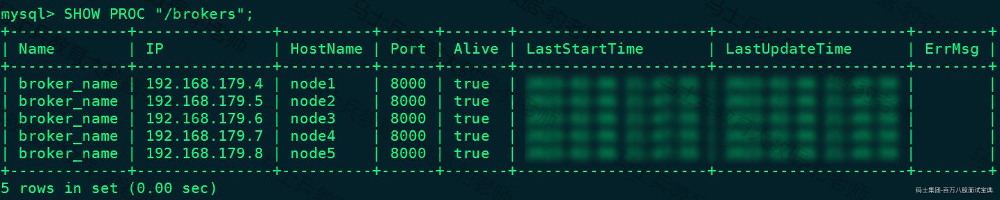

同时也可以登录node1~node5任意节点的8030端口，查看broker信息，如下：

*(⚠️ 图片缺失:源知识库原图已失效)*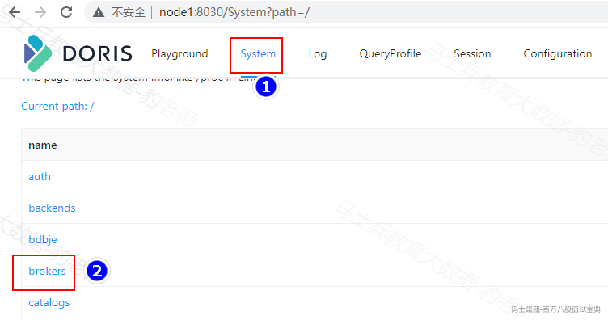

*(⚠️ 图片缺失:源知识库原图已失效)*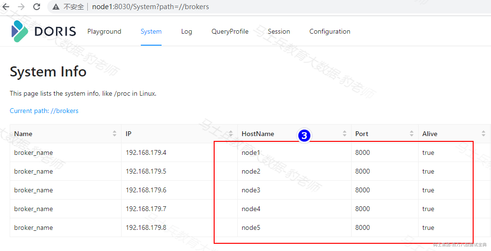

#### 2.2.8.2BROKER 扩缩容

Broker 实例的数量没有硬性要求。通常每台物理机部署一个即可。Broker 的添加和删除可以通过以下命令完成，这里不再演示。

```plain
ALTER SYSTEM ADD BROKER broker_name "broker_host:broker_ipc_port"; 
ALTER SYSTEM DROP BROKER broker_name "broker_host:broker_ipc_port"; 
ALTER SYSTEM DROP ALL BROKER broker_name;
```

Broker 是无状态的进程，可以随意启停。当然，停止后，正在其上运行的作业会失败，重试即可。

### 2.2.9Apache Doris集群启停脚本

Apache Doris部署后集群中角色包括FE、BE、Broker，这些节点都可以动态扩缩容。部署集群完成后，启动集群时依次启动FE、BE、Broker即可。停止集群依次按照Broker、BE、FE停止即可。以当前搭建的5节点为例，停止集群命令如下：

```plain
#停止Broker(node1~node5节点)
cd /software/doris-1.2.1/apache_hdfs_broker/bin
./stop_broker.sh

#停止BE（node3~node5节点）
cd /software/doris-1.2.1/apache-doris-be/bin
./stop_be.sh

#停止FE（node1~node5节点）
cd /software/doris-1.2.1/apache-doris-fe/bin
./stop_fe.sh 
```

启动集群命令如下：

```plain
#启动FE（node1~node5节点）
cd /software/doris-1.2.1/apache-doris-fe/bin
./start_fe.sh  --daemon

#启动BE（node3~node5节点）
cd /software/doris-1.2.1/apache-doris-be/bin
./start_be.sh --daemon

#启动Broker(node1~node5节点)
cd /software/doris-1.2.1/apache_hdfs_broker/bin
./start_broker.sh --daemon
```

也可以自己写脚本来完成Doris集群的启停，将脚本存入node1节点/software/doris-1.2.1目录下，启动脚本 start\_doris.sh 内容如下：

```plain
#! /bin/bash
echo -e "start apache doris cluster on node1~node5\n"

echo "start apache doris FE on node1~node5 >>>>>"
for fenode in node1 node2 node3 node4 node5
do
  ssh $fenode "sh /software/doris-1.2.1/apache-doris-fe/bin/start_fe.sh --daemon"
done

sleep 2
echo -e "\n"
for fenode in node1 node2 node3 node4 node5
do
  echo "***** check FE on $fenode jps *****"
  ssh $fenode "jps |grep PaloFe"
done

echo -e "\n"
echo "start apache doris BE on node3~node5 >>>>>"
for benode in node3 node4 node5
do
  ssh $benode "source /etc/profile;sh /software/doris-1.2.1/apache-doris-be/bin/start_be.sh --daemon"
done

sleep 2
echo -e "\n"
for benode in node3 node4 node5
do
  echo "***** check BE on $benode  *****"
  ssh $benode "ps aux |grep doris_be"
done

echo -e "\n"
echo "start apache doris BROKER on node1~node5 >>>>>"
for brokernode in node1 node2 node3 node4 node5
do
  ssh $brokernode "sh /software/doris-1.2.1/apache_hdfs_broker/bin/start_broker.sh --daemon"
done

sleep 2
echo -e "\n"
for brokernode in node1 node2 node3 node4 node5
do
  echo "***** check BROKER on $brokernode jps *****"
  ssh $brokernode "jps |grep BrokerBootstrap"
done
```

停止脚本stop\_doris.sh 内容如下：

```plain
#! /bin/bash
echo -e "stop apache doris cluster on node1~node5\n"

echo "stop apache doris BROKER on node1~node5 >>>>>"
for brokernode in node1 node2 node3 node4 node5
do
  ssh $brokernode "sh /software/doris-1.2.1/apache_hdfs_broker/bin/stop_broker.sh"
done

sleep 2
echo -e "\n"
for brokernode in node1 node2 node3 node4 node5
do
  echo "***** check BROKER on $brokernode jps *****"
  ssh $brokernode "jps |grep BrokerBootstrap"
done

echo -e "\n"
echo "stop apache doris BE on node3~node5 >>>>>"
for benode in node3 node4 node5
do
  ssh $benode "source /etc/profile;sh /software/doris-1.2.1/apache-doris-be/bin/stop_be.sh"
done

sleep 2
echo -e "\n"
for benode in node3 node4 node5
do
  echo "***** check BE on $benode  *****"
  ssh $benode "ps aux |grep doris_be"
done

echo -e "\n"
echo "stop apache doris FE on node1~node5 >>>>>"
for fenode in node1 node2 node3 node4 node5
do
  ssh $fenode "sh /software/doris-1.2.1/apache-doris-fe/bin/stop_fe.sh"
done

sleep 2
echo -e "\n"
for fenode in node1 node2 node3 node4 node5
do
  echo "***** check FE on $fenode jps *****"
  ssh $fenode "jps |grep PaloFe"
done
```

启停脚本编写完成后，可以通过以下方式调用：

```plain
[root@node1 ~]# cd /software/doris-1.2.1/
[root@node1 doris-1.2.1]# sh start_doris.sh
[root@node1 doris-1.2.1]# sh stop_doris.sh 
```
