# 3第三章 数据表设计

## 3.1Apache Doris 简单使用

下面按照官网给出的示例简单操作Doris，首先创建用户、创建数据库、赋权、创建表等，然后向表中加入数据，通过MySQL客户端进行数据的查询分析。

### 3.1.1用户创建

Doris采用MySQL协议进行通信，可以通过MySQL client 或者 MySQL JDBC连接到 Doris 集群。Doris集群内置root用户，密码默认为空，root 用户默认拥有集群所有权限，例如：权限变更权限（Grant\_priv ）、节点变更权限（Node\_priv ，包括 FE、BE、BROKER 节点的添加、删除、下线等操作）。

启动完 Doris 程序之后，可以通过 root 或 admin 用户（管理员）连接到 Doris 集群。 使用下面命令即可登录 Doris，登录后进入到Doris对应的Mysql命令行操作界面：

```plain
[root@node1 ~]# cd /software/mysql-5.7.22-client/bin/
[root@node1 bin]# ./mysql -u root -P 9030 -h127.0.0.1 -p123456
```

以上-h 可以指定任意一台FE节点的IP地址，-P是fe.conf中的query\_port配置，默认为9030 ，其余参数同MySQL参数。

首次使用用户登录无需密码，可以通过以下命令来修改密码，之前已经操作过，这里不再操作：

```plain
mysql> SET PASSWORD FOR 'root' = PASSWORD('your_password');
Query OK, 0 rows affected (0.00 sec)
```

your\_password是为root用户设置的新密码，可以随意设置，建议设置为强密码增加安全性，下次登录就用新密码登录。

我们可以通过下面的命令创建一个普通用户test：

```plain
mysql> CREATE USER 'test' IDENTIFIED BY '123456';
Query OK, 0 rows affected (0.02 sec)
```

创建用户完成后，下次登录Doris就可以使用新用户登录："mysql -h FE\_HOST -P9030 -utest -ptest\_passwd",新创建的普通用户默认没有任何权限，需要给用户进行数据库赋权才可使用。

### 3.1.2创建数据库

初始可以通过 root 或 admin 用户创建数据库，命令如下：

```plain
mysql> create database example_db;
Query OK, 0 rows affected (0.02 sec)
```

在Doris中，所有命令都可以使用 HELP command; 查看到详细的语法帮助，help 命令可以列举非常全的参考信息，非常方便。如果不清楚命令的全名，可以使用 "help 命令某一字段" 进行模糊查询。如键入 'HELP CREATE'，可以匹配到 CREATE DATABASE, CREATE TABLE, CREATE USER 等命令。如下：

```plain
mysql> help create;
Many help items for your request exist.
To make a more specific request, please type 'help <item>',
where <item> is one of the following
topics:
   CREATE CATALOG
   CREATE DATABASE
   CREATE ENCRYPTKEY
   CREATE EXTERNAL TABLE
   CREATE FILE
   CREATE FUNCTION
   CREATE INDEX
   CREATE MATERIALIZED VIEW
   CREATE POLICY
   CREATE REPOSITORY

mysql> help create database;
Name: 'CREATE DATABASE'
Description:

该语句用于新建数据库（database）

语法：

CREATE DATABASE [IF NOT EXISTS] db_name
    [PROPERTIES ("key"="value", ...)];

mysql> help create user;
Name: 'CREATE USER'
Description:

CREATE USER 命令用于创建一个 Doris 用户。

```sql
CREATE USER [IF EXISTS] user_identity [IDENTIFIED BY 'password']
[DEFAULT ROLE 'role_name']
[password_policy]
... ...
```

通过以下命令查看创建的数据库：

```plain
mysql> show databases;
+--------------------+
| Database           |
+--------------------+
| example_db         |
| information_schema |
+--------------------+
2 rows in set (0.00 sec)
```

information\_schema数据库是为了兼容MySQL协议而存在，实际中信息可能不是很准确，所以关于具体数据库的信息建议通过直接查询相应数据库而获得。

### 3.1.3账户赋权

example\_db 创建完成之后，可以通过 root/admin 账户使用GRANT命令将 example\_db 读写权限授权给普通账户，如 test。授权之后采用 test 账户登录就可以操作 example\_db 数据库了。

```plain
#给test用户进行数据库访问授权
mysql> GRANT ALL ON example_db TO test;
Query OK, 0 rows affected (0.08 sec)

退出root用户登录的mysql客户端，使用test登录
mysql> exit
[root@node1 bin]# ./mysql -u test -P 9030 -h127.0.0.1 -p123456
mysql> show databases;
+--------------------+
| Database           |
+--------------------+
| example_db         |
| information_schema |
+--------------------+
2 rows in set (0.03 sec)
```

可以看到普通用户test拥有操作example\_db的权限，如果不进行赋权查看不到对应的数据库。

### 3.1.4创建数据表

1. **创建数据表**

按照如下命令创建表:

```plain
mysql> use example_db;
Database changed

#创建 example_db.example_tbl 表
CREATE TABLE IF NOT EXISTS example_db.example_tbl
(
    `user_id` LARGEINT NOT NULL COMMENT "用户id",
    `date` DATE NOT NULL COMMENT "数据灌入日期时间",
    `city` VARCHAR(20) COMMENT "用户所在城市",
    `age` SMALLINT COMMENT "用户年龄",
    `sex` TINYINT COMMENT "用户性别",
    `last_visit_date` DATETIME REPLACE DEFAULT "1970-01-01 00:00:00" COMMENT "用户最后一次访问时间",
    `cost` BIGINT SUM DEFAULT "0" COMMENT "用户总消费",
    `max_dwell_time` INT MAX DEFAULT "0" COMMENT "用户最大停留时间",
    `min_dwell_time` INT MIN DEFAULT "99999" COMMENT "用户最小停留时间"
)
AGGREGATE KEY(`user_id`, `date`, `city`, `age`, `sex`)
DISTRIBUTED BY HASH(`user_id`) BUCKETS 1
PROPERTIES (
    "replication_allocation" = "tag.location.default: 1"
);

mysql> show tables;
+----------------------+
| Tables_in_example_db |
+----------------------+
| example_tbl          |
+----------------------+
1 row in set (0.01 sec)
```

注意：通过以上建表语句，认识下Doris中建表的格式。

2. **准备数据**

在node1节点/root/data目录下准备test.csv,数据内容如下：

```plain
[root@node1 ~]# mkdir data
[root@node1 ~]# cd data && vim test.csv
10000,2017-10-01,北京,20,0,2017-10-01 06:00:00,20,10,10
10000,2017-10-01,北京,20,0,2017-10-01 07:00:00,15,2,2
10001,2017-10-01,北京,30,1,2017-10-01 17:05:45,2,22,22
10002,2017-10-02,上海,20,1,2017-10-02 12:59:12,200,5,5
10003,2017-10-02,广州,32,0,2017-10-02 11:20:00,30,11,11
10004,2017-10-01,深圳,35,0,2017-10-01 10:00:15,100,3,3
10004,2017-10-03,深圳,35,0,2017-10-03 10:20:22,11,6,6
```

3. **导入数据**

这里我们通过Stream load 方式将上面保存到文件中的数据导入到我们刚才创建的表里，命令如下：

```plain
#进入到/root/data目录
[root@node1 ~]# cd /root/data/

#加载数据
[root@node1 data]# curl  --location-trusted -u test:123456 -T test.csv -H "column_separator:," http://127.0.0.1:8030/api/example_db/example_tbl/_stream_load
```

以上命令参数解释如下：

- -T test.csv : 这里使我们刚才保存的数据文件，如果路径不一样，请指定完整路径。

- -u root : 123456这里是用户名密码，我们使用默认用户root，密码默认为空。

- 127.0.0.1:8030 : 分别是 fe 的 ip 和 http\_port。

执行成功之后我们可以看到下面返回的信息：

```plain
{
    "TxnId": 2003,
    "Label": "b9c4fc8f-7a66-41ca-9bab-22ec391ede38",
    "TwoPhaseCommit": "false",
    "Status": "Success",
    "Message": "OK",
    "NumberTotalRows": 7,
    "NumberLoadedRows": 7,
    "NumberFilteredRows": 0,
    "NumberUnselectedRows": 0,
    "LoadBytes": 399,
    "LoadTimeMs": 779,
    "BeginTxnTimeMs": 53,
    "StreamLoadPutTimeMs": 488,
    "ReadDataTimeMs": 0,
    "WriteDataTimeMs": 145,
    "CommitAndPublishTimeMs": 88
}
```

- NumberLoadedRows: 表示已经导入的数据记录数

- NumberTotalRows: 表示要导入的总数据量

- Status :Success 表示导入成功

到这里我们已经完成的数据导入，下面就可以根据我们自己的需求对数据进行查询分析了

### 3.1.5查询数据表

上面完成了建表，输数据导入，下面我们就可以体验 Doris 的数据快速查询分析能力。

```plain
mysql> select * from example_tbl;
+---------+------------+--------+------+------+---------------------+------+----------------+----------------+
| user_id | date | city | age | sex | last_visit_date | cost | max_dwell_time | min_dwell_time |
+---------+------------+--------+------+------+---------------------+------+----------------+----------------+
| 10000 | 2017-10-01 | 北京 | 20 | 0 | 2017-10-01 07:00:00 | 35 | 10 | 2 |
| 10001 | 2017-10-01 | 北京 | 30 | 1 | 2017-10-01 17:05:45 | 2 | 22 | 22 |
| 10002 | 2017-10-02 | 上海 | 20 | 1 | 2017-10-02 12:59:12 | 200 | 5 | 5 |
| 10003 | 2017-10-02 | 广州 | 32 | 0 | 2017-10-02 11:20:00 | 30 | 11 | 11 |
| 10004 | 2017-10-01 | 深圳 | 35 | 0 | 2017-10-01 10:00:15 | 100 | 3 | 3 |
| 10004 | 2017-10-03 | 深圳 | 35 | 0 | 2017-10-03 10:20:22 | 11 | 6 | 6 |
+---------+------------+--------+------+------+---------------------+------+----------------+----------------+
6 rows in set (0.02 sec)

mysql> select * from example_tbl where city='上海';
+---------+------------+--------+------+------+---------------------+------+----------------+----------------+
| user_id | date | city | age | sex | last_visit_date | cost | max_dwell_time | min_dwell_time |
+---------+------------+--------+------+------+---------------------+------+----------------+----------------+
| 10002 | 2017-10-02 | 上海 | 20 | 1 | 2017-10-02 12:59:12 | 200 | 5 | 5 |
+---------+------------+--------+------+------+---------------------+------+----------------+----------------+
1 row in set (0.05 sec)

mysql> select city, sum(cost) as total_cost from example_tbl group by city;
+--------+------------+
| city | total_cost |
+--------+------------+
| 广州 | 30 |
| 上海 | 200 |
| 北京 | 37 |
| 深圳 | 111 |
+--------+------------+
4 rows in set (0.05 sec)
```

## 3.2Doris基础

### 3.2.1基本概念

在 Doris 中，数据都以表（Table）的形式进行逻辑上的描述，一张表包括行（Row）和列（Column），Table中又有分区（partition）和分桶（tablet）概念，下面分别介绍这些概念。

- **ROW&Column**

Row 代表用户的一行数据，Column用于描述一行数据中不同的字段。Column 可以分为两大类：Key 和 Value。从业务角度看，Key 和 Value 可以分别对应维度列和指标列。从聚合模型的角度来说，Key 列相同的行，会聚合成一行。其中 Value 列的聚合方式由用户在建表时指定。具体可以参考数据模型小节。

- **Tablet&Partition**

在 Doris 的存储引擎中，用户Table数据被水平划分为若干个数据分片（Tablet，也称作数据分桶）。每个 Tablet 包含若干数据行。各个 Tablet 之间的数据没有交集，并且在物理上是独立存储的。

多个 Tablet 在逻辑上归属于不同的分区（Partition）。一个 Tablet 只属于一个 Partition。而一个 Partition 包含若干个 Tablet。 **因为** **Tablet** **在物理上是独立存储的，所以可以视为** **Partition** 在物理上也是独立。**Tablet 是数据移动、复制等操作的最小物理存储单元**。

若干个 Partition 组成一个 Table。 **Partition** **可以视为是逻辑上最小的管理单元。数据的导入与删除，都可以或仅能针对一个** **Partition** **进行。**

*(⚠️ 图片缺失:源知识库原图已失效)*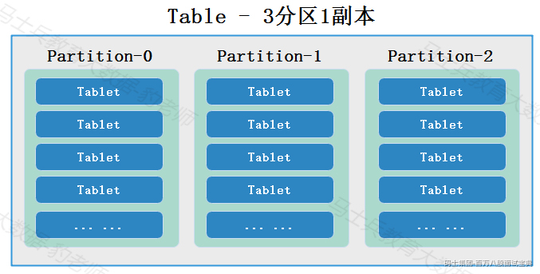

### 3.2.2建表语法及参数解释

Doris的建表语句如下：

```plain
CREATE TABLE [IF NOT EXISTS] [database.]table
(
column_definition_list,
[index_definition_list]
)
[engine_type]
[keys_type]
[table_comment]
[partition_desc]
[distribution_desc]
[rollup_list]
[properties]
```

注意：

1. Doris建表时一个同步命令，SQL执行完成即返回结果，命令返回成功即表示建表成功。

2. `IF NOT EXISTS` 表示如果没有创建过该表，则创建。注意这里只判断表名是否存在，而不会判断新建表结构是否与已存在的表结构相同。所以如果存在一个同名但不同构的表，该命令也会返回成功，但并不代表已经创建了新的表和新的结构。

#### 3.2.2.1column\_definition\_list

column\_definition\_list 表示定义的列信息，一个表中可以定义多个列，每个列的定义如下：

```plain
column_name column_type [KEY] [aggr_type] [NULL] [default_value] [column_comment]
```

以上定义列参数解释如下：

- column\_name：列名；

- column\_type:列类型，Doris支持常见的列类型：INT、BIGING、FLOAT、DATE、VARCHAR等，详细参考数据类型小节;

- aggr\_type:表示聚合类型，支持以下聚合类型：

```plain
SUM：求和。适用数值类型。
MIN：求最小值。适合数值类型。
MAX：求最大值。适合数值类型。
REPLACE：替换。对于维度列相同的行，指标列会按照导入的先后顺序，后倒入的替换先导入的。
REPLACE_IF_NOT_NULL：非空值替换。和 REPLACE 的区别在于对于null值，不做替换。这里要注意的是字段默认值要给NULL，而不能是空字符串，如果是空字符串，会给你替换成空字符串。
HLL_UNION：HLL 类型的列的聚合方式，通过 HyperLogLog 算法聚合。
BITMAP_UNION：BIMTAP 类型的列的聚合方式，进行位图的并集聚合。
```

- default\_value:列默认值，当导入数据未指定该列的值时，系统将赋予该列default\_value。语法为 `default default_value`，当前default\_value支持两种形式：

```plain
#1.用户指定固定值，如：
k1 INT DEFAULT '1',
k2 CHAR(10) DEFAULT 'aaaa'

#2.系统提供的关键字，目前只用于DATETIME类型，导入数据缺失该值时系统将赋予当前时间
dt DATETIME DEFAULT CURRENT_TIMESTAMP
```

示例如下：

```plain
k1 TINYINT,
k2 DECIMAL(10,2) DEFAULT "10.5",
k4 BIGINT NULL DEFAULT "1000" COMMENT "This is column k4",
v1 VARCHAR(10) REPLACE NOT NULL,
v2 BITMAP BITMAP_UNION,
v3 HLL HLL_UNION,
v4 INT SUM NOT NULL DEFAULT "1" COMMENT "This is column v4"
```

- column\_comment：列注释。

#### 3.2.2.2index\_definition\_list

index\_definition\_list表示定义的索引信息。定义索引可以是一个或多个，多个使用逗号隔开。索引定义语法如下：

```plain
INDEX index_name (col_name) [USING BITMAP] COMMENT 'xxxxxx'
```

示例：

```plain
INDEX idx1 (k1) USING BITMAP COMMENT "This is a bitmap index1",
INDEX idx2 (k2) USING BITMAP COMMENT "This is a bitmap index2",
...
```

#### 3.2.2.3engine\_type

engine\_type表示表引擎类型，在Apache Doris中表分为普通表和外部表，两类表主要通过ENGINE类型来标识是那种类型的表。普通表就是Doris中创建的表ENGINE为OLAP，OLAP是默认的Engine类型；外部表有很多类型，ENGIE也不同，例如：MYSQL、BROKER、HIVE、ICEBERG 、HUDI。

示例：

```plain
ENGINE=olap
```

#### 3.2.2.4key\_type

key\_type表示数据类型。用法如下：

```plain
key_type(col1, col2, ...)
```

key\_type 支持以下模型：

- DUPLICATE KEY（默认）：其后指定的列为排序列。

- AGGREGATE KEY：其后指定的列为维度列。

- UNIQUE KEY：其后指定的列为主键列。

示例：

```plain
DUPLICATE KEY(col1, col2),
AGGREGATE KEY(k1, k2, k3),
UNIQUE KEY(k1, k2)
```

#### 3.2.2.5table\_comment

table\_comment表示表注释，示例：

```plain
COMMENT "This is my first DORIS table"
```

#### 3.2.2.6partition\_desc

partitioin\_desc表示分区信息，支持三种写法

1. **LESS THAN**：仅定义分区上界。下界由上一个分区的上界决定。

```plain
PARTITION BY RANGE(col1[, col2, ...])
(
    PARTITION partition_name1 VALUES LESS THAN MAXVALUE|("value1", "value2", ...),
    PARTITION partition_name2 VALUES LESS THAN MAXVALUE|("value1", "value2", ...)
)
```

2. FIXED RANGE:*定义分区的左闭右开区间*

```plain
PARTITION BY RANGE(col1[, col2, ...])
(
    PARTITION partition_name1 VALUES [("k1-lower1", "k2-lower1", "k3-lower1",...), ("k1-upper1", "k2-upper1", "k3-upper1", ...)),
    PARTITION partition_name2 VALUES [("k1-lower1-2", "k2-lower1-2", ...), ("k1-upper1-2", MAXVALUE, ))
)
```

3. **MULTI RANGE** ：批量创建 **RANGE** 分区，定义分区的左闭右开区间，设定时间单位和步长，时间单位支持年、月、日、周和小时。

```plain
PARTITION BY RANGE(col)
(
   FROM ("2000-11-14") TO ("2021-11-14") INTERVAL 1 YEAR,
   FROM ("2021-11-14") TO ("2022-11-14") INTERVAL 1 MONTH,
   FROM ("2022-11-14") TO ("2023-01-03") INTERVAL 1 WEEK,
   FROM ("2023-01-03") TO ("2023-01-14") INTERVAL 1 DAY
)
```

注意：该特性是Doris1.2.1版本后新增。

#### 3.2.2.7distribution\_desc

distribution\_desc定义数据分桶方式。有两种方式分别为HASH分桶语法和RANDOM分桶语法。

1. **Hash** **分桶**

语法： DISTRIBUTED BY HASH (k1[,k2 ...]) [BUCKETS num]

说明： 使用指定的 key 列进行哈希分桶。

2. **Random** **分桶**

语法： DISTRIBUTED BY RANDOM [BUCKETS num]

说明： 使用随机数进行分桶。

#### 3.2.2.8rollup\_list

rollup\_list指的是建表的同时可以创建多个物化视图（ROLLUP），多个物化视图使用逗号隔开，语法如下：

```plain
ROLLUP (rollup_definition[, rollup_definition, ...])
```

以上语法中rollup\_definition是定义多个物化视图，语法如下：

```plain
rollup_name (col1[, col2, ...]) [DUPLICATE KEY(col1[, col2, ...])] [PROPERTIES("key" = "value")]
```

示例：

```plain
ROLLUP (
r1 (k1, k3, v1, v2),
r2 (k1, v1)
)
```

#### 3.2.2.9properites

具体参考3.6小结。

### 3.2.3数据类型

Apache Doris支持常见的列数据类型如下：

|  |  |  |
| --- | --- | --- |
| **列类型** | **占用字节** | **描述** |
| TINYINT | 1字节 | 范围：-27 + 1 ~ 27 - 1 |
| SMALLINT | 2字节 | 范围：-215 + 1 ~ 215 - 1 |
| INT | 4字节 | 范围：-231 + 1 ~ 231 - 1 |
| BIGINT | 8字节 | 范围：-263 + 1 ~ 263 - 1 |
| LARGEINT | 16字节 | 范围：-2127 + 1 ~ 2127 - 1 |
| BOOLEAN | 1字节 | 与TINYINT一样，0代表false，1代表true |
| FLOAT | 4字节 | 支持科学计数法 |
| DOUBLE | 12字节 | 支持科学计数法 |
| DECIMAL[(precision, scale)] | 16字节 | 保证精度的小数类型。默认是 DECIMAL(10, 0)precision: 1 ~ 27scale: 0 ~ 9其中整数部分为 1 ~ 18不支持科学计数法 |
| DECIMALV3[(precision, scale)] | 16字节 | 更高精度的小数类型。默认是 DECIMAL(10, 0)precision: 1 ~ 38scale: 0 ~ precision |
| DATE | 3字节 | 范围：0000-01-01 ~ 9999-12-31 |
| DATEV2 | 3字节 | DATEV2类型相比DATE类型更加高效，在计算时，DATEV2相比DATE可以节省一半的内存使用量。 |
| DATETIME | 8字节 | 范围：0000-01-01 00:00:00 ~ 9999-12-31 23:59:59 |
| DATETIMEV2 | 8字节 | 范围是0000-01-01 00:00:00[.000000] ~ 9999-12-31 23:59:59[.999999]，相比DATETIME类型，DATETIMEV2更加高效，并且支持了最多到微秒的时间精度。 |
| CHAR[(length)] | 1字节 | 定长字符串。长度范围：1 ~ 255。 |
| VARCHAR[(length)] | - | 变长字符串。长度范围：1 ~ 65533。 |
| STRING | - | 变长字符串。最大（默认）支持1048576 字节（1MB）String类型的长度还受 be 配置 `string_type_length_soft_limit_bytes`, 实际能存储的最大长度 取两者最小值，String类型只能用在value 列，不能用在 key 列和分区、分桶列 |
| HLL | 1~16385个字节 | HyperLogLog 列类型，不需要指定长度和默认值。长度根据数据的聚合程度系统内控制。必须配合 HLL\_UNION 聚合类型使用。 |
| BITMAP | - | bitmap 列类型，不需要指定长度和默认值。表示整型的集合，元素最大支持到2^64 - 1。必须配合 BITMAP\_UNION 聚合类型使用。 |

Apache Doris还支持ARRAY、JSONB类型，具体可以参考官网：<https://doris.apache.org/zh-CN/docs/dev/sql-manual/sql-reference/Data-Types/>

## 3.3数据模型

在 Doris 中，数据以表（Table）的形式进行逻辑上的描述。 一张表包括行（Row）和列（Column）。Row 即用户的一行数据。Column 用于描述一行数据中不同的字段。Column 可以分为两大类：Key 和 Value。从业务角度看，Key 和 Value 可以分别对应维度列和指标列。

Doris 数据模型上目前分为三类: AGGREGATE KEY, UNIQUE KEY, DUPLICATE KEY，三种模型中数据都是按KEY进行排序。不同的数据模型有不同的使用场景。下面我们分别介绍。

### 3.3.1Aggregate 数据模型

在创建Doris表时，可以指定key\_type为AGGREGATE KEY，这就是Aggregate数据模型，AGGREGATE KEY模型可以提前聚合数据, 适合报表和多维分析业务。只要向Aggregate表中插入的数据AGGREGATE KEY相同，数据表中新旧记录进行聚合，目前支持的聚合函数有SUM, MIN, MAX, REPLACE。Aggregate 数据模型可以自动对导入的数据进行聚合；也可以对导入数据不聚合，保留明细数据；如果表中存在数据在后续导入数据时，后续数据与先前已有数据也会聚合。

#### 3.3.1.1导入数据聚合

假设业务有如下数据表模式：

*(⚠️ 图片缺失:源知识库原图已失效)*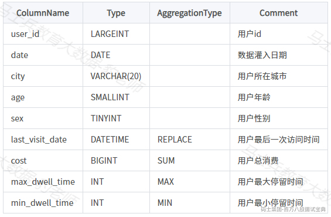

建表语句如下：

```plain
CREATE TABLE IF NOT EXISTS example_db.example_tbl
(
`user_id` LARGEINT NOT NULL COMMENT "用户id",
`date` DATE NOT NULL COMMENT "数据灌入日期时间",
`city` VARCHAR(20) COMMENT "用户所在城市",
`age` SMALLINT COMMENT "用户年龄",
`sex` TINYINT COMMENT "用户性别",
`last_visit_date` DATETIME REPLACE DEFAULT "1970-01-01 00:00:00" COMMENT "用户最后一次访问时间",
`cost` BIGINT SUM DEFAULT "0" COMMENT "用户总消费",
`max_dwell_time` INT MAX DEFAULT "0" COMMENT "用户最大停留时间",
`min_dwell_time` INT MIN DEFAULT "99999" COMMENT "用户最小停留时间"
)
AGGREGATE KEY(`user_id`, `date`, `city`, `age`, `sex`)
DISTRIBUTED BY HASH(`user_id`) BUCKETS 1
PROPERTIES (
"replication_allocation" = "tag.location.default: 1"
);
```

在mysql客户端执行以上建表语句，创建 example\_db.example\_tbl 表，该表在3.1.4小节已经创建过，可以先删除（drop table xx）后重新创建。

```plain
#删除重新表example_db.example_tbl
mysql> drop table example_db.example_tbl;
```

可以看到，这是一个典型的用户信息和访问行为的事实表。 在一般星型模型中，用户信息和访问行为一般分别存放在维度表和事实表中。这里我们为了更加方便的解释 Doris 的数据模型，将两部分信息统一存放在一张表中。

该表就是一张Aggregate数据模型表，表中的列按照是否设置了 AggregationType，分为 Key (维度列) 和 Value（指标列）。没有设置 AggregationType 的，如 user\_id、date、age ... 等称为 Key，而设置了 AggregationType 的称为 Value。

当我们导入数据时，对于 Key 列相同的行会聚合成一行，而 Value 列会按照设置的 AggregationType 进行聚合。 AggregationType 目前常见有以下四种聚合方式：

1. **SUM** ：求和，多行的 Value 进行累加

2. **REPLACE** ：替代，下一批数据中的 Value会替换之前导入过的行中的 Value **。**

3. **MAX**：保留最大值。

4. **MIN** ：保留最小值。

假设我们有以下导入数据（原始数据）：

*(⚠️ 图片缺失:源知识库原图已失效)*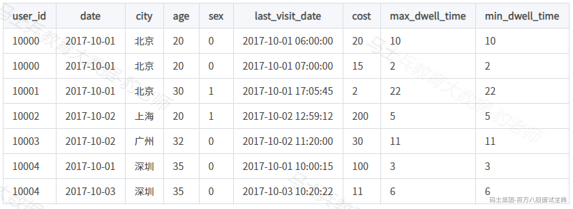

我们假设这是一张记录用户访问某商品页面行为的表。我们以第一行数据为例，解释如下：

*(⚠️ 图片缺失:源知识库原图已失效)*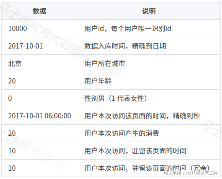

执行如下语句将以上数据写入到"example\_db.example\_tbl"表中:

```plain
insert into example_db.example_tbl values 
(10000,"2017-10-01","北京",20,0,"2017-10-01 06:00:00",20,10,10),
(10000,"2017-10-01","北京",20,0,"2017-10-01 07:00:00",15,2,2),
(10001,"2017-10-01","北京",30,1,"2017-10-01 17:05:45",2,22,22),
(10002,"2017-10-02","上海",20,1,"2017-10-02 12:59:12",200,5,5),
(10003,"2017-10-02","广州",32,0,"2017-10-02 11:20:00",30,11,11),
(10004,"2017-10-01","深圳",35,0,"2017-10-01 10:00:15",100,3,3),
(10004,"2017-10-03","深圳",35,0,"2017-10-03 10:20:22",11,6,6);
```

以上向表中插入非数字类型数据需要使用双引号或者单引号引起来数据，当这批数据正确导入到 Doris 中后，Doris 中最终存储如下：

*(⚠️ 图片缺失:源知识库原图已失效)*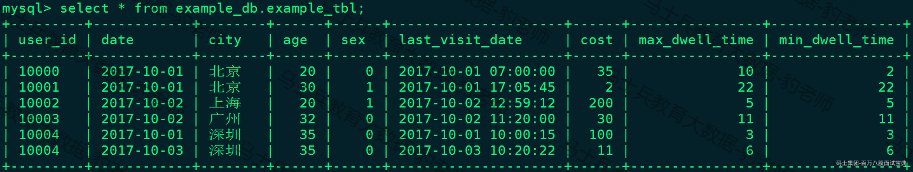

可以看到，用户 10000 只剩下了一行聚合后的数据。而其余用户的数据和原始数据保持一致。这里先解释下用户 10000 聚合后的数据：

前5列没有变化，从第6列 last\_visit\_date 开始：

- 2017-10-01 07:00:00：因为 last\_visit\_date 列的聚合方式为 REPLACE，所以 2017-10-01 07:00:00 替换了 2017-10-01 06:00:00 保存了下来。

注： **在同一个导入批次中的数据，对于** **REPLACE** **这种聚合方式，替换顺序不做保证。** 如在这个例子中，最终保存下来的，也有可能是 2017-10-01 06:00:00。 **而对于不同导入批次中的数据，可以保证，后一批次的数据会替换前一批次。**

- 35：因为 cost 列的聚合类型为 SUM，所以由 20 + 15 累加获得 35。

- 10：因为 max\_dwell\_time 列的聚合类型为 MAX，所以 10 和 2 取最大值，获得 10。

- 2：因为 min\_dwell\_time 列的聚合类型为 MIN，所以 10 和 2 取最小值，获得 2。

经过聚合， **Doris** **中最终只会存储聚合后的数据。换句话说，即明细数据会丢失，用户不能够再查询到聚合前的明细数据了。**

#### 3.3.1.2保留明细数据

我们将以上案例表结构修改如下，创建新的表example\_db.example\_tbl\_1:

*(⚠️ 图片缺失:源知识库原图已失效)*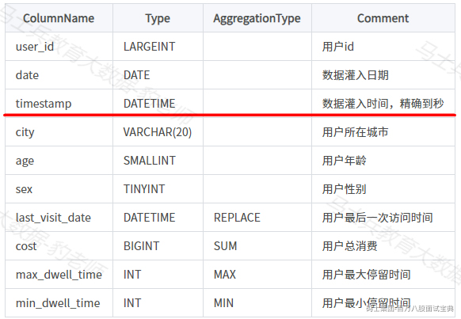

即增加了一列 timestamp，记录精确到秒的数据灌入时间。同时，将AGGREGATE KEY设置为AGGREGATE KEY(user\_id, date, timestamp, city, age, sex)，这里建表example\_db.example\_tbl\_1,建表语句如下：

```plain
CREATE TABLE IF NOT EXISTS example_db.example_tbl_1
(
`user_id` LARGEINT NOT NULL COMMENT "用户id",
`date` DATE NOT NULL COMMENT "数据灌入日期时间",
`timestamp` DATETIME NOT NULL COMMENT "数据灌入时间,精确到秒",
`city` VARCHAR(20) COMMENT "用户所在城市",
`age` SMALLINT COMMENT "用户年龄",
`sex` TINYINT COMMENT "用户性别",
`last_visit_date` DATETIME REPLACE DEFAULT "1970-01-01 00:00:00" COMMENT "用户最后一次访问时间",
`cost` BIGINT SUM DEFAULT "0" COMMENT "用户总消费",
`max_dwell_time` INT MAX DEFAULT "0" COMMENT "用户最大停留时间",
`min_dwell_time` INT MIN DEFAULT "99999" COMMENT "用户最小停留时间"
)
AGGREGATE KEY(`user_id`, `date`, `timestamp`, `city`, `age`, `sex`)
DISTRIBUTED BY HASH(`user_id`) BUCKETS 1
PROPERTIES (
"replication_allocation" = "tag.location.default: 1"
);
```

向表中插入如下数据：

*(⚠️ 图片缺失:源知识库原图已失效)*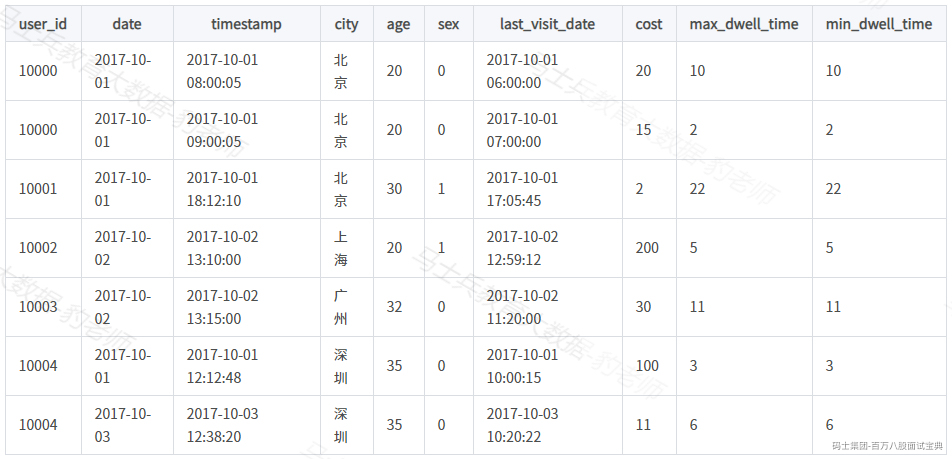

插入数据SQL如下：

```plain
insert into example_db.example_tbl_1 values 
(10000,"2017-10-01","2017-10-01 08:00:05","北京",20,0,"2017-10-01 06:00:00",20,10,10),
(10000,"2017-10-01","2017-10-01 09:00:05","北京",20,0,"2017-10-01 07:00:00",15,2,2),
(10001,"2017-10-01","2017-10-01 18:12:10","北京",30,1,"2017-10-01 17:05:45",2,22,22),
(10002,"2017-10-02","2017-10-02 13:10:00","上海",20,1,"2017-10-02 12:59:12",200,5,5),
(10003,"2017-10-02","2017-10-02 13:15:00","广州",32,0,"2017-10-02 11:20:00",30,11,11),
(10004,"2017-10-01","2017-10-01 12:12:48","深圳",35,0,"2017-10-01 10:00:15",100,3,3),
(10004,"2017-10-03","2017-10-03 12:38:20","深圳",35,0,"2017-10-03 10:20:22",11,6,6);
```

那么当这批数据正确导入到 Doris 中后，Doris 中最终存储如下：

*(⚠️ 图片缺失:源知识库原图已失效)*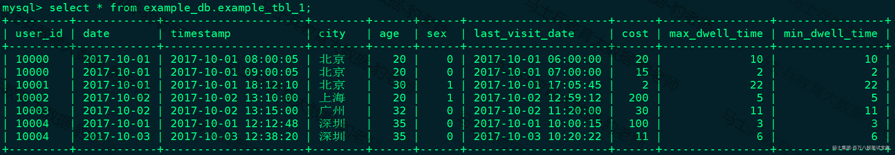

我们可以看到，存储的数据，和导入数据完全一样，没有发生任何聚合。这是因为，这批数据中，因为加入了 timestamp 列，所有行的 Key 都不完全相同。也就是说， **只要保证导入的数据中，每一行的** **Key** **都不完全相同，那么即使在聚合模型下，** Doris 也可以保存完整的明细数据。

#### 3.3.1.3导入数据与已有数据聚合

回到3.3.1.1小节中表example\_db.example\_tbl表，数据如下：

*(⚠️ 图片缺失:源知识库原图已失效)*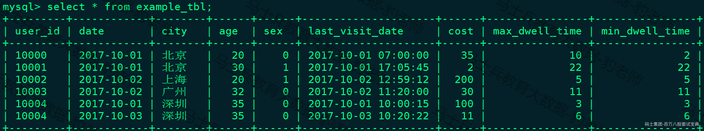

我们再向该表中插入一批新的数据：

*(⚠️ 图片缺失:源知识库原图已失效)*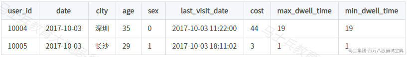

插入数据SQL如下：

```plain
insert into example_db.example_tbl values 
(10004,"2017-10-03","深圳",35,0,"2017-10-03 11:22:00",44,19,19),
(10005,"2017-10-03","长沙",29,1,"2017-10-03 18:11:02",3,1,1);
```

那么当这批数据正确导入到 Doris 中后，Doris 中最终存储如下：

*(⚠️ 图片缺失:源知识库原图已失效)*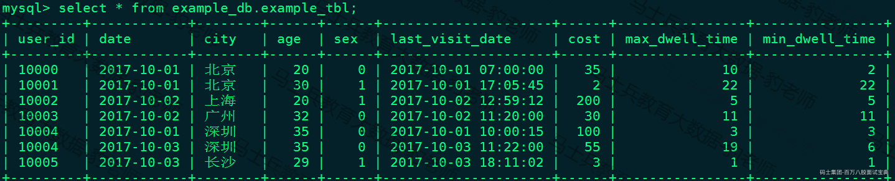

可以看到，用户 10004 的已有数据和新导入的数据发生了聚合。同时新增了 10005 用户的数据。

数据的聚合，在 Doris 中有如下三个阶段发生：

1. 每一批次数据导入的 ETL 阶段。该阶段会在每一批次导入的数据内部进行聚合。

2. 底层 BE 进行数据 Compaction 的阶段。该阶段，BE 会对已导入的不同批次的数据进行进一步的聚合。

3. 数据查询阶段。在数据查询时，对于查询涉及到的数据，会进行对应的聚合。

数据在不同时间，可能聚合的程度不一致。比如一批数据刚导入时，可能还未与之前已存在的数据进行聚合。但是对于用户而言，用户只能查询到聚合后的数据。即 **不同的聚合程度对于用户查询而言是透明的。用户需始终认为数据以最终的完成的聚合程度存在，而不应假设某些聚合还未发生。**

### 3.3.2Unique数据模型

在某些多维分析场景下，用户更关注的是如何保证 Key 的唯一性，即如何获得 Primary Key 唯一性约束。因此，我们引入了 Unique 数据模型，该模型可以根据相同的Primary Key 来保留后插入的数据，确保数据的唯一，只要UNIQUE KEY 相同时，新记录覆盖旧记录。Unique数据模型有两种实现方式：读时合并（merge on read）和写时合并（merge on write），下面将对两种实现方式分别举例进行说明。

#### 3.3.2.1读时合并

有以下用户基础信息表结构：

*(⚠️ 图片缺失:源知识库原图已失效)*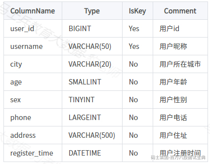

以上表中存储数据没有聚合需求，只需保证主键唯一性，这里说的主键可以通过UNIQUE KEY 来自定义，参见以下建表语句，这里指定主键为user\_id+username:

```plain
CREATE TABLE IF NOT EXISTS example_db.example_unique_tbl
(
`user_id` LARGEINT NOT NULL COMMENT "用户id",
`username` VARCHAR(50) NOT NULL COMMENT "用户昵称",
`city` VARCHAR(20) COMMENT "用户所在城市",
`age` SMALLINT COMMENT "用户年龄",
`sex` TINYINT COMMENT "用户性别",
`phone` LARGEINT COMMENT "用户电话",
`address` VARCHAR(500) COMMENT "用户地址",
`register_time` DATETIME COMMENT "用户注册时间"
)
UNIQUE KEY(`user_id`, `username`)
DISTRIBUTED BY HASH(`user_id`) BUCKETS 1
PROPERTIES (
"replication_allocation" = "tag.location.default: 1"
);
```

向以上表中插入如下数据：

```plain
insert into example_db.example_unique_tbl values 
(1,"zs","北京",18,0,18812345671,"北京丰台区","2023-03-01 08:00:00"),
(2,"ls","上海",19,1,18812345672,"上海松江区","2023-03-02 08:00:00"),
(3,"ws","天津",20,1,18812345673,"天津南开区","2023-03-03 08:00:00"),
(4,"ml","深圳",21,0,18812345674,"深圳罗湖区","2023-03-04 08:00:00"),
(4,"ml","深圳",22,1,18812345675,"深圳福田区","2023-03-05 08:00:00");
```

插入以上数据之后，表中最终数据结果如下：

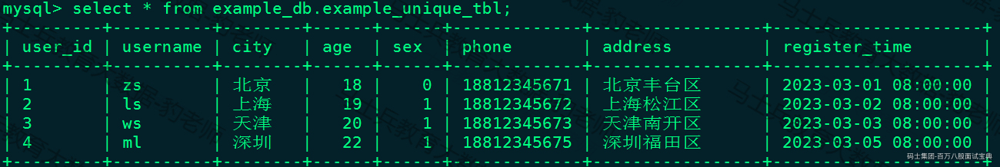

可以看到user\_id为4、username为ml的这条数据被最后插入的user\_id为4、username为ml的数据替换。

以上在读取表的时候Doris底层会对数据进行替换，这就是Unique数据模型的读时合并。我们发现这种合并方式完全可以用Aggregate聚合模型中的REPLACE方式替代，其内部的实现方式和数据存储方式也完全一样，验证如下：

在Doris中创建如下Aggregate 聚合表,表结果和建表语句如下：

*(⚠️ 图片缺失:源知识库原图已失效)*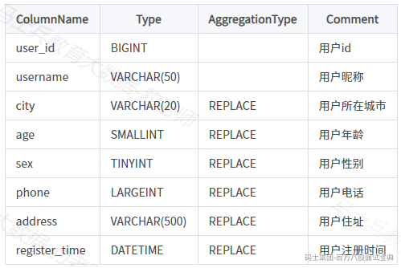

建表语句：

```plain
CREATE TABLE IF NOT EXISTS example_db.example_aggregate_tbl
(
`user_id` LARGEINT NOT NULL COMMENT "用户id",
`username` VARCHAR(50) NOT NULL COMMENT "用户昵称",
`city` VARCHAR(20) REPLACE COMMENT "用户所在城市",
`age` SMALLINT REPLACE COMMENT "用户年龄",
`sex` TINYINT REPLACE COMMENT "用户性别",
`phone` LARGEINT REPLACE COMMENT "用户电话",
`address` VARCHAR(500) REPLACE COMMENT "用户地址",
`register_time` DATETIME REPLACE COMMENT "用户注册时间"
)
AGGREGATE KEY(`user_id`, `username`)
DISTRIBUTED BY HASH(`user_id`) BUCKETS 1
PROPERTIES (
"replication_allocation" = "tag.location.default: 1"
);
```

表创建完成后插入如下数据：

```plain
insert into example_db.example_aggregate_tbl values 
(1,"zs","北京",18,0,18812345671,"北京丰台区","2023-03-01 08:00:00"),
(2,"ls","上海",19,1,18812345672,"上海松江区","2023-03-02 08:00:00"),
(3,"ws","天津",20,1,18812345673,"天津南开区","2023-03-03 08:00:00"),
(4,"ml","深圳",21,0,18812345674,"深圳罗湖区","2023-03-04 08:00:00"),
(4,"ml","深圳",22,1,18812345675,"深圳福田区","2023-03-05 08:00:00");
```

表example\_db.example\_aggregate\_tbl插入数据后，结果如下：

*(⚠️ 图片缺失:源知识库原图已失效)*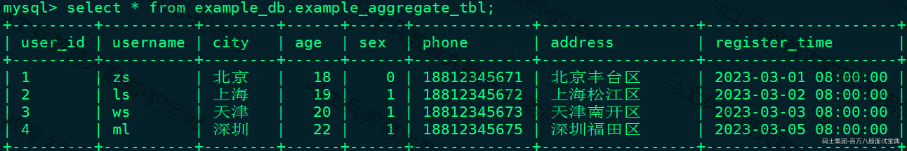

通过以上验证，我们发现 **读时合并与**Aggregate **聚合模型的结果相同，其底层实现方式也是一样的，都是在读取数据时进行数据合并，呈现最终结果。**

#### 3.3.2.2写时合并

在1.2版本之前，该模型本质上是聚合模型的一个特例，也是一种简化的表结构表示方式。由于聚合模型的实现方式是读时合并（merge on read)，因此在一些聚合查询上性能不佳（参考3.3.4小节聚合模型的局限性的描述），在1.2版本我们引入了Unique模型新的实现方式——写时合并（merge on write），通过在写入时做一些额外的工作，实现了最优的查询性能。 **写时合并将在未来替换读时合并成为** Unique **模型的默认实现方式，两者将会短暂的共存一段时间。**

Unqiue模型的写时合并实现，与聚合模型就是完全不同的两种模型了， **查询性能更接近于**duplicate**模型，在有主键约束需求的场景上相比聚合模型有较大的查询性能优势，尤其是在聚合查询以及需要用索引过滤大量数据的查询中。**

在1.2.0版本中，作为一个新的feature，写时合并默认关闭，用户可以通过添加下面的property来开启：

```plain
"enable_unique_key_merge_on_write" = "true"
```

仍然以上面的表为例，表结构还是原来的表结构：

*(⚠️ 图片缺失:源知识库原图已失效)*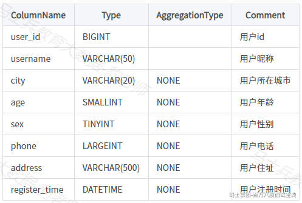

建表语句为:

```plain
CREATE TABLE IF NOT EXISTS example_db.example_unique_tbl2
(
`user_id` LARGEINT NOT NULL COMMENT "用户id",
`username` VARCHAR(50) NOT NULL COMMENT "用户昵称",
`city` VARCHAR(20) COMMENT "用户所在城市",
`age` SMALLINT COMMENT "用户年龄",
`sex` TINYINT COMMENT "用户性别",
`phone` LARGEINT COMMENT "用户电话",
`address` VARCHAR(500) COMMENT "用户地址",
`register_time` DATETIME COMMENT "用户注册时间"
)
UNIQUE KEY(`user_id`, `username`)
DISTRIBUTED BY HASH(`user_id`) BUCKETS 1
PROPERTIES (
"replication_allocation" = "tag.location.default: 1",
"enable_unique_key_merge_on_write" = "true"
);
```

向表example\_db.example\_unique\_tbl2中插入与之前一样的数据：

```plain
insert into example_db.example_unique_tbl2 values 
(1,"zs","北京",18,0,18812345671,"北京丰台区","2023-03-01 08:00:00"),
(2,"ls","上海",19,1,18812345672,"上海松江区","2023-03-02 08:00:00"),
(3,"ws","天津",20,1,18812345673,"天津南开区","2023-03-03 08:00:00"),
(4,"ml","深圳",21,0,18812345674,"深圳罗湖区","2023-03-04 08:00:00"),
(4,"ml","深圳",22,1,18812345675,"深圳福田区","2023-03-05 08:00:00");
```

插入数据后，查询表example\_db.example\_unique\_tbl2中数据结果如下:

*(⚠️ 图片缺失:源知识库原图已失效)*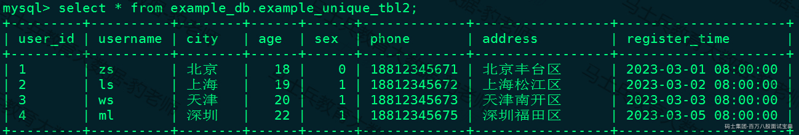

**在开启了写时合并选项的**Unique **表上，数据在导入阶段就会去将被覆盖和被更新的数据进行标记删除，同时将新的数据写入新的文件** 。 **在查询的时候，所有被标记删除的数据都会在文件级别被过滤掉，读取出来的数据就都是最新的数据** ，消除掉了读时合并中的数据聚合过程，并且能够在很多情况下支持多种谓词的下推。因此在 **许多场景都能带来比较大的性能提升，尤其是在有聚合查询的情况下。**

注意：

1. 新的Merge-on-write实现默认关闭，且只能在建表时通过指定property的方式打开。

2. **旧的** Merge-on-read **的实现无法无缝升级到新版本的实现** （数据组织方式完全不同），如果需要改为使用写时合并的实现版本，需要手动执行insert into unique-mow-table select \* from source table.

3. **在** Unique **模型上独有的** delete sign 和 sequence col **，在写时合并的新版实现中仍可以正常使用，用法没有变化** 。想要查看隐藏的delete\_sign列，可以执行SET show\_hidden\_columns=true;显示隐藏列，然后desc table 查看对应表即可。sequence col需要在创建Unique表时指定function\_column.sequence\_col参数，具体参见3.6 Properties配置项。

### 3.3.3Duplicate数据模型

在某些多维分析场景下，数据既没有主键，也没有聚合需求，只需要将数据原封不动的存入表中，数据有主键重复也都要存储。因此，我们引入 Duplicate 数据模型来满足这类需求。 **Duplicate** 数据模型只指定排序列，相同的行不会合并，适用于数据无需提前聚合的分析业务。举例说明，有如下表结构数据：

*(⚠️ 图片缺失:源知识库原图已失效)*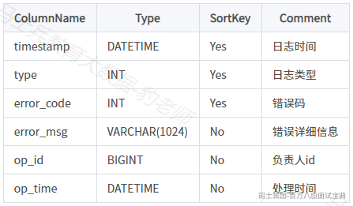

建表语句如下：

```plain
CREATE TABLE IF NOT EXISTS example_db.example_duplicate_tbl
(
`timestamp` DATETIME NOT NULL COMMENT "日志时间",
`type` INT NOT NULL COMMENT "日志类型",
`error_code` INT COMMENT "错误码",
`error_msg` VARCHAR(1024) COMMENT "错误详细信息",
`op_id` BIGINT COMMENT "负责人id",
`op_time` DATETIME COMMENT "处理时间"
)
DUPLICATE KEY(`timestamp`, `type`, `error_code`)
DISTRIBUTED BY HASH(`type`) BUCKETS 1
PROPERTIES (
"replication_allocation" = "tag.location.default: 1"
);
```

创建表成功后，向表中插入如下数据：

```plain
insert into example_db.example_duplicate_tbl values 
("2023-03-01 08:00:00",1,200,"错误200",1001,"2023-03-01 09:00:00"),
("2023-03-02 08:00:00",2,201,"错误201",1002,"2023-03-02 09:00:00"),
("2023-03-03 08:00:00",3,202,"错误202",1003,"2023-03-03 09:00:00"),
("2023-03-04 08:00:00",4,203,"错误203",1004,"2023-03-04 09:00:00"),
("2023-03-04 08:00:00",4,203,"错误203",1004,"2023-03-04 09:00:00"),
("2023-03-04 08:00:00",4,203,"错误203",1005,"2023-03-05 10:00:00");
```

插入数据后，表example\_db.example\_duplicate\_tbl结果如下：

*(⚠️ 图片缺失:源知识库原图已失效)*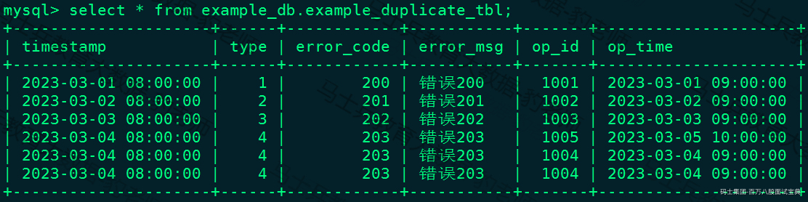

这种数据模型区别于 Aggregate 和 Unique 模型，数据完全按照导入文件/或插入的数据进行存储，不会有任何聚合。 **即使两行数据完全相同，也都会保留。 而在建表语句中指定的** **DUPLICATE KEY** ，只是用来指明底层数据按照那些列进行排序，更贴切的名称应该为 "Sorted Column"，这里取名 "DUPLICATE KEY" 只是用以明确表示所用的数据模型。关于 "Sorted Column"的更多解释，可以参考3.8小节前缀索引。

在 Aggregate、Unique 和 Duplicate 三种数据模型中。底层的数据存储，是按照各自建表语句中，AGGREGATE KEY、UNIQUE KEY 和 DUPLICATE KEY 中指定的列进行排序存储的。 **在** **DUPLICATE KEY** **的选择上，我们建议适当的选择前** **2-4** **列就可以。**

### 3.3.4聚合模型的局限性

以上Aggregate数据模型和Unique数据模型是聚合模型，Duplicate数据模型不是聚合模型，聚合模型存在一些局限性，这里说的局限性主要体现在select count(\*) from table 操作效率和语意正确性两方面，下面我们针对 Aggregate 模型，来介绍下聚合模型的局限性。

在聚合模型中，模型对外展现的，是最终聚合后的数据。也就是说，在Doris内部任何还未聚合的数据（比如说两个不同导入批次的数据），必须通过某种方式，以保证对外展示的一致性。我们举例说明。

假设表结构如下：

*(⚠️ 图片缺失:源知识库原图已失效)*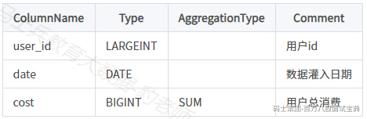

建表语句如下：

```plain
CREATE TABLE IF NOT EXISTS example_db.test
(
`user_id` LARGEINT NOT NULL COMMENT "用户id",
`date` DATE NOT NULL COMMENT "数据灌入日期",
`cost` BIGINT SUM COMMENT "用户总消费"
)
AGGREGATE KEY(`user_id`, `date`)
DISTRIBUTED BY HASH(`user_id`) BUCKETS 1
PROPERTIES (
"replication_allocation" = "tag.location.default: 1"
);
```

向表中分别插入两批次数据，第一批次SQL如下：

```plain
insert into example_db.test values 
(10001,"2017-11-20",50),
(10002,"2017-11-21",39);
```

第二批次SQL如下：

```plain
insert into example_db.test values 
(10001,"2017-11-20",1),
(10001,"2017-11-21",5),
(10003,"2017-11-22",22);
```

可以看到"10001,2017-11-20"这条数据虽然分在了两个批次中，但是由于设置了Aggregate Key 所以是相同数据，进行了聚合。两批次数据插入后，test表中数据如下：

*(⚠️ 图片缺失:源知识库原图已失效)*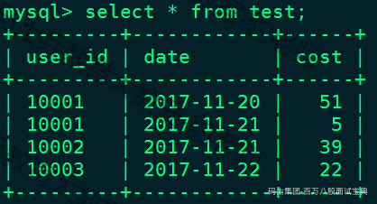

另外， **在聚合列（** Value **）上，执行与聚合类型不一致的聚合类查询时，要注意语意。** 比如我们在如上示例中执行如下查询：

```plain
mysql> select min(cost) from test;
+-------------+
| min(`cost`) |
+-------------+
|           5 |
+-------------+
1 row in set (0.03 sec)
```

以上结果得到的是5，而不是1，归根结底就是底层数据进行了合并，是一致性保证的体现。这种一致性的保证，在某些查询中，会极大的降低查询效率。例如，在"select count(\*) from table"这种操作中，这种一致性保证就会大幅降低查询效率，原因如下：

在其他数据库中，这类查询都会很快的返回结果，因为在实现上，我们可以通过如" **导入时对行进行计数，保存** **count** **的统计信息**"，或者在查询时" **仅扫描某一列数据，获得** **count** **值**"的方式， **只需很小的开销，即可获得查询结果** 。但是在 Doris 的聚合模型中，这种查询的开销非常大。

以上案例中，我们执行"select count(\*) from test;"正确结果为4，为了得到正确的结果，我们必须同时读取 user\_id 和 date 这两列的数据， **再加上查询时聚合** ，才能返回4 这个正确的结果。也就是说，在 count() 查询中，Doris 必须扫描所有的 AGGREGATE KEY 列（这里就是 user\_id 和 date），并且聚合后，才能得到语意正确的结果，当聚合列非常多时，count() 查询需要扫描大量的数据，效率低下。

因此， **当业务上有频繁的** **count(****\*****)** **查询时** ，我们建议用户 **通过增加一个值恒为** **1** **的，聚合类型为** **SUM** **的列来模拟** **count** 。如刚才的例子中的表结构，我们修改如下：

*(⚠️ 图片缺失:源知识库原图已失效)*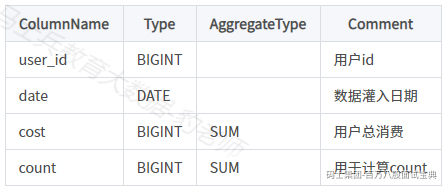

增加一个 count 列，并且导入数据中，该列值恒为 1。则 select count(\*) from table; 的结果等价于 select sum(count) from table;。而后者的查询效率将远高于前者。不过这种方式也有使用限制，就是用户需要自行保证，不会重复导入 AGGREGATE KEY 列都相同的行。否则，select sum(count) from table; 只能表述原始导入的行数，而不是 select count(\*) from table; 的语义。

建表语句如下：

```plain
CREATE TABLE IF NOT EXISTS example_db.test1
(
`user_id` LARGEINT NOT NULL COMMENT "用户id",
`date` DATE NOT NULL COMMENT "数据灌入日期",
`cost` BIGINT SUM COMMENT "用户总消费",
`count` BIGINT SUM COMMENT "用于计算count"
)
AGGREGATE KEY(`user_id`, `date`)
DISTRIBUTED BY HASH(`user_id`) BUCKETS 1
PROPERTIES (
"replication_allocation" = "tag.location.default: 1"
);
```

插入如下数据：

```plain
insert into test1 values 
(10001,"2017-11-20",50,1),
(10002,"2017-11-21",39,1),
(10001,"2017-11-21",5,1),
(10003,"2017-11-22",22,1);
```

执行sql语句对比：

```plain
# select count(*) from test1; 等价  select sum(count) from test1(效率高);
mysql> select count(*) from test1;
+----------+
| count(*) |
+----------+
|        4 |
+----------+
1 row in set (0.04 sec)

mysql> select sum(*) from test1;
+----------+
| count(*) |
+----------+
|        4 |
+----------+
1 row in set (0.03 sec)
```

此外，聚合模型的局限性注意以下几点：

1. Unique模型的写时合并没有聚合模型的局限性（效率低下局限），因为写时合并原理是写入数据时已经将数据合并并会对过时数据进行标记删除，在数据查询时不需进行任何数据聚合，在测试环境中，count(\*) 查询在Unique模型的写时合并实现上的性能，相比聚合模型有10倍以上的提升。

2. Duplicate 模型没有聚合模型的这个局限性。因为该模型不涉及聚合语意，在做 count(\*) 查询时，任意选择一列查询，即可得到语意正确的结果。

3. Duplicate、Aggregate、Unique 模型，都会在建表指定 key 列，然而实际上是有所区别的：对于 Duplicate 模型，表的key列，可以认为只是 "排序列"，并非起到唯一标识的作用。而 Aggregate、Unique 模型这种聚合类型的表，key 列是兼顾 "排序列" 和 "唯一标识列"，是真正意义上的" key 列"。

### 3.3.5数据模型的选择建议

Doris中数据模型在建表时就已经确定，且无法修改。所以，选择一个合适的数据模型非常重要。如果在建表时没有指定数据模型，doris会根据创建列是否有聚合字段来决定使用什么模型，没有聚合字段默认是Duplicate数据存储模型。

#### 3.3.5.1Aggregate数据模型选择

Aggregate 模型可以通过预聚合，极大地降低聚合查询时所需扫描的数据量和查询的计算量，非常适合有固定模式的报表类查询场景。但是该模型对 count(\*) 查询很不友好。同时因为固定了 Value 列上的聚合方式，在进行其他类型的聚合查询时，需要考虑语意正确性。

#### 3.3.5.2Unique数据模型选择

Unique模型针对需要唯一主键约束的场景，可以保证主键唯一性约束。但是无法利用ROLLUP等预聚合带来的查询优势。

对于聚合查询有较高性能需求的用户，推荐使用自1.2版本加入的写时合并实现。

Unique 模型仅支持整行更新，如果用户既需要唯一主键约束，又需要更新部分列（例如将多张源表导入到一张 doris 表的情形），则可以考虑使用 Aggregate 模型，同时将非主键列的聚合类型设置为 REPLACE\_IF\_NOT\_NULL。具体的用法可以参考语法手册。

#### 3.3.5.3Duplicate数据模型选择

Duplicate 这种数据模型适用于既没有聚合需求，又没有主键唯一性约束的原始数据的存储，适合任意维度的 Ad-hoc 查询。虽然同样无法利用预聚合的特性，但是不受聚合模型的约束，可以发挥列存模型的优势（只读取相关列，而不需要读取所有 Key 列）。

## 3.4列定义建议

关于Doris表的类型，可以通过在 mysql-client 中执行 HELP CREATE TABLE; 查看。在定义Doris表中列类型时有如下建议：

1. AGGREGATE KEY 数据模型Key 列必须在所有 Value 列之前。

2. 尽量选择整型类型。因为整型类型的计算和查找效率远高于字符串。

3. 对于不同长度的整型类型的选择原则，遵循够用即可。

4. 对于 VARCHAR 和 STRING 类型的长度，遵循够用即可。

5. 表中一行数据所有列总的字节数不能超过100KB。如果数据一行非常大，建议拆分数据进行多表存储。

## 3.5分区和分桶

Doris 支持两层的数据划分：

第一层是 Partition，即分区。用户可以指定某一维度列作为分区列，并指定每个分区的取值范围，分区支持 Range 和 List 的划分方式。

第二层是 Bucket分桶（Tablet），仅支持 Hash 的划分方式，用户可以指定一个或多个维度列以及桶数对数据进行 HASH 分布或者不指定分桶列设置成 Random Distribution对数据进行随机分布。

创建Doris表时也可以仅使用一层分区，使用一层分区时，只支持Bucket分桶划分，这种表叫做**单分区表；****如果一张表既有分区又有分桶，这张表叫做****复合分区表**。

下面我们来分别介绍下分区以及分桶。

### 3.5.1分区Partition

分区用于将数据划分成不同区间, 逻辑上可以理解为将原始表划分成了多个部分。可以方便的按分区对数据进行管理，例如，删除数据时，更加迅速。Partition支持Range和List的划分方式。

使用分区时注意点如下：

1. Partition 列可以指定一列或多列，分区列必须为 KEY 列。

2. 不论分区列是什么类型，在写分区值时，都需要加双引号。

3. 分区数量理论上没有上限。

4. 当不使用 Partition 建表时，系统会自动生成一个和表名同名的，全值范围的 Partition。该 Partition 对用户不可见，并且不可删改。

5. 创建分区时不可添加范围重叠的分区。

#### 3.5.1.1Ranage分区

业务上，多数用户会选择采用按时间进行partition。Range分区列通常为时间列，以方便管理新旧数据。

##### 3.5.1.1.1创建Range分区方式

Partition支持通过"VALUES [...)"指定下界，生成一个左闭右开的区间。也支持通过" VALUES LESS THAN (...)"仅指定上界，系统会将前一个分区的上界作为该分区的下界，生成一个左闭右开的区。从Doris1.2.0版本后也支持通过"FROM(...) TO (...) INTERVAL ..."来批量创建分区。下面分别进行演示。

- 通过"VALUES [...)" **创建** Range **分区**

通过"VALUES [...)"创建Range分区表example\_db.example\_range\_tbl1:

```plain
CREATE TABLE IF NOT EXISTS example_db.example_range_tbl1
(
`user_id` LARGEINT NOT NULL COMMENT "用户id",
`date` DATE NOT NULL COMMENT "数据灌入日期时间",
`timestamp` DATETIME NOT NULL COMMENT "数据灌入的时间戳",
`city` VARCHAR(20) COMMENT "用户所在城市",
`age` SMALLINT COMMENT "用户年龄",
`sex` TINYINT COMMENT "用户性别",
`last_visit_date` DATETIME REPLACE DEFAULT "1970-01-01 00:00:00" COMMENT "用户最后一次访问时间",
`cost` BIGINT SUM DEFAULT "0" COMMENT "用户总消费",
`max_dwell_time` INT MAX DEFAULT "0" COMMENT "用户最大停留时间",
`min_dwell_time` INT MIN DEFAULT "99999" COMMENT "用户最小停留时间"
)
ENGINE=OLAP
AGGREGATE KEY(`user_id`, `date`, `timestamp`, `city`, `age`, `sex`)
PARTITION BY RANGE(`date`)
(
PARTITION `p201701` VALUES [("2017-01-01"),("2017-02-01")),
PARTITION `p201702` VALUES [("2017-02-01"),("2017-03-01")),
PARTITION `p201703` VALUES [("2017-03-01"),("2017-04-01"))
)
DISTRIBUTED BY HASH(`user_id`) BUCKETS 16
PROPERTIES
(
"replication_num" = "3"
);
```

查看表example\_db.example\_range\_tbl1分区信息：

```plain
mysql> SHOW  PARTITIONS FROM example_db.example_range_tbl1\G;
*************************** 1. row ***************************
             PartitionId: 13898
           PartitionName: p201701
          VisibleVersion: 1
      VisibleVersionTime: 2023-02-08 16:36:24
                   State: NORMAL
            PartitionKey: date
                   Range: [types: [DATE]; keys: [2017-01-01]; ..types: [DATE]; keys: [2017-02-01]; )
         DistributionKey: user_id
                 Buckets: 16
          ReplicationNum: 3
           StorageMedium: HDD
            CooldownTime: 9999-12-31 23:59:59
     RemoteStoragePolicy: 
LastConsistencyCheckTime: NULL
                DataSize: 0.000 
              IsInMemory: false
       ReplicaAllocation: tag.location.default: 3
*************************** 2. row ***************************
             PartitionId: 13899
           PartitionName: p201702
          VisibleVersion: 1
      VisibleVersionTime: 2023-02-08 16:36:24
                   State: NORMAL
            PartitionKey: date
                   Range: [types: [DATE]; keys: [2017-02-01]; ..types: [DATE]; keys: [2017-03-01]; )
         DistributionKey: user_id
                 Buckets: 16
          ReplicationNum: 3
           StorageMedium: HDD
            CooldownTime: 9999-12-31 23:59:59
     RemoteStoragePolicy: 
LastConsistencyCheckTime: NULL
                DataSize: 0.000 
              IsInMemory: false
       ReplicaAllocation: tag.location.default: 3
*************************** 3. row ***************************
             PartitionId: 13900
           PartitionName: p201703
          VisibleVersion: 1
      VisibleVersionTime: 2023-02-08 16:36:24
                   State: NORMAL
            PartitionKey: date
                   Range: [types: [DATE]; keys: [2017-03-01]; ..types: [DATE]; keys: [2017-04-01]; )
         DistributionKey: user_id
                 Buckets: 16
          ReplicationNum: 3
           StorageMedium: HDD
            CooldownTime: 9999-12-31 23:59:59
     RemoteStoragePolicy: 
LastConsistencyCheckTime: NULL
                DataSize: 0.000 
              IsInMemory: false
       ReplicaAllocation: tag.location.default: 3
3 rows in set (0.01 sec)
```

- **通过"** VALUES LESS THAN (...)" **创建** Ranage **分区**

通过"VALUES LESS THAN(...)"创建Range分区表example\_db.example\_range\_tbl2:

```plain
CREATE TABLE IF NOT EXISTS example_db.example_range_tbl2
(
`user_id` LARGEINT NOT NULL COMMENT "用户id",
`date` DATE NOT NULL COMMENT "数据灌入日期时间",
`timestamp` DATETIME NOT NULL COMMENT "数据灌入的时间戳",
`city` VARCHAR(20) COMMENT "用户所在城市",
`age` SMALLINT COMMENT "用户年龄",
`sex` TINYINT COMMENT "用户性别",
`last_visit_date` DATETIME REPLACE DEFAULT "1970-01-01 00:00:00" COMMENT "用户最后一次访问时间",
`cost` BIGINT SUM DEFAULT "0" COMMENT "用户总消费",
`max_dwell_time` INT MAX DEFAULT "0" COMMENT "用户最大停留时间",
`min_dwell_time` INT MIN DEFAULT "99999" COMMENT "用户最小停留时间"
)
ENGINE=OLAP
AGGREGATE KEY(`user_id`, `date`, `timestamp`, `city`, `age`, `sex`)
PARTITION BY RANGE(`date`)
(
PARTITION `p201701` VALUES LESS THAN ("2017-02-01"),
PARTITION `p201702` VALUES LESS THAN ("2017-03-01"),
PARTITION `p201703` VALUES LESS THAN ("2017-04-01")
)
DISTRIBUTED BY HASH(`user_id`) BUCKETS 16
PROPERTIES
(
"replication_num" = "3"
);
```

注意：通过" VALUES LESS THAN (...)"创建分区仅指定上界，系统会将前一个分区的上界作为该分区的下界，生成一个左闭右开的区。最开始分区的下界为该分区字段的MIN\_VALUE,DATE类型默认就是0000-01-01。

查看表 example\_db.example\_range\_tbl2分区信息：

```plain
mysql> show partitions from example_db.example_range_tbl2\G;
*************************** 1. row ***************************
             PartitionId: 14095
           PartitionName: p201701
          VisibleVersion: 1
      VisibleVersionTime: 2023-02-08 16:42:20
                   State: NORMAL
            PartitionKey: date
                   Range: [types: [DATE]; keys: [0000-01-01]; ..types: [DATE]; keys: [2017-02-01]; )
         DistributionKey: user_id
                 Buckets: 16
          ReplicationNum: 3
           StorageMedium: HDD
            CooldownTime: 9999-12-31 23:59:59
     RemoteStoragePolicy: 
LastConsistencyCheckTime: NULL
                DataSize: 0.000 
              IsInMemory: false
       ReplicaAllocation: tag.location.default: 3
*************************** 2. row ***************************
             PartitionId: 14096
           PartitionName: p201702
          VisibleVersion: 1
      VisibleVersionTime: 2023-02-08 16:42:20
                   State: NORMAL
            PartitionKey: date
                   Range: [types: [DATE]; keys: [2017-02-01]; ..types: [DATE]; keys: [2017-03-01]; )
         DistributionKey: user_id
                 Buckets: 16
          ReplicationNum: 3
           StorageMedium: HDD
            CooldownTime: 9999-12-31 23:59:59
     RemoteStoragePolicy: 
LastConsistencyCheckTime: NULL
                DataSize: 0.000 
              IsInMemory: false
       ReplicaAllocation: tag.location.default: 3
*************************** 3. row ***************************
             PartitionId: 14097
           PartitionName: p201703
          VisibleVersion: 1
      VisibleVersionTime: 2023-02-08 16:42:20
                   State: NORMAL
            PartitionKey: date
                   Range: [types: [DATE]; keys: [2017-03-01]; ..types: [DATE]; keys: [2017-04-01]; )
         DistributionKey: user_id
                 Buckets: 16
          ReplicationNum: 3
           StorageMedium: HDD
            CooldownTime: 9999-12-31 23:59:59
     RemoteStoragePolicy: 
LastConsistencyCheckTime: NULL
                DataSize: 0.000 
              IsInMemory: false
       ReplicaAllocation: tag.location.default: 3
3 rows in set (0.01 sec)
```

- **通过"** FROM(...) TO (...) INTERVAL ..." **创建** Ranage **分区**

通过"FROM(...) TO (...) INTERVAL ..."创建Range分区表example\_db.example\_range\_tbl2:

```plain
CREATE TABLE IF NOT EXISTS example_db.example_range_tbl3
(
`user_id` LARGEINT NOT NULL COMMENT "用户id",
`date` DATE NOT NULL COMMENT "数据灌入日期时间",
`timestamp` DATETIME NOT NULL COMMENT "数据灌入的时间戳",
`city` VARCHAR(20) COMMENT "用户所在城市",
`age` SMALLINT COMMENT "用户年龄",
`sex` TINYINT COMMENT "用户性别",
`last_visit_date` DATETIME REPLACE DEFAULT "1970-01-01 00:00:00" COMMENT "用户最后一次访问时间",
`cost` BIGINT SUM DEFAULT "0" COMMENT "用户总消费",
`max_dwell_time` INT MAX DEFAULT "0" COMMENT "用户最大停留时间",
`min_dwell_time` INT MIN DEFAULT "99999" COMMENT "用户最小停留时间"
)
ENGINE=OLAP
AGGREGATE KEY(`user_id`, `date`, `timestamp`, `city`, `age`, `sex`)
PARTITION BY RANGE(`date`)
(
 FROM ("2017-01-03") TO ("2017-01-06") INTERVAL 1 DAY
)
DISTRIBUTED BY HASH(`user_id`) BUCKETS 16
PROPERTIES
(
"replication_num" = "3"
);
```

注意，以上"FROM(...) TO (...) INTERVAL ..."这种批量创建分区后面指定的INTERVAL还可以指定成YEAR、MONTH、WEEK、DAY、HOUR。

查看表 example\_db.example\_range\_tbl3分区信息：

```plain
mysql> show partitions from example_db.example_range_tbl3\G;
*************************** 1. row ***************************
             PartitionId: 14489
           PartitionName: p_20170103
          VisibleVersion: 1
      VisibleVersionTime: 2023-02-08 16:54:18
                   State: NORMAL
            PartitionKey: date
                   Range: [types: [DATE]; keys: [2017-01-03]; ..types: [DATE]; keys: [2017-01-04]; )
         DistributionKey: user_id
                 Buckets: 16
          ReplicationNum: 3
           StorageMedium: HDD
            CooldownTime: 9999-12-31 23:59:59
     RemoteStoragePolicy: 
LastConsistencyCheckTime: NULL
                DataSize: 0.000 
              IsInMemory: false
       ReplicaAllocation: tag.location.default: 3
*************************** 2. row ***************************
             PartitionId: 14490
           PartitionName: p_20170104
          VisibleVersion: 1
      VisibleVersionTime: 2023-02-08 16:54:18
                   State: NORMAL
            PartitionKey: date
                   Range: [types: [DATE]; keys: [2017-01-04]; ..types: [DATE]; keys: [2017-01-05]; )
         DistributionKey: user_id
                 Buckets: 16
          ReplicationNum: 3
           StorageMedium: HDD
            CooldownTime: 9999-12-31 23:59:59
     RemoteStoragePolicy: 
LastConsistencyCheckTime: NULL
                DataSize: 0.000 
              IsInMemory: false
       ReplicaAllocation: tag.location.default: 3
*************************** 3. row ***************************
             PartitionId: 14491
           PartitionName: p_20170105
          VisibleVersion: 1
      VisibleVersionTime: 2023-02-08 16:54:18
                   State: NORMAL
            PartitionKey: date
                   Range: [types: [DATE]; keys: [2017-01-05]; ..types: [DATE]; keys: [2017-01-06]; )
         DistributionKey: user_id
                 Buckets: 16
          ReplicationNum: 3
           StorageMedium: HDD
            CooldownTime: 9999-12-31 23:59:59
     RemoteStoragePolicy: 
LastConsistencyCheckTime: NULL
                DataSize: 0.000 
              IsInMemory: false
       ReplicaAllocation: tag.location.default: 3
3 rows in set (0.01 sec)
```

##### 3.5.1.1.2增删分区

以上是三种方式来创建Range分区，下面对表example\_db.example\_range\_tbl2进行分区增删操作，演示分区范围的变化情况。

目前表example\_db.example\_range\_tbl2 中的分区情况如下:

```plain
p201701: [MIN_VALUE,  2017-02-01)
p201702: [2017-02-01, 2017-03-01)
p201703: [2017-03-01, 2017-04-01)
```

通过以下SQL命令来对表example\_db.example\_range\_tbl2 增加一个分区：

```plain
mysql> ALTER TABLE example_db.example_range_tbl2 ADD PARTITION p201705 VALUES LESS THAN ("2017-06-01");
Query OK, 0 rows affected (0.05 sec)
```

注意：关于操作分区注意项参考官网：<https://doris.apache.org/zh-CN/docs/dev/sql-manual/sql-reference/Data-Definition-Statements/Alter/ALTER-TABLE-PARTITION>

增加分区后，表example\_db.example\_range\_tbl2 中的分区情况如下：

```plain
p201701: [MIN_VALUE,  2017-02-01)
p201702: [2017-02-01, 2017-03-01)
p201703: [2017-03-01, 2017-04-01)
p201705: [2017-04-01, 2017-06-01)
```

此时，我们删除分区p201703，SQL命令如下：

```plain
mysql> ALTER TABLE example_db.example_range_tbl2 DROP PARTITION p201703;
Query OK, 0 rows affected (0.01 sec)
```

删除分区p201703后，分区结果如下：

```plain
p201701: [MIN_VALUE,  2017-02-01)
p201702: [2017-02-01, 2017-03-01)
p201705: [2017-04-01, 2017-06-01)
```

以上删除分区后，注意到 p201702 和 p201705 的分区范围并没有发生变化，而这两个分区之间，出现了一个空洞：[2017-03-01, 2017-04-01)，即如果导入的数据范围在这个空洞范围内，是无法导入的。

继续删除分区p201702，空洞范围变为[2017-02-01, 2017-04-01)，操作如下：

```plain
#删除分区p201702
mysql> ALTER TABLE example_db.example_range_tbl2 DROP PARTITION p201702;
Query OK, 0 rows affected (0.01 sec)

#删除后分区如下
p201701: [MIN_VALUE,  2017-02-01)
p201705: [2017-04-01, 2017-06-01)
```

现在对表example\_db.example\_range\_tbl2 再次增加一个分区，分区结果如下：

```plain
#增加一个分区 p201702new VALUES LESS THAN ("2017-03-01")
mysql> ALTER TABLE example_db.example_range_tbl2 ADD PARTITION p201702new VALUES LESS THAN ("2017-03-01");
Query OK, 0 rows affected (0.05 sec)

#表分区结果
p201701:    [MIN_VALUE,  2017-02-01)
p201702new: [2017-02-01, 2017-03-01)
p201705:    [2017-04-01, 2017-06-01)
```

可以看到空洞范围缩小为：[2017-03-01, 2017-04-01)。

现在删除分区p201701,并添加分区p201612 VALUES LESS THAN ("2017-01-01")，SQL操作及分区结果如下:

```plain
#删除分区p201701
mysql> ALTER TABLE example_db.example_range_tbl2 DROP PARTITION p201701;
Query OK, 0 rows affected (0.01 sec)

#添加分区 p201612 VALUES LESS THAN ("2017-01-01")
mysql> ALTER TABLE example_db.example_range_tbl2 ADD PARTITION p201612 VALUES LESS THAN ("2017-01-01");
Query OK, 0 rows affected (0.05 sec)

#表分区结果
p201612:    [MIN_VALUE,  2017-01-01)
p201702new: [2017-02-01, 2017-03-01)
p201705:    [2017-04-01, 2017-06-01) 
```

综上，分区的删除不会改变已存在分区的范围。删除分区可能出现空洞。通过 VALUES LESS THAN 语句增加分区时，分区的下界紧接上一个分区的上界。

##### 3.5.1.1.3多列分区

Range分区除了上述我们看到的单列分区，也支持多列分区。创建表example\_range\_tbl4，该表为多列分区，建表语句如下：

```plain
CREATE TABLE IF NOT EXISTS example_db.example_range_tbl4
(
`date` DATE NOT NULL COMMENT "数据灌入日期时间",
`id` INT NOT NULL COMMENT "用户id",
`age` SMALLINT COMMENT "用户年龄",
`cost` BIGINT SUM DEFAULT "0" COMMENT "用户总消费"
)
ENGINE=OLAP
AGGREGATE KEY(`date`,`id`,`age`)
PARTITION BY RANGE(`date`,`id`)
(
    PARTITION `p201701_1000` VALUES LESS THAN ("2017-02-01", "1000"),
    PARTITION `p201702_2000` VALUES LESS THAN ("2017-03-01", "2000"),
    PARTITION `p201703_all`  VALUES LESS THAN ("2017-04-01")
)
DISTRIBUTED BY HASH(`id`) BUCKETS 16
PROPERTIES
(
"replication_num" = "3"
);
```

创建以上表分区是按照date和id两个列来进行分区，表创建完成后，分区如下：

```plain
* p201701_1000: [(MIN_VALUE, MIN_VALUE), ("2017-02-01", "1000") )
* p201702_2000: [("2017-02-01", "1000"), ("2017-03-01", "2000") )
* p201703_all: [("2017-03-01", "2000"), ("2017-04-01", MIN_VALUE))
```

可以看到最后一个分区用户缺省只指定了 date 列的分区值，所以 id 列的分区值会默认填充 MIN\_VALUE。当用户插入数据时，分区列值会按照顺序依次比较，最终得到对应的分区。向表中依次插入以下几条数据：

```plain
2#插入以下7条属于不同分区的数据
insert into example_db.example_range_tbl4 values 
("2017-01-01",200,18,10),
("2017-01-01",2000,19,11),
("2017-02-01",100,20,12),
("2017-02-01",2000,21,13),
("2017-02-15",5000,22,14),
("2017-03-01",2000,23,15),
("2017-03-10",1,24,16);

#插入以下两条不属于任何分区的数据，会报错
insert into example_db.example_range_tbl4 values 
("2017-04-01",1000,25,17),
("2017-05-01",1000,26,18);
```

可以通过以下命令来查看表 example\_db.example\_range\_tbl4 对应分区数据：

```plain
#select col1,col2... from db.table PARTITION partition_name；
mysql> select * from example_range_tbl4 partition p201701_1000;
+------------+------+------+------+
| date       | id   | age  | cost |
+------------+------+------+------+
| 2017-01-01 | 2000 |   19 |   11 |
| 2017-01-01 |  200 |   18 |   10 |
| 2017-02-01 |  100 |   20 |   12 |
+------------+------+------+------+

mysql> select * from example_range_tbl4 partition p201702_2000;
+------------+------+------+------+
| date       | id   | age  | cost |
+------------+------+------+------+
| 2017-02-15 | 5000 |   22 |   14 |
| 2017-02-01 | 2000 |   21 |   13 |
+------------+------+------+------+
2 rows in set (0.07 sec)

mysql> select * from example_range_tbl4 partition p201703_all;
+------------+------+------+------+
| date       | id   | age  | cost |
+------------+------+------+------+
| 2017-03-01 | 2000 |   23 |   15 |
| 2017-03-10 |    1 |   24 |   16 |
+------------+------+------+------+
2 rows in set (0.08 sec)
```

通过以上查询我们发现，数据对应分区情况如下：

```plain
* 数据 --> 分区
* 2017-01-01, 200 --> p201701_1000
* 2017-01-01, 2000 --> p201701_1000
* 2017-02-01, 100 --> p201701_1000
* 2017-02-01, 2000 --> p201702_2000
* 2017-02-15, 5000 --> p201702_2000
* 2017-03-01, 2000 --> p201703_all
* 2017-03-10, 1 --> p201703_all
* 2017-04-01, 1000 --> 无法导入
* 2017-05-01, 1000 --> 无法导入
```

注意：以上数据对应到哪个分区是一个个分区进行匹配，首先看第一个列是否在第一个分区中，不在再判断第二个列是否在第一个分区中，如果都不在那么就以此类推判断数据是否在第二个分区，直到进入合适的数据分区。

#### 3.5.1.2List分区

业务上，用户可以选择城市或者其他枚举值进行partition，对于这种枚举类型数据列进行分区就可以使用List分区。List分区列支持 BOOLEAN, TINYINT, SMALLINT, INT, BIGINT, LARGEINT, DATE, DATETIME, CHAR, VARCHAR 数据类型， **分区值为枚举值。只有当数据为目标分区枚举值其中之一时，才可以命中分区。**

##### 3.5.1.2.1创建List分区方式

Partition 支持通过 VALUES IN (...) 来指定每个分区包含的枚举值。举例如下，创建List分区表example\_db.example\_list\_tbl1如下：

```plain
CREATE TABLE IF NOT EXISTS example_db.example_list_tbl1
(
`user_id` LARGEINT NOT NULL COMMENT "用户id",
`date` DATE NOT NULL COMMENT "数据灌入日期时间",
`timestamp` DATETIME NOT NULL COMMENT "数据灌入的时间戳",
`city` VARCHAR(20) NOT NULL COMMENT "用户所在城市",
`age` SMALLINT COMMENT "用户年龄",
`sex` TINYINT COMMENT "用户性别",
`last_visit_date` DATETIME REPLACE DEFAULT "1970-01-01 00:00:00" COMMENT "用户最后一次访问时间",
`cost` BIGINT SUM DEFAULT "0" COMMENT "用户总消费",
`max_dwell_time` INT MAX DEFAULT "0" COMMENT "用户最大停留时间",
`min_dwell_time` INT MIN DEFAULT "99999" COMMENT "用户最小停留时间"
)
ENGINE=olap
AGGREGATE KEY(`user_id`, `date`, `timestamp`, `city`, `age`, `sex`)
PARTITION BY LIST(`city`)
(
PARTITION `p_cn` VALUES IN ("Beijing", "Shanghai", "Hong Kong"),
PARTITION `p_usa` VALUES IN ("New York", "San Francisco"),
PARTITION `p_jp` VALUES IN ("Tokyo")
)
DISTRIBUTED BY HASH(`user_id`) BUCKETS 16
PROPERTIES
(
"replication_num" = "3"
);
```

创建完成表example\_db.example\_list\_tbl1之后，会自动生成如下3个分区：

```plain
p_cn: ("Beijing", "Shanghai", "Hong Kong")
p_usa: ("New York", "San Francisco")
p_jp: ("Tokyo")
```

##### 3.5.1.2.2增删分区

执行如下命令对表example\_db.example\_list\_tbl1 增加分区：

```plain
#增加分区 p_uk VALUES IN ("London")
mysql> ALTER TABLE example_db.example_list_tbl1 ADD PARTITION p_uk VALUES IN ("London");
Query OK, 0 rows affected (0.04 sec)

#分区结果如下：
p_cn: ("Beijing", "Shanghai", "Hong Kong")
p_usa: ("New York", "San Francisco")
p_jp: ("Tokyo")
p_uk: ("London")
```

执行如下命令对表example\_db.example\_list\_tbl1删除分区：

```plain
#删除分区 p_jp
mysql> ALTER TABLE example_db.example_list_tbl1 DROP PARTITION p_jp;
Query OK, 0 rows affected (0.01 sec)

#分区结果如下：
p_cn: ("Beijing", "Shanghai", "Hong Kong")
p_usa: ("New York", "San Francisco")
p_uk: ("London")
```

向表example\_db.example\_list\_tbl1中插入如下数据，观察数据所属分区情况：

```plain
#向表中插入如下数据，数据对应的city都能匹配对应分区
insert into example_db.example_list_tbl1 values 
(10000,"2017-10-01","2017-10-01 08:00:05","Beijing",20,0,"2017-10-01 06:00:00",20,10,10),
(10000,"2017-10-01","2017-10-01 09:00:05","Shanghai",20,0,"2017-10-01 07:00:00",15,2,2),
(10001,"2017-10-01","2017-10-01 18:12:10","Hong Kong",30,1,"2017-10-01 17:05:45",2,22,22),
(10002,"2017-10-02","2017-10-02 13:10:00","New York",20,1,"2017-10-02 12:59:12",200,5,5),
(10003,"2017-10-02","2017-10-02 13:15:00","San Francisco",32,0,"2017-10-02 11:20:00",30,11,11),
(10004,"2017-10-01","2017-10-01 12:12:48","London",35,0,"2017-10-01 10:00:15",100,3,3);

#查询 p_cn 分区数据，查询其他分区数据一样语法
mysql> select * from example_db.example_list_tbl1 partition p_cn;
+---------+------------+---------------------+-----------+
| user_id | date       | timestamp           | city      |...
+---------+------------+---------------------+-----------+
| 10001   | 2017-10-01 | 2017-10-01 18:12:10 | Hong Kong |...
| 10000   | 2017-10-01 | 2017-10-01 08:00:05 | Beijing   |...
| 10000   | 2017-10-01 | 2017-10-01 09:00:05 | Shanghai  |...
+---------+------------+---------------------+-----------+

#向表中插入如下数据，不属于表中任何分区会报错
insert into example_db.example_list_tbl1 values 
(10004,"2017-10-03","2017-10-03 12:38:20","Tokyo",35,0,"2017-10-03 10:20:22",11,6,6);
```

##### 3.5.1.2.3多列分区

List分区也支持多列分区。创建多列分区表example\_db.example\_list\_tbl2如下：

```plain
CREATE TABLE IF NOT EXISTS example_db.example_list_tbl2
(
`id` LARGEINT NOT NULL COMMENT "用户id",
`date` DATE NOT NULL COMMENT "数据灌入日期时间",
`city` VARCHAR(20) NOT NULL COMMENT "用户所在城市",
`age` SMALLINT COMMENT "用户年龄",
`cost` BIGINT SUM DEFAULT "0" COMMENT "用户总消费"
)
ENGINE=olap
AGGREGATE KEY(`id`, `date`, `city`, `age`)
PARTITION BY LIST(`id`, `city`)
(
    PARTITION `p1_city` VALUES IN (("1", "Beijing"), ("1", "Shanghai")),
    PARTITION `p2_city` VALUES IN (("2", "Beijing"), ("2", "Shanghai")),
    PARTITION `p3_city` VALUES IN (("3", "Beijing"), ("3", "Shanghai"))
)
DISTRIBUTED BY HASH(`id`) BUCKETS 16
PROPERTIES
(
"replication_num" = "3"
);
```

以上表是以id、city列创建的多列分区，分区信息如下：

```plain
p1_city: [("1", "Beijing"), ("1", "Shanghai")]
p2_city: [("2", "Beijing"), ("2", "Shanghai")]
p3_city: [("3", "Beijing"), ("3", "Shanghai")]
```

当数据插入到表中匹配时也是按照每列顺序进行匹配，向表中插入如下数据：

```plain
#向表中插入如下数据，每条数据可以对应到已有分区中
insert into example_db.example_list_tbl2 values 
(1,"2017-10-01","Beijing",18,100),
(1,"2017-10-02","Shanghai",18,101),
(2,"2017-10-03","Shanghai",20,102),
(3,"2017-10-04","Beijing",21,103);

#向表中插入如下数据，每条数据都不能匹配已有分区，报错。
insert into example_db.example_list_tbl2 values 
(1,"2017-10-05","Tianjin",22,104),
(4,"2017-10-06","Beijing",23,105);
```

以上几条数据匹配分区情况如下：

```plain
数据 ---> 分区
1, Beijing ---> p1_city
1, Shanghai ---> p1_city
2, Shanghai ---> p2_city
3, Beijing ---> p3_city
1, Tianjin ---> 无法导入
4, Beijing ---> 无法导入
```

### 3.5.2分桶Bucket

Doris数据表存储中，如果有分区，在插入数据时，数据会按照对应规则匹配写往对应的分区中，如果表除了有分区还有分桶，那么数据在写入某个分区后，还会根据分桶规则将数据写入不同的分桶（Tablet）,目前分桶Bucekt目前仅支持Hash分桶，即根据对应列的hash值将数据划分成不同的分桶（Tablet）。

**建议采用区分度大的列做分桶, 避免出现数据倾斜**，为方便数据恢复, 建议单个 bucket 的 size 不要太大, 保持在 10GB 以内, 所以建表或增加 partition 时请合理考虑 bucket 数目, 其中不同 partition 可指定不同的 buckets 数。

建表时创建分桶表只需要在建表语句中加入distrubution\_desc即可：

```plain
...
DISTRIBUTED BY HASH(`id`) BUCKETS 16
...
```

之前创建的所有分区表都进行了分桶，使用Bucket分桶有以下几个注意点：

1. 如果使用了 Partition，则 DISTRIBUTED ... 语句描述的是数据在各个分区内的划分规则。如果不使用 Partition，则描述的是对整个表的数据的划分规则。

2. **分桶列可以是多列，** Aggregate 和 Unique *模型必须为 Key 列*，Duplicate 模型可以是 key 列和 value 列。分桶列可以和 Partition 列相同或不同。

3. 分桶列的选择，是在"查询吞吐" 和 "查询并发" 之间的一种权衡：

- 如果选择多个分桶列，则数据分布更均匀。如果一个查询条件不包含所有分桶列的等值条件，那么该查询会触发所有分桶同时扫描，这样查询的吞吐会增加，单个查询的延迟随之降低。这个方式适合大吞吐低并发的查询场景。

- 如果仅选择一个或少数分桶列，则对应的点查询可以仅触发一个分桶扫描。此时，当多个点查询并发时，这些查询有较大的概率分别触发不同的分桶扫描，各个查询之间的IO影响较小（尤其当不同桶分布在不同磁盘上时）， **所以这种方式适合高并发的点查询场景。**

4. 分桶的数量理论上没有上限。

### 3.5.3分区和分桶数量和数据量的建议

1. 一个表必须指定分桶列，但可以不指定分区

2. 对于分区表，可以在之后的使用过程中对分区进行增删操作，而对于无分区的表，之后不能再进行增加分区等操作。

3. 分区列和分桶列在表创建之后不可更改，既不能更改分区和分桶列的类型，也不能对这些列进行任何增删操作。所以建议在建表前，先确认使用方式来进行合理的建表。

4. 一个表的 Tablet 总数量等于 (Partition num \* Bucket num)。

5. 一个表的 Tablet 数量，在不考虑扩容的情况下，推荐略多于整个集群的磁盘数量。

6. 单个 Tablet 的数据量理论上没有上下界，但建议在 1G - 10G 的范围内。如果单个 Tablet 数据量过小，则数据的聚合效果不佳，且元数据管理压力大。如果数据量过大，则不利于副本的迁移、补齐，且会增加 Schema Change 或者 Rollup 操作失败重试的代价（这些操作失败重试的粒度是 Tablet）。

7. 当 Tablet 的数据量原则和数量原则冲突时，建议优先考虑数据量原则。

8. 在建表时，每个分区的 Bucket 数量统一指定。但是在动态增加分区时（ADD PARTITION），可以单独指定新分区的 Bucket 数量。可以利用这个功能方便的应对数据缩小或膨胀。

9. 一个 Partition 的 Bucket 数量一旦指定，不可更改。所以在确定 Bucket 数量时，需要预先考虑集群扩容的情况。比如当前只有 3 台 host，每台 host 有 1 块盘。如果 Bucket 的数量只设置为 3 或更小，那么后期即使再增加机器，也不能提高并发度。

10. 举一些例子：假设在有10台BE，每台BE一块磁盘的情况下。如果一个表总大小为 500MB，则可以考虑4-8个tablet分片。5GB：8-16个tablet分片。50GB：32个tablet分片。500GB：建议分区，每个分区大小在 50GB 左右，每个分区16-32个tablet分片。5TB：建议分区，每个分区大小在 50GB 左右，每个分区16-32个tablet分片。

注：表的数据量可以通过 SHOW DATA 命令查看，结果除以副本数，即表的数据量。

*(⚠️ 图片缺失:源知识库原图已失效)*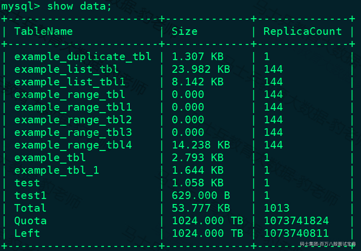

### 3.5.4Random Distribution

如果 OLAP 表没有更新类型的字段，将表的数据分桶模式设置为 RANDOM，则可以避免严重的数据倾斜(数据在导入表对应的分区的时候，单次导入作业每个 batch 的数据将随机选择一个tablet进行写入)，分桶模式设置为RANDOM只需要建表是设置如下：

```plain
...
DISTRIBUTED BY RANDOM  BUCKETS 10
...
```

也可以不跟" **BUCKETS 10**"直接指定RANDOM，默认BUCKETS为10。使用RANDOM分桶模式建表如下：

```plain
CREATE TABLE IF NOT EXISTS example_db.example_list_tbl3
(
`id` LARGEINT NOT NULL COMMENT "用户id",
`date` DATE NOT NULL COMMENT "数据灌入日期时间",
`city` VARCHAR(20) NOT NULL COMMENT "用户所在城市",
`age` SMALLINT COMMENT "用户年龄",
`cost` BIGINT SUM DEFAULT "0" COMMENT "用户总消费"
)
ENGINE=olap
AGGREGATE KEY(`id`, `date`, `city`, `age`)
PARTITION BY LIST(`id`, `city`)
(
    PARTITION `p1_city` VALUES IN (("1", "Beijing"), ("1", "Shanghai")),
    PARTITION `p2_city` VALUES IN (("2", "Beijing"), ("2", "Shanghai")),
    PARTITION `p3_city` VALUES IN (("3", "Beijing"), ("3", "Shanghai"))
)
DISTRIBUTED BY RANDOM  BUCKETS 10
PROPERTIES
(
"replication_num" = "3"
);
```

当表的分桶模式被设置为RANDOM 时，因为没有分桶列，无法根据分桶列的值仅对几个分桶查询，对表进行查询的时候将对命中分区的全部分桶同时扫描，该设置适合对表数据整体的聚合查询分析而不适合高并发的点查询。

如果OLAP表的是Random Distribution的数据分布，那么在数据导入的时候可以设置单tablet导入模式（将load\_to\_single\_tablet 设置为 true），那么在大数据量的导入的时候，一个任务在将数据写入对应的分区时将只写入一个tablet分片，这样将能提高数据导入的并发度和吞吐量，减少数据导入和Compaction导致的写放大问题，保障集群的稳定性。

### 3.5.5复合分区使用场景

以下场景推荐使用复合分区：

1. **有时间维度或类似带有有序值的维度，可以以这类维度列作为分区列。** 分区粒度可以根据导入频次、分区数据量等进行评估。

2. **历史数据删除需求：** 如有删除历史数据的需求（比如仅保留最近N 天的数据）。使用复合分区，可以通过删除历史分区来达到目的。也可以通过在指定分区内发送 DELETE 语句进行数据删除。

3. **解决数据倾斜问题：** 每个分区可以单独指定分桶数量。如按天分区，当每天的数据量差异很大时，可以通过指定分区的分桶数，合理划分不同分区的数据,分桶列建议选择区分度大的列。

当然用户也可以不使用复合分区，即使用单分区，则数据只做 HASH 分布。

## 3.6Properties配置项

在创建表时，可以指定properties设置表属性，目前支持以下属性：

- **replication****\_****num**

指定副本数。默认副本数为3。如果 BE 节点数量小于3，则需指定副本数小于等于 BE 节点数量。在 0.15 版本后，该属性将自动转换成 replication\_allocation 属性，如："replication\_num" = "3" 会自动转换成 "replication\_allocation" = "tag.location.default:3"。

- **replication****\_****allocation**

根据 Tag 设置副本分布情况。该属性可以完全覆盖 replication\_num 属性的功能。

- **storage****\_****medium/storage****\_****cooldown****\_****time**

数据存储介质。storage\_medium 用于声明表数据的初始存储介质，而 storage\_cooldown\_time 用于设定到期时间。示例：

```plain
"storage_medium" = "SSD",
"storage_cooldown_time" = "2020-11-20 00:00:00"
```

这个示例表示数据存放在 SSD 中，并且在 2020-11-20 00:00:00 到期后，会自动迁移到 HDD 存储上，创建表时该时间不能小于当前系统时间。

- **colocate****\_****with**

当需要使用 Colocation Join 功能时，使用这个参数设置 Colocation Group。示例："colocate\_with" = "group1"。

- **bloom****\_****filter****\_****columns**

用户指定需要添加 Bloom Filter 索引的列名称列表。各个列的 Bloom Filter 索引是独立的，并不是组合索引。示例："bloom\_filter\_columns" = "k1, k2, k3"

- **in****\_****memory**

Doris 是没有内存表的概念。这个属性设置成 true, Doris 会尽量将该表的数据块缓存在存储引擎的 PageCache 中，已减少磁盘IO。但这个属性不会保证数据块常驻在内存中，仅作为一种尽力而为的标识。示例："in\_memory" = "true"。

- **compression**

Doris 表的默认压缩方式是 LZ4。1.1版本后，支持将压缩方式指定为ZSTD以获得更高的压缩比。示例："compression"="zstd"。

- **function****\_****column.sequence****\_****col**

当使用 UNIQUE KEY 模型时，可以指定一个sequence列，当KEY列相同时，将按照 sequence 列进行 REPLACE(较大值替换较小值，否则无法替换)。

function\_column.sequence\_col用来指定sequence列到表中某一列的映射，该列可以为整型和时间类型（DATE、DATETIME），创建后不能更改该列的类型。如果设置了function\_column.sequence\_col, function\_column.sequence\_type将被忽略。示例："function\_column.sequence\_col" = 'column\_name'。

- **function****\_****column.sequence****\_****type**

当使用 UNIQUE KEY 模型时，可以指定一个sequence列，当KEY列相同时，将按照 sequence 列进行 REPLACE(较大值替换较小值，否则无法替换)。

这里我们仅需指定顺序列的类型，支持时间类型或整型。Doris 会创建一个隐藏的顺序列。示例："function\_column.sequence\_type" = 'Date'。

- **light****\_****schema****\_****change**

默认true,是否使用light schema change优化。如果设置成 true, 对于值列的加减操作，可以更快地，同步地完成。示例："light\_schema\_change" = 'true'。该功能在 1.2.1 及之后版本默认开启。

- **disable****\_****auto****\_****compaction**

是否对这个表禁用自动compaction，默认false。如果这个属性设置成 true, 后台的自动compaction进程会跳过这个表的所有tablet。示例："disable\_auto\_compaction" = "false"。

- **动态分区相关参数**

动态分区相关参数如下：

1. dynamic\_partition.enable: 用于指定表级别的动态分区功能是否开启。默认为 true。

2. dynamic\_partition.time\_unit: 用于指定动态添加分区的时间单位，可选择为DAY（天），WEEK(周)，MONTH（月），HOUR（时）。

3. dynamic\_partition.start: 用于指定向前删除多少个分区。值必须小于0。默认为 Integer.MIN\_VALUE。

4. dynamic\_partition.end: 用于指定提前创建的分区数量。值必须大于0。

5. dynamic\_partition.prefix: 用于指定创建的分区名前缀，例如分区名前缀为p，则自动创建分区名为p20200108。

6. dynamic\_partition.buckets: 用于指定自动创建的分区分桶数量。

7. dynamic\_partition.create\_history\_partition: 是否创建历史分区。

8. dynamic\_partition.history\_partition\_num: 指定创建历史分区的数量。

9. dynamic\_partition.reserved\_history\_periods: 用于指定保留的历史分区的时间段。

- **数据排序相关参数**

数据排序相关参数如下:

1. data\_sort.sort\_type: 数据排序使用的方法，目前支持两种：lexical/z-order，默认是lexical。

2. data\_sort.col\_num: 数据排序使用的列数，取最前面几列，不能超过总的key 列数。

注意：以上参数也可以通过在 mysql-client 中执行 HELP CREATE TABLE; 查看。

## 3.7关于ENGINE

在Doris中创建表，ENGINE 的类型是 olap，即默认的 ENGINE 类型。只有这个 ENGINE 类型是由 Doris 负责数据管理和存储的。其他 ENGINE 类型，如 mysql、broker、es 等等，本质上只是对外部其他数据库或系统中的表的映射，以保证 Doris 可以读取这些数据。而 Doris 本身并不创建、管理和存储任何非 olap ENGINE 类型的表和数据。

## 3.8Doris索引

索引用于帮助快速过滤或查找数据。目前 Doris 主要支持两类索引：

- 内建的智能索引，包括前缀索引和 ZoneMap 索引;

- 用户创建的二级索引，包括 Bloom Filter 索引和Bitmap倒排索引。

内建索引中 ZoneMap 索引是在列存格式上，对每一列自动维护的索引信息，包括 Min/Max，Null 值个数等等,这种索引对用户透明。

### 3.8.1前缀索引

不同于传统的数据库设计，Doris 不支持在任意列上创建索引,Doris 这类 MPP 架构的 OLAP 数据库，通常都是通过提高并发，来处理大量数据的。

本质上，Doris 的数据存储在类似 SSTable（Sorted String Table，有数据有索引）的数据结构中。该结构是一种有序的数据结构，可以按照指定的列进行排序存储，在这种数据结构上，以排序列作为条件进行查找，会非常的高效。

在 Aggregate、Unique 和 Duplicate 三种数据模型中。底层的数据存储，是按照各自建表语句中，AGGREGATE KEY、UNIQUE KEY 和 DUPLICATE KEY 中指定的列进行排序存储的。

而前缀索引，即在排序的基础上，实现的一种根据给定前缀列，快速查询数据的索引方式， **Doris** 中默认将一行数据的前 **36** 个字节作为这行数据的前缀索引，但是当遇到 **VARCHAR**类型时，前缀索引会直接截断。我们举例说明：

1. **以下表结构的前缀索引为** **user****\_****id(8 Bytes) + age(4 Bytes) + message(prefix 20 Bytes)。**

*(⚠️ 图片缺失:源知识库原图已失效)*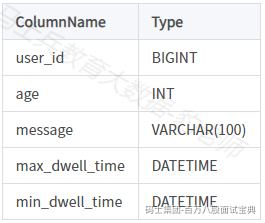

2. **以下表结构的前缀索引为***user**\_**name(20 Bytes)*。即使没有达到 36个字节，因为遇到 VARCHAR，所以直接截断，不再往后继续。

*(⚠️ 图片缺失:源知识库原图已失效)*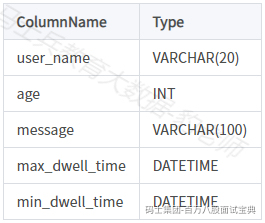

当我们的查询条件，是前缀索引的前缀时，可以极大的加快查询速度。比如在第一个例子中，我们执行如下查询：

```plain
SELECT * FROM table WHERE user_id=1829239 and age=20；
```

该查询的效率会远高于如下查询：

```plain
SELECT * FROM table WHERE age=20；
```

**所以在建表时，正确的选择列顺序，能够极大地提高查询效率。**

因为建表时已经指定了列顺序，所以一个表只有一种前缀索引。这对于使用其他不能命中前缀索引的列作为条件进行的查询来说，效率上可能无法满足需求。因此， **我们可以通过创建** **ROLLUP** **来人为的调整列顺序** ，详情可参考 ROLLUP部分。

### 3.8.2Bitmap索引

#### 3.8.2.1Bitmap位图索引原理

bitmap，位图，是一种数据结构，即bit的集合，每一个bit记录0或者1，代表状态。bitmap index是位图索引，可以针对Doris表中的某些列构建位图索引来加快数据查询速度。

位图索引原理如下，假设我们有一张表数据如下，现有5行数据：

*(⚠️ 图片缺失:源知识库原图已失效)*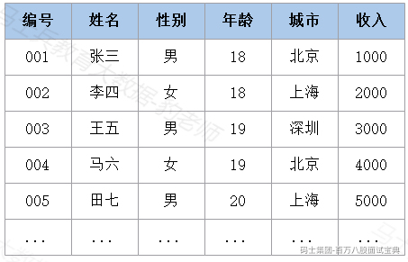

现在需要从表中找出性别列为"男"，城市列是"上海"的数据，如果表中没有索引，这就需要扫描一行行数据判断是否满足指定条件来过滤数据。

如果在"性别"列上创建了位图索引，对于性别这个列及每行数据位置会形成两个向量，即：男(10101),女(01010)

*(⚠️ 图片缺失:源知识库原图已失效)*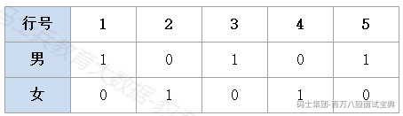

如果也在"城市"列上建立了位图索引，那么对于"城市"列位图索引会生成三个向量，即：北京(10010)，深圳(00100),上海（01001）

*(⚠️ 图片缺失:源知识库原图已失效)*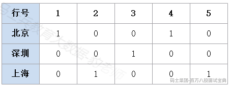

如果我们现在想要查询性别列为"男"，城市列是"上海"的数据，只需要取出男（10101）和上海（01001）两个向量进行and操作，结果生成（00001）向量，就代表（00001）向量中位置为1的位置符合条件，即表中第5行数据使我们需要的数据，提高了查询速度。

#### 3.8.2.2Bitmap位图索引语法

下面创建表来演示Bitmap位图索引用法，创建表 example\_db.example\_bitmap\_index\_tbl ,SQL语句如下：

```plain
CREATE TABLE IF NOT EXISTS example_db.example_bitmap_index_tbl
(
`id` BIGINT NOT NULL COMMENT "用户id",
`age` INT COMMENT "用户年龄",
`name` VARCHAR(100) NOT NULL COMMENT "姓名",
`cost` BIGINT SUM DEFAULT "0" COMMENT "用户总消费"
)
DISTRIBUTED BY HASH(`id`)  BUCKETS 3
PROPERTIES
(
"replication_allocation" = "tag.location.default: 1"
);
```

- **创建索引**

创建索引语法如下：

```plain
CREATE INDEX [IF NOT EXISTS] index_name ON table (某一个列) USING BITMAP COMMENT '注释';
```

对表 example\_db.example\_bitmap\_index\_tbl 中age列添加位图索引：

```plain
mysql> CREATE INDEX  age_index ON example_db.example_bitmap_index_tbl (age) USING BITMAP COMMENT '年龄索引';
Query OK, 0 rows affected (0.10 sec)
```

- **查看索引**

查看索引语法如下,该语句用于展示一个表中索引的相关信息，目前只支持bitmap 索引。

```plain
SHOW INDEX FROM example_db.table_name;
```

查看 example\_db.example\_bitmap\_index\_tbl 中的位图索引：

```plain
mysql> show index from example_db.example_bitmap_index_tbl\G;
*************************** 1. row ***************************
       Table: default_cluster:example_db.example_bitmap_index_tbl
  Non_unique: 
    Key_name: age_index
Seq_in_index: 
 Column_name: age
   Collation: 
 Cardinality: 
    Sub_part: 
      Packed: 
        Null: 
  Index_type: BITMAP
     Comment: 年龄索引
  Properties: 
1 row in set (0.00 sec)
```

- **删除索引**

删除指定table\_name的位图索引，命令如下：

```plain
DROP INDEX [IF EXISTS] index_name ON [db_name.]table_name;
```

删除表example\_db.example\_bitmap\_index\_tbl中的位图索引：

```plain
mysql> DROP INDEX age_index ON example_db.example_bitmap_index_tbl;
Query OK, 0 rows affected (0.05 sec)

#再次查询
mysql> show index from example_db.example_bitmap_index_tbl\G;
Empty set (0.00 sec)
```

#### 3.8.2.3注意事项

1. 目前索引仅支持 bitmap 类型的索引。

2. bitmap 索引仅在单列上创建，不支持多列。

3. bitmap 索引能够应用在 Duplicate、Uniqe数据模型的所有列和 Aggregate模型的key列上。

4. bitmap 索引支持的数据类型如下:

- TINYINT

- SMALLINT

- INT

- BIGINT

- CHAR

- VARCHAR

- DATE

- DATETIME

- LARGEINT

- DECIMAL

- BOOL

5. bitmap索引仅在 Segment V2 下生效。当创建 index 时，表的存储格式将默认转换为 V2 格式。*注意：* ***Apache Doris\_*** ***早期版本的存储格式为*** ***\_Segment V1*** *，在\_\_0.12\_\_版本中实现了新的存储格式\_\_Segment V2**，引入了\_\_Bitmap\_\_索引、内存表、* ***Page Cache*** *、字典压缩以及延迟物化等诸多特性。从\_\_0.13\_\_版本开始，新建表的默认存储格式为\_\_Segment V2**，与此同时也保留了对* *Segment V1\_\_格式的兼容。*

### 3.8.3Bloom Filter索引

#### 3.8.3.1BloomFilter索引原理

BloomFilter是由Bloom在1970年提出的一种多哈希函数映射的快速查找算法。通常应用在一些需要快速判断某个元素是否属于集合，但是并不严格要求100%正确的场合，BloomFilter有以下特点：

- 空间效率高的概率型数据结构，用来检查一个元素是否在一个集合中。

- 对于一个元素检测是否存在的调用，BloomFilter会告诉调用者两个结果之一：可能存在或者一定不存在。

- 缺点是存在误判，告诉你可能存在，不一定真实存在。

布隆过滤器实际上是由一个超长的二进制位数组和一系列的哈希函数组成。二进制位数组初始全部为0，当给定一个待查询的元素时，这个元素会被一系列哈希函数计算映射出一系列的值，所有的值在位数组的偏移量处置为1。

下图所示出一个 m=18, k=3 （m是该Bit数组的大小，k是Hash函数的个数）的Bloom Filter示例。集合中的 x、y、z 三个元素通过 3 个不同的哈希函数散列到位数组中。当查询元素w时，通过Hash函数计算之后因为有一个比特为0，因此w不在该集合中。

*(⚠️ 图片缺失:源知识库原图已失效)*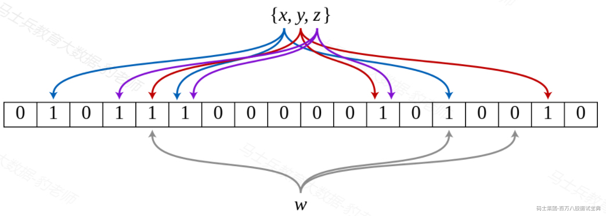

那么怎么判断某个元素是否在集合中呢？同样是这个元素经过哈希函数计算后得到所有的偏移位置，若这些位置全都为1，则判断这个元素在这个集合中，若有一个不为1，则判断这个元素不在这个集合中，就是这么简单！

布隆过滤器索引使用非常广泛，在大数据组件HBase就提供了布隆过滤器，它允许你对存储在每个数据块的数据做一个反向测试。当某行被请求时，通过布隆过滤器先检查该行是否不在这个数据块，布隆过滤器要么确定回答该行不在，要么回答它不知道。这就是为什么我们称它是反向测试。

布隆过滤器同样也可以应用到行里的单元上，当访问某列标识符时可以先使用同样的反向测试。但布隆过滤器也不是没有代价，存储这个额外的索引层次会占用额外的空间，布隆过滤器随着它们的索引对象数据增长而增长，所以行级布隆过滤器比列标识符级布隆过滤器占用空间要少。当空间不是问题时，它们可以帮助你榨干系统的性能潜力。

**Doris** 的 **BloomFilter** 索引需要通过建表的时候指定，或者通过表的 **ALTER** 操作来完成。Bloom Filter本质上是一种位图结构，用于快速的判断一个给定的值是否在一个集合中，这种判断会产生小概率的误判，即如果返回false，则一定不在这个集合内。而如果范围true，则有可能在这个集合内。

BloomFilter索是以Block（1024行）为粒度创建的，每1024行中，指定列的值作为一个集合生成一个BloomFilter索引条目，用于在查询时快速过滤不满足条件的数据。

#### 3.8.3.2BloomFilter索引语法

- **创建** BloomFilter **索引**

Doris BloomFilter索引的创建是通过在建表语句的PROPERTIES里加上"bloom\_filter\_columns"="k1,k2,k3",这个属性，k1,k2,k3是你要创建的BloomFilter索引的Key列名称，例如下面我们对表里的saler\_id,category\_id创建了BloomFilter索引。

```plain
CREATE TABLE IF NOT EXISTS example_db.example_bloom_index_tbl  (
    sale_date date NOT NULL COMMENT "销售时间",
    customer_id int NOT NULL COMMENT "客户编号",
    saler_id int NOT NULL COMMENT "销售员",
    sku_id int NOT NULL COMMENT "商品编号",
    category_id int NOT NULL COMMENT "商品分类",
    sale_count int NOT NULL COMMENT "销售数量",
    sale_price DECIMAL(12,2) NOT NULL COMMENT "单价",
    sale_amt DECIMAL(20,2)  COMMENT "销售总金额"
)
Duplicate  KEY(sale_date, customer_id,saler_id,sku_id,category_id)
PARTITION BY RANGE(sale_date)
(
PARTITION P_202111 VALUES [('2021-11-01'), ('2021-12-01'))
)
DISTRIBUTED BY HASH(saler_id) BUCKETS 10
PROPERTIES (
"replication_num" = "3",
"bloom_filter_columns"="saler_id,category_id"
);
```

- **查看** BloomFilter **索引**

查看我们在表上建立的BloomFilter索引命令如下：

```plain
SHOW CREATE TABLE <table_name>;
```

执行之后，查看对应建表语句PROPERTIES中是否有"bloom\_filter\_columns"配置项。

```plain
mysql> SHOW CREATE TABLE example_db.example_bloom_index_tbl\G;
*************************** 1. row ***************************
       Table: example_bloom_index_tbl
Create Table: CREATE TABLE `example_bloom_index_tbl` (
  `sale_date` date NOT NULL COMMENT '销售时间',
  `customer_id` int(11) NOT NULL COMMENT '客户编号',
  `saler_id` int(11) NOT NULL COMMENT '销售员',
  `sku_id` int(11) NOT NULL COMMENT '商品编号',
  `category_id` int(11) NOT NULL COMMENT '商品分类',
  `sale_count` int(11) NOT NULL COMMENT '销售数量',
  `sale_price` decimal(12, 2) NOT NULL COMMENT '单价',
  `sale_amt` decimal(20, 2) NULL COMMENT '销售总金额'
) ENGINE=OLAP
DUPLICATE KEY(`sale_date`, `customer_id`, `saler_id`, `sku_id`, `category_id`)
COMMENT 'OLAP'
PARTITION BY RANGE(`sale_date`)
(PARTITION P_202111 VALUES [('2021-11-01'), ('2021-12-01')))
DISTRIBUTED BY HASH(`saler_id`) BUCKETS 10
PROPERTIES (
"replication_allocation" = "tag.location.default: 3",
"bloom_filter_columns" = "category_id, saler_id",
"in_memory" = "false",
"storage_format" = "V2",
"disable_auto_compaction" = "false"
);
1 row in set (0.00 sec)
```

- **删除**BloomFilter **索引**

删除BloomFilter索引即将索引列从bloom\_filter\_columns属性中移除，命令如下：

```plain
ALTER TABLE <db.table_name> SET ("bloom_filter_columns" = "");
```

删除表 example\_db.example\_bloom\_index\_tbl 中的布隆索引：

```plain
mysql> alter table example_db.example_bloom_index_tbl set ("bloom_filter_columns" = "");
Query OK, 0 rows affected (0.05 sec)
```

以上语句执行完成后，可以执行 "show create table example\_db.example\_bloom\_index\_tbl\G;"查看建表语句参数中已经没有布隆过滤器的配置参数。

- **修改**BloomFilter **索引**

修改BloomFilter索引即修改表对应的 bloom\_filter\_columns属性，语法如下：

```plain
ALTER TABLE <db.table_name> SET ("bloom_filter_columns" = "k1,k3");
```

现在给表example\_db.example\_bloom\_index\_tbl中 category\_id 列创建布隆过滤器，操作如下：

```plain
mysql> alter table example_db.example_bloom_index_tbl set ("bloom_filter_columns"="category_id");
Query OK, 0 rows affected (0.04 sec)

mysql> show create table example_db.example_bloom_index_tbl\G;
*************************** 1. row ***************************
...
(PARTITION P_202111 VALUES [('2021-11-01'), ('2021-12-01')))
DISTRIBUTED BY HASH(`saler_id`) BUCKETS 10
PROPERTIES (
"replication_allocation" = "tag.location.default: 3",
"bloom_filter_columns" = "category_id",
"in_memory" = "false",
"storage_format" = "V2",
"disable_auto_compaction" = "false"
);
... ...
```

#### 3.8.3.3注意事项

1. BloomFilter适用于非前缀过滤。

2. 查询会根据该列高频过滤，而且查询条件大多是 in 和 = 过滤。

3. 不同于Bitmap, BloomFilter适用于高基数列。比如UserID。因为如果创建在低基数的列上，比如 "性别" 列，则每个Block几乎都会包含所有取值，导致BloomFilter索引失去意义。

4. 不支持对Tinyint、Float、Double 类型的列建Bloom Filter索引。

5. Bloom Filter索引只对 in 和 = 过滤查询有加速效果。

### 3.8.4 **Doris** 索引 **总结**

1. Doris对数据进行有序存储, 在数据有序的基础上为其建立稀疏索引,索引粒度为 block(1024行)。

2. 稀疏索引选取 schema 中固定长度的前缀作为索引内容, 目前 Doris 选取 36 个字节的前缀作为索引。

3. 建表时建议将查询中常见的过滤字段放在 Schema 的前面, 区分度越大，频次越高的查询字段越往前放。

4. 这其中有一个特殊的地方,就是 varchar 类型的字段。varchar 类型字段只能作为稀疏索引的最后一个字段。索引会在 varchar 处截断, 因此 varchar 如果出现在前面，可能索引的长度可能不足 36 个字节。

5. 除稀疏索引之外,Doris还提供bloomfilter索引, bloomfilter索引对区分度比较大的列过滤效果明显。如果考虑到varchar不能放在稀疏索引中, 可以建立bloomfilter索引。

## 3.9Rollup物化索引

ROLLUP 在多维分析中是"上卷"的意思，即将数据按某种指定的粒度进行进一步聚合。在 Doris 中，我们将用户通过建表语句创建出来的表称为 Base 表（Base Table）。Base 表中保存着按用户建表语句指定的方式存储的基础数据。

**Rollup** **可以理解为**Base Table 的一个物化索引结构 **,"物化"是因为其数据在物理上独立存储，而"索引"的意思是,建立 Rollup 时可只选取 Base Table 中的部分列作为 Schema,Schema 中的字段顺序也可与 Base Table 不同,** 所以 **Rollup** 可以调整列顺序以增加前缀索引的命中率，也可以减少 **key** 列以增加数据的聚合度。

在 Base 表之上，我们可以创建任意多个 ROLLUP 物化索引表,这些 ROLLUP 的数据是基于 Base 表产生的，并且在物理上是独立存储的。**ROLLUP 物化索引表的基本作用，在于在 Base 表的基础上，获得更粗粒度的聚合数据**。

### 3.9.1Rollup物化索引创建与操作

#### 3.9.1.1创建测试表

创建表 tbl1，建表SQL语句如下：

```plain
CREATE TABLE IF NOT EXISTS example_db.tbl1
(
`siteid` BIGINT NOT NULL COMMENT "网站id",
`citycode` SMALLINT NOT NULL COMMENT "城市编码",
`username` VARCHAR(32) NOT NULL COMMENT "用户名称",
`pv` BIGINT SUM NOT NULL DEFAULT "0" COMMENT "pv值",
`uv` BIGINT SUM NOT NULL DEFAULT "0" COMMENT "uv值"
)
AGGREGATE KEY(`siteid`, `citycode`, `username`)
DISTRIBUTED BY HASH(`siteid`) BUCKETS 1
PROPERTIES (
"replication_allocation" = "tag.location.default: 1"
);
```

并向表中插入如下20条数据：

```plain
insert into example_db.tbl1 values 
(101,1,"陈家伟",20,10),
(102,2,"童启光",21,11),
(103,1,"丁俊毅",22,12),
(104,2,"林正平",23,13),
(105,1,"王雅云",24,14),
(101,2,"陈家伟",25,15),
(102,1,"童启光",26,16),
(103,2,"丁俊毅",27,17),
(104,1,"林正平",28,18),
(105,2,"王雅云",29,19),
(101,1,"陈家伟",30,20),
(102,2,"童启光",31,21),
(103,1,"丁俊毅",32,22),
(104,2,"林正平",33,23),
(105,1,"王雅云",34,24),
(101,2,"陈家伟",35,25),
(102,1,"童启光",36,26),
(103,2,"丁俊毅",37,27),
(104,1,"林正平",38,28),
(105,2,"王雅云",39,29);
```

表中数据如下：

*(⚠️ 图片缺失:源知识库原图已失效)*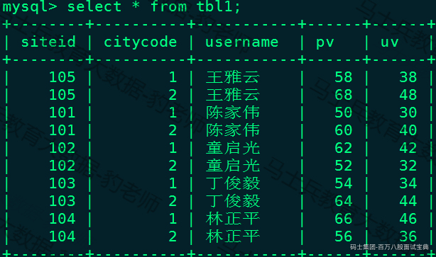

对于 tbl1明细数据是 siteid, citycode, username 三者构成一组 key，从而对 pv 、uv字段进行聚合；如果业务方经常有看城市 pv 总量的需求，可以建立一个只有 citycode, pv 的rollup，这就可以通过创建Rollup物化索引表来实现。

#### 3.9.1.2创建Rollup物化索引表

基于Base表创建Rollup物化索引表语法如下：

```plain
ALTER TABLE [database.]table ADD ROLLUP rollup_name (column_name1, column_name2, ...)
```

对tbl1表创建只有citycode，pv两列的Rollup物化索引表，指定rollup\_name为rollup\_city，SQL如下:

```plain
mysql> ALTER TABLE tbl1 ADD ROLLUP rollup_city(citycode, pv);
Query OK, 0 rows affected (0.03 sec)
```

创建Rollup物化索引表过程是一个异步命令，SQL执行完成并不意味着Rollup表创建完成，创建的Rollup物化索引表rollup\_city中只有citycode、pv两列，可以通过以下SQL来查询Rollup表作业的进度：

```plain
mysql> SHOW ALTER TABLE ROLLUP\G;
*************************** 1. row ***************************
             JobId: 18389
      TableName: tbl1
     CreateTime: 2023-02-09 21:14:57
     FinishTime: 2023-02-09 21:15:19
  BaseIndexName: tbl1
RollupIndexName: rollup_city
       RollupId: 18390
  TransactionId: 4016
          State: FINISHED
            Msg: 
       Progress: NULL
        Timeout: 2592000
1 rows in set (0.01 sec)
```

当作业状态为 FINISHED，则表示作业完成。也可以执行如下命令取消正在执行的作业：

```plain
CANCEL ALTER TABLE ROLLUP FROM table1;
```

#### 3.9.1.3查看Rollup物化索引表

Rollup物化索引表创建完成后使用如下命令查看表的Rollup信息：

```plain
DESC [database.]table ALL
```

查看表tbl1的rollup物化索引信息：

*(⚠️ 图片缺失:源知识库原图已失效)*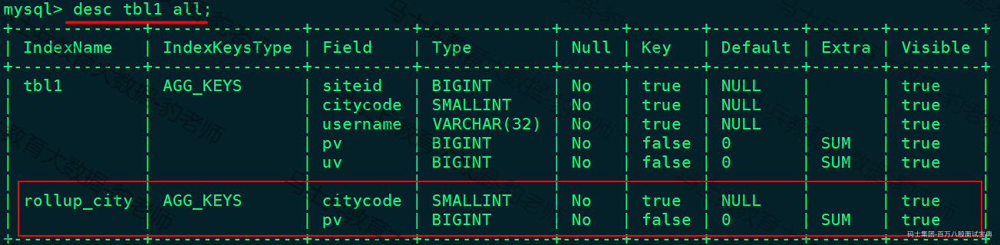

#### 3.9.1.4删除Rollup物化索引表

删除Rollup物化索引表命令如下：

```plain
ALTER TABLE [database.]table DROP ROLLUP rollup_name;
```

执行如下SQL删除tbl1上名为rollup\_city的rollup物化索引表：

```plain
mysql> ALTER TABLE tbl1 DROP ROLLUP rollup_city;
Query OK, 0 rows affected (0.02 sec)

#再次查看tbl1 上的rollup物化索引信息，没有任何rollup物化索引信息。
mysql> desc tbl1 all;
```

#### 3.9.1.5验证Rollup物化索引使用

Rollup 建立之后，查询不需要指定 Rollup 进行查询，还是指定原有表进行查询即可。程序会自动判断是否应该使用 Rollup。是否命中 Rollup可以通过 EXPLAIN your\_sql; 命令进行查看，查看执行该命令最后"VOlapScanNode"部分查询的TABLE即可。

下面我们对表执行如下SQL语句，查看explain信息：

```plain
mysql> explain select citycode ,sum(pv) from tbl1 group by citycode;
...
|   0:VOlapScanNode                                                           |
|      TABLE: default_cluster:example_db.tbl1(tbl1), PREAGGREGATION: ON       |
|      partitions=1/1, tablets=10/10, tabletList=18368,18370,18372 ...        |
|      cardinality=5, avgRowSize=2490.0, numNodes=3  
...
```

我们可以看到由于删除了rollup物化索引表，所以无法从rollup物化索引表中进行查询，下面我们重新基于tbl1创建Rollup物化索引表rollup\_city：

```plain
mysql> ALTER TABLE tbl1 ADD ROLLUP rollup_city(citycode, pv);
Query OK, 0 rows affected (0.03 sec)

#查看是否创建完成
mysql> SHOW ALTER TABLE ROLLUP\G;
```

当Rollup物化索引表创建完成后，重新执行explain SQL，我们发现命中了创建的Rollup物化索引表。

```plain
mysql> explain select citycode ,sum(pv) from tbl1 group by citycode;
...
|   0:VOlapScanNode   
|
|TABLE: default_cluster:example_db.tbl1(rollup_city), PREAGGREGATION: ON |
|      partitions=1/1, tablets=10/10, tabletList=19029,19031,19033 ...         |
|      cardinality=5, avgRowSize=0.0, numNodes=3  
...
```

通过"select citycode ,sum(pv) from tbl1 group by citycode"SQL查询可以看到Doris会自动命中Rollup物化索引表， **从而只需要扫描极少的数据量，即可完成聚合查询。**

### 3.9.2Rollup 物化索引作用

在Doris里Rollup 作为一份聚合物化视图，其在查询中可以起到两个作用： **改变索引和聚合数据。**

#### 3.9.2.1改变索引

改变索引主要说的是可以调整前缀索引，因为建表时已经指定了列顺序，所以一个表只有一种前缀索引。这对于使用其他不能命中前缀索引的列作为条件进行的查询来说，效率上可能无法满足需求。因此，我们可以通过创建 ROLLUP 来人为的调整列顺序，以获得更好的查询效率。

Doris 的前缀索引，即 Doris 会把 Base/Rollup 表中的前 36 个字节（有 varchar 类型则可能导致前缀索引不满 36 个字节，varchar 会截断前缀索引，并且最多使用 varchar 的 20 个字节）在底层存储引擎单独生成一份排序的稀疏索引数据(数据也是排序的，用索引定位，然后在数据中做二分查找)， **然后在查询的时候会根据查询中的条件来匹配每个** **Base/Rollup** **的前缀索引，并且选择出匹配前缀索引最长的一个** **Base/Rollup** 。

*(⚠️ 图片缺失:源知识库原图已失效)*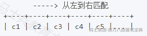

如上图，取查询中 where 以及 on 上下推到 ScanNode 的条件，从前缀索引的第一列开始匹配，检查条件中是否有这些列，有则累计匹配的长度，直到匹配不上或者36字节结束（varchar类型的列只能匹配20个字节，并且会匹配不足36个字节截断前缀索引），然后选择出匹配长度最长的一个 Base/Rollup，下面举例说明，创建了一张Base表以及四张rollup：

创建表 rollup\_test1 ,表结构如下：

*(⚠️ 图片缺失:源知识库原图已失效)*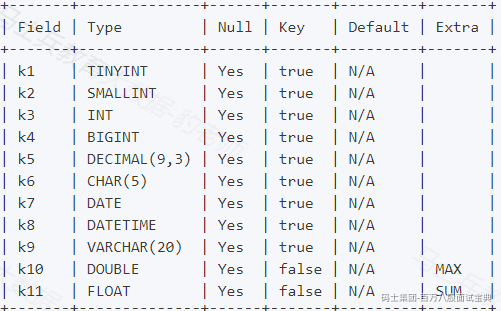

创建表SQL语句如下：

```plain
CREATE TABLE IF NOT EXISTS example_db.rollup_test1
(
`k1` TINYINT,
`k2` SMALLINT,
`k3` INT,
`k4` BIGINT,
`k5` DECIMAL(9,3),
`k6` CHAR(5),
`k7` DATE,
`k8` DATETIME,
`k9` VARCHAR(20),
`k10` DOUBLE MAX,
`k11` FLOAT SUM
)
AGGREGATE KEY(`k1`,`k2`,`k3`,`k4`,`k5`,`k6`,`k7`,`k8`,`k9`)
DISTRIBUTED BY HASH(`k1`) BUCKETS 1
PROPERTIES (
"replication_allocation" = "tag.location.default: 1"
);
```

向以上表中插入如下数据（ **注意：不插入数据，后续创建的物化索引不能被命中** ）：

```plain
insert into example_db.rollup_test1 values 
(1,2,3,4,1.0,'a',"2023-03-01","2023-03-01 08:00:00","aaa",1.0,1.0),
(5,6,7,8,2.0,'b',"2023-03-02","2023-03-02 08:00:00","bbb",2.0,2.0);
```

基于rollup\_test1表创建四张rollup物化索引表，如下：

```plain
#创建 rollup_index1
mysql> ALTER TABLE example_db.rollup_test1 ADD ROLLUP rollup_index1(k9,k1,k2,k3,k4,k5,k6,k7,k8,k10,k11);
Query OK, 0 rows affected (0.05 sec)

#创建rollup_index2
mysql> ALTER TABLE example_db.rollup_test1 ADD ROLLUP rollup_index2(k9,k2,k1,k3,k4,k5,k6,k7,k8,k10,k11);
Query OK, 0 rows affected (0.02 sec)

#创建rollup_index3
mysql> ALTER TABLE example_db.rollup_test1 ADD ROLLUP rollup_index3(k4,k5,k6,k1,k2,k3,k7,k8,k9,k10,k11);
Query OK, 0 rows affected (0.03 sec)

#创建rollup_index4
mysql> ALTER TABLE example_db.rollup_test1 ADD ROLLUP rollup_index4(k4,k6,k5,k1,k2,k3,k7,k8,k9,k10,k11);
Query OK, 0 rows affected (0.02 sec)
```

desc table all; 查看表rollup\_test1 表物化索引信息：

*(⚠️ 图片缺失:源知识库原图已失效)*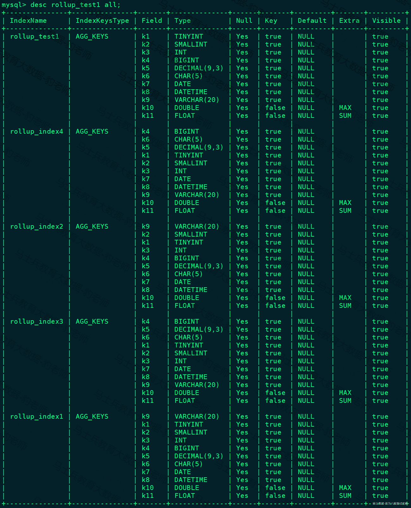

Doris中默认将一行数据的前36个字节作为这行数据的前缀索引，但是当遇到VARCHAR类型时，前缀索引会直接截断，以上Base表和rollup物化索引表的前缀索引分别为（TINYINT-1字节、SMALLINT-2字节、INT-4字节、BIGINT-8字节、DECIMAL-16字节、CHAR-1字节、DATETIME-8字节）：

```plain
rollup_test1(Base表)(k1 ,k2, k3, k4, k5, k6, k7)

rollup_index1(k9)

rollup_index2(k9)

rollup_index3(k4, k5, k6, k1, k2, k3, k7)

rollup_index4(k4, k6, k5, k1, k2, k3, k7)
```

能用的上前缀索引的列上的条件需要是 = < > <= >= in between 这些,并且这些条件是并列的且关系使用 and **连接，对于** or **、**!= **等这些不能命中，命中规则是匹配最长的前缀索引。**

执行以下查询，查看对应的前缀索引命中情况：

```plain
# select * from rollup_test1 where k1 =1 AND k2>3;此语句有k1以及k2上的条件，只有rollup_test1第一列含有条件里的k1，所以匹配最长的前缀索引即rollup_test1，验证如下：
mysql> explain select * from rollup_test1 where k1 =1 AND k2>3;
...
TABLE: default_cluster:example_db.rollup_test1(rollup_test1)
...

# SELECT * FROM rollup_test1 WHERE k4 = 1 AND k5 > 3;此语句有k4以及k5的条件，匹配前缀最长索引，可以匹配到rollup_index3,验证如下：
mysql> explain SELECT * FROM rollup_test1 WHERE k4 = 1 AND k5 > 3;
...
TABLE: default_cluster:example_db.rollup_test1(rollup_index3)
...
```

下面我们尝试匹配含有varchar列上的条件，执行如下SQL：

```plain
mysql> explain select * from rollup_test1 where k9 in ("xxx","yyy") and k1=10;
...
TABLE: default_cluster:example_db.rollup_test1(rollup_index1)
...
```

有 k9 以及 k1 两个条件，rollup\_index1 以及 rollup\_index2 的第一列都含有 k9，按理说这里选择这两个 rollup 都可以命中前缀索引并且效果是一样的随机选择一个即可（因为这里 varchar 刚好20个字节，前缀索引不足36个字节被截断），但是当前策略这里还会继续匹配 k1，因为 rollup\_index1 的第二列为 k1，所以选择了 rollup\_index1，其实后面的 k1 条件并不会起到加速的作用。(如果对于前缀索引外的条件需要其可以起到加速查询的目的，可以通过建立 Bloom Filter 过滤器加速。一般对于字符串类型建立即可，因为 Doris 针对列存在 Block 级别对于整型、日期已经有 Min/Max 索引)。

最后，看一个多张Rollup都可以命中的查询：

```plain
mysql> explain SELECT * FROM rollup_test1 WHERE k4 < 1000 AND k5 = 80 AND k6 >= 10000;
...
TABLE: default_cluster:example_db.rollup_test1(rollup_index3)
...
```

有 k4,k5,k6 三个条件，rollup\_index3 以及 rollup\_index4 的前3列分别含有这三列，所以两者匹配的前缀索引长度一致，选取两者都可以，当前默认的策略为选取了比较早创建的一张 rollup，这里为 rollup\_index3。

修改以上查询，加入OR条件(不走任何索引),则这里的查询不能命中前缀索引。

```plain
mysql> explain SELECT * FROM rollup_test1  WHERE k4 < 1000 AND k5 = 80 OR k6 >= 10000;
...
TABLE: default_cluster:example_db.rollup_test1(rollup_test1)
...
```

#### 3.9.2.2聚合数据

聚合数据仅用于聚合模型，即aggregate 和Unique（读时合并，Unique只是Aggregate模型的一个特例），在Duplicate模型中，由于Duplicate模型没有聚合的语境，所以该模型中的 ROLLUP，已经失去了"上卷"这一层含义， **而仅仅是作为调整列顺序，以命中前缀索引的作用。**

当然一般的聚合物化视图其聚合数据的功能是必不可少的，这类物化视图对于聚合类查询或报表类查询都有非常大的帮助，要命中聚合物化视图需要下面一些前提：

1. 查询或者子查询中涉及的所有列都存在一张独立的 Rollup 中。

2. 如果查询或者子查询中有 Join，则 Join 的类型需要是 Inner join。

以下是可以命中Rollup的一些聚合查询的种类：

*(⚠️ 图片缺失:源知识库原图已失效)*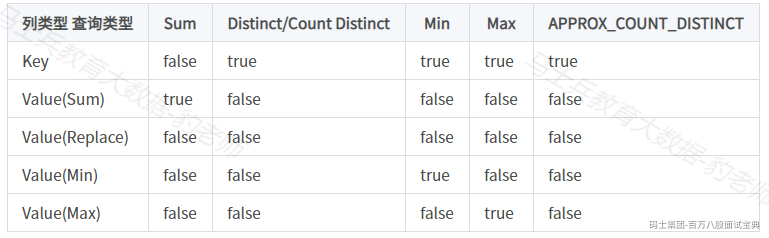

注意：APPROX\_COUNT\_DISTINCT 类似Count Distinct ,速度快，返回近似值。

如果符合上述条件，则针对聚合模型在判断命中 Rollup 的时候会有两个阶段：

1. 首先通过条件匹配出命中前缀索引索引最长的 Rollup 表。

2. 然后比较 Rollup 的行数，选择最小的一张 Rollup， **这里不是真正去查询对应** rollup **表中行数少的，而是找到** rollup **上卷聚合程度最高的，意味着行数最少。**

例如创建Base表rollup\_test2以及Rollup：

```plain
#创建表 rollup_test2
CREATE TABLE IF NOT EXISTS example_db.rollup_test2
(
`k1` TINYINT,
`k2` SMALLINT,
`k3` INT,
`k4` BIGINT,
`k5` DECIMAL(9,3),
`k6` CHAR(5),
`k7` DATE,
`k8` DATETIME,
`k9` VARCHAR(20),
`k10` DOUBLE MAX,
`k11` FLOAT SUM
)
AGGREGATE KEY(`k1`,`k2`,`k3`,`k4`,`k5`,`k6`,`k7`,`k8`,`k9`)
DISTRIBUTED BY HASH(`k1`) BUCKETS 1
PROPERTIES (
"replication_allocation" = "tag.location.default: 1"
);

#给表rollup_test2 添加Rollup物化索引表,名称为rollup1
mysql> ALTER TABLE example_db.rollup_test2 ADD ROLLUP rollup1(k1,k2,k3,k4,k5,k10,k11);
Query OK, 0 rows affected (0.01 sec)

#给表rollup_test2 添加Rollup物化索引表,名称为rollup2
mysql> ALTER TABLE example_db.rollup_test2 ADD ROLLUP rollup2(k1,k2,k3,k10,k11);
Query OK, 0 rows affected (0.02 sec)

#向表rollup_test2 中插入如下数据
insert into example_db.rollup_test2 values 
(1,2,3,4,1.0,'a',"2023-03-01","2023-03-01 08:00:00","aaa",1.0,1.0),
(5,6,7,8,2.0,'b',"2023-03-02","2023-03-02 08:00:00","bbb",2.0,2.0);

#创建完成后，查看表中的物化索引信息
mysql> desc example_db.rollup_test2 all;
```

物化索引信息结果如下:

*(⚠️ 图片缺失:源知识库原图已失效)*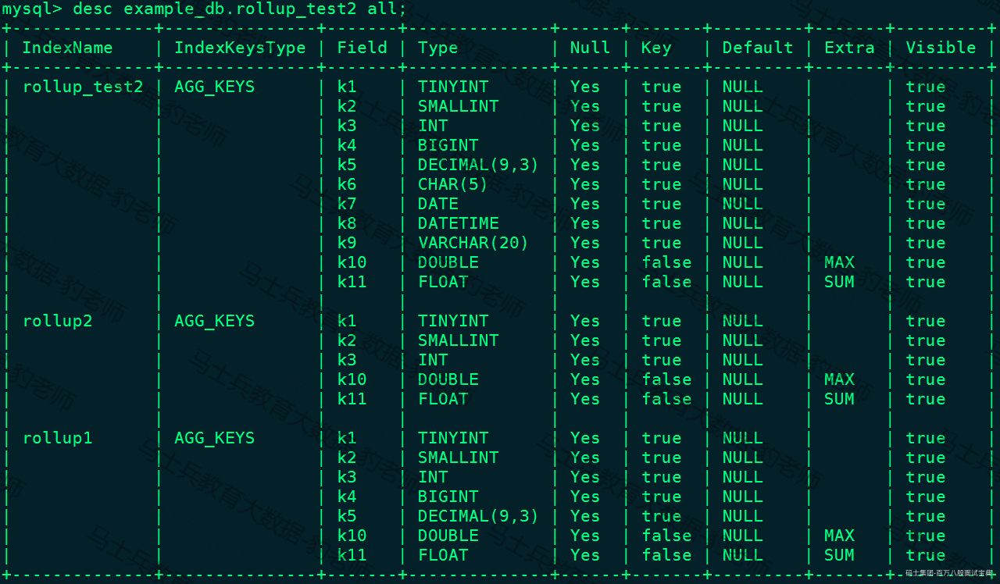

查看如下查询命中rollup情况：

```plain
mysql> explain SELECT SUM(k11) FROM rollup_test2 WHERE k1 = 10 AND k2 > 200 AND k3 in (1,2,3);
...
TABLE: default_cluster:example_db.rollup_test2(rollup2)
...
```

以上命中rollup判断流程如下：首先判断查询是否可以命中聚合的 Rollup表，经过查上面的图是可以的，然后条件中含有 k1,k2,k3 三个条件，这三个条件 rollup\_test2、rollup1、rollup2 的前三列都含有，所以前缀索引长度一致，然后比较行数显然 rollup2 的聚合程度最高行数最少所以选取 rollup2。

### 3.9.3Rollup物化索引注意点

1. ROLLUP最根本的作用是提高某些查询的查询效率（无论是通过聚合来减少数据量，还是修改列顺序以匹配前缀索引）。因此ROLLUP的含义已经超出了"上卷"的范围。这也是为什么我们在源代码中，将其命名为 Materialized Index（物化索引）的原因。

2. ROLLUP是附属于Base表的，可以看做是Base表的一种辅助数据结构。用户可以在Base表的基础上，创建或删除ROLLUP，但是不能在查询中显式的指定查询某 ROLLUP。是否命中ROLLUP完全由Doris系统自动决定。

3. ROLLUP的数据是独立物理存储的。因此，创建的ROLLUP越多，占用的磁盘空间也就越大。同时对导入速度也会有影响（导入的ETL阶段会自动产生所有 ROLLUP 的数据），但是不会降低查询效率（只会更好）。

4. ROLLUP的数据更新与Base表是完全同步的。用户无需关心这个问题。

5. ROLLUP中列的聚合方式，与Base表完全相同。在创建ROLLUP无需指定，也不能修改。

6. 查询能否命中ROLLUP的一个必要条件（非充分条件）是，查询所涉及的所有列（包括 select list 和 where 中的查询条件列等）都存在于该ROLLUP的列中。否则，查询只能命中Base表。

7. 某些类型的查询（如count(\*)）在任何条件下，都无法命中ROLLUP。

8. 可以通过 EXPLAIN your\_sql; 命令获得查询执行计划，在执行计划中，查看是否命中 ROLLUP。

9. 可以通过DESC tbl\_name ALL; 语句显示Base表和所有已创建完成的ROLLUP。
