# **4第四章Doris数据导入**

Doris 提供多种数据导入方案，可以针对不同的数据源进行选择不同的数据导入方式。Doris支持各种各样的数据导入方式：Insert Into、json格式数据导入、Binlog Load、Broker Load、Routine Load、Spark Load、Stream Load、S3 Load，下面分别进行介绍。

注意：**Doris 中的所有导入操作都有原子性保证，即一个导入作业中的数据要么全部成功，要么全部失败，不会出现仅部分数据导入成功的情况**。

## 4.1 **Insert Into**

Insert Into 语句的使用方式和 MySQL 等数据库中 Insert Into 语句的使用方式类似。但在 Doris 中，所有的数据写入都是一个独立的导入作业，所以这里将 Insert Into 也作为一种导入方式介绍。

### 4.1.1 **语法及参数**

Insert Into插入数据的语法如下：

```plain
INSERT INTO table_name
[ PARTITION (p1, ...) ]
[ WITH LABEL label]
[ (column [, ...]) ]
{ VALUES ( { expression | DEFAULT } [, ...] ) [, ...] | query }
```

以上语法参数的解释如下：

- tablet\_name: 导入数据的目的表。可以是 db\_name.table\_name 形式。

- partitions: 指定待导入的分区，必须是 table\_name 中存在的分区，多个分区名称用逗号分隔。

- label: 为 Insert 任务指定一个 label。

- column\_name: 指定的目的列，必须是 table\_name 中存在的列。

- expression: 需要赋值给某个列的对应表达式。

- DEFAULT: 让对应列使用默认值。

- query: 一个普通查询，查询的结果会写入到目标中。

Insert Into 命令需要通过 MySQL 协议提交，创建导入请求会同步返回导入结果，主要的Insert Into 命令包含以下两种：

- INSERT INTO tbl SELECT ...

- INSERT INTO tbl (col1, col2, ...) VALUES (1, 2, ...), (1,3, ...);

### 4.1.2 **案例**

下面创建表tbl1,来演示Insert Into操作。

```plain
#创建表 tbl1
CREATE TABLE IF NOT EXISTS example_db.tbl1
(
`user_id` BIGINT NOT NULL COMMENT "用户id",
`date` DATE NOT NULL COMMENT "日期",
`username` VARCHAR(32) NOT NULL COMMENT "用户名称",
`age` BIGINT NOT NULL COMMENT "年龄",
`score` BIGINT NOT NULL DEFAULT "0" COMMENT "分数"
)
DUPLICATE KEY(`user_id`)
PARTITION BY RANGE(`date`)
(
PARTITION `p1` VALUES [("2023-01-01"),("2023-02-01")),
PARTITION `p2` VALUES [("2023-02-01"),("2023-03-01")),
PARTITION `p3` VALUES [("2023-03-01"),("2023-04-01"))
)
DISTRIBUTED BY HASH(`user_id`) BUCKETS 1
PROPERTIES (
"replication_allocation" = "tag.location.default: 1"
);

#通过Insert Into 向表中插入数据
mysql> insert into example_db.tbl1 values  (1,"2023-01-01","zs",18,100), (2,"2023-02-01","ls",19,200);
Query OK, 2 rows affected (0.09 sec)
{'label':'insert_1b2ba205dee54110_b7a9c0e53b866215', 'status':'VISIBLE', 'txnId':'6015'}

#创建表tbl2 ，表结构与tbl1一样,同时数据会复制过来。
mysql> create table tbl2  as select * from tbl1;
Query OK, 2 rows affected (0.43 sec)
{'label':'insert_fad2b6e787fa451a_90ba76071950c3ae', 'status':'VISIBLE', 'txnId':'6016'}

#向表tbl2中使用Insert into select 方式插入数据
mysql> insert into tbl2 select * from tbl1;
Query OK, 2 rows affected (0.18 sec)
{'label':'insert_7a52e9f60f7b454b_a9807cd2281932dc', 'status':'VISIBLE', 'txnId':'6017'}

#Insert into 还可以指定Label，指定导入作业的标识
mysql> insert into example_db.tbl2 with label mylabel values (3,"2023-03-01","ww",20,300),(4,"2023-03-01","ml",21,400);
Query OK, 2 rows affected (0.11 sec)
{'label':'mylabel', 'status':'VISIBLE', 'txnId':'6018'}

#查询表tbl2中的数据
mysql> select * from tbl2;
+---------+------------+----------+------+-------+
| user_id | date       | username | age  | score |
+---------+------------+----------+------+-------+
|       1 | 2023-01-01 | zs       |   18 |   100 |
|       1 | 2023-01-01 | zs       |   18 |   100 |
|       4 | 2023-03-01 | ml       |   21 |   400 |
|       2 | 2023-02-01 | ls       |   19 |   200 |
|       2 | 2023-02-01 | ls       |   19 |   200 |
|       3 | 2023-03-01 | ww       |   20 |   300 |
+---------+------------+----------+------+-------+
6 rows in set (0.12 sec)
```

Insert Into 本身就是一个 SQL 命令，其返回结果会根据执行结果的不同，分为结果集为空和结果集不为空两种情况。

结果集为空时，返回“Query OK, 0 rows affected”。结果集不为空时分为导入成功和导入失败，导入失败直接返回对应的错误，导入成功返回一个包含“label”、“status”、“txnId”等字段的json串，例如：

```plain
{'label':'my_label1', 'status':'visible', 'txnId':'4005'}

{'label':'insert_f0747f0e-7a35-46e2-affa-13a235f4020d', 'status':'committed', 'txnId':'4005'}

{'label':'my_label1', 'status':'visible', 'txnId':'4005', 'err':'some other error'}
```

- label 为用户指定的 label 或自动生成的 label。Label 是该 Insert Into 导入作业的标识。每个导入作业，都有一个在单 database 内部唯一的 Label。

- status 表示导入数据是否可见。如果可见，显示 visible，如果不可见，显示 committed。数据不可见是一个临时状态，这批数据最终是一定可见的。

- txnId 为这个 insert 对应的导入事务的 id。

- err 字段会显示一些其他非预期错误。

当前执行 INSERT 语句时，对于有不符合目标表格式的数据，默认的行为是过滤，比如字符串超长等。 **但是对于有要求数据不能够被过滤的业务场景，可以通过设置会话变量 enable\_insert\_strict 为 true** **（默认true,建议为true）来确保当有数据被过滤掉的时候，INSERT 不会被执行成功** 。也可以通过命令：set enable\_insert\_strict=false；设置为false，插入数据时至少有一条数据被正确导入，则返回成功，那么错误的数据会自动过滤不插入数据表，当需要查看被过滤的行时，用户可以通过“SHOW LOAD ”语句查看，举例如下：

```plain
#向表tbl1中插入包含错误数据的数据集，返回报错信息
mysql> insert into example_db.tbl1 values (3,"2023-03-01","wwwwwwwwwwwwwwwwwwwwwwwwwwwwwwwwwwww",20,300),(4,"2023-03-01","ml",21,400);
ERROR 5025 (HY000): Insert has filtered data in strict mode, tracking_url=http://192.168.179.6:8040/api/_load_error_log?file=__shard_0/error_log_insert_stmt_34684048e4234210-b0c4a99c9aabcb20_34684048e4234210_b0c4a99c9aabcb20

#设置 enable_insert_strict 为false
set enable_insert_strict=false;

#向表tbl1中插入包含错误数据的数据集
mysql> insert into example_db.tbl1 values (3,"2023-03-01","wwwwwwwwwwwwwwwwwwwwwwwwwwwwwwwwwwww",20,300),(4,"2023-03-01","ml",21,400);
Query OK, 1 row affected, 1 warning (0.18 sec)
{'label':'insert_43d97ba2ec544fde_b4339d3f1c93753c', 'status':'VISIBLE', 'txnId':'7010'}

#show load查看过滤的数据获取URL
mysql> show load\G;
*************************** 1. row ***************************
         JobId: 21007
         Label: insert_43d97ba2ec544fde_b4339d3f1c93753c
         State: FINISHED
      Progress: ETL:100%; LOAD:100%
          Type: INSERT
       EtlInfo: NULL
      TaskInfo: cluster:N/A; timeout(s):3600; max_filter_ratio:0.0
      ErrorMsg: NULL
    CreateTime: 2023-02-10 20:47:06
  EtlStartTime: 2023-02-10 20:47:06
 EtlFinishTime: 2023-02-10 20:47:06
 LoadStartTime: 2023-02-10 20:47:06
LoadFinishTime: 2023-02-10 20:47:06
           URL: http://192.168.179.7:8040/api/_load_error_log?file=__shard_0/error_log_insert_stmt_43d97ba2ec544fde-b4339d3f1c93753d_43d97ba2ec544fde_b4339d3f1c93753d    JobDetails: {"Unfinished backends":{},"ScannedRows":0,"TaskNumber":0,"LoadBytes":0,"All backends":{},"FileNumber":0,"FileSize":0}
 TransactionId: 7010
  ErrorTablets: {}

#执行 SHOW LOAD WARNINGS ON "url" 来查询被过滤数据信息
mysql> SHOW LOAD WARNINGS ON "http://192.168.179.7:8040/api/_load_error_log?file=__shard_0/error_log_insert_stmt_43d97ba2ec544fde-b4339d3f1c93753d_43d97ba2ec544fde_b4339d3f1c93753d"\G;
*************************** 1. row ***************************
         JobId: -1
         Label: NULL
ErrorMsgDetail: Reason: column_name[username], the length of input is too long than schema. first 32 bytes of input str: [wwwwwwwwwwwwwwwwwwwwwww
wwwwwwwww] schema length: 32; actual length: 36; . src line []; 1 row in set (0.01 sec)
```

### 4.1.3 **注意事项**

1. **关于插入数据量**

Insert Into 对数据量没有限制，大数据量导入也可以支持。但Insert Into 有默认的超时时间，用户预估的导入数据量过大，就需要修改系统的Insert Into导入超时时间。如何预估导入时间，估算方式如下：

假设有36G数据需要导入到Doris，Doris集群数据导入速度为10M/s（最大限速为10M/s，可以根据先前导入的数据量/消耗秒计算出当前集群平均的导入速度），那么预估导入时间为36G\*1024M/(10M/s) = ~3686秒。

2. **关于insert操作返回结果**

- 如果返回结果为 ERROR 1064 (HY000)，则表示导入失败。

- 如果返回结果为 Query OK，则表示执行成功。

- 如果 rows affected 为 0，表示结果集为空，没有数据被导入。

- 如果 rows affected 大于 0：

- 如果 status 为 committed，表示数据还不可见。需要通过 show transaction 语句查看状态直到 visible

- 如果 status 为 visible，表示数据导入成功。

- 如果 warnings 大于 0，表示有数据被过滤，可以通过 show load 语句获取 url 查看被过滤的行。

3. **关于导入任务超时**

导入任务的超时时间(以秒为单位)，导入任务在设定的 timeout 时间内未完成则会被系统取消，变成 CANCELLED。目前 Insert Into 并不支持自定义导入的 timeout 时间，所有 Insert Into 导入的超时时间是统一的，默认的 timeout 时间为1小时。如果导入的源文件无法在规定时间内完成导入，则需要调整 FE 的参数insert\_load\_default\_timeout\_second。

同时Insert Into语句受到Session变量query\_timeout的限制。可以通过 SET query\_timeout = xxx; 来增加超时时间，单位是秒。

4. **关于Session变量**

- **enable\_insert\_strict**

Insert Into导入本身不能控制导入可容忍的错误率。用户只能通过enable\_insert\_strict 这个 Session 参数用来控制。当该参数设置为false时，表示至少有一条数据被正确导入，则返回成功。如果有失败数据，则还会返回一个 Label。

当该参数设置为 true 时（默认），表示如果有一条数据错误，则导入失败。

- **query\_timeout**

Insert Into本身也是一个SQL命令，因此Insert Into语句也受到 Session 变量 query\_timeout 的限制。可以通过 SET query\_timeout = xxx; 来增加超时时间，单位是秒。

5. **关于数据导入错误**

当数据导入错误是，可以通过show load warnings on “url”来查看错误详细信息。url为错误返回信息中的url。

## 4.2 **Binlog Load**

Binlog Load提供了一种使Doris增量同步用户在Mysql数据库的对数据更新操作的CDC(Change Data Capture)功能。针对MySQL数据库中的INSERT、UPDATE、DELETE、过滤Query支持，暂不兼容DDL（Data Definition Language）语句。

### 4.2.1 **基本原理**

当前版本设计中，Binlog Load需要依赖canal作为中间媒介，让canal伪造成一个从节点去获取Mysql主节点上的Binlog并解析，再由Doris去获取Canal上解析好的数据，主要涉及Mysql端、Canal端以及Doris端，总体数据流向如下：

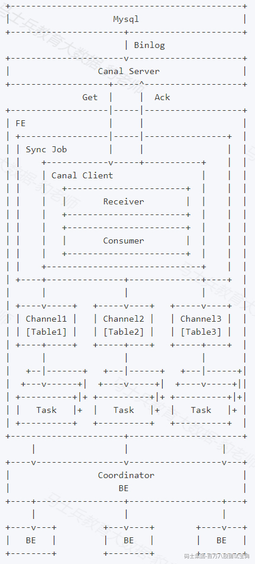

如上图，用户向FE提交一个数据同步作业，FE会为每个数据同步作业启动一个canal client，来向canal server端订阅并获取数据。

client中的receiver将负责通过Get命令接收数据，每获取到一个数据batch，都会由consumer根据对应表分发到不同的channel，每个channel都会为此数据batch产生一个发送数据的子任务Task。

在FE上，一个Task是channel向BE发送数据的子任务，里面包含分发到当前channel的同一个batch的数据。

channel控制着单个表事务的开始、提交、终止。一个事务周期内，一般会从consumer获取到多个batch的数据，因此会产生多个向BE发送数据的子任务Task，在提交事务成功前，这些Task不会实际生效。

满足一定条件时（比如超过一定时间、达到提交最大数据大小），consumer将会阻塞并通知各个channel提交事务。 **当且仅当所有channel都提交成功，才会通过Ack命令通知canal并继续获取并消费数据** 。如果有任意channel提交失败，将会重新从上一次消费成功的位置获取数据并再次提交（ **已提交成功的channel不会再次提交以保证幂等性** ）。

整个数据同步作业中，FE通过以上流程不断的从canal获取数据并提交到BE，来完成数据同步。

### 4.2.2 **Canal原理及配置**

Canal [kə'næl]，译意为水道/管道/沟渠，主要用途是基于 MySQL 数据库增量日志解析，提供增量数据订阅和消费。

早期阿里巴巴因为杭州和美国双机房部署，存在跨机房同步的业务需求，实现方式主要是基于业务trigger 获取增量变更。从 2010 年开始，业务逐步尝试数据库日志解析获取增量变更进行同步，由此衍生出了大量的数据库增量订阅和消费业务。

当前的canal 支持源端 MySQL 版本包括 5.1.x , 5.5.x , 5.6.x , 5.7.x , 8.0.x。

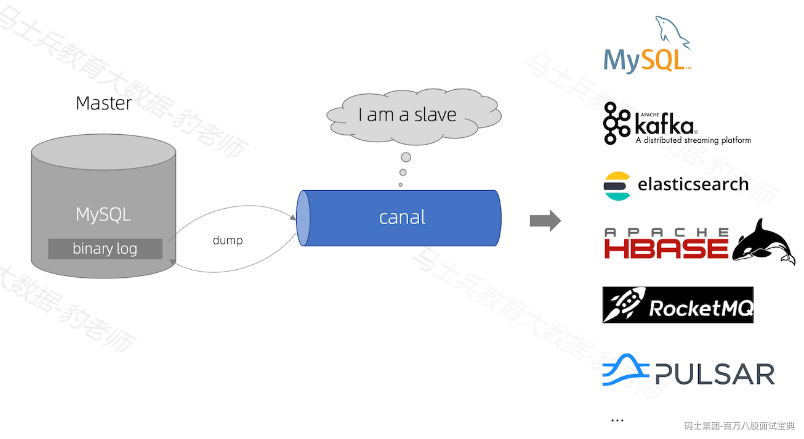

Canal目前没有独立的官网，可以在GitHub上下载和查看Canal文档，地址如下：<https://github.com/alibaba/canal/wiki>。

- **Canal Server架构如下** ：

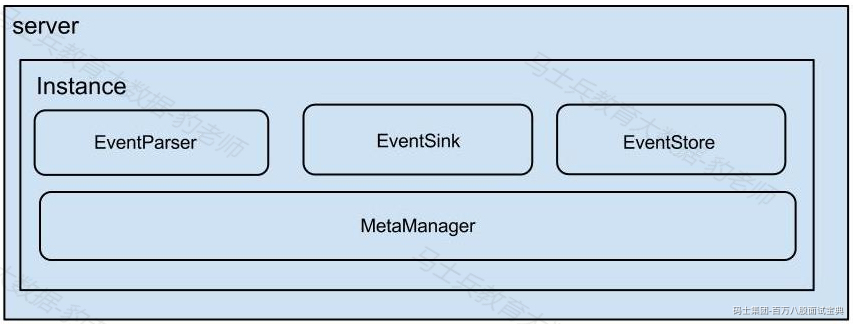

- server 代表一个 canal 运行实例，对应于一个 jvm。

- instance 对应于一个数据队列 （1个 canal server 对应 1..n 个 instance )

- instance 下的子模块

- eventParser: 数据源接入，模拟 slave 协议和 master 进行交互，协议解析

- eventSink: Parser 和 Store 链接器，进行数据过滤，加工，分发的工作

- eventStore: 数据存储

- metaManager: 增量订阅 & 消费信息管理器

#### 4.2.2.1 **Canal同步MySQL数据原理**

Canal同步MySQL数据工作原理如下图所示：

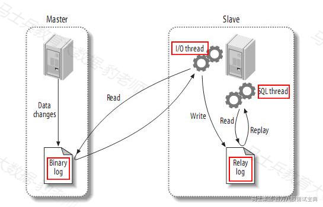

- **MySQL主备复制原理**

1. MySQL master 将数据变更写入二进制日志( binary log, 其中记录叫做二进制日志事件binary log events，可以通过 show binlog events 进行查看)

2. MySQL slave 将 master 的 binary log events 拷贝到它的中继日志(relay log)

3. 注意：中继日志是从服务器I/O线程将主服务器的二进制日志读取过来，记录到从服务器本地文件，然后从服务器SQL线程会读取relay-log日志的内容并应用到从服务器，从而使从服务器和主服务器的数据保持一致。

4. MySQL slave 重放 relay log 中事件，将数据变更反映它自己的数据

- **canal 工作原理**

1. canal 模拟 MySQL slave 的交互协议，伪装自己为 MySQL slave ，向 MySQL master 发送dump 协议

2. MySQL master 收到 dump 请求，开始推送 binary log 给 slave (即 canal )

3. canal 解析 binary log 对象(原始为 byte 流)

注意：mysql-binlog是MySQL数据库的二进制日志，记录了所有的DDL和DML(除了数据查询语句)语句信息。一般来说开启二进制日志大概会有1%的性能损耗。

#### 4.2.2.2 **开启MySQL binlog**

对于自建MySQL , 需要先开启 Binlog 写入功能，配置 binlog-format 为 ROW 模式，开启Mysql binlog日志步骤如下：

1. **登录mysql查看MySQL是否开启binlog日志**

```plain
[root@node2 ~]# mysql -u root -p123456
mysql> show variables like 'log_%';
```

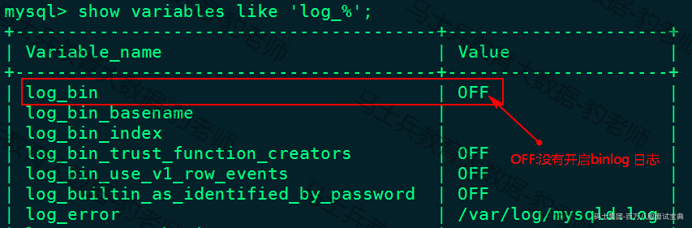

2. **开启mysql binlog日志**

在/etc/my.cnf文件中[mysqld]下写入以下内容：

```plain
[mysqld]
# 随机指定一个不能和其他集群中机器重名的字符串，配置 MySQL replaction 需要定#义，不要和 canal 的 slaveId 重复
server-id=123 

#配置binlog日志目录，配置后会自动开启binlog日志，并写入该目录
log-bin=/var/lib/mysql/mysql-bin

# 选择 ROW 模式
binlog-format=ROW
```

MySQL binlog-format有三种模式：Row、Statement 和 Mixed 。

- **Row:不记录sql语句上下文相关信息，仅保存哪条记录被修改。**

优点： binlog中可以不记录执行的sql语句的上下文相关的信息，仅需要记录那一条记录被修改成什么了。所以row level的日志内容会非常清楚的记录下每一行数据修改的细节。

缺点:所有的执行的语句当记录到日志中的时候，都将以每行记录的修改来记录，这样可能会产生大量的日志内容,比如一条update语句，修改多条记录，则binlog中每一条修改都会有记录，这样造成binlog日志量会很大，特别是当执行alter table之类的语句的时候，由于表结构修改，每条记录都发生改变，那么该表每一条记录都会记录到日志中。

- **Statement(默认)：每一条会修改数据的sql都会记录在binlog中。**

这种模式下，slave在复制的时候sql进程会解析成和原来master端执行过的相同的sql来再次执行。

优点：不需要记录每一行的变化，减少了binlog日志量，节约了IO，提高性能。

缺点：由于只记录语句，所以，在statement level下 已经发现了有不少情况会造成MySQL的复制出现问题，主要是修改数据的时候使用了某些定的函数或者功能的时候会出现。 例如：update 语句中含有uuid() ,now() 这种函数时，Statement模式就会有问题（update t1 set xx = now() where xx = xx）

- Mixed: **混合模式**

在Mixed模式下，MySQL会根据执行的每一条具体的sql语句来区分对待记录的日志格式，也就是在Statement和Row之间选择一种。如果sql语句确实就是update或者delete等修改数据的语句，那么还是会记录所有行的变更。

3. **重启mysql 服务，重新查看binlog日志情况**

```plain
[root@node2 ~]# service mysqld restart
[root@node2 ~]# mysql -u root -p123456
mysql> show variables like 'log_%';
```

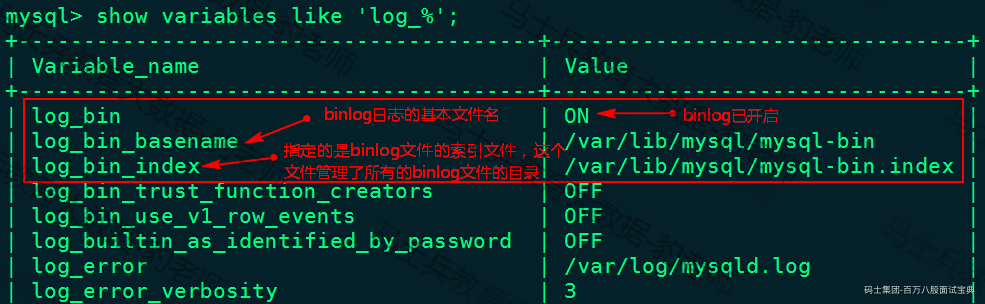

#### 4.2.2.3 **Canal配置及启动**

这里所说的Canal安装与配置，首先需要在Canal中配置CanalServer 对应的canal.properties，这个文件中主要配置Canal对应的同步数据实例(Canal Instance)位置信息及数据导出的模式，例如：我们需要将某个mysql中的数据同步到Kafka中，那么就可以创建一个“数据同步实例”，导出到Kafka就是一种模式。其次，需要配置Canal Instance 实例中的instance.properties文件，指定同步到MySQL数据源及管道信息。

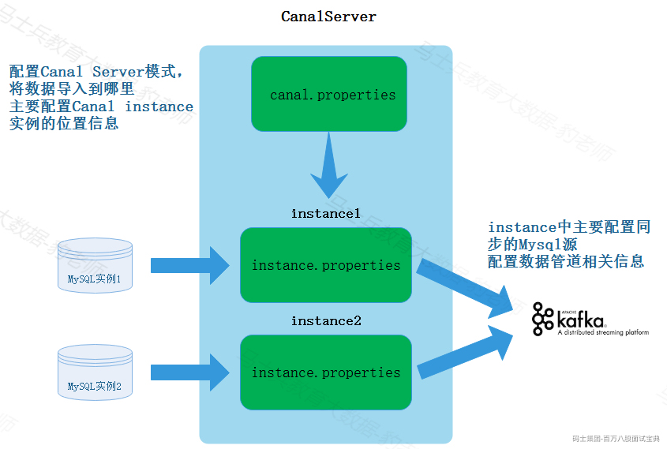

这里我们将MySQL数据同步到Doris中，只需要在canal.properties文件中配置Doris destination名称即可，Canal可以根据该destination名字找到对应的Canal instance实例的配置信息，对应的instance目录中，配置instance.properties 指定同步MySQL的源及数据管道相关信息。

Canal详细安装步骤及配置如下：

1. **下载Canal**

Doris使用Canal建议使用canal 1.1.5及以上版本,Cannal下载地址如下：<https://github.com/alibaba/canal/releases>,这里选择Canal 1.1.6版本下载。

2. **上传解压**

将下载好的Canal安装包上传到node3节点上，解压

```plain
#首先创建目录 “/software/canal”
[root@node3 ~]# mkdir -p /software/canal
#将Canal安装包解压到创建的canal目录中
[root@node3 ~]# tar -zxvf /software/canal.deployer-1.1.6.tar.gz  -C /software/canal/
```

3. **关于配置canal.properties**

Canal同步到消息队列时，需要配置CANAL\_HOME/conf中canal.properties文件“canal.destinations”配置型，指定destinations 信息，多个destination使用逗号隔开，启动Canal后，Canal会根据配置的 destination名字在CANAL\_HOME/conf/${destination}目录下找到对应的instance .properties实例配置，进一步找到同步的MySQL源信息，进行CDC数据同步。

如果是Doris同步Mysql数据，在Doris中启动Doris同步作业时需要指定对应的destination 名称，所以这里不必单独再配置$CANAL\_HOME/conf中canal.properties文件指定destination名称。

4. **配置Canal instance实例信息**

```plain
#在$CANAL_HOME/conf中创建doris目录作为instance的根目录，该目录名需要与创建的Doris job 中指定的destination名称保持一致。
[root@node3 ~]# cd /software/canal/conf/
[root@node3 conf]# mkdir doris

#复制$CANAL_HOME/conf/example目录中的instance.properties到创建的doris目录中
[root@node3 conf]# cd /software/canal/conf/
[root@node3 conf]# cp ./example/* ./doris/

#配置instance.properties，只需要配置如下内容：
[root@node3 doris]# vim /software/canal/conf/doris/instance.properties 

## canal instance serverId
canal.instance.mysql.slaveId = 1234
## mysql adress
canal.instance.master.address = node2:3306 
## mysql username/password
canal.instance.dbUsername = canal
canal.instance.dbPassword = canal
```

5. **配置doris instance 实例连接mysql的权限**

Canal的原理是模拟自己为mysql slave，所以这里一定需要做为mysql slave的相关权限 ，授权Canal连接MySQL具有作为MySQL slave的权限：

```plain
mysql> CREATE USER canal IDENTIFIED BY 'canal'; 
mysql> GRANT SELECT, REPLICATION SLAVE, REPLICATION CLIENT ON *.* TO 'canal'@'%';  
mysql> FLUSH PRIVILEGES;
mysql> show grants for 'canal' ;
```

6. **启动Canal Server**

进入$CANAL\_HOME/canal/bin 目录中，执行”startup.sh”脚本启动Canal:

```plain
#启动Canal
[root@node3 ~]# cd /software/canal/bin/
[root@node3 bin]# ./startup.sh 

#查看对应的Canal 进程
[root@node3 bin]# jps
...
18940 CanalLauncher
...
```

注意：如果启动canal后没有对应的进程，可以在{destination}/${destination}.log中查看对应的报错信息。

### 4.2.3 **Doris 同步MySQL数据案例**

下面步骤演示使用Binlog Load 来同步MySQL表数据，需要的Canal已经配置完成，只需要经过MySQL中创建源表、Doris创建目标表、创建同步作业几个步骤即可完成数据同步。详细步骤如下：

1. **MySQL中创建源表**

在MySQL中创建表source\_test作为Doris同步MySQL数据的源表，MySQL建表语句如下：

```plain
mysql> create database demo;
mysql> create table demo.source_test (id int(11),name varchar(255));
```

2. **Doris中创建目标表**

在Doris端创建好与Mysql端对应的目标表，Binlog Load只能支持Unique类型的目标表，且必须激活目标表的Batch Delete功能（建表默认开启）， **Doris目标表结构和MySQL源表结构字段顺序必须保持一致** ：

```plain
#node1连接Doris
[root@node1 bin]# ./mysql -u root -P 9030 -h 127.0.0.1

#建库及目标表
mysql> create database mysql_db
mysql> create table mysql_db.target_test (
    -> id int(11),
    -> name varchar(255)
    -> ) engine = olap
    -> unique key (id)
    -> distributed by hash(id) buckets 8;
```

3. **创建同步作业**

在Doris中 创建同步作业的语法格式如下：

```plain
CREATE SYNC [db.]job_name
(
channel_desc, 
column_mapping
...
)
binlog_desc
```

- **job\_name**

job\_name是数据同步作业在当前数据库内的唯一标识，相同job\_name的作业只能有一个在运行。

- **channel\_desc**

channel\_desc用来定义mysql源表到doris目标表的映射关系。在设置此项时，如果存在多个映射关系，必须满足mysql源表应该与doris目标表是一一对应关系，其他的任何映射关系（如一对多关系），检查语法时都被视为不合法。

- **column\_mapping**

column\_mapping主要指mysql源表和doris目标表的列之间的映射关系，如果指定，写的列是目标表中的列，即：源表这些列导入到目标表对应哪些列；如果不指定，FE会默认源表和目标表的列按顺序一一对应。**但是我们依然建议显式的指定列的映射关系**，这样当目标表的结构发生变化（比如增加一个 nullable 的列），数据同步作业依然可以进行。否则，当发生上述变动后，因为列映射关系不再一一对应，导入将报错。

- **binlog\_desc**

binlog\_desc中的属性定义了对接远端Binlog地址的一些必要信息，目前可支持的对接类型只有canal方式，所有的配置项前都需要加上canal前缀。有如下配置项：

```plain
canal.server.ip: canal server的地址。
canal.server.port: canal server的端口，默认是11111。
canal.destination: 前文提到的instance的字符串标识。
canal.batchSize: 每批从canal server处获取的batch大小的最大值，默认8192。
canal.username: instance的用户名。
canal.password: instance的密码。
canal.debug: 设置为true时，会将batch和每一行数据的详细信息都打印出来，会影响性能。
```

在Doris中创建同步作业，命令如下：

```plain
CREATE SYNC mysql_db.job
(
FROM demo.source_test INTO target_test
(id,name)
)
FROM BINLOG
(
"type" = "canal",
"canal.server.ip" = "node3",
"canal.server.port" = "11111",
"canal.destination" = "doris",
"canal.username" = "canal",
"canal.password" = "canal"
);
```

注意：target\_test 不能指定对应的库名，默认该目标表就是当前所在的库。

以上执行完成之后，可以通过执行如下命令，查看执行的job任务：

```plain
#查看执行的job任务 ，可以查看到对应提交的job 状态为运行。
mysql> show sync job;
...
 23067 | job     | CANAL | RUNNING   ...
...
```

向MySQL源表中插入如下数据，同时在Doris中查询对应的目标表，可以看到MySQL中的数据被监控到Doris目标表中。

```plain
#node2节点中，向MySQL源表demo.source_test表 中插入如下数据
mysql> insert into source_test values (1,"zs"),(2,"ls"),(3,"ww");

#node1节点通过Mysql客户端查看同步结果，可以看到数据同步成功。
mysql> select * from target_test;
+------+------+
| id   | name |
+------+------+
|    3 | ww   |
|    2 | ls   |
|    1 | zs   |
+------+------+

#node2节点中，对MySQL源表删除数据
mysql> delete from source_test where id =1;
#node1节点通过Mysql客户端查看同步结果，可以看到数据同步成功。
mysql> select * from target_test;
+------+------+
| id   | name |
+------+------+
|    2 | ls   |
|    3 | ww   |
+------+------+
```

如果想要暂停、停止、重新执行同步任务的job，可以执行如下命令：

```plain
#暂停同步任务，jobname为提交的job名称
PAUSE SYNC JOB jobname;

#停止同步任务，jobname为提交的job名称
STOP SYNC JOB jobname;

#重新执行同步任务，jobname为提交的job名称
RESUME SYNC JOB jobname;
```

### 4.2.4 **注意事项**

#### 4.2.4.1 **关于配置**

下面配置属于数据同步作业的系统级别配置，主要通过修改 fe.conf 来调整配置值。

- **sync\_commit\_interval\_second**

默认10s,提交事务的最大时间间隔。若超过了这个时间channel中还有数据没有提交，consumer会通知channel提交事务。

- **min\_sync\_commit\_size**

提交事务需满足的最小event数量。若Fe接收到的event数量小于它，会继续等待下一批数据直到时间超过了 `sync_commit_interval_second` 为止。默认值是10000个events，如果你想修改此配置，请确保此值小于canal端的 `canal.instance.memory.buffer.size`配置（默认16384），否则在ack前Fe会尝试获取比store队列长度更多的event，导致store队列阻塞至超时为止。

- **min\_bytes\_sync\_commit**

提交事务需满足的最小数据大小。若Fe接收到的数据大小小于它，会继续等待下一批数据直到时间超过了sync\_commit\_interval\_second为止。默认值是15MB，如果你想修改此配置，请确保此值小于canal端的canal.instance.memory.buffer.size和canal.instance.memory.buffer.memunit的乘积（默认16MB），否则在ack前Fe会尝试获取比store空间更大的数据，导致store队列阻塞至超时为止。

- **max\_bytes\_sync\_commit**

提交事务时的数据大小的最大值。若Fe接收到的数据大小大于它，会立即提交事务并发送已积累的数据。默认值是64MB，如果你想修改此配置，请确保此值大于canal端的canal.instance.memory.buffer.size和canal.instance.memory.buffer.memunit的乘积（默认16MB）和min\_bytes\_sync\_commit。

- **max\_sync\_task\_threads\_num**

默认10个，数据同步作业线程池中的最大线程数量。此线程池整个FE中只有一个，用于处理FE中所有数据同步作业向BE发送数据的任务task，线程池的实现在SyncTaskPool类。

#### 4.2.4.2 **关于注意点**

1. 数据同步作业并不能禁止alter table的操作，当表结构发生了变化，如果列的映射无法匹配，可能导致作业发生错误暂停，建议通过在数据同步作业中显式指定列映射关系，或者通过增加 Nullable 列或带 Default 值的列来减少这类问题。

2. 删除doris 目标表后，数据同步作业会被EF的定时调度停止。

3. doris中多个数据同步作业不能配置相同的ip:port+destination，主要为了防止出现多个作业连接到同一个instance的情况。

4. Doris本身浮点类型的精度与Mysql不一样,所以数据同步时浮点类型的数据精度在Mysql端和Doris端不一样，可以选择用Decimal类型代替。

## 4.3 **Broker Load**

Apache Doris架构中除了有BE和FE进程之外，还可以部署Broker可选进程，主要用于支持Doris读写远端存储上的文件和目录。例如：Apache HDFS 、阿里云OSS、亚马逊S3等。Broker Load这种数据导入方式主要用于通过 Broker 服务进程读取远端存储（如S3、HDFS）上的数据导入到 Doris 表里。

使用Broker load 最适合的场景就是原始数据在文件系统（HDFS，BOS，AFS）中的场景，数据量在几十到百GB 级别。用户需要通过 MySQL协议创建 Broker load 导入，并通过查看导入命令检查导入结果。

### 4.3.1 **基本原理**

使用Broker Load导入数据时，用户在提交导入任务后，FE 会生成对应的 Plan 并根据目前 BE 的个数和文件的大小，将 Plan 分给 多个 BE 执行，每个 BE 执行一部分导入数据。BE 在执行的过程中会从 Broker 拉取数据，在对数据 transform 之后将数据导入系统。所有 BE 均完成导入，由 FE 最终决定导入是否成功。

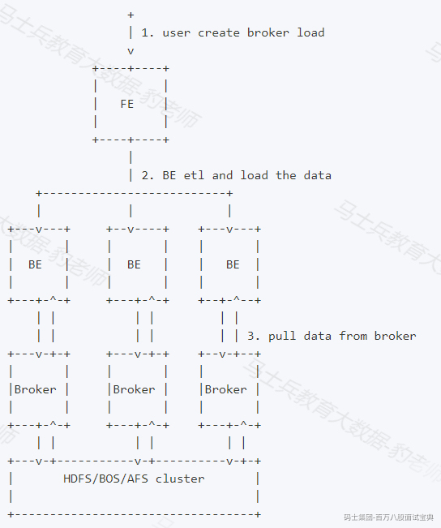

### 4.3.2 **Broker Load语法**

Broker Load语法如下：

```plain
LOAD LABEL load_label
(
data_desc1[, data_desc2, ...]
)
WITH BROKER broker_name
[broker_properties]
[load_properties]
[COMMENT "comments"];
```

- **load\_label:**

每个导入需要指定一个唯一的 Label。后续可以通过这个 label 来查看作业进度，格式为[database.]label\_name

- **data\_desc1：**

用于描述一组需要导入的文件。

```plain
[MERGE|APPEND|DELETE]
DATA INFILE("file_path1"[, file_path2, ...])
[NEGATIVE]
INTO TABLE `table_name`
[PARTITION (p1, p2, ...)]
[COLUMNS TERMINATED BY "column_separator"]
[FORMAT AS "file_type"]
[(column_list)]
[COLUMNS FROM PATH AS (c1, c2, ...)]
[SET (column_mapping)]
[PRECEDING FILTER predicate]
[WHERE predicate]
[DELETE ON expr]
[ORDER BY source_sequence]
[PROPERTIES ("key1"="value1", ...)]
```

1. [MERGE|APPEND|DELETE]

数据合并类型，默认为 APPEND，表示本次导入是普通的追加写操作。MERGE 和 DELETE 类型仅适用于 Unique Key 模型表，其中 MERGE 类型需要配合[DELETE ON]语句使用，以标注 Delete Flag列，而DELETE类型则表示本次导入的所有数据皆为删除数据。

2. DATA INFILE

指定需要导入的文件路径，可以是多个，可以使用通配符。路径最终必须匹配到文件， **如果只匹配到目录则导入会失败** 。

3. NEGATIVE

该关键词用于表示本次导入为一批“负”导入。这种方式仅针对具有整型 SUM 聚合类型的聚合数据表。该方式会将导入数据中，SUM 聚合列对应的整型数值取反。主要用于冲抵之前导入错误的数据。

4. PARTITION(p1, p2, ...)

可以指定仅导入表的某些分区。不再分区范围内的数据将被忽略。

5. COLUMNS TERMINATED BY

指定列分隔符。仅在 CSV 格式下有效。仅能指定单字节分隔符。

6. FORMAT AS

指定文件类型，支持 CSV、PARQUET 和 ORC 格式。默认为 CSV。

7. column list

用于指定原始文件中的列顺序。如：(k1, k2, tmpk1)。

8. COLUMNS FROM PATH AS

指定从导入文件路径中抽取的列。

9. SET (column\_mapping)

指定列的转换函数。

10. PRECEDING FILTER predicate

前置过滤条件。数据首先根据 column list 和 COLUMNS FROM PATH AS 按顺序拼接成原始数据行。然后按照前置过滤条件进行过滤。

11. WHERE predicate

根据条件对导入的数据进行过滤。

12. DELETE ON expr

需配合 MEREGE 导入模式一起使用，仅针对 Unique Key 模型的表。用于指定导入数据中表示 Delete Flag 的列和计算关系。

13. ORDER BY

仅针对 Unique Key 模型的表。用于指定导入数据中表示 Sequence Col 的列。主要用于导入时保证数据顺序。

14. PROPERTIES ("key1"="value1", ...)

指定导入的format的一些参数。如导入的文件是json格式，则可以在这里指定json\_root、jsonpaths、fuzzy\_parse等参数。

- **WITH BROKER broker\_name**

指定需要使用的 Broker 服务名称。通常用户需要通过操作命令中的 WITH BROKER "broker\_name" 子句来指定一个已经存在的 Broker Name。Broker Name 是用户在通过 ALTER SYSTEM ADD BROKER 命令添加 Broker 进程时指定的一个名称。一个名称通常对应一个或多个 Broker 进程。Doris 会根据名称选择可用的 Broker 进程。用户可以通过 SHOW BROKER 命令查看当前集群中已经存在的 Broker。

注：Broker Name 只是一个用户自定义名称，不代表 Broker 的类型。在公有云 Doris 中，Broker服务名称为 bos。

- **broker\_properties**

指定 broker 所需的信息。这些信息通常被用于 Broker 能够访问远端存储系统。格式如下：

```plain
(
"key1" = "val1",
"key2" = "val2",
...
)
```

可配置如下：

1. timeout：导入超时时间。默认为 4 小时。单位秒。

2. max\_filter\_ratio:最大容忍可过滤（数据不规范等原因）的数据比例。默认零容忍。取值范围为 0 到 1。

3. exec\_mem\_limit:导入内存限制。默认为 2GB。单位为字节。

4. strict\_mode：是否对数据进行严格限制。默认为 false。严格模式开启后将过滤掉类型转换错误的数据。

5. timezone:指定某些受时区影响的函数的时区，如 strftime/alignment\_timestamp/from\_unixtime 等等，具体请查阅时区文档:<https://doris.apache.org/zh-CN/docs/dev/advanced/time-zone/。如果不指定，则使用> "Asia/Shanghai" 时区。

6. load\_parallelism：导入并发度，默认为1。调大导入并发度会启动多个执行计划同时执行导入任务，加快导入速度。

7. send\_batch\_parallelism：用于设置发送批处理数据的并行度，如果并行度的值超过 BE 配置中的 max\_send\_batch\_parallelism\_per\_job（发送批处理数据的最大并行度，默认5），那么作为协调点的 BE 将使用 max\_send\_batch\_parallelism\_per\_job 的值。

8. load\_to\_single\_tablet：布尔类型，为true表示支持一个任务只导入数据到对应分区的一个tablet，默认值为false，作业的任务数取决于整体并发度。该参数只允许在对带有random分区的olap表导数的时候设置。

- **comment**

指定导入任务的备注信息。可选参数。

### 4.3.3 **案例**

#### 4.3.3.1 **导入HDFS数据到Doris表**

1. **创建Doris表**

```plain
create table broker_load_t1(
id int,
name string,
age int,
score double
) 
ENGINE = olap
DUPLICATE KEY(id)
DISTRIBUTED BY HASH(`id`) BUCKETS 1;
```

2. **准备HDFS数据**

准备数据文件file.txt，内容如下：

```plain
1,zs,18,92.20
2,ls,19,87.51
3,ww,20,34.12
4,ml,21,89.33
5,tq,22,79.44
```

启动HDFS ，将以上文件上传至HDFS /input/目录下。

```plain
#启动zookeeper
[root@node3 ~]# zkServer.sh start
[root@node4 ~]# zkServer.sh start
[root@node5 ~]# zkServer.sh start

#启动HDFS
[root@node1 ~]# start-all.sh 

#创建目录，上传文件
[root@node1 ~]# hdfs dfs -mkdir /input
[root@node1 ~]# hdfs dfs -put ./file.txt /input/
```

3. **准备Broker Load语句**

```plain
LOAD LABEL example_db.label1
(
DATA INFILE("hdfs://mycluster/input/file.txt")
INTO TABLE `broker_load_t1`
COLUMNS TERMINATED BY ","
)
WITH BROKER broker_name
(
"username"="root",
"password"="",
"dfs.nameservices"="mycluster",
"dfs.ha.namenodes.mycluster"="node1,node2",
"dfs.namenode.rpc-address.mycluster.node1"="node1:8020",
"dfs.namenode.rpc-address.mycluster.node2"="node2:8020",
"dfs.client.failover.proxy.provider" = "org.apache.hadoop.hdfs.server.namenode.ha.ConfiguredFailoverProxyProvider"
);
```

向表broker\_load\_t1中导入文件file.txt,“broker\_name”可以通过“show broker”来查看集群中的broker对应的name组。“username”指定hdfs用户，“password”指定hdfs密码，没有hdfs密码就填写空即可。

4. **查看导入状态**

使用如下命令查看导入任务的状态信息：

```plain
mysql> show load order by createtime desc limit 1\G;
*************************** 1. row ***************************
         JobId: 23151
         Label: label1
         State: FINISHED
      Progress: ETL:100%; LOAD:100%
          Type: BROKER
       EtlInfo: unselected.rows=0; dpp.abnorm.ALL=0; dpp.norm.ALL=5
      TaskInfo: cluster:N/A; timeout(s):14400; max_filter_ratio:0.0
      ErrorMsg: NULL
    CreateTime: 2023-03-04 21:09:54
  EtlStartTime: 2023-03-04 21:09:55
 EtlFinishTime: 2023-03-04 21:09:55
 LoadStartTime: 2023-03-04 21:09:55
LoadFinishTime: 2023-03-04 21:09:58
           URL: NULL
    JobDetails: {"Unfinished backends":{"b9e251c1ac6a4ed1-ae948b726c8e8fa4":[]},"ScannedRows":5,"TaskNumber":1,"LoadBytes":130,"All backends":{"b
9e251c1ac6a4ed1-ae948b726c8e8fa4":[11002]},"FileNumber":1,"FileSize":70} TransactionId: 9022
  ErrorTablets: {}
```

注意： \**如果load过程中有错误信息，可以通过执行“****show load order by createtime desc limit 1\G;****”命令查看到对应的Error信息，或者浏览器输入展示出的URL来查看错误信息。*\*

5. **查看结果**

```plain
#查询doris broker_load_t1表
mysql> select * from broker_load_t1;
+------+------+------+-------+
| id   | name | age  | score |
+------+------+------+-------+
|    5 | tq   |   22 | 79.44 |
|    3 | ww   |   20 | 34.12 |
|    4 | ml   |   21 | 89.33 |
|    1 | zs   |   18 |  92.2 |
|    2 | ls   |   19 | 87.51 |
+------+------+------+-------+
```

#### 4.3.3.2 **通配符导入HDFS数据，并指定列顺序**

创建Doris非分区表及分区表，使用Binlog Load读取HDFS中数据，使用通配符匹配数据加载到对应分区，并指定列顺序。详细步骤如下：

1. **创建Doris表**

```plain
#创建 broker_load_t2 分区表
create table broker_load_t2(
id int,
name string,
age int,
score double,
dt date
) 
ENGINE = olap
DUPLICATE KEY(id)
PARTITION BY RANGE(dt)
(
PARTITION `p1` VALUES [("2023-01-01"),("2023-02-01")),
PARTITION `p2` VALUES [("2023-02-01"),("2023-03-01")),
PARTITION `p3` VALUES [("2023-03-01"),("2023-04-01"))
)
DISTRIBUTED BY HASH(`id`) BUCKETS 1;

#创建 broker_load_t3 
create table broker_load_t3(
id int,
name string,
age int,
score double,
dt date
) 
ENGINE = olap
DUPLICATE KEY(id)
DISTRIBUTED BY HASH(`id`) BUCKETS 1;
```

1. **准备HDFS数据**

准备多个数据文件，文件及内容如下:

file-10-1.txt：

```plain
1,zs,2023-01-01,18,92.20
2,ls,2023-01-01,19,87.51
```

file-10-2.txt:

```plain
3,ww,2023-01-10,20,34.12
4,ml,2023-01-10,21,89.33
5,tq,2023-01-02,22,79.44
```

file-20-1.txt:

```plain
1,zs,2023-01-01,18,92.20
2,ls,2023-03-01,19,87.51
```

file-20-2.txt:

```plain
3,ww,2023-02-10,20,34.12
4,ml,2023-03-10,21,89.33
5,tq,2023-03-02,22,79.44
```

将以上文件上传到HDFS /input/目录下：

```plain
#直接使用通配符匹配4个文件，上传HDFS
[root@node1 ~]# hdfs dfs -put ./file-* /input
```

3. **准备Broker Load语句**

```plain
LOAD LABEL example_db.label2
(
DATA INFILE("hdfs://mycluster/input/file-10*")
INTO TABLE `broker_load_t2`
PARTITION (p1)
COLUMNS TERMINATED BY ","
(id,name,dt,age_temp,score_temp)
SET (age = age_temp + 1,score = score_temp + 100)
,
DATA INFILE("hdfs://mycluster/input/file-20*")
INTO TABLE `broker_load_t3`
COLUMNS TERMINATED BY ","
(id,name,dt,age,score)
)
WITH BROKER broker_name
(
"username"="root",
"password"="",
"dfs.nameservices"="mycluster",
"dfs.ha.namenodes.mycluster"="node1,node2",
"dfs.namenode.rpc-address.mycluster.node1"="node1:8020",
"dfs.namenode.rpc-address.mycluster.node2"="node2:8020",
"dfs.client.failover.proxy.provider" = "org.apache.hadoop.hdfs.server.namenode.ha.ConfiguredFailoverProxyProvider"
);
```

使用通配符匹配导入两批文件file-10\* 和 file-20\*。分别导入到 broker\_load\_t1 和 broker\_load\_t2 两张表中。其中 broker\_load\_t1 指定导入到分区 p1 中，并且将导入源文件中第二列和第三列的值 +1 后导入。

**特别注意：导入分区时，需要保证导入的数据都属于该分区，否则导入数据不成功。**

4. **查看导入状态**

使用如下命令查看导入任务的状态信息：

```plain
mysql>  show load order by createtime desc limit 1\G;  
*************************** 1. row ***************************
         JobId: 23452
         Label: label2
         State: FINISHED
      Progress: ETL:100%; LOAD:100%
          Type: BROKER
       EtlInfo: unselected.rows=0; dpp.abnorm.ALL=0; dpp.norm.ALL=10
      TaskInfo: cluster:N/A; timeout(s):14400; max_filter_ratio:0.0
      ErrorMsg: NULL
    CreateTime: 2023-03-04 22:21:43
  EtlStartTime: 2023-03-04 22:21:45
 EtlFinishTime: 2023-03-04 22:21:45
 LoadStartTime: 2023-03-04 22:21:45
LoadFinishTime: 2023-03-04 22:21:45
           URL: NULL
    JobDetails: {"Unfinished backends":{"de408ee5669d4f87-b71a5196c6b31fc8":[],"c4965cc2f7bd4fd1-b94e530dc4d4432f":[]},"ScannedRows":10,"TaskNumb
er":2,"LoadBytes":350,"All backends":{"de408ee5669d4f87-b71a5196c6b31fc8":[11004],"c4965cc2f7bd4fd1-b94e530dc4d4432f":[11004]},"FileNumber":4,"FileSize":250} TransactionId: 9030
  ErrorTablets: {}
1 row in set (0.01 sec)
```

5. **查看结果**

```plain
#查看 broker_loader_2 数据
mysql> select * from broker_load_t2;
+------+------+------+--------------------+------------+
| id   | name | age  | score              | dt         |
+------+------+------+--------------------+------------+
|    2 | ls   |   20 |             187.51 | 2023-01-01 |
|    1 | zs   |   19 |              192.2 | 2023-01-01 |
|    3 | ww   |   21 |             134.12 | 2023-01-10 |
|    5 | tq   |   23 |             179.44 | 2023-01-02 |
|    4 | ml   |   22 | 189.32999999999998 | 2023-01-10 |
+------+------+------+--------------------+------------+
注意：double在计算过程中有精度问题。

#查看broker_loader_3数据
mysql> select * from broker_load_t3;
+------+------+------+-------+------------+
| id   | name | age  | score | dt         |
+------+------+------+-------+------------+
|    3 | ww   |   20 | 34.12 | 2023-02-10 |
|    5 | tq   |   22 | 79.44 | 2023-03-02 |
|    1 | zs   |   18 |  92.2 | 2023-01-01 |
|    4 | ml   |   21 | 89.33 | 2023-03-10 |
|    2 | ls   |   19 | 87.51 | 2023-03-01 |
+------+------+------+-------+------------+
```

#### 4.3.3.3 **导入HDFS csv 格式数据并提取文件路径中的分区字段**

1. **创建Doris表**

```plain
#创建 broker_load_t4表
create table broker_load_t4(
id int,
name string,
age int,
score double,
city string,
utc_date date
) 
ENGINE = olap
DUPLICATE KEY(id)
DISTRIBUTED BY HASH(`id`) BUCKETS 8;
```

2. **准备HDFS数据**

准备多个数据文件，文件内容及对应上传到HDSF路径如下:

file1.csv：

```plain
1,zs,18,92.20
2,ls,19,87.51
3,ww,20,34.12
```

将file1.csv文件上传至hdfs://mycluster/input/city=beijing/utc\_date=2023-03-10/file1.csv

file2.csv:

```plain
4,ml,21,89.33
5,tq,22,79.44
6,a1,23,89.13
```

将file2.csv文件上传至hdfs://mycluster/input/city=beijing/utc\_date=2023-03-11/file2.csv

file3.csv:

```plain
7,a2,24,17.24
8,a3,25,83.34
```

将file3.csv文件上传至hdfs://mycluster/input/city=tianjin/utc\_date=2023-03-12/file3.csv

file4.csv:

```plain
9,a4,26,15.23
10,a5,27,80.81
```

将file4.csv文件上传至hdfs://mycluster/input/city=tianjin/utc\_date=2023-03-13/file4.csv

创建以上对应文件及HDFS 路径，并上传：

```plain
#创建HDFS 目录
[root@node1 ~]# hdfs dfs -mkdir -p /input/city=beijing/utc_date=2023-03-10/
[root@node1 ~]# hdfs dfs -mkdir -p /input/city=beijing/utc_date=2023-03-11/
[root@node1 ~]# hdfs dfs -mkdir -p /input/city=tianjin/utc_date=2023-03-12/
[root@node1 ~]# hdfs dfs -mkdir -p /input/city=tianjin/utc_date=2023-03-13/

#上传数据
[root@node1 ~]# hdfs dfs -put ./file1.csv /input/city=beijing/utc_date=2023-03-10/
[root@node1 ~]# hdfs dfs -put ./file2.csv /input/city=beijing/utc_date=2023-03-11/
[root@node1 ~]# hdfs dfs -put ./file3.csv /input/city=tianjin/utc_date=2023-03-12/
[root@node1 ~]# hdfs dfs -put ./file4.csv /input/city=tianjin/utc_date=2023-03-13/
```

3. **准备Broker Load语句**

```plain
LOAD LABEL example_db.label3
(
DATA INFILE("hdfs://mycluster/input/*/*/*")
INTO TABLE `broker_load_t4`
COLUMNS TERMINATED BY ","
FORMAT AS "csv"
(id, name, age, score)
COLUMNS FROM PATH AS (city, utc_date)
)
WITH BROKER broker_name
(
"username"="root",
"password"="",
"dfs.nameservices"="mycluster",
"dfs.ha.namenodes.mycluster"="node1,node2",
"dfs.namenode.rpc-address.mycluster.node1"="node1:8020",
"dfs.namenode.rpc-address.mycluster.node2"="node2:8020",
"dfs.client.failover.proxy.provider" = "org.apache.hadoop.hdfs.server.namenode.ha.ConfiguredFailoverProxyProvider"
);
```

**特别注意：**

- **文件格式** **支持 CSV、PARQUET 和 ORC 格式** **，匹配各类文件时默认通过文件后缀进行判断,csv这里默认分隔符为制表符。**

- **当创建Doris表时从路径中获取的列命令必须和路径“col=value”中col名称保持一致，否则导入到Doris表时列中数据为null。**

4. **查看导入状态**

使用如下命令查看导入任务的状态信息：

```plain
mysql> show load order by createtime desc limit 1\G;  
*************************** 1. row ***************************
         JobId: 24168
         Label: label3
         State: FINISHED
      Progress: ETL:100%; LOAD:100%
          Type: BROKER
       EtlInfo: unselected.rows=0; dpp.abnorm.ALL=0; dpp.norm.ALL=10
      TaskInfo: cluster:N/A; timeout(s):14400; max_filter_ratio:0.0
      ErrorMsg: NULL
    CreateTime: 2023-03-06 16:13:34
  EtlStartTime: 2023-03-06 16:13:38
 EtlFinishTime: 2023-03-06 16:13:38
 LoadStartTime: 2023-03-06 16:13:38
LoadFinishTime: 2023-03-06 16:13:38
           URL: NULL
    JobDetails: {"Unfinished backends":{"7ffe55ac57d44331-bef32ded10cc0ac7":[]},"ScannedRows":10,"TaskNumber":1,"LoadBytes":470,"All backends":{"
7ffe55ac57d44331-bef32ded10cc0ac7":[11002]},"FileNumber":4,"FileSize":141} TransactionId: 10017
  ErrorTablets: {}
1 row in set (0.02 sec)
```

5. **查看结果**

```plain
#查看 broker_loader_4 数据
mysql> select * from broker_load_t4;
+------+------+------+-------+---------+------------+
| id   | name | age  | score | city    | utc_date   |
+------+------+------+-------+---------+------------+
|    1 | zs   |   18 |  92.2 | beijing | 2023-03-10 |
|    5 | tq   |   22 | 79.44 | beijing | 2023-03-11 |
|    9 | a4   |   26 | 15.23 | tianjin | 2023-03-13 |
|    6 | a1   |   23 | 89.13 | beijing | 2023-03-11 |
|   10 | a5   |   27 | 80.81 | tianjin | 2023-03-13 |
|    2 | ls   |   19 | 87.51 | beijing | 2023-03-10 |
|    7 | a2   |   24 | 17.24 | tianjin | 2023-03-12 |
|    4 | ml   |   21 | 89.33 | beijing | 2023-03-11 |
|    8 | a3   |   25 | 83.34 | tianjin | 2023-03-12 |
|    3 | ww   |   20 | 34.12 | beijing | 2023-03-10 |
+------+------+------+-------+---------+------------+
```

#### 4.3.3.4 **导入HDFS数据时进行数据过滤**

下面创建Doris表演示导入数据时进行数据过滤，满足条件数据会被导入到Doris表中。

1. **创建Doris表**

```plain
#创建 broker_load_t5表
create table broker_load_t5(
k1 int,
k2 int,
k3 int
) 
ENGINE = olap
DUPLICATE KEY(k1)
DISTRIBUTED BY HASH(k1) BUCKETS 8;
```

2. **准备HDFS数据**

准备数据文件并上传到HDSF:

file2.txt：

```plain
1,2,3
4,5,6
7,9,8
10,12,11
```

将file2.txt文件上传至hdfs://mycluster/input/路径下

```plain
#上传数据
[root@node1 ~]# hdfs dfs -put ./file2.txt /input/
```

3. **准备Broker Load语句**

```plain
LOAD LABEL example_db.label4
(
DATA INFILE("hdfs://mycluster/input/file2.txt")
INTO TABLE `broker_load_t5`
COLUMNS TERMINATED BY ","
(k1, k2, k3)
SET (
k2 = k2 + 1
)
PRECEDING FILTER k1 = 1
WHERE k1 <= k2
)
WITH BROKER broker_name
(
"username"="root",
"password"="",
"dfs.nameservices"="mycluster",
"dfs.ha.namenodes.mycluster"="node1,node2",
"dfs.namenode.rpc-address.mycluster.node1"="node1:8020",
"dfs.namenode.rpc-address.mycluster.node2"="node2:8020",
"dfs.client.failover.proxy.provider" = "org.apache.hadoop.hdfs.server.namenode.ha.ConfiguredFailoverProxyProvider"
);
```

4. **查看导入状态**

使用如下命令查看导入任务的状态信息：

```plain
mysql> show load order by createtime desc limit 1\G;  
*************************** 1. row ***************************
         JobId: 24168
         Label: label3
         State: FINISHED
      Progress: ETL:100%; LOAD:100%
          Type: BROKER
       EtlInfo: unselected.rows=0; dpp.abnorm.ALL=0; dpp.norm.ALL=10
      TaskInfo: cluster:N/A; timeout(s):14400; max_filter_ratio:0.0
      ErrorMsg: NULL
    CreateTime: 2023-03-06 16:13:34
  EtlStartTime: 2023-03-06 16:13:38
 EtlFinishTime: 2023-03-06 16:13:38
 LoadStartTime: 2023-03-06 16:13:38
LoadFinishTime: 2023-03-06 16:13:38
           URL: NULL
    JobDetails: {"Unfinished backends":{"7ffe55ac57d44331-bef32ded10cc0ac7":[]},"ScannedRows":10,"TaskNumber":1,"LoadBytes":470,"All backends":{"
7ffe55ac57d44331-bef32ded10cc0ac7":[11002]},"FileNumber":4,"FileSize":141} TransactionId: 10017
  ErrorTablets: {}
1 row in set (0.02 sec)
```

5. **查看结果**

```plain
#查看 broker_loader_5 数据
mysql> select * from broker_load_t5;
+------+------+------+
| k1   | k2   | k3   |
+------+------+------+
|    1 |    3 |    3 |
+------+------+------+
```

#### 4.3.3.5 **导入HDFS json格式数据**

下面创建Doris表演示json数据导入到Doris表中。

1. **创建Doris表**

```plain
#创建 broker_load_t6表
create table broker_load_t6(
id int,
name string,
age int
) 
ENGINE = olap
DUPLICATE KEY(id)
DISTRIBUTED BY HASH(id) BUCKETS 8;
```

2. **准备HDFS数据**

准备数据文件并上传到HDSF，文件json\_file.json内容如下，注意，该文件内容不能换行。

```plain
{"data": [{"id": 1,"name": "zs","age": 18},{"id": 2,"name": "ls","age": 19},{"id": 3,"name": "ww","age": 20},{"id": 4,"name": "ml","age": 21},{"id": 5,"name": "tq","age": 22}]}
```

将json\_file.json文件上传至hdfs://mycluster/input/路径下

```plain
#上传数据
[root@node1 ~]# hdfs dfs -put ./json_file.json /input/
```

3. **准备Broker Load语句**

```plain
LOAD LABEL example_db.label5
(
DATA INFILE("hdfs://mycluster/input/json_file.json")
INTO TABLE `broker_load_t6`
FORMAT AS "json"
PROPERTIES(
"strip_outer_array" = "true",
"json_root" = "$.data",
"jsonpaths" = "[\"$.id\", \"$.name\", \"$.age\"]"
) 
)
WITH BROKER broker_name
(
"username"="root",
"password"="",
"dfs.nameservices"="mycluster",
"dfs.ha.namenodes.mycluster"="node1,node2",
"dfs.namenode.rpc-address.mycluster.node1"="node1:8020",
"dfs.namenode.rpc-address.mycluster.node2"="node2:8020",
"dfs.client.failover.proxy.provider" = "org.apache.hadoop.hdfs.server.namenode.ha.ConfiguredFailoverProxyProvider"
);
```

**注意：**

- **"** **strip\_outer\_array" 参数为true，代表json数据以数组开始。如果json数据格式为“{"xx":"xx","xx":"xx"...}”格式，那么可以将该参数设置为false。**

- **如果json数据格式为“[{"xx":"xx",...},{"xx":"xx",...}]”格式数据，也需要将"strip\_outer\_array"设置为true，json\_root可以使用默认值空：""。**

- **jsonpaths中指定的$.字段必须使用引号引起来，否则不能解析数据。**

4. **查看导入状态**

使用如下命令查看导入任务的状态信息：

```plain
mysql> show load order by createtime desc limit 1\G; 
*************************** 1. row ***************************
         JobId: 24435
         Label: label5
         State: FINISHED
      Progress: ETL:100%; LOAD:100%
          Type: BROKER
       EtlInfo: unselected.rows=0; dpp.abnorm.ALL=0; dpp.norm.ALL=5
      TaskInfo: cluster:N/A; timeout(s):14400; max_filter_ratio:0.0
      ErrorMsg: NULL
    CreateTime: 2023-03-06 21:08:35
  EtlStartTime: 2023-03-06 21:08:37
 EtlFinishTime: 2023-03-06 21:08:37
 LoadStartTime: 2023-03-06 21:08:37
LoadFinishTime: 2023-03-06 21:08:37
           URL: NULL
    JobDetails: {"Unfinished backends":{"c0b89366f57a451e-a5bee20ea918e672":[]},"ScannedRows":5,"TaskNumber":1,"LoadBytes":85,"All backends":{"c0
b89366f57a451e-a5bee20ea918e672":[11001]},"FileNumber":1,"FileSize":177} TransactionId: 10060
  ErrorTablets: {}
1 row in set (0.02 sec)
```

5. **查看结果**

```plain
#查看 broker_loader_t6 数据
mysql> select * from broker_load_t6;
+------+------+------+
| id   | name | age  |
+------+------+------+
|    1 | zs   |   18 |
|    4 | ml   |   21 |
|    5 | tq   |   22 |
|    2 | ls   |   19 |
|    3 | ww   |   20 |
+------+------+------+
```

### 4.3.4 **注意事项**

1. 数据导入后，可以通过“show load”命令查看导入的任务。

2. 已提交切尚未结束的导入任务可以通过CANCEL LOAD 命令取消。取消后，已写入的数据也会回滚，不会生效。

```plain
#取消任务举例：
CANCEL LOAD FROM demo WHERE LABEL = "broker_load_2022_03_23";
```

3. Broker Load的默认超时时间为4小时，从任务提交开始算起，如果在超时时间内没有完成，则任务会失败。

4. 关于数据量和任务数限制

Broker Load 适合在一个导入任务中导入100GB以内的数据。虽然理论上在一个导入任务中导入的数据量没有上限。但是提交过大的导入会导致运行时间较长，并且失败后重试的代价也会增加。

同时受限于集群规模，我们限制了导入的最大数据量为 ComputeNode 节点数 \* 3GB。以保证系统资源的合理利用。如果有大数据量需要导入，建议分成多个导入任务提交。

Doris 同时会限制集群内同时运行的导入任务数量，通常在 3-10 个不等。之后提交的导入作业会排队等待。队列最大长度为 100。之后的提交会直接拒绝。注意排队时间也被计算到了作业总时间中。如果超时，则作业会被取消。所以建议通过监控作业运行状态来合理控制作业提交频率。

关于Broker Load更多注意事项可以参考官网：<https://doris.apache.org/zh-CN/docs/dev/data-operate/import/import-way/broker-load-manual>

## 4.4 **HDFS Load**

HDFS Load主要是将HDFS中的数据导入到Doris中，Hdfs load 创建导入语句，导入方式和[Broker Load](https://doris.apache.org/zh-CN/docs/dev/data-operate/import/import-way/broker-load-manual) 基本相同，只需要将 WITH BROKER broker\_name语句替换成 With HDFS即可。

1. HDFS Load 与Broker Load 一样，并且底层就是转换成Broker Load进行导入数据。

2. 除了有HDFS Load外，还有S3 Load ,两者都是将外部存储数据导入到Doris中。使用方式参考官网：<https://doris.apache.org/zh-CN/docs/dev/data-operate/import/import-scenes/external-storage-load、https://doris.apache.org/zh-CN/docs/dev/data-operate/import/import-way/s3-load-manual>

## 4.5 **Spark Load**

Spark load 通过外部的 Spark 资源实现对导入数据的预处理，提高 Doris 大数据量的导入性能并且节省 Doris 集群的计算资源。Spark Load 最适合的场景就是原始数据在文件系统（HDFS）中，数据量在 几十 GB 到 TB 级别，主要用于初次迁移，大数据量导入 Doris 的场景。

Spark load 是利用了 spark 集群的资源对要导入的数据的进行了排序，Doris be 直接写文件，这样能大大降低 Doris 集群的资源使用，对于历史海量数据迁移降低 Doris 集群资源使用及负载有很好的效果。

小数据量还是建议使用 [Stream Load](https://doris.apache.org/zh-CN/docs/dev/data-operate/import/import-way/stream-load-manual) 或者 [Broker Load](https://doris.apache.org/zh-CN/docs/dev/data-operate/import/import-way/broker-load-manual)。如果大数据量导入Doris，用户在没有 Spark 集群这种资源的情况下，又想方便、快速的完成外部存储历史数据的迁移，可以使用 [Broker load](https://doris.apache.org/zh-CN/docs/dev/sql-manual/sql-reference/Data-Manipulation-Statements/Load/BROKER-LOAD) ，因为 Doris 表里的数据是有序的，所以 Broker load 在导入数据的时是要利用doris 集群资源对数据进行排序，对 Doris 的集群资源占用要比较大。如果有Spark 计算资源建议使用 Spark load。

### 4.5.1 **基本原理**

Spark load 是一种异步导入方式，用户需要通过 MySQL 协议创建 Spark 类型导入任务，并通过 SHOW LOAD 查看导入结果。当用户通过 MySQL 客户端提交 Spark 类型导入任务，FE记录元数据并返回用户提交成功，Spark load 任务的执行主要分为以下5个阶段：

1. FE 调度提交 ETL 任务到 Spark 集群执行。

2. Spark 集群执行 ETL 完成对导入数据的预处理。包括全局字典构建（ BITMAP 类型）、分区、排序、聚合等。

3. ETL 任务完成后，FE 获取预处理过的每个分片的数据路径，并调度相关的 BE 执行 Push 任务。

4. BE 通过 Broker 读取数据，转化为 Doris 底层存储格式。

5. FE 调度生效版本，完成导入任务。

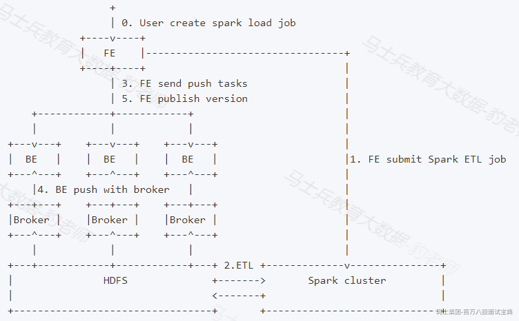

### 4.5.2 **Spark集群搭建**

Doris 中Spark Load 需要借助Spark进行数据ETL，Spark任务可以基于Standalone提交运行也可以基于Yarn提交运行，两种不同资源调度框架配置不同，下面分别进行搭建配置。**Spark版本** **建议使用 2.4.5 或以上的 Spark2 官方版本** **。经过测试不能使用Spark3.x以上版本，与目前doris版本不兼容。**

#### 4.5.2.1 **Spark Standalone 集群搭建**

这里我们选择Spark2.3.1版本进行搭建Spark Standalone集群，Standalone集群中有Master和Worker，Standalone集群搭建节点划分如下：

|  |  |  |  |  |
| --- | --- | --- | --- | --- |
| **节点IP** | **节点名称** | **Master** | **Worker** | **客户端** |
| 192.168.179.4 | node1 | ★ |  | ★ |
| 192.168.179.5 | node2 |  | ★ | ★ |
| 192.168.179.6 | node3 |  | ★ | ★ |

以上node2,node3计算节点，建议给内存多一些，否则在后续执行Spark Load任务时executor内存可能不足。详细的搭建步骤如下：

1. **下载Spark安装包**

这里在Spark官网中现在Spark安装包，安装包下载地址：<https://archive.apache.org/dist/spark/spark-2.3.1/spark-2.3.1-bin-hadoop2.7.tgz>

2. **上传、解压、修改名称**

这里将下载好的安装包上传至node1节点的“/software”路径，进行解压，修改名称：

```plain
#解压
[root@node1 ~]# tar -zxvf spark-2.3.1-bin-hadoop2.7.tgz  -C /software/

#修改名称
[root@node1 software]# mv spark-2.3.1-bin-hadoop2.7 spark-2.3.1
```

3. **配置conf文件**

```plain
#进入conf路径
[root@node1 ~]# cd /software/spark-2.3.1/conf/

#改名
[root@node1 conf]# cp spark-env.sh.template spark-env.sh
[root@node1 conf]# cp workers.template workers

#配置spark-env.sh，在改文件中写入如下配置内容
export SPARK_MASTER_HOST=node1
export SPARK_MASTER_PORT=7077
export SPARK_WORKER_CORES=3
export SPARK_WORKER_MEMORY=3g

#配置workers，在workers文件中写入worker节点信息
node2
node3
```

将以上配置好Spark解压包发送到node2、node3节点上：

```plain
[root@node1 ~]# cd /software/
[root@node1 software]# scp -r ./spark-2.3.1 node2:/software/
[root@node1 software]# scp -r ./spark-2.3.1 node3:/software/
```

4. **启动集群**

在node1节点上进入“$SPARK\_HOME/sbin”目录中执行如下命令启动集群：

```plain
#启动集群
[root@node1 ~]# cd /software/spark-2.3.1/sbin/
[root@node1 sbin]# ./start-all.sh
```

5. **访问webui**

Spark集群启动完成之后，可以在浏览器中输入“<http://node1:8080”来查看Spark> WebUI：

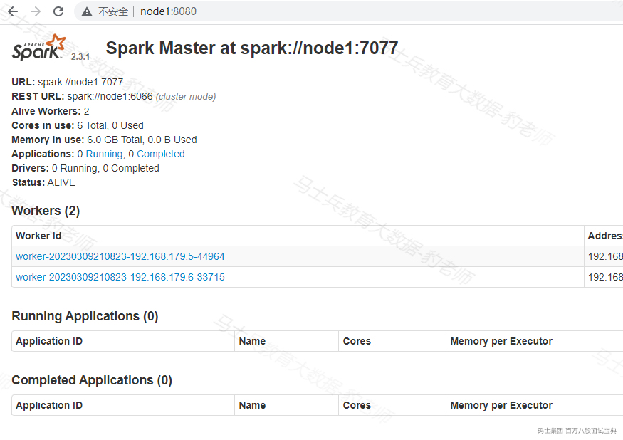

在浏览器中输入地址出现以上页面，并且对应的worker状态为Alive，说明Spark Standalone集群搭建成功。

6. **Spark Pi任务提交测试**

这里在客户端提交Spark PI任务来进行任务测试，node1-node3任意一台节点都可以当做是客户端，这里选择node3节点为客户端进行Spark任务提交，操作如下：

```plain
#提交Spark Pi任务
[root@node3 ~]# cd /software/spark-2.3.1/bin/
[root@node3 bin]# ./spark-submit --master spark://node1:7077 --class org.apache.spark.examples.SparkPi ../examples/jars/spark-examples_2.11-2.3.1.jar
...
Pi is roughly 3.1410557052785264
...
```

#### 4.5.2.2 **Spark On Yarn 配置**

Spark On Yarn 配置只需要在提交Spark任务的客户端HADOOP\_HOME/etc/hadoop”，然后再启动Yarn，基于各个客户端提交Spark即可。

1. **配置spark-env.sh文件**

在node1-node3 各个节点都配置$SPARK\_HOME/conf/spark-env.sh：

```plain
...
export HADOOP_CONF_DIR=$HADOOP_HOME/etc/hadoop
...
```

2. **启动HDFS及Yarn**

Doris中8030端口为FE与FE之间、客户端与FE之间通信的端口，该端口与Yarn中ResourceManager调度端口冲突。Doris中8040端口为BE和BE之间的通信端口，该端口与Yarn中NodeManager调度端口冲突，所以启动HDFS Yarn之前需要修改HDFS集群中yarn-site.xml文件，配置ResourceManager和NodeManager调度端口，这里将默认的8030改为18030,8040改为18040。

```plain
#node1-node5 节点配置$HADOOP_HOME/etc/hadoop/yarn-site.xml
...
<-- 配置 ResourceManager 对应的节点和端口 -->
<property>
    <name>yarn.resourcemanager.scheduler.address.rm1</name>

    <value>node1:18030</value>

</property>

<property>
    <name>yarn.resourcemanager.scheduler.address.rm2</name>

    <value>node2:18030</value>

</property>

<!-- 配置 NodeManager 对应的端口，DataNode同节点即为NodeManager -->
<property>
    <name>yarn.nodemanager.localizer.address</name>

    <value>0.0.0.0:18040</value>

</property>

...
```

以上配置完成后，重新执行start-all.sh命令启动HDFS及Yarn:

```plain
#启动zookeeper
[root@node3 ~]# zkServer.sh start
[root@node4 ~]# zkServer.sh start
[root@node5 ~]# zkServer.sh start

#启动HDFS和Yarn
[root@node1 ~]# start-all.sh
```

node1-node3任意一台节点提交任务测试：

```plain
[root@node1 ~]# cd /software/spark-2.3.1/bin/
[root@node1 bin]# ./spark-submit --master yarn --deploy-mode client --class org.apache.spark.examples.SparkPi ../examples/jars/spark-examples_2.11-2.3.1.jar 
...
Pi is roughly 3.146835734178671
...
```

### 4.5.3 **Doris配置Spark与Yarn**

#### 4.5.3.1 **Doris配置Spark**

FE底层通过执行spark-submit的命令去提交 Spark 任务，因此需要为 FE 配置 Spark 客户端。

- **配置 SPARK\_HOME 环境变量**

将spark客户端放在FE(FE节点为node1-node3)同一台机器上的目录下，并在FE的配置文件配置 spark\_home\_default\_dir 项指向此目录，此配置项默认为FE根目录下的lib/spark2x路径，此项不可为空。

```plain
#node1-node3 FE 节点上 ，配置 fe.conf
vim /software/doris-1.2.1/apache-doris-fe/conf/fe.conf
...
enable_spark_load = ture
spark_home_default_dir = /software/spark-2.3.1
...
```

- **配置SPARK 依赖包**

将spark客户端下的jars文件夹内所有jar包归档打包成一个zip文件，并在FE的配置文件配置 spark\_resource\_path 项指向此 zip 文件，若此配置项为空，则FE会尝试寻找FE根目录下的 lib/spark2x/jars/spark-2x.zip 文件，若没有找到则会报文件不存在的错误。操作如下：

```plain
#node1-node3 各个节点安装 zip
yum -y install zip

#node1 - node3 各个节点上将$SPARK_HOME/jars/下所有jar包打成zip包
cd /software/spark-2.3.1/jars && zip spark-2x.zip ./*

#配置node1-node3节点fe.conf
vim /software/doris-1.2.1/apache-doris-fe/conf/fe.conf
...
spark_resource_path = /software/spark-2.3.1/jars/spark-2x.zip
...
```

- **修改spark-dpp包名**

当提交 spark load 任务时，除了以上spark-2x.zip依赖上传到指定的远端仓库，FE 还会上传 DPP 的依赖包至远端仓库，Spark进行数据预处理时需要依赖DPP此包,该包位于FE节点的/software/doris-1.2.1/apache-doris-fe/spark-dpp路径下，默认名称为spark-dpp-1.0-SNAPSHOT-jar-with-dependencies.jar，在提交Spark Load任务后，Doris默认在/software/doris-1.2.1/apache-doris-fe/spark-dpp路径下找名称为“spark-dpp-1.0.0-jar-with-dependencies.jar”的依赖包，所以这里需要在所有FE节点上进行改名，操作如下：

```plain
#在所有的FE节点中修改spark-dpp-1.0-SNAPSHOT-jar-with-dependencies.jar名称为spark-dpp-1.0.0-jar-with-dependencies.jar
cd /software/doris-1.2.1/apache-doris-fe/spark-dpp/
mv spark-dpp-1.0-SNAPSHOT-jar-with-dependencies.jar spark-dpp-1.0.0-jar-with-dependencies.jar
```

#### 4.5.3.2 **Doris配置Yarn**

Spark Load 底层的Spark任务可以基于Yarn运行，FE 底层通过执行 yarn 命令去获取正在运行的 application 的状态以及杀死 application，因此需要为 FE 配置 yarn 客户端， **建议使用2.5.2 或以上的 hadoop2 官方版本** **。经测试使用hadoop3问题也不大。**

将下载好的 yarn 客户端放在 FE 同一台机器的目录下，并在FE配置文件配置 yarn\_client\_path 项指向 yarn 的二进制可执行文件，默认为FE根目录下的 lib/yarn-client/hadoop/bin/yarn 路径。

```plain
#在node1-node3各个节点配置fe.conf
vim /software/doris-1.2.1/apache-doris-fe/conf/fe.conf
...
yarn_client_path = /software/hadoop-3.3.3/bin/yarn
...
```

当 FE 通过 yarn 客户端去获取 application 的状态或者杀死 application 时，默认会在 FE 根目录下的 lib/yarn-config 路径下生成执行yarn命令所需的配置文件，此路径可通过在FE配置文件配置 yarn\_config\_dir 项修改，目前生成的配置文件包括 core-site.xml 和yarn-site.xml。

```plain
#在node1-node3各个节点配置fe.conf
vim /software/doris-1.2.1/apache-doris-fe/conf/fe.conf
...
yarn_config_dir = /software/hadoop-3.3.3/etc/hadoop
...
```

此外还需要在Hadoop 各个节点中的/software/hadoop-3.3.3/libexec/hadoop-config.sh文件中配置JAVA\_HOME，否则基于Yarn 运行Spark Load任务时报错。

```plain
#在node1~node5节点上配置
vim /software/hadoop-3.3.3/libexec/hadoop-config.sh
...
export JAVA_HOME=/usr/java/jdk1.8.0_181-amd64/
...
```

### 4.5.4 Doris创建Spark Resource

#### 4.5.4.1 **创建Spark Resource**

Spark 作为一种外部计算资源在 Doris 中用来完成ETL工作，因此我们引入 resource management 来管理 Doris 使用的这些外部资源。在Doris中提交Spark Load任务之前需要创建执行ETL任务的Spark Resource ，创建Spark Resource的语法如下：

```plain
-- create spark resource
CREATE EXTERNAL RESOURCE resource_name
PROPERTIES
(
type = spark,
spark_conf_key = spark_conf_value,
working_dir = path,
broker = broker_name,
broker.property_key = property_value
)

-- drop spark resource
DROP RESOURCE resource_name

-- show resources
SHOW RESOURCES
SHOW PROC "/resources"
```

- resource\_name为 Doris 中配置的 Spark 资源的名字。

- PROPERTIES 是 Spark 资源相关参数，具体Properties参数如下：

1. type：资源类型，必填，目前仅支持 spark。

2. spark.master: 必填，目前支持 yarn，spark://host:port。

3. spark.submit.deployMode: Spark 程序的部署模式，必填，支持 cluster，client 两种。

4. spark.hadoop.yarn.resourcemanager.address: master 为 yarn 时必填。

5. spark.hadoop.fs.defaultFS: master为yarn时必填。

- working\_dir: ETL 使用的目录。spark作为ETL资源使用时必填。例如：hdfs://host:port/tmp/doris。当提交 spark load 任务时，会将归档好的依赖文件上传至远端仓库，默认仓库路径挂在 working\_dir/{cluster\_id} 目录下。

- broker: broker 名字。spark 作为 ETL 资源使用时必填。需要使用 ALTER SYSTEM ADD BROKER 命令提前完成配置,可以通过show broker命令来查询。

- broker.property\_key: broker 读取 ETL 生成的中间文件时需要指定的认证信息等。

这里我们创建Spark Resource，Spark Resource 可以指定成Spark Standalone client模式、cluster模式，也可以指定成Yarn Client、Yarncluster模式，下面以Yarn Cluster 模式对Spark Resource进行演示。

```plain
-- spark standalone client 模式，注意：目前测试standalone client和cluster有问题，不能获取执行任务对应的appid导致后续不能向doris加载数据
CREATE EXTERNAL RESOURCE "spark0"
PROPERTIES
(
"type" = "spark",
"spark.master" = "spark://node1:7077",
"spark.submit.deployMode" = "client",
"working_dir" = "hdfs://node1:8020/tmp/doris-standalone",
"broker" = "broker_name"
);

-- yarn cluster 模式
CREATE EXTERNAL RESOURCE "spark1"
PROPERTIES
(
"type" = "spark",
"spark.master" = "yarn",
"spark.submit.deployMode" = "cluster",
"spark.executor.memory" = "1g",
"spark.hadoop.yarn.resourcemanager.address" = "node1:8032",
"spark.hadoop.fs.defaultFS" = "hdfs://node1:8020",
"working_dir" = "hdfs://node1:8020/tmp/doris-yarn",
"broker" = "broker_name"
);
```

注意：

- 以上standalone和yarn 都支持client和cluster模式部署，只需要将deployMode修改成对应模式即可。

- 经过后期测试Spark Standalone 模式执行Spark Load任务时有问题，所以后续基于yarn进行Spark Load任务提交，使用spark1 resource演示。

- 以上使用到HDFS路径时，不支持HDFS HA 写法，需要手动指定Active NameNode节点信息。

- Resource资源不属于任意一个库，通过MySQL客户端可以直接创建。

当Spark Resource创建完成之后，可以通过以下命令查看和删除Resources：

```plain
#查看Resources
mysql> show resources;
+--------+--------------+-------------------------+---------------------------------------+
| Name   | ResourceType | Item                    | Value                                 |
+--------+--------------+-------------------------+---------------------------------------+
| spark0 | spark        | spark.master            | spark://node1:8088                    |
| spark0 | spark        | spark.submit.deployMode | client                                |
| spark0 | spark        | working_dir             | hdfs://mycluster/tmp/doris-standalone |
| spark0 | spark        | broker                  | broker_name                           |
+--------+--------------+-------------------------+---------------------------------------+

#删除Resources
mysql> drop resource spark0;
Query OK, 0 rows affected (0.03 sec)
```

重新创建以上spark0,spark1 resource资源，方便后续Spark Load使用。

#### 4.5.4.2 **分配资源权限**

普通账户只能看到自己有USAGE\_PRIV 使用权限的资源,root和admin 账户可以看到所有的资源。资源权限通过 GRANT REVOKE 来管理，目前仅支持 USAGE\_PRIV 使用权限。可以将 USAGE\_PRIV 权限赋予某个用户，操作如下：

```plain
-- 授予spark0资源的使用权限给用户user0
GRANT USAGE_PRIV ON RESOURCE "spark0" TO "user0"@"%";

-- 授予所有资源的使用权限给用户user0
GRANT USAGE_PRIV ON RESOURCE * TO "user0"@"%";

-- 撤销用户user0的spark0资源使用权限
REVOKE USAGE_PRIV ON RESOURCE "spark0" FROM "user0"@"%";
```

这里我们使用的用户为root，所以不必再进行资源权限赋权。

### 4.5.5 **Spark Load语法和结果**

#### 4.5.5.1 **语法**

Spark Load 的语法如下，可以通过“help spark load”查看语法帮助:

```plain
LOAD LABEL db_name.label_name
(data_desc, ...)
WITH RESOURCE resource_name
(
"spark.executor.memory" = "1g",
"spark.shuffle.compress" = "true"
)
[resource_properties]
[PROPERTIES (key1=value1, ... )]

* data_desc:
DATA INFILE ('file_path', ...)
[NEGATIVE]
INTO TABLE tbl_name
[PARTITION (p1, p2)]
[COLUMNS TERMINATED BY separator ]
[(col1, ...)]
[COLUMNS FROM PATH AS (col2, ...)]
[SET (k1=f1(xx), k2=f2(xx))]
[WHERE predicate]

DATA FROM TABLE hive_external_tbl
[NEGATIVE]
INTO TABLE tbl_name
[PARTITION (p1, p2)]
[SET (k1=f1(xx), k2=f2(xx))]
[WHERE predicate]
```

以上Spark Load参数与Broker Load 一致，这里不再重复介绍。当用户有临时性的需求，比如增加任务使用的资源而修改 Spark configs，可以在这里设置：

```plain
WITH RESOURCE resource_name
(
"spark.executor.memory" = "1g",
"spark.shuffle.compress" = "true"
)
```

注意：设置仅对本次任务生效，并不影响 Doris 集群中已有的配置。

#### 4.5.5.2 **返回结果**

Spark Load 导入方式同 Broker load 一样都是异步的，所以用户必须将创建导入的 Label 记录，并且在查看导入命令中使用 Label 来查看导入结果。查看导入命令在所有导入方式中是通用的，具体语法可执行 HELP SHOW LOAD 查看。例如：

```plain
mysql> show load order by createtime desc limit 1\G
*************************** 1. row ***************************
JobId: 76391
Label: label1
State: FINISHED
Progress: ETL:100%; LOAD:100%
Type: SPARK
EtlInfo: unselected.rows=4; dpp.abnorm.ALL=15; dpp.norm.ALL=28133376
TaskInfo: cluster:cluster0; timeout(s):10800; max_filter_ratio:5.0E-5
ErrorMsg: N/A
CreateTime: 2019-07-27 11:46:42
EtlStartTime: 2019-07-27 11:46:44
EtlFinishTime: 2019-07-27 11:49:44
LoadStartTime: 2019-07-27 11:49:44
LoadFinishTime: 2019-07-27 11:50:16
URL: http://1.1.1.1:8089/proxy/application_1586619723848_0035/
JobDetails: {"ScannedRows":28133395,"TaskNumber":1,"FileNumber":1,"FileSize":200000}
```

返回的结果解释同Broker Load，这里不再介绍。

### 4.5.6 **Spark Load导入HDFS数据**

下面以导入HDFS中数据到Doris表为例，介绍Spark Load的使用，这里使用“spark0”Spark Resource 。

1. **准备HDFS数据**

准备spark\_load\_data.csv数据文件，内容如下。

spark\_load\_data.csv:

```plain
1,zs,18,100
2,ls,19,101
3,ww,20,102
4,ml,21,103
5,tq,22,104
```

将以上数据文件上传到hdfs://mycluster/input/目录下：

```plain
[root@node1 ~]# hdfs dfs -put ./spark_load_data.csv  /input/
```

2. **创建Doris表**

```plain
create table spark_load_t1(
id int,
name varchar(255),
age int,
score double
) 
ENGINE = olap
DUPLICATE KEY(id)
DISTRIBUTED BY HASH(`id`) BUCKETS 8;
```

注意：Spark load 还不支持 Doris 表字段是String类型的导入，如果你的表字段有String类型的请改成varchar类型，不然会导入失败，提示 type:ETL\_QUALITY\_UNSATISFIED; msg:quality not good enough to cancel

3. **创建Spark Load导入任务**

```plain
LOAD LABEL example_db.label1
(
DATA INFILE("hdfs://node1:8020/input/spark_load_data.csv")
INTO TABLE spark_load_t1
COLUMNS TERMINATED BY ","
FORMAT AS "csv"
(id,name,age,score_tmp)
SET
(
score = score_tmp + age
)
)
WITH RESOURCE 'spark1'
(
"spark.driver.memory" = "512M",
"spark.executor.cores" = "1",
"spark.executor.memory" = "512M",
"spark.shuffle.compress" = "true"
)
PROPERTIES
(
"timeout" = "3600"
);
```

注意：

- 加载的HDFS中的文件，不支持HA写法，需要指定Active NameNode节点信息。

- 当 Spark Load 作业状态不为 CANCELLED 或 FINISHED 时，可以被用户手动取消。取消时需要指定待取消导入任务的 Label 。取消导入命令语法可执行 HELP CANCEL LOAD 查看。

- 如果想要清除对应完成的label，可以执行“clean label from example\_db;”命令即可。

4. **查看导入任务状态**

以上任务提交之后，可以在Yarn WebUI中查看提交的任务执行情况：

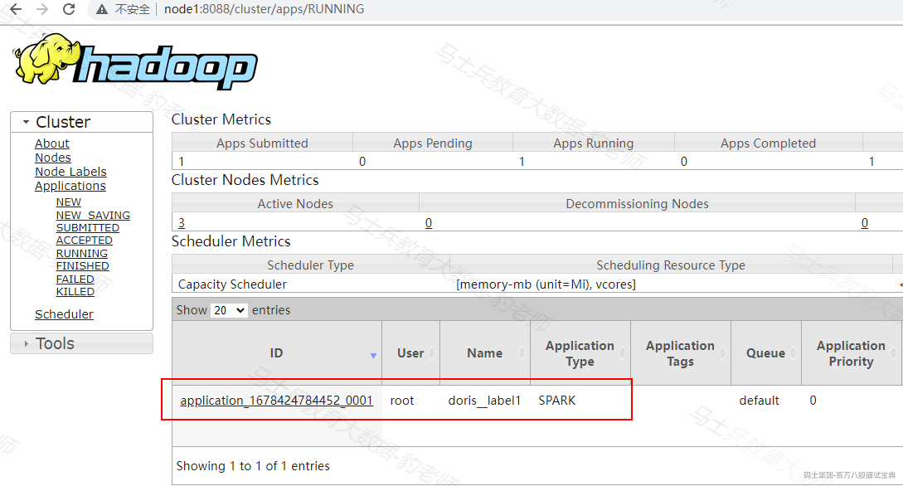

也可以在FE 节点“/software/doris-1.2.1/apache-doris-fe/log/spark\_launcher\_log”中查看执行日志，FE节点不一定在node1-node3哪台节点执行Spark ETL任务，执行任务的节点上才有以上日志路径，该日志默认保存3天。

在node1 mysql客户端也可以执行命令查看Spark Load导入情况，命令如下：

```plain
mysql> show load order by createtime desc limit 1\G;
*************************** 1. row ***************************
         JobId: 37038
         Label: label1
         State: FINISHED
      Progress: ETL:100%; LOAD:100%
          Type: SPARK
       EtlInfo: unselected.rows=0; dpp.abnorm.ALL=0; dpp.norm.ALL=5
      TaskInfo: cluster:spark1; timeout(s):3600; max_filter_ratio:0.0
      ErrorMsg: NULL
    CreateTime: 2023-03-10 16:11:44
  EtlStartTime: 2023-03-10 16:12:16
 EtlFinishTime: 2023-03-10 16:12:59
 LoadStartTime: 2023-03-10 16:12:59
LoadFinishTime: 2023-03-10 16:13:09
           URL: http://node1:8088/proxy/application_1678424784452_0001/
    JobDetails: {"Unfinished backends":{"0-0":[]},"ScannedRows":5,"TaskNumber":1,"LoadBytes":0,"All backends":{"0-0":[-1]},"FileNumber":1,"FileSi
ze":60} TransactionId: 24027
  ErrorTablets: {}
1 row in set (0.01 sec)
```

当Yarn中任务执行完成之后，通过以上命令查询Spark Load 执行情况还在执行，主要是因为当Spark ETL job完成后，Doris还会加载数据到对应的BE中，完成之后状态会改变成FINISHED。

5. **查看Doris表结果**

```plain
mysql> select * from spark_load_t1;
+------+------+------+-------+
| id   | name | age  | score |
+------+------+------+-------+
|    2 | ls   |   19 |   120 |
|    3 | ww   |   20 |   122 |
|    5 | tq   |   22 |   126 |
|    4 | ml   |   21 |   124 |
|    1 | zs   |   18 |   118 |
+------+------+------+-------+
```

### 4.5.7 **Spark Load 导入Hive数据**

#### 4.5.7.1 **Spark Load导入Hive非分区表数据**

1. **在node3hive客户端，准备向Hive表加载的数据**

hive\_data1.txt:

```plain
1,zs,18,100
2,ls,19,101
3,ww,20,102
4,ml,21,103
5,tq,22,104
```

2. **启动Hive，在Hive客户端创建Hive表并加载数据**

```plain
#配置Hive 服务端$HIVE_HOME/conf/hive-site.xml
<property>
<name>hive.metastore.schema.verification</name>

<value>false</value>

</property>

注意：此配置项为关闭metastore版本验证，避免在doris中读取hive外表时报错。

#在node1节点启动hive metastore
[root@node1 ~]# hive --service metastore &

#在node3节点进入hive客户端建表并加载数据 
create table hive_tbl (id int,name string,age int,score int) row format delimited fields terminated by ',';

load data local inpath '/root/hive_data1.txt' into table hive_tbl;

#查看hive表中的数据
hive> select * from hive_tbl;
1	zs	18	100
2	ls	19	101
3	ww	20	102
4	ml	21	103
5	tq	22	104
```

3. **在Doris中创建Hive 外部表**

使用Spark Load 将Hive非分区表中的数据导入到Doris中时，需要先在Doris中创建hive 外部表，然后通过Spark Load 加载这张外部表数据到Doris某张表中。

```plain
#Doris中创建Hive 外表
CREATE EXTERNAL TABLE example_db.hive_doris_tbl
(
id INT,
name varchar(255),
age INT,
score INT
)
ENGINE=hive
properties
(
"dfs.nameservices"="mycluster",
"dfs.ha.namenodes.mycluster"="node1,node2",
"dfs.namenode.rpc-address.mycluster.node1"="node1:8020",
"dfs.namenode.rpc-address.mycluster.node2"="node2:8020",
"dfs.client.failover.proxy.provider.mycluster" = "org.apache.hadoop.hdfs.server.namenode.ha.ConfiguredFailoverProxyProvider",
"database" = "default",
"table" = "hive_tbl",
"hive.metastore.uris" = "thrift://node1:9083"
);
```

注意：

- 在Doris中创建Hive外表不会将数据存储到Doris中，查询hive外表数据时会读取HDFS中对应hive路径中的数据来展示，向hive表中插入数据时，doris中查询hive外表也能看到新增数据。

- 如果Hive表中是分区表，doris创建hive表将分区列看成普通列即可。

以上hive外表结果如下：

```plain
mysql> select * from hive_doris_tbl;
+------+------+------+-------+
| id   | name | age  | score |
+------+------+------+-------+
|    1 | zs   |   18 |   100 |
|    2 | ls   |   19 |   101 |
|    3 | ww   |   20 |   102 |
|    4 | ml   |   21 |   103 |
|    5 | tq   |   22 |   104 |
+------+------+------+-------+
```

4. **创建Doris表**

```plain
#创建Doris表
create table spark_load_t2(
id int,
name varchar(255),
age int,
score double
) 
ENGINE = olap
DUPLICATE KEY(id)
DISTRIBUTED BY HASH(`id`) BUCKETS 8;
```

5. **创建Spark Load导入任务**

创建Spark Load任务后，底层Spark Load转换成Spark任务进行数据导入处理时，需要连接Hive，所以需要保证在Spark node1-node3节点客户端中SPARK\_HOME/conf/目录下有hive-site.xml配置文件，以便找到Hive ,另外，连接Hive时还需要MySQL 连接依赖包，所以需要在Yarn NodeManager各个节点保证$HADOOP\_HOME/share/hadoop/yarn/lib路径下有mysql-connector-java-5.1.47.jar依赖包。

```plain
#把hive客户端hive-site.xml 分发到Spark 客户端（node1-node3）节点$SPARK_HOME/conf目录下
[root@node3 ~]# scp /software/hive-3.1.3/conf/hive-site.xml  node1:/software/spark-2.3.1/conf/
[root@node3 ~]# scp /software/hive-3.1.3/conf/hive-site.xml  node2:/software/spark-2.3.1/conf/
[root@node3 ~]# cp /software/hive-3.1.3/conf/hive-site.xml  /software/spark-2.3.1/conf/

#将mysql-connector-java-5.1.47.jar依赖分发到NodeManager 各个节点$HADOOP_HOME/share/hadoop/yarn/lib路径中
[root@node3 ~]# cp /software/hive-3.1.3/lib/mysql-connector-java-5.1.47.jar /software/hadoop-3.3.3/share/hadoop/yarn/lib/
[root@node3 ~]# scp /software/hive-3.1.3/lib/mysql-connector-java-5.1.47.jar node4:/software/hadoop-3.3.3/share/hadoop/yarn/lib/
[root@node3 ~]# scp /software/hive-3.1.3/lib/mysql-connector-java-5.1.47.jar node5:/software/hadoop-3.3.3/share/hadoop/yarn/lib/
```

编写Spark Load任务,如下：

```plain
LOAD LABEL example_db.label2
(
DATA FROM TABLE hive_doris_tbl
INTO TABLE spark_load_t2
)
WITH RESOURCE 'spark1'
(
"spark.executor.memory" = "1g",
"spark.shuffle.compress" = "true"
)
PROPERTIES
(
"timeout" = "3600"
);
```

6. **Spark Load任务查看**

登录Yarn Web UI查看对应任务执行情况:

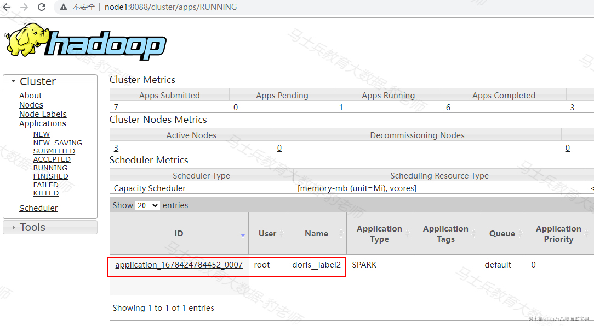

执行命令查看Spark Load 任务执行情况：

```plain
mysql> show load order by createtime desc limit 1\G;
*************************** 1. row ***************************
         JobId: 37128
         Label: label2
         State: FINISHED
      Progress: ETL:100%; LOAD:100%
          Type: SPARK
       EtlInfo: unselected.rows=0; dpp.abnorm.ALL=0; dpp.norm.ALL=0
      TaskInfo: cluster:spark1; timeout(s):3600; max_filter_ratio:0.0
      ErrorMsg: NULL
    CreateTime: 2023-03-10 18:13:19
  EtlStartTime: 2023-03-10 18:13:34
 EtlFinishTime: 2023-03-10 18:15:27
 LoadStartTime: 2023-03-10 18:15:27
LoadFinishTime: 2023-03-10 18:15:30
           URL: http://node1:8088/proxy/application_1678424784452_0007/
    JobDetails: {"Unfinished backends":{"0-0":[]},"ScannedRows":0,"TaskNumber":1,"LoadBytes":0,"All backends":{"0-0":[-1]},"FileNumber":0,"FileSi
ze":0} TransactionId: 24081
  ErrorTablets: {}
1 row in set (0.00 sec)
```

7. **查看Doris结果**

```plain
mysql> select * from spark_load_t2;
+------+------+------+-------+
| id   | name | age  | score |
+------+------+------+-------+
|    5 | tq   |   22 |   104 |
|    4 | ml   |   21 |   103 |
|    1 | zs   |   18 |   100 |
|    3 | ww   |   20 |   102 |
|    2 | ls   |   19 |   101 |
+------+------+------+-------+
```

#### 4.5.7.2 **Spark Load 导入Hive分区表数据**

导入Hive分区表数据到对应的doris分区表就不能在doris中创建hive外表这种方式导入，因为hive分区列在hive外表中就是普通列，所以这里我们使用Spark Load 直接读取Hive分区表在HDFS中的路径，将数据加载到Doris分区表中。

1. **在node3 hive客户端，准备向Hive表加载的数据**

hive\_data2.txt:

```plain
1,zs,18,100,2023-03-01
2,ls,19,200,2023-03-01
3,ww,20,300,2023-03-02
4,ml,21,400,2023-03-02
5,tq,22,500,2023-03-02
```

2. **创建Hive分区表并，加载数据**

```plain
#在node3节点进入hive客户端建表并加载数据 
create table hive_tbl2 (id int, name string,age int,score int) partitioned by (dt string) row format delimited fields terminated by ','

load data local inpath '/root/hive_data2.txt' into table hive_tbl2;

#查看hive表中的数据
hive> select * from hive_tbl2;
OK
1	zs	18	100	2023-03-01
2	ls	19	200	2023-03-01
3	ww	20	300	2023-03-02
4	ml	21	400	2023-03-02
5	tq	22	500	2023-03-02

hive> show partitions hive_tbl2;
OK
dt=2023-03-01
dt=2023-03-02
```

当hive\_tbl2表创建完成后，我们可以在HDFS中看到其存储路径格式如下：

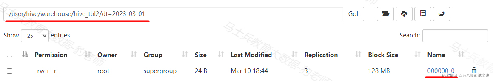

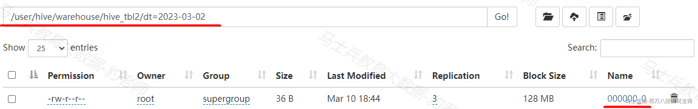

3. **创建Doris分区表**

```plain
create table spark_load_t3(
dt date,
id int,
name varchar(255),
age int,
score double
) 
ENGINE = olap
DUPLICATE KEY(dt,id)
PARTITION BY RANGE(`dt`)
(
PARTITION `p1` VALUES [("2023-03-01"),("2023-03-02")),
PARTITION `p2` VALUES [("2023-03-02"),("2023-03-03"))
)
DISTRIBUTED BY HASH(`id`) BUCKETS 8;
```

4. **创建Spark Load导入任务**

创建Spark Load任务后，底层Spark Load转换成Spark任务进行数据导入处理时，需要连接Hive，所以需要保证在Spark node1-node3节点客户端中SPARK\_HOME/conf/目录下有hive-site.xml配置文件，以便找到Hive ,另外，连接Hive时还需要MySQL 连接依赖包，所以需要在Yarn NodeManager各个节点保证HADOOP\_HOME/share/hadoop/yarn/lib路径下有mysql-connector-java-5.1.47.jar依赖包。

```plain
#把hive客户端hive-site.xml 分发到Spark 客户端（node1-node3）节点$SPARK_HOME/conf目录下
[root@node3 ~]# scp /software/hive-3.1.3/conf/hive-site.xml  node1:/software/spark-2.3.1/conf/
[root@node3 ~]# scp /software/hive-3.1.3/conf/hive-site.xml  node2:/software/spark-2.3.1/conf/
[root@node3 ~]# cp /software/hive-3.1.3/conf/hive-site.xml  /software/spark-2.3.1/conf/

#将mysql-connector-java-5.1.47.jar依赖分发到NodeManager 各个节点$HADOOP_HOME/share/hadoop/yarn/lib路径中
[root@node3 ~]# cp /software/hive-3.1.3/lib/mysql-connector-java-5.1.47.jar /software/hadoop-3.3.3/share/hadoop/yarn/lib/
[root@node3 ~]# scp /software/hive-3.1.3/lib/mysql-connector-java-5.1.47.jar node4:/software/hadoop-3.3.3/share/hadoop/yarn/lib/
[root@node3 ~]# scp /software/hive-3.1.3/lib/mysql-connector-java-5.1.47.jar node5:/software/hadoop-3.3.3/share/hadoop/yarn/lib/
```

编写Spark Load任务,如下：

```plain
LOAD LABEL example_db.label3
(
DATA INFILE("hdfs://node1:8020/user/hive/warehouse/hive_tbl2/dt=2023-03-02/*")
INTO TABLE spark_load_t3
COLUMNS TERMINATED BY ","
FORMAT AS "csv"
(id,name,age,score)
COLUMNS FROM PATH AS (dt)
SET
(
dt=dt,
id=id,
name=name,
age=age
)
)
WITH RESOURCE 'spark1'
(
"spark.executor.memory" = "1g",
"spark.shuffle.compress" = "true"
)
PROPERTIES
(
"timeout" = "3600"
);
```

注意：

- 以上HDFS路径不支持HA模式，需要手动指定Active NameNode节点

- 读取HDFS文件路径中的分区路径需要写出来，不能使用\*代表，这与Broker Load不同。

- **目前版本测试存在问题：当Data INFILE中指定多个路径时有时会出现只导入第一个路径数据。**

5. **Spark Load任务查看**

执行命令查看Spark Load 任务执行情况：

```plain
mysql> show load order by createtime desc limit 1\G;   
*************************** 1. row ***************************
         JobId: 39432
         Label: label3
         State: FINISHED
      Progress: ETL:100%; LOAD:100%
          Type: SPARK
       EtlInfo: unselected.rows=0; dpp.abnorm.ALL=0; dpp.norm.ALL=3
      TaskInfo: cluster:spark1; timeout(s):3600; max_filter_ratio:0.0
      ErrorMsg: NULL
    CreateTime: 2023-03-10 20:11:19
  EtlStartTime: 2023-03-10 20:11:36
 EtlFinishTime: 2023-03-10 20:12:21
 LoadStartTime: 2023-03-10 20:12:21
LoadFinishTime: 2023-03-10 20:12:22
           URL: http://node1:8088/proxy/application_1678443952851_0026/
    JobDetails: {"Unfinished backends":{"0-0":[]},"ScannedRows":3,"TaskNumber":1,"LoadBytes":0,"All backends":{"0-0":[-1]},"FileNumber":2,"FileSi
ze":60} TransactionId: 25529
  ErrorTablets: {}
1 row in set (0.02 sec)
```

6. **查看Doris结果**

```plain
mysql> select * from spark_load_t3;
+------------+------+------+------+-------+
| dt         | id   | name | age  | score |
+------------+------+------+------+-------+
| 2023-03-02 |    3 | ww   |   20 |   300 |
| 2023-03-02 |    4 | ml   |   21 |   400 |
| 2023-03-02 |    5 | tq   |   22 |   500 |
+------------+------+------+------+-------+
```

### 4.5.8 **注意事项**

1. 现在Spark load 还不支持 Doris 表字段是String类型的导入，如果你的表字段有String类型的请改成varchar类型，不然会导入失败，提示 type:ETL\_QUALITY\_UNSATISFIED; msg:quality not good enough to cancel

2. 使用Spark Load 时没有在 spark 客户端的 spark-env.sh 配置 HADOOP\_CONF\_DIR 环境变量,会报 When running with master 'yarn' either HADOOP\_CONF\_DIR or YARN\_CONF\_DIR must be set in the environment. 错误。

3. 使用Spark Load时spark\_home\_default\_dir配置项没有指定spark客户端根目录,提交Spark job 时用到 spark-submit 命令，如果 spark\_home\_default\_dir 设置错误，会报 Cannot run program "xxx/bin/spark-submit": error=2, No such file or directory 错误。

4. 使用Spark load 时 spark\_resource\_path 配置项没有指向打包好的zip文件。如果spark\_resource\_path 没有设置正确，会报 File xxx/jars/spark-2x.zip does not exist 错误。

5. 使用Spark load 时如果yarn\_client\_path 没有设置正确，会报 yarn client does not exist in path: xxx/yarn-client/hadoop/bin/yarn 错误

6. 使用Spark load 时没有在 yarn 客户端的 hadoop-config.sh 配置 JAVA\_HOME 环境变量,如果JAVA\_HOME 环境变量没有设置，会报 yarn application kill failed. app id: xxx, load job id: xxx, msg: which: no xxx/lib/yarn-client/hadoop/bin/yarn in ((null)) Error: JAVA\_HOME is not set and could not be found 错误

7. 关于FE配置

下面配置属于Spark load 的系统级别配置，也就是作用于所有 Spark load 导入任务的配置。主要通过修改 fe.conf来调整配置值。

- enable\_spark\_load

开启 Spark load 和创建 resource 功能。默认为 false，关闭此功能。

- spark\_load\_default\_timeout\_second

任务默认超时时间为259200秒（3天）。

- spark\_home\_default\_dir

spark客户端路径 (fe/lib/spark2x) 。

- spark\_resource\_path

打包好的spark依赖文件路径（默认为空）。

- spark\_launcher\_log\_dir

spark客户端的提交日志存放的目录（fe/log/spark\_launcher\_log）。

- yarn\_client\_path

yarn二进制可执行文件路径 (fe/lib/yarn-client/hadoop/bin/yarn) 。

- yarn\_config\_dir

yarn配置文件生成路径 (fe/lib/yarn-config) 。

13. 关于Spark Load支持Kerberos认证配置看考官网：<https://doris.apache.org/zh-CN/docs/dev/data-operate/import/import-way/spark-load-manual>

14. 使用Spark Load 导入文件数据时，必须指定format ,否则Spark Load 执行最后会报错“spark etl job run failed java.lang.NullPointerException”

## 4.6Routine Load

例行导入（Routine Load）功能，支持用户提交一个常驻的导入任务，通过不断的从指定的数据源读取数据，将数据导入到 Doris 中。目前Routine Load仅支持从Kafka中导入数据。

### 4.6.1基本原理


如上图，Client 向 FE 提交一个Routine Load 作业。FE 通过 JobScheduler 将一个导入作业拆分成若干个 Task。每个 Task 负责导入指定的一部分数据。Task 被 TaskScheduler 分配到指定的 BE 上执行。

在 BE 上，一个 Task 被视为一个普通的导入任务，通过 Stream Load 的导入机制进行导入。导入完成后，向 FE 汇报。FE 中的 JobScheduler 根据汇报结果，继续生成后续新的 Task，或者对失败的 Task 进行重试。

整个 Routine Load 作业通过不断的产生新的 Task，来完成数据不间断的导入。

### 4.6.2Routine Load 语法

Routine Load 语法如下：

```plain
CREATE ROUTINE LOAD [db.]job_name ON tbl_name
[merge_type]
[load_properties]
[job_properties]
FROM data_source [data_source_properties]
[COMMENT "comment"]
```

- **[db.]job****\_****name** **：**

导入作业的名称，在同一个 database 内，相同名称只能有一个 job 在运行。

- **tbl****\_****name** ：

指定需要导入的表的名称。

- **merge****\_****type:**

数据合并类型。默认为 APPEND，表示导入的数据都是普通的追加写操作。MERGE 和 DELETE 类型仅适用于 Unique Key 模型表。其中 MERGE 类型需要配合 [DELETE ON] 语句使用，以标注 Delete Flag 列。而 DELETE 类型则表示导入的所有数据皆为删除数据。

- **load****\_****properties:**

用于描述导入数据。组成如下：

```plain
[column_separator],
[columns_mapping],
[preceding_filter],
[where_predicates],
[partitions],
[DELETE ON],
[ORDER BY]
```

1. column\_separator:指定列分隔符，默认为 \t,例如：COLUMNS TERMINATED BY ","

2. columns\_mapping:用于指定文件列和表中列的映射关系，以及各种列转换等。例如：(k1, k2, tmpk1, k3 = tmpk1 + 1)

3. preceding\_filter:过滤原始数据。

4. where\_predicates:根据条件对导入的数据进行过滤。例如：WHERE k1 > 100 and k2 = 1000

5. partitions:指定导入目的表的哪些 partition 中。如果不指定，则会自动导入到对应的 partition 中。例如：PARTITION(p1, p2, p3)

6. DELETE ON:需配合 MEREGE 导入模式一起使用，仅针对 Unique Key 模型的表。用于指定导入数据中表示 Delete Flag 的列和计算关系。例如：DELETE ON v3 >100

7. ORDER BY：仅针对 Unique Key 模型的表。用于指定导入数据中表示 Sequence Col 的列。主要用于导入时保证数据顺序。

- **job****\_****properties** ：

用于指定例行导入作业的通用参数。例如：

```plain
PROPERTIES (
"key1" = "val1",
"key2" = "val2"
)
```

支持的参数如下：

1. desired\_concurrent\_number:期望的并发度。一个例行导入作业会被分成多个子任务执行。这个参数指定一个作业最多有多少任务可以同时执行。必须大于0。默认为3。这个并发度并不是实际的并发度，实际的并发度，会通过集群的节点数、负载情况，以及数据源的情况综合考虑。

2. max\_batch\_interval/max\_batch\_rows/max\_batch\_size:

这三个参数分别表示：

```plain
max_batch_interval:每个子任务最大执行时间，单位是秒。范围为 5 到 60。默认为10。
max_batch_rows:每个子任务最多读取的行数。必须大于等于200000。默认是200000。
max_batch_size:每个子任务最多读取的字节数。单位是字节，范围是 100MB 到 1GB。默认是 100MB。
```

这三个参数，用于控制一个子任务的执行时间和处理量。当任意一个达到阈值，则任务结束。使用举例：

```plain
"max_batch_interval" = "20",
"max_batch_rows" = "300000",
"max_batch_size" = "209715200"
```

3. max\_error\_number:

采样窗口内，允许的最大错误行数。必须大于等于0。默认是 0，即不允许有错误行。采样窗口为 max\_batch\_rows \* 10。即如果在采样窗口内，错误行数大于 max\_error\_number，则会导致例行作业被暂停，需要人工介入检查数据质量问题。注意：被 where 条件过滤掉的行不算错误行。

4. strict\_mode:严格模式，参考下一小节严格模式。

5. timezone：指定导入作业所使用的时区。默认为使用 Session 的 timezone 参数。该参数会影响所有导入涉及的和时区有关的函数结果。

6. format：指定导入数据格式，默认是csv，支持json格式。

7. jsonpaths：当导入数据格式为 json 时，可以通过 jsonpaths 指定抽取 Json 数据中的字段。

8. strip\_outer\_array：当导入数据格式为 json 时，strip\_outer\_array 为 true 表示 Json 数据以数组的形式展现，数据中的每一个元素将被视为一行数据。默认值是 false。

9. json\_root：当导入数据格式为 json 时，可以通过 json\_root 指定 Json 数据的根节点。Doris 将通过 json\_root 抽取根节点的元素进行解析。默认为空。

10. send\_batch\_parallelism：

整型，用于设置发送批处理数据的并行度，如果并行度的值超过 BE 配置中的 max\_send\_batch\_parallelism\_per\_job，那么作为协调点的 BE 将使用 max\_send\_batch\_parallelism\_per\_job 的值。

11. load\_to\_single\_tablet：布尔类型，为 true 表示支持一个任务只导入数据到对应分区的一个 tablet，默认值为 false，该参数只允许在对带有 random 分区的 olap 表导数的时候设置。

- **FROM data****\_****source [data****\_****source****\_****properties]：**

数据源的类型。当前支持：

```plain
FROM KAFKA
(
"key1" = "val1",
"key2" = "val2"
)
```

以上配置参数支持如下属性：

1. kafka\_broker\_list:Kafka 的 broker 连接信息。格式为 ip:host。多个broker之间以逗号分隔。

2. kafka\_topic：指定要订阅的 Kafka 的 topic。

3. kafka\_partitions/kafka\_offsets：指定需要订阅的 kafka partition，以及对应的每个 partition 的起始 offset。如果指定时间，则会从大于等于该时间的最近一个 offset 处开始消费。

offset 可以指定从大于等于 0 的具体 offset，或者：

```plain
OFFSET_BEGINNING: 从有数据的位置开始订阅。
OFFSET_END: 从末尾开始订阅。
时间格式，如："2021-05-22 11:00:00"
```

如果没有指定，则默认从 OFFSET\_END 开始订阅 topic 下的所有 partition。使用举例：

```plain
"kafka_partitions" = "0,1,2,3",
"kafka_offsets" = "101,0,OFFSET_BEGINNING,OFFSET_END"
或者
"kafka_partitions" = "0,1,2",
"kafka_offsets" = "2021-05-22 11:00:00,2021-05-22 11:00:00,2021-05-22 11:00:00"
```

**注意，时间格式不能和** **OFFSET** **格式混用。**

4. property:指定自定义kafka参数。功能等同于kafka shell中 "--property" 参数。

- **comment:**

例行导入任务的注释信息。

### 4.6.3严格模式

严格模式的意思是，对于导入过程中的列类型转换进行严格过滤。严格过滤的策略如下：

对于列类型转换来说，如果开启严格模式，则错误的数据将被过滤。这里的错误数据是指： 原始数据并不为 null ，而在进行列类型转换后结果为 null **的这一类数据。这里说指的 列类型转换，并不包括用函数计算得出的** null **值。**

对于导入的某列类型包含范围限制的，如果原始数据能正常通过类型转换，但无法通过范围限制的，严格模式对其也不产生影响。例如：如果类型是 decimal(1,0), 原始数据为 10，则属于可以通过类型转换但不在列声明的范围内。这种数据strict对其不产生影响。

- **以列类型为** **TinyInt** **来举例：**

|  |  |  |  |  |
| --- | --- | --- | --- | --- |
| **原始数据类型** | **原始数据举例** | **转换为** TinyInt **后的值** | **严格模式** | **结果** |
| 空值 | \N | NULL | 开启或关闭 | NULL |
| 非空值 | "abc"or 2000 | NULL | 开启 | 非法值（被过滤） |
| 非空值 | "abc" | NULL | 关闭 | NULL |
| 非空值 | 1 | 1 | 开启或关闭 | 正确导入 |

**说明：**

1. 表中的列允许导入空值；

2. abc及2000在转换为TinyInt（最大2^7-1）后，会因类型或精度问题变为 NULL。在严格模式开启的情况下，这类数据将会被过滤。而如果是关闭状态，则会导入 null。

- **以列类型为** **Decimal(1,0)** **举例（** Decimal **整数位** 1 **位，小数位** 0 **位）**

|  |  |  |  |  |
| --- | --- | --- | --- | --- |
| **原始数据类型** | **原始数据举例** | 转换为 Decimal**后的值** | **严格模式** | **结果** |
| 空值 | \N | null | 开启或关闭 | NULL |
| 非空值 | aaa | NULL | 开启 | 非法值（被过滤） |
| 非空值 | aaa | NULL | 关闭 | NULL |
| 非空值 | 1 or 10 | 1 or 10 | 开启或关闭 | 正确导入 |

说明：

1. 表中的列允许导入空值；

2. abc 在转换为 Decimal 后，会因类型问题变为 NULL。在严格模式开启的情况下，这类数据将会被过滤。而如果是关闭状态，则会导入 null。

3. 10虽然是一个超过范围的值，但是因为其类型符合 decimal 的要求，所以严格模式对其不产生影响。10最后会在其他导入处理流程中被过滤。但不会被严格模式过滤。

### 4.6.4案例

目前Routine Load仅支持从Kafka中导入数据到Doris中，在将Kafka数据导入到Doris中有如下限制：

- 支持的Kafka可以是无认证的Kafka或者是SSL方式认证的kafka

- kafka版本要求最好大于0.10.0.0（含）以上，如果低于该版本的kafka需要修改 be 的配置，将 kafka\_broker\_version\_fallback 的值设置为要兼容的旧版本，或者在创建routine load的时候直接设置 property.broker.version.fallback的值为要兼容的旧版本，使用旧版本的代价是routine load 的部分新特性可能无法使用，如根据时间设置 kafka 分区的 offset。

- Kafka中消息格式为csv,json文本格式，csv 每一个 message 为一行，且行尾不包含换行符。

#### 4.6.4.1导入Kafka数据到Doris

1. **创建** Doris **表**

```plain
create table routine_load_t1(
id int,
name string,
age int,
score double
) 
ENGINE = olap
DUPLICATE KEY(id)
DISTRIBUTED BY HASH(`id`) BUCKETS 8;
```

2. **创建** Kafka topic

登录kafka，在kafka中创建 "my-topic1"topic，命令如下：

```plain
#创建 my-topic1 topic
[root@node1 ~]# kafka-topics.sh --create --bootstrap-server node1:9092,node2:9092,node3:9092 --topic my-topic1  --partitions 3 --replication-factor 3

#查看创建的topic
[root@node1 ~]# kafka-topics.sh  --list --bootstrap-server node1:9092,node2:9092,node3:9092
__consumer_offsets
my-topic1
```

3. **创建** Routine Load

创建Routine Load 将Kafka中的数据加载到Doris routine\_load\_t1表中。

```plain
CREATE ROUTINE LOAD example_db.test1 ON routine_load_t1
COLUMNS TERMINATED BY ",",
COLUMNS(id, name, age, score)
PROPERTIES
(
"desired_concurrent_number"="3",
"max_batch_interval" = "20",
"max_batch_rows" = "300000",
"max_batch_size" = "209715200",
"strict_mode" = "false"
)
FROM KAFKA
(
"kafka_broker_list" = "node1:9092,node2:9092,node3:9092",
"kafka_topic" = "my-topic1",
"property.group.id" = "mygroup-1",
"property.client.id" = "client-1",
"property.kafka_default_offsets" = "OFFSET_BEGINNING"
);
```

4. **查看提交的** Routine Load

```plain
mysql> show routine load for example_db.test1\G;   
*************************** 1. row ***************************
                  Id: 25048
                Name: test1
          CreateTime: 2023-03-07 19:33:36
           PauseTime: NULL
             EndTime: NULL
              DbName: default_cluster:example_db
           TableName: routine_load_t1
               State: RUNNING
      DataSourceType: KAFKA
      CurrentTaskNum: 3
       JobProperties: ... ...
```

以上可以看到state为running，代表当前Routine Load任务正常。如果任务异常可以通过"stop routine load for example\_db.test1;"命令将任务停止后，重新再创建。

5. **测试验证**

```plain
#向Kafka my-topic1 中输入如下数据
[root@node1 ~]# kafka-console-producer.sh --bootstrap-server node1:9092,node2:9092,node3:9092 --topic my-topic1
>1,zs,18,100
>2,ls,19,200
>3,ww,xxx,300
>4,ml,21,400
>5,tq,22,500

#查询doris 表数据
mysql> select * from routine_load_t1;
+------+------+------+-------+
| id   | name | age  | score |
+------+------+------+-------+
|    1 | zs   |   18 |   100 |
|    2 | ls   |   19 |   200 |
|    5 | tq   |   22 |   500 |
|    3 | ww   | NULL |   300 |
|    4 | ml   |   21 |   400 |
+------+------+------+-------+
```

注意：第三条数据插入到表中后，对应的age为null,这是因为数据类型不对自动转换成NULL。

#### 4.6.4.2严格模式导入Kafka数据到Doris

停止以上example\_db.test1名称的Routine Load:

```plain
#停止名称为 example_db.test1的Routine Load
mysql> stop routine load for example_db.test1;
```

删除Doris表routine\_load\_t1，并重新创建该表:

```plain
#删除表
mysql> drop table routine_load_t1;

#重新创建该表
create table routine_load_t1(
id int,
name string,
age int,
score double
) 
ENGINE = olap
DUPLICATE KEY(id)
DISTRIBUTED BY HASH(`id`) BUCKETS 8;
```

以严格模式重新创建该Routine Load，只需要在Properties中指定"strict\_mode" = "true"参数即可，执行新的Routine Load:

```plain
CREATE ROUTINE LOAD example_db.test1 ON routine_load_t1
COLUMNS TERMINATED BY ",",
COLUMNS(id, name, age, score)
PROPERTIES
(
"desired_concurrent_number"="3",
"max_batch_interval" = "20",
"max_batch_rows" = "300000",
"max_batch_size" = "209715200",
"strict_mode" = "true",
"max_error_number" = "10"
)
FROM KAFKA
(
"kafka_broker_list" = "node1:9092,node2:9092,node3:9092",
"kafka_topic" = "my-topic1",
"property.group.id" = "mygroup-1",
"property.client.id" = "client-1",
"property.kafka_default_offsets" = "OFFSET_BEGINNING"
);
```

注意：以上"max\_error\_number" = "10"代表在采样窗口（max\_batch\_rows \* 10）中允许错误的行数为10，如果超过该错误行数，Load任务会被PAUSE暂停。

编写好以上Routine Load之后执行，继续在Kafka Producer中输入以下数据，并查询Doris对应的表:

```plain
#向kafka my-topic1 中继续输入如下数据
6,a1,23,10  
7,a2,xx,11
8,a3,25,12  
xx,a4,26,13  
10,a5,27,14

#查询表 my-topic1中的数据结果如下
mysql> select * from routine_load_t1;
+------+------+------+-------+
| id   | name | age  | score |
+------+------+------+-------+
|    1 | zs   |   18 |   100 |
|    5 | tq   |   22 |   500 |
|    6 | a1   |   23 |    10 |
|   10 | a5   |   27 |    14 |
|    4 | ml   |   21 |   400 |
|    8 | a3   |   25 |    12 |
|    2 | ls   |   19 |   200 |
+------+------+------+-------+
```

可以看到开启严格模式后，不符合列格式转换的数据都被过滤掉，需要注意的是在采样窗口（max\_batch\_rows \* 10）中允许错误的行数为10，如果超过该错误行数，Load任务会被PAUSE暂停。

#### 4.6.4.3kafka 简单json格式数据导入到Doris

这里演示kafka中json格式数据为简单的{"xx":"xx","xx":"xx"...}格式。

1. **创建** Doris **表**

```plain
create table routine_load_t2(
id int,
name string,
age int,
score double
) 
ENGINE = olap
DUPLICATE KEY(id)
DISTRIBUTED BY HASH(`id`) BUCKETS 8;
```

2. **创建** Kafka topic

登录kafka，在kafka中创建 "my-topic2"topic，命令如下：

```plain
#创建 my-topic2 topic
[root@node1 ~]# kafka-topics.sh --create --bootstrap-server node1:9092,node2:9092,node3:9092 --topic my-topic2  --partitions 3 --replication-factor 3

#查看创建的topic
[root@node1 ~]# kafka-topics.sh  --list --bootstrap-server node1:9092,node2:9092,node3:9092
__consumer_offsets
my-topic1
my-topic2
```

3. **创建** Routine Load

创建Routine Load 将Kafka中的json格式数据加载到Doris routine\_load\_t2表中。

```plain
CREATE ROUTINE LOAD example_db.test_json_label_1 ON routine_load_t2
COLUMNS(id,name,age,score)
PROPERTIES
(
"desired_concurrent_number"="3",
"max_batch_interval" = "20",
"max_batch_rows" = "300000",
"max_batch_size" = "209715200",
"strict_mode" = "false",
"format" = "json"
)
FROM KAFKA
(
"kafka_broker_list" = "node1:9092,node2:9092,node3:9092",
"kafka_topic" = "my-topic2",
"kafka_partitions" = "0,1,2",
"kafka_offsets" = "0,0,0"
);
```

4. **查看提交的** Routine Load

```plain
mysql> show routine load for example_db.test_json_label_1\G;   
*************************** 1. row ***************************
                  Id: 25048
                Name: test1
          CreateTime: 2023-03-07 19:33:36
           PauseTime: NULL
             EndTime: NULL
              DbName: default_cluster:example_db
           TableName: routine_load_t1
               State: RUNNING
      DataSourceType: KAFKA
      CurrentTaskNum: 3
       JobProperties: ... ...
```

以上可以看到state为running，代表当前Routine Load任务正常。如果任务异常可以通过"stop routine load for example\_db.test1;"命令将任务停止后，重新再创建。

5. **测试验证**

```plain
#向Kafka my-topic2 中输入如下数据
[root@node1 ~]# kafka-console-producer.sh --bootstrap-server node1:9092,node2:9092,node3:9092 --topic my-topic2
>{"id":1,"name":"zs","age":18,"score":100}
>{"id":2,"name":"ls","age":19,"score":200}
>{"id":3,"name":"ww","age":20,"score":300}
>{"id":4,"name":"ml","age":21,"score":400}
>{"id":5,"name":"tq","age":22,"score":500}

#查询doris 表数据
mysql> select * from routine_load_t2;
+------+------+------+-------+
| id   | name | age  | score |
+------+------+------+-------+
|    5 | tq   |   22 |   500 |
|    3 | ww   |   20 |   300 |
|    2 | ls   |   19 |   200 |
|    4 | ml   |   21 |   400 |
|    1 | zs   |   18 |   100 |
+------+------+------+-------+
```

#### 4.6.4.4kafka json 数组格式数据导入到Doris

这里演示kafka中json格式数据为json数组，格式为[{"xx":"xx","xx":"xx"...},{...}..]格式。

1. **创建** Doris **表**

```plain
create table routine_load_t3(
id int,
name string,
age int,
score double
) 
ENGINE = olap
DUPLICATE KEY(id)
DISTRIBUTED BY HASH(`id`) BUCKETS 8;
```

2. **创建** Kafka topic

登录kafka，在kafka中创建 "my-topic3"topic，命令如下：

```plain
#创建 my-topic2 topic
[root@node1 ~]# kafka-topics.sh --create --bootstrap-server node1:9092,node2:9092,node3:9092 --topic my-topic3  --partitions 3 --replication-factor 3

#查看创建的topic
[root@node1 ~]# kafka-topics.sh  --list --bootstrap-server node1:9092,node2:9092,node3:9092
__consumer_offsets
my-topic1
my-topic2
my-topic3
```

3. **创建** Routine Load

创建Routine Load 将Kafka中的jso数组格式数据加载到Doris routine\_load\_t3表中。

```plain
CREATE ROUTINE LOAD example_db.test_json_label_2 ON routine_load_t3
COLUMNS(id,name,age,score)
PROPERTIES
(
"desired_concurrent_number"="3",
"max_batch_interval" = "20",
"max_batch_rows" = "300000",
"max_batch_size" = "209715200",
"strict_mode" = "false",
"format" = "json",
"jsonpaths"="[\"$.id\",\"$.name\",\"$.age\",\"$.score\"]",
"strip_outer_array" = "true"
)
FROM KAFKA
(
"kafka_broker_list" = "node1:9092,node2:9092,node3:9092",
"kafka_topic" = "my-topic3",
"kafka_partitions" = "0,1,2",
"kafka_offsets" = "0,0,0"
);
```

4. **查看提交的** Routine Load

```plain
mysql> show routine load for example_db.test_json_label_2\G;  
*************************** 1. row ***************************
                  Id: 25302
                Name: test_json_label_2
          CreateTime: 2023-03-07 20:36:08
           PauseTime: NULL
             EndTime: NULL
              DbName: default_cluster:example_db
           TableName: routine_load_t3
               State: RUNNING
      DataSourceType: KAFKA
      CurrentTaskNum: 3
       JobProperties: ... ...
```

以上可以看到state为running，代表当前Routine Load任务正常。如果任务异常可以通过"stop routine load for example\_db.test1;"命令将任务停止后，重新再创建。

5. **测试验证**

```plain
#向Kafka my-topic3 中输入如下数据
[root@node1 ~]# kafka-console-producer.sh --bootstrap-server node1:9092,node2:9092,node3:9092 --topic my-topic3
>[{"id":1,"name":"zs","age":18,"score":100},{"id":2,"name":"ls","age":19,"score":200}]

#查询doris 表数据
mysql> select * from routine_load_t3;
+------+------+------+-------+
| id   | name | age  | score |
+------+------+------+-------+
|    1 | zs   |   18 |   100 |
|    2 | ls   |   19 |   200 |
+------+------+------+-------+
```

### 4.6.5注意事项

1. 查看作业状态的具体命令和示例可以通过 HELP SHOW ROUTINE LOAD; 命令查看。

2. 用户可以通过 STOP/PAUSE/RESUME 三个命令来控制作业的停止，暂停和重启。可以通过 HELP STOP ROUTINE LOAD; HELP PAUSE ROUTINE LOAD; 以及 HELP RESUME ROUTINE LOAD; 三个命令查看帮助和示例。

3. FE会自动定期清理STOP状态的ROUTINE LOAD，而PAUSE状态的则可以再次被恢复启用。

4. 当用户在创建例行导入声明的 kafka\_topic 在kafka集群中不存在时。

如果用户 kafka 集群的 broker 设置了 auto.create.topics.enable = true，则 kafka\_topic 会先被自动创建，自动创建的 partition 个数是由用户方的kafka集群中的 broker 配置 num.partitions 决定的。例行作业会正常的不断读取该 topic 的数据。

如果用户 kafka 集群的 broker 设置了 auto.create.topics.enable = false, 则 topic 不会被自动创建，例行作业会在没有读取任何数据之前就被暂停，状态为 PAUSED。

5. 其他配置参数

- max\_routine\_load\_task\_concurrent\_num：

FE 配置项，默认为 5，可以运行时修改。该参数限制了一个例行导入作业最大的子任务并发数。建议维持默认值。设置过大，可能导致同时并发的任务数过多，占用集群资源。

- max\_routine\_load\_task\_num\_per\_be：

FE 配置项，默认为5，可以运行时修改。该参数限制了每个 BE 节点最多并发执行的子任务个数。建议维持默认值。如果设置过大，可能导致并发任务数过多，占用集群资源。

- max\_routine\_load\_job\_num：

FE 配置项，默认为100，可以运行时修改。该参数限制的例行导入作业的总数，包括 NEED\_SCHEDULED, RUNNING, PAUSE 这些状态。超过后，不能在提交新的作业。

- max\_consumer\_num\_per\_group：

BE 配置项，默认为 3。该参数表示一个子任务中最多生成几个 consumer 进行数据消费。对于 Kafka 数据源，一个 consumer 可能消费一个或多个 kafka partition。假设一个任务需要消费 6 个 kafka partition，则会生成 3 个 consumer，每个 consumer 消费 2 个 partition。如果只有 2 个 partition，则只会生成 2 个 consumer，每个 consumer 消费 1 个 partition。

- max\_tolerable\_backend\_down\_num：

FE 配置项，默认值是0。在满足某些条件下，Doris可PAUSED的任务重新调度，即变成RUNNING。该参数为0代表只有所有BE节点是alive状态才允许重新调度。

- period\_of\_auto\_resume\_min：

FE 配置项，默认是5分钟。Doris重新调度，只会在5分钟这个周期内，最多尝试3次. 如果3次都失败则锁定当前任务，后续不在进行调度。但可通过人为干预，进行手动恢复。

6. 关于同步SSL Kafka数据

Doris访问Kerberos认证的Kafka集群参考官网：<https://doris.apache.org/zh-CN/docs/dev/data-operate/import/import-way/routine-load-manual/>

## 4.7Stream Load

Stream load 是一个同步的导入方式，用户通过发送 HTTP 协议发送请求将本地文件或数据流导入到 Doris 中。Stream load 同步执行导入并返回导入结果。用户可直接通过请求的返回体判断本次导入是否成功。

Stream load 主要适用于导入本地文件，或通过程序导入数据流中的数据，建议的导入数据量在 1G 到 10G 之间。由于 Stream load 是一种同步的导入方式，所以用户如果希望用同步方式获取导入结果，也可以使用这种导入。

目前Stream Load支持数据格式有CSV，JSON,1.2版本后支持Parquet、orc格式。

### 4.7.1基本原理

下图展示了 Stream load 的主要流程，省略了一些导入细节。

*(⚠️ 图片缺失:源知识库原图已失效)*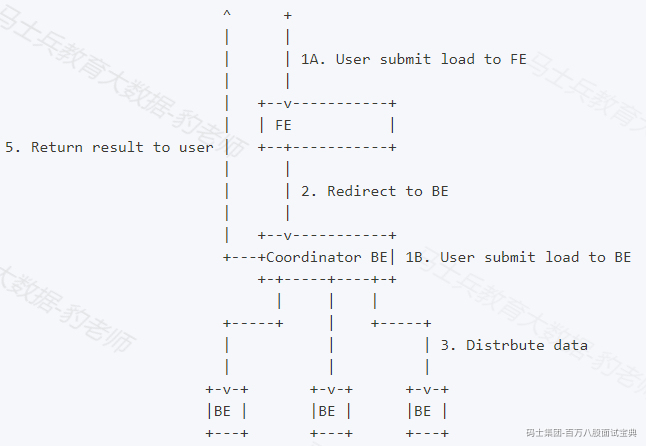

Stream load 中，Doris 会选定一个BE节点作为 Coordinator 节点。该节点负责接数据并分发数据到其他数据节点。

用户通过 HTTP 协议提交导入命令。如果提交到 FE，则 FE 会通过 HTTP redirect 指令将请求转发给某一个 BE。用户也可以直接提交导入命令给某一指定 BE。导入的最终结果由 Coordinator BE 返回给用户。

### 4.7.2语法与结果

#### 4.7.2.1语法

Stream Load 通过 HTTP 协议提交和传输数据，常用方式使用curl命令进行提交导入，命令如下：

```plain
curl --location-trusted -u user:passwd [-H ""...] -T data.file -XPUT http://fe_host:http_port/api/{db}/{table}/_stream_load
```

以上命令中user:passwd 指的是登录doris的用户名和密码；-H 代表的是Header，Header中可以指定导入任务参数；-T 指定的是导入数据文件，需要指定到对应的数据文件名称；-XPUT 执行fe 节点和端口以及导入的数据库和表信息。

Stream Load 由于使用的是 HTTP 协议，所以所有导入任务有关的参数均设置在 Header 中，-H格式为：-H "key1:value1",支持的常见属性如下：

- **label**

导入任务的标识。每个导入任务，都有一个在单 database 内部唯一的 label。label 是用户在导入命令中自定义的名称。通过这个 label，用户可以查看对应导入任务的执行情况。

label 的另一个作用，是防止用户重复导入相同的数据。 **强烈推荐用户同一批次数据使用相同的** **label** 。这样同一批次数据的重复请求只会被接受一次，保证了 At-Most-Once **。**

当 label 对应的导入作业状态为 CANCELLED 时，该 label 可以再次被使用。

- **column****\_****separator**

用于指定导入文件中的列分隔符，默认为\t。如果是不可见字符，则需要加\x作为前缀，使用十六进制来表示分隔符。

如hive文件的分隔符\x01，需要指定为-H "column\_separator:\x01"。可以使用多个字符的组合作为列分隔符。

- **line****\_****delimiter**

用于指定导入文件中的换行符，默认为\n。可以使用做多个字符的组合作为换行符。

- **max****\_****filter****\_****ratio**

导入任务的最大容忍率，默认为0容忍，取值范围是0~1。当导入的错误率超过该值，则导入失败。如果用户希望忽略错误的行，可以通过设置这个参数大于 0，来保证导入可以成功。

计算公式为：

```plain
(dpp.abnorm.ALL / (dpp.abnorm.ALL + dpp.norm.ALL ) ) > max_filter_ratio
dpp.abnorm.ALL：表示数据质量不合格的行数。如类型不匹配，列数不匹配，长度不匹配等等。
dpp.norm.ALL：指的是导入过程中正确数据的条数。可以通过 SHOW LOAD 命令查询导入任务的正确数据量。
原始文件的行数 = dpp.abnorm.ALL + dpp.norm.ALL
```

- **where**

导入任务指定的过滤条件。Stream load 支持对原始数据指定 where 语句进行过滤。被过滤的数据将不会被导入，也不会参与 filter ratio 的计算，但会被计入num\_rows\_unselected。

- **Partitions**

待导入表的 Partition 信息，如果待导入数据不属于指定的 Partition 则不会被导入。这些数据将计入 dpp.abnorm.ALL

- **columns**

待导入数据的函数变换配置，目前 Stream load 支持的函数变换方法包含列的顺序变化以及表达式变换，其中表达式变换的方法与查询语句的一致。

列顺序变换例子：

```plain
原始数据有三列(src_c1,src_c2,src_c3), 目前doris表也有三列（dst_c1,dst_c2,dst_c3）

如果原始表的src_c1列对应目标表dst_c1列，原始表的src_c2列对应目标表dst_c2列，原始表的src_c3列对应目标表dst_c3列，则写法如下：
columns: dst_c1, dst_c2, dst_c3

如果原始表的src_c1列对应目标表dst_c2列，原始表的src_c2列对应目标表dst_c3列，原始表的src_c3列对应目标表dst_c1列，则写法如下：
columns: dst_c2, dst_c3, dst_c1
```

表达式变换例子：

```plain
原始文件有两列，目标表也有两列（c1,c2）但是原始文件的两列均需要经过函数变换才能对应目标表的两列，则写法如下：
columns: tmp_c1, tmp_c2, c1 = year(tmp_c1), c2 = month(tmp_c2)
其中 tmp_*是一个占位符，代表的是原始文件中的两个原始列。
```

- **format**

指定导入数据格式，支持csv、json，默认是csv。doris 1.2 版本后支持csv\_with\_names(支持csv文件行首过滤)、csv\_with\_names\_and\_types(支持csv文件前两行过滤)

- **exec****\_****mem****\_****limit**

导入内存限制。默认为 2GB，单位为字节。

- **strict****\_****mode**

Stream Load 导入可以开启 strict mode 模式。开启方式为在 HEADER 中声明 strict\_mode=true 。默认的 strict mode 为关闭。

- merge\_type

数据的合并类型，一共支持三种类型APPEND、DELETE、MERGE 其中，APPEND是默认值，表示这批数据全部需要追加到现有数据中，DELETE 表示删除与这批数据key相同的所有行，MERGE 语义 需要与delete 条件联合使用，表示满足delete 条件的数据按照DELETE 语义处理其余的按照APPEND 语义处理。

- **two****\_****phase****\_****commit**

Stream load 导入可以开启两阶段事务提交模式：在Stream load过程中，数据写入完成即会返回信息给用户，此时数据不可见，事务状态为PRECOMMITTED，用户手动触发commit操作之后，数据才可见。例如：

1. 发起stream load预提交操作

```plain
curl --location-trusted -u user:passwd -H "two_phase_commit:true" -T test.txt http://fe_host:http_port/api/{db}/{table}/_stream_load

{
"TxnId": 18036,
"Label": "55c8ffc9-1c40-4d51-b75e-f2265b3602ef",
"TwoPhaseCommit": "true",
"Status": "Success",
"Message": "OK",
"NumberTotalRows": 100,
"NumberLoadedRows": 100,
"NumberFilteredRows": 0,
"NumberUnselectedRows": 0,
"LoadBytes": 1031,
"LoadTimeMs": 77,
"BeginTxnTimeMs": 1,
"StreamLoadPutTimeMs": 1,
"ReadDataTimeMs": 0,
"WriteDataTimeMs": 58,
"CommitAndPublishTimeMs": 0
}
```

2. 对事务触发commit操作

```plain
curl -X PUT --location-trusted -u user:passwd -H "txn_id:18036" -H "txn_operation:commit" http://fe_host:http_port/api/{db}/{table}/_stream_load_2pc

{
"status": "Success",
"msg": "transaction [18036] commit successfully."
}
```

注意：请求发往fe或be均可 ；commit 的时候可以省略 url 中的 {table}

3. 对事务触发abort操作

```plain
curl -X PUT --location-trusted -u user:passwd -H "txn_id:18037" -H "txn_operation:abort" http://fe_host:http_port/api/{db}/{table}/_stream_load_2pc

{
"status": "Success",
"msg": "transaction [18037] abort successfully."
}
```

注意：请求发往fe或be均可 ；abort 的时候可以省略 url 中的 {table}

#### 4.7.2.2返回结果

由于 Stream load 是一种同步的导入方式，所以导入的结果会通过创建导入的返回值直接返回给用户。返回结果示例如下：

```plain
{
"TxnId": 1003,
"Label": "b6f3bc78-0d2c-45d9-9e4c-faa0a0149bee",
"Status": "Success",
"ExistingJobStatus": "FINISHED", // optional
"Message": "OK",
"NumberTotalRows": 1000000,
"NumberLoadedRows": 1000000,
"NumberFilteredRows": 1,
"NumberUnselectedRows": 0,
"LoadBytes": 40888898,
"LoadTimeMs": 2144,
"BeginTxnTimeMs": 1,
"StreamLoadPutTimeMs": 2,
"ReadDataTimeMs": 325,
"WriteDataTimeMs": 1933,
"CommitAndPublishTimeMs": 106,
"ErrorURL": "http://192.168.1.1:8042/api/_load_error_log?file=__shard_0/error_log_insert_stmt_db18266d4d9b4ee5-abb00ddd64bdf005_db18266d4d9b4ee5_abb00ddd64bdf005"
}
```

以上结果参数解释如下：

- TxnId：导入的事务ID。用户可不感知。

- Label：导入 Label。由用户指定或系统自动生成。

- Status：导入完成状态。

- "Success"：表示导入成功。

- "Publish Timeout"：该状态也表示导入已经完成，只是数据可能会延迟可见，无需重试。

- "Label Already Exists"：Label 重复，需更换 Label。

- "Fail"：导入失败。

- ExistingJobStatus：已存在的 Label 对应的导入作业的状态。

这个字段只有在当 Status 为 "Label Already Exists" 时才会显示。用户可以通过这个状态，知晓已存在 Label 对应的导入作业的状态。"RUNNING" 表示作业还在执行，"FINISHED" 表示作业成功。

- Message：导入错误信息。

- NumberTotalRows：导入总处理的行数。

- NumberLoadedRows：成功导入的行数。

- NumberFilteredRows：数据质量不合格的行数。

- NumberUnselectedRows：被 where 条件过滤的行数。

- LoadBytes：导入的字节数。

- LoadTimeMs：导入完成时间。单位毫秒。

- BeginTxnTimeMs：向Fe请求开始一个事务所花费的时间，单位毫秒。

- StreamLoadPutTimeMs：向Fe请求获取导入数据执行计划所花费的时间，单位毫秒。

- ReadDataTimeMs：读取数据所花费的时间，单位毫秒。

- WriteDataTimeMs：执行写入数据操作所花费的时间，单位毫秒。

- CommitAndPublishTimeMs：向Fe请求提交并且发布事务所花费的时间，单位毫秒。

- ErrorURL：如果有数据质量问题，通过访问这个 URL 查看具体错误行。

注意：由于 Stream load 是同步的导入方式，所以并不会在 Doris 系统中记录导入信息，用户无法异步的通过查看导入命令看到 Stream load。使用时需监听创建导入请求的返回值获取导入结果。

### 4.7.3开启Steam Load记录

后续执行Stream Load 导入任务后，我们会在Doris集群中会查询对应Stream Load任务的情况，默认BE是不记录Stream Load 记录，如果想要在Doris集群中通过mysql 语法来查询对应的Stream Load记录情况，需要再BE节点上配置enable\_stream\_load\_record参数为true，该参数设置为true会让BE节点记录对应的Stream Load信息。配置步骤如下：

1. **停止** Doris 集群

```plain
#停止Doris 集群
[root@node1 ~]# cd /software/doris-1.2.1/
[root@node1 doris-1.2.1]# sh stop_doris.sh
```

2. **在** node3-node5 BE 节点上配置 **be.conf**

```plain
#node3节点配置be.conf
[root@node3 ~]# vim /software/doris-1.2.1/apache-doris-be/conf/be.conf 
...
enable_stream_load_record = true
...

#node4节点配置be.conf
[root@node4 ~]# vim /software/doris-1.2.1/apache-doris-be/conf/be.conf 
...
enable_stream_load_record = true
...

#node5节点配置be.conf
[root@node5 ~]# vim /software/doris-1.2.1/apache-doris-be/conf/be.conf 
...
enable_stream_load_record = true
...
```

3. **重新启动** Doris **集群**

```plain
#启动Doris 集群
[root@node1 ~]# cd /software/doris-1.2.1/
[root@node1 doris-1.2.1]# sh start_doris.sh
```

### 4.7.4案例

下面以导入Linux节点本地磁盘数据到Doris为例，演示Stream Load使用方式。

1. **准备数据**

在node1节点中创建/root/csv-data/test.csv数据文件，内容如下：

```plain
1,zs,18,100
2,ls,19,200
3,ww,20,300
4,ml,21,400
5,tq,22,500
```

2. **创建** Doris **表**

```plain
create table stream_load_t1(
id int,
name string,
age int,
score double
) 
ENGINE = olap
DUPLICATE KEY(id)
DISTRIBUTED BY HASH(`id`) BUCKETS 8;
```

3. **创建** Stream Load **导入任务**

```plain
[root@node1 ~]# curl --location-trusted -u root:123456 -T /root/csv-data/test.csv -H "label:test-label"  -H  "column_separator:," http://node1:8030/api/example_db/stream_load_t1/_stream_load
{
    "TxnId": 15016,
    "Label": "test-label",
    "TwoPhaseCommit": "false",
    "Status": "Success",
    "Message": "OK",
    "NumberTotalRows": 5,
    "NumberLoadedRows": 5,
    "NumberFilteredRows": 0,
    "NumberUnselectedRows": 0,
    "LoadBytes": 60,
    "LoadTimeMs": 223,
    "BeginTxnTimeMs": 2,
    "StreamLoadPutTimeMs": 7,
    "ReadDataTimeMs": 0,
    "WriteDataTimeMs": 125,
    "CommitAndPublishTimeMs": 86
}
```

注意：

- 当前Doris内部保留30分钟内最近成功的label，重启集群后，30分钟前的lable会被删除。

- 用户无法手动取消 Stream Load，Stream Load 在超时或者导入错误后会被系统自动取消,取消后，已写入的数据也会回滚，不会生效。

4. **查看任务**

Stream Load 任务执行后，可以查看对应的导入的任务，命令如下,通过该命令可以观察Stream Load 对应的Label 已经存在哪些，目的不是观察任务是否成功，因为Stream Load 本身是同步执行导入并返回导入结果。

```plain
mysql> show stream load order by starttime desc limit 1\G;
*************************** 1. row ***************************
         Label: test-label
            Db: example_db
         Table: stream_load_t1
          User: root
      ClientIp: 192.168.179.4
        Status: Success
       Message: OK
           Url: N/A
     TotalRows: 5
    LoadedRows: 5
  FilteredRows: 0
UnselectedRows: 0
     LoadBytes: 60
     StartTime: 2023-03-08 15:30:41.209
    FinishTime: 2023-03-08 15:30:41.432
1 row in set (0.03 sec)
```

**5. 查询**Doris **表结果**

```plain
mysql> select * from stream_load_t1;
+------+------+------+-------+
| id   | name | age  | score |
+------+------+------+-------+
|    5 | tq   |   22 |   500 |
|    1 | zs   |   18 |   100 |
|    3 | ww   |   20 |   300 |
|    4 | ml   |   21 |   400 |
|    2 | ls   |   19 |   200 |
+------+------+------+-------+
```

### 4.7.5注意事项

1. 开启BE上的Stream Load记录后，查询不到记录

这是因为拉取速度慢造成的，可以尝试调整下面的参数：

a.调大 BE 配置 stream\_load\_record\_batch\_size，这个配置表示每次从 BE 上最多拉取多少条 Stream load 的记录数，默认值为50条，可以调大到500条。

b. 调小 FE 的配置 fetch\_stream\_load\_record\_interval\_second，这个配置表示获取 Stream load 记录间隔，默认每120秒拉取一次，可以调整到60秒。

c. 如果要保存更多的 Stream load 记录（不建议，占用 FE 更多的资源）可以将 FE 的配置 max\_stream\_load\_record\_size 调大，默认是5000条。

2. 用户无法手动取消 Stream Load，Stream Load 在超时或者导入错误后会被系统自动取消。用户无法手动取消 Stream Load，Stream Load 在超时或者导入错误后会被系统自动取消。

3. 通过MySQL Client 执行help stream load 命令可以查询Steam Load 更多使用帮助。

4. 关于FE配置参数

stream\_load\_default\_timeout\_second：导入任务的超时时间(以秒为单位)，导入任务在设定的 timeout 时间内未完成则会被系统取消，变成 CANCELLED。默认的 timeout 时间为 600 秒。如果导入的源文件无法在规定时间内完成导入，用户可以在 stream load 请求中设置单独的超时时间。或者调整 FE 的参数stream\_load\_default\_timeout\_second 来设置全局的默认超时时间。

5. 关于BE配置参数

streaming\_load\_max\_mb：Stream load 的最大导入大小，默认为 10G，单位是 MB。如果用户的原始文件超过这个值，则需要调整 BE 的参数 streaming\_load\_max\_mb。

6. 关于Stream Load的更多使用方式，参考官网：<https://doris.apache.org/zh-CN/docs/dev/sql-manual/sql-reference/Data-Manipulation-Statements/Load/STREAM-LOAD/>

## 4.8通过外部表同步数据到Doris

Doris 可以创建外部表。创建完成后，可以通过 SELECT 语句直接查询外部表的数据，也可以通过 INSERT INTO SELECT 的方式导入外部表的数据。

Doris 外部表目前支持的数据源包括：MYSQL、Oracle、PostgreSQL、SQLServer、HIVE、ICEBERG 、HUDI、ElasticSearch,主要通过 ENGINE 类型来标识是哪种类型的外部表。具体使用方式可以参考官网：<https://doris.apache.org/zh-CN/docs/dev/sql-manual/sql-reference/Data-Definition-Statements/Create/CREATE-EXTERNAL-TABLE/>

**特别需要注意的一点是** Doris **中官方提供的安装包中默认不支持** MySQL 外表，主要原因是底层依赖库不兼容问题，如果想要支持 **MySQL** 外表需要手动进行编译 **Doris** 时加入" **WITH****\_****MYSQL=1 "** 选项。

这里以在Doris中创建Hive 外表方式来演示Doris通过外部表同步数据到Doris操作。

1. **启动**HDFS **集群和** Hive **，创建** Hive **表并加载数据**

```plain
#node3~node5启动zookeeper
[root@node3 ~]# zkServer.sh start
[root@node4 ~]# zkServer.sh start
[root@node5 ~]# zkServer.sh start

#node1 启动HDFS
[root@node1 ~]# start-all.sh 

#node1 Hive 服务端启动metastore ，node3节点启动Hive客户端并设置本地模式
[root@node1 ~]# hive --service metastore &
[root@node3 ~]# hive
hive> set hive.exec.mode.local.auto=true;

#创建Hive表并插入数据
hive> create table persons (id int,name string,age int,score int) row format delimited fields terminated by '\t';
hive> insert into persons values (1,'zs',18,100),(2,'ls',19,200),(3,'ww',20,300);

#查询表 persons数据
hive> select * from persons;
OK
1	zs	18	100
2	ls	19	200
3	ww	20	300
```

2. **在** Doris **中创建** Hive 外部表

```plain
CREATE EXTERNAL TABLE example_db.hive_doris_tbl2
(
id INT,
name varchar(255),
age INT,
score INT
)
ENGINE=hive
properties
(
"dfs.nameservices"="mycluster",
"dfs.ha.namenodes.mycluster"="node1,node2",
"dfs.namenode.rpc-address.mycluster.node1"="node1:8020",
"dfs.namenode.rpc-address.mycluster.node2"="node2:8020",
"dfs.client.failover.proxy.provider.mycluster" = "org.apache.hadoop.hdfs.server.namenode.ha.ConfiguredFailoverProxyProvider",
"database" = "default",
"table" = "persons",
"hive.metastore.uris" = "thrift://node1:9083"
);
```

3. **查询** Doris MySQL 外部表数据

```plain
mysql> select * from hive_doris_tbl2;
+------+------+------+-------+
| id   | name | age  | score |
+------+------+------+-------+
|    1 | zs   |   18 |   100 |
|    2 | ls   |   19 |   200 |
|    3 | ww   |   20 |   300 |
+------+------+------+-------+
```

4. **在** Doris **中创建新的表，并通过** insert into 方式同步 **hive** 外表数据

```plain
#doris 创建新表
create table doris_tbl(
id int,
name string,
age int
) 
ENGINE = olap
DUPLICATE KEY(id)
DISTRIBUTED BY HASH(`id`) BUCKETS 8;

#通过insert into 方式同步Hive外表数据
mysql> insert into doris_tbl select id ,name ,age from hive_doris_tbl2 limit 100;

#查询Doris 新表数据
mysql> select * from doris_tbl;
+------+------+------+
| id   | name | age  |
+------+------+------+
|    2 | ls   |   19 |
|    3 | ww   |   20 |
|    1 | zs   |   18 |
+------+------+------+
```

## 4.9Doris数据导入总结

1. Doris 中的所有导入操作都有原子性保证，即一个导入作业中的数据要么全部成功，要么全部失败，不会出现仅部分数据导入成功的情况。

2. 一个导入作业都会有一个 Label。这个 Label 是在一个数据库（Database）下唯一的，用于唯一标识一个导入作业。Label 可以由用户指定，部分导入功能也会由系统自动生成。

3. Label 是用于保证对应的导入作业，仅能成功导入一次。一个被成功导入的 Label，再次使用时，会被拒绝并报错 Label already used。通过这个机制，可以在 Doris 侧做到 At-Most-Once 语义。如果结合上游系统的 At-Least-Once 语义，则可以实现导入数据的 Exactly-Once 语义。

4. Insert Into 可以导入用户values 制定的数据也可以导入外部表同步数据到Doris表。

5. Binlog Load 只能导入MySQL数据库binlog数据，目前不支持DDL语句。

6. Borker Load 主要用于导入远端存储数据到Doris中，例如：HDFS、阿里云OSS、亚马逊S3。

7. HDFS Load 主要用于将HDFS中的数据导入到Doris中，类似的还有S3 Load。

8. Spark Load 与Broker Load 类似，通过外部的 Spark 资源实现对导入数据，提高 Doris 大数据量的导入性能并且节省 Doris 集群的计算资源。

9. Routine Load 支持用户提交一个常驻的导入任务，不断的从指定的数据源读取数据导入Doris中，目前仅支持Kafka。

10. Stream Load 通过发送 HTTP 协议发送请求将本地文件或数据流导入到 Doris 中，主要用于导入本地文件。

11. MYSQL、Oracle、PostgreSQL、SQLServer、HIVE、ICEBERG 、HUDI、ElasticSearch可以通过创建Doris外部表的方式导入到Doris中。
