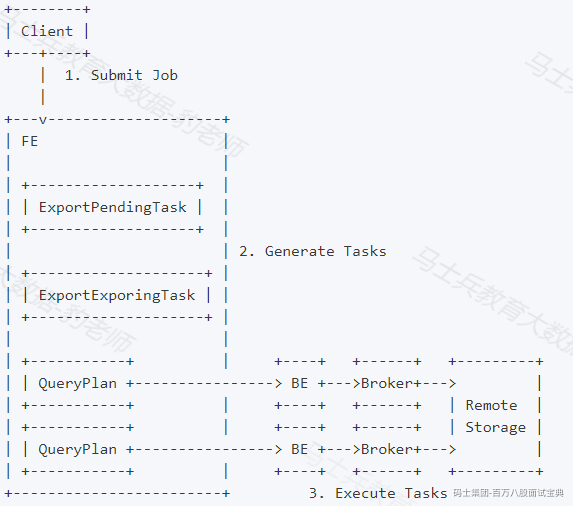
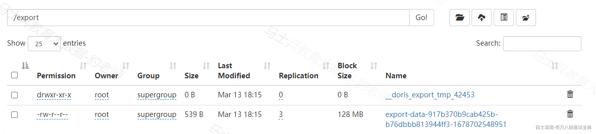
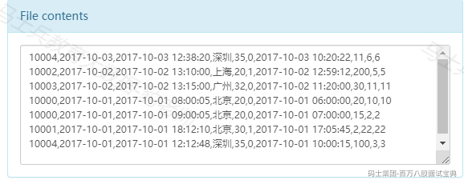
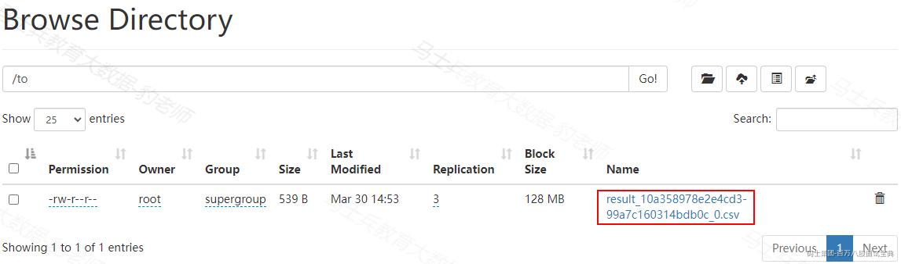
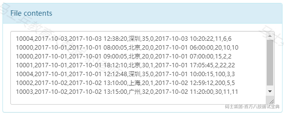
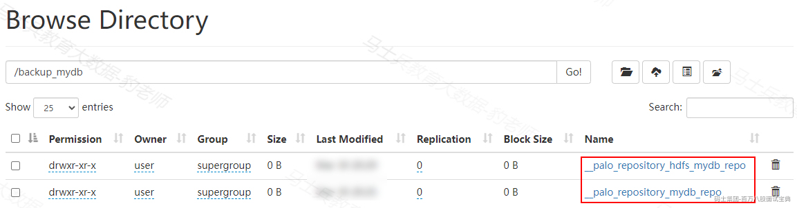

# 5第五章 Doris数据导出及数据管理

Doris Exeport、Select Into Outfile、MySQL dump三种方式数据导出。用户可以根据自己的需求导出数据。此外数据还可以以文件形式通过Borker备份到远端存储系统中，之后可以通过恢复命令来回复到Doris集群中。下面分别介绍Doris中数据导出和备份。

## 5.1Export导出

Export是 Doris 提供的一种将数据导出的功能，该功能可以将用户指定的表或分区的数据，以文本的格式，通过 Broker 进程导出到远端存储上，如 HDFS / 对象存储（支持S3协议） 等。

### 5.1.1导出原理

用户提交一个 Export 作业后，Doris 会统计这个作业涉及的所有 Tablet，然后对这些 Tablet 进行分组，每组生成一个特殊的查询计划，该查询计划会读取所包含的 Tablet 上的数据，然后通过 Broker 将数据写到远端存储指定的路径中，也可以通过S3协议直接导出到支持S3协议的远端存储上。

总体的调度流程图和步骤如下：

*(⚠️ 图片缺失:源知识库原图已失效)*

1. 用户提交一个 Export 作业到 FE。

2. FE 的 Export 调度器会通过两阶段来执行一个 Export 作业：a. PENDING：FE 生成 ExportPendingTask，向 BE 发送 snapshot 命令，对所有涉及到的 Tablet 做一个快照,并生成多个查询计划。b. EXPORTING：FE 生成 ExportExportingTask，开始执行查询计划。

#### 5.1.1.1查询计划拆分

Export 作业会生成多个查询计划，每个查询计划负责扫描一部分 Tablet。每个查询计划扫描的 Tablet 个数由 FE 配置参数 export\_tablet\_num\_per\_task 指定，默认为 5。即假设一共 100 个 Tablet，则会生成 20 个查询计划。用户也可以在提交作业时，通过作业属性 tablet\_num\_per\_task 指定这个数值。

一个作业的多个查询计划顺序执行,一个 Export 作业有多少查询计划需要执行，取决于总共有多少 Tablet，以及一个查询计划最多可以分配多少个 Tablet。因为多个查询计划是串行执行的，所以如果让一个查询计划处理更多的分片，则可以减少作业的执行时间。但如果查询计划出错（比如调用 Broker 的 RPC 失败，远端存储出现抖动等），过多的 Tablet 会导致一个查询计划的重试成本变高。所以需要合理安排查询计划的个数以及每个查询计划所需要扫描的分片数，在执行时间和执行成功率之间做出平衡。一般建议一个查询计划扫描的数据量在 3-5 GB内（一个表的 Tablet 的大小以及个数可以通过 SHOW TABLETS FROM tbl\_name; 语句查看）。

通常一个 Export 作业的查询计划只有"扫描-导出"两部分，不涉及需要太多内存的计算逻辑。所以通常 2GB 的默认内存限制可以满足需求。但在某些场景下，比如一个查询计划，在同一个 BE 上需要扫描的 Tablet 过多，或者 Tablet 的数据版本过多时，可能会导致内存不足。此时需要通过这个参数设置更大的内存，比如 4GB、8GB 等。

#### 5.1.1.2查询计划执行

一个查询计划扫描多个分片，将读取的数据以行的形式组织，每 1024 行为一个 batch，调用 Broker 写入到远端存储上。查询计划遇到错误会整体自动重试 3 次，如果一个查询计划重试 3 次依然失败，则整个作业失败。

Doris 会首先在指定的远端存储的路径中，建立一个名为 \_\_doris\_export\_tmp\_12345 的临时目录（其中 12345 为作业 id）。导出的数据首先会写入这个临时目录，每个查询计划会生成一个文件，文件名示例：export-data-c69fcf2b6db5420f-a96b94c1ff8bccef-1561453713822,其中 c69fcf2b6db5420f-a96b94c1ff8bccef 为查询计划的 query id，1561453713822 为文件生成的时间戳。当所有数据都导出后，Doris 会将这些文件 rename 到用户指定的路径中。

### 5.1.2Export语法和结果

Export 需要借助 Broker 进程访问远端存储，不同的 Broker 需要提供不同的参数，这里以导出到HDFS为例介绍Export 写法，也可以通过"help export "命令查看export使用方式：

```plain
EXPORT TABLE db1.tbl1 
PARTITION (p1,p2)
[WHERE [expr]]
TO "hdfs://host/path/to/export/" 
PROPERTIES
(
"label" = "mylabel",
"column_separator"=",",
"columns" = "col1,col2",
"exec_mem_limit"="2147483648",
"timeout" = "3600"
)
WITH BROKER "brokername"
(
"username" = "user",
"password" = "passwd"
);
```

以上导出参数的解释如下：

- label：本次导出作业的标识。后续可以使用这个标识查看作业状态，也可以不指定，会自动生成一个label。

- column\_separator：列分隔符。默认为 \t。支持不可见字符，比如 '\x07'。

- columns：要导出的列，使用英文状态逗号隔开，如果不填这个参数默认是导出表的所有列。

- line\_delimiter：行分隔符。默认为 \n。支持不可见字符，比如 '\x07'。

- exec\_mem\_limit： 表示 Export 作业中，一个查询计划在单个 BE 上的内存使用限制。默认 2GB。单位字节。

- timeout：作业超时时间。默认 2小时。单位秒。

- tablet\_num\_per\_task：每个查询计划分配的最大分片数。默认为 5。

提交作业后，可以通过Show Export命令查询导出作业的状态，Show Export用法如下：

```plain
SHOW EXPORT
[FROM db_name]
[
WHERE
[ID = your_job_id]
[STATE = ["PENDING"|"EXPORTING"|"FINISHED"|"CANCELLED"]]
[LABEL = your_label]
]
[ORDER BY ...]
[LIMIT limit];
```

Show Export 解释如下：

- 如果不指定 db\_name，使用当前默认db

- 如果指定了 STATE，则匹配 EXPORT 状态

- 可以使用 ORDER BY 对任意列组合进行排序

- 如果指定了 LIMIT，则显示 limit 条匹配记录。否则全部显示

执行"show export "后，返回结果如下：

```plain
mysql> show EXPORT\G;
*************************** 1. row ***************************
JobId: 14008
State: FINISHED
Progress: 100%
TaskInfo: {"partitions":["*"],"exec mem limit":2147483648,"column separator":",","line delimiter":"\n","tablet num":1,"broker":"hdfs","coord num":1,"db":"default_cluster:db1","tbl":"tbl3"}
Path: hdfs://host/path/to/export/
CreateTime: 2019-06-25 17:08:24
StartTime: 2019-06-25 17:08:28
FinishTime: 2019-06-25 17:08:34
Timeout: 3600
ErrorMsg: NULL
1 row in set (0.01 sec)
```

以上结果返回各个参数的解释如下：

- JobId：作业的唯一 ID

- State：作业状态：

- PENDING：作业待调度

- EXPORTING：数据导出中

- FINISHED：作业成功

- CANCELLED：作业失败

- Progress：作业进度。该进度以查询计划为单位。假设一共 10 个查询计划，当前已完成 3 个，则进度为 30%。

- TaskInfo：以 Json 格式展示的作业信息：

- db：数据库名

- tbl：表名

- partitions：指定导出的分区。\* 表示所有分区。

- exec mem limit：查询计划内存使用限制。单位字节。

- column separator：导出文件的列分隔符。

- line delimiter：导出文件的行分隔符。

- tablet num：涉及的总 Tablet 数量。

- broker：使用的 broker 的名称。

- coord num：查询计划的个数。

- Path：远端存储上的导出路径。

- CreateTime/StartTime/FinishTime：作业的创建时间、开始调度时间和结束时间。

- Timeout：作业超时时间。单位是秒。该时间从 CreateTime 开始计算。

- ErrorMsg：如果作业出现错误，这里会显示错误原因。

### 5.1.3Doris数据导出到HDFS案例

1. **创建**Doris**表并插入数据**

```plain
#创建Doris表
CREATE TABLE IF NOT EXISTS example_db.export_tbl
(
`user_id` LARGEINT NOT NULL COMMENT "用户id",
`date` DATE NOT NULL COMMENT "数据灌入日期时间",
`timestamp` DATETIME NOT NULL COMMENT "数据灌入时间,精确到秒",
`city` VARCHAR(20) COMMENT "用户所在城市",
`age` SMALLINT COMMENT "用户年龄",
`sex` TINYINT COMMENT "用户性别",
`last_visit_date` DATETIME REPLACE DEFAULT "1970-01-01 00:00:00" COMMENT "用户最后一次访问时间",
`cost` BIGINT SUM DEFAULT "0" COMMENT "用户总消费",
`max_dwell_time` INT MAX DEFAULT "0" COMMENT "用户最大停留时间",
`min_dwell_time` INT MIN DEFAULT "99999" COMMENT "用户最小停留时间"
)
ENGINE=OLAP
AGGREGATE KEY(`user_id`, `date`, `timestamp`, `city`, `age`, `sex`)
PARTITION BY RANGE(`date`)
(
PARTITION `p1` VALUES [("2017-10-01"),("2017-10-02")),
PARTITION `p2` VALUES [("2017-10-02"),("2017-10-03")),
PARTITION `p3` VALUES [("2017-10-03"),("2017-10-04"))
)
DISTRIBUTED BY HASH(`user_id`) BUCKETS 1
PROPERTIES (
"replication_allocation" = "tag.location.default: 1"
);

#插入数据
insert into example_db.export_tbl values 
(10000,"2017-10-01","2017-10-01 08:00:05","北京",20,0,"2017-10-01 06:00:00",20,10,10),
(10000,"2017-10-01","2017-10-01 09:00:05","北京",20,0,"2017-10-01 07:00:00",15,2,2),
(10001,"2017-10-01","2017-10-01 18:12:10","北京",30,1,"2017-10-01 17:05:45",2,22,22),
(10002,"2017-10-02","2017-10-02 13:10:00","上海",20,1,"2017-10-02 12:59:12",200,5,5),
(10003,"2017-10-02","2017-10-02 13:15:00","广州",32,0,"2017-10-02 11:20:00",30,11,11),
(10004,"2017-10-01","2017-10-01 12:12:48","深圳",35,0,"2017-10-01 10:00:15",100,3,3),
(10004,"2017-10-03","2017-10-03 12:38:20","深圳",35,0,"2017-10-03 10:20:22",11,6,6);
```

2. **创建**Export ,数据导出到 **HDFS**

```plain
EXPORT TABLE example_db.export_tbl 
PARTITION (p1,p2,p3)
TO "hdfs://mycluster/export/" 
PROPERTIES
(
"column_separator"=",",
"columns" = "user_id,date,timestamp,city,age,sex,last_visit_date,cost,max_dwell_time,min_dwell_time",
"exec_mem_limit"="2147483648",
"timeout" = "3600"
)
WITH BROKER "broker_name"
(
"username" = "root",
"password" = "",
"dfs.nameservices"="mycluster",
"dfs.ha.namenodes.mycluster"="node1,node2",
"dfs.namenode.rpc-address.mycluster.node1"="node1:8020",
"dfs.namenode.rpc-address.mycluster.node2"="node2:8020",
"dfs.client.failover.proxy.provider" = "org.apache.hadoop.hdfs.server.namenode.ha.ConfiguredFailoverProxyProvider"
);
```

注意：任务导出后目前不支持取消导出。

3. **查看任务**

```plain
mysql> show export \G;
*************************** 1. row ***************************
     JobId: 42452
     Label: export_08629eeb-f48e-4f52-a03e-0af81410272a
     State: EXPORTING
  Progress: 0%
  TaskInfo: {"partitions":["p1","p2","p3"],"exec mem limit":2147483648,"column separator":",","line delimiter":"\n","columns":"user_id,date,times
tamp,city,age,sex,last_visit_date,cost,max_dwell_time,min_dwell_time","tablet num":3,"broker":"broker_name","coord num":1,"db":"default_cluster:example_db","tbl":"export_tbl"}      Path: hdfs://mycluster/export/
CreateTime: 2023-03-13 18:14:25
 StartTime: 2023-03-13 18:14:28
FinishTime: NULL
   Timeout: 3600
  ErrorMsg: NULL
15 rows in set (0.02 sec)
```

4. **查看导出结果**

登录HDFS ，查看导出结果如下：

*(⚠️ 图片缺失:源知识库原图已失效)*



*(⚠️ 图片缺失:源知识库原图已失效)*

### 5.1.4注意事项

1. 关于FE配置可以通过配置fe.conf实现

1. **export****\_****checker****\_****interval****\_****second** ：Export 作业调度器的调度间隔，默认为 5 秒。设置该参数需重启 FE。

2. **export****\_****running****\_****job****\_****num****\_****limit** ：正在运行的 Export 作业数量限制。如果超过，则作业将等待并处于 PENDING 状态。默认为 5，可以运行时调整。

3. **export****\_****task****\_****default****\_****timeout****\_****second** ：Export 作业默认超时时间。默认为 2 小时。可以运行时调整。

4. **export****\_****tablet****\_****num****\_****per****\_****task** ：一个查询计划负责的最大分片数。默认为 5。

5. **label** ：用户手动指定的 EXPORT 任务 label ，如果不指定会自动生成一个 label 。

2. 不建议一次性导出大量数据。一个 Export 作业建议的导出数据量最大在几十 GB。过大的导出会导致更多的垃圾文件和更高的重试成本。

3. 如果表数据量过大，建议按照分区导出。

4. 在 Export 作业运行过程中，如果 FE 发生重启或切主，则 Export 作业会失败，需要用户重新提交。

5. 如果 Export 作业运行失败，在远端存储中产生的 \_\_doris\_export\_tmp\_xxx 临时目录，以及已经生成的文件不会被删除，需要用户手动删除。

6. 如果 Export 作业运行成功，在远端存储中产生的 \_\_doris\_export\_tmp\_xxx 目录，根据远端存储的文件系统语义，可能会保留，也可能会被清除。比如对象存储（支持S3协议）中，通过 rename 操作将一个目录中的最后一个文件移走后，该目录也会被删除。如果该目录没有被清除，用户可以手动清除。

7. 当 Export 运行完成后（成功或失败），FE 发生重启或切主，则 SHOW EXPORT 展示的作业的部分信息会丢失，无法查看。

8. Export 作业只会导出 Base 表的数据，不会导出 Rollup Index 的数据。

9. Export 作业会扫描数据，占用 IO 资源，可能会影响系统的查询延迟。

## 5.2 Select...Into Outfile导出

Select...into outfile 用于将Doris查询结果导出为文件，其原理是通过Borker进程，使用S3或者HDFS协议将Doris查询结果导出到远端存储，如:HDFS、S3、COS(腾讯云)上。

### 5.2.1 导出语法和结果

Select ... into outfile 使用语法如下：

```plain
query_stmt
INTO OUTFILE "file_path"
[format_as]
[properties]
```

以上命令中的参数解释如下：

- file\_path:file\_path 指向文件存储的路径以及文件前缀。如 `hdfs://path/to/my_file_`。最终的文件名将由 `my_file_`，文件序号以及文件格式后缀组成。其中文件序号由0开始，数量为文件被分割的数量。如：

```plain
my_file_abcdefg_0.csv
my_file_abcdefg_1.csv
my_file_abcdegf_2.csv
```

- format\_as:指定导出格式,例如：FORMAT AS CSV 。支持 CSV、PARQUET、CSV\_WITH\_NAMES、CSV\_WITH\_NAMES\_AND\_TYPES、ORC. 默认为 CSV。注：PARQUET、CSV\_WITH\_NAMES、CSV\_WITH\_NAMES\_AND\_TYPES、ORC 在 1.2 版本开始支持。

- properties:导出配置项，Broker 相关属性需加前缀 `broker.`,常用属性如下：

- column\_separator: 列分隔符。<version since="1.2.0">支持多字节分隔符，如："\x01", "abc"</version>

- line\_delimiter: 行分隔符。<version since="1.2.0">支持多字节分隔符，如："\x01", "abc"</version>

- max\_file\_size: 单个文件大小限制，如果结果超过这个值，将切割成多个文件。

- success\_file\_name:insert ...into outfile 命令是一个同步命令，因此有可能在执行过程中任务连接断开了，从而无法活着导出的数据是否正常结束，或是否完整。此时可以使用 success\_file\_name 参数配置成"SUCCESS"要求任务成功后，在目录下生成一个成功文件标识。用户可以通过这个文件，来判断导出是否正常结束。

- broker.name: broker名称

- fs.defaultFS: namenode 地址和端口

- hadoop.username: hdfs 用户名

- dfs.nameservices: name service名称，与hdfs-site.xml保持一致

- dfs.ha.namenodes.[nameservice ID]: namenode的id列表,与hdfs-site.xml保持一致

- dfs.namenode.rpc-address.[nameservice ID].[name node ID]: Name node的rpc地址，数量与namenode数量相同，与hdfs-site.xml保持一致。

- dfs.client.failover.proxy.provider.[nameservice ID]: HDFS客户端连接活跃namenode的java类，通常是"org.apache.hadoop.hdfs.server.namenode.ha.ConfiguredFailoverProxyProvider"

以上select ...into outfile导出命令为同步命令，命令返回，即表示操作结束，同时会返回一行结果来展示导出的执行结果。如果正常导出并返回，则结果如下：

```plain
mysql> select * from tbl1 limit 10 into outfile "file:///home/work/path/result_";
+------------+-----------+----------+--------------------------------------------------------------------+
| FileNumber | TotalRows | FileSize | URL |
+------------+-----------+----------+--------------------------------------------------------------------+
| 1 | 2 | 8 | file:///192.168.1.10/home/work/path/result_{fragment_instance_id}_ |
+------------+-----------+----------+--------------------------------------------------------------------+
1 row in set (0.05 sec)
```

1. FileNumber：最终生成的文件个数。

2. TotalRows：结果集行数。

3. FileSize：导出文件总大小。单位字节。

4. URL：如果是导出到本地磁盘，则这里显示具体导出到哪个 Compute Node。

### 5.2.2Doris数据导出到HDFS案例

下面演示通过select... into outfile 将Doris中的数据导入到HDFS中。步骤如下：

1. **在** Doris **中创建表并插入数据**

这里复用export中创建的表"export\_tbl"。

2. **Doris**数据导出到 **HDFS**

```plain
SELECT * FROM example_db.export_tbl
INTO OUTFILE "hdfs://mycluster/to/result_"
FORMAT AS CSV
PROPERTIES
(
"broker.name" = "broker_name",
"column_separator" = ",",
"line_delimiter" = "\n",
"broker.dfs.nameservices"="mycluster",
"broker.dfs.ha.namenodes.mycluster"="node1,node2",
"broker.dfs.namenode.rpc-address.mycluster.node1"="node1:8020",
"broker.dfs.namenode.rpc-address.mycluster.node2"="node2:8020",
"broker.dfs.client.failover.proxy.provider" = "org.apache.hadoop.hdfs.server.namenode.ha.ConfiguredFailoverProxyProvider"
);
```

以上命令为同步命令，执行完成后可以看到如下结果：

```plain
+------------+-----------+----------+---------------------------------------------------------------+
| FileNumber | TotalRows | FileSize | URL                                                           |
+------------+-----------+----------+---------------------------------------------------------------+
|          1 |         7 |      539 | hdfs://mycluster/to/result_10a358978e2e4cd3-99a7c160314bdb0c_ |
+------------+-----------+----------+---------------------------------------------------------------+
```

3. **查看** HDFS**中的结果**

*(⚠️ 图片缺失:源知识库原图已失效)*

*(⚠️ 图片缺失:源知识库原图已失效)*



### 5.2.3Doris数据导出到本地案例

1. **配置** fe.conf

将Doris表数据通过select...into outfile方式导出到本地文件时需要先在各个FE节点的fe.conf文件中加入"enable\_outfile\_to\_local=true"，并重新启动Doris集群。

下面在node1-node5各个FE节点上配置fe.conf文件：

```plain
#node1-node5节点配置 fe.conf文件，加入配置
vim /software/doris-1.2.1/apache-doris-fe/conf/fe.conf
enable_outfile_to_local=true
```

2. **Doris** 数据导出到本地

与导出到HDFS不同的是导入到本地的目录需要预先创建出来，然后执行导出数据命令即可，这里说的本地是指BE节点，指定对应导出命令时不一定是在哪个BE节点进行导出，所以这里我们在所有BE节点创建导出路径

```plain
#创建/home/work/path路路径，在各个BE节点创建，node3-node5
mkdir -p /home/work/path
```

这里同样对Doris表"export\_tbl"进行导出，这里将表中数据导出到BE节点的"/home/work/path/"目录下。

```plain
#在doris mysql客户端执行如下命令
select * from export_tbl limit 100 
INTO OUTFILE "file:///home/work/path/result_";
```

以上命令执行完成之后，可以看到同步执行的结果：

```plain
mysql> select * from export_tbl limit 100  INTO OUTFILE "file:///home/work/path/result_";
+------------+-----------+----------+--------------------------------------------------------------------------------+
| FileNumber | TotalRows | FileSize | URL                                                                            |
+------------+-----------+----------+--------------------------------------------------------------------------------+
|          1 |         7 |      539 | file:///192.168.179.8/home/work/path/result_352e3bea53c9481d-925d163b9f868982_ |
+------------+-----------+----------+--------------------------------------------------------------------------------+
```

3. **查看结果**

通过同步结果可以看到本地导出语句执行的节点为node5节点，所以这里在node5节点上查看对应的导出结果：

```plain
[root@node5 ~]# cat /home/work/path/result_352e3bea53c9481d-925d163b9f868982_0.csv 
10000	2017-10-01	2017-10-01 08:00:05	北京	20	0	2017-10-01 06:00:00	20	10	10
10000	2017-10-01	2017-10-01 09:00:05	北京	20	0	2017-10-01 07:00:00	15	2	2
10001	2017-10-01	2017-10-01 18:12:10	北京	30	1	2017-10-01 17:05:45	2	22	22
10004	2017-10-01	2017-10-01 12:12:48	深圳	35	0	2017-10-01 10:00:15	100	3	3
10002	2017-10-02	2017-10-02 13:10:00	上海	20	1	2017-10-02 12:59:12	200	5	5
10003	2017-10-02	2017-10-02 13:15:00	广州	32	0	2017-10-02 11:20:00	30	11	11
10004	2017-10-03	2017-10-03 12:38:20	深圳	35	0	2017-10-03 10:20:22	11	6	6
```

### 5.2.4注意事项

1. select...into outfile本质上是执行一个 SQL 查询命令。最终的结果是单线程输出的。所以整个导出的耗时包括查询本身的耗时，和最终结果集写出的耗时。如果查询较大，需要设置会话变量 query\_timeout 适当的延长查询超时时间。

2. 导出命令不会检查文件及文件路径是否存在。是否会自动创建路径、或是否会覆盖已存在文件，完全由远端存储系统的语义决定。

3. Doris 不会管理导出的文件。包括导出成功的，或者导出失败后残留的文件，都需要用户自行处理。如果在导出过程中出现错误，可能会有导出文件残留在远端存储系统上。Doris 不会清理这些文件。需要用户手动清理。

4. 导出命令的超时时间同查询的超时时间。可以通过 SET query\_timeout=xxx 进行设置。

5. 文件切分会保证一行数据完整的存储在单一文件中。因此文件的大小并不严格等于 max\_file\_size。

6. 对于结果集为空的查询，依然会产生一个大小为0的文件。

7. 导出到本地文件的功能不适用于公有云用户，仅适用于私有化部署的用户。并且默认用户对集群节点有完全的控制权限。

8. Doris 对于用户填写的导出路径不会做合法性检查。如果 Doris 的进程用户对该路径无写权限，或路径不存在，则会报错。同时处于安全性考虑，如果该路径已存在同名的文件，则也会导出失败。

9. Doris 不会管理导出到本地的文件，也不会检查磁盘空间等。这些文件需要用户自行管理，如清理等。

10. 关于select... into outfile 导出 kerbers安全认证远端存储配置项参考官网：<https://doris.apache.org/zh-CN/docs/dev/sql-manual/sql-reference/Data-Manipulation-Statements/OUTFILE/>

## 5.3MySQL dump 导出

mysqldump是一个常用的 MySQL 数据库备份工具，它可以将 MySQL 数据库中的数据导出为 SQL 格式的文件，从而实现对数据的备份、迁移和恢复等操作。Doris 在0.15 之后的版本已经支持通过mysqldump 工具导出数据或者表结构。

### 5.3.1dump导出案例

dump导出案例可以参考mysqldump手册：[https://dev.mysql.com/doc/refman/8.0/en/mysqldump.html](https://dev.mysql.com/doc/refman/8.0/en/mysqldump.html%EF%BC%8Cjiang)，下面列举常用语句。

```plain
#进入mysql bin目录下
[root@node1 ~]# cd /software/mysql-5.7.22-client/bin

#导出Doris example_db库中export_tbl表结构和数据，导入到/root/export1.sql文件中
[root@node1 bin]# mysqldump -h127.0.0.1 -P9030 -uroot --no-tablespaces --databases example_db --tables export_tbl >/root/export1.sql

#只导出表example_db.export_tbl表结构
[root@node1 bin]# mysqldump -h127.0.0.1 -P9030 -uroot --no-tablespaces --databases example_db --tables export_tbl --no-data >/root/export2.sql

#导出指定库中的所有表结构和数据，这里指定example_db库，多个库使用空格隔开。由于example_db库中有一些表映射了hive 数据，所以这里需要启动hive metastore
[root@node1 bin]# mysqldump -h127.0.0.1 -P9030 -uroot --no-tablespaces --databases example_db > /root/export3.sql
```

以上导出的数据形成了xx.sql文件，如果想要将数据加载到Doris中，可以通过mysql客户端登录Doris后执行source命令，如下：

```plain
#将export1.sql数据表导入到Doris mysql_db库中
mysql> use mysql_db;
mysql> source /root/export1.sql
```

### 5.3.2注意事项

1. 由于Doris中没有mysql里的 tablespace 概念，因此在使用mysqldump 时要加上 --no-tablespaces 参数

2. 使用mysqldump 导出数据和表结构仅用于开发测试或者数据量很小的情况，请勿用于大数据量的生产环境

## 5.4BACKUP数据备份

通过Doris数据导出的各种方式我们可以将Doris中的数据进行备份，除了export方式之外，Doris 还支持Backup方式对数据进行备份，该方式将当前数据以文件的形式，通过 broker 备份到远端存储系统中。之后可以通过恢复命令，从远端存储系统中将数据恢复到任意 Doris 集群。通过这个功能，Doris 可以支持将数据定期的进行快照备份。也可以通过这个功能，在不同集群间进行数据迁移。

Doris数据备份功能需要 Doris 版本 0.8.2+，使用该功能，需要部署对应远端存储的 broker。如 BOS、HDFS 等。

### 5.4.1BACKUP数据备份原理

备份操作是将指定表或分区的数据，直接以Doris 存储的文件的形式，上传到远端仓库中进行存储。当用户提交 Backup 请求后，系统内部会做如下操作：

1. **快照及快照上传**

快照阶段会对指定的表或分区数据文件进行快照。之后，备份都是对快照进行操作。在快照之后，对表进行的更改、导入等操作都不再影响备份的结果。快照只是对当前数据文件产生一个硬链，耗时很少。快照完成后，会开始对这些快照文件进行逐一上传。快照上传由各个 Backend 并发完成。

2. **元数据准备及上传**

数据文件快照上传完成后，Frontend 会首先将对应元数据写成本地文件，然后通过 broker 将本地元数据文件上传到远端仓库。完成最终备份作业。

当前我们支持最小分区（Partition）粒度的全量备份（增量备份有可能在未来版本支持）。如果需要对数据进行定期备份，首先需要在建表时，合理的规划表的分区及分桶，比如按时间进行分区。然后在之后的运行过程中，按照分区粒度进行定期的数据备份。

也可以通过BACKUP这种数据备份方式对数据进行迁移，用户可以先将数据备份到远端仓库，再通过远端仓库将数据恢复到另一个集群，完成数据迁移。因为数据备份是通过快照的形式完成的，所以，在备份作业的快照阶段之后的新的导入数据，是不会备份的。因此，在快照完成后，到恢复作业完成这期间，在原集群上导入的数据，都需要在新集群上同样导入一遍。

建议在迁移完成后，对新旧两个集群并行导入一段时间。完成数据和业务正确性校验后，再将业务迁移到新的集群。

### 5.4.2BACKUP数据备份语法

BACKUP 语句用户备份指定数据库下的数据，该命令为异步操作，使用BACKUP方式在对某张表或某表分区进行备份时，首先需要创建远端的repository 仓库，仅root或superuser用户可以创建对应仓库，提交命令后，可以通过"SHOW BACKUP"命令查看进度，该备份模式仅支持OLAP类型的表。

BACKUP语法如下：

```plain
BACKUP SNAPSHOT [db_name].{snapshot_name}
TO `repository_name`
[ON|EXCLUDE] (
`table_name` [PARTITION (`p1`, ...)],
...
)
PROPERTIES ("key"="value", ...);
```

以上语法命令的注意点如下：

- 同一数据库下只能有一个正在执行的 BACKUP 或 RESTORE 任务。

- ON 子句中标识需要备份的表和分区。如果不指定分区，则默认备份该表的所有分区

- EXCLUDE 子句中标识不需要备份的表和分区。备份除了指定的表或分区之外这个数据库中所有表的所有分区数据。

- PROPERTIES 目前支持以下属性：

- "type" = "full"：表示这是一次全量更新（默认）

- "timeout" = "3600"：任务超时时间，默认为一天。单位秒。

### 5.4.3BACKUP数据备份案例

1. **Doris**中创建数据库，以及建表插入数据

```plain
#Doris创建数据库mydb
mysql> create database mydb;

#使用当前数据库
mysql> use mydb;

#创建两张表tbl1和tbl2，并插入数据
CREATE TABLE IF NOT EXISTS mydb.tbl1
(
`user_id` LARGEINT NOT NULL COMMENT "用户id",
`date` DATE NOT NULL COMMENT "数据灌入日期时间",
`timestamp` DATETIME NOT NULL COMMENT "数据灌入时间,精确到秒",
`city` VARCHAR(20) COMMENT "用户所在城市",
`age` SMALLINT COMMENT "用户年龄",
`sex` TINYINT COMMENT "用户性别",
`last_visit_date` DATETIME REPLACE DEFAULT "1970-01-01 00:00:00" COMMENT "用户最后一次访问时间",
`cost` BIGINT SUM DEFAULT "0" COMMENT "用户总消费",
`max_dwell_time` INT MAX DEFAULT "0" COMMENT "用户最大停留时间",
`min_dwell_time` INT MIN DEFAULT "99999" COMMENT "用户最小停留时间"
)
ENGINE=OLAP
AGGREGATE KEY(`user_id`, `date`, `timestamp`, `city`, `age`, `sex`)
PARTITION BY RANGE(`date`)
(
PARTITION `p1` VALUES [("2017-10-01"),("2017-10-02")),
PARTITION `p2` VALUES [("2017-10-02"),("2017-10-03")),
PARTITION `p3` VALUES [("2017-10-03"),("2017-10-04"))
)
DISTRIBUTED BY HASH(`user_id`) BUCKETS 1
PROPERTIES (
"replication_allocation" = "tag.location.default: 1"
);

insert into mydb.tbl1 values 
(10000,"2017-10-01","2017-10-01 08:00:05","北京",20,0,"2017-10-01 06:00:00",20,10,10),
(10000,"2017-10-01","2017-10-01 09:00:05","北京",20,0,"2017-10-01 07:00:00",15,2,2),
(10001,"2017-10-01","2017-10-01 18:12:10","北京",30,1,"2017-10-01 17:05:45",2,22,22),
(10002,"2017-10-02","2017-10-02 13:10:00","上海",20,1,"2017-10-02 12:59:12",200,5,5),
(10003,"2017-10-02","2017-10-02 13:15:00","广州",32,0,"2017-10-02 11:20:00",30,11,11),
(10004,"2017-10-01","2017-10-01 12:12:48","深圳",35,0,"2017-10-01 10:00:15",100,3,3),
(10004,"2017-10-03","2017-10-03 12:38:20","深圳",35,0,"2017-10-03 10:20:22",11,6,6);

CREATE TABLE IF NOT EXISTS mydb.tbl2
(
`user_id` LARGEINT NOT NULL COMMENT "用户id",
`date` DATE NOT NULL COMMENT "数据灌入日期时间",
`timestamp` DATETIME NOT NULL COMMENT "数据灌入时间,精确到秒",
`city` VARCHAR(20) COMMENT "用户所在城市",
`age` SMALLINT COMMENT "用户年龄",
`sex` TINYINT COMMENT "用户性别",
`last_visit_date` DATETIME REPLACE DEFAULT "1970-01-01 00:00:00" COMMENT "用户最后一次访问时间",
`cost` BIGINT SUM DEFAULT "0" COMMENT "用户总消费",
`max_dwell_time` INT MAX DEFAULT "0" COMMENT "用户最大停留时间",
`min_dwell_time` INT MIN DEFAULT "99999" COMMENT "用户最小停留时间"
)
ENGINE=OLAP
AGGREGATE KEY(`user_id`, `date`, `timestamp`, `city`, `age`, `sex`)
PARTITION BY RANGE(`date`)
(
PARTITION `p1` VALUES [("2017-10-01"),("2017-10-02")),
PARTITION `p2` VALUES [("2017-10-02"),("2017-10-03")),
PARTITION `p3` VALUES [("2017-10-03"),("2017-10-04"))
)
DISTRIBUTED BY HASH(`user_id`) BUCKETS 1
PROPERTIES (
"replication_allocation" = "tag.location.default: 1"
);

insert into mydb.tbl2 values 
(10000,"2017-10-01","2017-10-01 08:00:05","北京",20,0,"2017-10-01 06:00:00",20,10,10),
(10000,"2017-10-01","2017-10-01 09:00:05","北京",20,0,"2017-10-01 07:00:00",15,2,2),
(10001,"2017-10-01","2017-10-01 18:12:10","北京",30,1,"2017-10-01 17:05:45",2,22,22),
(10002,"2017-10-02","2017-10-02 13:10:00","上海",20,1,"2017-10-02 12:59:12",200,5,5),
(10003,"2017-10-02","2017-10-02 13:15:00","广州",32,0,"2017-10-02 11:20:00",30,11,11),
(10004,"2017-10-01","2017-10-01 12:12:48","深圳",35,0,"2017-10-01 10:00:15",100,3,3),
(10004,"2017-10-03","2017-10-03 12:38:20","深圳",35,0,"2017-10-03 10:20:22",11,6,6);
```

2. **创建远端仓库**

```plain
CREATE REPOSITORY `hdfs_mydb_repo`
WITH BROKER `broker_name`
ON LOCATION "hdfs://mycluster/backup_mydb/"
PROPERTIES
(
"username" = "root",
"dfs.nameservices"="mycluster",
"dfs.ha.namenodes.mycluster"="node1,node2",
"dfs.namenode.rpc-address.mycluster.node1"="node1:8020",
"dfs.namenode.rpc-address.mycluster.node2"="node2:8020",
"dfs.client.failover.proxy.provider.mycluster" = "org.apache.hadoop.hdfs.server.namenode.ha.ConfiguredFailoverProxyProvider"
);
```

3. **全量备份指定** Doris **库下所有表所有分区数据**

```plain
BACKUP SNAPSHOT mydb.snapshot_label1
TO hdfs_mydb_repo
ON (tbl1,tbl2)
PROPERTIES ("type" = "full");
```

4. **查看** backup **作业执行情况**

可以通过Show BACKUP 命令来查看最近执行的backup语句：

```plain
mysql> show BACKUP\G;
*************************** 1. row ***************************
               JobId: 46611
        SnapshotName: snapshot_label1
              DbName: mydb
               State: FINISHED
          BackupObjs: [default_cluster:mydb.tbl1], [default_cluster:mydb.tbl2]
          CreateTime: 2023-03-30 20:29:25
SnapshotFinishedTime: 2023-03-30 20:29:29
  UploadFinishedTime: 2023-03-30 20:29:38
        FinishedTime: 2023-03-30 20:29:45
     UnfinishedTasks: 
            Progress: 
          TaskErrMsg: 
              Status: [OK]
             Timeout: 86400
1 row in set (0.01 sec)
```

5. **查看远端仓库中已备份结果**

```plain
mysql>  SHOW SNAPSHOT ON hdfs_mydb_repo WHERE SNAPSHOT = "snapshot_label1";
+-----------------+---------------------+--------+
| Snapshot        | Timestamp           | Status |
+-----------------+---------------------+--------+
| snapshot_label1 | 2023-03-30-20-29-25 | OK     |
+-----------------+---------------------+--------+
```

以上备份命令完成后，也可以对应的HDFS路径查看到对应的备份数据：  
*(⚠️ 图片缺失:源知识库原图已失效)*

注意：如果想要删除备份，那么只需要删除对应的远端仓库，对应该仓库下的备份映射信息也会被删除，但是备份到远端的数据不会自动删除，需要手动清除。删除远端仓库命令如下：

```plain
DROP REPOSITORY hdfs_mydb_repo; 
```

### 5.4.4注意事项

1. 关于动态分区表说明

如果表是动态分区表，BACKUP备份之后会自动禁用动态分区属性，在做恢复的时候需要手动将该表的动态分区属性启用，命令如下:

```plain
ALTER TABLE tbl1 SET ("dynamic_partition.enable"="true")
```

注意：关于动态分区内容，参照动态分区部分。

2. 备份和恢复操作都不会保留表的 colocate\_with 属性，colocate\_with参考表join部分。

3. 备份操作会备份指定表或分区的基础表及 物化视图，并且仅备份一副本。

4. 备份操作的效率

备份操作的效率取决于数据量、Compute Node 节点数量以及文件数量。备份数据分片所在的每个 Compute Node 都会参与备份操作的上传阶段。节点数量越多，上传的效率越高。

文件数据量只涉及到的分片数，以及每个分片中文件的数量。如果分片非常多，或者分片内的小文件较多，都可能增加备份操作的时间。

5. 备份恢复相关的操作目前只允许拥有 ADMIN 权限的用户执行。

6. 一个 Database 内，只允许有一个正在执行的备份或恢复作业。

7. 备份和恢复都支持最小分区（Partition）级别的操作，当表的数据量很大时，建议按分区分别执行，以降低失败重试的代价。

8. 因为备份恢复操作，操作的都是实际的数据文件。所以当一个表的分片过多，或者一个分片有过多的小版本时，可能即使总数据量很小，依然需要备份或恢复很长时间。用户可以通过 SHOW PARTITIONS FROM table\_name; 和 SHOW TABLETS FROM table\_name; 来查看各个分区的分片数量，以及各个分片的文件版本数量，来预估作业执行时间。文件数量对作业执行的时间影响非常大，所以建议在建表时，合理规划分区分桶，以避免过多的分片。

9. 当通过 SHOW BACKUP 或者 SHOW RESTORE 命令查看作业状态时。有可能会在 TaskErrMsg 一列中看到错误信息。但只要 State 列不为 CANCELLED，则说明作业依然在继续。这些 Task 有可能会重试成功。当然，有些 Task 错误，也会直接导致作业失败。

10. 关于BACKUP 相关命令参照官网：<https://doris.apache.org/zh-CN/docs/dev/admin-manual/data-admin/backup/#相关命令>

## 5.5RESOTRE数据恢复

Doris 支持BACKUP方式将当前数据以文件的形式，通过 broker 备份到远端存储系统中。之后可以通过 RESOTRE命令进行恢复，从远端存储系统中将数据恢复到任意 Doris 集群。通过这个功能，Doris 可以支持将数据定期的进行快照备份。也可以通过这个功能，在不同集群间进行数据迁移。该功能需要 Doris 版本 0.8.2+，使用该功能，需要部署对应远端存储的 broker。如 BOS、HDFS 等。

### 5.5.1RESTORE数据恢复原理

恢复操作需要指定一个远端仓库中已存在的备份，然后将这个备份的内容恢复到本地集群中。当用户提交 Restore 请求后，系统内部会做如下操作：

1. **在本地创建对应的元数据**

这一步首先会在本地集群中，创建恢复对应的表分区等结构。创建完成后，该表可见，但是不可访问。

2. **本地**snapshot

这一步是将上一步创建的表做一个快照。这其实是一个空快照（因为刚创建的表是没有数据的），其目的主要是在 Backend 上产生对应的快照目录，用于之后接收从远端仓库下载的快照文件。

3. **下载快照**

远端仓库中的快照文件，会被下载到对应的上一步生成的快照目录中。这一步由各个 Backend 并发完成。

4. **生效快照**

快照下载完成后，我们要将各个快照映射为当前本地表的元数据。然后重新加载这些快照，使之生效，完成最终的恢复作业。

### 5.5.2RESTORE 数据恢复语法

RESTORE 语句用于将之前通过 BACKUP 命令备份的数据，恢复到指定数据库下。该命令为异步操作。提交成功后，需通过 SHOW RESTORE 命令查看进度。仅支持恢复 OLAP 类型的表。

RESTORE语法如下：

```plain
RESTORE SNAPSHOT [db_name].{snapshot_name}
FROM `repository_name`
[ON|EXCLUDE] (
`table_name` [PARTITION (`p1`, ...)] [AS `tbl_alias`],
...
)
PROPERTIES ("key"="value", ...);
```

以上命令注意点如下：

- 同一数据库下只能有一个正在执行的 BACKUP 或 RESTORE 任务。

- ON 子句中标识需要恢复的表和分区。如果不指定分区，则默认恢复该表的所有分区。所指定的表和分区必须已存在于仓库备份中。

- EXCLUDE 子句中标识不需要恢复的表和分区。除了所指定的表或分区之外仓库中所有其他表的所有分区将被恢复。

- 可以通过 AS 语句将仓库中备份的表名恢复为新的表。但新表名不能已存在于数据库中。分区名称不能修改。

- 可以将仓库中备份的表恢复替换数据库中已有的同名表，但须保证两张表的表结构完全一致。表结构包括：表名、列、分区、Rollup等等。

- 可以指定恢复表的部分分区，系统会检查分区 Range 或者 List 是否能够匹配。

- PROPERTIES 目前支持以下属性：

- "backup\_timestamp" = "2018-05-04-16-45-08"：指定了恢复对应备份的哪个时间版本，必填。该信息可以通过 SHOW SNAPSHOT ON repo; 语句获得。

- "replication\_num" = "3"：指定恢复的表或分区的副本数。默认为3。若恢复已存在的表或分区，则副本数必须和已存在表或分区的副本数相同。同时，必须有足够的 host 容纳多个副本。

- "reserve\_replica" = "true"：默认为 false。当该属性为 true 时，会忽略 replication\_num 属性，恢复的表或分区的副本数将与备份之前一样。支持多个表或表内多个分区有不同的副本数。

- "reserve\_dynamic\_partition\_enable" = "true"：默认为 false。当该属性为 true 时，恢复的表会保留该表备份之前的'dynamic\_partition\_enable'属性值。该值不为true时，则恢复出来的表的'dynamic\_partition\_enable'属性值会设置为false。

- "timeout" = "3600"：任务超时时间，默认为一天。单位秒。

- "meta\_version" = 40：使用指定的 meta\_version 来读取之前备份的元数据。注意，该参数作为临时方案，仅用于恢复老版本 Doris 备份的数据。最新版本的备份数据中已经包含 meta version，无需再指定。

### 5.5.3RESOTRE数据恢复案例

由于这里没有额外的Doris集群，这里不能演示Doris数据跨集群迁移。这里我们将之前通过BACKUP 备份的数据恢复到新的Doris库中。具体操作步骤如下：

1. **在** Doris **集群中创建** mydb\_recover 库

```plain
mysql> create database mydb_recover;
mysql> use mydb_recover;
```

2. **执行如下命令恢复数据**

```plain
#获取backup_timestamp
mysql> show snapshot on hdfs_mydb_repo;
+-----------------+---------------------+--------+
| Snapshot        | Timestamp           | Status |
+-----------------+---------------------+--------+
| snapshot_label1 | 2023-03-30-21-42-40 | OK     |
+-----------------+---------------------+--------+

#恢复数据
RESTORE SNAPSHOT `snapshot_label1`
FROM `hdfs_mydb_repo`
ON ( `tbl1`,`tbl2` )
PROPERTIES
(
"backup_timestamp"="2023-03-30-21-42-40",
"replication_num" = "1"
);
```

3. **查看** restore **作业的执行情况**

```plain
mysql> show restore\G;
*************************** 1. row ***************************
                        JobId: 46735
                        Label: snapshot_label1
                    Timestamp: 2023-03-30-21-42-40
                       DbName: default_cluster:mydb_recover
                        State: FINISHED
                    AllowLoad: false
               ReplicationNum: 1
            ReplicaAllocation: tag.location.default: 1
               ReserveReplica: false
ReserveDynamicPartitionEnable: false
                  RestoreObjs: {
  "name": "snapshot_label1",
  "database": "mydb",
  "backup_time": 1680183760410,
  "content": "ALL",
  "olap_table_list": [
    {
      "name": "tbl2",
      "partition_names": [
        "p1",
        "p2",
        "p3"
      ]
    },
    {
      "name": "tbl1",
      "partition_names": [
        "p1",
        "p2",
        "p3"
      ]
    }
  ],
  "view_list": [],
  "odbc_table_list": [],
  "odbc_resource_list": []
}
                   CreateTime: 2023-03-30 21:49:24
             MetaPreparedTime: 2023-03-30 21:49:27
         SnapshotFinishedTime: 2023-03-30 21:49:30
         DownloadFinishedTime: 2023-03-30 21:49:36
                 FinishedTime: 2023-03-30 21:49:42
              UnfinishedTasks: 
                     Progress: 
                   TaskErrMsg: 
                       Status: [OK]
                      Timeout: 86400
```

### 5.5.4注意事项

1. 如果恢复作业是一次覆盖操作（指定恢复数据到已经存在的表或分区中），那么从恢复作业的 COMMIT 阶段开始，当前集群上被覆盖的数据有可能不能再被还原。此时如果恢复作业失败或被取消，有可能造成之前的数据已损坏且无法访问。这种情况下，只能通过再次执行恢复操作，并等待作业完成。因此，我们建议，如无必要，尽量不要使用覆盖的方式恢复数据，除非确认当前数据已不再使用。

2. RESTORE报错：[20181: invalid md5 of downloaded file:/data/doris.HDD/snapshot/20220607095111.862.86400/19962/668322732/19962.hdr, expected: f05b63cca5533ea0466f62a9897289b5, get: d41d8cd98f00b204e9800998ecf8427e]，该错误是由于备份和恢复的表的副本数不一致导致的，执行恢复命令时需指定副本个数。

3. RESTORE报错：[COMMON\_ERROR, msg: Could not set meta version to 97 since it is lower than minimum required version 100]，该错误是由于备份和恢复不是同一个版本导致的，使用指定的 meta\_version 来读取之前备份的元数据。注意，该参数作为临时方案，仅用于恢复老版本 Doris 备份的数据。最新版本的备份数据中已经包含 meta version，无需再指定，针对上述错误具体解决方案指定meta\_version = 100。

## 5.6RECOVER数据删除恢复

Doris为了避免误操作造成的灾难，支持对误删除的数据库/表/分区进行数据恢复，在drop table或者 drop database之后，Doris不会立刻对数据进行物理删除，而是在 Trash 中保留一段时间（默认1天，可通过fe.conf中catalog\_trash\_expire\_second参数配置），管理员可以通过RECOVER命令对误删除的数据进行恢复。

### 5.6.1Recover语法

RECOVER用于恢复之前删除的 database、table 或者 partition。支持通过name、id来恢复指定的元信息，并且支持将恢复的元信息重命名。可以通过 SHOW CATALOG RECYCLE BIN 来查询当前可恢复的元信息。

RECOVER的语法非常简单，常见如下：

```plain
#恢复数据库
RECOVER DATABASE db_name;

#恢复表
RECOVER TABLE [db_name.]table_name;

#恢复表分区
RECOVER PARTITION partition_name FROM [db_name.]table_name;
```

注意：

- 该操作仅能恢复之前一段时间内删除的元信息。默认为 1 天。（可通过fe.conf中catalog\_trash\_expire\_second参数配置）。

- 可以通过 SHOW CATALOG RECYCLE BIN 来查询当前可恢复的元信息。

### 5.6.2数据恢复案例

下面分别演示恢复数据库、恢复表、恢复表分区操作：

```plain
#删除数据库mydb
mysql> drop database mydb;

#恢复数据库mydb
mysql> recover database mydb;

#删除表mydb.tbl1
mysql> use mydb;
mysql> drop table mydb.tbl1;

#恢复表mydb.tbl1
mysql> recover table mydb.tbl1;

#查看表mydb.tbl2分区信息及分区p2中的数据
mysql> show partitions from tbl2\G;
mysql> select * from tbl2 partition p2;

#删除表mydb.tbl2分区p2
mysql> alter table tbl2 drop partition p2;

#查看表mydb.tbl2分区信息，已经缺少了p2分区
mysql> show partitions from tbl2\G;

#恢复表mydb.tbl2分区p2
mysql> recover partition p2 from mydb.tbl2;

#查看mydb.tbl2中的分区和数据，又恢复回来
mysql> show partitions from tbl2;
mysql> select * from tbl2 partition p2;
```
