# 第一篇：Tomcat基础篇

# 一、构建Tomcat源码环境

  工欲善其事必先利其器，为了学好Tomcat源码，我们需要先在本地构建一个Tomcat的运行环境。

## 1.源码环境下载

源码有两种下载方式：

### 1.1 官网下载

<https://tomcat.apache.org/>

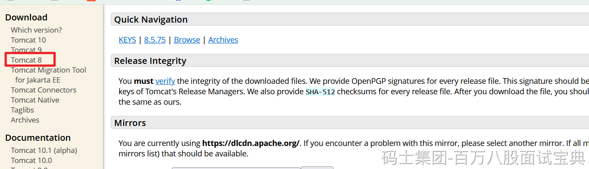

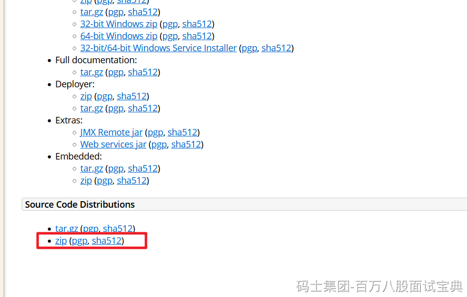

### 1.2 GitHub下载

当然你也可以通过GitHub来拉取源代码

<https://github.com/apache/tomcat>

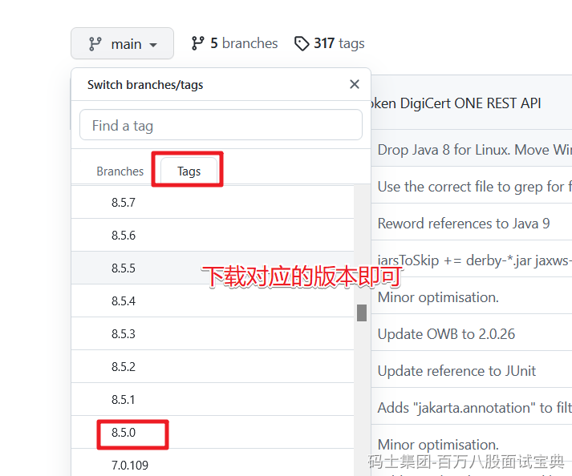

## 2.Maven环境搭建

### 2.1 环境准备

打开IEDA导入项目，然后在项目中创建一个新的pom.xml文件，里面的内容为：

```xml
<?xml version="1.0" encoding="UTF-8"?>
<project xmlns="http://maven.apache.org/POM/4.0.0"
         xmlns:xsi="http://www.w3.org/2001/XMLSchema-instance"
         xsi:schemaLocation="http://maven.apache.org/POM/4.0.0
            http://maven.apache.org/xsd/maven-4.0.0.xsd">
  <modelVersion>4.0.0</modelVersion>

  <groupId>org.apache.tomcat</groupId>

  <artifactId>apache-tomcat</artifactId>

  <version>8.5</version>

  <dependencies>
    <dependency>
      <groupId>org.apache.ant</groupId>

      <artifactId>ant</artifactId>

      <version>1.10.4</version>

    </dependency>

    <dependency>
      <groupId>wsdl4j</groupId>

      <artifactId>wsdl4j</artifactId>

      <version>1.6.2</version>

    </dependency>

    <dependency>
      <groupId>javax.xml</groupId>

      <artifactId>jaxrpc-api</artifactId>

      <version>1.1</version>

    </dependency>

    <dependency>
      <groupId>org.eclipse.jdt.core.compiler</groupId>

      <artifactId>ecj</artifactId>

      <version>4.5.1</version>

    </dependency>

    <dependency>
      <groupId>junit</groupId>

      <artifactId>junit</artifactId>

      <version>4.13</version>

    </dependency>

  </dependencies>

  <build>
    <finalName>apache-tomcat</finalName>

    <sourceDirectory>java</sourceDirectory>

    <resources>
      <resource>
        <directory>java</directory>

      </resource>

    </resources>

    <plugins>
      <plugin>
        <groupId>org.apache.maven.plugins</groupId>

        <artifactId>maven-compiler-plugin</artifactId>

        <version>3.8.1</version>

        <configuration>
          <source>1.8</source>

          <target>1.8</target>

          <encoding>UTF-8</encoding>

        </configuration>

      </plugin>

    </plugins>

  </build>

</project>

```

然后设置项目为Maven项目，选中pom.xml文件，鼠标右点。选择 `Add as Maven Project` .

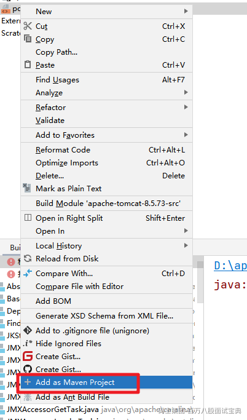

在右侧出现的Maven菜单中选择编译项目(compile)

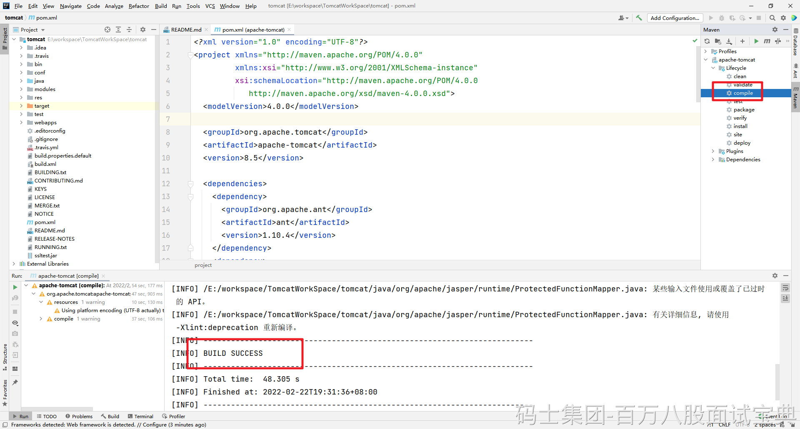

### 2.2 项目启动

编译成功后进入 Bootstrap中，启动main方法

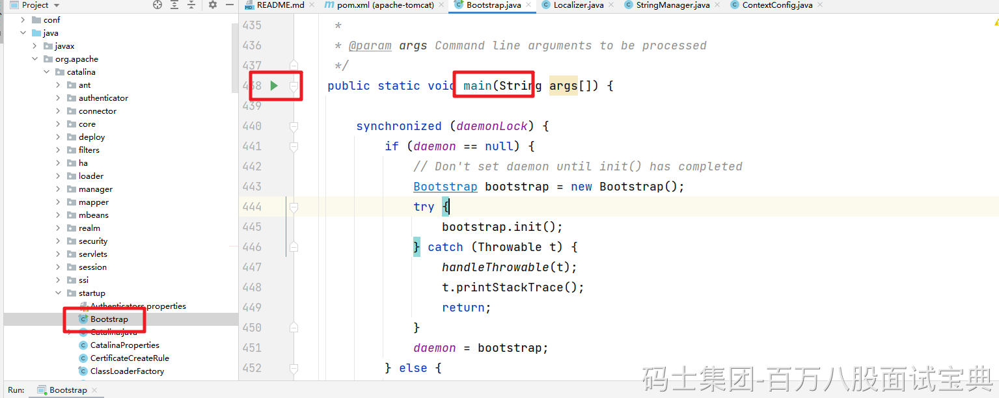

出现如下提示，说明启动成功，只是中文乱码了

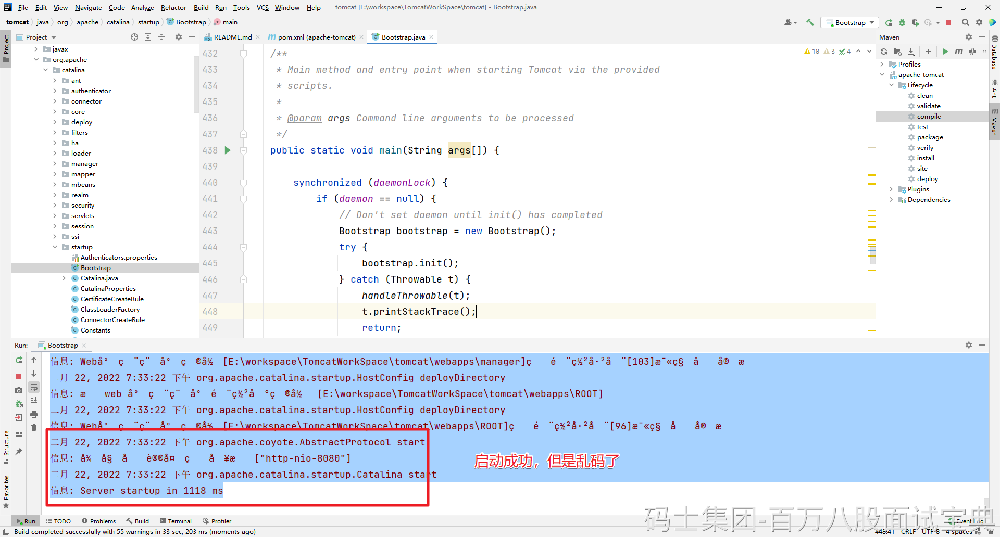

### 2.3 解决中文乱码问题

中文乱码问题的解决方案，修改两处地方即可

1.修改org.apache.jasper.compiler.Localizer#getMessage(java.lang.String)方法

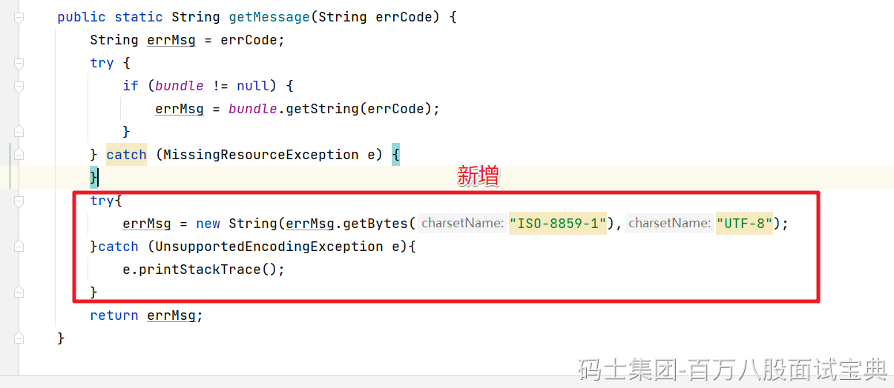

```java
    public static String getMessage(String errCode) {
        String errMsg = errCode;
        try {
            if (bundle != null) {
                errMsg = bundle.getString(errCode);
            }
        } catch (MissingResourceException e) {
        }
        try{
            errMsg = new String(errMsg.getBytes("ISO-8859-1"),"UTF-8");
        }catch (UnsupportedEncodingException e){
            e.printStackTrace();
        }
        return errMsg;
    }
```

2.修改org.apache.tomcat.util.res.StringManager#getString(java.lang.String)

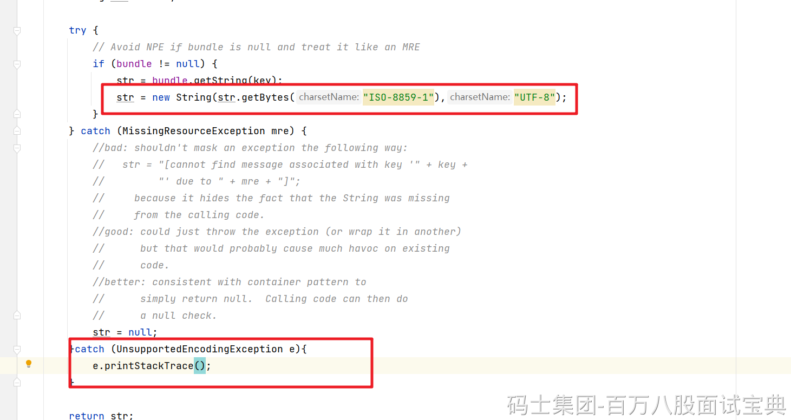

重启服务

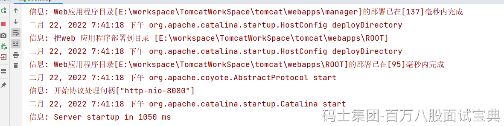

启动正常，但是访问的时候出现了问题

### 2.4 解决不支持JSP的问题

启动成功后，在访问首页的时候，出现了500错误，而且提示 `无法为JSP编译类`。

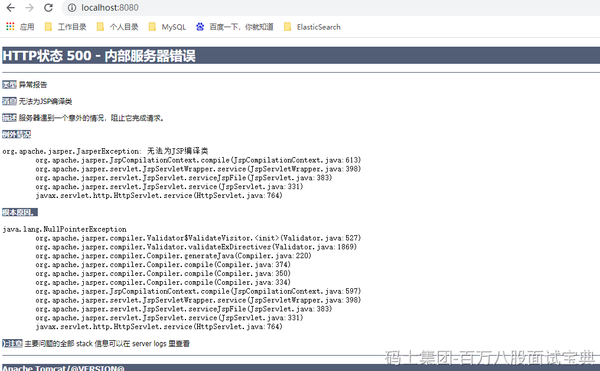

原因是无法编译jsp。解决也很简单，按照下面步骤操作即可

上面的报错解决方式，可以在org.apache.catalina.startup.ContextConfig类中的configureStart方法中，添加一下JSP解析器初始化即可

```java
context.addServletContainerInitializer(new JasperInitializer(), null);
```

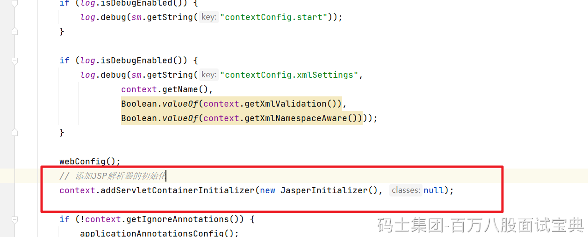

重启服务：访问搞定

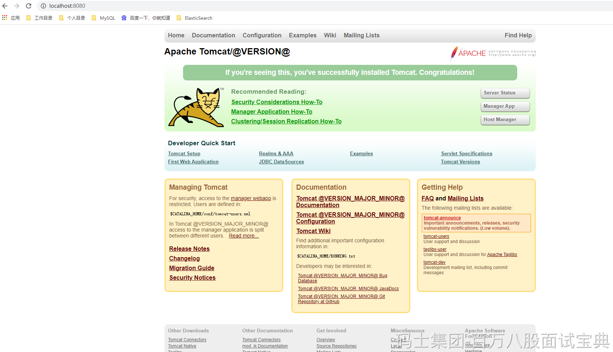

到此Tomcat的源码环境我们就已经准备好了，接下来就可以开始我们的Tomcat源码之旅了!!!

# 二、Tomcat源码结构介绍

  在分析Tomcat源码之前，我们先来看下Tomcat源码的结构组成，这样会更加的有利于我们更好的来分析源码。

## 1.项目源码结构

我们先从源码结构开始。Tomcat 服务器相关的代码在 java 文件夹下面，后面我们在进入这个文件夹去分析：

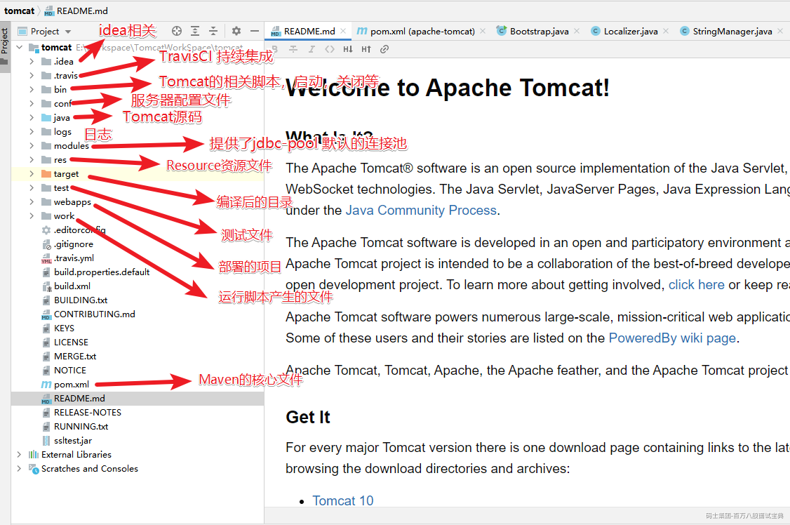

之前如何手动在Tomcat中部署过项目的话，这块应该会比较清楚点。

## 2.Tomcat源码结构

Tomcat 源码位于 java 文件夹下面。这个java文件夹中的每个包的作用，我们简单的来介绍下，后面在分析核心源码的时候会重点讲解。

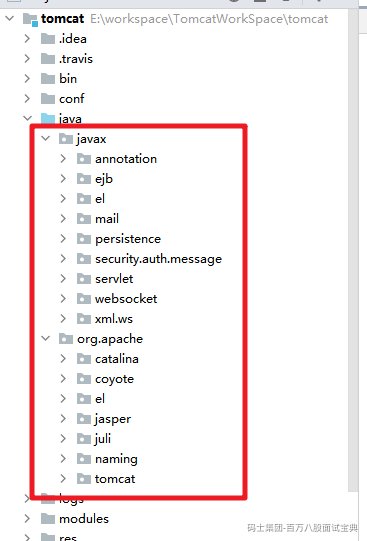

我们可以看到在java目录下，分为了两个结构，一个是javax另一个是org.apache这两个包

### 2.1 javax

在javax中保存的是新的JavaEE规范。可以具体来看看每个目录的作用。

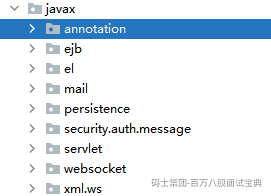

|  |  |
| --- | --- |
| 模块 | 作用说明 |
| annotation | annotation 这个模块的作用是定义了一些公用的注解，避免在不同的规范中定义相同的注解。 |
| ejb | ejb是个古老的传说，我们不管 |
| el | 在jsp中可以使用EL表达式，这么模块解析EL表达式的 |
| mail | 和邮件相关的规范 |
| persistence | 持久化相关的 |
| security | 和安全相关的内容 |
| servlet | 这个指定的是Servlet的开发规范，Tomcat本质上就是一个实现了Servlet规范的一个容器，Servlet定义了服务端处理Http请求和响应的方式(规范) |
| websocket | 定义了使用 websocket 协议的服务端和客户端 API |
| xml.ws | 定义了基于 SOAP 协议的 xml 方式的 web 服务 |

### 2.2 org.apache

org.apache这个包是Tomcat的源码包，也是针对上面的JavaEE规范的部分实现，Tomcat的本质就是对JavaEE的某些规范的实现合集，首先肯定实现了Servlet规范

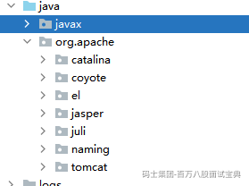

|  |  |
| --- | --- |
| 模块 | 作用 |
| catalina | catalina是Tomcat的核心模块，里面完整的实现了Servlet规范，Tomcat启动的主方法也在里面，后面我们分析的重点。 |
| coyote | tomcat 的核心代码，负责将网络请求转化后和 Catalina 进行通信。 |
| el | 这个是上面javax中的el规范的实现 |
| jasper | 主要负责把jsp代码转换为java代码。 |
| juli | 日志相关的工具 |
| naming | 命名空间相关的内容 |
| tomcat | 各种辅助工具，包括 websocket 的实现。 |

## 3.Tomcat模块设计

连接器的作用：

- 连接器功能· 监听网络端口。

- 接受网络连接请求。

- 根据具体应用层协议（http/ajp）解析字节流，生成统一的Tomcat Request对象。

- 将Tomcat Request对象转成标准的ServletRequest。

- 调用Servlet容器，得到ServletResponse。

- 将ServletResponse转成Tomcat Response对象。

- 将Tomcat Response转成网络字节流。

- 将响应字节流写回给浏览器。

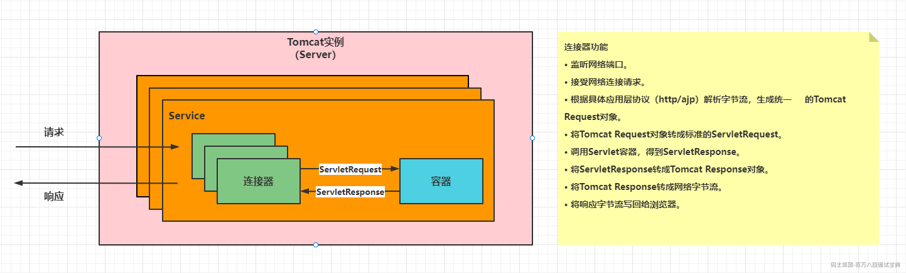

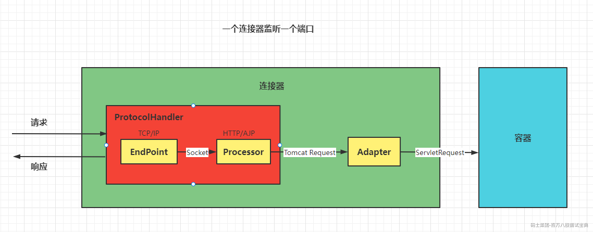

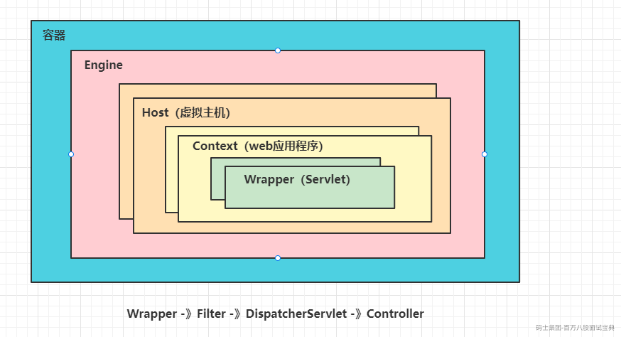

# 三、Tomcat的架构设计

## 1.Servlet规范

### 1.1 Servlet作用讲解

  Servlet是JavaEE规范中的一种，主要是为了扩展Java作为Web服务的功能，统一定义了对应的接口，比如Servlet接口，HttpRequest接口，HttpResponse接口，Filter接口。然后由具体的服务厂商来实现这些接口功能，比如Tomcat，jetty等。

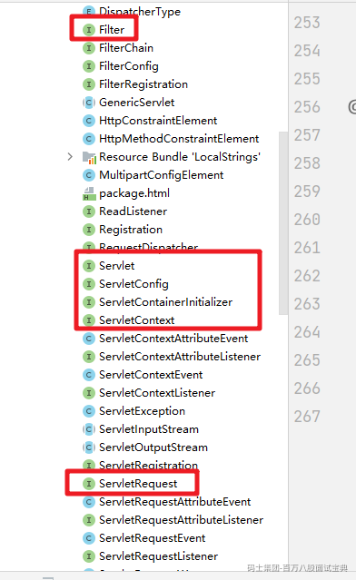

 &ems;在规范里面并不会有具体的实现。可以自行看下源码，而在Servlet规范中规定了一个http请求到来的执行处理流程:对应的服务器容器会接收到对应的Http请求，然后解析该请求，然后创建对应的Servlet实例，调用对应init方法来完成初始化，把请求的相关信息封装为HttpServletRequest对象来调用Servlet的service方法来处理请求，然后通过HttpServletResponse封装响应的信息交给容器，响应给客户端。

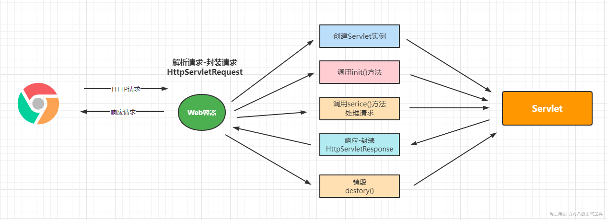

### 1.2 Servlet核心API

  我们再来回顾下Servlet中的核心API，这块对我们更好的掌握Tomcat的内容还是非常有帮助的。

|  |  |
| --- | --- |
| API | 描述 |
| ServletConfig | 获取servlet初始化参数和servletContext对象。 |
| ServletContext | 在整个Web应用的动态资源之间共享数据。 |
| ServletRequest | 封装Http请求信息，在请求时创建。 |
| ServletResponse | 封装Http响应信息，在请求时创建。 |

**ServletConfig**：

  容器在初始化servlet时，为该servlet创建一个servletConfig对象，并将这个对象通过init()方法来传递并保存在此Servlet对象中。核心作用：

1. 获取初始化信息;

2. 获取ServletContext对象。

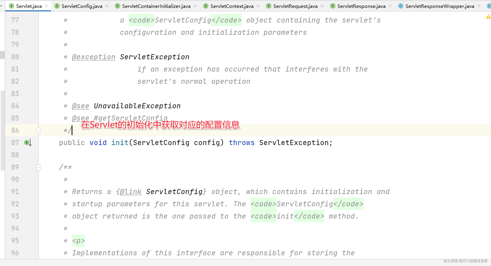

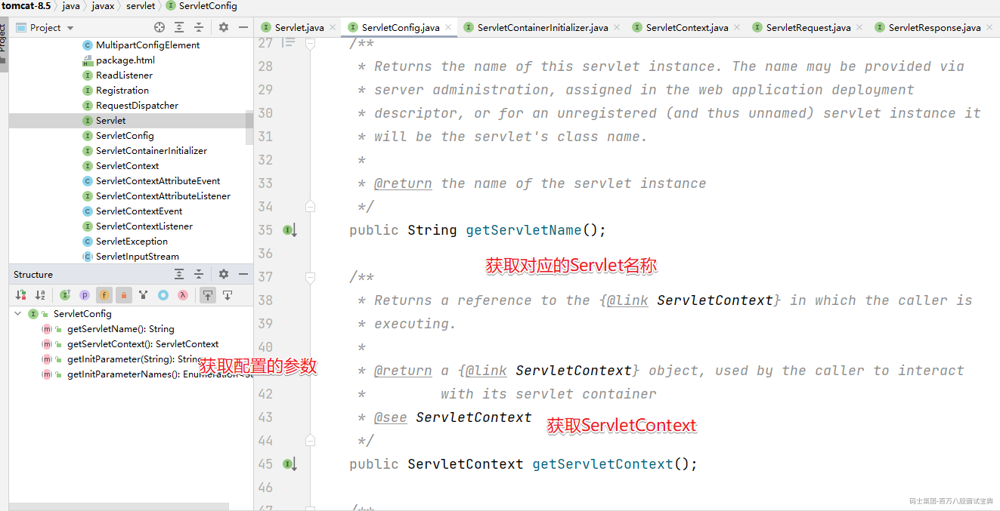

**ServletContext**

  一个项目只有一个ServletContext对象，可以在多个Servlet中来获取这个对象，使用它可以给多个Servlet传递数据，该对象在Tomcat启动时就创建，在Tomcat关闭时才会销毁！作用是在整个Web应用的动态资源之间共享数据。

  在实际的Servlet开发中，我们会实现HttpServlet接口，在该接口中会实现GenericServlet,而在GenericServlet会实现ServiceConfig接口，从而可以获取ServletContext容器对象

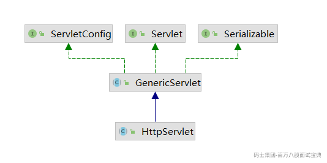

所以在Servlet中我们可以很容易的获取到ServletContext对象，从而完成对应的操作。

```java
public class ServletTwoImpl extends HttpServlet {
    @Override
    protected void doGet(HttpServletRequest request, HttpServletResponse response)
            throws ServletException, IOException {
        response.setContentType("text/html;charset=utf-8");
        // 1、参数传递
        ServletContext servletContext = this.getServletContext() ;
        String value = String.valueOf(servletContext.getAttribute("name")) ;
        System.out.println("value="+value);
        // 2、获取初始化参数
        String userName= servletContext.getInitParameter("user-name") ;
        System.out.println("userName="+userName);
        // 3、获取应用信息
        String servletContextName = servletContext.getServletContextName() ;
        System.out.println("servletContextName="+servletContextName);
        // 4、获取路径
        String pathOne = servletContext.getRealPath("/") ;
        String pathTwo = servletContext.getRealPath("/WEB-INF/") ;
        System.out.println("pathOne="+pathOne+";pathTwo="+pathTwo);
        response.getWriter().print("执行：doGet; value："+value);
    }
}

```

### 1.3 ServletRequest

  HttpServletRequest接口继承ServletRequest接口，用于封装请求信息，该对象在用户每次请求servlet时创建并传入servlet的service()方法，在该方法中，传入的servletRequest将会被强制转化为HttpservletRequest 对象来进行HTTP请求信息的处理。核心作用：

1. 获取请求报文信息;

2. 获取网络连接信息;

3. 获取请求域属性信息。

### 1.4 ServletResponse

  HttpServletResponse继承自ServletResponse，封装了Http响应信息。客户端每个请求，服务器都会创建一个response对象，并传入给Servlet.service()方法。核心作用：

1. 设置响应头信息;

2. 发送状态码;

3. 设置响应正文;

4. 重定向；

## 2.Tomcat的设计

  通过上面Servlet规范的介绍，其实我们发下我们要实现Servlet规范的话，很重要的就得提供一个服务容器来获取请求，解析封装数据，并调用Servlet实例相关的方法。也就是如下图中的部分

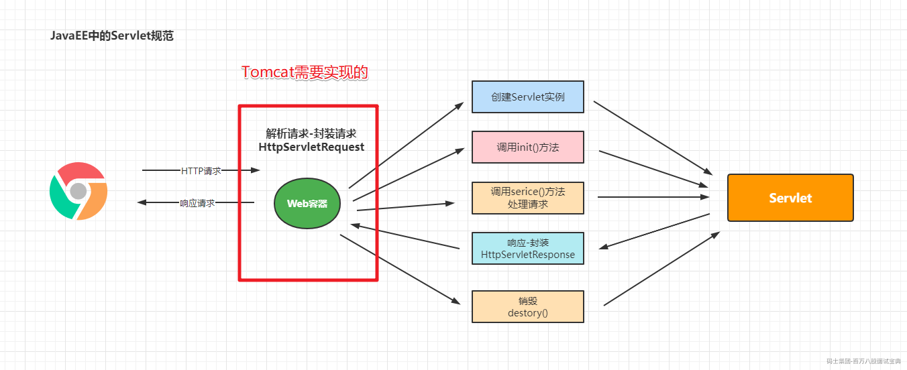

  这块的内容其实就是Tomcat，具体的我们来看看。

### 2.1 什么是Tomcat

  Tomcat是一个容器，用于承载Servlet，那么我们说Tomcat就是一个实现了部分J2EE规范的服务器。J2 EE和Jakarta EE（Eclipse基金会）这两是啥？用于Tomcat10以后都是Jakarta EE，而9之前就是J2EE.

### 2.2 Tomcat的架构结构

  我们通过上面的分析，知道Tomcat是一个Servlet规范的实现，要接收请求和响应请求，那么具体是如何实现的呢？这块我们可以通过conf下的server.xml得出对应的结论。

  server.xml是Tomcat中最重要的配置文件，**server.xml** **的每一个元素都对应了Tomcat** **中的一个组件** ；通过对xml文件中元素的配置，可以实现对Tomcat中各个组件的控制。因此，学习server.xml文件的配置，对于了解和使用Tomcat至关重要.

官方文档：<https://tomcat.apache.org/tomcat-8.5-doc/config/server.html>

```xml
<?xml version="1.0" encoding="UTF-8"?>

<Server port="8005" shutdown="SHUTDOWN">

  <Service name="Catalina">
    <Executor name="tomcatThreadPool" namePrefix="catalina-exec-"
        maxThreads="150" minSpareThreads="4"/>

    <Connector port="8080" protocol="HTTP/1.1"
               connectionTimeout="20000"
               redirectPort="8443" />
   
    <Connector executor="tomcatThreadPool"
               port="8080" protocol="HTTP/1.1"
               connectionTimeout="20000"
               redirectPort="8443" />

    <Engine name="Catalina" defaultHost="localhost">
      <Realm className="org.apache.catalina.realm.LockOutRealm">
        <!-- This Realm uses the UserDatabase configured in the global JNDI
             resources under the key "UserDatabase".  Any edits
             that are performed against this UserDatabase are immediately
             available for use by the Realm.  -->
        <Realm className="org.apache.catalina.realm.UserDatabaseRealm"
               resourceName="UserDatabase"/>
      </Realm>

      <Host name="localhost"  appBase="webapps"
            unpackWARs="true" autoDeploy="true">
        <Valve className="org.apache.catalina.valves.AccessLogValve" directory="logs"
               prefix="localhost_access_log" suffix=".txt"
               pattern="%h %l %u %t "%r" %s %b" />

      </Host>

    </Engine>

  </Service>

</Server>

```

极简模式

```xml
<Server>
    <Service>
        <Connector />
        <Connector />
        <Engine>
            <Host>
                <Context /><!-- 现在常常使用自动部署，不推荐配置Context元素，Context小节有详细说明 -->
            </Host>

        </Engine>

    </Service>

</Server>

```

梳理出的结构

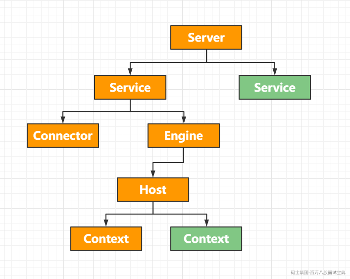

对应的每个组件的作用。

### 2.3 组件分类

  官网其实对上面的组件也做了分类:

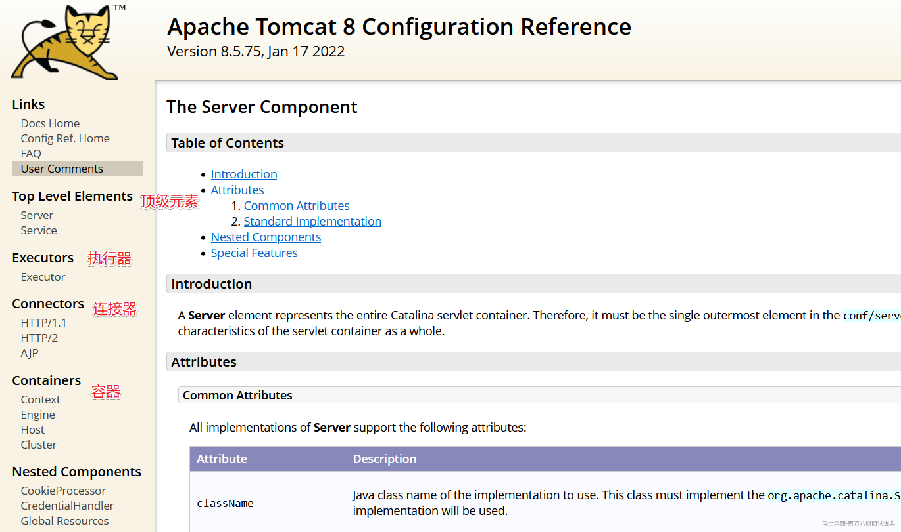

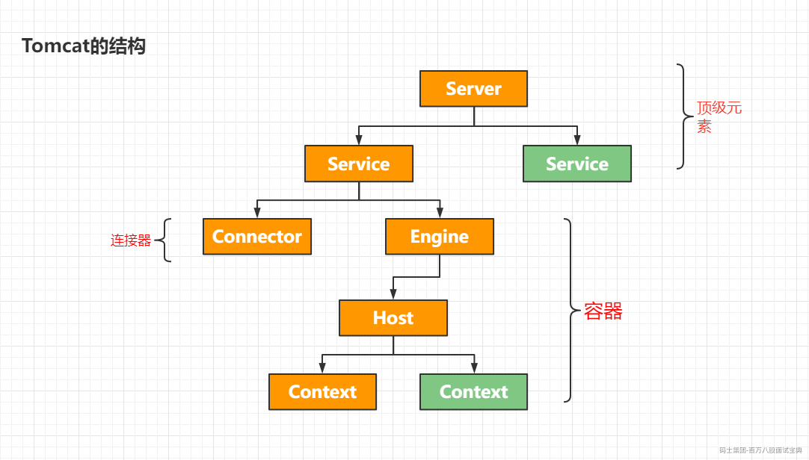

**顶级元素**:

- Server：是整个配置文件的根元素

- Service:代表一个Engine元素以及一组与之相连的Connector元素

**连接器**：

- 代表了外部客户端发送请求到特定Service的接口；同时也是外部客户端从特定Service接收响应的接口。

**容器**：

  容器的作用是处理Connector接收进来的请求，并产生对应的响应，Engine，Host和Context都是容器，他们不是平行关系，而是父子关系。

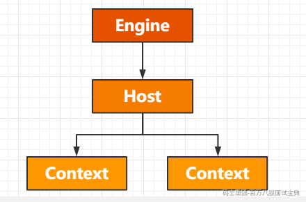

每个组件的作用：

- Engine:可以处理所有请求

- Host:可以处理发向一个特定虚拟主机的所有请求

- Context:可以处理一个特定Web应用的所有请求

**核心组件的串联关系**：

  当客户端请求发送过来后其实是通过这些组件相互之间配合完成了对应的操作。

- Server元素在最顶层，代表整个Tomcat容器；一个Server元素中可以有一个或多个Service元素

- Service在Connector和Engine外面包了一层，把它们组装在一起，对外提供服务。一个Service可以包含多个Connector，但是只能包含一个Engine；Connector接收请求，Engine处理请求。

- Engine、Host和Context都是容器，且Engine包含Host，Host包含Context。每个Host组件代表Engine中的一个虚拟主机；每个Context组件代表在特定Host上运行的一个Web应用.

整体Tomcat的运行架构图

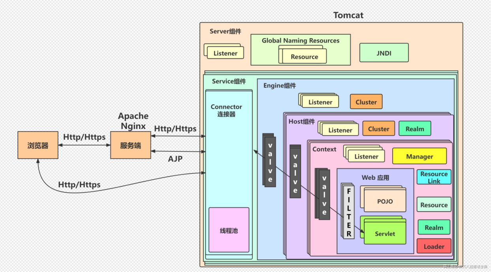

# 四、Tomcat生命周期

  在上篇文章中我们看到了Tomcat架构中的核心组件，而且各个组件都有各自的作用，各司其职，而且相互之间也有对应的父子关系，那么这些对象的创建，调用，销毁等操作是怎么处理呢？

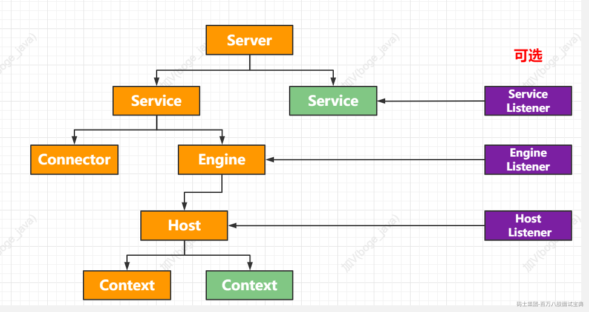

  也就是在Tomcat中的组件的对象生命周期是怎么管理的呢？针对这个问题，在Tomcat中设计了Lifecycle接口来统一管理Tomcat中的核心组件的生命周期，所以本文我们就系统的来介绍下Lifecycle接口的设计

## 1、LifeCycle接口设计

  为了统一管理Tomcat中的核心组件的生命周期，而专门设计了LifeCycle接口来统一管理，我们来看看在LifeCycle接口中声明了哪些内容。

### 1.1 生命周期的方法

  在LifeCycle中声明了和生命周期相关的方法，包括init(),start(),stop(),destory()等方法。

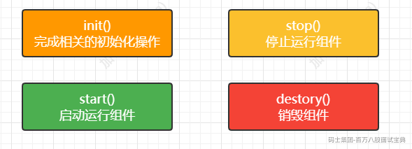

  在声明的方法执行的过程中会涉及到对应的状态的转换，在LifeCycle接口的头部文档中很清楚的说了。

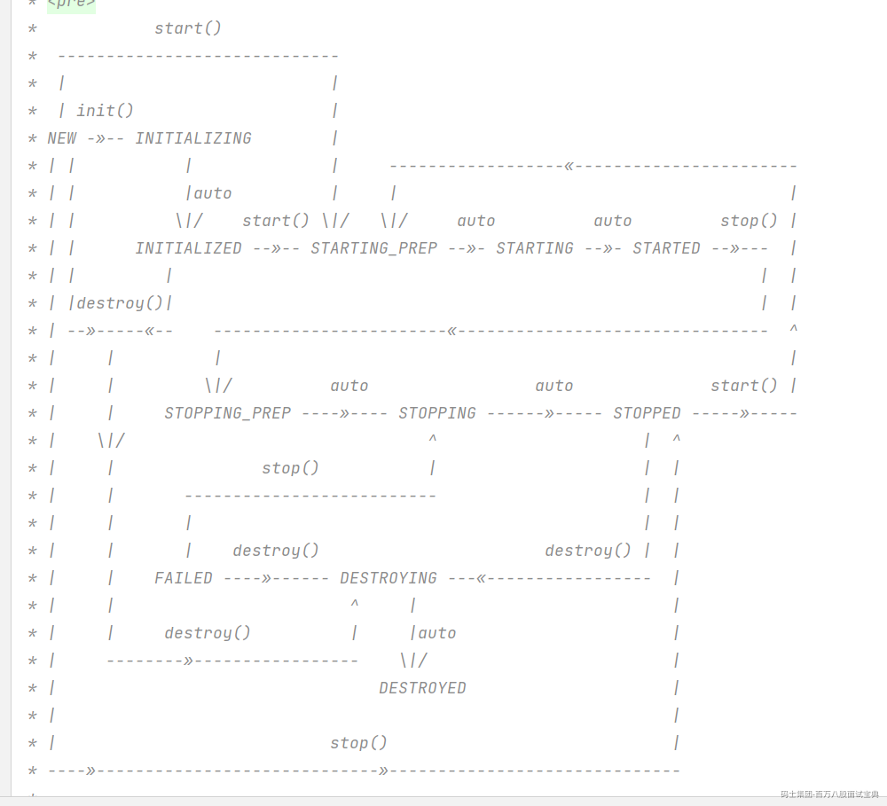

### 1.2 相关的状态处理

  通过上图我们可以很清楚的看到相关的方法执行会涉及到的相关状态的转换，比如init()会从New这个状态开始，然后会进入 INITIALIZING 和 INITIALIZED 等。因为这块涉及到了对应的状态转换，在Lifecycle中声明了相关的状态和事件的生命周期字符串。

```java

    public static final String BEFORE_START_EVENT = "before_start";

    public static final String AFTER_START_EVENT = "after_start";

    public static final String STOP_EVENT = "stop";

    public static final String BEFORE_STOP_EVENT = "before_stop";

    public static final String AFTER_STOP_EVENT = "after_stop";

    public static final String AFTER_DESTROY_EVENT = "after_destroy";

    public static final String BEFORE_DESTROY_EVENT = "before_destroy";

    /**
     * The LifecycleEvent type for the "periodic" event.
     * 周期性事件（后台线程定时执行一些事情，比如：热部署、热替换）
     */
    public static final String PERIODIC_EVENT = "periodic";

    public static final String CONFIGURE_START_EVENT = "configure_start";

    public static final String CONFIGURE_STOP_EVENT = "configure_stop";
```

在LifecycleState中建立了对应关系

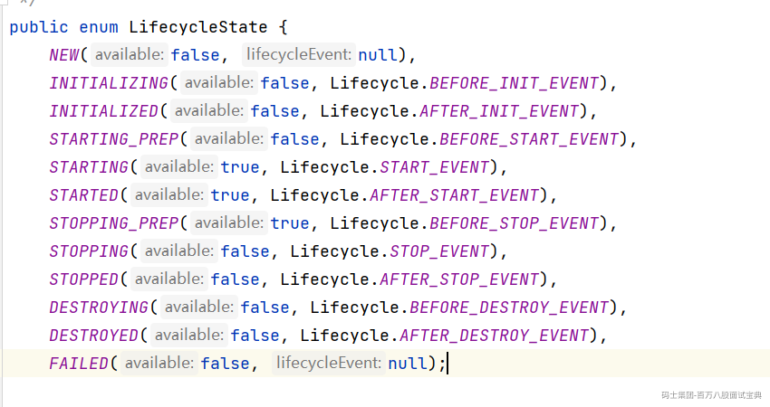

  针对特定的事件就会有相关的监听器来监听处理。在Lifecycle中定义了相关的处理方法。

```java
    public void addLifecycleListener(LifecycleListener listener);

    public LifecycleListener[] findLifecycleListeners();

    public void removeLifecycleListener(LifecycleListener listener);
```

  通过方法名称我们就能很清楚该方法的相关作用，就不过程介绍了。然后来看下对应的监听器和事件接口的对应设计。

## 2.监听器和事件的设计

  接下来看下LifecycleListener的设计。其实代码非常简单。

```java
public interface LifecycleListener {

    /**
     * Acknowledge the occurrence of the specified event.
     *  触发监听器后要执行逻辑的方法
     * @param event LifecycleEvent that has occurred
     */
    public void lifecycleEvent(LifecycleEvent event);

}
```

  然后来看下事件的接口

```java
public final class LifecycleEvent extends EventObject {

    private static final long serialVersionUID = 1L;

    /**
     * Construct a new LifecycleEvent with the specified parameters.
     *
     * @param lifecycle Component on which this event occurred
     * @param type Event type (required)
     * @param data Event data (if any)
     */
    public LifecycleEvent(Lifecycle lifecycle, String type, Object data) {
        super(lifecycle); // 向上转型，可接受一切实现了生命周期的组件
        this.type = type;
        this.data = data;
    }

    /**
     * The event data associated with this event.
     * 携带的额外的数据，传递给监听器的数据
     */
    private final Object data;

    /**
     * The event type this instance represents.
     * 事件类型
     */
    private final String type;

    /**
     * @return the event data of this event.
     */
    public Object getData() {
        return data;
    }

    /**
     * @return the Lifecycle on which this event occurred.
     */
    public Lifecycle getLifecycle() {
        return (Lifecycle) getSource();
    }

    /**
     * @return the event type of this event.
     */
    public String getType() {
        return this.type;
    }
}
```

  也是非常简单，不过多的赘述。

## 3.LifecycleBase

  通过上面的介绍我们可以看到在Tomcat中设计了Lifecycle和LifecycleListener和LifecycleEvent来管理核心组件的生命周期，那么我们就需要让每一个组件都实现相关的接口。这时你会发现交给子类的工作量其实是比较大的，不光要完成各个组件的核心功能，还得实现生命周期的相关处理，耦合性很强，这时在Tomcat中给我们提供了一个LifecycleBase的抽象类，帮助我们实现了很多和具体业务无关的处理，来简化了具体组件的业务。

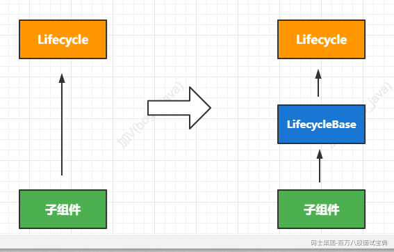

### 3.1 事件处理

  在上面的接口设计中对于监听对应的事件处理是没有实现的，在LifecycleBase把这块很好的实现了，我们来看下。首先定义了一个容器来存储所有的监听器

```java
// 存储了所有的实现了LifecycleListener接口的监听器 
private final List<LifecycleListener> lifecycleListeners = new CopyOnWriteArrayList<>();
```

  同时提供了触发监听的相关的方法，绑定了对应的事件。

```java
    /**
     * Allow sub classes to fire {@link Lifecycle} events.
     *     监听器触发相关的事件
     * @param type  Event type  事件类型
     * @param data  Data associated with event.
     */
    protected void fireLifecycleEvent(String type, Object data) {
        LifecycleEvent event = new LifecycleEvent(this, type, data);
        for (LifecycleListener listener : lifecycleListeners) {
            listener.lifecycleEvent(event);
        }
    }
```

  已经针对Listener相关的处理方法

```java
 
    // 添加监听器
    @Override
    public void addLifecycleListener(LifecycleListener listener) {
        lifecycleListeners.add(listener);
    }

    // 查找所有的监听并转换为了数组类型
    @Override
    public LifecycleListener[] findLifecycleListeners() {
        return lifecycleListeners.toArray(new LifecycleListener[0]);
    }

    // 移除某个监听器
    @Override
    public void removeLifecycleListener(LifecycleListener listener) {
        lifecycleListeners.remove(listener);
    }

```

### 3.2 生命周期方法

  在LifecycleBase中最核心的还是实现了Lifecycle中的生命周期方法，以init方法为例我们来看。

```java
    /**
     * 实现了 Lifecycle 中定义的init方法
     * 该方法和对应的组件的状态产生的关联
     * @throws LifecycleException
     */
    @Override
    public final synchronized void init() throws LifecycleException {
        if (!state.equals(LifecycleState.NEW)) {
            // 无效的操作  只有状态为 New 的才能调用init方法进入初始化
            invalidTransition(Lifecycle.BEFORE_INIT_EVENT);
        }

        try {
            // 设置状态为初始化进行中....同步在方法中会触发对应的事件
            setStateInternal(LifecycleState.INITIALIZING, null, false);
            initInternal(); // 交给子类具体的实现 初始化操作
            // 更新状态为初始化完成 同步在方法中会触发对应的事件
            setStateInternal(LifecycleState.INITIALIZED, null, false);
        } catch (Throwable t) {
            handleSubClassException(t, "lifecycleBase.initFail", toString());
        }
    }
```

源码解析：

1. 我们看到首先会判断当前对象的state状态是否为NEW,因为init方法只能在NEW状态下才能开始初始化

2. 如果1条件满足则会更新state的状态为 `INITIALIZED` 同时会触发这个事件

3. 然后initInternale()方法会交给子类具体去实现，

4. 等待子类处理完成后会把状态更新为 `INITIALIZED`。

我们可以进入setStateInternal方法查看最后的关键代码：

```java
        // ....
        this.state = state; // 更新状态
        // 根据状态和事件的绑定关系获取对应的事件
        String lifecycleEvent = state.getLifecycleEvent();
        if (lifecycleEvent != null) {
            // 发布对应的事件
            fireLifecycleEvent(lifecycleEvent, data);
        }
```

  可以看到和对应的事件关联起来了。init方法的逻辑弄清楚后，你会发现start方法，stop方法，destory方法的处理逻辑都是差不多的，可自行观看。而对应的 initInternal()方法的逻辑我们需要在 Server Service Engine Connector等核心组件中再看，这个我们会结合Tomcat的启动流程来带领大家一起查看。下一篇给大家介绍。

# 五、Tomcat的启动核心流程

  前面给大家介绍了Tomcat中的生命周期的设计，掌握了这块对于我们分析Tomcat的核心流程是非常有帮助的，也就是我们需要创建相关的核心组件，比如Server，Service肯定都绕不开生命周期的方法。

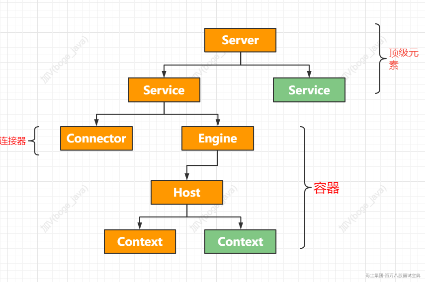

## 1.启动的入口

  你可以通过脚本来启动Tomcat服务(startup.bat),但如果你看过脚本的命令，你会发现最终调用的还是Bootstrap中的main方法，所以我们需要从main方法来开始

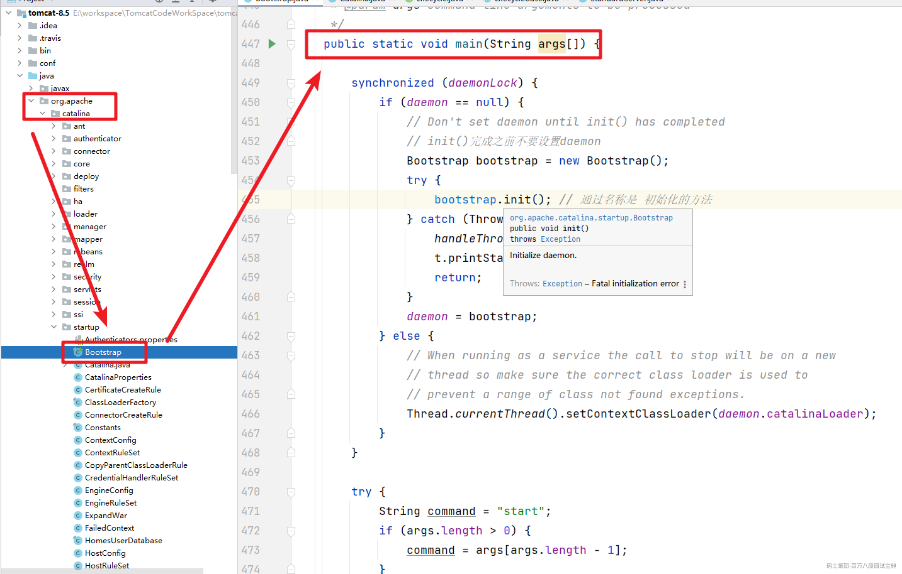

  然后我们去看main方法中的代码，我们需要重点关注的方法有三个

1. bootstrap.init()方法

2. load()方法

3. start()方法

  也就是在这三个方法中会完成Tomcat的核心操作。

## 2.init方法

  我们来看下init方法中的代码，非核心的我们直接去掉

```java
    public void init() throws Exception {
        // 创建相关的类加载器
        initClassLoaders();
        // 省略部分代码...
        // 通过反射创建了 Catalina 类对象
        Class<?> startupClass = catalinaLoader
            .loadClass("org.apache.catalina.startup.Catalina");
        // 创建了 Catalina 实例
        Object startupInstance = startupClass.getConstructor().newInstance();

        // 省略部分代码...
        String methodName = "setParentClassLoader";
        Class<?> paramTypes[] = new Class[1];
        paramTypes[0] = Class.forName("java.lang.ClassLoader");
        Object paramValues[] = new Object[1];
        paramValues[0] = sharedLoader;
        // 把 sharedLoader 设置为了 commonLoader的父加载器
        Method method =
            startupInstance.getClass().getMethod(methodName, paramTypes);
        method.invoke(startupInstance, paramValues);

        // Catalina 实例 赋值给了 catalinaDaemon
        catalinaDaemon = startupInstance;
    }
```

1. 首先是调用了initClassLoaders()方法，这个方法会完成对应的ClassLoader的创建，这个比较重要，后面专门写一篇文章来介绍。

2. 通过反射的方式创建了Catalina的类对象，并通过反射创建了Catalina的实例

3. 设置了类加载器的父子关系

4. 用过成员变量catalinaDaemon记录了我们创建的Catalina实例

  这个是通过bootstrap.init()方法我们可以获取到的有用的信息。然后我们继续往下面看。

## 3.load方法

  然后我们来看下load方法做了什么事情，代码如下：

```java
    private void load(String[] arguments) throws Exception {

        // Call the load() method
        String methodName = "load"; // load方法的名称
        Object param[];
        Class<?> paramTypes[];
        if (arguments==null || arguments.length==0) {
            paramTypes = null;
            param = null;
        } else {
            paramTypes = new Class[1];
            paramTypes[0] = arguments.getClass();
            param = new Object[1];
            param[0] = arguments;
        }
        // catalinaDaemon 就是在 init中创建的 Catalina 对象
        Method method =
            catalinaDaemon.getClass().getMethod(methodName, paramTypes);
        if (log.isDebugEnabled()) {
            log.debug("Calling startup class " + method);
        }
        // 会执行 Catalina的load方法
        method.invoke(catalinaDaemon, param);
    }

```

  上面的代码非常简单，通过注释我们也可以看出该方法的作用是调用 Catalina的load方法。所以我们还需要加入到Catalina的load方法中来查看，代码同样比较长，只留下关键代码

```java
    public void load() {

        if (loaded) {
            return; // 只能被加载一次
        }
        loaded = true;

        initDirs(); // 废弃的方法

        // Before digester - it may be needed
        initNaming(); // 和JNDI 相关的内容 忽略

        // Create and execute our Digester
        // 创建并且执行我们的 Digester 对象  Server.xml
        Digester digester = createStartDigester();

        // 省略掉了 Digester文件处理的代码

        getServer().setCatalina(this); // Server对象绑定 Catalina对象
        getServer().setCatalinaHome(Bootstrap.getCatalinaHomeFile());
        getServer().setCatalinaBase(Bootstrap.getCatalinaBaseFile());

        // Stream redirection
        initStreams();
        // 省略掉了部分代码...
         getServer().init(); // 完成 Server  Service Engine Connector等组件的init操作

    }
```

把上面的代码简化后我们发现这个Load方法其实也是蛮简单的，就做了两件事。

1. 通过Apache下的Digester组件完成了Server.xml文件的解析

2. 通过getServer().init() 方法完成了Server,Service,Engin,Connector等核心组件的初始化操作，这块和前面的LifecycleBase呼应起来了。

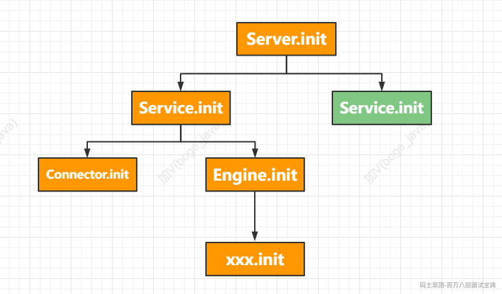

  如果生命周期的内容不清楚，请看前面内容介绍

## 4.start方法

  最后我们来看下start方法的代码。

```java
    public void start() throws Exception {
        if (catalinaDaemon == null) {
            init(); // 如果 catalinaDaemon 为空 初始化操作
        }
        // 获取的是 Catalina 中的 start方法
        Method method = catalinaDaemon.getClass().getMethod("start", (Class [])null);
        // 执行 Catalina 的start方法
        method.invoke(catalinaDaemon, (Object [])null);
    }
```

  上面的代码逻辑也很清楚，就是通过反射的方式调用了Catalina对象的start方法。所以进入Catalina的start方法中查看。

```java
    public void start() {

        if (getServer() == null) {
            load(); // 如果Server 为空 重新 init 相关的组件
        }

        if (getServer() == null) {
            log.fatal("Cannot start server. Server instance is not configured.");
            return;
        }

        // Start the new server  关键方法--->启动Server
        try {
            getServer().start();
        } catch (LifecycleException e) {
            // 省略...
        }

        // 省略...

        // Register shutdown hook  注册关闭的钩子
        if (useShutdownHook) {
            // 省略...
        }

        if (await) {
            await();
            stop();
        }
    }
```

  通过上面的代码我们可以发现核心的代码还是getServer.start()方法，也就是通过Server对象来嵌套的调用相关注解的start方法。

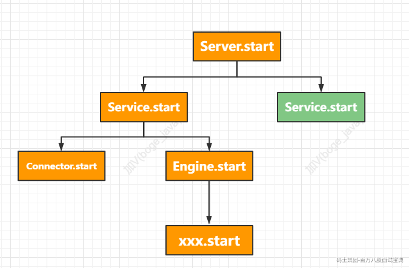

## 5.核心流程的总结

我们可以通过下图来总结下Tomcat启动的核心流程

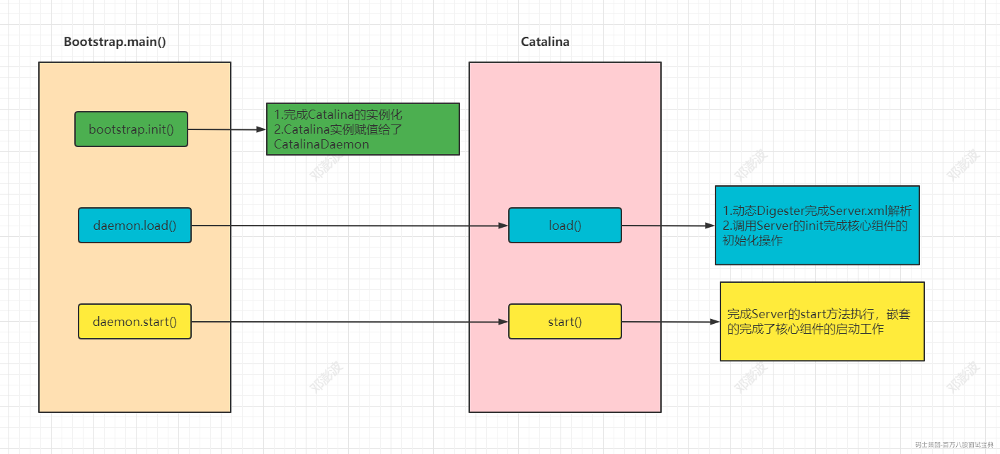

  从图中我们可以看到Bootstrap其实没有做什么核心的事情，主要还是Catalina来完成的。
