# Tomcat源码高级篇

# 一、Tomcat架构原理

## 1.Tomcat是如何绑定端口的

  我们将Tomcat是一个Web容器，也是一个Servlet容器，那么我们先来考虑第一个问题，Tomcat是如何绑定端口，并且创建对应的ServerSocket的

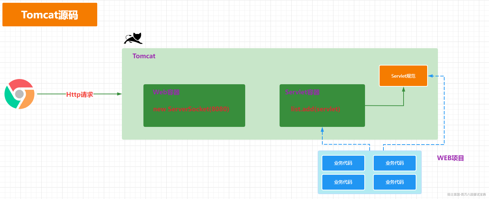

  绑定端口我们需要通过Connector来查看，先直接来看关键代码。

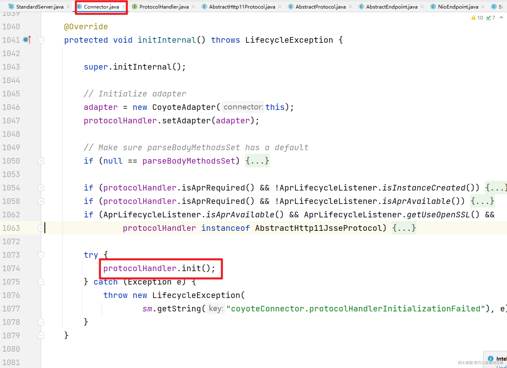

  然后进入到ProtocolHandler中查看init方法；

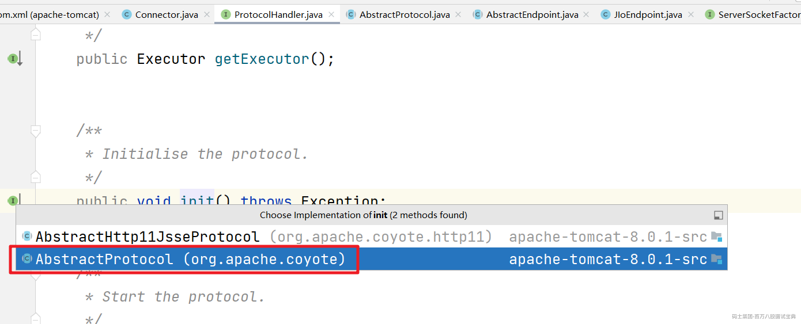

  然后进入到 `AbstractProtocol`中查看具体的实现。

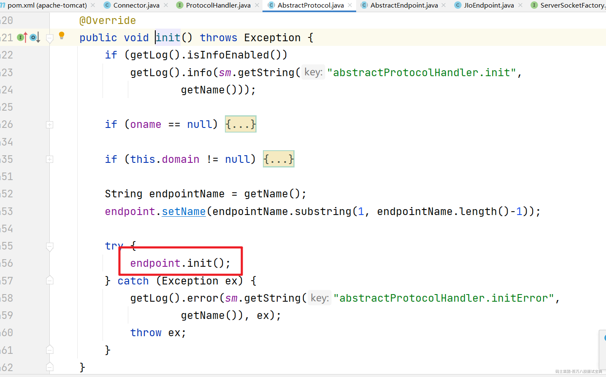

然后查看Endpoint中的init方法

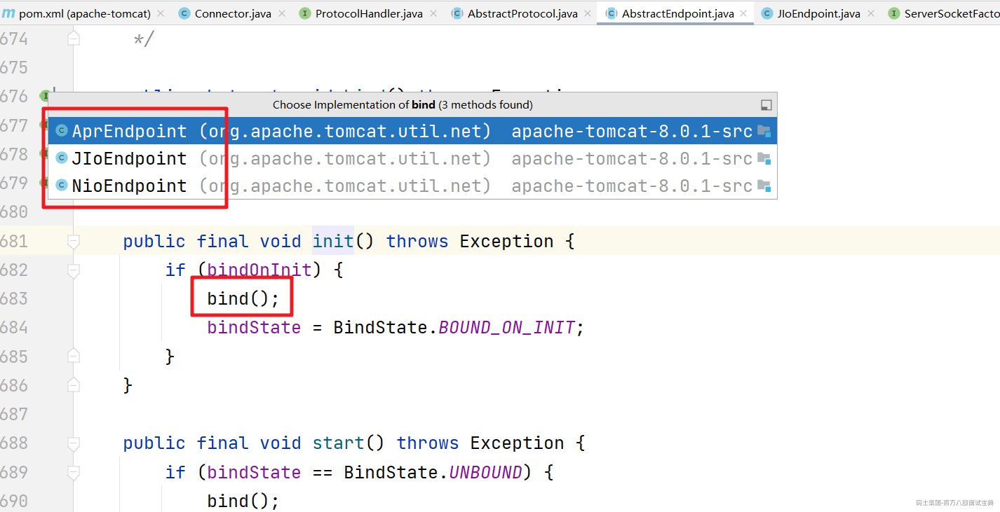

  进入后我们可以看到Endpoint的实现有三个，上面的截图是在Tomcat8.0.1版本中查看的，下面的截图是在Tomcat8.5版本的截图

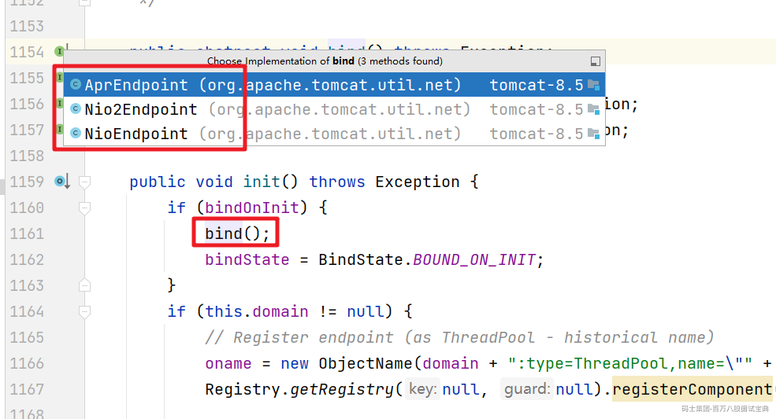

可以看到在Tomcat8.5中已经移除了 `JioEndpoint`的实现了。

|  |  |
| --- | --- |
| Endpoint实现 | 说明 |
| AprEndpoint | 对应的是APR模式，简单理解就是从操作系统级别解决异步IO的问题，&#x3c;br />大幅度提高服务器的处理和响应性能。与本地方法库交互 |
| JioEndpoint | Java普通IO方式实现，基于ServerSocket实现，同步阻塞的IO，并发量大的情况下效率低 |
| Nio2Endpoint | 利用代码来实现异步IO |
| NioEndpoint | 利用了JAVA的NIO实现了非阻塞IO，Tomcat默认启动是以这个来启动的 |

我们进入JioEndpoint中查看

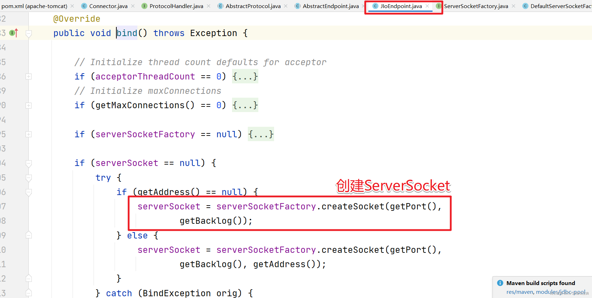

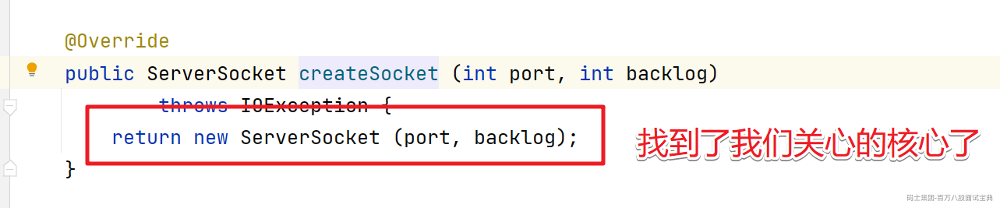

## 2.Servlet管理

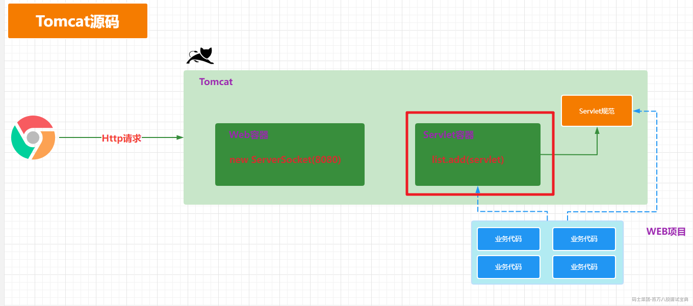

  上面我们分析了Tomcat是如何绑定端口服务的，接下来我们需要讨论下Tomcat是如何管理Servlet的，通过上面的绘图我们看到Tomcat是一个Servlet容器，我们每一个Web项目都是通过实现Servlet规范来完成相关的业务处理的。那么我们就要来看看Tomcat是如何管理我们的Web项目的。其实在server.xml文件中我们应该清楚其中的 `Context`标签其实代表的就是一个Web服务。

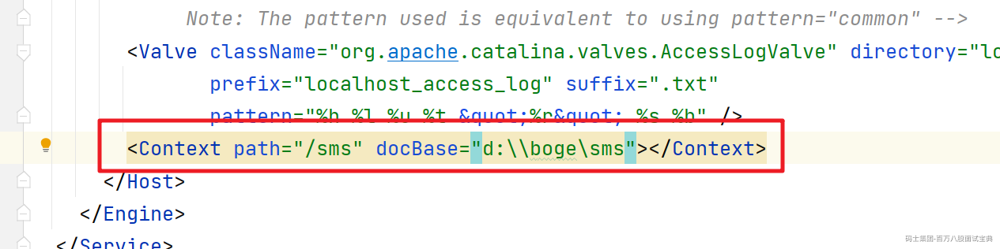

而且在官网中也有这样的描述：<https://tomcat.apache.org/tomcat-8.5-doc/architecture/overview.html>

> A [Context](https://tomcat.apache.org/tomcat-8.5-doc/config/context.html) represents a web application. A Host may contain multiple contexts, each with a unique path. The [Context interface](https://tomcat.apache.org/tomcat-8.5-doc/api/org/apache/catalina/Context.html) may be implemented to create custom Contexts, but this is rarely the case because the [StandardContext](https://tomcat.apache.org/tomcat-8.5-doc/api/org/apache/catalina/core/StandardContext.html) provides significant additional functionality.

通过上面的分析其实我们可以得到结论：

- 一个Context标签代表了一个web项目

- 要加载Servlet，只需要找到加载web.xml的工具类

Context标签对应的了一个Context类，Context是一个接口，默认的实现是StandardContext，在loadOnStartup中可以找到答案。

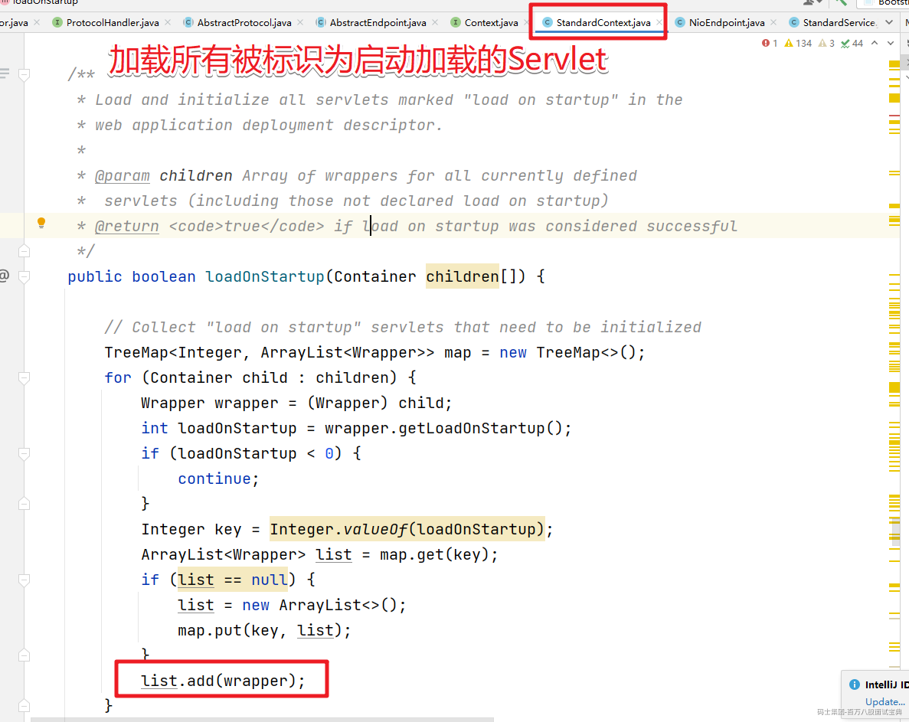

Wrapper是对Servlet的包装，增强了Servlet的应用。其中进入Wrapper的load方法中可以看到Servlet创建和init方法的执行。当然我们要看看Servlet是如何加载的，这时Servlet是配置在web.xml中的，那么web.xml的加载解析我们需要看看 `ContextConfig`中的处理。

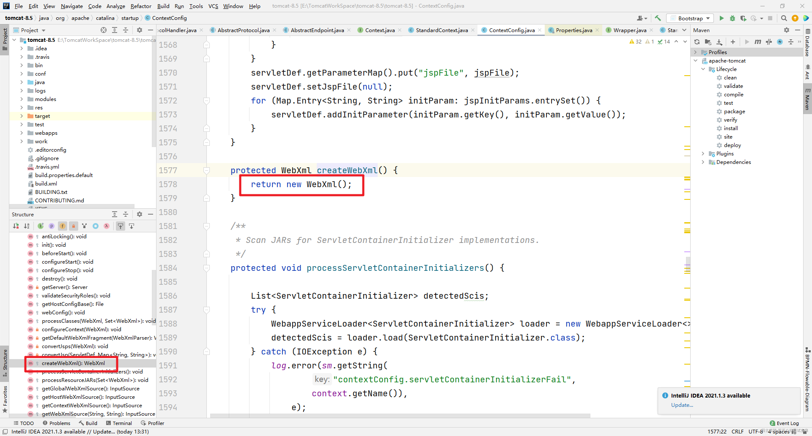

里面会有一个createWebXml的方法。创建的WebXml对象其实就是对应的web.xml文件了webConfig()方法中。

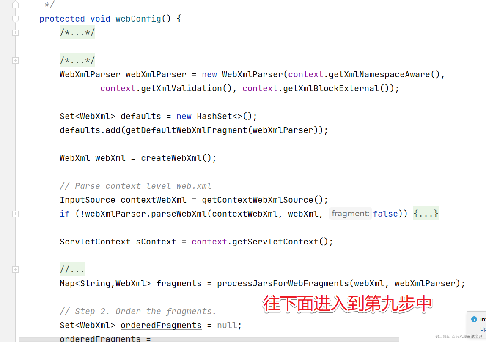

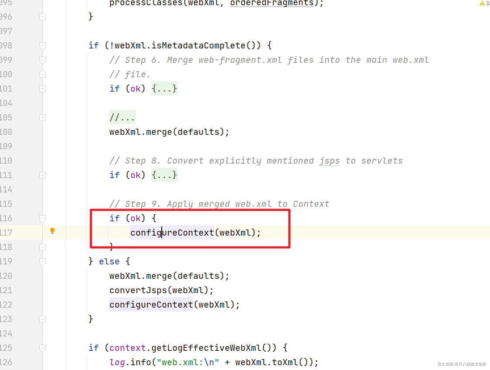

进入到configureContext方法中。

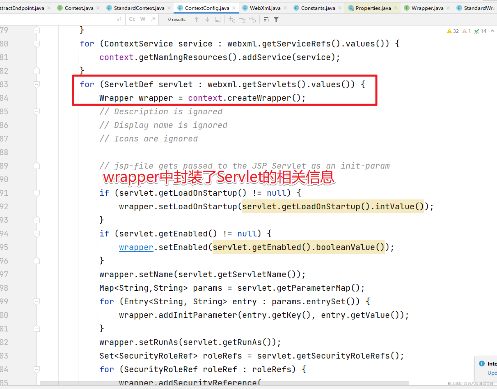

到这其实我们就搞清楚了Web项目中的Servlet是如何被Tomcat来管理的了。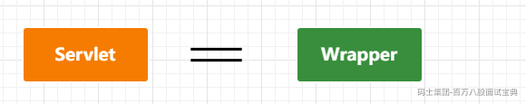

## 3.Tomcat的核心架构图

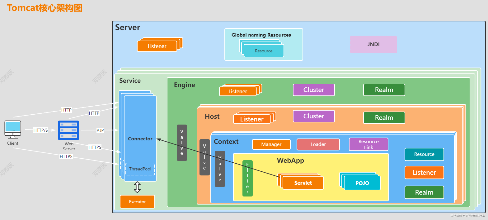

架构图中涉及到的核心组件：

**顶级元素**:

- Server：是整个配置文件的根元素

- Service:代表一个Engine元素以及一组与之相连的Connector元素

**连接器**：

- 代表了外部客户端发送请求到特定Service的接口；同时也是外部客户端从特定Service接收响应的接口。

**容器**：

  容器的作用是处理Connector接收进来的请求，并产生对应的响应，Engine，Host和Context都是容器，他们不是平行关系，而是父子关系。

**每个组件的作用：**

- Engine:可以处理所有请求

- Host:可以处理发向一个特定虚拟主机的所有请求

- Context:可以处理一个特定Web应用的所有请求

**核心组件的串联关系**：

  当客户端请求发送过来后其实是通过这些组件相互之间配合完成了对应的操作。

- Server元素在最顶层，代表整个Tomcat容器；一个Server元素中可以有一个或多个Service元素

- Service在Connector和Engine外面包了一层，把它们组装在一起，对外提供服务。一个Service可以包含多个Connector，但是只能包含一个Engine；Connector接收请求，Engine处理请求。

- Engine、Host和Context都是容器，且Engine包含Host，Host包含Context。每个Host组件代表Engine中的一个虚拟主机；每个Context组件代表在特定Host上运行的一个Web应用.

当客户端提交一个对应请求后相关的核心组件的处理流程如下：

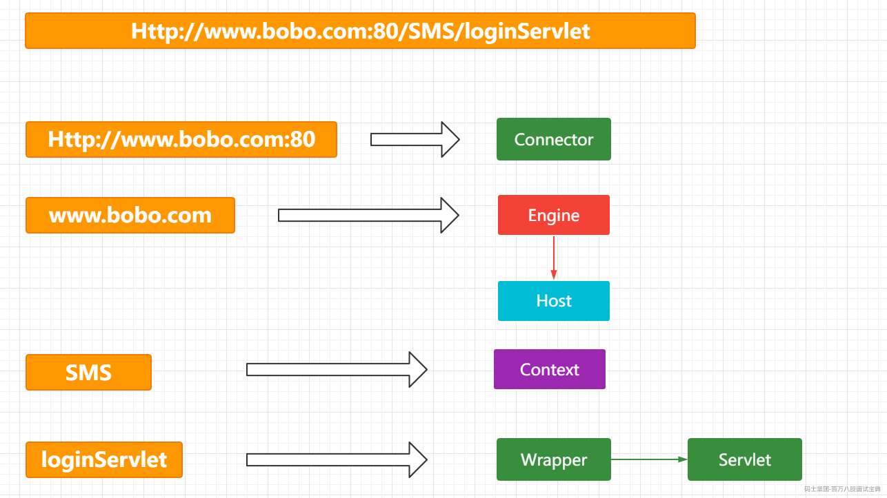

当然上面还有一些其他组件：

- Executor：线程池

- Manger：管理器【Session管理】

- Valve：拦截器

- Listener：监听器

- Realm：数据库权限

- ....

# 二、 换个角度看架构

## 1.Connector

  Connector连接器接收外界请求，然后转换为对应的ServletRequest对象。

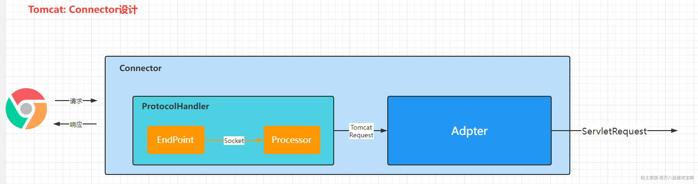

涉及到的几个对象的作用：

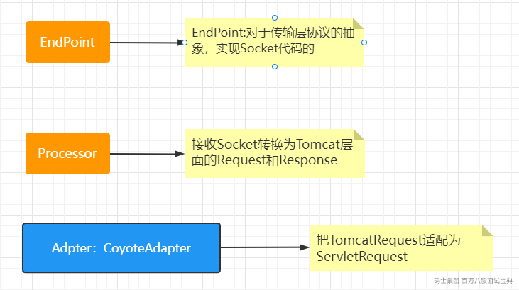

  在有多线程处理的情况下，通过Executor线程池来处理：

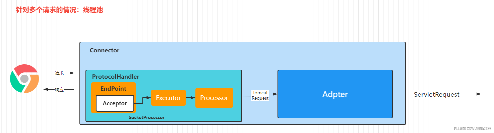

官网的流程图：<https://tomcat.apache.org/tomcat-8.5-doc/architecture/requestProcess/request-process.png>

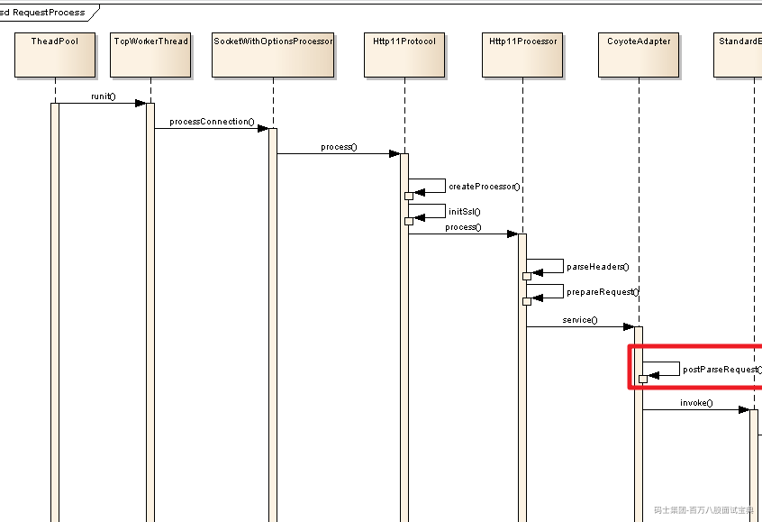

## 2.Container

Container容器是在Connector处理完请求后获取到ServletRequest后内部处理请求的统一管理对象。

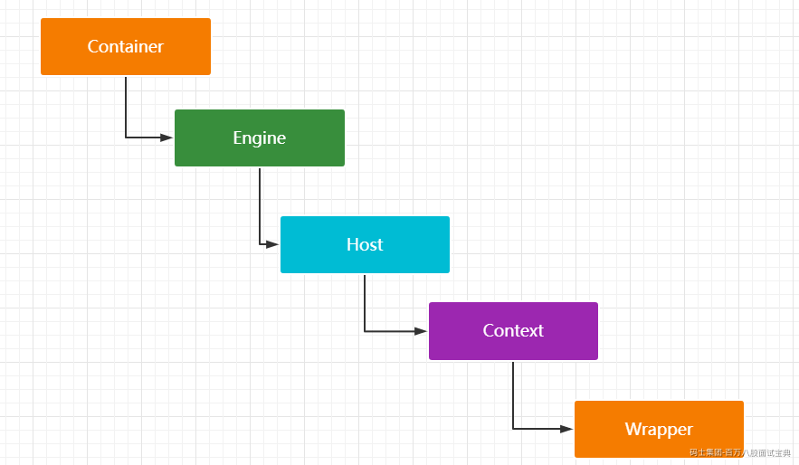

而需要把上面这个图的内容搞清楚，直接看代码的话还是比较头晕的，这时我们可以结合Tomcat的运行过程来分析

# 三、Tomcat核心流程

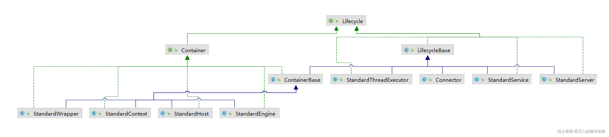

## 1.Bootstrap

  Bootstrap是Tomcat的入口类，相关的核心方法：

- init():自定义类加载器和创建Catalina方法

- load():会完成相关对象的初始化

- start():启动各种对象的start()方法

- ....

  initClassLoaders()完成了自定义类加载器。JVM中提供的类加载器是双亲委派模式，在Tomcat中自定义了加载方式。打破了双亲委派模型：先自己尝试去加载这个类，找不到再委托给父类加载器。通过复写findClass和loadClass实现。

## 2.Catalina

  完成server.xml文件的解析，完成Server组件并具体调用相关的组件的init和start方法

## 3.Lifecycle

  统一管理各个组件的生命周期，init，start，stop，destory方法，对应的实现是LifecycleBase实现了Lifecycle中的生命周期相关逻辑，用到了模板设计模式。

## 4.Server

  管理Service组件，并调用其init和start方法

## 5.Service

  管理Connector和Engine

## 6.Connector

## 7.Container

Container容器是在Connector处理完请求后获取到ServletRequest后内部处理请求的统一管理对象。

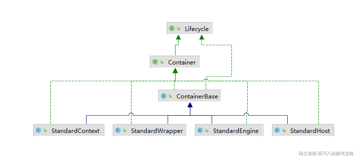

init方法

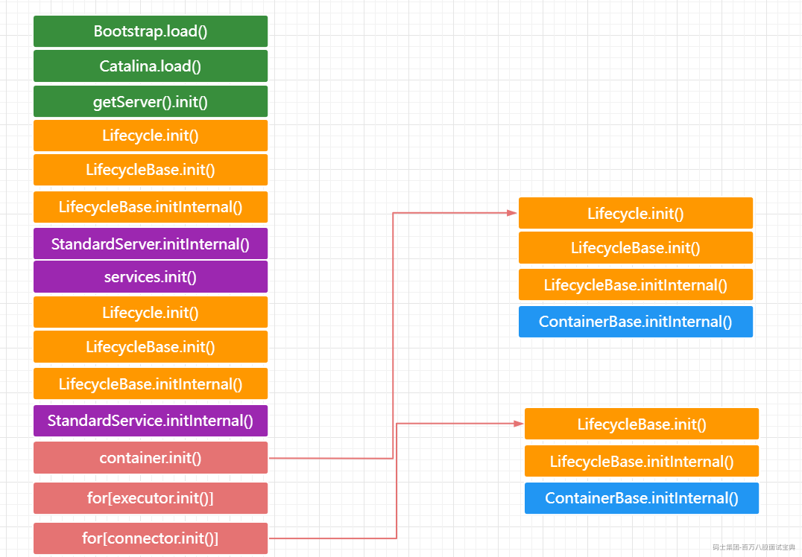

start方法

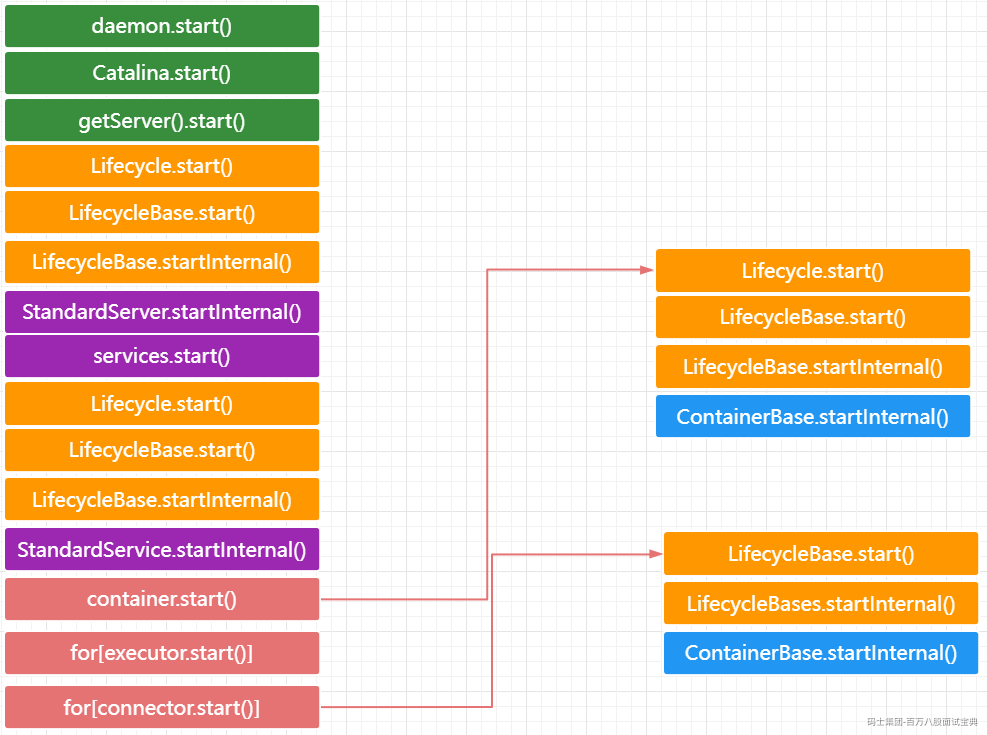

Container的处理过程

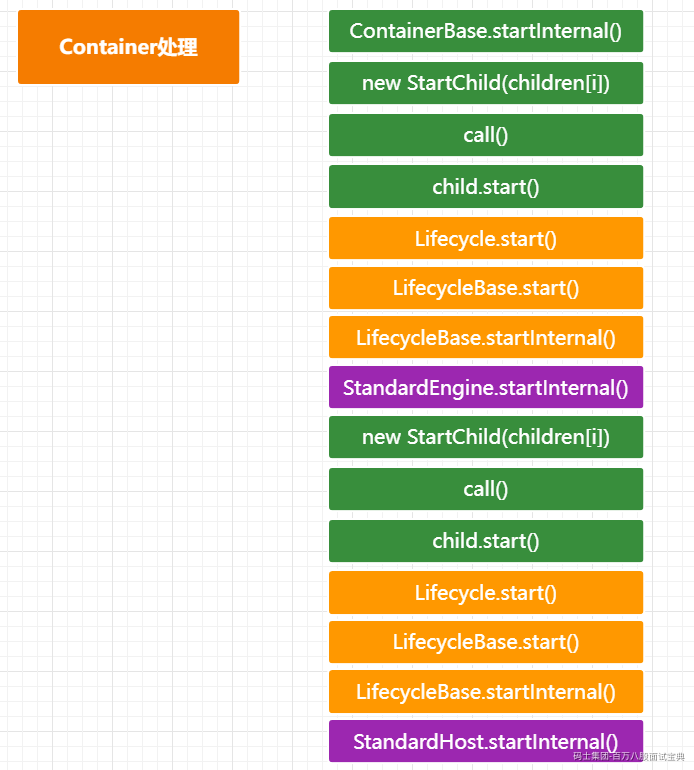

最后看看StandardHost是如何来实现Web项目部署的

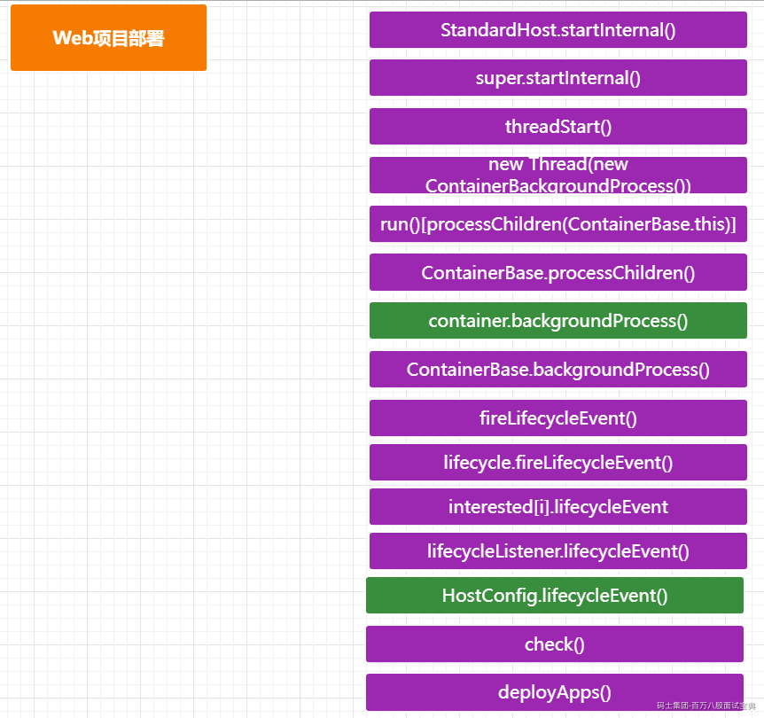
