# Tomcat进阶篇

# 一、聊聊ClassLoader的那些事儿

  我们要分析清楚Tomcat中的类加载器相关的内容之前我们还是需要把JVM中的类加载器给大家理清楚。

## 1.类加载器的过程

  类加载器的作用就是从文件系统或者网络中加载Class文件，至于他是否可以运行就不是ClassLoader的工作了。

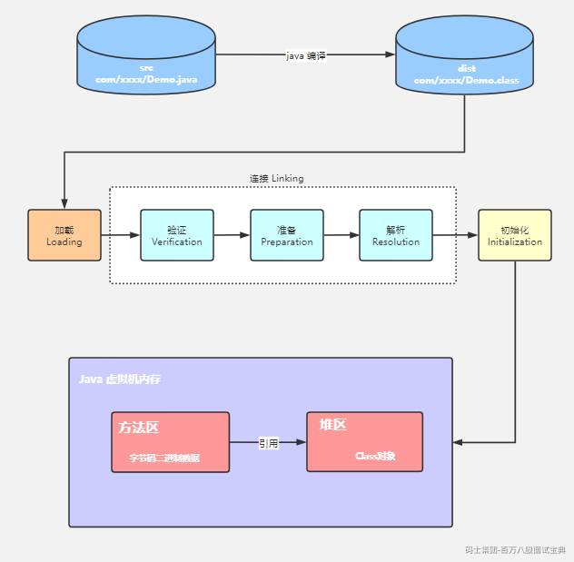

## 2.类加载器的分类

  JVM中支持的类加载器有两种类型，分别是 `引导类加载器`【Bootstrap ClassLoader】和 `自定义类加载器`【User-Defined ClassLoader】

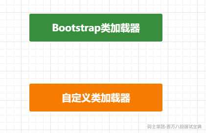

  在Java虚拟机层面定义：所有派生于抽象类ClassLoader的类加载器都划分为自定义类加载器。

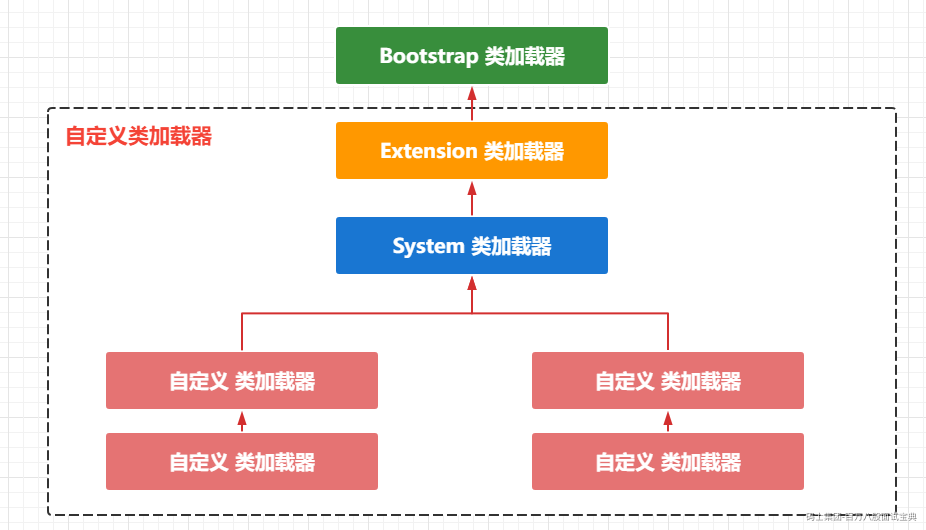

可以通过源码看到对应的类加载器的继承关系

ExtClassLoader

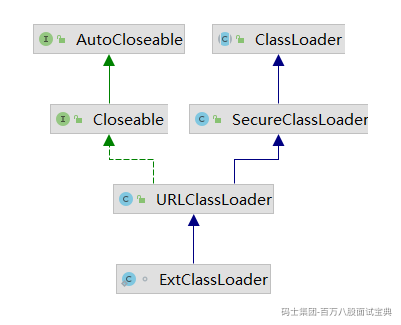

AppClassLoader

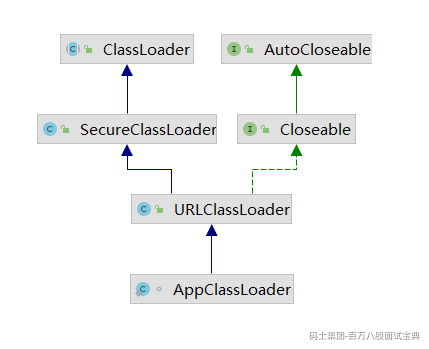

通过具体的案例代码可以来看看类加载器的使用

```java
public static void main(String[] args) {
        // 获取系统类加载器
        ClassLoader systemClassLoader = ClassLoader.getSystemClassLoader();
        System.out.println("systemClassLoader = " + systemClassLoader);
        // 获取父类加载器
        ClassLoader parent = systemClassLoader.getParent();
        System.out.println("parent = " + parent);
        // 继续获取上层的类加载器
        ClassLoader bootstrapClassLoader = parent.getParent();
        System.out.println("bootstrapClassLoader = " + bootstrapClassLoader);
        // 自定义Java类
        ClassLoader classLoader = ClassLoaderTest.class.getClassLoader();
        System.out.println("classLoader = " + classLoader);
        // Java系统类
        ClassLoader classLoader1 = String.class.getClassLoader();
        System.out.println("classLoader1 = " + classLoader1);
    }
```

对应的输出结果

```plain
systemClassLoader = sun.misc.Launcher$AppClassLoader@18b4aac2
parent = sun.misc.Launcher$ExtClassLoader@61bbe9ba
bootstrapClassLoader = null
classLoader = sun.misc.Launcher$AppClassLoader@18b4aac2
classLoader1 = null
```

## 3.Bootstrap ClassLoader

  虚拟机自带的类加载器，启动类加载器

- 通过C/C++实现的，JVM内置类加载器

- 作用是用来加载Java的核心库(JAVA\_HOME/jre/lib.rt.jar、resources.jar或者sun.boot.class.path路径下的内容)、用于提供JVM自身需要的类。

- 没有继承java.lang.ClassLoader、没有父加载器，自己就是祖先了。

- 加载扩展类和应用程序类加载器，并指定为他们的父类加载器

- 出于安全考虑，Bootstrap启动类加载器只加载报名为java,javax,sun等开头的类

通过代码来看看具体的加载路径有哪些

```java
    public static void main(String[] args) {
        System.out.println("**************启动类加载器*************");
        URL[] urLs = Launcher.getBootstrapClassPath().getURLs();
        for (int i = 0 ; i < urLs.length ; i ++){
            URL urL = urLs[i];
            System.out.println("urL = " + urL.toExternalForm());
        }
    }
```

输出结果：

```plain
**************启动类加载器*************
urL = file:/D:/software/java/jdk8/jre/lib/resources.jar
urL = file:/D:/software/java/jdk8/jre/lib/rt.jar
urL = file:/D:/software/java/jdk8/jre/lib/sunrsasign.jar
urL = file:/D:/software/java/jdk8/jre/lib/jsse.jar
urL = file:/D:/software/java/jdk8/jre/lib/jce.jar
urL = file:/D:/software/java/jdk8/jre/lib/charsets.jar
urL = file:/D:/software/java/jdk8/jre/lib/jfr.jar
urL = file:/D:/software/java/jdk8/jre/classes
```

## 4.Extension ClassLoader

  虚拟机自带的加载器。扩展类加载器，Java语音编写，是sun.misc.Launcher的内部类

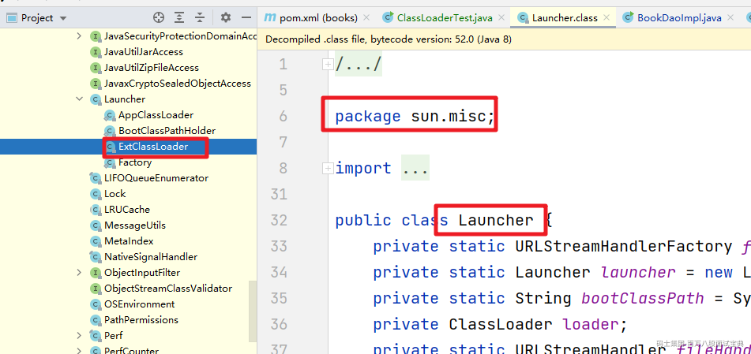

派生于ClassLoader所以是自定义类加载器

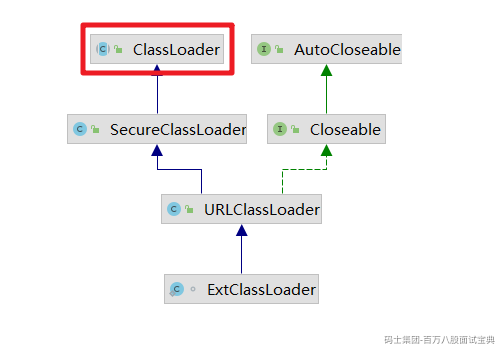

父类加载器是BootstrapClassLoader。

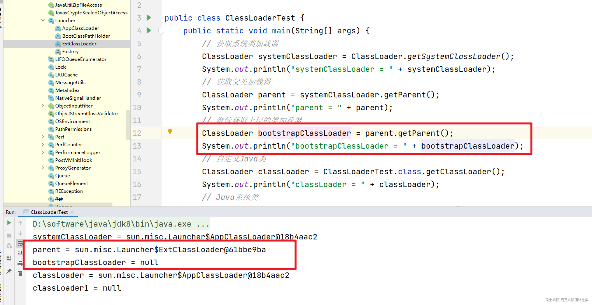

  扩展类加载器是从扩展目录 `java.ext.dirs`系统属性指定的目录中加载类库，或者从JDK的安装目录的 `jre/lib/ext`子目录下加载雷凯，如果用户创建的jar包也放在了这个目录下，那么该类加载器也会自动加载的。

然后通过案例来看看扩展类加载器加载的路径

```java
    public static void main(String[] args) {
        System.out.println("**************扩展类加载器*************");
        String extDirs = System.getProperty("java.ext.dirs");
        System.out.println("extDirs = " + extDirs);
    }
```

对应的输出结果

```plain
**************扩展类加载器*************
extDirs = D:\software\java\jdk8\jre\lib\ext;C:\WINDOWS\Sun\Java\lib\ext
```

然后通过加载路径下的Java类测试也能证明

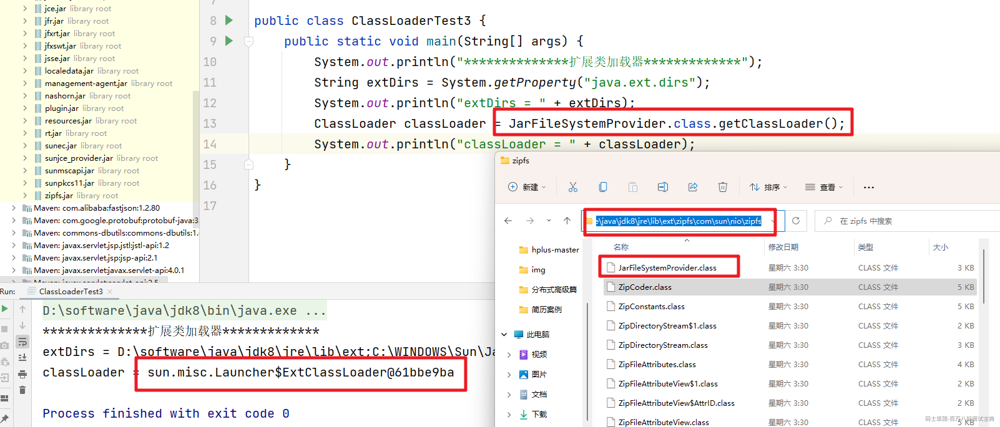

## 5.App ClassLoader

  虚拟机自带的加载器，APPClassLoader也叫应用程序类加载器。Java语音编写，由sun.misc.Launcher下的内部类提供。也是派生于ClassLoader。

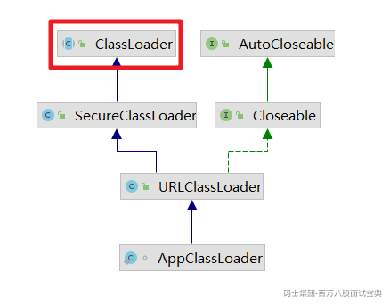

父类加载器为ExtClassLoader

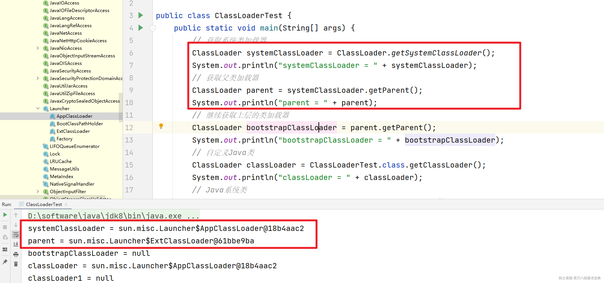

  主要负责加载环境变量classpath或系统属性 java.class.path 指定路径下的类库，该类加载器是程序中的默认类加载器，一般来说，Java应用的类都是由它来完成加载的。通过 ClassLoader#getSystemClassLoader() 方法可以获取到该类加载器。

## 6.自定义类加载器

  在我们的日常应用程序的开发中，我基本是用不到自定义类加载器的，基本就是由前面介绍的这三个类加载器来相互配合搞定的。但是在有些特殊的情况下我们不希望通过系统的类加载器来处理，这时我们就可以通过自定义类加载来实现了。

  用户自定义类加载器的实现步骤：

1. 我们可以直接编写 java.lang.ClassLoader 类的实现来完成自定义的处理

2. 在JDK1.2之前，自定义类加载器时我们总是会继承ClassLoader然后重写loadClass方法，达到自定义类加载的目的，但是在JDK1.2之后建议把自定义的类加载逻辑放在findClass()方法中

3. 最后在编写自定义类加载的时候，如果没有太过于复杂的需求，可以直接继承URLClassLoader类，这样可以达到简化自定义类加载器的目的

## 7.双亲委派机制

> Java虚拟机对class文件采用的是 `按需加载`的方式，也就是当需要使用该类时才会将他的class文件加载到内存中生成class对象，而且加载某个类的class文件时，Java虚拟机采用的而是双亲委派模式。即把请求交由父类加载器处理，它是一种任务委派模式。

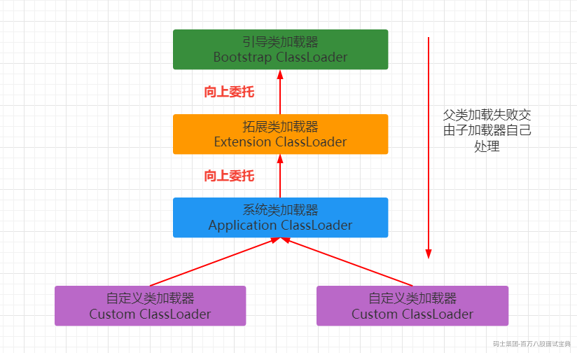

双亲委派的工作原理：

1. 如果一个类加载器收到了类加载的请求，它并不会自己先去加载，而且把这个请求委托给父类的加载器去执行。

2. 如果父类加载器还存在其父类加载器，则进一步向上委托，依次递归请求，最终将请求流转到顶层的启动类加载器

3. 如果父类加载器可以完成类加载任务，就成功返回，如果父类无法完成任务，子加载器才会尝试自己去加载。

举个简单的例子，我们自定义一个java.lang.String类，然后添加对应的main方式执行。

```java
public class String {
    public static void main(String[] args) {
        System.out.println("自定义String类");
    }
}
```

报错信息为：

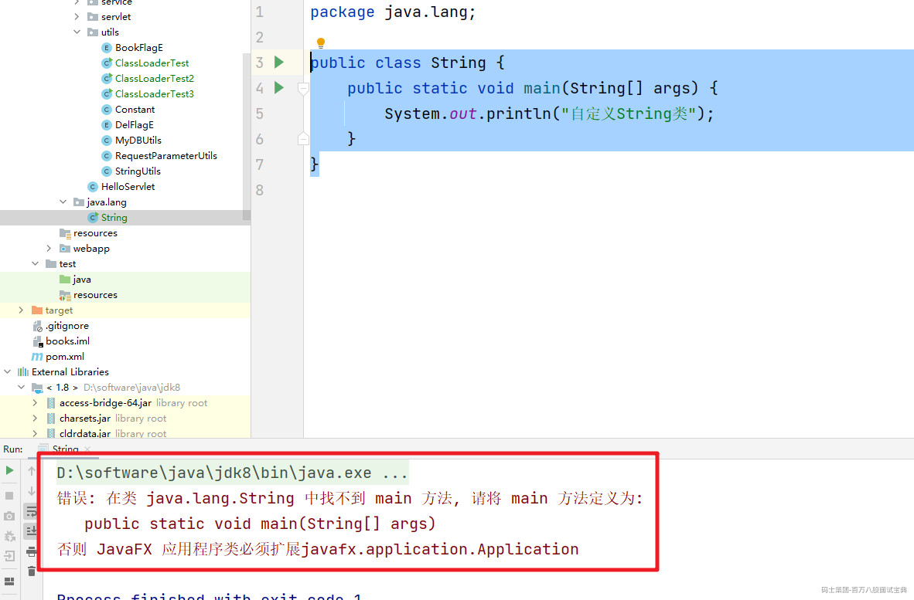

原因就是双亲委派机制通过BootstrapClassLoader加载的是java包下的String，而不会加载我们自定义的。

双亲委派机制的有点：

1. 避免类的重复加载

2. 保护程序的安全，防止核心API被随意的篡改

# 二、Catalina为什么不new出来?

  掌握了Java的类加载器和双亲委派机制，现在我们就可以回答正题上来了，Tomcat的类加载器是怎么设计的？

## 1.Web容器的特性

  Web容器有其自身的特殊性，所以在类加载器这块是不能完全使用JVM的类加载器的双亲委派机制的。在Web容器中我们应该要满足如下的特性：

**隔离性**：

  部署在同一个Web容器上的两个Web应用程序所使用的Java类库可以实现相互隔离。设想一下，两个Web应用，一个使用了Spring3.0，另一个使用了新的的5.0，应用服务器使用一个类加载器，Web应用将会因为jar包覆盖而无法启动。

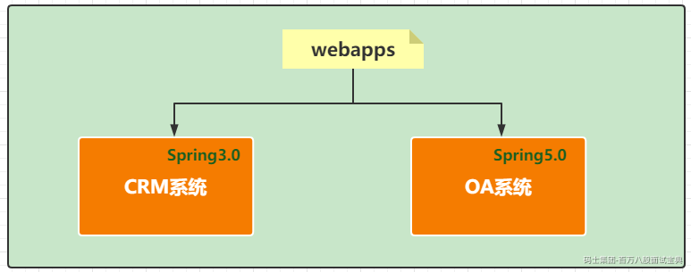

**灵活性**:

  Web应用之间的类加载器相互独立，那么就能针对一个Web应用进行重新部署，此时Web应用的类加载器会被重建，而且不会影响其他的Web应用。如果采用一个类加载器，类之间的依赖是杂乱复杂的，无法完全移出某个应用的类。

**性能**:

  性能也是一个比较重要的点。部署在同一个Web容器上的两个Web应用程序所使用的Java类库可以互相共享。这个需求也很常见，例如，用户可能有10个使用Spring框架的应用程序部署在同一台服务器上，如果把10份Spring分别存放在各个应用程序的隔离目录中，将会是很大的资源浪费——这主要倒不是浪费磁盘空间的问题，而是指类库在使用时都要被加载到Web容器的内存，如果类库不能共享，虚拟机的方法区就会很容易出现过度膨胀的风险。

## 2.Tomcat类加载器结构

  明白了Web容器的类加载器有多个，再来看tomcat的类加载器结构。

首先上张图，整体看下tomcat的类加载器：

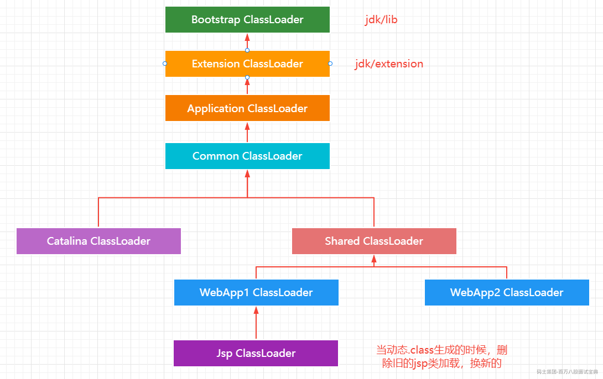

  可以看到在原先的java类加载器基础上，tomcat新增了几个类加载器，包括3个基础类加载器和每个Web应用的类加载器，其中3个基础类加载器可在conf/catalina.properties中配置，具体介绍下：

**Common**：以应用类加载器为父类，是tomcat顶层的公用类加载器，其路径由conf/catalina.properties中的common.loader指定，默认指向${catalina.base}/lib下的包。

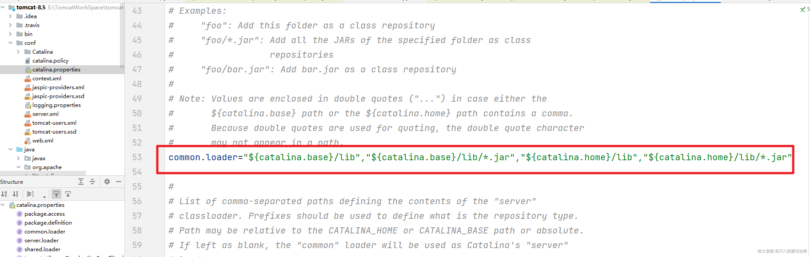

**Catalina**：以Common类加载器为父类，是用于加载Tomcat应用服务器的类加载器，其路径由server.loader指定，默认为空，此时tomcat使用Common类加载器加载应用服务器。

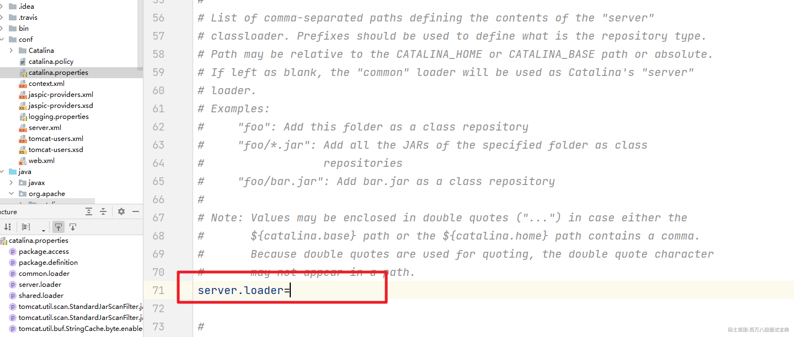

**Shared**：以Common类加载器为父类，是所有Web应用的父类加载器，其路径由shared.loader指定，默认为空，此时tomcat使用Common类加载器作为Web应用的父加载器。

**Web应用**：以Shared类加载器为父类，加载/WEB-INF/classes目录下的未压缩的Class和资源文件以及/WEB-INF/lib目录下的jar包，该类加载器只对当前Web应用可见，对其他Web应用均不可见。

  默认情况下，Common、Catalina、Shared类加载器是同一个，但可以配置3个不同的类加载器，使他们各司其职。

  首先，Common类加载器复杂加载Tomcat应用服务器内部和Web应用均可见的类，如Servlet规范相关包和一些通用工具包。

  其次，Catalina类加载器负责只有Tomcat应用服务器内部可见的类，这些类对Web应用不可见。比如，想实现自己的会话存储方案，而且该方案依赖了一些第三方包，当然是不希望这些包对Web应用可见，这时可以配置server.load，创建独立的Catalina类加载器。

  再次，Shared类复杂加载Web应用共享类，这些类tomcat服务器不会依赖

## 3.Tomcat源码分析

### 3.1 CatalinClassLoader

  首先来看看Tomcat的类加载器的继承结构

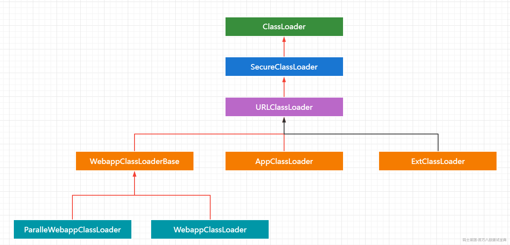

可以看到继承的结构和我们上面所写的类加载器的结构不同。

大家需要注意双亲委派机制并不是通过继承来实现的，而是相互之间组合而形成的。所以AppClassLoader没有继承自 ExtClassLoader，WebappClassLoader也没有继承自AppClassLoader。至于Common ClassLoader ，Shared ClassLoader，Catalina ClassLoader则是在启动时初始化的三个不同名字的URLClassLoader。

先来看看Bootstrap#init()方法。init方法会调用initClassLoaders，同样也会将Catalina ClassLoader设置到当前线程设置到当前线程，进入initClassLoaders来看看。

```java
    private void initClassLoaders() {
        try {
            // 创建 commonLoader  catalinaLoader sharedLoader
            commonLoader = createClassLoader("common", null);
            if (commonLoader == null) {
                // no config file, default to this loader - we might be in a 'single' env.
                commonLoader = this.getClass().getClassLoader();
            }
            // 默认情况下 server.loader 和 shared.loader 都为空则会返回 commonLoader 类加载器
            catalinaLoader = createClassLoader("server", commonLoader);
            sharedLoader = createClassLoader("shared", commonLoader);
        } catch (Throwable t) {
            handleThrowable(t);
            log.error("Class loader creation threw exception", t);
            System.exit(1);
        }
    }
```

我们可以看到在initClassLoaders()方法中完成了CommonClassLoader， CatalinaClassLoader，和SharedClassLoader的创建，而且进入到createClassLoader方法中。

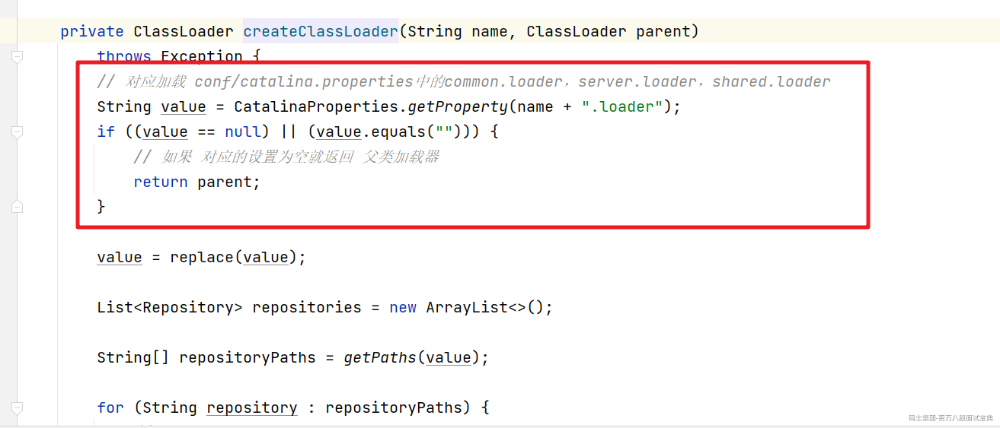

可以看到这三个基础类加载器所加载的资源刚好对应conf/catalina.properties中的common.loader，server.loader，shared.loader

### 3.2 层次结构

  Common/Catalina/Shared ClassLoader的创建好了之后就会维护相互之间的组合关系

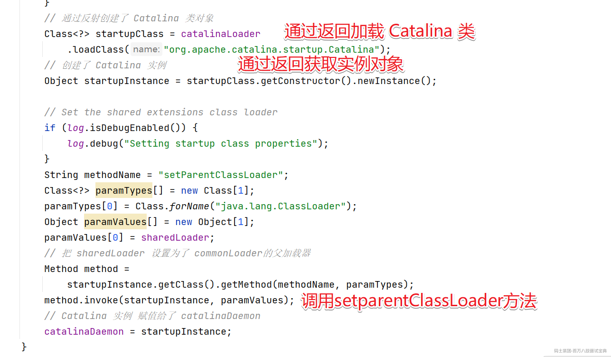

其实也就是设置了父加载器

### 3.3 具体的加载过程

  源码比较长，直接进入到 `WebappClassLoaderBase`中的 `LoadClass方法`

```java
@Override
    public Class<?> loadClass(String name, boolean resolve) throws ClassNotFoundException {

        synchronized (getClassLoadingLock(name)) {
            if (log.isDebugEnabled()) {
                log.debug("loadClass(" + name + ", " + resolve + ")");
            }
            Class<?> clazz = null;

            // Log access to stopped class loader
            checkStateForClassLoading(name);

            // (0) Check our previously loaded local class cache
            // 检查WebappClassLoader中是否加载过此类
            clazz = findLoadedClass0(name);
            if (clazz != null) {
                if (log.isDebugEnabled()) {
                    log.debug("  Returning class from cache");
                }
                if (resolve) {
                    resolveClass(clazz);
                }
                return clazz;
            }

            // (0.1) Check our previously loaded class cache
            // 如果第一步没有找到，则继续检查JVM虚拟机中是否加载过该类
            clazz = findLoadedClass(name);
            if (clazz != null) {
                if (log.isDebugEnabled()) {
                    log.debug("  Returning class from cache");
                }
                if (resolve) {
                    resolveClass(clazz);
                }
                return clazz;
            }

            // (0.2) Try loading the class with the bootstrap class loader, to prevent
            //       the webapp from overriding Java SE classes. This implements
            //       SRV.10.7.2
            // 如果前两步都没有找到，则使用系统类加载该类（也就是当前JVM的ClassPath）。
            // 为了防止覆盖基础类实现，这里会判断class是不是JVMSE中的基础类库中类。
            String resourceName = binaryNameToPath(name, false);

            ClassLoader javaseLoader = getJavaseClassLoader();
            boolean tryLoadingFromJavaseLoader;
            try {
                // Use getResource as it won't trigger an expensive
                // ClassNotFoundException if the resource is not available from
                // the Java SE class loader. However (see
                // https://bz.apache.org/bugzilla/show_bug.cgi?id=58125 for
                // details) when running under a security manager in rare cases
                // this call may trigger a ClassCircularityError.
                // See https://bz.apache.org/bugzilla/show_bug.cgi?id=61424 for
                // details of how this may trigger a StackOverflowError
                // Given these reported errors, catch Throwable to ensure any
                // other edge cases are also caught
                URL url;
                if (securityManager != null) {
                    PrivilegedAction<URL> dp = new PrivilegedJavaseGetResource(resourceName);
                    url = AccessController.doPrivileged(dp);
                } else {
                    url = javaseLoader.getResource(resourceName);
                }
                tryLoadingFromJavaseLoader = (url != null);
            } catch (Throwable t) {
                // Swallow all exceptions apart from those that must be re-thrown
                ExceptionUtils.handleThrowable(t);
                // The getResource() trick won't work for this class. We have to
                // try loading it directly and accept that we might get a
                // ClassNotFoundException.
                tryLoadingFromJavaseLoader = true;
            }

            if (tryLoadingFromJavaseLoader) {
                try {
                    clazz = javaseLoader.loadClass(name);
                    if (clazz != null) {
                        if (resolve) {
                            resolveClass(clazz);
                        }
                        return clazz;
                    }
                } catch (ClassNotFoundException e) {
                    // Ignore
                }
            }

            // (0.5) Permission to access this class when using a SecurityManager
            if (securityManager != null) {
                int i = name.lastIndexOf('.');
                if (i >= 0) {
                    try {
                        securityManager.checkPackageAccess(name.substring(0,i));
                    } catch (SecurityException se) {
                        String error = sm.getString("webappClassLoader.restrictedPackage", name);
                        log.info(error, se);
                        throw new ClassNotFoundException(error, se);
                    }
                }
            }
            // 检查是否 设置了delegate属性，设置为true，那么就会完全按照JVM的"双亲委托"机制流程加载类。
            boolean delegateLoad = delegate || filter(name, true);

            // (1) Delegate to our parent if requested
            if (delegateLoad) {
                if (log.isDebugEnabled()) {
                    log.debug("  Delegating to parent classloader1 " + parent);
                }
                try {
                    clazz = Class.forName(name, false, parent);
                    if (clazz != null) {
                        if (log.isDebugEnabled()) {
                            log.debug("  Loading class from parent");
                        }
                        if (resolve) {
                            resolveClass(clazz);
                        }
                        return clazz;
                    }
                } catch (ClassNotFoundException e) {
                    // Ignore
                }
            }

            // (2) Search local repositories
            // 若是没有委托，则默认会首次使用WebappClassLoader来加载类。通过自定义findClass定义处理类加载规则。
            // findClass()会去Web-INF/classes 目录下查找类。
            if (log.isDebugEnabled()) {
                log.debug("  Searching local repositories");
            }
            try {
                clazz = findClass(name);
                if (clazz != null) {
                    if (log.isDebugEnabled()) {
                        log.debug("  Loading class from local repository");
                    }
                    if (resolve) {
                        resolveClass(clazz);
                    }
                    return clazz;
                }
            } catch (ClassNotFoundException e) {
                // Ignore
            }

            // (3) Delegate to parent unconditionally
            // 若是WebappClassLoader在/WEB-INF/classes、/WEB-INF/lib下还是查找不到class，
            // 那么无条件强制委托给System、Common类加载器去查找该类。
            if (!delegateLoad) {
                if (log.isDebugEnabled()) {
                    log.debug("  Delegating to parent classloader at end: " + parent);
                }
                try {
                    clazz = Class.forName(name, false, parent);
                    if (clazz != null) {
                        if (log.isDebugEnabled()) {
                            log.debug("  Loading class from parent");
                        }
                        if (resolve) {
                            resolveClass(clazz);
                        }
                        return clazz;
                    }
                } catch (ClassNotFoundException e) {
                    // Ignore
                }
            }
        }

        throw new ClassNotFoundException(name);
    }
```

Web应用类加载器默认的加载顺序是：

(1).先从缓存中加载；

(2).如果没有，则从JVM的Bootstrap类加载器加载；

(3).如果没有，则从当前类加载器加载（按照WEB-INF/classes、WEB-INF/lib的顺序）；

(4).如果没有，则从父类加载器加载，由于父类加载器采用默认的委派模式，所以加载顺序是AppClassLoader、Common、Shared。

tomcat提供了delegate属性用于控制是否启用java委派模式，默认false（不启用），当设置为true时，tomcat将使用java的默认委派模式，这时加载顺序如下：

(1).先从缓存中加载；

(2).如果没有，则从JVM的Bootstrap类加载器加载；

(3).如果没有，则从父类加载器加载，加载顺序是AppClassLoader、Common、Shared。

(4).如果没有，则从当前类加载器加载（按照WEB-INF/classes、WEB-INF/lib的顺序）**；**
