# Tomcat优化篇

# 一、Tomcat自身配置

## 1.Tomcat管理页面

  我们可以打开Tomcat的管理页面，这块需要先配置下，在 `tomcat-users.xml`中添加相关的用户和角色信息

```xml
  <role rolename="manager"/>
  <role rolename="manager-gui"/>
  <role rolename="admin" />
  <role rolename="admin-gui" />
  <user username="tomcat" password="tomcat" roles="admin-gui,admin,manager-gui,manager" />
```

如果访问提示出现了403的错误，则修改webapps/manager/META-INF/context.xml中的内容

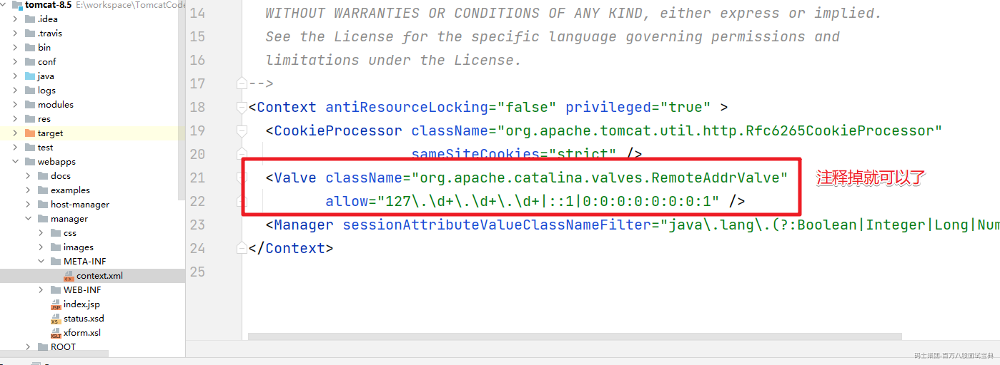

访问Tomcat服务

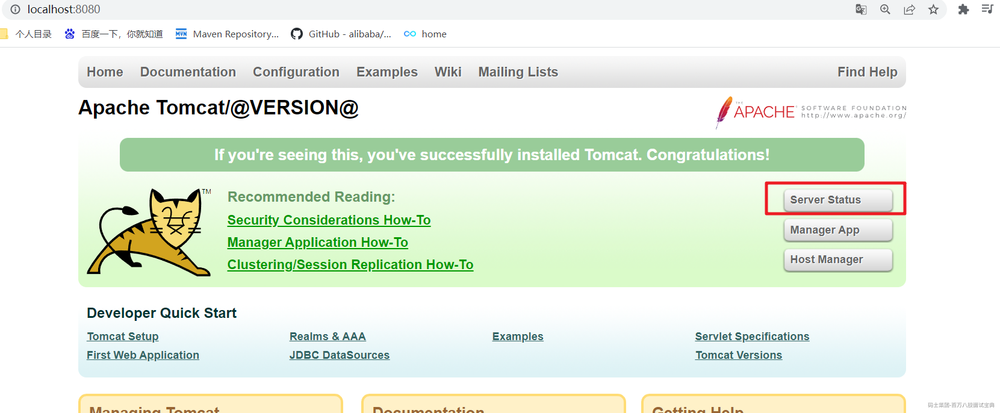

然后输入配置的账号密码

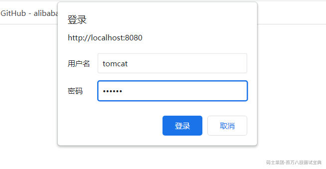

可以看到对应的监控信息

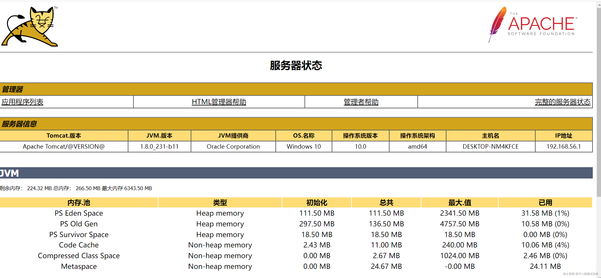

## 2. 禁用AJP服务

  AJP是定向包协议。因为性能原因，使用二进制格式来传输可读性文本。WEB服务器通过TCP连接和SERVLET容器连接。为了减少进程生成socket的花费，  
WEB服务器和SERVLET容器之间尝试保持持久性的TCP连接，对多个请求/回复循环重用一个连接。一旦连接分配给一个特定的请求，在请求处理循环结束之前不会再分配。  
换句话说，在连接上，请求不是多元的。这个使连接两端的编码变得容易，虽然这导致在一时刻会有很多连接。

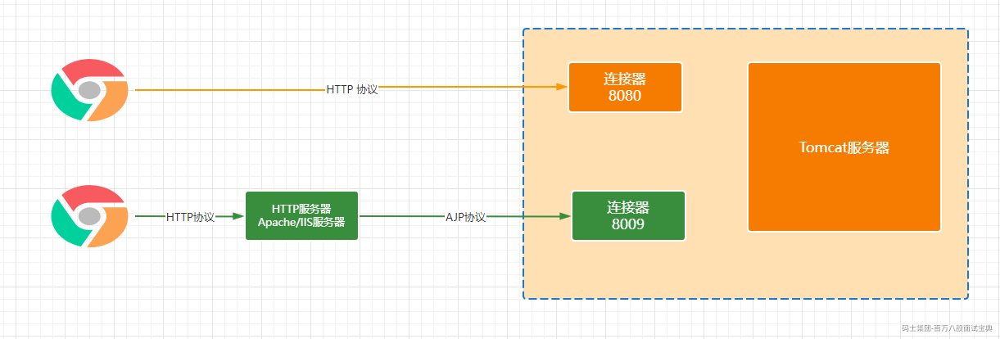

我们一般使用的Nginx+Tomcat的架构，所以用不着AJP协议，可以把AJP连接器禁用掉

## 3.Executor优化

  在Tomcat中每一个用户请求都是一个线程，针对线程池我们也可以提供对应的优化来提升性能。

```xml
    <!-- 自定义线程池 -->
    <Executor name="tomcatThreadPool" namePrefix="catalina-exec-"
        maxThreads="150" minSpareThreads="4"/>
  

    <!-- A "Connector" represents an endpoint by which requests are received
         and responses are returned. Documentation at :
         Java HTTP Connector: /docs/config/http.html (blocking & non-blocking)
         Java AJP  Connector: /docs/config/ajp.html
         APR (HTTP/AJP) Connector: /docs/apr.html
         Define a non-SSL HTTP/1.1 Connector on port 8080
    -->
    <Connector executor="tomcatThreadPool" port="8080" protocol="HTTP/1.1"
               connectionTimeout="20000"
               redirectPort="8443" />
```

涉及到的几个参数

|  |  |
| --- | --- |
| 参数 | 说明 |
| maxThreads | 最大的并发数，不同版本默认值有差别(150~200),一般建议500-1000 |
| minSpareThreads | 初始化的线程数 |
| maxQueueSize | 最大等待的队列数，超过就拒绝了 |

## 4.三种运行模式

bio:默认的模式，性能非常低下，没有经过任何优化处理和支持。

nio：new I/O,同步非阻塞的I/O操作，比传统的bio有更好的并发运行性能。

apr:需要安装 apr 、 apr-utils 、tomcat-native包，比较麻烦。是Apache HTTP服务器的支持库。你可以简单地理解为，Tomcat将以JNI的形式调用Apache HTTP服务器的核心动态链接库来处理文件读取或网络传输操作，从而大大地提高Tomcat对静态文件的处理性能。 Tomcat apr也是在Tomcat上运行高并发应用的首选模式。

```java
    @Deprecated
    public void setProtocol(String protocol) {

        boolean aprConnector = AprLifecycleListener.isAprAvailable() &&
                AprLifecycleListener.getUseAprConnector();

        if ("HTTP/1.1".equals(protocol) || protocol == null) {
            if (aprConnector) {
                setProtocolHandlerClassName("org.apache.coyote.http11.Http11AprProtocol");
            } else {
                setProtocolHandlerClassName("org.apache.coyote.http11.Http11NioProtocol");
            }
        } else if ("AJP/1.3".equals(protocol)) {
            if (aprConnector) {
                setProtocolHandlerClassName("org.apache.coyote.ajp.AjpAprProtocol");
            } else {
                setProtocolHandlerClassName("org.apache.coyote.ajp.AjpNioProtocol");
            }
        } else {
            setProtocolHandlerClassName(protocol);
        }
    }
```

调整对应的配置

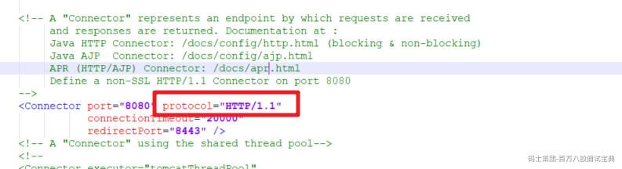

## 5.web.xml

最终观察tomcat启动日志[时间/内容]，线程开销，内存大小，GC等

DefaultServlet

```xml
    <servlet>
        <servlet-name>default</servlet-name>

        <servlet-class>org.apache.catalina.servlets.DefaultServlet</servlet-class>

        <init-param>
            <param-name>debug</param-name>

            <param-value>0</param-value>

        </init-param>

        <init-param>
            <param-name>listings</param-name>

            <param-value>false</param-value>

        </init-param>

        <load-on-startup>1</load-on-startup>

    </servlet>

```

JspServlet

```xml
    <servlet>
        <servlet-name>jsp</servlet-name>

        <servlet-class>org.apache.jasper.servlet.JspServlet</servlet-class>

        <init-param>
            <param-name>fork</param-name>

            <param-value>false</param-value>

        </init-param>

        <init-param>
            <param-name>xpoweredBy</param-name>

            <param-value>false</param-value>

        </init-param>

        <load-on-startup>3</load-on-startup>

    </servlet>

```

welcome-list-file

```plain
    <welcome-file-list>
        <welcome-file>index.html</welcome-file>

        <welcome-file>index.htm</welcome-file>

        <welcome-file>index.jsp</welcome-file>

    </welcome-file-list>

```

mime-mapping移除响应的内容

```plain
    <mime-mapping>
        <extension>zip</extension>

        <mime-type>application/zip</mime-type>

    </mime-mapping>

    <mime-mapping>
        <extension>zir</extension>

        <mime-type>application/vnd.zul</mime-type>

    </mime-mapping>

```

session-config  
默认jsp页面有session，就是在于这个配置

```plain

    <session-config>
        <session-timeout>30</session-timeout>

    </session-config>

```

## 6.Host标签

autoDeploy :Tomcat运行时，要用一个线程拿出来进行检查，生产环境之下一定要改成false

unpackWARs:war包自动解压缩，同样的生产环境改为false

## 7.Context标签

reloadable:false

> reloadable:如果这个属性设为true，tomcat服务器在运行状态下会监视在WEB-INF/classes和WEB-INF/lib目录下 class文件的改动，如果监测到有class文件被更新的，服务器会自动重新加载Web应用。  
> 在开发阶段将reloadable属性设为true，有助于调试servlet和其它的class文件，但这样用加重服务器运行负荷，建议 在Web应用的发存阶段将reloadable设为false。

## 8.启动速度优化

1. 删除没用的web应用：因为tomcat启动每次都会部署这些应用

2. 关闭WebSocket:websocket-api.jar和tomcat-websocket.jar

3. 随机数优化:设置JVM参数：-Djava.security.egd=file:/dev/./urandom

4. 多个线程启动Web应用: host:startStopThreads

## 9.其他方面

- Connector：配置压缩属性compression="500"，文件大于500bytes才会压缩

- 数据库优化：减少对数据库访问等待的时间，可以从数据库的层面进行优化，或者加缓存等等各种方案。

- 开启浏览器缓存，nginx静态资源部署

# 二、JMeter测试

  针对相关数据的测试我们可以通过JMeter来直观的给大家来展示。我们在tomcat8.0的服务中部署一个war服务。

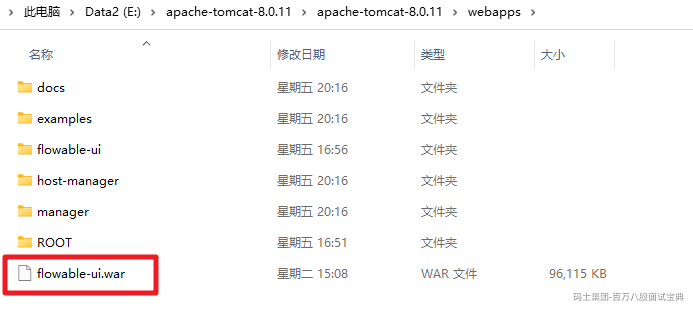

我们找一个FlowableUI的war包，正常启动：可以正常访问

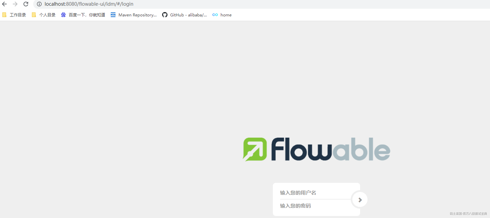

然后我们通过JMeter来压测：

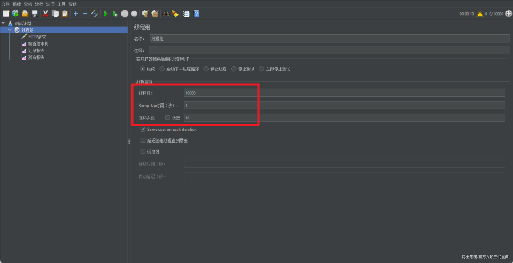

设置请求相关信息

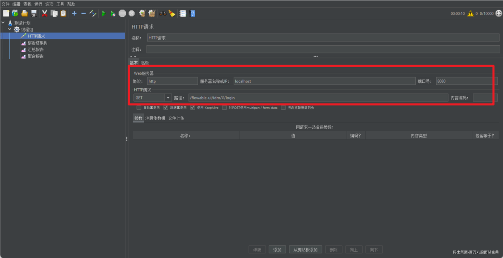

选择几个监听器

然后执行：吞吐量：4103


然后我们禁用掉AJP

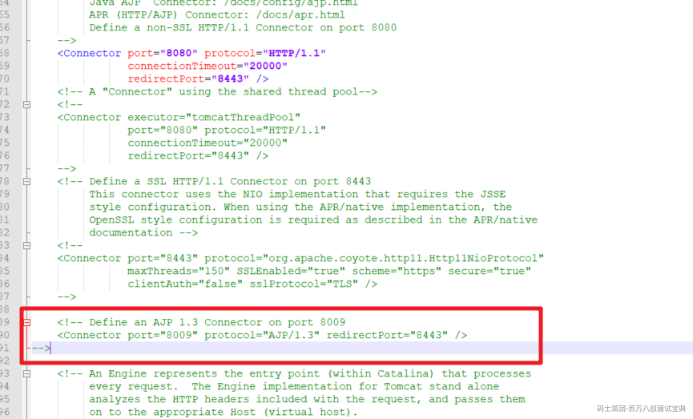

再测试：4149 稍微有点提升

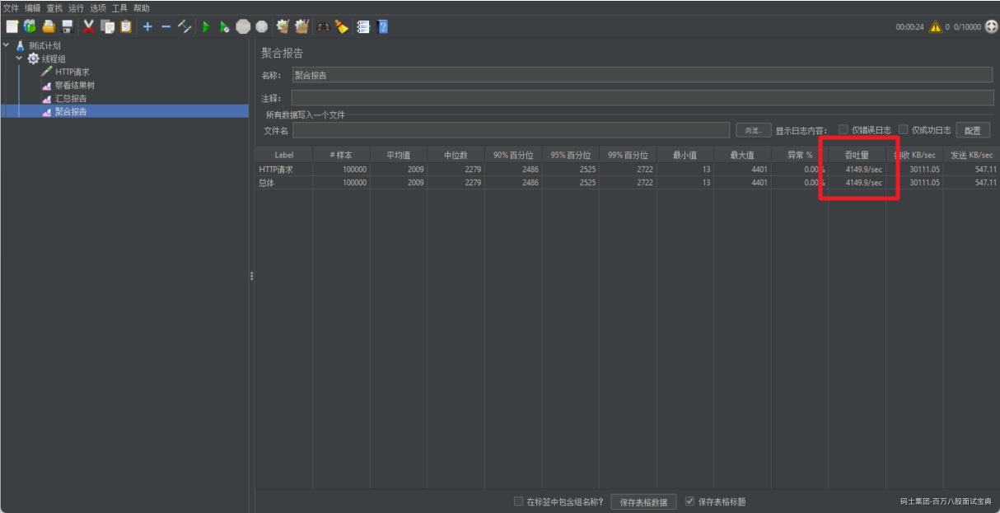

然后我们自定义线程池

```plain
    <!-- 自定义线程池 -->
    <Executor name="tomcatThreadPool" namePrefix="catalina-exec-"
        maxThreads="500" minSpareThreads="50" prestartminSpareThreads="true"/>
```

记得关联上

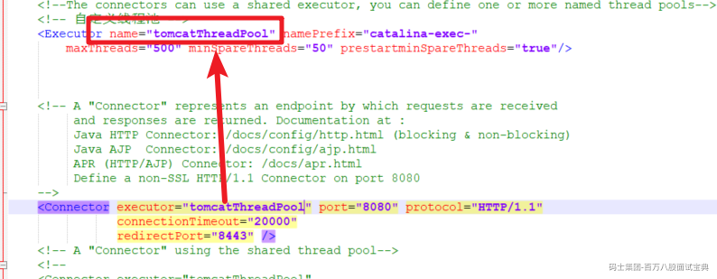

吞吐量：4188


我们把线程池的相关数据调整下：最大线程数1000，最小线程数100再看看


没有太大的区别，这时我们可以设置最大的等待队列：maxQueueSize="100"


我们可以发现当添加了最大阻塞队列后吞吐量提升到了5203了，提升效果显著，但是同样的异常率提升了很多32.6%，当然这也是正常的现象了。

最后我们修改下运行的模式。改为NIO2,同时不加最大等待队列来看看

```xml
    <!-- 自定义线程池 -->
    <Executor name="tomcatThreadPool" namePrefix="catalina-exec-"
        maxThreads="500" minSpareThreads="50" prestartminSpareThreads="true" />
 
   <Connector executor="tomcatThreadPool" port="8080" protocol="org.apache.coyote.http11.Http11Nio2Protocol"
               connectionTimeout="20000"
               redirectPort="8443" />
```


正常情况下（150个线程 4个初始化）

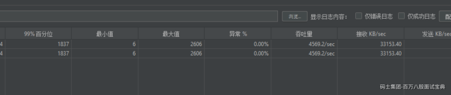

300个线程 30个初始化

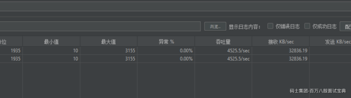

maxQueueSize=100

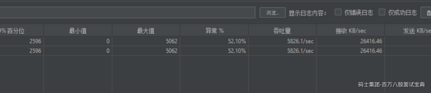

通过NIO2的方式来处理

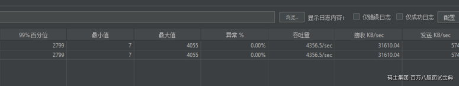
