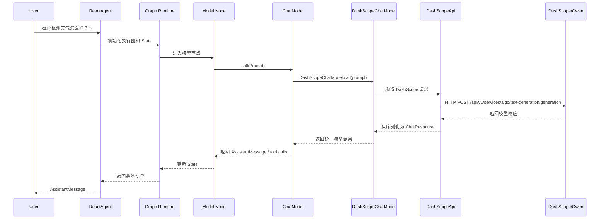
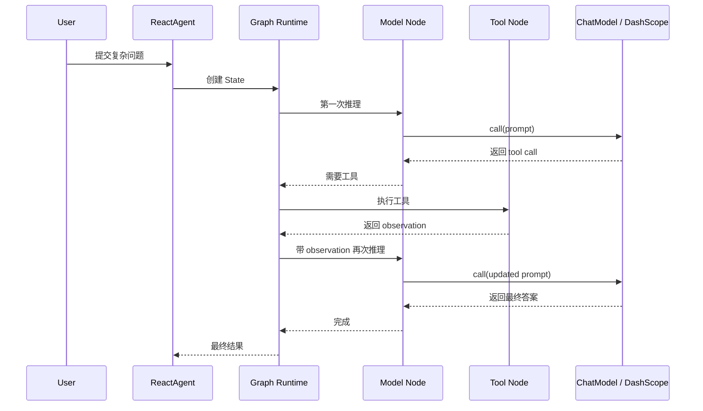
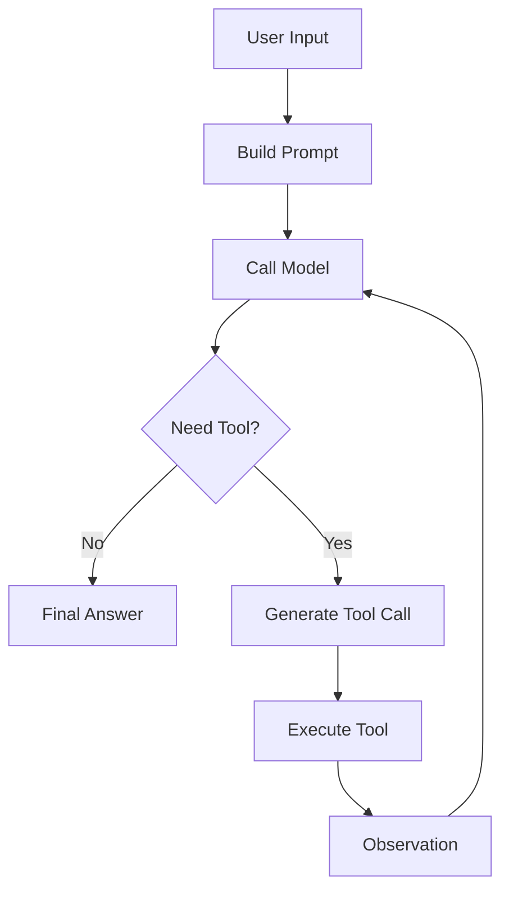
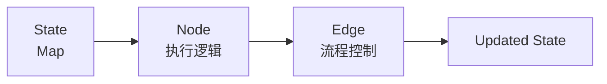
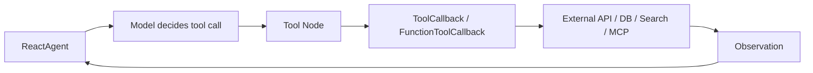
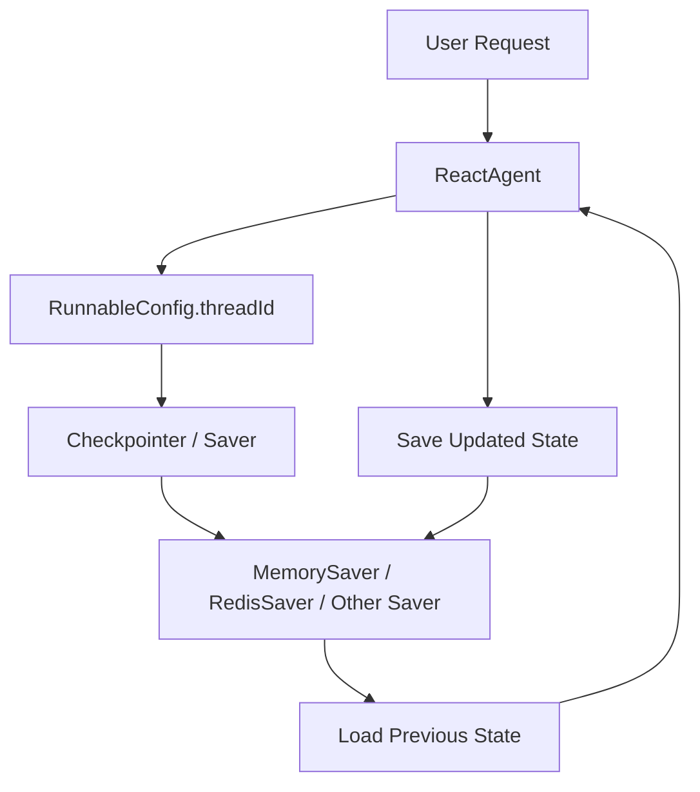
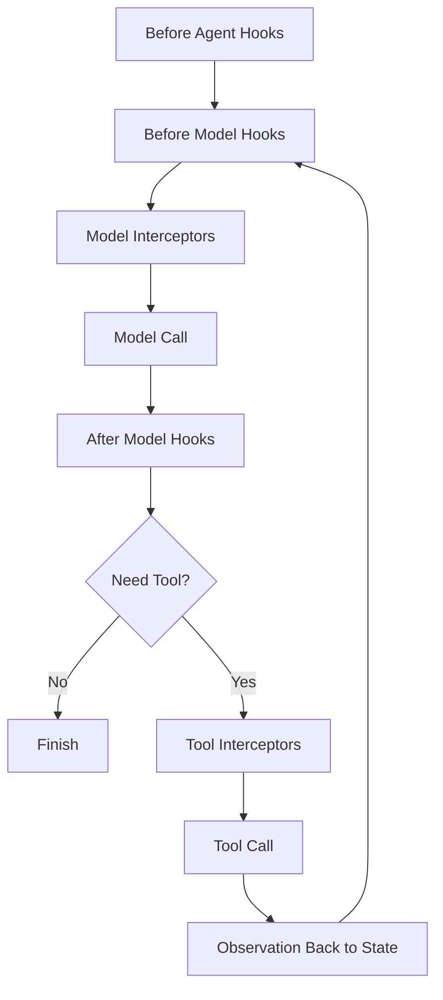
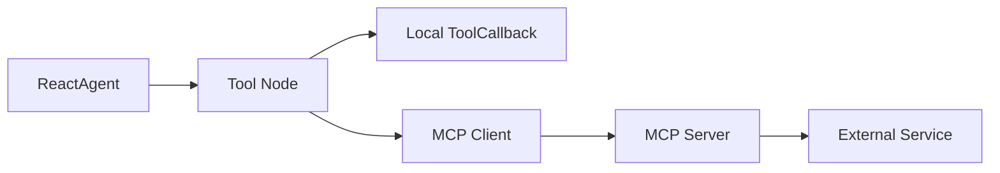
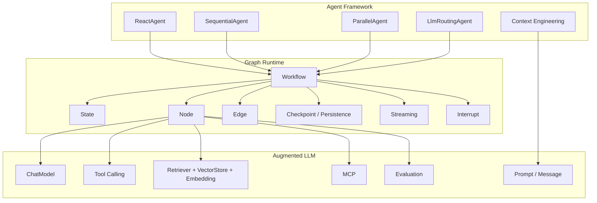

# Spring AI Alibaba Agent 架构图与使用详解

> [!info]
> 官方参考：
> - [Overview](https://java2ai.com/docs/overview/)
> - [Agents](https://java2ai.com/docs/frameworks/agent-framework/tutorials/agents/)
> - [Hooks / Interceptors](https://java2ai.com/docs/frameworks/agent-framework/tutorials/hooks/)
> - [Memory](https://java2ai.com/docs/frameworks/agent-framework/tutorials/memory/)
> - [DashScope ChatModel](https://java2ai.com/en/integration/chatmodels/dashScope/)
> - [Structured Output](https://java2ai.com/docs/frameworks/agent-framework/tutorials/structured-output/)
> - [MCP Overview](https://java2ai.com/en/integration/mcps/mcp-overview)

## 一、先说结论

Spring AI Alibaba 可以理解成三层：

1. `Agent Framework`
   面向业务开发，核心入口是 `ReactAgent`，也提供 `SequentialAgent`、`ParallelAgent`、`LlmRoutingAgent` 等多 Agent 模式。
2. `Graph Runtime`
   面向运行时编排。`ReactAgent` 本质上跑在 Graph Runtime 上，底层通过 `State + Node + Edge` 管理执行流。
3. `Augmented LLM`
   面向模型和 AI 原子能力，提供 `ChatModel`、`Prompt`、`Tool Calling`、`VectorStore`、`Retriever`、`Embedding`、`MCP` 等能力。

一句话记忆：

`Spring AI Alibaba = Agent 抽象 + Graph 编排运行时 + Spring AI 原子能力`

---

## 二、官方总架构图

![[spring-ai-alibaba-architecture-official.png]]

### 这张图的含义

- 最上层 `Agentic Framework` 是开发者直接编写 Agent 的地方。
- 中间层 `Graph Runtime` 是真正驱动 Agent 执行的引擎。
- 最下层 `Augmented LLM` 是模型、消息、工具、RAG、MCP 这些通用能力层。

---

## 三、怎么用：最小可运行版本

### 1. Maven 依赖

官方概览页给出的常见依赖坐标是：

```xml
<dependency>
    <groupId>com.alibaba.cloud.ai</groupId>
    <artifactId>spring-ai-alibaba-agent-framework</artifactId>
    <version>1.1.2.0</version>
</dependency>

<dependency>
    <groupId>com.alibaba.cloud.ai</groupId>
    <artifactId>spring-ai-alibaba-starter-dashscope</artifactId>
    <version>1.1.2.1</version>
</dependency>
```

> [!note]
> 版本可能会变，使用前以官方文档或仓库最新版本为准。

### 2. 最小代码

```java
import com.alibaba.cloud.ai.dashscope.api.DashScopeApi;
import com.alibaba.cloud.ai.dashscope.chat.DashScopeChatModel;
import com.alibaba.cloud.ai.graph.agent.ReactAgent;
import org.springframework.ai.chat.model.ChatModel;
import org.springframework.ai.chat.messages.AssistantMessage;

public class AgentExample {
    public static void main(String[] args) {
        DashScopeApi dashScopeApi = DashScopeApi.builder()
                .apiKey(System.getenv("AI_DASHSCOPE_API_KEY"))
                .build();

        ChatModel chatModel = DashScopeChatModel.builder()
                .dashScopeApi(dashScopeApi)
                .build();

        ReactAgent agent = ReactAgent.builder()
                .name("weather_agent")
                .model(chatModel)
                .instruction("You are a helpful weather forecast assistant.")
                .build();

        AssistantMessage result = agent.call("杭州天气怎么样？");
        System.out.println(result.getText());
    }
}
```

### 3. 你真正写代码时的理解方式

- `DashScopeApi`：底层 HTTP API client。
- `DashScopeChatModel`：把 DashScope 封装成 Spring AI 的 `ChatModel`。
- `ReactAgent`：在 `ChatModel` 之上增加 ReAct 循环、工具调用、记忆、Hook、Interceptor 等 Agent 能力。

---

## 四、从请求到 LLM，到底是怎么调的

这是最关键的一张图。

```mermaid
graph LR
    U[User Request] --> A[ReactAgent]
    A --> G[Graph Runtime]
    G --> MN[Model Node]
    MN --> CM[ChatModel Interface]
    CM --> DSM[DashScopeChatModel]
    DSM --> DSA[DashScopeApi]
    DSA --> HTTP[DashScope HTTP API]
    HTTP --> PATH[/api/v1/services/aigc/text-generation/generation]
    PATH --> QWEN[Qwen / DashScope Model]
```

### 逐层解释

#### 1. `ReactAgent`

- 这是业务层入口。
- 你调用的是 `agent.call(...)`、`agent.invoke(...)` 或带 `RunnableConfig` 的重载方法。

#### 2. `Graph Runtime`

- `ReactAgent` 实际不是直接“问模型一次”。
- 它会构建一个内部执行图。
- 图里最核心的节点是：
  - `Model Node`
  - `Tool Node`
  - 可能还有 Hook 介入点

#### 3. `ChatModel`

- `ReactAgent` 不直接依赖某家模型厂商。
- 它依赖 Spring AI 的统一接口：`ChatModel`。
- 所以底层可以替换成 `DashScopeChatModel`、`OpenAiChatModel` 等。

#### 4. `DashScopeChatModel`

- 这是 DashScope 的 Spring AI 适配实现。
- 它把 `Prompt`、`Message`、工具声明、结构化输出选项等转换成 DashScope 可识别的请求。

#### 5. `DashScopeApi`

- 这是更底层的 API client。
- 根据官方 DashScope 集成文档，默认 chat completion 路径是：

```text
/api/v1/services/aigc/text-generation/generation
```

- 也就是说，请求到 LLM 时，最终是由 `DashScopeApi` 去调用 DashScope 的 HTTP 接口。

---

## 五、用户请求的完整时序图



### 如果带工具调用，会多出一个循环



---

## 六、ReactAgent 的本质：ReAct 循环



### 这意味着什么

`ReactAgent` 不是传统的一问一答封装，而是一个循环执行器：

1. 先推理。
2. 决定是否调用工具。
3. 如果要工具，就调用工具。
4. 把工具结果作为 observation 回灌模型。
5. 继续推理，直到得到最终答案或达到停止条件。

---

## 七、Graph Runtime 为什么是核心

官方文档明确强调：

- `ReactAgent` 实际跑在 `Graph Runtime` 之上。
- Graph 的三要素是：
  - `State`
  - `Node`
  - `Edge`



### 1. State

- 整个执行流共享的数据容器。
- 官方文档把它描述为 `Map<String, Object>`。
- 里面通常放：
  - messages
  - tool results
  - custom context
  - retrieval context
  - runtime metadata

### 2. Node

- 执行单元。
- 常见包括：
  - 模型节点
  - 工具节点
  - 自定义业务节点
  - Hook 相关节点

### 3. Edge

- 流程转移规则。
- 可以是固定边，也可以是条件边。
- 例如：
  - 有工具调用就去 Tool Node
  - 没工具调用就结束
  - 人工审批通过再继续

---

## 八、怎么直接调模型，而不是调 Agent

如果你不需要 Agent 的循环能力，也可以直接用 `ChatModel`。

```java
import org.springframework.ai.chat.prompt.Prompt;
import org.springframework.ai.chat.messages.UserMessage;
import org.springframework.ai.chat.model.ChatResponse;

Prompt prompt = new Prompt(new UserMessage("给我讲个笑话"));
ChatResponse response = chatModel.call(prompt);
System.out.println(response.getResult().getOutput().getText());
```

### 流式调用

```java
import reactor.core.publisher.Flux;
import org.springframework.ai.chat.model.ChatResponse;
import org.springframework.ai.chat.prompt.Prompt;

Flux<ChatResponse> stream = chatModel.stream(new Prompt("Explain Java virtual threads"));
```

### 什么时候直接用 `ChatModel`

- 简单问答
- 不需要工具循环
- 不需要 Agent 状态
- 不需要 Hook / Interceptor / Memory / HITL

### 什么时候用 `ReactAgent`

- 需要多步推理
- 需要工具调用
- 需要 Memory
- 需要中断恢复
- 需要人工审批

---

## 九、Tools：工具是怎么接进去的

官方工具文档用的是 `ToolCallback` / `FunctionToolCallback` 思路。

```java
import org.springframework.ai.tool.ToolCallback;
import org.springframework.ai.tool.function.FunctionToolCallback;
import org.springframework.ai.chat.model.ToolContext;
import java.util.function.BiFunction;

public class SearchTool implements BiFunction<String, ToolContext, String> {
    @Override
    public String apply(String query, ToolContext context) {
        return "搜索结果: " + query;
    }
}

ToolCallback searchTool = FunctionToolCallback.builder("search", new SearchTool())
        .description("搜索工具")
        .build();

ReactAgent agent = ReactAgent.builder()
        .name("search_agent")
        .model(chatModel)
        .tools(searchTool)
        .build();
```

### 工具调用链



---

## 十、Memory：会话记忆怎么做

官方 Memory 教程的核心做法是：

1. 给 Agent 配一个 `Saver`
2. 每次调用传入 `RunnableConfig.threadId`

### 最小示例

```java
import com.alibaba.cloud.ai.graph.RunnableConfig;
import com.alibaba.cloud.ai.graph.checkpoint.savers.MemorySaver;

ReactAgent agent = ReactAgent.builder()
        .name("memory_agent")
        .model(chatModel)
        .saver(new MemorySaver())
        .build();

RunnableConfig config = RunnableConfig.builder()
        .threadId("session_001")
        .build();

agent.call("你好，我叫 Bob", config);
agent.call("你还记得我叫什么吗？", config);
```

### 记忆架构图



### 记忆的本质

- `threadId` 是会话 ID。
- `Saver` 是状态持久化介质。
- 没有 `threadId`，就很难把多轮会话串起来。
- 没有 `Saver`，就没有可恢复的持久状态。

---

## 十一、Structured Output：结构化输出怎么做

Spring AI Alibaba 官方推荐两种方式：

1. `outputType(Class<?>)`
2. `outputSchema(String)`

更推荐 `outputType`，因为简单、类型安全。

### 示例

```java
public class ContactInfo {
    private String name;
    private String email;
    private String phone;

    public String getName() { return name; }
    public void setName(String name) { this.name = name; }
    public String getEmail() { return email; }
    public void setEmail(String email) { this.email = email; }
    public String getPhone() { return phone; }
    public void setPhone(String phone) { this.phone = phone; }
}

ReactAgent agent = ReactAgent.builder()
        .name("contact_extractor")
        .model(chatModel)
        .outputType(ContactInfo.class)
        .saver(new MemorySaver())
        .build();
```

### 底层原理

- 如果底层模型支持原生结构化输出，框架优先走模型原生能力。
- 对 DashScopeChatModel，官方文档说明它支持原生结构化输出。
- 如果模型不支持原生结构化输出，框架会退化到 ToolCall 风格的格式化策略。

---

## 十二、Hooks 与 Interceptors：进阶控制点

这是 Spring AI Alibaba 比较强的一部分。

### 你可以怎么理解

- `Hook`
  更偏 Agent 级别控制，能参与 before/after agent、before/after model，还支持中断恢复。
- `Interceptor`
  更偏模型调用或工具调用拦截，适合日志、重试、缓存、护栏。

### 构建方式

```java
ReactAgent agent = ReactAgent.builder()
        .name("my_agent")
        .model(chatModel)
        .tools(searchTool)
        .hooks(loggingHook, messageTrimmingHook)
        .interceptors(guardrailInterceptor, retryInterceptor)
        .build();
```

### 执行顺序图



### 常见用途

- `SummarizationHook`
  长对话时自动摘要压缩上下文。
- `HumanInTheLoopHook`
  高风险工具调用前人工审批。
- `ModelCallLimitHook`
  限制模型调用次数，防止死循环和成本失控。
- `PIIDetectionHook`
  对敏感信息做检测与脱敏。
- `ContextEditingInterceptor`
  在发给模型前修改上下文。
- `ToolRetryInterceptor`
  工具失败时自动重试。

---

## 十三、MCP 在这套架构里怎么理解

MCP 是一种标准化的外部能力接入方式。

### 位置图



### 直观理解

- 本地工具：你自己写 Java 函数。
- MCP 工具：通过 MCP 协议访问外部服务。
- 对 Agent 来说，两者都可以表现为“可调用工具”。

### MCP 适合什么场景

- 统一接外部系统
- 减少自定义协议封装成本
- 把数据库、搜索、文档系统、内部服务标准化成 Agent 工具

---

## 十四、Streaming：为什么 Graph Runtime 里专门有它

因为 Agent 不是单步执行。

流式输出不只是“模型 token 流”这么简单，还可以包括：

- 当前节点执行进度
- 中间推理阶段
- 工具调用事件
- 最终答案逐步返回

所以在 Spring AI Alibaba 里，`Streaming` 是运行时能力，不只是 ChatModel 的附属功能。

---

## 十五、什么时候应该上 Graph API，而不是只用 ReactAgent

官方建议优先用 `ReactAgent`，但以下情况更适合直接上 Graph API：

- 需要非常复杂的流程编排
- 需要精确控制每个节点的逻辑
- 需要复杂分支和状态流转
- 需要更强可观测性和可恢复能力
- 需要多 Agent 工作流，不只是简单串并行

### 判断标准

如果你的需求是：

- “做一个能调用几个工具的智能助手”
  用 `ReactAgent`

- “做一个多阶段、有审批、有回滚、有并行分支的长流程系统”
  更适合 `Graph API`

---

## 十六、完整能力地图



---

## 十七、实战中最常见的 5 种写法

### 1. 单轮问答

- 直接用 `ChatModel.call()`

### 2. 带工具的单 Agent

- `ReactAgent.builder().tools(...).build()`

### 3. 带会话记忆的 Agent

- `.saver(new MemorySaver())`
- `RunnableConfig.builder().threadId("session")`

### 4. 需要严格 JSON 输出

- `.outputType(YourPojo.class)`

### 5. 需要生产级控制

- `.hooks(...)`
- `.interceptors(...)`
- `ModelCallLimitHook`
- `ToolRetryInterceptor`
- `HumanInTheLoopHook`

---

## 十八、面试时怎么讲这套架构

可以直接按下面的顺序回答：

1. `Spring AI Alibaba 分三层`
   上层是 Agent Framework，中层是 Graph Runtime，下层是基于 Spring AI 的 Augmented LLM。

2. `ReactAgent 不是简单聊天封装`
   它是一个基于 ReAct 的循环执行器，内部会在模型节点和工具节点之间反复迭代。

3. `请求到 LLM 的路径`
   业务代码调用 `ReactAgent`，再进入 `Graph Runtime`，到 `ChatModel` 接口，具体实现可能是 `DashScopeChatModel`，最终通过 `DashScopeApi` 调用 DashScope HTTP 接口。

4. `默认 DashScope chat 路径`
   官方 DashScope 集成文档给出的默认 completions path 是：
   `/api/v1/services/aigc/text-generation/generation`

5. `进阶能力`
   Memory、Structured Output、Hooks、Interceptors、Streaming、MCP、Human in the Loop、本质上都建立在 Graph Runtime 和 Spring AI 原子能力之上。

---

## 十九、最后再压缩成一句话

> [!summary]
> Spring AI Alibaba 的核心不是“封装了一次 LLM 调用”，而是“在 Spring AI 的模型与工具能力之上，提供了一个基于 Graph Runtime 的 Agent 执行框架”。`ReactAgent` 是它最常用的业务入口，而 `DashScopeChatModel -> DashScopeApi -> DashScope HTTP API` 是请求真正到达底层大模型服务的路径。
