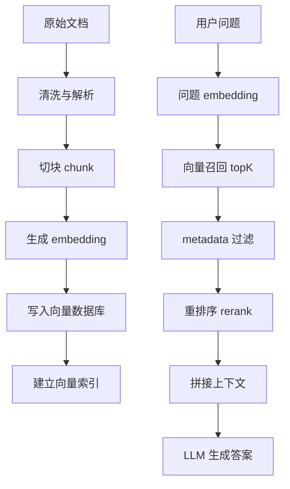

# 向量数据库总览与通用最佳实践

> [!info] 模块导航
> 上级：[[常用向量数据库使用方法与最佳实践]]；对比选型：[[向量数据库区别优缺点与选型]]。

向量数据库用于存储、索引和检索 embedding。embedding 是一组浮点数，用来表示文本、图片、音频、视频、代码或用户行为的语义特征。

传统数据库擅长：

1. 精确匹配：`id = 1`。
2. 范围查询：`created_at > '2026-01-01'`。
3. 结构化过滤：`status = 'active'`。
4. 聚合统计：`count`、`sum`、`group by`。

向量数据库擅长：

1. 语义相似度搜索：意思相近但关键词不同。
2. 推荐系统：找相似商品、相似文章、相似用户。
3. RAG 检索：从知识库中找最相关片段给大模型。
4. 多模态检索：以图搜图、以文搜图、以图搜文。
5. 异常检测：找离群向量或相似历史事件。

一句话：

> 向量数据库不是替代 MySQL、MongoDB、Redis，而是补足“语义相似度检索”这一类传统索引不擅长的能力。

## 2. 一个 RAG 向量检索系统的标准链路



核心对象：

| 对象 | 含义 |
|---|---|
| embedding model | 把文本、图片等转成向量的模型 |
| vector | embedding 结果，通常是 `float32[]` |
| dimension | 向量维度，例如 384、768、1024、1536、3072 |
| metric | 相似度计算方式，例如 cosine、dot product、L2 |
| collection / index / table | 一组向量数据的逻辑集合 |
| payload / metadata | 跟向量一起存储的业务字段 |
| ANN index | 近似最近邻索引，例如 HNSW、IVF、DiskANN |
| topK | 返回最相似的前 K 条 |
| filter | 结构化过滤，例如租户、权限、时间、类型 |
| reranker | 对初召结果重新排序的模型或规则 |

## 3. 选型前先问的 10 个问题

1. 数据量是多少：十万、百万、千万、十亿级？
2. QPS 和延迟要求是多少：后台批处理还是在线接口？
3. 是否需要 metadata 强过滤：租户、权限、时间、标签？
4. 是否需要混合检索：向量 + BM25 关键词？
5. 是否已有数据库主系统：PostgreSQL、MongoDB、Elasticsearch、Redis？
6. 是否需要云托管：团队是否愿意运维集群？
7. 是否需要多模态：图片、音频、视频、PDF 版面？
8. 是否需要频繁更新和删除：知识库是否实时变化？
9. 是否需要强一致事务：向量和业务数据是否必须同库事务？
10. 成本瓶颈在哪里：内存、磁盘、云服务、开发时间、运维人力？

## 4. 通用最佳实践

## 4.1 embedding 模型必须固定

同一个 collection 中的向量必须来自同一个 embedding 模型和同一个维度。不要把不同模型的向量混到同一个向量字段里。

错误做法：

```text
同一个 collection 里一半是 768 维，一半是 1536 维
同一个 collection 里一半来自中文模型，一半来自英文模型
同一个 collection 里升级模型后直接覆盖新老向量
```

正确做法：

1. 模型升级时新建 collection 或新建 vector 字段。
2. 保留 `embedding_model`、`embedding_version` 元数据。
3. 做双写和灰度检索，对比召回质量后再切流。
4. 不要只看向量库返回正常，要看业务答案质量。

## 4.2 chunk 不要只按固定长度切

RAG 的召回质量很大程度取决于切块。

建议：

1. 按标题、段落、列表、代码块、表格结构切。
2. 保留父标题路径，例如 `Java/SpringBoot/自动配置`。
3. 每块保留原文来源、页码、章节、更新时间。
4. 适当 overlap，避免答案跨块断裂。
5. 对代码、表格、合同、PDF 用专门解析策略。

常见 chunk 字段：

```json
{
  "doc_id": "springboot-principle",
  "chunk_id": "springboot-principle-0012",
  "title": "自动配置加载机制",
  "section_path": "SpringBoot框架原理篇/自动配置",
  "content": "自动配置的关键目标是...",
  "source": "Obsidian",
  "page": null,
  "updated_at": "2026-05-04",
  "embedding_model": "text-embedding-3-large"
}
```

## 4.3 metadata 不是装饰字段，是召回质量的一部分

向量相似度只能表达语义相近，不能表达所有业务约束。

必须放入 metadata 的常见字段：

| 字段 | 用途 |
|---|---|
| `tenant_id` | 多租户隔离 |
| `user_id` / `org_id` | 权限过滤 |
| `doc_id` | 文档级删除和更新 |
| `chunk_id` | 唯一定位 |
| `source` | 来源区分 |
| `created_at` / `updated_at` | 时间过滤和增量更新 |
| `category` | 类型过滤 |
| `language` | 语言过滤 |
| `embedding_model` | 模型版本治理 |
| `acl` | 权限控制 |

最佳实践：

1. 能过滤的业务条件，尽量不要交给 LLM 自己判断。
2. 多租户系统必须在向量检索阶段加 `tenant_id` 过滤。
3. 权限过滤要在召回阶段做，不要等召回后再让模型忽略。
4. 高频过滤字段要建 payload / metadata index。

## 4.4 向量召回后要 rerank

向量检索通常是第一阶段召回，不应该直接把 topK 原样塞给大模型。

推荐流程：

```text
向量召回 topK=30 或 50
-> metadata 过滤
-> reranker 重排 topN=5 到 10
-> 去重和压缩
-> 送入 LLM
```

rerank 的好处：

1. 修正向量相似度的粗排误差。
2. 提升精确匹配、数字、实体、术语的排序。
3. 降低无关上下文进入 prompt 的概率。
4. 在混合检索中融合关键词和语义信号。

## 4.5 混合检索通常比纯向量更稳

纯向量擅长语义，关键词擅长精确。

适合混合检索的场景：

1. 代码、API、类名、函数名。
2. 法律条款、合同编号、发票号。
3. 专有名词、型号、错误码。
4. 中英文混杂内容。
5. 用户查询既有自然语言又有关键词。

典型策略：

```text
向量检索 topK=50
BM25 检索 topK=50
合并去重
按权重融合
rerank
取 topN
```

## 4.6 向量索引是速度、召回率、成本的三角平衡

常见索引：

| 索引 | 特点 | 适用 |
|---|---|---|
| FLAT | 暴力精确搜索，召回最好，速度慢 | 小数据、评测基线 |
| HNSW | 图索引，低延迟，高召回，内存占用较高 | 在线搜索、百万到千万级常见 |
| IVF | 聚类分桶，内存较省，参数影响大 | 大数据量、可接受调参 |
| PQ / SQ | 压缩向量，省内存，牺牲精度 | 超大规模、成本敏感 |
| DiskANN | 磁盘友好，支持更大规模 | 大规模低内存场景 |

调参思路：

1. 先用 FLAT 或小样本做召回基线。
2. 再调 HNSW / IVF 的性能。
3. 用真实问题集评测，不只看 demo。
4. 同时记录 recall、latency、QPS、内存、磁盘、构建时间。
